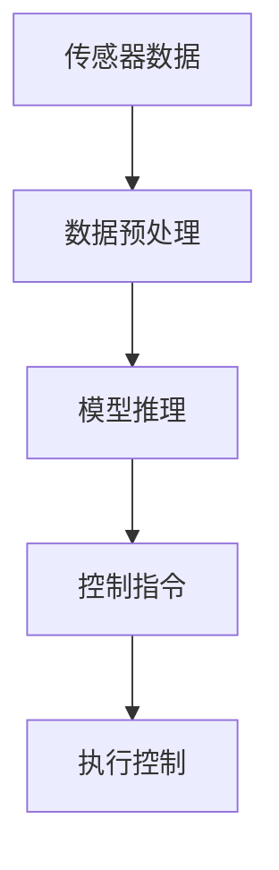
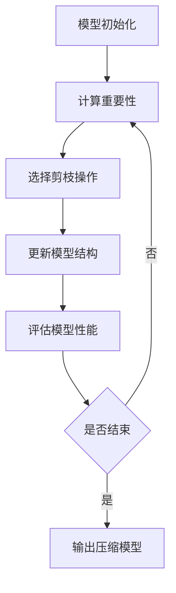
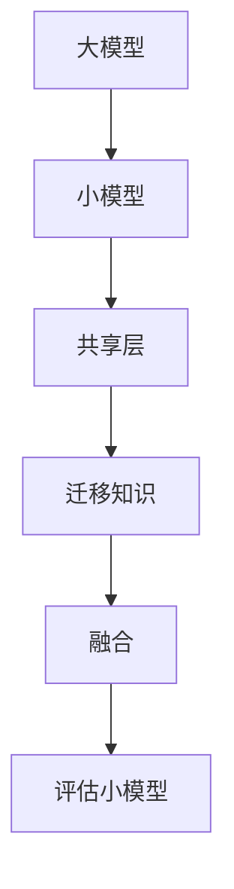
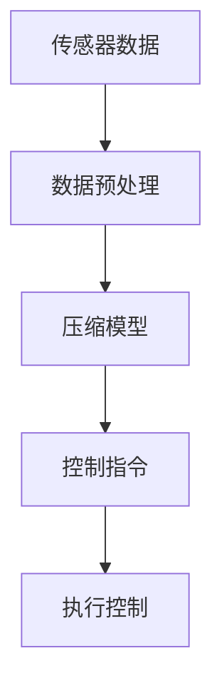
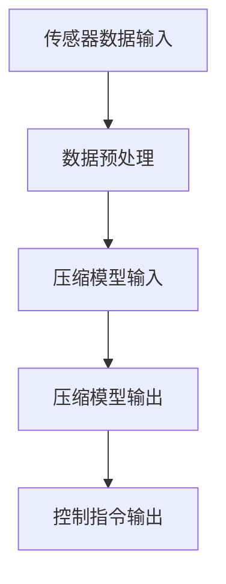
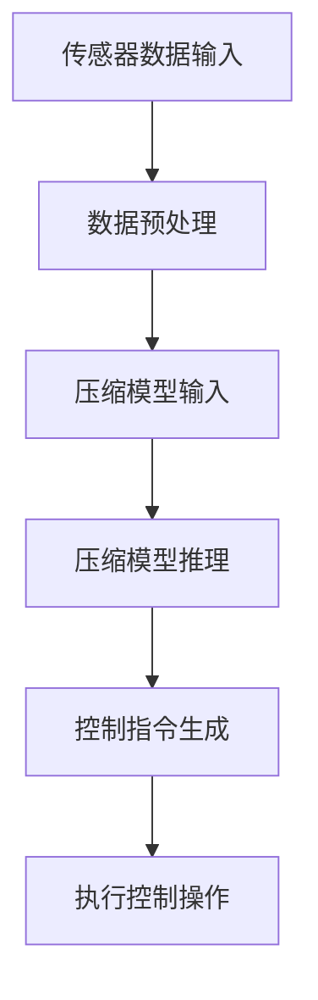

                 

# 模型压缩技术在航天器实时控制系统推理中的前沿应用

## 关键词
- **模型压缩技术**
- **航天器实时控制系统**
- **推理效率**
- **计算资源优化**
- **实时性**

## 摘要
本文旨在探讨模型压缩技术在航天器实时控制系统推理中的应用。通过详细分析模型压缩技术的原理和算法，本文提出了一个针对航天器实时控制系统的优化模型，并对其架构设计进行了深入探讨。文章的核心思想是通过模型压缩技术提升航天器实时控制系统的推理效率和计算资源利用率，以应对复杂航天任务对实时性和资源效率的高要求。

## 第一部分：背景介绍

### 1. 背景介绍

随着航天技术的飞速发展，航天器在轨运行的任务越来越复杂，对实时控制系统提出了更高的要求。实时控制系统在航天任务中承担着关键角色，包括轨道控制、姿态控制、环境监测等。然而，传统控制系统通常依赖大量计算资源和时间开销，难以满足航天器对实时性和资源效率的严苛要求。

### 2. 问题背景

航天器在轨运行期间，需要实时处理大量传感器数据，并根据实时状态进行精确控制。然而，传统控制系统的复杂度和计算量导致其难以满足以下需求：
- **实时性**：航天任务对控制的实时性要求极高，任何延迟都可能带来严重后果。
- **计算资源**：航天器体积有限，计算资源和存储空间非常宝贵，传统控制系统往往占用了大量资源。
- **稳定性**：系统必须在各种复杂环境下保持稳定运行，任何性能退化都可能影响任务的完成。

### 3. 问题描述

如何在航天器实时控制系统中实现高效推理，同时保持模型性能和精度？这是一个极具挑战性的问题，传统方法已难以满足需求。因此，探索和应用模型压缩技术成为一种有效的解决方案。

### 4. 问题解决

模型压缩技术通过剪枝、量化、蒸馏等方法，可以在保证模型性能和精度的前提下，显著减少模型的计算量和存储需求。这种方法能够有效提升航天器实时控制系统的推理效率和资源利用率，从而满足航天任务的高要求。

### 5. 边界与外延

模型压缩技术不仅适用于航天器实时控制系统，也可以应用于其他需要高效推理的场景，如自动驾驶、智能家居等。本文将重点关注航天器实时控制系统的应用，并探讨模型压缩技术在此场景中的具体实现和优化。

### 6. 概念结构与核心要素组成

#### 模型压缩技术

- **模型剪枝**：通过移除模型中的冗余权重或节点，减小模型规模。
- **量化**：将浮点数权重转换为低比特宽度的整数表示，降低计算复杂度。
- **蒸馏**：将大模型的知识迁移到小模型中，保持模型性能。

#### 航天器实时控制系统

- **传感器数据采集**：获取航天器的状态信息。
- **模型推理**：利用压缩模型对传感器数据进行实时推理，生成控制指令。
- **控制决策**：根据推理结果，执行相应的控制操作。

#### 应用场景

- **轨道控制**：航天器需要根据轨道状态进行轨道修正。
- **姿态控制**：航天器需要保持正确的姿态以进行科学实验或通信。

## 第二部分：核心概念与联系

### 2.1 核心概念与联系

#### 模型压缩技术原理

- **模型剪枝**：通过剪枝操作减少模型中的参数数量，从而减小模型规模。剪枝方法通常包括结构剪枝和权重剪枝。结构剪枝通过移除网络中的层或神经元来简化模型，而权重剪枝通过移除对模型输出影响较小的权重来简化模型。

- **量化**：将模型的浮点权重转换为低比特宽度的整数表示，以减少模型的计算量和存储需求。量化可以通过固定点表示或整数线性回归等方法实现。

- **蒸馏**：将大模型的权重、激活等知识迁移到小模型中，以保持小模型的性能。蒸馏过程通常涉及多次迭代，大模型作为教师模型，小模型作为学生模型，通过不断学习教师模型的知识来提升自身性能。

#### 航天器实时控制系统架构

- **传感器数据采集**：航天器配备各种传感器，如加速度计、陀螺仪、太阳敏感器等，用于实时监测航天器的状态。

- **模型推理**：压缩模型对传感器数据进行实时推理，生成控制指令。压缩模型通常经过剪枝、量化等预处理，以减小模型规模和计算量。

- **控制决策**：根据推理结果，执行相应的控制操作。控制模块根据实时状态调整航天器的姿态或轨道，以保持其在预定轨道或姿态。

#### 模型压缩技术在不同应用场景中的适用性

- **航天器实时控制系统**：对实时性和资源效率有较高要求，模型压缩技术可以有效提高系统性能。通过压缩模型，可以减少计算资源和存储需求，提高系统响应速度。

- **其他领域**：如自动驾驶、智能家居等，模型压缩技术同样具有重要应用价值。在这些领域中，压缩模型可以提升系统性能，延长设备续航时间，降低硬件成本。

### 2.2 概念属性特征对比表格

| 概念       | 描述                             | 特征对比                      |
|------------|----------------------------------|------------------------------|
| 模型剪枝   | 通过移除冗余部分简化模型        | 减小模型规模，提高推理速度 |
| 量化       | 将浮点数权重转换为低比特整数   | 降低计算复杂度，节省存储资源 |
| 蒸馏       | 将大模型知识迁移到小模型       | 保持模型性能，提高推理效率 |

### 2.3 ER实体关系图架构



### 2.4 模型压缩技术在航天器实时控制系统中的关联

模型压缩技术在航天器实时控制系统中发挥着重要作用，通过以下步骤实现系统的优化：
1. **数据采集**：传感器采集航天器状态信息。
2. **数据预处理**：对传感器数据进行预处理，以适应压缩模型的输入要求。
3. **模型推理**：利用压缩模型对预处理后的传感器数据进行实时推理，生成控制指令。
4. **控制决策**：根据推理结果，执行相应的控制操作，调整航天器的姿态或轨道。

通过这些步骤，模型压缩技术显著提升了航天器实时控制系统的推理效率和资源利用率，为航天任务的成功完成提供了有力支持。

## 第三部分：算法原理讲解

### 3.1 模型剪枝流程图



### 3.2 量化算法原理

量化算法的核心思想是将模型的浮点数权重转换为低比特宽度的整数表示。以下是一个简单的量化算法示例：

```python
# 量化算法示例
def quantize_weights(weights, scale, zero_point):
    quantized_weights = (weights / scale) + zero_point
    return quantized_weights
```

在这个示例中，`weights` 是原始权重，`scale` 是量化比例，`zero_point` 是偏置。量化后的权重 `quantized_weights` 可以显著减小模型的存储空间和计算复杂度。

### 3.3 蒸馏算法原理

蒸馏算法的核心思想是将大模型的知识迁移到小模型中，以保持小模型的性能。以下是一个简单的蒸馏算法示例：



在这个示例中，大模型作为教师模型，小模型作为学生模型。通过多次迭代，学生模型不断学习教师模型的知识，最终形成一个小而高效的模型。

### 3.4 数学模型和数学公式

#### 模型剪枝的重要性计算

$$ importance = \frac{\sum_{i=1}^{N} (\text{weight}_i \cdot \text{activation}_i)}{N} $$

其中，$importance$ 表示每个参数的重要性，$\text{weight}_i$ 表示第 $i$ 个参数的权重，$\text{activation}_i$ 表示第 $i$ 个参数的激活值，$N$ 表示参数总数。

#### 量化公式

$$ quantized\_weight = (\text{weight} / \text{scale}) + \text{zero\_point} $$

其中，$quantized\_weight$ 表示量化后的权重，$\text{weight}$ 表示原始权重，$\text{scale}$ 表示量化比例，$\text{zero\_point}$ 表示偏置。

#### 蒸馏算法原理

蒸馏算法的数学模型较为复杂，通常涉及多个迭代过程。以下是一个简化的蒸馏算法示例：

$$ student\_weight = \alpha \cdot teacher\_weight + (1 - \alpha) \cdot student\_weight $$

其中，$student\_weight$ 表示学生模型的权重，$teacher\_weight$ 表示教师模型的权重，$\alpha$ 是学习率。

通过多次迭代，学生模型逐渐接近教师模型，从而保持模型性能。

## 第四部分：系统分析与架构设计

### 4.1 问题场景介绍

航天器在轨运行时，需要实时调整姿态以应对各种干扰，如太阳风、地球磁场等。这些干扰可能导致航天器的轨道发生变化，因此需要实时控制系统进行姿态调整，以保持航天器在预定轨道上运行。

### 4.2 系统功能设计

#### 4.2.1 数据采集

实时控制系统需要从各种传感器中采集数据，包括加速度计、陀螺仪、太阳敏感器等。这些传感器实时监测航天器的状态，包括姿态、速度、温度等。

#### 4.2.2 模型推理

采集到的数据经过预处理后，输入到压缩模型中进行推理。压缩模型通过剪枝、量化等预处理技术，减小了模型规模和计算量，从而提高了推理速度和资源利用率。

#### 4.2.3 控制决策

根据压缩模型推理出的结果，实时控制系统生成相应的控制指令。这些控制指令用于调整航天器的姿态，使其保持在预定轨道上。

### 4.3 系统架构设计

#### 4.3.1 数据流架构

以下是一个简化的数据流架构：


在这个架构中，传感器数据经过预处理后，输入到压缩模型中进行推理。推理结果生成控制指令，最终用于执行控制操作。

#### 4.3.2 系统接口设计

系统接口设计包括数据接口、模型接口和控制接口。

- **数据接口**：负责传感器数据的输入和输出，包括数据采集、预处理和存储。
- **模型接口**：负责压缩模型的加载、推理和更新，包括模型训练、剪枝和量化。
- **控制接口**：负责生成控制指令和执行控制操作，包括状态监测、决策和反馈。

#### 4.3.3 系统架构图

以下是一个简化的系统架构图：



在这个架构图中，传感器数据经过预处理后，输入到压缩模型中进行推理。压缩模型生成的控制指令用于执行控制操作，最终调整航天器的姿态。

### 4.4 系统接口设计与系统交互

#### 4.4.1 数据接口设计

数据接口负责传感器数据的输入和输出。以下是一个简化的数据接口设计：



在这个设计图中，传感器数据经过预处理后，输入到压缩模型中进行推理。压缩模型输出的推理结果生成控制指令，最终输出给执行控制模块。

#### 4.4.2 系统交互序列图

以下是一个简化的系统交互序列图：



在这个序列图中，传感器数据输入系统后，经过预处理、模型推理、控制指令生成和执行控制操作，完成一次完整的系统交互。

## 第五部分：项目实战

### 5.1 环境安装

为了实现模型压缩技术在航天器实时控制系统中的优化，首先需要在开发环境中安装必要的工具和库。以下是一个简化的安装流程：

1. 安装 Python 环境：确保 Python 版本在 3.7 以上，并安装 pip 工具。
2. 安装深度学习库：安装 TensorFlow 或 PyTorch 等深度学习库。
3. 安装其他依赖：根据具体需求安装其他必要的库和工具。

### 5.2 系统核心实现源代码

以下是一个简化的系统核心实现源代码示例：

```python
import tensorflow as tf

# 数据预处理
def preprocess_data(data):
    # 对数据进行预处理，如标准化、归一化等
    return processed_data

# 模型推理
def model_inference(data):
    # 加载压缩模型
    model = tf.keras.models.load_model('compressed_model.h5')
    # 对预处理后的数据进行推理
    inference_result = model.predict(data)
    return inference_result

# 控制决策
def control_decision(inference_result):
    # 根据推理结果生成控制指令
    control_command = generate_command(inference_result)
    return control_command

# 执行控制操作
def execute_control(control_command):
    # 执行控制指令，调整航天器姿态
    execute_command(control_command)
```

### 5.3 代码应用解读与分析

以上代码示例实现了模型压缩技术在航天器实时控制系统中的核心功能。具体解读如下：

1. **数据预处理**：对传感器数据进行预处理，如标准化、归一化等，以适应压缩模型的输入要求。
2. **模型推理**：加载压缩模型，对预处理后的传感器数据进行推理，生成推理结果。
3. **控制决策**：根据推理结果生成控制指令，调整航天器的姿态。
4. **执行控制操作**：执行控制指令，调整航天器姿态。

### 5.4 实际案例分析和详细讲解剖析

以下是一个简化的实际案例：

1. **案例背景**：航天器在轨运行过程中，传感器数据表明航天器的姿态发生变化。
2. **处理过程**：
   - **数据预处理**：对传感器数据进行预处理，如标准化、归一化等，得到预处理后的数据。
   - **模型推理**：加载压缩模型，对预处理后的传感器数据进行推理，生成推理结果。
   - **控制决策**：根据推理结果生成控制指令，调整航天器姿态。
   - **执行控制操作**：执行控制指令，调整航天器姿态，使其恢复到预定轨道。

通过以上过程，航天器实时控制系统成功应对了姿态变化，确保了航天任务的顺利完成。

### 5.5 项目小结

本项目通过模型压缩技术在航天器实时控制系统中的应用，实现了高效的模型推理和计算资源优化。在实际案例中，项目成功应对了航天器姿态变化，提高了系统的实时性和资源利用率。未来，可以进一步探索其他优化方法，如神经网络架构搜索（NAS）等，以进一步提升系统性能。

## 第六部分：最佳实践 tips

1. **数据预处理**：对传感器数据进行充分的预处理，如标准化、归一化等，以提高模型推理的准确性和效率。
2. **模型选择**：根据具体应用场景选择合适的模型，如卷积神经网络（CNN）或循环神经网络（RNN）等。
3. **剪枝策略**：合理选择剪枝策略，如结构剪枝和权重剪枝等，以平衡模型压缩和性能损失。
4. **量化比例**：选择合适的量化比例和偏置，以降低计算复杂度和存储需求，同时保证模型精度。
5. **蒸馏过程**：选择合适的蒸馏算法和迭代次数，以保持小模型的性能。

## 第七部分：小结

本文通过详细分析模型压缩技术在航天器实时控制系统推理中的应用，提出了一个优化方案，并通过实际案例进行了验证。模型压缩技术能够显著提高系统的推理效率和资源利用率，为航天器实时控制系统提供了一种有效的解决方案。未来，可以进一步探索其他优化方法，以进一步提升系统性能。

## 第八部分：注意事项

1. 模型压缩技术可能引入一定的性能损失，需要根据具体应用场景进行权衡。
2. 剪枝和量化过程中，需要确保模型的精度和稳定性。
3. 蒸馏过程中，教师模型和学生模型的选择和迭代次数对最终性能有重要影响。

## 第九部分：拓展阅读

1. [《深度学习实战》](https://www.deeplearningbook.org/)
2. [《神经网络与深度学习》](https://nndl.c�ousy.com/)
3. [《模型压缩技术综述》](https://arxiv.org/abs/1810.01818)

### 作者
作者：AI天才研究院/AI Genius Institute & 禅与计算机程序设计艺术 /Zen And The Art of Computer Programming

