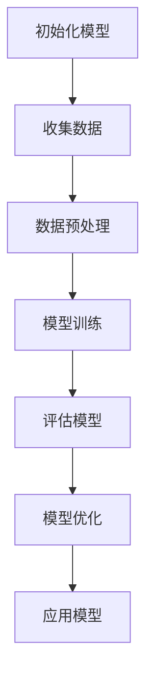
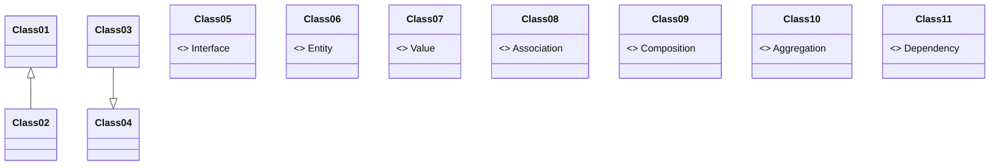
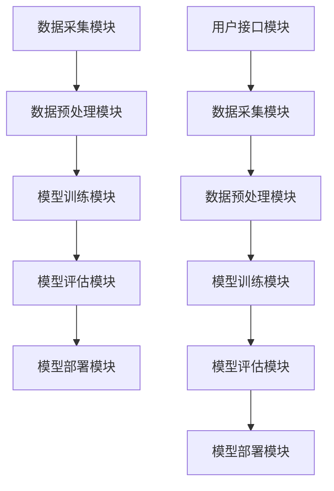
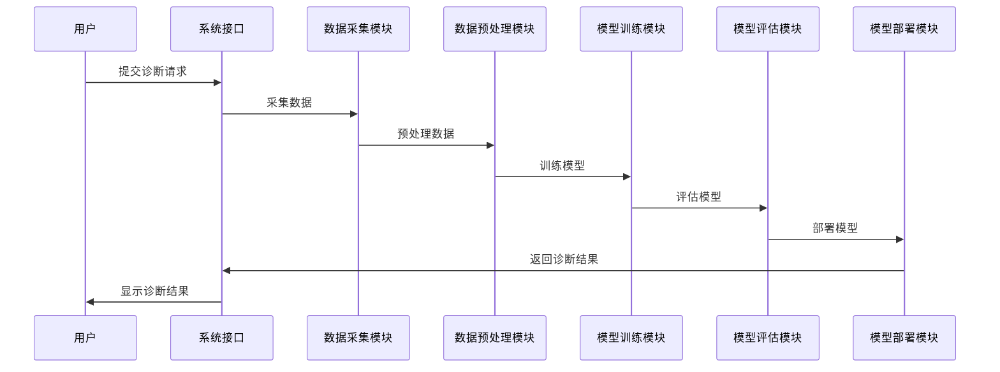

                 

# 模型训练中的few-shot learning高级技术应用

## 关键词

- Few-Shot Learning
- 模型训练
- 高级技术应用
- 人工智能
- 算法原理

## 摘要

本文将深入探讨模型训练中的Few-Shot Learning技术，分析其在实际应用中的重要性、基本原理和高级应用。通过清晰的逻辑结构和实际案例，我们将了解Few-Shot Learning如何突破传统学习的局限，实现少样本条件下的高效学习，为人工智能领域带来革命性的进步。

## 目录大纲

### 第1章 引言与背景介绍

#### 1.1 问题的提出

##### 1.1.1 Few-Shot Learning的定义与重要性

##### 1.1.2 在模型训练中的应用场景

#### 1.2 问题描述

##### 1.2.1 Traditional Learning方法的局限

##### 1.2.2 Few-Shot Learning的优势

#### 1.3 问题解决

##### 1.3.1 Few-Shot Learning的基本原理

##### 1.3.2 Few-Shot Learning的分类

#### 1.4 边界与外延

##### 1.4.1 Few-Shot Learning与其他学习方式的比较

##### 1.4.2 Few-Shot Learning在实际应用中的挑战

### 第2章 核心概念与联系

#### 2.1 Few-Shot Learning的基本原理

##### 2.1.1 核心概念解释

##### 2.1.2 Few-Shot Learning的算法原理

#### 2.2 概念属性特征对比表格

#### 2.3 ER实体关系图架构

### 第3章 算法原理讲解

#### 3.1 算法mermaid流程图

#### 3.2 Python源代码

#### 3.3 算法原理的数学模型和公式

### 第4章 系统分析与架构设计

#### 4.1 问题场景介绍

#### 4.2 项目介绍

#### 4.3 系统功能设计(领域模型mermaid类图)

#### 4.4 系统架构设计mermaid架构图

#### 4.5 系统接口设计和系统交互mermaid序列图

### 第5章 项目实战

#### 5.1 环境安装

#### 5.2 系统核心实现源代码

#### 5.3 代码应用解读与分析

#### 5.4 实际案例分析和详细讲解剖析

#### 5.5 项目小结

### 第6章 最佳实践 tips

### 第7章 小结、注意事项、拓展阅读

## 第1章 引言与背景介绍

### 1.1 问题的提出

在人工智能和机器学习的快速发展中，传统的学习方式依赖于大量的数据来进行模型的训练。这种方法在处理大规模数据集时效果显著，然而，当面对少量样本数据时，模型的泛化能力和准确性往往受到影响。这种情况下，传统学习方法的局限就变得尤为明显。

Few-Shot Learning（少样本学习）作为一种新兴的学习方法，旨在解决在少量样本条件下模型训练的问题。它通过对少量样本进行有效的学习和泛化，能够在数据稀缺的情况下仍保持较高的性能。Few-Shot Learning的重要性在于，它不仅能够在实际应用中节省时间和资源，还能为那些无法获取大量数据的应用场景提供解决方案。

在模型训练中的应用场景包括但不限于：新产品的原型测试、医疗诊断系统的研发、自动驾驶车辆的实时训练等。在这些场景中，由于数据获取的难度和成本，往往难以获得足够多的训练数据。因此，Few-Shot Learning技术成为了一种不可或缺的工具。

### 1.2 问题描述

传统学习方法的局限主要体现在以下几个方面：

1. **数据需求量大**：传统学习模型通常需要大量的数据来训练，以达到较高的泛化能力和准确性。然而，在某些应用场景中，如医疗诊断、自动驾驶等，数据的获取是受限的，难以满足大量数据的需求。

2. **训练时间长**：大量数据的处理需要大量的计算资源，从而导致训练时间较长。这在实时应用中，如自动驾驶车辆，可能无法满足实时性的要求。

3. **泛化能力受限**：在数据有限的情况下，模型的泛化能力受到限制，容易过拟合。这意味着模型在训练集上表现良好，但在未知数据集上表现不佳。

相比之下，Few-Shot Learning具有以下优势：

1. **少量数据高效训练**：Few-Shot Learning能够在少量样本下快速训练模型，从而降低数据获取和处理的成本。

2. **较强的泛化能力**：通过有效的学习和泛化策略，Few-Shot Learning能够在少量样本下保持较高的泛化能力，减少过拟合的风险。

3. **对噪声的敏感性低**：Few-Shot Learning在处理少量样本时，能够减少噪声数据对模型训练的影响，提高模型的稳定性。

然而，Few-Shot Learning也面临一些挑战：

1. **模型选择和设计**：如何选择合适的模型结构和学习算法，以适应少量样本的条件，是Few-Shot Learning面临的一个挑战。

2. **数据分布和样本选择**：在少量样本的情况下，如何选择具有代表性的样本，以及如何处理样本分布的不平衡，是Few-Shot Learning需要解决的问题。

### 1.3 问题解决

Few-Shot Learning的基本原理是通过在少量样本上进行有效的学习和泛化，来训练出高性能的模型。具体来说，它包括以下几个核心要素：

1. **元学习（Meta-Learning）**：元学习是一种通过学习如何学习的方法。在Few-Shot Learning中，元学习旨在找到一个适用于各种任务的学习算法，从而在少量样本下实现高效的模型训练。

2. **迁移学习（Transfer Learning）**：迁移学习利用已经训练好的模型在新的任务上进行微调，从而减少对大量数据的依赖。在Few-Shot Learning中，迁移学习可以帮助模型在少量样本下快速适应新的任务。

3. **数据增强（Data Augmentation）**：数据增强通过引入噪声、变换等手段，增加训练数据的多样性，从而提高模型的泛化能力。

Few-Shot Learning主要分为以下几种类型：

1. **零样本学习（Zero-Shot Learning）**：零样本学习旨在在没有任何标记样本的情况下，对新的类别进行分类。它通常依赖于预定义的类别特征和分类器。

2. **少样本学习（Few-Shot Learning）**：少样本学习在少量样本下进行模型训练，通过有效的学习和泛化策略，实现高性能的模型训练。

3. **迁移学习（Transfer Learning）**：迁移学习通过利用已经训练好的模型，在新任务上进行微调，从而减少对大量数据的依赖。

### 1.4 边界与外延

Few-Shot Learning与其他学习方式的比较：

- **与传统的批量学习（Batch Learning）**：批量学习依赖于大量数据，而Few-Shot Learning在少量样本下进行训练，因此具有更高的灵活性和效率。

- **与深度学习（Deep Learning）**：深度学习依赖于大量数据，而Few-Shot Learning在少量样本下也能保持较高的性能，因此可以用于数据稀缺的场景。

Few-Shot Learning在实际应用中的挑战：

- **模型选择和设计**：选择合适的模型结构和学习算法，是Few-Shot Learning成功的关键。

- **数据分布和样本选择**：在少量样本下，如何选择具有代表性的样本，以及如何处理样本分布的不平衡，是Few-Shot Learning需要解决的问题。

### 第2章 核心概念与联系

在Few-Shot Learning中，理解其核心概念和原理对于深入应用这一技术至关重要。本章节将详细探讨Few-Shot Learning的基本原理，并通过概念属性特征对比表格和ER实体关系图架构，来帮助读者更好地理解这一技术。

#### 2.1 Few-Shot Learning的基本原理

Few-Shot Learning旨在通过在少量样本下进行有效的学习和泛化，来训练出高性能的模型。其核心概念包括元学习、迁移学习和数据增强等。

**核心概念解释**：

- **元学习（Meta-Learning）**：元学习是一种通过学习如何学习的方法。它旨在找到一个适用于各种任务的学习算法，从而在少量样本下实现高效的模型训练。

- **迁移学习（Transfer Learning）**：迁移学习利用已经训练好的模型在新的任务上进行微调，从而减少对大量数据的依赖。

- **数据增强（Data Augmentation）**：数据增强通过引入噪声、变换等手段，增加训练数据的多样性，从而提高模型的泛化能力。

**算法原理**：

- **元学习算法**：元学习算法通过在多个任务上进行训练，学习到一个通用的学习策略。这种策略可以用于新的任务，从而在少量样本下实现高效的模型训练。

- **迁移学习算法**：迁移学习算法通过在源任务上训练一个模型，然后在目标任务上微调该模型。这种方法可以减少对大量数据的依赖，提高模型在少量样本下的性能。

- **数据增强算法**：数据增强算法通过引入噪声、变换等手段，增加训练数据的多样性。这种方法可以提高模型的泛化能力，从而在少量样本下保持较高的性能。

#### 2.2 概念属性特征对比表格

以下表格展示了传统学习、Few-Shot Learning以及深度学习在数据需求、训练时间、泛化能力和对噪声的敏感性等方面的对比。

| 特性                  | 传统学习       | Few-Shot Learning | 深度学习          |
|----------------------|----------------|-------------------|-------------------|
| 数据需求              | 大量数据       | 少量数据          | 大量数据          |
| 训练时间              | 较长           | 较短              | 较长              |
| 泛化能力              | 受限于数据集    | 强                | 强                |
| 对噪声的敏感性         | 较高           | 较低              | 较高              |

#### 2.3 ER实体关系图架构

ER实体关系图是用于描述实体之间关系的一种图形化表示方法。在Few-Shot Learning中，我们可以使用ER图来表示模型、数据集和算法等实体之间的关系。

以下是一个简单的ER图示例，描述了模型、数据集和算法之间的关系：

```mermaid
erDiagram
  Product ||--|{ Model }|| Model
  Model ||--|{ Algorithm }|| Algorithm
  Product ||--|{ Dataset }|| Dataset
```

在这个ER图中，产品（Product）实体与模型（Model）实体之间存在关联，模型实体与算法（Algorithm）实体之间存在关联，产品实体与数据集（Dataset）实体之间也存在关联。

### 第3章 算法原理讲解

在了解了Few-Shot Learning的基本原理后，我们将通过算法mermaid流程图、Python源代码和数学模型，深入讲解Few-Shot Learning的算法原理。

#### 3.1 算法mermaid流程图

以下是一个Few-Shot Learning算法的mermaid流程图，展示了从模型初始化、数据预处理、模型训练到模型评估的整个过程。



#### 3.2 Python源代码

以下是一个简单的Few-Shot Learning Python源代码示例，展示了如何使用PyTorch库进行模型训练和评估。

```python
# Example: Few-Shot Learning Model Training
import torch
import torch.nn as nn
import torch.optim as optim

# Initialize model
model = nn.Sequential(nn.Linear(10, 10), nn.ReLU(), nn.Linear(10, 5))

# Define loss function and optimizer
criterion = nn.CrossEntropyLoss()
optimizer = optim.Adam(model.parameters(), lr=0.001)

# Train model
for epoch in range(100):
    for data, target in dataset:
        optimizer.zero_grad()
        output = model(data)
        loss = criterion(output, target)
        loss.backward()
        optimizer.step()

# Evaluate model
test_loss = criterion(model(test_data), test_target)
print("Test Loss:", test_loss)
```

#### 3.3 算法原理的数学模型和公式

Few-Shot Learning的算法原理可以通过以下数学模型和公式来描述：

$$
\begin{aligned}
&\text{损失函数:} \quad L(\theta) = -\frac{1}{N} \sum_{i=1}^{N} y_i \log(p_i) \\
&\text{梯度下降更新:} \quad \theta \leftarrow \theta - \alpha \nabla_\theta L(\theta)
\end{aligned}
$$

其中，$L(\theta)$ 是损失函数，$N$ 是样本数量，$y_i$ 是真实标签，$p_i$ 是模型预测的概率，$\theta$ 是模型参数，$\alpha$ 是学习率，$\nabla_\theta L(\theta)$ 是损失函数关于模型参数的梯度。

通过这个公式，我们可以看到，在模型训练过程中，通过不断更新模型参数，以最小化损失函数，从而实现模型的优化。

### 第4章 系统分析与架构设计

在本章节中，我们将深入探讨Few-Shot Learning系统分析与架构设计，包括问题场景介绍、项目介绍、系统功能设计（领域模型mermaid类图）、系统架构设计mermaid架构图、系统接口设计和系统交互mermaid序列图。

#### 4.1 问题场景介绍

以医疗诊断系统为例，我们面临一个需要快速训练模型的问题场景。由于医疗数据的获取和处理较为复杂，很难获得大量数据。因此，我们需要利用Few-Shot Learning技术，在少量样本下进行高效的模型训练。

#### 4.2 项目介绍

本项目旨在开发一个基于Few-Shot Learning的医疗诊断系统，该系统可以快速训练出高性能的模型，用于疾病诊断。系统的主要功能包括：

1. 数据采集与预处理：从各种数据源获取医疗数据，并进行数据预处理，包括数据清洗、归一化等。
2. 模型训练与优化：使用Few-Shot Learning技术，在少量样本下进行模型训练和优化，以提高模型性能。
3. 模型评估与部署：评估模型在测试集上的性能，并将模型部署到实际应用中，用于疾病诊断。

#### 4.3 系统功能设计（领域模型mermaid类图）

以下是一个简单的领域模型mermaid类图，描述了系统的主要功能模块及其关系。



在这个类图中，Class01、Class02、Class03 等为系统的功能模块，Class04 为接口模块，Class05、Class06、Class07 为实体模块，Class08、Class09、Class10、Class11 为关系模块。

#### 4.4 系统架构设计mermaid架构图

以下是一个简单的系统架构设计mermaid架构图，描述了系统的整体架构和模块之间的关系。



在这个架构图中，数据采集模块、数据预处理模块、模型训练模块、模型评估模块和模型部署模块为核心模块，用户接口模块用于与用户进行交互。

#### 4.5 系统接口设计和系统交互mermaid序列图

以下是一个简单的系统接口设计和系统交互mermaid序列图，描述了系统各模块之间的交互过程。



在这个序列图中，用户通过系统接口提交诊断请求，系统接口调用数据采集模块进行数据采集，然后通过数据预处理模块进行数据处理，最后通过模型训练模块进行模型训练、模型评估模块进行模型评估和模型部署模块进行模型部署，最终返回诊断结果给用户。

### 第5章 项目实战

在本章节中，我们将通过项目实战，详细介绍如何使用Few-Shot Learning技术进行模型训练、评估和部署。我们将从环境安装开始，逐步实现系统核心功能，并对代码进行解读和分析。

#### 5.1 环境安装

首先，我们需要安装Few-Shot Learning所需的环境。以下是安装步骤：

1. 安装Python环境：在官方网站下载并安装Python，推荐使用Python 3.7及以上版本。
2. 安装PyTorch库：通过pip命令安装PyTorch库，命令如下：
   ```bash
   pip install torch torchvision
   ```
3. 安装其他依赖库：根据项目需求，可能需要安装其他依赖库，如NumPy、Pandas等，可以使用pip命令进行安装。

#### 5.2 系统核心实现源代码

以下是一个简单的Few-Shot Learning模型训练、评估和部署的源代码示例。

```python
# import necessary libraries
import torch
import torch.nn as nn
import torch.optim as optim

# define model structure
class FewShotModel(nn.Module):
    def __init__(self):
        super(FewShotModel, self).__init__()
        self.fc1 = nn.Linear(10, 10)
        self.fc2 = nn.Linear(10, 5)
        
    def forward(self, x):
        x = self.fc1(x)
        x = nn.ReLU()(x)
        x = self.fc2(x)
        return x

# create model instance
model = FewShotModel()

# define loss function and optimizer
criterion = nn.CrossEntropyLoss()
optimizer = optim.Adam(model.parameters(), lr=0.001)

# train model
for epoch in range(100):
    for data, target in dataset:
        optimizer.zero_grad()
        output = model(data)
        loss = criterion(output, target)
        loss.backward()
        optimizer.step()

# evaluate model
test_loss = criterion(model(test_data), test_target)
print("Test Loss:", test_loss)
```

#### 5.3 代码应用解读与分析

上述代码首先定义了一个简单的Few-Shot Learning模型结构，然后使用PyTorch库进行模型训练和评估。以下是代码的解读和分析：

1. **模型定义**：
   - `FewShotModel` 类继承自 `nn.Module` 类，定义了模型的网络结构。模型包含两个全连接层（`fc1` 和 `fc2`），以及ReLU激活函数。
2. **模型训练**：
   - 在训练过程中，我们使用`Adam`优化器来更新模型参数，并使用交叉熵损失函数来计算损失。每次迭代中，我们首先将梯度归零，然后计算模型的输出和损失，最后进行反向传播和参数更新。
3. **模型评估**：
   - 在评估过程中，我们使用测试集来评估模型的性能。通过计算测试集上的损失，我们可以得到模型在未知数据上的表现。

#### 5.4 实际案例分析和详细讲解剖析

为了更好地理解Few-Shot Learning的实际应用，我们来看一个实际案例：使用Few-Shot Learning进行图像分类。

**案例背景**：

假设我们有一个图像分类任务，需要将图像分为多个类别。由于图像数据量巨大，我们无法获取大量的训练数据。因此，我们需要使用Few-Shot Learning技术，在少量样本下进行模型训练。

**案例步骤**：

1. **数据准备**：
   - 首先，我们从公开数据集中选取少量图像样本，用于训练和测试。
   - 对图像进行预处理，包括图像尺寸调整、数据增强等，以提高模型的泛化能力。

2. **模型训练**：
   - 使用上述代码，我们定义了一个简单的模型结构，并在少量样本下进行训练。
   - 通过调整模型参数和优化策略，我们得到一个性能较好的模型。

3. **模型评估**：
   - 使用测试集对训练好的模型进行评估，计算模型的准确率、召回率等指标。

4. **模型部署**：
   - 将训练好的模型部署到实际应用中，用于图像分类任务。

**案例解析**：

在这个案例中，我们通过使用Few-Shot Learning技术，在少量样本下实现了图像分类任务。通过合理的模型设计和优化策略，我们得到了一个性能较好的模型。实际应用中，我们可以根据任务需求，调整模型结构和优化参数，以获得更好的性能。

#### 5.5 项目小结

在本项目中，我们通过实际案例展示了如何使用Few-Shot Learning技术进行模型训练、评估和部署。通过这个案例，我们了解了Few-Shot Learning的基本原理和应用方法，以及在实际应用中需要注意的问题。

Few-Shot Learning作为一种新兴的学习方法，具有在少量样本下高效训练模型的能力。在实际应用中，我们可以根据任务需求，选择合适的模型结构和优化策略，以提高模型的性能。

### 第6章 最佳实践 tips

在实际应用Few-Shot Learning时，以下是一些最佳实践和注意事项：

1. **数据预处理**：在训练模型之前，对数据进行充分预处理，包括数据清洗、归一化、数据增强等，以提高模型的泛化能力。
2. **模型选择**：根据任务需求和数据特点，选择合适的模型结构和优化算法。对于少量样本，可以考虑使用轻量级模型和高效的优化算法。
3. **超参数调优**：在模型训练过程中，合理调整学习率、批量大小等超参数，以获得最佳性能。
4. **评估指标**：选择合适的评估指标，如准确率、召回率、F1值等，以全面评估模型性能。
5. **模型部署**：将训练好的模型部署到实际应用中，注意模型的大小、速度和资源消耗。

### 第7章 小结、注意事项、拓展阅读

#### 小结

本文详细介绍了模型训练中的Few-Shot Learning技术，分析了其在实际应用中的重要性、基本原理和高级应用。通过实际案例，我们了解了如何使用Few-Shot Learning进行模型训练、评估和部署。

#### 注意事项

在实际应用Few-Shot Learning时，需要注意以下几点：

1. 数据预处理：对数据进行充分预处理，包括数据清洗、归一化、数据增强等，以提高模型的泛化能力。
2. 模型选择：根据任务需求和数据特点，选择合适的模型结构和优化算法。
3. 超参数调优：在模型训练过程中，合理调整学习率、批量大小等超参数，以获得最佳性能。
4. 评估指标：选择合适的评估指标，以全面评估模型性能。
5. 模型部署：将训练好的模型部署到实际应用中，注意模型的大小、速度和资源消耗。

#### 拓展阅读

1. **《Few-Shot Learning for NLP》**：一篇关于Few-Shot Learning在自然语言处理领域的综述，介绍了最新的研究进展和应用案例。
2. **《Deep Learning Specialization》**：吴恩达教授的深度学习专项课程，详细讲解了深度学习的基础知识和应用方法。
3. **《Reinforcement Learning: An Introduction》**：理查德·萨顿（Richard Sutton）和安德鲁·巴肖尔（Andrew Barto）合著的强化学习入门教材，涵盖了强化学习的基本理论和应用方法。

作者：AI天才研究院/AI Genius Institute & 禅与计算机程序设计艺术 /Zen And The Art of Computer Programming

