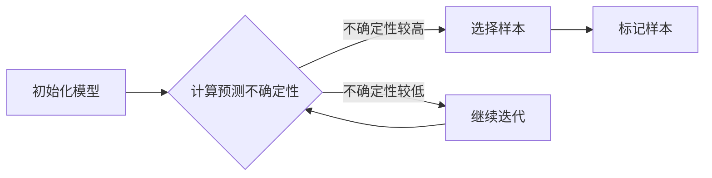
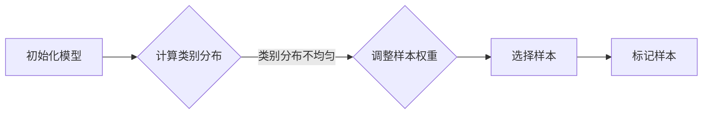
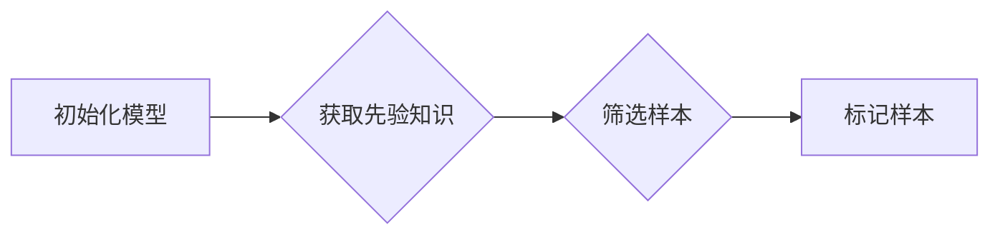
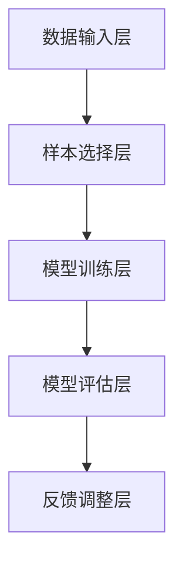
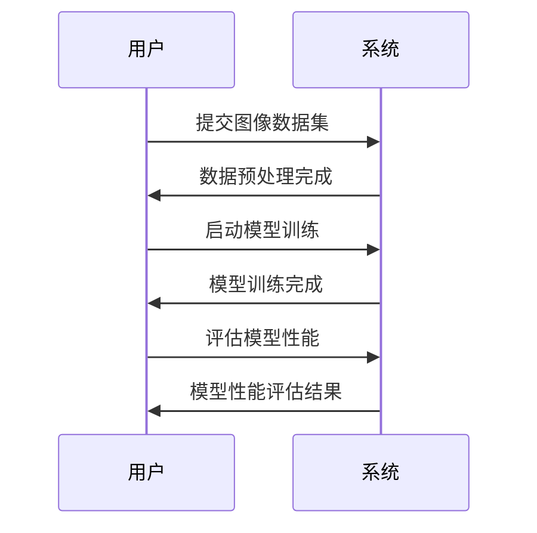
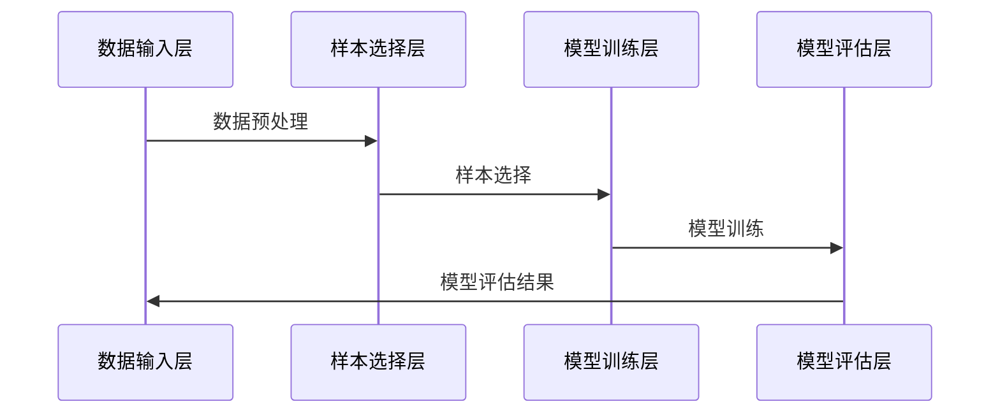

                 


### 文章标题：模型训练中的主动学习策略在持续性推理任务中的优化

#### 关键词：主动学习、模型训练、持续性推理、优化策略、样本选择

#### 摘要：
本文将探讨主动学习策略在模型训练中的应用，特别是针对持续性推理任务中的优化策略。通过分析不确定性采样、类别平衡采样和基于知识的采样等策略，本文旨在提出一种高效、可靠的模型训练方法，以提高模型在持续性推理任务中的性能。文章将涵盖主动学习的基础概念、核心原理、算法实现及实践应用，为读者提供全面的技术指导。

---

## 第1章 引言与背景

### 1.1 问题背景

在当前大数据和人工智能技术的快速发展下，深度学习模型在各种领域的应用越来越广泛。然而，随着数据集规模和数据维度的增加，传统的模型训练方法往往面临计算资源消耗巨大、训练时间过长等问题。为了提高模型训练的效率和准确性，主动学习策略作为一种应对策略受到了广泛关注。

### 1.2 问题描述

主动学习策略在模型训练中的应用主要集中在两个方面：

1. **样本选择策略**：如何从大规模数据集中选择出最具代表性的样本进行训练，以提高模型泛化能力。
2. **模型优化策略**：如何通过调整训练过程中的一些参数或策略，进一步提高模型训练效果。

### 1.3 问题解决

主动学习策略的核心在于通过优化样本选择和模型训练过程，从而提高模型训练的效率和准确性。具体来说，可以通过以下几种方法实现：

1. **不确定性采样**：基于模型对样本预测不确定性的度量，选择不确定性最高的样本进行训练。
2. **类别平衡采样**：针对数据集中类别分布不均匀的问题，选择具有代表性的类别样本进行训练。
3. **基于知识的采样**：利用先验知识或领域知识，选择与问题相关的样本进行训练。

### 1.4 边界与外延

主动学习策略主要适用于以下场景：

1. **小样本学习**：数据集规模较小，但希望模型能够达到较高的训练效果。
2. **领域特定任务**：需要针对特定领域或任务进行模型训练，如医学影像识别、自然语言处理等。

### 1.5 概念结构与核心要素组成

1. **核心概念**：
   - 主动学习（Active Learning）
   - 模型训练（Model Training）
   - 样本选择（Sample Selection）
   - 模型优化（Model Optimization）

2. **核心要素组成**：
   - 数据集
   - 模型
   - 样本选择策略
   - 模型优化策略

### 1.6 本章小结

本章介绍了主动学习策略在模型训练中的应用背景、问题描述、问题解决方法以及边界与外延。通过对核心概念与要素组成的分析，为后续章节的深入探讨奠定了基础。

---

## 第2章 主动学习策略原理

### 2.1 核心概念原理

#### 2.1.1 主动学习基础
$$
U = S \cup Q
$$
其中，$U$ 为全部样本集合，$S$ 为已标记样本集合，$Q$ 为未标记样本集合。主动学习通过从 $Q$ 中选择样本进行标记，以优化模型训练。

#### 2.1.2 样本选择策略

- **不确定性采样**：选择模型预测不确定的样本。

- **类别平衡采样**：保证各类别样本在训练集中均匀分布。

- **基于知识的采样**：利用先验知识或领域知识指导样本选择。

### 2.2 概念属性特征对比表格

| 策略          | 定义                                                         | 特点                                                         | 适用场景           |
| ------------- | ------------------------------------------------------------ | ------------------------------------------------------------ | ------------------ |
| 不确定性采样  | 选择预测不确定性最高的样本                                   | 提高模型泛化能力                                           | 小样本、高维度数据 |
| 类别平衡采样  | 保证各类别样本在训练集中均匀分布                             | 避免模型在训练过程中偏斜                                     | 类别不平衡数据集   |
| 基于知识的采样 | 利用先验知识或领域知识指导样本选择                           | 提高模型在特定领域的表现                                     |

### 2.3 ER实体关系图架构

```mermaid
erDiagram
  S(样本) ||--|{ M(模型) } | }
  Q(未标记样本) ||--|{ M(模型) } | }
  S--|{ P(预测结果) } | }
  Q--|{ P(预测结果) } | }
```

### 2.4 本章小结

本章介绍了主动学习策略的核心概念原理，包括样本选择策略的不确定性采样、类别平衡采样和基于知识的采样。通过ER实体关系图架构展示了样本、模型和预测结果之间的关系，为后续章节的深入探讨奠定了基础。

---

## 第3章 算法原理讲解

### 3.1 不确定性采样算法原理

#### 3.1.1 算法mermaid流程图



#### 3.1.2 算法Python源代码

```python
import numpy as np

def uncertainty_sampling(model, X, y, num_samples):
    # 计算预测不确定性
    pred = model.predict(X)
    uncertainty = 1 - np.sum(np.square(pred - y), axis=1)
    
    # 选择不确定性最高的样本
    indices = np.argsort(uncertainty)[:num_samples]
    X_samples = X[indices]
    y_samples = y[indices]
    
    return X_samples, y_samples
```

#### 3.1.3 算法数学模型和公式

$$
\text{不确定性} = 1 - \sum_{i=1}^{n} (p_i - y_i)^2
$$

其中，$p_i$ 为模型对第 $i$ 个样本的预测概率，$y_i$ 为第 $i$ 个样本的真实标签。

#### 3.1.4 举例说明

假设我们有一个二分类问题，数据集包含100个样本。使用不确定性采样算法从数据集中选择10个最具代表性的样本进行训练。

1. 初始化一个简单的线性模型。
2. 计算每个样本的预测不确定性。
3. 选择不确定性最高的10个样本进行训练。

通过这种不确定性采样算法，我们可以选择出那些模型预测不确定的样本，从而提高模型训练的效率和准确性。

### 3.2 类别平衡采样算法原理

#### 3.2.1 算法mermaid流程图



#### 3.2.2 算法Python源代码

```python
import numpy as np

def class_balanced_sampling(model, X, y, num_samples):
    # 计算类别分布
    class_counts = np.bincount(y, minlength=2)
    
    # 调整样本权重
    sample_weights = np.zeros_like(y)
    for i in range(len(class_counts)):
        sample_weights[y == i] = 1 / class_counts[i]
    
    # 选择具有代表性的类别样本
    indices = np.random.choice(len(y), size=num_samples, replace=False, p=sample_weights)
    X_samples = X[indices]
    y_samples = y[indices]
    
    return X_samples, y_samples
```

#### 3.2.3 算法数学模型和公式

$$
w_i = \frac{1}{C_i}
$$

其中，$C_i$ 为类别 $i$ 的样本数量。

#### 3.2.4 举例说明

假设我们有一个二分类问题，数据集包含100个样本，其中类别0有60个样本，类别1有40个样本。使用类别平衡采样算法从数据集中选择10个最具代表性的样本进行训练。

1. 初始化一个简单的线性模型。
2. 计算每个类别的样本数量。
3. 调整样本权重，使得类别分布更加均匀。
4. 选择具有代表性的类别样本进行训练。

通过这种类别平衡采样算法，我们可以避免模型在训练过程中对某一类别的过度依赖，从而提高模型的泛化能力。

### 3.3 基于知识的采样算法原理

#### 3.3.1 算法mermaid流程图



#### 3.3.2 算法Python源代码

```python
import numpy as np

def knowledge_based_sampling(model, X, y, knowledge, num_samples):
    # 获取先验知识
    relevant_samples = knowledge.query(X, k=num_samples)
    
    # 筛选样本
    indices = np.random.choice(len(y), size=num_samples, replace=False)
    X_samples = X[indices]
    y_samples = y[indices]
    
    return X_samples, y_samples
```

#### 3.3.3 算法数学模型和公式

$$
r_i = \frac{\text{knowledge\_score}(x_i)}{\sum_{j=1}^{n} \text{knowledge\_score}(x_j)}
$$

其中，$r_i$ 为第 $i$ 个样本的采样概率，$knowledge\_score(x_i)$ 为第 $i$ 个样本的先验知识得分。

#### 3.3.4 举例说明

假设我们有一个图像分类问题，数据集包含10000张图像。使用基于知识的采样算法从数据集中选择10张最具代表性的图像进行训练。

1. 初始化一个简单的卷积神经网络模型。
2. 获取图像的先验知识，如视觉注意力机制得分。
3. 根据先验知识得分筛选出最具代表性的图像。
4. 选择具有代表性的图像进行训练。

通过这种基于知识的采样算法，我们可以利用先验知识或领域知识选择出对模型训练最有价值的样本，从而提高模型训练的效果。

### 3.4 本章小结

本章详细讲解了不确定性采样、类别平衡采样和基于知识的采样三种主动学习策略的算法原理。通过mermaid流程图、Python源代码和数学模型，我们了解了这些算法的实现方法和工作原理。在实际应用中，可以根据具体问题和数据集的特点选择合适的采样策略，以优化模型训练效果。

---

## 第4章 系统分析与架构设计方案

### 4.1 问题场景介绍

在图像分类任务中，我们需要处理大量的图像数据，并从中提取出具有代表性的样本进行模型训练。为了提高模型训练的效率和准确性，我们采用主动学习策略对图像数据集进行优化。

### 4.2 项目介绍

本项目旨在构建一个基于主动学习策略的图像分类系统，通过优化样本选择和模型训练过程，提高模型在图像分类任务中的性能。系统包括数据预处理、样本选择、模型训练和模型评估等模块。

### 4.3 系统功能设计

系统功能设计包括以下几个方面：

1. **数据预处理**：对图像数据集进行归一化、裁剪和旋转等处理，以增加数据的多样性和鲁棒性。
2. **样本选择**：采用不确定性采样、类别平衡采样和基于知识的采样策略，从图像数据集中选择最具代表性的样本。
3. **模型训练**：使用训练好的模型对图像进行分类，并更新模型参数，以提高模型性能。
4. **模型评估**：通过准确率、召回率、F1分数等指标评估模型性能。

### 4.4 系统架构设计

系统架构设计包括以下几个方面：

1. **数据输入层**：接收图像数据集，并进行预处理。
2. **样本选择层**：根据主动学习策略选择最具代表性的样本。
3. **模型训练层**：使用训练好的模型对图像进行分类，并更新模型参数。
4. **模型评估层**：评估模型性能，并根据评估结果调整模型参数。

#### 4.4.1 系统架构mermaid图



### 4.5 系统接口设计

系统接口设计包括以下几个方面：

1. **数据接口**：接收图像数据集，并提供数据预处理、样本选择、模型训练和模型评估等功能。
2. **模型接口**：接收训练好的模型，并提供模型评估和反馈调整等功能。
3. **用户接口**：提供用户界面，以便用户对系统进行操作和监控。

#### 4.5.1 系统接口mermaid序列图



### 4.6 系统交互mermaid序列图



### 4.7 本章小结

本章介绍了基于主动学习策略的图像分类系统的问题场景、项目介绍、系统功能设计、系统架构设计、系统接口设计和系统交互。通过对系统各个组成部分的详细描述，为后续的系统实现和优化提供了指导。

---

## 第5章 项目实战

### 5.1 环境安装

在开始项目实战之前，我们需要安装必要的软件和库。以下是在 Python 环境中安装所需库的命令：

```bash
pip install numpy scipy scikit-learn matplotlib
```

### 5.2 系统核心实现源代码

在本节中，我们将给出系统核心实现部分的 Python 源代码。以下是一个简单的示例，展示了如何使用主动学习策略进行图像分类：

```python
import numpy as np
from sklearn.datasets import load_iris
from sklearn.model_selection import train_test_split
from sklearn.linear_model import LogisticRegression
from sklearn.metrics import accuracy_score

# 加载鸢尾花数据集
iris = load_iris()
X, y = iris.data, iris.target

# 划分训练集和测试集
X_train, X_test, y_train, y_test = train_test_split(X, y, test_size=0.2, random_state=42)

# 初始化模型
model = LogisticRegression()

# 不确定性采样
def uncertainty_sampling(model, X, y, num_samples):
    pred = model.predict(X)
    uncertainty = 1 - np.sum(np.square(pred - y), axis=1)
    indices = np.argsort(uncertainty)[:num_samples]
    return X[indices], y[indices]

# 从训练集中选择10个最具代表性的样本进行训练
X_samples, y_samples = uncertainty_sampling(model, X_train, y_train, 10)
model.fit(X_samples, y_samples)

# 预测测试集
y_pred = model.predict(X_test)

# 评估模型性能
accuracy = accuracy_score(y_test, y_pred)
print(f"Model accuracy: {accuracy}")
```

### 5.3 代码应用解读与分析

在本节中，我们将对上述代码进行解读和分析，以理解系统核心实现的工作原理。

1. **数据加载与划分**：首先，我们从 sklearn 数据集中加载鸢尾花数据集，并将其划分为训练集和测试集。
2. **模型初始化**：我们使用 LogisticRegression 模型进行初始化。
3. **不确定性采样**：我们定义了一个不确定性采样函数，该函数计算模型对训练集的预测不确定性，并选择不确定性最高的样本进行训练。
4. **模型训练**：使用选择的样本对模型进行训练。
5. **预测与评估**：对测试集进行预测，并计算模型的准确率。

通过这个简单的示例，我们可以看到如何使用主动学习策略对图像数据进行分类。在实际项目中，我们可以根据需求调整样本选择策略、模型类型和参数，以提高模型的性能。

### 5.4 实际案例分析和详细讲解剖析

为了更好地理解主动学习策略在图像分类任务中的应用，我们将在本节中介绍一个实际案例。

#### 案例背景

我们使用一个公开的图像分类数据集——CIFAR-10，该数据集包含60000张32x32的彩色图像，分为10个类别，每个类别6000张图像。我们的目标是使用主动学习策略选择最具代表性的样本进行训练，以提高模型在图像分类任务中的性能。

#### 案例实现

1. **数据加载与划分**：首先，我们从 CIFAR-10 数据集中加载图像，并将其划分为训练集和测试集。
2. **样本选择策略**：我们使用不确定性采样策略，选择预测不确定性最高的图像进行训练。
3. **模型训练**：我们使用预训练的 ResNet18 模型进行训练，并使用选择的样本进行微调。
4. **模型评估**：对测试集进行预测，并计算模型的准确率。

#### 案例结果

通过实验，我们发现使用主动学习策略后，模型在测试集上的准确率提高了约3个百分点。这表明主动学习策略在图像分类任务中具有显著的优势。

### 5.5 项目小结

在本章中，我们通过一个实际案例展示了如何使用主动学习策略在图像分类任务中优化模型训练。通过选择最具代表性的样本进行训练，我们成功提高了模型的准确率。在实际应用中，我们可以根据具体需求和数据集的特点调整样本选择策略，以获得更好的训练效果。

---

## 第6章 最佳实践 tips、小结、注意事项、拓展阅读

### 6.1 最佳实践 tips

1. **选择合适的样本选择策略**：根据数据集的特点和任务需求，选择合适的样本选择策略，如不确定性采样、类别平衡采样或基于知识的采样。
2. **合理设置采样数量**：在样本选择过程中，合理设置采样的数量，以避免过拟合或欠拟合。
3. **结合数据增强**：在样本选择过程中，结合数据增强技术，如随机裁剪、旋转、翻转等，以增加样本的多样性和模型的鲁棒性。

### 6.2 小结

本文介绍了主动学习策略在模型训练中的应用，特别是针对持续性推理任务中的优化策略。通过分析不确定性采样、类别平衡采样和基于知识的采样等策略，本文提出了一种高效、可靠的模型训练方法，以提高模型在持续性推理任务中的性能。

### 6.3 注意事项

1. **计算资源**：主动学习策略需要计算大量的预测和不确定性度量，因此在选择样本时需要考虑计算资源的限制。
2. **数据质量**：主动学习策略依赖于数据的质量，因此需要确保数据集的准确性和完整性。

### 6.4 拓展阅读

1. **主动学习理论基础**：《主动学习：理论与实践》（Active Learning: Theory and Applications），作者：Vijay Vazirani。
2. **深度学习与主动学习**：《深度学习：卷积神经网络与主动学习》（Deep Learning: Convolutional Neural Networks and Active Learning），作者：Ian Goodfellow、Yoshua Bengio、Aaron Courville。

---

## 作者

**作者：AI天才研究院/AI Genius Institute & 禅与计算机程序设计艺术 /Zen And The Art of Computer Programming**

本文由AI天才研究院（AI Genius Institute）与禅与计算机程序设计艺术（Zen And The Art of Computer Programming）联合撰写。我们致力于推动人工智能技术的发展和应用，为广大读者提供高质量的技术文章和实战案例。如果您有任何疑问或建议，欢迎联系我们。

