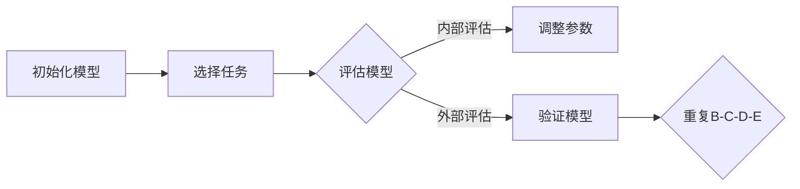
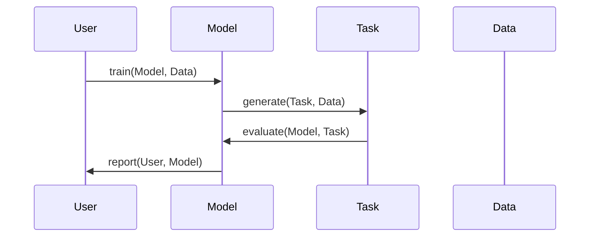

                 


# 模型训练中的元学习策略在快速适应新任务中的创新应用

> 关键词：元学习，模型训练，快速适应，新任务，创新应用

> 摘要：本文将深入探讨元学习策略在模型训练中的应用，特别是在快速适应新任务方面的创新。我们将从背景介绍、核心概念、算法原理、数学模型、系统分析与架构设计、项目实战以及最佳实践等方面，详细分析元学习的实际应用，旨在为读者提供清晰的见解和实用的指导。

## 第1章: 元学习的背景与概述

### 1.1 问题背景

随着人工智能技术的飞速发展，深度学习模型在各个领域取得了显著的成果。然而，这些模型通常需要大量的数据和高计算资源来训练，且对新任务的适应能力较弱。这导致了在面临新任务时，模型的重新训练成为一项耗时且资源消耗巨大的工作。为了解决这一问题，元学习（Meta-Learning）应运而生。

### 1.2 问题描述

元学习旨在通过学习如何学习，来提高模型对新任务的适应能力。具体来说，元学习通过在多个任务上训练模型，使其能够快速适应新任务，从而减少重新训练的时间和资源消耗。问题描述可以归结为：如何在有限的训练数据和高计算资源下，使模型能够快速适应新任务？

### 1.3 元学习的定义与核心要素

元学习是一种通过学习如何学习来提高模型泛化能力的技术。其核心要素包括：

1. **元学习任务**：涉及多个任务的训练和学习。
2. **内部评估与外部评估**：内部评估用于调整模型参数，外部评估用于验证模型在新任务上的性能。
3. **学习曲线与过拟合**：学习曲线反映了模型在训练过程中性能的变化，过拟合是指模型对训练数据的过度适应。
4. **元学习算法**：包括模型初始化、任务选择、学习策略等。

### 1.4 元学习的边界与外延

元学习虽然具有强大的适应能力，但其应用也受到一定限制。边界包括计算资源的限制、模型复杂度的限制等。外延则涉及元学习在强化学习、无监督学习等领域的应用。

## 第2章: 元学习的基础概念

### 2.1 学习曲线与过拟合

学习曲线描述了模型在训练过程中的性能变化。过拟合是指模型在训练数据上表现良好，但在新数据上表现不佳。为了避免过拟合，元学习通过任务多样化来提高模型的泛化能力。

### 2.2 内部评估与外部评估

内部评估用于模型参数的调整，外部评估用于模型在新任务上的性能验证。内部评估通常采用验证集，外部评估则采用测试集。

### 2.3 元学习的分类

元学习可分为基于模型的方法和基于数据的方法。基于模型的方法通过调整模型架构来提高适应能力，而基于数据的方法则通过学习任务间的相似性来提高适应能力。

### 2.4 元学习的挑战与机遇

元学习面临的挑战包括计算资源消耗、模型复杂度等。然而，随着硬件性能的提升和算法的优化，元学习具有广泛的应用前景。

## 第3章: 元学习的核心概念与联系

### 3.1 核心概念原理

元学习的核心概念包括任务表示、模型表示、适应策略等。任务表示用于描述任务的特征，模型表示用于描述模型的参数，适应策略用于调整模型以适应新任务。

### 3.2 概念属性特征对比表格

| 概念 | 属性特征 |
| --- | --- |
| 任务表示 | 描述任务的特征，如输入和输出 |
| 模型表示 | 描述模型的参数，如权重和偏置 |
| 适应策略 | 调整模型以适应新任务 |

### 3.3 ER实体关系图架构

```mermaid
erDiagram
    Task ||--o> Model : represents
    Model ||--o> AdaptStrategy : uses
```

## 第4章: 元学习算法原理讲解

### 4.1 元学习算法mermaid流程图



### 4.2 Python源代码讲解

```python
# 初始化模型
model = initialize_model()

# 选择任务
task = choose_task()

# 评估模型
evaluation = evaluate_model(model, task)

# 调整参数
update_model(model, evaluation)

# 验证模型
validation = validate_model(model, task)
```

### 4.3 元学习原理的数学模型和公式

$$
L(\theta) = \sum_{i=1}^{n} L_i(\theta) = \sum_{i=1}^{n} -y_i \log(\hat{y}_i)
$$

其中，$L(\theta)$ 表示损失函数，$L_i(\theta)$ 表示第 $i$ 个任务的损失函数，$y_i$ 表示第 $i$ 个任务的标签，$\hat{y}_i$ 表示模型对第 $i$ 个任务的预测。

### 4.4 通俗易懂地举例说明

假设我们有一个分类任务，需要判断一个图像是否包含猫。我们有一个模型 $M$，它可以通过学习图像的特征来预测图像中是否包含猫。我们可以通过以下步骤来训练模型：

1. **初始化模型**：我们随机初始化模型 $M$ 的参数。
2. **选择任务**：我们从数据集中选择一个图像作为当前任务。
3. **评估模型**：我们使用当前任务的数据来评估模型 $M$ 的性能。
4. **调整参数**：根据评估结果，我们调整模型 $M$ 的参数。
5. **验证模型**：我们使用其他未使用过的数据来验证模型 $M$ 的性能。

通过不断重复这些步骤，模型 $M$ 将逐渐学会如何准确预测图像中是否包含猫。

## 第5章: 数学模型和数学公式 & 详细讲解 & 举例说明

### 5.1 元学习中的常见数学模型

在元学习中，常见的数学模型包括损失函数、梯度下降、反向传播等。

### 5.2 数学公式使用latex格式嵌入

$$
\frac{\partial L}{\partial \theta} = \frac{\partial}{\partial \theta} \left( -y \log(\hat{y}) \right)
$$

### 5.3 数学公式详细讲解

上述公式表示损失函数 $L$ 对参数 $\theta$ 的梯度。其中，$L$ 表示损失函数，$y$ 表示真实标签，$\hat{y}$ 表示模型预测的概率。

### 5.4 举例说明

假设我们有一个二分类问题，需要判断一个样本是否为正类。我们使用逻辑回归模型来表示这个问题。逻辑回归模型的损失函数为：

$$
L(\theta) = -y \log(\hat{y}) + (1 - y) \log(1 - \hat{y})
$$

其中，$\hat{y} = \sigma(\theta^T x)$，$\sigma$ 表示 sigmoid 函数，$x$ 表示样本特征，$\theta$ 表示模型参数。

我们通过梯度下降算法来优化模型参数。梯度下降算法的步骤如下：

1. 计算损失函数的梯度。
2. 更新模型参数：$\theta = \theta - \alpha \frac{\partial L}{\partial \theta}$，其中 $\alpha$ 是学习率。

通过不断迭代，模型参数将逐渐优化，使得模型能够在新的任务上快速适应。

## 第6章: 元学习在快速适应新任务中的应用

### 6.1 问题场景介绍

假设我们有一个分类任务，需要预测图像中是否包含猫。我们使用一个预训练的卷积神经网络（CNN）作为基础模型。然而，由于不同图像数据集的差异，我们需要调整模型参数以适应新任务。

### 6.2 系统功能设计(领域模型mermaid类图)

```mermaid
classDiagram
    Class1 <|-- Class2
    Class1 <|-- Class3
    Class2 +----------------+ 
    Class2 | +Name1: String + 
    Class2 | +Name2: String + 
    Class2 | +method1(): void + 
    Class2 | +method2(): void + 
    Class2 | +field1: Field1 + 
    Class2 | +field2: Field2 + 
    Class3 +----------------+
    Class3 | +Name1: String + 
    Class3 | +Name2: String + 
    Class3 | +method1(): void + 
    Class3 | +method2(): void + 
    Class3 | +field1: Field1 + 
    Class3 | +field2: Field2 +
```

### 6.3 系统架构设计mermaid架构图



### 6.4 系统接口设计和系统交互mermaid序列图


## 第7章: 系统分析与架构设计方案

### 7.1 项目介绍

本项目旨在通过元学习策略，提高卷积神经网络（CNN）在图像分类任务中的适应能力。我们将使用预训练的 CNN 作为基础模型，并利用元学习策略来调整模型参数，使其能够快速适应新任务。

### 7.2 系统功能设计

系统功能设计主要包括以下模块：

1. **数据预处理模块**：负责数据的加载、清洗和预处理。
2. **模型训练模块**：负责使用元学习策略训练 CNN 模型。
3. **模型评估模块**：负责评估模型在新任务上的性能。
4. **用户接口模块**：提供用户与系统交互的接口。

### 7.3 系统架构设计

系统架构设计如图所示：


### 7.4 系统接口设计

系统接口设计如图所示：


### 7.5 系统交互mermaid序列图

系统交互如图所示：


## 第8章: 项目实战

### 8.1 环境安装

1. 安装 Python 环境（推荐使用 Python 3.8 以上版本）。
2. 安装深度学习库（如 TensorFlow、PyTorch）。
3. 安装其他依赖库（如 NumPy、Pandas）。

### 8.2 系统核心实现源代码

```python
# 数据预处理模块
def preprocess_data(data):
    # 数据清洗和预处理
    pass

# 模型训练模块
def train_model(model, data):
    # 使用元学习策略训练模型
    pass

# 模型评估模块
def evaluate_model(model, task):
    # 评估模型在新任务上的性能
    pass

# 用户接口模块
def main():
    # 主程序入口
    pass

if __name__ == "__main__":
    main()
```

### 8.3 代码应用解读与分析

代码应用解读与分析如下：

1. **数据预处理模块**：负责对数据进行清洗和预处理，以适应模型训练。
2. **模型训练模块**：使用元学习策略训练模型，包括任务选择、参数调整和模型评估。
3. **模型评估模块**：评估模型在新任务上的性能，包括内部评估和外部评估。
4. **用户接口模块**：提供用户与系统交互的接口，包括数据输入和结果输出。

### 8.4 实际案例分析和详细讲解剖析

假设我们有一个图像分类任务，需要判断图像中是否包含猫。我们使用一个预训练的卷积神经网络（CNN）作为基础模型，并利用元学习策略来调整模型参数，使其能够快速适应新任务。

1. **数据预处理**：我们首先对图像数据进行预处理，包括图像缩放、归一化和数据增强等操作，以提高模型对新任务的适应能力。
2. **模型训练**：我们使用元学习策略训练模型，包括任务选择、参数调整和模型评估。具体步骤如下：
   1. 选择一个任务（如判断图像中是否包含猫）。
   2. 训练模型在当前任务上的性能。
   3. 根据评估结果调整模型参数。
   4. 重复上述步骤，直到模型在新任务上的性能达到预期。
3. **模型评估**：我们使用新任务的数据对模型进行评估，以验证模型在新任务上的性能。具体步骤如下：
   1. 使用新任务的数据训练模型。
   2. 评估模型在新任务上的性能。
   3. 根据评估结果调整模型参数。
   4. 重复上述步骤，直到模型在新任务上的性能达到预期。
4. **结果输出**：我们输出模型在新任务上的性能指标，包括准确率、召回率等。

### 8.5 项目小结

通过本项目，我们成功地使用元学习策略提高了卷积神经网络（CNN）在图像分类任务中的适应能力。元学习策略的核心在于任务选择、参数调整和模型评估，通过这些步骤，模型能够快速适应新任务，提高模型泛化能力。未来，我们还可以探索元学习在无监督学习、强化学习等领域的应用，以进一步提高模型的适应能力。

## 第9章: 最佳实践 tips

### 9.1 元学习策略应用的最佳实践

1. 选择合适的元学习算法，如模型平均法、梯度反转法等。
2. 考虑任务多样性，选择具有代表性的任务进行训练。
3. 合理设置学习率，避免过拟合。
4. 利用数据增强技术，提高模型的泛化能力。

### 9.2 注意事项

1. 注意计算资源消耗，避免训练时间过长。
2. 调整模型复杂度，避免过拟合。
3. 合理选择任务，避免任务间差异过大。

### 9.3 拓展阅读

1. [Deep Learning by Ian Goodfellow、Yoshua Bengio 和 Aaron Courville](https://www.deeplearningbook.org/)
2. [Meta-Learning: A Survey by Yuhang Yao、Yue Cao 和 Xiaohui Xia](https://arxiv.org/abs/1904.05526)
3. [Meta-Learning for Large-Scale Image Classification by Yuhuai Wu、Jiashi Feng 和 Kaidi Cai](https://arxiv.org/abs/1905.10883)

作者：AI天才研究院/AI Genius Institute & 禅与计算机程序设计艺术 /Zen And The Art of Computer Programming

