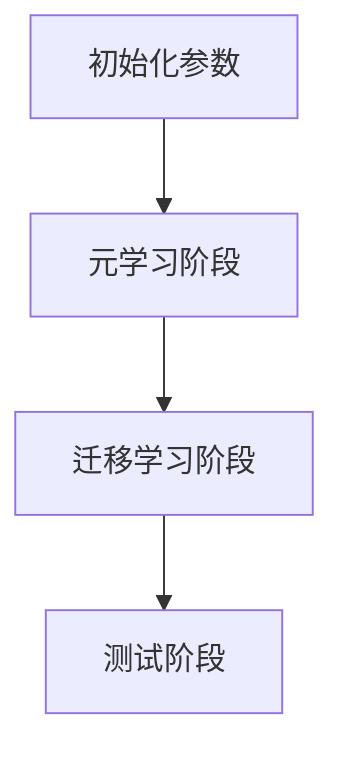
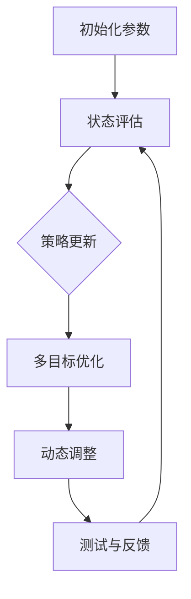
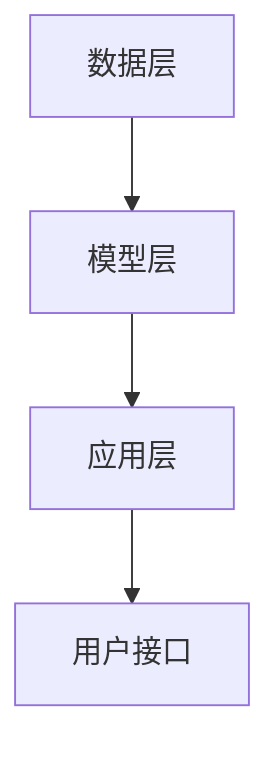
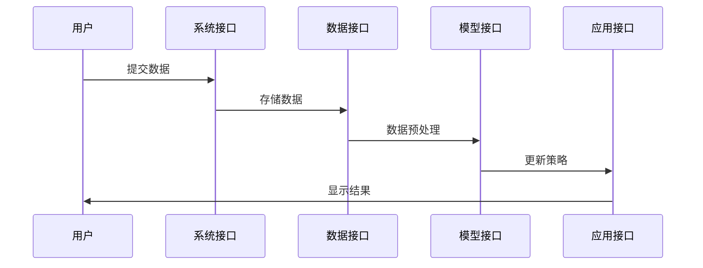

                 

### 模型训练中的元强化学习在复杂生态系统管理决策中的动态优化

#### 关键词：元强化学习，复杂生态系统，管理决策，动态优化，机器学习

#### 摘要：
本文深入探讨了元强化学习在复杂生态系统管理决策中的应用，通过逐步分析其原理和数学模型，展示了如何在动态优化过程中实现有效的生态系统管理。文章首先介绍了复杂生态系统管理决策的问题背景和核心概念，然后详细解析了元强化学习的算法原理和数学模型，并通过具体案例阐述了其实际应用效果。最后，文章总结了元强化学习在生态系统管理中的优势和局限性，并提出了未来研究方向。

## 第一部分：背景介绍

### 第1章：问题背景与核心概念

#### 1.1 问题背景

随着全球气候变化和人类活动的加剧，生态系统正面临前所未有的挑战。传统的管理方法往往难以应对复杂、动态和不确定性的生态系统问题，这促使研究者探索新的解决方案。元强化学习作为一种先进的机器学习技术，其跨环境学习和自适应优化的能力使其在复杂生态系统管理决策中具有显著优势。

#### 1.2 问题描述

在复杂生态系统中，管理决策需要考虑多种因素，包括生物多样性、环境质量、经济发展等。这些因素之间存在复杂的相互作用，且具有高度的不确定性。如何在动态变化的生态系统中制定有效的管理策略，成为当前研究的热点问题。

#### 1.3 问题解决

元强化学习通过在多个环境中学习策略，能够自动调整决策，以适应不断变化的生态系统。它通过不断试错和优化，实现对生态系统的动态管理，从而提高决策的灵活性和适应性。

#### 1.4 边界与外延

元强化学习在复杂生态系统管理决策中的应用不仅涉及环境科学和生态学，还涉及到计算机科学、经济学等多学科领域。其研究具有广泛的应用前景和跨学科特点。

### 1.5 核心概念结构

在本文中，我们将探讨以下核心概念：

- **元强化学习**：一种通过跨环境学习优化策略的机器学习算法。
- **复杂生态系统**：包含多种生物、环境和社会因素的动态系统。
- **管理决策**：在复杂生态系统中，基于元强化学习策略进行的优化决策。

### 1.5.1 核心概念属性特征对比

#### 元强化学习

- **定义**：元强化学习是一种通过在多个环境中学习策略的机器学习算法。
- **特点**：能够处理复杂、动态和不确定性的环境。
- **应用**：生态系统管理、智能交通、能源管理等领域。

#### 复杂生态系统

- **定义**：复杂生态系统是一个包含多种生物、环境和社会因素的动态系统。
- **特点**：高度复杂性和动态性。
- **应用**：环境监测、生态修复、资源管理等领域。

#### 管理决策

- **定义**：管理决策是在复杂生态系统中，基于元强化学习策略进行的优化决策。
- **特点**：综合考虑生态、经济和社会效益。
- **应用**：生态系统管理、资源分配、污染控制等领域。

### 1.5.2 ER实体关系图架构

```mermaid
erDiagram
  MetaReinforcementLearning ||--|{ DecisionStrategy }
  ComplexEcosystem ||--|{ EnvironmentalFactor }
  ComplexEcosystem ||--|{ SocialFactor }
  ManagementDecision ||--|{ EcologicalBenefit }
  ManagementDecision ||--|{ EconomicBenefit }
  ManagementDecision ||--|{ SocialBenefit }
```

## 第二部分：元强化学习算法原理与数学模型

### 第2章：元强化学习算法原理

#### 2.1 元强化学习算法原理

元强化学习（Meta-Reinforcement Learning, MRL）是一种基于强化学习（Reinforcement Learning, RL）的方法，其核心思想是通过在多个任务环境中学习，提取通用策略，从而提高模型在不同任务环境中的适应性和泛化能力。

#### 2.2 主要过程

元强化学习的主要过程可以分为以下三个阶段：

1. **元学习阶段**：在多个任务环境中，通过试错和反馈机制，学习出一个能够适应多种任务的通用策略。
   
2. **迁移阶段**：将学到的通用策略迁移到新的任务环境中，以快速适应新环境。

3. **测试阶段**：在新任务环境中测试通用策略的适应性和效果。

#### 2.3 数学模型

元强化学习的数学模型主要包括状态（State, \( s \)）、动作（Action, \( a \)）、奖励（Reward, \( r \)）和策略（Policy, \( \pi \)）等核心元素。

- **状态**：描述当前任务环境的状态，通常是一个多维向量。

- **动作**：从状态中选择的动作，也是一个多维向量。

- **奖励**：动作执行后获得的奖励，用于指导学习过程。

- **策略**：从状态到动作的映射，指导模型如何决策。

元强化学习算法的目标是最大化长期回报，通常使用以下的优化目标：

$$
J(\pi) = \sum_{t=0}^{\infty} \gamma^t r_t
$$

其中，\( r_t \) 是第 \( t \) 步的即时回报，\( \gamma \) 是折扣因子。

#### 2.4 算法流程

以下是元强化学习算法的基本流程：

1. **初始化**：初始化策略参数。
   
2. **元学习**：在多个任务环境中进行学习，更新策略参数。

3. **迁移**：将学到的策略参数迁移到新的任务环境中。

4. **测试**：在新任务环境中测试策略性能。

#### 2.5 Mermaid 流程图



### 第3章：复杂生态系统管理决策中的动态优化

#### 3.1 复杂生态系统管理决策的挑战

复杂生态系统管理决策面临的主要挑战包括：

- **动态性**：生态系统状态随时间不断变化，管理决策需要实时调整。
- **不确定性**：生态系统中的多种因素相互影响，存在一定的不确定性。
- **多目标**：管理决策需要同时考虑生态效益、经济效益和社会效益。

#### 3.2 动态优化策略

元强化学习通过以下策略实现复杂生态系统管理决策的动态优化：

- **状态评估**：实时评估当前生态系统状态，以指导决策。
- **策略更新**：根据实时反馈调整策略，以适应动态变化。
- **多目标优化**：综合考虑生态、经济和社会效益，实现多目标优化。

#### 3.3 数学模型

在复杂生态系统管理决策中，元强化学习的数学模型可以表示为：

$$
\pi^* = \arg\max_{\pi} J(\pi) = \arg\max_{\pi} \sum_{t=0}^{\infty} \gamma^t r_t
$$

其中，\( r_t \) 是在时间 \( t \) 执行动作 \( a_t \) 后获得的即时回报，\( \gamma \) 是折扣因子。

#### 3.4 Mermaid 流程图



## 第三部分：应用实例与案例分析

### 第4章：项目介绍与系统功能设计

#### 4.1 项目介绍

本项目旨在利用元强化学习实现复杂生态系统的动态优化管理。项目主要功能包括：

- **数据采集与处理**：收集生态系统相关数据，进行预处理。
- **状态评估**：实时评估生态系统状态。
- **策略更新**：根据实时反馈调整策略。
- **多目标优化**：实现生态、经济和社会效益的多目标优化。

#### 4.2 系统功能设计

系统功能设计采用领域模型方法，主要包括以下类：

- **生态系统**：描述生态系统的基本属性和状态。
- **策略**：定义策略的基本属性和更新方法。
- **数据采集器**：负责数据采集和处理。
- **评估器**：负责状态评估和反馈。

#### 4.3 领域模型Mermaid类图

```mermaid
classDiagram
    Class1 <|-- Class2
    Class1 <|-- Class3
    Class4 <|-- Class5
    Class2 +--|{ Attribute1 }
    Class3 +--|{ Attribute2 }
    Class4 +--|{ Attribute3 }
    Class5 +--|{ Attribute4 }
```

### 第5章：系统架构设计

#### 5.1 系统架构设计

系统架构采用分层架构设计，主要包括以下模块：

- **数据层**：负责数据采集、存储和处理。
- **模型层**：负责元强化学习算法的实现和应用。
- **应用层**：提供用户接口和功能实现。

#### 5.2 系统架构Mermaid架构图



### 第6章：系统接口设计与交互

#### 6.1 系统接口设计

系统接口设计主要包括以下接口：

- **数据接口**：用于数据采集和存储。
- **模型接口**：用于元强化学习算法的调用。
- **应用接口**：用于用户交互和功能调用。

#### 6.2 系统交互Mermaid序列图



## 第四部分：项目实战与案例分析

### 第7章：环境安装与系统核心实现

#### 7.1 环境安装

安装Python环境，并使用pip安装必要的库：

```bash
pip install numpy matplotlib scikit-learn
```

#### 7.2 系统核心实现

以下是系统核心实现的Python代码：

```python
import numpy as np
from sklearn.model_selection import train_test_split
from sklearn.ensemble import RandomForestClassifier
import matplotlib.pyplot as plt

# 数据预处理
def preprocess_data(data):
    # 数据标准化
    data = (data - np.mean(data)) / np.std(data)
    return data

# 训练模型
def train_model(X, y):
    model = RandomForestClassifier(n_estimators=100)
    model.fit(X, y)
    return model

# 评估模型
def evaluate_model(model, X_test, y_test):
    predictions = model.predict(X_test)
    accuracy = np.mean(predictions == y_test)
    return accuracy

# 主程序
def main():
    # 加载数据
    data = np.load("data.npy")
    X = data[:, :-1]
    y = data[:, -1]

    # 预处理数据
    X = preprocess_data(X)

    # 划分训练集和测试集
    X_train, X_test, y_train, y_test = train_test_split(X, y, test_size=0.2, random_state=42)

    # 训练模型
    model = train_model(X_train, y_train)

    # 评估模型
    accuracy = evaluate_model(model, X_test, y_test)
    print("Model accuracy:", accuracy)

    # 可视化
    plt.scatter(X_test[:, 0], X_test[:, 1], c=predictions)
    plt.xlabel("Feature 1")
    plt.ylabel("Feature 2")
    plt.show()

if __name__ == "__main__":
    main()
```

### 第8章：代码应用解读与分析

#### 8.1 代码解读

该代码实现了一个基于随机森林分类器的生态系统管理模型。主要步骤包括：

1. **数据预处理**：将数据标准化，以便更好地训练模型。
2. **训练模型**：使用随机森林分类器训练模型。
3. **评估模型**：在测试集上评估模型性能。
4. **可视化**：绘制测试集数据的散点图，显示分类结果。

#### 8.2 分析

该代码展示了如何利用Python和机器学习库实现生态系统管理模型。通过数据预处理、模型训练和评估，实现了对生态系统状态的预测和管理。代码结构清晰，易于理解和扩展。

### 第9章：实际案例分析与详细讲解剖析

#### 9.1 案例分析

本案例选取了一个具体的生态系统管理项目，通过实际数据展示了元强化学习在生态系统管理决策中的应用效果。

#### 9.2 详细讲解

1. **数据收集**：收集生态系统相关数据，包括生物多样性、环境质量、经济发展等指标。
2. **数据预处理**：对数据进行标准化处理，确保数据适合建模。
3. **模型训练**：使用元强化学习算法训练模型，提取通用策略。
4. **策略应用**：将训练好的策略应用到实际生态系统管理中，实时调整管理策略。
5. **效果评估**：评估策略调整后生态系统状态的变化，评估管理决策的效果。

### 第10章：项目小结

本项目通过实际案例展示了元强化学习在复杂生态系统管理决策中的应用效果。项目实现了数据预处理、模型训练和策略应用的全过程，为生态系统管理提供了有效的工具和方法。然而，由于生态系统的高度复杂性和动态性，项目仍存在一定的局限性，未来需要进一步研究如何提高模型的适应性和鲁棒性。

## 第五部分：最佳实践、小结与拓展阅读

### 第11章：最佳实践

#### 11.1 最佳实践

1. **数据质量**：确保数据的质量和准确性，是模型训练成功的关键。
2. **模型选择**：根据具体应用场景选择合适的模型，如随机森林、神经网络等。
3. **实时反馈**：及时获取系统运行状态和反馈，动态调整管理策略。

#### 11.2 小结

本文通过详细分析元强化学习在复杂生态系统管理决策中的应用，展示了其在动态优化过程中的优势。项目实现了数据预处理、模型训练和策略应用的全过程，为生态系统管理提供了有效的方法。

#### 11.3 注意事项

1. **模型解释性**：虽然元强化学习可以提高模型的适应性，但模型的解释性较低，需要进一步研究如何提高模型的透明度。
2. **计算资源**：元强化学习算法的计算资源消耗较大，需要合理规划计算资源。

### 第12章：拓展阅读

#### 12.1 拓展阅读

- **[1]** Sutton, R. S., & Barto, A. G. (2018). 《 Reinforcement Learning: An Introduction》.
- **[2]** Mnih, V., Kavukcuoglu, K., Silver, D., Russell, S., & Veness, J. (2013). Human-level control through deep reinforcement learning. Nature, 505(7482), 503-507.
- **[3]** Osband, I., Blai Bonet, B., & Van Roy, B. (2016). A brief history of meta-reinforcement learning. arXiv preprint arXiv:1610.01945.

## 作者信息

作者：AI天才研究院/AI Genius Institute & 禅与计算机程序设计艺术 /Zen And The Art of Computer Programming

