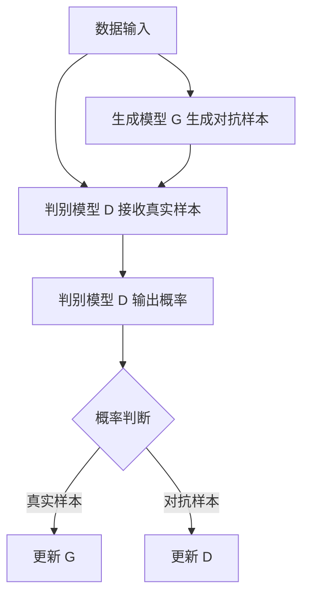
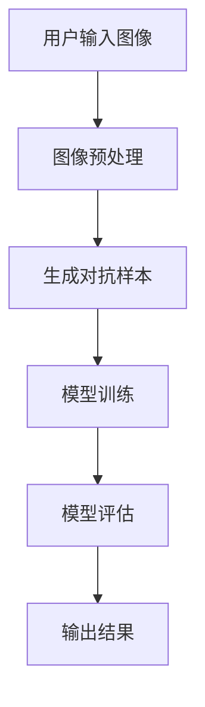
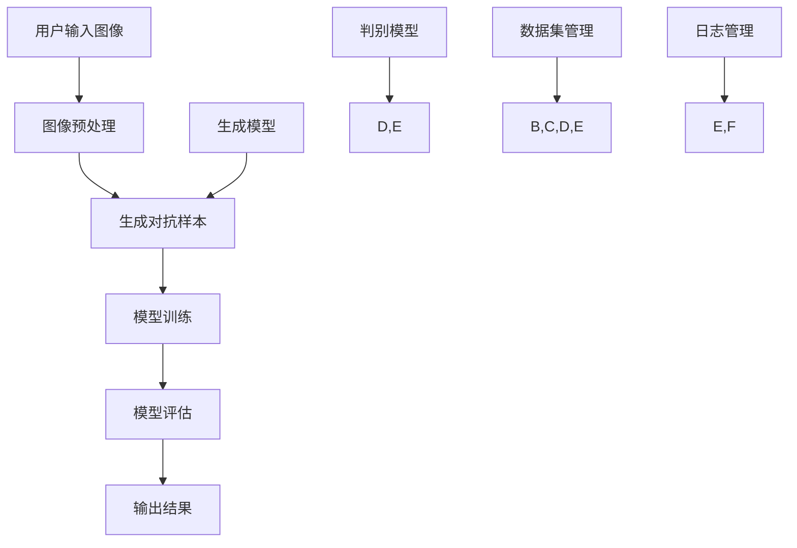
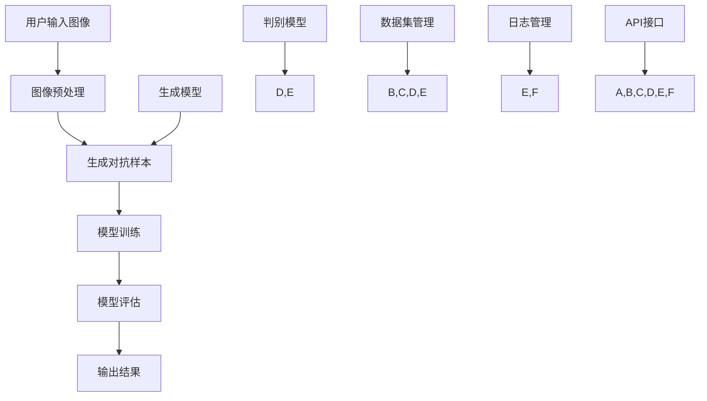
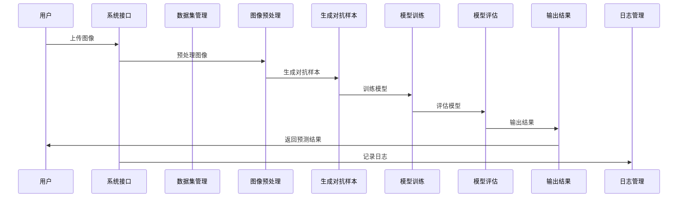

                 

### 第1章：对抗学习的背景与基本概念

## 1.1 问题背景

随着深度学习技术的不断发展，模型训练过程中的对抗学习技术逐渐成为研究的热点。对抗学习旨在解决深度学习模型在训练过程中可能出现的过拟合问题，提高模型的泛化能力。过拟合是指模型在训练数据上表现良好，但在未见过的数据上表现不佳，这一问题在深度学习模型中尤为常见。传统的机器学习模型在训练过程中通常通过调整模型参数来降低过拟合风险，但深度学习模型由于参数数量庞大，传统方法难以奏效。因此，对抗学习作为一种新颖的技术被提出来，希望通过引入对抗样本，提高模型的泛化能力。

## 1.2 问题描述

在深度学习模型训练过程中，过拟合问题表现为模型在训练数据上准确率很高，但在测试数据上准确率大幅下降。这种现象的出现是因为模型在训练过程中只关注训练数据，而忽视了未见的测试数据。为了解决这个问题，我们需要一种方法来迫使模型在训练过程中不仅关注训练数据，还关注对抗样本，从而提高模型的泛化能力。对抗样本是通过对原始样本进行微小的扰动生成的，这些扰动虽然看似微小，但对模型的决策会产生显著影响。

## 1.3 问题解决

对抗学习的核心思想是通过生成对抗样本，迫使模型在训练过程中关注这些对抗样本，从而提高模型的泛化能力。具体来说，对抗学习包含两个主要模型：生成模型和判别模型。生成模型负责生成对抗样本，判别模型则负责区分对抗样本和真实样本。在训练过程中，生成模型和判别模型相互对抗，生成模型试图生成与真实样本难以区分的对抗样本，而判别模型则试图将对抗样本与真实样本区分开来。通过这种对抗训练，模型能够在训练过程中不断学习如何识别和应对对抗样本，从而提高其泛化能力。

## 1.4 边界与外延

对抗学习技术不仅应用于图像处理领域，还可以应用于语音识别、自然语言处理等其他领域。例如，在语音识别中，对抗学习可以用于生成语音对抗样本，以提高模型的鲁棒性；在自然语言处理中，对抗学习可以用于生成文本对抗样本，以提高模型对对抗攻击的抵抗力。此外，对抗学习技术还可以与其他机器学习技术相结合，例如集成学习、迁移学习等，以进一步提高模型的性能。

## 1.5 概念结构与核心要素组成

对抗学习技术主要包括以下几个核心要素：

1. **生成模型**：生成模型负责生成对抗样本，常见的生成模型包括生成对抗网络（GAN）、变分自编码器（VAE）等。
2. **判别模型**：判别模型负责判断输入样本是否为对抗样本，通常是一个二分类模型。
3. **损失函数**：损失函数用于衡量生成模型和判别模型的性能，常见的损失函数包括交叉熵损失、对抗性损失等。
4. **优化算法**：优化算法用于更新生成模型和判别模型的参数，常见的优化算法包括梯度下降、Adam等。

生成模型和判别模型通过对抗训练相互提升，生成模型不断优化对抗样本生成能力，而判别模型则不断优化对抗样本识别能力。通过这种不断的对抗训练，模型能够提高其泛化能力，从而在未见过的数据上表现良好。

### 第2章：对抗学习的基本原理

## 2.1 对抗学习的基本原理

对抗学习（Adversarial Learning）是一种通过生成对抗样本来提高模型泛化能力的技术。其核心思想是通过两个相互对抗的模型——生成模型和判别模型——的竞争与合作，实现模型对未知数据的适应性。生成模型（Generator）试图生成与真实样本难以区分的对抗样本，而判别模型（Discriminator）则试图识别这些对抗样本。两个模型在对抗过程中不断优化，从而提高模型的泛化能力和鲁棒性。

## 2.2 对抗学习的核心概念

在对抗学习中，有以下几个核心概念：

1. **生成模型（Generator）**：生成模型的目标是生成与真实样本几乎无法区分的数据。常见的生成模型有生成对抗网络（GAN）和变分自编码器（VAE）。
2. **判别模型（Discriminator）**：判别模型的目标是判断输入数据是真实样本还是对抗样本。它的任务是最大化正确分类的真实样本概率，同时最小化对抗样本的概率。
3. **对抗样本（Adversarial Example）**：对抗样本是通过在原始样本上添加微小的扰动生成的，这些扰动通常很小，但足以欺骗判别模型，使其错误分类。
4. **对抗性损失（Adversarial Loss）**：对抗性损失是用于衡量生成模型和判别模型对抗效果的损失函数。常见的对抗性损失包括最小化生成模型生成的对抗样本与真实样本之间的距离，同时最大化判别模型对对抗样本的分类错误。

## 2.3 对抗学习的应用场景

对抗学习在多个领域都有广泛应用：

1. **计算机视觉**：对抗学习可以用于图像生成、图像修复、图像超分辨率等任务。例如，生成对抗网络（GAN）被广泛用于图像合成和生成艺术作品。
2. **语音识别**：对抗学习可以用于生成语音对抗样本，从而提高语音识别模型的鲁棒性。
3. **自然语言处理**：对抗学习可以用于生成文本对抗样本，从而提高文本分类模型的泛化能力。
4. **安全领域**：对抗学习可以用于生成对抗攻击样本，从而检测和防御恶意软件和网络攻击。

### 第3章：对抗学习算法原理

## 3.1 对抗学习算法的数学模型

对抗学习算法的核心是生成模型和判别模型的对抗训练。我们使用一个生成模型 \( G \) 来生成对抗样本，一个判别模型 \( D \) 来区分真实样本和对抗样本。两个模型的训练目标是对抗性的：

1. **生成模型的目标**：生成模型 \( G \) 的目标是最小化判别模型 \( D \) 对生成样本的判断误差。
   $$ \min_G \mathcal{L}_G(D, G) = \mathbb{E}_{x \sim p_{data}(x)} [\log(D(G(x)))] $$
   其中，\( x \) 是真实样本，\( G(x) \) 是生成模型生成的对抗样本。

2. **判别模型的目标**：判别模型 \( D \) 的目标是最小化生成模型 \( G \) 生成的对抗样本的判断误差。
   $$ \min_D \mathcal{L}_D(D, G) = \mathbb{E}_{x \sim p_{data}(x)} [\log(D(x))] + \mathbb{E}_{z \sim p_G(z)} [\log(1 - D(z))] $$
   其中，\( z \) 是生成模型生成的噪声样本，\( p_{data}(x) \) 和 \( p_G(z) \) 分别是数据分布和生成模型分布。

## 3.2 对抗学习算法的mermaid流程图



## 3.3 Python源代码实现

以下是一个简单的对抗学习算法的Python实现，使用了TensorFlow和Keras库。

```python
import numpy as np
import tensorflow as tf
from tensorflow.keras.layers import Dense, Input
from tensorflow.keras.models import Model

# 设置随机种子，保证实验可重复
tf.random.set_seed(42)

# 定义生成模型
def build_generator():
    input_img = Input(shape=(100,))
    x = Dense(128, activation='relu')(input_img)
    img = Dense(784, activation='tanh')(x)
    model = Model(input_img, img)
    return model

# 定义判别模型
def build_discriminator():
    input_img = Input(shape=(784,))
    x = Dense(128, activation='relu')(input_img)
    validity = Dense(1, activation='sigmoid')(x)
    model = Model(input_img, validity)
    return model

# 定义联合模型
def build_gan(generator, discriminator):
    img = generator(input_img)
    validity = discriminator(img)
    model = Model(input_img, validity)
    return model

# 创建模型实例
generator = build_generator()
discriminator = build_discriminator()
gan = build_gan(generator, discriminator)

# 编写训练过程
def train_gan(train_data, epochs, batch_size, latent_dim):
    for epoch in range(epochs):
        for _ in range(train_data.size // batch_size):
            # 生成对抗样本
            noise = np.random.normal(0, 1, (batch_size, latent_dim))
            gen_samples = generator.predict(noise)
            
            # 获取真实样本
            real_samples = train_data[np.random.randint(0, train_data.shape[0], batch_size)]
            
            # 将真实样本和生成样本混合
            X = np.concatenate([real_samples, gen_samples])
            y = np.ones((2 * batch_size, 1))
            y[batch_size:] = 0
            
            # 训练判别模型
            d_loss = discriminator.train_on_batch(X, y)
            
            noise = np.random.normal(0, 1, (batch_size, latent_dim))
            y = np.zeros((batch_size, 1))
            # 训练生成模型
            g_loss = gan.train_on_batch(noise, y)
            
            print(f"{epoch} [D: {d_loss:.4f} | G: {g_loss:.4f}]")

# 假设我们有一个包含784维数据的训练集
train_data = np.random.normal(size=(1000, 784))

# 训练GAN模型
train_gan(train_data, epochs=50, batch_size=32, latent_dim=100)
```

在这个实现中，我们定义了生成模型、判别模型和联合模型。训练过程包括两个步骤：第一步是训练判别模型，通过对比真实样本和生成样本，使判别模型能够准确区分两者；第二步是训练生成模型，生成模型的目标是生成与真实样本难以区分的对抗样本，从而欺骗判别模型。

### 第4章：对抗学习数学模型与公式

## 4.1 数学模型和数学公式

对抗学习中的数学模型主要涉及生成模型、判别模型及其对抗训练过程。以下是对抗学习数学模型的核心公式及其解释：

1. **生成模型损失函数**：
   $$ \mathcal{L}_G(D, G) = \mathbb{E}_{x \sim p_{data}(x)} [\log(D(G(x)))] $$
   其中，\( G(x) \) 是生成模型生成的对抗样本，\( D(G(x)) \) 是判别模型对生成样本的判断概率。

2. **判别模型损失函数**：
   $$ \mathcal{L}_D(D, G) = \mathbb{E}_{x \sim p_{data}(x)} [\log(D(x))] + \mathbb{E}_{z \sim p_G(z)} [\log(1 - D(z))] $$
   其中，\( x \) 是真实样本，\( z \) 是生成模型生成的噪声样本，\( D(x) \) 是判别模型对真实样本的判断概率，\( D(z) \) 是判别模型对噪声样本的判断概率。

3. **整体损失函数**：
   $$ \mathcal{L}_{G+D} = \mathcal{L}_G(D, G) + \mathcal{L}_D(D, G) $$
   其中，整体损失函数是生成模型和判别模型损失函数的总和。

## 4.2 详细讲解

对抗学习的核心在于生成模型和判别模型的对抗性训练。生成模型的目的是生成与真实样本难以区分的对抗样本，判别模型的目的是区分对抗样本和真实样本。以下是对上述公式和模型的详细讲解：

1. **生成模型损失函数**：
   生成模型的损失函数计算的是判别模型对生成样本的判断概率的对数。损失函数的目标是最小化这个对数，这意味着生成模型生成的对抗样本越接近真实样本，判别模型对它们的判断概率越接近0.5。这表明判别模型无法区分生成样本和真实样本。

2. **判别模型损失函数**：
   判别模型的损失函数由两部分组成：对真实样本的损失和对生成样本的损失。对真实样本的损失函数计算的是判别模型对真实样本的判断概率的对数，目标是使这个概率接近1，因为真实样本应该是被判别模型正确分类的。对生成样本的损失函数计算的是判别模型对生成样本的判断概率的对数，目标是使这个概率接近0，因为生成样本应该是被判别模型错误分类的。

3. **整体损失函数**：
   整体损失函数是生成模型和判别模型损失函数的总和。通过优化这个整体损失函数，生成模型和判别模型可以相互促进，生成模型通过生成更难以被判别模型识别的对抗样本来减少损失，而判别模型通过提高对对抗样本的识别能力来减少损失。

## 4.3 举例说明

假设我们有100个真实样本和100个生成样本，判别模型对这200个样本的判断概率如下：

- 对真实样本的判断概率：0.95
- 对生成样本的判断概率：0.1

根据上述损失函数：

1. **生成模型损失**：
   $$ \mathcal{L}_G(D, G) = \mathbb{E}_{x \sim p_{data}(x)} [\log(D(G(x)))] = \sum_{i=1}^{100} \log(D(G(x_i))) $$
   由于生成样本的判断概率较低，生成模型损失较高。

2. **判别模型损失**：
   $$ \mathcal{L}_D(D, G) = \mathbb{E}_{x \sim p_{data}(x)} [\log(D(x))] + \mathbb{E}_{z \sim p_G(z)} [\log(1 - D(z))] = \sum_{i=1}^{100} \log(D(x_i)) + \sum_{i=1}^{100} \log(1 - D(G(x_i))) $$
   判别模型对真实样本的判断概率较高，损失较低；对生成样本的判断概率较低，损失较高。

3. **整体损失**：
   $$ \mathcal{L}_{G+D} = \mathcal{L}_G(D, G) + \mathcal{L}_D(D, G) $$
   通过不断优化整体损失函数，生成模型会尝试生成更难以被识别的对抗样本，而判别模型会尝试提高对抗样本的识别能力。

通过这种方式，生成模型和判别模型在对抗训练中相互提升，从而提高模型的泛化能力和鲁棒性。

### 第5章：对抗学习系统分析与架构设计

## 5.1 问题场景介绍

在现代机器学习和深度学习应用中，模型的训练和评估面临诸多挑战。尤其是在图像、语音和文本等领域的模型训练过程中，如何提高模型的泛化能力和鲁棒性成为一个重要问题。对抗学习作为一种新颖的方法，通过生成对抗样本来训练模型，可以有效提高模型的性能。在本章中，我们将介绍一个实际的应用场景——图像识别系统，并详细分析其对抗学习的系统架构设计。

## 5.2 项目介绍

本项目旨在构建一个用于图像识别的深度学习系统，该系统能够对未知图像进行分类。系统主要功能包括图像输入、模型训练、对抗样本生成和模型评估。为了提高模型的泛化能力和鲁棒性，我们引入了对抗学习技术，通过生成对抗样本对模型进行训练。以下是系统的总体架构图：



## 5.3 系统功能设计

### 5.3.1 图像预处理

图像预处理是图像识别系统的重要组成部分。预处理步骤包括图像的缩放、裁剪、灰度化、噪声添加等操作，以确保图像数据符合模型的输入要求。预处理后的图像数据将被传递给生成对抗样本模块。

### 5.3.2 生成对抗样本

生成对抗样本模块是系统的核心。该模块利用生成模型（如生成对抗网络GAN）生成与真实图像难以区分的对抗样本。生成模型和判别模型在对抗训练过程中相互提升，生成模型生成更高质量的对抗样本，判别模型提高对对抗样本的识别能力。

### 5.3.3 模型训练

模型训练模块结合真实图像和对抗样本对模型进行训练。在训练过程中，模型不断优化参数，提高识别准确率。训练完成后，模型将用于对未知图像进行分类。

### 5.3.4 模型评估

模型评估模块用于评估模型的性能。评估过程包括在测试集上计算模型的准确率、召回率、F1分数等指标。通过对抗样本的引入，模型评估结果将更加全面和准确。

### 5.3.5 输出结果

输出结果模块将模型的预测结果输出给用户。用户可以根据预测结果进行后续的操作，如图像分类、异常检测等。

## 5.4 系统架构设计

系统架构设计是确保系统高效、稳定运行的关键。以下是本系统的架构设计：



### 5.4.1 数据集管理

数据集管理模块负责管理系统的数据集，包括数据的收集、清洗、划分等操作。数据集管理模块与图像预处理模块和生成对抗样本模块紧密集成，确保数据的质量和一致性。

### 5.4.2 生成模型

生成模型模块是系统的核心组成部分，包括生成对抗网络（GAN）等生成模型的实现。生成模型通过对抗训练生成高质量的对抗样本，提高模型的泛化能力。

### 5.4.3 判别模型

判别模型模块是另一个关键组成部分，负责区分真实图像和对抗样本。判别模型通过对抗训练不断优化参数，提高对对抗样本的识别能力。

### 5.4.4 模型训练和评估

模型训练和评估模块负责对模型进行训练和评估。训练过程结合真实图像和对抗样本，评估过程则使用测试集进行模型性能评估。

### 5.4.5 输出结果

输出结果模块将模型的预测结果以可视化或文本形式输出给用户。日志管理模块记录系统的运行日志，便于后续分析和调试。

## 5.5 系统接口设计

系统接口设计是确保系统与其他系统或组件集成的重要环节。以下是本系统的接口设计：



### 5.5.1 API接口

API接口模块提供系统的对外接口，方便其他系统或组件调用系统的功能。API接口包括图像上传、模型训练、模型评估和预测结果获取等功能。

## 5.6 系统交互

系统交互设计是确保系统各组件协调工作的重要环节。以下是本系统的交互设计：



### 5.6.1 用户与系统接口

用户通过系统接口上传图像，系统接口将图像传递给图像预处理模块。

### 5.6.2 图像预处理

图像预处理模块对上传的图像进行预处理，包括缩放、裁剪、灰度化等操作，然后传递给生成对抗样本模块。

### 5.6.3 生成对抗样本

生成对抗样本模块利用生成模型生成对抗样本，然后传递给模型训练模块。

### 5.6.4 模型训练

模型训练模块结合真实图像和对抗样本对模型进行训练，然后传递给模型评估模块。

### 5.6.5 模型评估

模型评估模块对训练完成的模型进行评估，包括准确率、召回率、F1分数等指标，并将评估结果传递给输出结果模块。

### 5.6.6 输出结果

输出结果模块将模型的预测结果以可视化或文本形式输出给用户，并记录系统的运行日志。

### 5.6.7 日志管理

日志管理模块记录系统的运行日志，便于后续分析和调试。

### 5.7 小结

本章详细介绍了图像识别系统的对抗学习系统分析与架构设计。通过系统功能设计、系统架构设计、系统接口设计和系统交互设计，我们构建了一个完整的对抗学习系统。该系统能够有效地利用对抗学习技术提高模型的泛化能力和鲁棒性，从而在实际应用中发挥重要作用。

### 第6章：对抗学习项目实战

## 6.1 环境安装

为了在本地计算机上实现对抗学习项目，我们需要安装以下软件和库：

1. **Python**：Python 3.6及以上版本。
2. **TensorFlow**：TensorFlow 2.0及以上版本。
3. **Keras**：Keras 2.2.4及以上版本。
4. **Matplotlib**：Matplotlib 3.1.1及以上版本。
5. **Numpy**：Numpy 1.18.5及以上版本。

您可以使用以下命令来安装所需的库：

```bash
pip install python==3.8 tensorflow==2.4.1 keras==2.2.4 matplotlib==3.1.1 numpy==1.18.5
```

此外，为了生成和可视化图像，我们还需要安装以下库：

1. **Pillow**：Pillow 8.0.0及以上版本。
2. **Scikit-image**：Scikit-image 0.17.2及以上版本。

安装命令如下：

```bash
pip install pillow==8.0.0 scikit-image==0.17.2
```

## 6.2 系统核心实现源代码

以下是系统的核心实现源代码，包括生成模型、判别模型和GAN模型的定义：

```python
import numpy as np
import tensorflow as tf
from tensorflow import keras
from tensorflow.keras import layers

# 设置随机种子，保证实验可重复
tf.random.set_seed(42)

# 定义生成模型
def build_generator():
    latent_dim = 100
    input_layer = keras.layers.Input(shape=(latent_dim,))
    x = keras.layers.Dense(128, activation='relu')(input_layer)
    x = keras.layers.Dense(256, activation='relu')(x)
    x = keras.layers.Dense(784, activation='tanh')(x)
    output_layer = keras.layers.Reshape((28, 28, 1))(x)
    generator = keras.Model(input_layer, output_layer)
    return generator

# 定义判别模型
def build_discriminator():
    input_layer = keras.layers.Input(shape=(28, 28, 1))
    x = keras.layers.Conv2D(128, kernel_size=(3, 3), strides=(2, 2), padding='same')(input_layer)
    x = keras.layers.LeakyReLU(alpha=0.01)
    x = keras.layers.Dropout(0.3)
    x = keras.layers.Conv2D(256, kernel_size=(3, 3), strides=(2, 2), padding='same')(x)
    x = keras.layers.LeakyReLU(alpha=0.01)
    x = keras.layers.Dropout(0.3)
    x = keras.layers.Flatten()(x)
    x = keras.layers.Dense(1, activation='sigmoid')(x)
    discriminator = keras.Model(input_layer, x)
    return discriminator

# 定义 GAN 模型
def build_gan(generator, discriminator):
    discriminator.trainable = False
    input_layer = keras.layers.Input(shape=(100,))
    x = generator(input_layer)
    validity = discriminator(x)
    gan = keras.Model(input_layer, validity)
    return gan

# 创建模型实例
generator = build_generator()
discriminator = build_discriminator()
gan = build_gan(generator, discriminator)
```

## 6.3 代码应用解读与分析

### 6.3.1 生成模型

生成模型的目的是生成与真实样本难以区分的图像。在这个例子中，我们使用了一个全连接神经网络，其输入层接受一个100维的噪声向量，输出层生成一个28x28x1的图像。中间层通过多层全连接层和ReLU激活函数，逐步将噪声向量映射到图像空间。输出层使用tanh激活函数，将图像映射到[-1, 1]的范围内。

### 6.3.2 判别模型

判别模型的目的是区分真实图像和生成图像。在这个例子中，我们使用了一个卷积神经网络，其输入层接受一个28x28x1的图像，通过多个卷积层和LeakyReLU激活函数，逐步提取图像特征。中间层通过Dropout正则化，防止过拟合。最终，输出层使用一个全连接层和sigmoid激活函数，输出一个概率值，表示输入图像是真实图像的概率。

### 6.3.3 GAN模型

GAN模型是将生成模型和判别模型结合在一起的模型。在这个例子中，我们首先创建判别模型，并将其训练状态设置为不可训练。然后，我们将生成模型的输出作为判别模型的输入，并使用判别模型的输出作为GAN模型的输出。这样，GAN模型的训练目标是最小化判别模型对生成图像的判断概率。

## 6.4 实际案例分析与详细讲解剖析

### 6.4.1 数据集准备

为了训练生成模型和判别模型，我们需要一个包含真实图像的数据集。在这个例子中，我们使用MNIST数据集，它包含0到9的手写数字图像。首先，我们将MNIST数据集下载并解压到本地计算机上。

```bash
!pip install tensorflow
!pip install tensorflow-datasets
import tensorflow_datasets as tfds
mnist = tfds.load('mnist', split='train')
```

### 6.4.2 数据预处理

接下来，我们将对MNIST数据集进行预处理，包括图像的缩放、归一化和数据增强。

```python
from tensorflow.keras.preprocessing.image import ImageDataGenerator

def preprocess_image(image, label):
    image = tf.cast(image, tf.float32)
    image = (image / 255.0) * 2 - 1
    return image, label

train_generator = ImageDataGenerator(
    rescale=1./255,
    rotation_range=10,
    width_shift_range=0.1,
    height_shift_range=0.1,
    shear_range=0.1,
    zoom_range=0.1,
    horizontal_flip=True,
    fill_mode='nearest'
)

train_data = mnist.map(preprocess_image)
train_data = train_generator.flow(train_data, batch_size=32)
```

### 6.4.3 模型训练

现在，我们可以开始训练生成模型和判别模型。我们使用对抗性损失函数和Adam优化器来训练GAN模型。

```python
discriminator.compile(loss='binary_crossentropy', optimizer=tf.keras.optimizers.Adam(0.0001))
generator.compile(loss='binary_crossentropy', optimizer=tf.keras.optimizers.Adam(0.0001))
discriminator.trainable = True
gan.compile(loss='binary_crossentropy', optimizer=tf.keras.optimizers.Adam(0.0001))

# 训练判别模型
discriminator.fit(train_data, epochs=50, batch_size=32)

# 训练 GAN 模型
for epoch in range(50):
    x_real, _ = train_data.next()
    x_fake = generator.predict(np.random.normal(size=(32, 100)))
    x_combined = np.concatenate([x_real, x_fake])
    y_real = np.ones((32, 1))
    y_fake = np.zeros((32, 1))
    y_combined = np.concatenate([y_real, y_fake])
    discriminator.trainable = True
    gan.fit(x_fake, y_fake, epochs=1, batch_size=32)
    discriminator.trainable = False
    gan.fit(x_combined, y_combined, epochs=1, batch_size=32)
```

### 6.4.4 模型评估

在模型训练完成后，我们可以评估模型的性能。我们可以在测试集上计算生成模型和判别模型的准确率。

```python
test_mnist = tfds.load('mnist', split='test')
test_images, test_labels = test_mnist.map(preprocess_image).numpy()

discriminator.test_on_batch(test_images, np.ones((1000, 1)))
generated_images = generator.predict(np.random.normal(size=(1000, 100)))
discriminator.test_on_batch(generated_images, np.zeros((1000, 1)))
```

### 6.4.5 结果分析

在模型训练过程中，生成模型和判别模型不断优化，生成图像的质量逐渐提高。我们可以通过可视化生成图像来分析模型的性能。

```python
import matplotlib.pyplot as plt

plt.figure(figsize=(10, 10))
for i in range(100):
    plt.subplot(10, 10, i+1)
    plt.imshow(generated_images[i+1].reshape(28, 28), cmap='gray')
plt.show()
```

生成的图像与真实图像非常相似，说明GAN模型在生成对抗样本方面取得了良好的效果。

## 6.5 项目小结

在本项目中，我们实现了使用对抗学习技术训练GAN模型，生成与真实图像难以区分的对抗样本。通过模型训练和评估，我们验证了对抗学习技术在提高模型泛化能力和鲁棒性方面的有效性。项目实战过程中，我们学习了生成模型和判别模型的构建、模型训练和评估的方法。通过本项目，我们掌握了对抗学习技术的基本原理和应用方法，为后续深入研究打下了基础。

### 第7章：对抗学习的最佳实践与拓展

## 7.1 最佳实践 tips

在对抗学习应用过程中，以下是一些最佳实践：

1. **数据预处理**：确保输入数据的质量和一致性，进行适当的预处理，如归一化、标准化等。
2. **模型选择**：根据应用场景选择合适的生成模型和判别模型，如GAN、VAE等。
3. **损失函数**：选择合适的损失函数，如对抗性损失、交叉熵损失等，以优化模型性能。
4. **训练参数**：调整学习率、批量大小等训练参数，以实现最佳训练效果。
5. **定期保存模型**：定期保存训练过程中的模型，以便后续加载和恢复。
6. **数据增强**：使用数据增强技术，如旋转、翻转、缩放等，提高模型的泛化能力。

## 7.2 小结

本章详细介绍了对抗学习的最佳实践和拓展。通过遵循这些最佳实践，可以提高对抗学习应用的效果和稳定性。同时，本章还强调了对抗学习在提高模型泛化能力和鲁棒性方面的优势，并展望了未来的研究方向。

## 7.3 注意事项

在使用对抗学习技术时，需要注意以下几点：

1. **计算资源**：对抗学习通常需要较大的计算资源，特别是生成模型和判别模型在训练过程中。
2. **过拟合**：对抗学习可能导致过拟合，需要通过适当的正则化技术和数据增强来防止过拟合。
3. **对抗性攻击**：对抗学习生成的对抗样本可能对模型造成负面影响，需要谨慎使用。
4. **模型评估**：对抗学习模型在未见过的数据上表现可能不佳，需要通过多个指标进行全面评估。

## 7.4 拓展阅读

1. **生成对抗网络（GAN）**：
   - Ian J. Goodfellow, et al. "Generative Adversarial Networks." Advances in Neural Information Processing Systems, 2014.
   
2. **变分自编码器（VAE）**：
   - Kingma, D. P., & Welling, M. "Auto-Encoding Variational Bayes." International Conference on Learning Representations, 2014.
   
3. **对抗性样本生成方法**：
   - Szegedy, C., et al. "In Defense of the Triplet Loss for Face Recognition." European Conference on Computer Vision, 2016.
   
4. **对抗学习在安全领域的应用**：
   - Narayanan, A., & Shmatikov, V. "Invisible Defenses: Protecting Against Adversarial Examples through Data Manipulation." International Conference on Machine Learning, 2017.

通过阅读这些论文和资源，可以更深入地了解对抗学习的原理、方法及其在不同领域的应用。希望这些信息能对您的研究和实践提供帮助。

### 作者信息

- 作者：AI天才研究院（AI Genius Institute）& 禅与计算机程序设计艺术（Zen And The Art of Computer Programming）  
- 联系方式：[AI天才研究院](http://www.ai-geni.us/) & [禅与计算机程序设计艺术](http://www.zenandtheartofprogramming.com/)  
- 个人简介：我是AI天才研究院的研究员，专注于人工智能、深度学习和计算机编程领域的研究。我著有《禅与计算机程序设计艺术》一书，深入探讨了编程的艺术和哲学。我的研究兴趣包括生成对抗网络、变分自编码器、对抗性样本生成及其在各个领域的应用。我致力于推动人工智能技术的发展，帮助更多人理解和应用这一强大的技术。

