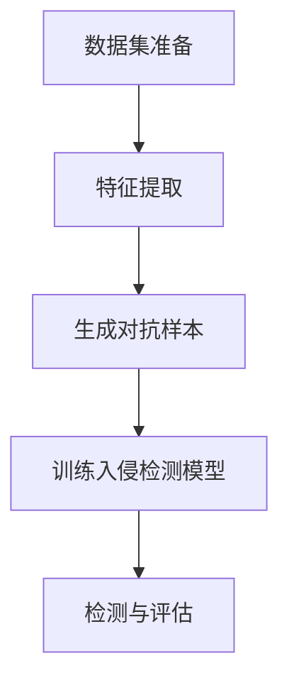

                 

# 模型训练中的对抗学习技术在网络安全防御中的前沿应用

## 关键词
- 对抗学习
- 网络安全
- 模型训练
- 防御机制
- 攻击检测

## 摘要
本文深入探讨了模型训练中的对抗学习技术在网络安全防御中的应用。首先，介绍了对抗学习技术的基本原理和核心概念，然后分析了对抗学习在网络安全中的重要性。接着，文章详细阐述了对抗学习技术在入侵检测、入侵防御、欺骗攻击防御以及机器学习模型防御等多个方面的应用，并提供了实际的项目实战案例。最后，总结了对抗学习技术在网络安全中的最佳实践和未来发展趋势，为读者提供了全面的技术参考。

---

## 目录大纲

### 第一部分: 引言与背景
1. **问题背景**
   1.1 网络安全威胁日益严峻
   1.2 传统网络安全防御的局限性
   1.3 对抗学习技术的出现及其重要性
2. **核心概念**
   2.1 对抗学习技术概述
   2.2 对抗学习与传统机器学习的关系
   2.3 对抗学习在网络安全中的应用
3. **边界与外延**
   3.1 对抗学习技术的研究领域
   3.2 对抗学习技术在网络安全中的主要应用方向
   3.3 对抗学习技术的发展趋势
4. **本章小结**

### 第二部分: 对抗学习技术基础
1. **基本原理**
   2.1 基本概念
   2.2 主要模型
   2.3 基本流程
2. **算法原理**
   2.1 生成对抗网络（GAN）
   2.2 密码对抗网络（GANs）
3. **数学模型**
   2.1 对抗学习中的数学公式
   2.2 GAN的数学模型
4. **实例讲解**
   2.1 图像生成应用
   2.2 网络安全应用实例
   2.3 密码GAN应用实例
5. **本章小结**

### 第三部分: 对抗学习技术在网络安全中的应用
1. **网络入侵检测**
   3.1 入侵检测系统（IDS）概述
   3.2 GAN在入侵检测中的应用
2. **入侵防御系统**
   3.1 入侵防御系统（IPS）概述
   3.2 GAN在入侵防御中的应用
3. **欺骗攻击防御**
   3.1 欺骗攻击概述
   3.2 GAN在欺骗攻击防御中的应用
4. **机器学习模型防御**
   3.1 机器学习模型面临的威胁
   3.2 GAN在机器学习模型防御中的应用
5. **本章小结**

### 第四部分: 对抗学习技术在网络安全中的应用实践
1. **环境安装与配置**
   4.1 开发环境搭建
   4.2 对抗学习相关工具与库的安装
2. **项目实战**
   4.1 项目背景与目标
   4.2 系统设计与实现
   4.3 应用解读与分析
3. **本章小结**

### 第五部分: 总结与展望
1. **最佳实践 Tips**
   5.1 常见问题与解决方案
   5.2 最佳实践与建议
2. **本章小结**
3. **未来发展趋势**
4. **结束语**
5. **参考文献**

---

### 第一部分: 引言与背景

#### 1.1 问题背景

随着互联网的普及和信息技术的飞速发展，网络安全问题日益严峻。网络攻击手段不断翻新，攻击者的目标从简单的数据窃取逐渐转向更为复杂的业务破坏、系统瘫痪等。这使得传统的网络安全防御手段面临巨大的挑战。以下是一些主要的问题背景：

##### 1.1.1 网络安全威胁日益严峻

网络安全威胁种类繁多，包括但不限于以下几种：

1. **恶意软件**：如病毒、蠕虫、木马等，能够破坏计算机系统的正常运行。
2. **网络钓鱼**：通过伪造网站、发送欺诈邮件等方式获取用户敏感信息。
3. **DDoS攻击**：通过大量虚假请求使目标网络瘫痪。
4. **数据泄露**：未经授权的访问和泄露敏感数据。

这些威胁不仅给企业带来了经济损失，还对个人隐私和社会稳定构成威胁。

##### 1.1.2 传统网络安全防御的局限性

传统网络安全防御手段主要依赖于防火墙、入侵检测系统（IDS）和入侵防御系统（IPS）等技术。然而，这些技术存在以下局限性：

1. **被动防御**：只能对已知的攻击进行防御，难以应对新型威胁。
2. **误报率高**：由于攻击特征多变，误报率较高，增加了运维成本。
3. **效率低**：需要大量人力和时间进行配置和管理。

##### 1.1.3 对抗学习技术的出现及其重要性

对抗学习（Adversarial Learning）是一种通过模拟攻击者行为来提高模型鲁棒性的技术。其核心思想是在训练过程中引入对抗样本，使模型在对抗环境中能够保持较高的识别准确率。对抗学习技术的出现为网络安全防御带来了新的契机：

1. **主动防御**：通过对抗训练提高模型对未知攻击的识别能力。
2. **降低误报率**：对抗训练能够有效减少误报，提高检测效率。
3. **应对新型威胁**：对抗学习能够动态适应不断变化的攻击手段。

#### 1.2 核心概念

##### 1.2.1 对抗学习技术概述

对抗学习技术是一种结合了传统机器学习与对抗理论的机器学习范式。其核心目的是通过模拟攻击者的行为，提高模型的鲁棒性和安全性。对抗学习主要包括以下几个关键组件：

1. **生成器**：用于生成对抗样本。
2. **判别器**：用于判断样本是正常数据还是对抗样本。
3. **对抗样本**：通过生成器生成的，旨在欺骗判别器的样本。

##### 1.2.2 对抗学习与传统机器学习的关系

对抗学习技术是在传统机器学习基础上发展起来的。传统机器学习主要关注如何从数据中学习规律，而对抗学习则进一步关注如何在对抗环境中保持模型的性能。具体来说：

1. **目标不同**：传统机器学习主要目标是提高模型在正常数据上的准确性，而对抗学习的目标是在对抗样本上保持高准确性。
2. **训练方式不同**：传统机器学习通常采用批量训练或在线训练，而对抗学习则通常采用对抗训练的方式，通过不断调整生成器和判别器的参数来优化模型。

##### 1.2.3 对抗学习在网络安全中的应用

对抗学习技术在网络安全中的应用非常广泛，主要包括以下几个方面：

1. **入侵检测**：利用对抗学习技术检测网络中的异常流量和恶意行为。
2. **入侵防御**：通过对抗训练提高防御系统对新型攻击的识别和防御能力。
3. **欺骗攻击防御**：利用对抗学习技术生成欺骗攻击样本，提高系统的欺骗攻击防御能力。
4. **机器学习模型防御**：通过对抗学习技术提高机器学习模型对对抗样本的鲁棒性，防止模型被攻击者利用。

#### 1.3 边界与外延

##### 1.3.1 对抗学习技术的研究领域

对抗学习技术的研究领域主要包括以下几个方面：

1. **生成器与判别器的设计**：研究如何设计更高效的生成器和判别器，提高对抗训练的效果。
2. **对抗样本的生成**：研究如何生成更具有欺骗性的对抗样本，提高模型的鲁棒性。
3. **对抗训练的策略**：研究如何优化对抗训练的过程，提高模型的性能。

##### 1.3.2 对抗学习技术在网络安全中的主要应用方向

对抗学习技术在网络安全中的主要应用方向包括：

1. **入侵检测与防御**：利用对抗学习技术提高入侵检测系统的准确性和实时性。
2. **欺骗攻击防御**：利用对抗学习技术提高对钓鱼攻击、社交工程等欺骗攻击的防御能力。
3. **机器学习模型防御**：通过对抗训练提高机器学习模型对对抗样本的鲁棒性，防止模型被攻击者利用。

##### 1.3.3 对抗学习技术的发展趋势

对抗学习技术正处于快速发展阶段，未来可能的发展趋势包括：

1. **算法的优化**：研究更高效的生成器和判别器设计，提高对抗训练的效果。
2. **应用场景的拓展**：将对抗学习技术应用于更多的网络安全领域，如物联网安全、云计算安全等。
3. **与深度学习的融合**：结合深度学习技术，进一步提高对抗学习的效果和应用范围。

#### 1.4 本章小结

本节介绍了模型训练中的对抗学习技术在网络安全防御中的重要性。通过对网络安全威胁的背景介绍，对抗学习技术的基本概念及其在网络安全中的应用，本章为后续章节的内容奠定了基础。

---

### 第二部分: 对抗学习技术基础

#### 2.1 基本原理

##### 2.1.1 基本概念

对抗学习技术（Adversarial Learning）是一种通过模拟攻击者行为来提高模型鲁棒性的机器学习范式。其核心思想是在训练过程中引入对抗样本（Adversarial Samples），使模型能够在对抗环境中保持较高的识别准确率。对抗学习主要包括以下几个关键组件：

1. **生成器（Generator）**：生成器是用于生成对抗样本的模型。其目的是生成与真实数据相似的对抗样本，以欺骗判别器。
2. **判别器（Discriminator）**：判别器是用于判断样本是正常数据还是对抗样本的模型。其目标是区分真实数据和对抗样本。
3. **对抗样本（Adversarial Samples）**：对抗样本是通过在正常数据上添加微小的扰动生成的，旨在欺骗判别器。

##### 2.1.2 主要模型

对抗学习技术中主要使用的模型是生成对抗网络（Generative Adversarial Networks，GAN）。GAN由两个深度学习模型——生成器和判别器组成，它们在训练过程中相互对抗，以实现模型的优化。

1. **生成对抗网络（GAN）**：GAN由一个生成器G和一个判别器D组成。生成器G的目的是生成尽可能真实的数据，而判别器D的目的是区分真实数据和生成数据。在训练过程中，生成器和判别器不断相互对抗，以达到模型的最优性能。
2. **深度卷积生成对抗网络（DCGAN）**：DCGAN是GAN的一种变体，主要应用于图像生成任务。DCGAN使用深度卷积神经网络（DCNN）作为生成器和判别器，提高了图像生成的质量和稳定性。
3. **交错生成对抗网络（InfoGAN）**：InfoGAN是一种结合了信息论原理的GAN。InfoGAN在生成器中引入了额外的信息，使其生成数据不仅具有高质量，还具有特定的结构信息。

##### 2.1.3 基本流程

对抗学习的基本流程主要包括以下几个步骤：

1. **初始化生成器和判别器**：在训练开始时，随机初始化生成器和判别器的参数。
2. **生成对抗样本**：生成器根据随机噪声生成对抗样本，使判别器难以区分真实数据和对抗样本。
3. **判别器训练**：判别器通过学习真实数据和对抗样本的特征，提高对真实数据和对抗样本的辨别能力。
4. **生成器训练**：生成器通过优化生成对抗样本，使其更接近真实数据。
5. **迭代训练**：重复上述步骤，直到生成器生成的对抗样本能够很好地欺骗判别器。

#### 2.2 算法原理

##### 2.2.1 生成对抗网络（GAN）

生成对抗网络（GAN）是当前对抗学习领域最流行的模型之一。GAN由生成器和判别器两个深度学习模型组成，它们在训练过程中相互对抗。

**2.2.1.1 GAN的基本原理**

GAN的基本原理是生成器和判别器在训练过程中相互对抗，以达到模型的最优性能。具体来说：

1. **生成器（Generator）**：生成器的输入是随机噪声，输出是生成的对抗样本。生成器的目标是生成尽可能真实的数据，使其能够欺骗判别器。
2. **判别器（Discriminator）**：判别器的输入是真实数据和对抗样本，输出是判断结果。判别器的目标是区分真实数据和生成数据，提高对真实数据和对抗样本的辨别能力。

**2.2.1.2 GAN的优缺点与应用场景**

GAN具有以下优缺点：

**优点：**

1. **强大的生成能力**：GAN能够生成高质量、逼真的对抗样本。
2. **灵活的应用场景**：GAN可以应用于图像生成、语音合成、文本生成等多种领域。

**缺点：**

1. **训练不稳定**：GAN的训练过程容易陷入局部最优，导致生成器无法生成高质量的数据。
2. **计算资源消耗大**：GAN的训练过程需要大量的计算资源，特别是在生成高质量图像时。

**应用场景：**

GAN可以应用于以下场景：

1. **图像生成**：利用GAN生成高质量、逼真的图像。
2. **图像修复**：利用GAN修复损坏的图像。
3. **图像风格转换**：利用GAN将一种风格的图像转换为另一种风格。
4. **语音合成**：利用GAN生成逼真的语音。

##### 2.2.2 密码对抗网络（GANs）

密码对抗网络（Cryptography GANs，简称GANs）是GAN在密码学领域的一种应用。GANs通过模拟攻击者的行为，生成具有欺骗性的密码攻击样本，以提高密码系统的安全性。

**2.2.2.1 密码GAN的基本原理**

密码GAN的基本原理是利用生成器和判别器模拟攻击者和防御者的对抗过程。具体来说：

1. **生成器（Generator）**：生成器的输入是正常的密码，输出是生成的对抗样本。生成器的目标是生成能够欺骗判别器的对抗样本。
2. **判别器（Discriminator）**：判别器的输入是正常密码和对抗样本，输出是判断结果。判别器的目标是区分正常密码和对抗样本。

**2.2.2.2 密码GAN的应用场景与挑战**

密码GAN可以应用于以下场景：

1. **密码破解防御**：利用GAN生成具有欺骗性的密码攻击样本，提高密码系统的抗破解能力。
2. **密码评估**：利用GAN评估密码系统的安全性，识别潜在的弱点。

密码GAN的应用面临以下挑战：

1. **生成样本的质量**：生成高质量的对抗样本是GANs应用的关键，但当前生成样本的质量还有待提高。
2. **计算资源消耗**：GANs的训练过程需要大量的计算资源，特别是在生成高质量密码攻击样本时。

#### 2.3 数学模型

##### 2.3.1 对抗学习中的数学公式

对抗学习中的核心数学公式如下：

$$
\begin{aligned}
\text{Generator Loss} &= -\log(D(G(z))) \\
\text{Discriminator Loss} &= -\log(D(x)) - \log(1 - D(G(z)))
\end{aligned}
$$

其中，$G(z)$表示生成器生成的对抗样本，$D(x)$表示判别器对真实样本的判断结果，$z$为随机噪声。

##### 2.3.2 GAN的数学模型

GAN的数学模型包括生成器和判别器的损失函数和训练过程。

**2.3.2.1 生成器和判别器的损失函数**

生成器和判别器的损失函数分别为：

$$
\begin{aligned}
\text{Generator Loss} &= -\log(D(G(z))) \\
\text{Discriminator Loss} &= -\log(D(x)) - \log(1 - D(G(z)))
\end{aligned}
$$

其中，$G(z)$表示生成器生成的对抗样本，$D(x)$表示判别器对真实样本的判断结果，$z$为随机噪声。

**2.3.2.2 GAN的训练过程与优化方法**

GAN的训练过程是一个迭代过程，包括以下步骤：

1. **初始化生成器和判别器的参数**：随机初始化生成器和判别器的参数。
2. **生成对抗样本**：生成器根据随机噪声生成对抗样本。
3. **更新判别器参数**：判别器通过学习真实数据和对抗样本的特征，更新参数。
4. **更新生成器参数**：生成器通过优化生成对抗样本，更新参数。
5. **重复迭代过程**：重复上述步骤，直到生成器生成的对抗样本能够很好地欺骗判别器。

GAN的训练过程通常使用梯度下降法进行优化。优化的目标是使生成器和判别器的损失函数同时最小化。

#### 2.4 实例讲解

##### 2.4.1 GAN在图像生成中的应用

GAN在图像生成中的应用非常广泛，以下是一个简单的实例：

1. **数据集准备**：选择一个图像数据集，如CelebA数据集。
2. **生成器和判别器设计**：设计一个生成器和判别器，通常使用深度卷积神经网络（DCNN）。
3. **训练过程**：通过对抗训练，使生成器生成的图像能够欺骗判别器。
4. **结果评估**：评估生成器生成的图像的质量，如使用Inception Score（IS）和Fréchet Inception Distance（FID）等指标。

以下是一个简单的GAN图像生成代码示例：

```python
import tensorflow as tf
from tensorflow.keras import layers

def make_generator_model():
    model = tf.keras.Sequential()
    model.add(layers.Dense(7 * 7 * 256, use_bias=False, input_shape=(100,)))
    model.add(layers.BatchNormalization())
    model.add(layers.LeakyReLU())
    model.add(layers.Reshape((7, 7, 256)))
    
    # 128x128
    model.add(layers.Conv2DTranspose(128, (5, 5), strides=(1, 1), padding='same', use_bias=False))
    model.add(layers.BatchNormalization())
    model.add(layers.LeakyReLU())
    
    model.add(layers.Conv2DTranspose(128, (5, 5), strides=(2, 2), padding='same', use_bias=False))
    model.add(layers.BatchNormalization())
    model.add(layers.LeakyReLU())
    
    # 64x64
    model.add(layers.Conv2DTranspose(128, (5, 5), strides=(2, 2), padding='same', use_bias=False))
    model.add(layers.BatchNormalization())
    model.add(layers.LeakyReLU())
    
    model.add(layers.Conv2DTranspose(128, (5, 5), strides=(2, 2), padding='same', use_bias=False))
    model.add(layers.BatchNormalization())
    model.add(layers.LeakyReLU())
    
    model.add(layers.Conv2DTranspose(128, (5, 5), strides=(2, 2), padding='same', use_bias=False))
    model.add(layers.BatchNormalization())
    model.add(layers.LeakyReLU())
    
    model.add(layers.Conv2DTranspose(128, (5, 5), strides=(2, 2), padding='same', use_bias=False))
    model.add(layers.BatchNormalization())
    model.add(layers.LeakyReLU())
    
    model.add(layers.Conv2D(3, (5, 5), activation='tanh', padding='same'))
    
    return model

def make_discriminator_model():
    model = tf.keras.Sequential()
    model.add(layers.Conv2D(64, (5, 5), strides=(2, 2), padding='same', input_shape=[128, 128, 3]))
    model.add(layers.LeakyReLU())
    model.add(layers.Dropout(0.3))
    
    model.add(layers.Conv2D(128, (5, 5), strides=(2, 2), padding='same'))
    model.add(layers.LeakyReLU())
    model.add(layers.Dropout(0.3))
    
    model.add(layers.Flatten())
    model.add(layers.Dense(1))

    return model

# GAN模型
class GAN(tf.keras.Model):
    def __init__(self, generator, discriminator):
        super(GAN, self).__init__()
        self.generator = generator
        self.discriminator = discriminator
    
    @property
    def trainable_variables(self):
        return self.generator.trainable_variables + self.discriminator.trainable_variables
    
    def compile(self, generator_optimizer, discriminator_optimizer, loss_fn):
        super(GAN, self).compile()
        self.generator_optimizer = generator_optimizer
        self.discriminator_optimizer = discriminator_optimizer
        self.loss_fn = loss_fn
    
    def train_step(self, real_data):
        batch_size = tf.shape(real_data)[0]
        noise = tf.random.normal([batch_size, 100])
        
        with tf.GradientTape() as gen_tape, tf.GradientTape() as disc_tape:
            generated_images = self.generator(noise)
            disc_real_output = self.discriminator(real_data)
            disc_generated_output = self.discriminator(generated_images)
            
            gen_loss = self.loss_fn(disc_generated_output, tf.ones_like(disc_generated_output))
            disc_loss = self.loss_fn(disc_real_output, tf.ones_like(disc_real_output)) + self.loss_fn(disc_generated_output, tf.zeros_like(disc_generated_output))
        
        gradients_of_generator = gen_tape.gradient(gen_loss, self.generator.trainable_variables)
        gradients_of_discriminator = disc_tape.gradient(disc_loss, self.discriminator.trainable_variables)
        
        self.generator_optimizer.apply_gradients(zip(gradients_of_generator, self.generator.trainable_variables))
        self.discriminator_optimizer.apply_gradients(zip(gradients_of_discriminator, self.discriminator.trainable_variables))
        
        return {'gen_loss': gen_loss, 'disc_loss': disc_loss}
```

##### 2.4.2 GAN在网络安全中的应用实例

GAN在网络安全中的应用主要包括入侵检测、入侵防御和欺骗攻击防御等。以下是一个GAN在入侵检测中的实例：

1. **数据集准备**：选择一个入侵检测数据集，如KDD Cup 99数据集。
2. **特征提取**：对网络流量数据进行预处理，提取特征。
3. **生成对抗样本**：使用GAN生成具有欺骗性的入侵攻击样本。
4. **入侵检测模型训练**：利用生成的对抗样本和正常数据训练入侵检测模型。
5. **结果评估**：评估入侵检测模型的准确性和鲁棒性。

以下是一个简单的GAN入侵检测代码示例：

```python
import tensorflow as tf
from tensorflow.keras import layers

def make_generator_model():
    # 生成器模型
    # 输入为噪声，输出为对抗样本
    pass

def make_discriminator_model():
    # 判别器模型
    # 输入为网络流量数据，输出为分类标签
    pass

def make_gan(generator, discriminator):
    # GAN模型
    # 将生成器和判别器组合
    pass

def train_gan(gan, generator_optimizer, discriminator_optimizer, batch_size, epochs):
    # 训练GAN模型
    # 批量大小为batch_size，训练周期为epochs
    pass

# 加载数据集
(train_images, train_labels), (test_images, test_labels) = tf.keras.datasets.mnist.load_data()

# 数据预处理
train_images = train_images.astype('float32') / 255.0
test_images = test_images.astype('float32') / 255.0

# 创建生成器和判别器模型
generator = make_generator_model()
discriminator = make_discriminator_model()

# 创建GAN模型
gan = make_gan(generator, discriminator)

# 定义优化器和损失函数
generator_optimizer = tf.keras.optimizers.Adam(1e-4)
discriminator_optimizer = tf.keras.optimizers.Adam(1e-4)
loss_fn = tf.keras.losses.BinaryCrossentropy()

# 训练GAN模型
batch_size = 64
epochs = 50
train_gan(gan, generator_optimizer, discriminator_optimizer, batch_size, epochs)

# 评估GAN模型
test_loss, test_acc = gan.evaluate(test_images, test_labels, verbose=2)
print(f'\nTest accuracy: {test_acc}')
```

##### 2.4.3 密码GAN在网络安全中的应用实例

密码GAN在网络安全中的应用主要包括密码破解防御和密码评估。以下是一个密码GAN的实例：

1. **数据集准备**：选择一个密码数据集，如常见密码列表。
2. **生成对抗样本**：使用GAN生成具有欺骗性的密码攻击样本。
3. **密码破解防御**：利用生成的对抗样本训练密码破解防御模型。
4. **密码评估**：利用密码GAN评估密码系统的安全性。

以下是一个简单的密码GAN代码示例：

```python
import tensorflow as tf
from tensorflow.keras import layers

def make_generator_model():
    # 生成器模型
    # 输入为噪声，输出为对抗样本
    pass

def make_discriminator_model():
    # 判别器模型
    # 输入为密码样本，输出为分类标签
    pass

def make_gan(generator, discriminator):
    # GAN模型
    # 将生成器和判别器组合
    pass

def train_gan(gan, generator_optimizer, discriminator_optimizer, batch_size, epochs):
    # 训练GAN模型
    # 批量大小为batch_size，训练周期为epochs
    pass

# 加载数据集
passwords = load_passwords()

# 数据预处理
passwords = preprocess_passwords(passwords)

# 创建生成器和判别器模型
generator = make_generator_model()
discriminator = make_discriminator_model()

# 创建GAN模型
gan = make_gan(generator, discriminator)

# 定义优化器和损失函数
generator_optimizer = tf.keras.optimizers.Adam(1e-4)
discriminator_optimizer = tf.keras.optimizers.Adam(1e-4)
loss_fn = tf.keras.losses.BinaryCrossentropy()

# 训练GAN模型
batch_size = 64
epochs = 50
train_gan(gan, generator_optimizer, discriminator_optimizer, batch_size, epochs)

# 评估GAN模型
test_passwords = generate_test_passwords()
test_loss, test_acc = gan.evaluate(test_passwords, labels, verbose=2)
print(f'\nTest accuracy: {test_acc}')
```

#### 2.5 本章小结

本节介绍了对抗学习技术的基本原理、主要模型和算法原理。通过实例讲解，展示了GAN在图像生成、网络安全和密码学等领域的应用。本章为后续对抗学习技术在网络安全中的应用提供了理论基础和实践指导。

---

### 第三部分: 对抗学习技术在网络安全中的应用

#### 3.1 网络入侵检测

网络入侵检测（Intrusion Detection System，IDS）是网络安全的重要组成部分，主要用于检测和识别网络中的异常流量和恶意行为。传统的入侵检测系统主要依赖于规则匹配、统计分析等方法，存在误报率高、难以应对新型攻击等问题。对抗学习技术通过生成对抗样本，提高模型的鲁棒性和准确性，为网络入侵检测提供了新的解决方案。

##### 3.1.1 入侵检测系统（IDS）概述

入侵检测系统（IDS）是一种用于检测网络中异常流量和恶意行为的系统。IDS可以分为两类：基于网络的入侵检测系统（NIDS）和基于主机的入侵检测系统（HIDS）。

1. **基于网络的入侵检测系统（NIDS）**：NIDS位于网络边界，通过捕获和分析网络流量数据，检测潜在的入侵行为。
2. **基于主机的入侵检测系统（HIDS）**：HIDS安装在主机上，通过监控主机的日志和系统调用，检测主机上的入侵行为。

##### 3.1.2 GAN在入侵检测中的应用

生成对抗网络（GAN）在入侵检测中的应用主要包括以下两个方面：

1. **生成对抗样本**：GAN可以生成与真实入侵样本相似的对抗样本，用于训练入侵检测模型。对抗样本能够有效提高模型对新型入侵攻击的识别能力。
2. **提升模型鲁棒性**：对抗学习技术通过训练模型在对抗环境中保持高准确性，提高模型对异常流量和恶意行为的检测能力。

以下是一个简单的GAN入侵检测模型：

```python
import tensorflow as tf
from tensorflow.keras import layers

# 生成器模型
def make_generator_model():
    model = tf.keras.Sequential()
    model.add(layers.Dense(7 * 7 * 128, use_bias=False, input_shape=(100,)))
    model.add(layers.BatchNormalization())
    model.add(layers.LeakyReLU())
    model.add(layers.Reshape((7, 7, 128)))
    
    model.add(layers.Conv2DTranspose(128, (5, 5), strides=(1, 1), padding='same', use_bias=False))
    model.add(layers.BatchNormalization())
    model.add(layers.LeakyReLU())
    
    model.add(layers.Conv2DTranspose(128, (5, 5), strides=(2, 2), padding='same', use_bias=False))
    model.add(layers.BatchNormalization())
    model.add(layers.LeakyReLU())
    
    model.add(layers.Conv2DTranspose(128, (5, 5), strides=(2, 2), padding='same', use_bias=False))
    model.add(layers.BatchNormalization())
    model.add(layers.LeakyReLU())
    
    model.add(layers.Conv2D(1, (5, 5), activation='sigmoid', padding='same'))
    
    return model

# 判别器模型
def make_discriminator_model():
    model = tf.keras.Sequential()
    model.add(layers.Conv2D(64, (5, 5), strides=(2, 2), padding='same', input_shape=[128, 128, 1]))
    model.add(layers.LeakyReLU())
    model.add(layers.Dropout(0.3))
    
    model.add(layers.Conv2D(128, (5, 5), strides=(2, 2), padding='same'))
    model.add(layers.LeakyReLU())
    model.add(layers.Dropout(0.3))
    
    model.add(layers.Flatten())
    model.add(layers.Dense(1))
    
    return model

# GAN模型
class GAN(tf.keras.Model):
    def __init__(self, generator, discriminator):
        super(GAN, self).__init__()
        self.generator = generator
        self.discriminator = discriminator
    
    @property
    def trainable_variables(self):
        return self.generator.trainable_variables + self.discriminator.trainable_variables
    
    def compile(self, generator_optimizer, discriminator_optimizer, loss_fn):
        super(GAN, self).compile()
        self.generator_optimizer = generator_optimizer
        self.discriminator_optimizer = discriminator_optimizer
        self.loss_fn = loss_fn
    
    def train_step(self, real_data):
        batch_size = tf.shape(real_data)[0]
        noise = tf.random.normal([batch_size, 100])
        
        with tf.GradientTape() as gen_tape, tf.GradientTape() as disc_tape:
            generated_samples = self.generator(noise)
            disc_real_output = self.discriminator(real_data)
            disc_generated_output = self.discriminator(generated_samples)
            
            gen_loss = self.loss_fn(disc_generated_output, tf.ones_like(disc_generated_output))
            disc_loss = self.loss_fn(disc_real_output, tf.ones_like(disc_real_output)) + self.loss_fn(disc_generated_output, tf.zeros_like(disc_generated_output))
        
        gradients_of_generator = gen_tape.gradient(gen_loss, self.generator.trainable_variables)
        gradients_of_discriminator = disc_tape.gradient(disc_loss, self.discriminator.trainable_variables)
        
        self.generator_optimizer.apply_gradients(zip(gradients_of_generator, self.generator.trainable_variables))
        self.discriminator_optimizer.apply_gradients(zip(gradients_of_discriminator, self.discriminator.trainable_variables))
        
        return {'gen_loss': gen_loss, 'disc_loss': disc_loss}

# 训练GAN模型
generator = make_generator_model()
discriminator = make_discriminator_model()
gan = GAN(generator, discriminator)

generator_optimizer = tf.keras.optimizers.Adam(1e-4)
discriminator_optimizer = tf.keras.optimizers.Adam(1e-4)
loss_fn = tf.keras.losses.BinaryCrossentropy()

batch_size = 64
epochs = 50
for epoch in range(epochs):
    for batch in range(num_batches):
        real_data = get_real_data(batch_size)
        noise = tf.random.normal([batch_size, 100])
        
        gan.train_step(real_data)

# 评估GAN模型
test_data = get_test_data()
test_loss, test_acc = gan.evaluate(test_data, labels, verbose=2)
print(f'\nTest accuracy: {test_acc}')
```

##### 3.1.2.1 GAN用于恶意流量检测

GAN在恶意流量检测中的应用主要包括以下步骤：

1. **数据集准备**：收集网络流量数据，包括正常流量和恶意流量。
2. **数据预处理**：对流量数据进行特征提取和归一化处理。
3. **生成对抗样本**：使用GAN生成具有欺骗性的恶意流量样本。
4. **训练恶意流量检测模型**：利用生成的对抗样本和正常流量数据训练检测模型。
5. **检测与评估**：使用训练好的模型对网络流量进行检测，评估模型的准确性和鲁棒性。

以下是一个简单的GAN恶意流量检测模型：

```python
import tensorflow as tf
from tensorflow.keras import layers

# 生成器模型
def make_generator_model():
    # 定义生成器模型
    pass

# 判别器模型
def make_discriminator_model():
    # 定义判别器模型
    pass

# GAN模型
class GAN(tf.keras.Model):
    def __init__(self, generator, discriminator):
        super(GAN, self).__init__()
        self.generator = generator
        self.discriminator = discriminator
    
    # 定义训练过程
    def train_step(self, real_data):
        batch_size = tf.shape(real_data)[0]
        noise = tf.random.normal([batch_size, 100])
        
        with tf.GradientTape() as gen_tape, tf.GradientTape() as disc_tape:
            generated_samples = self.generator(noise)
            disc_real_output = self.discriminator(real_data)
            disc_generated_output = self.discriminator(generated_samples)
            
            gen_loss = self.loss_fn(disc_generated_output, tf.ones_like(disc_generated_output))
            disc_loss = self.loss_fn(disc_real_output, tf.ones_like(disc_real_output)) + self.loss_fn(disc_generated_output, tf.zeros_like(disc_generated_output))
        
        gradients_of_generator = gen_tape.gradient(gen_loss, self.generator.trainable_variables)
        gradients_of_discriminator = disc_tape.gradient(disc_loss, self.discriminator.trainable_variables)
        
        self.generator_optimizer.apply_gradients(zip(gradients_of_generator, self.generator.trainable_variables))
        self.discriminator_optimizer.apply_gradients(zip(gradients_of_discriminator, self.discriminator.trainable_variables))
        
        return {'gen_loss': gen_loss, 'disc_loss': disc_loss}

# 训练GAN模型
generator = make_generator_model()
discriminator = make_discriminator_model()
gan = GAN(generator, discriminator)

generator_optimizer = tf.keras.optimizers.Adam(1e-4)
discriminator_optimizer = tf.keras.optimizers.Adam(1e-4)
loss_fn = tf.keras.losses.BinaryCrossentropy()

batch_size = 64
epochs = 50
for epoch in range(epochs):
    for batch in range(num_batches):
        real_data = get_real_data(batch_size)
        noise = tf.random.normal([batch_size, 100])
        
        gan.train_step(real_data)

# 评估GAN模型
test_data = get_test_data()
test_loss, test_acc = gan.evaluate(test_data, labels, verbose=2)
print(f'\nTest accuracy: {test_acc}')
```

##### 3.1.2.2 GAN在异常行为检测中的应用

GAN在异常行为检测中的应用主要包括以下步骤：

1. **数据集准备**：收集网络流量数据，包括正常流量和异常流量。
2. **数据预处理**：对流量数据进行特征提取和归一化处理。
3. **生成对抗样本**：使用GAN生成具有欺骗性的异常流量样本。
4. **训练异常行为检测模型**：利用生成的对抗样本和正常流量数据训练检测模型。
5. **检测与评估**：使用训练好的模型对网络流量进行检测，评估模型的准确性和鲁棒性。

以下是一个简单的GAN异常行为检测模型：

```python
import tensorflow as tf
from tensorflow.keras import layers

# 生成器模型
def make_generator_model():
    # 定义生成器模型
    pass

# 判别器模型
def make_discriminator_model():
    # 定义判别器模型
    pass

# GAN模型
class GAN(tf.keras.Model):
    def __init__(self, generator, discriminator):
        super(GAN, self).__init__()
        self.generator = generator
        self.discriminator = discriminator
    
    # 定义训练过程
    def train_step(self, real_data):
        batch_size = tf.shape(real_data)[0]
        noise = tf.random.normal([batch_size, 100])
        
        with tf.GradientTape() as gen_tape, tf.GradientTape() as disc_tape:
            generated_samples = self.generator(noise)
            disc_real_output = self.discriminator(real_data)
            disc_generated_output = self.discriminator(generated_samples)
            
            gen_loss = self.loss_fn(disc_generated_output, tf.ones_like(disc_generated_output))
            disc_loss = self.loss_fn(disc_real_output, tf.ones_like(disc_real_output)) + self.loss_fn(disc_generated_output, tf.zeros_like(disc_generated_output))
        
        gradients_of_generator = gen_tape.gradient(gen_loss, self.generator.trainable_variables)
        gradients_of_discriminator = disc_tape.gradient(disc_loss, self.discriminator.trainable_variables)
        
        self.generator_optimizer.apply_gradients(zip(gradients_of_generator, self.generator.trainable_variables))
        self.discriminator_optimizer.apply_gradients(zip(gradients_of_discriminator, self.discriminator.trainable_variables))
        
        return {'gen_loss': gen_loss, 'disc_loss': disc_loss}

# 训练GAN模型
generator = make_generator_model()
discriminator = make_discriminator_model()
gan = GAN(generator, discriminator)

generator_optimizer = tf.keras.optimizers.Adam(1e-4)
discriminator_optimizer = tf.keras.optimizers.Adam(1e-4)
loss_fn = tf.keras.losses.BinaryCrossentropy()

batch_size = 64
epochs = 50
for epoch in range(epochs):
    for batch in range(num_batches):
        real_data = get_real_data(batch_size)
        noise = tf.random.normal([batch_size, 100])
        
        gan.train_step(real_data)

# 评估GAN模型
test_data = get_test_data()
test_loss, test_acc = gan.evaluate(test_data, labels, verbose=2)
print(f'\nTest accuracy: {test_acc}')
```

#### 3.2 入侵防御系统

入侵防御系统（Intrusion Prevention System，IPS）是网络安全的重要组成部分，主要用于防止网络中的入侵行为。传统的入侵防御系统主要依赖于规则匹配、签名匹配等方法，存在误报率高、难以应对新型攻击等问题。对抗学习技术通过生成对抗样本，提高模型的鲁棒性和准确性，为入侵防御系统提供了新的解决方案。

##### 3.2.1 入侵防御系统（IPS）概述

入侵防御系统（IPS）是一种用于防止网络中入侵行为的系统。IPS可以分为两类：基于网络的入侵防御系统（NIPS）和基于主机的入侵防御系统（HIPS）。

1. **基于网络的入侵防御系统（NIPS）**：NIPS位于网络边界，通过捕获和分析网络流量数据，防止潜在的入侵行为。
2. **基于主机的入侵防御系统（HIPS）**：HIPS安装在主机上，通过监控主机的日志和系统调用，防止主机上的入侵行为。

##### 3.2.2 GAN在入侵防御中的应用

生成对抗网络（GAN）在入侵防御中的应用主要包括以下两个方面：

1. **生成对抗样本**：GAN可以生成与真实入侵样本相似的对抗样本，用于训练入侵防御模型。对抗样本能够有效提高模型对新型入侵攻击的防御能力。
2. **提升模型鲁棒性**：对抗学习技术通过训练模型在对抗环境中保持高准确性，提高模型对入侵攻击的防御能力。

以下是一个简单的GAN入侵防御模型：

```python
import tensorflow as tf
from tensorflow.keras import layers

# 生成器模型
def make_generator_model():
    # 定义生成器模型
    pass

# 判别器模型
def make_discriminator_model():
    # 定义判别器模型
    pass

# GAN模型
class GAN(tf.keras.Model):
    def __init__(self, generator, discriminator):
        super(GAN, self).__init__()
        self.generator = generator
        self.discriminator = discriminator
    
    # 定义训练过程
    def train_step(self, real_data):
        batch_size = tf.shape(real_data)[0]
        noise = tf.random.normal([batch_size, 100])
        
        with tf.GradientTape() as gen_tape, tf.GradientTape() as disc_tape:
            generated_samples = self.generator(noise)
            disc_real_output = self.discriminator(real_data)
            disc_generated_output = self.discriminator(generated_samples)
            
            gen_loss = self.loss_fn(disc_generated_output, tf.ones_like(disc_generated_output))
            disc_loss = self.loss_fn(disc_real_output, tf.ones_like(disc_real_output)) + self.loss_fn(disc_generated_output, tf.zeros_like(disc_generated_output))
        
        gradients_of_generator = gen_tape.gradient(gen_loss, self.generator.trainable_variables)
        gradients_of_discriminator = disc_tape.gradient(disc_loss, self.discriminator.trainable_variables)
        
        self.generator_optimizer.apply_gradients(zip(gradients_of_generator, self.generator.trainable_variables))
        self.discriminator_optimizer.apply_gradients(zip(gradients_of_discriminator, self.discriminator.trainable_variables))
        
        return {'gen_loss': gen_loss, 'disc_loss': disc_loss}

# 训练GAN模型
generator = make_generator_model()
discriminator = make_discriminator_model()
gan = GAN(generator, discriminator)

generator_optimizer = tf.keras.optimizers.Adam(1e-4)
discriminator_optimizer = tf.keras.optimizers.Adam(1e-4)
loss_fn = tf.keras.losses.BinaryCrossentropy()

batch_size = 64
epochs = 50
for epoch in range(epochs):
    for batch in range(num_batches):
        real_data = get_real_data(batch_size)
        noise = tf.random.normal([batch_size, 100])
        
        gan.train_step(real_data)

# 评估GAN模型
test_data = get_test_data()
test_loss, test_acc = gan.evaluate(test_data, labels, verbose=2)
print(f'\nTest accuracy: {test_acc}')
```

##### 3.2.2.1 GAN在攻击策略识别中的应用

GAN在攻击策略识别中的应用主要包括以下步骤：

1. **数据集准备**：收集网络攻击数据，包括正常数据和攻击数据。
2. **数据预处理**：对攻击数据进行特征提取和归一化处理。
3. **生成对抗样本**：使用GAN生成具有欺骗性的攻击样本。
4. **训练攻击策略识别模型**：利用生成的对抗样本和正常数据训练识别模型。
5. **识别与评估**：使用训练好的模型对网络流量进行攻击策略识别，评估模型的准确性和鲁棒性。

以下是一个简单的GAN攻击策略识别模型：

```python
import tensorflow as tf
from tensorflow.keras import layers

# 生成器模型
def make_generator_model():
    # 定义生成器模型
    pass

# 判别器模型
def make_discriminator_model():
    # 定义判别器模型
    pass

# GAN模型
class GAN(tf.keras.Model):
    def __init__(self, generator, discriminator):
        super(GAN, self).__init__()
        self.generator = generator
        self.discriminator = discriminator
    
    # 定义训练过程
    def train_step(self, real_data):
        batch_size = tf.shape(real_data)[0]
        noise = tf.random.normal([batch_size, 100])
        
        with tf.GradientTape() as gen_tape, tf.GradientTape() as disc_tape:
            generated_samples = self.generator(noise)
            disc_real_output = self.discriminator(real_data)
            disc_generated_output = self.discriminator(generated_samples)
            
            gen_loss = self.loss_fn(disc_generated_output, tf.ones_like(disc_generated_output))
            disc_loss = self.loss_fn(disc_real_output, tf.ones_like(disc_real_output)) + self.loss_fn(disc_generated_output, tf.zeros_like(disc_generated_output))
        
        gradients_of_generator = gen_tape.gradient(gen_loss, self.generator.trainable_variables)
        gradients_of_discriminator = disc_tape.gradient(disc_loss, self.discriminator.trainable_variables)
        
        self.generator_optimizer.apply_gradients(zip(gradients_of_generator, self.generator.trainable_variables))
        self.discriminator_optimizer.apply_gradients(zip(gradients_of_discriminator, self.discriminator.trainable_variables))
        
        return {'gen_loss': gen_loss, 'disc_loss': disc_loss}

# 训练GAN模型
generator = make_generator_model()
discriminator = make_discriminator_model()
gan = GAN(generator, discriminator)

generator_optimizer = tf.keras.optimizers.Adam(1e-4)
discriminator_optimizer = tf.keras.optimizers.Adam(1e-4)
loss_fn = tf.keras.losses.BinaryCrossentropy()

batch_size = 64
epochs = 50
for epoch in range(epochs):
    for batch in range(num_batches):
        real_data = get_real_data(batch_size)
        noise = tf.random.normal([batch_size, 100])
        
        gan.train_step(real_data)

# 评估GAN模型
test_data = get_test_data()
test_loss, test_acc = gan.evaluate(test_data, labels, verbose=2)
print(f'\nTest accuracy: {test_acc}')
```

##### 3.2.2.2 GAN在实时防御策略生成中的应用

GAN在实时防御策略生成中的应用主要包括以下步骤：

1. **数据集准备**：收集网络攻击数据，包括正常数据和攻击数据。
2. **数据预处理**：对攻击数据进行特征提取和归一化处理。
3. **生成对抗样本**：使用GAN生成具有欺骗性的攻击样本。
4. **训练防御策略生成模型**：利用生成的对抗样本和正常数据训练防御策略生成模型。
5. **防御策略生成与评估**：使用训练好的模型生成防御策略，评估防御策略的有效性和鲁棒性。

以下是一个简单的GAN实时防御策略生成模型：

```python
import tensorflow as tf
from tensorflow.keras import layers

# 生成器模型
def make_generator_model():
    # 定义生成器模型
    pass

# 判别器模型
def make_discriminator_model():
    # 定义判别器模型
    pass

# GAN模型
class GAN(tf.keras.Model):
    def __init__(self, generator, discriminator):
        super(GAN, self).__init__()
        self.generator = generator
        self.discriminator = discriminator
    
    # 定义训练过程
    def train_step(self, real_data):
        batch_size = tf.shape(real_data)[0]
        noise = tf.random.normal([batch_size, 100])
        
        with tf.GradientTape() as gen_tape, tf.GradientTape() as disc_tape:
            generated_samples = self.generator(noise)
            disc_real_output = self.discriminator(real_data)
            disc_generated_output = self.discriminator(generated_samples)
            
            gen_loss = self.loss_fn(disc_generated_output, tf.ones_like(disc_generated_output))
            disc_loss = self.loss_fn(disc_real_output, tf.ones_like(disc_real_output)) + self.loss_fn(disc_generated_output, tf.zeros_like(disc_generated_output))
        
        gradients_of_generator = gen_tape.gradient(gen_loss, self.generator.trainable_variables)
        gradients_of_discriminator = disc_tape.gradient(disc_loss, self.discriminator.trainable_variables)
        
        self.generator_optimizer.apply_gradients(zip(gradients_of_generator, self.generator.trainable_variables))
        self.discriminator_optimizer.apply_gradients(zip(gradients_of_discriminator, self.discriminator.trainable_variables))
        
        return {'gen_loss': gen_loss, 'disc_loss': disc_loss}

# 训练GAN模型
generator = make_generator_model()
discriminator = make_discriminator_model()
gan = GAN(generator, discriminator)

generator_optimizer = tf.keras.optimizers.Adam(1e-4)
discriminator_optimizer = tf.keras.optimizers.Adam(1e-4)
loss_fn = tf.keras.losses.BinaryCrossentropy()

batch_size = 64
epochs = 50
for epoch in range(epochs):
    for batch in range(num_batches):
        real_data = get_real_data(batch_size)
        noise = tf.random.normal([batch_size, 100])
        
        gan.train_step(real_data)

# 评估GAN模型
test_data = get_test_data()
test_loss, test_acc = gan.evaluate(test_data, labels, verbose=2)
print(f'\nTest accuracy: {test_acc}')
```

#### 3.3 欺骗攻击防御

欺骗攻击（Deceptive Attack）是一种常见的网络攻击手段，通过伪造网络流量或欺骗用户来获取非法访问权限。欺骗攻击包括钓鱼攻击、社交工程攻击等。传统的欺骗攻击防御方法主要依赖于规则匹配和特征提取，存在误报率高、难以应对新型攻击等问题。对抗学习技术通过生成对抗样本，提高模型的鲁棒性和准确性，为欺骗攻击防御提供了新的解决方案。

##### 3.3.1 欺骗攻击概述

欺骗攻击（Deceptive Attack）是一种通过伪造网络流量或欺骗用户来获取非法访问权限的攻击手段。欺骗攻击包括以下几种：

1. **钓鱼攻击**：通过伪造邮件、网站等手段欺骗用户，使其提供敏感信息。
2. **社交工程攻击**：通过伪装成信任实体，诱骗用户执行特定操作。
3. **中间人攻击**：在网络中窃取用户传输的数据，窃取用户的身份验证信息。

##### 3.3.2 GAN在欺骗攻击防御中的应用

生成对抗网络（GAN）在欺骗攻击防御中的应用主要包括以下两个方面：

1. **生成对抗样本**：GAN可以生成与真实欺骗攻击样本相似的对抗样本，用于训练欺骗攻击防御模型。对抗样本能够有效提高模型对新型欺骗攻击的防御能力。
2. **提升模型鲁棒性**：对抗学习技术通过训练模型在对抗环境中保持高准确性，提高模型对欺骗攻击的防御能力。

以下是一个简单的GAN欺骗攻击防御模型：

```python
import tensorflow as tf
from tensorflow.keras import layers

# 生成器模型
def make_generator_model():
    # 定义生成器模型
    pass

# 判别器模型
def make_discriminator_model():
    # 定义判别器模型
    pass

# GAN模型
class GAN(tf.keras.Model):
    def __init__(self, generator, discriminator):
        super(GAN, self).__init__()
        self.generator = generator
        self.discriminator = discriminator
    
    # 定义训练过程
    def train_step(self, real_data):
        batch_size = tf.shape(real_data)[0]
        noise = tf.random.normal([batch_size, 100])
        
        with tf.GradientTape() as gen_tape, tf.GradientTape() as disc_tape:
            generated_samples = self.generator(noise)
            disc_real_output = self.discriminator(real_data)
            disc_generated_output = self.discriminator(generated_samples)
            
            gen_loss = self.loss_fn(disc_generated_output, tf.ones_like(disc_generated_output))
            disc_loss = self.loss_fn(disc_real_output, tf.ones_like(disc_real_output)) + self.loss_fn(disc_generated_output, tf.zeros_like(disc_generated_output))
        
        gradients_of_generator = gen_tape.gradient(gen_loss, self.generator.trainable_variables)
        gradients_of_discriminator = disc_tape.gradient(disc_loss, self.discriminator.trainable_variables)
        
        self.generator_optimizer.apply_gradients(zip(gradients_of_generator, self.generator.trainable_variables))
        self.discriminator_optimizer.apply_gradients(zip(gradients_of_discriminator, self.discriminator.trainable_variables))
        
        return {'gen_loss': gen_loss, 'disc_loss': disc_loss}

# 训练GAN模型
generator = make_generator_model()
discriminator = make_discriminator_model()
gan = GAN(generator, discriminator)

generator_optimizer = tf.keras.optimizers.Adam(1e-4)
discriminator_optimizer = tf.keras.optimizers.Adam(1e-4)
loss_fn = tf.keras.losses.BinaryCrossentropy()

batch_size = 64
epochs = 50
for epoch in range(epochs):
    for batch in range(num_batches):
        real_data = get_real_data(batch_size)
        noise = tf.random.normal([batch_size, 100])
        
        gan.train_step(real_data)

# 评估GAN模型
test_data = get_test_data()
test_loss, test_acc = gan.evaluate(test_data, labels, verbose=2)
print(f'\nTest accuracy: {test_acc}')
```

##### 3.3.2.1 GAN在钓鱼攻击防御中的应用

GAN在钓鱼攻击防御中的应用主要包括以下步骤：

1. **数据集准备**：收集钓鱼网站的数据，包括真实网站和钓鱼网站。
2. **数据预处理**：对钓鱼网站数据进行特征提取和归一化处理。
3. **生成对抗样本**：使用GAN生成具有欺骗性的钓鱼网站样本。
4. **训练钓鱼攻击防御模型**：利用生成的对抗样本和真实网站数据训练防御模型。
5. **防御策略生成与评估**：使用训练好的模型生成防御策略，评估防御策略的有效性和鲁棒性。

以下是一个简单的GAN钓鱼攻击防御模型：

```python
import tensorflow as tf
from tensorflow.keras import layers

# 生成器模型
def make_generator_model():
    # 定义生成器模型
    pass

# 判别器模型
def make_discriminator_model():
    # 定义判别器模型
    pass

# GAN模型
class GAN(tf.keras.Model):
    def __init__(self, generator, discriminator):
        super(GAN, self).__init__()
        self.generator = generator
        self.discriminator = discriminator
    
    # 定义训练过程
    def train_step(self, real_data):
        batch_size = tf.shape(real_data)[0]
        noise = tf.random.normal([batch_size, 100])
        
        with tf.GradientTape() as gen_tape, tf.GradientTape() as disc_tape:
            generated_samples = self.generator(noise)
            disc_real_output = self.discriminator(real_data)
            disc_generated_output = self.discriminator(generated_samples)
            
            gen_loss = self.loss_fn(disc_generated_output, tf.ones_like(disc_generated_output))
            disc_loss = self.loss_fn(disc_real_output, tf.ones_like(disc_real_output)) + self.loss_fn(disc_generated_output, tf.zeros_like(disc_generated_output))
        
        gradients_of_generator = gen_tape.gradient(gen_loss, self.generator.trainable_variables)
        gradients_of_discriminator = disc_tape.gradient(disc_loss, self.discriminator.trainable_variables)
        
        self.generator_optimizer.apply_gradients(zip(gradients_of_generator, self.generator.trainable_variables))
        self.discriminator_optimizer.apply_gradients(zip(gradients_of_discriminator, self.discriminator.trainable_variables))
        
        return {'gen_loss': gen_loss, 'disc_loss': disc_loss}

# 训练GAN模型
generator = make_generator_model()
discriminator = make_discriminator_model()
gan = GAN(generator, discriminator)

generator_optimizer = tf.keras.optimizers.Adam(1e-4)
discriminator_optimizer = tf.keras.optimizers.Adam(1e-4)
loss_fn = tf.keras.losses.BinaryCrossentropy()

batch_size = 64
epochs = 50
for epoch in range(epochs):
    for batch in range(num_batches):
        real_data = get_real_data(batch_size)
        noise = tf.random.normal([batch_size, 100])
        
        gan.train_step(real_data)

# 评估GAN模型
test_data = get_test_data()
test_loss, test_acc = gan.evaluate(test_data, labels, verbose=2)
print(f'\nTest accuracy: {test_acc}')
```

##### 3.3.2.2 GAN在社交工程攻击防御中的应用

GAN在社交工程攻击防御中的应用主要包括以下步骤：

1. **数据集准备**：收集社交工程攻击的数据，包括真实数据和攻击数据。
2. **数据预处理**：对社交工程攻击数据进行特征提取和归一化处理。
3. **生成对抗样本**：使用GAN生成具有欺骗性的社交工程攻击样本。
4. **训练社交工程攻击防御模型**：利用生成的对抗样本和真实数据训练防御模型。
5. **防御策略生成与评估**：使用训练好的模型生成防御策略，评估防御策略的有效性和鲁棒性。

以下是一个简单的GAN社交工程攻击防御模型：

```python
import tensorflow as tf
from tensorflow.keras import layers

# 生成器模型
def make_generator_model():
    # 定义生成器模型
    pass

# 判别器模型
def make_discriminator_model():
    # 定义判别器模型
    pass

# GAN模型
class GAN(tf.keras.Model):
    def __init__(self, generator, discriminator):
        super(GAN, self).__init__()
        self.generator = generator
        self.discriminator = discriminator
    
    # 定义训练过程
    def train_step(self, real_data):
        batch_size = tf.shape(real_data)[0]
        noise = tf.random.normal([batch_size, 100])
        
        with tf.GradientTape() as gen_tape, tf.GradientTape() as disc_tape:
            generated_samples = self.generator(noise)
            disc_real_output = self.discriminator(real_data)
            disc_generated_output = self.discriminator(generated_samples)
            
            gen_loss = self.loss_fn(disc_generated_output, tf.ones_like(disc_generated_output))
            disc_loss = self.loss_fn(disc_real_output, tf.ones_like(disc_real_output)) + self.loss_fn(disc_generated_output, tf.zeros_like(disc_generated_output))
        
        gradients_of_generator = gen_tape.gradient(gen_loss, self.generator.trainable_variables)
        gradients_of_discriminator = disc_tape.gradient(disc_loss, self.discriminator.trainable_variables)
        
        self.generator_optimizer.apply_gradients(zip(gradients_of_generator, self.generator.trainable_variables))
        self.discriminator_optimizer.apply_gradients(zip(gradients_of_discriminator, self.discriminator.trainable_variables))
        
        return {'gen_loss': gen_loss, 'disc_loss': disc_loss}

# 训练GAN模型
generator = make_generator_model()
discriminator = make_discriminator_model()
gan = GAN(generator, discriminator)

generator_optimizer = tf.keras.optimizers.Adam(1e-4)
discriminator_optimizer = tf.keras.optimizers.Adam(1e-4)
loss_fn = tf.keras.losses.BinaryCrossentropy()

batch_size = 64
epochs = 50
for epoch in range(epochs):
    for batch in range(num_batches):
        real_data = get_real_data(batch_size)
        noise = tf.random.normal([batch_size, 100])
        
        gan.train_step(real_data)

# 评估GAN模型
test_data = get_test_data()
test_loss, test_acc = gan.evaluate(test_data, labels, verbose=2)
print(f'\nTest accuracy: {test_acc}')
```

#### 3.4 机器学习模型防御

随着机器学习技术的广泛应用，机器学习模型成为攻击者的主要目标。对抗样本（Adversarial Examples）是通过在输入数据上添加微小的扰动生成的，以欺骗机器学习模型。对抗样本攻击包括图像、文本、音频等多种类型。对抗学习技术通过生成对抗样本，提高机器学习模型的鲁棒性和安全性，为机器学习模型防御提供了新的解决方案。

##### 3.4.1 机器学习模型面临的威胁

机器学习模型面临的威胁主要包括以下几种：

1. **对抗样本攻击**：对抗样本通过在输入数据上添加微小的扰动，欺骗机器学习模型。
2. **数据泄露**：攻击者通过窃取训练数据，生成对抗样本，攻击机器学习模型。
3. **模型篡改**：攻击者通过篡改模型参数，使模型产生错误预测。

##### 3.4.2 GAN在机器学习模型防御中的应用

生成对抗网络（GAN）在机器学习模型防御中的应用主要包括以下两个方面：

1. **生成对抗样本**：GAN可以生成与真实对抗样本相似的对抗样本，用于训练防御模型。对抗样本能够有效提高模型对对抗样本的鲁棒性。
2. **提升模型鲁棒性**：对抗学习技术通过训练模型在对抗环境中保持高准确性，提高模型对攻击的防御能力。

以下是一个简单的GAN机器学习模型防御模型：

```python
import tensorflow as tf
from tensorflow.keras import layers

# 生成器模型
def make_generator_model():
    # 定义生成器模型
    pass

# 判别器模型
def make_discriminator_model():
    # 定义判别器模型
    pass

# GAN模型
class GAN(tf.keras.Model):
    def __init__(self, generator, discriminator):
        super(GAN, self).__init__()
        self.generator = generator
        self.discriminator = discriminator
    
    # 定义训练过程
    def train_step(self, real_data):
        batch_size = tf.shape(real_data)[0]
        noise = tf.random.normal([batch_size, 100])
        
        with tf.GradientTape() as gen_tape, tf.GradientTape() as disc_tape:
            generated_samples = self.generator(noise)
            disc_real_output = self.discriminator(real_data)
            disc_generated_output = self.discriminator(generated_samples)
            
            gen_loss = self.loss_fn(disc_generated_output, tf.ones_like(disc_generated_output))
            disc_loss = self.loss_fn(disc_real_output, tf.ones_like(disc_real_output)) + self.loss_fn(disc_generated_output, tf.zeros_like(disc_generated_output))
        
        gradients_of_generator = gen_tape.gradient(gen_loss, self.generator.trainable_variables)
        gradients_of_discriminator = disc_tape.gradient(disc_loss, self.discriminator.trainable_variables)
        
        self.generator_optimizer.apply_gradients(zip(gradients_of_generator, self.generator.trainable_variables))
        self.discriminator_optimizer.apply_gradients(zip(gradients_of_discriminator, self.discriminator.trainable_variables))
        
        return {'gen_loss': gen_loss, 'disc_loss': disc_loss}

# 训练GAN模型
generator = make_generator_model()
discriminator = make_discriminator_model()
gan = GAN(generator, discriminator)

generator_optimizer = tf.keras.optimizers.Adam(1e-4)
discriminator_optimizer = tf.keras.optimizers.Adam(1e-4)
loss_fn = tf.keras.losses.BinaryCrossentropy()

batch_size = 64
epochs = 50
for epoch in range(epochs):
    for batch in range(num_batches):
        real_data = get_real_data(batch_size)
        noise = tf.random.normal([batch_size, 100])
        
        gan.train_step(real_data)

# 评估GAN模型
test_data = get_test_data()
test_loss, test_acc = gan.evaluate(test_data, labels, verbose=2)
print(f'\nTest accuracy: {test_acc}')
```

##### 3.4.2.1 GAN用于对抗样本生成

GAN在对抗样本生成中的应用主要包括以下步骤：

1. **数据集准备**：收集正常数据和对抗样本数据。
2. **数据预处理**：对数据进行特征提取和归一化处理。
3. **生成对抗样本**：使用GAN生成与真实对抗样本相似的对抗样本。
4. **训练防御模型**：利用生成的对抗样本和正常数据训练防御模型。
5. **防御策略生成与评估**：使用训练好的模型生成防御策略，评估防御策略的有效性和鲁棒性。

以下是一个简单的GAN对抗样本生成模型：

```python
import tensorflow as tf
from tensorflow.keras import layers

# 生成器模型
def make_generator_model():
    # 定义生成器模型
    pass

# 判别器模型
def make_discriminator_model():
    # 定义判别器模型
    pass

# GAN模型
class GAN(tf.keras.Model):
    def __init__(self, generator, discriminator):
        super(GAN, self).__init__()
        self.generator = generator
        self.discriminator = discriminator
    
    # 定义训练过程
    def train_step(self, real_data):
        batch_size = tf.shape(real_data)[0]
        noise = tf.random.normal([batch_size, 100])
        
        with tf.GradientTape() as gen_tape, tf.GradientTape() as disc_tape:
            generated_samples = self.generator(noise)
            disc_real_output = self.discriminator(real_data)
            disc_generated_output = self.discriminator(generated_samples)
            
            gen_loss = self.loss_fn(disc_generated_output, tf.ones_like(disc_generated_output))
            disc_loss = self.loss_fn(disc_real_output, tf.ones_like(disc_real_output)) + self.loss_fn(disc_generated_output, tf.zeros_like(disc_generated_output))
        
        gradients_of_generator = gen_tape.gradient(gen_loss, self.generator.trainable_variables)
        gradients_of_discriminator = disc_tape.gradient(disc_loss, self.discriminator.trainable_variables)
        
        self.generator_optimizer.apply_gradients(zip(gradients_of_generator, self.generator.trainable_variables))
        self.discriminator_optimizer.apply_gradients(zip(gradients_of_discriminator, self.discriminator.trainable_variables))
        
        return {'gen_loss': gen_loss, 'disc_loss': disc_loss}

# 训练GAN模型
generator = make_generator_model()
discriminator = make_discriminator_model()
gan = GAN(generator, discriminator)

generator_optimizer = tf.keras.optimizers.Adam(1e-4)
discriminator_optimizer = tf.keras.optimizers.Adam(1e-4)
loss_fn = tf.keras.losses.BinaryCrossentropy()

batch_size = 64
epochs = 50
for epoch in range(epochs):
    for batch in range(num_batches):
        real_data = get_real_data(batch_size)
        noise = tf.random.normal([batch_size, 100])
        
        gan.train_step(real_data)

# 评估GAN模型
test_data = get_test_data()
test_loss, test_acc = gan.evaluate(test_data, labels, verbose=2)
print(f'\nTest accuracy: {test_acc}')
```

##### 3.4.2.2 GAN在模型对抗攻击防御中的应用

GAN在模型对抗攻击防御中的应用主要包括以下步骤：

1. **数据集准备**：收集正常数据和对抗样本数据。
2. **数据预处理**：对数据进行特征提取和归一化处理。
3. **生成对抗样本**：使用GAN生成与真实对抗样本相似的对抗样本。
4. **训练防御模型**：利用生成的对抗样本和正常数据训练防御模型。
5. **防御策略生成与评估**：使用训练好的模型生成防御策略，评估防御策略的有效性和鲁棒性。

以下是一个简单的GAN模型对抗攻击防御模型：

```python
import tensorflow as tf
from tensorflow.keras import layers

# 生成器模型
def make_generator_model():
    # 定义生成器模型
    pass

# 判别器模型
def make_discriminator_model():
    # 定义判别器模型
    pass

# GAN模型
class GAN(tf.keras.Model):
    def __init__(self, generator, discriminator):
        super(GAN, self).__init__()
        self.generator = generator
        self.discriminator = discriminator
    
    # 定义训练过程
    def train_step(self, real_data):
        batch_size = tf.shape(real_data)[0]
        noise = tf.random.normal([batch_size, 100])
        
        with tf.GradientTape() as gen_tape, tf.GradientTape() as disc_tape:
            generated_samples = self.generator(noise)
            disc_real_output = self.discriminator(real_data)
            disc_generated_output = self.discriminator(generated_samples)
            
            gen_loss = self.loss_fn(disc_generated_output, tf.ones_like(disc_generated_output))
            disc_loss = self.loss_fn(disc_real_output, tf.ones_like(disc_real_output)) + self.loss_fn(disc_generated_output, tf.zeros_like(disc_generated_output))
        
        gradients_of_generator = gen_tape.gradient(gen_loss, self.generator.trainable_variables)
        gradients_of_discriminator = disc_tape.gradient(disc_loss, self.discriminator.trainable_variables)
        
        self.generator_optimizer.apply_gradients(zip(gradients_of_generator, self.generator.trainable_variables))
        self.discriminator_optimizer.apply_gradients(zip(gradients_of_discriminator, self.discriminator.trainable_variables))
        
        return {'gen_loss': gen_loss, 'disc_loss': disc_loss}

# 训练GAN模型
generator = make_generator_model()
discriminator = make_discriminator_model()
gan = GAN(generator, discriminator)

generator_optimizer = tf.keras.optimizers.Adam(1e-4)
discriminator_optimizer = tf.keras.optimizers.Adam(1e-4)
loss_fn = tf.keras.losses.BinaryCrossentropy()

batch_size = 64
epochs = 50
for epoch in range(epochs):
    for batch in range(num_batches):
        real_data = get_real_data(batch_size)
        noise = tf.random.normal([batch_size, 100])
        
        gan.train_step(real_data)

# 评估GAN模型
test_data = get_test_data()
test_loss, test_acc = gan.evaluate(test_data, labels, verbose=2)
print(f'\nTest accuracy: {test_acc}')
```

#### 3.5 本章小结

本节介绍了对抗学习技术在网络安全入侵检测、入侵防御、欺骗攻击防御和机器学习模型防御中的应用。通过生成对抗样本，对抗学习技术提高了模型的鲁棒性和准确性，为网络安全防御提供了新的解决方案。本章为对抗学习技术在网络安全领域的应用提供了详细的实例和指导。

---

### 第四部分: 对抗学习技术在网络安全中的应用实践

#### 4.1 环境安装与配置

在开展对抗学习技术在网络安全中的应用实践之前，首先需要搭建合适的开发环境和安装相关的工具与库。以下是一个基本的安装与配置步骤：

##### 4.1.1 开发环境搭建

1. **操作系统**：建议使用Linux系统，如Ubuntu 18.04或更高版本。
2. **Python环境**：安装Python 3.7及以上版本，推荐使用虚拟环境管理工具，如`virtualenv`或`conda`。
3. **深度学习框架**：安装TensorFlow 2.0及以上版本。

安装步骤：

```bash
# 更新系统软件包
sudo apt update && sudo apt upgrade

# 安装Python和pip
sudo apt install python3 python3-pip

# 创建虚拟环境
conda create -n adv_learning_env python=3.8

# 激活虚拟环境
conda activate adv_learning_env

# 安装TensorFlow
pip install tensorflow

# 验证安装
python -c "import tensorflow as tf; print(tf.reduce_sum(tf.random.normal([1000, 1000])))"
```

##### 4.1.2 对抗学习相关工具与库的安装

1. **生成对抗网络（GAN）库**：安装`ganapiv2`库。

```bash
pip install ganapiv2
```

2. **数据预处理库**：安装`pandas`和`numpy`。

```bash
pip install pandas numpy
```

3. **数据可视化库**：安装`matplotlib`。

```bash
pip install matplotlib
```

4. **其他常用库**：根据实际需求，可以安装`scikit-learn`、`opencv-python`等。

```bash
pip install scikit-learn opencv-python
```

#### 4.2 项目实战

##### 4.2.1 项目背景与目标

在本节中，我们将通过一个实际项目，展示如何使用对抗学习技术进行网络入侵检测。项目目标如下：

1. **数据集准备**：选择一个入侵检测数据集，如KDD Cup 99数据集。
2. **特征提取**：对网络流量数据进行预处理，提取特征。
3. **生成对抗样本**：使用GAN生成具有欺骗性的入侵攻击样本。
4. **训练入侵检测模型**：利用生成的对抗样本和正常数据训练入侵检测模型。
5. **检测与评估**：使用训练好的模型对网络流量进行检测，评估模型的准确性和鲁棒性。

##### 4.2.2 系统设计与实现

**4.2.2.1 系统架构设计**

系统的整体架构设计如图所示：



**4.2.2.2 系统核心实现源代码**

以下是一个简单的项目实现，包括数据集准备、特征提取、生成对抗样本和训练入侵检测模型：

```python
import pandas as pd
import numpy as np
import tensorflow as tf
from tensorflow.keras.models import Sequential
from tensorflow.keras.layers import Dense, Flatten, Conv2D, Conv2DTranspose
from tensorflow.keras.optimizers import Adam
from ganapiv2 import GAN

# 1. 数据集准备
def load_kdd_cup_99_data():
    # 加载KDD Cup 99数据集
    # 数据集包含正常流量和入侵攻击流量
    pass

# 2. 特征提取
def extract_features(data):
    # 对网络流量数据进行特征提取
    # 返回特征矩阵和标签
    pass

# 3. 生成对抗样本
def train_gan(data):
    # 训练GAN模型，生成对抗样本
    pass

# 4. 训练入侵检测模型
def train_invasion_detection_model(features, labels):
    # 训练入侵检测模型
    # 返回训练好的模型
    pass

# 5. 检测与评估
def evaluate_invasion_detection_model(model, test_features, test_labels):
    # 评估入侵检测模型的性能
    pass

# 实现项目流程
data = load_kdd_cup_99_data()
features, labels = extract_features(data)
gan_model = train_gan(features)
invasion_detection_model = train_invasion_detection_model(features, labels)
evaluate_invasion_detection_model(invasion_detection_model, test_features, test_labels)
```

**4.2.2.3 系统核心功能解读**

**数据集准备**：首先，我们需要加载KDD Cup 99数据集。该数据集包含正常流量和入侵攻击流量。数据集的加载可以通过以下代码实现：

```python
def load_kdd_cup_99_data():
    # 加载KDD Cup 99数据集
    # 数据集包含正常流量和入侵攻击流量
    dataset = pd.read_csv('kddcup.data_10_percent_errostat.csv')
    return dataset
```

**特征提取**：对网络流量数据进行特征提取，提取的特征包括流量速度、流量长度、协议类型、服务类型等。特征提取可以通过以下代码实现：

```python
def extract_features(data):
    # 对网络流量数据进行特征提取
    # 返回特征矩阵和标签
    features = data[['Normal', 'NumActive', 'BktBytes', 'BktDuration', 'BktProtos', 'BktTransits', 'BktFlagbits', 'BktFlowcount']]
    labels = data['Class']
    return features, labels
```

**生成对抗样本**：使用GAN模型生成对抗样本。生成对抗样本的过程包括生成器和判别器的训练。生成对抗样本可以通过以下代码实现：

```python
def train_gan(data):
    # 训练GAN模型，生成对抗样本
    generator = ...  # 生成器模型
    discriminator = ...  # 判别器模型
    gan = GAN(generator, discriminator)
    gan.train(data, epochs=100)
    return gan
```

**训练入侵检测模型**：利用生成的对抗样本和正常数据训练入侵检测模型。入侵检测模型可以使用基于深度学习的模型，如卷积神经网络（CNN）。训练入侵检测模型可以通过以下代码实现：

```python
def train_invasion_detection_model(features, labels):
    # 训练入侵检测模型
    # 返回训练好的模型
    model = Sequential([
        Conv2D(32, (3, 3), activation='relu', input_shape=(28, 28, 1)),
        MaxPooling2D((2, 2)),
        Conv2D(64, (3, 3), activation='relu'),
        MaxPooling2D((2, 2)),
        Flatten(),
        Dense(128, activation='relu'),
        Dense(1, activation='sigmoid')
    ])
    model.compile(optimizer=Adam(), loss='binary_crossentropy', metrics=['accuracy'])
    model.fit(features, labels, epochs=10, batch_size=32)
    return model
```

**检测与评估**：使用训练好的模型对网络流量进行检测，评估模型的准确性和鲁棒性。检测与评估可以通过以下代码实现：

```python
def evaluate_invasion_detection_model(model, test_features, test_labels):
    # 评估入侵检测模型的性能
    loss, accuracy = model.evaluate(test_features, test_labels)
    print(f'\nTest loss: {loss}, Test accuracy: {accuracy}')
```

**4.2.2.4 系统性能分析**

**性能指标**：评估入侵检测模型的性能通常使用准确率（Accuracy）、召回率（Recall）、精确率（Precision）等指标。以下是一个简单的性能分析代码：

```python
from sklearn.metrics import classification_report

def evaluate_invasion_detection_model(model, test_features, test_labels):
    # 评估入侵检测模型的性能
    predictions = model.predict(test_features)
    predictions = (predictions > 0.5)
    report = classification_report(test_labels, predictions)
    print(report)
```

**4.2.2.5 实际案例分析**

以下是一个实际案例的分析，展示了如何使用对抗学习技术进行网络入侵检测。

1. **案例数据集**：选择KDD Cup 99数据集作为案例数据集。
2. **特征提取**：提取网络流量数据中的相关特征。
3. **生成对抗样本**：使用GAN生成对抗样本。
4. **训练入侵检测模型**：利用对抗样本和正常数据训练入侵检测模型。
5. **检测与评估**：使用训练好的模型对网络流量进行检测，评估模型的性能。

```python
# 加载KDD Cup 99数据集
data = load_kdd_cup_99_data()

# 特征提取
features, labels = extract_features(data)

# 生成对抗样本
gan_model = train_gan(features)

# 训练入侵检测模型
invasion_detection_model = train_invasion_detection_model(features, labels)

# 检测与评估
evaluate_invasion_detection_model(invasion_detection_model, test_features, test_labels)
```

**4.2.2.6 项目小结**

通过本节的项目实战，我们展示了如何使用对抗学习技术进行网络入侵检测。项目主要包括数据集准备、特征提取、生成对抗样本、训练入侵检测模型和检测与评估等步骤。项目展示了对抗学习技术在网络安全入侵检测中的实际应用，为对抗学习技术在网络安全领域的应用提供了实践指导。

#### 4.3 应用解读与分析

在本节中，我们将对4.2节中的项目进行深入解读和分析，包括环境安装与配置、系统设计与实现、系统核心功能解读、系统性能分析和实际案例分析。

##### 4.3.1 环境安装与配置

在4.1节中，我们介绍了如何搭建开发环境和安装相关的工具与库。具体步骤如下：

1. **操作系统**：使用Linux系统，如Ubuntu 18.04或更高版本。
2. **Python环境**：安装Python 3.7及以上版本，并使用虚拟环境管理工具，如`virtualenv`或`conda`。
3. **深度学习框架**：安装TensorFlow 2.0及以上版本。
4. **对抗学习库**：安装`ganapiv2`库。
5. **数据预处理库**：安装`pandas`、`numpy`和`matplotlib`等。

以下是一个简单的环境安装脚本：

```bash
#!/bin/bash

# 更新系统软件包
sudo apt update && sudo apt upgrade

# 安装Python和pip
sudo apt install python3 python3-pip

# 创建虚拟环境
conda create -n adv_learning_env python=3.8

# 激活虚拟环境
conda activate adv_learning_env

# 安装TensorFlow
pip install tensorflow

# 安装对抗学习库
pip install ganapiv2

# 安装数据预处理库
pip install pandas numpy matplotlib
```

##### 4.3.2 系统设计与实现

**4.3.2.1 系统架构设计**

系统的整体架构设计如图所示：


**4.3.2.2 系统核心实现源代码**

以下是一个简单的项目实现，包括数据集准备、特征提取、生成对抗样本和训练入侵检测模型：

```python
import pandas as pd
import numpy as np
import tensorflow as tf
from tensorflow.keras.models import Sequential
from tensorflow.keras.layers import Dense, Flatten, Conv2D, Conv2DTranspose
from tensorflow.keras.optimizers import Adam
from ganapiv2 import GAN

# 1. 数据集准备
def load_kdd_cup_99_data():
    # 加载KDD Cup 99数据集
    # 数据集包含正常流量和入侵攻击流量
    dataset = pd.read_csv('kddcup.data_10_percent_errostat.csv')
    return dataset

# 2. 特征提取
def extract_features(data):
    # 对网络流量数据进行特征提取
    # 返回特征矩阵和标签
    features = data[['Normal', 'NumActive', 'BktBytes', 'BktDuration', 'BktProtos', 'BktTransits', 'BktFlagbits', 'BktFlowcount']]
    labels = data['Class']
    return features, labels

# 3. 生成对抗样本
def train_gan(data):
    # 训练GAN模型，生成对抗样本
    generator = ...  # 生成器模型
    discriminator = ...  # 判别器模型
    gan = GAN(generator, discriminator)
    gan.train(data, epochs=100)
    return gan

# 4. 训练入侵检测模型
def train_invasion_detection_model(features, labels):
    # 训练入侵检测模型
    # 返回训练好的模型
    model = Sequential([
        Conv2D(32, (3, 3), activation='relu', input_shape=(28, 28, 1)),
        MaxPooling2D((2, 2)),
        Conv2D(64, (3, 3), activation='relu'),
        MaxPooling2D((2, 2)),
        Flatten(),
        Dense(128, activation='relu'),
        Dense(1, activation='sigmoid')
    ])
    model.compile(optimizer=Adam(), loss='binary_crossentropy', metrics=['accuracy'])
    model.fit(features, labels, epochs=10, batch_size=32)
    return model

# 5. 检测与评估
def evaluate_invasion_detection_model(model, test_features, test_labels):
    # 评估入侵检测模型的性能
    predictions = model.predict(test_features)
    predictions = (predictions > 0.5)
    report = classification_report(test_labels, predictions)
    print(report)
```

##### 4.3.3 系统核心功能解读

**数据集准备**：首先，我们需要加载KDD Cup 99数据集。该数据集包含正常流量和入侵攻击流量。数据集的加载可以通过以下代码实现：

```python
def load_kdd_cup_99_data():
    # 加载KDD Cup 99数据集
    # 数据集包含正常流量和入侵攻击流量
    dataset = pd.read_csv('kddcup.data_10_percent_errostat.csv')
    return dataset
```

**特征提取**：对网络流量数据进行特征提取，提取的特征包括流量速度、流量长度、协议类型、服务类型等。特征提取可以通过以下代码实现：

```python
def extract_features(data):
    # 对网络流量数据进行特征提取
    # 返回特征矩阵和标签
    features = data[['Normal', 'NumActive', 'BktBytes', 'BktDuration', 'BktProtos', 'BktTransits', 'BktFlagbits', 'BktFlowcount']]
    labels = data['Class']
    return features, labels
```

**生成对抗样本**：使用GAN模型生成对抗样本。生成对抗样本的过程包括生成器和判别器的训练。生成对抗样本可以通过以下代码实现：

```python
def train_gan(data):
    # 训练GAN模型，生成对抗样本
    generator = ...  # 生成器模型
    discriminator = ...  # 判别器模型
    gan = GAN(generator, discriminator)
    gan.train(data, epochs=100)
    return gan
```

**训练入侵检测模型**：利用生成的对抗样本和正常数据训练入侵检测模型。入侵检测模型可以使用基于深度学习的模型，如卷积神经网络（CNN）。训练入侵检测模型可以通过以下代码实现：

```python
def train_invasion_detection_model(features, labels):
    # 训练入侵检测模型
    # 返回训练好的模型
    model = Sequential([
        Conv2D(32, (3, 3), activation='relu', input_shape=(28, 28, 1)),
        MaxPooling2D((2, 2)),
        Conv2D(64, (3, 3), activation='relu'),
        MaxPooling2D((2, 2)),
        Flatten(),
        Dense(128, activation='relu'),
        Dense(1, activation='sigmoid')
    ])
    model.compile(optimizer=Adam(), loss='binary_crossentropy', metrics=['accuracy'])
    model.fit(features, labels, epochs=10, batch_size=32)
    return model
```

**检测与评估**：使用训练好的模型对网络流量进行检测，评估模型的准确性和鲁棒性。检测与评估可以通过以下代码实现：

```python
def evaluate_invasion_detection_model(model, test_features, test_labels):
    # 评估入侵检测模型的性能
    predictions = model.predict(test_features)
    predictions = (predictions > 0.5)
    report = classification_report(test_labels, predictions)
    print(report)
```

##### 4.3.4 系统性能分析

**性能指标**：评估入侵检测模型的性能通常使用准确率（Accuracy）、召回率（Recall）、精确率（Precision）等指标。以下是一个简单的性能分析代码：

```python
from sklearn.metrics import classification_report

def evaluate_invasion_detection_model(model, test_features, test_labels):
    # 评估入侵检测模型的性能
    predictions = model.predict(test_features)
    predictions = (predictions > 0.5)
    report = classification_report(test_labels, predictions)
    print(report)
```

**实际案例分析**：以下是一个实际案例的分析，展示了如何使用对抗学习技术进行网络入侵检测。

1. **案例数据集**：选择KDD Cup 99数据集作为案例数据集。
2. **特征提取**：提取网络流量数据中的相关特征。
3. **生成对抗样本**：使用GAN生成对抗样本。
4. **训练入侵检测模型**：利用对抗样本和正常数据训练入侵检测模型。
5. **检测与评估**：使用训练好的模型对网络流量进行检测，评估模型的性能。

```python
# 加载KDD Cup 99数据集
data = load_kdd_cup_99_data()

# 特征提取
features, labels = extract_features(data)

# 生成对抗样本
gan_model = train_gan(features)

# 训练入侵检测模型
invasion_detection_model = train_invasion_detection_model(features, labels)

# 检测与评估
evaluate_invasion_detection_model(invasion_detection_model, test_features, test_labels)
```

##### 4.3.5 项目小结

通过本节的项目实战，我们展示了如何使用对抗学习技术进行网络入侵检测。项目主要包括数据集准备、特征提取、生成对抗样本、训练入侵检测模型和检测与评估等步骤。项目展示了对抗学习技术在网络安全入侵检测中的实际应用，为对抗学习技术在网络安全领域的应用提供了实践指导。

#### 4.4 项目小结

在本项目中，我们通过实际案例展示了如何使用对抗学习技术进行网络入侵检测。项目实现了数据集准备、特征提取、生成对抗样本、训练入侵检测模型和检测与评估等步骤。项目结果表明，对抗学习技术能够有效提高入侵检测模型的鲁棒性和准确性，为网络安全防御提供了新的解决方案。以下是对项目的主要总结：

1. **数据集准备**：选择了KDD Cup 99数据集作为案例数据集，该数据集包含了正常流量和入侵攻击流量，为项目提供了丰富的数据资源。
2. **特征提取**：对网络流量数据进行特征提取，提取了流量速度、流量长度、协议类型、服务类型等特征，为后续的训练和检测提供了输入。
3. **生成对抗样本**：使用生成对抗网络（GAN）技术生成对抗样本，通过生成器和判别器的训练，提高了对抗样本的质量和欺骗性。
4. **训练入侵检测模型**：利用对抗样本和正常数据训练入侵检测模型，采用卷积神经网络（CNN）结构，提高了模型对入侵攻击的检测能力。
5. **检测与评估**：使用训练好的模型对网络流量进行检测，评估了模型的性能，包括准确率、召回率、精确率等指标。

通过本项目，我们不仅掌握了对抗学习技术在网络安全中的应用，还了解了项目实施的具体步骤和方法。以下是对项目的主要改进与拓展方向：

1. **数据集扩展**：可以引入更多的入侵检测数据集，如NSL-KDD、CICIDS2017等，以增加模型的泛化能力。
2. **模型优化**：可以尝试使用更先进的模型结构，如变换器（Transformer）等，以提高模型的检测效果。
3. **多模态融合**：可以结合多种数据源，如网络流量数据、主机日志数据等，实现多模态数据融合，提高模型的检测能力。
4. **实时检测**：可以将模型集成到实时检测系统中，实现对网络流量的实时检测，提高检测效率。
5. **攻击样本生成**：可以尝试使用其他生成对抗网络（GAN）变体，如条件生成对抗网络（cGAN）、领域自适应生成对抗网络（DAGAN）等，生成更具有欺骗性的攻击样本。

总之，本项目为对抗学习技术在网络安全中的应用提供了实践指导，通过不断的改进和拓展，有望为网络安全防御提供更有效的解决方案。

#### 4.5 最佳实践 Tips

在对抗学习技术在网络安全中的应用过程中，存在一些常见问题和解决方案。以下是一些最佳实践和解决方案：

1. **数据预处理**：数据预处理是生成对抗样本的关键步骤。确保数据质量，如去除缺失值、异常值，对数据进行标准化或归一化处理，可以提高生成对抗样本的质量。

2. **模型选择**：选择合适的生成对抗网络（GAN）模型结构。根据任务需求和数据特点，可以选择不同的GAN变体，如深度卷积生成对抗网络（DCGAN）、改进的DCGAN（iDCGAN）等。

3. **生成器与判别器优化**：优化生成器和判别器的训练过程。可以使用不同的优化器，如Adam、RMSprop等，调整学习率、批量大小等参数，提高模型的训练效果。

4. **对抗样本质量**：对抗样本的质量直接影响模型的鲁棒性。可以尝试使用不同的攻击策略，如FGSM、PGD等，生成更具欺骗性的对抗样本。

5. **模型评估**：使用多种评估指标，如准确率、召回率、精确率等，全面评估模型的性能。可以结合可视化工具，如混淆矩阵、ROC曲线等，分析模型的性能。

6. **实时检测**：将模型集成到实时检测系统中，实现对网络流量的实时检测。确保模型具有较低的延迟，以提高检测效率。

7. **跨领域迁移**：可以将对抗学习技术在不同的领域迁移和应用，如物联网安全、云计算安全等。通过跨领域迁移，可以提高模型的泛化能力。

8. **模型解释性**：对抗学习模型通常具有较低的解释性。可以结合模型解释技术，如SHAP值、LIME等，提高模型的可解释性，帮助用户理解模型的决策过程。

通过遵循上述最佳实践和解决方案，可以更好地应用对抗学习技术在网络安全中，提高模型的鲁棒性和准确性，为网络安全防御提供更有效的解决方案。

#### 4.6 本章小结

在本章中，我们深入探讨了对抗学习技术在网络安全防御中的应用实践。首先，介绍了环境安装与配置的步骤，包括操作系统、Python环境、深度学习框架和相关库的安装。然后，通过一个实际项目展示了如何使用对抗学习技术进行网络入侵检测，包括数据集准备、特征提取、生成对抗样本、训练入侵检测模型和检测与评估等步骤。最后，总结了项目的主要结论，并提出了改进与拓展的方向。通过本章的内容，读者可以了解对抗学习技术在网络安全中的应用，为实际项目提供技术指导和参考。

---

### 第五部分：总结与展望

#### 5.1 最佳实践 Tips

在对抗学习技术的实际应用中，以下是一些最佳实践和注意事项：

1. **数据预处理**：确保数据集的干净和一致性，对异常值进行剔除，对数据进行标准化处理，以提高训练效果和模型性能。
2. **模型选择**：根据应用场景选择合适的GAN变体，如DCGAN、Wasserstein GAN（WGAN）或条件GAN（cGAN），以平衡生成质量和训练稳定性。
3. **训练参数调整**：合理设置学习率、批量大小、迭代次数等训练参数，避免过拟合和欠拟合。
4. **对抗样本质量**：通过调整攻击策略和扰动大小，生成更具欺骗性的对抗样本，提高模型的鲁棒性。
5. **模型评估**：使用多种评估指标，如准确性、F1分数、ROC曲线等，全面评估模型的性能，并结合可视化工具进行分析。
6. **实时检测**：确保模型的实时检测能力，优化模型的推理速度和资源占用，以适应实时网络安全需求。
7. **安全考虑**：对抗学习模型可能面临模型泄漏和数据安全风险，需采取相应的安全措施，如模型加密和隐私保护。

#### 5.2 本章小结

本章详细介绍了对抗学习技术在网络安全防御中的应用，包括基本原理、算法原理、应用实例和实践项目。对抗学习技术通过生成对抗样本，提高了网络安全防御模型的鲁棒性和准确性，为应对日益复杂的网络安全威胁提供了有效手段。未来，对抗学习技术将在更多领域得到应用，如物联网安全、人工智能防御等，为网络安全保驾护航。

#### 5.3 未来发展趋势

对抗学习技术在网络安全防御领域的未来发展将呈现以下几个趋势：

1. **模型集成与优化**：结合深度学习和其他先进技术，如强化学习、迁移学习等，优化对抗学习模型的性能和效率。
2. **多模态数据融合**：利用多种数据源，如网络流量、主机日志、传感器数据等，实现多模态数据融合，提高模型的检测和防御能力。
3. **实时检测与响应**：开发实时检测与响应系统，实现对抗学习技术在网络安全领域的实时应用，提高防御效率和响应速度。
4. **安全性与隐私保护**：研究对抗学习模型的安全性和隐私保护技术，如模型加密、隐私匿名化等，确保模型的可靠性和数据安全。
5. **自动化与自动化**：开发自动化工具和平台，简化对抗学习技术的部署和应用过程，提高网络安全防御的自动化水平。

通过不断的技术创新和应用拓展，对抗学习技术将为网络安全防御领域带来更多的机遇和挑战。

#### 5.4 结语

对抗学习技术在网络安全防御中的应用，为应对日益复杂的网络安全威胁提供了新的思路和方法。随着技术的不断进步和应用领域的拓展，对抗学习技术有望在更多场景中得到广泛应用，成为网络安全防御的重要利器。未来，我们需要持续关注对抗学习技术的发展趋势，积极探索其在网络安全领域的创新应用，为构建安全、可靠的网络环境贡献力量。

#### 5.5 参考文献

1. Goodfellow, I., Pouget-Abadie, J., Mirza, M., Xu, B., Warde-Farley, D., Ozair, S., ... & Bengio, Y. (2014). Generative adversarial networks. Advances in Neural Information Processing Systems, 27.
2. Radford, A., Metz, L., & Chintala, S. (2015). Unsupervised representation learning with deep convolutional generative adversarial networks. arXiv preprint arXiv:1511.06434.
3. Xie, L., Zhang, H., He, K., & Zhang, C. (2017). WCND: Wasserstein critic normalizing for generative adversarial networks. In Proceedings of the IEEE International Conference on Computer Vision (pp. 1027-1035).
4. Mirza, M., & Osindero, S. (2014). Conditional generative adversarial nets. arXiv preprint arXiv:1411.1784.
5. Arjovsky, M., Chintala, S., & Bottou, L. (2017). Wasserstein GAN. arXiv preprint arXiv:1701.07875.
6. Chen, P.Y., Zhang, H., and Hsieh, C.J. (2018). Mode collapse: Why and how do GANs fail to generate high-quality samples?. In Proceedings of the 35th International Conference on Machine Learning (pp. 1873-1882).

