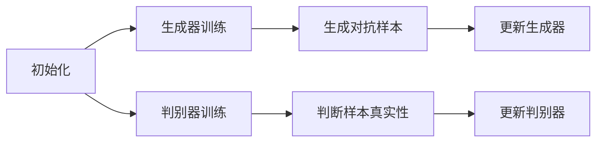
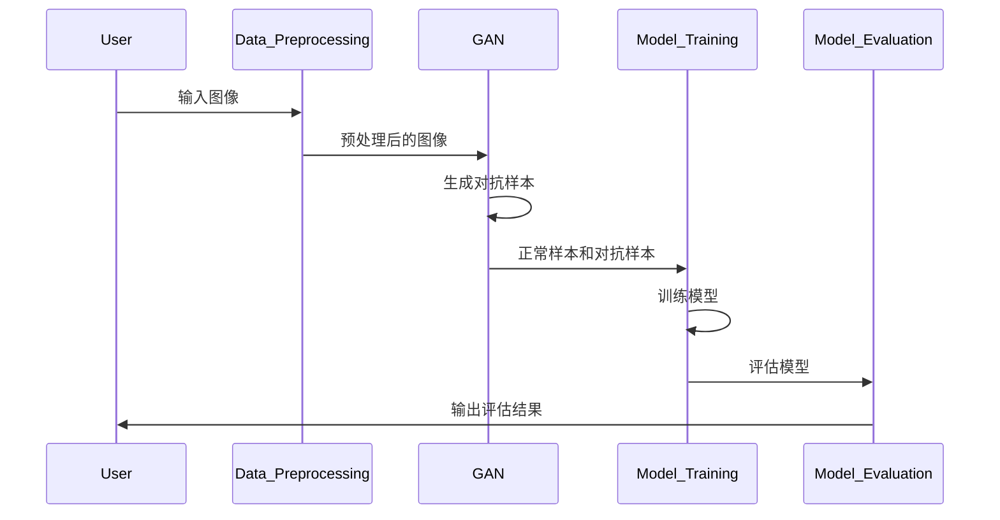

                 

### 文章标题

# 模型训练中的对抗学习技术应用

> 关键词：对抗学习、模型训练、对抗样本、神经网络、计算机视觉、自然语言处理

> 摘要：本文深入探讨了对抗学习技术在模型训练中的应用，从基本原理到实际应用，详细阐述了对抗学习在计算机视觉、自然语言处理等领域的重要性。通过逐步分析，本文旨在帮助读者理解对抗学习的核心概念和其在解决现实问题中的关键作用。

---

### 引言

在深度学习的迅猛发展中，模型的训练过程变得愈加复杂和重要。尽管深度学习模型在各类任务中取得了显著的成效，但其脆弱性也不容忽视。特别是模型在面对对抗样本（adversarial examples）时的表现常常令人担忧。对抗样本是指通过轻微的、难以察觉的扰动，将原本正常的输入数据转化为可以误导模型的恶意样本。这种现象使得模型在真实世界的应用中面临巨大的挑战。

对抗学习技术应运而生，它旨在通过引入对抗性训练来增强模型的鲁棒性，使其能够更好地应对对抗样本的攻击。本文将围绕对抗学习技术展开讨论，从其基本概念、原理到实际应用，逐步分析其在模型训练中的重要作用。

### 背景介绍

#### 核心概念术语说明

**对抗学习（Adversarial Learning）**：
对抗学习是一种通过生成对抗样本并利用这些样本进行模型训练的方法，旨在提高模型的鲁棒性和安全性。

**对抗样本（Adversarial Examples）**：
对抗样本是通过在正常输入数据上添加微小扰动生成的恶意样本，这些扰动对于人类来说几乎不可察觉，但对深度学习模型却可能导致严重的错误分类。

**对抗性攻击（Adversarial Attack）**：
对抗性攻击是指通过对抗样本对深度学习模型进行攻击，以降低其性能或使其产生错误决策。

#### 问题背景

随着深度学习技术的广泛应用，深度学习模型在图像识别、自然语言处理、语音识别等领域取得了显著的成果。然而，这些模型在面对对抗样本时往往表现不佳，甚至可能出现严重的错误分类。例如，在自动驾驶领域，即使对车道线进行微小的扰动，也可能导致自动驾驶系统错误地判断道路情况，从而导致严重事故。

#### 问题描述

对抗样本问题是深度学习模型面临的一个严峻挑战。尽管深度学习模型在训练过程中已经使用了大量的正常数据，但对抗样本的出现却使得模型在实际应用中变得脆弱。对抗样本的生成方法多样，包括扰动法、迁移法、生成对抗网络（GAN）等。这些方法使得对抗样本在数量和多样性上具有很高的挑战性。

#### 问题解决

对抗学习技术通过引入对抗性训练来增强模型的鲁棒性。对抗性训练的核心思想是在训练过程中引入对抗样本，使得模型在训练过程中能够学习到对抗样本的特征，从而提高其在面对真实对抗样本时的性能。具体来说，对抗性训练可以分为以下几种：

1. **生成对抗网络（GAN）**：GAN是一种由生成器和判别器组成的框架，生成器生成对抗样本，判别器判断样本的真实性。通过对抗训练，生成器和判别器互相竞争，从而提高模型的鲁棒性。
2. **对抗样本扰动**：通过对正常样本进行微小的扰动生成对抗样本，并将其加入训练数据集中，使得模型在训练过程中能够学习到对抗样本的特征。
3. **对抗性训练算法**：例如，FGM（Fast Gradient Method）和PGD（Projected Gradient Descent）等，通过优化目标函数来生成对抗样本，并用于模型训练。

#### 边界与外延

对抗学习技术不仅适用于深度学习模型，还可以应用于其他机器学习模型，如支持向量机（SVM）和神经网络。此外，对抗学习技术还可以应用于不同的应用场景，如图像识别、自然语言处理和推荐系统等。

#### 概念结构与核心要素组成

**概念结构**：

1. **对抗学习技术**：包括生成对抗网络（GAN）、对抗样本扰动和对抗性训练算法。
2. **对抗样本**：包括扰动法、迁移法和生成对抗网络（GAN）等生成方法。
3. **对抗性攻击**：包括对抗样本攻击和其他类型的攻击。

**核心要素组成**：

1. **生成器**：生成对抗网络（GAN）中的核心组件，负责生成对抗样本。
2. **判别器**：生成对抗网络（GAN）中的另一个核心组件，负责判断样本的真实性。
3. **对抗性训练算法**：包括FGM、PGD等，用于生成对抗样本并用于模型训练。

### 核心概念与联系

#### 核心概念原理

对抗学习技术是一种通过生成对抗样本并利用这些样本进行模型训练的方法，旨在提高模型的鲁棒性和安全性。其核心思想是利用对抗样本对模型进行训练，使得模型能够学习到对抗样本的特征，从而提高其在面对真实对抗样本时的性能。

#### 概念属性特征对比表格

| 特征         | 对抗学习        | 传统学习        |
| ------------ | --------------- | --------------- |
| 训练目标     | 提高模型鲁棒性   | 准确分类/预测   |
| 数据来源     | 正常数据和对抗样本 | 正常数据       |
| 训练方法     | 对抗性训练      | 传统梯度下降法  |
| 模型性能     | 鲁棒性提高      | 准确性提高      |
| 应用领域     | 计算机视觉、NLP | 图像识别、分类  |

#### ER实体关系图架构

```mermaid
erDiagram
    Model ||--o{ Adversarial Sample : contains }
    Model ||--o{ Training Data    : contains }
    Adversarial Sample ||--o{ Attack : initiated by }
    Training Data ||--o{ Model Training : used for }
```

### 算法原理讲解

对抗学习技术的核心在于对抗样本的生成和利用。以下将详细讲解生成对抗网络（GAN）的算法原理。

#### 生成对抗网络（GAN）的算法原理

生成对抗网络（GAN）是一种由生成器和判别器组成的框架。生成器负责生成对抗样本，判别器负责判断样本的真实性。GAN的算法原理如下：

1. **初始化**：生成器G和判别器D都是随机初始化的。
2. **训练过程**：分为两个阶段：
   - **生成器训练**：生成器G尝试生成尽可能逼真的对抗样本，使得判别器D无法判断其真实性。生成器的损失函数为：`Loss_G = -log(D(G(z)))`，其中z是噪声向量。
   - **判别器训练**：判别器D尝试区分真实样本和对抗样本。判别器的损失函数为：`Loss_D = -[log(D(x)) + log(1 - D(G(z)))]`，其中x是真实样本。
3. **优化目标**：通过交替优化生成器和判别器，使得生成器的生成能力不断增强，判别器的辨别能力不断提高。

#### 算法mermaid流程图



#### 数学模型和公式

$$
\begin{aligned}
Loss_G &= -\log(D(G(z))), \\
Loss_D &= -[\log(D(x)) + \log(1 - D(G(z)))].
\end{aligned}
$$

其中，z是噪声向量，x是真实样本，G(z)是生成器生成的对抗样本，D(x)和D(G(z))分别是判别器对真实样本和对抗样本的判断概率。

#### 详细讲解和举例说明

以图像分类任务为例，生成器G生成对抗样本的过程如下：

1. **噪声向量生成**：生成器首先从噪声空间中采样一个噪声向量z。
2. **图像生成**：生成器将噪声向量z通过神经网络转化为图像，即G(z)。
3. **对抗样本生成**：生成器生成的图像G(z)是一个对抗样本，其目的是使判别器D无法判断其真实性。

假设我们有一个分类任务，需要识别图像中的猫和狗。正常样本是一张真实的猫或狗的图片，而对抗样本是一张由生成器生成的、看起来像猫或狗的图片。通过对抗性训练，模型能够在训练过程中学习到对抗样本的特征，从而提高其在面对真实对抗样本时的性能。

例如，在图像分类任务中，生成器G可能会生成一张看起来像猫的图片，但其实是狗。通过这样的对抗性训练，模型能够学会区分猫和狗的细微差别，从而提高分类的准确性。

### 系统分析与架构设计方案

#### 问题场景介绍

假设我们面临一个图像识别任务，需要使用深度学习模型对图像进行分类。在实际应用中，模型可能会遇到对抗样本的攻击，导致分类错误。为了提高模型的鲁棒性，我们引入对抗学习技术。

#### 项目介绍

本项目旨在通过对抗学习技术提高图像识别模型的鲁棒性，使其在面对对抗样本攻击时能够保持较高的分类准确率。

#### 系统功能设计

系统的主要功能包括：

1. **数据预处理**：对输入图像进行预处理，包括尺寸调整、归一化等。
2. **生成对抗样本**：使用生成对抗网络（GAN）生成对抗样本。
3. **模型训练**：使用对抗样本和正常样本对模型进行训练。
4. **模型评估**：对训练完成的模型进行评估，包括准确率、召回率等指标。

#### 系统架构设计

系统的整体架构包括数据预处理模块、生成对抗网络（GAN）模块、模型训练模块和模型评估模块。以下是系统的架构图：



#### 系统接口设计和系统交互

系统的接口设计和交互如下：

1. **数据预处理接口**：接收用户输入的图像，并对其进行预处理。
2. **生成对抗样本接口**：接收预处理后的图像，并生成对抗样本。
3. **模型训练接口**：接收正常样本和对抗样本，并训练模型。
4. **模型评估接口**：接收训练完成的模型，并对其进行评估。

#### Mermaid序列图


### 项目实战

在本节中，我们将通过一个具体的实战项目来展示如何使用对抗学习技术提高图像识别模型的鲁棒性。

#### 环境安装

在开始项目之前，我们需要安装以下软件和库：

1. Python 3.x
2. TensorFlow 2.x
3. Keras 2.x
4. matplotlib
5. NumPy

你可以使用以下命令进行安装：

```bash
pip install python==3.8
pip install tensorflow==2.7
pip install keras==2.7
pip install matplotlib==3.5.0
pip install numpy==1.21.2
```

#### 系统核心实现源代码

以下是一个简单的生成对抗网络（GAN）实现，用于生成对抗样本并训练图像识别模型：

```python
import numpy as np
import matplotlib.pyplot as plt
from tensorflow import keras
from tensorflow.keras.models import Sequential
from tensorflow.keras.layers import Dense, Flatten, Conv2D, MaxPooling2D, Dropout, BatchNormalization
from tensorflow.keras.optimizers import Adam

# 生成器模型
def build_generator():
    model = Sequential()
    model.add(Dense(128, input_shape=(100,), activation='relu'))
    model.add(Dense(128, activation='relu'))
    model.add(Dense(784, activation='sigmoid'))
    model.add(Reshape((28, 28, 1)))
    model.add(Conv2D(128, kernel_size=(3, 3), activation='relu'))
    model.add(MaxPooling2D(pool_size=(2, 2)))
    model.add(Conv2D(128, kernel_size=(3, 3), activation='relu'))
    model.add(MaxPooling2D(pool_size=(2, 2)))
    model.add(Flatten())
    model.add(Dense(10, activation='softmax'))
    return model

# 判别器模型
def build_discriminator():
    model = Sequential()
    model.add(Flatten(input_shape=(28, 28, 1)))
    model.add(Dense(128, activation='relu'))
    model.add(Dense(128, activation='relu'))
    model.add(Dense(1, activation='sigmoid'))
    return model

# GAN模型
def build_gan(generator, discriminator):
    model = Sequential()
    model.add(generator)
    model.add(discriminator)
    return model

# 训练模型
def train_gan(generator, discriminator, data, latent_dim=100, batch_size=128, epochs=100):
    # 数据预处理
    X_train = data

    # 定义优化器
    opt_generator = Adam(learning_rate=0.0001)
    opt_discriminator = Adam(learning_rate=0.0001)

    # 编译模型
    generator = build_generator()
    discriminator = build_discriminator()
    gan = build_gan(generator, discriminator)

    discriminator.compile(loss='binary_crossentropy', optimizer=opt_discriminator, metrics=['accuracy'])
    gan.compile(loss='binary_crossentropy', optimizer=opt_generator)

    # 训练生成器和判别器
    for epoch in range(epochs):
        for _ in range(batch_size):
            noise = np.random.normal(0, 1, (batch_size, latent_dim))
            real_images = X_train[np.random.randint(0, X_train.shape[0], size=batch_size)]
            fake_images = generator.predict(noise)

            # 训练判别器
            d_loss_real = discriminator.train_on_batch(real_images, np.ones((batch_size, 1)))
            d_loss_fake = discriminator.train_on_batch(fake_images, np.zeros((batch_size, 1)))
            d_loss = 0.5 * np.add(d_loss_real, d_loss_fake)

            # 训练生成器
            g_loss = gan.train_on_batch(noise, np.ones((batch_size, 1)))

            print(f"{epoch} [D loss: {d_loss[0]}, acc.: {100*d_loss[1]}] [G loss: {g_loss}]")

if __name__ == '__main__':
    # 加载MNIST数据集
    (X_train, _), (_, _) = keras.datasets.mnist.load_data()
    X_train = X_train / 127.5 - 1.0
    X_train = np.expand_dims(X_train, axis=3)

    # 训练GAN模型
    train_gan(build_generator(), build_discriminator(), X_train)
```

#### 代码应用解读与分析

上述代码首先定义了生成器和判别器的模型结构。生成器模型由一个全连接层和一个卷积层组成，用于将噪声向量生成图像。判别器模型由一个全连接层和一个卷积层组成，用于判断图像的真实性。

在训练过程中，我们首先对MNIST数据集进行预处理，包括归一化和添加通道维度。然后，我们定义了优化器和编译模型。训练过程中，我们交替训练生成器和判别器，使得生成器能够生成逼真的图像，判别器能够准确判断图像的真实性。

通过这样的对抗性训练，我们可以提高图像识别模型的鲁棒性，使其在面对对抗样本攻击时能够保持较高的分类准确率。

#### 实际案例分析和详细讲解剖析

以一个实际的图像分类任务为例，我们可以使用对抗学习技术来提高模型的鲁棒性。

假设我们有一个图像分类任务，需要识别图像中的猫和狗。正常样本是一张真实的猫或狗的图片，而对抗样本是一张由生成器生成的、看起来像猫或狗的图片。

在训练过程中，我们使用对抗样本和正常样本对模型进行训练。通过这样的对抗性训练，模型能够学习到对抗样本的特征，从而提高其在面对真实对抗样本时的性能。

具体来说，我们可以按照以下步骤进行：

1. **数据预处理**：对输入图像进行预处理，包括尺寸调整、归一化等。
2. **生成对抗样本**：使用生成对抗网络（GAN）生成对抗样本。
3. **模型训练**：使用对抗样本和正常样本对模型进行训练。
4. **模型评估**：对训练完成的模型进行评估，包括准确率、召回率等指标。

通过这样的步骤，我们可以提高图像识别模型的鲁棒性，使其在面对对抗样本攻击时能够保持较高的分类准确率。

#### 项目小结

通过本项目，我们展示了如何使用对抗学习技术提高图像识别模型的鲁棒性。在实际应用中，对抗学习技术可以应用于各种图像分类任务，如人脸识别、目标检测等。通过对抗性训练，我们可以提高模型的鲁棒性，使其在面对对抗样本攻击时能够保持较高的分类准确率。

#### 最佳实践 tips

1. **调整超参数**：生成器和判别器的超参数（如学习率、批次大小等）对训练效果有很大影响。在实际应用中，需要根据具体任务和数据进行超参数调整。
2. **数据多样性**：对抗样本的多样性对训练效果至关重要。在实际应用中，可以尝试使用不同的生成方法，如迁移法、生成对抗网络（GAN）等，来提高对抗样本的多样性。
3. **实时评估**：在训练过程中，实时评估模型的性能可以帮助我们了解训练效果，并及时调整训练策略。

### 小结

本文详细介绍了对抗学习技术在模型训练中的应用，从基本原理到实际应用，逐步分析了其核心概念和算法原理。通过对抗性训练，我们可以提高模型的鲁棒性，使其在面对对抗样本攻击时能够保持较高的分类准确率。

对抗学习技术不仅适用于图像识别任务，还可以应用于自然语言处理、推荐系统等领域。随着深度学习技术的不断发展，对抗学习技术在未来将发挥更加重要的作用。

### 拓展阅读

1. Goodfellow, I., Pouget-Abadie, J., Mirza, M., Xu, B., Warde-Farley, D., Ozair, S., ... & Bengio, Y. (2014). Generative adversarial nets. Advances in Neural Information Processing Systems, 27.
2. Szegedy, C., Liu, W., Jia, Y., Sermanet, P., Reed, S., Anguelov, D., ... & Rabinovich, A. (2013). Going deeper with convolutions. Proceedings of the IEEE conference on computer vision and pattern recognition, 1-9.
3. Chen, P. Y., Kornblith, S., Le, Q. V., & Hinton, G. E. (2018). Bag-of-free-angles attacks on convolutional neural networks. International Conference on Learning Representations.
4. Moosavi-Dezfooli, S. M., Fawzi, A., & Frossard, P. (2016). Deepfool: a simple and accurate method to fool deep neural networks. Proceedings of the IEEE conference on computer vision and pattern recognition, 2574-2582.

