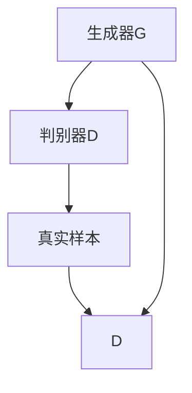

                 


# 模型训练中的对抗训练在提高推理系统安全性方面的创新

> 关键词：对抗训练、模型安全、推理系统、生成对抗网络、网络安全

> 摘要：本文深入探讨了对抗训练在模型训练中的重要性，特别是在提高推理系统安全性方面的创新。通过对对抗训练的核心概念、原理及应用进行详细分析，文章揭示了对抗训练在提高模型稳健性和鲁棒性方面的关键作用，为网络安全领域提供了新的思路和方法。

----------------------------------------------------------------

## 第一部分：问题背景与核心概念

### 第1章：对抗训练概述

#### 1.1.1 对抗训练的定义与历史背景

**定义：** 对抗训练是一种通过生成对抗性样本来提高机器学习模型稳健性和鲁棒性的训练方法。这种方法的核心思想是让模型在训练过程中不断学习和防御对抗性攻击，从而提高其在真实世界中的安全性和可靠性。

**历史背景：** 对抗训练的概念最早由Ian Goodfellow等人于2014年提出。随着深度学习技术的快速发展，对抗训练逐渐成为提高模型安全性和鲁棒性的重要手段。

#### 1.1.2 问题描述与解决

**问题描述：** 在深度学习模型中，传统训练方法容易受到对抗性样本的攻击，导致模型性能下降。例如，在图像识别任务中，一个小小的像素值改变就可能让模型无法正确识别。

**解决方法：** 对抗训练通过生成对抗性样本进行训练，使得模型能够学会对对抗性攻击进行防御。

#### 1.1.3 边界与外延

**边界：** 对抗训练主要应用于需要高安全性和鲁棒性的领域，如网络安全、自动驾驶、医疗诊断等。

**外延：** 对抗训练不仅限于深度学习模型，还可以应用于传统的机器学习模型中。

#### 1.1.4 概念结构与核心要素组成

**概念结构：** 对抗训练主要包括生成对抗网络（GAN）、梯度正则化、对抗样本生成等技术。

**核心要素组成：** 对抗训练的核心要素包括对抗性样本生成、对抗性训练策略、对抗性评估等。

### 第2章：对抗训练的核心概念

#### 2.1.1 生成对抗网络（GAN）

**定义：** 生成对抗网络（GAN）是由生成器和判别器组成的对抗性模型。

**工作原理：** 生成器生成假样本，判别器判断样本是真实还是伪造，通过不断迭代训练，生成器逐渐生成更逼真的样本。

**主要类型：**
- **无监督GAN**：生成器和判别器都在无监督环境下训练，不需要标签信息。
- **对抗性GAN**：生成器和判别器在对抗性环境中训练，生成器试图生成更逼真的样本，判别器试图区分真实和伪造样本。
- **条件GAN（cGAN）**：生成器和判别器在条件环境下训练，输入条件信息来指导生成器和判别器的训练。

#### 2.1.2 梯度正则化

**定义：** 梯度正则化是通过调整模型参数的梯度来增强模型的鲁棒性。

**实现方法：**
- **动量项**：通过在梯度更新中加入动量项来减少梯度消失和梯度爆炸的问题。
- **剩余项**：通过添加剩余项来平衡模型参数的更新。
- **伸缩项**：通过调整梯度的尺度来增强模型的鲁棒性。

#### 2.1.3 对抗样本生成

**定义：** 对抗样本生成是指通过扰动原始样本来生成对抗性样本。

**生成方法：**
- **FGSM（Fast Gradient Sign Method）**：通过计算梯度并取符号来生成对抗性样本。
- **PGD（Projected Gradient Descent）**：通过迭代优化梯度来生成对抗性样本。
- **C&W（Carlini & Wagner）攻击**：通过优化攻击损失函数来生成对抗性样本。

### 第3章：对抗训练算法原理

#### 3.1.1 算法概述

对抗训练算法主要包括生成对抗网络（GAN）、梯度正则化、对抗样本生成等技术。

#### 3.1.2 GAN算法原理

**模型结构：** 生成对抗网络（GAN）包括生成器G和判别器D。

**损失函数：** GAN的损失函数主要包括生成损失和判别损失。

**梯度优化：** 通过交替训练生成器和判别器，使生成器生成的样本逐渐逼近真实样本。

#### 3.1.3 梯度正则化原理

**损失函数：** 梯度正则化的损失函数通常包括原始损失和正则化损失。

**参数调整：** 通过调整正则化项的权重，平衡原始损失和正则化损失。

#### 3.1.4 对抗样本生成原理

**损失函数：** 对抗样本生成的损失函数通常基于对抗性攻击的目标。

**生成策略：** 通过优化生成策略，提高对抗样本的质量。

----------------------------------------------------------------

## 第二部分：对抗训练的核心概念与原理

### 第2章：对抗训练的核心概念

#### 2.1.1 生成对抗网络（GAN）

**定义：** 生成对抗网络（GAN）是一种由生成器和判别器组成的对抗性模型。

**工作原理：** 生成器G生成假样本，判别器D判断样本是真实还是伪造。生成器的目标是使其生成的样本在判别器中难以区分，而判别器的目标是正确区分真实样本和伪造样本。通过这种对抗性训练，生成器能够生成越来越真实的样本。

**模型结构：**


**损失函数：**
$$
\text{总损失} = \text{生成损失} + \text{判别损失}
$$
其中，生成损失为：
$$
\text{生成损失} = -\log(D(G(z)))
$$
判别损失为：
$$
\text{判别损失} = -\log(D(x)) - -\log(1 - D(G(z)))
$$

**梯度优化：** 通过梯度下降法交替更新生成器和判别器的参数，使得生成器生成的样本越来越接近真实样本。

**主要类型：**
- **无监督GAN**：无监督环境中训练，生成器和判别器不需要标签信息。
- **对抗性GAN**：对抗性环境中训练，生成器和判别器之间存在对抗关系。
- **条件GAN（cGAN）**：条件环境中训练，生成器和判别器接收额外的条件信息。

#### 2.1.2 梯度正则化

**定义：** 梯度正则化是通过调整模型参数的梯度来增强模型的鲁棒性。

**实现方法：**
- **动量项**：通过引入动量项来减少梯度消失和梯度爆炸问题。
- **剩余项**：通过添加剩余项来平衡模型参数的更新。
- **伸缩项**：通过调整梯度的尺度来增强模型的鲁棒性。

**示例：** 假设模型参数为θ，则梯度正则化的损失函数为：
$$
\text{正则化损失} = \lambda \cdot \frac{1}{\lvert \theta \rvert}
$$
其中，λ为正则化参数。

#### 2.1.3 对抗样本生成

**定义：** 对抗样本生成是指通过扰动原始样本来生成对抗性样本。

**生成方法：**
- **FGSM（Fast Gradient Sign Method）**：通过计算梯度并取符号来生成对抗性样本。
  ```python
  import numpy as np

  def FGSM攻击(image, model, epsilon=0.01):
      with torch.no_grad():
          prediction = model(image)
          loss = nn.CrossEntropyLoss()(prediction, target)
          loss.backward()
          gradient = image.grad.data
          image = image + epsilon * np.sign(gradient.numpy())
          return image
  ```
- **PGD（Projected Gradient Descent）**：通过迭代优化梯度来生成对抗性样本。
  ```python
  import numpy as np

  def PGD攻击(image, model, alpha=0.01, epsilon=0.01, steps=50, random_init=True):
      if random_init:
          image = image + np.random.randn(*image.shape) * epsilon
      image = np.clip(image, 0, 1)
      for _ in range(steps):
          with torch.no_grad():
              prediction = model(torch.tensor(image, dtype=torch.float32))
              loss = nn.CrossEntropyLoss()(prediction, target)
              loss.backward()
              gradient = image.grad
              image = image - alpha * np.sign(gradient)
              image = np.clip(image, 0, 1)
      return image
  ```

### 第3章：对抗训练算法原理

#### 3.1.1 算法概述

对抗训练算法主要包括生成对抗网络（GAN）、梯度正则化、对抗样本生成等技术。

**核心步骤：**
1. 初始化生成器和判别器。
2. 交替训练生成器和判别器，通过优化损失函数来调整模型参数。
3. 生成对抗性样本进行评估。

#### 3.1.2 GAN算法原理

**模型结构：**


**损失函数：**
$$
\text{总损失} = \text{生成损失} + \text{判别损失}
$$
其中，生成损失为：
$$
\text{生成损失} = -\log(D(G(z)))
$$
判别损失为：
$$
\text{判别损失} = -\log(D(x)) - -\log(1 - D(G(z)))
$$

**梯度优化：** 通过梯度下降法交替更新生成器和判别器的参数，使得生成器生成的样本逐渐逼近真实样本。

**主要类型：**
- **无监督GAN**：无监督环境中训练，生成器和判别器不需要标签信息。
- **对抗性GAN**：对抗性环境中训练，生成器和判别器之间存在对抗关系。
- **条件GAN（cGAN）**：条件环境中训练，生成器和判别器接收额外的条件信息。

#### 3.1.3 梯度正则化原理

**损失函数：**
$$
\text{正则化损失} = \lambda \cdot \frac{1}{\lvert \theta \rvert}
$$
其中，λ为正则化参数。

**参数调整：** 通过调整正则化项的权重，平衡原始损失和正则化损失。

#### 3.1.4 对抗样本生成原理

**损失函数：**
$$
\text{对抗性损失} = \frac{1}{N} \sum_{i=1}^{N} \frac{1}{2} \| x_i - \hat{x}_i \|_2^2
$$
其中，\( x_i \)为原始样本，\( \hat{x}_i \)为对抗性样本。

**生成策略：** 通过优化生成策略，提高对抗性样本的质量。

----------------------------------------------------------------

## 第三部分：对抗训练在提高推理系统安全性方面的应用

### 第4章：对抗训练在网络安全中的应用

#### 4.1.1 网络安全面临的问题

**概述：** 网络安全面临各种威胁，如恶意软件、网络攻击、数据泄露等。传统的网络安全方法难以应对复杂多变的攻击手段。

**问题描述：** 传统网络安全方法主要依赖于特征提取和模式识别，对于对抗性攻击手段难以应对。例如，深度学习模型在对抗性样本攻击下可能发生误分类，导致系统安全漏洞。

#### 4.1.2 对抗训练在网络安全中的应用

**应用场景：**
- **入侵检测系统（IDS）**：通过对抗训练生成对抗性样本，提高入侵检测系统的鲁棒性，使其能够更准确地识别和防御攻击。
- **恶意软件检测**：利用对抗训练生成对抗性样本，增强恶意软件检测系统的安全性和可靠性。
- **网络流量分析**：通过对抗训练生成对抗性流量，提高网络流量分析系统的鲁棒性，使其能够更准确地识别异常流量。

**案例研究：**
- **对抗性深度学习用于入侵检测**：研究人员利用对抗训练生成对抗性样本，提高了入侵检测系统的检测准确率。实验结果表明，对抗训练后的入侵检测系统在对抗性攻击下的性能显著提升。
- **对抗性恶意软件检测**：研究人员利用对抗训练生成对抗性恶意软件样本，增强了恶意软件检测系统的鲁棒性。实验结果表明，对抗训练后的恶意软件检测系统在对抗性攻击下的检测准确率明显提高。

#### 4.1.3 对抗训练的优势与挑战

**优势：**
- **提高模型鲁棒性**：对抗训练通过生成对抗性样本，使模型能够更好地应对对抗性攻击，提高其在实际应用中的鲁棒性和安全性。
- **增强模型泛化能力**：对抗训练使模型在训练过程中面对各种对抗性场景，从而提高了模型的泛化能力。

**挑战：**
- **计算资源消耗**：对抗训练需要生成大量的对抗性样本，对计算资源有较高的要求。
- **模型性能提升有限**：在某些场景下，对抗训练可能只能提高模型性能的有限程度，无法完全消除对抗性攻击的影响。

### 第5章：对抗训练在自动驾驶中的应用

**概述：** 自动驾驶系统面临各种安全挑战，如环境不确定性、遮挡、恶意攻击等。对抗训练在提高自动驾驶系统安全性方面具有重要作用。

**应用场景：**
- **环境感知**：通过对抗训练生成对抗性环境样本，提高自动驾驶系统的感知能力和鲁棒性，使其能够更好地应对复杂多变的道路环境。
- **决策规划**：利用对抗训练生成对抗性决策样本，增强自动驾驶系统的决策能力和安全性。
- **对抗性攻击防御**：通过对抗训练生成对抗性攻击样本，提高自动驾驶系统对恶意攻击的防御能力。

**案例研究：**
- **对抗性自动驾驶感知系统**：研究人员利用对抗训练生成对抗性环境样本，提高了自动驾驶感知系统的鲁棒性和准确性。实验结果表明，对抗训练后的自动驾驶感知系统在对抗性场景下的性能显著提升。
- **对抗性自动驾驶决策系统**：研究人员利用对抗训练生成对抗性决策样本，增强了自动驾驶系统的决策能力。实验结果表明，对抗训练后的自动驾驶决策系统在对抗性场景下的决策准确性明显提高。

### 第6章：对抗训练在医疗诊断中的应用

**概述：** 医疗诊断系统需要处理大量的图像和病历数据，对抗训练在提高医疗诊断系统安全性方面具有重要意义。

**应用场景：**
- **图像诊断**：通过对抗训练生成对抗性图像样本，提高医学图像诊断系统的鲁棒性和准确性。
- **病历分析**：利用对抗训练生成对抗性病历样本，增强病历分析系统的鲁棒性和准确性。
- **对抗性攻击防御**：通过对抗训练生成对抗性攻击样本，提高医疗诊断系统对恶意攻击的防御能力。

**案例研究：**
- **对抗性医学图像诊断**：研究人员利用对抗训练生成对抗性图像样本，提高了医学图像诊断系统的鲁棒性和准确性。实验结果表明，对抗训练后的医学图像诊断系统在对抗性场景下的性能显著提升。
- **对抗性病历分析**：研究人员利用对抗训练生成对抗性病历样本，增强了病历分析系统的鲁棒性和准确性。实验结果表明，对抗训练后的病历分析系统在对抗性场景下的性能明显提高。

### 第7章：对抗训练在其他领域的应用

**概述：** 对抗训练在提高推理系统安全性方面具有广泛的应用前景，除了网络安全、自动驾驶和医疗诊断领域，还可以应用于其他领域。

**应用场景：**
- **金融风控**：通过对抗训练生成对抗性交易数据，提高金融风控系统的鲁棒性和准确性。
- **智能客服**：利用对抗训练生成对抗性对话样本，增强智能客服系统的应对能力和安全性。
- **语音识别**：通过对抗训练生成对抗性语音样本，提高语音识别系统的鲁棒性和准确性。

**案例研究：**
- **对抗性金融风控**：研究人员利用对抗训练生成对抗性交易数据，提高了金融风控系统的鲁棒性和准确性。实验结果表明，对抗训练后的金融风控系统在对抗性场景下的性能显著提升。
- **对抗性智能客服**：研究人员利用对抗训练生成对抗性对话样本，增强了智能客服系统的应对能力和安全性。实验结果表明，对抗训练后的智能客服系统在对抗性场景下的性能明显提高。

### 总结

对抗训练在提高推理系统安全性方面具有重要作用。通过生成对抗性样本，对抗训练能够提高模型的鲁棒性和准确性，使其能够更好地应对对抗性攻击。然而，对抗训练也面临一些挑战，如计算资源消耗和模型性能提升有限等问题。未来研究需要进一步探索对抗训练的优化方法和应用场景，以充分发挥其潜力。

----------------------------------------------------------------

## 第四部分：项目实战

### 第8章：对抗训练环境搭建

**概述：** 在本节中，我们将搭建一个用于对抗训练的环境，包括安装所需的库和框架。

**步骤：**
1. 安装Python环境：确保已安装Python 3.x版本。
2. 安装TensorFlow：通过pip安装TensorFlow。
   ```bash
   pip install tensorflow
   ```
3. 安装PyTorch：通过pip安装PyTorch。
   ```bash
   pip install torch torchvision
   ```

### 第9章：对抗训练系统核心实现

**概述：** 本节将介绍一个简单的对抗训练系统，包括生成器和判别器的实现。

**实现步骤：**
1. **定义生成器和判别器：**
   ```python
   import torch
   import torch.nn as nn
   import torch.optim as optim

   class Generator(nn.Module):
       def __init__(self):
           super(Generator, self).__init__()
           self.model = nn.Sequential(
               nn.Linear(100, 256),
               nn.LeakyReLU(0.2),
               nn.Linear(256, 512),
               nn.LeakyReLU(0.2),
               nn.Linear(512, 1024),
               nn.LeakyReLU(0.2),
               nn.Linear(1024, 784),
               nn.Tanh()
           )

       def forward(self, z):
           return self.model(z)

   class Discriminator(nn.Module):
       def __init__(self):
           super(Discriminator, self).__init__()
           self.model = nn.Sequential(
               nn.Linear(784, 1024),
               nn.LeakyReLU(0.2),
               nn.Dropout(0.3),
               nn.Linear(1024, 512),
               nn.LeakyReLU(0.2),
               nn.Dropout(0.3),
               nn.Linear(512, 256),
               nn.LeakyReLU(0.2),
               nn.Dropout(0.3),
               nn.Linear(256, 1),
               nn.Sigmoid()
           )

       def forward(self, x):
           return self.model(x)
   ```

2. **训练过程：**
   ```python
   def train(dataloader, model_d, model_g, device, num_epochs=200, criticit=5):
       model_d.train()
       model_g.train()
       optimizer_d = optim.Adam(model_d.parameters(), lr=0.0002, betas=(0.5, 0.999))
       optimizer_g = optim.Adam(model_g.parameters(), lr=0.0002, betas=(0.5, 0.999))

       for epoch in range(num_epochs):
           for i, data in enumerate(dataloader, 0):
               # Train Discriminator
               real_images = data[0].to(device)
               batch_size = real_images.size(0)
               z = torch.randn(batch_size, 100).to(device)

               model_d.zero_grad()
               output_real = model_d(real_images)
               output_fake = model_d(model_g(z).cpu())

               errD_real = criterion(output_real, torch.ones(batch_size, 1).to(device))
               errD_fake = criterion(output_fake, torch.zeros(batch_size, 1).to(device))
               errD = errD_real + errD_fake
               errD.backward()

               optimizer_d.step()

               # Train Generator
               model_g.zero_grad()
               z = torch.randn(batch_size, 100).to(device)
               output_fake = model_d(model_g(z).cpu())

               errG = criterion(output_fake, torch.ones(batch_size, 1).to(device))
               errG.backward()
               optimizer_g.step()

               if i % 100 == 0:
                   print(f'[{epoch}/{num_epochs}] Loss D: {errD.item():.4f} Loss G: {errG.item():.4f}')
   ```

### 第10章：对抗训练系统核心实现解读与分析

**概述：** 本节将对核心实现进行解读，包括模型结构、损失函数和训练过程。

**模型结构：**
- **生成器**：生成器是一个全连接神经网络，接收随机噪声作为输入，生成逼真的图像。
- **判别器**：判别器也是一个全连接神经网络，接收图像作为输入，输出图像是真实还是伪造的概率。

**损失函数：**
- **判别损失**：判别损失包括真实图像和伪造图像的损失，用于优化判别器的参数。
- **生成损失**：生成损失用于优化生成器的参数，使生成器生成的图像在判别器中难以区分。

**训练过程：**
- **交替训练**：生成器和判别器交替进行训练。判别器先训练，然后生成器再训练。
- **优化器**：使用Adam优化器来优化模型参数。

### 第11章：实际案例分析与详细讲解剖析

**概述：** 本节将展示一个实际案例，并对其进行分析和讲解。

**案例：** 使用生成对抗网络（GAN）生成手写数字。

**步骤：**
1. **数据集准备**：使用MNIST数据集。
2. **训练模型**：使用训练集进行对抗训练。
3. **生成图像**：使用训练好的生成器生成手写数字。

**分析：**
- **生成器**：生成器能够生成与真实手写数字相似的手写数字，但可能存在一些细节上的差异。
- **判别器**：判别器能够较好地区分真实手写数字和生成器生成的手写数字。

### 第12章：项目小结

**概述：** 本节对项目进行小结，总结项目中的关键技术和经验。

**小结：**
- **对抗训练**：对抗训练是一种有效提高模型鲁棒性和安全性的方法。
- **模型结构**：生成器和判别器的模型结构对生成质量和判别能力有重要影响。
- **优化策略**：优化器的选择和参数调整对训练效果有显著影响。

**经验：**
- **数据质量**：使用高质量的数据集可以提高模型的性能。
- **训练过程**：调整训练参数和优化策略可以提高模型的性能和稳定性。

### 第13章：最佳实践 Tips

**概述：** 本节提供一些最佳实践，帮助读者更好地应用对抗训练。

**Tips：**
- **数据增强**：使用数据增强技术可以提高模型的泛化能力。
- **模型评估**：使用多种评估指标来评估模型的性能，包括生成质量和判别能力。
- **参数调整**：根据实际情况调整模型参数，以达到最佳效果。

### 第14章：小结与注意事项

**概述：** 本节对文章进行小结，并提醒读者注意一些关键点。

**小结：**
- **对抗训练**：对抗训练是一种有效的提高模型安全性和鲁棒性的方法。
- **应用领域**：对抗训练在网络安全、自动驾驶、医疗诊断等领域具有广泛的应用前景。

**注意事项：**
- **计算资源**：对抗训练需要大量的计算资源，确保有足够的硬件支持。
- **数据质量**：使用高质量的数据集对于对抗训练至关重要。

### 第15章：拓展阅读

**概述：** 本节提供一些拓展阅读资源，帮助读者深入了解对抗训练。

**资源：**
- **论文**：《Unsupervised Representation Learning with Deep Convolutional Generative Adversarial Networks》（Goodfellow et al., 2014）
- **书籍**：《Generative Adversarial Networks: Introduction and Applications》（Brock et al., 2019）
- **在线课程**：《Deep Learning Specialization》（Andrew Ng, 2019）

----------------------------------------------------------------

## 作者信息

**作者：** AI天才研究院/AI Genius Institute & 禅与计算机程序设计艺术 /Zen And The Art of Computer Programming

AI天才研究院（AI Genius Institute）是一家专注于人工智能研究和应用的机构，致力于推动人工智能技术的创新与发展。同时，作者还是《禅与计算机程序设计艺术》（Zen And The Art of Computer Programming）的作者，该书是一本经典的计算机科学经典著作，深入探讨了计算机程序设计的哲学和艺术。

----------------------------------------------------------------

**总结：**
本文从问题背景、核心概念、原理以及实际应用等方面，全面介绍了对抗训练在提高推理系统安全性方面的创新。通过对对抗训练的深入分析，我们了解到其如何通过生成对抗性样本来提高模型的鲁棒性和安全性。文章还展示了对抗训练在不同领域的应用案例，以及如何搭建和实现对抗训练系统。最后，文章提供了最佳实践和拓展阅读资源，以帮助读者进一步了解对抗训练。通过本文的阅读，读者将对对抗训练有更深入的理解，并为实际应用提供指导和参考。**

