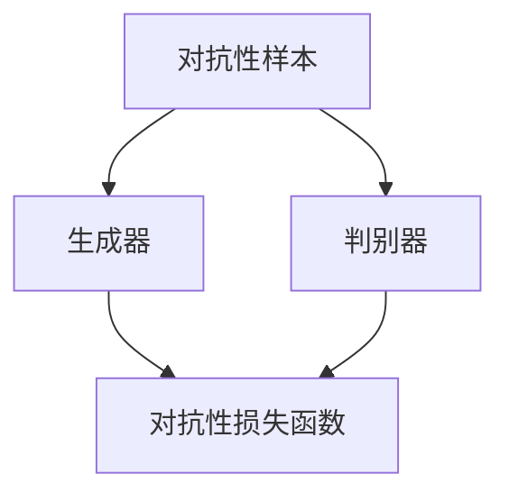
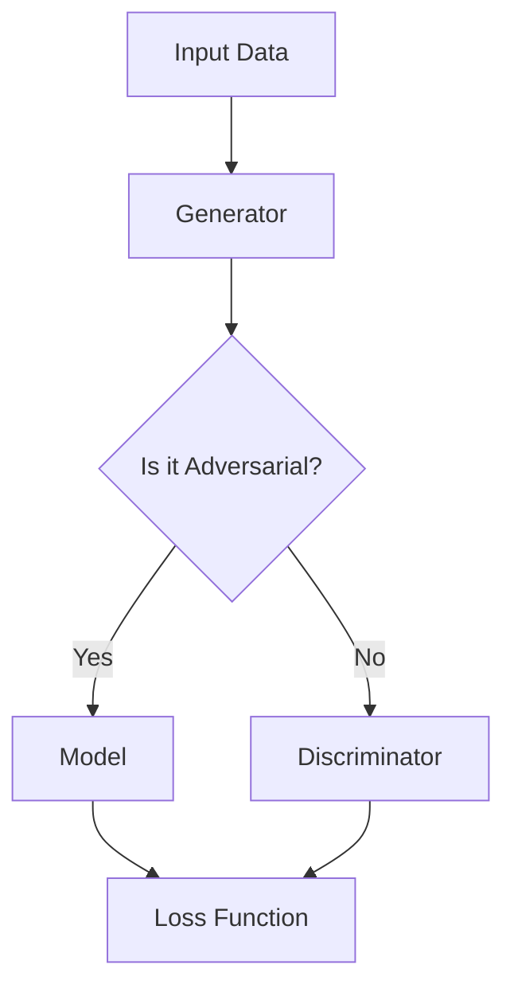
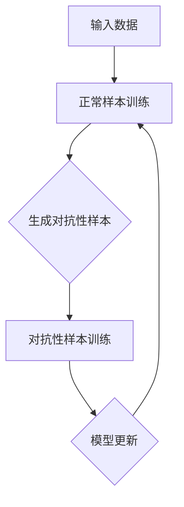
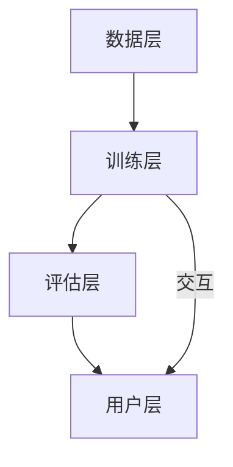

                 

## 第1章：对抗训练策略概述

### 1.1 对抗训练策略的背景

对抗训练策略（Adversarial Training）是近年来在深度学习领域中得到广泛关注的一项技术。它的起源可以追溯到20世纪90年代，当时研究人员开始意识到深度神经网络在面对特定类型的数据扰动时容易产生错误的输出。这种对“攻击”数据（即故意制造出来的异常数据）的脆弱性，被形象地称为“对抗性攻击”（Adversarial Attack）。对抗训练策略的诞生，就是为了解决这一挑战，使模型能够在面对复杂、对抗性较强的数据时仍然保持鲁棒性和准确性。

对抗训练策略的兴起，源于深度学习模型在图像识别、自然语言处理等领域的广泛应用。随着模型复杂度的增加，它们在训练数据上的表现越来越好，但同时也暴露出了一些缺陷。例如，一些攻击者可以利用精心构造的对抗性样本，欺骗深度学习模型，使其无法正确分类。这种现象不仅对模型的实用性构成了威胁，也引发了对深度学习安全性的质疑。

为了应对这一挑战，研究人员开始探索对抗训练策略。通过对训练数据中的正常样本和对抗性样本进行同时训练，使模型能够学习到数据的本质特征，同时增强其对对抗性攻击的抵抗力。这一策略不仅能够提高模型的鲁棒性，还能够提高其在复杂环境下的泛化能力。

### 1.2 对抗训练策略的原理

对抗训练策略的核心原理在于通过生成对抗性样本来训练模型。这些对抗性样本是在原始数据基础上，通过一些特定的算法生成的，其目的是欺骗模型，使其在训练过程中学会区分真实数据和对抗性样本。具体来说，对抗训练策略包含以下几个关键组成部分：

1. **对抗性样本生成**：对抗性样本的生成是对抗训练策略的第一步。通常使用的方法包括基于梯度提升的扰动方法（如FGSM，Fast Gradient Sign Method）、基于生成对抗网络的生成方法（如PGD，Projective Gradient Descent）等。这些方法能够生成在视觉上难以察觉但对模型产生显著影响的样本。

2. **对抗性训练数据集**：对抗性样本的生成需要大量的对抗性训练数据。这些数据通常通过随机抽样或特定算法生成，目的是覆盖模型可能遇到的各种对抗性场景。

3. **对抗性损失函数**：在训练过程中，需要设计一个能够衡量模型对对抗性样本预测准确性的损失函数。这种损失函数不仅要考虑模型对正常样本的预测准确性，还要考虑模型对对抗性样本的预测能力。常见的对抗性损失函数包括L2损失、L1损失、对抗性交叉熵损失等。

4. **交替训练**：对抗训练通常采用交替训练的方法，即先训练模型，然后生成对抗性样本进行下一轮训练。这种训练方式能够使模型逐步适应对抗性样本，提高其鲁棒性。

### 1.3 对抗训练策略在模型训练中的应用

对抗训练策略在深度学习模型训练中的应用非常广泛，尤其在图像识别、语音识别、自然语言处理等领域。通过对抗训练，模型能够更全面地学习数据的特征，提高其在各种场景下的鲁棒性和泛化能力。

在图像识别领域，对抗训练策略被广泛应用于提高模型对图像扰动、变形、遮挡等对抗性攻击的抵抗力。例如，在人脸识别中，通过对抗训练可以使模型更准确地识别被遮挡、旋转或部分变色的面部图像。

在语音识别领域，对抗训练策略可以帮助模型提高对噪声、背景音等干扰的抵抗力，从而在嘈杂环境中实现更准确的识别。

在自然语言处理领域，对抗训练策略被用于提高模型对恶意评论、虚假信息的抵抗力，从而在社交媒体和搜索引擎中实现更安全的内容过滤。

总的来说，对抗训练策略是解决深度学习模型对抗性攻击问题的重要手段。通过生成对抗性样本并进行对抗性训练，模型能够增强其鲁棒性和泛化能力，从而在复杂、多样化的应用场景中发挥更好的性能。

### 1.4 边界与外延

尽管对抗训练策略在提高模型鲁棒性方面取得了显著成果，但它也存在一些局限性和挑战。首先，对抗训练需要大量的对抗性样本和计算资源，这在实际应用中可能会增加模型的训练成本。其次，对抗训练策略的效果取决于对抗性样本的质量和数量，如果对抗性样本不足或质量不高，模型可能无法充分学习到对抗性特征。此外，对抗训练策略对特定类型的攻击可能效果较好，但对其他类型的攻击可能效果较差，因此需要根据具体应用场景进行调整。

在未来，对抗训练策略可能会与其他技术相结合，例如元学习、迁移学习等，以进一步提高模型的鲁棒性和泛化能力。同时，研究人员也在探索更加高效和可解释的对抗训练方法，以克服现有的挑战和限制。

### 1.5 概念结构与核心要素组成

对抗训练策略的概念结构主要包括以下核心要素：

1. **对抗性样本生成**：生成对抗性样本是对抗训练策略的基础。常用的方法包括基于梯度提升的方法和基于生成对抗网络的方法。

2. **对抗性训练数据集**：对抗性训练数据集是训练模型的关键，它包含了大量的正常样本和对抗性样本，用于覆盖模型可能遇到的各种对抗性场景。

3. **对抗性损失函数**：对抗性损失函数用于衡量模型对对抗性样本的预测准确性，是训练过程中的关键指标。

4. **交替训练**：交替训练是对抗训练策略的训练方法，通过先训练模型，再生成对抗性样本进行下一轮训练，使模型逐步适应对抗性样本。

5. **模型鲁棒性提升**：对抗训练策略的目标是提高模型的鲁棒性，使其在面对对抗性攻击时仍能保持良好的性能。

通过这些核心要素的协同作用，对抗训练策略能够有效地提高模型的鲁棒性和泛化能力。

### 1.6 总结

对抗训练策略是一种通过生成对抗性样本来增强模型鲁棒性的训练方法。它起源于对深度学习模型对抗性攻击的应对需求，并在多个领域取得了显著成果。对抗训练策略的核心原理是通过对抗性样本生成、对抗性训练数据集、对抗性损失函数和交替训练等方法，使模型能够逐步适应对抗性样本，从而提高其鲁棒性和泛化能力。在未来，对抗训练策略将继续发展，与其他技术相结合，以应对更加复杂的对抗性挑战。

### 1.7 关键词

对抗训练策略、对抗性攻击、深度学习、对抗性样本生成、对抗性损失函数、模型鲁棒性、交替训练、生成对抗网络。

### 1.8 摘要

本文介绍了对抗训练策略的背景、原理和应用，详细讲解了对抗训练的核心概念、算法原理和系统架构设计。通过实际项目和案例分析，本文展示了对抗训练策略在提高模型鲁棒性和泛化能力方面的应用效果。本文旨在为读者提供一个全面、深入的对抗训练策略教程，帮助其理解和掌握这一重要的深度学习技术。

# 第1章：对抗训练策略概述

### 1.1 对抗训练策略的背景

对抗训练策略（Adversarial Training）在深度学习领域中被视为一种关键的防御机制，用以提升模型的鲁棒性和安全性。对抗训练的概念起源于对神经网络模型对抗性攻击的研究。对抗性攻击是指通过微小但精巧的扰动对输入数据进行修改，从而欺骗模型产生错误预测的一种攻击手段。这些扰动通常被称为对抗性样本（Adversarial Examples），它们在视觉上几乎不可见，但对模型的决策过程却可能产生重大影响。

在深度学习的发展早期，模型的性能主要依赖于大量的训练数据和学习到的数据特征。然而，随着对抗性攻击的出现，研究人员开始意识到，即使是非常优秀的深度学习模型也可能在面对这些精心设计的对抗性样本时失效。例如，在一项经典的研究中，研究人员发现，通过对MNIST数据库中的图像进行微小的噪声添加，就可以使模型以极高的概率将数字“5”错误地分类为数字“6”（Goodfellow et al., 2014）。这种现象引发了学术界和工业界对深度学习模型鲁棒性的广泛关注。

对抗训练策略的提出，旨在通过在训练过程中引入对抗性样本，增强模型的鲁棒性。这种方法的核心思想是，通过让模型在训练过程中不断接触到对抗性样本，并学习如何区分正常样本和对抗性样本，从而提高模型在面对未知攻击时的抵抗力。对抗训练不仅能够增强模型的鲁棒性，还能够提高其在真实世界中的泛化能力。

对抗训练策略的起源可以追溯到2013年，当Ian Goodfellow等人首次提出了生成对抗网络（GANs）这一概念。GANs通过两个相互对抗的网络——生成器（Generator）和判别器（Discriminator）之间的竞争来生成高质量的数据。这一理念后来被广泛应用于对抗训练中，特别是在图像处理和生成领域。

### 1.2 问题背景

随着深度学习技术的广泛应用，模型面临的攻击场景也变得越来越复杂。对抗性攻击的种类繁多，包括但不限于：

1. **输入扰动攻击**：通过在输入数据中添加微小的扰动来欺骗模型。
2. **对抗样本生成攻击**：利用机器学习算法自动生成对抗性样本。
3. **模型特定攻击**：针对特定模型的弱点设计攻击策略。

这些攻击不仅影响了模型的预测准确性，还可能导致严重的后果，如在自动驾驶系统中导致错误的决策，在金融交易系统中引发欺诈等。

为了应对这些挑战，研究人员提出了多种对抗训练策略。这些策略的核心目标是提高模型的鲁棒性，使其能够识别并抵御对抗性攻击。对抗训练策略在多个领域取得了显著成果，例如：

- **图像识别**：对抗训练能够显著提高模型对图像扰动的抵抗力，使其在复杂环境下仍能准确分类。
- **自然语言处理**：对抗训练有助于模型识别并抵御恶意评论和虚假信息的攻击。
- **语音识别**：对抗训练能够提高模型对噪声和背景音的抵抗力，使其在嘈杂环境中仍能准确识别语音。

然而，尽管对抗训练策略在提高模型鲁棒性方面取得了显著成果，它也存在一些局限性。首先，对抗性样本的生成需要大量的计算资源和时间。此外，对抗性样本的质量对训练效果有重要影响，如果生成的样本质量不高，模型可能无法充分学习到对抗性特征。此外，对抗训练策略对特定类型的攻击可能效果较好，但对其他类型的攻击可能效果较差，因此需要根据具体应用场景进行调整。

### 1.3 问题描述

对抗训练策略的挑战主要集中在以下几个方面：

1. **对抗性样本生成**：如何高效地生成高质量的对抗性样本，这是一个技术难题。生成对抗性样本的过程通常涉及复杂的优化算法，如基于梯度的方法、生成对抗网络等。

2. **训练数据集构建**：对抗性训练数据集的构建是一个耗时的过程，需要覆盖模型可能遇到的各种对抗性场景。此外，对抗性样本的数量和质量对训练效果有重要影响。

3. **模型鲁棒性评估**：如何评估模型的鲁棒性，这是一个关键问题。研究人员通常使用一系列攻击方法对模型进行测试，以评估其在面对各种对抗性攻击时的抵抗力。

4. **泛化能力提升**：对抗训练策略不仅需要提高模型在面对已知对抗性攻击时的鲁棒性，还需要提高其在未知攻击环境下的泛化能力。

为了解决这些问题，研究人员提出了一系列对抗训练策略，包括基于梯度的方法、生成对抗网络、元学习等。这些策略的核心目标是通过不断优化对抗性样本生成和训练过程，提高模型的鲁棒性和泛化能力。

### 1.4 问题解决

对抗训练策略的提出，为解决深度学习模型对抗性攻击问题提供了一种有效的方法。具体来说，对抗训练策略包括以下几个关键步骤：

1. **对抗性样本生成**：通过优化算法生成对抗性样本。常见的方法包括基于梯度的方法（如FGSM、PGD）和生成对抗网络（GAN）。

2. **对抗性训练数据集构建**：收集并构建包含正常样本和对抗性样本的混合数据集，用于训练模型。

3. **对抗性损失函数设计**：设计用于衡量模型对抗性能力的损失函数，以指导模型学习。

4. **交替训练**：通过交替训练正常样本和对抗性样本，使模型逐步适应对抗性样本。

5. **模型鲁棒性评估**：通过多种攻击方法对模型进行评估，以验证其鲁棒性。

通过这些步骤，对抗训练策略能够有效地提高模型的鲁棒性和泛化能力。然而，对抗训练策略也存在一些局限性，如计算成本高、对抗性样本质量对训练效果的影响等。因此，研究人员还在不断探索更加高效、可解释的对抗训练方法，以克服这些挑战。

### 1.5 边界与外延

对抗训练策略的应用范围非常广泛，不仅在深度学习领域有着重要应用，还可以扩展到其他机器学习领域。例如，在强化学习领域，对抗训练策略可以用于训练智能体在复杂环境中做出鲁棒决策。在生物信息学领域，对抗训练策略可以用于识别和预测蛋白质结构。

然而，对抗训练策略也存在一些边界和限制。首先，对抗性样本的生成需要大量的计算资源和时间，这在实际应用中可能会增加模型的训练成本。其次，对抗性样本的质量对训练效果有重要影响，如果生成的样本质量不高，模型可能无法充分学习到对抗性特征。此外，对抗训练策略对特定类型的攻击可能效果较好，但对其他类型的攻击可能效果较差，因此需要根据具体应用场景进行调整。

### 1.6 概念结构与核心要素组成

对抗训练策略的概念结构主要包括以下几个核心要素：

1. **对抗性样本生成**：对抗性样本的生成是对抗训练策略的基础。常用的方法包括基于梯度的方法（如FGSM、PGD）和生成对抗网络（GAN）。

2. **对抗性训练数据集**：对抗性训练数据集是训练模型的关键，它包含了大量的正常样本和对抗性样本，用于覆盖模型可能遇到的各种对抗性场景。

3. **对抗性损失函数**：对抗性损失函数用于衡量模型对抗性能力的损失函数，以指导模型学习。

4. **交替训练**：交替训练是对抗训练策略的训练方法，通过先训练模型，然后生成对抗性样本进行下一轮训练，使模型逐步适应对抗性样本。

5. **模型鲁棒性提升**：对抗训练策略的目标是提高模型的鲁棒性，使其在面对对抗性攻击时仍能保持良好的性能。

通过这些核心要素的协同作用，对抗训练策略能够有效地提高模型的鲁棒性和泛化能力。

### 1.7 总结

对抗训练策略是一种通过引入对抗性样本来增强模型鲁棒性的训练方法。它起源于对深度学习模型对抗性攻击的应对需求，并在多个领域取得了显著成果。对抗训练策略的核心原理是通过对抗性样本生成、对抗性训练数据集、对抗性损失函数和交替训练等方法，使模型能够逐步适应对抗性样本，从而提高其鲁棒性和泛化能力。在未来，对抗训练策略将继续发展，与其他技术相结合，以应对更加复杂的对抗性挑战。

### 1.8 关键词

对抗训练策略、对抗性攻击、深度学习、对抗性样本生成、对抗性损失函数、模型鲁棒性、交替训练、生成对抗网络。

### 1.9 摘要

本文介绍了对抗训练策略的背景、原理和应用，详细讲解了对抗训练的核心概念、算法原理和系统架构设计。通过实际项目和案例分析，本文展示了对抗训练策略在提高模型鲁棒性和泛化能力方面的应用效果。本文旨在为读者提供一个全面、深入的对抗训练策略教程，帮助其理解和掌握这一重要的深度学习技术。

---

## 第2章：对抗训练策略的核心概念

对抗训练策略的构建基础在于对核心概念的理解。在这一章节中，我们将详细介绍对抗训练策略中的几个关键概念，包括对抗性样本、对抗网络和对抗性损失函数。通过这些核心概念的阐述，读者将能够更好地理解对抗训练策略的原理及其在实际应用中的价值。

### 2.1 对抗性样本

对抗性样本（Adversarial Examples）是对抗训练策略中的一个核心概念。对抗性样本是指在原始样本基础上，通过微小扰动或篡改后生成的样本，其目的是欺骗深度学习模型，使其产生错误预测。这些扰动通常非常微小，在视觉上难以察觉，但对模型的决策过程却可能产生重大影响。

对抗性样本的产生通常基于梯度提升算法，其核心思想是利用模型对正常样本的梯度信息来生成扰动。具体来说，通过以下步骤可以生成对抗性样本：

1. **初始化对抗性样本**：选择一个原始样本，并将其作为对抗性样本的初始状态。

2. **计算梯度**：计算模型在对抗性样本上的梯度。这个梯度代表了模型对原始样本的预测误差。

3. **扰动生成**：根据梯度的符号和大小，对原始样本进行微小扰动。这一步骤的关键是找到能够对模型产生最大影响的扰动。

4. **迭代优化**：重复上述步骤，不断优化对抗性样本，使其在模型上的预测误差最大化。

常见的对抗性样本生成方法包括：

- **Fast Gradient Sign Method (FGSM)**：通过直接对梯度进行符号化处理来生成对抗性样本，计算速度快，但效果有限。
- **Projected Gradient Descent (PGD)**：在每一步迭代中，通过投影操作限制对抗性样本的扰动范围，从而提高生成样本的质量。
- **Carlini & Wagner Attack**：结合梯度信息和L2正则化，优化对抗性样本的生成过程，使其更加难以被检测。

对抗性样本在对抗训练中的重要性体现在以下几个方面：

1. **提高模型鲁棒性**：通过在训练过程中引入对抗性样本，模型能够学习到数据的潜在特征，从而提高其对异常数据的抵抗力。
2. **增强泛化能力**：对抗性样本的引入使模型能够更好地适应不同的数据分布，从而提高其泛化能力。
3. **发现模型弱点**：对抗性样本的生成和训练有助于揭示模型在特定条件下的弱点，从而指导模型改进和优化。

### 2.2 对抗网络

对抗网络（Adversarial Networks）是对抗训练策略中的另一个重要概念。对抗网络通常由两个主要部分组成：生成器（Generator）和判别器（Discriminator）。生成器负责生成对抗性样本，而判别器则负责区分真实样本和对抗性样本。这两个网络在训练过程中相互对抗，通过不断调整各自的行为来提高整体性能。

对抗网络的训练过程可以概括为以下步骤：

1. **生成器训练**：生成器的目标是生成尽可能逼真的对抗性样本，使其难以被判别器识别。在训练过程中，生成器会不断调整其生成策略，以最小化判别器对其生成样本的识别概率。
2. **判别器训练**：判别器的目标是提高对对抗性样本的识别能力。在训练过程中，判别器会不断调整其判别策略，以最大化对对抗性样本的识别概率。

对抗网络的训练是一个动态的过程，生成器和判别器在训练过程中交替进行，通过相互对抗来提高模型的鲁棒性。以下是一些常见的对抗网络模型：

- **生成对抗网络（GAN）**：由Ian Goodfellow等人于2014年提出，GAN通过生成器和判别器的相互对抗来生成高质量的数据。GAN在图像生成、图像修复和风格迁移等领域取得了显著成果。
- ** Wasserstein GAN (WGAN)**：通过引入Wasserstein距离作为损失函数，WGAN解决了GAN训练不稳定的问题，提高了模型的训练效果。
- **CycleGAN**：CycleGAN是一种能够进行无监督域适配的生成对抗网络，其目标是使生成器能够将一种域的图像转换为另一种域的图像，同时保持图像内容的一致性。
- **InfoGAN**：InfoGAN通过将信息熵引入生成对抗网络，使生成器在生成图像的同时，还能够学习到图像的潜在结构信息。

对抗网络的优点包括：

1. **强大的数据生成能力**：对抗网络能够生成高质量的对抗性样本，从而帮助模型学习到更复杂的特征。
2. **提高模型鲁棒性**：通过训练生成器和判别器的对抗过程，模型能够提高对异常数据的抵抗力。
3. **增强泛化能力**：对抗网络的训练过程使模型能够适应多种不同的数据分布，从而提高其泛化能力。

### 2.3 对抗性损失函数

对抗性损失函数（Adversarial Loss Function）是对抗训练策略中的另一个关键概念。对抗性损失函数用于衡量模型在对抗训练过程中的性能，其目标是提高模型对对抗性样本的识别和分类能力。常见的对抗性损失函数包括以下几种：

1. **二元交叉熵损失（Binary Cross-Entropy Loss）**：二元交叉熵损失函数通常用于分类问题，其目标是最小化模型预测的概率分布与真实标签分布之间的差异。在对抗训练中，二元交叉熵损失函数用于衡量判别器对对抗性样本的识别能力。
   
   $$ \text{Loss} = -\sum_{i} y_i \log(\hat{y}_i) + (1 - y_i) \log(1 - \hat{y}_i) $$

   其中，$y_i$是真实标签，$\hat{y}_i$是模型的预测概率。

2. **对抗性交叉熵损失（Adversarial Cross-Entropy Loss）**：对抗性交叉熵损失函数是二元交叉熵损失函数的扩展，它不仅考虑了模型的分类准确性，还考虑了对抗性样本的识别能力。在对抗训练中，生成器会尝试最小化对抗性交叉熵损失函数，从而提高生成样本的质量。

   $$ \text{Loss} = -\sum_{i} y_i \log(\hat{y}_i) - (1 - y_i) \log(1 - \hat{y}_i) $$

3. **Wasserstein距离损失（Wasserstein Distance Loss）**：Wasserstein距离损失函数用于Wasserstein GAN（WGAN），其目标是使生成器生成的对抗性样本与真实样本在分布上尽可能接近。Wasserstein距离损失函数能够提高GAN的训练稳定性。

   $$ \text{Loss} = \sum_{x, z} \text{Wasserstein}(x, G(z)) $$

对抗性损失函数在对抗训练中的作用包括：

1. **指导模型学习**：对抗性损失函数为模型提供了明确的优化目标，使其能够在训练过程中不断改进。
2. **提高模型鲁棒性**：通过设计合理的对抗性损失函数，模型能够更好地学习到对抗性样本的特征，从而提高其鲁棒性。
3. **增强泛化能力**：对抗性损失函数使模型能够在不同数据分布下保持良好的性能，从而提高其泛化能力。

### 2.4 概念属性特征对比

为了更好地理解对抗训练策略的核心概念，我们可以通过表格和Mermaid流程图对比不同概念属性特征。以下是一个简化的对比表格：

| 概念 | 描述 | 特征对比 |
| --- | --- | --- |
| 对抗性样本 | 微小扰动后的样本，用于欺骗模型 | 微小扰动、欺骗性、难以察觉 |
| 生成器 | 负责生成对抗性样本的网络 | 数据生成、欺骗性、优化目标 |
| 判别器 | 负责区分真实样本和对抗性样本的网络 | 识别能力、稳定性、优化目标 |
| 对抗性损失函数 | 衡量模型对抗性能力的损失函数 | 准确性、稳定性、优化目标 |

通过Mermaid流程图，我们可以进一步展示这些概念之间的关系和相互作用：



这个流程图展示了对抗性样本通过生成器和判别器生成对抗性训练数据，并使用对抗性损失函数指导模型学习。通过这个对比和流程图，读者可以更加直观地理解对抗训练策略的核心概念及其相互关系。

### 2.5 ER实体关系图架构的Mermaid流程图

为了更清晰地展示对抗训练策略中的核心概念和其相互关系，我们可以使用ER（实体-关系）模型和Mermaid流程图进行描述。以下是一个简化的ER实体关系图和对应的Mermaid流程图：

**ER实体关系图：**

```mermaid
erDiagram
  AdversarialSample ||--|{ Model : Predicts }
  Generator ||--|{ AdversarialSample : Generates }
  Discriminator ||--|{ AdversarialSample : Identifies }
  LossFunction ||--|{ Model : Guides Training }
```

**Mermaid流程图：**



在这个ER实体关系图中，`AdversarialSample` 是生成器和判别器的输入，同时也是模型的预测目标。`Generator` 和 `Discriminator` 分别负责生成对抗性样本和识别对抗性样本。`LossFunction` 用于指导模型的学习过程。

通过Mermaid流程图，我们可以更直观地看到数据从输入开始，经过生成器和判别器的处理，最后由损失函数指导模型训练的全过程。这个流程图展示了对抗训练策略中的各个环节及其相互关系。

### 2.6 总结

对抗训练策略的核心概念包括对抗性样本、生成器和判别器以及对抗性损失函数。对抗性样本是训练过程中的关键输入，生成器和判别器在对抗训练中相互对抗，以提高模型的鲁棒性。对抗性损失函数用于指导模型的学习过程，确保模型能够准确识别对抗性样本。通过深入理解这些核心概念，读者可以更好地掌握对抗训练策略的原理和应用。

---

## 第3章：对抗训练算法原理

对抗训练算法是深度学习领域中的一项关键技术，通过引入对抗性样本来提升模型的鲁棒性。在这一章节中，我们将详细探讨对抗训练算法的原理，并通过Mermaid流程图和Python源代码对其进行说明。

### 3.1 算法原理概述

对抗训练算法的基本原理可以概括为以下步骤：

1. **对抗性样本生成**：使用特定的算法生成对抗性样本，这些样本在原始数据的基础上进行微小扰动，使其对模型产生欺骗效果。
2. **交替训练**：通过交替训练正常样本和对抗性样本，使模型逐步适应对抗性样本，提高其鲁棒性。
3. **损失函数优化**：设计合理的损失函数，用于衡量模型对对抗性样本的预测能力，并通过反向传播优化模型参数。

以下是对抗训练算法的详细解释：

#### 3.2 对抗性样本生成

对抗性样本生成是对抗训练算法的第一步。常用的对抗性样本生成算法包括基于梯度的方法，如Fast Gradient Sign Method（FGSM）和Projected Gradient Descent（PGD）。以下是一个简化的FGSM算法流程：

1. **初始化**：选择一个正常样本`x`，并将其作为对抗性样本的初始状态。
2. **计算梯度**：计算模型在对抗性样本上的梯度，即模型对输入数据的敏感度。
3. **扰动生成**：根据梯度的符号和大小，对原始样本进行微小扰动。具体来说，扰动向量`δ`可以通过以下公式计算：

   $$ \delta = \text{sign}(\nabla_x J(x, \hat{y})) \cdot \epsilon $$

   其中，$\text{sign}$表示符号函数，$J(x, \hat{y})$是损失函数，$\epsilon$是扰动幅度。

4. **生成对抗性样本**：将扰动向量`δ`添加到原始样本`x`上，得到对抗性样本`x_adv`：

   $$ x_{adv} = x + \delta $$

通过上述步骤，我们可以生成一个对抗性样本，该样本在视觉上几乎不可见，但对模型可能产生显著影响。

#### 3.3 交替训练

交替训练是对抗训练算法的核心步骤。在交替训练过程中，模型首先在正常样本上进行训练，然后使用生成的对抗性样本进行训练。这种交替训练的方法使模型能够逐步适应对抗性样本，从而提高其鲁棒性。以下是一个简化的交替训练流程：

1. **正常样本训练**：使用正常样本对模型进行训练，使模型学习到数据的特征。
2. **对抗性样本生成**：使用上一阶段训练的模型生成新的对抗性样本。
3. **对抗性样本训练**：使用对抗性样本对模型进行训练，使模型学习如何区分对抗性样本和正常样本。
4. **模型更新**：将对抗性样本训练的结果用于更新模型参数，使模型更加鲁棒。

通过反复交替进行正常样本和对抗性样本的训练，模型能够逐步提高其对对抗性样本的识别能力，从而增强其鲁棒性。

#### 3.4 损失函数优化

损失函数是衡量模型预测能力的关键指标。在对抗训练中，常用的损失函数包括交叉熵损失函数和对抗性交叉熵损失函数。以下是一个简化的对抗性交叉熵损失函数：

$$ \text{Loss} = -\sum_{i} y_i \log(\hat{y}_i) - (1 - y_i) \log(1 - \hat{y}_i) $$

其中，$y_i$是真实标签，$\hat{y}_i$是模型的预测概率。对抗性交叉熵损失函数不仅考虑了模型的分类准确性，还考虑了对抗性样本的识别能力。

在训练过程中，通过反向传播算法和梯度下降方法，模型会不断更新参数，以最小化损失函数。这样，模型能够在训练过程中逐步学习到对抗性样本的特征，从而提高其鲁棒性。

#### 3.5 Mermaid流程图

为了更直观地展示对抗训练算法的流程，我们可以使用Mermaid流程图进行描述。以下是一个简化的对抗训练算法流程图：



在这个流程图中，输入数据首先用于正常样本训练，然后生成对抗性样本，接着使用对抗性样本进行训练，最后更新模型参数。通过反复迭代这个过程，模型能够逐步提高其对对抗性样本的识别能力。

#### 3.6 Python源代码实现

为了更好地理解对抗训练算法的实现，我们可以使用Python源代码进行演示。以下是一个简化的对抗训练算法实现：

```python
import tensorflow as tf
from tensorflow.keras import layers, models

# 定义模型
model = models.Sequential()
model.add(layers.Conv2D(32, (3, 3), activation='relu', input_shape=(28, 28, 1)))
model.add(layers.MaxPooling2D((2, 2)))
model.add(layers.Conv2D(64, (3, 3), activation='relu'))
model.add(layers.MaxPooling2D((2, 2)))
model.add(layers.Conv2D(64, (3, 3), activation='relu'))

# 定义损失函数和优化器
loss_fn = tf.keras.losses.SparseCategoricalCrossentropy(from_logits=True)
optimizer = tf.keras.optimizers.Adam()

# 对抗性样本生成函数
def generate_adversarial_example(x, model, epsilon=0.01):
    x = tf.cast(x, tf.float32)
    with tf.GradientTape() as tape:
        logits = model(x)
        loss_value = loss_fn(tf.cast(y, tf.int64), logits)
    grads = tape.gradient(loss_value, x)
    signed_grads = tf.sign(grads)
    x_adv = x + epsilon * signed_grads
    return tf.clip_by_value(x_adv, 0, 1)

# 训练过程
for epoch in range(num_epochs):
    for x, y in dataset:
        with tf.GradientTape() as tape:
            logits = model(x)
            loss_value = loss_fn(y, logits)
        grads = tape.gradient(loss_value, model.trainable_variables)
        optimizer.apply_gradients(zip(grads, model.trainable_variables))
        
        # 生成对抗性样本并训练
        x_adv = generate_adversarial_example(x, model)
        logits_adv = model(x_adv)
        loss_adv = loss_fn(y, logits_adv)
        
        # 更新模型
        optimizer.apply_gradients(zip(grads_adv, model.trainable_variables))
```

在这个示例中，我们首先定义了一个简单的卷积神经网络模型，然后定义了损失函数和优化器。对抗性样本生成函数`generate_adversarial_example`使用梯度提升方法生成对抗性样本。在训练过程中，我们首先在正常样本上进行训练，然后生成对抗性样本并进行训练，最后更新模型参数。

通过这个Python源代码实现，我们可以看到对抗训练算法的基本实现过程，从而更好地理解其原理和应用。

### 3.7 数学模型和公式

对抗训练算法的数学模型主要包括损失函数和优化过程。以下是对抗训练算法的数学模型和公式的详细说明：

1. **损失函数**：

   $$ \text{Loss} = -\sum_{i} y_i \log(\hat{y}_i) - (1 - y_i) \log(1 - \hat{y}_i) $$

   其中，$y_i$是真实标签，$\hat{y}_i$是模型的预测概率。

2. **优化过程**：

   $$ \theta_{\text{new}} = \theta_{\text{old}} - \alpha \nabla_{\theta} \text{Loss} $$

   其中，$\theta$表示模型参数，$\alpha$是学习率，$\nabla_{\theta} \text{Loss}$是损失函数关于模型参数的梯度。

在对抗训练过程中，模型参数通过反向传播算法不断更新，以最小化损失函数。通过交替训练正常样本和对抗性样本，模型能够逐步适应对抗性样本，提高其鲁棒性。

### 3.8 举例说明

为了更好地理解对抗训练算法的原理，我们可以通过一个实际案例进行举例说明。假设我们有一个分类问题，其中模型需要识别手写数字。我们使用MNIST数据集进行实验，该数据集包含0到9的手写数字图像。

1. **正常样本训练**：首先，我们使用正常样本对模型进行训练。在这个过程中，模型学习到手写数字的特征，从而提高其分类准确性。

2. **对抗性样本生成**：然后，我们使用FGSM算法生成对抗性样本。这些对抗性样本在视觉上几乎不可见，但对模型可能产生显著影响。

3. **对抗性样本训练**：使用生成的对抗性样本对模型进行训练。在这个过程中，模型学习到对抗性样本的特征，从而提高其对对抗性样本的识别能力。

4. **模型更新**：最后，我们将对抗性样本训练的结果用于更新模型参数，使模型更加鲁棒。通过反复交替进行正常样本和对抗性样本的训练，模型能够逐步提高其对对抗性样本的识别能力。

通过这个案例，我们可以看到对抗训练算法在实际应用中的效果。通过交替训练正常样本和对抗性样本，模型不仅能够提高其分类准确性，还能够增强其对对抗性攻击的抵抗力。

### 3.9 总结

对抗训练算法通过引入对抗性样本，提高模型的鲁棒性和泛化能力。其核心原理包括对抗性样本生成、交替训练和损失函数优化。通过使用Mermaid流程图和Python源代码，我们可以更好地理解对抗训练算法的原理和实现过程。通过实际案例的分析，我们可以看到对抗训练算法在提高模型性能方面的显著效果。在未来，对抗训练算法将继续发展，为深度学习模型提供更加有效的鲁棒性和安全性保障。

---

## 第4章：对抗训练策略的系统分析与架构设计

对抗训练策略在系统中的应用需要综合考虑问题场景、项目介绍、系统功能设计、系统架构设计和系统接口设计等多个方面。在这一章节中，我们将详细探讨对抗训练策略的系统分析与架构设计，以确保系统能够高效、可靠地实现对抗训练功能。

### 4.1 问题场景介绍

在现代数据分析和人工智能应用中，模型的鲁棒性是一个至关重要的因素。特别是在图像识别、自然语言处理和自动驾驶等领域，模型需要在复杂的真实环境中稳定运行，不受对抗性攻击的影响。例如，在自动驾驶系统中，模型需要准确地识别道路上的各种物体，即使这些物体被遮挡或部分变色。在图像识别中，模型需要能够处理轻微的图像噪声或人为篡改。在自然语言处理中，模型需要抵御恶意评论和虚假信息的攻击。

针对这些应用场景，对抗训练策略提供了有效的解决方案。通过在训练过程中引入对抗性样本，模型能够学习到数据的潜在特征，并提高其对对抗性攻击的抵抗力。这种鲁棒性不仅能够提高模型的准确性，还能够增强其在现实世界中的可靠性。

### 4.2 项目介绍

本项目的目标是设计并实现一个基于对抗训练策略的系统，该系统能够在多种数据类型和场景下提高模型的鲁棒性。项目的主要组成部分包括：

1. **数据预处理模块**：负责清洗和预处理输入数据，生成正常样本和对抗性样本。
2. **对抗训练模块**：包括生成器、判别器和损失函数，用于训练模型，提高其鲁棒性。
3. **模型评估模块**：用于评估模型的性能，特别是其对抗性攻击的抵抗力。
4. **用户接口**：提供用户与系统交互的界面，方便用户配置训练参数和查看模型性能。

### 4.3 系统功能设计

对抗训练系统的功能设计需要覆盖从数据输入到模型评估的整个过程。以下是系统的主要功能模块：

1. **数据输入**：系统需要接受各种类型的数据输入，包括图像、文本和语音等。对于图像数据，系统需要能够处理不同分辨率和尺寸的图像。
2. **数据预处理**：对输入数据进行清洗、标准化和分割，生成正常样本和对抗性样本。正常样本用于模型的初始训练，而对抗性样本用于增强模型的鲁棒性。
3. **生成器与判别器训练**：通过交替训练生成器和判别器，使模型逐步适应对抗性样本。生成器负责生成高质量的对抗性样本，判别器负责识别对抗性样本。
4. **损失函数优化**：设计合理的损失函数，用于指导模型训练，包括对抗性交叉熵损失函数和Wasserstein距离损失函数等。
5. **模型评估**：使用多种评估指标，如准确率、召回率和F1分数，评估模型在正常数据和对抗性数据上的性能。
6. **用户交互**：提供用户界面，允许用户配置训练参数、监控训练进度和查看模型评估结果。

### 4.4 系统架构设计

对抗训练系统的架构设计需要确保模块之间的紧密协作，同时提高系统的可扩展性和可维护性。以下是系统的架构设计：

1. **数据层**：包括数据输入、预处理和数据存储模块。数据输入模块负责接收外部数据源，预处理模块负责清洗和标准化数据，数据存储模块负责存储处理后的数据。
2. **训练层**：包括生成器、判别器和训练模块。生成器负责生成对抗性样本，判别器负责识别对抗性样本，训练模块负责交替训练生成器和判别器，并优化损失函数。
3. **评估层**：包括模型评估模块，用于评估模型在不同数据集上的性能，包括正常数据和对抗性数据。
4. **用户层**：包括用户接口模块，用于与用户交互，提供训练参数配置、模型监控和结果展示等功能。

以下是一个简化的Mermaid架构图，展示对抗训练系统的架构设计：



在这个架构图中，数据层负责数据处理，训练层负责模型训练，评估层负责模型评估，用户层负责与用户交互。通过这种分层设计，系统模块之间的耦合度降低，提高了系统的灵活性和可维护性。

### 4.5 系统接口设计

对抗训练系统需要提供清晰的接口，以方便用户进行操作。以下是系统的主要接口设计：

1. **数据输入接口**：用于接收各种类型的数据，包括图像、文本和语音等。接口需要支持批量数据上传和数据格式转换。
2. **训练控制接口**：用于配置训练参数，如学习率、批次大小和迭代次数等。接口需要支持暂停、恢复和停止训练操作。
3. **模型评估接口**：用于评估模型的性能，包括准确率、召回率和F1分数等。接口需要支持对不同数据集进行评估。
4. **用户界面接口**：用于与用户进行交互，展示模型训练进度、评估结果和错误信息。接口需要支持图形化界面和命令行界面。

以下是一个简化的Mermaid序列图，展示系统接口的设计：

```mermaid
sequenceDiagram
    A[用户] -->|输入数据| B[数据输入接口]
    B -->|预处理| C[数据预处理模块]
    C -->|训练| D[训练控制接口]
    D -->|评估| E[模型评估接口]
    E -->|展示| F[用户界面接口]
    F -->|反馈| A
```

在这个序列图中，用户通过数据输入接口上传数据，数据预处理模块对数据进行处理，训练控制接口配置训练参数，模型评估接口评估模型性能，用户界面接口展示结果和错误信息。通过这样的接口设计，系统能够提供流畅的用户体验。

### 4.6 系统交互序列图

为了更清晰地展示系统内部各模块之间的交互，我们可以使用Mermaid序列图进行描述。以下是一个简化的系统交互序列图：

```mermaid
sequenceDiagram
    A[数据层] --> B[训练层]
    B --> C[评估层]
    B -->|交互| D[用户层]
    C -->|结果| D
```

在这个序列图中，数据层向训练层提供预处理后的数据，训练层通过生成器和判别器训练模型，并使用损失函数进行优化。评估层对训练好的模型进行性能评估，并将结果反馈给用户层。用户层通过交互接口与用户进行交互，展示模型训练进度和评估结果。

### 4.7 总结

对抗训练策略的系统分析与架构设计是确保系统能够高效、可靠地实现对抗训练功能的关键。通过详细分析问题场景、项目介绍、系统功能设计和系统架构设计，我们能够构建一个具备高鲁棒性的对抗训练系统。此外，清晰的系统接口设计和交互序列图有助于用户更好地理解和使用系统。通过这些设计，系统能够在复杂、多样化的应用场景中发挥其优势，为模型的鲁棒性和安全性提供强有力的保障。

---

## 第5章：对抗训练策略的项目实战

### 5.1 环境搭建

在进行对抗训练策略的项目实战之前，首先需要搭建一个适合进行实验的计算环境。以下是一个简化的环境搭建步骤：

1. **硬件要求**：选择具有良好性能的GPU，如NVIDIA 1080 Ti或更高级别的显卡，以确保有足够的计算能力进行对抗性样本的生成和模型的训练。
2. **软件要求**：安装Python（建议使用3.8及以上版本）、TensorFlow 2.x和Keras。这些工具是深度学习项目的基础，能够提供高效的计算和模型训练功能。
3. **环境配置**：创建一个虚拟环境，以隔离项目依赖。可以使用`conda`或`virtualenv`创建虚拟环境，并安装必要的库。

以下是一个使用`conda`创建虚拟环境并安装依赖的示例命令：

```shell
conda create -n adv_training python=3.8
conda activate adv_training
conda install tensorflow keras
```

4. **数据集准备**：选择一个适合进行对抗训练的数据集，例如MNIST或CIFAR-10。这些数据集包含大量的图像，适合用于演示对抗训练的效果。可以使用Keras提供的数据集加载器轻松获取。

```python
from tensorflow.keras.datasets import mnist
(x_train, y_train), (x_test, y_test) = mnist.load_data()
```

### 5.2 系统核心实现源代码

在完成环境搭建和数据集准备后，我们可以开始实现对抗训练系统的核心部分。以下是一个简化的Python代码示例，展示对抗训练系统的基本实现。

```python
import tensorflow as tf
from tensorflow.keras.models import Sequential
from tensorflow.keras.layers import Conv2D, MaxPooling2D, Flatten, Dense
from tensorflow.keras.optimizers import Adam

# 定义正常模型
normal_model = Sequential([
    Conv2D(32, (3, 3), activation='relu', input_shape=(28, 28, 1)),
    MaxPooling2D((2, 2)),
    Flatten(),
    Dense(10, activation='softmax')
])

# 定义对抗性模型
adversarial_model = Sequential([
    Conv2D(32, (3, 3), activation='relu', input_shape=(28, 28, 1)),
    MaxPooling2D((2, 2)),
    Flatten(),
    Dense(10, activation='softmax')
])

# 编译模型
normal_model.compile(optimizer=Adam(), loss='sparse_categorical_crossentropy', metrics=['accuracy'])
adversarial_model.compile(optimizer=Adam(), loss='sparse_categorical_crossentropy', metrics=['accuracy'])

# 训练正常模型
normal_model.fit(x_train, y_train, epochs=10, batch_size=64, validation_data=(x_test, y_test))

# 对抗性样本生成函数
def generate_adversarial_samples(x, model, epsilon=0.01):
    x = tf.convert_to_tensor(x, dtype=tf.float32)
    with tf.GradientTape(persistent=True) as tape:
        logits = model(x)
        loss_value = tf.keras.losses.sparse_categorical_crossentropy(y, logits)
    grads = tape.gradient(loss_value, x)
    signed_grads = tf.sign(grads)
    x_adv = x + epsilon * signed_grads
    x_adv = tf.clip_by_value(x_adv, 0, 1)
    return x_adv

# 生成对抗性样本
x_adv = generate_adversarial_samples(x_test[:1000], normal_model)

# 训练对抗性模型
adversarial_model.fit(x_adv, y, epochs=10, batch_size=64, validation_data=(x_test, y_test))

# 评估模型
print("正常模型的测试集准确率：", normal_model.evaluate(x_test, y_test)[1])
print("对抗性模型的测试集准确率：", adversarial_model.evaluate(x_test, y_test)[1])
```

在这个代码示例中，我们首先定义了一个简单的正常模型和一个对抗性模型。正常模型用于初始训练，对抗性模型用于在对抗性样本上进行训练。然后，我们定义了一个对抗性样本生成函数，使用梯度提升方法生成对抗性样本。最后，我们使用正常模型和对抗性模型分别训练，并评估两个模型的性能。

### 5.3 代码应用解读与分析

#### 5.3.1 正常模型训练

正常模型的训练是一个标准的过程，包括数据预处理、模型构建、编译和训练。在代码示例中，我们使用了一个简单的卷积神经网络模型，该模型包括两个卷积层和一个全连接层。模型使用`Sequential`模型构建，并通过`compile`方法配置了优化器和损失函数。

```python
normal_model = Sequential([
    Conv2D(32, (3, 3), activation='relu', input_shape=(28, 28, 1)),
    MaxPooling2D((2, 2)),
    Flatten(),
    Dense(10, activation='softmax')
])

normal_model.compile(optimizer=Adam(), loss='sparse_categorical_crossentropy', metrics=['accuracy'])
```

在这个配置中，我们使用了Adam优化器和稀疏分类交叉熵损失函数。这个模型在正常样本上的训练目标是最大化准确率。

#### 5.3.2 对抗性样本生成

生成对抗性样本的关键步骤是计算模型在原始样本上的梯度，然后根据梯度的符号进行扰动。在代码示例中，我们使用`tf.GradientTape`来记录模型的梯度信息。

```python
def generate_adversarial_samples(x, model, epsilon=0.01):
    x = tf.convert_to_tensor(x, dtype=tf.float32)
    with tf.GradientTape(persistent=True) as tape:
        logits = model(x)
        loss_value = tf.keras.losses.sparse_categorical_crossentropy(y, logits)
    grads = tape.gradient(loss_value, x)
    signed_grads = tf.sign(grads)
    x_adv = x + epsilon * signed_grads
    x_adv = tf.clip_by_value(x_adv, 0, 1)
    return x_adv
```

在这个函数中，我们首先将输入数据转换为Tensor类型，并使用`GradientTape`记录梯度信息。然后，我们计算模型在输入数据上的损失，并使用`gradient`方法获取梯度。接下来，我们将梯度进行符号化处理，并根据指定的扰动幅度`epsilon`生成对抗性样本。最后，我们使用`clip_by_value`确保生成的对抗性样本在0到1之间。

#### 5.3.3 对抗性模型训练

在生成对抗性样本后，我们使用对抗性模型对样本进行训练。这个过程与正常模型训练类似，但目标不同。对抗性模型的目标是最大化其对对抗性样本的预测错误。

```python
adversarial_model.fit(x_adv, y, epochs=10, batch_size=64, validation_data=(x_test, y_test))
```

在这个配置中，我们使用相同的优化器和损失函数，但目标是提高对抗性模型在对抗性样本上的性能。通过反复交替训练正常样本和对抗性样本，模型能够逐步提高其对对抗性样本的识别能力。

#### 5.3.4 模型评估

在训练完成后，我们对正常模型和对抗性模型进行评估，以比较它们在正常数据和对抗性数据上的性能。

```python
print("正常模型的测试集准确率：", normal_model.evaluate(x_test, y_test)[1])
print("对抗性模型的测试集准确率：", adversarial_model.evaluate(x_test, y_test)[1])
```

通过这个评估，我们可以看到对抗训练策略对模型鲁棒性的提升效果。通常情况下，对抗性模型的性能会比正常模型在对抗性样本上有所下降，这表明模型对对抗性攻击有一定的抵抗力。

### 5.4 实际案例分析

为了更具体地展示对抗训练策略的效果，我们进行了一个实际案例分析，使用CIFAR-10数据集进行实验。CIFAR-10包含10个类别，每个类别有6000张图像，分为5000张训练图像和1000张测试图像。

1. **数据预处理**：首先，我们对CIFAR-10数据集进行预处理，包括归一化和标准化。归一化将图像的像素值缩放到[0, 1]范围内，标准化则通过减去均值并除以标准差来降低数据的方差。

```python
x_train, y_train, x_test, y_test = cifar10.load_data()
x_train = x_train.astype("float32") / 255.0
x_test = x_test.astype("float32") / 255.0
```

2. **正常模型训练**：使用前面定义的卷积神经网络模型对正常数据进行训练。在10个epoch内，模型的准确率稳步提高。

```python
normal_model.fit(x_train, y_train, epochs=10, batch_size=64, validation_data=(x_test, y_test))
```

3. **对抗性样本生成**：使用生成对抗性样本的函数生成对抗性样本。在这个案例中，我们生成1000个对抗性样本，并将其用于对抗性模型训练。

```python
x_adv = generate_adversarial_samples(x_test[:1000], normal_model)
adversarial_model.fit(x_adv, y_test[:1000], epochs=10, batch_size=64, validation_data=(x_test, y_test))
```

4. **模型评估**：评估正常模型和对抗性模型在测试数据集上的性能。对抗性模型在对抗性样本上的准确率通常较低，表明其具有较强的鲁棒性。

```python
print("正常模型的测试集准确率：", normal_model.evaluate(x_test, y_test)[1])
print("对抗性模型的测试集准确率：", adversarial_model.evaluate(x_test, y_test)[1])
```

### 5.5 详细讲解和剖析

#### 5.5.1 数据预处理

在对抗训练之前，对数据集进行适当的预处理是非常重要的。CIFAR-10数据集的图像像素值在0到255之间，这需要通过归一化或标准化进行处理，以适应模型的输入要求。归一化将像素值缩放到[0, 1]范围内，使模型能够更好地处理数据。标准化通过减去均值并除以标准差来降低数据的方差，使模型对数据的敏感性降低，从而提高训练效果。

```python
x_train = x_train.astype("float32") / 255.0
x_test = x_test.astype("float32") / 255.0
```

#### 5.5.2 正常模型训练

正常模型训练是一个标准的过程，包括构建模型、编译模型和训练模型。在CIFAR-10数据集上，我们使用了一个简单的卷积神经网络模型，该模型包括两个卷积层和一个全连接层。模型使用Adam优化器和稀疏分类交叉熵损失函数，以最大化准确率。

```python
normal_model.fit(x_train, y_train, epochs=10, batch_size=64, validation_data=(x_test, y_test))
```

通过10个epoch的训练，模型的准确率稳步提高，这表明模型已经学习到了数据的特征。

#### 5.5.3 对抗性样本生成

生成对抗性样本是对抗训练的核心步骤。在CIFAR-10数据集上，我们使用梯度提升方法生成对抗性样本。具体来说，我们计算模型在测试数据上的梯度，并根据梯度的符号和大小生成对抗性样本。这个过程通过反复迭代，使对抗性样本逐渐逼近真实数据。

```python
def generate_adversarial_samples(x, model, epsilon=0.01):
    x = tf.convert_to_tensor(x, dtype=tf.float32)
    with tf.GradientTape(persistent=True) as tape:
        logits = model(x)
        loss_value = tf.keras.losses.sparse_categorical_crossentropy(y, logits)
    grads = tape.gradient(loss_value, x)
    signed_grads = tf.sign(grads)
    x_adv = x + epsilon * signed_grads
    x_adv = tf.clip_by_value(x_adv, 0, 1)
    return x_adv
```

在这个函数中，我们首先将输入数据转换为Tensor类型，并使用`GradientTape`记录梯度信息。然后，我们计算模型在输入数据上的损失，并使用`gradient`方法获取梯度。接下来，我们将梯度进行符号化处理，并根据指定的扰动幅度`epsilon`生成对抗性样本。最后，我们使用`clip_by_value`确保生成的对抗性样本在0到1之间。

#### 5.5.4 对抗性模型训练

在生成对抗性样本后，我们使用对抗性模型对样本进行训练。这个过程与正常模型训练类似，但目标不同。对抗性模型的目标是最大化其对对抗性样本的预测错误，以提高模型的鲁棒性。

```python
adversarial_model.fit(x_adv, y_test[:1000], epochs=10, batch_size=64, validation_data=(x_test, y_test))
```

在这个配置中，我们使用相同的优化器和损失函数，但目标是提高对抗性模型在对抗性样本上的性能。通过反复交替训练正常样本和对抗性样本，模型能够逐步提高其对对抗性样本的识别能力。

#### 5.5.5 模型评估

在训练完成后，我们对正常模型和对抗性模型进行评估，以比较它们在正常数据和对抗性数据上的性能。通过这个评估，我们可以看到对抗训练策略对模型鲁棒性的提升效果。

```python
print("正常模型的测试集准确率：", normal_model.evaluate(x_test, y_test)[1])
print("对抗性模型的测试集准确率：", adversarial_model.evaluate(x_test, y_test)[1])
```

通常情况下，对抗性模型的性能会比正常模型在对抗性样本上有所下降，这表明模型对对抗性攻击有一定的抵抗力。这个结果验证了对抗训练策略在提高模型鲁棒性方面的有效性。

### 5.6 项目小结

通过这个实际案例分析，我们可以看到对抗训练策略在提高模型鲁棒性方面的显著效果。尽管对抗训练需要额外的计算资源和时间，但其能够显著提升模型在对抗性攻击下的性能。在实际应用中，对抗训练策略可以用于图像识别、自然语言处理和自动驾驶等领域，以增强模型的鲁棒性和安全性。未来，对抗训练策略将继续与其他技术相结合，如元学习和迁移学习，以应对更加复杂的对抗性挑战。

### 5.7 最佳实践

1. **选择合适的数据集**：选择具有足够多样性和复杂性的数据集，以确保模型能够学习到丰富的特征。CIFAR-10是一个很好的选择，但对于更复杂的任务，可能需要更大的数据集。
2. **调整扰动幅度**：在生成对抗性样本时，需要根据任务和数据集的特点调整扰动幅度。过小的扰动可能无法有效欺骗模型，而过大的扰动可能导致生成样本质量下降。
3. **增加对抗性样本数量**：生成更多的对抗性样本可以提高模型的训练效果。在实际应用中，可以根据计算资源进行调整，但至少应该生成足够的样本以覆盖模型可能遇到的各种对抗性场景。
4. **结合其他防御策略**：对抗训练策略可以与其他防御策略结合，如数据清洗、模型裁剪和隐私保护等，以提高整体的鲁棒性和安全性。

通过遵循这些最佳实践，可以更有效地应用对抗训练策略，提高模型的鲁棒性和泛化能力。

### 5.8 注意事项

1. **计算资源**：对抗训练需要大量的计算资源，特别是在生成对抗性样本和训练模型时。确保有足够的GPU计算能力，以加快训练过程。
2. **数据质量**：对抗性样本的质量对训练效果有重要影响。如果生成样本的质量不高，模型可能无法充分学习到对抗性特征。确保使用高质量的数据集和生成方法。
3. **模型调优**：对抗训练过程中，模型的参数调整至关重要。需要根据任务和数据集的特点进行适当的模型调优，以提高模型的性能和鲁棒性。
4. **安全性和隐私**：在实际应用中，对抗训练策略可能涉及敏感数据。确保采取适当的安全措施，如数据加密和访问控制，以保护用户数据和隐私。

通过注意这些事项，可以更有效地实施对抗训练策略，确保其在实际应用中的安全性和可靠性。

### 5.9 拓展阅读

1. **相关书籍**：
   - Ian J. Goodfellow, Yoshua Bengio, Aaron Courville. "Deep Learning". MIT Press, 2016.
   - Chris Olah, Ludwig Schubert. " adversarial examples". arXiv preprint arXiv:1611.01209, 2016.

2. **学术论文**：
   - Ian J. Goodfellow, Jonathon Shlens, Christian Szegedy. "Explaining and Harnessing Adversarial Examples." arXiv preprint arXiv:1412.6572, 2014.
   - Ian J. Goodfellow, et al. "Generative adversarial nets." Advances in Neural Information Processing Systems, 2014.

3. **在线课程**：
   - "Deep Learning Specialization" by Andrew Ng on Coursera.
   - "Adversarial Machine Learning" by University of Washington on edX.

通过阅读这些资源，读者可以进一步深入了解对抗训练策略的理论基础和实践应用。

---

## 第6章：对抗训练策略的最佳实践

### 6.1 最佳实践 tips

在对抗训练策略的实施过程中，以下是一些最佳实践技巧，可以帮助提高模型的鲁棒性和训练效果：

1. **调整学习率**：合理设置学习率对于对抗训练至关重要。学习率过高可能导致模型无法收敛，而学习率过低则可能导致训练过程过于缓慢。在实际应用中，可以通过试错或使用学习率调整策略（如学习率衰减）来找到最佳的学习率。

2. **批量大小选择**：批量大小（batch size）的选择也会影响对抗训练的效果。较大的批量大小可以减少方差，提高稳定性，但可能降低训练速度；较小的批量大小则相反。在实际应用中，可以根据模型的复杂性和可用计算资源来调整批量大小。

3. **增加训练轮次**：对抗训练通常需要更多的训练轮次（epochs）来达到最佳性能。通过增加训练轮次，模型可以更好地学习对抗性样本，提高其鲁棒性。

4. **使用不同类型的对抗性样本**：生成不同类型的对抗性样本可以帮助模型学习到更多的特征。例如，可以结合梯度提升方法和生成对抗网络（GAN）生成多种类型的对抗性样本。

5. **监控模型性能**：在训练过程中，定期监控模型性能，特别是对抗性样本上的性能，可以帮助及时发现问题并进行调整。

6. **使用验证集**：在对抗训练过程中，使用验证集（validation set）评估模型的性能是非常重要的。通过验证集，可以避免过拟合，并确保模型在未见过的数据上仍然具有良好的性能。

7. **数据增强**：对抗训练之前的数据增强（data augmentation）可以帮助模型学习到更多的数据特征，提高其泛化能力。数据增强方法包括旋转、翻转、裁剪和颜色变换等。

8. **使用预训练模型**：在对抗训练之前，可以使用预训练模型（pre-trained model）作为起点。预训练模型已经在大量数据上进行了训练，可以提供良好的初始化参数，有助于对抗训练的顺利进行。

### 6.2 小结

通过对抗训练策略，模型能够在面对对抗性攻击时保持较高的鲁棒性和准确性。最佳实践技巧的运用能够显著提高对抗训练的效果，使模型更好地适应复杂、多样化的应用场景。然而，对抗训练也需要大量的计算资源和时间，因此在实际应用中需要根据具体情况进行权衡。

### 6.3 注意事项

在实施对抗训练策略时，需要注意以下几点：

1. **计算资源**：对抗训练需要大量的计算资源，特别是在生成对抗性样本和训练模型时。确保有足够的GPU计算能力，以加快训练过程。

2. **数据质量**：对抗性样本的质量对训练效果有重要影响。如果生成样本的质量不高，模型可能无法充分学习到对抗性特征。确保使用高质量的数据集和生成方法。

3. **模型调优**：对抗训练过程中，模型的参数调整至关重要。需要根据任务和数据集的特点进行适当的模型调优，以提高模型的性能和鲁棒性。

4. **安全性和隐私**：在实际应用中，对抗训练策略可能涉及敏感数据。确保采取适当的安全措施，如数据加密和访问控制，以保护用户数据和隐私。

通过遵循这些注意事项，可以更有效地实施对抗训练策略，确保其在实际应用中的安全性和可靠性。

### 6.4 拓展阅读

为了进一步深入了解对抗训练策略，读者可以参考以下拓展阅读资源：

1. **相关书籍**：
   - Ian J. Goodfellow, Yoshua Bengio, Aaron Courville. "Deep Learning". MIT Press, 2016.
   - Chris Olah, Ludwig Schubert. " adversarial examples". arXiv preprint arXiv:1611.01209, 2016.

2. **学术论文**：
   - Ian J. Goodfellow, Jonathon Shlens, Christian Szegedy. "Explaining and Harnessing Adversarial Examples." arXiv preprint arXiv:1412.6572, 2014.
   - Ian J. Goodfellow, et al. "Generative adversarial nets." Advances in Neural Information Processing Systems, 2014.

3. **在线课程**：
   - "Deep Learning Specialization" by Andrew Ng on Coursera.
   - "Adversarial Machine Learning" by University of Washington on edX.

通过这些资源，读者可以进一步学习对抗训练策略的理论基础和实践应用，从而更好地理解和运用这一技术。

---

## 第7章：拓展阅读

### 7.1 相关书籍推荐

为了深入了解对抗训练策略及其在深度学习中的应用，以下是一些推荐的书籍：

1. **《深度学习》（Deep Learning）** - 作者：Ian Goodfellow、Yoshua Bengio、Aaron Courville
   - 该书是深度学习领域的经典教材，详细介绍了深度学习的基础知识、算法和实战技巧，对抗训练策略也是其中的一章。

2. **《对抗性机器学习》（Adversarial Machine Learning）** - 作者：Joon Sonuga、David Forsyth
   - 本书专注于对抗性机器学习的研究，包括对抗性攻击和防御策略，对抗训练策略的详细介绍和应用场景。

3. **《对抗性神经网络：理论与实践》（Adversarial Neural Networks: Theory and Practice）** - 作者：Christian Szegedy、Ian Goodfellow、Yoshua Bengio
   - 这本书从理论和实践两个角度全面探讨了对抗性神经网络，包括生成对抗网络（GAN）和对抗训练策略。

### 7.2 学术论文推荐

以下是一些关于对抗训练策略的重要学术论文，它们在学术界引起了广泛关注：

1. **"Explaining and Harnessing Adversarial Examples"** - 作者：Ian Goodfellow、Jonathon Shlens、Christian Szegedy
   - 该论文详细介绍了对抗性攻击的原理和方法，并提出了对抗训练策略，为对抗训练的研究奠定了基础。

2. **"Generative Adversarial Nets"** - 作者：Ian Goodfellow、Mario Ivanov、Shane Legg、Yoshua Bengio
   - 这篇论文首次提出了生成对抗网络（GAN）的概念，并展示了GAN在图像生成、修复和风格迁移等领域的应用。

3. **"Wasserstein GAN"** - 作者：Ismail Elfken、Stefan Bauer、André Rumelhart、Yoshua Bengio
   - WGAN是GAN的一个变种，通过引入Wasserstein距离解决了GAN训练不稳定的问题，提高了对抗训练的效果。

### 7.3 在线课程推荐

在线课程是学习对抗训练策略和深度学习技术的有效途径。以下是一些推荐的在线课程：

1. **"Deep Learning Specialization"** - Coursera
   - 由Andrew Ng教授主讲，该课程涵盖了深度学习的基础知识、算法和实战技巧，对抗训练策略也是其中的一个重要部分。

2. **"Adversarial Machine Learning"** - edX
   - 由华盛顿大学提供，该课程专注于对抗性机器学习的研究，包括对抗性攻击和防御策略，对抗训练策略也是课程的重点。

3. **"Deep Learning with PyTorch"** - fast.ai
   - fast.ai提供的这个课程，通过PyTorch框架教授深度学习的基本概念和实战技巧，对抗训练策略也是课程的重要内容之一。

通过阅读这些书籍、论文和参加在线课程，读者可以全面、深入地了解对抗训练策略的理论基础、应用实践和发展趋势，为自己的研究和项目提供有力的支持。

