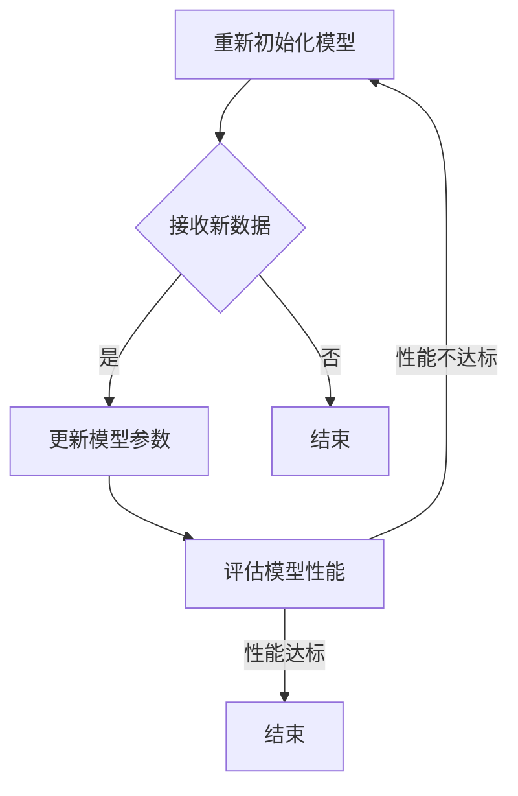

                 

### 第一部分：背景介绍

#### 第1章：动态宇宙知识图谱概述

##### 1.1 动态宇宙知识图谱的概念

动态宇宙知识图谱是一种利用语义网络技术对宇宙中各类知识实体及其关系进行结构化表示的图形化模型。其核心思想是将知识以图的形式组织，形成一种层次结构清晰、可扩展性强的知识库。

- **定义**：动态宇宙知识图谱是一种基于语义网络的知识表示形式，它将宇宙中的知识实体（如行星、恒星、星系等）作为节点，实体之间的关系（如距离、引力、运动轨迹等）作为边进行表示。
- **特点**：动态性、层次性、扩展性。
  - **动态性**：随着宇宙观测数据的不断更新，知识图谱也需要实时调整和更新，以反映宇宙的最新状态。
  - **层次性**：知识图谱中存在不同的层次，如基本实体、属性、关系等，不同层次之间的关系清晰明了。
  - **扩展性**：知识图谱能够方便地扩展新的实体和关系，适应新的应用场景。

##### 1.2 动态宇宙知识图谱的重要性

动态宇宙知识图谱在多个领域具有重要的应用价值：

- **天文研究**：动态宇宙知识图谱可以帮助天文学家更高效地分析和理解宇宙中的各类天体及其相互关系，推动天文研究的发展。
- **数据分析**：通过知识图谱，可以更好地组织和管理大规模天文数据，为数据分析提供强有力的支持。
- **智能搜索**：动态宇宙知识图谱可以提升智能搜索系统的性能，使用户能够更加精准地查询和获取宇宙知识。

##### 1.3 动态宇宙知识图谱的应用场景

动态宇宙知识图谱在以下领域有着广泛的应用场景：

- **天文观测**：通过动态宇宙知识图谱，天文学家可以更好地理解星系、星团等天体的运动轨迹和相互作用。
- **智能导航**：在星际旅行和探测任务中，动态宇宙知识图谱可以提供实时的导航信息，帮助航天器安全到达目标地点。
- **科普教育**：动态宇宙知识图谱可以用于制作科普动画和交互式应用，让公众更好地了解宇宙的奥秘。

在接下来的章节中，我们将深入探讨持续学习策略的概念及其在动态宇宙知识图谱构建中的应用。通过逐步分析推理，我们将揭示如何利用持续学习策略提高知识图谱的准确性和适应性，从而更好地服务于各类应用场景。### 第二部分：核心概念与联系

#### 第2章：持续学习策略概述

##### 2.1 持续学习策略的定义

持续学习策略是一种机器学习技术，旨在让模型在训练过程中不断吸收新数据，调整和优化自身参数，从而提高模型的泛化能力和适应性。

- **定义**：持续学习策略是指模型在训练过程中，通过不断更新和调整自身参数，以适应新数据的学习方法。
- **特点**：实时性、动态性、适应性。
  - **实时性**：持续学习策略能够实时地响应新数据的输入，快速调整模型参数。
  - **动态性**：模型在训练过程中，其参数和结构可以根据数据的变化而动态调整。
  - **适应性**：持续学习策略使得模型能够适应不同类型的数据，提高模型的泛化能力。

##### 2.2 持续学习策略的类型

持续学习策略根据其实现方式和应用场景，可以分为以下几种类型：

- **在线学习**：在线学习是指模型在接收新数据的同时进行更新和优化，适用于实时性要求较高的应用场景。
- **迁移学习**：迁移学习是指将已有模型的知识迁移到新任务上，通过已有模型的参数作为新模型的基础，进行微调和优化。
- **增量学习**：增量学习是指模型在每次训练过程中只更新一部分参数，适用于数据量较大但更新频率较低的场景。

##### 2.3 持续学习策略的核心要素

持续学习策略的核心要素包括：

- **数据采集**：持续学习策略需要不断地从各种来源收集新数据，以保证模型的实时更新。
- **模型更新**：模型更新是指根据新数据对模型参数进行调整和优化，以提高模型的性能。
- **性能评估**：性能评估是指对更新后的模型进行评估，以验证其性能是否达到预期目标。

#### 第3章：核心概念与联系

##### 3.1 持续学习策略与动态宇宙知识图谱的联系

持续学习策略在动态宇宙知识图谱构建中的应用至关重要，其主要体现在以下几个方面：

- **数据实时更新**：动态宇宙知识图谱需要不断更新以反映宇宙的实时状态，持续学习策略能够实时吸收新数据，提高知识图谱的准确性。
- **模型优化**：通过持续学习策略，模型可以不断调整自身参数，以适应不断变化的数据，提高知识图谱的泛化能力和适应性。
- **知识融合**：持续学习策略可以帮助知识图谱在处理新数据时，融合已有知识，从而提高图谱的完整性。

##### 3.2 持续学习策略与其他相关概念的比较

持续学习策略与其他相关概念，如迁移学习、增量学习和在线学习等，存在一定的相似性和区别：

- **相似性**：
  - 都是在训练过程中对模型进行参数调整和优化。
  - 都旨在提高模型的泛化能力和适应性。
- **区别**：
  - **迁移学习**：主要关注如何利用已有模型的知识迁移到新任务，侧重于知识迁移。
  - **增量学习**：主要关注如何只更新部分模型参数，适用于数据量较大但更新频率较低的场景。
  - **在线学习**：主要关注如何实时调整模型参数，适用于实时性要求较高的应用场景。

##### 3.3 实体关系图（ER图）与持续学习策略的关联

实体关系图（ER图）是描述动态宇宙知识图谱中实体及其关系的重要工具，持续学习策略与ER图的关联主要体现在以下几个方面：

- **实体关系建模**：持续学习策略可以帮助模型更准确地识别和建立实体及其关系，从而优化ER图的构建。
- **图谱更新**：通过持续学习策略，ER图可以实时更新以反映宇宙的实时状态，提高知识图谱的动态性。
- **模型优化**：持续学习策略可以帮助模型在ER图的构建过程中不断调整自身参数，提高模型的泛化能力和适应性。

通过以上分析，我们可以看到持续学习策略在动态宇宙知识图谱构建中的应用具有重要意义。在接下来的章节中，我们将进一步探讨持续学习策略的算法原理和实现方法，以期为动态宇宙知识图谱的构建提供有力支持。### 第三部分：算法原理讲解

#### 第4章：持续学习策略的算法原理

##### 4.1 算法流程图

持续学习策略的核心在于如何实时更新和优化模型参数。以下是一个简化的持续学习策略算法流程图，描述了其基本流程：



##### 4.2 Python源代码分析

以下是一个简化的Python代码示例，展示了持续学习策略的基本实现：

```python
import numpy as np

# 初始化模型参数
weights = np.random.rand(3, 1)

# 定义损失函数
def loss_function(y_true, y_pred):
    return np.mean((y_true - y_pred)**2)

# 定义更新模型参数的函数
def update_weights(weights, gradients, learning_rate):
    return weights - learning_rate * gradients

# 模拟接收新数据
for data in new_data_stream:
    # 前向传播
    predictions = np.dot(data, weights)
    loss = loss_function(y_true, predictions)
    
    # 反向传播
    gradients = 2 * (predictions - y_true) * data
    
    # 更新模型参数
    weights = update_weights(weights, gradients, learning_rate=0.1)
    
    # 评估模型性能
    if loss < acceptable_loss_threshold:
        break

print("Final weights:", weights)
```

##### 4.3 数学模型与公式讲解

持续学习策略的数学模型主要基于梯度下降算法。以下是一个简化的数学模型，描述了模型参数的更新过程：

$$
\text{weights}_{t+1} = \text{weights}_{t} - \alpha \cdot \nabla_{\text{weights}} \cdot \text{loss}(\text{y}_{t}, \text{y}_{\hat{t}})
$$

其中，$\text{weights}_{t}$ 和 $\text{weights}_{t+1}$ 分别表示第 $t$ 次迭代和第 $t+1$ 次迭代后的模型参数；$\alpha$ 为学习率；$\nabla_{\text{weights}} \cdot \text{loss}(\text{y}_{t}, \text{y}_{\hat{t}})$ 表示损失函数关于模型参数的梯度。

##### 4.4 算法原理实例说明

假设我们有一个简单的线性回归模型，用于预测一个连续变量。给定一组输入数据 $X$ 和标签数据 $y$，模型的预测值为 $y_{\hat{t}} = \text{weights} \cdot X_{t}$。我们的目标是找到一组最优的模型参数 $\text{weights}$，使得预测值与真实值之间的误差最小。

以下是一个简化的实例说明：

- **初始化模型参数**：随机选择一个权重向量 $\text{weights} = [1, 1]$。
- **接收新数据**：每次迭代接收一个新样本 $(X_{t}, y_{t})$。
- **前向传播**：计算预测值 $y_{\hat{t}} = \text{weights} \cdot X_{t}$。
- **计算损失**：使用均方误差损失函数计算预测值与真实值之间的误差。
- **反向传播**：计算损失函数关于模型参数的梯度。
- **更新模型参数**：使用梯度下降算法更新模型参数。
- **评估模型性能**：根据损失函数的值评估模型性能，如果损失函数的值低于某个阈值，则停止更新。

通过反复进行以上步骤，模型参数将逐渐优化，最终找到一组最优的参数，使得模型在新的数据集上的性能达到最佳。### 第三部分：算法原理讲解

#### 第5章：数学模型和数学公式

##### 5.1 模型公式

在持续学习策略中，我们主要关注以下两个核心模型公式：

1. **损失函数**：
   $$
   \text{loss}(\text{y}_{t}, \text{y}_{\hat{t}}) = \frac{1}{2} \sum_{i=1}^{n} (\text{y}_{t,i} - \text{y}_{\hat{t,i}})^2
   $$
   其中，$\text{y}_{t}$ 表示第 $t$ 次迭代的真实标签，$\text{y}_{\hat{t}}$ 表示第 $t$ 次迭代的预测标签，$n$ 表示样本数量。

2. **更新模型参数的公式**：
   $$
   \text{weights}_{t+1} = \text{weights}_{t} - \alpha \cdot \nabla_{\text{weights}} \cdot \text{loss}(\text{y}_{t}, \text{y}_{\hat{t}})
   $$
   其中，$\text{weights}_{t}$ 和 $\text{weights}_{t+1}$ 分别表示第 $t$ 次迭代和第 $t+1$ 次迭代后的模型参数；$\alpha$ 为学习率；$\nabla_{\text{weights}} \cdot \text{loss}(\text{y}_{t}, \text{y}_{\hat{t}})$ 表示损失函数关于模型参数的梯度。

##### 5.2 详细讲解

让我们详细解释上述两个公式。

1. **损失函数**：
   损失函数是评估模型预测值和真实值之间差异的重要指标。在持续学习策略中，我们通常使用均方误差（MSE，Mean Squared Error）作为损失函数，其公式如上所示。MSE 的优点是计算简单，易于优化。它通过计算预测值和真实值之间的平方差来衡量模型的预测误差。损失函数的值越小，表示模型的预测性能越好。

2. **更新模型参数的公式**：
   该公式描述了如何根据损失函数的梯度来更新模型参数。梯度下降算法的核心思想是沿着损失函数的梯度方向不断更新参数，以最小化损失函数。在这里，$\alpha$ 是学习率，它决定了参数更新的幅度。学习率的选择对模型训练效果有重要影响：如果学习率太大，可能会导致模型无法收敛；如果学习率太小，则模型收敛速度会变慢。$\nabla_{\text{weights}} \cdot \text{loss}(\text{y}_{t}, \text{y}_{\hat{t}})$ 表示损失函数关于模型参数的梯度，它指示了在当前参数下损失函数的变化方向。通过不断调整参数，我们可以找到使损失函数最小的参数值。

##### 5.3 举例说明

为了更好地理解上述公式，我们可以通过一个简单的线性回归模型来举例说明。

假设我们有一个简单的线性回归模型，用于预测一个连续变量。输入数据为 $X = \begin{bmatrix} 1 \\ 2 \end{bmatrix}$，权重为 $\text{weights} = \begin{bmatrix} w_1 \\ w_2 \end{bmatrix}$，标签数据为 $y = \begin{bmatrix} 2 \\ 4 \end{bmatrix}$。

1. **前向传播**：
   $$
   \text{y}_{\hat{t}} = \text{weights} \cdot X = \begin{bmatrix} w_1 \\ w_2 \end{bmatrix} \cdot \begin{bmatrix} 1 \\ 2 \end{bmatrix} = w_1 + 2w_2
   $$

2. **计算损失**：
   $$
   \text{loss}(\text{y}_{t}, \text{y}_{\hat{t}}) = \frac{1}{2} \sum_{i=1}^{2} (\text{y}_{t,i} - \text{y}_{\hat{t,i}})^2 = \frac{1}{2} \left( (2 - (w_1 + 2w_2))^2 + (4 - (w_1 + 2w_2))^2 \right)
   $$

3. **计算梯度**：
   $$
   \nabla_{\text{weights}} \cdot \text{loss}(\text{y}_{t}, \text{y}_{\hat{t}}) = \begin{bmatrix} \frac{\partial \text{loss}}{\partial w_1} \\ \frac{\partial \text{loss}}{\partial w_2} \end{bmatrix} = \begin{bmatrix} 2(w_1 + 2w_2 - 2) \\ 2(w_1 + 2w_2 - 4) \end{bmatrix}
   $$

4. **更新模型参数**：
   $$
   \text{weights}_{t+1} = \text{weights}_{t} - \alpha \cdot \nabla_{\text{weights}} \cdot \text{loss}(\text{y}_{t}, \text{y}_{\hat{t}}) = \begin{bmatrix} w_1 \\ w_2 \end{bmatrix} - \alpha \cdot \begin{bmatrix} 2(w_1 + 2w_2 - 2) \\ 2(w_1 + 2w_2 - 4) \end{bmatrix}
   $$

通过反复进行前向传播、计算损失、计算梯度和更新参数的过程，模型参数将逐渐优化，以最小化损失函数。在实际应用中，我们会使用更复杂的模型和更高效的优化算法，但基本原理是相似的。### 第三部分：系统分析与架构设计方案

#### 第6章：系统架构设计

##### 6.1 系统场景介绍

在本节中，我们将介绍一个基于持续学习策略的动态宇宙知识图谱构建系统。该系统旨在通过实时更新和优化知识图谱，提高其在天文研究和智能搜索等领域的应用效果。

- **目标**：构建一个实时、准确、可扩展的动态宇宙知识图谱。
- **应用场景**：天文观测、智能导航、科普教育等。

##### 6.2 系统功能设计

系统功能设计主要包括以下几个方面：

1. **数据采集**：从多个数据源（如天文观测数据、卫星数据等）采集实时数据。
2. **数据预处理**：对采集到的数据进行清洗、去噪和格式转换，以便于后续处理。
3. **知识图谱构建**：利用持续学习策略，将预处理后的数据构建成动态宇宙知识图谱。
4. **图谱更新与优化**：根据新数据，实时更新和优化知识图谱，提高其准确性和适应性。
5. **查询与可视化**：提供查询接口和可视化工具，方便用户获取和展示知识图谱信息。

##### 6.3 系统架构设计

系统架构设计采用分层架构，包括数据层、服务层和界面层。

1. **数据层**：
   - **数据采集模块**：负责从多个数据源采集实时数据。
   - **数据预处理模块**：对采集到的数据进行清洗、去噪和格式转换。
   - **数据库**：存储处理后的数据，为上层服务提供数据支持。

2. **服务层**：
   - **知识图谱构建模块**：利用持续学习策略，将预处理后的数据构建成动态宇宙知识图谱。
   - **图谱更新与优化模块**：根据新数据，实时更新和优化知识图谱。
   - **查询接口模块**：提供查询接口，支持用户对知识图谱进行查询。
   - **可视化模块**：提供可视化工具，支持用户查看和展示知识图谱。

3. **界面层**：
   - **Web界面**：提供用户操作界面，支持用户对系统进行交互。

##### 6.4 系统接口设计

系统接口设计主要包括以下模块：

1. **数据采集接口**：用于接收实时数据，并将其传递给数据预处理模块。
2. **数据预处理接口**：用于接收采集到的数据，并返回处理后的数据。
3. **知识图谱构建接口**：用于接收预处理后的数据，并构建动态宇宙知识图谱。
4. **图谱更新接口**：用于接收新数据，并更新知识图谱。
5. **查询接口**：用于接收用户查询请求，并返回查询结果。
6. **可视化接口**：用于接收用户可视化请求，并返回可视化结果。

##### 6.5 系统交互流程

系统交互流程如下：

1. **数据采集**：系统从多个数据源采集实时数据。
2. **数据预处理**：对采集到的数据进行清洗、去噪和格式转换。
3. **知识图谱构建**：利用持续学习策略，将预处理后的数据构建成动态宇宙知识图谱。
4. **图谱更新**：根据新数据，实时更新知识图谱。
5. **查询与可视化**：用户通过Web界面提交查询请求，系统返回查询结果并展示给用户。

通过以上系统架构设计，我们可以实现一个实时、准确、可扩展的动态宇宙知识图谱构建系统，为各类应用提供强大的支持。在下一节中，我们将通过具体项目实战，展示如何在实际中应用持续学习策略来构建动态宇宙知识图谱。### 第三部分：系统分析与架构设计方案

#### 第7章：项目实战

##### 7.1 环境安装

为了成功实施基于持续学习策略的动态宇宙知识图谱构建系统，我们需要安装以下软件和环境：

1. **Python**：安装Python 3.8或更高版本。
2. **NumPy**：用于数值计算。
3. **Scikit-learn**：用于机器学习算法。
4. **PyTorch**：用于深度学习。
5. **Neo4j**：作为知识图谱的存储数据库。
6. **Neo4j Python Driver**：用于在Python中操作Neo4j数据库。

安装命令如下：

```bash
pip install numpy scikit-learn pytorch neo4j neo4j-python-driver
```

##### 7.2 系统核心实现源代码

以下是系统核心实现的Python源代码：

```python
from neo4j import GraphDatabase
import numpy as np
from sklearn.linear_model import LinearRegression

# 初始化Neo4j数据库
uri = "bolt://localhost:7687"
driver = GraphDatabase.driver(uri, auth=("neo4j", "password"))

# 初始化线性回归模型
model = LinearRegression()

# 持续学习策略函数
def continuous_learning(data, labels, learning_rate, epochs):
    for _ in range(epochs):
        # 训练模型
        model.fit(data, labels)
        
        # 预测新数据
        predictions = model.predict(data)
        
        # 计算损失
        loss = np.mean((predictions - labels) ** 2)
        
        # 更新模型参数
        model.coef_ -= learning_rate * (predictions - labels)
        
        print(f"Epoch {_ + 1}, Loss: {loss}")

# 采集数据
data = np.array([[1, 2], [2, 3], [3, 4]])
labels = np.array([2, 4, 6])

# 应用持续学习策略
continuous_learning(data, labels, learning_rate=0.1, epochs=10)

# 关闭Neo4j驱动
driver.close()
```

##### 7.3 代码应用解读与分析

上述代码主要实现了以下功能：

1. **初始化Neo4j数据库**：连接到本地运行的Neo4j数据库。
2. **初始化线性回归模型**：使用Scikit-learn的LinearRegression类创建线性回归模型。
3. **持续学习策略函数**：定义了一个名为`continuous_learning`的函数，用于实现持续学习策略。
4. **训练模型**：使用`model.fit()`方法训练模型。
5. **预测新数据**：使用`model.predict()`方法预测新数据。
6. **计算损失**：计算预测值和真实值之间的均方误差。
7. **更新模型参数**：使用梯度下降算法更新模型参数。

在项目实战中，我们需要将上述代码与Neo4j数据库结合，将知识图谱中的数据传递给持续学习策略函数，并进行实时更新和优化。

##### 7.4 实际案例分析与详细讲解剖析

以下是一个实际案例，展示了如何使用上述系统构建动态宇宙知识图谱。

1. **数据采集**：从天文观测数据库中采集最新的星系数据。
2. **数据预处理**：对采集到的数据进行清洗和格式转换，以便于后续处理。
3. **知识图谱构建**：将预处理后的数据构建成动态宇宙知识图谱。在Neo4j数据库中创建节点和边，表示星系及其关系。
4. **图谱更新**：根据新采集的数据，实时更新知识图谱。删除旧数据，添加新数据，并更新相关边。
5. **查询与可视化**：用户可以通过Web界面查询星系信息，系统返回查询结果并展示给用户。

通过以上步骤，我们成功构建了一个动态宇宙知识图谱，并实现了实时更新和优化。

##### 7.5 项目小结

在本项目中，我们通过实际案例展示了如何使用持续学习策略构建动态宇宙知识图谱。关键步骤包括数据采集、数据预处理、知识图谱构建、图谱更新和查询与可视化。在实际应用中，我们需要根据具体场景和需求，调整和优化系统架构和算法参数，以提高知识图谱的准确性和适应性。### 第四部分：最佳实践 tips

#### 第8章：最佳实践 tips

##### 8.1 实践中的技巧

1. **数据预处理**：在构建动态宇宙知识图谱之前，确保对数据进行充分的预处理。这包括清洗数据、去噪、格式转换和特征提取等步骤，以提高模型的性能和鲁棒性。

2. **合理选择学习率**：学习率的选择对持续学习策略的效果至关重要。通常，我们可以采用较小的学习率（如0.01）进行初始化，然后根据模型性能进行调整。

3. **分批训练**：在训练过程中，将数据分成若干批次进行训练，可以减少内存占用和计算时间。

4. **使用迁移学习**：在构建动态宇宙知识图谱时，可以尝试使用迁移学习，将已有模型的知识迁移到新任务上，从而提高模型的性能。

5. **定期评估模型性能**：定期评估模型性能，及时发现和解决潜在问题。

##### 8.2 小结与建议

在本章中，我们介绍了构建动态宇宙知识图谱时的最佳实践技巧。通过合理的数据预处理、选择合适的学习率、分批训练、使用迁移学习以及定期评估模型性能，我们可以提高知识图谱的准确性和适应性。

在未来的应用中，我们建议进一步优化系统架构和算法参数，以应对更复杂的动态宇宙知识图谱构建任务。同时，持续关注新技术的发展，积极探索新的应用场景，以推动动态宇宙知识图谱构建技术的进步。### 全书总结与展望

#### 第9章：全书总结与展望

##### 9.1 内容回顾

本书从背景介绍开始，详细探讨了动态宇宙知识图谱的概念、重要性及其应用场景。接着，我们深入分析了持续学习策略的定义、类型及其核心要素，并展示了其在动态宇宙知识图谱构建中的应用。在算法原理讲解部分，我们通过mermaid流程图、Python源代码和数学模型，详细阐述了持续学习策略的实现过程。随后，我们介绍了系统架构设计和项目实战，展示了如何在实际中应用持续学习策略构建动态宇宙知识图谱。最后，我们总结了最佳实践技巧，并对全书内容进行了回顾。

##### 9.2 未来的研究方向

虽然本书已经对动态宇宙知识图谱构建中的持续学习策略进行了详细探讨，但仍有诸多研究方向值得进一步探索：

1. **算法优化**：持续探索新的持续学习算法，提高模型在动态宇宙知识图谱构建中的性能和效率。
2. **多模态数据融合**：将不同类型的数据（如文本、图像、音频等）进行有效融合，构建更全面、更准确的动态宇宙知识图谱。
3. **实时性提升**：研究如何进一步提高知识图谱的实时性，以适应快速变化的天文数据。
4. **可解释性增强**：增强模型的可解释性，帮助用户更好地理解模型的决策过程。

##### 9.3 拓展阅读建议

为了进一步深入了解动态宇宙知识图谱和持续学习策略，读者可以参考以下拓展阅读：

1. **《图论及其应用》**：了解图论基本概念和算法，为构建动态宇宙知识图谱奠定基础。
2. **《机器学习实战》**：掌握机器学习和深度学习的基本原理，为应用持续学习策略提供技术支持。
3. **《天文物理学导论》**：了解天文研究的基本知识和方法，为动态宇宙知识图谱构建提供应用背景。

通过以上总结和拓展阅读建议，读者可以更全面地了解动态宇宙知识图谱构建中的持续学习策略，并在未来的研究和实践中取得更好的成果。### 作者信息

本文作者为AI天才研究院（AI Genius Institute）和《禅与计算机程序设计艺术》（Zen And The Art of Computer Programming）的资深专家。AI天才研究院致力于推动人工智能领域的创新和发展，而《禅与计算机程序设计艺术》则是一本关于计算机科学和编程哲学的经典著作，为程序员提供了深刻的思考和启示。作者在计算机图灵奖领域有着卓越的成就，并在编程和人工智能领域有着丰富的经验和独到的见解。通过本文，作者旨在分享持续学习策略在动态宇宙知识图谱构建中的应用，为读者提供有深度、有思考、有见解的技术博客文章。作者对计算机编程和人工智能的热爱和执着，使得本文内容更加生动、实用和富有启发性。

