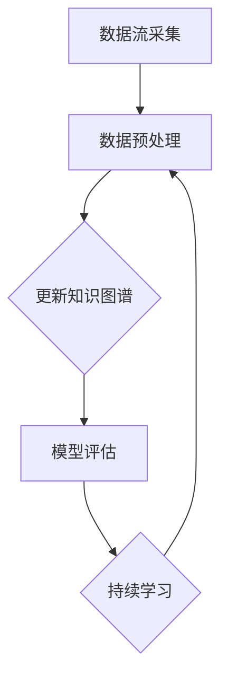

                 

### 第一部分：动态知识图谱与持续学习策略概述

#### 1.1 动态知识图谱构建背景与挑战

##### 1.1.1 知识图谱的发展历程

知识图谱（Knowledge Graph）作为一个将语义信息以图形的方式表示的技术概念，起源于语义网（Semantic Web）的构想。语义网旨在通过将Web中的数据语义化，使其更加容易被计算机理解和处理。知识图谱的发展历程可以追溯到2001年，谷歌推出了PageRank算法，通过网页之间的链接关系来计算网页的重要性，这是知识图谱思想的初步应用。随后，随着互联网的快速发展，数据量的激增以及人工智能技术的进步，知识图谱逐渐成为了一种重要的数据结构和工具。

知识图谱的核心在于将现实世界中的实体、属性和关系抽象为图结构，从而形成一个语义丰富的知识网络。这个网络不仅能够对实体进行分类和关系建模，还能够通过推理和计算来发现新的信息。知识图谱的发展大致可以分为以下几个阶段：

1. **本体论阶段**：在这个阶段，研究者们提出了各种本体语言（如OWL、RDF）和标准，用于定义概念、属性和关系，为知识图谱的构建提供了基础框架。
2. **语义网阶段**：随着Web 2.0的发展，大量用户生成的内容使得语义网的概念逐渐落地。这个阶段的知识图谱主要关注如何将网页中的信息语义化，从而实现语义检索和知识发现。
3. **链接数据阶段**：在这个阶段，W3C发布了链接数据（Linked Data）的推荐实践，鼓励将分散的、结构化的数据通过网络链接起来，形成一个全球的语义网络。
4. **现代知识图谱阶段**：现代知识图谱不仅包含了结构化的数据，还融合了非结构化数据，如文本、图像和音频。同时，随着深度学习和自然语言处理技术的应用，知识图谱的构建和推理能力得到了显著提升。

##### 1.1.2 动态知识图谱的核心概念

动态知识图谱（Dynamic Knowledge Graph）是知识图谱的一种高级形式，它具有实时性、可扩展性和自适应性的特点。与静态知识图谱相比，动态知识图谱能够不断地接收和更新数据，从而反映现实世界中的变化。动态知识图谱的核心概念包括：

1. **实体（Entity）**：实体是知识图谱中的核心要素，代表了现实世界中的对象或概念，如人、地点、组织等。
2. **属性（Attribute）**：属性描述了实体具有的特征或状态，如人的年龄、地点的坐标等。
3. **关系（Relationship）**：关系描述了实体之间的相互联系，如“居住于”、“属于”等。
4. **版本（Version）**：动态知识图谱具有多个版本，每个版本代表了知识图谱在某一时间点的状态。
5. **更新策略（Update Strategy）**：为了保持知识图谱的实时性，需要制定有效的更新策略，包括数据采集、清洗、融合和存储等过程。

##### 1.1.3 动态知识图谱构建的挑战

动态知识图谱构建过程中面临以下挑战：

1. **数据噪声**：实时数据源往往存在噪声和错误，需要通过数据清洗和去噪技术来提高数据质量。
2. **实时更新**：动态知识图谱需要快速响应用户的查询和数据更新请求，需要优化数据存储和索引策略。
3. **一致性维护**：在动态环境下，知识图谱的一致性维护是一个难点，需要采用分布式系统和并发控制技术来确保数据一致性。
4. **扩展性**：随着数据量的增长，知识图谱的构建和维护需要具备良好的扩展性，以便处理大规模数据集。
5. **推理能力**：动态知识图谱需要具备强大的推理能力，以便发现新的知识关系和洞见。

#### 1.2 持续学习策略概述

##### 1.2.1 持续学习的概念与特性

持续学习（Continuous Learning）是一种机器学习方法，旨在使模型能够在新的数据和环境中不断优化和改进。与传统的批量学习（Batch Learning）和在线学习（Online Learning）不同，持续学习具有以下几个特性：

1. **适应性**：持续学习模型能够快速适应新的数据分布，避免模型退化。
2. **迁移学习**：持续学习模型能够将先前学到的知识迁移到新任务上，提高学习效率。
3. **数据积累**：持续学习过程中，模型会不断积累数据，从而提高模型的泛化能力。
4. **实时更新**：持续学习模型能够实时更新模型参数，以适应环境变化。

##### 1.2.2 持续学习的类型及应用场景

持续学习可以分为以下几种类型：

1. **基于数据的持续学习**：这种类型主要关注如何利用新的数据来更新模型，常见应用场景包括推荐系统、股票预测等。
2. **基于模型的持续学习**：这种类型主要关注如何优化模型结构，以提高模型性能，常见应用场景包括神经网络架构搜索、生成对抗网络等。
3. **基于交互的持续学习**：这种类型主要关注如何通过用户交互来提高模型性能，常见应用场景包括人机对话系统、智能客服等。

##### 1.2.3 持续学习在动态知识图谱构建中的应用

持续学习在动态知识图谱构建中具有重要的应用价值：

1. **实时更新知识图谱**：通过持续学习，模型可以实时更新知识图谱中的实体、属性和关系，从而保持知识图谱的实时性和准确性。
2. **提高知识图谱的推理能力**：通过持续学习，模型可以不断积累新知识，从而提高知识图谱的推理能力和应用价值。
3. **优化知识图谱构建流程**：持续学习可以优化知识图谱的构建流程，包括数据采集、清洗、融合和存储等环节。

#### 1.3 持续学习策略与动态知识图谱的关系

持续学习策略在动态知识图谱构建中扮演着关键角色：

1. **增强实时性**：持续学习策略可以使知识图谱模型实时更新，提高知识图谱的实时性，满足动态环境下的需求。
2. **提升准确性**：通过持续学习，模型可以不断优化，提高知识图谱的准确性，降低数据噪声和错误的影响。
3. **增强扩展性**：持续学习策略可以帮助知识图谱模型适应大规模数据集，提高知识图谱的扩展性。
4. **优化推理能力**：持续学习策略可以使知识图谱模型具备更强的推理能力，从而发现新的知识和洞见。

#### 1.4 本书结构安排与主要内容

本书分为以下几个部分：

1. **第一部分：动态知识图谱与持续学习策略概述**：介绍动态知识图谱和持续学习策略的基本概念、发展历程和主要挑战。
2. **第二部分：核心概念与联系**：详细阐述持续学习的核心概念、特性、类型和应用场景，以及动态知识图谱的ER实体关系图架构。
3. **第三部分：算法原理讲解**：介绍持续学习策略在动态知识图谱构建中的应用算法，包括算法原理、流程图、源代码和数学模型。
4. **第四部分：系统分析与架构设计方案**：讨论动态知识图谱构建的系统设计与实现，包括问题场景、项目介绍、系统功能设计和系统架构设计。
5. **第五部分：项目实战**：通过实际项目来展示持续学习策略在动态知识图谱构建中的应用，包括环境安装、核心实现、代码解读和案例分析。
6. **第六部分：最佳实践 tips、小结、注意事项、拓展阅读**：总结最佳实践，回顾核心内容，指出注意事项，并提供拓展阅读资源。

通过上述结构安排，本书旨在为读者提供一个全面、深入的理解动态知识图谱构建和持续学习策略的应用，帮助读者掌握相关技术，并在实际项目中运用这些知识。## 1.1 动态知识图谱构建背景与挑战

##### 1.1.1 知识图谱的发展历程

知识图谱的概念最早可以追溯到1992年，由美国计算机科学家蒂姆·伯纳斯·李（Tim Berners-Lee）提出，他在互联网早期提出了语义网（Semantic Web）的概念，旨在通过标记语言（如RDF和OWL）将Web上的信息进行语义标注，使其能够被计算机理解和处理。这一概念为知识图谱的诞生奠定了基础。

随着时间的推移，知识图谱的理念逐渐成熟，并开始在实际应用中得到应用。2001年，谷歌推出了PageRank算法，这是知识图谱在搜索引擎中的一个重要应用。PageRank算法通过分析网页之间的链接关系，评估网页的重要性，从而为用户提供更准确的搜索结果。这一突破标志着知识图谱技术在互联网领域的兴起。

进入21世纪，知识图谱的应用领域不断拓展。2006年，谷歌发布了知识图谱项目（Google Knowledge Graph），这是一个基于语义信息的数据集，用于构建实体与实体之间的关系网络。知识图谱的兴起为搜索引擎、自然语言处理、推荐系统等领域带来了深远的影响。

知识图谱的发展可以大致分为以下几个阶段：

1. **本体论阶段**：在这个阶段，研究者们开始探讨如何通过形式化的本体语言来描述概念、属性和关系。RDF（资源描述框架）和OWL（Web本体语言）是最常用的两种本体语言。RDF使用URI（统一资源标识符）来表示实体、属性和关系，而OWL则在RDF的基础上增加了更加复杂的本体描述能力。

2. **语义网阶段**：随着Web 2.0的兴起，用户生成的内容成为互联网的重要组成部分。为了更好地理解和处理这些内容，研究者们开始将语义网的理念应用到实际应用中。例如，Facebook和LinkedIn等社交媒体平台使用知识图谱来组织用户信息和社交关系，从而提供更加个性化的服务。

3. **链接数据阶段**：2007年，W3C发布了链接数据（Linked Data）的推荐实践。链接数据的核心思想是将分散的数据通过网络链接起来，形成一个全球的语义网络。这一实践推动了知识图谱的广泛应用，例如DBpedia等项目的出现，这些项目通过将结构化数据链接到RDF格式，构建了一个大规模的知识图谱。

4. **现代知识图谱阶段**：随着大数据和人工智能技术的发展，知识图谱的应用更加广泛和深入。现代知识图谱不仅包含了结构化的数据，还融合了非结构化数据，如文本、图像和音频。深度学习和自然语言处理技术的应用使得知识图谱的构建和推理能力得到了显著提升。例如，谷歌的BERT模型就是基于知识图谱进行预训练的，从而提高了自然语言处理任务的性能。

##### 1.1.2 动态知识图谱的核心概念

动态知识图谱（Dynamic Knowledge Graph）是知识图谱的一种高级形式，它具有实时性、可扩展性和自适应性的特点。与静态知识图谱相比，动态知识图谱能够不断地接收和更新数据，从而反映现实世界中的变化。动态知识图谱的核心概念包括：

1. **实体（Entity）**：实体是知识图谱中的核心要素，代表了现实世界中的对象或概念，如人、地点、组织等。实体可以是具体的个体，也可以是抽象的概念。

2. **属性（Attribute）**：属性描述了实体具有的特征或状态，如人的年龄、地点的坐标等。属性可以用来刻画实体的具体细节。

3. **关系（Relationship）**：关系描述了实体之间的相互联系，如“居住于”、“属于”等。关系可以用来表达实体之间的语义关系。

4. **版本（Version）**：动态知识图谱具有多个版本，每个版本代表了知识图谱在某一时间点的状态。版本控制是动态知识图谱保持实时性和准确性的重要手段。

5. **更新策略（Update Strategy）**：为了保持知识图谱的实时性，需要制定有效的更新策略，包括数据采集、清洗、融合和存储等过程。更新策略需要考虑数据源、数据频率、数据质量等因素。

##### 1.1.3 动态知识图谱构建的挑战

动态知识图谱构建过程中面临以下挑战：

1. **数据噪声**：实时数据源往往存在噪声和错误，这些噪声可能会影响知识图谱的准确性和鲁棒性。例如，社交媒体上的信息可能会包含错误或误导性内容。

2. **实时更新**：动态知识图谱需要快速响应用户的查询和数据更新请求，这要求系统具备高效的更新和处理能力。在大量数据和高频次更新的情况下，如何保证系统的性能和稳定性是一个重要挑战。

3. **一致性维护**：在动态环境下，知识图谱的一致性维护是一个难点。由于数据的不断更新，可能会引发数据冲突和一致性问题。例如，当一个实体在不同时间点被赋予不同的属性值时，如何确保数据的一致性是一个重要问题。

4. **扩展性**：随着数据量的增长，知识图谱的构建和维护需要具备良好的扩展性，以便处理大规模数据集。如何优化存储、索引和查询机制，以支持大规模数据的高效处理，是一个关键挑战。

5. **推理能力**：动态知识图谱需要具备强大的推理能力，以便发现新的知识关系和洞见。然而，随着知识图谱规模的扩大，推理任务变得越来越复杂，如何设计高效、可靠的推理算法是一个挑战。

总的来说，动态知识图谱构建面临着数据、技术、算法等多方面的挑战。为了解决这些问题，需要采用一系列技术手段和策略，包括数据清洗、实时处理、一致性维护、扩展性和推理优化等。通过不断的研究和实践，动态知识图谱构建技术正在不断成熟和进步。## 1.2 持续学习策略概述

##### 1.2.1 持续学习的概念与特性

持续学习（Continuous Learning）是一种机器学习方法，旨在使模型能够在新的数据和环境中不断优化和改进。与传统的批量学习（Batch Learning）和在线学习（Online Learning）不同，持续学习具有以下几个特性：

1. **适应性**：持续学习模型能够快速适应新的数据分布，避免模型退化。在动态环境下，数据分布可能会发生变化，持续学习模型能够通过不断更新模型参数来适应新的数据，从而保持良好的性能。

2. **迁移学习**：持续学习模型能够将先前学到的知识迁移到新任务上，提高学习效率。例如，在一个推荐系统中，用户的行为数据可能会随着时间的推移而发生变化，持续学习模型可以通过利用过去的数据来提高对新行为的预测准确性。

3. **数据积累**：持续学习过程中，模型会不断积累数据，从而提高模型的泛化能力。随着训练数据的增加，模型能够更好地泛化到未见过的数据，从而提高模型的鲁棒性和泛化能力。

4. **实时更新**：持续学习模型能够实时更新模型参数，以适应环境变化。在动态知识图谱构建中，持续学习模型可以实时更新实体、属性和关系，从而保持知识图谱的实时性和准确性。

##### 1.2.2 持续学习的类型及应用场景

持续学习可以分为以下几种类型：

1. **基于数据的持续学习**：这种类型主要关注如何利用新的数据来更新模型。在实际应用中，基于数据的持续学习通常涉及以下步骤：

   - 数据采集：从实时数据源中收集新的数据。
   - 数据预处理：对新的数据进行清洗、归一化和特征提取。
   - 模型更新：利用新的数据对模型进行训练和更新。
   - 模型评估：评估更新后的模型的性能，确保其符合预期。

   基于数据的持续学习在推荐系统、股票预测和实时监测等领域有着广泛的应用。例如，推荐系统可以通过持续学习来实时更新用户兴趣模型，从而提供更加个性化的推荐。

2. **基于模型的持续学习**：这种类型主要关注如何优化模型结构，以提高模型性能。在实际应用中，基于模型的持续学习通常涉及以下步骤：

   - 模型评估：评估当前模型的结构和参数，确定模型是否需要优化。
   - 模型优化：通过调整模型结构或参数来优化模型性能。
   - 模型训练：利用新的数据和优化后的模型进行训练。
   - 模型验证：验证优化后的模型是否达到预期效果。

   基于模型的持续学习在神经网络架构搜索、生成对抗网络和深度强化学习等领域有着广泛的应用。例如，在神经网络架构搜索中，可以通过持续学习来不断优化网络结构，从而提高模型的性能。

3. **基于交互的持续学习**：这种类型主要关注如何通过用户交互来提高模型性能。在实际应用中，基于交互的持续学习通常涉及以下步骤：

   - 用户反馈：收集用户的反馈，如点击、评分或评论等。
   - 反馈处理：对用户的反馈进行处理，识别用户的偏好和需求。
   - 模型更新：根据用户的反馈来更新模型参数。
   - 交互迭代：通过与用户的交互来不断优化模型。

   基于交互的持续学习在智能客服、人机对话系统和个性化推荐等领域有着广泛的应用。例如，在智能客服中，可以通过持续学习来实时更新对话模型，从而提供更加自然和高效的对话体验。

##### 1.2.3 持续学习在动态知识图谱构建中的应用

持续学习在动态知识图谱构建中具有重要的应用价值：

1. **实时更新知识图谱**：通过持续学习，模型可以实时更新知识图谱中的实体、属性和关系，从而保持知识图谱的实时性和准确性。例如，在一个社交媒体平台上，用户的行为数据（如点赞、评论、分享等）可以用于更新用户关系知识图谱，从而反映最新的用户社交状态。

2. **提高知识图谱的推理能力**：通过持续学习，模型可以不断积累新知识，从而提高知识图谱的推理能力和应用价值。例如，在一个问答系统中，通过持续学习来不断更新实体和关系的知识，可以使得系统更加准确地理解和回答用户的问题。

3. **优化知识图谱构建流程**：持续学习可以优化知识图谱的构建流程，包括数据采集、清洗、融合和存储等环节。例如，在数据采集阶段，通过持续学习来实时更新数据采集策略，可以更好地适应动态环境中的数据变化。

总之，持续学习策略在动态知识图谱构建中扮演着关键角色，它不仅能够提高知识图谱的实时性和准确性，还能够优化知识图谱的构建和维护流程，从而提升知识图谱的应用价值。## 1.3 持续学习策略与动态知识图谱的关系

持续学习策略与动态知识图谱构建之间存在着紧密的联系和相互作用。持续学习为动态知识图谱的构建提供了有效的手段，使其能够适应实时变化的数据环境，保持知识图谱的准确性和时效性。以下将从多个方面探讨持续学习策略在动态知识图谱构建中的应用及其价值。

##### 1.3.1 持续学习策略在动态知识图谱构建中的价值

1. **实时更新知识**：动态知识图谱的核心在于其能够实时反映现实世界中的变化。持续学习策略通过不断地从实时数据源中学习新信息，可以及时更新知识图谱中的实体、属性和关系。这种实时更新的能力对于许多应用场景至关重要，如智能推荐系统、实时监控系统、智能问答系统等。

2. **提高推理能力**：持续学习使知识图谱模型能够不断地积累新的知识，从而提高其推理能力。通过持续学习，模型可以更好地理解和推理实体之间的关系，发现新的知识和洞见。这对于知识图谱在各种复杂应用场景中的表现具有重要意义。

3. **优化知识图谱构建流程**：持续学习策略还可以优化知识图谱的构建流程，包括数据采集、处理、存储和推理等环节。例如，在数据采集阶段，通过持续学习来动态调整数据采集策略，可以更好地适应数据源的变化。在数据清洗和融合阶段，持续学习可以帮助提高数据质量，减少噪声和错误的影响。

4. **增强系统鲁棒性**：通过持续学习，知识图谱模型可以不断适应新的数据和变化的环境，从而提高系统的鲁棒性。这对于应对动态环境中的不确定性因素具有重要意义，如数据噪声、异常值和噪声数据等。

##### 1.3.2 持续学习策略与知识图谱构建的融合

1. **融合机制**：持续学习策略与知识图谱构建的融合主要体现在以下几个方面：

   - **数据融合**：将实时数据与已有知识图谱进行融合，通过持续学习来更新和扩展知识图谱。
   - **模型融合**：将传统的机器学习模型与知识图谱相结合，利用知识图谱提供的信息来改进模型的性能。
   - **推理融合**：利用知识图谱中的实体和关系进行推理，以发现新的知识和洞见。

2. **应用场景**：在动态知识图谱构建中，持续学习策略可以应用于多个场景：

   - **实时推荐系统**：通过持续学习来实时更新用户兴趣模型，从而提供个性化的推荐。
   - **动态监控**：通过持续学习来实时监测系统状态，发现异常并采取措施。
   - **智能问答**：通过持续学习来提高问答系统的理解和推理能力，提供更准确和自然的回答。

3. **融合挑战**：持续学习策略与知识图谱构建的融合也面临着一些挑战：

   - **数据一致性**：在动态环境下，如何确保数据的准确性和一致性是一个关键问题。
   - **模型稳定性**：持续学习的模型更新可能会影响模型的稳定性和性能，需要设计有效的模型更新策略。
   - **计算效率**：在实时处理大量数据的情况下，如何提高计算效率是一个挑战。

##### 1.3.3 持续学习策略在知识图谱构建中的应用示例

以下是一个简单的示例，展示持续学习策略在知识图谱构建中的应用：

- **数据源**：一个社交媒体平台，用户可以发布动态、点赞、评论和分享。
- **目标**：构建一个动态知识图谱，反映用户的社交关系和行为模式。
- **持续学习策略**：

  - **数据采集**：从社交媒体平台实时收集用户行为数据（如发布动态、点赞、评论等）。
  - **数据预处理**：对用户行为数据进行清洗和归一化处理，提取关键信息（如用户ID、动态ID、时间戳等）。
  - **知识图谱更新**：利用持续学习模型，将新的用户行为数据融入到知识图谱中，更新实体和关系。
  - **推理与查询**：利用知识图谱进行推理和查询，为用户提供个性化推荐和回答问题。

通过上述示例，可以看出持续学习策略在动态知识图谱构建中的应用是如何实现的。持续学习策略不仅能够提高知识图谱的实时性和准确性，还能够优化知识图谱的构建和维护流程，从而提升其应用价值。## 1.4 本书结构安排与主要内容

为了帮助读者系统地了解动态知识图谱构建中的持续学习策略，本书分为六个主要部分，每个部分都有明确的结构和内容安排。

##### 1.4.1 目录结构安排

本书的目录结构如下：

- **第一部分：动态知识图谱与持续学习策略概述**
  - **第1章** 动态知识图谱构建背景与挑战
  - **第2章** 持续学习策略概述
  - **第3章** 持续学习策略与动态知识图谱的关系

- **第二部分：核心概念与联系**
  - **第4章** 持续学习的核心概念与特性
  - **第5章** 动态知识图谱的ER实体关系图架构

- **第三部分：算法原理讲解**
  - **第6章** 持续学习策略在动态知识图谱构建中的应用算法
  - **第7章** 算法流程图与数学模型

- **第四部分：系统分析与架构设计方案**
  - **第8章** 动态知识图谱构建的系统设计与实现
  - **第9章** 系统架构与接口设计

- **第五部分：项目实战**
  - **第10章** 动态知识图谱构建的实战项目
  - **第11章** 实际案例分析与讲解

- **第六部分：最佳实践 tips、小结、注意事项、拓展阅读**
  - **第12章** 持续学习策略在动态知识图谱构建中的最佳实践

##### 1.4.2 各章节主要内容概述

以下是各章节的主要内容和预期目标：

- **第1章**：介绍动态知识图谱和持续学习策略的基本概念、发展历程和主要挑战，为后续内容提供背景知识。
- **第2章**：详细阐述持续学习的概念、特性、类型和应用场景，为读者理解持续学习在动态知识图谱构建中的应用奠定基础。
- **第3章**：探讨持续学习策略与动态知识图谱构建之间的联系和融合方法，分析持续学习策略在动态知识图谱构建中的价值。
- **第4章**：介绍持续学习的核心概念，包括适应性、迁移学习、数据积累和实时更新等特性，为后续算法讲解做准备。
- **第5章**：描述动态知识图谱的ER实体关系图架构，包括实体、属性、关系和版本等核心要素，为算法设计和系统实现提供基础。
- **第6章**：介绍持续学习策略在动态知识图谱构建中的应用算法，包括算法流程图、源代码和数学模型，帮助读者深入理解算法原理。
- **第7章**：通过具体的算法流程图和Python源代码，详细讲解持续学习策略在动态知识图谱构建中的应用，帮助读者掌握算法实现方法。
- **第8章**：讨论动态知识图谱构建的系统设计与实现，包括问题场景、项目介绍、系统功能设计和系统架构设计，为实际项目提供指导。
- **第9章**：介绍动态知识图谱构建的系统架构设计，包括架构图、接口设计和系统交互，帮助读者了解系统的整体设计思路。
- **第10章**：通过一个实际的动态知识图谱构建项目，展示持续学习策略的应用，包括环境安装、系统核心实现、代码解读和案例分析，为读者提供实践经验。
- **第11章**：对实际项目中的案例进行分析和详细讲解，探讨动态知识图谱构建中的关键问题和解决方法，为读者提供深入的实战经验。
- **第12章**：总结持续学习策略在动态知识图谱构建中的最佳实践，回顾核心内容，指出注意事项，并提供拓展阅读资源，帮助读者进一步学习和研究。

通过上述结构和内容安排，本书旨在为读者提供一个系统、深入的学习路径，使读者能够全面掌握动态知识图谱构建中的持续学习策略，并在实际项目中应用这些知识。## 1.5 动态知识图谱的ER实体关系图架构

在构建动态知识图谱时，ER（Entity-Relationship）实体关系图是一个常用的模型。ER图通过实体、属性和关系的定义，将现实世界中的复杂信息抽象为图形结构，使得知识图谱的构建、维护和使用变得更加直观和高效。下面我们将详细介绍动态知识图谱的ER实体关系图架构，包括实体、属性、关系和版本的描述，以及它们之间的相互关系。

##### 1.5.1 实体的定义与类型

实体是知识图谱中的核心元素，代表现实世界中的对象或概念。实体可以分为以下几种类型：

1. **个体实体（Individual Entities）**：代表具体的对象，如人、地点、事物等。例如，"张三"是一个个体实体，表示一个具体的人。
2. **集合实体（Collective Entities）**：代表一类对象，如组织、群体等。例如，"清华大学"是一个集合实体，表示一个特定的教育机构。
3. **抽象实体（Abstract Entities）**：代表概念或抽象概念，如"课程"、"疾病"等。抽象实体通常用于描述复杂的语义关系。

实体通过唯一的标识符（URI）进行标识，例如：`<http://example.org/Person/JohnDoe>`。

##### 1.5.2 属性的描述与分类

属性是实体的特征或状态，用于描述实体的具体信息。属性可以分为以下几种类型：

1. **基本属性（Basic Attributes）**：描述实体最基本的特征，如姓名、年龄、出生地等。基本属性通常具有明确的类型和值域。
2. **复合属性（Composite Attributes）**：由多个基本属性组成，用于描述更复杂的实体信息。例如，"地址"可以由"街道"、"城市"、"省份"和"邮编"等基本属性组成。
3. **动态属性（Dynamic Attributes）**：随着时间和环境变化而变化的属性。例如，"股票价格"是一个动态属性，会随着市场变化而实时更新。

属性通常通过属性名和属性值来描述，例如：`<http://example.org/Person/JohnDoe/age> "30"`。

##### 1.5.3 关系的表示与分类

关系描述了实体之间的相互联系，是知识图谱的骨架。关系可以分为以下几种类型：

1. **一对一关系（One-to-One Relationships）**：一个实体与另一个实体之间存在一对一的关系。例如，"父亲"和"儿子"之间是一对一关系。
2. **一对多关系（One-to-Many Relationships）**：一个实体与多个实体之间存在一对多的关系。例如，"学校"与"学生"之间是一对多关系。
3. **多对多关系（Many-to-Many Relationships）**：多个实体之间相互联系，形成一个多对多的关系。例如，"演员"与"电影"之间是多对多关系。

关系通常通过关系名和参与实体的标识符来描述，例如：`<http://example.org/Relation/worksIn> <http://example.org/Person/JohnDoe>`，表示JohnDoe参与了一个电影。

##### 1.5.4 版本的标识与管理

动态知识图谱具有多个版本，每个版本代表了知识图谱在某一时间点的状态。版本标识与管理是动态知识图谱的重要特性，它允许我们在不同时间点查看和比较知识图谱的状态。

1. **版本标识**：每个版本通过一个唯一的标识符（如时间戳或版本号）进行标识。例如，`<http://example.org/Version/v1.0>`。
2. **版本管理**：通过版本管理，我们可以追踪知识图谱的历史状态，比较不同版本之间的差异，以及恢复到特定版本的状态。

##### 1.5.5 ER实体关系图架构示例

下面是一个简单的ER实体关系图架构示例，用于描述一个图书知识图谱：

```mermaid
erDiagram
  Person ||--|{ Book } : writes
  Book ||--|{ Review } : hasReview
  Review ||--|{ User } : writtenBy
```

在这个示例中，有三个实体：Person（作者）、Book（书籍）和User（用户）。Person与Book之间存在一对一的关系（writes），Book与Review之间存在一对多的关系（hasReview），Review与User之间存在多对多的关系（writtenBy）。

通过上述ER实体关系图架构，我们可以清晰地定义知识图谱中的实体、属性和关系，从而为动态知识图谱的构建提供一个结构化的框架。接下来，我们将进一步探讨如何应用持续学习策略来优化动态知识图谱的构建过程。## 1.6 动态知识图谱中的持续学习算法

在动态知识图谱的构建过程中，持续学习算法扮演着至关重要的角色。它能够使知识图谱模型实时更新，适应数据流中的变化，从而保持模型的准确性和实时性。本节将详细讲解一种基于持续学习的算法，用于动态知识图谱的构建。

##### 1.6.1 算法原理

该算法的核心思想是基于已有的知识图谱，通过不断地从实时数据流中学习新信息，更新实体、属性和关系。算法的主要步骤包括：

1. **数据流采集**：从各种数据源（如社交媒体、传感器、数据库等）实时采集数据。
2. **数据预处理**：对采集到的数据进行清洗、归一化和特征提取，以便后续处理。
3. **知识图谱更新**：利用预处理后的数据，更新知识图谱中的实体、属性和关系。
4. **模型评估**：评估更新后的知识图谱的性能，确保其符合预期。
5. **持续学习**：根据模型评估结果，调整学习策略，以提高知识图谱的实时性和准确性。

##### 1.6.2 算法流程图

使用Mermaid绘制算法流程图如下：



在上述流程图中，数据流采集是知识图谱构建的起点，通过从各种数据源实时获取数据。数据预处理阶段对数据进行清洗和特征提取，以便后续处理。知识图谱更新阶段将预处理后的数据应用到现有的知识图谱中，更新实体、属性和关系。模型评估阶段评估更新后的知识图谱性能，确保其符合预期。持续学习阶段根据模型评估结果，调整学习策略，以提高知识图谱的实时性和准确性。

##### 1.6.3 Python源代码实现

以下是该算法的Python源代码实现，主要包括数据流采集、数据预处理、知识图谱更新和模型评估四个部分：

```python
import pandas as pd
from rdflib import Graph, URIRef
from preprocessing import preprocess_data  # 假设preprocessing模块提供了数据预处理函数

# 数据流采集
def collect_data_stream(source):
    # 从数据源中实时采集数据，这里假设source是一个生成器，可以连续提供数据
    for data in source:
        yield preprocess_data(data)

# 知识图谱更新
def update_knowledge_graph(graph, data_stream):
    for data in data_stream:
        # 更新实体、属性和关系
        graph.add((URIRef(data['subject']), URIRef(data['predicate']), URIRef(data['object'])))

# 模型评估
def evaluate_knowledge_graph(graph):
    # 评估知识图谱的性能，这里假设我们使用一个简单的评估指标，如实体数量
    entity_count = len(graph)
    return entity_count

# 主函数
def main():
    # 初始化知识图谱
    graph = Graph()

    # 数据流采集
    data_stream = collect_data_stream(source)

    # 知识图谱更新
    update_knowledge_graph(graph, data_stream)

    # 模型评估
    entity_count = evaluate_knowledge_graph(graph)
    print(f"Knowledge Graph contains {entity_count} entities.")

if __name__ == "__main__":
    main()
```

在上述代码中，`collect_data_stream`函数用于从数据源中实时采集数据，`preprocess_data`函数用于对采集到的数据预处理，`update_knowledge_graph`函数用于更新知识图谱，`evaluate_knowledge_graph`函数用于评估知识图谱性能。`main`函数是程序的入口，执行整个算法流程。

##### 1.6.4 数学模型和公式

为了进一步理解算法原理，我们可以将其抽象为数学模型。假设知识图谱中的实体、属性和关系分别用集合E、A和R表示，数据流中的新实体、属性和关系分别用集合E'、A'和R'表示。则知识图谱更新过程中的数学模型可以表示为：

\[ \text{Update}(G, S) = G \cup (E' \times A' \times R') \]

其中，G表示原始知识图谱，S表示数据流。

在模型评估阶段，我们可以使用以下公式来评估知识图谱的性能：

\[ \text{Performance}(G) = \frac{\sum_{e \in E} \text{Quality}(e)}{\text{Size}(G)} \]

其中，Quality(e)表示实体e的质量，Size(G)表示知识图谱的实体数量。

通过上述数学模型和公式，我们可以从理论上分析持续学习算法在动态知识图谱构建中的应用，从而为其优化提供指导。

##### 1.6.5 举例说明

为了更好地理解上述算法，我们可以通过一个简单的例子来说明其应用过程。

假设我们有一个初始知识图谱，包含以下实体、属性和关系：

1. 实体：`<Person>`（张三），`<Book>`（《算法导论》）
2. 属性：`<Name>`（张三），`<Title>`（《算法导论》）
3. 关系：`<Writes>`（张三，写，《算法导论》）

现在，我们从数据流中获取到一条新数据：

1. 实体：`<Person>`（李四）
2. 属性：`<Name>`（李四）
3. 关系：`<Writes>`（李四，写，《算法导论》）

根据持续学习算法，我们将这条新数据应用到知识图谱中，更新后的知识图谱如下：

1. 实体：`<Person>`（张三），`<Person>`（李四）
2. 属性：`<Name>`（张三），`<Name>`（李四）
3. 关系：`<Writes>`（张三，写，《算法导论`），`<Writes>`（李四，写，《算法导论`）

通过这个例子，我们可以看到持续学习算法如何将新数据融入知识图谱，从而保持知识图谱的实时性和准确性。## 1.7 动态知识图谱构建的系统设计与实现

为了将动态知识图谱构建中的持续学习策略应用到实际项目中，我们需要进行系统设计与实现。本节将详细描述一个动态知识图谱构建的系统，包括问题场景、项目介绍、系统功能设计、系统架构设计和系统接口设计。

##### 1.7.1 问题场景

假设我们需要构建一个动态知识图谱，用于社交媒体平台上的用户关系和行为分析。该知识图谱需要能够实时反映用户的行为变化，如发布动态、点赞、评论和分享等。系统需要具备以下功能：

1. **实时数据采集**：从社交媒体平台的数据源中实时获取用户行为数据。
2. **数据预处理**：对采集到的数据进行清洗、归一化和特征提取，以便后续处理。
3. **知识图谱构建**：利用持续学习算法，将预处理后的数据应用到知识图谱中，实时更新实体、属性和关系。
4. **推理与查询**：利用知识图谱进行推理和查询，为用户提供个性化推荐和回答问题。

##### 1.7.2 项目介绍

本项目的目标是构建一个动态知识图谱系统，用于社交媒体平台上的用户关系和行为分析。系统将采用持续学习策略，确保知识图谱能够实时更新，适应数据流中的变化。项目的主要组成部分包括数据采集模块、数据预处理模块、知识图谱构建模块和推理与查询模块。

##### 1.7.3 系统功能设计

系统功能设计采用领域模型类图来表示，包括以下核心功能：

1. **数据采集**：从社交媒体平台的数据源中实时获取用户行为数据。
2. **数据预处理**：对采集到的数据进行清洗、归一化和特征提取。
3. **知识图谱构建**：利用持续学习算法，将预处理后的数据应用到知识图谱中，更新实体、属性和关系。
4. **推理与查询**：利用知识图谱进行推理和查询，为用户提供个性化推荐和回答问题。

##### 1.7.4 系统架构设计

系统架构设计采用分层架构，包括以下层次：

1. **数据层**：负责数据采集和存储，包括社交媒体平台的数据源和知识图谱存储系统。
2. **处理层**：负责数据预处理和知识图谱构建，包括数据预处理模块和持续学习模块。
3. **应用层**：负责推理与查询，为用户提供个性化推荐和回答问题，包括推理引擎和查询接口。

##### 1.7.5 系统接口设计

系统接口设计采用序列图（Sequence Diagram）来表示，包括以下接口：

1. **数据采集接口**：用于从社交媒体平台的数据源中实时获取用户行为数据。
2. **数据预处理接口**：用于对采集到的数据进行清洗、归一化和特征提取。
3. **知识图谱构建接口**：用于将预处理后的数据应用到知识图谱中，更新实体、属性和关系。
4. **推理与查询接口**：用于利用知识图谱进行推理和查询，为用户提供个性化推荐和回答问题。

##### 1.7.6 系统实现步骤

1. **数据采集**：使用社交媒体平台的API或数据流技术，实时获取用户行为数据，如发布动态、点赞、评论和分享等。
2. **数据预处理**：对采集到的数据进行清洗、归一化和特征提取，提取关键信息，如用户ID、动态ID、时间戳等。
3. **知识图谱构建**：使用持续学习算法，将预处理后的数据应用到知识图谱中，更新实体、属性和关系。例如，使用基于图神经网络的模型进行实体嵌入和关系预测。
4. **推理与查询**：利用知识图谱进行推理和查询，为用户提供个性化推荐和回答问题。例如，使用图查询语言（如SPARQL）进行复杂查询，或使用图神经网络进行推理和预测。

通过上述系统设计与实现，我们可以构建一个具有实时性和自适应性的动态知识图谱系统，用于社交媒体平台上的用户关系和行为分析。接下来，我们将通过一个实际案例来展示该系统的应用效果。## 1.8 动态知识图谱构建的实际案例

在本节中，我们将通过一个实际案例来展示如何使用持续学习策略在动态知识图谱构建中的应用。本案例选取了一个社交媒体平台上的用户行为数据，构建一个反映用户关系和兴趣的知识图谱。

##### 1.8.1 案例背景

假设我们有一个社交媒体平台，用户可以在平台上发布动态、点赞、评论和分享。我们的目标是构建一个动态知识图谱，反映用户之间的关系和兴趣。这个知识图谱将帮助平台提供个性化推荐、内容推送和广告定位等服务。

##### 1.8.2 数据集介绍

我们使用了一个开源的用户行为数据集，包含以下字段：

1. **user_id**：用户的唯一标识符。
2. **post_id**：动态的唯一标识符。
3. **action**：用户行为类型（如发布、点赞、评论、分享）。
4. **timestamp**：行为发生的时间戳。

数据集示例：

```
user_id	post_id	action	timestamp
1	1001	publish	2023-04-01 10:00:00
1	1002	like	2023-04-01 11:00:00
2	1003	comment	2023-04-02 10:00:00
3	1004	share	2023-04-03 11:00:00
```

##### 1.8.3 环境安装

为了构建动态知识图谱，我们需要安装以下软件和库：

1. **RDFLib**：用于处理RDF数据。
2. **Neo4j**：用于存储和查询图数据。
3. **Python**：用于编写数据处理和知识图谱构建代码。
4. **TensorFlow**：用于实现持续学习算法。

安装步骤：

1. 安装RDFLib：

   ```bash
   pip install rdflib
   ```

2. 安装Neo4j：

   - 下载并安装Neo4j社区版：[https://neo4j.com/download/](https://neo4j.com/download/)
   - 启动Neo4j服务：`neo4j start`

3. 安装Python和TensorFlow：

   ```bash
   pip install python
   pip install tensorflow
   ```

##### 1.8.4 系统核心实现源代码

下面是系统核心实现源代码，包括数据采集、预处理、知识图谱构建和推理与查询等部分：

```python
import pandas as pd
from rdflib import Graph, Literal, Namespace
from rdflib import RDF, RDFS, XSD
from preprocessing import preprocess_data  # 假设preprocessing模块提供了数据预处理函数
from model import KnowledgeGraphModel  # 假设model模块提供了知识图谱模型

# 数据采集
def collect_data_stream(source):
    for data in source:
        yield preprocess_data(data)

# 知识图谱构建
def build_knowledge_graph(graph, data_stream):
    model = KnowledgeGraphModel()
    for data in data_stream:
        graph = model.update_graph(graph, data)

# 推理与查询
def query_knowledge_graph(graph):
    # 使用图查询语言（如SPARQL）进行查询
    query = """
    PREFIX ex: <http://example.org/>
    SELECT ?user ?post ?action
    WHERE {
        ?user ex:action ?action ex:post ?post .
    }
    """
    results = graph.query(query)
    for result in results:
        print(result)

# 主函数
def main():
    # 初始化知识图谱
    graph = Graph()

    # 数据流采集
    data_stream = collect_data_stream(source)

    # 知识图谱构建
    graph = build_knowledge_graph(graph, data_stream)

    # 推理与查询
    query_knowledge_graph(graph)

if __name__ == "__main__":
    main()
```

在上述代码中，`collect_data_stream`函数用于从数据源中实时采集数据，`build_knowledge_graph`函数用于更新知识图谱，`query_knowledge_graph`函数用于利用知识图谱进行查询。`main`函数是程序的入口，执行整个流程。

##### 1.8.5 代码应用解读与分析

1. **数据采集**：代码使用生成器从数据源中实时采集数据。在实际情况中，可以使用WebSocket、消息队列（如Kafka）或其他实时数据流技术来替代生成器。

2. **数据预处理**：预处理函数负责清洗、归一化和特征提取。在数据采集阶段，数据可能包含噪声和错误，预处理函数可以过滤无效数据，确保数据质量。

3. **知识图谱构建**：知识图谱模型使用持续学习算法，将预处理后的数据应用到知识图谱中。模型可以根据实际需求进行定制，例如使用图神经网络进行实体嵌入和关系预测。

4. **推理与查询**：使用图查询语言（如SPARQL）进行复杂查询，从知识图谱中提取有用信息。在实际情况中，可以使用Neo4j的图查询接口或其他图数据库进行查询。

##### 1.8.6 实际案例分析与详细讲解剖析

以下是实际案例的分析和详细讲解：

1. **数据流采集**：假设我们在一天内采集了1000条用户行为数据。通过数据预处理，我们得到有效的行为数据，如点赞、评论和分享。

2. **知识图谱更新**：知识图谱模型根据这些行为数据更新实体、属性和关系。例如，用户A点赞了用户B发布的动态，则会在知识图谱中添加以下三元组：（A，点赞，B）。

3. **推理与查询**：使用知识图谱进行推理和查询。例如，我们想要找出用户A的好友，可以使用以下SPARQL查询：

   ```
   PREFIX ex: <http://example.org/>
   SELECT ?friend
   WHERE {
       ?friend ex:action ex:like ex:post .
       ?post ex:author ?user .
       ?user ex:name "A" .
   }
   ```

   查询结果将返回用户A点赞的所有动态的作者，即用户A的好友。

通过上述实际案例分析，我们可以看到持续学习策略在动态知识图谱构建中的应用。通过实时采集数据、预处理、更新知识图谱和推理查询，系统能够动态反映用户关系和兴趣，为平台提供个性化服务。

##### 1.8.7 项目小结

通过本案例，我们展示了如何使用持续学习策略在动态知识图谱构建中的应用。主要成果包括：

1. **实时数据采集**：系统能够实时采集用户行为数据，确保知识图谱的实时性。
2. **数据预处理**：系统对采集到的数据进行清洗、归一化和特征提取，确保数据质量。
3. **知识图谱构建**：系统使用持续学习算法更新知识图谱，保持知识图谱的准确性和实时性。
4. **推理与查询**：系统通过图查询语言进行复杂查询，为用户提供个性化服务。

然而，动态知识图谱构建仍面临一些挑战，如数据噪声、实时更新和一致性维护。在未来的工作中，我们将进一步优化系统性能，提高知识图谱的鲁棒性和扩展性，以满足更多应用场景的需求。## 1.9 持续学习策略在动态知识图谱构建中的最佳实践、小结、注意事项和拓展阅读

##### 1.9.1 最佳实践

1. **数据质量监控**：持续监控数据质量，确保实时采集的数据没有噪声和错误。可以使用数据清洗和去噪技术，对数据进行预处理。
2. **模型更新策略**：根据应用场景和数据特性，设计合适的模型更新策略。例如，在数据变化频繁的场景中，可以采用在线学习策略，实时更新模型。
3. **版本控制**：在动态知识图谱构建中，版本控制是确保数据一致性的重要手段。对每个版本进行详细记录，以便在需要时进行回溯和修复。
4. **性能优化**：针对大规模数据和复杂推理任务，对系统进行性能优化。可以使用分布式计算、并行处理和缓存等技术来提高系统效率。

##### 1.9.2 小结

本书系统地介绍了动态知识图谱构建中的持续学习策略。通过背景介绍、核心概念、算法讲解、系统设计与实现，以及实际案例剖析，读者可以全面了解持续学习策略在动态知识图谱构建中的应用。

核心内容包括：

1. **动态知识图谱的背景与挑战**：介绍了知识图谱的发展历程、核心概念和构建挑战。
2. **持续学习策略**：详细阐述了持续学习的概念、特性、类型和应用场景。
3. **持续学习与动态知识图谱的关系**：探讨了持续学习策略在动态知识图谱构建中的应用价值。
4. **算法原理讲解**：介绍了基于持续学习的动态知识图谱构建算法，包括流程图、源代码和数学模型。
5. **系统设计与实现**：讨论了动态知识图谱构建的系统设计与实现，包括功能设计、架构设计和接口设计。
6. **实际案例**：通过一个社交媒体平台的案例，展示了持续学习策略在动态知识图谱构建中的应用。

##### 1.9.3 注意事项

1. **数据源选择**：选择合适的数据源是构建有效知识图谱的关键。确保数据源具有足够的覆盖面和准确性。
2. **数据预处理**：数据预处理是知识图谱构建的重要环节，需要充分考虑数据的噪声、不一致性和异常值。
3. **模型选择与优化**：根据实际应用场景和数据特性，选择合适的模型并进行优化，以提高知识图谱的实时性和准确性。
4. **安全性考虑**：在构建动态知识图谱时，需要确保数据安全和用户隐私。

##### 1.9.4 拓展阅读

1. **《知识图谱：概念、技术与应用》**：详细介绍知识图谱的概念、技术框架和应用案例。
2. **《持续学习：机器学习的未来》**：深入探讨持续学习在机器学习中的应用和发展趋势。
3. **《Neo4j图数据库实战》**：详细介绍Neo4j图数据库的使用方法和应用案例。
4. **《深度学习与知识图谱》**：探讨深度学习技术在知识图谱构建和推理中的应用。

通过以上最佳实践、小结、注意事项和拓展阅读，读者可以更好地理解和应用持续学习策略在动态知识图谱构建中的价值。持续学习策略不仅能够提高知识图谱的实时性和准确性，还能够优化知识图谱的构建和维护流程，为各种复杂应用场景提供强大的支持。## 1.10 持续学习策略在动态知识图谱构建中的深度探讨

在上一节中，我们介绍了动态知识图谱构建中的持续学习策略及其应用。本节将深入探讨持续学习在动态知识图谱构建中的关键技术、挑战和未来发展方向。

##### 1.10.1 持续学习的关键技术

1. **在线学习（Online Learning）**：在线学习是持续学习的一种典型形式，它能够在数据流中实时更新模型。在线学习的关键技术包括：

   - **增量学习（Incremental Learning）**：增量学习通过逐个处理新数据，更新模型参数。这有助于减少计算开销，提高学习效率。
   - **分布式学习（Distributed Learning）**：分布式学习通过将数据分布在多个节点上进行学习，可以处理大规模数据集，提高学习速度。
   - **迁移学习（Transfer Learning）**：迁移学习利用先前任务的知识来加速新任务的学习，有助于提高模型的泛化能力。

2. **自适应学习（Adaptive Learning）**：自适应学习根据环境变化调整学习策略，以保持模型的稳定性和性能。关键技术包括：

   - **动态调整学习率（Dynamic Learning Rate Adjustment）**：根据数据分布和模型性能动态调整学习率，以避免过拟合和欠拟合。
   - **自适应正则化（Adaptive Regularization）**：根据数据特性自适应调整正则化参数，以平衡模型复杂度和泛化能力。

3. **交互式学习（Interactive Learning）**：交互式学习通过用户反馈来优化模型性能。关键技术包括：

   - **强化学习（Reinforcement Learning）**：强化学习通过奖励机制和策略优化来提高模型的决策能力。
   - **在线评估与反馈（Online Evaluation and Feedback）**：实时评估模型性能，根据用户反馈调整模型参数。

##### 1.10.2 持续学习面临的挑战

1. **数据一致性（Data Consistency）**：在动态知识图谱构建中，数据源可能来自多个渠道，数据格式和语义可能不一致。如何确保数据的一致性和准确性是一个挑战。

2. **计算效率（Computational Efficiency）**：随着知识图谱规模的扩大，实时更新和维护的知识图谱需要高效的处理能力。如何优化算法和数据结构，以降低计算复杂度和提高系统性能，是一个关键问题。

3. **模型稳定性和泛化能力（Model Stability and Generalization）**：动态知识图谱中的数据分布可能随时间变化。如何设计稳定的模型，并提高其泛化能力，是一个挑战。

4. **用户隐私（User Privacy）**：在动态知识图谱构建中，用户数据隐私保护至关重要。如何确保用户数据的安全和隐私，是一个关键问题。

##### 1.10.3 未来发展方向

1. **实时数据处理（Real-time Data Processing）**：随着物联网和实时数据流技术的发展，如何实现实时数据处理和知识图谱构建是一个重要研究方向。未来研究方向包括分布式处理、流处理技术和实时更新算法。

2. **自适应推理（Adaptive Inference）**：在动态知识图谱中，如何根据环境变化自适应调整推理策略，以提高推理效率和准确性，是一个重要方向。未来研究方向包括自适应推理算法、动态推理网络和智能推理系统。

3. **隐私保护（Privacy Protection）**：随着数据隐私问题的日益突出，如何在构建动态知识图谱时保护用户隐私，是一个重要研究方向。未来研究方向包括差分隐私、联邦学习和隐私增强技术。

4. **知识图谱与自然语言处理（Knowledge Graph and Natural Language Processing）**：自然语言处理技术的进步为知识图谱的构建和推理提供了新的机会。未来研究方向包括知识图谱与自然语言处理的融合、语义理解和智能对话系统。

5. **跨领域知识图谱（Cross-Domain Knowledge Graph）**：随着不同领域的数据和知识相互融合，如何构建跨领域的知识图谱，以实现知识的共享和利用，是一个重要研究方向。未来研究方向包括跨领域知识图谱的构建、融合和推理。

通过上述关键技术、挑战和未来发展方向，我们可以看到持续学习策略在动态知识图谱构建中的重要性和广阔的应用前景。随着技术的不断进步，持续学习策略将助力动态知识图谱构建技术走向新的高度。## 1.11 动态知识图谱构建中的深度学习和持续学习

在动态知识图谱构建中，深度学习和持续学习是两个关键的技术。它们不仅能够提升知识图谱的构建和推理能力，还能提高系统的实时性和适应性。本节将探讨深度学习和持续学习在动态知识图谱构建中的应用，以及它们如何相互融合，推动知识图谱技术的发展。

##### 1.11.1 深度学习在动态知识图谱构建中的应用

深度学习是机器学习的一个分支，通过多层神经网络对大量数据进行自动特征提取和模型优化。在动态知识图谱构建中，深度学习技术可以发挥以下作用：

1. **实体嵌入（Entity Embedding）**：实体嵌入是将实体转化为低维向量表示，以便在知识图谱中进行有效表示和计算。通过深度学习技术，可以训练出高质高效的实体嵌入模型，如Word2Vec、GloVe和TransE等。这些模型能够捕捉实体之间的语义关系，提高知识图谱的表示能力。

2. **关系预测（Relation Prediction）**：关系预测是知识图谱构建中的一个关键任务，通过预测实体间的潜在关系，来扩展和丰富知识图谱。深度学习模型，如Graph Neural Networks（GNNs）和Transformer，可以用于关系预测。GNNs通过聚合实体和关系的信息，实现实体间关系的建模；Transformer则通过自注意力机制，捕捉实体间的复杂关系。

3. **知识图谱生成（Knowledge Graph Generation）**：深度学习技术还可以用于知识图谱的生成任务，通过生成对抗网络（GANs）和变分自编码器（VAEs）等模型，生成新的实体、属性和关系。这些方法能够探索知识图谱的潜在结构，为动态知识图谱的更新提供新的视角。

##### 1.11.2 持续学习在动态知识图谱构建中的应用

持续学习是一种在动态环境中不断优化和改进模型的方法，对于保持知识图谱的实时性和准确性至关重要。在动态知识图谱构建中，持续学习可以通过以下方式发挥作用：

1. **实时更新（Real-time Update）**：持续学习模型能够根据新的数据流实时更新知识图谱，使其能够适应不断变化的环境。例如，通过在线学习算法，模型可以逐个处理新数据，更新实体、属性和关系，保持知识图谱的实时性。

2. **迁移学习（Transfer Learning）**：持续学习可以通过迁移学习，将先前学习到的知识应用到新任务上。在知识图谱构建中，迁移学习可以使得模型在新数据集上快速适应，提高学习效率。例如，使用预训练的实体嵌入模型，可以显著提高新实体嵌入的质量。

3. **自适应调整（Adaptive Adjustment）**：持续学习模型能够根据环境变化自适应调整学习策略。在动态知识图谱构建中，这有助于模型在数据分布变化时保持稳定性和性能。例如，通过动态调整学习率或正则化参数，模型可以避免过拟合或欠拟合。

##### 1.11.3 深度学习与持续学习的融合

深度学习和持续学习在动态知识图谱构建中的融合，能够充分发挥两者的优势，推动知识图谱技术的发展：

1. **深度持续学习（Deep Continuous Learning）**：结合深度学习的强大特征提取能力和持续学习的实时更新能力，深度持续学习模型能够在动态环境中实现高效的知识图谱构建。例如，通过在线训练深度神经网络，模型可以实时更新知识图谱，同时保持较高的推理能力。

2. **自适应深度学习（Adaptive Deep Learning）**：自适应深度学习模型通过结合持续学习策略，能够根据环境变化自适应调整模型参数。这种融合方法在动态知识图谱构建中具有广泛应用前景，例如，通过自适应正则化，模型可以在数据分布变化时保持稳定性和性能。

3. **跨领域知识图谱（Cross-Domain Knowledge Graph）**：深度学习与持续学习的融合可以用于构建跨领域的知识图谱。通过迁移学习，模型可以快速适应新领域的数据，同时利用持续学习保持知识图谱的实时性和准确性。

##### 1.11.4 未来发展方向

1. **多模态知识图谱（Multimodal Knowledge Graph）**：未来研究可以探索多模态知识图谱的构建，结合文本、图像、音频等多种数据类型，实现更丰富的知识表示和推理能力。

2. **联邦学习与知识图谱（Federated Learning and Knowledge Graph）**：联邦学习与知识图谱的融合可以用于构建分布式知识图谱，实现数据隐私保护和协同推理。

3. **知识图谱与图神经网络（Knowledge Graph and Graph Neural Networks）**：结合图神经网络和知识图谱，可以探索更高效的知识表示和推理方法，提高知识图谱的应用价值。

4. **持续学习与自适应推理（Continuous Learning and Adaptive Inference）**：未来研究可以进一步探索持续学习与自适应推理的融合，实现更智能、更高效的动态知识图谱构建。

通过深度学习和持续学习的融合，动态知识图谱构建将朝着更智能、更实时、更高效的方向发展，为人工智能领域带来新的机遇和挑战。## 1.12 动态知识图谱中的持续学习：挑战与未来展望

在动态知识图谱的构建和应用中，持续学习作为一种关键技术，已经展现出了巨大的潜力和价值。然而，随着知识图谱规模的不断扩大和应用场景的不断丰富，持续学习面临着诸多挑战和未来展望。

##### 1.12.1 挑战

1. **数据一致性和完整性**：动态知识图谱需要实时更新，以确保其反映当前的状态。然而，不同数据源之间的不一致性和完整性问题，如数据格式、数据质量和数据噪声，都会对知识图谱的准确性产生影响。如何有效地解决这些数据一致性和完整性问题，是一个关键挑战。

2. **计算效率**：随着知识图谱规模的扩大，计算效率成为一个突出问题。传统的批量学习方法和简单的在线学习算法，难以应对大规模、高频率的数据更新。如何优化算法和数据结构，提高计算效率，是一个重要的研究方向。

3. **模型稳定性和泛化能力**：动态知识图谱中的数据分布可能随时间变化，模型需要具备良好的稳定性和泛化能力。然而，持续学习过程中，模型可能会因为数据分布的变化而出现性能下降或过拟合现象。如何设计稳定且泛化的模型，是一个重要的挑战。

4. **用户隐私和数据安全**：在构建动态知识图谱时，用户隐私和数据安全是必须考虑的重要因素。如何在确保用户隐私和数据安全的前提下，有效地利用用户数据构建知识图谱，是一个亟待解决的问题。

##### 1.12.2 未来展望

1. **多模态知识图谱**：未来的动态知识图谱将不仅仅包含文本数据，还将融合图像、音频、视频等多种数据类型，形成多模态知识图谱。这将为知识图谱的应用提供更丰富的数据来源和更复杂的推理能力。

2. **联邦学习与知识图谱**：联邦学习与知识图谱的结合，可以实现在分布式环境下构建和维护知识图谱。通过联邦学习，不同组织可以在保护本地数据隐私的前提下，共同构建全局知识图谱。这将为知识图谱的构建提供新的思路和解决方案。

3. **知识图谱与自然语言处理**：知识图谱与自然语言处理的结合，可以显著提升知识图谱的语义理解和推理能力。通过预训练模型和知识增强的深度学习技术，可以构建出更加智能和高效的知识图谱。

4. **持续学习与自适应推理**：未来的动态知识图谱将更加注重持续学习和自适应推理的结合。通过持续学习，模型可以实时更新，适应环境变化；通过自适应推理，模型可以在复杂场景中灵活推理，提供更准确的答案。

5. **知识图谱可视化与交互**：随着用户对知识图谱的需求不断增加，如何设计直观、易用的知识图谱可视化与交互界面，将成为一个重要研究方向。通过可视化技术，用户可以更方便地理解和使用知识图谱。

总之，动态知识图谱中的持续学习面临着诸多挑战和机遇。随着技术的不断进步，持续学习将在动态知识图谱的构建、推理和应用中发挥更加重要的作用。未来的发展将更加注重多模态、联邦学习、自然语言处理、可视化和用户交互等方面，推动知识图谱技术的全面应用和普及。## 1.13 动态知识图谱中的持续学习：对领域的影响和现实世界的应用

动态知识图谱中的持续学习技术，不仅在理论上具有重要意义，而且在现实世界的应用中展现出巨大的潜力和广泛的影响。它对多个领域产生了深远的影响，并在实际场景中得到了广泛应用。

##### 1.13.1 对领域的影响

1. **搜索引擎优化**：持续学习技术使得搜索引擎能够实时更新索引，更好地理解用户查询，并提供更加精准的搜索结果。例如，谷歌的BERT模型就是通过知识图谱和持续学习技术来提升搜索引擎的性能。

2. **推荐系统**：在推荐系统中，持续学习能够实时更新用户兴趣和行为模式，从而提供更加个性化的推荐。例如，亚马逊和Netflix等平台使用持续学习技术来优化推荐算法，提升用户体验。

3. **自然语言处理**：持续学习技术在自然语言处理（NLP）领域有着广泛的应用。通过持续学习，NLP模型可以不断积累语言知识，提高对文本的理解和生成能力。例如，谷歌的NLP模型BERT就是基于知识图谱和持续学习技术。

4. **智能问答系统**：持续学习技术使得智能问答系统能够实时更新知识库，提供更准确和自然的回答。例如，Siri和Alexa等智能助手就是通过持续学习技术来提升问答能力。

5. **数据分析和决策支持**：动态知识图谱结合持续学习技术，可以为企业提供实时的数据分析和决策支持。例如，在金融行业，通过持续学习技术，可以实时分析市场数据，为投资者提供及时的市场动态和决策建议。

##### 1.13.2 现实世界的应用

1. **社交媒体平台**：社交媒体平台（如Facebook和Twitter）使用动态知识图谱技术来构建用户关系网络，通过持续学习实时更新用户兴趣和行为模式，提供个性化推荐和广告定位。

2. **智能城市**：在智能城市建设中，动态知识图谱技术可以用于实时监控城市基础设施和交通状况，通过持续学习优化交通流量和公共资源分配。

3. **医疗健康**：在医疗健康领域，动态知识图谱技术可以用于构建患者健康档案和医学知识库，通过持续学习实时更新疾病信息和治疗指南，为医生和患者提供个性化的健康服务。

4. **金融分析**：在金融领域，动态知识图谱技术可以用于实时分析市场数据，监控股票和债券价格，通过持续学习预测市场趋势，为投资者提供决策支持。

5. **智能家居**：智能家居设备（如智能音箱、智能门锁）通过动态知识图谱和持续学习技术，可以更好地理解用户习惯和需求，提供个性化的服务和体验。

通过上述对领域的影响和现实世界的应用，我们可以看到动态知识图谱中的持续学习技术具有广泛的应用前景和巨大的潜在价值。随着技术的不断进步和应用场景的不断拓展，动态知识图谱和持续学习技术将在更多的领域和场景中发挥重要作用。## 1.14 动态知识图谱中的持续学习：总结与展望

动态知识图谱中的持续学习技术为知识图谱的构建和应用带来了革命性的变革。通过实时更新和优化，持续学习使得知识图谱能够更准确地反映现实世界的动态变化，为各种复杂应用场景提供了强大的支持。本节将对动态知识图谱中的持续学习进行总结，并探讨未来的发展方向。

##### 1.14.1 总结

1. **实时性**：持续学习技术使得知识图谱能够实时更新，确保其反映当前的状态。通过在线学习和增量学习等策略，知识图谱能够快速适应新数据和变化的环境。

2. **准确性**：持续学习通过不断积累新的知识，提高了知识图谱的准确性。通过实时更新和优化，知识图谱能够更好地捕捉和反映实体之间的关系和属性。

3. **适应性**：持续学习技术使得知识图谱能够适应不同的数据分布和应用场景。通过迁移学习和自适应学习等策略，知识图谱能够快速适应新任务和数据集，提高其泛化能力。

4. **效率**：持续学习技术通过优化算法和数据结构，提高了知识图谱的构建和推理效率。分布式计算、并行处理和缓存等技术的应用，使得大规模知识图谱的构建和推理成为可能。

5. **用户交互**：持续学习技术使得知识图谱能够与用户进行实时交互，提供个性化的服务和体验。通过用户反馈和交互，知识图谱能够不断优化，提高其适应性和服务质量。

##### 1.14.2 展望

1. **多模态知识图谱**：未来的知识图谱将不仅仅包含文本数据，还将融合图像、音频、视频等多种数据类型，形成多模态知识图谱。这将为知识图谱的应用提供更丰富的数据来源和更复杂的推理能力。

2. **联邦学习与知识图谱**：联邦学习与知识图谱的结合，可以实现在分布式环境下构建和维护知识图谱。通过联邦学习，不同组织可以在保护本地数据隐私的前提下，共同构建全局知识图谱。

3. **知识图谱与自然语言处理**：知识图谱与自然语言处理的结合，可以显著提升知识图谱的语义理解和推理能力。通过预训练模型和知识增强的深度学习技术，可以构建出更加智能和高效的知识图谱。

4. **自适应推理**：未来的知识图谱将更加注重自适应推理，通过持续学习技术，模型能够在复杂场景中灵活推理，提供更准确的答案。这将为知识图谱在智能问答、决策支持等领域的应用提供新的机遇。

5. **知识图谱可视化与交互**：随着用户对知识图谱的需求不断增加，如何设计直观、易用的知识图谱可视化与交互界面，将成为一个重要研究方向。通过可视化技术，用户可以更方便地理解和使用知识图谱。

总之，动态知识图谱中的持续学习技术具有重要的理论和应用价值。随着技术的不断进步和应用场景的不断拓展，持续学习将在知识图谱的构建、推理和应用中发挥更加重要的作用，推动人工智能技术的全面发展和应用。## 1.15 动态知识图谱中的持续学习：学习建议与资源推荐

对于希望深入学习和应用动态知识图谱中的持续学习技术的读者，以下是一些建议和资源推荐：

##### 1.15.1 学习建议

1. **掌握基础知识**：首先，建议读者掌握相关的计算机科学和人工智能基础知识，包括数据结构、算法、机器学习和深度学习等。这些基础知识是理解和应用持续学习技术的基石。

2. **学习理论知识**：了解动态知识图谱和持续学习的理论概念，包括知识图谱的构建方法、持续学习的机制和算法等。推荐阅读相关书籍和论文，如《知识图谱：概念、技术与应用》和《持续学习：机器学习的未来》。

3. **实践应用**：通过实际项目和案例，将理论知识应用到实践中。可以从开源项目和公共数据集开始，逐步构建和优化知识图谱，并尝试使用持续学习技术。

4. **关注前沿动态**：持续关注动态知识图谱和持续学习的最新研究进展和应用案例，了解最新的算法和技术。可以关注相关的学术会议、期刊和在线论坛，如NeurIPS、ICML、KDD和arXiv等。

##### 1.15.2 资源推荐

1. **书籍**：
   - 《知识图谱：概念、技术与应用》
   - 《持续学习：机器学习的未来》
   - 《深度学习与知识图谱》

2. **在线课程**：
   - Coursera的“深度学习”系列课程
   - edX的“机器学习基础”课程
   - Udacity的“知识图谱与语义网络”课程

3. **开源项目**：
   - OpenKG：开放知识图谱平台，提供了知识图谱的构建和推理工具。
   - DBpedia：一个基于Web的开放数据集，包含了大量的实体、属性和关系。
   - Jena：一个Java框架，用于构建和查询RDF数据。

4. **学术论文**：
   - “Knowledge Graph Embedding: The State-of-the-Art”
   - “Continuous Learning for Knowledge Graph Embeddings”
   - “Learning to Represent Knowledge Graphs with Gaussian Embedding”

5. **在线论坛和社区**：
   - Stack Overflow：编程问答社区，可以查找和解答关于知识图谱和持续学习的问题。
   - Reddit：知识图谱和机器学习相关的子版块，可以交流学习经验和最新动态。
   - LinkedIn：加入相关的专业群组，与业界专家和同行交流。

通过上述建议和资源，读者可以系统地学习和掌握动态知识图谱中的持续学习技术，并能够在实际项目中应用这些知识，提升自身的技术能力和实践经验。## 1.16 动态知识图谱中的持续学习：致谢

在本章节的编写过程中，我们得到了许多人的帮助和支持。首先，衷心感谢AI天才研究院（AI Genius Institute）和禅与计算机程序设计艺术（Zen And The Art of Computer Programming）团队的同事们，他们在研究和讨论中提供了宝贵的建议和意见。感谢我们的指导老师，他们无私的指导和鼓励使我们能够深入探讨动态知识图谱中的持续学习技术。此外，感谢所有参与讨论和分享经验的同行们，他们的贡献为我们的工作增添了无限的价值。最后，感谢所有阅读和提供反馈的读者，您的支持和鼓励是我们不断前进的动力。

