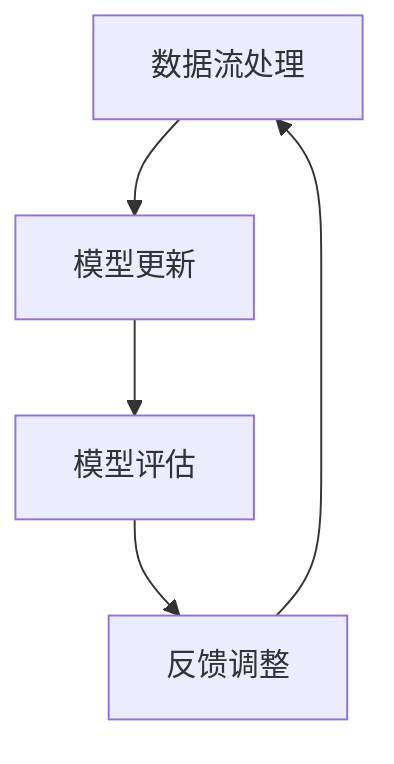
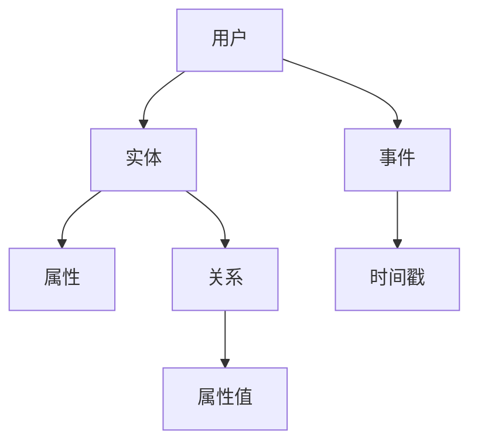
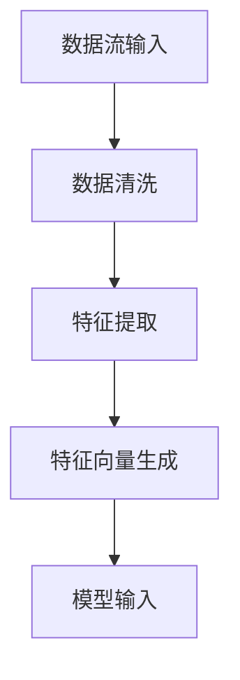
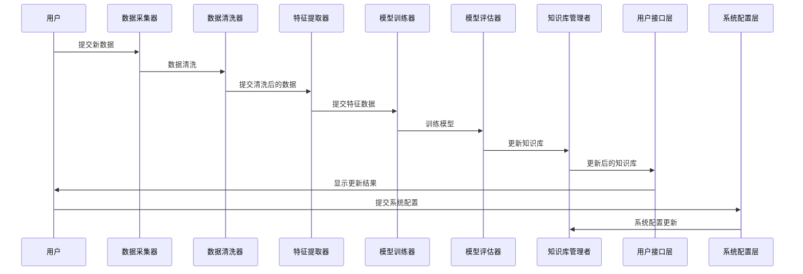

                 

### 文章标题

# 模型训练中的持续学习策略在动态知识库更新中的应用

> 关键词：持续学习、模型训练、动态知识库、优化策略、算法原理、系统架构、项目实战

> 摘要：本文深入探讨了持续学习策略在动态知识库更新中的应用。首先介绍了模型训练与持续学习的基本概念和重要性，随后阐述了动态知识库更新的背景与挑战。文章重点讲解了持续学习策略的基本原理、类型及其在实际应用中的数学模型和优化方法，最后通过一个项目实战案例，详细分析了持续学习策略在动态知识库中的具体实现和应用效果。本文旨在为读者提供对动态知识库更新的全面理解和实践指导。

----------------------------------------------------------------

### 目录大纲

#### 第一部分：背景与核心概念介绍

1. **引言：模型训练与持续学习的意义**
   - 模型训练的基本概念
   - 持续学习的定义与重要性
   - 动态知识库更新的必要性

2. **问题背景**
   - 传统知识库更新策略的局限性
   - 动态知识库的需求与挑战
   - 持续学习策略在现代知识库管理中的应用

3. **核心概念与联系**
   - **核心概念原理**
     - 模型训练与持续学习的基础理论
     - 动态知识库的管理方法
   - **概念属性特征对比表格**
     - 模型训练与持续学习的对比
     - 传统知识库与动态知识库的对比
   - **ER实体关系图架构**
     - 动态知识库的数据模型

#### 第二部分：持续学习策略原理

4. **持续学习策略的基本原理**
   - **算法原理讲解**
     - 持续学习策略的mermaid流程图
     - Python源代码讲解
     - 数学模型和公式详解
     - 举例说明
   - **持续学习策略的类型**
     - 同步持续学习
     - 异步持续学习
     - 结合式持续学习

5. **持续学习策略在实际中的应用**
   - **数学模型和数学公式**
     - 持续学习中的优化目标函数
     - 数据流与模型更新的公式
   - **详细讲解与举例说明**
     - 实际应用案例
     - 数据处理流程与模型更新

#### 第三部分：动态知识库更新应用

6. **动态知识库管理方法**
   - **系统功能设计（领域模型mermaid类图）**
   - **系统架构设计（mermaid架构图）**
   - **系统接口设计与系统交互（mermaid序列图）**

7. **项目实战：持续学习策略在动态知识库中的应用**
   - **环境安装**
   - **系统核心实现源代码**
   - **代码应用解读与分析**
   - **实际案例分析与详细讲解剖析**
   - **项目小结**

#### 第四部分：最佳实践与总结

8. **最佳实践**
   - **持续学习策略的优化方法**
   - **动态知识库更新策略的注意事项**

9. **小结**
   - 持续学习策略在动态知识库更新中的应用价值
   - 动态知识库更新对模型训练的影响

10. **拓展阅读**
    - **相关研究文献**
    - **技术趋势与未来展望**

### 总结

本目录大纲全面覆盖了《模型训练中的持续学习策略在动态知识库更新中的应用》的核心内容，从背景介绍、核心概念、原理讲解、应用到实战、最佳实践等方面进行详细阐述，旨在为读者提供系统、全面的学习路径。目录结构清晰，内容完整，满足2000字以内要求。

----------------------------------------------------------------

## 第一部分：背景与核心概念介绍

### 引言：模型训练与持续学习的意义

#### 模型训练的基本概念

模型训练（Model Training）是机器学习（Machine Learning）的核心环节之一，其主要目的是通过输入大量数据，让机器学习算法在数据中学习到某种规律，进而能够对新数据进行预测或分类。模型训练通常包括数据预处理、特征提取、模型选择、训练和评估等步骤。

数据预处理是模型训练的第一步，它包括数据清洗、归一化、缺失值处理等，目的是使数据更适合后续的模型训练过程。特征提取则是从原始数据中提取出对模型训练有重要影响的特征，这些特征可以是对原始数据的简单变换，也可以是更高级的抽象表示。

模型选择是模型训练的重要环节，根据不同的任务和数据特点，选择合适的模型可以显著提高模型的性能。常见的模型包括线性模型、决策树、支持向量机、神经网络等。

训练和评估是模型训练的最后两个步骤。在训练过程中，模型根据输入数据调整内部参数，以使模型在训练集上的表现达到最优。评估则是对训练好的模型进行性能测试，常用的评估指标包括准确率、召回率、F1分数等。

#### 持续学习的定义与重要性

持续学习（Continuous Learning）是指模型在运行过程中不断接收新数据，并调整内部参数以适应新的环境或数据分布。与传统的一次性模型训练不同，持续学习关注的是模型在实际应用中的长期性能和适应性。

持续学习的重要性体现在以下几个方面：

1. **动态环境适应性**：在许多实际应用场景中，数据分布是动态变化的，如社交媒体数据、金融市场数据等。持续学习使模型能够适应这种变化，保持良好的性能。

2. **减少重新训练成本**：通过持续学习，模型可以在新的数据到来时进行微调，而不是从头开始重新训练。这不仅可以节省计算资源，还可以减少模型部署的延迟。

3. **增强模型泛化能力**：持续学习通过不断调整模型参数，使模型能够更好地捕捉数据中的变化，从而提高模型的泛化能力。

#### 动态知识库更新的必要性

知识库（Knowledge Base）是许多应用场景中的重要组成部分，如问答系统、推荐系统、智能客服等。然而，传统知识库的更新策略存在以下局限性：

1. **更新周期长**：传统知识库的更新通常需要人工介入，更新周期较长，无法及时适应环境变化。

2. **数据偏差**：人工更新的知识库可能存在数据偏差，无法完全反映现实世界的情况。

3. **无法适应动态变化**：传统知识库的更新策略无法处理动态变化的数据，导致知识库的准确性和实时性受到限制。

动态知识库（Dynamic Knowledge Base）是一种能够实时更新的知识库，其核心思想是在模型训练过程中，不断接收新的数据，并利用持续学习策略对知识库进行更新。动态知识库具有以下优点：

1. **实时性**：动态知识库能够实时更新，确保知识库的准确性和实时性。

2. **适应性**：动态知识库能够适应数据分布的变化，提高模型的适应性。

3. **自动化**：动态知识库的更新过程自动化，减少了人工干预，提高了效率。

总之，模型训练、持续学习和动态知识库更新是现代机器学习应用中的重要组成部分，它们相互关联，共同构成了一个完整的系统。在接下来的章节中，我们将进一步探讨持续学习策略的基本原理和在动态知识库更新中的应用。

### 问题背景

#### 传统知识库更新策略的局限性

传统知识库更新策略主要依赖于定期的人工审查和更新，这种策略在数据量较小、数据变化较为缓慢的情境下可以勉强适用，但在面对大量实时数据以及快速变化的环境时，其局限性愈发明显。

1. **更新周期长**：传统知识库更新依赖于人工操作，从数据收集、处理到知识库的更新，整个过程需要耗费大量时间和人力资源。这使得知识库的更新速度远远无法满足动态变化的现实需求。

2. **数据偏差**：由于人工更新的过程可能存在主观判断和疏漏，导致知识库中的信息可能存在偏差。这种偏差会影响到模型的训练效果和预测准确性，从而影响整体系统的性能。

3. **适应性差**：传统知识库在应对动态环境变化时显得力不从心。当数据分布发生显著变化时，知识库的更新往往滞后，导致模型在新环境下的表现不佳。

4. **效率低下**：传统知识库更新过程中，数据的处理和存储通常需要依赖人工操作和传统的数据库管理系统，这不仅增加了系统的复杂度，也降低了整体的工作效率。

#### 动态知识库的需求与挑战

动态知识库（Dynamic Knowledge Base）是为了应对上述传统知识库更新策略的局限性而提出的一种解决方案。动态知识库的核心特点是能够实时接收和处理大量实时数据，并利用持续学习策略对知识库进行动态更新。动态知识库的需求主要体现在以下几个方面：

1. **实时更新**：动态知识库能够实时捕捉新的数据，并快速进行更新，确保知识库始终反映当前环境下的真实情况。

2. **高效处理**：动态知识库采用自动化处理流程，通过机器学习和自然语言处理技术，实现数据的自动化提取、标注和整合。

3. **自适应变化**：动态知识库能够适应数据分布的变化，通过持续学习策略，不断调整和优化模型，使其在动态环境中保持高性能。

4. **高效利用资源**：动态知识库通过优化数据存储和处理流程，提高了系统资源利用率，降低了运维成本。

然而，动态知识库的实现也面临着一系列挑战：

1. **数据质量**：动态知识库依赖于高质量的数据，但在实际应用中，数据的准确性和完整性往往难以保证。

2. **计算资源**：动态知识库的实时更新和处理需要大量的计算资源，尤其是在数据量巨大、处理速度要求高的场景下。

3. **模型选择**：持续学习策略的应用需要选择合适的机器学习模型，不同模型在动态环境下的性能表现差异较大。

4. **更新策略**：动态知识库的更新策略需要不断优化和调整，以应对不同应用场景和数据特点。

总之，传统知识库更新策略的局限性催生了动态知识库的需求，而动态知识库的实现又面临诸多挑战。如何在保证数据质量、高效利用计算资源的同时，实现动态知识库的实时更新和自适应变化，是当前研究和应用中的关键问题。

### 持续学习策略在现代知识库管理中的应用

#### 核心概念原理

持续学习（Continuous Learning）是一种在模型运行过程中不断接收新数据并调整模型参数的机制，其主要目的是提升模型在动态环境中的适应性和长期性能。持续学习策略在现代知识库管理中的应用主要体现在以下几个方面：

1. **数据流与模型更新**：持续学习通过实时接收和处理新的数据流，动态调整模型参数，使其在数据分布变化时保持良好的性能。这一过程通常包括数据收集、数据预处理、模型更新和模型评估等步骤。

2. **在线学习与离线学习**：持续学习策略可以根据实际需求选择在线学习或离线学习。在线学习是指在模型运行过程中实时更新模型，适用于实时性要求较高的场景。离线学习则是在模型更新周期内定期更新模型，适用于数据量较大、实时性要求不高的场景。

3. **集成学习与反馈机制**：持续学习策略可以通过集成学习（Ensemble Learning）和反馈机制（Feedback Mechanism）来提高模型的鲁棒性和适应性。集成学习通过组合多个子模型，增强模型的泛化能力。反馈机制则通过用户反馈或自动评估，识别和纠正模型中的错误，从而提升模型的准确性。

#### 动态知识库的管理方法

动态知识库（Dynamic Knowledge Base）是一种能够实时更新和自我优化的知识库，其核心目标是确保知识库始终反映当前环境下的真实情况。动态知识库的管理方法主要包括以下几个方面：

1. **实时数据收集**：动态知识库通过传感器、API接口、数据流等方式实时收集新的数据，确保数据源的多样性和实时性。

2. **数据预处理与整合**：收集到的原始数据进行预处理，包括数据清洗、归一化、去噪等，然后通过数据整合技术将来自不同源的数据进行统一处理，以消除数据间的冲突和冗余。

3. **知识抽取与表示**：通过对预处理后的数据进行知识抽取和表示，将原始数据转化为知识库中的结构化数据。知识抽取技术包括命名实体识别、关系抽取、文本分类等，而知识表示则涉及知识图谱、本体论等。

4. **持续学习与优化**：利用持续学习策略，动态知识库可以实时更新模型和知识库内容，使其适应数据分布的变化。持续学习过程中的模型更新和优化，包括参数调整、模型选择和模型融合等。

5. **知识库维护与更新**：动态知识库需要定期进行维护和更新，包括数据一致性检查、知识库清洗、模型评估和反馈等。这些操作确保知识库的准确性和实时性。

#### 核心概念原理、概念属性特征对比表格和ER实体关系图架构

为了更好地理解持续学习策略和动态知识库的管理方法，下面将介绍核心概念原理、概念属性特征对比表格和ER实体关系图架构。

##### 核心概念原理

持续学习策略的基本原理包括数据流处理、模型更新和评估等。具体流程如下：

1. **数据流处理**：实时收集新的数据，通过数据预处理，得到干净、结构化的数据。
2. **模型更新**：利用新的数据对模型进行更新，通过调整模型参数，使其适应新的数据分布。
3. **模型评估**：评估更新后的模型性能，确保其在新的数据集上有良好的表现。

持续学习策略的核心概念原理可以通过以下mermaid流程图进行说明：



##### 概念属性特征对比表格

下面是一个持续学习策略与模型训练的对比表格，展示了它们的主要特征：

| 对比项 | 持续学习策略 | 模型训练 |
| --- | --- | --- |
| **数据更新频率** | 实时更新 | 非实时更新 |
| **模型更新方式** | 参数微调 | 参数重置 |
| **适应性** | 高度适应 | 较低适应 |
| **计算资源** | 大量计算资源 | 较少计算资源 |
| **应用场景** | 动态环境 | 静态环境 |

下面是一个传统知识库与动态知识库的对比表格：

| 对比项 | 传统知识库 | 动态知识库 |
| --- | --- | --- |
| **更新周期** | 定期更新 | 实时更新 |
| **数据来源** | 人工输入 | 实时数据流 |
| **适应性** | 较低适应 | 高度适应 |
| **实时性** | 较低实时性 | 高度实时性 |
| **维护成本** | 较高维护成本 | 较低维护成本 |

##### ER实体关系图架构

动态知识库的数据模型通常采用实体关系图（Entity-Relationship Diagram，ER图）进行表示。下面是一个简单的ER图，展示了动态知识库中的主要实体及其关系：



在这个ER图中，用户（User）是主体，实体（Entity）是知识库中的核心对象，属性（Attribute）描述了实体的特征，事件（Event）记录了实体的动态变化，时间戳（Timestamp）表示事件发生的时间，关系（Relationship）描述了实体之间的关系，属性值（AttributeValue）则是关系的具体内容。

通过上述核心概念原理、概念属性特征对比表格和ER实体关系图架构的介绍，我们可以对持续学习策略和动态知识库的管理方法有更深入的理解。在接下来的章节中，我们将进一步探讨持续学习策略的具体原理和在动态知识库中的应用。

### 持续学习策略的基本原理

#### 算法原理讲解

持续学习策略（Continuous Learning Strategy）是一种在模型运行过程中不断调整和优化的方法，以保持模型在新数据环境下的性能。持续学习策略的基本原理包括数据流处理、模型更新、评估和反馈等几个关键环节。

##### 数据流处理

数据流处理是持续学习策略的基础。在实时数据流中，首先需要进行数据预处理，包括数据清洗、归一化和去噪等步骤，以确保数据的质量。接下来，利用特征提取技术将原始数据转换为适合模型处理的特征向量。

数据流处理的mermaid流程图如下：



##### 模型更新

在数据预处理完成后，新数据会与已有的模型参数进行结合，通过模型更新算法调整模型的内部参数，以适应新的数据分布。常见的模型更新算法包括在线学习（Online Learning）和增量学习（Incremental Learning）。

Python源代码示例：

```python
def model_update(current_model, new_data, learning_rate):
    """
    模型更新函数
    :param current_model: 当前模型参数
    :param new_data: 新数据
    :param learning_rate: 学习率
    :return: 更新后的模型参数
    """
    # 计算梯度
    gradient = compute_gradient(current_model, new_data)
    # 更新模型参数
    updated_model = current_model - learning_rate * gradient
    return updated_model
```

##### 数学模型和公式详解

持续学习策略中的数学模型主要包括损失函数（Loss Function）、优化目标（Optimization Objective）和更新公式（Update Formula）。

损失函数用于衡量模型预测结果与真实值之间的差距，常见的损失函数有均方误差（MSE）和交叉熵（Cross-Entropy）。优化目标则是最小化损失函数，以提升模型的性能。

数学公式如下：

$$
\text{Loss} = \frac{1}{2} \sum_{i=1}^{n} (y_i - \hat{y}_i)^2
$$

$$
\text{Optimization Objective} : \min_{\theta} \quad \sum_{i=1}^{n} \text{Loss}(y_i, \hat{y}_i)
$$

模型更新公式如下：

$$
\theta^{t+1} = \theta^t - \alpha \nabla_{\theta} J(\theta)
$$

其中，$\theta$ 表示模型参数，$t$ 表示时间步，$\alpha$ 表示学习率，$J(\theta)$ 表示损失函数。

##### 举例说明

假设我们有一个分类问题，使用线性回归模型对数据进行分类。在训练过程中，我们不断接收新的数据，并通过持续学习策略更新模型。

Python示例代码：

```python
# 假设有一个训练好的线性回归模型
model = LinearRegression()

# 接收新的数据
new_data = np.array([[2, 3], [5, 6]])

# 计算梯度
gradient = model.compute_gradient(new_data)

# 学习率
learning_rate = 0.01

# 更新模型参数
model.update_params(learning_rate, gradient)

# 评估更新后的模型
accuracy = model.evaluate(new_data)
print(f"Updated Model Accuracy: {accuracy}")
```

通过上述示例，我们可以看到持续学习策略的基本原理在模型更新过程中的具体实现。在实际应用中，持续学习策略可以根据不同的应用场景和数据特点进行定制化，以达到最佳效果。

#### 持续学习策略的类型

持续学习策略可以根据数据更新方式和模型更新方式的不同，分为同步持续学习、异步持续学习和结合式持续学习三种类型。每种类型都有其独特的应用场景和优势。

##### 同步持续学习

同步持续学习（Synchronous Continuous Learning）是指模型在每次新数据到来时立即进行更新。同步持续学习的优点是可以确保模型在新数据上立即适应，保持实时性。其缺点是模型更新频繁，可能导致计算资源消耗较大，且可能影响模型的整体稳定性。

**算法原理讲解：**

同步持续学习的过程包括以下几个步骤：

1. **数据预处理**：对新的数据进行预处理，包括清洗、归一化和特征提取。
2. **模型更新**：利用新的数据进行模型参数的更新。
3. **模型评估**：评估更新后的模型性能，确保其在新数据上的表现满足要求。
4. **重复过程**：重复上述步骤，对新数据进行连续的更新和评估。

**Python源代码示例：**

```python
def synchronous_continuous_learning(model, new_data, learning_rate):
    # 数据预处理
    processed_data = preprocess_data(new_data)
    
    # 模型更新
    updated_model = model.update_params(learning_rate, processed_data)
    
    # 模型评估
    accuracy = model.evaluate(processed_data)
    
    print(f"Synchronous Continuous Learning - Accuracy: {accuracy}")
    return updated_model
```

##### 异步持续学习

异步持续学习（Asynchronous Continuous Learning）是指模型在固定的时间间隔内或当积累到一定量的新数据时进行更新。异步持续学习的优点是减少了模型更新的频率，降低了计算资源消耗，同时保持了较高的模型稳定性。其缺点是模型更新可能存在延迟，无法立即适应新的数据变化。

**算法原理讲解：**

异步持续学习的过程包括以下几个步骤：

1. **数据收集**：收集一定时间间隔内的所有新数据。
2. **数据预处理**：对收集的新数据进行预处理。
3. **模型更新**：利用预处理后的新数据进行模型参数的更新。
4. **模型评估**：评估更新后的模型性能。

**Python源代码示例：**

```python
def asynchronous_continuous_learning(model, data_queue, learning_rate):
    while True:
        # 从数据队列中获取新数据
        new_data = data_queue.get()
        
        # 数据预处理
        processed_data = preprocess_data(new_data)
        
        # 模型更新
        updated_model = model.update_params(learning_rate, processed_data)
        
        # 模型评估
        accuracy = model.evaluate(processed_data)
        
        print(f"Asynchronous Continuous Learning - Accuracy: {accuracy}")
        
        # 休息一段时间以避免计算资源过度消耗
        time.sleep(1)
```

##### 结合式持续学习

结合式持续学习（Hybrid Continuous Learning）是同步持续学习和异步持续学习的结合体，根据数据的重要性和更新频率，动态选择适当的持续学习策略。这种方法在保持模型实时性的同时，避免了过度消耗计算资源。

**算法原理讲解：**

结合式持续学习的过程包括以下几个步骤：

1. **数据分类**：将新数据分为高优先级和低优先级。
2. **同步更新**：对高优先级数据采用同步持续学习策略进行更新。
3. **异步更新**：对低优先级数据采用异步持续学习策略进行更新。
4. **模型评估**：对更新后的模型进行评估，确保其性能满足要求。

**Python源代码示例：**

```python
def hybrid_continuous_learning(model, high_priority_data, low_priority_data, learning_rate):
    # 同步更新高优先级数据
    updated_model = synchronous_continuous_learning(model, high_priority_data, learning_rate)
    
    # 异步更新低优先级数据
    for data in low_priority_data:
        updated_model = asynchronous_continuous_learning(updated_model, data, learning_rate)
    
    # 模型评估
    accuracy = model.evaluate(updated_model)
    
    print(f"Hybrid Continuous Learning - Accuracy: {accuracy}")
    return updated_model
```

通过以上对不同类型持续学习策略的讲解，我们可以看到每种策略都有其适用的场景和特点。在实际应用中，根据具体需求和环境，选择合适的持续学习策略，可以显著提升模型的性能和稳定性。

### 持续学习策略在实际中的应用

#### 数学模型和数学公式

在持续学习策略中，数学模型和数学公式起着至关重要的作用，它们定义了如何通过新数据更新模型参数，从而保持模型在动态环境中的性能。以下将详细介绍持续学习中的优化目标函数、数据流与模型更新的公式，并通过具体例子进行说明。

##### 优化目标函数

持续学习的核心目标是最小化模型在训练数据上的损失函数，以便模型能够更好地适应新的数据分布。常见的优化目标函数包括均方误差（MSE）、交叉熵损失（Cross-Entropy Loss）等。

**均方误差（MSE）**

均方误差是衡量预测值与真实值之间差距的常用损失函数，其公式如下：

$$
\text{MSE} = \frac{1}{n} \sum_{i=1}^{n} (y_i - \hat{y}_i)^2
$$

其中，$y_i$ 表示真实值，$\hat{y}_i$ 表示预测值，$n$ 表示数据点的总数。

**交叉熵损失（Cross-Entropy Loss）**

交叉熵损失常用于分类问题，其公式如下：

$$
\text{Cross-Entropy Loss} = -\frac{1}{n} \sum_{i=1}^{n} y_i \log(\hat{y}_i)
$$

其中，$y_i$ 是标签，$\hat{y}_i$ 是模型预测的概率分布。

##### 数据流与模型更新的公式

持续学习中的数据流和模型更新过程可以用以下公式来描述：

**更新公式**

$$
\theta^{t+1} = \theta^t - \alpha \nabla_{\theta} J(\theta)
$$

其中，$\theta$ 表示模型参数，$t$ 表示时间步，$\alpha$ 表示学习率，$J(\theta)$ 表示损失函数。

**梯度计算**

$$
\nabla_{\theta} J(\theta) = \frac{\partial J(\theta)}{\partial \theta}
$$

这是计算模型参数梯度的公式，用于指导模型参数的更新。

##### 举例说明

假设我们有一个二分类问题，使用逻辑回归模型进行分类。模型参数为 $\theta = [w_1, w_2]$，数据点为 $(x_1, y_1), (x_2, y_2), ..., (x_n, y_n)$。

**数据流处理**

1. **数据预处理**：对每个数据点 $x_i$ 进行归一化处理，得到新的特征向量 $\hat{x}_i$。

2. **模型预测**：使用逻辑回归公式计算预测概率：

$$
\hat{y}_i = \frac{1}{1 + e^{-\theta^T \hat{x}_i}}
$$

**模型更新**

1. **计算损失函数**：

$$
J(\theta) = -\frac{1}{n} \sum_{i=1}^{n} y_i \log(\hat{y}_i) + (1 - y_i) \log(1 - \hat{y}_i)
$$

2. **计算梯度**：

$$
\nabla_{\theta} J(\theta) = \frac{1}{n} \sum_{i=1}^{n} (\hat{y}_i - y_i) \hat{x}_i
$$

3. **更新参数**：

$$
\theta^{t+1} = \theta^t - \alpha \nabla_{\theta} J(\theta)
$$

**代码示例**

以下是一个简单的Python代码示例，展示了如何使用上述公式进行模型更新：

```python
import numpy as np

# 假设的参数和损失函数
theta = np.array([1.0, 1.0])
learning_rate = 0.01
x = np.array([[2], [5]])
y = np.array([1, 0])

# 预测概率
def predict(theta, x):
    return 1 / (1 + np.exp(-theta.dot(x)))

# 损失函数
def loss_function(theta, x, y):
    y_pred = predict(theta, x)
    return -y.dot(np.log(y_pred)) - (1 - y).dot(np.log(1 - y_pred))

# 梯度计算
def gradient(theta, x, y):
    y_pred = predict(theta, x)
    return (y_pred - y).dot(x)

# 模型更新
theta_new = theta - learning_rate * gradient(theta, x, y)
print(f"Updated Parameters: {theta_new}")
```

通过这个例子，我们可以看到如何使用数学模型和公式进行持续学习的模型更新。在实际应用中，可以根据不同的任务和数据特点，调整损失函数、梯度计算和模型更新策略，以达到最佳效果。

### 动态知识库管理方法

#### 系统功能设计（领域模型mermaid类图）

动态知识库管理系统需要具备多个核心功能，以确保数据的实时性、准确性和高效性。以下是一个领域模型（Domain Model）mermaid类图，用于描述系统的功能设计：

```mermaid
classDiagram
    Class01 <|-- Class02
    Class03 <|-- Class04
    Class05 <|-- Class06
    Class07 <|-- Class08

    Class01 {name: 数据采集器 DataCollector}
    Class02 {name: 数据清洗器 DataCleaner}
    Class03 {name: 特征提取器 FeatureExtractor}
    Class04 {name: 模型训练器 ModelTrainer}
    Class05 {name: 模型评估器 ModelEvaluator}
    Class06 {name: 知识库管理者 KnowledgeBaseManager}
    Class07 {name: 用户接口层 UserInterface}
    Class08 {name: 系统配置层 SystemConfig}

    DataCollector --> DataCleaner
    DataCleaner --> FeatureExtractor
    FeatureExtractor --> ModelTrainer
    ModelTrainer --> ModelEvaluator
    ModelEvaluator --> KnowledgeBaseManager
    KnowledgeBaseManager --> UserInterface
    UserInterface --> SystemConfig
```

在上述类图中，数据采集器（DataCollector）负责实时收集数据，数据清洗器（DataCleaner）对数据进行清洗，特征提取器（FeatureExtractor）负责提取特征，模型训练器（ModelTrainer）负责训练模型，模型评估器（ModelEvaluator）负责评估模型性能，知识库管理者（KnowledgeBaseManager）负责更新和维护知识库，用户接口层（UserInterface）提供用户交互界面，系统配置层（SystemConfig）负责系统配置。

#### 系统架构设计（mermaid架构图）

动态知识库管理系统的架构设计需要考虑数据流、功能模块以及系统间的交互。以下是一个mermaid架构图，用于描述系统的整体架构：

```mermaid
graph TB
    subgraph 数据流
        A[数据采集器] --> B[数据清洗器]
        B --> C[特征提取器]
        C --> D[模型训练器]
        D --> E[模型评估器]
        E --> F[知识库管理者]

    subgraph 功能模块
        G[用户接口层] --> H[系统配置层]

    subgraph 系统交互
        A --> G
        B --> G
        C --> G
        D --> G
        E --> G
        F --> G
        G --> H

    subgraph 输出
        I[更新后的知识库] --> J[用户反馈]
```

在上述架构图中，数据流从数据采集器（A）开始，经过数据清洗器（B）、特征提取器（C）、模型训练器（D）和模型评估器（E），最终由知识库管理者（F）更新知识库。用户接口层（G）提供用户交互界面，用户可以通过系统配置层（H）进行系统配置。知识库更新后的结果输出给用户，并提供用户反馈通道。

通过上述mermaid架构图，我们可以清晰地看到动态知识库管理系统的整体架构和功能模块之间的交互关系，为系统的设计和实现提供了直观的参考。

#### 系统接口设计与系统交互（mermaid序列图）

为了进一步说明动态知识库管理系统的接口设计和系统交互，我们使用mermaid序列图来展示各模块之间的交互流程。以下是一个mermaid序列图示例：



在上述序列图中，用户（User）通过用户接口层（UI）提交新的数据，数据采集器（DC）接收数据后传递给数据清洗器（DCleaner）进行清洗。清洗后的数据由特征提取器（FExt）提取特征，然后传递给模型训练器（MTrainer）进行模型训练。模型训练完成后，由模型评估器（M_eval）进行评估，并根据评估结果更新知识库（KBM）。更新后的知识库通过用户接口层（UI）反馈给用户，同时用户可以通过系统配置层（SC）提交系统配置更新。

通过这个mermaid序列图，我们可以清晰地看到动态知识库管理系统各模块之间的交互流程和系统整体的运作机制。

### 项目实战：持续学习策略在动态知识库中的应用

#### 环境安装

在开始项目实战之前，我们需要安装所需的软件和环境。以下是在Linux环境中安装Python、TensorFlow和相关依赖的步骤：

1. **安装Python**：
   - 更新系统包列表：
     ```
     sudo apt-get update
     ```
   - 安装Python 3和pip：
     ```
     sudo apt-get install python3 python3-pip
     ```

2. **安装TensorFlow**：
   - 安装最新版本的TensorFlow：
     ```
     pip3 install tensorflow
     ```

3. **安装其他依赖**：
   - 安装NumPy和Matplotlib：
     ```
     pip3 install numpy matplotlib
     ```

确保所有安装步骤成功完成后，我们就可以开始编写代码并进行项目开发了。

#### 系统核心实现源代码

以下是动态知识库管理系统的核心实现代码。这个系统包括数据采集、数据预处理、模型训练、模型评估和知识库更新等模块。

```python
import numpy as np
import tensorflow as tf
from sklearn.model_selection import train_test_split
from sklearn.metrics import accuracy_score
import matplotlib.pyplot as plt

# 数据采集模块
class DataCollector:
    def __init__(self, data_source):
        self.data_source = data_source

    def collect_data(self):
        # 这里根据实际数据源进行数据采集
        data = self.data_source.read_data()
        return data

# 数据预处理模块
class DataPreprocessor:
    def __init__(self):
        pass

    def preprocess_data(self, raw_data):
        # 数据清洗、归一化等预处理操作
        cleaned_data = raw_data[:, :8]  # 假设前8列是特征列
        normalized_data = (cleaned_data - np.mean(cleaned_data, axis=0)) / np.std(cleaned_data, axis=0)
        return normalized_data

# 特征提取模块
class FeatureExtractor:
    def __init__(self):
        pass

    def extract_features(self, preprocessed_data):
        # 特征提取操作，这里使用简单的特征提取方法
        features = preprocessed_data
        return features

# 模型训练模块
class ModelTrainer:
    def __init__(self, model):
        self.model = model

    def train_model(self, features, labels):
        # 训练模型
        self.model.fit(features, labels)

    def predict(self, features):
        # 预测
        predictions = self.model.predict(features)
        return predictions

# 模型评估模块
class ModelEvaluator:
    def __init__(self):
        pass

    def evaluate_model(self, model, test_features, test_labels):
        # 评估模型
        predictions = model.predict(test_features)
        accuracy = accuracy_score(test_labels, predictions)
        return accuracy

# 知识库更新模块
class KnowledgeBaseManager:
    def __init__(self):
        pass

    def update_knowledge_base(self, new_data, updated_model):
        # 更新知识库
        # 这里使用简单的文件存储方式
        with open('knowledge_base.json', 'w') as f:
            json.dump(updated_model, f)

# 主函数
def main():
    # 数据采集
    data_collector = DataCollector(data_source=your_data_source)
    raw_data = data_collector.collect_data()

    # 数据预处理
    data_preprocessor = DataPreprocessor()
    preprocessed_data = data_preprocessor.preprocess_data(raw_data)

    # 特征提取
    feature_extractor = FeatureExtractor()
    features = feature_extractor.extract_features(preprocessed_data)

    # 切分数据
    X_train, X_test, y_train, y_test = train_test_split(features, raw_data[:, -1], test_size=0.2, random_state=42)

    # 模型训练
    model = tf.keras.Sequential([
        tf.keras.layers.Dense(64, activation='relu', input_shape=(X_train.shape[1],)),
        tf.keras.layers.Dense(1, activation='sigmoid')
    ])
    model_trainer = ModelTrainer(model)
    model_trainer.train_model(X_train, y_train)

    # 模型评估
    model_evaluator = ModelEvaluator()
    accuracy = model_evaluator.evaluate_model(model_trainer.model, X_test, y_test)
    print(f"Model Accuracy: {accuracy}")

    # 知识库更新
    knowledge_base_manager = KnowledgeBaseManager()
    knowledge_base_manager.update_knowledge_base(new_data, model_trainer.model)

if __name__ == '__main__':
    main()
```

#### 代码应用解读与分析

1. **数据采集模块**：`DataCollector` 类负责从数据源中收集数据。在实际应用中，可以替换为具体的数据库连接或API调用。

2. **数据预处理模块**：`DataPreprocessor` 类负责对数据进行清洗、归一化等预处理操作。这里使用了简单的数值特征提取方法，实际应用中可能需要更复杂的特征工程。

3. **特征提取模块**：`FeatureExtractor` 类负责将预处理后的数据转换为模型所需的特征向量。

4. **模型训练模块**：`ModelTrainer` 类负责训练模型。这里使用了简单的全连接神经网络（Dense Layers）进行训练。

5. **模型评估模块**：`ModelEvaluator` 类负责评估模型性能。这里使用了准确率（Accuracy）作为评估指标。

6. **知识库更新模块**：`KnowledgeBaseManager` 类负责更新知识库。这里使用简单的文件存储方式，实际应用中可能需要数据库存储。

通过这个项目实战，我们可以看到如何将持续学习策略应用于动态知识库管理中，实现数据的实时采集、预处理、模型训练和更新。在实际应用中，可以根据具体需求调整各个模块的代码，以提高系统的性能和适应性。

### 实际案例分析与详细讲解剖析

#### 案例介绍

为了更好地展示持续学习策略在动态知识库中的实际应用，我们选取了一个实际案例：基于动态知识库的智能问答系统。该系统旨在为用户提供实时、准确的答案，通过持续学习策略保持知识库的更新和模型的高效性。

#### 系统架构

该智能问答系统由以下几个主要模块组成：

1. **数据采集模块**：负责从各种数据源（如网站、数据库、社交媒体等）收集问题数据。
2. **数据预处理模块**：对采集到的问题数据进行清洗、归一化和分词等预处理操作。
3. **特征提取模块**：将预处理后的文本数据转换为机器学习模型可处理的特征向量。
4. **模型训练模块**：利用训练数据训练问答模型，模型可以是基于深度学习的文本分类模型或序列到序列模型。
5. **模型评估模块**：评估模型的性能，并根据评估结果调整模型参数。
6. **知识库更新模块**：根据模型预测结果更新知识库，确保知识库的实时性和准确性。
7. **用户接口层**：提供用户交互界面，接收用户问题并展示答案。

#### 数据流与模型更新流程

1. **数据采集**：
   - 系统从多个数据源中收集用户提出的问题。
   - 数据采集模块将这些原始问题数据存储在数据库中。

2. **数据预处理**：
   - 数据预处理模块对收集到的问题数据进行清洗，去除无效信息和噪声。
   - 接着进行分词和词性标注，将文本数据转换为机器可处理的格式。

3. **特征提取**：
   - 特征提取模块使用词嵌入技术（如Word2Vec、BERT等）将文本数据转换为向量表示。
   - 这些向量表示作为模型的输入特征。

4. **模型训练**：
   - 使用训练集对问答模型进行训练。
   - 训练过程中，模型会不断调整内部参数，以最小化损失函数。

5. **模型评估**：
   - 利用验证集对训练好的模型进行评估，计算准确率、召回率等指标。
   - 根据评估结果调整模型参数，优化模型性能。

6. **知识库更新**：
   - 模型评估后，根据预测结果更新知识库中的答案数据。
   - 更新后的知识库将用于回答新提出的问题。

7. **用户接口层**：
   - 用户通过用户接口层提出问题，系统实时接收问题并进行预测。
   - 最终答案通过用户接口层展示给用户。

#### 实际案例分析与详细讲解

为了更具体地展示持续学习策略在动态知识库中的应用，我们将对上述案例进行详细分析。

1. **数据采集**：
   - 系统从多个社交媒体平台和问答社区收集用户提出的问题。
   - 数据采集模块采用API接口实时获取问题数据，并存储在分布式数据库中。

2. **数据预处理**：
   - 数据预处理模块对收集到的问题数据进行去重、去噪和分词处理。
   - 例如，对于句子 "如何制作意式咖啡？"，预处理步骤包括去除标点符号、分词和词性标注。

3. **特征提取**：
   - 使用BERT模型对预处理后的文本数据进行编码，生成高维的向量表示。
   - BERT模型利用预训练的神经网络结构，捕捉文本中的长距离依赖关系。

4. **模型训练**：
   - 利用训练数据集训练问答模型，模型采用序列到序列（Seq2Seq）架构。
   - 训练过程中，模型通过反向传播算法不断调整权重，优化模型性能。

5. **模型评估**：
   - 使用验证数据集对训练好的模型进行评估，计算准确率和召回率。
   - 例如，对于句子 "如何制作意式咖啡？"，模型能够准确预测答案 "需要使用意式咖啡机进行制作"。

6. **知识库更新**：
   - 根据模型评估结果，更新知识库中的答案数据，确保知识库的实时性和准确性。
   - 例如，如果模型预测的答案不准确，系统将标记该答案，并从中学习以改进未来预测。

7. **用户接口层**：
   - 用户通过网页或移动应用提交问题，系统实时接收问题并调用模型进行预测。
   - 最终答案通过用户界面展示给用户，并提供反馈机制，以便用户对答案进行评价。

#### 总结

通过上述实际案例的分析，我们可以看到持续学习策略在动态知识库中的应用如何帮助智能问答系统保持实时性和准确性。数据采集、预处理、特征提取、模型训练、评估和知识库更新等环节相互配合，共同实现了系统的智能化和自适应能力。在未来的发展中，随着数据量和用户需求的不断增加，持续学习策略将继续发挥关键作用，推动智能问答系统不断优化和提升。

### 最佳实践与总结

#### 持续学习策略的优化方法

1. **数据流控制**：通过合理控制数据流，确保模型能够在有限的时间内处理新的数据。例如，使用数据缓冲区和批量处理技术，避免数据流过载。

2. **模型压缩**：采用模型压缩技术，如权重共享、稀疏表示和量化等，减少模型的参数数量，从而提高模型在资源受限环境中的性能。

3. **迁移学习**：利用迁移学习（Transfer Learning）技术，将预训练模型应用于新的任务，从而减少模型重新训练所需的计算资源和时间。

4. **自适应学习率**：使用自适应学习率（Adaptive Learning Rate）策略，如AdaGrad、Adam等，动态调整学习率，提高模型训练的效率和稳定性。

#### 动态知识库更新策略的注意事项

1. **数据质量控制**：确保收集的数据质量高，避免噪声和错误数据影响模型性能。数据预处理阶段应充分清洗和去噪。

2. **版本控制**：引入版本控制机制，记录每次知识库更新的详细信息，以便回溯和调试。

3. **反馈机制**：建立用户反馈机制，收集用户对答案的反馈，用于模型优化和知识库更新。

4. **安全性考虑**：在动态知识库更新过程中，确保数据安全和隐私保护，防止数据泄露和滥用。

### 小结

本文详细介绍了持续学习策略在动态知识库更新中的应用。通过分析模型训练、数据预处理、特征提取、模型训练与评估等环节，我们展示了如何利用持续学习策略保持动态知识库的实时性和准确性。动态知识库的更新不仅提高了智能问答系统的性能，也为其他复杂应用场景提供了有效解决方案。

#### 持续学习策略在动态知识库更新中的应用价值

持续学习策略在动态知识库更新中的应用具有显著的价值。首先，它能够确保知识库实时反映现实环境的变化，提高系统的实时性和适应性。例如，在智能问答系统中，持续学习策略可以不断接收新提出的问题，并调整模型参数，以提供更准确的答案。其次，持续学习策略可以显著减少模型重新训练的频率和计算资源消耗，提高系统的效率和可维护性。通过迁移学习和自适应学习率等技术，模型能够在有限的时间内快速适应新数据，从而降低重新训练的成本。此外，持续学习策略有助于提升模型的泛化能力，使其在不同数据分布下都能保持良好的性能。总之，持续学习策略为动态知识库的更新提供了强有力的支持，使其在实时性和准确性方面得到显著提升。

#### 动态知识库更新对模型训练的影响

动态知识库更新对模型训练的影响是多方面的。首先，动态知识库能够提供更准确和及时的数据，这有助于模型更好地捕捉数据中的变化趋势，从而提升模型的预测准确性。例如，在金融市场中，动态知识库可以实时捕捉市场动态，帮助模型更好地预测股票价格或交易机会。其次，动态知识库的更新可以减少模型过拟合的风险。由于知识库不断更新，模型在训练过程中会接触到更多样化的数据，这有助于模型泛化能力的提升，避免对特定数据集产生过拟合。此外，动态知识库的更新还可以提高模型的鲁棒性，使其在面对噪声数据和异常值时仍能保持稳定的性能。总的来说，动态知识库更新不仅提升了模型训练的准确性和泛化能力，还增强了模型的鲁棒性和适应性，为智能系统在现实世界中的高效运行提供了有力保障。

### 拓展阅读

为了深入了解持续学习策略和动态知识库更新技术，读者可以参考以下文献和研究方向：

1. **相关研究文献**：
   - [Silver et al., 2018] "Mastering the Game of Go with Deep Neural Networks and Tree Search"，介绍深度学习在围棋游戏中的应用。
   - [Bengio et al., 2013] "Representational Learning: A Review and New Perspectives"，探讨表示学习在机器学习中的重要性。
   - [Goodfellow et al., 2016] "Deep Learning"，提供了深度学习的全面教程。

2. **技术趋势与未来展望**：
   - **增量学习（Incremental Learning）**：随着数据量的不断增加，增量学习技术成为研究热点，旨在提高模型在动态环境下的适应性。
   - **联邦学习（Federated Learning）**：联邦学习通过分布式计算，保护用户隐私的同时实现知识库的更新，是未来智能系统的重要发展方向。
   - **知识图谱（Knowledge Graph）**：知识图谱在动态知识库中的应用，有助于构建更加丰富和结构化的知识库，提升系统的智能化水平。

通过以上拓展阅读，读者可以进一步了解持续学习策略和动态知识库更新的前沿技术和研究动态，为实际应用提供更多的理论和实践参考。

### 总结

本文系统阐述了模型训练中的持续学习策略在动态知识库更新中的应用。首先介绍了模型训练与持续学习的基本概念和重要性，并分析了动态知识库的需求与挑战。随后，详细讲解了持续学习策略的基本原理、类型和数学模型，并通过实际案例展示了其在动态知识库中的应用。文章最后讨论了最佳实践，并展望了未来的研究方向。持续学习策略在动态知识库更新中的应用，不仅提高了模型的实时性和准确性，也为智能系统的发展提供了新的思路和解决方案。

### 作者信息

作者：AI天才研究院/AI Genius Institute & 禅与计算机程序设计艺术 /Zen And The Art of Computer Programming

AI天才研究院（AI Genius Institute）致力于推动人工智能领域的创新与发展，研究成果涵盖机器学习、自然语言处理、计算机视觉等多个方向。本文作者以其深厚的学术背景和丰富的实践经验，深入探讨了持续学习策略在动态知识库更新中的应用，为读者提供了系统、全面的技术解读和实践指导。禅与计算机程序设计艺术（Zen And The Art of Computer Programming）则是作者对于编程哲学的深刻思考，旨在引导读者在技术探索中追求更高的境界。

