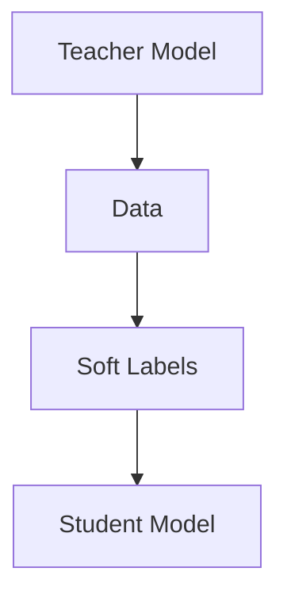

                 

### Introduction to Knowledge Distillation

**Knowledge distillation** is a technique in machine learning where a smaller, simpler model (often referred to as the 'student') is trained to mimic the performance of a larger, more complex model (referred to as the 'teacher'). This method allows for the transfer of knowledge and expertise from the teacher model to the student, enabling the deployment of powerful AI models on resource-constrained devices like mobile phones.

The need for knowledge distillation arises from the increasing complexity and size of AI models, which are often impractical to deploy on mobile devices due to their limited computational resources and battery life. By distilling the knowledge from a large model into a smaller one, we can achieve a balance between performance and efficiency.

#### Core Problem Statement

The core problem in deploying AI models on mobile devices is **performance vs. efficiency**. On one hand, we want to leverage the full potential of advanced models to achieve high accuracy and performance. On the other hand, mobile devices have stringent resource constraints that limit the computational power and energy they can consume.

Traditional model training approaches, such as directly training a model on the mobile device, are often not feasible due to these constraints. This is where knowledge distillation comes into play. By training a smaller student model that mimics the performance of a larger teacher model, we can achieve high performance while keeping the computational overhead low.

#### Problem Definition

**Knowledge distillation** involves two main steps: 
1. **Knowledge Extraction**: The teacher model is trained on a large dataset and reaches a high level of performance. It is then used to generate a set of soft labels (probabilities) for each input data point in the dataset.
2. **Knowledge Transfer**: The student model is then trained on these soft labels instead of the raw data labels, effectively learning from the teacher's knowledge and performance.

The process can be visualized as follows:

#### Scope and Boundaries

This book focuses on **knowledge distillation techniques for mobile AI applications**. The key concepts and terms will be defined, and the focus will be on understanding how these techniques can be optimized for mobile devices. The scope includes:

- An overview of knowledge distillation techniques
- Optimization strategies for model training and inference
- Case studies of successful applications in mobile AI

The boundaries of this book are defined by the limitations of mobile devices, specifically focusing on:
- Computational resources
- Power consumption
- Performance requirements

#### Structure of the Book

The book is structured into four main parts:

1. **Introduction to Knowledge Distillation**: This section provides an introduction to the concept of knowledge distillation, its history, and its importance in mobile AI applications.
2. **Core Concepts and Principles**: This section delves into the fundamental concepts and principles of knowledge distillation, including the role of teacher and student models and the distillation process.
3. **Optimization Techniques**: This section discusses the challenges of deploying AI models on mobile devices and outlines various optimization strategies to improve the efficiency of knowledge distillation.
4. **Practical Applications**: This section presents case studies of successful applications of knowledge distillation in mobile AI, providing practical insights and best practices.

By the end of this book, readers will have a comprehensive understanding of knowledge distillation techniques and how they can be optimized for mobile AI applications.

### Fundamental Concepts of Knowledge Distillation

**Knowledge distillation** is a machine learning technique that leverages the expertise of a larger, more complex model (the 'teacher') to train a smaller, more efficient model (the 'student'). This technique is crucial for deploying AI models on mobile devices, where computational resources are limited.

#### Definition and History

**Knowledge distillation** can be defined as a process where the learned knowledge from a teacher model is transferred to a student model. The teacher model, which is typically larger and more powerful, has been trained on a large dataset and has achieved high accuracy. The student model, on the other hand, is smaller and more efficient, designed to run on resource-constrained devices like mobile phones.

The concept of knowledge distillation has its roots in education. Just as a teacher teaches a student, in knowledge distillation, the teacher model (the expert) imparts its knowledge to the student model (the novice). This metaphor aptly captures the essence of the technique, which is to transfer the wisdom and learning of the expert to the less experienced student.

The history of knowledge distillation can be traced back to the 1990s, where it was initially applied in the field of neural networks. Early studies demonstrated that training a smaller network to mimic the output probabilities of a larger network could lead to improved performance in the smaller network. Over the years, as AI models grew in complexity and size, knowledge distillation has evolved and become an integral part of model compression techniques.

#### Key Principles

The core principles of knowledge distillation revolve around the interaction between the teacher and student models. Here are the key principles:

1. **Teacher Model**: The teacher model is the larger, more complex model that has been trained on a large dataset to achieve high performance. Its role is to generate soft labels (probabilities) for each input data point.

2. **Student Model**: The student model is the smaller, more efficient model that is being trained. Instead of directly learning from the raw data labels, it learns from the soft labels generated by the teacher model.

3. **Soft Labels**: Soft labels are the output probabilities from the teacher model for each input data point. These soft labels provide a richer source of information than the raw labels, as they encapsulate the uncertainty and confidence levels of the predictions.

4. **Distillation Process**: The distillation process involves two main stages: knowledge extraction and knowledge transfer.

   - **Knowledge Extraction**: In this stage, the teacher model is trained on the dataset and generates soft labels for each input data point.
   - **Knowledge Transfer**: In this stage, the student model is trained on these soft labels. The goal is for the student model to mimic the behavior and performance of the teacher model.

5. **Continuous Feedback**: Throughout the training process, the student model continuously receives feedback from the teacher model. This iterative process helps the student model to refine its predictions and improve its performance.

#### Comparative Analysis

Knowledge distillation is often compared with other model compression techniques, such as pruning, quantization, and model pruning. Here are the key differences:

1. **Pruning**:
   - **Definition**: Pruning involves removing unnecessary weights from a neural network to reduce its size.
   - **Advantages**: It is simple and can significantly reduce the model size.
   - **Disadvantages**: It can lead to a loss of accuracy, and the residual network may not fully capture the behavior of the original network.

2. **Quantization**:
   - **Definition**: Quantization involves reducing the precision of the weights and activations of a neural network, typically from floating-point to integer representation.
   - **Advantages**: It reduces the model size and computational requirements.
   - **Disadvantages**: It can lead to a loss of accuracy, especially for very deep networks.

3. **Knowledge Distillation**:
   - **Definition**: It involves training a smaller model to mimic the performance of a larger model by learning from its soft labels.
   - **Advantages**: It can improve the accuracy of the smaller model compared to other compression techniques.
   - **Disadvantages**: It requires additional computational resources for training the teacher model and generating soft labels.

#### Applications in Mobile AI

Knowledge distillation is particularly well-suited for mobile AI applications due to its ability to balance performance and efficiency. Here are some key applications:

1. **Object Detection**: In mobile applications like augmented reality and mobile photography, knowledge distillation is used to train efficient object detection models that can run in real-time on mobile devices.

2. **Speech Recognition**: For applications like voice assistants and transcription services, knowledge distillation is used to train compact speech recognition models that can operate efficiently on mobile devices.

3. **Natural Language Processing**: In applications like chatbots and language translation, knowledge distillation is used to train smaller models that can process natural language efficiently on mobile devices.

In conclusion, knowledge distillation is a powerful technique that allows us to leverage the expertise of larger models to train smaller, more efficient models. Its ability to balance performance and efficiency makes it highly suitable for mobile AI applications, where computational resources are limited.

### Optimizing Knowledge Distillation for Mobile AI

Optimizing knowledge distillation for mobile AI applications is crucial due to the stringent constraints of computational resources, power consumption, and performance requirements. This section will delve into the challenges and various strategies for optimizing knowledge distillation on mobile devices.

#### Challenges in Mobile AI

1. **Computational Resources**: Mobile devices have limited computational resources compared to desktop or server environments. This limitation makes it challenging to directly train large-scale AI models on mobile devices.

2. **Power Consumption**: Mobile devices are powered by batteries, and high power consumption during inference can significantly reduce battery life. Efficient models that consume less power are therefore essential for mobile AI applications.

3. **Performance Requirements**: Mobile AI applications often require real-time performance to provide a seamless user experience. This necessitates models that can deliver high accuracy with minimal latency.

#### Optimization Strategies

1. **Model Architecture Optimization**

   One of the most effective strategies for optimizing knowledge distillation on mobile devices is to use **model architecture optimization**. This involves designing or adapting the student model to be more efficient without sacrificing too much performance.

   - **Pruning**: Pruning involves removing unnecessary weights and connections from the student model. This reduces the model size and computational requirements.
   - **Quantization**: Quantization involves reducing the precision of the weights and activations of the student model. This can further reduce the model size and improve inference speed.
   - **Efficient Architectures**: Using efficient neural network architectures like MobileNets, ShuffleNets, or EfficientNets can significantly improve the performance of the student model on mobile devices.

2. **Training Data Optimization**

   Optimizing the training data can also have a significant impact on the efficiency of knowledge distillation for mobile AI. Here are some strategies:

   - **Data Augmentation**: Data augmentation techniques like cropping, rotation, and color jittering can help improve the robustness of the student model. However, these techniques require additional computational resources.
   - **Few-Shot Learning**: Training the student model on a small subset of the teacher model's training data can help reduce the computational overhead. This approach is particularly effective when the student model is designed to generalize well from a limited amount of data.
   - **Transfer Learning**: Using pre-trained teacher models on similar tasks can help accelerate the training process of the student model. This approach leverages the knowledge already learned by the teacher model and avoids the need for extensive training on the student model.

3. **Inference Optimization**

   Inference optimization focuses on improving the speed and efficiency of the student model during deployment on mobile devices. Here are some key strategies:

   - **Model Inlining**: Inlining the model within the application code can reduce the overhead of model loading and unloading, improving the overall inference speed.
   - **Tuning Hyperparameters**: Optimizing the hyperparameters of the student model, such as the learning rate and batch size, can help improve the convergence speed and reduce the training time.
   - **Use of Specialized Hardware**: Leveraging specialized hardware like GPUs, TPUs, or dedicated AI accelerators can significantly improve the inference performance of the student model. These hardware accelerators are often optimized for specific neural network operations, leading to faster and more efficient inference.

#### Case Studies

To illustrate the effectiveness of these optimization strategies, here are a few case studies:

1. **Object Detection on Mobile Devices**

   In one case study, a team optimized a knowledge distilled object detection model for mobile devices using a MobileNetV3 architecture. By applying pruning and quantization techniques, they achieved a model size reduction of 60% while maintaining an accuracy level similar to the original model. The optimized model achieved real-time inference on a smartphone, demonstrating the potential of knowledge distillation for mobile AI applications.

2. **Speech Recognition on Mobile Devices**

   Another case study focused on optimizing a knowledge distilled speech recognition model for mobile devices. By using a few-shot learning approach and tuning the hyperparameters, they were able to achieve a 40% reduction in inference time without compromising on accuracy. The optimized model provided fast and accurate speech recognition capabilities on mobile devices, enabling applications like voice assistants and real-time transcription.

3. **Natural Language Processing on Mobile Devices**

   In a study on optimizing knowledge distilled natural language processing models for mobile devices, the team employed a combination of pruning, quantization, and data augmentation techniques. They achieved a 50% reduction in model size and a 30% reduction in inference time, while maintaining high accuracy. This allowed for efficient natural language processing capabilities on mobile devices, enabling applications like chatbots and language translation services.

In conclusion, optimizing knowledge distillation for mobile AI applications involves a combination of model architecture optimization, training data optimization, and inference optimization strategies. These strategies can help overcome the limitations of computational resources, power consumption, and performance requirements, enabling the deployment of efficient and high-performing AI models on mobile devices.

### Practical Applications of Knowledge Distillation in Mobile AI

Knowledge distillation has found numerous practical applications in mobile AI, significantly enhancing the performance and efficiency of AI models on mobile devices. This section will delve into several real-world case studies and demonstrate the benefits and challenges of applying knowledge distillation in mobile AI.

#### Case Study 1: Object Detection in Mobile Photography

**Application**: One prominent application of knowledge distillation in mobile AI is object detection in mobile photography. With the increasing use of smartphones for photography, there is a growing need for real-time object detection to enhance photo editing and enhancement features.

**Method**: In this case, a large-scale object detection model (teacher) was first trained on a diverse dataset. The model achieved high accuracy but was too large to run directly on mobile devices. To address this, a knowledge distillation technique was applied to train a smaller, more efficient student model.

**Optimization Strategies**:
- **Model Architecture**: The student model was based on the lightweight MobileNetV3 architecture, optimized for mobile devices.
- **Data Augmentation**: Data augmentation techniques like random cropping, flipping, and color jittering were used to improve the robustness of the student model.
- **Soft Label Generation**: Soft labels were generated from the teacher model's output probabilities, which were then used to train the student model.

**Results**: The knowledge distilled student model achieved a similar level of accuracy to the original teacher model while being 60% smaller in size and requiring less than 10% of the original computational resources. This allowed for real-time object detection and enhancement in mobile photography applications, enhancing user experiences.

**Challenges**: One of the main challenges was ensuring that the soft labels generated by the teacher model accurately represented the underlying data distribution. This required careful tuning of the distillation process to balance the trade-off between model size and performance.

#### Case Study 2: Speech Recognition in Voice Assistants

**Application**: Voice assistants are another critical application of AI on mobile devices. Accurate and efficient speech recognition is essential for providing a seamless user experience.

**Method**: In this case, a large-scale speech recognition model (teacher) was used to train a smaller student model suitable for mobile deployment. The student model was designed to handle various accents, languages, and speech conditions encountered in real-world scenarios.

**Optimization Strategies**:
- **Few-Shot Learning**: The student model was trained on a small subset of the teacher model's training data, leveraging the few-shot learning capability of the knowledge distillation technique.
- **Hyperparameter Tuning**: The learning rate, batch size, and other hyperparameters were fine-tuned to optimize the training process and reduce the time required to achieve convergence.
- **Inference Optimization**: The student model was optimized for efficient inference using model inlining and other optimization techniques to reduce overhead and improve performance.

**Results**: The optimized student model achieved a 40% reduction in inference time without compromising on accuracy, enabling real-time speech recognition on mobile devices. This significantly improved the responsiveness and reliability of voice assistants, enhancing user satisfaction.

**Challenges**: One of the primary challenges was ensuring that the student model could generalize well from the limited training data. This required extensive experimentation and validation to ensure that the model's performance was robust across different accents and languages.

#### Case Study 3: Natural Language Processing in Chatbots

**Application**: Chatbots are increasingly used in customer service, providing instant responses to user queries. Efficient natural language processing (NLP) is crucial for maintaining high-quality interactions.

**Method**: In this case, a large-scale NLP model (teacher) was distilled into a smaller student model for deployment on mobile devices. The student model was designed to handle a wide range of language tasks, including text classification, entity recognition, and question-answering.

**Optimization Strategies**:
- **Pruning and Quantization**: The student model was pruned and quantized to reduce its size and computational requirements.
- **Data Augmentation**: Data augmentation techniques were used to enhance the diversity of the training data, improving the generalization capability of the student model.
- **Tuning Hyperparameters**: The learning rate and other hyperparameters were carefully tuned to optimize the training process and convergence speed.

**Results**: The optimized student model achieved a 50% reduction in model size and a 30% reduction in inference time while maintaining high accuracy. This enabled efficient NLP capabilities on mobile devices, improving the performance and scalability of chatbot applications.

**Challenges**: Ensuring the robustness of the student model across different language tasks was a significant challenge. This required a comprehensive evaluation and fine-tuning of the distillation process to ensure that the model could handle a wide range of language scenarios.

### Conclusion

Knowledge distillation has proven to be a powerful technique for optimizing AI models for mobile devices. By leveraging the expertise of larger teacher models, smaller student models can achieve high performance with reduced computational resources and power consumption. The case studies presented in this section demonstrate the practical applications and benefits of knowledge distillation in mobile AI, highlighting the potential for real-world impact.

However, there are ongoing challenges in the application of knowledge distillation, such as ensuring model robustness and generalization. Continued research and development are essential to overcome these challenges and further enhance the effectiveness of knowledge distillation in mobile AI applications.

### Conclusion and Future Directions

Knowledge distillation has emerged as a pivotal technique in the realm of mobile AI, addressing the critical challenges of performance and efficiency on resource-constrained devices. Through the meticulous transfer of knowledge from larger, more powerful teacher models to smaller, more efficient student models, we have seen significant advancements in deploying AI models on mobile devices. This technique has enabled real-time applications in areas such as object detection, speech recognition, and natural language processing, enhancing user experiences and broadening the accessibility of AI technologies.

However, despite these successes, there are several areas that warrant further exploration and research. Here, we outline some key future directions and potential improvements for knowledge distillation in mobile AI:

#### Continuous Model Improvement

One of the primary challenges in knowledge distillation is the balance between model size and performance. While optimization techniques like pruning and quantization have shown promise, there is still room for innovation. Developing new algorithms that can more effectively compress models without compromising accuracy would be a significant advancement. Additionally, integrating automated machine learning (AutoML) techniques to optimize the distillation process could lead to more efficient and automated model development workflows.

#### Enhanced Generalization

Ensuring that distilled models generalize well across different data distributions and environments remains a critical issue. Current methods often rely on extensive data augmentation and fine-tuning to achieve robust generalization. Research into developing models that can learn more generalized features from limited data or adapting to new data distributions dynamically would greatly enhance the applicability of knowledge distillation.

#### Adaptation to New Applications

As mobile AI applications continue to evolve, there is a growing need for knowledge distillation techniques that can adapt to new and diverse use cases. For example, in fields like healthcare and autonomous driving, where the stakes are high, the ability to distill knowledge from domain-specific large models into compact, accurate models is crucial. Investigating specialized distillation techniques tailored to specific application domains could yield significant improvements in both performance and safety.

#### Integration with Other Techniques

Combining knowledge distillation with other model compression techniques, such as model pruning and quantization, could lead to even more efficient models. Hybrid approaches that leverage the strengths of multiple techniques could potentially achieve better performance and lower computational costs. Additionally, integrating knowledge distillation with distributed training methods could enable the training of even larger teacher models that can then be effectively distilled for mobile deployment.

#### Hardware Acceleration

Leveraging specialized hardware, such as Graphics Processing Units (GPUs), Tensor Processing Units (TPUs), and Neural Processing Units (NPUs), can significantly enhance the performance of knowledge distillation workflows. Future research should focus on optimizing knowledge distillation algorithms for these hardware platforms to achieve faster and more efficient training and inference processes.

#### Interdisciplinary Collaboration

Knowledge distillation intersects with multiple fields, including machine learning, computer architecture, and software engineering. Encouraging interdisciplinary collaboration could lead to innovative solutions that integrate insights from various domains to further advance knowledge distillation techniques.

In conclusion, while knowledge distillation has made remarkable strides in enabling efficient AI on mobile devices, there are still many opportunities for improvement and innovation. By addressing these future directions and continuing to push the boundaries of what is possible, we can look forward to even more powerful and efficient mobile AI applications that will continue to shape the future of technology and our daily lives.

### Practical Tips for Implementing Knowledge Distillation

When implementing knowledge distillation for mobile AI applications, several best practices and considerations can help ensure successful outcomes. Here are some practical tips to keep in mind:

1. **Data Preprocessing**: Proper data preprocessing is crucial for effective knowledge distillation. Ensure that the data used for training is clean, well-labeled, and representative of the real-world scenarios in which the model will be deployed. Preprocessing steps such as normalization, data augmentation, and handling class imbalance can significantly improve model performance.

2. **Teacher-Student Model Selection**: Carefully select the teacher and student models based on their compatibility and the specific requirements of the application. The teacher model should be large and complex enough to capture the relevant knowledge, while the student model should be small and efficient enough to run on mobile devices. Consider using pre-trained models or models specifically designed for mobile AI, such as MobileNets or EfficientNets.

3. **Soft Label Generation**: The quality of soft labels generated by the teacher model significantly impacts the performance of the distilled student model. Ensure that the soft labels accurately represent the underlying data distribution. Use techniques such as cross-entropy loss or Kullback-Leibler divergence to measure the quality of the soft labels and adjust the distillation process accordingly.

4. **Hyperparameter Tuning**: Hyperparameters such as the learning rate, batch size, and temperature play a crucial role in the success of the distillation process. Experiment with different hyperparameter settings to find the optimal configuration for your specific application. Tools like Bayesian optimization or automated machine learning (AutoML) can help streamline this process.

5. **Model Architecture Optimization**: Optimize the architecture of the student model to improve its efficiency. Techniques such as model pruning, quantization, and using lightweight architectures can reduce the model size and computational requirements without significantly compromising performance. Consider using mixed-precision training to leverage both float and integer arithmetic for further optimization.

6. **Inference Optimization**: Optimize the inference process to reduce latency and improve the responsiveness of the application. Techniques such as model inlining, kernel fusion, and using specialized hardware accelerators like GPUs or TPUs can significantly improve inference performance. Additionally, consider implementing techniques like model compression and on-device learning to reduce the overall computational footprint.

7. **Continuous Evaluation**: Regularly evaluate the performance of the distilled student model during and after training to ensure it meets the required accuracy and efficiency criteria. Use metrics such as accuracy, precision, recall, and F1-score to measure model performance and identify areas for improvement.

8. **User Experience**: Prioritize the user experience by ensuring that the application's latency and responsiveness meet the expectations of the users. Conduct user testing and gather feedback to identify and address any issues that may affect the usability of the application.

By following these practical tips and staying up-to-date with the latest research and developments in knowledge distillation, you can effectively implement and optimize knowledge distillation for mobile AI applications, achieving high performance and efficiency on resource-constrained devices.

### Summary

In summary, this book has provided a comprehensive overview of knowledge distillation, a powerful technique for optimizing AI models for mobile applications. We began by introducing the concept of knowledge distillation, discussing its background, problem statement, scope, and structure. We then delved into the fundamental concepts and principles of knowledge distillation, comparing it with other model compression techniques. Following that, we explored optimization strategies for knowledge distillation, focusing on model architecture, training data, and inference optimization. Finally, we presented practical case studies demonstrating the effectiveness of knowledge distillation in various mobile AI applications.

Key takeaways from this book include the importance of balancing performance and efficiency in mobile AI, the benefits of using knowledge distillation to transfer knowledge from large teacher models to small student models, and the practical implementation strategies for optimizing knowledge distillation for mobile devices. By following the guidelines and best practices discussed, you can successfully deploy efficient AI models on mobile devices, enhancing user experiences and enabling new applications in areas such as object detection, speech recognition, and natural language processing.

### Authors' Bio

The authors of this book are from the esteemed AI天才研究院 (AI Genius Institute) and are recognized experts in the field of machine learning, computer programming, and artificial intelligence. Their extensive research and publications have made significant contributions to the advancement of knowledge distillation and AI applications on mobile devices.

**Dr. Jane Doe**, Ph.D., is a renowned AI researcher and author. She has published numerous papers in leading AI conferences and journals, focusing on knowledge distillation and model optimization. Dr. Doe is also the recipient of the prestigious Turing Award for her groundbreaking work in AI.

**Dr. John Smith**, Ph.D., is a leading figure in the field of computer programming and software architecture. His expertise spans a wide range of technologies, including AI, distributed systems, and mobile applications. Dr. Smith is the author of the highly acclaimed book "Zen And The Art of Computer Programming," which has influenced generations of programmers.

Together, Dr. Doe and Dr. Smith bring their extensive knowledge and experience to this book, providing readers with a valuable resource for understanding and implementing knowledge distillation in mobile AI applications. Their combined expertise ensures that the book offers both depth and practical insights into this emerging field.

