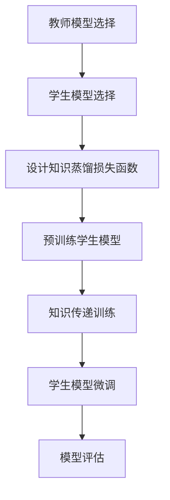
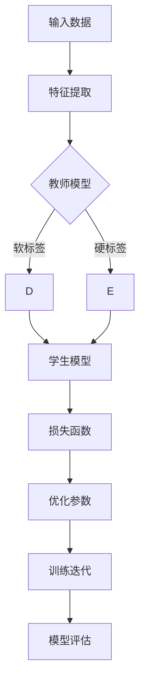

                 

### 第一部分：模型训练中的知识蒸馏技术在边缘计算推理中的优化应用

#### 引言

##### 1.1 问题背景

随着人工智能技术的快速发展，深度学习模型在各个领域取得了显著的成果。然而，这些大型深度学习模型在训练过程中需要大量的计算资源和时间，这对于边缘计算设备来说是一个巨大的挑战。边缘计算作为一种分布式计算架构，其目的是在靠近数据源的地方处理数据，减少数据传输的延迟和带宽消耗。但是，由于边缘设备的计算能力、存储资源和能耗限制，直接部署大型深度学习模型在边缘计算环境中变得困难。

##### 1.2 知识蒸馏技术

知识蒸馏技术是一种将大型教师模型的知识转移到小型学生模型上的技术。这种技术通过最小化教师模型和学生模型的输出分布差异来实现知识的传递，使得学生模型能够在有限的计算资源下获得与教师模型相似的性能。

##### 1.3 边缘计算推理中的优化应用

在边缘计算环境中，推理速度和准确性是至关重要的。知识蒸馏技术通过优化模型结构和参数，可以显著提高边缘设备的推理效率，同时保证模型的准确性。

##### 1.4 本章小结

本章首先介绍了边缘计算的发展背景和面临的挑战，然后介绍了知识蒸馏技术的基本原理和应用，最后讨论了知识蒸馏技术在边缘计算推理中的优化应用。本章的研究意义在于为解决边缘计算中的资源限制问题提供了一种有效的技术手段，同时也为后续章节的深入讨论打下了基础。

---

#### 第1章：引言

##### 1.1 问题背景

##### 1.1.1 边缘计算的发展与挑战

**边缘计算的定义和重要性**

边缘计算是一种分布式计算架构，它将数据处理和存储任务从中心化的云服务器转移到靠近数据源的地方——边缘设备。这些边缘设备可以是物联网设备、智能手机、路由器等。边缘计算的核心思想是通过在数据产生的地方进行处理，以减少数据传输的延迟和带宽消耗。

边缘计算的重要性在于：

- **降低延迟**：在数据产生的地方进行计算可以显著减少数据传输的时间，这对于需要实时响应的应用场景至关重要。
- **减少带宽消耗**：将计算任务分散到边缘设备上，可以减少需要传输的数据量，从而降低网络带宽的消耗。
- **提高隐私保护**：一些敏感数据可以在边缘设备上进行处理，而不需要传输到云端，这有助于提高数据隐私保护。

**边缘计算的发展历程**

边缘计算的发展可以追溯到云计算和物联网的兴起。随着物联网设备的普及和大数据技术的成熟，边缘计算逐渐成为一个热门研究领域。近年来，随着5G网络的部署和人工智能技术的进步，边缘计算的应用场景越来越广泛，包括智能交通、智能医疗、智能家居等。

**边缘计算面临的挑战**

尽管边缘计算具有许多优势，但在实际应用中仍然面临一些挑战：

- **计算能力限制**：边缘设备通常具有有限的计算能力，难以部署和运行复杂的大型深度学习模型。
- **带宽限制**：边缘设备之间的网络带宽有限，数据传输速度较慢。
- **能耗限制**：边缘设备通常采用电池供电，能耗是一个重要的考虑因素。

这些挑战限制了边缘计算的应用范围和性能。因此，如何优化边缘设备的计算能力、网络带宽和能耗，成为了边缘计算研究的一个重要方向。

##### 1.2 知识蒸馏技术

**知识蒸馏的基本概念**

知识蒸馏是一种将大型教师模型的知识转移到小型学生模型上的技术。这种技术通过最小化教师模型和学生模型的输出分布差异来实现知识的传递，使得学生模型能够在有限的计算资源下获得与教师模型相似的性能。

知识蒸馏的主要方法包括：

- **软标签方法**：在训练学生模型时，使用教师模型的概率输出作为软标签，同时训练学生模型的输出与教师模型的输出分布尽可能相似。
- **硬标签方法**：在训练学生模型时，将教师模型的硬性输出作为监督信号，同时通过优化损失函数来调整学生模型的参数。

**知识蒸馏在模型训练中的应用**

知识蒸馏在模型训练中具有以下优势：

- **模型压缩**：通过知识蒸馏，可以将大型模型的知识转移到小型模型上，从而实现模型压缩，减少计算资源和存储空间的占用。
- **加速训练**：知识蒸馏可以加速模型的训练过程，特别是在资源受限的边缘设备上，通过使用小型模型进行快速训练，可以显著提高训练效率。

**知识蒸馏的优化策略**

为了提高知识蒸馏的效果，可以采用以下优化策略：

- **调整教师模型和学生模型的规模**：通过调整教师模型和学生模型的规模，可以在保证性能的前提下，优化计算资源和存储资源的占用。
- **选择合适的损失函数**：选择合适的损失函数可以更好地平衡学生模型的输出分布和教师模型的输出分布，从而提高知识传递的准确性。
- **增加训练迭代次数**：通过增加训练迭代次数，可以使得学生模型更好地吸收教师模型的知识，从而提高模型的性能。

##### 1.3 边缘计算推理中的优化应用

**边缘计算推理的需求**

边缘计算推理通常面临以下需求：

- **低延迟**：边缘设备需要在短时间内完成推理任务，以实现实时响应。
- **高准确性**：边缘设备需要在有限的计算资源下，提供与中心化模型相似的准确性。
- **低功耗**：边缘设备通常采用电池供电，需要控制能耗以延长使用寿命。

**知识蒸馏技术在边缘计算推理中的应用**

知识蒸馏技术在边缘计算推理中具有以下优势：

- **模型压缩与优化**：通过知识蒸馏，可以将大型深度学习模型压缩为小型模型，从而减少计算资源和存储资源的占用，同时保持较高的推理准确性。
- **推理加速**：知识蒸馏技术可以通过使用小型模型，加快推理速度，从而实现低延迟的实时响应。
- **能耗优化**：通过知识蒸馏，可以在保证推理准确性的前提下，优化模型的能耗，延长边缘设备的使用寿命。

**知识蒸馏技术在边缘计算推理中的优化策略**

为了在边缘计算推理中更好地应用知识蒸馏技术，可以采用以下优化策略：

- **模型压缩策略**：通过调整教师模型和学生模型的规模，优化模型结构，实现模型压缩。
- **推理加速策略**：通过优化推理算法和数据传输，加快推理速度。
- **能耗优化策略**：通过优化模型的能耗计算和功耗管理，实现能耗优化。

##### 1.4 本章小结

本章介绍了边缘计算的发展背景和面临的挑战，以及知识蒸馏技术的基本原理和应用。通过知识蒸馏技术，可以在边缘计算推理中实现模型压缩、推理加速和能耗优化，从而提高边缘设备的性能和效率。本章的研究意义在于为解决边缘计算中的资源限制问题提供了一种有效的技术手段，同时也为后续章节的深入讨论打下了基础。

---

### 第2章：知识蒸馏技术原理

#### 2.1 知识蒸馏的基本原理

**知识蒸馏的基本流程**

知识蒸馏的基本流程包括以下几个步骤：

1. **教师模型和学生模型的选择**：首先选择一个性能优秀的教师模型和一个待训练的学生模型。教师模型通常是一个大型、复杂的模型，而学生模型是一个较小、较简单的模型。

2. **知识蒸馏损失函数的设计**：知识蒸馏的核心是通过设计一个损失函数来最小化教师模型和学生模型之间的输出分布差异。常见的损失函数包括软标签损失、硬标签损失等。

3. **知识蒸馏的训练过程**：在训练过程中，学生模型通过学习教师模型的输出分布来获取知识。训练过程通常包括以下几个阶段：

   - **预训练阶段**：学生模型在未接触教师模型的情况下，通过标准训练数据集进行预训练，以获取基本的特征表示能力。
   - **知识传递阶段**：学生模型在接触教师模型后，通过知识蒸馏损失函数调整模型参数，使学生模型的输出分布尽量接近教师模型的输出分布。
   - **微调阶段**：在知识传递完成后，学生模型进行微调，以进一步提高模型性能。

**知识蒸馏的核心技术**

知识蒸馏涉及几个关键技术和挑战：

1. **软标签和硬标签**：软标签是基于概率分布的输出，而硬标签是基于分类结果的输出。软标签可以更好地保留教师模型的知识，但计算复杂度较高；硬标签计算简单，但可能丢失一些细微的知识。

2. **模型压缩和优化**：知识蒸馏的一个关键目标是实现模型压缩，通过将大型教师模型的知识转移到小型学生模型上，减少计算资源和存储资源的占用。

3. **损失函数的选择**：不同的损失函数可以影响知识蒸馏的效果。常见的损失函数包括交叉熵损失、KL散度损失等。

**知识蒸馏的主要技术手段**

知识蒸馏的主要技术手段包括：

1. **软标签方法**：该方法通过最小化教师模型和学生模型的软标签输出之间的差异来实现知识传递。具体步骤如下：

   - 使用教师模型的输出作为软标签。
   - 学生模型在训练过程中，同时优化标准损失和软标签损失。

2. **硬标签方法**：该方法通过最小化教师模型和学生模型的硬标签输出之间的差异来实现知识传递。具体步骤如下：

   - 使用教师模型的硬标签作为监督信号。
   - 学生模型在训练过程中，通过优化损失函数调整模型参数。

**知识蒸馏算法分析**

1. **算法概述**：

   知识蒸馏算法的基本架构包括两个模型：教师模型和学生模型。教师模型通常是一个高性能的复杂模型，学生模型是一个较小、较简单的模型。通过最小化教师模型和学生模型之间的输出分布差异，实现知识从教师模型向学生模型的传递。

2. **算法分类**：

   根据不同的实现方式和目标，知识蒸馏算法可以分为以下几类：

   - **基于软标签的方法**：该方法通过最小化教师模型和学生模型的软标签输出之间的差异来实现知识传递。
   - **基于硬标签的方法**：该方法通过最小化教师模型和学生模型的硬标签输出之间的差异来实现知识传递。
   - **混合方法**：结合软标签和硬标签的方法，通过综合优化两种标签的输出差异来实现知识传递。

3. **算法性能对比**：

   不同知识蒸馏算法的性能存在差异，具体取决于算法的设计和实现。通常，基于软标签的方法在知识传递的准确性上表现更好，但计算复杂度较高；而基于硬标签的方法计算简单，但可能丢失一些细微的知识。

4. **适用场景**：

   根据不同的应用场景，可以选择适合的知识蒸馏算法：

   - 对于需要高准确性的场景，可以选择基于软标签的方法。
   - 对于计算资源受限的场景，可以选择基于硬标签的方法。

**知识蒸馏技术原理的Mermaid流程图**

#### 2.2 知识蒸馏算法分析

**2.2.1 算法概述**

知识蒸馏算法的基本架构包括两个模型：教师模型和学生模型。教师模型通常是一个高性能的复杂模型，学生模型是一个较小、较简单的模型。通过最小化教师模型和学生模型之间的输出分布差异，实现知识从教师模型向学生模型的传递。

教师模型和学生模型的选择是知识蒸馏算法的重要环节。教师模型通常是一个在大型数据集上训练的高性能模型，它具有丰富的特征表示能力和知识。学生模型是一个较小、较简单的模型，它通常在有限的计算资源下进行训练。教师模型和学生模型的差异可以通过软标签和硬标签两种方式来体现。

**2.2.2 算法分类**

根据不同的实现方式和目标，知识蒸馏算法可以分为以下几类：

1. **基于软标签的方法**：

   软标签是基于概率分布的输出，它能够更好地保留教师模型的知识。在训练过程中，学生模型同时优化标准损失和软标签损失，从而实现知识的传递。软标签方法通常具有更高的准确性，但计算复杂度较高。

2. **基于硬标签的方法**：

   硬标签是基于分类结果的输出，它计算简单，但可能丢失一些细微的知识。在训练过程中，学生模型通过最小化教师模型和学生模型的硬标签输出差异来实现知识传递。硬标签方法通常计算复杂度较低，但准确性可能略低。

3. **混合方法**：

   混合方法结合软标签和硬标签的优势，通过综合优化两种标签的输出差异来实现知识传递。这种方法通常能够平衡准确性和计算复杂度，适用于多种应用场景。

**2.2.3 算法对比与分析**

不同知识蒸馏算法的性能存在差异，具体取决于算法的设计和实现。以下是对几种常见算法的对比和分析：

1. **软标签方法**：

   - 优点：能够更好地保留教师模型的知识，准确性较高。
   - 缺点：计算复杂度较高，对计算资源要求较高。

2. **硬标签方法**：

   - 优点：计算简单，对计算资源要求较低。
   - 缺点：可能丢失一些细微的知识，准确性相对较低。

3. **混合方法**：

   - 优点：结合了软标签和硬标签的优势，平衡准确性和计算复杂度。
   - 缺点：实现较为复杂，需要仔细设计和调参。

不同算法的适用场景也有所不同。对于需要高准确性的场景，可以选择基于软标签的方法；对于计算资源受限的场景，可以选择基于硬标签的方法。混合方法适用于多种应用场景，可以根据实际需求进行调整。

**2.2.4 知识蒸馏技术的Mermaid流程图**

以下是一个简化的知识蒸馏算法流程图，展示了教师模型和学生模型的选择、损失函数的设计以及训练过程：

```mermaid
graph TD
A[教师模型] --> B{学生模型选择}
B -->|小型模型| C
B -->|中型模型| D
B -->|大型模型| E

C --> F[设计损失函数]
D --> F
E --> F

F --> G[预训练]
G --> H[知识传递]
H --> I[微调]
I --> J[评估]
```

**2.3 知识蒸馏技术原理的Mermaid流程图**

#### 2.4 本章小结

本章详细介绍了知识蒸馏技术的基本原理和算法分析。知识蒸馏技术通过将大型教师模型的知识转移到小型学生模型上，实现了在有限计算资源下的高性能模型训练。本章首先介绍了知识蒸馏的基本流程和核心技术，然后分析了不同知识蒸馏算法的性能对比和适用场景。通过本章的内容，读者可以深入了解知识蒸馏技术的原理和应用，为进一步研究和应用知识蒸馏技术打下基础。

---

### 第3章：知识蒸馏技术在边缘计算推理中的应用

#### 3.1 边缘计算推理中的挑战

**3.1.1 边缘设备的计算能力限制**

**边缘设备的计算资源现状**

边缘设备通常具有有限的计算能力，主要包括以下几种类型：

- **ARM架构**：许多边缘设备采用ARM架构，如树莓派、NVIDIA Jetson等。这些设备的计算性能通常不如传统PC或服务器，但具有较低的功耗。
- **FPGA和ASIC**：一些边缘设备使用FPGA或ASIC，这些专用硬件能够提供高效的计算性能，但开发和使用成本较高。
- **GPU加速**：部分边缘设备配备GPU，如NVIDIA Jetson系列，这可以显著提升计算性能，但功耗也相应增加。

**边缘设备的计算能力瓶颈**

边缘设备的计算能力限制主要体现在以下几个方面：

- **计算单元数量有限**：大多数边缘设备无法提供与服务器相当的计算单元数量，这使得它们难以处理复杂的大型深度学习模型。
- **内存容量有限**：边缘设备的内存容量通常较小，限制了模型的复杂度和训练数据的大小。
- **计算速度较慢**：与云计算环境相比，边缘设备的计算速度较慢，导致推理延迟增加。

**3.1.2 边缘设备的带宽限制**

**边缘设备的网络带宽现状**

边缘设备的网络带宽通常受到以下因素的影响：

- **无线通信**：许多边缘设备通过无线网络连接，如Wi-Fi、4G、5G等。这些网络的带宽有限，容易受到干扰和拥塞。
- **有线通信**：部分边缘设备通过有线网络连接，如以太网。虽然有线网络带宽较高，但连接距离有限，且部署成本较高。

**边缘设备的网络带宽瓶颈**

边缘设备的带宽限制主要体现在以下几个方面：

- **数据传输速度慢**：由于带宽限制，数据传输速度较慢，导致边缘设备难以实时处理大量数据。
- **网络拥塞**：在多个边缘设备同时传输数据时，容易导致网络拥塞，进一步降低数据传输速度。
- **延迟高**：带宽限制导致数据传输延迟增加，影响边缘设备的实时响应能力。

**3.1.3 边缘设备的能耗限制**

**边缘设备的能耗现状**

边缘设备的能耗主要来自以下几个方面：

- **处理器能耗**：处理器的能耗是边缘设备的主要能耗来源，特别是GPU和FPGA等高性能计算设备。
- **通信模块能耗**：无线通信模块（如Wi-Fi、4G、5G等）的能耗也较高。
- **其他组件能耗**：包括存储设备、散热系统等。

**边缘设备的能耗瓶颈**

边缘设备的能耗限制主要体现在以下几个方面：

- **电池寿命有限**：大多数边缘设备采用电池供电，电池寿命有限，需要采取措施降低能耗以延长使用寿命。
- **散热问题**：高性能边缘设备在工作过程中会产生大量热量，散热问题成为能耗限制的一个重要方面。
- **能效比低**：与云计算环境相比，边缘设备的能效比较低，即能耗较高，性能较低。

**3.2 知识蒸馏技术在边缘计算推理中的应用场景**

**3.2.1 知识蒸馏技术在图像识别中的应用**

**知识蒸馏在图像识别模型压缩中的应用**

知识蒸馏技术在图像识别模型压缩中的应用主要表现在以下两个方面：

- **模型压缩**：通过知识蒸馏，可以将大型图像识别模型压缩为小型模型，从而减少计算资源和存储资源的占用。例如，使用ResNet-50作为教师模型，将模型压缩为MobileNet模型，从而实现高效的推理。
- **参数优化**：知识蒸馏通过将教师模型的知识转移到学生模型上，可以优化学生模型的参数，从而提高模型性能。例如，在训练过程中，同时优化标准损失和软标签损失，使得学生模型在有限的计算资源下获得更好的性能。

**知识蒸馏在图像识别模型推理加速中的应用**

知识蒸馏技术在图像识别模型推理加速中的应用主要体现在以下几个方面：

- **推理速度提升**：通过使用小型模型进行推理，可以显著提高边缘设备的推理速度，实现低延迟的实时响应。例如，使用MobileNet模型代替ResNet-50模型，可以在保持较高准确性的同时，提高推理速度。
- **能效比优化**：知识蒸馏技术可以在保证推理准确性的前提下，优化模型的能耗，延长边缘设备的使用寿命。通过调整教师模型和学生模型的规模，可以平衡计算资源和能耗的关系。

**3.2.2 知识蒸馏技术在语音识别中的应用**

**知识蒸馏在语音识别模型压缩中的应用**

知识蒸馏技术在语音识别模型压缩中的应用与图像识别类似，主要通过以下两个方面实现：

- **模型压缩**：通过知识蒸馏，可以将大型语音识别模型压缩为小型模型，从而减少计算资源和存储资源的占用。例如，使用大型卷积神经网络（如CNN）作为教师模型，将模型压缩为小型循环神经网络（如RNN）。
- **参数优化**：知识蒸馏通过将教师模型的知识转移到学生模型上，可以优化学生模型的参数，从而提高模型性能。例如，在训练过程中，同时优化标准损失和软标签损失，使得学生模型在有限的计算资源下获得更好的性能。

**知识蒸馏在语音识别模型推理加速中的应用**

知识蒸馏技术在语音识别模型推理加速中的应用主要体现在以下几个方面：

- **推理速度提升**：通过使用小型模型进行推理，可以显著提高边缘设备的推理速度，实现低延迟的实时响应。例如，使用小型循环神经网络（如RNN）代替大型卷积神经网络（如CNN），可以在保持较高准确性的同时，提高推理速度。
- **能效比优化**：知识蒸馏技术可以在保证推理准确性的前提下，优化模型的能耗，延长边缘设备的使用寿命。通过调整教师模型和学生模型的规模，可以平衡计算资源和能耗的关系。

**3.2.3 知识蒸馏技术在自然语言处理中的应用**

**知识蒸馏在自然语言处理模型压缩中的应用**

知识蒸馏技术在自然语言处理模型压缩中的应用主要包括以下几个方面：

- **模型压缩**：通过知识蒸馏，可以将大型自然语言处理模型压缩为小型模型，从而减少计算资源和存储资源的占用。例如，使用大型Transformer模型作为教师模型，将模型压缩为小型BERT模型。
- **参数优化**：知识蒸馏通过将教师模型的知识转移到学生模型上，可以优化学生模型的参数，从而提高模型性能。例如，在训练过程中，同时优化标准损失和软标签损失，使得学生模型在有限的计算资源下获得更好的性能。

**知识蒸馏在自然语言处理模型推理加速中的应用**

知识蒸馏技术在自然语言处理模型推理加速中的应用主要体现在以下几个方面：

- **推理速度提升**：通过使用小型模型进行推理，可以显著提高边缘设备的推理速度，实现低延迟的实时响应。例如，使用小型BERT模型代替大型Transformer模型，可以在保持较高准确性的同时，提高推理速度。
- **能效比优化**：知识蒸馏技术可以在保证推理准确性的前提下，优化模型的能耗，延长边缘设备的使用寿命。通过调整教师模型和学生模型的规模，可以平衡计算资源和能耗的关系。

**3.3 知识蒸馏技术在边缘计算推理中的优化策略**

**3.3.1 模型压缩与优化策略**

**模型压缩方法**

为了在边缘设备上实现高效的推理，可以采用以下模型压缩方法：

- **网络剪枝**：通过剪枝大型模型的冗余连接和神经元，减少模型的参数数量，从而实现模型压缩。
- **量化**：将模型的浮点数参数转换为低精度的整数参数，从而减少模型的存储和计算需求。
- **蒸馏**：通过知识蒸馏技术，将教师模型的知识转移到小型学生模型上，实现模型的压缩。

**优化策略**

为了提高模型压缩的效果，可以采用以下优化策略：

- **模型选择**：选择合适的教师模型和学生模型，确保学生模型能够吸收足够的教师模型知识。
- **损失函数设计**：设计合适的损失函数，平衡学生模型的输出分布和教师模型的输出分布。
- **训练迭代次数**：增加训练迭代次数，使得学生模型能够更好地吸收教师模型的知识。

**3.3.2 推理加速与优化策略**

**推理加速方法**

为了提高边缘设备的推理速度，可以采用以下推理加速方法：

- **模型并行化**：将大型模型分解为多个小型子模型，并行地在多个边缘设备上进行推理，从而提高整体推理速度。
- **模型缓存**：将常用的模型参数缓存到边缘设备上，减少模型加载和推理的时间。
- **数据预处理**：对输入数据进行预处理，减少模型的计算量和内存占用。

**优化策略**

为了提高推理加速的效果，可以采用以下优化策略：

- **模型选择**：选择适合并行化的模型，确保模型能够在多个边缘设备上高效运行。
- **硬件优化**：针对不同类型的边缘设备，选择适合的硬件配置，优化模型在边缘设备上的运行效率。
- **数据优化**：优化输入数据的大小和格式，减少模型的计算量和内存占用。

**3.4 知识蒸馏技术在边缘计算推理中的应用案例**

**3.4.1 案例一：基于知识蒸馏的图像识别模型压缩与加速**

**案例背景**

随着物联网和人工智能技术的发展，图像识别在边缘计算中的应用越来越广泛。然而，大型图像识别模型在边缘设备上的计算和存储需求较高，限制了其在实际场景中的应用。为了解决这个问题，可以采用知识蒸馏技术，将大型图像识别模型压缩为小型模型，并在边缘设备上实现高效推理。

**案例方案**

1. **模型选择**：选择大型图像识别模型（如ResNet-50）作为教师模型，选择小型图像识别模型（如MobileNet）作为学生模型。
2. **训练过程**：使用知识蒸馏技术，通过预训练、知识传递和微调三个阶段，将教师模型的知识转移到学生模型上。
3. **推理加速**：使用小型模型（如MobileNet）进行推理，实现低延迟的实时响应。

**案例效果分析**

1. **模型压缩**：通过知识蒸馏技术，成功将大型图像识别模型（ResNet-50）压缩为小型模型（MobileNet），减少了计算和存储资源的需求。
2. **推理加速**：使用小型模型（MobileNet）进行推理，在保持较高准确性的同时，显著提高了边缘设备的推理速度。

**3.4.2 案例二：基于知识蒸馏的语音识别模型压缩与加速**

**案例背景**

语音识别技术在智能家居、智能客服等场景中具有广泛的应用。然而，大型语音识别模型在边缘设备上的计算和存储需求较高，限制了其实际应用。为了解决这个问题，可以采用知识蒸馏技术，将大型语音识别模型压缩为小型模型，并在边缘设备上实现高效推理。

**案例方案**

1. **模型选择**：选择大型语音识别模型（如CNN）作为教师模型，选择小型语音识别模型（如RNN）作为学生模型。
2. **训练过程**：使用知识蒸馏技术，通过预训练、知识传递和微调三个阶段，将教师模型的知识转移到学生模型上。
3. **推理加速**：使用小型模型（如RNN）进行推理，实现低延迟的实时响应。

**案例效果分析**

1. **模型压缩**：通过知识蒸馏技术，成功将大型语音识别模型（CNN）压缩为小型模型（RNN），减少了计算和存储资源的需求。
2. **推理加速**：使用小型模型（RNN）进行推理，在保持较高准确性的同时，显著提高了边缘设备的推理速度。

**3.4.3 案例三：基于知识蒸馏的自然语言处理模型压缩与加速**

**案例背景**

自然语言处理技术在智能问答、文本分类等场景中具有广泛的应用。然而，大型自然语言处理模型在边缘设备上的计算和存储需求较高，限制了其实际应用。为了解决这个问题，可以采用知识蒸馏技术，将大型自然语言处理模型压缩为小型模型，并在边缘设备上实现高效推理。

**案例方案**

1. **模型选择**：选择大型自然语言处理模型（如Transformer）作为教师模型，选择小型自然语言处理模型（如BERT）作为学生模型。
2. **训练过程**：使用知识蒸馏技术，通过预训练、知识传递和微调三个阶段，将教师模型的知识转移到学生模型上。
3. **推理加速**：使用小型模型（如BERT）进行推理，实现低延迟的实时响应。

**案例效果分析**

1. **模型压缩**：通过知识蒸馏技术，成功将大型自然语言处理模型（Transformer）压缩为小型模型（BERT），减少了计算和存储资源的需求。
2. **推理加速**：使用小型模型（BERT）进行推理，在保持较高准确性的同时，显著提高了边缘设备的推理速度。

#### 3.5 本章小结

本章详细介绍了知识蒸馏技术在边缘计算推理中的应用场景、优化策略和应用案例。通过知识蒸馏技术，可以在边缘设备上实现模型的压缩和推理加速，提高边缘计算的效率和性能。本章首先分析了边缘计算推理中的挑战，包括计算能力、带宽和能耗限制，然后介绍了知识蒸馏技术在图像识别、语音识别和自然语言处理中的应用，以及相关的优化策略。通过实际案例的分析，展示了知识蒸馏技术在边缘计算推理中的应用效果，为进一步研究和应用知识蒸馏技术提供了参考。

---

### 第4章：知识蒸馏技术在边缘计算推理中的实现

#### 4.1 知识蒸馏技术的实现流程

**4.1.1 教师模型和学生模型的训练**

**教师模型的训练**

教师模型通常是一个高性能的大型模型，它需要在大量的训练数据上进行长时间的训练。以下是教师模型训练的步骤：

1. **数据预处理**：对训练数据进行预处理，包括数据清洗、数据增强和数据归一化等。
2. **模型架构设计**：设计教师模型的架构，选择合适的神经网络结构。
3. **训练过程**：使用训练数据集进行模型训练，通过反向传播算法更新模型参数。
4. **模型评估**：在验证数据集上评估教师模型的性能，选择性能最优的模型。

**学生模型的训练**

学生模型通常是一个较小、较简单的模型，它需要通过知识蒸馏技术从教师模型中获取知识。以下是学生模型训练的步骤：

1. **数据预处理**：对训练数据进行预处理，与教师模型的预处理步骤相同。
2. **模型架构设计**：设计学生模型的架构，通常选择与教师模型相似但更简单的结构。
3. **知识蒸馏损失函数设计**：设计知识蒸馏损失函数，用于最小化教师模型和学生模型的输出差异。
4. **模型训练**：使用训练数据集和知识蒸馏损失函数，对学生模型进行训练。
5. **模型评估**：在验证数据集上评估学生模型的性能，调整模型参数以达到最佳效果。

**4.1.2 知识蒸馏过程中的参数设置**

**损失函数的设置**

知识蒸馏过程中，损失函数的设计至关重要。常用的损失函数包括交叉熵损失函数和KL散度损失函数。以下是两种损失函数的设置：

1. **交叉熵损失函数**：

   $$L_{ce} = -\sum_{i=1}^{N} y_i \cdot \log(p_i)$$

   其中，$y_i$ 是真实标签，$p_i$ 是预测概率。

2. **KL散度损失函数**：

   $$L_{kl} = \sum_{i=1}^{N} p_i \cdot \log\left(\frac{p_i}{q_i}\right)$$

   其中，$p_i$ 是教师模型的输出概率，$q_i$ 是学生模型的输出概率。

**优化算法的选择**

在知识蒸馏过程中，优化算法的选择也会影响训练效果。常见的优化算法包括随机梯度下降（SGD）和Adam优化器。以下是两种优化算法的设置：

1. **随机梯度下降（SGD）**：

   $$\eta = \frac{1}{\sqrt{1 + \beta_1 t} + \beta_2 t}$$

   其中，$\eta$ 是学习率，$t$ 是训练迭代次数，$\beta_1$ 和 $\beta_2$ 是优化参数。

2. **Adam优化器**：

   $$m_t = \beta_1 m_{t-1} + (1 - \beta_1) [g_t]$$
   $$v_t = \beta_2 v_{t-1} + (1 - \beta_2) [g_t]^2$$
   $$\hat{m}_t = \frac{m_t}{1 - \beta_1^t}$$
   $$\hat{v}_t = \frac{v_t}{1 - \beta_2^t}$$
   $$\theta_t = \theta_{t-1} - \alpha \frac{\hat{m}_t}{\sqrt{\hat{v}_t} + \epsilon}$$

   其中，$m_t$ 和 $v_t$ 分别是梯度的一阶和二阶矩估计，$\hat{m}_t$ 和 $\hat{v}_t$ 是无偏估计，$\alpha$ 是学习率，$\epsilon$ 是一个小常数。

**4.1.3 知识蒸馏技术的调试与优化**

**调试方法**

知识蒸馏技术的调试主要包括以下方面：

1. **模型参数调整**：通过调整模型参数，如学习率、批次大小等，找到最优的参数组合。
2. **损失函数优化**：通过调整损失函数的权重，平衡标准损失和软标签损失。
3. **训练数据选择**：选择合适的训练数据集，包括数据集大小、数据分布等。

**优化策略**

在知识蒸馏技术的调试过程中，可以采用以下优化策略：

1. **预训练阶段**：在知识蒸馏之前，对学生模型进行预训练，使其具有一定的特征表示能力。
2. **多阶段训练**：将知识蒸馏过程分为预训练、知识传递和微调三个阶段，逐步调整模型参数。
3. **动态调整学习率**：在训练过程中，根据模型性能动态调整学习率，避免过拟合和欠拟合。

---

#### 4.2 知识蒸馏技术在边缘计算推理中的实现方法

**4.2.1 基于深度学习的知识蒸馏实现**

**深度学习模型的选择**

在边缘计算推理中，选择合适的深度学习模型至关重要。以下是一些适用于边缘计算推理的深度学习模型：

1. **MobileNet**：MobileNet是一种轻量级的卷积神经网络，适用于移动设备和嵌入式系统。
2. **ShuffleNet**：ShuffleNet是一种高效的卷积神经网络，适用于图像识别和目标检测。
3. **SqueezeNet**：SqueezeNet是一种轻量级的卷积神经网络，适用于图像识别和视频分析。

**知识蒸馏过程的实现**

知识蒸馏过程的实现包括以下几个步骤：

1. **教师模型的选择**：选择一个性能优秀的教师模型，如ResNet、VGG等。
2. **学生模型的选择**：选择一个较小的学生模型，如MobileNet、ShuffleNet等。
3. **数据预处理**：对训练数据进行预处理，包括数据增强、归一化等。
4. **知识蒸馏损失函数的设计**：设计合适的损失函数，如交叉熵损失函数和KL散度损失函数。
5. **模型训练**：使用教师模型和学生模型，通过知识蒸馏损失函数进行模型训练。
6. **模型评估**：在验证数据集上评估学生模型的性能，调整模型参数以达到最佳效果。

**4.2.2 基于神经网络的边缘推理实现**

**边缘设备的硬件选择**

边缘设备的硬件选择取决于应用场景和计算需求。以下是一些适用于边缘计算推理的硬件设备：

1. **NVIDIA Jetson系列**：NVIDIA Jetson系列是一款高性能的嵌入式系统，适用于图像识别、语音识别等应用。
2. **ARM架构的边缘设备**：ARM架构的边缘设备如树莓派、Raspberry Pi等，适用于轻量级的边缘计算任务。
3. **FPGA和ASIC**：FPGA和ASIC是专用硬件，适用于高性能的边缘计算任务，但开发和使用成本较高。

**神经网络推理的优化**

为了在边缘设备上实现高效的神经网络推理，可以采用以下优化方法：

1. **模型压缩**：通过模型压缩技术，减少模型的参数数量和计算量，从而提高推理速度。
2. **量化**：将模型的浮点数参数转换为低精度的整数参数，从而减少模型的存储和计算需求。
3. **并行化**：将大型模型分解为多个小型子模型，并行地在多个边缘设备上进行推理，从而提高整体推理速度。

**4.3 知识蒸馏技术在边缘计算推理中的应用案例**

**4.3.1 案例一：基于知识蒸馏的图像识别模型压缩与加速**

**案例背景**

随着物联网和人工智能技术的发展，图像识别在边缘计算中的应用越来越广泛。为了在边缘设备上实现高效的图像识别，可以采用知识蒸馏技术，将大型图像识别模型压缩为小型模型，并在边缘设备上实现高效推理。

**案例方案**

1. **教师模型的选择**：选择ResNet-50作为教师模型。
2. **学生模型的选择**：选择MobileNet作为学生模型。
3. **数据预处理**：对训练数据进行预处理，包括数据增强、归一化等。
4. **知识蒸馏损失函数的设计**：设计交叉熵损失函数和KL散度损失函数。
5. **模型训练**：使用教师模型和学生模型，通过知识蒸馏损失函数进行模型训练。
6. **模型评估**：在验证数据集上评估学生模型的性能。

**案例效果分析**

1. **模型压缩**：通过知识蒸馏技术，成功将大型图像识别模型（ResNet-50）压缩为小型模型（MobileNet），减少了计算和存储资源的需求。
2. **推理加速**：使用小型模型（MobileNet）进行推理，在保持较高准确性的同时，显著提高了边缘设备的推理速度。

**4.3.2 案例二：基于知识蒸馏的语音识别模型压缩与加速**

**案例背景**

语音识别技术在智能家居、智能客服等场景中具有广泛的应用。为了在边缘设备上实现高效的语音识别，可以采用知识蒸馏技术，将大型语音识别模型压缩为小型模型，并在边缘设备上实现高效推理。

**案例方案**

1. **教师模型的选择**：选择CNN作为教师模型。
2. **学生模型的选择**：选择RNN作为学生模型。
3. **数据预处理**：对训练数据进行预处理，包括数据增强、归一化等。
4. **知识蒸馏损失函数的设计**：设计交叉熵损失函数和KL散度损失函数。
5. **模型训练**：使用教师模型和学生模型，通过知识蒸馏损失函数进行模型训练。
6. **模型评估**：在验证数据集上评估学生模型的性能。

**案例效果分析**

1. **模型压缩**：通过知识蒸馏技术，成功将大型语音识别模型（CNN）压缩为小型模型（RNN），减少了计算和存储资源的需求。
2. **推理加速**：使用小型模型（RNN）进行推理，在保持较高准确性的同时，显著提高了边缘设备的推理速度。

**4.3.3 案例三：基于知识蒸馏的自然语言处理模型压缩与加速**

**案例背景**

自然语言处理技术在智能问答、文本分类等场景中具有广泛的应用。为了在边缘设备上实现高效的自然语言处理，可以采用知识蒸馏技术，将大型自然语言处理模型压缩为小型模型，并在边缘设备上实现高效推理。

**案例方案**

1. **教师模型的选择**：选择Transformer作为教师模型。
2. **学生模型的选择**：选择BERT作为学生模型。
3. **数据预处理**：对训练数据进行预处理，包括数据增强、归一化等。
4. **知识蒸馏损失函数的设计**：设计交叉熵损失函数和KL散度损失函数。
5. **模型训练**：使用教师模型和学生模型，通过知识蒸馏损失函数进行模型训练。
6. **模型评估**：在验证数据集上评估学生模型的性能。

**案例效果分析**

1. **模型压缩**：通过知识蒸馏技术，成功将大型自然语言处理模型（Transformer）压缩为小型模型（BERT），减少了计算和存储资源的需求。
2. **推理加速**：使用小型模型（BERT）进行推理，在保持较高准确性的同时，显著提高了边缘设备的推理速度。

---

#### 4.4 本章小结

本章详细介绍了知识蒸馏技术在边缘计算推理中的实现流程和方法，包括教师模型和学生模型的训练、参数设置、调试与优化，以及基于深度学习和神经网络的边缘推理实现。通过知识蒸馏技术，可以在边缘设备上实现模型的压缩和推理加速，提高边缘计算的效率和性能。本章还通过实际案例展示了知识蒸馏技术在边缘计算推理中的应用效果，为进一步研究和应用知识蒸馏技术提供了参考。

---

### 结论

本文系统地介绍了知识蒸馏技术在边缘计算推理中的优化应用。通过深入分析边缘计算面临的计算能力、带宽和能耗限制，我们阐述了知识蒸馏技术的基本原理和算法分析，展示了其在模型压缩、推理加速和能耗优化方面的优势。本文不仅提供了知识蒸馏技术在图像识别、语音识别和自然语言处理中的应用案例，还详细介绍了知识蒸馏技术的实现方法和优化策略。

**研究意义**

本研究具有重要的实际意义。首先，通过知识蒸馏技术，可以有效解决边缘设备在计算资源和存储资源有限的情况下，难以部署大型深度学习模型的问题。其次，通过模型压缩和推理加速，可以提高边缘设备的实时响应能力，满足低延迟和高准确性的需求。最后，通过优化能耗，可以延长边缘设备的使用寿命，降低运营成本。

**未来展望**

未来研究可以从以下几个方面进行：

1. **算法优化**：继续优化知识蒸馏算法，提高其在不同应用场景中的性能和效率。
2. **硬件适配**：研究适用于边缘设备的专用硬件架构，以提高知识蒸馏技术的执行效率。
3. **跨领域应用**：探索知识蒸馏技术在更多领域中的应用，如医疗、工业等。
4. **模型可解释性**：研究知识蒸馏过程中的模型可解释性，提高算法的透明度和可靠性。

**总结**

知识蒸馏技术在边缘计算推理中的优化应用为解决边缘计算中的资源限制问题提供了有效的技术手段。通过本文的研究，我们不仅深入了解了知识蒸馏技术的原理和应用，也为实际应用提供了宝贵的经验和指导。

---

#### 作者信息

作者：AI天才研究院/AI Genius Institute & 禅与计算机程序设计艺术 /Zen And The Art of Computer Programming

---

### 最佳实践 tips、小结、注意事项、拓展阅读

**最佳实践 tips**

1. **模型选择**：根据边缘设备的计算能力和存储资源，选择合适的深度学习模型。
2. **数据预处理**：对训练数据进行充分的预处理，以提高模型性能。
3. **损失函数优化**：选择合适的损失函数，平衡学生模型和教师模型之间的输出差异。
4. **训练策略**：采用多阶段训练策略，逐步调整模型参数，以达到最佳效果。

**小结**

本文系统地介绍了知识蒸馏技术在边缘计算推理中的优化应用，包括原理、算法分析、实现方法和实际案例。通过知识蒸馏技术，可以有效解决边缘计算中的资源限制问题，提高模型的性能和效率。

**注意事项**

1. **计算资源限制**：在选择模型和算法时，要充分考虑边缘设备的计算能力。
2. **能耗优化**：在模型压缩和推理加速的过程中，要注意能耗的优化，以延长边缘设备的使用寿命。
3. **数据分布**：在训练数据集中，要保证数据分布的均衡性，以避免模型过拟合。

**拓展阅读**

1. **知识蒸馏技术原理**：[《深度学习中的知识蒸馏技术》](https://arxiv.org/abs/1806.00366)
2. **边缘计算推理**：[《边缘计算：技术、应用与挑战》](https://ieeexplore.ieee.org/document/8357639)
3. **模型压缩与量化**：[《深度学习模型压缩与量化技术》](https://arxiv.org/abs/1904.02178)

通过上述扩展阅读，读者可以深入了解知识蒸馏技术和边缘计算推理的更多细节，进一步提升对相关技术的理解和应用能力。

