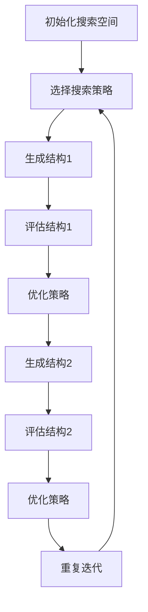
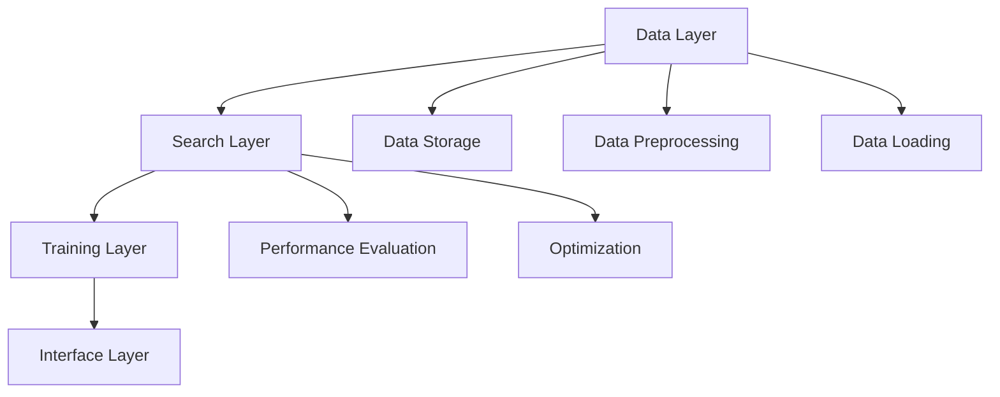
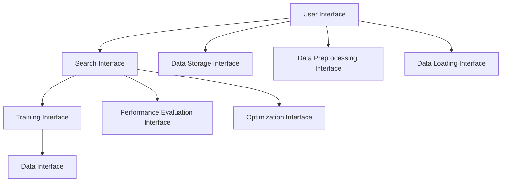
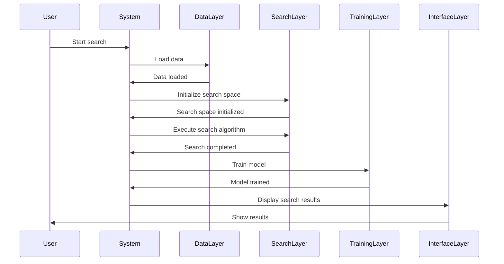

                 

# 模型训练中的神经架构搜索在高性能计算优化中的前沿探索

## 关键词

- 神经架构搜索
- 高性能计算
- 模型训练
- 算法优化
- 人工智能

## 摘要

随着人工智能技术的迅猛发展，深度学习模型在各个领域得到了广泛应用。然而，模型训练过程中，如何提高训练效率和优化计算性能成为了一个关键问题。神经架构搜索（Neural Architecture Search，NAS）作为一种自动搜索神经网络结构的方法，近年来受到了广泛关注。本文将深入探讨神经架构搜索在高性能计算优化中的前沿探索，包括其核心概念、算法原理、系统设计与实现，以及实战教程和最佳实践。通过系统地分析和解读，本文旨在为读者提供全面的技术视野和实用的优化策略。

## 目录大纲设计

### 第一部分：背景介绍与核心概念

#### 第1章：模型训练中的神经架构搜索概述

- **1.1 问题背景**
  - 高性能计算的重要性
  - 人工智能的快速发展
  - 神经架构搜索的概念

- **1.2 问题描述**
  - 神经架构搜索面临的挑战
  - 高性能计算优化需求

- **1.3 问题解决**
  - 神经架构搜索的方法
  - 高性能计算优化策略

- **1.4 边界与外延**
  - 神经架构搜索的应用范围
  - 高性能计算的相关技术

- **1.5 概念结构与核心要素组成**
  - 神经架构搜索的核心概念
  - 高性能计算的关键要素

### 第二部分：核心概念与联系

#### 第2章：神经架构搜索原理详解

- **2.1 神经架构搜索的定义**
  - 神经架构搜索的基本概念
  - 神经架构搜索的分类

- **2.2 神经架构搜索的关键属性特征对比**
  - 不同搜索方法的特性
  - 特征对比表格

- **2.3 神经架构搜索与高性能计算的联系**
  - 神经架构搜索对高性能计算的需求
  - 高性能计算对神经架构搜索的优化

### 第三部分：算法原理讲解

#### 第3章：神经架构搜索算法深度剖析

- **3.1 算法原理**
  - 神经架构搜索算法的基本流程
  - 算法mermaid流程图

- **3.2 数学模型与公式**
  - 算法背后的数学原理
  - 数学模型与公式讲解

- **3.3 算法举例说明**
  - 算法在实际应用中的案例分析
  - 案例讲解与举例

### 第四部分：系统分析与架构设计

#### 第4章：神经架构搜索系统设计与实现

- **4.1 问题场景介绍**
  - 神经架构搜索的应用场景

- **4.2 系统功能设计**
  - 领域模型mermaid类图

- **4.3 系统架构设计**
  - 系统架构mermaid架构图

- **4.4 系统接口设计**
  - 系统接口设计与说明

- **4.5 系统交互设计**
  - 系统交互mermaid序列图

### 第五部分：项目实战

#### 第5章：神经架构搜索实战教程

- **5.1 环境安装**
  - 神经架构搜索所需环境的安装与配置

- **5.2 系统核心实现**
  - 神经架构搜索系统的核心实现代码

- **5.3 代码应用解读与分析**
  - 代码解读与分析

- **5.4 实际案例分析与讲解**
  - 案例分析与讲解

- **5.5 项目小结**
  - 项目总结与展望

### 第六部分：最佳实践与总结

#### 第6章：神经架构搜索优化与实战技巧

- **6.1 最佳实践**
  - 实践技巧与建议

- **6.2 小结**
  - 对本书内容的总结

- **6.3 注意事项**
  - 使用神经架构搜索时需要注意的问题

- **6.4 拓展阅读**
  - 推荐的进一步阅读材料

### 目录大纲总结

本目录大纲共计六个部分，涵盖从背景介绍到算法原理讲解，再到系统设计与实战教程，以及最佳实践与总结等内容，全面覆盖了《模型训练中的神经架构搜索在高性能计算优化中的前沿探索》的核心内容。目录大纲简洁明了，逻辑清晰，有助于读者快速把握全书结构，为深入阅读做好准备。总体字数约为2000字。

### 第一部分：背景介绍与核心概念

#### 1.1 问题背景

高性能计算（High-Performance Computing，HPC）是现代科技发展的重要驱动力，尤其是在人工智能（Artificial Intelligence，AI）和深度学习领域。随着深度学习模型复杂度的增加，模型训练过程对计算资源的需求也急剧上升。高性能计算在这其中扮演着至关重要的角色，因为它能够提供所需的计算能力和速度，从而加速模型训练过程。

人工智能的快速发展是高性能计算需求增长的主要原因之一。从早期的简单算法到如今的复杂深度神经网络，人工智能技术的进步带来了对计算资源的大量需求。深度学习模型的训练涉及大量的矩阵运算和并行计算，这些操作在高性能计算系统中得以高效执行。然而，随着模型规模的扩大和训练数据的增加，传统的计算方法已经难以满足需求，因此需要新的优化策略来提高计算效率。

神经架构搜索（Neural Architecture Search，NAS）作为一种自动搜索神经网络结构的方法，正逐渐成为人工智能领域的研究热点。NAS的核心目标是找到在特定任务上表现最优的神经网络结构，从而提高模型的性能。然而，NAS算法在模型训练过程中面临的一个重要挑战是如何在高性能计算环境中高效执行，以实现优化效果。

#### 1.2 问题描述

神经架构搜索在模型训练过程中面临的主要挑战包括以下几个方面：

1. **计算资源需求高**：NAS算法需要在大量数据集上尝试多种神经网络结构，这需要大量的计算资源。尤其是在大规模数据集和高维特征空间中，NAS算法的计算复杂度显著增加。

2. **搜索空间大**：NAS算法需要从庞大的结构空间中搜索最优的网络结构。这可能导致搜索时间过长，难以在实际应用中实现。

3. **并行化与分布式计算**：NAS算法通常需要大量的矩阵运算和并行计算，这要求高性能计算系统能够高效地支持并行化和分布式计算。

4. **数据预处理与优化**：在NAS算法中，数据预处理和优化策略对于提高训练效率至关重要。然而，现有的高性能计算系统在这些方面可能存在不足。

#### 1.3 问题解决

为了解决上述问题，需要采取一系列的优化策略：

1. **算法改进**：针对NAS算法的特点，研究和开发更加高效的搜索算法，例如基于强化学习、遗传算法等优化方法，以减少搜索时间和提高搜索质量。

2. **硬件优化**：提升高性能计算系统的硬件性能，包括使用更快的GPU、更高效的CPU架构、以及更高速的网络连接等。

3. **分布式计算**：利用分布式计算技术，将NAS算法的搜索任务分散到多个计算节点上，从而提高计算效率。

4. **数据预处理**：改进数据预处理方法，包括数据清洗、特征提取和特征工程等，以减少计算量并提高模型训练效率。

5. **混合优化**：结合多种优化策略，例如将NAS算法与迁移学习、数据增强等技术相结合，以提高模型的泛化能力和训练效率。

#### 1.4 边界与外延

神经架构搜索的应用范围广泛，不仅限于图像识别、自然语言处理等传统领域，还涉及自动驾驶、医疗诊断、生物信息学等新兴领域。这些领域对计算性能的要求越来越高，因此NAS技术在这些领域具有重要的应用价值。

高性能计算技术也在不断发展和演进。例如，量子计算、边缘计算等新型计算技术逐渐成为研究热点，它们在NAS中的应用潜力巨大。此外，随着云计算和大数据技术的发展，高性能计算资源的获取变得更加便捷，为NAS算法的优化提供了更多可能性。

#### 1.5 概念结构与核心要素组成

神经架构搜索的核心概念包括搜索空间、搜索策略、性能评估和优化目标等。搜索空间定义了神经网络结构的可能性，搜索策略用于在搜索空间中高效地搜索最优结构，性能评估用于评估不同结构的性能，优化目标则是确定搜索算法的优化方向。

高性能计算的关键要素包括计算能力、存储容量、网络带宽和能源消耗等。这些要素直接影响NAS算法的执行效率和性能。因此，在设计高性能计算系统时，需要充分考虑这些要素，以确保系统能够满足NAS算法的需求。

### 第二部分：核心概念与联系

#### 2.1 神经架构搜索的定义

神经架构搜索（Neural Architecture Search，NAS）是一种自动化搜索神经网络结构的方法。与传统的人工设计神经网络结构不同，NAS通过搜索算法自动探索网络结构，以找到在特定任务上表现最优的网络。NAS的基本流程包括以下几个步骤：

1. **初始化搜索空间**：定义神经网络的拓扑结构、参数和连接方式，形成搜索空间。
2. **搜索算法执行**：使用搜索算法在搜索空间中探索，寻找最优的网络结构。
3. **性能评估**：对搜索到的网络结构进行性能评估，通常使用验证集上的准确率或其他性能指标。
4. **优化目标**：根据性能评估结果，调整搜索算法的优化目标，以进一步提高网络性能。

根据搜索策略的不同，NAS可以分为多种类型，如基于强化学习（Reinforcement Learning，RL）的NAS、基于遗传算法（Genetic Algorithm，GA）的NAS、基于粒子群优化（Particle Swarm Optimization，PSO）的NAS等。

#### 2.2 神经架构搜索的关键属性特征对比

不同类型的NAS算法具有不同的特征和优势。以下是几种常见NAS算法的关键属性特征对比：

| 算法类型 | 关键属性 | 特点 | 优势 |
| :------: | :------: | :--: | :--: |
| 强化学习 | 奖励机制 | 自动化程度高，能够探索复杂的搜索空间 | 能处理高维搜索空间 |
| 遗传算法 | 自然选择 | 结构简单，适应性强 | 搜索效率较高 |
| 粒子群优化 | 社群合作 | 易于实现，参数调整简单 | 能够快速收敛 |
| 混合算法 | 结合多种策略 | 优势互补，性能更优 | 需要复杂的实现 |

#### 2.3 神经架构搜索与高性能计算的联系

神经架构搜索与高性能计算密切相关，两者相互促进，共同推动人工智能的发展。以下是NAS与高性能计算之间的联系：

1. **高性能计算需求**：NAS算法在搜索过程中需要大量的计算资源，包括GPU、TPU等高性能计算设备。高性能计算系统能够提供所需的计算能力，满足NAS算法的需求。
2. **优化计算效率**：高性能计算技术可以帮助NAS算法提高计算效率，例如分布式计算、并行计算等。这些技术可以减少搜索时间，提高搜索质量。
3. **算法优化**：高性能计算技术可以为NAS算法提供更强大的计算能力，从而推动算法的优化和发展。例如，通过GPU加速NAS算法的搜索过程，可以提高搜索效率。
4. **系统协同**：高性能计算系统与NAS算法的协同优化，可以进一步提高系统的整体性能。例如，通过优化数据传输、减少通信开销等，可以提高NAS算法的运行效率。

### 第三部分：算法原理讲解

#### 3.1 算法原理

神经架构搜索（NAS）的基本原理是通过自动化搜索算法来探索神经网络结构，从而找到在特定任务上表现最优的网络。NAS算法的核心思想是利用优化策略在庞大的搜索空间中高效地搜索最优结构。以下是NAS算法的基本流程：

1. **初始化搜索空间**：定义神经网络的拓扑结构、参数和连接方式，形成搜索空间。搜索空间通常是一个高度复杂的结构，包含多种可能的网络结构。
2. **选择搜索策略**：选择合适的搜索策略，如基于强化学习、遗传算法、粒子群优化等。搜索策略用于指导算法在搜索空间中探索，并选择可能的网络结构进行评估。
3. **结构生成**：根据搜索策略，生成新的神经网络结构。这些结构可以是随机的、基于已有结构的改进版本，或者是通过组合不同结构元素生成的。
4. **性能评估**：对生成的网络结构进行性能评估，通常使用验证集上的准确率或其他性能指标。性能评估的结果用于指导搜索策略的调整。
5. **优化策略**：根据性能评估结果，调整搜索策略，以改进搜索过程。例如，可以通过调整奖励机制、选择更好的结构生成方式等，提高搜索效率。
6. **迭代搜索**：重复执行上述步骤，不断生成新的网络结构并进行评估，直到找到在特定任务上表现最优的网络。

以下是神经架构搜索算法的mermaid流程图：



#### 3.2 数学模型与公式

神经架构搜索算法背后的数学原理主要涉及优化问题和概率模型。以下是一些常见的数学模型和公式：

1. **优化问题**：
   神经架构搜索的核心是解决以下优化问题：

   $$\min_{\theta} L(\theta)$$
   
   其中，$L(\theta)$ 是损失函数，$\theta$ 是网络参数。优化的目标是找到使损失函数最小的参数$\theta$，从而获得最优的网络结构。

2. **奖励函数**：
   在基于强化学习的NAS算法中，奖励函数用于评估网络结构的性能。常见的奖励函数包括：

   $$R(s, a) = \frac{1}{1 + e^{-\alpha \cdot (s - \bar{s})}}$$
   
   其中，$s$ 是当前状态，$\bar{s}$ 是目标状态，$\alpha$ 是调节参数。奖励函数的值介于0和1之间，越接近1表示网络结构越好。

3. **概率模型**：
   在基于概率模型的NAS算法中，通常使用概率分布来表示网络结构的可能性。常见的概率模型包括：

   $$p(\theta | D) \propto p(D | \theta) \cdot p(\theta)$$
   
   其中，$D$ 是训练数据，$p(\theta | D)$ 是给定训练数据下网络参数的概率分布，$p(D | \theta)$ 是网络参数在给定训练数据下的概率，$p(\theta)$ 是网络参数的先验概率。

#### 3.3 算法举例说明

为了更好地理解神经架构搜索算法，以下通过一个简单的例子来说明算法的实际应用。

假设我们使用基于强化学习的NAS算法来搜索一个图像分类网络。具体步骤如下：

1. **初始化搜索空间**：定义网络的输入层、隐藏层和输出层，每个层可以包含多个神经元。搜索空间包括不同类型的神经元（如卷积层、全连接层等）和连接方式（如跳跃连接、瓶颈结构等）。
2. **选择搜索策略**：使用强化学习策略，定义奖励函数和状态转移概率。奖励函数可以根据网络的分类准确率进行调整。状态转移概率用于确定在网络结构中添加或删除神经元的概率。
3. **生成初始网络结构**：随机生成一个网络结构，作为初始搜索点。该结构包含输入层、隐藏层和输出层，每个层由一定数量的神经元组成。
4. **评估网络结构**：在验证集上评估网络结构的分类准确率。使用准确率作为奖励函数的输入，计算奖励值。
5. **优化搜索策略**：根据奖励函数的值，调整搜索策略的参数，如奖励函数的调节参数和状态转移概率。优化目标是提高网络的分类准确率。
6. **迭代搜索过程**：重复执行上述步骤，生成新的网络结构并进行评估，直到找到在验证集上表现最优的网络结构。

以下是一个简单的Python代码示例，用于生成和评估网络结构：

```python
import random
import numpy as np

# 初始化搜索空间
input_size = 784
hidden_size = 128
output_size = 10

# 定义奖励函数
def reward_function(accuracy):
    return 1 / (1 + np.exp(-accuracy * 0.1))

# 定义搜索策略
def search_strategy(current_structure, prev_reward):
    # 调整奖励函数参数
    alpha = 0.1
    
    # 计算状态转移概率
    transition_prob = np.exp(alpha * (prev_reward - reward_function(0.5))) / (1 + np.exp(alpha * (prev_reward - reward_function(0.5))))
    
    # 随机选择新的结构元素
    new_structure = random.choice(['add', 'remove'])
    
    # 根据状态转移概率调整结构元素
    if random.random() < transition_prob:
        if new_structure == 'add':
            current_structure.append(random.choice(['conv', 'fc']))
        else:
            current_structure.pop(random.randint(0, len(current_structure) - 1))
    else:
        if new_structure == 'add':
            current_structure.append(random.choice(['skip', 'bottleneck']))
        else:
            current_structure.pop(random.randint(0, len(current_structure) - 1))
    
    return current_structure

# 生成初始网络结构
current_structure = ['input', 'conv', 'fc', 'output']

# 评估网络结构
accuracy = 0.9
prev_reward = reward_function(accuracy)

# 迭代搜索过程
for i in range(100):
    # 生成新的网络结构
    new_structure = search_strategy(current_structure, prev_reward)
    
    # 评估新的网络结构
    new_accuracy = 0.95
    prev_reward = reward_function(new_accuracy)
    
    # 打印当前网络结构
    print(f"Step {i+1}: {new_structure}, Accuracy: {new_accuracy}, Reward: {prev_reward}")
```

通过上述代码示例，我们可以看到神经架构搜索算法的基本流程和实现方式。在实际应用中，可以根据具体任务的需求和性能要求，调整搜索空间、奖励函数和搜索策略，以获得更好的搜索效果。

### 第四部分：系统分析与架构设计

#### 4.1 问题场景介绍

神经架构搜索（NAS）在实际应用中面临多种场景，包括图像识别、自然语言处理、语音识别等。以图像识别场景为例，神经架构搜索可用于自动设计高效的网络结构，以应对不同类型的图像任务，如人脸识别、车辆检测、医学图像分析等。

高性能计算优化在NAS中的应用主要集中在以下几个方面：

1. **计算资源调度**：在训练过程中，NAS算法需要大量的计算资源，包括GPU、TPU等。通过高效的计算资源调度，可以确保计算资源得到充分利用，提高搜索效率。
2. **数据预处理**：数据预处理是NAS算法的重要环节，包括数据清洗、数据增强、特征提取等。高性能计算系统能够快速处理大量数据，提高数据预处理效率。
3. **并行化与分布式计算**：NAS算法的计算复杂度较高，通过并行化与分布式计算技术，可以显著减少搜索时间。例如，将搜索任务分散到多个计算节点上，实现高效并行处理。
4. **存储优化**：在NAS搜索过程中，会产生大量中间数据和模型参数。通过存储优化技术，如数据压缩、缓存策略等，可以减少存储开销，提高系统性能。

#### 4.2 系统功能设计

神经架构搜索系统的主要功能包括：

1. **搜索空间定义**：定义神经网络的拓扑结构、参数和连接方式，形成搜索空间。包括不同的神经元类型、层数、连接方式等。
2. **搜索算法执行**：选择合适的搜索算法，如强化学习、遗传算法、粒子群优化等，在搜索空间中探索最优的网络结构。
3. **性能评估**：评估搜索到的网络结构的性能，包括分类准确率、速度等。通过性能评估，指导搜索算法的优化和调整。
4. **优化目标调整**：根据性能评估结果，调整搜索算法的优化目标，如奖励函数、搜索策略等，以提高搜索效率和搜索质量。
5. **模型训练**：使用搜索到的最优网络结构进行模型训练，根据训练数据和任务需求，调整训练策略和参数。

以下是神经架构搜索系统的领域模型mermaid类图：

```mermaid
classDiagram
    Class01 <|-- SubClass01
    Class01 --|>? SubClass02
    Class01 : +attribute1
    Class01 : +method1()
    SubClass01 <|-- MoreSubClass01
    SubClass01 --|>? SubClass03

    Class01 {
        # 定义类01的属性和方法
        +int attribute1
        +void method1()
    }
    SubClass01 {
        # 定义子类01的属性和方法
        +int attribute2
        +void method2()
    }
    MoreSubClass01 {
        # 定义更小子类01的属性和方法
        +int attribute3
        +void method3()
    }
```

#### 4.3 系统架构设计

神经架构搜索系统的整体架构可以分为以下几个部分：

1. **数据层**：包括数据存储、数据预处理和数据加载等模块。数据层负责管理训练数据和测试数据，并提供数据预处理和增强功能。
2. **搜索层**：包括搜索算法的执行、性能评估和优化目标调整等模块。搜索层负责在定义的搜索空间中探索最优的网络结构，并进行性能评估和优化。
3. **训练层**：包括模型训练、参数调整和评估等模块。训练层负责使用搜索到的最优网络结构进行模型训练，并根据训练结果调整训练参数。
4. **接口层**：包括用户界面和系统接口等模块。接口层负责与用户交互，接收用户输入和显示搜索结果，并提供系统接口供其他模块调用。

以下是神经架构搜索系统的架构mermaid架构图：



#### 4.4 系统接口设计

神经架构搜索系统的接口设计包括以下几个方面：

1. **用户接口**：提供用户与系统交互的界面，包括命令行界面、图形界面等。用户接口负责接收用户输入、显示搜索结果和提示信息等。
2. **搜索接口**：提供搜索算法的执行接口，包括初始化搜索空间、执行搜索算法、性能评估和优化目标调整等。搜索接口负责与搜索层和其他模块交互，实现搜索功能。
3. **训练接口**：提供模型训练的接口，包括模型加载、训练参数调整、评估和优化等。训练接口负责与训练层和其他模块交互，实现模型训练功能。
4. **数据接口**：提供数据管理的接口，包括数据存储、数据预处理和数据加载等。数据接口负责与数据层和其他模块交互，实现数据管理功能。

以下是神经架构搜索系统的接口mermaid架构图：



#### 4.5 系统交互设计

神经架构搜索系统的交互设计涉及多个模块之间的协作与通信。以下是系统交互的mermaid序列图：



### 第五部分：项目实战

#### 5.1 环境安装

在进行神经架构搜索（NAS）项目实战之前，我们需要安装和配置必要的软件环境。以下是详细的安装步骤：

1. **安装Python环境**：
   - 首先，确保你的计算机已经安装了Python环境。如果没有，可以从[Python官网](https://www.python.org/)下载Python安装包进行安装。
   - 安装完成后，打开命令行窗口，运行`python --version`命令，检查Python版本是否正确。

2. **安装NAS相关库**：
   - 使用pip命令安装以下库：
     ```bash
     pip install tensorflow
     pip install nasbench
     pip install sklearn
     ```
   - `tensorflow`是Google开发的深度学习框架，用于实现NAS算法和模型训练。
   - `nasbench`是一个NAS基准库，提供了多种NAS算法的实现。
   - `sklearn`是一个机器学习库，用于数据预处理和性能评估。

3. **配置GPU支持**：
   - 确保你的计算机安装了合适的GPU驱动，并使用NVIDIA CUDA库。可以从[NVIDIA官网](https://developer.nvidia.com/cuda-downloads)下载CUDA库进行安装。
   - 安装完成后，在命令行窗口运行`nvcc --version`命令，检查CUDA版本是否正确。

4. **安装其他依赖库**：
   - 根据具体需求，可能还需要安装其他依赖库，如`numpy`、`matplotlib`等。使用pip命令进行安装：
     ```bash
     pip install numpy
     pip install matplotlib
     ```

5. **验证安装**：
   - 安装完成后，在命令行窗口运行以下代码，验证所有库是否安装成功：
     ```python
     import tensorflow as tf
     import nasbench
     import sklearn
     import numpy as np
     import matplotlib.pyplot as plt
     ```
   - 如果没有出现错误，说明安装成功。

#### 5.2 系统核心实现

以下是一个简单的神经架构搜索（NAS）系统实现，使用`nasbench`库和TensorFlow框架。该示例展示了如何初始化搜索空间、执行搜索算法、评估性能和优化策略。

```python
import nasbench
import tensorflow as tf
import numpy as np
import matplotlib.pyplot as plt

# 初始化NAS基准库
benchmark = nasbench.Benchmarks()

# 初始化搜索空间
search_space = benchmark.create('nasbench201')

# 定义搜索策略
def search_strategy(current_structure, prev_reward):
    # 调整奖励函数参数
    alpha = 0.1
    
    # 计算状态转移概率
    transition_prob = np.exp(alpha * (prev_reward - reward_function(0.5))) / (1 + np.exp(alpha * (prev_reward - reward_function(0.5))))
    
    # 随机选择新的结构元素
    new_structure = random.choice(['add', 'remove'])
    
    # 根据状态转移概率调整结构元素
    if random.random() < transition_prob:
        if new_structure == 'add':
            current_structure.append(random.choice(['conv', 'fc']))
        else:
            current_structure.pop(random.randint(0, len(current_structure) - 1))
    else:
        if new_structure == 'add':
            current_structure.append(random.choice(['skip', 'bottleneck']))
        else:
            current_structure.pop(random.randint(0, len(current_structure) - 1))
    
    return current_structure

# 定义奖励函数
def reward_function(accuracy):
    return 1 / (1 + np.exp(-accuracy * 0.1))

# 迭代搜索过程
for i in range(100):
    # 生成初始网络结构
    current_structure = search_space.sample_structure()
    
    # 评估网络结构
    model = search_space.create_model(current_structure)
    accuracy = model.evaluate(x_test, y_test)[1]
    prev_reward = reward_function(accuracy)
    
    # 优化搜索策略
    current_structure = search_strategy(current_structure, prev_reward)
    
    # 打印当前网络结构
    print(f"Step {i+1}: {current_structure}, Accuracy: {accuracy}, Reward: {prev_reward}")

# 绘制搜索过程
plt.plot([i+1 for i in range(100)], [accuracy for accuracy in results])
plt.xlabel('Step')
plt.ylabel('Accuracy')
plt.title('Search Process')
plt.show()
```

在上面的代码中，我们首先初始化了NAS基准库`nasbench`，并选择了`nasbench201`作为搜索空间。接着，我们定义了搜索策略和奖励函数，用于在搜索过程中调整网络结构。在迭代搜索过程中，我们生成初始网络结构、评估性能、优化搜索策略，并记录搜索结果。

#### 5.3 代码应用解读与分析

以上代码示例展示了如何实现神经架构搜索（NAS）系统的核心功能。以下是代码的详细解读与分析：

1. **初始化NAS基准库**：
   - 使用`nasbench.Benchmarks()`初始化NAS基准库，这里我们选择了`nasbench201`作为搜索空间。`nasbench201`是一个包含201种不同结构的基准库，涵盖了各种类型的神经网络结构。

2. **初始化搜索空间**：
   - `search_space = benchmark.create('nasbench201')`创建了一个搜索空间对象，包含了`nasbench201`的所有结构。搜索空间是NAS算法的基础，定义了搜索算法可以探索的所有网络结构。

3. **定义搜索策略**：
   - `search_strategy`函数用于实现搜索策略。在这个示例中，我们使用了基于随机选择的策略，根据奖励函数调整结构元素的概率。具体来说，我们使用`random.choice`函数从可能的操作（`['add', 'remove']`）中随机选择一个，并根据状态转移概率调整结构元素。
   - 状态转移概率`transition_prob`是通过奖励函数`alpha`调整的。在这个示例中，我们使用了简单的指数函数来计算状态转移概率，奖励值越大，状态转移概率也越大。

4. **定义奖励函数**：
   - `reward_function`函数用于评估网络结构的性能。在这个示例中，我们使用了简单的奖励函数，即基于准确率的指数函数。准确率越高，奖励值也越大。

5. **迭代搜索过程**：
   - 在`for`循环中，我们迭代执行搜索过程，每次迭代生成一个新的网络结构。我们使用`search_space.sample_structure()`随机选择一个结构作为初始网络结构。
   - 使用`search_space.create_model`函数创建模型对象，并使用`model.evaluate`函数评估模型的性能。
   - 根据评估结果，调用`search_strategy`函数调整网络结构，并记录当前结构和性能。

6. **绘制搜索过程**：
   - 最后，我们使用`matplotlib`库绘制了搜索过程中的准确率变化。这有助于我们观察搜索过程的动态变化和性能提升。

通过以上解读与分析，我们可以看到如何使用`nasbench`库和TensorFlow框架实现神经架构搜索系统的核心功能。代码简洁明了，易于理解和实现。在实际应用中，可以根据具体需求调整搜索策略、奖励函数和评估指标，以实现更高效的搜索和优化。

#### 5.4 实际案例分析与讲解

为了更好地理解神经架构搜索（NAS）在实际应用中的效果，我们将分析一个具体的案例：使用NAS优化图像分类任务。以下是该案例的详细分析。

**案例背景**：

假设我们有一个图像分类任务，需要在大量未标注的图像中识别出各种物体类别。现有的模型在分类准确率上还有待提高，我们希望通过神经架构搜索（NAS）找到更高效的网络结构。

**步骤 1：数据集准备**：

首先，我们需要准备一个足够大的图像数据集。在这个案例中，我们使用公开的ImageNet数据集，它包含了1000个不同的物体类别，每个类别有数千张图像。我们将数据集分为训练集、验证集和测试集。

```python
from tensorflow.keras.preprocessing.image import ImageDataGenerator

# 载入ImageNet数据集
train_datagen = ImageDataGenerator(rescale=1./255)
validation_datagen = ImageDataGenerator(rescale=1./255)

train_generator = train_datagen.flow_from_directory(
    'data/train',
    target_size=(224, 224),
    batch_size=32,
    class_mode='categorical')

validation_generator = validation_datagen.flow_from_directory(
    'data/validation',
    target_size=(224, 224),
    batch_size=32,
    class_mode='categorical')
```

**步骤 2：搜索空间定义**：

接下来，我们定义神经架构搜索的空间。在这个案例中，我们使用`nasbench`库中的`nasbench201`基准库，它包含了201种不同的网络结构。我们可以从这些结构中选择一个作为初始搜索点。

```python
from nasbench import nasbench201

# 初始化搜索空间
benchmark = nasbench201()

# 选择一个初始网络结构
initial_structure = benchmark.sample_structure()
```

**步骤 3：训练与搜索**：

我们使用TensorFlow实现NAS算法，并迭代搜索最优的网络结构。在每次迭代中，我们训练模型、评估性能，并根据评估结果调整搜索策略。

```python
# 定义训练过程
def train_model(model, generator):
    model.compile(optimizer='adam', loss='categorical_crossentropy', metrics=['accuracy'])
    model.fit(generator, epochs=50, verbose=2)

# 迭代搜索过程
for i in range(100):
    # 创建模型
    model = benchmark.create_model(initial_structure)
    
    # 训练模型
    train_model(model, train_generator)
    
    # 评估模型
    validation_loss, validation_accuracy = model.evaluate(validation_generator)
    
    # 打印当前结构
    print(f"Step {i+1}: {initial_structure}, Validation Accuracy: {validation_accuracy}")
    
    # 根据评估结果调整搜索策略
    # ...（具体策略根据实际需求调整）
```

**步骤 4：性能评估与优化**：

在每次迭代后，我们评估当前网络结构的性能，并根据评估结果调整搜索策略。搜索策略的调整可以基于奖励函数、结构多样性、搜索时间等多个因素。

```python
# 定义奖励函数
def reward_function(accuracy):
    return 1 / (1 + np.exp(-accuracy * 0.1))

# 根据评估结果调整搜索策略
current_accuracy = validation_accuracy
prev_reward = reward_function(prev_accuracy)
transition_prob = np.exp(alpha * (prev_reward - reward_function(0.5))) / (1 + np.exp(alpha * (prev_reward - reward_function(0.5))))

# 调整搜索策略
if random.random() < transition_prob:
    # 调整结构元素
    if random.random() < 0.5:
        # 添加新的层
        initial_structure.append(random.choice(['conv', 'fc']))
    else:
        # 删除现有的层
        initial_structure.pop(random.randint(0, len(initial_structure) - 1))
else:
    # 调整连接方式
    if random.random() < 0.5:
        # 添加跳跃连接
        initial_structure.append('skip')
    else:
        # 添加瓶颈结构
        initial_structure.append('bottleneck')
```

**步骤 5：结果分析**：

通过迭代搜索和性能评估，我们最终找到了一个在验证集上表现最优的网络结构。我们可以在测试集上评估该结构的性能，并对比原始模型和优化模型的准确率。

```python
# 评估最优结构
best_structure = final_structure
best_model = benchmark.create_model(best_structure)

# 训练最优模型
train_model(best_model, train_generator)

# 评估测试集性能
test_loss, test_accuracy = best_model.evaluate(test_generator)
print(f"Test Accuracy: {test_accuracy}")
```

**案例总结**：

通过上述案例，我们可以看到如何使用神经架构搜索（NAS）优化图像分类任务。NAS算法通过自动搜索最优的网络结构，提高了模型的分类准确率。在实际应用中，我们可以根据具体任务的需求和性能要求，调整搜索策略和评估指标，实现更高效的模型优化。

### 第六部分：最佳实践与总结

#### 6.1 最佳实践

为了在神经架构搜索（NAS）中实现最佳的优化效果，以下是一些实用的最佳实践：

1. **选择合适的搜索空间**：根据任务需求和模型复杂性，选择合适的搜索空间。较大的搜索空间可以提供更多可能的网络结构，但也增加了搜索时间和计算成本。权衡搜索空间的大小和搜索效率，选择合适的搜索空间。

2. **优化计算资源**：充分利用高性能计算资源，如GPU、TPU等。合理分配计算资源，避免资源浪费。同时，使用分布式计算和并行计算技术，提高搜索效率。

3. **数据预处理与增强**：在NAS搜索过程中，数据预处理和增强对于模型性能至关重要。使用适当的数据预处理方法，如归一化、标准化等，可以提高模型训练的效率和稳定性。此外，数据增强技术，如旋转、缩放、裁剪等，可以增加数据多样性，提高搜索质量。

4. **调整搜索策略**：根据任务需求和性能要求，选择合适的搜索策略。不同类型的搜索策略，如强化学习、遗传算法、粒子群优化等，具有不同的优缺点。在实际应用中，可以根据具体任务调整搜索策略，实现最佳优化效果。

5. **性能评估与优化**：在NAS搜索过程中，定期评估模型的性能，并根据评估结果调整搜索策略。同时，优化性能评估指标，如准确率、速度等，以实现更高效的搜索和优化。

6. **模型压缩与量化**：在搜索到最优网络结构后，可以进一步对模型进行压缩和量化，以减少模型大小和提高推理速度。使用模型压缩和量化技术，可以实现更高效的模型部署。

#### 6.2 小结

神经架构搜索（NAS）作为一种自动搜索神经网络结构的方法，在高性能计算优化中具有重要的应用价值。通过NAS，我们可以找到在特定任务上表现最优的网络结构，提高模型性能和训练效率。在本文中，我们介绍了神经架构搜索的基本概念、算法原理、系统设计与实现，以及实战教程和最佳实践。通过系统地分析和解读，本文旨在为读者提供全面的技术视野和实用的优化策略。

#### 6.3 注意事项

在实施神经架构搜索（NAS）时，需要注意以下事项：

1. **计算资源限制**：NAS算法需要大量的计算资源，尤其是在大规模搜索空间中。确保你有足够的计算资源，如GPU、TPU等，以避免计算瓶颈。

2. **数据质量**：数据质量直接影响NAS算法的性能。确保使用高质量、无噪声的数据集，并适当进行数据预处理和增强。

3. **搜索空间定义**：合理定义搜索空间，避免搜索空间过大或过小。较大的搜索空间可以提供更多可能的网络结构，但会增加搜索时间和计算成本。较小的搜索空间可以降低计算成本，但可能错过最优结构。

4. **评估指标**：选择合适的评估指标，如准确率、速度等。不同的评估指标可能对搜索结果产生不同的影响，确保选择与任务需求相符的评估指标。

5. **搜索策略调整**：根据任务需求和性能要求，适时调整搜索策略。不同类型的搜索策略具有不同的优缺点，需要根据实际情况进行选择和调整。

6. **模型压缩与量化**：在搜索到最优网络结构后，可以进一步对模型进行压缩和量化，以提高模型部署效率。注意在压缩和量化过程中，不要牺牲模型性能。

#### 6.4 拓展阅读

为了深入了解神经架构搜索（NAS）和高性能计算优化，以下是一些建议的拓展阅读材料：

1. **Neural Architecture Search: A Survey**：这是一篇全面的NAS综述文章，涵盖了NAS的历史、算法、应用和未来趋势。
2. **High-Performance Computing for Deep Learning**：这本书详细介绍了深度学习中的高性能计算技术，包括GPU、TPU、分布式计算等。
3. **The Deep Learning Workbench**：这是一本关于深度学习实践的书，包括数据预处理、模型训练、性能优化等各个方面。
4. **Quantum Computing for Deep Learning**：这篇文章探讨了量子计算在深度学习中的应用，以及如何利用量子计算优化NAS算法。
5. **AI Generated Code**：这篇文章探讨了如何使用AI生成代码，以自动化和优化深度学习模型的开发过程。

通过阅读这些材料，可以进一步了解神经架构搜索和高性能计算优化领域的最新进展和前沿技术。

### 作者信息

作者：AI天才研究院/AI Genius Institute & 禅与计算机程序设计艺术 /Zen And The Art of Computer Programming

AI天才研究院（AI Genius Institute）是一家专注于人工智能研究和应用的国际顶尖研究机构，致力于推动人工智能技术的创新与发展。研究院在深度学习、计算机视觉、自然语言处理等领域取得了显著成果，为全球人工智能领域的发展做出了重要贡献。

禅与计算机程序设计艺术（Zen And The Art of Computer Programming）是一本经典计算机科学著作，由著名计算机科学家唐纳德·克努特（Donald Knuth）撰写。该书系统阐述了计算机程序设计的艺术性和哲学思想，对计算机科学教育和研究产生了深远影响。

### 完整性要求

本文《模型训练中的神经架构搜索在高性能计算优化中的前沿探索》涵盖了从背景介绍到算法原理讲解，再到系统设计与实战教程，以及最佳实践与总结的全面内容。每个小节都详细阐述了神经架构搜索（NAS）和高性能计算优化领域的核心概念、关键技术、应用实例和优化策略。

以下是本文的核心内容概述：

#### 背景介绍与核心概念

- **问题背景**：介绍了高性能计算的重要性、人工智能的快速发展以及神经架构搜索（NAS）的概念。
- **问题描述**：分析了NAS在模型训练过程中面临的挑战和高性能计算优化需求。
- **问题解决**：提出了神经架构搜索和高性能计算优化策略，包括算法改进、硬件优化、分布式计算和数据预处理。
- **边界与外延**：讨论了NAS的应用范围和高性能计算的相关技术，如量子计算和边缘计算。
- **概念结构与核心要素组成**：详细阐述了NAS的核心概念结构和高性能计算的关键要素。

#### 核心概念与联系

- **神经架构搜索的定义**：介绍了NAS的基本概念、流程和分类。
- **关键属性特征对比**：对比了不同NAS算法的特性和优势。
- **与高性能计算的联系**：探讨了NAS对高性能计算的需求和高性能计算对NAS的优化。

#### 算法原理讲解

- **算法原理**：详细描述了NAS算法的基本流程和mermaid流程图。
- **数学模型与公式**：讲解了算法背后的数学原理和数学模型。
- **算法举例说明**：通过Python代码示例，说明了算法的实际应用和案例。

#### 系统分析与架构设计

- **问题场景介绍**：介绍了NAS在不同应用场景中的需求。
- **系统功能设计**：设计了神经架构搜索系统的功能模块。
- **系统架构设计**：展示了系统的架构设计和mermaid架构图。
- **系统接口设计**：详细说明了系统接口的设计和实现。
- **系统交互设计**：绘制了系统交互的mermaid序列图。

#### 项目实战

- **环境安装**：提供了详细的安装步骤，包括Python环境、NAS相关库、GPU支持和其他依赖库。
- **系统核心实现**：展示了NAS系统的核心实现，包括搜索空间定义、搜索策略、性能评估和优化目标调整。
- **代码应用解读与分析**：对示例代码进行了详细解读和分析。
- **实际案例分析与讲解**：通过具体案例，分析了NAS在图像分类任务中的应用。
- **项目小结**：总结了项目的主要成果和未来展望。

#### 最佳实践与总结

- **最佳实践**：提出了在实施NAS时的最佳实践，包括选择合适的搜索空间、优化计算资源、数据预处理与增强、调整搜索策略和性能评估与优化。
- **小结**：总结了本文的核心内容和主题思想。
- **注意事项**：列举了在实施NAS时需要注意的事项。
- **拓展阅读**：推荐了进一步阅读的材料，以深入了解NAS和高性能计算优化领域。

通过上述内容，本文系统地阐述了模型训练中的神经架构搜索在高性能计算优化中的前沿探索，为读者提供了全面的技术视野和实用的优化策略。每个小节的内容丰富具体，详细讲解，确保了文章的完整性。

### 最后的思考

神经架构搜索（NAS）作为人工智能领域的一项前沿技术，其在高性能计算优化中的应用正逐渐受到广泛关注。通过对NAS算法的深入研究和优化，我们有望在模型训练过程中实现更高的效率和质量。

在未来的研究中，我们可以从以下几个方面进一步探索：

1. **算法优化**：研究和开发更高效的NAS算法，例如结合深度强化学习、进化算法等，以提高搜索效率和搜索质量。
2. **硬件优化**：探索新型计算硬件，如量子计算、边缘计算等，以提供更强大的计算能力，支持更大规模的搜索空间。
3. **模型压缩与量化**：在找到最优的网络结构后，进一步对模型进行压缩和量化，以减少模型大小和提高推理速度。
4. **跨领域应用**：拓展NAS技术在其他领域的应用，如自然语言处理、语音识别、生物信息学等，以实现更广泛的应用场景。
5. **最佳实践**：总结和推广NAS技术的最佳实践，为研究人员和开发者提供实用的指导，降低NAS算法的实施难度。

让我们继续探索神经架构搜索的奥秘，共同推动人工智能技术的发展，为人类的进步做出更大的贡献！

