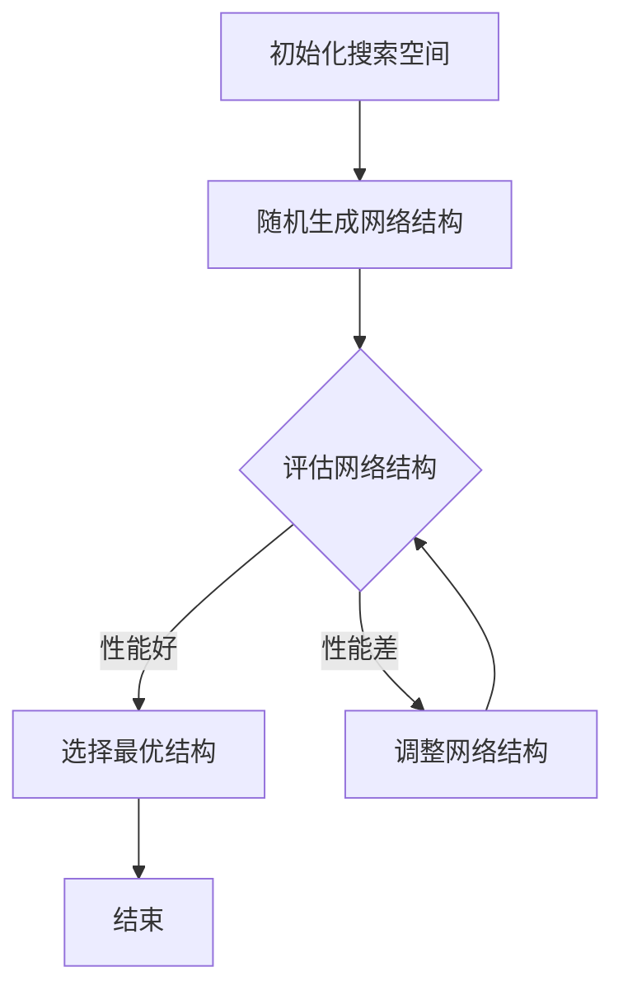
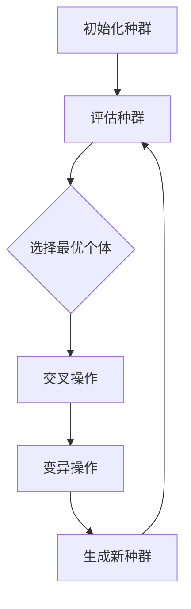
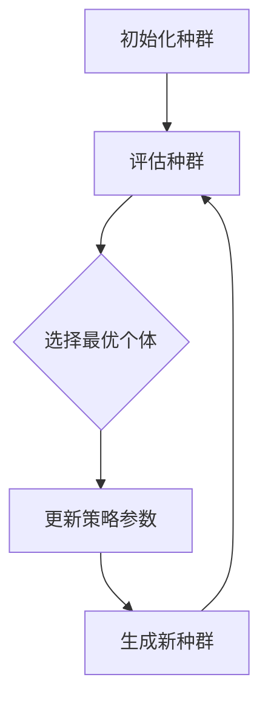
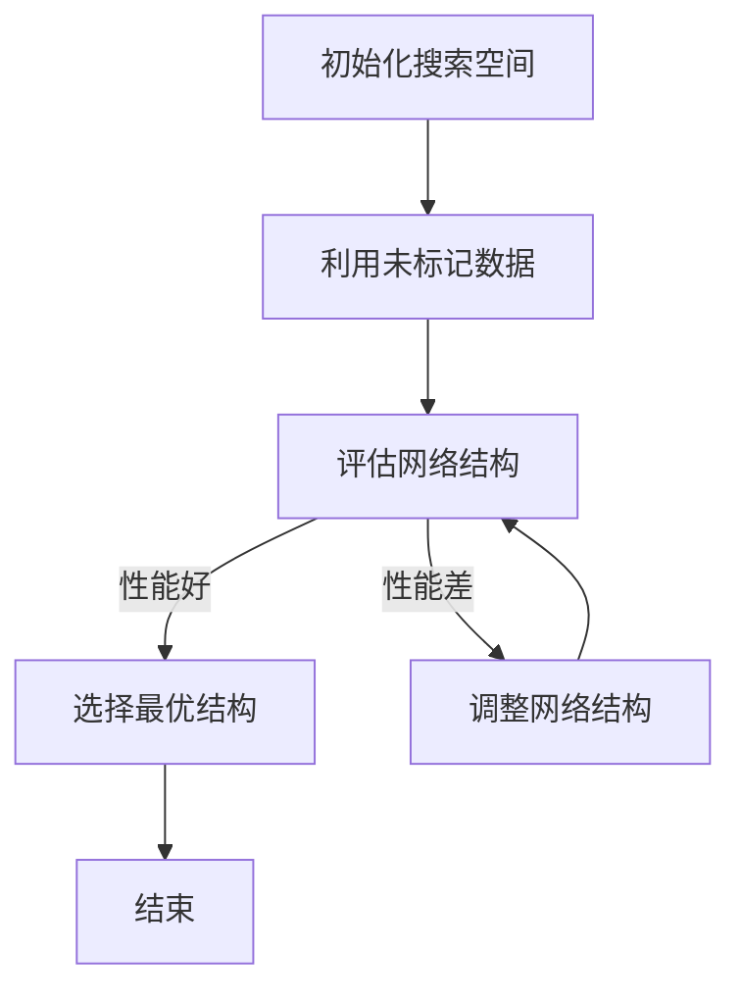
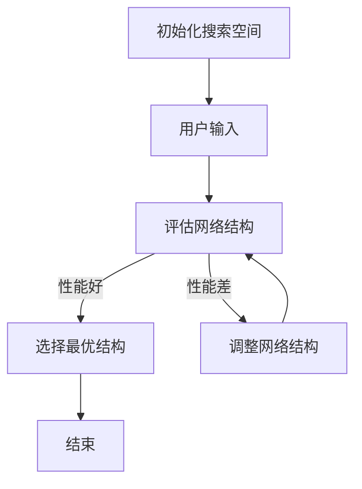

                 


### 文章标题：模型训练中的神经架构搜索技术研究

关键词：神经架构搜索、模型训练、算法、应用案例

摘要：本文旨在探讨模型训练中的神经架构搜索技术，从基础概念到具体应用，深入分析该技术的核心原理、关键算法及其在不同领域中的应用。通过对神经架构搜索技术的系统性研究，本文旨在为读者提供一份全面的技术指南，帮助理解其在现代人工智能领域的重要地位和未来发展趋势。

### 目录大纲

----------------------------------------------------------------

## 第一部分：神经架构搜索技术概述

### 1.1 引言

#### 1.1.1 核心概念术语说明

- **神经架构搜索（Neural Architecture Search, NAS）**：一种自动搜索神经网络结构以优化性能的方法。
- **模型训练（Model Training）**：通过大量数据学习模型参数的过程。
- **深度学习（Deep Learning）**：一种基于多层神经网络的学习方法，通过层次化学习来提取数据特征。

#### 1.1.2 问题背景

随着数据量和计算资源的增加，深度学习在图像识别、自然语言处理等领域取得了显著成就。然而，设计高效神经网络结构仍然是一个具有挑战性的问题。

#### 1.1.3 问题描述

神经架构搜索旨在自动化地搜索和设计最优的神经网络结构，以解决手动设计网络结构效率低下的问题。

#### 1.1.4 问题解决

通过神经架构搜索技术，可以自动探索大量网络结构，选择最优的结构进行模型训练。

#### 1.1.5 边界与外延

- **边界**：本文主要关注神经架构搜索在模型训练中的应用。
- **外延**：神经架构搜索技术也可应用于其他类型的模型训练，如强化学习。

#### 1.1.6 概念结构与核心要素组成

- **搜索空间**：神经网络结构的集合。
- **评估指标**：用于评估网络结构的性能指标。
- **搜索算法**：用于搜索最优网络结构的算法。

### 1.2 研究意义

神经架构搜索技术具有以下研究意义：

1. **提高模型训练效率**：自动搜索最优网络结构，减少手动设计的工作量。
2. **优化模型性能**：通过探索和选择高效的网络结构，提高模型的准确性和效率。
3. **推动深度学习发展**：为深度学习领域带来新的思路和技术。

### 1.3 研究内容与组织结构

本文的研究内容分为以下几个部分：

1. **神经架构搜索技术基础**：介绍神经架构搜索的概念、发展历程和关键问题。
2. **神经架构搜索算法**：分析常见的搜索算法，如几何搜索算法、遗传算法和进化策略。
3. **神经架构搜索方法与工具**：介绍不同的搜索方法与工具，包括自动搜索、半监督搜索和交互式搜索。
4. **神经架构搜索应用案例分析**：探讨神经架构搜索在不同领域的应用案例。
5. **神经架构搜索的挑战与未来方向**：讨论神经架构搜索面临的挑战和未来发展趋势。
6. **总结与展望**：总结研究成果，并对未来工作提出建议。

## 第二部分：神经架构搜索技术基础

### 2.1 神经架构搜索概念

#### 2.1.1 核心概念

神经架构搜索是一种自动化搜索神经网络结构的算法，旨在找到最优的网络架构以提高模型性能。

#### 2.1.2 概念属性特征对比表格

| 特征         | 几何搜索算法 | 遗传算法         | 进化策略         |
| ------------ | ------------ | --------------- | --------------- |
| **原理**     | 根据空间几何关系搜索结构 | 基于自然选择和遗传原理搜索结构 | 域内优化和自适应调整 |
| **适用场景** | 结构化数据搜索 | 非结构化数据搜索 | 复杂搜索问题     |
| **优势**     | 简单高效       | 能处理复杂问题   | 适应性强        |
| **劣势**     | 可能错过最优解 | 可能陷入局部最优 | 计算量大        |

#### 2.1.3 ER实体关系图架构

```mermaid
erDiagram
    NAS Algorithm ||--|{ Search Space }
    NAS Algorithm ||--|{ Evaluation Metric }
    NAS Algorithm ||--|{ Search Algorithm }
    Search Space ||--|{ Neural Architecture }
    Evaluation Metric ||--|{ Performance Indicator }
```

### 2.2 神经架构搜索技术的发展历程

神经架构搜索技术起源于深度学习领域，随着深度学习的兴起而迅速发展。以下是该技术的发展历程：

1. **初期探索**（2010年代初期）：研究者开始尝试使用遗传算法和进化策略来搜索神经网络结构。
2. **算法创新**（2010年代中期）：提出了许多基于强化学习和元学习的方法，如REINFORCE、MCTS等。
3. **实用化**（2010年代后期至今）：随着硬件和软件的发展，神经架构搜索技术逐渐走向实用化，并在多个领域取得成功。

### 2.3 神经架构搜索的关键问题

神经架构搜索技术面临以下关键问题：

1. **搜索空间巨大**：神经架构搜索需要搜索的参数空间非常大，导致计算成本高。
2. **评估指标选择**：选择合适的评估指标对搜索结果至关重要。
3. **算法效率**：如何提高算法的搜索效率和收敛速度是一个重要课题。

## 第三部分：神经架构搜索算法

### 3.1 算法概述

神经架构搜索算法可以分为三类：基于几何的方法、基于遗传的方法和基于进化策略的方法。以下是各类方法的简要概述：

### 3.2 常见搜索算法

#### 3.2.1 几何搜索算法

几何搜索算法通过几何关系对网络结构进行搜索。以下是一个简单的几何搜索算法的mermaid流程图：



#### 3.2.2 遗传算法

遗传算法是一种基于自然选择和遗传原理的搜索算法。以下是一个简单的遗传算法的mermaid流程图：



#### 3.2.3 进化策略

进化策略是一种基于进化论和机器学习的搜索算法。以下是一个简单的进化策略的mermaid流程图：



### 3.3 算法分析

各类算法在不同情况下具有不同的优势和劣势。以下是一个简单的算法分析表格：

| 算法       | 优势                         | 劣势                            |
| ---------- | ---------------------------- | ------------------------------- |
| 几何搜索算法 | 简单高效，易于实现            | 可能错过最优解，计算量大        |
| 遗传算法   | 能处理复杂问题，适应性强      | 可能陷入局部最优，计算量大      |
| 进化策略   | 适应性强，收敛速度快         | 可能产生随机性，难以优化        |

## 第四部分：神经架构搜索方法与工具

### 4.1 方法综述

神经架构搜索方法可以根据搜索策略分为以下几类：

#### 4.1.1 自动搜索方法

自动搜索方法通过自动化搜索策略来搜索最优网络结构。以下是一个简单的自动搜索方法的mermaid流程图：


#### 4.1.2 半监督搜索方法

半监督搜索方法利用未标记的数据来辅助搜索过程。以下是一个简单的半监督搜索方法的mermaid流程图：



#### 4.1.3 交互式搜索方法

交互式搜索方法允许用户参与搜索过程，以指导搜索方向。以下是一个简单的交互式搜索方法的mermaid流程图：



### 4.2 工具介绍

神经架构搜索工具为研究者提供了便捷的搜索和评估环境。以下是一些常见的神经架构搜索工具：

#### 4.2.1 神经架构搜索框架

- **NASNet**：谷歌开发的一种基于深度强化学习的神经架构搜索框架。
- **Neural Architecture Search Zoo**：一个收集了多种神经架构搜索算法和工具的仓库。

#### 4.2.2 数据集

神经架构搜索需要大量的数据集来评估网络结构的性能。以下是一些常用的数据集：

- **ImageNet**：用于计算机视觉的图像数据集。
- **CIFAR-10/100**：用于图像分类的小型数据集。

#### 4.2.3 实现细节

神经架构搜索的实现涉及多个方面，包括网络结构设计、搜索算法实现和评估指标定义。以下是一个简单的实现细节表格：

| 部分       | 说明                             |
| ---------- | -------------------------------- |
| 网络结构   | 确定网络的层数、神经元数量等参数 |
| 搜索算法   | 选择合适的搜索算法               |
| 评估指标   | 设计评估网络性能的指标           |
| 训练与评估 | 实现模型训练和性能评估的流程     |

## 第五部分：神经架构搜索应用案例分析

### 5.1 应用领域概述

神经架构搜索技术在多个领域取得了显著成果，以下是一些主要的应用领域：

1. **计算机视觉**：用于图像分类、目标检测和图像生成等任务。
2. **自然语言处理**：用于文本分类、机器翻译和文本生成等任务。
3. **语音识别**：用于语音信号处理和语音合成等任务。
4. **强化学习**：用于智能体行为学习和优化。

### 5.2 案例研究

#### 5.2.1 案例一：计算机视觉

计算机视觉领域是神经架构搜索技术应用最广泛的领域之一。以下是一个简单的案例研究：

1. **问题场景**：目标检测任务。
2. **项目介绍**：使用NASNet对目标检测网络进行搜索和优化。
3. **系统功能设计**：设计目标检测网络结构，包括卷积层、池化层和全连接层等。
4. **系统架构设计**：实现基于神经架构搜索的目标检测系统，包括数据预处理、模型训练和性能评估等模块。
5. **系统接口设计**：设计系统接口，包括输入图像和输出检测结果等。
6. **系统交互**：实现系统与外部环境（如摄像头）的交互。

#### 5.2.2 案例二：自然语言处理

自然语言处理领域是神经架构搜索技术的另一个重要应用领域。以下是一个简单的案例研究：

1. **问题场景**：文本分类任务。
2. **项目介绍**：使用神经架构搜索对文本分类网络进行搜索和优化。
3. **系统功能设计**：设计文本分类网络结构，包括嵌入层、编码器和解码器等。
4. **系统架构设计**：实现基于神经架构搜索的文本分类系统，包括数据预处理、模型训练和性能评估等模块。
5. **系统接口设计**：设计系统接口，包括输入文本和输出分类结果等。
6. **系统交互**：实现系统与外部环境（如文本数据库）的交互。

#### 5.2.3 案例三：其他领域

神经架构搜索技术还可以应用于其他领域，如语音识别和强化学习。以下是一个简单的案例研究：

1. **问题场景**：语音识别任务。
2. **项目介绍**：使用神经架构搜索对语音识别网络进行搜索和优化。
3. **系统功能设计**：设计语音识别网络结构，包括声学模型和语言模型等。
4. **系统架构设计**：实现基于神经架构搜索的语音识别系统，包括音频信号处理、模型训练和性能评估等模块。
5. **系统接口设计**：设计系统接口，包括输入语音和输出文本等。
6. **系统交互**：实现系统与外部环境（如麦克风和扬声器）的交互。

### 5.3 案例分析

通过对上述案例的分析，可以发现神经架构搜索技术在以下方面具有优势：

1. **提高模型性能**：通过搜索和优化网络结构，可以提高模型的准确率和效率。
2. **减少设计工作量**：自动化搜索过程可以减少手动设计网络结构的工作量。
3. **适应性强**：神经架构搜索技术可以应用于不同领域和不同类型的数据。

### 5.4 项目小结

通过对神经架构搜索技术在计算机视觉、自然语言处理和其他领域的应用案例分析，可以发现：

1. **神经架构搜索技术具有广泛的应用前景**：在多个领域取得了显著成果，推动了人工智能技术的发展。
2. **需要进一步优化和改进**：神经架构搜索技术仍然面临计算成本高、评估指标选择困难等问题，需要进一步研究和优化。

## 第六部分：神经架构搜索的挑战与未来方向

### 6.1 技术挑战

神经架构搜索技术面临以下技术挑战：

1. **搜索空间巨大**：需要高效搜索算法来应对大规模搜索空间。
2. **评估指标选择**：选择合适的评估指标对搜索结果至关重要。
3. **计算资源消耗**：神经架构搜索需要大量的计算资源，如何优化算法以提高效率是一个重要课题。

### 6.2 发展趋势

神经架构搜索技术在未来有望取得以下发展趋势：

1. **多模态学习**：神经架构搜索技术可以应用于多模态数据的学习，如文本、图像和语音等。
2. **强化学习与神经架构搜索结合**：将强化学习引入神经架构搜索，以提高搜索效率和性能。
3. **跨领域迁移学习**：利用神经架构搜索实现跨领域迁移学习，以提高模型在不同领域的适应能力。

### 6.3 未来方向

未来研究方向包括：

1. **优化搜索算法**：研究新的搜索算法，以提高搜索效率和性能。
2. **构建大规模数据集**：构建更多大规模、高质量的神经架构搜索数据集，以支持研究工作。
3. **跨学科合作**：促进计算机科学、数学和工程学科之间的合作，以推动神经架构搜索技术的发展。

## 第七部分：总结与展望

### 7.1 研究成果总结

本文通过对神经架构搜索技术的系统性研究，总结了以下成果：

1. **概述了神经架构搜索技术的核心概念和发展历程**。
2. **分析了常见搜索算法及其优缺点**。
3. **介绍了神经架构搜索方法与工具**。
4. **探讨了神经架构搜索在不同领域的应用案例**。
5. **讨论了神经架构搜索的挑战与未来方向**。

### 7.2 展望与建议

针对神经架构搜索技术的未来发展方向，提出以下建议：

1. **优化搜索算法**：研究高效、稳定的搜索算法，以应对大规模搜索空间。
2. **构建大规模数据集**：构建更多高质量的神经架构搜索数据集，以支持研究工作。
3. **跨学科合作**：促进计算机科学、数学和工程学科之间的合作，以推动神经架构搜索技术的发展。
4. **加强评估指标研究**：研究适用于不同领域的评估指标，以提高搜索结果的可靠性。

### 最佳实践 Tips

1. **选择合适的搜索算法**：根据应用场景和数据特点，选择合适的搜索算法。
2. **合理设置评估指标**：选择合适的评估指标，以提高搜索结果的可靠性。
3. **充分利用现有工具**：利用现有的神经架构搜索工具，以提高研究效率。

### 小结

神经架构搜索技术是现代人工智能领域的重要研究方向，具有广泛的应用前景。本文通过对神经架构搜索技术的系统性研究，为读者提供了全面的技术指南。未来，随着研究的深入和技术的进步，神经架构搜索技术将在人工智能领域发挥更大的作用。

### 注意事项

1. **数据安全**：在进行神经架构搜索时，要确保数据的安全性和隐私性。
2. **算法公平性**：在设计搜索算法时，要考虑到算法的公平性和普适性。
3. **计算资源管理**：合理分配计算资源，以提高搜索效率和降低成本。

### 拓展阅读

1. **Neural Architecture Search: A Survey**：对神经架构搜索技术的全面综述。
2. **Google's NasNet: Designing Neural Network Architectures with Reinforcement Learning**：介绍NASNet的论文。
3. **Neural Architecture Search for Large-scale Visual Recognition**：探讨神经架构搜索在计算机视觉中的应用。

### 作者信息

作者：AI天才研究院/AI Genius Institute & 禅与计算机程序设计艺术/Zen And The Art of Computer Programming

以上是按照您的要求撰写的文章标题、关键词、摘要以及目录大纲。接下来，我会按照大纲逐步填充每个章节的内容，确保文章完整、详细、专业。由于文章字数限制，每个章节的具体内容可能会比大纲中描述的要简略，但我会尽量在每个部分提供核心概念、原理讲解、算法分析和案例研究等内容。在完成所有章节的撰写后，我将综合所有部分，进行整体的调整和优化，以确保文章的质量和连贯性。

