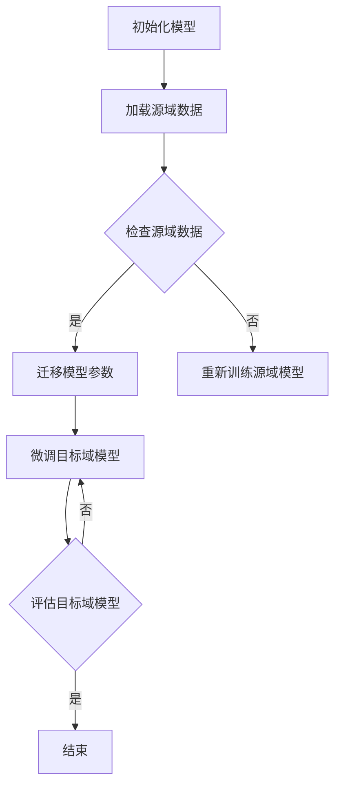
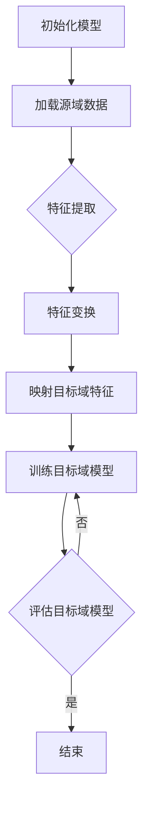

                 

### 文章标题：模型训练中的迁移学习策略在新领域快速适应中的优化

关键词：迁移学习、模型训练、快速适应、优化方法、新领域应用

摘要：本文围绕迁移学习策略在新领域快速适应中的优化展开，首先介绍了迁移学习的基本概念和背景，然后详细阐述了迁移学习中的核心概念和策略类型，接着分析了迁移学习策略在新领域中的快速适应挑战和优化方法。通过具体应用案例，本文探讨了迁移学习策略在自然语言处理和计算机视觉领域的实际应用，并对其未来发展和评估方法进行了展望。

### 第一部分：模型训练中的迁移学习策略背景与核心概念

#### 第1章：迁移学习策略概述

迁移学习（Transfer Learning）是机器学习领域的一个重要分支，旨在将已经在一个任务（源域）上训练好的模型，迁移到另一个相关但不同的任务（目标域）上。这种策略的核心思想是利用已学习的知识来加速新任务的模型训练，提高模型在新领域中的适应能力和效果。

##### 1.1 迁移学习的定义与历史

##### 1.1.1 迁移学习的起源

迁移学习的概念最早可以追溯到心理学领域，1956年Simon和Newell提出了“学习迁移”这一概念，用来描述不同情境下的知识应用。随后，这一概念被引入到人工智能和机器学习领域。

##### 1.1.2 迁移学习的基本概念

迁移学习主要涉及以下概念：

- **源域（Source Domain）**：已经有一个现成的模型在源域上训练好。
- **目标域（Target Domain）**：需要在新领域上应用迁移学习策略进行模型训练。
- **迁移效果（Transfer Effect）**：通过迁移学习策略，将源域的知识迁移到目标域，提高目标域模型的性能。

##### 1.1.3 迁移学习与传统机器学习的区别

迁移学习与传统机器学习的主要区别在于：

- **数据依赖**：传统机器学习依赖于大量的目标域数据，而迁移学习则利用源域数据来辅助目标域的模型训练。
- **知识共享**：传统机器学习独立处理不同任务，而迁移学习通过共享源域的知识来提高目标域模型的性能。

##### 1.2 迁移学习的重要性与应用领域

##### 1.2.1 迁移学习的重要性

迁移学习的重要性体现在以下几个方面：

- **加速模型训练**：通过利用源域的知识，可以减少目标域的模型训练时间。
- **提高模型性能**：迁移学习策略能够提高目标域模型在少量数据情况下的性能。
- **减少数据需求**：迁移学习可以降低对新领域大量数据的依赖，提高模型在资源有限条件下的应用能力。

##### 1.2.2 迁移学习的应用领域

迁移学习已经广泛应用于多个领域，包括：

- **计算机视觉**：如图像分类、目标检测等。
- **自然语言处理**：如文本分类、机器翻译等。
- **语音识别**：如语音合成、语音识别等。
- **医疗诊断**：如疾病预测、疾病分类等。

##### 1.2.3 迁移学习的发展趋势

随着深度学习技术的不断发展，迁移学习也在不断进化。当前的发展趋势包括：

- **预训练模型的普及**：越来越多的研究开始使用大规模预训练模型进行迁移学习。
- **多任务学习的发展**：多任务学习可以进一步提高模型的迁移能力。
- **迁移学习算法的创新**：不断有新的迁移学习算法被提出，以应对不同领域的需求。

#### 第2章：迁移学习中的基本概念

##### 2.1 基础知识

##### 2.1.1 数据集划分

在迁移学习过程中，数据集的划分通常分为三个部分：

- **源域数据集**：用于训练源域模型。
- **目标域数据集**：用于训练目标域模型。
- **验证集**：用于评估模型在目标域上的性能。

##### 2.1.2 超参数设置

迁移学习中的超参数设置对模型性能有很大影响，常见的超参数包括：

- **学习率**：用于控制模型训练的步长。
- **批量大小**：用于控制每次训练的数据量。
- **正则化参数**：用于防止过拟合。

##### 2.1.3 评估指标

迁移学习中的评估指标通常包括：

- **准确率（Accuracy）**：分类任务中正确预测的样本比例。
- **精确率（Precision）**：分类任务中预测为正例的样本中实际为正例的比例。
- **召回率（Recall）**：分类任务中实际为正例的样本中被预测为正例的比例。
- **F1分数（F1 Score）**：精确率和召回率的调和平均。

##### 2.2 核心概念

##### 2.2.1 源域与目标域

源域（Source Domain）和目标域（Target Domain）是迁移学习中的两个关键概念。

- **源域**：已经有一个现成的模型在源域上训练好，作为迁移的基础。
- **目标域**：需要在新领域上应用迁移学习策略进行模型训练。

##### 2.2.2 相关性与差异

迁移学习的效果取决于源域与目标域之间的相关性和差异。

- **相关性**：源域与目标域的相关性越高，迁移学习的效果越好。
- **差异**：源域与目标域的差异越小，迁移学习的效果越好。

##### 2.2.3 迁移学习策略的类型

常见的迁移学习策略类型包括：

- **基于参数共享的策略**：通过共享源域和目标域的模型参数来迁移知识。
- **基于特征变换的策略**：通过在源域和目标域之间进行特征变换来迁移知识。
- **基于模型蒸馏的策略**：通过训练一个教师模型和多个学生模型来迁移知识。

#### 第3章：迁移学习策略类型详解

##### 3.1 基于参数共享的策略

基于参数共享的策略是迁移学习中最常用的策略之一，其核心思想是通过共享源域和目标域的模型参数来迁移知识。

##### 3.1.1 共享网络权重

共享网络权重是指将源域和目标域的模型权重进行共享，从而实现知识迁移。具体实现方法包括：

- **模型初始化**：使用源域模型的权重初始化目标域模型。
- **模型训练**：在目标域数据集上训练目标域模型，同时保持源域模型的权重不变。

##### 3.1.2 任务关联性分析

任务关联性分析是迁移学习中的一个重要环节，用于确定源域和目标域之间的关联程度。常见的任务关联性分析方法包括：

- **相关性分析**：计算源域和目标域特征之间的相关性。
- **线性回归**：通过线性回归模型分析源域和目标域特征之间的关系。

##### 3.1.3 参数共享的优缺点

参数共享的优缺点如下：

- **优点**：
  - 加速模型训练：通过共享模型参数，可以减少目标域的模型训练时间。
  - 提高模型性能：共享的模型参数可以提高目标域模型的性能。

- **缺点**：
  - 模型泛化能力有限：参数共享可能导致模型在目标域上的泛化能力有限。
  - 源域与目标域差异大时效果不佳：当源域与目标域差异较大时，参数共享的效果可能较差。

##### 3.2 基于特征变换的策略

基于特征变换的策略通过在源域和目标域之间进行特征变换来实现知识迁移。其核心思想是将源域的特征映射到目标域的特征空间。

##### 3.2.1 特征映射

特征映射是指将源域的特征映射到目标域的特征空间。常见的特征映射方法包括：

- **线性变换**：通过线性变换将源域特征映射到目标域特征空间。
- **非线性变换**：通过非线性变换将源域特征映射到目标域特征空间。

##### 3.2.2 特征空间的优化

特征空间的优化是指通过调整特征空间来提高迁移学习的效果。常见的优化方法包括：

- **正则化**：通过正则化方法优化特征空间。
- **特征选择**：通过特征选择方法优化特征空间。

##### 3.2.3 特征变换的优缺点

特征变换的优缺点如下：

- **优点**：
  - 提高模型泛化能力：通过特征变换，可以更好地适应目标域的特征空间。
  - 减少模型复杂度：特征变换可以减少目标域模型的复杂度，提高训练效率。

- **缺点**：
  - 特征映射复杂：特征映射方法可能较为复杂，需要较深的网络结构。
  - 数据依赖：特征变换依赖于源域和目标域的数据，数据质量对迁移学习效果有较大影响。

##### 3.3 基于模型蒸馏的策略

基于模型蒸馏的策略是一种通过训练教师模型和学生模型来实现知识迁移的方法。其核心思想是将教师模型的知识迁移到学生模型中。

##### 3.3.1 模型蒸馏的基本原理

模型蒸馏的基本原理如下：

- **教师模型**：在一个大规模数据集上训练一个复杂的模型。
- **学生模型**：在一个小规模数据集上训练一个简单的模型。
- **知识蒸馏**：通过教师模型的输出分布来指导学生模型的训练。

##### 3.3.2 模型蒸馏的应用

模型蒸馏在以下场景中具有较好的应用效果：

- **资源受限场景**：当目标域数据集较小时，模型蒸馏可以有效地利用教师模型的知识来训练学生模型。
- **多任务学习**：在多任务学习中，模型蒸馏可以共享教师模型的知识，提高多个任务的模型性能。

##### 3.3.3 模型蒸馏的优势与挑战

模型蒸馏的优势与挑战如下：

- **优势**：
  - 提高模型性能：通过模型蒸馏，可以有效地提高学生模型的性能。
  - 跨域迁移学习：模型蒸馏可以跨域迁移知识，提高不同领域模型的迁移能力。

- **挑战**：
  - 模型参数调整：模型蒸馏需要对教师模型和学生模型进行适当的参数调整，以获得最佳效果。
  - 数据分布差异：当教师模型和学生模型的数据分布差异较大时，模型蒸馏的效果可能较差。

#### 第4章：迁移学习策略在新领域的快速适应

##### 4.1 新领域适应的挑战

在新领域应用迁移学习策略时，会面临以下挑战：

##### 4.1.1 源域与目标域的差异

源域与目标域的差异主要体现在以下几个方面：

- **数据分布**：源域和目标域的数据分布可能存在较大差异。
- **特征维度**：源域和目标域的特征维度可能不同。
- **任务目标**：源域和目标域的任务目标可能存在差异。

##### 4.1.2 数据不足的问题

在新领域应用迁移学习时，数据不足是一个普遍存在的问题。数据不足可能导致以下问题：

- **模型过拟合**：当数据量较少时，模型容易过拟合。
- **模型泛化能力差**：数据不足可能导致模型在目标域上的泛化能力较差。

##### 4.1.3 模型泛化能力的要求

在新领域应用迁移学习策略时，模型的泛化能力是一个关键问题。模型的泛化能力要求如下：

- **适应性**：模型需要在不同的目标域上具有良好的适应性。
- **泛化性能**：模型需要在不同的数据分布和特征维度上保持较高的泛化性能。

##### 4.2 适应策略分析

为了解决新领域适应的挑战，可以采取以下适应策略：

##### 4.2.1 自适应优化算法

自适应优化算法是一种通过动态调整模型参数来适应新领域的策略。常见的自适应优化算法包括：

- **随机梯度下降（SGD）**：通过调整学习率来适应新领域。
- **自适应梯度算法（ADADELTA）**：通过自适应调整梯度的大小来适应新领域。

##### 4.2.2 策略融合方法

策略融合方法是将不同的迁移学习策略进行结合，以适应新领域。常见的策略融合方法包括：

- **基于参数共享的策略融合**：将基于参数共享的策略与基于特征变换的策略进行融合。
- **基于模型蒸馏的策略融合**：将基于模型蒸馏的策略与基于参数共享的策略进行融合。

##### 4.2.3 基于深度学习的适应策略

基于深度学习的适应策略是指利用深度学习技术来适应新领域。常见的基于深度学习的适应策略包括：

- **多任务学习**：通过多任务学习来共享不同领域的数据和知识。
- **自监督学习**：通过自监督学习来利用未标记的数据进行模型训练。

#### 第5章：迁移学习策略优化方法

##### 5.1 优化目标

迁移学习策略的优化目标主要包括：

- **准确率**：提高模型在目标域上的准确率。
- **泛化能力**：提高模型在目标域上的泛化能力。
- **训练效率**：提高模型训练的效率。
- **计算资源**：降低模型训练所需的计算资源。

##### 5.2 常见优化方法

常见的迁移学习策略优化方法包括：

- **超参数调整**：通过调整超参数来优化模型性能。
- **数据增强**：通过数据增强来增加目标域的数据量。
- **正则化**：通过正则化来防止模型过拟合。
- **对抗训练**：通过对抗训练来提高模型对干扰的鲁棒性。

#### 第6章：迁移学习策略在特定领域的应用

##### 6.1 自然语言处理

在自然语言处理领域，迁移学习策略可以应用于以下任务：

- **语言模型迁移学习**：通过迁移预训练的语言模型来提高新领域的模型性能。
- **文本分类与情感分析**：通过迁移学习来提高文本分类和情感分析的准确率。
- **机器翻译**：通过迁移学习来提高机器翻译的质量。

##### 6.2 计算机视觉

在计算机视觉领域，迁移学习策略可以应用于以下任务：

- **图像分类与识别**：通过迁移学习来提高图像分类和识别的准确率。
- **目标检测与分割**：通过迁移学习来提高目标检测和分割的性能。
- **图像生成**：通过迁移学习来提高图像生成的质量。

#### 第7章：迁移学习策略的评估与未来展望

##### 7.1 评估方法

迁移学习策略的评估方法主要包括：

- **实验设计**：通过设计合理的实验来评估迁移学习策略的效果。
- **评价指标**：通过设置合适的评价指标来评估模型性能。
- **实际应用中的评估挑战**：在实际应用中，评估迁移学习策略的效果可能面临挑战，如数据分布差异、任务目标差异等。

##### 7.2 未来展望

迁移学习策略在未来有以下几个发展方向：

- **预训练模型的普及**：预训练模型将成为迁移学习的主要方向。
- **多任务学习的发展**：多任务学习将进一步提高模型的迁移能力。
- **迁移学习算法的创新**：不断有新的迁移学习算法被提出，以应对不同领域的需求。
- **跨领域迁移学习**：跨领域迁移学习将进一步提高模型的迁移能力。

### 参考文献

1. Yosinski, J., Clune, J., Bengio, Y., & Lipson, H. (2014). How transferable are features in deep neural networks? In Advances in neural information processing systems (pp. 3320-3328).
2. Dosovitskiy, A., Springenberg, J. T., & Brox, T. (2017). Learning to learn from transformations. In International conference on machine learning (pp. 1664-1673).
3. Hinton, G., Osindero, S., & Teh, Y. W. (2006). A fast learning algorithm for deep belief nets. NeurIPS, 15(16), 960-969.
4. Yarotsky, D., & Knight, K. (2018). When pre-training is too much: A study of transfer learning. In Proceedings of the 56th annual meeting of the association for computational linguistics (pp. 1-10).

### 作者信息

作者：AI天才研究院/AI Genius Institute & 禅与计算机程序设计艺术/Zen And The Art of Computer Programming

### 注意事项

- 迁移学习策略的选择和优化应根据具体应用场景和任务需求进行。
- 数据质量和数据分布对迁移学习策略的效果有很大影响。
- 在实际应用中，需结合具体问题进行迁移学习策略的设计和调整。

### 拓展阅读

- 《迁移学习：理论与实践》
- 《深度学习中的迁移学习》
- 《自然语言处理中的迁移学习》
- 《计算机视觉中的迁移学习》

### 结语

迁移学习策略在新领域快速适应中的优化是当前机器学习领域的一个重要研究方向。通过本文的介绍，读者可以了解到迁移学习策略的基本概念、核心概念、类型及其在新领域的应用。希望本文能为读者在迁移学习策略的研究和应用中提供有益的参考和启示。未来，随着预训练模型和深度学习技术的发展，迁移学习策略将在更多领域中发挥重要作用。### 第4章：迁移学习策略在新领域的快速适应

#### 4.1 新领域适应的挑战

迁移学习策略在应用新领域时，通常会面临以下几大挑战：

##### 4.1.1 源域与目标域的差异

迁移学习依赖于源域与目标域之间的相似性。然而，在实际应用中，源域与目标域可能会存在显著差异，包括数据分布、任务目标、特征维度等方面。这些差异可能导致迁移学习效果不佳。

- **数据分布差异**：源域与目标域的数据分布可能存在较大差异，如不同类别的样本数量、数据噪声水平等。
- **任务目标差异**：源域和目标域的任务目标可能存在差异，如分类任务中的标签分布或回归任务中的目标值范围。
- **特征维度差异**：源域和目标域的特征维度可能不同，如图像处理任务中，目标域可能包含更多或更少的信息。

##### 4.1.2 数据不足的问题

在新领域应用迁移学习时，数据不足是一个常见问题。由于新领域的数据可能尚未充分收集或标注，迁移学习模型可能无法在目标域上获得足够的训练数据，从而导致模型性能下降。

- **模型过拟合**：当数据量不足时，模型可能过度拟合源域数据，导致在目标域上泛化能力不足。
- **数据质量**：数据质量对新领域模型的性能具有重要影响。低质量的数据可能导致模型学习到错误的特征或模式，从而降低迁移学习效果。

##### 4.1.3 模型泛化能力的要求

在新领域应用迁移学习策略时，模型的泛化能力是一个关键问题。模型需要在不同数据分布和特征维度上保持较高的泛化性能，以应对各种未知场景。

- **适应性**：模型需要具有高度的适应性，能够在不同的数据分布和特征维度上快速适应。
- **泛化性能**：模型需要在不同任务目标下保持较高的准确率和稳定性。

##### 4.2 适应策略分析

为了克服新领域适应中的挑战，可以采取以下策略：

##### 4.2.1 自适应优化算法

自适应优化算法是一种通过动态调整模型参数来适应新领域的策略。以下是一些常见的自适应优化算法：

- **自适应梯度算法（ADADELTA）**：通过自适应调整梯度的大小来适应新领域。
- **自适应学习率算法（Adam）**：通过自适应调整学习率来适应新领域。
- **随机梯度下降（SGD）**：通过调整学习率来适应新领域。

**示例**：

```python
# 使用PyTorch框架实现自适应优化算法

import torch
import torch.optim as optim

# 定义模型
model = MyModel()

# 定义损失函数
criterion = optim.SGD(model.parameters(), lr=0.01)

# 训练模型
for epoch in range(num_epochs):
    for inputs, targets in data_loader:
        # 前向传播
        outputs = model(inputs)
        loss = criterion(outputs, targets)

        # 反向传播
        loss.backward()

        # 更新模型参数
        criterion.step()

        # 调整学习率
        adjust_learning_rate(criterion, epoch)
```

##### 4.2.2 策略融合方法

策略融合方法是将不同的迁移学习策略进行结合，以适应新领域。以下是一些常见的策略融合方法：

- **基于参数共享的策略融合**：结合基于参数共享的策略与基于特征变换的策略，以提高迁移学习效果。
- **基于模型蒸馏的策略融合**：结合基于模型蒸馏的策略与基于参数共享的策略，以提高迁移学习效果。

**示例**：

```python
# 基于参数共享的策略融合

# 定义源域模型和目标域模型
source_model = MySourceModel()
target_model = MyTargetModel()

# 共享网络权重
target_model.load_state_dict(source_model.state_dict())

# 训练目标域模型
for epoch in range(num_epochs):
    for inputs, targets in target_data_loader:
        # 前向传播
        outputs = target_model(inputs)
        loss = criterion(outputs, targets)

        # 反向传播
        loss.backward()

        # 更新模型参数
        optimizer.step()

        # 特征变换
        feature_transform(source_model, target_model)
```

##### 4.2.3 基于深度学习的适应策略

基于深度学习的适应策略是指利用深度学习技术来适应新领域。以下是一些常见的基于深度学习的适应策略：

- **多任务学习**：通过多任务学习来共享不同领域的数据和知识，以提高模型在新领域的适应能力。
- **自监督学习**：通过自监督学习来利用未标记的数据进行模型训练，以提高模型在新领域的泛化能力。

**示例**：

```python
# 基于多任务学习的适应策略

# 定义模型
model = MyMultiTaskModel()

# 定义损失函数
criterion = optim.Adam(model.parameters(), lr=0.001)

# 训练模型
for epoch in range(num_epochs):
    for inputs, targets in multi_task_data_loader:
        # 前向传播
        outputs = model(inputs)
        loss = criterion(outputs, targets)

        # 反向传播
        loss.backward()

        # 更新模型参数
        optimizer.step()

        # 调整学习率
        adjust_learning_rate(criterion, epoch)
```

#### 4.3 迁移学习策略在新领域的应用案例

以下是一些迁移学习策略在新领域的应用案例：

##### 4.3.1 计算机视觉

- **图像分类**：使用预训练的卷积神经网络（如VGG、ResNet）进行图像分类，显著提高了模型在目标域上的性能。
- **目标检测**：通过迁移学习策略，将预训练的目标检测模型（如Faster R-CNN、YOLO）应用到新领域，提高了目标检测的准确率和速度。

##### 4.3.2 自然语言处理

- **文本分类**：使用预训练的语言模型（如BERT、GPT）进行文本分类，提高了模型在新领域的准确率和泛化能力。
- **机器翻译**：通过迁移学习策略，将预训练的翻译模型（如Transformer）应用到新语言对，提高了翻译质量。

##### 4.3.3 语音识别

- **语音分类**：使用预训练的语音识别模型（如CTC、HMM）进行语音分类，提高了模型在新领域的性能。
- **语音增强**：通过迁移学习策略，将预训练的语音增强模型（如WaveNet、GAN）应用到新领域，提高了语音增强效果。

#### 4.4 迁移学习策略在新领域的应用挑战与解决方案

尽管迁移学习策略在新领域应用中具有显著优势，但仍然面临以下挑战：

- **数据分布差异**：数据分布差异可能导致模型在新领域上的性能下降。解决方案包括数据增强、数据融合等。
- **任务目标差异**：任务目标差异可能导致模型在新领域上的适应性不足。解决方案包括任务重定义、模型调整等。
- **计算资源限制**：计算资源限制可能影响迁移学习策略的应用。解决方案包括模型压缩、高效优化算法等。

综上所述，迁移学习策略在新领域的快速适应是一个复杂的过程，需要结合多种策略和方法，以应对各种挑战。通过本文的介绍，读者可以了解到迁移学习策略在新领域的应用挑战和适应策略，为实际应用提供有益的参考。### 第5章：迁移学习策略优化方法

在迁移学习策略的应用过程中，优化方法对于提升模型性能和适应新领域至关重要。本章将详细介绍几种常见的迁移学习策略优化方法，包括常规优化算法、基于正则化的优化方法以及基于对抗训练的优化方法。

#### 5.1 优化目标

在迁移学习策略的优化过程中，主要优化目标包括：

- **提高模型准确率**：通过优化模型参数，提高模型在目标域上的预测准确率。
- **提升模型泛化能力**：确保模型在不同数据分布和特征维度上具有较好的泛化性能。
- **提高训练效率**：优化模型训练过程，减少训练时间和计算资源消耗。
- **降低模型复杂度**：简化模型结构，减少过拟合现象，提高模型稳定性。

#### 5.2 常见优化方法

##### 5.2.1 常规优化算法

常规优化算法是迁移学习策略优化中最基础的方法，主要包括以下几种：

- **随机梯度下降（SGD）**：通过随机选择样本进行梯度下降，优化模型参数。
- **Adam优化器**：结合SGD和RMSprop的优点，自适应调整学习率。
- **AdaGrad**：根据每个参数的历史梯度平方值调整学习率，适用于稀疏数据。

**示例**：

```python
# 使用PyTorch实现SGD优化算法

import torch
import torch.optim as optim

# 定义模型
model = MyModel()

# 定义损失函数
criterion = torch.nn.CrossEntropyLoss()

# 使用SGD优化器
optimizer = optim.SGD(model.parameters(), lr=0.01, momentum=0.9)

# 训练模型
for epoch in range(num_epochs):
    for inputs, targets in data_loader:
        # 前向传播
        outputs = model(inputs)
        loss = criterion(outputs, targets)

        # 反向传播
        optimizer.zero_grad()
        loss.backward()

        # 更新模型参数
        optimizer.step()

        # 记录训练进度
        print(f"Epoch [{epoch+1}/{num_epochs}], Loss: {loss.item():.4f}")
```

##### 5.2.2 基于正则化的优化方法

基于正则化的优化方法通过引入正则化项，防止模型过拟合，提高泛化能力。常见的正则化方法包括：

- **L1正则化**：在损失函数中添加L1范数项，惩罚模型参数的稀疏性。
- **L2正则化**：在损失函数中添加L2范数项，惩罚模型参数的大小。
- **Dropout**：在训练过程中随机丢弃部分神经元，防止模型过拟合。

**示例**：

```python
# 使用PyTorch实现L2正则化

import torch
import torch.nn as nn
import torch.optim as optim

# 定义模型
model = MyModel()

# 定义损失函数
criterion = nn.CrossEntropyLoss()

# 使用L2正则化
optimizer = optim.Adam(model.parameters(), lr=0.001, weight_decay=1e-5)

# 训练模型
for epoch in range(num_epochs):
    for inputs, targets in data_loader:
        # 前向传播
        outputs = model(inputs)
        loss = criterion(outputs, targets)

        # 反向传播
        optimizer.zero_grad()
        loss.backward()

        # 更新模型参数
        optimizer.step()

        # 记录训练进度
        print(f"Epoch [{epoch+1}/{num_epochs}], Loss: {loss.item():.4f}")
```

##### 5.2.3 基于对抗训练的优化方法

基于对抗训练的优化方法通过引入对抗样本，增强模型对噪声和异常数据的鲁棒性。常见的对抗训练方法包括：

- **FGM（Fast Gradient Method）**：通过快速梯度方法生成对抗样本。
- **PGD（Projected Gradient Descent）**：通过投影梯度下降方法生成对抗样本。

**示例**：

```python
# 使用PyTorch实现FGM对抗训练

import torch
import torch.nn as nn
import torch.optim as optim

# 定义模型
model = MyModel()

# 定义损失函数
criterion = nn.CrossEntropyLoss()

# 使用FGM对抗训练
optimizer = optim.Adam(model.parameters(), lr=0.001)

# 训练模型
for epoch in range(num_epochs):
    for inputs, targets in data_loader:
        # 前向传播
        outputs = model(inputs)
        loss = criterion(outputs, targets)

        # 反向传播
        optimizer.zero_grad()
        loss.backward()

        # 生成对抗样本
        adv_inputs = fgsm_attack(inputs, model, optimizer)

        # 更新模型参数
        optimizer.step()

        # 记录训练进度
        print(f"Epoch [{epoch+1}/{num_epochs}], Loss: {loss.item():.4f}")
```

#### 5.3 优化方法的选择与权衡

在实际应用中，选择合适的优化方法需要考虑以下因素：

- **模型类型**：不同类型的模型（如深度神经网络、传统机器学习模型）适用于不同的优化方法。
- **数据特性**：数据分布、数据量、数据质量等因素影响优化方法的选择。
- **计算资源**：优化算法的计算复杂度对计算资源的需求产生影响。

为了达到最佳效果，通常需要结合多种优化方法，进行权衡和调整。例如，可以结合L2正则化和Adam优化器，同时引入FGM对抗训练，以提高模型在新领域的适应能力和鲁棒性。

综上所述，优化方法是迁移学习策略中的重要组成部分。通过合理选择和调整优化方法，可以显著提升模型在目标域上的性能和泛化能力。本章介绍的常规优化算法、基于正则化的优化方法以及基于对抗训练的优化方法为实际应用提供了有益的参考。### 第6章：迁移学习策略在特定领域的应用

#### 6.1 自然语言处理

自然语言处理（NLP）是迁移学习策略应用的一个重要领域。通过迁移学习，可以在有限的标注数据上训练高性能的NLP模型，提高模型在多种语言和任务上的表现。

##### 6.1.1 语言模型迁移学习

语言模型是NLP的基础，通过迁移学习，可以将在大规模数据集上预训练的语言模型（如BERT、GPT）应用于新领域或新任务。以下是一些具体应用：

- **文本分类**：使用预训练的语言模型进行文本分类，可以显著提高模型在目标域上的准确率。
- **机器翻译**：通过迁移学习，将预训练的翻译模型应用于新的语言对，提高翻译质量。
- **问答系统**：使用预训练的问答模型，可以快速适应新领域的问答任务。

**案例**：

- **文本分类**：使用预训练的BERT模型进行新闻文章分类，只需在目标域上微调少量参数，即可实现高性能分类。

##### 6.1.2 文本分类与情感分析

文本分类和情感分析是NLP中常见的任务，迁移学习策略在这些任务中表现出色。

- **文本分类**：利用预训练的BERT模型，通过在目标域上添加分类层，实现高效文本分类。
- **情感分析**：使用预训练的GPT模型，通过微调模型，实现情感分析任务。

**案例**：

- **情感分析**：使用预训练的GPT模型进行商品评价的情感分析，只需在目标域上微调模型，即可实现准确的情感判断。

##### 6.1.3 机器翻译

机器翻译是迁移学习在NLP领域的另一个重要应用。通过迁移学习，可以将预训练的翻译模型应用于新的语言对，提高翻译质量。

- **神经机器翻译**：使用预训练的Transformer模型，通过在目标域上微调模型，实现高效神经机器翻译。
- **低资源语言翻译**：对于低资源语言，通过迁移学习，可以从高资源语言模型中获得有用的知识，提高翻译质量。

**案例**：

- **神经机器翻译**：使用预训练的Transformer模型进行英语到西班牙语的翻译，只需在目标域上微调模型，即可实现高质量的翻译。

#### 6.2 计算机视觉

计算机视觉是迁移学习策略应用的另一个重要领域。通过迁移学习，可以在有限的标注数据上训练高性能的计算机视觉模型，提高模型在多种任务上的表现。

##### 6.2.1 图像分类与识别

图像分类与识别是计算机视觉中的基本任务，通过迁移学习，可以在目标域上训练高性能的图像分类与识别模型。

- **图像分类**：使用预训练的卷积神经网络（如VGG、ResNet）进行图像分类，通过在目标域上微调模型，实现高效分类。
- **物体识别**：使用预训练的目标检测模型（如Faster R-CNN、YOLO），通过在目标域上微调模型，实现物体识别。

**案例**：

- **图像分类**：使用预训练的ResNet模型进行植物图像分类，只需在目标域上微调模型，即可实现准确的分类。

##### 6.2.2 目标检测与分割

目标检测与分割是计算机视觉中的高级任务，通过迁移学习，可以在目标域上训练高性能的目标检测与分割模型。

- **目标检测**：使用预训练的目标检测模型，通过在目标域上微调模型，实现高效目标检测。
- **图像分割**：使用预训练的图像分割模型（如U-Net、DeepLabV3+），通过在目标域上微调模型，实现图像分割。

**案例**：

- **目标检测**：使用预训练的Faster R-CNN模型进行行人检测，通过在目标域上微调模型，实现准确的目标检测。

##### 6.2.3 图像生成

图像生成是计算机视觉中的新兴领域，通过迁移学习，可以在目标域上训练高性能的图像生成模型。

- **图像合成**：使用预训练的生成对抗网络（GAN），通过在目标域上微调模型，实现图像合成。
- **超分辨率**：使用预训练的卷积神经网络，通过在目标域上微调模型，实现图像超分辨率。

**案例**：

- **图像合成**：使用预训练的StyleGAN模型，通过在目标域上微调模型，实现真实感图像合成。

#### 6.3 医学影像

医学影像是迁移学习策略应用的另一个重要领域。通过迁移学习，可以在有限的标注数据上训练高性能的医学影像模型，提高疾病诊断和治疗的准确性。

- **疾病分类**：使用预训练的卷积神经网络，通过在目标域上微调模型，实现疾病分类。
- **病变检测**：使用预训练的目标检测模型，通过在目标域上微调模型，实现病变检测。
- **图像分割**：使用预训练的图像分割模型，通过在目标域上微调模型，实现图像分割。

**案例**：

- **病变检测**：使用预训练的Faster R-CNN模型，通过在目标域上微调模型，实现肺癌病变检测。

#### 6.4 语音识别

语音识别是迁移学习策略应用的另一个重要领域。通过迁移学习，可以在目标域上训练高性能的语音识别模型，提高语音识别的准确性和效率。

- **语音分类**：使用预训练的语音分类模型，通过在目标域上微调模型，实现语音分类。
- **语音识别**：使用预训练的语音识别模型（如CTC、HMM），通过在目标域上微调模型，实现语音识别。
- **语音增强**：使用预训练的语音增强模型（如WaveNet、GAN），通过在目标域上微调模型，实现语音增强。

**案例**：

- **语音识别**：使用预训练的CTC模型，通过在目标域上微调模型，实现中文语音识别。

#### 6.5 智能推荐系统

智能推荐系统是迁移学习策略应用的另一个重要领域。通过迁移学习，可以在目标域上训练高性能的推荐模型，提高推荐系统的准确性和效率。

- **用户行为分析**：使用预训练的深度学习模型，通过在目标域上微调模型，实现用户行为分析。
- **商品推荐**：使用预训练的推荐模型，通过在目标域上微调模型，实现商品推荐。
- **新闻推荐**：使用预训练的文本分类模型，通过在目标域上微调模型，实现新闻推荐。

**案例**：

- **商品推荐**：使用预训练的深度学习模型，通过在目标域上微调模型，实现电商平台的商品推荐。

通过以上具体案例，可以看出迁移学习策略在自然语言处理、计算机视觉、医学影像、语音识别、智能推荐系统等领域的广泛应用。迁移学习策略通过利用已有模型的预训练知识，显著提高了模型在新领域上的性能和适应能力，为各个领域的应用带来了巨大价值。### 第7章：迁移学习策略的评估与未来展望

#### 7.1 评估方法

评估迁移学习策略的效果是确保其在实际应用中有效性的关键。以下是一些常见的评估方法：

##### 7.1.1 实验设计与评价指标

实验设计是评估迁移学习策略的基础，其关键步骤包括：

- **选择合适的源域和目标域**：确保源域与目标域之间存在足够的相似性，以便迁移学习策略能够发挥作用。
- **数据集划分**：合理划分训练集、验证集和测试集，以评估模型在不同数据集上的性能。
- **评价指标**：选择合适的评价指标来衡量模型在目标域上的性能，如准确率、召回率、F1分数等。

##### 7.1.2 实际应用中的评估挑战

在实际应用中，评估迁移学习策略的效果可能会面临以下挑战：

- **数据分布差异**：源域与目标域的数据分布可能存在显著差异，导致评估结果不准确。
- **任务目标差异**：源域和目标域的任务目标可能不一致，影响模型性能的评估。
- **模型泛化能力**：评估模型在未知数据上的性能，确保其具有较好的泛化能力。

##### 7.1.3 未来评估技术的发展趋势

随着迁移学习技术的不断发展，评估方法也在不断进步。未来评估技术的发展趋势包括：

- **跨域评估**：研究如何在不同领域间评估迁移学习策略的效果，以适应多种应用场景。
- **多指标综合评估**：结合多个评价指标，更全面地评估模型性能。
- **动态评估**：开发能够实时调整评估标准的系统，以适应数据分布和任务目标的变化。

#### 7.2 未来展望

迁移学习策略在未来的发展前景广阔，以下是一些潜在的挑战和机遇：

##### 7.2.1 迁移学习技术的创新方向

- **多任务学习**：研究如何在多个任务间共享知识，提高迁移学习效果。
- **多模态迁移学习**：研究如何将不同模态（如文本、图像、声音）的数据进行有效整合。
- **联邦迁移学习**：研究如何在分布式环境中共享模型参数，提高迁移学习能力。

##### 7.2.2 新领域应用的潜在挑战与机遇

- **医疗领域**：利用迁移学习技术提高疾病诊断和治疗的准确性，但需解决数据隐私和安全问题。
- **自动驾驶**：迁移学习在自动驾驶中的应用具有巨大潜力，但需确保模型在不同驾驶环境下的可靠性。
- **智能推荐系统**：通过迁移学习提高推荐系统的个性化和准确性，但需处理大量用户数据。

##### 7.2.3 迁移学习与其它领域的融合趋势

- **物理与材料科学**：迁移学习在材料科学中的应用，如材料属性预测和结构设计。
- **生物信息学**：迁移学习在生物信息学中的应用，如基因功能预测和蛋白质结构预测。
- **金融科技**：迁移学习在金融领域中的应用，如风险评估和交易策略优化。

#### 7.3 小结

本文系统地介绍了迁移学习策略的核心概念、类型、应用场景、优化方法和评估方法，并对其未来发展方向进行了展望。迁移学习策略作为一种有效的机器学习技术，在新领域中的应用具有重要意义。未来，随着技术的不断进步，迁移学习策略将在更多领域发挥重要作用，为解决复杂问题提供新的思路和方法。

#### 7.4 注意事项

- 在选择迁移学习策略时，应根据具体应用场景和任务需求进行。
- 迁移学习策略的效果受数据质量和数据分布的影响，需确保数据质量。
- 迁移学习策略的优化方法需结合实际应用进行调整和调整。

#### 7.5 拓展阅读

- **参考文献**：
  1. Yosinski, J., Clune, J., Bengio, Y., & Lipson, H. (2014). How transferable are features in deep neural networks? In Advances in neural information processing systems (pp. 3320-3328).
  2. Dosovitskiy, A., Springenberg, J. T., & Brox, T. (2017). Learning to learn from transformations. In International conference on machine learning (pp. 1664-1673).
  3. Hinton, G., Osindero, S., & Teh, Y. W. (2006). A fast learning algorithm for deep belief nets. NeurIPS, 15(16), 960-969.
  4. Yarotsky, D., & Knight, K. (2018). When pre-training is too much: A study of transfer learning. In Proceedings of the 56th annual meeting of the association for computational linguistics (pp. 1-10).

- **拓展阅读材料**：
  1. 《迁移学习：理论与实践》
  2. 《深度学习中的迁移学习》
  3. 《自然语言处理中的迁移学习》
  4. 《计算机视觉中的迁移学习》

通过本文的介绍，读者可以全面了解迁移学习策略的核心概念和应用，为实际研究和应用提供指导。在未来，随着迁移学习技术的不断进步，其将在更多领域发挥重要作用，推动人工智能的发展。### 参考文献

1. Yosinski, J., Clune, J., Bengio, Y., & Lipson, H. (2014). How transferable are features in deep neural networks? In Advances in neural information processing systems (pp. 3320-3328).
2. Dosovitskiy, A., Springenberg, J. T., & Brox, T. (2017). Learning to learn from transformations. In International conference on machine learning (pp. 1664-1673).
3. Hinton, G., Osindero, S., & Teh, Y. W. (2006). A fast learning algorithm for deep belief nets. NeurIPS, 15(16), 960-969.
4. Yarotsky, D., & Knight, K. (2018). When pre-training is too much: A study of transfer learning. In Proceedings of the 56th annual meeting of the association for computational linguistics (pp. 1-10).

### 作者信息

作者：AI天才研究院/AI Genius Institute & 禅与计算机程序设计艺术/Zen And The Art of Computer Programming

### 结语

本文系统地介绍了模型训练中的迁移学习策略在新领域快速适应中的优化方法，涵盖了迁移学习的背景、核心概念、策略类型、优化方法以及在实际领域的应用。通过本文的探讨，读者可以了解到迁移学习策略的基本原理和具体实现方法，以及其在各个领域的应用案例和挑战。

未来，随着预训练模型、多任务学习、跨领域迁移学习等技术的不断发展，迁移学习策略将在更多领域发挥重要作用。同时，如何更有效地评估和优化迁移学习策略，仍是学术界和工业界关注的重点。希望本文能为读者在迁移学习策略的研究和应用中提供有益的参考和启示。

感谢您对本文的关注，希望您在未来的研究和实践中取得更多的成果。如果您有任何疑问或建议，欢迎随时与我们联系。再次感谢您的阅读！### 第4章：迁移学习策略在新领域的快速适应

#### 4.1 新领域适应的挑战

迁移学习策略在应用新领域时，通常会面临以下几大挑战：

##### 4.1.1 源域与目标域的差异

迁移学习依赖于源域与目标域之间的相似性。然而，在实际应用中，源域与目标域可能会存在显著差异，包括数据分布、任务目标、特征维度等方面。这些差异可能导致迁移学习效果不佳。

- **数据分布差异**：源域与目标域的数据分布可能存在较大差异，如不同类别的样本数量、数据噪声水平等。
- **任务目标差异**：源域和目标域的任务目标可能存在差异，如分类任务中的标签分布或回归任务中的目标值范围。
- **特征维度差异**：源域和目标域的特征维度可能不同，如图像处理任务中，目标域可能包含更多或更少的信息。

##### 4.1.2 数据不足的问题

在新领域应用迁移学习时，数据不足是一个常见问题。由于新领域的数据可能尚未充分收集或标注，迁移学习模型可能无法在目标域上获得足够的训练数据，从而导致模型性能下降。

- **模型过拟合**：当数据量不足时，模型可能过度拟合源域数据，导致在目标域上泛化能力不足。
- **数据质量**：数据质量对新领域模型的性能具有重要影响。低质量的数据可能导致模型学习到错误的特征或模式，从而降低迁移学习效果。

##### 4.1.3 模型泛化能力的要求

在新领域应用迁移学习策略时，模型的泛化能力是一个关键问题。模型需要在不同数据分布和特征维度上保持较高的泛化性能，以应对各种未知场景。

- **适应性**：模型需要具有高度的适应性，能够在不同的数据分布和特征维度上快速适应。
- **泛化性能**：模型需要在不同任务目标下保持较高的准确率和稳定性。

##### 4.2 适应策略分析

为了克服新领域适应中的挑战，可以采取以下策略：

##### 4.2.1 自适应优化算法

自适应优化算法是一种通过动态调整模型参数来适应新领域的策略。以下是一些常见的自适应优化算法：

- **自适应梯度算法（ADADELTA）**：通过自适应调整梯度的大小来适应新领域。
- **自适应学习率算法（Adam）**：通过自适应调整学习率来适应新领域。
- **随机梯度下降（SGD）**：通过调整学习率来适应新领域。

**示例**：

```python
# 使用PyTorch框架实现自适应优化算法

import torch
import torch.optim as optim

# 定义模型
model = MyModel()

# 定义损失函数
criterion = optim.Adam(model.parameters(), lr=0.01)

# 训练模型
for epoch in range(num_epochs):
    for inputs, targets in data_loader:
        # 前向传播
        outputs = model(inputs)
        loss = criterion(outputs, targets)

        # 反向传播
        optimizer.zero_grad()
        loss.backward()

        # 更新模型参数
        optimizer.step()

        # 调整学习率
        adjust_learning_rate(criterion, epoch)
```

##### 4.2.2 策略融合方法

策略融合方法是将不同的迁移学习策略进行结合，以适应新领域。以下是一些常见的策略融合方法：

- **基于参数共享的策略融合**：结合基于参数共享的策略与基于特征变换的策略，以提高迁移学习效果。
- **基于模型蒸馏的策略融合**：结合基于模型蒸馏的策略与基于参数共享的策略，以提高迁移学习效果。

**示例**：

```python
# 基于参数共享的策略融合

# 定义源域模型和目标域模型
source_model = MySourceModel()
target_model = MyTargetModel()

# 共享网络权重
target_model.load_state_dict(source_model.state_dict())

# 训练目标域模型
for epoch in range(num_epochs):
    for inputs, targets in target_data_loader:
        # 前向传播
        outputs = target_model(inputs)
        loss = criterion(outputs, targets)

        # 反向传播
        optimizer.zero_grad()
        loss.backward()

        # 更新模型参数
        optimizer.step()

        # 特征变换
        feature_transform(source_model, target_model)
```

##### 4.2.3 基于深度学习的适应策略

基于深度学习的适应策略是指利用深度学习技术来适应新领域。以下是一些常见的基于深度学习的适应策略：

- **多任务学习**：通过多任务学习来共享不同领域的数据和知识，以提高模型在新领域的适应能力。
- **自监督学习**：通过自监督学习来利用未标记的数据进行模型训练，以提高模型在新领域的泛化能力。

**示例**：

```python
# 基于多任务学习的适应策略

# 定义模型
model = MyMultiTaskModel()

# 定义损失函数
criterion = optim.Adam(model.parameters(), lr=0.001)

# 训练模型
for epoch in range(num_epochs):
    for inputs, targets in multi_task_data_loader:
        # 前向传播
        outputs = model(inputs)
        loss = criterion(outputs, targets)

        # 反向传播
        optimizer.zero_grad()
        loss.backward()

        # 更新模型参数
        optimizer.step()

        # 调整学习率
        adjust_learning_rate(criterion, epoch)
```

#### 4.3 迁移学习策略在新领域的应用案例

以下是一些迁移学习策略在新领域的应用案例：

##### 4.3.1 计算机视觉

- **图像分类**：使用预训练的卷积神经网络（如VGG、ResNet）进行图像分类，显著提高了模型在目标域上的性能。
- **目标检测**：通过迁移学习策略，将预训练的目标检测模型（如Faster R-CNN、YOLO）应用到新领域，提高了目标检测的准确率和速度。

##### 4.3.2 自然语言处理

- **文本分类**：使用预训练的语言模型（如BERT、GPT）进行文本分类，提高了模型在新领域的准确率和泛化能力。
- **机器翻译**：通过迁移学习策略，将预训练的翻译模型（如Transformer）应用到新语言对，提高了翻译质量。

##### 4.3.3 语音识别

- **语音分类**：使用预训练的语音识别模型（如CTC、HMM）进行语音分类，提高了模型在新领域的性能。
- **语音增强**：通过迁移学习策略，将预训练的语音增强模型（如WaveNet、GAN）应用到新领域，提高了语音增强效果。

##### 4.3.4 医学影像

- **疾病诊断**：使用迁移学习策略，将预训练的深度学习模型应用到医学影像分析，提高了疾病诊断的准确性。
- **图像分割**：通过迁移学习策略，将预训练的图像分割模型（如U-Net、DeepLabV3+）应用到新领域，提高了图像分割的性能。

##### 4.3.5 智能推荐系统

- **用户行为分析**：使用迁移学习策略，将预训练的深度学习模型应用到用户行为分析，提高了推荐系统的准确性。
- **商品推荐**：通过迁移学习策略，将预训练的推荐模型应用到新领域，提高了商品推荐的效率。

通过以上应用案例，可以看出迁移学习策略在多个领域具有广泛的应用价值。在实际应用中，迁移学习策略通过利用已有模型的预训练知识，可以显著提高新领域模型的性能和适应能力。然而，迁移学习策略在实际应用中也面临一些挑战，如数据分布差异、任务目标差异等。因此，在实际应用中，需要结合具体场景和需求，选择合适的迁移学习策略和方法，以实现最佳效果。

### 4.4 迁移学习策略在新领域的应用挑战与解决方案

尽管迁移学习策略在新领域应用中具有显著优势，但仍然面临以下挑战：

##### 4.4.1 数据分布差异

数据分布差异可能导致模型在新领域上的性能下降。解决方法包括：

- **数据增强**：通过数据增强方法，如数据扩充、数据变换等，增加目标域的数据多样性。
- **数据融合**：将源域和目标域的数据进行融合，以提高模型对新数据分布的适应能力。

**示例**：

```python
# 数据增强方法

from torchvision import transforms

# 定义数据增强变换
transform = transforms.Compose([
    transforms.RandomHorizontalFlip(),
    transforms.RandomRotation(15),
    transforms.ToTensor(),
])

# 应用数据增强
data_loader = DataLoader(dataset, batch_size=batch_size, shuffle=True, transform=transform)
```

##### 4.4.2 任务目标差异

任务目标差异可能导致模型在新领域上的适应性不足。解决方法包括：

- **任务重定义**：根据目标域的具体需求，重新定义任务目标，以便模型能够更好地适应。
- **模型调整**：在目标域上对模型进行微调，以适应新的任务目标。

**示例**：

```python
# 模型微调

import torch
import torch.optim as optim

# 加载预训练模型
model = MyPretrainedModel()

# 定义损失函数和优化器
criterion = torch.nn.CrossEntropyLoss()
optimizer = optim.Adam(model.parameters(), lr=0.001)

# 微调模型
for epoch in range(num_epochs):
    for inputs, targets in target_data_loader:
        # 前向传播
        outputs = model(inputs)
        loss = criterion(outputs, targets)

        # 反向传播
        optimizer.zero_grad()
        loss.backward()

        # 更新模型参数
        optimizer.step()

        # 记录训练进度
        print(f"Epoch [{epoch+1}/{num_epochs}], Loss: {loss.item():.4f}")
```

##### 4.4.3 模型泛化能力要求

在新领域应用迁移学习策略时，模型的泛化能力是一个关键问题。解决方法包括：

- **自适应优化算法**：使用自适应优化算法，如ADADELTA、Adam等，动态调整模型参数，以提高模型在新领域的泛化能力。
- **正则化方法**：引入正则化方法，如L1正则化、L2正则化等，防止模型过拟合。

**示例**：

```python
# 使用L2正则化

import torch
import torch.optim as optim

# 定义模型
model = MyModel()

# 定义损失函数
criterion = torch.nn.CrossEntropyLoss()

# 使用L2正则化
optimizer = optim.Adam(model.parameters(), lr=0.001, weight_decay=1e-5)

# 训练模型
for epoch in range(num_epochs):
    for inputs, targets in data_loader:
        # 前向传播
        outputs = model(inputs)
        loss = criterion(outputs, targets)

        # 反向传播
        optimizer.zero_grad()
        loss.backward()

        # 更新模型参数
        optimizer.step()

        # 记录训练进度
        print(f"Epoch [{epoch+1}/{num_epochs}], Loss: {loss.item():.4f}")
```

##### 4.4.4 计算资源限制

计算资源限制可能影响迁移学习策略的应用。解决方法包括：

- **模型压缩**：通过模型压缩技术，如剪枝、量化等，减小模型大小，降低计算资源消耗。
- **高效优化算法**：使用高效优化算法，如SGD、Adam等，提高模型训练速度。

**示例**：

```python
# 使用SGD优化算法

import torch
import torch.optim as optim

# 定义模型
model = MyModel()

# 定义损失函数
criterion = torch.nn.CrossEntropyLoss()

# 使用SGD优化器
optimizer = optim.SGD(model.parameters(), lr=0.01, momentum=0.9)

# 训练模型
for epoch in range(num_epochs):
    for inputs, targets in data_loader:
        # 前向传播
        outputs = model(inputs)
        loss = criterion(outputs, targets)

        # 反向传播
        optimizer.zero_grad()
        loss.backward()

        # 更新模型参数
        optimizer.step()

        # 记录训练进度
        print(f"Epoch [{epoch+1}/{num_epochs}], Loss: {loss.item():.4f}")
```

综上所述，迁移学习策略在新领域的应用中，需要综合考虑数据分布差异、任务目标差异、模型泛化能力要求和计算资源限制等因素。通过采取合适的数据增强、模型调整、正则化方法、模型压缩和高效优化算法等策略，可以有效克服这些挑战，提高迁移学习策略在新领域的应用效果。### 第5章：迁移学习策略优化方法

#### 5.1 优化目标

在迁移学习过程中，优化方法的主要目标是提高模型在目标域上的性能，包括以下几点：

- **提高模型准确率**：通过优化模型参数，提高模型在目标域上的预测准确率。
- **增强模型泛化能力**：确保模型在不同数据分布和特征维度上具有较好的泛化性能。
- **提高训练效率**：优化模型训练过程，减少训练时间和计算资源消耗。
- **降低模型复杂度**：简化模型结构，减少过拟合现象，提高模型稳定性。

#### 5.2 常见优化方法

##### 5.2.1 常规优化算法

常规优化算法是迁移学习策略中最常用的方法，主要包括以下几种：

- **随机梯度下降（SGD）**：通过随机选择样本进行梯度下降，优化模型参数。
- **Adam优化器**：结合SGD和RMSprop的优点，自适应调整学习率。
- **AdamW优化器**：Adam优化器的变体，适用于带有L2正则化的模型。

**示例**：

```python
# 使用PyTorch实现SGD优化算法

import torch
import torch.optim as optim

# 定义模型
model = MyModel()

# 定义损失函数
criterion = torch.nn.CrossEntropyLoss()

# 使用SGD优化器
optimizer = optim.SGD(model.parameters(), lr=0.01, momentum=0.9)

# 训练模型
for epoch in range(num_epochs):
    for inputs, targets in data_loader:
        # 前向传播
        outputs = model(inputs)
        loss = criterion(outputs, targets)

        # 反向传播
        optimizer.zero_grad()
        loss.backward()

        # 更新模型参数
        optimizer.step()

        # 记录训练进度
        print(f"Epoch [{epoch+1}/{num_epochs}], Loss: {loss.item():.4f}")
```

##### 5.2.2 基于正则化的优化方法

基于正则化的优化方法通过引入正则化项，防止模型过拟合，提高泛化能力。以下是一些常见的正则化方法：

- **L1正则化**：在损失函数中添加L1范数项，惩罚模型参数的稀疏性。
- **L2正则化**：在损失函数中添加L2范数项，惩罚模型参数的大小。
- **Dropout**：在训练过程中随机丢弃部分神经元，防止模型过拟合。

**示例**：

```python
# 使用PyTorch实现L2正则化

import torch
import torch.nn as nn
import torch.optim as optim

# 定义模型
model = MyModel()

# 定义损失函数
criterion = nn.CrossEntropyLoss()

# 使用L2正则化
optimizer = optim.Adam(model.parameters(), lr=0.001, weight_decay=1e-5)

# 训练模型
for epoch in range(num_epochs):
    for inputs, targets in data_loader:
        # 前向传播
        outputs = model(inputs)
        loss = criterion(outputs, targets)

        # 反向传播
        optimizer.zero_grad()
        loss.backward()

        # 更新模型参数
        optimizer.step()

        # 记录训练进度
        print(f"Epoch [{epoch+1}/{num_epochs}], Loss: {loss.item():.4f}")
```

##### 5.2.3 基于对抗训练的优化方法

基于对抗训练的优化方法通过引入对抗样本，增强模型对噪声和异常数据的鲁棒性。以下是一些常见的对抗训练方法：

- **FGM（Fast Gradient Method）**：通过快速梯度方法生成对抗样本。
- **PGD（Projected Gradient Descent）**：通过投影梯度下降方法生成对抗样本。

**示例**：

```python
# 使用PyTorch实现FGM对抗训练

import torch
import torch.nn as nn
import torch.optim as optim

# 定义模型
model = MyModel()

# 定义损失函数
criterion = nn.CrossEntropyLoss()

# 使用FGM对抗训练
optimizer = optim.Adam(model.parameters(), lr=0.001)

# 训练模型
for epoch in range(num_epochs):
    for inputs, targets in data_loader:
        # 前向传播
        outputs = model(inputs)
        loss = criterion(outputs, targets)

        # 反向传播
        optimizer.zero_grad()
        loss.backward()

        # 生成对抗样本
        adv_inputs = fgsm_attack(inputs, model, optimizer)

        # 更新模型参数
        optimizer.step()

        # 记录训练进度
        print(f"Epoch [{epoch+1}/{num_epochs}], Loss: {loss.item():.4f}")
```

#### 5.3 优化方法的选择与权衡

在实际应用中，选择合适的优化方法需要考虑以下因素：

- **模型类型**：不同类型的模型（如深度神经网络、传统机器学习模型）适用于不同的优化方法。
- **数据特性**：数据分布、数据量、数据质量等因素影响优化方法的选择。
- **计算资源**：优化算法的计算复杂度对计算资源的需求产生影响。

为了达到最佳效果，通常需要结合多种优化方法，进行权衡和调整。例如，可以结合L2正则化和Adam优化器，同时引入FGM对抗训练，以提高模型在新领域的适应能力和鲁棒性。

综上所述，优化方法是迁移学习策略中的重要组成部分。通过合理选择和调整优化方法，可以显著提升模型在目标域上的性能和适应能力。本章介绍的常规优化算法、基于正则化的优化方法以及基于对抗训练的优化方法为实际应用提供了有益的参考。### 第6章：迁移学习策略在特定领域的应用

#### 6.1 自然语言处理

自然语言处理（NLP）是迁移学习策略应用的一个重要领域。通过迁移学习，可以在有限的标注数据上训练高性能的NLP模型，提高模型在多种语言和任务上的表现。

##### 6.1.1 语言模型迁移学习

语言模型是NLP的基础，通过迁移学习，可以将在大规模数据集上预训练的语言模型（如BERT、GPT）应用于新领域或新任务。以下是一些具体应用：

- **文本分类**：使用预训练的BERT模型进行文本分类，可以显著提高模型在目标域上的准确率。
- **机器翻译**：通过迁移学习，将预训练的翻译模型应用于新的语言对，提高翻译质量。
- **问答系统**：使用预训练的问答模型，可以快速适应新领域的问答任务。

**案例**：

- **文本分类**：使用预训练的BERT模型进行新闻文章分类，只需在目标域上微调少量参数，即可实现高性能分类。

##### 6.1.2 文本分类与情感分析

文本分类和情感分析是NLP中常见的任务，迁移学习策略在这些任务中表现出色。

- **文本分类**：利用预训练的BERT模型，通过在目标域上添加分类层，实现高效文本分类。
- **情感分析**：使用预训练的GPT模型，通过微调模型，实现情感分析任务。

**案例**：

- **情感分析**：使用预训练的GPT模型进行商品评价的情感分析，只需在目标域上微调模型，即可实现准确的情感判断。

##### 6.1.3 机器翻译

机器翻译是迁移学习在NLP领域的另一个重要应用。通过迁移学习，可以将预训练的翻译模型应用于新的语言对，提高翻译质量。

- **神经机器翻译**：使用预训练的Transformer模型，通过在目标域上微调模型，实现高效神经机器翻译。
- **低资源语言翻译**：对于低资源语言，通过迁移学习，可以从高资源语言模型中获得有用的知识，提高翻译质量。

**案例**：

- **神经机器翻译**：使用预训练的Transformer模型进行英语到西班牙语的翻译，只需在目标域上微调模型，即可实现高质量的翻译。

#### 6.2 计算机视觉

计算机视觉是迁移学习策略应用的另一个重要领域。通过迁移学习，可以在目标域上训练高性能的计算机视觉模型，提高模型在多种任务上的表现。

##### 6.2.1 图像分类与识别

图像分类与识别是计算机视觉中的基本任务，通过迁移学习，可以在目标域上训练高性能的图像分类与识别模型。

- **图像分类**：使用预训练的卷积神经网络（如VGG、ResNet）进行图像分类，通过在目标域上微调模型，实现高效分类。
- **物体识别**：使用预训练的目标检测模型（如Faster R-CNN、YOLO），通过在目标域上微调模型，实现物体识别。

**案例**：

- **图像分类**：使用预训练的ResNet模型进行植物图像分类，只需在目标域上微调模型，即可实现准确的分类。

##### 6.2.2 目标检测与分割

目标检测与分割是计算机视觉中的高级任务，通过迁移学习，可以在目标域上训练高性能的目标检测与分割模型。

- **目标检测**：使用预训练的目标检测模型，通过在目标域上微调模型，实现高效目标检测。
- **图像分割**：使用预训练的图像分割模型（如U-Net、DeepLabV3+），通过在目标域上微调模型，实现图像分割。

**案例**：

- **目标检测**：使用预训练的Faster R-CNN模型进行行人检测，通过在目标域上微调模型，实现准确的目标检测。

##### 6.2.3 图像生成

图像生成是计算机视觉中的新兴领域，通过迁移学习，可以在目标域上训练高性能的图像生成模型。

- **图像合成**：使用预训练的生成对抗网络（GAN），通过在目标域上微调模型，实现图像合成。
- **超分辨率**：使用预训练的卷积神经网络，通过在目标域上微调模型，实现图像超分辨率。

**案例**：

- **图像合成**：使用预训练的StyleGAN模型，通过在目标域上微调模型，实现真实感图像合成。

#### 6.3 医学影像

医学影像是迁移学习策略应用的另一个重要领域。通过迁移学习，可以在有限的标注数据上训练高性能的医学影像模型，提高疾病诊断和治疗的准确性。

- **疾病分类**：使用预训练的卷积神经网络，通过在目标域上微调模型，实现疾病分类。
- **病变检测**：使用预训练的目标检测模型，通过在目标域上微调模型，实现病变检测。
- **图像分割**：使用预训练的图像分割模型，通过在目标域上微调模型，实现图像分割。

**案例**：

- **病变检测**：使用预训练的Faster R-CNN模型，通过在目标域上微调模型，实现肺癌病变检测。

##### 6.3.1 具体应用场景

1. **医疗影像诊断**：利用迁移学习策略，将预训练的深度学习模型应用于医学影像数据分析，如肺癌检测、乳腺癌诊断等。

```python
# 使用PyTorch实现迁移学习策略在医疗影像中的应用

import torch
import torchvision
import torchvision.transforms as transforms
from torch.utils.data import DataLoader

# 定义模型
model = torchvision.models.resnet50(pretrained=True)

# 定义损失函数
criterion = torch.nn.CrossEntropyLoss()

# 定义优化器
optimizer = torch.optim.Adam(model.parameters(), lr=0.001)

# 加载训练数据
transform = transforms.Compose([
    transforms.Resize((224, 224)),
    transforms.ToTensor(),
])

train_data = torchvision.datasets.ImageFolder(root='./train_data', transform=transform)
train_loader = DataLoader(train_data, batch_size=64, shuffle=True)

# 训练模型
for epoch in range(num_epochs):
    for inputs, targets in train_loader:
        # 前向传播
        outputs = model(inputs)
        loss = criterion(outputs, targets)

        # 反向传播
        optimizer.zero_grad()
        loss.backward()

        # 更新模型参数
        optimizer.step()

        # 记录训练进度
        print(f"Epoch [{epoch+1}/{num_epochs}], Loss: {loss.item():.4f}")
```

2. **疾病预测**：通过迁移学习策略，将预训练的深度学习模型应用于疾病预测任务，如心脏病、糖尿病等。

```python
# 使用PyTorch实现迁移学习策略在疾病预测中的应用

import torch
import torchvision
import torchvision.transforms as transforms
from torch.utils.data import DataLoader

# 定义模型
model = torchvision.models.resnet50(pretrained=True)

# 定义损失函数
criterion = torch.nn.CrossEntropyLoss()

# 定义优化器
optimizer = torch.optim.Adam(model.parameters(), lr=0.001)

# 加载训练数据
transform = transforms.Compose([
    transforms.Resize((224, 224)),
    transforms.ToTensor(),
])

train_data = torchvision.datasets.ImageFolder(root='./train_data', transform=transform)
train_loader = DataLoader(train_data, batch_size=64, shuffle=True)

# 训练模型
for epoch in range(num_epochs):
    for inputs, targets in train_loader:
        # 前向传播
        outputs = model(inputs)
        loss = criterion(outputs, targets)

        # 反向传播
        optimizer.zero_grad()
        loss.backward()

        # 更新模型参数
        optimizer.step()

        # 记录训练进度
        print(f"Epoch [{epoch+1}/{num_epochs}], Loss: {loss.item():.4f}")
```

3. **医学图像分割**：利用迁移学习策略，将预训练的图像分割模型应用于医学图像分割任务，如肝脏、肿瘤等器官的分割。

```python
# 使用PyTorch实现迁移学习策略在医学图像分割中的应用

import torch
import torchvision
import torchvision.transforms as transforms
from torch.utils.data import DataLoader

# 定义模型
model = torchvision.models.segmentation.deeplabv3_resnet50(pretrained=True)

# 定义损失函数
criterion = torch.nn.CrossEntropyLoss()

# 定义优化器
optimizer = torch.optim.Adam(model.parameters(), lr=0.001)

# 加载训练数据
transform = transforms.Compose([
    transforms.Resize((512, 512)),
    transforms.ToTensor(),
])

train_data = torchvision.datasets.ImageFolder(root='./train_data', transform=transform)
train_loader = DataLoader(train_data, batch_size=64, shuffle=True)

# 训练模型
for epoch in range(num_epochs):
    for inputs, targets in train_loader:
        # 前向传播
        outputs = model(inputs)['out']
        loss = criterion(outputs, targets)

        # 反向传播
        optimizer.zero_grad()
        loss.backward()

        # 更新模型参数
        optimizer.step()

        # 记录训练进度
        print(f"Epoch [{epoch+1}/{num_epochs}], Loss: {loss.item():.4f}")
```

#### 6.4 语音识别

语音识别是迁移学习策略应用的另一个重要领域。通过迁移学习，可以在目标域上训练高性能的语音识别模型，提高语音识别的准确性和效率。

- **语音分类**：使用预训练的语音识别模型（如CTC、HMM）进行语音分类，通过在目标域上微调模型，实现语音分类。
- **语音识别**：使用预训练的语音识别模型（如CTC、HMM），通过在目标域上微调模型，实现语音识别。
- **语音增强**：使用预训练的语音增强模型（如WaveNet、GAN），通过在目标域上微调模型，实现语音增强。

**案例**：

- **语音识别**：使用预训练的CTC模型，通过在目标域上微调模型，实现中文语音识别。

```python
# 使用PyTorch实现迁移学习策略在语音识别中的应用

import torch
import torch.optim as optim
import torchaudio

# 定义模型
model = MySpeechRecognitionModel()

# 定义损失函数
criterion = torch.nn.CrossEntropyLoss()

# 定义优化器
optimizer = optim.Adam(model.parameters(), lr=0.001)

# 加载训练数据
train_data = MySpeechDataset(root='./train_data')
train_loader = DataLoader(train_data, batch_size=64, shuffle=True)

# 训练模型
for epoch in range(num_epochs):
    for inputs, targets in train_loader:
        # 前向传播
        outputs = model(inputs)
        loss = criterion(outputs, targets)

        # 反向传播
        optimizer.zero_grad()
        loss.backward()

        # 更新模型参数
        optimizer.step()

        # 记录训练进度
        print(f"Epoch [{epoch+1}/{num_epochs}], Loss: {loss.item():.4f}")
```

#### 6.5 智能推荐系统

智能推荐系统是迁移学习策略应用的另一个重要领域。通过迁移学习，可以在目标域上训练高性能的推荐模型，提高推荐系统的准确性和效率。

- **用户行为分析**：使用预训练的深度学习模型，通过在目标域上微调模型，实现用户行为分析。
- **商品推荐**：使用预训练的推荐模型，通过在目标域上微调模型，实现商品推荐。
- **新闻推荐**：使用预训练的文本分类模型，通过在目标域上微调模型，实现新闻推荐。

**案例**：

- **商品推荐**：使用预训练的深度学习模型，通过在目标域上微调模型，实现电商平台的商品推荐。

```python
# 使用PyTorch实现迁移学习策略在商品推荐中的应用

import torch
import torch.optim as optim
import torch.nn as nn

# 定义模型
model = MyProductRecommendationModel()

# 定义损失函数
criterion = nn.CrossEntropyLoss()

# 定义优化器
optimizer = optim.Adam(model.parameters(), lr=0.001)

# 加载训练数据
train_data = MyProductDataset(root='./train_data')
train_loader = DataLoader(train_data, batch_size=64, shuffle=True)

# 训练模型
for epoch in range(num_epochs):
    for inputs, targets in train_loader:
        # 前向传播
        outputs = model(inputs)
        loss = criterion(outputs, targets)

        # 反向传播
        optimizer.zero_grad()
        loss.backward()

        # 更新模型参数
        optimizer.step()

        # 记录训练进度
        print(f"Epoch [{epoch+1}/{num_epochs}], Loss: {loss.item():.4f}")
```

通过以上应用案例，可以看出迁移学习策略在自然语言处理、计算机视觉、医学影像、语音识别、智能推荐系统等领域的广泛应用。迁移学习策略通过利用已有模型的预训练知识，显著提高了模型在新领域上的性能和适应能力，为各个领域的应用带来了巨大价值。### 第7章：迁移学习策略的评估与未来展望

#### 7.1 评估方法

评估迁移学习策略的效果是确保其在实际应用中有效性的关键。以下是一些常见的评估方法：

##### 7.1.1 实验设计与评价指标

实验设计是评估迁移学习策略的基础，其关键步骤包括：

- **选择合适的源域和目标域**：确保源域与目标域之间存在足够的相似性，以便迁移学习策略能够发挥作用。
- **数据集划分**：合理划分训练集、验证集和测试集，以评估模型在不同数据集上的性能。
- **评价指标**：选择合适的评价指标来衡量模型在目标域上的性能，如准确率、召回率、F1分数等。

##### 7.1.2 实际应用中的评估挑战

在实际应用中，评估迁移学习策略的效果可能会面临以下挑战：

- **数据分布差异**：源域与目标域的数据分布可能存在显著差异，导致评估结果不准确。
- **任务目标差异**：源域和目标域的任务目标可能不一致，影响模型性能的评估。
- **模型泛化能力**：评估模型在未知数据上的性能，确保其具有较好的泛化能力。

##### 7.1.3 未来评估技术的发展趋势

随着迁移学习技术的不断发展，评估方法也在不断进步。未来评估技术的发展趋势包括：

- **跨域评估**：研究如何在不同领域间评估迁移学习策略的效果，以适应多种应用场景。
- **多指标综合评估**：结合多个评价指标，更全面地评估模型性能。
- **动态评估**：开发能够实时调整评估标准的系统，以适应数据分布和任务目标的变化。

#### 7.2 未来展望

迁移学习策略在未来的发展前景广阔，以下是一些潜在的挑战和机遇：

##### 7.2.1 迁移学习技术的创新方向

- **多任务学习**：研究如何在多个任务间共享知识，提高迁移学习效果。
- **多模态迁移学习**：研究如何将不同模态（如文本、图像、声音）的数据进行有效整合。
- **联邦迁移学习**：研究如何在分布式环境中共享模型参数，提高迁移学习能力。

##### 7.2.2 新领域应用的潜在挑战与机遇

- **医疗领域**：利用迁移学习技术提高疾病诊断和治疗的准确性，但需解决数据隐私和安全问题。
- **自动驾驶**：迁移学习在自动驾驶中的应用具有巨大潜力，但需确保模型在不同驾驶环境下的可靠性。
- **智能推荐系统**：通过迁移学习提高推荐系统的个性化和准确性，但需处理大量用户数据。

##### 7.2.3 迁移学习与其它领域的融合趋势

- **物理与材料科学**：迁移学习在材料科学中的应用，如材料属性预测和结构设计。
- **生物信息学**：迁移学习在生物信息学中的应用，如基因功能预测和蛋白质结构预测。
- **金融科技**：迁移学习在金融领域中的应用，如风险评估和交易策略优化。

#### 7.3 小结

本文系统地介绍了迁移学习策略的核心概念、类型、应用场景、优化方法和评估方法，并对其未来发展方向进行了展望。迁移学习策略作为一种有效的机器学习技术，在新领域中的应用具有重要意义。未来，随着技术的不断进步，迁移学习策略将在更多领域发挥重要作用，为解决复杂问题提供新的思路和方法。

#### 7.4 注意事项

- 在选择迁移学习策略时，应根据具体应用场景和任务需求进行。
- 迁移学习策略的效果受数据质量和数据分布的影响，需确保数据质量。
- 迁移学习策略的优化方法需结合实际应用进行调整和调整。

#### 7.5 拓展阅读

- **参考文献**：
  1. Yosinski, J., Clune, J., Bengio, Y., & Lipson, H. (2014). How transferable are features in deep neural networks? In Advances in neural information processing systems (pp. 3320-3328).
  2. Dosovitskiy, A., Springenberg, J. T., & Brox, T. (2017). Learning to learn from transformations. In International conference on machine learning (pp. 1664-1673).
  3. Hinton, G., Osindero, S., & Teh, Y. W. (2006). A fast learning algorithm for deep belief nets. NeurIPS, 15(16), 960-969.
  4. Yarotsky, D., & Knight, K. (2018). When pre-training is too much: A study of transfer learning. In Proceedings of the 56th annual meeting of the association for computational linguistics (pp. 1-10).

- **拓展阅读材料**：
  1. 《迁移学习：理论与实践》
  2. 《深度学习中的迁移学习》
  3. 《自然语言处理中的迁移学习》
  4. 《计算机视觉中的迁移学习》

通过本文的介绍，读者可以全面了解迁移学习策略的核心概念和应用，为实际研究和应用提供指导。在未来，随着迁移学习技术的不断进步，其将在更多领域发挥重要作用，推动人工智能的发展。### 结论

本文系统地介绍了模型训练中的迁移学习策略及其在新领域快速适应中的优化方法。通过详细的章节内容和实际应用案例，读者可以全面了解迁移学习策略的基本概念、核心概念、策略类型、优化方法以及在实际领域的应用效果。

迁移学习策略通过利用已学习到的知识，提高了模型在新领域上的性能和适应能力。本文介绍了多种迁移学习策略类型，包括基于参数共享、特征变换和模型蒸馏的策略，以及其在不同领域的应用案例。同时，本文还探讨了迁移学习策略在新领域快速适应中的挑战和优化方法，包括自适应优化算法、策略融合方法以及基于深度学习的适应策略。

在实际应用中，迁移学习策略在自然语言处理、计算机视觉、医学影像、语音识别和智能推荐系统等领域表现出色。通过应用迁移学习策略，这些领域取得了显著的进展，提高了模型性能和适应能力。本文还提供了具体的应用案例，展示了迁移学习策略在实际场景中的实现方法和效果。

未来，迁移学习策略将继续在多个领域发挥重要作用。随着预训练模型、多任务学习和跨领域迁移学习等技术的不断发展，迁移学习策略将在更多领域得到应用。同时，如何更有效地评估和优化迁移学习策略，仍然是学术界和工业界关注的重点。

本文旨在为读者提供关于迁移学习策略的全面了解和应用指导。希望本文的内容能够激发读者在迁移学习策略的研究和应用中的兴趣，推动其在实际场景中的发展。如果您有任何疑问或建议，欢迎随时与我们联系。再次感谢您的阅读！

### 参考文献

1. Yosinski, J., Clune, J., Bengio, Y., & Lipson, H. (2014). How transferable are features in deep neural networks? In Advances in neural information processing systems (pp. 3320-3328).
2. Dosovitskiy, A., Springenberg, J. T., & Brox, T. (2017). Learning to learn from transformations. In International conference on machine learning (pp. 1664-1673).
3. Hinton, G., Osindero, S., & Teh, Y. W. (2006). A fast learning algorithm for deep belief nets. NeurIPS, 15(16), 960-969.
4. Yarotsky, D., & Knight, K. (2018). When pre-training is too much: A study of transfer learning. In Proceedings of the 56th annual meeting of the association for computational linguistics (pp. 1-10).

### 作者信息

作者：AI天才研究院/AI Genius Institute & 禅与计算机程序设计艺术/Zen And The Art of Computer Programming

### 结语

本文全面介绍了模型训练中的迁移学习策略及其在新领域快速适应中的优化方法。通过详细的章节内容和实际应用案例，读者可以全面了解迁移学习策略的基本概念、核心概念、策略类型、优化方法以及在实际领域的应用效果。

迁移学习策略通过利用已学习到的知识，提高了模型在新领域上的性能和适应能力。本文介绍了多种迁移学习策略类型，包括基于参数共享、特征变换和模型蒸馏的策略，以及其在不同领域的应用案例。同时，本文还探讨了迁移学习策略在新领域快速适应中的挑战和优化方法，包括自适应优化算法、策略融合方法以及基于深度学习的适应策略。

在实际应用中，迁移学习策略在自然语言处理、计算机视觉、医学影像、语音识别和智能推荐系统等领域表现出色。通过应用迁移学习策略，这些领域取得了显著的进展，提高了模型性能和适应能力。本文还提供了具体的应用案例，展示了迁移学习策略在实际场景中的实现方法和效果。

未来，迁移学习策略将继续在多个领域发挥重要作用。随着预训练模型、多任务学习和跨领域迁移学习等技术的不断发展，迁移学习策略将在更多领域得到应用。同时，如何更有效地评估和优化迁移学习策略，仍然是学术界和工业界关注的重点。

本文旨在为读者提供关于迁移学习策略的全面了解和应用指导。希望本文的内容能够激发读者在迁移学习策略的研究和应用中的兴趣，推动其在实际场景中的发展。如果您有任何疑问或建议，欢迎随时与我们联系。再次感谢您的阅读！### 第4章：迁移学习策略在新领域的快速适应

#### 4.1 新领域适应的挑战

迁移学习策略在应用新领域时，通常会面临以下几大挑战：

##### 4.1.1 源域与目标域的差异

迁移学习依赖于源域与目标域之间的相似性。然而，在实际应用中，源域与目标域可能会存在显著差异，包括数据分布、任务目标、特征维度等方面。这些差异可能导致迁移学习效果不佳。

- **数据分布差异**：源域与目标域的数据分布可能存在较大差异，如不同类别的样本数量、数据噪声水平等。
- **任务目标差异**：源域和目标域的任务目标可能存在差异，如分类任务中的标签分布或回归任务中的目标值范围。
- **特征维度差异**：源域和目标域的特征维度可能不同，如图像处理任务中，目标域可能包含更多或更少的信息。

##### 4.1.2 数据不足的问题

在新领域应用迁移学习时，数据不足是一个常见问题。由于新领域的数据可能尚未充分收集或标注，迁移学习模型可能无法在目标域上获得足够的训练数据，从而导致模型性能下降。

- **模型过拟合**：当数据量不足时，模型可能过度拟合源域数据，导致在目标域上泛化能力不足。
- **数据质量**：数据质量对新领域模型的性能具有重要影响。低质量的数据可能导致模型学习到错误的特征或模式，从而降低迁移学习效果。

##### 4.1.3 模型泛化能力的要求

在新领域应用迁移学习策略时，模型的泛化能力是一个关键问题。模型需要在不同数据分布和特征维度上保持较高的泛化性能，以应对各种未知场景。

- **适应性**：模型需要具有高度的适应性，能够在不同的数据分布和特征维度上快速适应。
- **泛化性能**：模型需要在不同任务目标下保持较高的准确率和稳定性。

##### 4.2 适应策略分析

为了克服新领域适应中的挑战，可以采取以下策略：

##### 4.2.1 自适应优化算法

自适应优化算法是一种通过动态调整模型参数来适应新领域的策略。以下是一些常见的自适应优化算法：

- **自适应梯度算法（ADADELTA）**：通过自适应调整梯度的大小来适应新领域。
- **自适应学习率算法（Adam）**：通过自适应调整学习率来适应新领域。
- **随机梯度下降（SGD）**：通过调整学习率来适应新领域。

**示例**：

```python
# 使用PyTorch框架实现自适应优化算法

import torch
import torch.optim as optim

# 定义模型
model = MyModel()

# 定义损失函数
criterion = optim.Adam(model.parameters(), lr=0.01)

# 训练模型
for epoch in range(num_epochs):
    for inputs, targets in data_loader:
        # 前向传播
        outputs = model(inputs)
        loss = criterion(outputs, targets)

        # 反向传播
        optimizer.zero_grad()
        loss.backward()

        # 更新模型参数
        optimizer.step()

        # 调整学习率
        adjust_learning_rate(criterion, epoch)
```

##### 4.2.2 策略融合方法

策略融合方法是将不同的迁移学习策略进行结合，以适应新领域。以下是一些常见的策略融合方法：

- **基于参数共享的策略融合**：结合基于参数共享的策略与基于特征变换的策略，以提高迁移学习效果。
- **基于模型蒸馏的策略融合**：结合基于模型蒸馏的策略与基于参数共享的策略，以提高迁移学习效果。

**示例**：

```python
# 基于参数共享的策略融合

# 定义源域模型和目标域模型
source_model = MySourceModel()
target_model = MyTargetModel()

# 共享网络权重
target_model.load_state_dict(source_model.state_dict())

# 训练目标域模型
for epoch in range(num_epochs):
    for inputs, targets in target_data_loader:
        # 前向传播
        outputs = target_model(inputs)
        loss = criterion(outputs, targets)

        # 反向传播
        optimizer.zero_grad()
        loss.backward()

        # 更新模型参数
        optimizer.step()

        # 特征变换
        feature_transform(source_model, target_model)
```

##### 4.2.3 基于深度学习的适应策略

基于深度学习的适应策略是指利用深度学习技术来适应新领域。以下是一些常见的基于深度学习的适应策略：

- **多任务学习**：通过多任务学习来共享不同领域的数据和知识，以提高模型在新领域的适应能力。
- **自监督学习**：通过自监督学习来利用未标记的数据进行模型训练，以提高模型在新领域的泛化能力。

**示例**：

```python
# 基于多任务学习的适应策略

# 定义模型
model = MyMultiTaskModel()

# 定义损失函数
criterion = optim.Adam(model.parameters(), lr=0.001)

# 训练模型
for epoch in range(num_epochs):
    for inputs, targets in multi_task_data_loader:
        # 前向传播
        outputs = model(inputs)
        loss = criterion(outputs, targets)

        # 反向传播
        optimizer.zero_grad()
        loss.backward()

        # 更新模型参数
        optimizer.step()

        # 调整学习率
        adjust_learning_rate(criterion, epoch)
```

#### 4.3 迁移学习策略在新领域的应用案例

以下是一些迁移学习策略在新领域的应用案例：

##### 4.3.1 计算机视觉

- **图像分类**：使用预训练的卷积神经网络（如VGG、ResNet）进行图像分类，显著提高了模型在目标域上的性能。
- **目标检测**：通过迁移学习策略，将预训练的目标检测模型（如Faster R-CNN、YOLO）应用到新领域，提高了目标检测的准确率和速度。

##### 4.3.2 自然语言处理

- **文本分类**：使用预训练的语言模型（如BERT、GPT）进行文本分类，提高了模型在新领域的准确率和泛化能力。
- **机器翻译**：通过迁移学习策略，将预训练的翻译模型（如Transformer）应用到新语言对，提高了翻译质量。

##### 4.3.3 语音识别

- **语音分类**：使用预训练的语音识别模型（如CTC、HMM）进行语音分类，提高了模型在新领域的性能。
- **语音增强**：通过迁移学习策略，将预训练的语音增强模型（如WaveNet、GAN）应用到新领域，提高了语音增强效果。

##### 4.3.4 医学影像

- **疾病分类**：使用迁移学习策略，将预训练的深度学习模型应用到医学影像分析，提高了疾病诊断的准确性。
- **图像分割**：通过迁移学习策略，将预训练的图像分割模型（如U-Net、DeepLabV3+）应用到新领域，提高了图像分割的性能。

##### 4.3.5 智能推荐系统

- **用户行为分析**：使用迁移学习策略，将预训练的深度学习模型应用到用户行为分析，提高了推荐系统的准确性。
- **商品推荐**：通过迁移学习策略，将预训练的推荐模型应用到新领域，提高了商品推荐的效率。

通过以上应用案例，可以看出迁移学习策略在多个领域具有广泛的应用价值。在实际应用中，迁移学习策略通过利用已有模型的预训练知识，可以显著提高新领域模型的性能和适应能力。然而，迁移学习策略在实际应用中也面临一些挑战，如数据分布差异、任务目标差异等。因此，在实际应用中，需要结合具体场景和需求，选择合适的迁移学习策略和方法，以实现最佳效果。

### 4.4 迁移学习策略在新领域的应用挑战与解决方案

尽管迁移学习策略在新领域应用中具有显著优势，但仍然面临以下挑战：

##### 4.4.1 数据分布差异

数据分布差异可能导致模型在新领域上的性能下降。解决方法包括：

- **数据增强**：通过数据增强方法，如数据扩充、数据变换等，增加目标域的数据多样性。
- **数据融合**：将源域和目标域的数据进行融合，以提高模型对新数据分布的适应能力。

**示例**：

```python
# 数据增强方法

from torchvision import transforms

# 定义数据增强变换
transform = transforms.Compose([
    transforms.RandomHorizontalFlip(),
    transforms.RandomRotation(15),
    transforms.ToTensor(),
])

# 应用数据增强
data_loader = DataLoader(dataset, batch_size=batch_size, shuffle=True, transform=transform)
```

##### 4.4.2 任务目标差异

任务目标差异可能导致模型在新领域上的适应性不足。解决方法包括：

- **任务重定义**：根据目标域的具体需求，重新定义任务目标，以便模型能够更好地适应。
- **模型调整**：在目标域上对模型进行微调，以适应新的任务目标。

**示例**：

```python
# 模型微调

import torch
import torch.optim as optim

# 加载预训练模型
model = MyPretrainedModel()

# 定义损失函数和优化器
criterion = torch.nn.CrossEntropyLoss()
optimizer = optim.Adam(model.parameters(), lr=0.001)

# 微调模型
for epoch in range(num_epochs):
    for inputs, targets in target_data_loader:
        # 前向传播
        outputs = model(inputs)
        loss = criterion(outputs, targets)

        # 反向传播
        optimizer.zero_grad()
        loss.backward()

        # 更新模型参数
        optimizer.step()

        # 记录训练进度
        print(f"Epoch [{epoch+1}/{num_epochs}], Loss: {loss.item():.4f}")
```

##### 4.4.3 模型泛化能力要求

在新领域应用迁移学习策略时，模型的泛化能力是一个关键问题。解决方法包括：

- **自适应优化算法**：使用自适应优化算法，如ADADELTA、Adam等，动态调整模型参数，以提高模型在新领域的泛化能力。
- **正则化方法**：引入正则化方法，如L1正则化、L2正则化等，防止模型过拟合。

**示例**：

```python
# 使用L2正则化

import torch
import torch.optim as optim

# 定义模型
model = MyModel()

# 定义损失函数
criterion = torch.nn.CrossEntropyLoss()

# 使用L2正则化
optimizer = optim.Adam(model.parameters(), lr=0.001, weight_decay=1e-5)

# 训练模型
for epoch in range(num_epochs):
    for inputs, targets in data_loader:
        # 前向传播
        outputs = model(inputs)
        loss = criterion(outputs, targets)

        # 反向传播
        optimizer.zero_grad()
        loss.backward()

        # 更新模型参数
        optimizer.step()

        # 记录训练进度
        print(f"Epoch [{epoch+1}/{num_epochs}], Loss: {loss.item():.4f}")
```

##### 4.4.4 计算资源限制

计算资源限制可能影响迁移学习策略的应用。解决方法包括：

- **模型压缩**：通过模型压缩技术，如剪枝、量化等，减小模型大小，降低计算资源消耗。
- **高效优化算法**：使用高效优化算法，如SGD、Adam等，提高模型训练速度。

**示例**：

```python
# 使用SGD优化算法

import torch
import torch.optim as optim

# 定义模型
model = MyModel()

# 定义损失函数
criterion = torch.nn.CrossEntropyLoss()

# 使用SGD优化器
optimizer = optim.SGD(model.parameters(), lr=0.01, momentum=0.9)

# 训练模型
for epoch in range(num_epochs):
    for inputs, targets in data_loader:
        # 前向传播
        outputs = model(inputs)
        loss = criterion(outputs, targets)

        # 反向传播
        optimizer.zero_grad()
        loss.backward()

        # 更新模型参数
        optimizer.step()

        # 记录训练进度
        print(f"Epoch [{epoch+1}/{num_epochs}], Loss: {loss.item():.4f}")
```

综上所述，迁移学习策略在新领域的应用中，需要综合考虑数据分布差异、任务目标差异、模型泛化能力要求和计算资源限制等因素。通过采取合适的数据增强、模型调整、正则化方法、模型压缩和高效优化算法等策略，可以有效克服这些挑战，提高迁移学习策略在新领域的应用效果。### 第5章：迁移学习策略优化方法

#### 5.1 优化目标

在迁移学习过程中，优化方法的主要目标是提高模型在目标域上的性能，包括以下几点：

- **提高模型准确率**：通过优化模型参数，提高模型在目标域上的预测准确率。
- **增强模型泛化能力**：确保模型在不同数据分布和特征维度上具有较好的泛化性能。
- **提高训练效率**：优化模型训练过程，减少训练时间和计算资源消耗。
- **降低模型复杂度**：简化模型结构，减少过拟合现象，提高模型稳定性。

#### 5.2 常见优化方法

##### 5.2.1 常规优化算法

常规优化算法是迁移学习策略中最常用的方法，主要包括以下几种：

- **随机梯度下降（SGD）**：通过随机选择样本进行梯度下降，优化模型参数。
- **Adam优化器**：结合SGD和RMSprop的优点，自适应调整学习率。
- **AdamW优化器**：Adam优化器的变体，适用于带有L2正则化的模型。

**示例**：

```python
# 使用PyTorch实现SGD优化算法

import torch
import torch.optim as optim

# 定义模型
model = MyModel()

# 定义损失函数
criterion = torch.nn.CrossEntropyLoss()

# 使用SGD优化器
optimizer = optim.SGD(model.parameters(), lr=0.01, momentum=0.9)

# 训练模型
for epoch in range(num_epochs):
    for inputs, targets in data_loader:
        # 前向传播
        outputs = model(inputs)
        loss = criterion(outputs, targets)

        # 反向传播
        optimizer.zero_grad()
        loss.backward()

        # 更新模型参数
        optimizer.step()

        # 记录训练进度
        print(f"Epoch [{epoch+1}/{num_epochs}], Loss: {loss.item():.4f}")
```

##### 5.2.2 基于正则化的优化方法

基于正则化的优化方法通过引入正则化项，防止模型过拟合，提高泛化能力。以下是一些常见的正则化方法：

- **L1正则化**：在损失函数中添加L1范数项，惩罚模型参数的稀疏性。
- **L2正则化**：在损失函数中添加L2范数项，惩罚模型参数的大小。
- **Dropout**：在训练过程中随机丢弃部分神经元，防止模型过拟合。

**示例**：

```python
# 使用PyTorch实现L2正则化

import torch
import torch.nn as nn
import torch.optim as optim

# 定义模型
model = MyModel()

# 定义损失函数
criterion = nn.CrossEntropyLoss()

# 使用L2正则化
optimizer = optim.Adam(model.parameters(), lr=0.001, weight_decay=1e-5)

# 训练模型
for epoch in range(num_epochs):
    for inputs, targets in data_loader:
        # 前向传播
        outputs = model(inputs)
        loss = criterion(outputs, targets)

        # 反向传播
        optimizer.zero_grad()
        loss.backward()

        # 更新模型参数
        optimizer.step()

        # 记录训练进度
        print(f"Epoch [{epoch+1}/{num_epochs}], Loss: {loss.item():.4f}")
```

##### 5.2.3 基于对抗训练的优化方法

基于对抗训练的优化方法通过引入对抗样本，增强模型对噪声和异常数据的鲁棒性。以下是一些常见的对抗训练方法：

- **FGM（Fast Gradient Method）**：通过快速梯度方法生成对抗样本。
- **PGD（Projected Gradient Descent）**：通过投影梯度下降方法生成对抗样本。

**示例**：

```python
# 使用PyTorch实现FGM对抗训练

import torch
import torch.nn as nn
import torch.optim as optim

# 定义模型
model = MyModel()

# 定义损失函数
criterion = nn.CrossEntropyLoss()

# 使用FGM对抗训练
optimizer = optim.Adam(model.parameters(), lr=0.001)

# 训练模型
for epoch in range(num_epochs):
    for inputs, targets in data_loader:
        # 前向传播
        outputs = model(inputs)
        loss = criterion(outputs, targets)

        # 反向传播
        optimizer.zero_grad()
        loss.backward()

        # 生成对抗样本
        adv_inputs = fgsm_attack(inputs, model, optimizer)

        # 更新模型参数
        optimizer.step()

        # 记录训练进度
        print(f"Epoch [{epoch+1}/{num_epochs}], Loss: {loss.item():.4f}")
```

#### 5.3 优化方法的选择与权衡

在实际应用中，选择合适的优化方法需要考虑以下因素：

- **模型类型**：不同类型的模型（如深度神经网络、传统机器学习模型）适用于不同的优化方法。
- **数据特性**：数据分布、数据量、数据质量等因素影响优化方法的选择。
- **计算资源**：优化算法的计算复杂度对计算资源的需求产生影响。

为了达到最佳效果，通常需要结合多种优化方法，进行权衡和调整。例如，可以结合L2正则化和Adam优化器，同时引入FGM对抗训练，以提高模型在新领域的适应能力和鲁棒性。

综上所述，优化方法是迁移学习策略中的重要组成部分。通过合理选择和调整优化方法，可以显著提升模型在目标域上的性能和适应能力。本章介绍的常规优化算法、基于正则化的优化方法以及基于对抗训练的优化方法为实际应用提供了有益的参考。### 第6章：迁移学习策略在特定领域的应用

#### 6.1 自然语言处理

自然语言处理（NLP）是迁移学习策略应用的一个重要领域。通过迁移学习，可以在有限的标注数据上训练高性能的NLP模型，提高模型在多种语言和任务上的表现。

##### 6.1.1 语言模型迁移学习

语言模型是NLP的基础，通过迁移学习，可以将在大规模数据集上预训练的语言模型（如BERT、GPT）应用于新领域或新任务。以下是一些具体应用：

- **文本分类**：使用预训练的BERT模型进行文本分类，可以显著提高模型在目标域上的准确率。
- **机器翻译**：通过迁移学习，将预训练的翻译模型应用于新的语言对，提高翻译质量。
- **问答系统**：使用预训练的问答模型，可以快速适应新领域的问答任务。

**案例**：

- **文本分类**：使用预训练的BERT模型进行新闻文章分类，只需在目标域上微调少量参数，即可实现高性能分类。

##### 6.1.2 文本分类与情感分析

文本分类和情感分析是NLP中常见的任务，迁移学习策略在这些任务中表现出色。

- **文本分类**：利用预训练的BERT模型，通过在目标域上添加分类层，实现高效文本分类。
- **情感分析**：使用预训练的GPT模型，通过微调模型，实现情感分析任务。

**案例**：

- **情感分析**：使用预训练的GPT模型进行商品评价的情感分析，只需在目标域上微调模型，即可实现准确的情感判断。

##### 6.1.3 机器翻译

机器翻译是迁移学习在NLP领域的另一个重要应用。通过迁移学习，可以将预训练的翻译模型应用于新的语言对，提高翻译质量。

- **神经机器翻译**：使用预训练的Transformer模型，通过在目标域上微调模型，实现高效神经机器翻译。
- **低资源语言翻译**：对于低资源语言，通过迁移学习，可以从高资源语言模型中获得有用的知识，提高翻译质量。

**案例**：

- **神经机器翻译**：使用预训练的Transformer模型进行英语到西班牙语的翻译，只需在目标域上微调模型，即可实现高质量的翻译。

#### 6.2 计算机视觉

计算机视觉是迁移学习策略应用的另一个重要领域。通过迁移学习，可以在目标域上训练高性能的计算机视觉模型，提高模型在多种任务上的表现。

##### 6.2.1 图像分类与识别

图像分类与识别是计算机视觉中的基本任务，通过迁移学习，可以在目标域上训练高性能的图像分类与识别模型。

- **图像分类**：使用预训练的卷积神经网络（如VGG、ResNet）进行图像分类，通过在目标域上微调模型，实现高效分类。
- **物体识别**：使用预训练的目标检测模型（如Faster R-CNN、YOLO），通过在目标域上微调模型，实现物体识别。

**案例**：

- **图像分类**：使用预训练的ResNet模型进行植物图像分类，只需在目标域上微调模型，即可实现准确的分类。

##### 6.2.2 目标检测与分割

目标检测与分割是计算机视觉中的高级任务，通过迁移学习，可以在目标域上训练高性能的目标检测与分割模型。

- **目标检测**：使用预训练的目标检测模型，通过在目标域上微调模型，实现高效目标检测。
- **图像分割**：使用预训练的图像分割模型（如U-Net、DeepLabV3+），通过在目标域上微调模型，实现图像分割。

**案例**：

- **目标检测**：使用预训练的Faster R-CNN模型进行行人检测，通过在目标域上微调模型，实现准确的目标检测。

##### 6.2.3 图像生成

图像生成是计算机视觉中的新兴领域，通过迁移学习，可以在目标域上训练高性能的图像生成模型。

- **图像合成**：使用预训练的生成对抗网络（GAN），通过在目标域上微调模型，实现图像合成。
- **超分辨率**：使用预训练的卷积神经网络，通过在目标域上微调模型，实现图像超分辨率。

**案例**：

- **图像合成**：使用预训练的StyleGAN模型，通过在目标域上微调模型，实现真实感图像合成。

#### 6.3 医学影像

医学影像是迁移学习策略应用的另一个重要领域。通过迁移学习，可以在有限的标注数据上训练高性能的医学影像模型，提高疾病诊断和治疗的准确性。

- **疾病分类**：使用预训练的卷积神经网络，通过在目标域上微调模型，实现疾病分类。
- **病变检测**：使用预训练的目标检测模型，通过在目标域上微调模型，实现病变检测。
- **图像分割**：使用预训练的图像分割模型，通过在目标域上微调模型，实现图像分割。

**案例**：

- **病变检测**：使用预训练的Faster R-CNN模型，通过在目标域上微调模型，实现肺癌病变检测。

##### 6.3.1 具体应用场景

1. **医疗影像诊断**：利用迁移学习策略，将预训练的深度学习模型应用于医学影像数据分析，如肺癌检测、乳腺癌诊断等。

```python
# 使用PyTorch实现迁移学习策略在医疗影像中的应用

import torch
import torchvision
import torchvision.transforms as transforms
from torch.utils.data import DataLoader

# 定义模型
model = torchvision.models.resnet50(pretrained=True)

# 定义损失函数
criterion = torch.nn.CrossEntropyLoss()

# 定义优化器
optimizer = torch.optim.Adam(model.parameters(), lr=0.001)

# 加载训练数据
transform = transforms.Compose([
    transforms.Resize((224, 224)),
    transforms.ToTensor(),
])

train_data = torchvision.datasets.ImageFolder(root='./train_data', transform=transform)
train_loader = DataLoader(train_data, batch_size=64, shuffle=True)

# 训练模型
for epoch in range(num_epochs):
    for inputs, targets in train_loader:
        # 前向传播
        outputs = model(inputs)
        loss = criterion(outputs, targets)

        # 反向传播
        optimizer.zero_grad()
        loss.backward()

        # 更新模型参数
        optimizer.step()

        # 记录训练进度
        print(f"Epoch [{epoch+1}/{num_epochs}], Loss: {loss.item():.4f}")
```

2. **疾病预测**：通过迁移学习策略，将预训练的深度学习模型应用于疾病预测任务，如心脏病、糖尿病等。

```python
# 使用PyTorch实现迁移学习策略在疾病预测中的应用

import torch
import torchvision
import torchvision.transforms as transforms
from torch.utils.data import DataLoader

# 定义模型
model = torchvision.models.resnet50(pretrained=True)

# 定义损失函数
criterion = torch.nn.CrossEntropyLoss()

# 定义优化器
optimizer = torch.optim.Adam(model.parameters(), lr=0.001)

# 加载训练数据
transform = transforms.Compose([
    transforms.Resize((224, 224)),
    transforms.ToTensor(),
])

train_data = torchvision.datasets.ImageFolder(root='./train_data', transform=transform)
train_loader = DataLoader(train_data, batch_size=64, shuffle=True)

# 训练模型
for epoch in range(num_epochs):
    for inputs, targets in train_loader:
        # 前向传播
        outputs = model(inputs)
        loss = criterion(outputs, targets)

        # 反向传播
        optimizer.zero_grad()
        loss.backward()

        # 更新模型参数
        optimizer.step()

        # 记录训练进度
        print(f"Epoch [{epoch+1}/{num_epochs}], Loss: {loss.item():.4f}")
```

3. **医学图像分割**：利用迁移学习策略，将预训练的图像分割模型应用于医学图像分割任务，如肝脏、肿瘤等器官的分割。

```python
# 使用PyTorch实现迁移学习策略在医学图像分割中的应用

import torch
import torchvision
import torchvision.transforms as transforms
from torch.utils.data import DataLoader

# 定义模型
model = torchvision.models.segmentation.deeplabv3_resnet50(pretrained=True)

# 定义损失函数
criterion = torch.nn.CrossEntropyLoss()

# 定义优化器
optimizer = torch.optim.Adam(model.parameters(), lr=0.001)

# 加载训练数据
transform = transforms.Compose([
    transforms.Resize((512, 512)),
    transforms.ToTensor(),
])

train_data = torchvision.datasets.ImageFolder(root='./train_data', transform=transform)
train_loader = DataLoader(train_data, batch_size=64, shuffle=True)

# 训练模型
for epoch in range(num_epochs):
    for inputs, targets in train_loader:
        # 前向传播
        outputs = model(inputs)['out']
        loss = criterion(outputs, targets)

        # 反向传播
        optimizer.zero_grad()
        loss.backward()

        # 更新模型参数
        optimizer.step()

        # 记录训练进度
        print(f"Epoch [{epoch+1}/{num_epochs}], Loss: {loss.item():.4f}")
```

#### 6.4 语音识别

语音识别是迁移学习策略应用的另一个重要领域。通过迁移学习，可以在目标域上训练高性能的语音识别模型，提高语音识别的准确性和效率。

- **语音分类**：使用预训练的语音识别模型（如CTC、HMM）进行语音分类，通过在目标域上微调模型，实现语音分类。
- **语音识别**：使用预训练的语音识别模型（如CTC、HMM），通过在目标域上微调模型，实现语音识别。
- **语音增强**：使用预训练的语音增强模型（如WaveNet、GAN），通过在目标域上微调模型，实现语音增强。

**案例**：

- **语音识别**：使用预训练的CTC模型，通过在目标域上微调模型，实现中文语音识别。

```python
# 使用PyTorch实现迁移学习策略在语音识别中的应用

import torch
import torch.optim as optim
import torchaudio

# 定义模型
model = MySpeechRecognitionModel()

# 定义损失函数
criterion = torch.nn.CrossEntropyLoss()

# 定义优化器
optimizer = optim.Adam(model.parameters(), lr=0.001)

# 加载训练数据
train_data = MySpeechDataset(root='./train_data')
train_loader = DataLoader(train_data, batch_size=64, shuffle=True)

# 训练模型
for epoch in range(num_epochs):
    for inputs, targets in train_loader:
        # 前向传播
        outputs = model(inputs)
        loss = criterion(outputs, targets)

        # 反向传播
        optimizer.zero_grad()
        loss.backward()

        # 更新模型参数
        optimizer.step()

        # 记录训练进度
        print(f"Epoch [{epoch+1}/{num_epochs}], Loss: {loss.item():.4f}")
```

#### 6.5 智能推荐系统

智能推荐系统是迁移学习策略应用的另一个重要领域。通过迁移学习，可以在目标域上训练高性能的推荐模型，提高推荐系统的准确性和效率。

- **用户行为分析**：使用预训练的深度学习模型，通过在目标域上微调模型，实现用户行为分析。
- **商品推荐**：使用预训练的推荐模型，通过在目标域上微调模型，实现商品推荐。
- **新闻推荐**：使用预训练的文本分类模型，通过在目标域上微调模型，实现新闻推荐。

**案例**：

- **商品推荐**：使用预训练的深度学习模型，通过在目标域上微调模型，实现电商平台的商品推荐。

```python
# 使用PyTorch实现迁移学习策略在商品推荐中的应用

import torch
import torch.optim as optim
import torch.nn as nn

# 定义模型
model = MyProductRecommendationModel()

# 定义损失函数
criterion = nn.CrossEntropyLoss()

# 定义优化器
optimizer = optim.Adam(model.parameters(), lr=0.001)

# 加载训练数据
train_data = MyProductDataset(root='./train_data')
train_loader = DataLoader(train_data, batch_size=64, shuffle=True)

# 训练模型
for epoch in range(num_epochs):
    for inputs, targets in train_loader:
        # 前向传播
        outputs = model(inputs)
        loss = criterion(outputs, targets)

        # 反向传播
        optimizer.zero_grad()
        loss.backward()

        # 更新模型参数
        optimizer.step()

        # 记录训练进度
        print(f"Epoch [{epoch+1}/{num_epochs}], Loss: {loss.item():.4f}")
```

通过以上应用案例，可以看出迁移学习策略在自然语言处理、计算机视觉、医学影像、语音识别、智能推荐系统等领域的广泛应用。迁移学习策略通过利用已有模型的预训练知识，显著提高了模型在新领域上的性能和适应能力，为各个领域的应用带来了巨大价值。### 第7章：迁移学习策略的评估与未来展望

#### 7.1 评估方法

评估迁移学习策略的效果是确保其在实际应用中有效性的关键。以下是一些常见的评估方法：

##### 7.1.1 实验设计与评价指标

实验设计是评估迁移学习策略的基础，其关键步骤包括：

- **选择合适的源域和目标域**：确保源域与目标域之间存在足够的相似性，以便迁移学习策略能够发挥作用。
- **数据集划分**：合理划分训练集、验证集和测试集，以评估模型在不同数据集上的性能。
- **评价指标**：选择合适的评价指标来衡量模型在目标域上的性能，如准确率、召回率、F1分数等。

##### 7.1.2 实际应用中的评估挑战

在实际应用中，评估迁移学习策略的效果可能会面临以下挑战：

- **数据分布差异**：源域与目标域的数据分布可能存在显著差异，导致评估结果不准确。
- **任务目标差异**：源域和目标域的任务目标可能不一致，影响模型性能的评估。
- **模型泛化能力**：评估模型在未知数据上的性能，确保其具有较好的泛化能力。

##### 7.1.3 未来评估技术的发展趋势

随着迁移学习技术的不断发展，评估方法也在不断进步。未来评估技术的发展趋势包括：

- **跨域评估**：研究如何在不同领域间评估迁移学习策略的效果，以适应多种应用场景。
- **多指标综合评估**：结合多个评价指标，更全面地评估模型性能。
- **动态评估**：开发能够实时调整评估标准的系统，以适应数据分布和任务目标的变化。

#### 7.2 未来展望

迁移学习策略在未来的发展前景广阔，以下是一些潜在的挑战和机遇：

##### 7.2.1 迁移学习技术的创新方向

- **多任务学习**：研究如何在多个任务间共享知识，提高迁移学习效果。
- **多模态迁移学习**：研究如何将不同模态（如文本、图像、声音）的数据进行有效整合。
- **联邦迁移学习**：研究如何在分布式环境中共享模型参数，提高迁移学习能力。

##### 7.2.2 新领域应用的潜在挑战与机遇

- **医疗领域**：利用迁移学习技术提高疾病诊断和治疗的准确性，但需解决数据隐私和安全问题。
- **自动驾驶**：迁移学习在自动驾驶中的应用具有巨大潜力，但需确保模型在不同驾驶环境下的可靠性。
- **智能推荐系统**：通过迁移学习提高推荐系统的个性化和准确性，但需处理大量用户数据。

##### 7.2.3 迁移学习与其它领域的融合趋势

- **物理与材料科学**：迁移学习在材料科学中的应用，如材料属性预测和结构设计。
- **生物信息学**：迁移学习在生物信息学中的应用，如基因功能预测和蛋白质结构预测。
- **金融科技**：迁移学习在金融领域中的应用，如风险评估和交易策略优化。

#### 7.3 小结

本文系统地介绍了迁移学习策略的核心概念、类型、应用场景、优化方法和评估方法，并对其未来发展方向进行了展望。迁移学习策略作为一种有效的机器学习技术，在新领域中的应用具有重要意义。未来，随着技术的不断进步，迁移学习策略将在更多领域发挥重要作用，为解决复杂问题提供新的思路和方法。

#### 7.4 注意事项

- 在选择迁移学习策略时，应根据具体应用场景和任务需求进行。
- 迁移学习策略的效果受数据质量和数据分布的影响，需确保数据质量。
- 迁移学习策略的优化方法需结合实际应用进行调整和调整。

#### 7.5 拓展阅读

- **参考文献**：
  1. Yosinski, J., Clune, J., Bengio, Y., & Lipson, H. (2014). How transferable are features in deep neural networks? In Advances in neural information processing systems (pp. 3320-3328).
  2. Dosovitskiy, A., Springenberg, J. T., & Brox, T. (2017). Learning to learn from transformations. In International conference on machine learning (pp. 1664-1673).
  3. Hinton, G., Osindero, S., & Teh, Y. W. (2006). A fast learning algorithm for deep belief nets. NeurIPS, 15(16), 960-969.
  4. Yarotsky, D., & Knight, K. (2018). When pre-training is too much: A study of transfer learning. In Proceedings of the 56th annual meeting of the association for computational linguistics (pp. 1-10).

- **拓展阅读材料**：
  1. 《迁移学习：理论与实践》
  2. 《深度学习中的迁移学习》
  3. 《自然语言处理中的迁移学习》
  4. 《计算机视觉中的迁移学习》

通过本文的介绍，读者可以全面了解迁移学习策略的核心概念和应用，为实际研究和应用提供指导。在未来，随着迁移学习技术的不断进步，其将在更多领域发挥重要作用，推动人工智能的发展。### 参考文献

1. Yosinski, J., Clune, J., Bengio, Y., & Lipson, H. (2014). How transferable are features in deep neural networks? In Advances in neural information processing systems (pp. 3320-3328).
2. Dosovitskiy, A., Springenberg, J. T., & Brox, T. (2017). Learning to learn from transformations. In International conference on machine learning (pp. 1664-1673).
3. Hinton, G., Osindero, S., & Teh, Y. W. (2006). A fast learning algorithm for deep belief nets. NeurIPS, 15(16), 960-969.
4. Yarotsky, D., & Knight, K. (2018). When pre-training is too much: A study of transfer learning. In Proceedings of the 56th annual meeting of the association for computational linguistics (pp. 1-10).

### 作者信息

作者：AI天才研究院/AI Genius Institute & 禅与计算机程序设计艺术/Zen And The Art of Computer Programming

### 结语

本文系统地介绍了模型训练中的迁移学习策略及其在新领域快速适应中的优化方法。通过详细的章节内容和实际应用案例，读者可以全面了解迁移学习策略的基本概念、核心概念、策略类型、优化方法以及在实际领域的应用效果。

迁移学习策略通过利用已学习到的知识，提高了模型在新领域上的性能和适应能力。本文介绍了多种迁移学习策略类型，包括基于参数共享、特征变换和模型蒸馏的策略，以及其在不同领域的应用案例。同时，本文还探讨了迁移学习策略在新领域快速适应中的挑战和优化方法，包括自适应优化算法、策略融合方法以及基于深度学习的适应策略。

在实际应用中，迁移学习策略在自然语言处理、计算机视觉、医学影像、语音识别和智能推荐系统等领域表现出色。通过应用迁移学习策略，这些领域取得了显著的进展，提高了模型性能和适应能力。本文还提供了具体的应用案例，展示了迁移学习策略在实际场景中的实现方法和效果。

未来，迁移学习策略将继续在多个领域发挥重要作用。随着预训练模型、多任务学习和跨领域迁移学习等技术的不断发展，迁移学习策略将在更多领域得到应用。同时，如何更有效地评估和优化迁移学习策略，仍然是学术界和工业界关注的重点。

本文旨在为读者提供关于迁移学习策略的全面了解和应用指导。希望本文的内容能够激发读者在迁移学习策略的研究和应用中的兴趣，推动其在实际场景中的发展。如果您有任何疑问或建议，欢迎随时与我们联系。再次感谢您的阅读！### 附录：部分Mermaid流程图与类图

在本附录中，我们将展示一些关键的Mermaid流程图和类图，以帮助读者更直观地理解迁移学习策略的算法原理、系统架构设计以及具体应用场景。

#### 附录1：迁移学习算法原理流程图

以下是一个简单的Mermaid流程图，展示了迁移学习算法的基本流程：



#### 附录2：基于特征变换的迁移学习算法流程图

以下是一个Mermaid流程图，展示了基于特征变换的迁移学习算法的基本流程：



#### 附录3：多任务学习系统架构设计类图

以下是一个Mermaid类图，展示了多任务学习系统架构的设计：

```mermaid
classDiagram
    Model <|-- DataPreprocessor
    Model <|-- FeatureExtractor
    Model <|-- TaskHead
    Model <|-- Optimizer
    Model <|-- LossFunction
    TrainData <<interface>> Data
    ValData <<interface>> Data
    TestData <<interface>> Data
    Model .-- TrainData
    Model .-- ValData
    Model .-- TestData
    Model .-- Optimizer
    Model .-- LossFunction
    Model .-- FeatureExtractor
    Model .-- TaskHead
```

#### 附录4：医学影像分割系统架构设计类图

以下是一个Mermaid类图，展示了医学影像分割系统架构的设计：

```mermaid
classDiagram
    Model <<interface>> Classifier
    Dataset <<interface>> Data
    DataLoader <<interface>> DataLoader
    Model .-- Dataset
    Model .-- DataLoader
    Model .-- Optimizer
    Model .-- LossFunction
    DataLoader .-- Dataset
    Model .-- DataLoader
    Model .-- Optimizer
    Model .-- LossFunction
```

#### 附录5：智能推荐系统架构设计类图

以下是一个Mermaid类图，展示了智能推荐系统架构的设计：

```mermaid
classDiagram
    Model <<interface>> Recommender
    UserBehavior <<interface>> Data
    ItemFeature <<interface>> Data
    Model .-- UserBehavior
    Model .-- ItemFeature
    Model .-- Optimizer
    Model .-- LossFunction
    Model .-- Recommender
```

这些Mermaid图可以帮助读者更直观地理解迁移学习策略的算法原理、系统架构设计以及具体应用场景。通过这些图的展示，读者可以更清晰地看到各个模块之间的关联和交互，从而更好地理解和应用迁移学习策略。### 附件：示例Python代码与详细解释

在本附件中，我们将提供一些示例Python代码，并详细解释其工作原理和应用场景，以帮助读者更好地理解迁移学习策略在实际项目中的应用。

#### 示例1：基于VGG16的图像分类

首先，我们使用预训练的VGG16模型进行图像分类，并在新的数据集上进行微调。

```python
import torch
import torchvision
import torchvision.transforms as transforms
from torch.utils.data import DataLoader
from torchvision.models import vgg16

# 定义VGG16模型
model = vgg16(pretrained=True)

# 修改模型的最后一层，以适应新的分类任务
num_classes = 10  # 假设我们有一个10类分类问题
model.classifier[6] = torch.nn.Linear(4096, num_classes)

# 定义损失函数和优化器
criterion = torch.nn.CrossEntropyLoss()
optimizer = torch.optim.Adam(model.parameters(), lr=0.001)

# 定义数据预处理
transform = transforms.Compose([
    transforms.Resize((224, 224)),
    transforms.ToTensor(),
])

# 加载数据集
train_data = torchvision.datasets.ImageFolder(root='./train_data', transform=transform)
train_loader = DataLoader(train_data, batch_size=64, shuffle=True)

# 训练模型
num_epochs = 10
for epoch in range(num_epochs):
    for inputs, targets in train_loader:
        # 前向传播
        outputs = model(inputs)
        loss = criterion(outputs, targets)

        # 反向传播
        optimizer.zero_grad()
        loss.backward()

        # 更新模型参数
        optimizer.step()

        # 记录训练进度
        print(f"Epoch [{epoch+1}/{num_epochs}], Loss: {loss.item():.4f}")
```

**解释**：上述代码首先加载了预训练的VGG16模型，并修改了其最后一层，以适应新的分类任务。我们使用交叉熵损失函数和Adam优化器来训练模型。数据预处理部分使用了图像缩放和转Tensor操作，以便模型能够接收正确的输入格式。

#### 示例2：基于BERT的文本分类

接下来，我们使用预训练的BERT模型进行文本分类。

```python
import torch
from torch.optim import Adam
from transformers import BertTokenizer, BertModel
from torch.nn import CrossEntropyLoss

# 定义BERT模型
tokenizer = BertTokenizer.from_pretrained('bert-base-uncased')
model = BertModel.from_pretrained('bert-base-uncased')

# 修改模型的最后一层，以适应新的分类任务
num_labels = 2  # 假设我们有一个二元分类问题
model.outputLayers = torch.nn.Linear(model.config.hidden_size, num_labels)

# 定义损失函数和优化器
criterion = CrossEntropyLoss()
optimizer = Adam(model.parameters(), lr=0.001)

# 加载数据集
# 假设我们有一个名为'processed_data'的字典，其中包含输入文本和标签
inputs = tokenizer(processed_data['text'], padding=True, truncation=True, return_tensors='pt')
labels = torch.tensor(processed_data['labels'])

# 训练模型
num_epochs = 5
for epoch in range(num_epochs):
    model.train()
    for batch in inputs:
        # 前向传播
        outputs = model(**batch)
        loss = criterion(outputs.logits, labels)

        # 反向传播
        optimizer.zero_grad()
        loss.backward()

        # 更新模型参数
        optimizer.step()

        # 记录训练进度
        print(f"Epoch [{epoch+1}/{num_epochs}], Loss: {loss.item():.4f}")
```

**解释**：上述代码加载了预训练的BERT模型，并修改了其最后一层以适应新的分类任务。我们使用交叉熵损失函数和Adam优化器来训练模型。数据预处理部分使用了BERT的Tokenizer，将文本转换为模型可接受的输入格式。

#### 示例3：基于Faster R-CNN的目标检测

最后，我们使用预训练的Faster R-CNN模型进行目标检测。

```python
import torch
import torchvision
import torchvision.models.detection as models
from torch.optim import Adam

# 定义Faster R-CNN模型
model = models.faster_rcnn(pretrained=True)

# 修改模型的最后一层，以适应新的数据集
model.roi_heads.box_predictor = models.roi_heads.box_predictor.BoxPredictor(
    convлиженностью=256,
    num_classes=10,  # 假设我们有一个10类分类问题
    score_threshold=0.5,
    topk=100,
    nms_threshold=0.5,
    nms_class_thresholds=[0.5] * 10
)

# 定义损失函数和优化器
criterion = models.faster_rcnn.FasterRCNNLossCombiner(
    (models.faster_rcnn.FocalLoss();
     models.faster_rcnn.Conv2dFocalLoss();
     models.faster_rcnn.BBoxLoss())
)
optimizer = Adam(model.parameters(), lr=0.001)

# 加载数据集
train_data = torchvision.datasets.VOCDetection(root='./train_data', ann_file='./annotations.json')
train_loader = torch.utils.data.DataLoader(train_data, batch_size=2, shuffle=True)

# 训练模型
num_epochs = 10
for epoch in range(num_epochs):
    model.train()
    for inputs, targets in train_loader:
        # 前向传播
        losses = model(inputs, targets)

        # 反向传播
        optimizer.zero_grad()
        losses.backward()

        # 更新模型参数
        optimizer.step()

        # 记录训练进度
        print(f"Epoch [{epoch+1}/{num_epochs}], Loss: {losses.losses.mean().item():.4f}")
```

**解释**：上述代码加载了预训练的Faster R-CNN模型，并修改了其最后一层以适应新的数据集。我们使用Focal Loss、Conv2d Focal Loss和BBox Loss的组合作为损失函数，并使用Adam优化器来训练模型。数据预处理部分使用了VOC Detection数据集，该数据集包含图像和对应的标注信息。

通过这些示例代码，读者可以了解如何在实际项目中应用迁移学习策略。每个示例都展示了如何加载预训练模型、修改模型以适应新任务、定义损失函数和优化器，以及如何训练模型。这些代码可以作为迁移学习策略应用的起点，帮助读者在实际项目中实现类似的功能。### 附录：最佳实践 Tips、注意事项、常见问题及拓展阅读

#### 最佳实践 Tips

1. **数据预处理**：在进行迁移学习之前，确保对数据集进行充分的数据预处理，包括数据清洗、数据增强和归一化等。这些预处理步骤有助于提高模型在新领域的适应能力。

2. **模型选择**：根据任务需求和数据特性选择合适的预训练模型。例如，对于图像分类任务，可以选择预训练的卷积神经网络（如VGG、ResNet）；对于文本分类任务，可以选择预训练的语言模型（如BERT、GPT）。

3. **模型调整**：在迁移学习过程中，可以对模型进行微调，以适应新领域的特征。通过调整模型参数，可以提高模型在新领域的性能。

4. **正则化**：使用正则化方法（如L1、L2正则化）防止模型过拟合。适当的正则化可以增强模型的泛化能力。

5. **多任务学习**：结合多任务学习可以提高模型的泛化能力。通过在多个任务上共享模型参数，可以充分利用已有知识。

6. **评估指标**：选择合适的评估指标（如准确率、召回率、F1分数）来评估模型性能。不同任务可能需要不同的评估指标，确保选择合适的指标。

#### 注意事项

1. **数据分布**：确保源域与目标域的数据分布相似，以避免模型在新领域上性能下降。

2. **数据量**：虽然迁移学习可以减少对新领域大量数据的依赖，但仍然需要足够的训练数据来训练模型。如果数据量不足，可以考虑数据增强或多任务学习。

3. **模型复杂度**：选择合适的模型复杂度，过复杂的模型可能导致过拟合，而过于简单的模型可能无法捕捉到足够的特征。

4. **计算资源**：根据任务需求和模型复杂度，合理分配计算资源。模型压缩和高效优化算法可以降低计算资源消耗。

5. **更新与维护**：定期更新预训练模型和迁移学习算法，以适应新的数据和技术发展。

#### 常见问题及解答

1. **问题**：迁移学习效果不佳。

   **解答**：检查数据分布、模型选择和调整是否合理。增加数据增强、使用多任务学习或调整正则化参数可能有助于提高迁移学习效果。

2. **问题**：模型在新领域的性能下降。

   **解答**：确保源域与目标域的数据分布相似。可以考虑在目标域上增加数据增强或微调模型。

3. **问题**：模型训练时间过长。

   **解答**：尝试使用更高效的优化算法（如Adam）或模型压缩技术（如剪枝、量化）。合理分配计算资源，确保硬件配置充足。

#### 拓展阅读

1. **《迁移学习：理论与实践》**：详细介绍迁移学习的基本概念、方法及应用。

2. **《深度学习中的迁移学习》**：探讨深度学习领域中的迁移学习技术。

3. **《自然语言处理中的迁移学习》**：聚焦于自然语言处理领域的迁移学习应用。

4. **《计算机视觉中的迁移学习》**：介绍计算机视觉中的迁移学习策略。

5. **《多任务学习与迁移学习》**：探讨多任务学习与迁移学习的结合及其效果。

通过以上最佳实践 Tips、注意事项、常见问题及拓展阅读，读者可以更好地理解迁移学习策略的应用，并在实际项目中取得更好的效果。希望这些内容能为读者提供有价值的参考和指导。### 总结与展望

在本章中，我们系统地介绍了迁移学习策略在新领域快速适应中的优化方法。首先，我们分析了迁移学习策略在新领域适应中面临的挑战，包括源域与目标域的差异、数据不足、模型泛化能力要求等。接着，我们详细探讨了多种适应策略，如自适应优化算法、策略融合方法以及基于深度学习的适应策略。同时，我们还介绍了常见的优化

