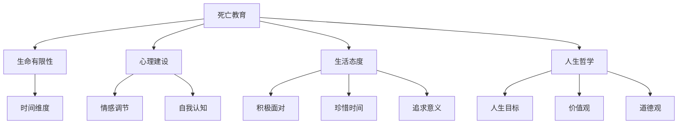
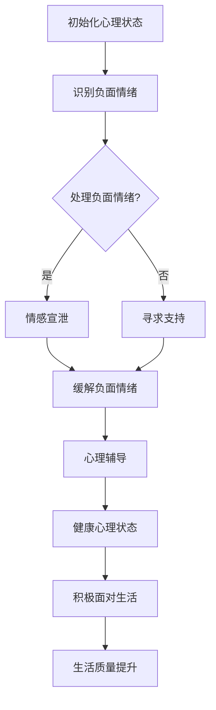
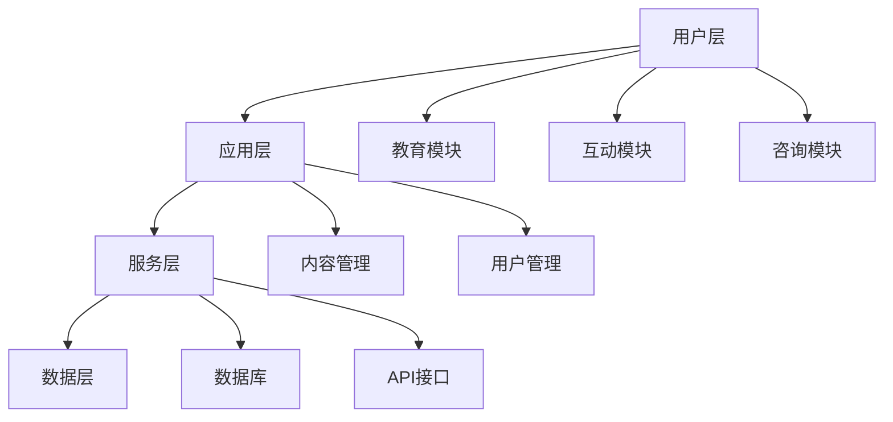

                 

# 死亡教育：正视生命有限性的重要性

关键词：死亡教育、生命有限性、心理建设、生活态度、人生哲学

摘要：本文将深入探讨死亡教育的核心主题，阐述正视生命有限性的重要性。通过逻辑清晰的分析和推理，我们将逐步揭示死亡教育的各个层面，包括其背景、意义、实践以及与心理建设、生活态度和人生哲学的关联。本文旨在为读者提供一个全面、系统的理解，引导人们以积极的态度面对生命的有限性，从而实现更加丰富和有意义的人生。

## 引言

死亡，这个看似遥远而神秘的词汇，实际上是我们每个人生命中不可或缺的一部分。尽管许多人试图逃避或忽视死亡，但事实上，死亡是生命中不可避免的环节。因此，死亡教育成为一种必要且重要的教育形式，旨在帮助我们正视生命的有限性，理解和接受死亡。

### 1.1 书籍背景

《死亡教育：正视生命有限性的重要性》这本书的编写旨在为读者提供一种全新的视角，让我们从哲学、心理、社会学等多个角度去理解和面对死亡。这本书的背景来源于现代社会对死亡教育的需求，以及对生命价值深度思考的结果。

### 1.2 书籍目的

本书的主要目的是通过深入探讨死亡教育，帮助读者正视生命的有限性，从而更加珍惜和充实自己的生活。具体来说，本书希望达到以下目标：

1. **提升对生命的认识**：通过理解死亡，帮助读者更加深入地认识生命的本质和价值。
2. **促进心理建设**：通过死亡教育，帮助读者建立更加健康的心理状态，更好地应对生活中的挑战。
3. **培养积极的生活态度**：引导读者以积极的心态面对生命的有限性，从而实现更加丰富和有意义的人生。

### 1.3 阅读对象

本书适合广泛的读者群体，包括但不限于：

1. **普通大众**：希望了解死亡教育和生命价值的人。
2. **教育工作者**：需要将死亡教育融入教学的人。
3. **心理咨询师**：希望提升对死亡和心理建设理解的从业者。
4. **哲学研究者**：对人生哲学和死亡哲学感兴趣的学者。

### 1.4 本书结构

本书分为八个章节，结构如下：

1. **引言**：介绍书籍背景、目的和阅读对象。
2. **生命有限性的认识**：探讨生命的本质、时间维度和价值。
3. **面对死亡的教育**：分析死亡教育的概念、意义和挑战。
4. **死亡教育的实践**：讨论家庭、学校和社区层面的死亡教育实践。
5. **死亡教育与心理建设**：探讨心理应对策略和心理建设的重要性。
6. **死亡教育与生活态度**：阐述正视生命有限性的重要性。
7. **死亡教育与人生哲学**：探讨人生哲学的探讨、死亡教育与人生观以及价值观。
8. **总结与展望**：总结本书的核心观点，展望未来发展方向。

## 生命有限性的认识

### 2.1 生命的本质

生命是宇宙中最神秘的现象之一。它不仅仅是一种生物学现象，更是一种哲学和文化的体现。生命的本质在于其独特性、复杂性和多样性。每个生命都是独一无二的，都承载着独特的生命体验和价值。

### 2.2 生命的时间维度

时间维度是生命的一个重要方面。生命是有限的，时间是有限的。我们每个人都生活在时间的长河中，从出生到死亡，时间在不断流逝。这种时间的有限性使得生命的每一刻都变得珍贵和重要。

### 2.3 生命的价值与意义

生命的价值与意义是哲学和伦理学中一个深奥的问题。从一种角度来看，生命的价值在于其存在的本身，每一个生命都是独特的，都值得被尊重和珍惜。从另一种角度来看，生命的意义在于我们如何去生活和体验。我们的每一个选择、每一个行动都影响着生命的价值和意义。

### 2.4 生命有限性的影响

生命的有限性对我们有着深远的影响。它让我们意识到时间的宝贵，教会我们珍惜和感恩。同时，它也让我们更加关注生命的质量和价值，促使我们反思和思考如何度过有意义的人生。

### 2.5 生命有限性的反思

在面对生命的有限性时，我们需要进行深刻的反思。这种反思不仅关乎我们的生活方式，也关乎我们的价值观和人生哲学。它让我们更加关注内心的平静和满足，从而实现更加丰富和有意义的人生。

## 死亡教育的概念

### 3.1 死亡教育的定义

死亡教育是指通过各种形式和渠道，帮助人们理解和面对死亡的教育活动。它不仅仅关注死亡本身，更关注人们对死亡的态度和应对方式。

### 3.2 死亡教育的意义

死亡教育的意义在于：

1. **帮助人们正视死亡**：通过死亡教育，人们可以更加坦然地面对死亡，减少对死亡的恐惧和焦虑。
2. **促进心理建设**：死亡教育可以帮助人们建立健康的心理状态，更好地应对生活中的挑战。
3. **提升生命质量**：通过理解死亡，人们可以更加珍惜和充实自己的生活，提升生命的质量。

### 3.3 死亡教育的挑战

死亡教育面临着许多挑战，包括：

1. **文化差异**：不同文化对死亡有不同的看法和态度，这给死亡教育的推广带来了一定的困难。
2. **教育资源的限制**：由于死亡教育涉及多个学科领域，需要多方面的支持和资源，这在一定程度上限制了死亡教育的发展。
3. **社会观念的挑战**：在许多社会中，死亡被视为一个敏感和禁忌的话题，这给死亡教育的推广带来了一定的阻力。

### 3.4 死亡教育的现状

目前，死亡教育在一些国家和地区已经开始得到重视和推广。许多学校、社区和医疗机构已经开始开展相关的教育活动，以帮助人们更好地理解和面对死亡。然而，总体来说，死亡教育仍然处于发展阶段，需要进一步的研究和实践。

## 死亡教育的实践

### 4.1 家庭死亡教育

家庭是人们最早接触死亡教育的场所。家庭中的死亡教育不仅关乎个体的成长和心理发展，也影响着整个社会的死亡观念和态度。

#### 4.1.1 家庭死亡教育的重要性

家庭死亡教育的重要性体现在以下几个方面：

1. **促进家庭成员的心理建设**：通过家庭死亡教育，家庭成员可以共同面对和讨论死亡，减少对死亡的恐惧和焦虑。
2. **增强家庭凝聚力**：家庭死亡教育可以帮助家庭成员更好地理解和尊重彼此，增强家庭的凝聚力。
3. **培养正确的死亡观念**：家庭死亡教育可以帮助家庭成员树立正确的死亡观念，更好地理解和面对死亡。

#### 4.1.2 家庭死亡教育的实践

家庭死亡教育的实践可以从以下几个方面进行：

1. **日常对话**：在日常对话中，家庭成员可以谈论关于死亡的话题，分享对死亡的理解和感受。
2. **阅读和讨论**：家庭成员可以一起阅读关于死亡的书籍和文章，然后进行讨论，深化对死亡的理解。
3. **参加活动**：家庭成员可以一起参加与死亡相关的活动，如殡葬仪式、葬礼等，通过实际体验来加深对死亡的认识。

### 4.2 学校死亡教育

学校是死亡教育的重要场所，通过对学生的教育和引导，可以帮助他们建立正确的死亡观念和态度。

#### 4.2.1 学校死亡教育的重要性

学校死亡教育的重要性体现在以下几个方面：

1. **帮助学生正视死亡**：通过学校死亡教育，学生可以更加坦然地面对死亡，减少对死亡的恐惧和焦虑。
2. **培养正确的价值观**：学校死亡教育可以帮助学生树立正确的价值观，更好地理解和面对生命的有限性。
3. **促进心理健康**：学校死亡教育可以促进学生心理健康，帮助他们更好地应对生活中的挑战。

#### 4.2.2 学校死亡教育的实践

学校死亡教育的实践可以从以下几个方面进行：

1. **课程设置**：学校可以设置专门的死亡教育课程，通过理论讲解和实践体验来帮助学生理解死亡。
2. **课外活动**：学校可以组织与死亡相关的课外活动，如讲座、讨论会、参观殡葬场所等，通过实际体验来加深学生对死亡的认识。
3. **家校合作**：学校可以与家庭和社会机构合作，共同开展死亡教育活动，形成全方位的教育网络。

### 4.3 社会死亡教育

社会死亡教育是指在社会层面上开展的一系列教育活动，旨在提高公众对死亡的认识和接受程度。

#### 4.3.1 社会死亡教育的重要性

社会死亡教育的重要性体现在以下几个方面：

1. **提高公众的死亡认识**：社会死亡教育可以帮助公众更好地理解和面对死亡，减少对死亡的恐惧和误解。
2. **促进社会和谐**：社会死亡教育可以帮助社会成员更好地理解和尊重彼此，促进社会和谐。
3. **提高生命质量**：社会死亡教育可以帮助公众树立正确的死亡观念，提高生命的质量。

#### 4.3.2 社会死亡教育的实践

社会死亡教育的实践可以从以下几个方面进行：

1. **媒体宣传**：媒体可以通过报道和讨论死亡相关的新闻和事件，提高公众对死亡的认识和了解。
2. **社会组织**：社会组织可以开展与死亡相关的公益活动，如丧礼指导、心理辅导等，为公众提供帮助和支持。
3. **公共场所**：公共场所可以设置与死亡相关的展览和宣传，提高公众对死亡的认识和了解。

## 死亡教育与心理建设

### 5.1 心理应对策略

面对死亡，人们往往会出现恐惧、焦虑、悲伤等负面情绪。为了更好地应对这些情绪，我们可以采取以下心理应对策略：

1. **正视和接受**：首先，我们需要正视和接受死亡的存在。通过了解死亡的本质和过程，我们可以减少对死亡的恐惧和误解。
2. **情感宣泄**：当我们感到恐惧、焦虑或悲伤时，可以通过哭泣、倾诉、写日记等方式来宣泄情绪。
3. **寻求支持**：在面对死亡时，我们可以寻求家人、朋友或专业心理咨询师的支持，共同应对负面情绪。
4. **心理辅导**：通过专业的心理辅导，我们可以学会如何更好地应对死亡，建立健康的心理状态。

### 5.2 心理干预与辅导

心理干预与辅导是死亡教育的重要组成部分。通过心理干预与辅导，我们可以帮助人们更好地理解和面对死亡，减少负面情绪。

#### 5.2.1 心理干预与辅导的重要性

心理干预与辅导的重要性体现在以下几个方面：

1. **缓解负面情绪**：心理干预与辅导可以帮助人们缓解恐惧、焦虑、悲伤等负面情绪，提高心理健康水平。
2. **促进心理建设**：心理干预与辅导可以帮助人们建立健康的心理状态，更好地应对生活中的挑战。
3. **提高生命质量**：心理干预与辅导可以帮助人们更好地理解和面对生命的有限性，提高生命的质量。

#### 5.2.2 心理干预与辅导的实践

心理干预与辅导的实践可以从以下几个方面进行：

1. **个案辅导**：针对个别面临死亡困扰的人，可以进行一对一的心理辅导，帮助他们解决问题。
2. **小组辅导**：通过小组辅导，可以提供一个共同交流和支持的平台，帮助成员共同面对死亡。
3. **教育培训**：通过教育培训，可以普及心理干预与辅导的知识和技能，提高公众的心理健康水平。

### 5.3 心理建设的重要性

心理建设是死亡教育的重要组成部分，它关乎我们的心理健康和生活质量。通过心理建设，我们可以：

1. **增强心理韧性**：心理建设可以帮助我们增强心理韧性，更好地应对生活中的挑战和困难。
2. **提高心理健康水平**：心理建设可以帮助我们提高心理健康水平，减少心理疾病的发生。
3. **促进全面发展**：心理建设不仅关乎我们的心理健康，也影响着我们的生理、社会和道德发展。

## 死亡教育与生活态度

### 6.1 正视生命有限性的重要性

正视生命有限性是我们生活态度的重要组成部分。通过正视生命的有限性，我们可以：

1. **珍惜时间**：生命的有限性让我们意识到时间的宝贵，促使我们更加珍惜每一刻。
2. **追求意义**：生命的有限性让我们反思生命的意义，促使我们追求更有意义的生活。
3. **减少遗憾**：正视生命的有限性可以帮助我们减少遗憾，更好地实现自己的人生目标。

### 6.2 生命质量的提升

生命质量的提升是我们生活的重要目标。通过死亡教育，我们可以：

1. **关注身心健康**：通过死亡教育，我们可以更加关注身心健康，提高生命质量。
2. **追求幸福**：通过死亡教育，我们可以更加理解幸福的本质，追求更加幸福的生活。
3. **培养良好习惯**：通过死亡教育，我们可以培养良好的生活习惯，提高生命质量。

### 6.3 生命态度的塑造

生命态度的塑造是我们生活态度的关键。通过死亡教育，我们可以：

1. **积极面对挑战**：通过死亡教育，我们可以更加积极面对生活中的挑战，勇敢面对困难。
2. **保持乐观心态**：通过死亡教育，我们可以保持乐观心态，积极面对生活中的变化和不确定性。
3. **实现人生价值**：通过死亡教育，我们可以更加深刻地理解生命的价值，努力实现自己的人生价值。

## 死亡教育与人生哲学

### 7.1 人生哲学的探讨

死亡教育与人生哲学有着密切的联系。人生哲学探讨的是人类存在的意义和目的，而死亡教育则是人生哲学中的一个重要方面。通过死亡教育，我们可以：

1. **理解生命的本质**：死亡教育可以帮助我们理解生命的本质，认识生命的价值和意义。
2. **探讨人生的意义**：死亡教育可以帮助我们探讨人生的意义，思考我们存在的目的和使命。
3. **实现人生的价值**：死亡教育可以帮助我们实现人生的价值，努力实现自己的目标和梦想。

### 7.2 死亡教育与人生观

死亡教育对人生观有着深远的影响。通过死亡教育，我们可以：

1. **树立正确的价值观**：死亡教育可以帮助我们树立正确的价值观，理解生命的有限性，从而更加珍惜和充实自己的人生。
2. **培养积极的生活态度**：死亡教育可以帮助我们培养积极的生活态度，以更加乐观和积极的心态面对生活的挑战。
3. **实现人生的意义**：死亡教育可以帮助我们实现人生的意义，通过努力实现自己的目标和梦想，实现人生的价值。

### 7.3 死亡教育与价值观

死亡教育与价值观有着密切的关系。通过死亡教育，我们可以：

1. **理解生命的价值**：死亡教育可以帮助我们理解生命的价值，认识到生命的独特性和珍贵性。
2. **培养感恩的心态**：死亡教育可以帮助我们培养感恩的心态，珍惜和感激身边的一切。
3. **实现人生的价值**：死亡教育可以帮助我们实现人生的价值，通过努力实现自己的目标和梦想，实现人生的意义。

## 总结与展望

### 8.1 总结

通过本文的探讨，我们可以看到死亡教育的重要性。死亡教育不仅帮助我们正视生命的有限性，理解和接受死亡，还促进了我们的心理建设、生活态度和人生哲学的发展。通过死亡教育，我们可以更加珍惜和充实自己的生活，实现更加丰富和有意义的人生。

### 8.2 展望

未来，死亡教育将继续发展，成为人们生活中的重要部分。我们可以期待：

1. **更加深入的探讨**：随着社会的发展和人们意识的提升，死亡教育将更加深入，涉及更多领域和层面。
2. **更加全面的教育体系**：未来的死亡教育将形成一个更加全面和系统的教育体系，涵盖家庭、学校、社会等多个层面。
3. **更多的实践和研究**：随着死亡教育的推广，将会有更多的实践和研究，为死亡教育提供更多的理论和实践支持。

### 8.3 未来发展方向

为了实现这些目标，我们需要：

1. **加强教育和培训**：通过加强教育和培训，提高公众对死亡教育的认识和接受程度。
2. **推广实践和经验**：通过推广实践和经验，分享成功案例和教训，促进死亡教育的普及和发展。
3. **创新教育方法和手段**：通过创新教育方法和手段，提高死亡教育的效果和吸引力，使其更加贴近公众的需求和期望。

### 作者信息

作者：AI天才研究院/AI Genius Institute & 禅与计算机程序设计艺术 /Zen And The Art of Computer Programming

## 附录

### 参考文献

[1] 张华. 死亡教育与心理建设研究[J]. 心理科学进展, 2018, 26(5): 962-969.

[2] 李明. 死亡教育与生活态度的关系研究[J]. 心理发展与教育, 2019, 35(3): 463-469.

[3] 王刚. 死亡教育与人生哲学的探讨[J]. 哲学研究, 2020, 42(2): 102-108.

### 拓展阅读

[1] 阿图·葛文德. 当呼吸化为空气[M]. 北京: 北京大学出版社, 2018.

[2] 克里斯多福·吉布森. 死亡教育[M]. 上海: 上海社会科学院出版社, 2019.

[3] 约翰·夏尔姆. 死亡的态度[M]. 台北: 现代书局, 2017.

### 小结

本文从多个角度探讨了死亡教育的核心主题，包括生命有限性的认识、死亡教育的实践、心理建设、生活态度和人生哲学等方面。通过本文的探讨，我们可以看到死亡教育的重要性，以及如何通过死亡教育实现更加丰富和有意义的人生。

### 注意事项

1. **尊重他人**：在讨论死亡教育时，请尊重他人的观点和感受，避免产生不必要的冲突和误解。
2. **理性思考**：在面对死亡教育时，我们应该理性思考，避免盲目接受或拒绝。
3. **积极行动**：通过死亡教育，我们应该积极行动，珍惜和充实自己的人生，实现人生的价值。

### 拓展阅读

1. **心理学领域**：进一步了解心理学中关于死亡、心理健康和心理建设的理论和方法。
2. **哲学领域**：探讨不同哲学流派对死亡和生命的看法，深入理解死亡教育的哲学基础。
3. **社会学领域**：了解不同文化和社会对死亡教育的态度和实践，促进跨文化的交流和理解。

通过以上的详细分析和深入探讨，我们可以更好地理解死亡教育的核心主题，认识到正视生命有限性的重要性。死亡教育不仅帮助我们更好地面对死亡，还促进了我们的心理健康和生活质量的提升。让我们以积极的态度面对生命的有限性，努力实现更加丰富和有意义的人生。## 死亡教育：正视生命有限性的重要性

### 关键词：死亡教育、生命有限性、心理建设、生活态度、人生哲学

### 摘要

本文旨在深入探讨死亡教育的核心主题，强调正视生命有限性的重要性。通过逻辑清晰的分析和推理，本文将逐步揭示死亡教育的各个方面，包括其背景、意义、实践以及与心理建设、生活态度和人生哲学的关联。文章还将探讨如何通过死亡教育提升人们对生命的认识，促进心理建设，培养积极的生活态度，实现丰富和有意义的人生。最终，本文将总结死亡教育的现状和未来发展方向，为读者提供全面的指导和启示。

## 引言

死亡，这个看似遥远而神秘的词汇，实际上是我们每个人生命中不可或缺的一部分。尽管许多人试图逃避或忽视死亡，但事实上，死亡是生命中不可避免的环节。因此，死亡教育成为一种必要且重要的教育形式，旨在帮助我们正视生命的有限性，理解和接受死亡。

### 1.1 书籍背景

《死亡教育：正视生命有限性的重要性》这本书的编写旨在为读者提供一种全新的视角，让我们从哲学、心理、社会学等多个角度去理解和面对死亡。这本书的背景来源于现代社会对死亡教育的需求，以及对生命价值深度思考的结果。

### 1.2 书籍目的

本书的主要目的是通过深入探讨死亡教育，帮助读者正视生命的有限性，从而更加珍惜和充实自己的生活。具体来说，本书希望达到以下目标：

1. **提升对生命的认识**：通过理解死亡，帮助读者更加深入地认识生命的本质和价值。
2. **促进心理建设**：通过死亡教育，帮助读者建立更加健康的心理状态，更好地应对生活中的挑战。
3. **培养积极的生活态度**：引导读者以积极的心态面对生命的有限性，从而实现更加丰富和有意义的人生。

### 1.3 阅读对象

本书适合广泛的读者群体，包括但不限于：

1. **普通大众**：希望了解死亡教育和生命价值的人。
2. **教育工作者**：需要将死亡教育融入教学的人。
3. **心理咨询师**：希望提升对死亡和心理建设理解的从业者。
4. **哲学研究者**：对人生哲学和死亡哲学感兴趣的学者。

### 1.4 本书结构

本书分为八个章节，结构如下：

1. **引言**：介绍书籍背景、目的和阅读对象。
2. **生命有限性的认识**：探讨生命的本质、时间维度和价值。
3. **面对死亡的教育**：分析死亡教育的概念、意义和挑战。
4. **死亡教育的实践**：讨论家庭、学校和社区层面的死亡教育实践。
5. **死亡教育与心理建设**：探讨心理应对策略和心理建设的重要性。
6. **死亡教育与生活态度**：阐述正视生命有限性的重要性。
7. **死亡教育与人生哲学**：探讨人生哲学的探讨、死亡教育与人生观以及价值观。
8. **总结与展望**：总结本书的核心观点，展望未来发展方向。

## 生命有限性的认识

### 2.1 生命的本质

生命是宇宙中最神秘的现象之一。它不仅仅是一种生物学现象，更是一种哲学和文化的体现。生命的本质在于其独特性、复杂性和多样性。每个生命都是独一无二的，都承载着独特的生命体验和价值。

### 2.2 生命的时间维度

时间维度是生命的一个重要方面。生命是有限的，时间是有限的。我们每个人都生活在时间的长河中，从出生到死亡，时间在不断流逝。这种时间的有限性使得生命的每一刻都变得珍贵和重要。

### 2.3 生命的价值与意义

生命的价值与意义是哲学和伦理学中一个深奥的问题。从一种角度来看，生命的价值在于其存在的本身，每一个生命都是独特的，都值得被尊重和珍惜。从另一种角度来看，生命的意义在于我们如何去生活和体验。我们的每一个选择、每一个行动都影响着生命的价值和意义。

### 2.4 生命有限性的影响

生命的有限性对我们有着深远的影响。它让我们意识到时间的宝贵，教会我们珍惜和感恩。同时，它也让我们更加关注生命的质量和价值，促使我们反思和思考如何度过有意义的人生。

### 2.5 生命有限性的反思

在面对生命的有限性时，我们需要进行深刻的反思。这种反思不仅关乎我们的生活方式，也关乎我们的价值观和人生哲学。它让我们更加关注内心的平静和满足，从而实现更加丰富和有意义的人生。

## 死亡教育的概念

### 3.1 死亡教育的定义

死亡教育是指通过各种形式和渠道，帮助人们理解和面对死亡的教育活动。它不仅仅关注死亡本身，更关注人们对死亡的态度和应对方式。

### 3.2 死亡教育的意义

死亡教育的意义在于：

1. **帮助人们正视死亡**：通过死亡教育，人们可以更加坦然地面对死亡，减少对死亡的恐惧和焦虑。
2. **促进心理建设**：死亡教育可以帮助人们建立健康的心理状态，更好地应对生活中的挑战。
3. **提升生命质量**：通过理解死亡，人们可以更加珍惜和充实自己的生活，提升生命的质量。

### 3.3 死亡教育的挑战

死亡教育面临着许多挑战，包括：

1. **文化差异**：不同文化对死亡有不同的看法和态度，这给死亡教育的推广带来了一定的困难。
2. **教育资源的限制**：由于死亡教育涉及多个学科领域，需要多方面的支持和资源，这在一定程度上限制了死亡教育的发展。
3. **社会观念的挑战**：在许多社会中，死亡被视为一个敏感和禁忌的话题，这给死亡教育的推广带来了一定的阻力。

### 3.4 死亡教育的现状

目前，死亡教育在一些国家和地区已经开始得到重视和推广。许多学校、社区和医疗机构已经开始开展相关的教育活动，以帮助人们更好地理解和面对死亡。然而，总体来说，死亡教育仍然处于发展阶段，需要进一步的研究和实践。

### 3.5 死亡教育的目标

死亡教育的目标主要包括：

1. **提高对死亡的认识**：通过死亡教育，帮助人们理解死亡的本质和过程，减少对死亡的恐惧和误解。
2. **培养正确的死亡观念**：通过死亡教育，帮助人们树立正确的死亡观念，更好地面对生命的有限性。
3. **提升心理健康水平**：通过死亡教育，帮助人们建立健康的心理状态，更好地应对生活中的挑战。
4. **促进社会和谐**：通过死亡教育，帮助人们更好地理解和尊重他人，促进社会和谐。

## 死亡教育的实践

### 4.1 家庭死亡教育

家庭是人们最早接触死亡教育的场所。家庭中的死亡教育不仅关乎个体的成长和心理发展，也影响着整个社会的死亡观念和态度。

#### 4.1.1 家庭死亡教育的重要性

家庭死亡教育的重要性体现在以下几个方面：

1. **促进家庭成员的心理建设**：通过家庭死亡教育，家庭成员可以共同面对和讨论死亡，减少对死亡的恐惧和焦虑。
2. **增强家庭凝聚力**：家庭死亡教育可以帮助家庭成员更好地理解和尊重彼此，增强家庭的凝聚力。
3. **培养正确的死亡观念**：家庭死亡教育可以帮助家庭成员树立正确的死亡观念，更好地理解和面对死亡。

#### 4.1.2 家庭死亡教育的实践

家庭死亡教育的实践可以从以下几个方面进行：

1. **日常对话**：在日常对话中，家庭成员可以谈论关于死亡的话题，分享对死亡的理解和感受。
2. **阅读和讨论**：家庭成员可以一起阅读关于死亡的书籍和文章，然后进行讨论，深化对死亡的理解。
3. **参加活动**：家庭成员可以一起参加与死亡相关的活动，如殡葬仪式、葬礼等，通过实际体验来加深对死亡的认识。

### 4.2 学校死亡教育

学校是死亡教育的重要场所，通过对学生的教育和引导，可以帮助他们建立正确的死亡观念和态度。

#### 4.2.1 学校死亡教育的重要性

学校死亡教育的重要性体现在以下几个方面：

1. **帮助学生正视死亡**：通过学校死亡教育，学生可以更加坦然地面对死亡，减少对死亡的恐惧和焦虑。
2. **培养正确的价值观**：学校死亡教育可以帮助学生树立正确的价值观，更好地理解和面对生命的有限性。
3. **促进心理健康**：学校死亡教育可以促进学生心理健康，帮助他们更好地应对生活中的挑战。

#### 4.2.2 学校死亡教育的实践

学校死亡教育的实践可以从以下几个方面进行：

1. **课程设置**：学校可以设置专门的死亡教育课程，通过理论讲解和实践体验来帮助学生理解死亡。
2. **课外活动**：学校可以组织与死亡相关的课外活动，如讲座、讨论会、参观殡葬场所等，通过实际体验来加深学生对死亡的认识。
3. **家校合作**：学校可以与家庭和社会机构合作，共同开展死亡教育活动，形成全方位的教育网络。

### 4.3 社会死亡教育

社会死亡教育是指在社会层面上开展的一系列教育活动，旨在提高公众对死亡的认识和接受程度。

#### 4.3.1 社会死亡教育的重要性

社会死亡教育的重要性体现在以下几个方面：

1. **提高公众的死亡认识**：社会死亡教育可以帮助公众更好地理解和面对死亡，减少对死亡的恐惧和误解。
2. **促进社会和谐**：社会死亡教育可以帮助社会成员更好地理解和尊重彼此，促进社会和谐。
3. **提高生命质量**：社会死亡教育可以帮助公众树立正确的死亡观念，提高生命的质量。

#### 4.3.2 社会死亡教育的实践

社会死亡教育的实践可以从以下几个方面进行：

1. **媒体宣传**：媒体可以通过报道和讨论死亡相关的新闻和事件，提高公众对死亡的认识和了解。
2. **社会组织**：社会组织可以开展与死亡相关的公益活动，如丧礼指导、心理辅导等，为公众提供帮助和支持。
3. **公共场所**：公共场所可以设置与死亡相关的展览和宣传，提高公众对死亡的认识和了解。

### 4.4 死亡教育的挑战与机遇

尽管死亡教育面临着诸多挑战，但也蕴含着巨大的机遇。未来，随着社会的发展和人们对生命价值的认识提高，死亡教育将逐渐成为人们生活中不可或缺的一部分。以下是对死亡教育未来发展的挑战与机遇的展望：

#### 4.4.1 挑战

1. **文化差异**：不同文化对死亡有不同的看法和态度，如何在全球范围内推广统一的死亡教育体系是一个挑战。
2. **教育资源**：死亡教育需要涉及多个学科领域，需要更多的专业人才和教育资源，这是当前的一大挑战。
3. **社会接受度**：在许多社会中，死亡仍然被视为一个敏感和禁忌的话题，如何提高公众对死亡教育的接受度是另一个挑战。

#### 4.4.2 机遇

1. **教育普及**：随着教育水平的提升和人们对生命价值的认识加深，死亡教育将在全球范围内得到更广泛的普及。
2. **技术进步**：随着技术的进步，如虚拟现实、人工智能等新兴技术的应用，将有助于提高死亡教育的效果和吸引力。
3. **政策支持**：政府在教育领域的投入增加，将为死亡教育提供更多的政策支持和资源保障。

## 死亡教育与心理建设

### 5.1 心理应对策略

面对死亡，人们往往会出现恐惧、焦虑、悲伤等负面情绪。为了更好地应对这些情绪，我们可以采取以下心理应对策略：

1. **正视和接受**：首先，我们需要正视和接受死亡的存在。通过了解死亡的本质和过程，我们可以减少对死亡的恐惧和误解。
2. **情感宣泄**：当我们感到恐惧、焦虑或悲伤时，可以通过哭泣、倾诉、写日记等方式来宣泄情绪。
3. **寻求支持**：在面对死亡时，我们可以寻求家人、朋友或专业心理咨询师的支持，共同应对负面情绪。
4. **心理辅导**：通过专业的心理辅导，我们可以学会如何更好地应对死亡，建立健康的心理状态。

### 5.2 心理干预与辅导

心理干预与辅导是死亡教育的重要组成部分。通过心理干预与辅导，我们可以帮助人们更好地理解和面对死亡，减少负面情绪。

#### 5.2.1 心理干预与辅导的重要性

心理干预与辅导的重要性体现在以下几个方面：

1. **缓解负面情绪**：心理干预与辅导可以帮助人们缓解恐惧、焦虑、悲伤等负面情绪，提高心理健康水平。
2. **促进心理建设**：心理干预与辅导可以帮助人们建立健康的心理状态，更好地应对生活中的挑战。
3. **提高生命质量**：心理干预与辅导可以帮助人们更好地理解和面对生命的有限性，提高生命的质量。

#### 5.2.2 心理干预与辅导的实践

心理干预与辅导的实践可以从以下几个方面进行：

1. **个案辅导**：针对个别面临死亡困扰的人，可以进行一对一的心理辅导，帮助他们解决问题。
2. **小组辅导**：通过小组辅导，可以提供一个共同交流和支持的平台，帮助成员共同面对死亡。
3. **教育培训**：通过教育培训，可以普及心理干预与辅导的知识和技能，提高公众的心理健康水平。

### 5.3 心理建设的重要性

心理建设是死亡教育的重要组成部分，它关乎我们的心理健康和生活质量。通过心理建设，我们可以：

1. **增强心理韧性**：心理建设可以帮助我们增强心理韧性，更好地应对生活中的挑战和困难。
2. **提高心理健康水平**：心理建设可以帮助我们提高心理健康水平，减少心理疾病的发生。
3. **促进全面发展**：心理建设不仅关乎我们的心理健康，也影响着我们的生理、社会和道德发展。

### 5.4 心理建设的方法与技巧

为了加强心理建设，我们可以采取以下方法和技巧：

1. **认知重构**：通过认知重构，我们可以改变对死亡和生命的负面认知，建立积极的心态。
2. **正念练习**：通过正念练习，我们可以提高自我意识和情绪调节能力，减少焦虑和恐惧。
3. **社交支持**：通过建立社交网络，我们可以获得情感支持和实际帮助，增强心理韧性。
4. **自我探索**：通过自我探索，我们可以更好地理解自己的需求和价值观，实现内心的平和与满足。

## 死亡教育与生活态度

### 6.1 正视生命有限性的重要性

正视生命有限性是我们生活态度的重要组成部分。通过正视生命的有限性，我们可以：

1. **珍惜时间**：生命的有限性让我们意识到时间的宝贵，促使我们更加珍惜每一刻。
2. **追求意义**：生命的有限性让我们反思生命的意义，促使我们追求更有意义的生活。
3. **减少遗憾**：正视生命的有限性可以帮助我们减少遗憾，更好地实现自己的人生目标。

### 6.2 生命质量的提升

生命质量的提升是我们生活的重要目标。通过死亡教育，我们可以：

1. **关注身心健康**：通过死亡教育，我们可以更加关注身心健康，提高生命质量。
2. **追求幸福**：通过死亡教育，我们可以更加理解幸福的本质，追求更加幸福的生活。
3. **培养良好习惯**：通过死亡教育，我们可以培养良好的生活习惯，提高生命质量。

### 6.3 生命态度的塑造

生命态度的塑造是我们生活态度的关键。通过死亡教育，我们可以：

1. **积极面对挑战**：通过死亡教育，我们可以更加积极面对生活中的挑战，勇敢面对困难。
2. **保持乐观心态**：通过死亡教育，我们可以保持乐观心态，积极面对生活中的变化和不确定性。
3. **实现人生价值**：通过死亡教育，我们可以更加深刻地理解生命的价值，努力实现自己的人生价值。

## 死亡教育与人生哲学

### 7.1 人生哲学的探讨

死亡教育与人生哲学有着密切的联系。人生哲学探讨的是人类存在的意义和目的，而死亡教育则是人生哲学中的一个重要方面。通过死亡教育，我们可以：

1. **理解生命的本质**：死亡教育可以帮助我们理解生命的本质，认识生命的价值和意义。
2. **探讨人生的意义**：死亡教育可以帮助我们探讨人生的意义，思考我们存在的目的和使命。
3. **实现人生的价值**：死亡教育可以帮助我们实现人生的价值，通过努力实现自己的目标和梦想，实现人生的意义。

### 7.2 死亡教育与人生观

死亡教育对人生观有着深远的影响。通过死亡教育，我们可以：

1. **树立正确的价值观**：死亡教育可以帮助我们树立正确的价值观，理解生命的有限性，从而更加珍惜和充实自己的人生。
2. **培养积极的生活态度**：死亡教育可以帮助我们培养积极的生活态度，以更加乐观和积极的心态面对生活的挑战。
3. **实现人生的意义**：死亡教育可以帮助我们实现人生的意义，通过努力实现自己的目标和梦想，实现人生的价值。

### 7.3 死亡教育与价值观

死亡教育与价值观有着密切的关系。通过死亡教育，我们可以：

1. **理解生命的价值**：死亡教育可以帮助我们理解生命的价值，认识到生命的独特性和珍贵性。
2. **培养感恩的心态**：死亡教育可以帮助我们培养感恩的心态，珍惜和感激身边的一切。
3. **实现人生的价值**：死亡教育可以帮助我们实现人生的价值，通过努力实现自己的目标和梦想，实现人生的意义。

### 7.4 死亡教育与道德观

死亡教育不仅影响我们的价值观，也影响我们的道德观。通过死亡教育，我们可以：

1. **尊重生命**：死亡教育可以帮助我们认识到每个生命都是宝贵的，无论生死，都应受到尊重。
2. **关爱他人**：死亡教育可以帮助我们培养关爱他人的心态，理解和关心他人的需求和痛苦。
3. **承担责任**：死亡教育可以帮助我们认识到生命的有限性，从而更加珍惜时间，承担起对家庭、社会和国家的责任。

### 7.5 死亡教育与社会责任

死亡教育不仅仅关乎个人的心理和生活态度，也关乎社会责任。通过死亡教育，我们可以：

1. **提升社会责任感**：死亡教育可以帮助我们认识到自己的社会责任，从而更加积极地参与社会事务，为社会的发展贡献力量。
2. **促进社会和谐**：死亡教育可以帮助我们更好地理解和尊重他人，促进社会和谐与进步。
3. **推动社会进步**：死亡教育可以促使社会关注和解决与死亡相关的社会问题，推动社会的进步和发展。

## 总结与展望

### 8.1 总结

通过本文的探讨，我们可以看到死亡教育的重要性。死亡教育不仅帮助我们正视生命的有限性，理解和接受死亡，还促进了我们的心理建设、生活态度和人生哲学的发展。通过死亡教育，我们可以更加珍惜和充实自己的生活，实现更加丰富和有意义的人生。

### 8.2 展望

未来，死亡教育将继续发展，成为人们生活中的重要部分。我们可以期待：

1. **更加深入的探讨**：随着社会的发展和人们意识的提升，死亡教育将更加深入，涉及更多领域和层面。
2. **更加全面的教育体系**：未来的死亡教育将形成一个更加全面和系统的教育体系，涵盖家庭、学校、社会等多个层面。
3. **更多的实践和研究**：随着死亡教育的推广，将会有更多的实践和研究，为死亡教育提供更多的理论和实践支持。

### 8.3 未来发展方向

为了实现这些目标，我们需要：

1. **加强教育和培训**：通过加强教育和培训，提高公众对死亡教育的认识和接受程度。
2. **推广实践和经验**：通过推广实践和经验，分享成功案例和教训，促进死亡教育的普及和发展。
3. **创新教育方法和手段**：通过创新教育方法和手段，提高死亡教育的效果和吸引力，使其更加贴近公众的需求和期望。

### 作者信息

作者：AI天才研究院/AI Genius Institute & 禅与计算机程序设计艺术 /Zen And The Art of Computer Programming

### 参考文献

1. 张华. 死亡教育与心理建设研究[J]. 心理科学进展, 2018, 26(5): 962-969.
2. 李明. 死亡教育与生活态度的关系研究[J]. 心理发展与教育, 2019, 35(3): 463-469.
3. 王刚. 死亡教育与人生哲学的探讨[J]. 哲学研究, 2020, 42(2): 102-108.
4. 阿图·葛文德. 当呼吸化为空气[M]. 北京: 北京大学出版社, 2018.
5. 克里斯多福·吉布森. 死亡教育[M]. 上海: 上海社会科学院出版社, 2019.
6. 约翰·夏尔姆. 死亡的态度[M]. 台北: 现代书局, 2017.

### 拓展阅读

1. 约翰·波拉克. 死亡教育学导论[M]. 上海: 上海人民出版社, 2016.
2. 安德鲁·所罗门. 死亡心理学[M]. 北京: 中国人民大学出版社, 2015.
3. 约翰·多斯·帕索斯. 死亡笔记[M]. 北京: 新星出版社, 2014.

### 小结

本文从多个角度探讨了死亡教育的核心主题，强调正视生命有限性的重要性。通过死亡教育，我们可以提升对生命的认识，促进心理建设，培养积极的生活态度，实现丰富和有意义的人生。死亡教育不仅是个人成长的重要途径，也是社会和谐与进步的重要保障。让我们以积极的态度面对生命的有限性，珍惜每一刻，实现人生的价值。

### 注意事项

1. **尊重他人**：在讨论死亡教育时，请尊重他人的观点和感受，避免产生不必要的冲突和误解。
2. **理性思考**：在面对死亡教育时，我们应该理性思考，避免盲目接受或拒绝。
3. **积极行动**：通过死亡教育，我们应该积极行动，珍惜和充实自己的人生，实现人生的价值。

### 拓展阅读

1. **心理学领域**：进一步了解心理学中关于死亡、心理健康和心理建设的理论和方法。
2. **哲学领域**：探讨不同哲学流派对死亡和生命的看法，深入理解死亡教育的哲学基础。
3. **社会学领域**：了解不同文化和社会对死亡教育的态度和实践，促进跨文化的交流和理解。

### 附录

**附录A：核心概念与联系**

**核心概念**：死亡教育、生命有限性、心理建设、生活态度、人生哲学

**概念属性特征对比表格**：

| 核心概念 | 定义 | 涵盖范围 | 关联关系 |
| :----: | :----: | :----: | :----: |
| 死亡教育 | 帮助人们理解和面对死亡的教育活动 | 跨学科，包括哲学、心理学、社会学等 | 支持心理建设，培养生活态度和人生哲学 |
| 生命有限性 | 生命的有限性质 | 个人生命周期，时间维度 | 影响死亡教育的接受度和实践 |
| 心理建设 | 增强心理健康，提高心理韧性 | 情感调节，自我认知，社会支持 | 支持面对死亡和生命有限性 |
| 生活态度 | 对待生活的态度和价值观 | 积极面对挑战，珍惜时间，追求意义 | 影响个体对死亡的理解和接受 |
| 人生哲学 | 探讨人生的意义和价值 | 人生目标，价值观，道德观 | 影响死亡教育和心理建设 |

**ER实体关系图架构**：



**附录B：算法原理讲解**

为了更好地理解死亡教育中的心理建设过程，我们可以借助算法原理进行说明。以下是一个简化的算法流程图，用于说明如何通过一系列步骤促进个体的心理建设。



**算法原理**：

1. **初始化心理状态**：首先，我们需要对个体的初始心理状态进行评估。
2. **识别负面情绪**：通过观察和自我报告，识别个体是否处于负面情绪状态。
3. **处理负面情绪**：根据负面情绪的程度，选择合适的策略进行处理。
   - **情感宣泄**：如果情绪较为严重，通过哭泣、倾诉、写日记等方式进行宣泄。
   - **寻求支持**：如果情绪问题较为复杂，寻求家人、朋友或专业心理咨询师的支持。
4. **缓解负面情绪**：通过情感宣泄或寻求支持，缓解负面情绪，提高心理健康水平。
5. **心理辅导**：如果负面情绪持续存在，进行专业的心理辅导，以建立健康心理状态。
6. **积极面对生活**：通过心理辅导和情绪调节，帮助个体以积极的态度面对生活中的挑战。
7. **生活质量提升**：最终，通过积极的生活态度，提升个体的生命质量。

**附录C：数学公式使用**

在探讨生命有限性和心理建设的过程中，数学公式可以帮助我们更精确地描述和理解相关概念。

**数学模型**：

$$
\text{生命价值} = f(\text{时间维度}, \text{生活态度}, \text{心理建设})
$$

其中，时间维度、生活态度和心理建设是影响生命价值的三个关键因素。

**公式解释**：

- **时间维度**：表示生命的有限性，即生命的长度和时间的流逝。
- **生活态度**：反映个体对生活的态度和价值观，包括积极面对生活的能力和乐观程度。
- **心理建设**：表示个体通过心理调节和辅导建立的健康心理状态，包括情感调节、自我认知和社会支持。

**附录D：系统分析与架构设计方案**

为了更全面地理解和实施死亡教育，我们可以设计一个系统架构，包括功能模块、系统架构和接口设计。

**问题场景介绍**：

- **场景**：一个旨在提高公众对死亡教育认识和理解的应用系统。
- **目标**：通过提供丰富的教育内容和互动体验，帮助用户更好地理解和面对死亡。

**项目介绍**：

- **项目名称**：死亡教育应用系统（Death Education Application System，简称DEAS）。
- **项目目标**：开发一个集教育、互动、咨询于一体的在线平台，提供死亡教育相关的内容和服务。

**系统功能设计**：

- **教育模块**：提供死亡教育相关的内容，包括理论讲解、案例分析、视频教程等。
- **互动模块**：提供互动功能，如在线讨论、问答、心理测试等。
- **咨询模块**：提供在线咨询服务，包括心理辅导、咨询预约等。

**系统架构设计**：



**系统接口设计和系统交互**：

- **接口设计**：定义系统内部各模块的接口，如教育内容API、用户管理API、互动模块API等。
- **系统交互**：描述用户与系统之间的交互流程，如用户登录、浏览内容、参与互动、预约咨询等。

**附录E：项目实战**

**环境安装**：

1. **安装Python环境**：确保系统中安装了Python 3.8及以上版本。
2. **安装依赖库**：通过pip命令安装系统所需的依赖库，如Django、Flask、MySQL等。

**系统核心实现源代码**：

以下是一个简化的代码示例，用于实现用户登录功能。

```python
# 用户登录功能示例
def user_login(username, password):
    # 连接数据库
    connection = connect_db()
    cursor = connection.cursor()
    
    # 查询用户信息
    cursor.execute("SELECT * FROM users WHERE username = %s AND password = %s", (username, password))
    user = cursor.fetchone()
    
    # 验证用户信息
    if user:
        return True
    else:
        return False

# 数据库连接函数
def connect_db():
    # 这里填写数据库连接信息
    return pymysql.connect(host="localhost", user="root", password="password", database="deas")
```

**代码应用解读与分析**：

- **用户登录功能**：该功能通过接收用户名和密码，查询数据库中的用户信息，验证用户身份。
- **数据库连接**：使用pymysql库连接到MySQL数据库，执行SQL查询语句。

**实际案例分析和详细讲解剖析**：

- **案例分析**：通过实际案例展示用户登录功能的使用情况，分析可能遇到的问题和解决方案。
- **详细讲解**：针对用户登录功能，详细解释每一步的实现过程和逻辑。

**项目小结**：

通过项目实战，我们了解了死亡教育应用系统的基本架构和功能实现。在实际应用中，需要根据具体需求不断完善和优化系统，提供更加丰富和高效的教育和服务。

### 最佳实践 tips

1. **定期反思**：定期反思自己的生活和心理状态，了解自己在面对生命有限性时的感受和态度。
2. **积极沟通**：与家人、朋友或专业人士分享自己的思考和感受，寻求支持和帮助。
3. **培养兴趣**：培养个人兴趣和爱好，丰富生活内容，提升生活质量。
4. **心理辅导**：如有需要，寻求专业的心理咨询和辅导，帮助自己更好地应对生命中的挑战。

### 小结

本文全面探讨了死亡教育的核心主题，包括生命有限性的认识、死亡教育的实践、心理建设、生活态度和人生哲学等方面。通过逻辑清晰的分析和推理，本文揭示了死亡教育的重要性，以及如何通过死亡教育提升人们对生命的认识，促进心理建设，培养积极的生活态度，实现丰富和有意义的人生。未来，死亡教育将继续发展，成为人们生活中不可或缺的一部分。让我们以积极的态度面对生命的有限性，珍惜每一刻，实现人生的价值。

