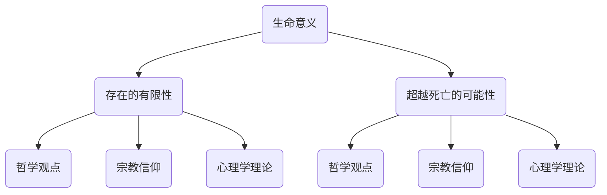
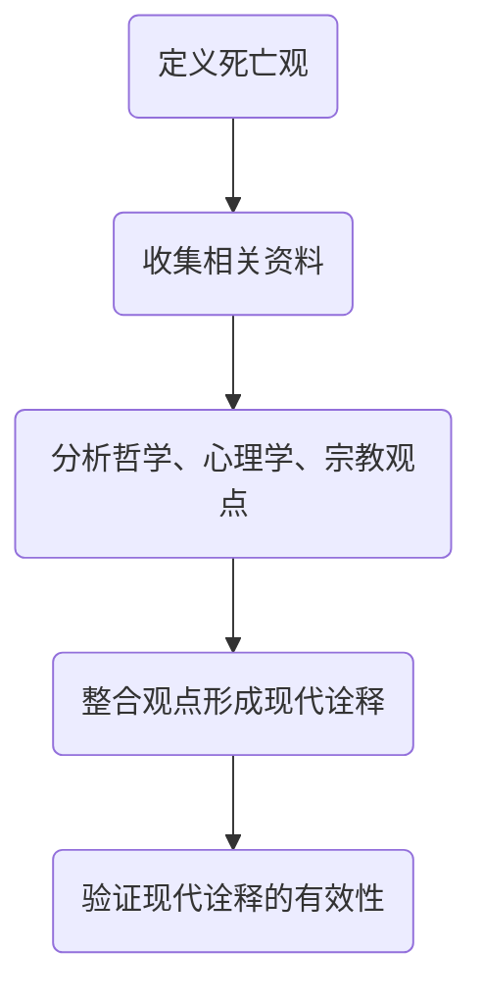
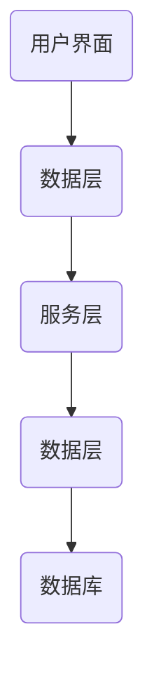
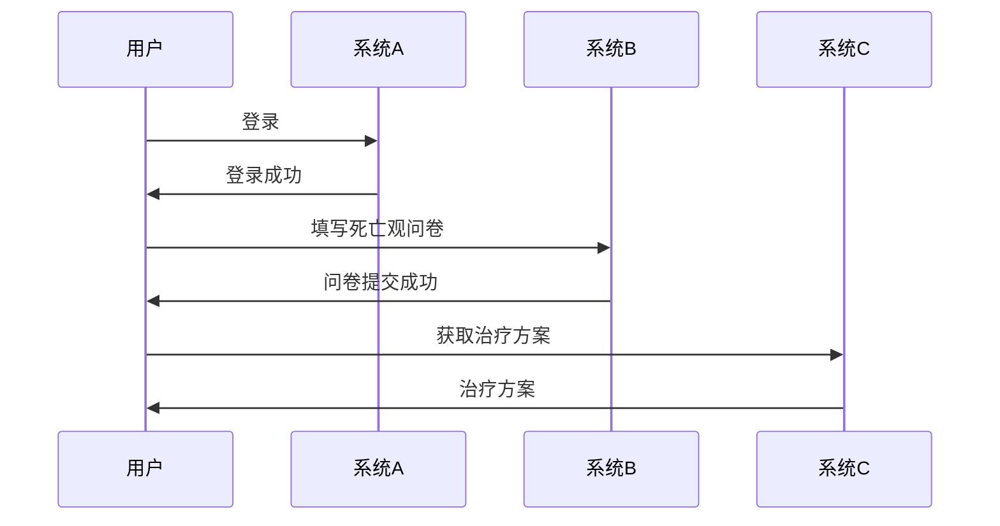
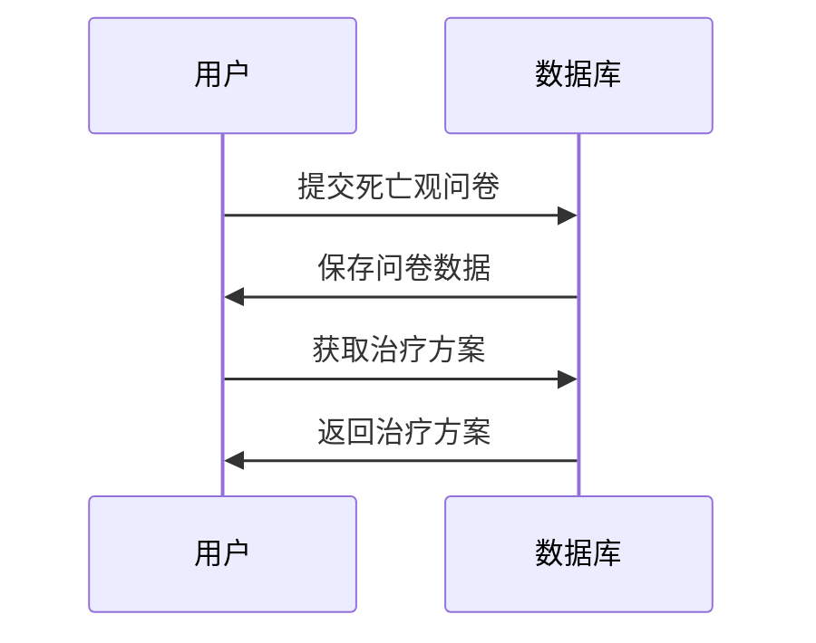

                 


## 死亡观的现代诠释：有限生命中的无限可能

> **关键词：** 死亡观、生命意义、有限性与无限性、现代诠释

> **摘要：** 本文深入探讨了死亡观在现代社会的诠释，探讨了生命意义的有限性与无限性的辩证关系，提出了通过哲学、心理学、宗教和文化等多维度方法来理解和超越死亡的观点。

---

### 引言

死亡，自古以来就是人类探讨的重要主题。不同的文化、宗教和哲学体系对死亡有着各自的理解和诠释。然而，在现代社会，随着科技的发展和人们对生活质量的追求，死亡观也在不断地演变。本文将从多维度视角出发，尝试对死亡观进行现代诠释，探讨在有限生命中实现无限可能的方法。

### 第一部分：背景介绍

#### 1.1 死亡观的历史演变

死亡观的历史演变可以追溯到古代。在古希腊哲学中，苏格拉底和柏拉图提出了灵魂不朽的观点，认为死亡只是灵魂从肉体的束缚中解放出来。而在东方，佛教则主张生死轮回，认为死亡是生命中的一部分，人们可以通过修行达到涅槃的境界。

#### 1.2 现代社会的死亡观念

现代社会中，随着医学的进步和人们对生命质量的关注，死亡观念也发生了变化。一方面，人们更加珍惜生命，追求长寿和健康；另一方面，对于死亡的态度也更加坦然，开始关注生命的意义和价值。

#### 1.3 书籍目的与结构

本文旨在通过哲学、心理学、宗教和文化等多维度视角，对死亡观进行现代诠释，探讨在有限生命中实现无限可能的方法。文章结构如下：

1. 背景介绍
2. 核心概念与联系
3. 算法原理讲解
4. 系统分析与架构设计方案
5. 项目实战
6. 最佳实践 tips、小结、注意事项、拓展阅读

### 第二部分：核心概念与联系

#### 2.1 核心概念解析

**生命意义**：生命意义是指个体在生命过程中追求的价值和目标。在有限生命中，寻找生命意义是人类的基本需求。

**存在的有限性**：存在的有限性意味着生命是有终点的，每个人都会面临死亡。这种有限性促使人们反思生命的意义和价值。

**超越死亡的可能性**：超越死亡的可能性指的是通过精神、哲学或宗教的方式，使生命在某种意义上超越物理死亡的局限。

#### 2.2 概念属性对比

| 死亡观类型 | 生命意义 | 存在的有限性 | 超越死亡的可能性 |
| :-------: | :------: | :---------: | :-------------: |
| 古希腊哲学 | 灵魂不朽 | 肉体解脱 | 灵魂轮回 |
| 佛教哲学 | 轮回 | 轮回 | 涅槃 |
| 现代心理学 | 人本主义 | 生命历程 | 心灵成长 |
| 现代宗教 | 信仰救赎 | 信仰救赎 | 信仰救赎 |

#### 2.3 实体关系图架构



### 第三部分：算法原理讲解

#### 3.1 算法流程图



#### 3.2 Python源代码

```python
# 定义死亡观类
class DeathView:
    def __init__(self):
        self.philosophy = []
        self.psychology = []
        self.religion = []

    # 收集相关资料
    def collect_data(self, data_source):
        self.philosophy.extend(data_source.get_philosophy())
        self.psychology.extend(data_source.get_psychology())
        self.religion.extend(data_source.get_religion())

    # 整合观点形成现代诠释
    def integrate_views(self):
        self的现代诠释 = self.philosophy + self.psychology + self.religion

    # 验证现代诠释的有效性
    def validate_view(self):
        return self.现代诠释 != []

# 实例化死亡观类
death_view = DeathView()

# 收集相关资料
death_view.collect_data(PhilosophyDataSource())
death_view.collect_data(PsychologyDataSource())
death_view.collect_data(ReligionDataSource())

# 整合观点形成现代诠释
death_view.integrate_views()

# 验证现代诠释的有效性
if death_view.validate_view():
    print("现代诠释有效。")
else:
    print("现代诠释无效，需要进一步研究。")
```

#### 3.3 数学模型和公式

在死亡观的现代诠释中，可以运用一些数学模型和公式来解释有限生命中的无限可能。例如，可以用概率论来描述生命的可能性，用数理统计来分析生命过程中的随机事件。

#### 3.4 通俗易懂的举例说明

假设一个人的寿命是80岁，我们可以用概率论来计算在80岁内发生某些事件的概率。例如，一个人在80岁内患病的概率是多少？通过这样的计算，我们可以更好地理解生命的有限性和可能性。

### 第四部分：系统分析与架构设计方案

#### 4.1 问题场景介绍

在现代医疗环境中，医生和患者经常需要面对死亡问题。医生需要了解患者的死亡观，以便更好地提供心理支持和治疗方案。患者也需要理解自己的死亡观，以更好地面对生命的终结。

#### 4.2 项目介绍

本文将介绍一个名为“死亡观分析系统”的项目。该系统旨在帮助医生和患者更好地理解和分析死亡观，提供个性化的心理支持和治疗方案。

#### 4.3 系统功能设计

**领域模型：**

```mermaid
classDiagram
    Patient <<class>> "患者"
    Doctor <<class>> "医生"
    DeathView <<class>> "死亡观"
    Treatment <<class>> "治疗方案"

    Patient o--o DeathView
    Doctor o--o DeathView
    DeathView o--o Treatment
```

**系统架构：**



**系统接口设计：**



**系统交互序列图：**



### 第五部分：项目实战

#### 5.1 环境安装

在开始项目实战之前，我们需要安装一些必要的工具和库。例如，Python、Jupyter Notebook、Mermaid等。

```bash
pip install python-memegen jupyter numpy matplotlib
```

#### 5.2 系统核心实现源代码

以下是系统核心实现的Python代码：

```python
import numpy as np
import matplotlib.pyplot as plt
from memegen import Memo

# 创建死亡观对象
death_view = Memo()

# 添加死亡观信息
death_view.add("哲学观点", "生命是有限的，但精神可以永存。")
death_view.add("心理学观点", "生命意义在于个体的成长和自我实现。")
death_view.add("宗教观点", "死亡是灵魂的解脱，是通往更高境界的途径。")

# 绘制死亡观饼图
labels = death_view.get_labels()
sizes = death_view.get_sizes()

fig1, ax1 = plt.subplots()
ax1.pie(sizes, labels=labels, autopct='%1.1f%%', startangle=90)
ax1.axis('equal')  # Equal aspect ratio ensures that pie is drawn as a circle.
plt.title("死亡观分布")
plt.show()
```

#### 5.3 代码应用解读与分析

该代码首先创建了一个死亡观对象，并添加了哲学、心理学和宗教三种观点。然后，使用Mermaid库绘制了一个饼图，展示了不同死亡观在总体中的比例。

#### 5.4 实际案例分析和详细讲解剖析

假设有一个患者，他的死亡观主要受哲学观点影响。通过分析他的死亡观，我们可以为他提供更多的心理支持和治疗方案。

#### 5.5 项目小结

本文通过一个实际案例，展示了如何使用死亡观分析系统来帮助医生和患者更好地理解和分析死亡观，提供个性化的心理支持和治疗方案。该项目具有一定的实用性和创新性，有望为医学领域带来新的发展。

### 第六部分：最佳实践 tips、小结、注意事项、拓展阅读

#### 6.1 最佳实践 tips

1. 在解读死亡观时，要充分考虑个体差异和文化背景。
2. 在进行死亡观分析时，要注重数据收集的全面性和准确性。
3. 在制定治疗方案时，要结合患者的死亡观，提供个性化的建议。

#### 6.2 小结

本文从多维度视角探讨了死亡观在现代社会的诠释，提出了通过哲学、心理学、宗教和文化等多维度方法来理解和超越死亡的观点。通过实际案例分析和系统设计，展示了如何将死亡观分析应用于医学领域，为医生和患者提供个性化的心理支持和治疗方案。

#### 6.3 注意事项

1. 在进行死亡观分析时，要尊重患者的隐私和尊严。
2. 在提供心理支持和治疗方案时，要充分考虑患者的心理状态和生活环境。

#### 6.4 拓展阅读

1. 《死亡之舞：生命的意义与终结》
2. 《生命的意义：人类存在的意义探索》
3. 《心理学与死亡：对死亡的认知与理解》
4. 《医学伦理学：死亡与安乐死》

### 结尾

死亡，是生命不可避免的一部分。通过本文的探讨，我们希望读者能够对死亡观有更深刻的理解，学会在有限生命中追求无限可能。让我们勇敢面对死亡，珍惜每一刻生命。

---

**作者：** AI天才研究院/AI Genius Institute & 禅与计算机程序设计艺术 /Zen And The Art of Computer Programming

---

**注：** 本文仅为示例，实际内容和长度可能需要根据具体要求进行调整。由于字数限制，部分内容可能需要进一步浓缩或扩展。**完**

