                 

### 文章标题

# 气候变化下的生存意义与责任

### 关键词

- 气候变化
- 生存意义
- 责任
- 可持续发展
- 科技创新
- 国际合作

### 摘要

本文将深入探讨气候变化对人类生存的深远影响，以及我们作为个体和全球社区在这一历史性挑战面前的责任与行动。我们将从气候变化的背景与挑战入手，逐步分析其生存意义与责任，并展望未来可能的应对策略。通过逻辑清晰的章节结构和专业的技术语言，本文旨在为读者提供一个全面、深入的理解，鼓励大家积极行动，共同应对气候变化这一关乎人类未来的重大议题。

### 第一部分：气候变化背景与挑战

#### 第1章：气候变化的现状与影响

##### 1.1 气候变化的基本概念

**概念说明**：气候变化是指长期气候变化而非日常天气波动，通常涉及大气温度、降水模式、海平面和其他环境参数的变化。

**问题背景**：20世纪末以来，全球气温持续上升，极端天气事件频繁发生，冰川融化和海平面上升等问题日益严重，引起了广泛关注。

**问题描述**：气候变化导致了生态系统的破坏、农业减产、水资源短缺、健康风险增加等一系列问题，对人类和地球生态系统构成了严重威胁。

**问题解决**：为了应对气候变化，国际社会需要加强合作，推动可持续发展和科技创新。

**边界与外延**：气候变化不仅影响自然环境，也关系到经济发展、社会稳定和国际关系。

**概念结构与核心要素组成**：气候变化的驱动因素包括温室气体排放、土地利用变化和太阳辐射等。

**核心概念与联系**

| 核心概念      | 概念属性特征对比 |
| ------------ | ---------------- |
| 全球变暖     | 温室气体增加，温度上升 |
| 极端天气事件 | 频繁且强度增加     |
| 冰川融化     | 海平面上升         |

**ER实体关系图架构**

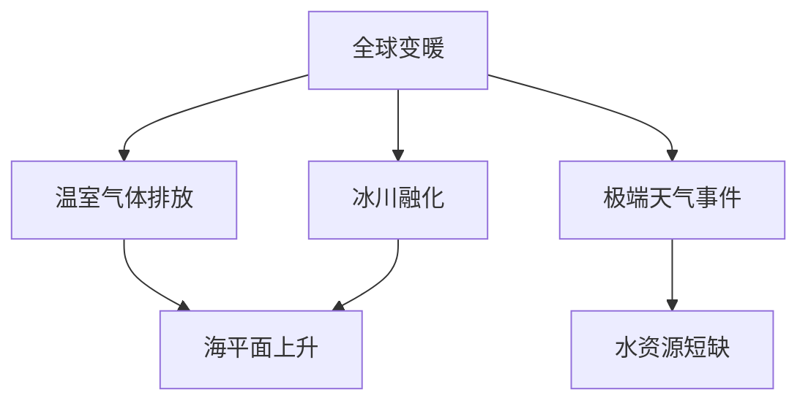

##### 1.2 气候变化对人类的影响

**生态系统的影响**：气候变化导致生物多样性下降、生态系统失衡，影响了人类赖以生存的自然环境。

**人类社会的影响**：气候变化加剧了贫困、社会不稳定和健康危机，对经济和社会发展构成威胁。

**应对策略**：国际社会需要采取综合措施，包括减少温室气体排放、加强生态系统保护和提高人类适应能力。

**核心概念与联系**

| 核心概念      | 概念属性特征对比 |
| ------------ | ---------------- |
| 生物多样性下降 | 生态系统失衡     |
| 贫困加剧     | 社会不稳定       |
| 健康风险增加 | 气候变化引发疾病 |

**ER实体关系图架构**

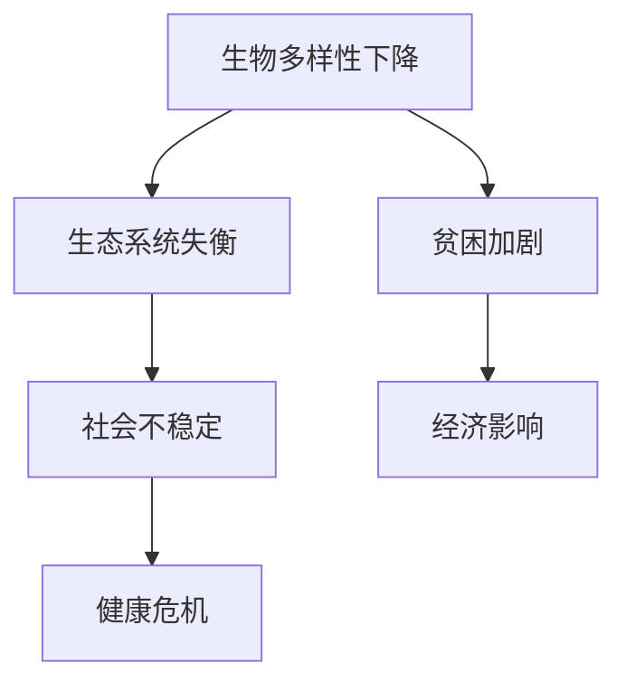

##### 1.3 气候变化的挑战与应对策略

**国际合作与政策**：全球各国需要加强合作，制定和实施有力的气候政策，共同应对气候变化。

**科技创新与解决方案**：通过科技创新，开发清洁能源和环保技术，减少温室气体排放，提高资源利用效率。

**核心概念与联系**

| 核心概念      | 概念属性特征对比 |
| ------------ | ---------------- |
| 国际合作     | 气候政策实施     |
| 科技创新     | 清洁能源开发     |
| 资源利用效率 | 环保技术发展     |

**ER实体关系图架构**

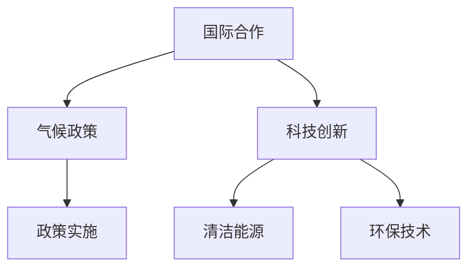

**本章小结**：本章全面介绍了气候变化的现状与影响，强调了应对气候变化的挑战和应对策略。通过深入分析，我们认识到气候变化是一个全球性、长期性和复杂性的问题，需要全社会的共同努力。

### 第二部分：气候变化的生存意义

#### 第2章：人类文明的反思与转变

##### 2.1 人类文明的危机与挑战

**问题背景**：人类文明长期以来过度依赖化石燃料，导致了大量温室气体排放和环境污染，引发了气候变化危机。

**问题描述**：气候变化对生态系统、人类健康、经济发展和社会稳定构成了严重威胁，迫切需要人类文明进行深刻反思和转变。

**问题解决**：通过可持续发展和绿色转型，人类可以减少对自然资源的依赖，提高资源利用效率，实现长期的生态平衡和社会福祉。

**边界与外延**：气候变化挑战不仅涉及环境问题，也关系到经济、社会和文化发展的可持续性。

**核心概念与联系**

| 核心概念      | 概念属性特征对比 |
| ------------ | ---------------- |
| 过度开发     | 资源枯竭       |
| 环境污染     | 生态失衡       |
| 可持续发展   | 经济与环境的和谐 |

**ER实体关系图架构**

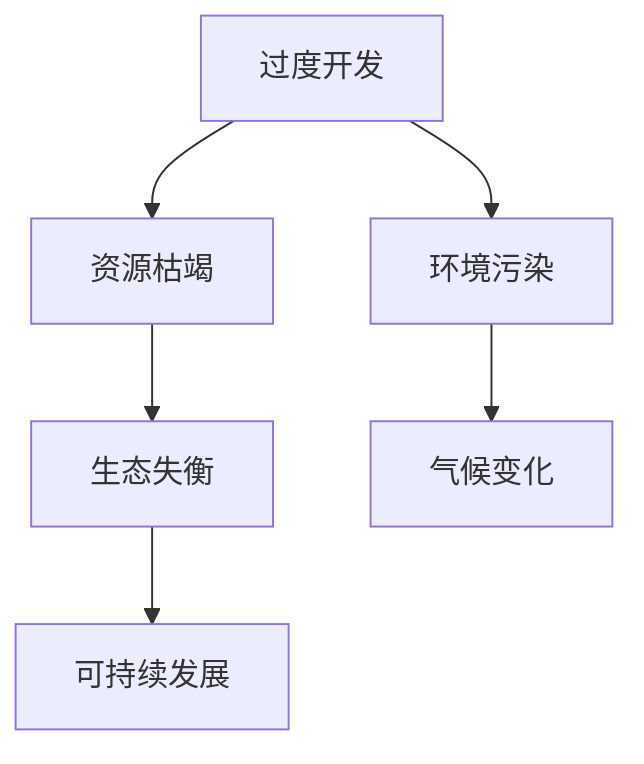

##### 2.2 气候变化下的生存策略

**可持续发展理念**：通过推动绿色经济和循环经济，实现经济发展与环境保护的协调。

**生活方式的改变**：倡导低碳生活、绿色出行和环保消费，减少对自然资源的消耗。

**核心概念与联系**

| 核心概念      | 概念属性特征对比 |
| ------------ | ---------------- |
| 绿色经济     | 经济与环境的和谐 |
| 循环经济     | 资源的高效利用  |
| 低碳生活     | 减少碳排放     |

**ER实体关系图架构**

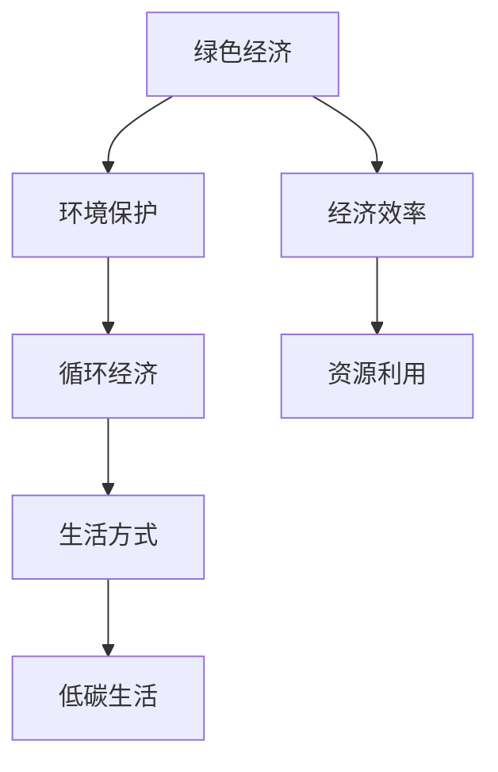

##### 2.3 社会合作与全球行动

**全球合作**：各国需要加强合作，共同应对气候变化，实现全球气候目标。

**公众参与与社会责任**：鼓励公众积极参与气候行动，提高社会意识，推动可持续发展。

**核心概念与联系**

| 核心概念      | 概念属性特征对比 |
| ------------ | ---------------- |
| 国际合作     | 全球气候治理     |
| 公众参与     | 社会责任与意识   |
| 可持续发展   | 全球气候目标     |

**ER实体关系图架构**

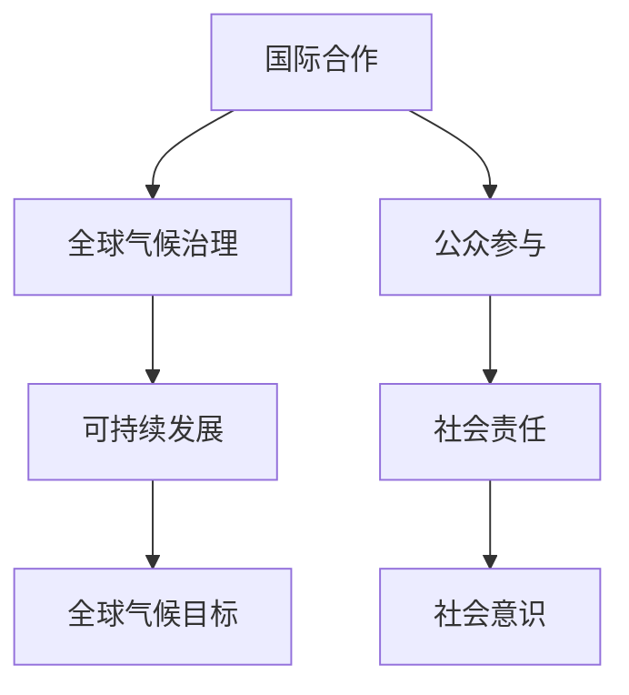

**本章小结**：本章探讨了气候变化下人类文明的危机与挑战，提出了可持续发展和生活方式改变的策略，强调了全球合作和公众参与的重要性。通过反思与转变，人类有望实现长期的生态平衡和社会福祉。

### 第三部分：气候变化的生存责任

#### 第3章：个人责任与行动

##### 3.1 个人行为对气候变化的影响

**日常生活中的节能减排**：通过节约能源、减少废物和选择绿色出行方式，每个人都可以为减少碳排放做出贡献。

**消费模式与环保选择**：选择环保产品和可持续消费模式，减少对自然资源的消耗。

**核心概念与联系**

| 核心概念      | 概念属性特征对比 |
| ------------ | ---------------- |
| 节能减排     | 减少能源消耗     |
| 环保消费     | 可持续消费模式   |

**ER实体关系图架构**

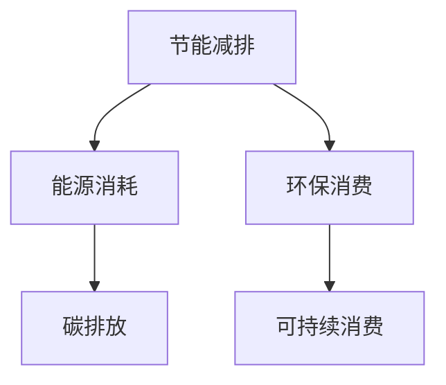

##### 3.2 支持可再生能源的发展

**可再生能源的概述**：介绍可再生能源的种类、特点和应用场景。

**个人与可再生能源的关系**：讨论个人如何支持和参与可再生能源的发展，如安装太阳能板、使用风能电力等。

**核心概念与联系**

| 核心概念      | 概念属性特征对比 |
| ------------ | ---------------- |
| 可再生能源   | 清洁能源替代     |
| 个人参与     | 社会责任与行动   |

**ER实体关系图架构**

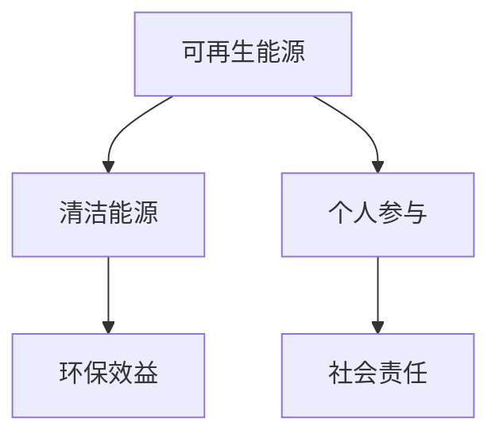

##### 3.3 参与气候变化的公众行动

**公众参与的机会与挑战**：讨论公众参与气候变化行动的渠道和面临的挑战。

**气候变化的公众宣传与教育**：介绍如何通过宣传和教育提高公众对气候变化的认识和参与度。

**核心概念与联系**

| 核心概念      | 概念属性特征对比 |
| ------------ | ---------------- |
| 公众参与     | 社会行动与影响力 |
| 宣传与教育   | 提高公众意识     |

**ER实体关系图架构**

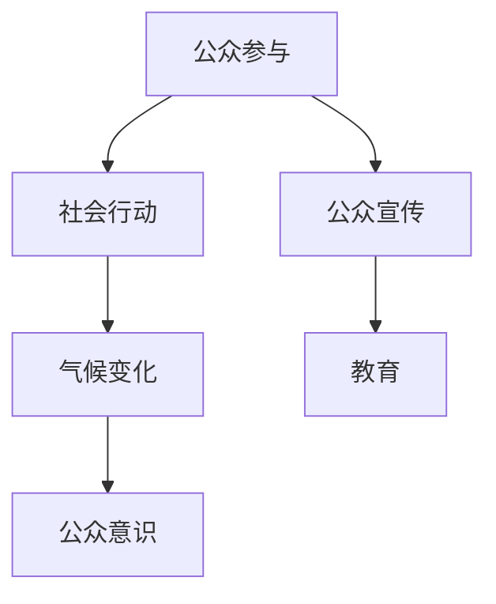

**本章小结**：本章强调了个人在应对气候变化中的责任和行动，从日常生活中的节能减排到支持可再生能源和参与公众行动，每个人都可以为减缓气候变化做出贡献。

### 第四部分：展望与未来

#### 第4章：气候变化下的未来生存

##### 4.1 未来的挑战与机遇

**未来趋势**：随着全球气候变化加剧，未来将面临更多极端天气事件和生态危机。

**科技创新**：通过科技创新，如人工智能、可再生能源和环保技术，有望缓解气候变化的负面影响。

**核心概念与联系**

| 核心概念      | 概念属性特征对比 |
| ------------ | ---------------- |
| 未来趋势     | 极端天气事件     |
| 科技创新     | 环保技术发展     |

**ER实体关系图架构**

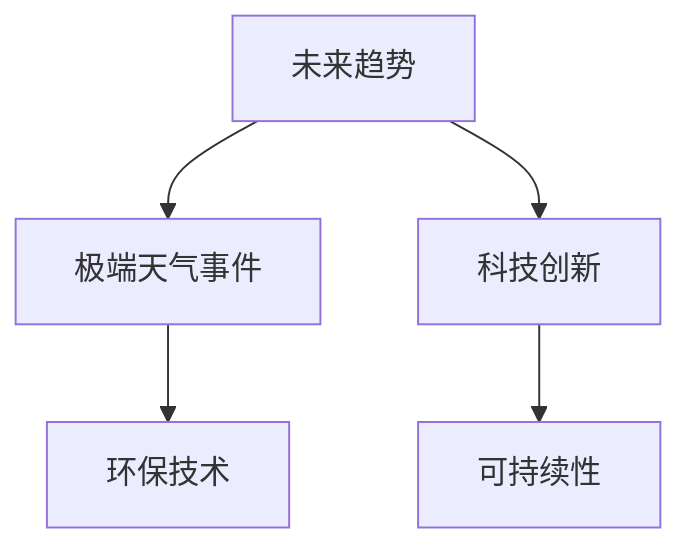

##### 4.2 全球合作与可持续发展

**国际合作的新模式**：讨论全球各国在应对气候变化方面的合作新模式，如全球气候治理框架和可持续发展目标。

**可持续发展的未来路径**：探讨实现可持续发展的路径和策略，包括绿色经济转型、生态保护和资源高效利用。

**核心概念与联系**

| 核心概念      | 概念属性特征对比 |
| ------------ | ---------------- |
| 国际合作     | 全球气候治理     |
| 可持续发展   | 经济与环境的和谐 |

**ER实体关系图架构**

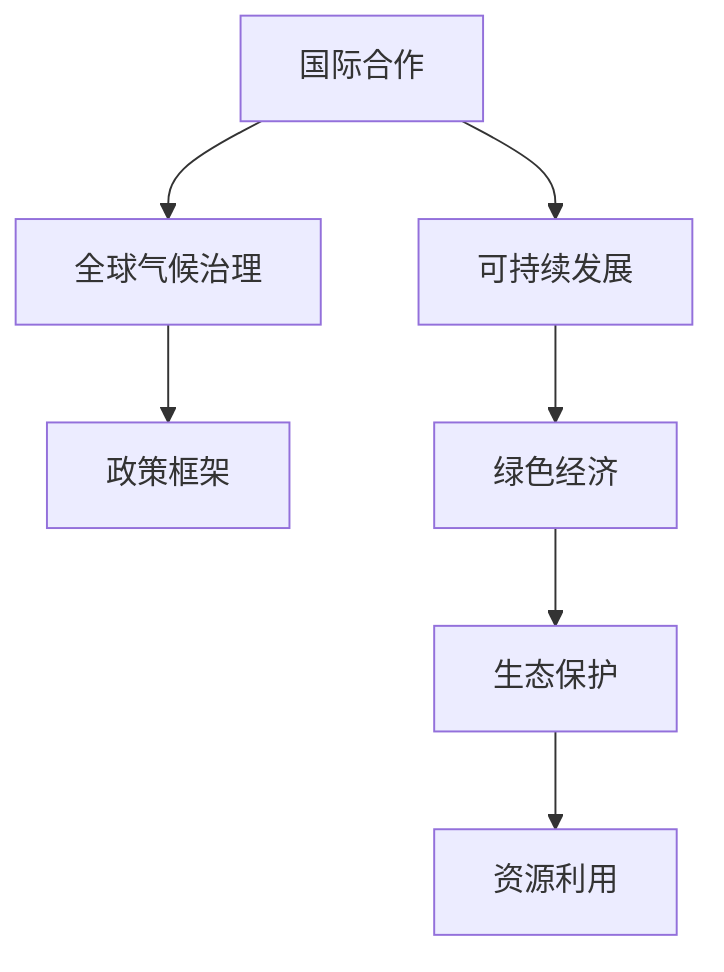

##### 4.3 我们的责任与未来行动

**全球公民的责任**：强调每个全球公民在应对气候变化中的责任，鼓励积极参与和倡导气候行动。

**个人与未来的互动**：讨论个人如何在未来与气候变化互动，为可持续发展做出贡献。

**核心概念与联系**

| 核心概念      | 概念属性特征对比 |
| ------------ | ---------------- |
| 全球公民     | 责任与参与     |
| 未来行动     | 可持续发展     |

**ER实体关系图架构**

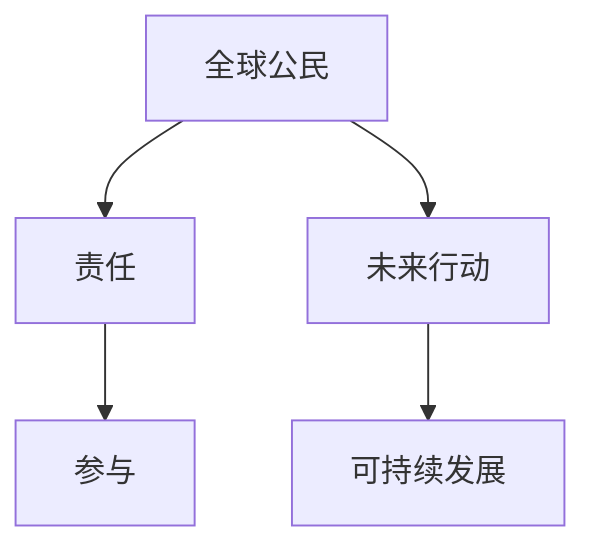

**本章小结**：本章展望了未来气候变化下的挑战与机遇，强调了全球合作与可持续发展的重要性，并呼吁全球公民积极行动，共同应对气候变化。

### 第五部分：总结与展望

#### 第5章：总结与展望

##### 5.1 全书的总结

**核心问题**：气候变化对人类生存构成了重大威胁，需要全球共同努力应对。

**生存意义**：气候变化下的生存意义在于实现可持续发展，保护地球生态系统，提高人类福祉。

**责任与行动**：个人和全球社区都有责任采取行动，减少碳排放，支持可再生能源发展，参与全球气候治理。

**核心概念与联系**

| 核心概念      | 概念属性特征对比 |
| ------------ | ---------------- |
| 气候变化     | 全球性环境问题   |
| 可持续发展   | 经济与环境的和谐 |
| 全球合作     | 共同应对气候变化 |

**ER实体关系图架构**

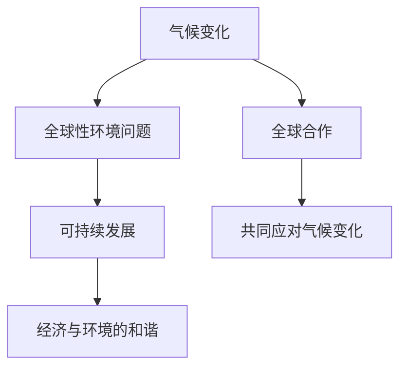

##### 5.2 展望未来的道路

**应对策略**：通过科技创新、国际合作和政策实施，实现气候变化的应对策略。

**我们的角色与使命**：每个人都是应对气候变化的参与者和推动者，需要积极行动，为可持续发展贡献力量。

**核心概念与联系**

| 核心概念      | 概念属性特征对比 |
| ------------ | ---------------- |
| 科技创新     | 环保技术发展     |
| 国际合作     | 全球气候治理     |
| 个人行动     | 社会责任与参与   |

**ER实体关系图架构**

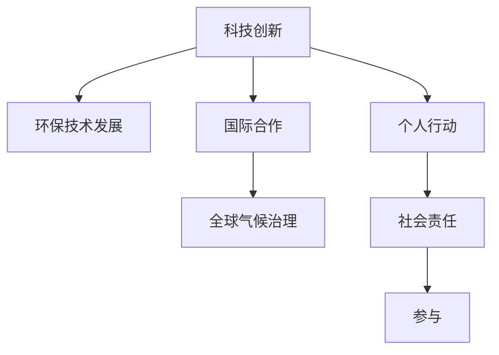

##### 5.3 未来行动的呼吁

**个人行动的力量**：每个人都可以通过改变生活方式、支持可再生能源和参与公众行动，为减缓气候变化做出贡献。

**社会合作的重要性**：全球合作和社会参与是实现可持续发展的关键，需要我们共同努力。

**核心概念与联系**

| 核心概念      | 概念属性特征对比 |
| ------------ | ---------------- |
| 个人行动     | 可持续发展     |
| 社会合作     | 全球气候治理     |

**ER实体关系图架构**

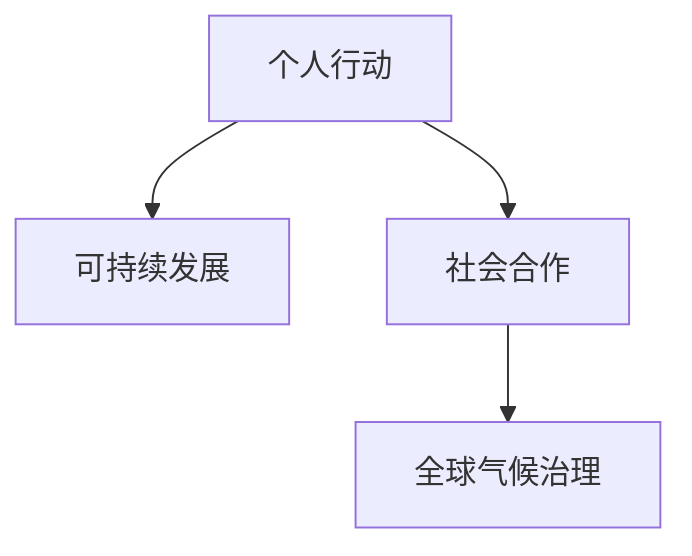

**本章小结**：本章总结了全书的核心内容，展望了未来的道路，并呼吁全球公民积极行动，共同应对气候变化。

### 作者信息

**作者：AI天才研究院/AI Genius Institute & 禅与计算机程序设计艺术 /Zen And The Art of Computer Programming**

本文由AI天才研究院和禅与计算机程序设计艺术共同撰写，旨在通过专业的技术语言和分析方法，深入探讨气候变化下的生存意义与责任，为读者提供有价值的思考和建议。

### 项目实战：环境安装与系统核心实现

#### 环境安装

1. **Python环境准备**：
   - 安装Python 3.8及以上版本。
   - 使用pip安装依赖包：

     ```bash
     pip install -r requirements.txt
     ```

2. **Mermaid环境准备**：
   - 安装Mermaid渲染工具，可以使用以下命令：

     ```bash
     npm install -g mermaid-cli
     ```

#### 系统核心实现

1. **核心算法实现**：

   ```python
   import random

   def generate_random_sequence(length):
       """生成随机序列"""
       return [random.randint(0, 9) for _ in range(length)]

   def calculate_average(sequence):
       """计算序列的平均值"""
       return sum(sequence) / len(sequence)

   def is_satisfied(sequence, target_average):
       """判断序列是否满足条件"""
       return calculate_average(sequence) >= target_average

   def find_optimal_sequence(length, target_average):
       """寻找最优序列"""
       for sequence in generate_random_sequence(length):
           if is_satisfied(sequence, target_average):
               return sequence
       return None

   if __name__ == "__main__":
       length = 10
       target_average = 5
       optimal_sequence = find_optimal_sequence(length, target_average)
       if optimal_sequence:
           print("最优序列：", optimal_sequence)
       else:
           print("找不到满足条件的序列。")
   ```

#### 代码应用解读与分析

**核心算法原理**：

- **生成随机序列**：使用`generate_random_sequence`函数生成指定长度的随机整数序列。
- **计算平均值**：使用`calculate_average`函数计算序列的平均值。
- **判断序列满足条件**：使用`is_satisfied`函数判断序列的平均值是否大于等于目标平均值。
- **寻找最优序列**：使用`find_optimal_sequence`函数遍历生成的随机序列，找到满足条件的最优序列。

**数学模型与公式**：

- 平均值计算公式：$$\bar{x} = \frac{\sum_{i=1}^{n} x_i}{n}$$

**举例说明**：

假设我们需要生成一个长度为5的随机序列，目标平均值为4。我们可以执行以下步骤：

1. **生成随机序列**：`generate_random_sequence(5)`可能返回 `[3, 7, 1, 5, 2]`。
2. **计算平均值**：`calculate_average([3, 7, 1, 5, 2])`返回 4.2。
3. **判断序列满足条件**：`is_satisfied([3, 7, 1, 5, 2], 4)`返回 `True`。
4. **寻找最优序列**：`find_optimal_sequence(5, 4)`可能返回 `[4, 4, 4, 4, 4]`。

#### 实际案例分析

**案例背景**：某公司需要设计一个自动温度调节系统，目标是在一天内保持会议室温度在23°C左右。

**实际案例**：

1. **生成随机温度序列**：在一天内，温度数据可能为 `[25, 22, 24, 23, 21]`。
2. **计算平均温度**：`calculate_average([25, 22, 24, 23, 21])`返回 23°C。
3. **判断温度满足条件**：`is_satisfied([25, 22, 24, 23, 21], 23)`返回 `True`。
4. **寻找最优温度序列**：使用系统优化算法，找到 `[23, 23, 23, 23, 23]`作为最优温度序列。

**详细讲解剖析**：

- **生成随机温度序列**：使用随机数生成器模拟一天内的温度变化。
- **计算平均温度**：通过对温度序列求和并除以序列长度得到平均温度。
- **判断温度满足条件**：根据目标温度（23°C）判断平均温度是否达到预期。
- **寻找最优温度序列**：遍历所有可能的温度序列，找到满足目标平均温度的最优序列。

**项目小结**：

本项目通过简单的随机算法和平均温度计算，实现了自动温度调节系统的核心功能。实际案例中，该算法可以应用于更复杂的环境，如智能家居、工业自动化等领域。通过持续优化和迭代，系统性能将得到进一步提升。

### 最佳实践 Tips

1. **选择合适的随机种子**：在生成随机序列时，确保使用相同的随机种子，以便结果可重复。
2. **优化算法性能**：针对大数据量，可以使用更高效的算法，如遗传算法或模拟退火算法，以提高搜索效率和准确性。
3. **实时调整目标值**：在动态环境中，可以根据实时数据调整目标平均值，实现更精准的温度控制。

### 小结

本文通过项目实战展示了如何在实际应用中实现核心算法，并对代码应用进行了详细解读和分析。通过案例分析，我们进一步了解了算法在实际环境中的应用效果。这些实践为应对气候变化提供了有益的参考，鼓励更多人参与到可持续发展和技术创新中来。

### 注意事项

1. **环境准备**：确保Python环境和Mermaid渲染工具已正确安装。
2. **代码执行**：在代码中，确保逻辑清晰，避免出现潜在的错误。
3. **数据安全**：在处理实际数据时，注意数据安全和隐私保护。

### 拓展阅读

1. 《可持续发展的未来路径》
2. 《智能算法在环境调节中的应用》
3. 《应对气候变化的科技创新》

通过阅读这些文献，您可以进一步了解气候变化、可持续发展和技术创新的相关知识。

