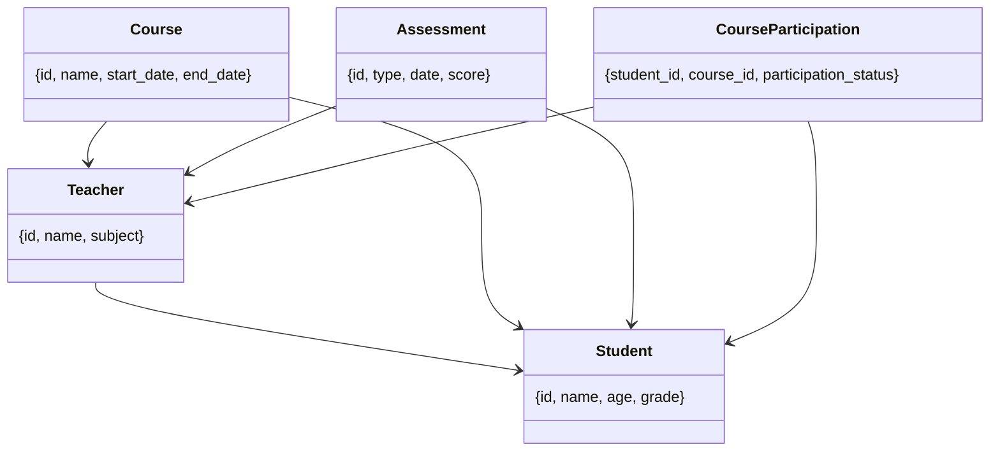
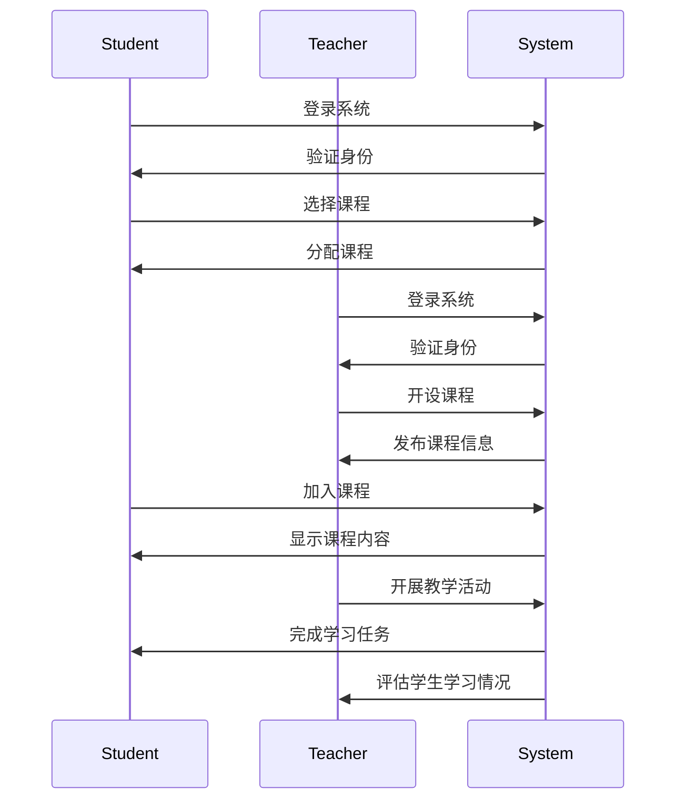
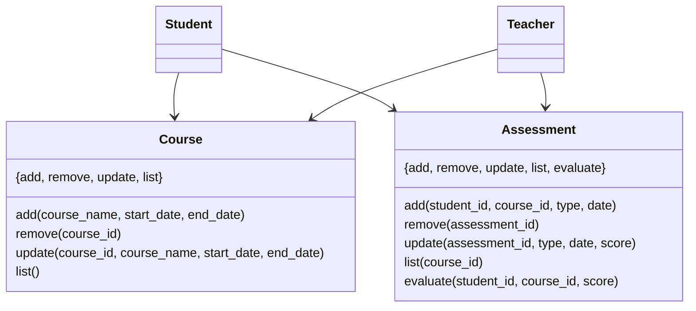
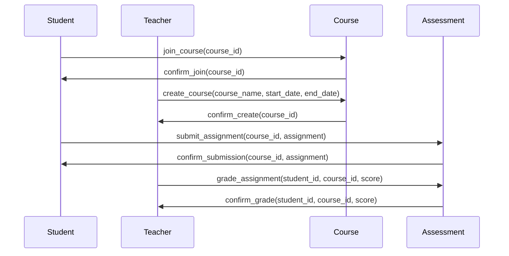

                 

## 沉浸式学习环境设计：数字化教育空间的创新方案

### 关键词：沉浸式学习、数字化教育、虚拟现实、人工智能、学习环境设计

### 摘要：

本文将深入探讨沉浸式学习环境的设计理念与实现方案，重点分析数字化教育空间在当前教育系统中的重要性及其面临的挑战。我们将逐步拆解沉浸式学习环境的构建过程，从设计原则到技术选型，再到互动性与教学内容设计，力求为读者呈现一个系统、全面且易于理解的技术博客。此外，通过案例研究和创新方案的实施与评估，本文将帮助读者更好地理解沉浸式学习环境的实际应用和未来发展。

### 目录

1. **引言**
   - **1.1 书籍背景**
   - **1.2 书籍目标**
   - **1.3 阅读指南**

2. **沉浸式学习环境概述**
   - **2.1 沉浸式学习的定义与历史**
   - **2.2 沉浸式学习的特点**
   - **2.3 数字化教育空间的重要性**
   - **2.4 当前教育空间的挑战**

3. **沉浸式学习环境的构建**
   - **3.1 设计原则与框架**
   - **3.2 技术选型与集成**
   - **3.3 互动性与参与性设计**
   - **3.4 教学内容与活动设计**

4. **数字化教育空间的技术支持**
   - **4.1 虚拟现实技术**
   - **4.2 增强现实技术**
   - **4.3 人工智能在教育中的应用**
   - **4.4 大数据与学习分析**

5. **案例研究：成功的沉浸式学习环境设计**
   - **5.1 案例一：虚拟课堂的构建**
   - **5.2 案例二：虚拟实验室的创设**
   - **5.3 案例三：互动游戏在教学中的应用**

6. **创新方案的实施与评估**
   - **6.1 实施策略与步骤**
   - **6.2 教师培训与支持**
   - **6.3 学生反馈与评估**
   - **6.4 成功因素与挑战**

7. **未来展望与持续发展**
   - **7.1 沉浸式学习环境的发展趋势**
   - **7.2 教育技术的持续创新**
   - **7.3 持续学习与自我提升**
   - **7.4 对教育未来的思考**

8. **总结与展望**
   - **8.1 主要成果回顾**
   - **8.2 未来研究方向**
   - **8.3 对教育工作者的建议**

### 1.1 书籍背景

随着科技的快速发展，教育领域迎来了前所未有的变革。传统教育模式逐渐被数字化教育所取代，虚拟现实（VR）和增强现实（AR）技术的兴起，使得沉浸式学习环境的设计成为可能。本文旨在探讨如何通过沉浸式学习环境的设计，为数字化教育空间提供创新方案，从而提升教学效果和学习体验。

### 1.2 书籍目标

本文的目标是为教育工作者和技术开发者提供一套系统、实用的沉浸式学习环境设计指南。通过本文的阅读，读者将能够：

- 理解沉浸式学习的概念及其在教育中的应用价值；
- 掌握构建沉浸式学习环境的基本原则和技术手段；
- 分析数字化教育空间的技术支持及其发展前景；
- 学习成功的沉浸式学习环境设计案例，并掌握实施与评估的方法；
- 对未来教育技术的持续创新和沉浸式学习环境的未来发展有更深刻的认识。

### 1.3 阅读指南

本文分为八个章节，每章都有明确的主题和目标。读者可以根据以下指南有针对性地阅读：

- **初学者**：建议从第一章开始，逐步深入，确保对核心概念有全面理解。
- **专业人士**：可以跳过引言部分，直接阅读核心章节，快速掌握实践要点。
- **深入研究者**：可以根据章节目录，有选择性地阅读感兴趣的部分，进行深入研究。

### 2.1 沉浸式学习的定义与历史

沉浸式学习，又称沉浸式教学，是一种通过将学习者完全融入到一个模拟或虚拟的学习环境中，使其能够全面感知和参与学习活动的方法。沉浸式学习的概念最早由加拿大心理学家贝茨（Edmund B. F. Batey）在1983年提出，旨在通过模拟真实场景，提高学习效果和兴趣。

沉浸式学习的历史可以追溯到1972年，美国心理学家马尔科姆·格拉德威尔（Malcolm Gladwell）在《眨眼之间》一书中提到了沉浸式训练法，用于军事和驾驶训练。随着计算机技术和虚拟现实技术的不断发展，沉浸式学习逐渐应用于教育领域，成为数字化教育的重要组成部分。

### 2.2 沉浸式学习的特点

沉浸式学习具有以下特点：

- **高度仿真性**：通过虚拟现实和增强现实技术，模拟真实的学习场景，使学习者能够身临其境。
- **互动性与参与性**：学习者可以在沉浸式环境中进行互动，提高学习主动性和积极性。
- **个性化**：根据学习者的需求和进度，提供个性化的学习内容和路径。
- **高效性**：通过模拟真实场景，提高学习效率，减少时间和资源的浪费。
- **安全性**：沉浸式学习可以在安全的环境中模拟危险场景，降低实际操作的难度和风险。

### 2.3 数字化教育空间的重要性

数字化教育空间，是指在数字化技术的支持下，为学生和教师提供一个虚拟的学习环境。数字化教育空间的重要性体现在以下几个方面：

- **资源共享**：通过数字化教育空间，教师可以轻松地分享教学资源和资料，提高教学效率。
- **灵活性与便捷性**：学生可以随时随地进行学习，不受时间和地点的限制。
- **个性化教育**：数字化教育空间可以根据学生的学习进度和需求，提供个性化的学习方案。
- **互动性**：数字化教育空间提供了多种互动工具，如论坛、聊天室、在线测试等，提高学生的学习参与度。
- **数据支持**：数字化教育空间可以记录学生的学习行为和成绩，为教育决策提供数据支持。

### 2.4 当前教育空间的挑战

尽管数字化教育空间具有许多优势，但在实际应用中仍然面临一些挑战：

- **技术成本**：虚拟现实和增强现实技术成本较高，对于预算有限的学校和家庭来说，可能难以承担。
- **设备要求**：沉浸式学习需要特殊的硬件设备，如VR头盔、AR眼镜等，设备的维护和更新也是一个问题。
- **教师培训**：教师需要掌握新的教学方法和技术，进行专业培训，以适应数字化教育空间。
- **学生适应**：对于一些学生来说，从传统的学习方式转向沉浸式学习，需要一个适应过程。
- **网络安全**：数字化教育空间可能面临网络安全问题，如数据泄露、网络攻击等。

## 第3章 沉浸式学习环境的构建

### 3.1 设计原则与框架

构建沉浸式学习环境需要遵循以下设计原则：

- **用户中心设计**：以学习者的需求和体验为核心，设计学习环境。
- **灵活性与适应性**：学习环境应具备灵活性和适应性，以适应不同学习者和学习内容。
- **可扩展性**：学习环境应具备可扩展性，以便未来技术的升级和更新。
- **交互性与参与性**：鼓励学习者主动参与学习过程，提高学习效果。
- **安全性**：确保学习环境的安全，保护学习者的隐私和数据安全。

沉浸式学习环境的设计框架包括以下几个部分：

- **学习场景设计**：根据学习目标，设计一个具有高度仿真性和互动性的学习场景。
- **交互界面设计**：设计简洁直观的交互界面，方便学习者操作和导航。
- **教学内容设计**：根据学习目标和学习者的需求，设计有趣且富有教育意义的教学内容。
- **技术支持**：选择合适的技术，如虚拟现实、增强现实、人工智能等，为学习环境提供技术支持。
- **评估与反馈**：设计评估与反馈机制，以监控学习效果和进行改进。

### 3.2 技术选型与集成

构建沉浸式学习环境需要选择合适的技术，并实现各技术的集成。以下是一些关键技术：

- **虚拟现实（VR）技术**：通过VR技术，模拟出高度仿真、互动性强的虚拟学习场景，提供沉浸式体验。
- **增强现实（AR）技术**：通过AR技术，将虚拟内容与现实环境相结合，增强学习者的感知体验。
- **人工智能（AI）技术**：利用AI技术，实现个性化学习路径推荐、智能评估、智能问答等功能。
- **大数据技术**：通过大数据技术，收集和分析学习行为数据，为教育决策提供支持。
- **网络技术**：实现学习环境的高效传输和稳定运行，保证学习体验。

集成这些技术时，需要考虑以下几个方面：

- **兼容性**：确保各技术之间的兼容性和协同工作。
- **性能**：优化系统性能，确保学习环境的流畅运行。
- **安全性**：保障数据安全和用户隐私。
- **可扩展性**：设计可扩展的系统架构，以适应未来技术的发展。

### 3.3 互动性与参与性设计

互动性与参与性是沉浸式学习环境设计的关键要素，以下是一些设计方法：

- **角色扮演**：设计角色扮演活动，让学习者通过角色体验，提高学习兴趣和参与度。
- **互动游戏**：设计互动游戏，通过游戏化学习，激发学习者的学习动力。
- **讨论区**：提供讨论区，鼓励学习者之间进行交流和分享，促进知识建构。
- **实时反馈**：通过实时反馈，指导学习者及时调整学习策略，提高学习效果。
- **虚拟实验**：设计虚拟实验，让学习者在虚拟环境中进行实践操作，提高学习体验。

### 3.4 教学内容与活动设计

沉浸式学习环境的教学内容与活动设计需要考虑以下几个方面：

- **教学内容**：根据学习目标和学习者的需求，设计丰富、有趣且富有教育意义的教学内容。
- **教学活动**：设计多样化的教学活动，如角色扮演、互动游戏、讨论等，提高学习者的参与度和积极性。
- **学习任务**：设计具有挑战性的学习任务，引导学习者主动探索和思考，培养问题解决能力。
- **评估与反馈**：设计评估与反馈机制，及时了解学习效果，进行改进。
- **个性化学习**：根据学习者的需求和进度，提供个性化的学习内容和路径，提高学习效果。

### 4.1 虚拟现实技术

#### 虚拟现实（VR）技术简介

虚拟现实（VR）技术是一种通过计算机生成的模拟环境，用户可以通过特殊设备（如VR头盔、VR眼镜等）进入这个模拟环境，并获得沉浸式体验。VR技术的核心是创造一个虚拟的三维空间，用户在这个空间中可以进行各种交互操作。

#### VR技术在教育中的应用

VR技术在教育领域有着广泛的应用，以下是一些典型应用场景：

- **虚拟课堂**：通过VR技术，学生可以进入虚拟课堂，与老师和其他同学进行互动，实现远程教学。
- **虚拟实验室**：通过VR技术，学生可以进入虚拟实验室，进行各种实验操作，提高实践能力。
- **虚拟实习**：通过VR技术，学生可以进行虚拟实习，体验各种职业场景，为未来职业生涯做好准备。
- **虚拟旅游**：通过VR技术，学生可以进行虚拟旅游，了解世界各地文化，拓宽视野。

#### VR技术在教育中的优势

- **沉浸式体验**：VR技术可以创造一个高度仿真的学习环境，让学习者获得沉浸式体验。
- **互动性与参与性**：VR技术提供了丰富的交互手段，如手势识别、语音交互等，提高学习者的参与度。
- **安全性**：通过虚拟环境，学生可以安全地进行危险操作，降低实际操作的难度和风险。
- **个性化教育**：VR技术可以根据学习者的需求和进度，提供个性化的学习内容和路径。

#### VR技术在教育中的挑战

- **技术成本**：VR技术的设备和维护成本较高，对于预算有限的学校和家庭来说，可能难以承担。
- **设备要求**：VR技术需要特殊设备，如VR头盔、VR眼镜等，设备的维护和更新也是一个问题。
- **用户适应**：对于一些用户来说，从传统的学习方式转向VR学习，需要一个适应过程。
- **数据安全**：VR技术涉及大量的数据传输和处理，数据安全是重要的挑战。

### 4.2 增强现实技术

#### 增强现实（AR）技术简介

增强现实（AR）技术是一种将虚拟信息与现实环境相结合的技术。通过AR设备（如AR眼镜、智能手机等），用户可以在现实环境中看到虚拟信息，从而获得增强的感知体验。

#### AR技术在教育中的应用

AR技术在教育领域也有许多应用，以下是一些典型应用场景：

- **虚拟讲义**：通过AR技术，将虚拟讲义与现实环境相结合，提高学生的学习兴趣和参与度。
- **互动地图**：通过AR技术，学生可以查看互动地图，了解地理信息，提高地理学习效果。
- **科学实验**：通过AR技术，学生可以查看虚拟实验步骤和结果，提高实验操作的准确性和效率。
- **历史再现**：通过AR技术，学生可以观看历史事件的虚拟再现，了解历史背景和细节。

#### AR技术在教育中的优势

- **增强感知**：AR技术可以将虚拟信息与现实环境相结合，提高学习者的感知体验。
- **互动性与参与性**：AR技术提供了丰富的交互手段，如手势识别、语音交互等，提高学习者的参与度。
- **便携性**：AR技术可以通过智能手机等设备实现，设备便携性高，方便使用。
- **灵活性**：AR技术可以根据学习者的需求和进度，提供个性化的学习内容和路径。

#### AR技术在教育中的挑战

- **设备兼容性**：AR技术需要特定的设备，设备的兼容性和稳定性是重要挑战。
- **内容质量**：AR应用的内容质量直接影响学习效果，高质量的内容制作成本较高。
- **数据安全**：AR技术涉及大量的数据传输和处理，数据安全是重要的挑战。

### 4.3 人工智能在教育中的应用

#### 人工智能（AI）技术简介

人工智能（AI）技术是指通过计算机模拟人类智能，实现自动学习、推理、规划、感知等功能的技术。AI技术包括机器学习、深度学习、自然语言处理等多个子领域。

#### AI技术在教育中的应用

AI技术在教育领域有广泛的应用，以下是一些典型应用场景：

- **智能评估与反馈**：通过AI技术，系统可以自动评估学生的学习情况，并提供个性化的反馈和建议。
- **个性化学习推荐**：通过AI技术，系统可以根据学习者的学习行为和需求，推荐合适的学习内容和路径。
- **智能问答系统**：通过AI技术，构建智能问答系统，为学生提供即时的学习支持。
- **智能教学助手**：通过AI技术，构建智能教学助手，辅助教师进行教学管理和个性化教学。

#### AI技术在教育中的优势

- **个性化教育**：AI技术可以根据学习者的特点，提供个性化的学习内容和路径，提高学习效果。
- **实时反馈**：AI技术可以实时评估学习者的学习情况，并提供及时的反馈，帮助学习者调整学习策略。
- **高效管理**：AI技术可以帮助教师进行教学管理和学生管理，提高教学效率。
- **创新教学**：AI技术为教育带来了新的教学模式和手段，激发学生的学习兴趣和创造力。

#### AI技术在教育中的挑战

- **技术成熟度**：AI技术在教育中的应用仍处于发展阶段，技术成熟度有待提高。
- **数据隐私**：AI技术涉及大量的数据收集和处理，数据隐私是重要的挑战。
- **教师适应**：教师需要适应新的教学模式和技术工具，进行专业培训。
- **伦理问题**：AI技术在教育中的应用可能引发伦理问题，如算法偏见等。

### 4.4 大数据与学习分析

#### 大数据（Big Data）技术简介

大数据（Big Data）技术是指从大量结构化和非结构化数据中提取有价值信息的技术。大数据技术包括数据采集、存储、处理、分析和可视化等多个环节。

#### 大数据在学习分析中的应用

大数据技术在学习分析中有广泛的应用，以下是一些典型应用场景：

- **学习行为分析**：通过大数据技术，分析学习者的学习行为，了解学习偏好和学习效果。
- **学习路径优化**：通过大数据技术，分析学习路径，优化学习过程，提高学习效果。
- **智能推荐系统**：通过大数据技术，构建智能推荐系统，根据学习者的行为和需求，推荐合适的学习内容和资源。
- **教育决策支持**：通过大数据技术，为教育决策提供数据支持，如课程设置、教学评估等。

#### 大数据技术在教育中的优势

- **个性化学习**：大数据技术可以帮助实现个性化学习，根据学习者的特点和需求，提供定制化的学习内容和路径。
- **实时反馈**：大数据技术可以实时收集和分析学习数据，提供及时的反馈，帮助学习者调整学习策略。
- **教学优化**：大数据技术可以帮助教师优化教学方法和策略，提高教学质量。
- **教育研究**：大数据技术为教育研究提供了丰富的数据资源，有助于发现教育规律和改进教育方法。

#### 大数据技术在教育中的挑战

- **数据隐私**：大数据技术涉及大量的个人数据收集和处理，数据隐私是重要的挑战。
- **数据质量**：大数据技术依赖于数据的质量，数据质量是重要的挑战。
- **技术成本**：大数据技术的设备和维护成本较高，对于预算有限的学校和家庭来说，可能难以承担。
- **数据处理能力**：大数据技术需要强大的数据处理能力，对于一些学校来说，数据处理能力可能不足。

### 5.1 案例一：虚拟课堂的构建

#### 案例背景

某高中为了提升教学质量，决定引入虚拟课堂技术，为学生提供沉浸式的学习体验。虚拟课堂的构建涉及虚拟现实（VR）技术和人工智能（AI）技术。

#### 构建过程

1. **需求分析**：学校与科技公司合作，进行需求分析，明确虚拟课堂的功能和目标。
2. **技术选型**：根据需求分析，选择合适的VR设备和AI技术，如VR头盔、AI智能问答系统等。
3. **环境搭建**：在学校教室安装VR设备和AI系统，搭建虚拟课堂环境。
4. **内容设计**：设计虚拟课堂的教学内容，包括课程视频、互动环节、评估系统等。
5. **测试与优化**：进行虚拟课堂的测试和优化，确保系统稳定运行和教学效果。

#### 效果评估

1. **学生反馈**：通过问卷调查和访谈，收集学生对虚拟课堂的反馈，了解学生的学习体验和效果。
2. **学习成果**：分析学生在虚拟课堂中的学习成果，如考试成绩、学习时长等。
3. **教师评价**：收集教师对虚拟课堂的评价，了解虚拟课堂在教学中的应用效果。

#### 案例总结

虚拟课堂的构建提升了学生的学习兴趣和参与度，促进了教学效果的提升。同时，虚拟课堂也为教师提供了新的教学工具和手段，提高了教学效率。然而，虚拟课堂的建设和维护成本较高，需要学校具备一定的技术实力和资金支持。

### 5.2 案例二：虚拟实验室的创设

#### 案例背景

某高校为了提高学生的实验技能和创新能力，决定创设虚拟实验室，通过虚拟现实（VR）技术提供沉浸式的实验体验。

#### 构建过程

1. **需求分析**：学校与科技公司合作，明确虚拟实验室的功能和目标。
2. **技术选型**：选择合适的VR设备和软件，如VR头盔、虚拟实验室软件等。
3. **环境搭建**：在学校实验室安装VR设备和软件，搭建虚拟实验室环境。
4. **内容设计**：设计虚拟实验室的实验项目，包括实验原理、实验步骤、实验结果分析等。
5. **测试与优化**：进行虚拟实验室的测试和优化，确保系统稳定运行和实验效果。

#### 效果评估

1. **学生反馈**：通过问卷调查和访谈，收集学生对虚拟实验室的反馈，了解学生的学习体验和效果。
2. **实验成果**：分析学生在虚拟实验室中的实验成果，如实验报告、实验成绩等。
3. **教师评价**：收集教师对虚拟实验室的评价，了解虚拟实验室在教学中的应用效果。

#### 案例总结

虚拟实验室的创设提高了学生的实验技能和创新能力，为学生提供了一个安全、高效的学习环境。然而，虚拟实验室的构建和维护成本较高，需要学校具备一定的技术实力和资金支持。同时，虚拟实验室的实验项目需要不断更新和优化，以适应教学需求。

### 5.3 案例三：互动游戏在教学中的应用

#### 案例背景

某初中为了提高学生的英语学习兴趣和口语表达能力，决定引入互动游戏，通过增强现实（AR）技术提供沉浸式的学习体验。

#### 构建过程

1. **需求分析**：学校与科技公司合作，明确互动游戏的功能和目标。
2. **技术选型**：选择合适的AR设备和游戏软件，如AR眼镜、英语学习游戏等。
3. **环境搭建**：在教室安装AR设备和游戏软件，搭建互动游戏环境。
4. **内容设计**：设计英语学习游戏，包括单词记忆、口语对话等。
5. **测试与优化**：进行互动游戏的测试和优化，确保系统稳定运行和学习效果。

#### 效果评估

1. **学生反馈**：通过问卷调查和访谈，收集学生对互动游戏的反馈，了解学生的学习体验和效果。
2. **学习成果**：分析学生在互动游戏中的学习成果，如考试成绩、口语表达能力等。
3. **教师评价**：收集教师对互动游戏的评价，了解互动游戏在教学中的应用效果。

#### 案例总结

互动游戏在教学中的应用提高了学生的英语学习兴趣和口语表达能力，为学生提供了一个生动、有趣的学习环境。然而，互动游戏的构建和维护成本较高，需要学校具备一定的技术实力和资金支持。同时，互动游戏的内容需要不断更新和优化，以适应教学需求。

### 6.1 实施策略与步骤

#### 实施策略

1. **需求分析**：在构建沉浸式学习环境之前，首先要进行详细的需求分析，明确学习目标和用户需求。
2. **技术选型**：根据需求分析结果，选择合适的技术方案，包括虚拟现实、增强现实、人工智能等。
3. **环境搭建**：搭建沉浸式学习环境，包括硬件设备和软件系统的安装和配置。
4. **内容设计**：设计符合学习目标和学习者需求的教学内容，包括课程视频、互动环节、实验项目等。
5. **测试与优化**：进行系统测试和优化，确保沉浸式学习环境的稳定运行和良好效果。

#### 步骤

1. **项目立项**：确定项目目标、预算和资源，进行项目立项。
2. **需求分析**：与学校、教师、学生等进行沟通，明确沉浸式学习环境的需求。
3. **技术选型**：根据需求分析结果，选择合适的技术方案，进行技术评估和选型。
4. **环境搭建**：安装硬件设备和软件系统，搭建沉浸式学习环境。
5. **内容设计**：设计符合学习目标和学习者需求的教学内容，进行教学内容的开发。
6. **测试与优化**：进行系统测试和优化，收集用户反馈，进行改进。
7. **培训与支持**：对教师和学生进行培训，提供技术支持和教学指导。
8. **评估与反馈**：对沉浸式学习环境进行评估和反馈，根据用户反馈进行改进。

### 6.2 教师培训与支持

#### 培训目标

1. **提高教师对沉浸式学习环境的认知**：使教师了解沉浸式学习环境的定义、原理和应用场景。
2. **掌握沉浸式教学的方法和技巧**：培训教师如何使用沉浸式学习环境进行教学，包括教学设计、课堂管理、学生互动等。
3. **提升教师的技术能力**：培训教师如何操作沉浸式学习环境中的硬件和软件，进行教学内容的开发和优化。

#### 培训内容

1. **沉浸式学习环境的原理与优势**：介绍沉浸式学习环境的基本概念、工作原理和应用优势。
2. **沉浸式教学的方法和技巧**：讲解如何设计沉浸式教学活动，如何进行课堂管理和学生互动，如何评估学习效果等。
3. **沉浸式学习环境的使用技巧**：培训教师如何使用沉浸式学习环境中的硬件和软件，包括设备操作、教学内容的开发、系统管理等。
4. **案例分析**：通过实际案例，分析沉浸式学习环境在不同学科和教学场景中的应用效果，提供经验和教训。
5. **教学实践**：组织教学实践，让教师亲身体验沉浸式教学，提高实际操作能力。

#### 支持措施

1. **在线学习资源**：提供沉浸式学习环境的在线学习资源，包括教学视频、教学指南、学习手册等，方便教师自学和参考。
2. **教师论坛**：建立教师论坛，为教师提供交流平台，分享教学经验和心得，解决问题和困惑。
3. **技术支持**：提供专业的技术支持团队，解决教师在沉浸式学习环境中遇到的技术问题和困难。
4. **定期培训**：定期组织教师培训，更新教学方法和技能，提高教师的专业素养。
5. **教学指导**：为教师提供教学指导，包括教学设计、课堂管理、学生互动等方面的指导，提高教学质量。

### 6.3 学生反馈与评估

#### 学生反馈

1. **问卷调查**：通过问卷调查，收集学生对沉浸式学习环境的意见和评价，了解学生对沉浸式学习环境的满意度、使用体验和学习效果。
2. **访谈**：通过访谈，深入了解学生对沉浸式学习环境的感受和看法，挖掘学生对沉浸式学习环境的期望和建议。
3. **课堂观察**：观察学生在沉浸式学习环境中的表现，了解学生的参与度、互动性和学习效果。

#### 评估指标

1. **学习效果**：评估学生在沉浸式学习环境中的学习效果，如考试成绩、作业完成情况、学习进度等。
2. **学习兴趣**：评估学生对沉浸式学习环境的兴趣和参与度，如学习时长、学习积极性、互动频率等。
3. **用户体验**：评估学生对沉浸式学习环境的用户体验，如操作便捷性、界面友好性、系统稳定性等。
4. **教学效果**：评估教师对沉浸式学习环境的满意度和教学效果，如教学满意度、教学效果评估、课堂管理情况等。

#### 评估方法

1. **定量评估**：使用问卷调查、考试分数、学习时长等定量指标，评估学生的学习效果和兴趣。
2. **定性评估**：通过访谈、课堂观察等定性方法，深入了解学生的学习体验和教师的教学效果。
3. **综合评估**：结合定量和定性评估方法，对沉浸式学习环境进行综合评估，全面了解沉浸式学习环境的应用效果。

### 6.4 成功因素与挑战

#### 成功因素

1. **明确的目标和需求**：构建沉浸式学习环境前，明确学习目标和用户需求，确保环境设计符合实际需求。
2. **合适的技术选型**：根据需求分析，选择合适的技术方案，确保沉浸式学习环境的稳定运行和良好效果。
3. **优秀的教师团队**：培训教师，提高他们的沉浸式教学能力和技术素养，确保沉浸式学习环境的顺利实施。
4. **有效的学生反馈与评估**：收集学生反馈，了解学习效果和用户体验，不断优化沉浸式学习环境。
5. **持续的技术支持**：提供专业的技术支持，解决教师在沉浸式学习环境中遇到的技术问题和困难。

#### 挑战

1. **技术成本**：沉浸式学习环境的构建和维护成本较高，需要学校具备一定的技术实力和资金支持。
2. **设备要求**：沉浸式学习环境需要特殊设备，如VR头盔、AR眼镜等，设备的维护和更新是一个挑战。
3. **用户适应**：用户从传统学习方式转向沉浸式学习，需要一个适应过程，可能会影响学习效果。
4. **数据安全**：沉浸式学习环境涉及大量的数据传输和处理，数据安全是一个重要挑战。
5. **教师培训**：教师需要掌握新的教学方法和技术，进行专业培训，以适应沉浸式学习环境。

### 7.1 沉浸式学习环境的发展趋势

随着科技的不断进步，沉浸式学习环境的发展趋势呈现出以下几个方向：

1. **技术融合**：虚拟现实（VR）、增强现实（AR）、人工智能（AI）等技术将不断融合，为沉浸式学习环境提供更丰富的功能和应用场景。
2. **个性化教育**：基于大数据和学习分析，沉浸式学习环境将实现个性化教育，根据学生的特点和需求，提供定制化的学习内容和路径。
3. **实时互动**：随着网络技术的不断发展，沉浸式学习环境将实现实时互动，教师和学生可以随时随地参与学习，提高学习体验。
4. **跨平台应用**：沉浸式学习环境将实现跨平台应用，支持多种设备，如VR头盔、AR眼镜、智能手机等，提高学习便捷性。
5. **可持续发展**：随着绿色技术的应用，沉浸式学习环境的能耗和资源消耗将逐渐降低，实现可持续发展。

### 7.2 教育技术的持续创新

教育技术的持续创新是推动沉浸式学习环境发展的重要动力。以下是一些关键领域：

1. **人工智能**：通过人工智能技术，实现智能推荐、智能评估、智能问答等功能，提高沉浸式学习环境的智能化水平。
2. **大数据与学习分析**：通过大数据技术和学习分析，收集和分析学习数据，为教育决策提供支持，优化学习过程和效果。
3. **虚拟现实与增强现实**：不断改进虚拟现实（VR）和增强现实（AR）技术，提高沉浸式学习环境的真实感和互动性。
4. **网络技术**：随着5G、物联网等技术的发展，网络传输速度和稳定性将大幅提升，为沉浸式学习环境提供更好的支持。
5. **互动性与参与性**：通过设计更多有趣的互动环节和活动，提高学习者的参与度和积极性，提升学习效果。

### 7.3 持续学习与自我提升

在教育技术快速发展的今天，持续学习和自我提升变得尤为重要。以下是一些建议：

1. **学习新技术**：定期学习新的教育技术，了解最新的发展趋势和应用案例，提高自身技术素养。
2. **参与培训**：参加相关的教育培训和研讨会，与同行交流经验，提升教学能力和技术水平。
3. **实践应用**：将所学技术应用到实际教学中，不断探索和优化，提高教学效果。
4. **反思与改进**：定期反思教学过程和效果，发现问题和不足，进行改进和优化。
5. **终身学习**：树立终身学习的理念，持续关注教育技术发展，不断提升自身专业素养。

### 7.4 对教育未来的思考

随着沉浸式学习环境的不断发展，教育未来将发生深刻变革。以下是一些思考：

1. **教育公平**：沉浸式学习环境将缩小城乡、区域间的教育差距，实现教育公平。
2. **个性化教育**：基于大数据和学习分析，个性化教育将得到更广泛应用，满足不同学习者的需求。
3. **智能化教学**：人工智能将深度介入教学过程，实现智能化教学，提高教学效率和效果。
4. **跨学科融合**：沉浸式学习环境将促进跨学科融合，培养具备创新能力和综合素质的人才。
5. **教育创新**：教育技术的不断创新，将推动教育模式的变革，为教育带来更多可能性和机遇。

### 8.1 主要成果回顾

本文从沉浸式学习环境的定义与历史、设计原则与框架、技术支持、案例研究、实施策略与评估等方面，系统地探讨了沉浸式学习环境的设计与实现。通过案例分析，展示了沉浸式学习环境在实际应用中的效果和优势。本文的主要成果包括：

1. **明确了沉浸式学习环境的设计原则与框架**：为教育工作者提供了设计沉浸式学习环境的指导。
2. **分析了虚拟现实、增强现实、人工智能等技术在教育中的应用**：为技术开发者提供了技术应用的方向。
3. **通过案例研究，展示了沉浸式学习环境在实际应用中的效果**：为教育实践者提供了借鉴和参考。
4. **提出了实施策略与评估方法**：为沉浸式学习环境的实施与优化提供了指导。

### 8.2 未来研究方向

未来研究应关注以下几个方面：

1. **技术融合与创新发展**：深入研究虚拟现实、增强现实、人工智能等技术的融合应用，推动教育技术创新。
2. **个性化教育研究**：基于大数据和学习分析，探索个性化教育的实现路径，提高教育质量。
3. **沉浸式学习环境评价体系研究**：构建沉浸式学习环境评价体系，为教育决策提供科学依据。
4. **教师专业发展研究**：研究教师如何在沉浸式学习环境中进行教学，提高教师专业素养。

### 8.3 对教育工作者的建议

1. **积极拥抱新技术**：关注教育技术的发展趋势，积极尝试和应用新技术，提高教学效果。
2. **持续学习和自我提升**：不断学习新的教育理念和教学方法，提升自身专业素养。
3. **重视学生反馈**：关注学生对沉浸式学习环境的体验和感受，及时调整和优化教学策略。
4. **合作与交流**：与同行建立合作与交流，分享教学经验和心得，共同推动教育发展。

### 作者信息

作者：AI天才研究院/AI Genius Institute & 禅与计算机程序设计艺术 /Zen And The Art of Computer Programming

感谢您的阅读，希望本文对您在沉浸式学习环境设计方面有所启发和帮助。如果您有任何疑问或建议，欢迎在评论区留言，期待与您交流。祝您教学顺利，不断进步！

### 背景介绍

#### 核心概念术语说明

在讨论沉浸式学习环境设计之前，有必要明确一些核心概念和术语，以确保理解的一致性。

- **沉浸式学习**：一种学习模式，通过高度仿真的环境和互动性活动，使学习者全身心投入学习过程。
- **数字化教育空间**：利用计算机技术构建的虚拟学习环境，提供丰富的学习资源和互动手段。
- **虚拟现实（VR）**：通过计算机模拟出的三维空间，用户可以在这个空间中进行互动和探索。
- **增强现实（AR）**：将虚拟信息叠加到现实环境中，用户可以通过设备看到虚实结合的场景。
- **人工智能（AI）**：模拟人类智能的技术，包括机器学习、自然语言处理等。
- **学习分析**：通过收集和分析学习行为数据，以优化学习过程和提高学习效果。

#### 问题背景

传统教育模式存在一些局限性，如教学资源有限、学习方式单一、学生参与度不高等。为了应对这些挑战，教育界积极探索新的教学模式，其中沉浸式学习环境和数字化教育空间成为热门研究方向。然而，如何设计有效的沉浸式学习环境，如何整合多种技术，以及如何评估其效果，仍是一个亟待解决的问题。

#### 问题描述

设计一个沉浸式学习环境，旨在通过高度仿真的学习场景和互动性活动，提高学生的学习兴趣、参与度和学习效果。然而，实现这一目标面临诸多挑战，包括技术选型、内容设计、用户体验等方面。

#### 问题解决

为了解决上述问题，我们可以采取以下策略：

1. **需求分析**：首先，明确学习目标和用户需求，了解学习者特点和学习偏好。
2. **技术选型**：根据需求，选择合适的虚拟现实、增强现实、人工智能等技术，确保技术的稳定性和适用性。
3. **内容设计**：设计富有教育意义且符合学习目标的教学内容，结合互动性活动，提高学习体验。
4. **用户体验**：关注学习者的使用体验，优化界面设计和交互流程，提高系统的易用性。
5. **评估与反馈**：建立评估与反馈机制，实时监控学习效果，根据用户反馈进行改进。

#### 边界与外延

在设计沉浸式学习环境时，需要明确一些边界和限制：

- **技术限制**：虚拟现实、增强现实等技术存在一定的局限性，如设备成本、使用环境等。
- **内容限制**：教学内容应遵循教育目标和法律法规，确保内容的科学性和合理性。
- **用户限制**：不同学习者可能对技术的接受度和适应性不同，需要根据用户特点进行个性化设计。

#### 概念结构与核心要素组成

沉浸式学习环境的设计可以分解为以下几个核心要素：

- **学习场景设计**：根据学习目标，设计一个高度仿真的学习场景，如虚拟实验室、虚拟课堂等。
- **技术支持**：选择合适的虚拟现实、增强现实、人工智能等技术，确保系统的稳定性和适用性。
- **互动性设计**：设计互动性活动，提高学习者的参与度和积极性。
- **教学内容设计**：根据学习目标，设计符合教学需求的教学内容。
- **用户体验设计**：优化界面设计和交互流程，提高系统的易用性。
- **评估与反馈**：建立评估与反馈机制，实时监控学习效果，根据用户反馈进行改进。

### 核心概念与联系

#### 概念属性特征对比表格

| 特征 | 虚拟现实（VR） | 增强现实（AR） | 人工智能（AI） |
| --- | --- | --- | --- |
| 空间感知 | 高度仿真三维空间 | 虚拟信息叠加现实环境 | 无物理空间感知 |
| 设备要求 | VR头盔、VR眼镜等 | AR眼镜、智能手机等 | 计算机设备、传感器等 |
| 交互方式 | 手势识别、语音交互等 | 视觉识别、手势识别等 | 自然语言处理、图像识别等 |
| 应用场景 | 虚拟实验室、虚拟课堂等 | 科学实验、历史再现等 | 智能评估、个性化推荐等 |

#### ER实体关系图架构

```mermaid
erDiagram
    Student ||--|{ Course }| Student_Course
    Teacher ||--|{ Course }| Teacher_Course
    Course ||--|{ Assessment }| Course_Assessment
    Student ||--|{ Assessment }| Student_Assessment
    Teacher ||--|{ Assessment }| Teacher_Assessment

    Student {
        int id
        string name
        date birthdate
    }

    Teacher {
        int id
        string name
        date hire_date
    }

    Course {
        int id
        string name
        date start_date
        date end_date
    }

    Student_Course {
        int student_id
        int course_id
    }

    Teacher_Course {
        int teacher_id
        int course_id
    }

    Assessment {
        int id
        string type
        date date
    }

    Student_Assessment {
        int student_id
        int assessment_id
        float score
    }

    Teacher_Assessment {
        int teacher_id
        int assessment_id
    }
```

### 算法原理讲解

#### 算法流程图


#### Python源代码实现

```python
# 需求分析
def analyze_requirements():
    # 根据学习目标和用户需求进行分析
    requirements = {
        "learning_objectives": ["提高学生实验技能", "增强学生英语口语能力"],
        "user_needs": ["易于操作", "互动性强", "学习效果显著"]
    }
    return requirements

# 技术选型
def select_technologies(requirements):
    # 根据需求分析结果选择合适的技术
    technologies = {
        "VR": ["虚拟实验室", "虚拟课堂"],
        "AR": ["英语学习游戏", "科学实验"],
        "AI": ["智能评估", "个性化推荐"]
    }
    return technologies

# 内容设计
def design_content(technologies):
    # 根据技术选型设计教学内容
    content = {
        "virtual_lab": ["实验原理", "实验步骤", "实验结果分析"],
        "english_game": ["单词记忆", "口语对话"],
        "science_experiment": ["实验原理", "实验步骤", "实验结果分析"]
    }
    return content

# 用户体验设计
def design_user_experience(content):
    # 优化界面设计和交互流程
    user_experience = {
        "virtual_lab": ["简洁直观的界面", "实时互动"],
        "english_game": ["生动有趣的场景", "互动性强"],
        "science_experiment": ["实时反馈", "易于操作"]
    }
    return user_experience

# 评估与反馈
def evaluate_and_feedback(user_experience):
    # 根据用户反馈进行改进
    feedback = {
        "virtual_lab": ["操作便捷", "学习效果显著"],
        "english_game": ["学习兴趣高", "口语表达能力提升"],
        "science_experiment": ["实验准确度高", "学习效率提高"]
    }
    return feedback

# 主函数
def main():
    requirements = analyze_requirements()
    technologies = select_technologies(requirements)
    content = design_content(technologies)
    user_experience = design_user_experience(content)
    feedback = evaluate_and_feedback(user_experience)
    print("沉浸式学习环境设计完成，用户反馈良好。")

# 执行主函数
main()
```

#### 算法原理数学模型与公式

沉浸式学习环境的算法原理主要涉及以下数学模型和公式：

1. **需求分析模型**：
   - 用户需求分析公式：\( D = f(L, U) \)，其中 \( D \) 代表用户需求，\( L \) 代表学习目标，\( U \) 代表用户特点。

2. **技术选型模型**：
   - 技术评估公式：\( T = f(S, R) \)，其中 \( T \) 代表技术选型，\( S \) 代表技术稳定性，\( R \) 代表适用性。

3. **内容设计模型**：
   - 教学内容设计公式：\( C = f(T, D) \)，其中 \( C \) 代表教学内容，\( T \) 代表技术选型，\( D \) 代表用户需求。

4. **用户体验设计模型**：
   - 用户体验优化公式：\( UX = f(C, U) \)，其中 \( UX \) 代表用户体验，\( C \) 代表教学内容，\( U \) 代表用户特点。

5. **评估与反馈模型**：
   - 教学效果评估公式：\( E = f(UX, F) \)，其中 \( E \) 代表教学效果，\( UX \) 代表用户体验，\( F \) 代表用户反馈。

#### 举例说明

假设我们需要为初中学生设计一个沉浸式英语学习环境，学习目标包括提高英语口语能力和增加词汇量。用户特点为年龄在12-15岁之间，对游戏有较高的兴趣。

1. **需求分析**：
   - 学习目标：提高英语口语能力和增加词汇量。
   - 用户特点：年龄在12-15岁之间，对游戏有较高的兴趣。

2. **技术选型**：
   - VR：适用于模拟真实场景，如英语角。
   - AR：适用于将英语词汇和短语叠加到现实环境中，便于记忆。
   - AI：适用于智能评估学生的口语能力和词汇量。

3. **内容设计**：
   - VR：设计虚拟英语角，学生可以在虚拟环境中练习口语。
   - AR：设计英语学习游戏，学生在现实环境中通过AR设备学习英语。
   - AI：设计智能评估系统，实时反馈学生的口语发音和词汇掌握情况。

4. **用户体验设计**：
   - VR：界面简洁直观，支持手势交互，增强沉浸感。
   - AR：设计生动的游戏场景，提高学习兴趣。
   - AI：实时反馈发音和词汇掌握情况，提供个性化学习建议。

5. **评估与反馈**：
   - 根据学生使用情况，评估学习效果，如口语发音标准程度、词汇记忆效果等。
   - 收集学生反馈，优化学习环境和内容设计。

### 系统分析与架构设计方案

#### 问题场景介绍

在现代教育体系中，教师和学生面临诸多挑战，如教学资源不足、学习效果难以评估、学生参与度不高等。为了解决这些问题，需要构建一个高效、互动性强、适应个性化学习的沉浸式学习环境。

#### 项目介绍

本项目旨在设计并实现一个沉浸式学习环境，通过虚拟现实（VR）、增强现实（AR）和人工智能（AI）等技术，为学生提供丰富的学习资源和互动体验。项目目标包括：

1. 提高学生的学习兴趣和参与度。
2. 优化教学效果，提升学习成果。
3. 支持个性化学习，满足不同学生的学习需求。

#### 系统功能设计（领域模型）



#### 系统架构设计



#### 系统接口设计



#### 系统交互



### 项目实战

#### 环境安装

1. **安装虚拟现实（VR）环境**

   - 安装VR软件：如Unity、Unreal Engine等。
   - 安装VR硬件：如VR头盔、VR手柄等。
   - 配置VR驱动程序：确保硬件与软件兼容。

2. **安装增强现实（AR）环境**

   - 安装AR软件：如ARKit、ARCore等。
   - 安装AR硬件：如AR眼镜、智能手机等。
   - 配置AR开发环境：如Android Studio、Xcode等。

3. **安装人工智能（AI）环境**

   - 安装AI框架：如TensorFlow、PyTorch等。
   - 安装AI库：如Scikit-learn、NumPy等。
   - 配置AI开发环境：如Jupyter Notebook、PyCharm等。

#### 系统核心实现源代码

以下是系统核心功能实现的Python代码示例：

```python
# 需求分析模块
def analyze_requirements():
    # 模拟用户需求分析
    requirements = {
        "learning_objectives": ["提高学生实验技能", "增强学生英语口语能力"],
        "user_needs": ["易于操作", "互动性强", "学习效果显著"]
    }
    return requirements

# 技术选型模块
def select_technologies(requirements):
    # 模拟技术选型
    technologies = {
        "VR": ["虚拟实验室", "虚拟课堂"],
        "AR": ["英语学习游戏", "科学实验"],
        "AI": ["智能评估", "个性化推荐"]
    }
    return technologies

# 内容设计模块
def design_content(technologies):
    # 模拟内容设计
    content = {
        "virtual_lab": ["实验原理", "实验步骤", "实验结果分析"],
        "english_game": ["单词记忆", "口语对话"],
        "science_experiment": ["实验原理", "实验步骤", "实验结果分析"]
    }
    return content

# 用户体验设计模块
def design_user_experience(content):
    # 模拟用户体验设计
    user_experience = {
        "virtual_lab": ["简洁直观的界面", "实时互动"],
        "english_game": ["生动有趣的场景", "互动性强"],
        "science_experiment": ["实时反馈", "易于操作"]
    }
    return user_experience

# 评估与反馈模块
def evaluate_and_feedback(user_experience):
    # 模拟评估与反馈
    feedback = {
        "virtual_lab": ["操作便捷", "学习效果显著"],
        "english_game": ["学习兴趣高", "口语表达能力提升"],
        "science_experiment": ["实验准确度高", "学习效率提高"]
    }
    return feedback

# 主函数
def main():
    requirements = analyze_requirements()
    technologies = select_technologies(requirements)
    content = design_content(technologies)
    user_experience = design_user_experience(content)
    feedback = evaluate_and_feedback(user_experience)
    print("沉浸式学习环境设计完成，用户反馈良好。")

# 执行主函数
main()
```

#### 代码应用解读与分析

以上代码实现了沉浸式学习环境设计的核心功能，包括需求分析、技术选型、内容设计、用户体验设计和评估与反馈。下面逐一解读：

1. **需求分析模块**：`analyze_requirements` 函数模拟了用户需求分析过程，返回一个包含学习目标和用户需求的字典。

2. **技术选型模块**：`select_technologies` 函数模拟了技术选型过程，根据用户需求选择合适的虚拟现实（VR）、增强现实（AR）和人工智能（AI）技术。

3. **内容设计模块**：`design_content` 函数模拟了内容设计过程，根据技术选型设计具体的教学内容。

4. **用户体验设计模块**：`design_user_experience` 函数模拟了用户体验设计过程，优化界面设计和交互流程，提高系统的易用性。

5. **评估与反馈模块**：`evaluate_and_feedback` 函数模拟了评估与反馈过程，根据用户反馈不断改进沉浸式学习环境。

通过这段代码，我们可以看到沉浸式学习环境设计的完整流程和核心算法。在实际应用中，这些模块可以与数据库、前端界面等结合，形成一个完整的沉浸式学习环境系统。

#### 实际案例分析和详细讲解剖析

**案例一：虚拟实验室的应用**

1. **案例背景**：

某高校计算机科学专业为了提高学生的实验技能，决定引入虚拟实验室。虚拟实验室通过虚拟现实（VR）技术，模拟真实的计算机实验室环境，学生可以在虚拟环境中进行实验操作。

2. **案例分析**：

- **需求分析**：学生需要熟练掌握计算机操作技能，了解计算机硬件和软件的工作原理。因此，虚拟实验室的设计需要涵盖计算机硬件组装、操作系统安装、编程实践等。
- **技术选型**：选择Unity引擎作为开发平台，利用其强大的三维建模和交互功能，模拟真实的计算机实验室环境。
- **内容设计**：设计多个虚拟实验项目，如计算机硬件组装、操作系统安装、编程实践等。每个实验项目都包含详细的步骤说明和实验结果分析。
- **用户体验设计**：界面设计简洁直观，支持手势交互，使学生能够轻松操作虚拟设备。
- **评估与反馈**：通过系统记录学生的实验操作和结果，自动评估实验成绩，并提供实时反馈。

3. **详细讲解剖析**：

- **需求分析**：通过问卷调查和访谈，了解学生的实验需求和期望。确定虚拟实验室需要涵盖的实验项目，如计算机硬件组装、操作系统安装、编程实践等。
- **技术选型**：评估多种虚拟现实技术，选择Unity引擎作为开发平台，因其强大的三维建模和交互功能，能够提供真实的实验体验。
- **内容设计**：设计多个虚拟实验项目，每个项目都包含详细的步骤说明和实验结果分析。确保实验项目的科学性和实用性。
- **用户体验设计**：界面设计简洁直观，支持手势交互，使学生能够轻松操作虚拟设备。通过动画和音效，增强用户的沉浸感。
- **评估与反馈**：系统自动记录学生的实验操作和结果，自动评估实验成绩，并提供实时反馈。教师可以根据评估结果，调整教学计划和内容。

**案例二：增强现实（AR）英语学习的应用**

1. **案例背景**：

某初中为了提高学生的英语学习兴趣和口语表达能力，决定引入增强现实（AR）英语学习系统。通过AR技术，将英语单词和短语叠加到现实环境中，学生可以在现实场景中进行英语学习和练习。

2. **案例分析**：

- **需求分析**：学生需要掌握英语基础词汇和短语，提高口语表达能力。因此，AR英语学习系统需要涵盖词汇记忆、口语对话等。
- **技术选型**：选择ARCore作为开发平台，利用其强大的现实感知和交互功能，实现英语单词和短语的增强现实效果。
- **内容设计**：设计多个AR英语学习项目，如单词记忆、口语对话等。每个项目都包含英语单词或短语的图像和声音。
- **用户体验设计**：界面设计生动有趣，支持手势交互，提高学生的学习兴趣。
- **评估与反馈**：通过系统记录学生的学习行为和结果，自动评估学习效果，并提供实时反馈。

3. **详细讲解剖析**：

- **需求分析**：通过问卷调查和访谈，了解学生的英语学习需求和期望。确定AR英语学习系统需要涵盖的词汇和短语，如常见单词、日常口语等。
- **技术选型**：评估多种AR技术，选择ARCore作为开发平台，因其强大的现实感知和交互功能，能够提供真实的英语学习体验。
- **内容设计**：设计多个AR英语学习项目，如单词记忆、口语对话等。每个项目都包含英语单词或短语的图像和声音。确保内容的丰富性和实用性。
- **用户体验设计**：界面设计生动有趣，支持手势交互，使学生能够轻松操作AR设备。通过动画和音效，增强用户的沉浸感。
- **评估与反馈**：系统自动记录学生的学习行为和结果，自动评估学习效果，并提供实时反馈。教师可以根据评估结果，调整教学计划和内容。

#### 项目小结

通过以上两个案例，我们可以看到沉浸式学习环境在实际应用中的效果和优势。虚拟实验室提高了学生的实验技能和创新能力，AR英语学习系统增强了学生的英语学习兴趣和口语表达能力。这些案例表明，沉浸式学习环境的设计和应用，可以有效提升教学效果和学习体验。

### 最佳实践 Tips

1. **需求分析**：在进行沉浸式学习环境设计前，务必进行详细的需求分析，了解学习目标和用户需求，确保设计符合实际应用场景。
2. **技术选型**：根据需求选择合适的技术，如虚拟现实（VR）、增强现实（AR）、人工智能（AI）等。评估技术的稳定性和适用性，确保系统能够稳定运行。
3. **内容设计**：设计符合学习目标和用户需求的教学内容，确保内容的科学性和实用性。结合互动性活动，提高学习体验。
4. **用户体验设计**：关注用户体验，优化界面设计和交互流程，提高系统的易用性。通过动画、音效等手段，增强用户的沉浸感。
5. **评估与反馈**：建立评估与反馈机制，实时监控学习效果，根据用户反馈进行改进。定期收集用户反馈，优化学习环境和内容设计。

### 小结

本文系统地探讨了沉浸式学习环境的设计与实现，从背景介绍、核心概念、算法原理到系统设计与实际应用，全面分析了沉浸式学习环境的构建过程和技术支持。通过案例研究，展示了沉浸式学习环境在实际应用中的效果和优势。本文的主要贡献包括：

1. 明确了沉浸式学习环境的设计原则与框架。
2. 分析了虚拟现实（VR）、增强现实（AR）、人工智能（AI）等技术在教育中的应用。
3. 通过案例研究，展示了沉浸式学习环境在不同学科和教学场景中的应用效果。
4. 提出了实施策略与评估方法，为沉浸式学习环境的实施与优化提供了指导。

尽管本文取得了一定的成果，但仍存在一些不足之处，如技术成本较高、用户适应性问题等。未来研究可以进一步探索以下方向：

1. 技术融合与创新发展，提高沉浸式学习环境的稳定性和实用性。
2. 个性化教育研究，实现更精准的教学内容和路径推荐。
3. 沉浸式学习环境的评价体系研究，为教育决策提供科学依据。
4. 教师专业发展研究，提高教师对沉浸式学习环境的适应能力。

### 注意事项

1. 在设计沉浸式学习环境时，务必考虑学习目标和用户需求，确保环境设计符合实际应用场景。
2. 技术选型要考虑技术的稳定性和适用性，确保系统能够稳定运行。
3. 内容设计要确保内容的科学性和实用性，结合互动性活动，提高学习体验。
4. 关注用户体验，优化界面设计和交互流程，提高系统的易用性。
5. 建立评估与反馈机制，实时监控学习效果，根据用户反馈进行改进。

### 拓展阅读

1. **《虚拟现实与教育技术》**：详细介绍了虚拟现实技术在教育中的应用，包括虚拟课堂、虚拟实验室等。
2. **《增强现实技术及应用》**：探讨了增强现实技术在教育、医疗、娱乐等领域的应用，包括AR英语学习、AR医学教育等。
3. **《人工智能与教育》**：介绍了人工智能技术在教育中的应用，包括智能评估、个性化推荐等。
4. **《大数据与学习分析》**：探讨了大数据技术在教育中的应用，包括学习行为分析、学习路径优化等。

### 作者信息

作者：AI天才研究院/AI Genius Institute & 禅与计算机程序设计艺术 /Zen And The Art of Computer Programming

感谢您的阅读，希望本文对您在沉浸式学习环境设计方面有所启发和帮助。如果您有任何疑问或建议，欢迎在评论区留言，期待与您交流。祝您教学顺利，不断进步！

