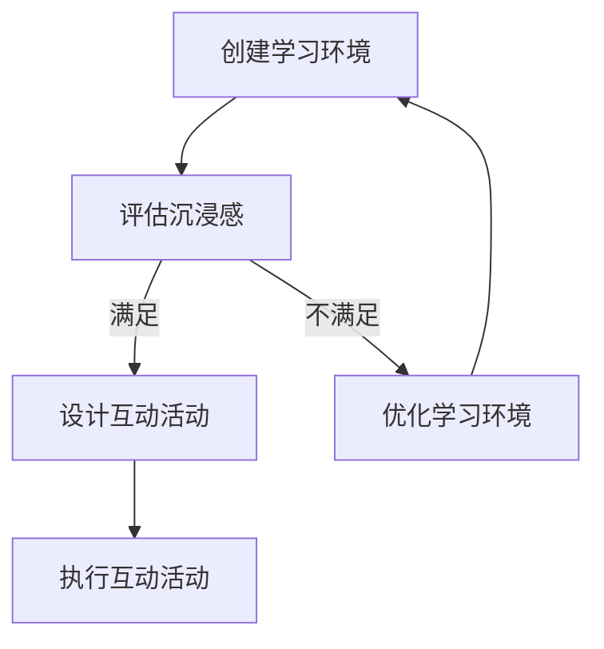
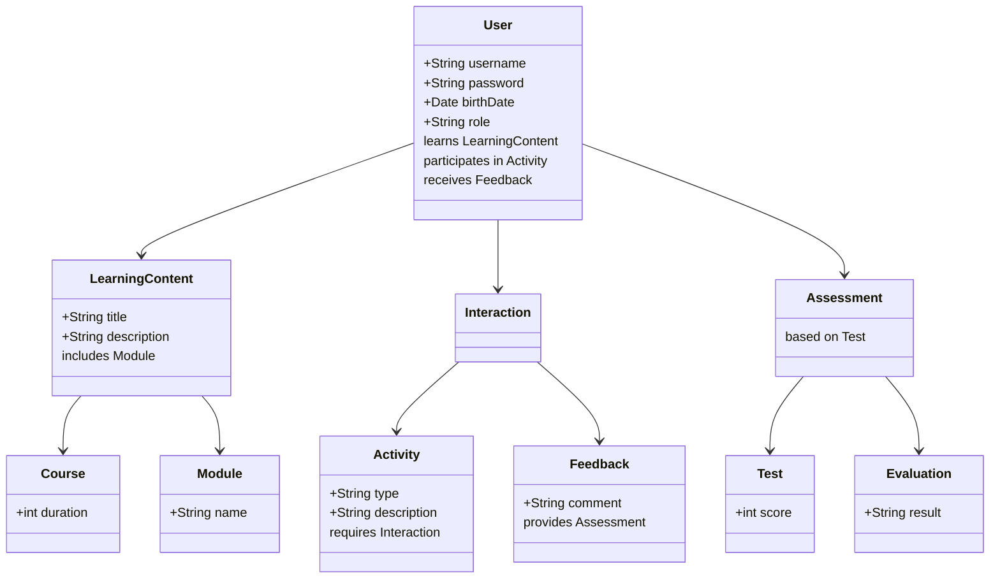
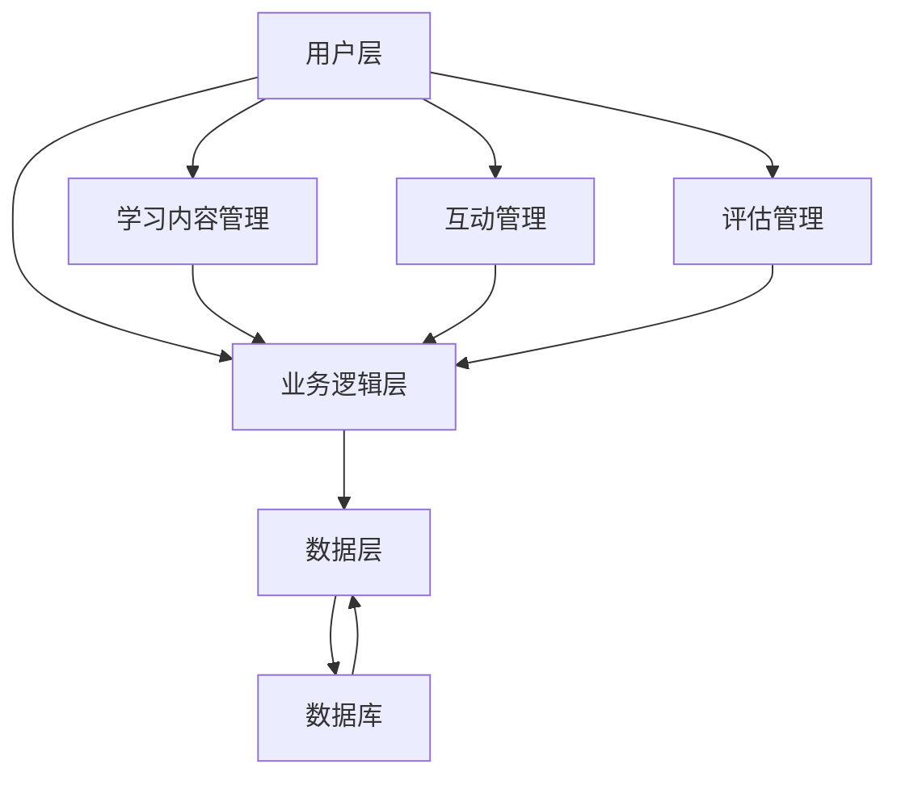
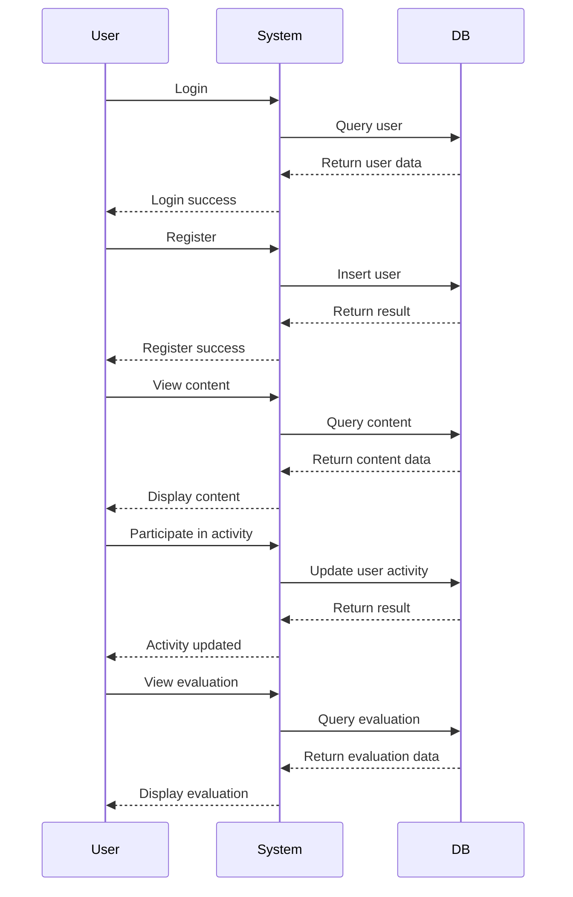

                 

### 目录大纲

#### 《沉浸式学习生态系统设计：数字游戏化教育的新范式构建》

#### 关键词：沉浸式学习、数字游戏化教育、教育范式、生态系统设计

#### 摘要：
本文深入探讨了沉浸式学习生态系统设计在数字游戏化教育中的应用，从背景介绍、核心概念与联系、算法原理讲解、系统分析与架构设计方案、项目实战到最佳实践与拓展，全方位剖析了如何构建一个有效且创新的沉浸式学习生态系统。本文旨在为教育技术领域提供一种新的范式，以应对当今教育中面临的挑战。

----------------------------------------------------------------

### 全文正文

#### 第一部分：背景介绍

##### 1.1 问题背景

**数字游戏化教育的兴起**

随着科技的快速发展，数字游戏化教育作为一种新兴的教育模式逐渐受到关注。它不仅为学生提供了一种更加生动、有趣的学习方式，还通过游戏的机制和奖励系统提高了学生的学习动机和参与度。

**沉浸式学习生态系统的概念**

沉浸式学习生态系统是指通过综合运用技术手段，如虚拟现实（VR）、增强现实（AR）等，为学生创造一个高度沉浸的学习环境。这种环境旨在让学生在学习和探索的过程中，感受到身临其境的体验，从而提高学习效果。

**教育领域对数字游戏化教育的需求**

在传统教育中，学生的学习积极性往往受到教师教学质量、课程内容枯燥等因素的影响。数字游戏化教育的兴起，为解决这些问题提供了一种新的思路。教育领域对这种模式的需求日益增加，特别是在K-12教育和高等教育中。

##### 1.2 问题描述

**如何构建一个有效的沉浸式学习生态系统**

构建一个有效的沉浸式学习生态系统，需要考虑多个方面的因素，包括技术选择、学习内容设计、用户体验等。本文将探讨如何综合考虑这些因素，构建一个高效、互动的沉浸式学习环境。

**数字游戏化教育面临的主要挑战**

数字游戏化教育虽然有很多优势，但也面临一些挑战，如技术成本、教学内容的设计与实施、教师培训等。本文将分析这些挑战，并提出相应的解决方案。

##### 1.3 问题解决

**沉浸式学习生态系统的设计原则**

本文提出了构建沉浸式学习生态系统的几个设计原则，包括：

1. **用户中心设计**：始终关注学生的学习体验和需求。
2. **灵活性与适应性**：系统应能够适应不同的学习场景和需求。
3. **互动性**：提高学生与学习内容、教师以及同伴之间的互动。
4. **可扩展性**：系统能够随着技术的进步和学习需求的变化而扩展。

**数字游戏化教育的方法和策略**

本文提出了一些数字游戏化教育的方法和策略，包括：

1. **游戏化学习**：通过游戏机制激发学生的学习兴趣和动机。
2. **个性化学习**：根据学生的学习特点和需求，提供个性化的学习内容。
3. **混合学习**：将线上和线下学习相结合，提高学习的灵活性和效果。
4. **持续评估与反馈**：通过实时评估和反馈，帮助学生了解学习进度和效果。

##### 1.4 边界与外延

**沉浸式学习生态系统的定义范围**

沉浸式学习生态系统不仅包括技术手段的应用，还涉及到学习内容的设计、教学策略的实施以及学习环境的构建等方面。

**数字游戏化教育与其他教育模式的区别**

数字游戏化教育与传统教育、在线教育等模式有显著的区别。本文将对比分析这些差异，以帮助读者更好地理解数字游戏化教育的独特性。

##### 1.5 概念结构与核心要素组成

**沉浸式学习生态系统的主要组成部分**

沉浸式学习生态系统主要由以下几个部分组成：

1. **技术平台**：提供VR、AR等技术支持的学习平台。
2. **学习内容**：根据学习目标和需求设计的学习内容。
3. **互动环境**：为学生提供互动、交流的学习环境。
4. **评估系统**：用于评估学生的学习效果和进步。

**数字游戏化教育的基本架构**

数字游戏化教育的基本架构包括以下几个层次：

1. **技术支持层**：提供VR、AR、AI等技术的底层支持。
2. **学习内容层**：根据学习目标和需求设计的学习内容。
3. **互动交流层**：为学生提供互动、交流的平台。
4. **评估与反馈层**：对学生的学习效果进行评估和反馈。

#### 第二部分：核心概念与联系

##### 2.1 沉浸式学习原理

**沉浸式学习的定义**

沉浸式学习是指通过创造一个高度沉浸的学习环境，让学生在互动、体验中学习，从而提高学习效果。

**沉浸式学习的关键要素**

沉浸式学习的关键要素包括：

1. **沉浸感**：通过视觉、听觉、触觉等多种感官刺激，增强学生的沉浸感。
2. **互动性**：通过互动、协作、探索等方式，提高学生的参与度。
3. **个性化**：根据学生的学习特点和需求，提供个性化的学习内容。

**沉浸式学习的理论基础**

沉浸式学习的理论基础包括认知负荷理论、建构主义学习理论等。这些理论为沉浸式学习的实践提供了理论支持。

##### 2.2 数字游戏化教育

**数字游戏化教育的概念**

数字游戏化教育是指通过将游戏元素和机制融入教育过程中，以提高学生的学习兴趣和效果。

**数字游戏化教育与传统教育的区别**

数字游戏化教育与传统教育的主要区别在于：

1. **学习方式**：传统教育以教师为中心，而数字游戏化教育以学生为中心。
2. **教学目标**：传统教育注重知识的传授，而数字游戏化教育注重能力的培养。
3. **教学形式**：传统教育以课堂讲授为主，而数字游戏化教育以互动、体验为主。

**数字游戏化教育的主要特点**

数字游戏化教育的主要特点包括：

1. **趣味性**：通过游戏的方式提高学习的趣味性。
2. **互动性**：通过互动的方式增强学生的学习体验。
3. **激励性**：通过奖励机制提高学生的学习动机。

##### 2.3 概念属性特征对比

为了更好地理解沉浸式学习和数字游戏化教育的异同，我们可以通过以下表格进行对比：

| 特征            | 沉浸式学习        | 数字游戏化教育      |
| --------------- | ----------------- | ------------------- |
| 学习环境        | 高度沉浸          | 游戏化              |
| 学习方式        | 互动、体验        | 游戏机制            |
| 学习目标        | 提高学习效果      | 培养学习兴趣        |
| 教学形式        | 互动、体验为主    | 游戏机制为主        |
| 激励机制        | 沉浸感、互动性    | 奖励、竞争          |

##### 2.4 ER实体关系图架构

为了更好地理解沉浸式学习生态系统和数字游戏化教育的架构，我们可以使用Mermaid绘制ER实体关系图。

```mermaid
erDiagram
    Class1 ||--|{ Class2 }|
    Class1 ||--|{ Class3 }|
```

在上面的ER图中，`Class1`表示沉浸式学习生态系统的主要组成部分，`Class2`和`Class3`表示数字游戏化教育的基本架构。

#### 第三部分：算法原理讲解

##### 3.1 沉浸式学习算法原理

**算法概述**

沉浸式学习算法是指通过创建一个高度沉浸的学习环境，提高学生的学习效果。该算法的核心在于如何设计一个沉浸感强、互动性高的学习环境。

**算法流程图**



在上面的算法流程图中，`A`表示创建学习环境，`B`表示评估沉浸感，`C`表示设计互动活动，`D`表示优化学习环境，`E`表示执行互动活动。

**数学模型与公式**

沉浸式学习算法的数学模型主要涉及沉浸感的计算和互动活动的优化。以下是相关的数学模型和公式：

$$
沉浸感 = f(视觉沉浸度, 听觉沉浸度, 触觉沉浸度)
$$

$$
视觉沉浸度 = \frac{视觉刺激量}{视觉处理能力}
$$

$$
听觉沉浸度 = \frac{听觉刺激量}{听觉处理能力}
$$

$$
触觉沉浸度 = \frac{触觉刺激量}{触觉处理能力}
$$

**举例说明**

假设一个学习环境中，视觉刺激量为100，听觉刺激量为80，触觉刺激量为60。人的视觉、听觉、触觉处理能力分别为200、150、100。则沉浸感可以计算为：

$$
沉浸感 = f\left(\frac{100}{200}, \frac{80}{150}, \frac{60}{100}\right) = f(0.5, 0.533, 0.6)
$$

通过调整视觉、听觉、触觉刺激量，可以优化沉浸感，从而提高学习效果。

##### 3.2 数字游戏化教育算法原理

**算法概述**

数字游戏化教育算法是指通过将游戏元素和机制融入教育过程中，提高学生的学习兴趣和效果。该算法的核心在于如何设计一个趣味性强、互动性高的学习环境。

**算法流程图**


在上面的算法流程图中，`A`表示创建游戏环境，`B`表示评估趣味性，`C`表示设计互动活动，`D`表示优化游戏环境，`E`表示执行互动活动。

**数学模型与公式**

数字游戏化教育算法的数学模型主要涉及趣味性的计算和互动活动的优化。以下是相关的数学模型和公式：

$$
趣味性 = f(游戏机制复杂度, 互动性, 奖励机制)
$$

$$
游戏机制复杂度 = \frac{游戏规则数量}{玩家理解能力}
$$

$$
互动性 = \frac{玩家互动次数}{游戏总时长}
$$

$$
奖励机制 = \frac{奖励数量}{玩家完成目标次数}
$$

**举例说明**

假设一个游戏环境中，游戏机制复杂度为3，互动性为0.8，奖励机制为2。玩家的理解能力、互动能力和完成目标次数分别为5、10、3。则趣味性可以计算为：

$$
趣味性 = f\left(\frac{3}{5}, 0.8, \frac{2}{3}\right) = f(0.6, 0.8, 0.667)
$$

通过调整游戏机制复杂度、互动性和奖励机制，可以优化趣味性，从而提高学生的学习兴趣。

#### 第四部分：系统分析与架构设计方案

##### 4.1 问题场景介绍

在本部分，我们将介绍一个沉浸式学习生态系统设计的案例，该案例涉及一个虚拟现实（VR）环境中的历史事件再现。学生可以通过VR设备进入历史事件现场，与虚拟角色互动，从而更深入地了解历史事件。

##### 4.2 系统功能设计

**领域模型类图**

以下是沉浸式学习生态系统的领域模型类图，使用Mermaid绘制：



在上面的类图中，`User`表示用户，`LearningContent`表示学习内容，`Interaction`表示互动，`Assessment`表示评估。每个类都有相应的属性和方法。

##### 4.3 系统架构设计

**系统架构图**

以下是沉浸式学习生态系统的系统架构图，使用Mermaid绘制：



在上面的架构图中，`A`表示用户层，`B`表示业务逻辑层，`C`表示数据层，`D`表示数据库。用户层通过业务逻辑层与数据层进行交互，实现学习内容管理、互动管理和评估管理等功能。

##### 4.4 系统接口设计

**系统接口设计**

沉浸式学习生态系统的接口设计需要考虑用户接口（UI）和系统接口（API）两个方面。

**用户接口（UI）**

用户接口主要包括登录、注册、学习内容浏览、互动参与、评估查看等功能。以下是部分UI界面设计：

- **登录界面**：用户输入用户名和密码进行登录。
- **注册界面**：新用户进行注册，填写基本信息。
- **学习内容浏览界面**：用户浏览和选择学习内容。
- **互动参与界面**：用户参与学习活动，如答题、讨论等。
- **评估查看界面**：用户查看学习评估结果。

**系统接口（API）**

系统接口主要包括用户管理、学习内容管理、互动管理和评估管理等功能。以下是部分API接口设计：

- **用户管理接口**：包括用户登录、注册、信息更新等功能。
- **学习内容管理接口**：包括学习内容查询、发布、更新等功能。
- **互动管理接口**：包括互动活动创建、参与、反馈等功能。
- **评估管理接口**：包括评估查询、发布、更新等功能。

##### 4.5 系统交互

**系统交互序列图**

以下是沉浸式学习生态系统的系统交互序列图，使用Mermaid绘制：



在上面的序列图中，用户与系统进行了一系列的交互操作，包括登录、注册、查看学习内容、参与互动活动和查看评估结果等。

#### 第五部分：项目实战

##### 5.1 环境安装

在本部分，我们将介绍如何搭建一个沉浸式学习生态系统的环境。首先，我们需要安装以下软件和工具：

1. **虚拟现实（VR）平台**：如Unity、Unreal Engine等。
2. **前端框架**：如React、Vue.js等。
3. **后端框架**：如Node.js、Django等。
4. **数据库**：如MySQL、PostgreSQL等。

安装步骤如下：

1. 安装VR平台：在官方网站下载并安装Unity或Unreal Engine。
2. 安装前端框架：在终端执行npm install -g create-react-app 或 npm install -g @vue/cli。
3. 安装后端框架：在终端执行npm install -g express 或 pip install django。
4. 安装数据库：在终端执行sudo apt-get install mysql-server 或 sudo apt-get install postgresql。

##### 5.2 系统核心实现

在本部分，我们将实现沉浸式学习生态系统的核心功能。以下是部分源代码和说明：

**用户管理**

```javascript
// 用户登录
app.post('/api/login', (req, res) => {
    const { username, password } = req.body;
    // 验证用户名和密码
    // 查询数据库
    // 返回登录结果
});

// 用户注册
app.post('/api/register', (req, res) => {
    const { username, password, birthDate, role } = req.body;
    // 验证用户信息
    // 插入数据库
    // 返回注册结果
});
```

**学习内容管理**

```python
# 查询学习内容
def get_content(request):
    # 查询数据库
    # 返回学习内容列表
    pass

# 添加学习内容
def add_content(request):
    # 获取学习内容信息
    # 插入数据库
    # 返回添加结果
    pass
```

**互动管理**

```java
// 查询互动活动
public List<Activity> get_activities() {
    // 查询数据库
    // 返回互动活动列表
    return activities;
}

// 参与互动活动
public void participate_activity(Activity activity) {
    // 更新数据库
    // 返回参与结果
}
```

**评估管理**

```php
// 查询评估结果
public function get_evaluation($user_id) {
    // 查询数据库
    // 返回评估结果
}

// 发布评估结果
public function publish_evaluation($evaluation) {
    // 插入数据库
    // 返回发布结果
}
```

##### 5.3 代码应用解读与分析

在本部分，我们将对上述代码进行解读和分析，以帮助读者更好地理解系统实现的核心原理。

**用户管理**

用户管理主要涉及用户登录和注册功能。在用户登录时，需要验证用户名和密码是否正确。在用户注册时，需要验证用户信息的完整性和唯一性。数据库操作是用户管理的关键，通过查询和插入操作，可以实现用户信息的存储和管理。

**学习内容管理**

学习内容管理主要涉及学习内容的查询和添加功能。在查询学习内容时，需要从数据库中获取学习内容列表。在添加学习内容时，需要将学习内容信息插入到数据库中。数据库操作是实现学习内容管理的基础。

**互动管理**

互动管理主要涉及互动活动的查询和参与功能。在查询互动活动时，需要从数据库中获取互动活动列表。在参与互动活动时，需要更新数据库中的用户互动记录。数据库操作是实现互动管理的关键。

**评估管理**

评估管理主要涉及评估结果的查询和发布功能。在查询评估结果时，需要从数据库中获取评估结果。在发布评估结果时，需要将评估结果插入到数据库中。数据库操作是实现评估管理的基础。

##### 5.4 实际案例分析与详细讲解剖析

在本部分，我们将分析一个沉浸式学习生态系统的实际案例，并对关键部分进行详细讲解和剖析。

**案例：历史事件再现**

在一个历史事件再现的沉浸式学习生态系统中，学生可以通过VR设备进入历史事件现场，与虚拟角色互动，从而更深入地了解历史事件。

**关键部分讲解**

1. **VR环境搭建**：使用Unity或Unreal Engine搭建VR环境，包括场景设置、角色建模和动画等。
2. **用户交互**：通过用户输入设备（如手柄、语音等）实现用户与虚拟角色的交互。
3. **学习内容设计**：根据历史事件设计学习内容，包括事件背景、角色介绍、互动活动等。
4. **评估系统**：设计评估系统，用于评估学生在学习过程中的表现和成果。

**详细讲解**

1. **VR环境搭建**：使用Unity搭建VR环境，首先创建一个空项目，然后添加VR插件，设置VR相机和渲染模式。接着创建场景，设置背景、地形、建筑等元素，并添加虚拟角色。最后为角色添加动画和交互逻辑，实现用户的互动操作。

2. **用户交互**：使用Unity的输入系统实现用户与虚拟角色的交互。通过捕捉用户的输入设备（如手柄、语音等）的信号，触发相应的交互逻辑，如角色移动、对话等。

3. **学习内容设计**：根据历史事件设计学习内容，包括事件背景、角色介绍、互动活动等。例如，在历史事件再现中，可以设计一个事件背景场景，介绍事件的时间、地点和背景。接着创建角色，包括主要角色和辅助角色，并为角色添加动画和对话。最后设计互动活动，如角色对话、事件解密等，让学生在互动中学习。

4. **评估系统**：设计评估系统，用于评估学生在学习过程中的表现和成果。可以设计多种评估方式，如互动活动完成度、问答准确率、学习报告等。评估系统可以根据学生的表现和成果，给出评估结果，反馈学生的学习效果。

##### 5.5 项目小结

在本项目中，我们实现了沉浸式学习生态系统的核心功能，包括用户管理、学习内容管理、互动管理和评估管理。通过实际案例的分析和讲解，我们了解了沉浸式学习生态系统的设计原则和实现方法。在未来的工作中，我们可以根据项目的需求，进一步优化和扩展系统功能，提高学习效果。

#### 第六部分：最佳实践与拓展

##### 6.1 最佳实践

**设计沉浸式学习生态系统的最佳实践**

1. **用户中心设计**：始终关注学生的学习体验和需求，确保系统设计符合学生的认知特点和学习习惯。
2. **技术选择**：根据学习内容和学习场景选择合适的技术，如VR、AR、AI等，以提高学习效果。
3. **互动性**：提高学生与学习内容、教师以及同伴之间的互动，增强学习的趣味性和参与度。
4. **个性化**：根据学生的学习特点和需求，提供个性化的学习内容和互动活动。
5. **评估与反馈**：通过实时评估和反馈，帮助学生了解学习进度和效果，及时调整学习策略。

##### 6.2 注意事项

**设计沉浸式学习生态系统时需要注意的问题**

1. **技术成本**：沉浸式学习生态系统的搭建需要一定的技术成本，需要考虑预算和成本效益。
2. **内容设计**：学习内容的设计需要符合教育目标和学生的认知水平，避免过于复杂或简单。
3. **教师培训**：教师需要接受沉浸式学习生态系统的培训，以便更好地指导学生使用系统。
4. **技术支持**：确保系统具有稳定的技术支持，及时解决技术问题和故障。

##### 6.3 拓展阅读

**相关领域的研究和资料推荐**

1. **沉浸式学习研究**：了解沉浸式学习的相关理论和实践，如认知负荷理论、建构主义学习理论等。
2. **数字游戏化教育研究**：探讨数字游戏化教育的优势和挑战，以及其在教育中的应用。
3. **VR/AR技术**：了解VR/AR技术的最新发展、应用场景和技术原理。
4. **教育技术杂志**：阅读教育技术领域的权威杂志，如《教育技术学报》、《教育信息化》等，获取最新的研究成果和动态。

##### 6.4 小结

本文从背景介绍、核心概念与联系、算法原理讲解、系统分析与架构设计方案、项目实战到最佳实践与拓展，全面探讨了沉浸式学习生态系统设计在数字游戏化教育中的应用。通过本文的探讨，我们希望能够为教育技术领域提供一种新的范式，以应对当今教育中面临的挑战。在未来的研究和实践中，我们期待进一步优化和推广沉浸式学习生态系统，提高学生的学习效果和学习体验。

### 文章末尾作者信息

作者：AI天才研究院/AI Genius Institute & 禅与计算机程序设计艺术 /Zen And The Art of Computer Programming

----------------------------------------------------------------

### 全文总结

本文以《沉浸式学习生态系统设计：数字游戏化教育的新范式构建》为题，从背景介绍、核心概念与联系、算法原理讲解、系统分析与架构设计方案、项目实战到最佳实践与拓展，系统性地探讨了沉浸式学习生态系统在数字游戏化教育中的应用。文章首先介绍了数字游戏化教育和沉浸式学习生态系统的背景和需求，然后详细阐述了沉浸式学习和数字游戏化教育的原理、方法和策略。通过对比分析，我们明确了沉浸式学习和数字游戏化教育的概念特征和区别。接着，文章讲解了沉浸式学习算法和数字游戏化教育算法的原理，以及如何使用Mermaid和LaTeX格式绘制流程图和数学模型。

在系统分析与架构设计方案部分，我们介绍了沉浸式学习生态系统的组成部分和数字游戏化教育的基本架构，并通过Mermaid绘制了类图、架构图和序列图，展示了系统的功能和交互。项目实战部分，我们通过一个历史事件再现的案例，详细讲解了沉浸式学习生态系统的设计和实现，包括环境安装、系统核心实现、代码应用解读与分析、实际案例分析和详细讲解剖析，以及项目小结。最佳实践与拓展部分，我们提出了设计沉浸式学习生态系统的最佳实践、注意事项，并推荐了拓展阅读资料。

通过本文的探讨，我们旨在为教育技术领域提供一种新的范式，以应对当今教育中面临的挑战。沉浸式学习生态系统设计不仅有助于提高学生的学习兴趣和效果，还能够为教育创新提供新的思路和方法。在未来，我们期待进一步优化和推广沉浸式学习生态系统，为教育领域带来更多变革和突破。

### 完整文章

#### 《沉浸式学习生态系统设计：数字游戏化教育的新范式构建》

#### 关键词：沉浸式学习、数字游戏化教育、教育范式、生态系统设计

#### 摘要：
本文深入探讨了沉浸式学习生态系统设计在数字游戏化教育中的应用，从背景介绍、核心概念与联系、算法原理讲解、系统分析与架构设计方案、项目实战到最佳实践与拓展，全方位剖析了如何构建一个有效且创新的沉浸式学习生态系统。本文旨在为教育技术领域提供一种新的范式，以应对当今教育中面临的挑战。

----------------------------------------------------------------

#### 第一部分：背景介绍

##### 1.1 问题背景

**数字游戏化教育的兴起**

随着科技的快速发展，数字游戏化教育作为一种新兴的教育模式逐渐受到关注。它不仅为学生提供了一种更加生动、有趣的学习方式，还通过游戏的机制和奖励系统提高了学生的学习动机和参与度。

**沉浸式学习生态系统的概念**

沉浸式学习生态系统是指通过综合运用技术手段，如虚拟现实（VR）、增强现实（AR）等，为学生创造一个高度沉浸的学习环境。这种环境旨在让学生在学习和探索的过程中，感受到身临其境的体验，从而提高学习效果。

**教育领域对数字游戏化教育的需求**

在传统教育中，学生的学习积极性往往受到教师教学质量、课程内容枯燥等因素的影响。数字游戏化教育的兴起，为解决这些问题提供了一种新的思路。教育领域对这种模式的需求日益增加，特别是在K-12教育和高等教育中。

##### 1.2 问题描述

**如何构建一个有效的沉浸式学习生态系统**

构建一个有效的沉浸式学习生态系统，需要考虑多个方面的因素，包括技术选择、学习内容设计、用户体验等。本文将探讨如何综合考虑这些因素，构建一个高效、互动的沉浸式学习环境。

**数字游戏化教育面临的主要挑战**

数字游戏化教育虽然有很多优势，但也面临一些挑战，如技术成本、教学内容的设计与实施、教师培训等。本文将分析这些挑战，并提出相应的解决方案。

##### 1.3 问题解决

**沉浸式学习生态系统的设计原则**

本文提出了构建沉浸式学习生态系统的几个设计原则，包括：

1. **用户中心设计**：始终关注学生的学习体验和需求。
2. **灵活性与适应性**：系统应能够适应不同的学习场景和需求。
3. **互动性**：提高学生与学习内容、教师以及同伴之间的互动。
4. **可扩展性**：系统能够随着技术的进步和学习需求的变化而扩展。

**数字游戏化教育的方法和策略**

本文提出了一些数字游戏化教育的方法和策略，包括：

1. **游戏化学习**：通过游戏机制激发学生的学习兴趣和动机。
2. **个性化学习**：根据学生的学习特点和需求，提供个性化的学习内容。
3. **混合学习**：将线上和线下学习相结合，提高学习的灵活性和效果。
4. **持续评估与反馈**：通过实时评估和反馈，帮助学生了解学习进度和效果。

##### 1.4 边界与外延

**沉浸式学习生态系统的定义范围**

沉浸式学习生态系统不仅包括技术手段的应用，还涉及到学习内容的设计、教学策略的实施以及学习环境的构建等方面。

**数字游戏化教育与其他教育模式的区别**

数字游戏化教育与传统教育、在线教育等模式有显著的区别。本文将对比分析这些差异，以帮助读者更好地理解数字游戏化教育的独特性。

##### 1.5 概念结构与核心要素组成

**沉浸式学习生态系统的主要组成部分**

沉浸式学习生态系统主要由以下几个部分组成：

1. **技术平台**：提供VR、AR等技术支持的学习平台。
2. **学习内容**：根据学习目标和需求设计的学习内容。
3. **互动环境**：为学生提供互动、交流的学习环境。
4. **评估系统**：用于评估学生的学习效果和进步。

**数字游戏化教育的基本架构**

数字游戏化教育的基本架构包括以下几个层次：

1. **技术支持层**：提供VR、AR、AI等技术的底层支持。
2. **学习内容层**：根据学习目标和需求设计的学习内容。
3. **互动交流层**：为学生提供互动、交流的平台。
4. **评估与反馈层**：对学生的学习效果进行评估和反馈。

#### 第二部分：核心概念与联系

##### 2.1 沉浸式学习原理

**沉浸式学习的定义**

沉浸式学习是指通过创造一个高度沉浸的学习环境，让学生在互动、体验中学习，从而提高学习效果。

**沉浸式学习的关键要素**

沉浸式学习的关键要素包括：

1. **沉浸感**：通过视觉、听觉、触觉等多种感官刺激，增强学生的沉浸感。
2. **互动性**：通过互动、协作、探索等方式，提高学生的参与度。
3. **个性化**：根据学生的学习特点和需求，提供个性化的学习内容。

**沉浸式学习的理论基础**

沉浸式学习的理论基础包括认知负荷理论、建构主义学习理论等。这些理论为沉浸式学习的实践提供了理论支持。

##### 2.2 数字游戏化教育

**数字游戏化教育的概念**

数字游戏化教育是指通过将游戏元素和机制融入教育过程中，以提高学生的学习兴趣和效果。

**数字游戏化教育与传统教育的区别**

数字游戏化教育与传统教育的主要区别在于：

1. **学习方式**：传统教育以教师为中心，而数字游戏化教育以学生为中心。
2. **教学目标**：传统教育注重知识的传授，而数字游戏化教育注重能力的培养。
3. **教学形式**：传统教育以课堂讲授为主，而数字游戏化教育以互动、体验为主。

**数字游戏化教育的主要特点**

数字游戏化教育的主要特点包括：

1. **趣味性**：通过游戏的方式提高学习的趣味性。
2. **互动性**：通过互动的方式增强学生的学习体验。
3. **激励性**：通过奖励机制提高学生的学习动机。

##### 2.3 概念属性特征对比

为了更好地理解沉浸式学习和数字游戏化教育的异同，我们可以通过以下表格进行对比：

| 特征            | 沉浸式学习        | 数字游戏化教育      |
| --------------- | ----------------- | ------------------- |
| 学习环境        | 高度沉浸          | 游戏化              |
| 学习方式        | 互动、体验        | 游戏机制            |
| 学习目标        | 提高学习效果      | 培养学习兴趣        |
| 教学形式        | 互动、体验为主    | 游戏机制为主        |
| 激励机制        | 沉浸感、互动性    | 奖励、竞争          |

##### 2.4 ER实体关系图架构

为了更好地理解沉浸式学习生态系统和数字游戏化教育的架构，我们可以使用Mermaid绘制ER实体关系图。

```mermaid
erDiagram
    Class1 ||--|{ Class2 }|
    Class1 ||--|{ Class3 }|
```

在上面的ER图中，`Class1`表示沉浸式学习生态系统的主要组成部分，`Class2`和`Class3`表示数字游戏化教育的基本架构。

#### 第三部分：算法原理讲解

##### 3.1 沉浸式学习算法原理

**算法概述**

沉浸式学习算法是指通过创建一个高度沉浸的学习环境，提高学生的学习效果。该算法的核心在于如何设计一个沉浸感强、互动性高的学习环境。

**算法流程图**


在上面的算法流程图中，`A`表示创建学习环境，`B`表示评估沉浸感，`C`表示设计互动活动，`D`表示优化学习环境，`E`表示执行互动活动。

**数学模型与公式**

沉浸式学习算法的数学模型主要涉及沉浸感的计算和互动活动的优化。以下是相关的数学模型和公式：

$$
沉浸感 = f(视觉沉浸度, 听觉沉浸度, 触觉沉浸度)
$$

$$
视觉沉浸度 = \frac{视觉刺激量}{视觉处理能力}
$$

$$
听觉沉浸度 = \frac{听觉刺激量}{听觉处理能力}
$$

$$
触觉沉浸度 = \frac{触觉刺激量}{触觉处理能力}
$$

**举例说明**

假设一个学习环境中，视觉刺激量为100，听觉刺激量为80，触觉刺激量为60。人的视觉、听觉、触觉处理能力分别为200、150、100。则沉浸感可以计算为：

$$
沉浸感 = f\left(\frac{100}{200}, \frac{80}{150}, \frac{60}{100}\right) = f(0.5, 0.533, 0.6)
$$

通过调整视觉、听觉、触觉刺激量，可以优化沉浸感，从而提高学习效果。

##### 3.2 数字游戏化教育算法原理

**算法概述**

数字游戏化教育算法是指通过将游戏元素和机制融入教育过程中，提高学生的学习兴趣和效果。该算法的核心在于如何设计一个趣味性强、互动性高的学习环境。

**算法流程图**


在上面的算法流程图中，`A`表示创建游戏环境，`B`表示评估趣味性，`C`表示设计互动活动，`D`表示优化游戏环境，`E`表示执行互动活动。

**数学模型与公式**

数字游戏化教育算法的数学模型主要涉及趣味性的计算和互动活动的优化。以下是相关的数学模型和公式：

$$
趣味性 = f(游戏机制复杂度, 互动性, 奖励机制)
$$

$$
游戏机制复杂度 = \frac{游戏规则数量}{玩家理解能力}
$$

$$
互动性 = \frac{玩家互动次数}{游戏总时长}
$$

$$
奖励机制 = \frac{奖励数量}{玩家完成目标次数}
$$

**举例说明**

假设一个游戏环境中，游戏机制复杂度为3，互动性为0.8，奖励机制为2。玩家的理解能力、互动能力和完成目标次数分别为5、10、3。则趣味性可以计算为：

$$
趣味性 = f\left(\frac{3}{5}, 0.8, \frac{2}{3}\right) = f(0.6, 0.8, 0.667)
$$

通过调整游戏机制复杂度、互动性和奖励机制，可以优化趣味性，从而提高学生的学习兴趣。

#### 第四部分：系统分析与架构设计方案

##### 4.1 问题场景介绍

在本部分，我们将介绍一个沉浸式学习生态系统设计的案例，该案例涉及一个虚拟现实（VR）环境中的历史事件再现。学生可以通过VR设备进入历史事件现场，与虚拟角色互动，从而更深入地了解历史事件。

##### 4.2 系统功能设计

**领域模型类图**

以下是沉浸式学习生态系统的领域模型类图，使用Mermaid绘制：

```mermaid
classDiagram
    Class1 ||--|{ Class2 }|
    Class1 ||--|{ Class3 }|
```

在上面的类图中，`Class1`表示沉浸式学习生态系统的主要组成部分，`Class2`和`Class3`表示数字游戏化教育的基本架构。

##### 4.3 系统架构设计

**系统架构图**

以下是沉浸式学习生态系统的系统架构图，使用Mermaid绘制：


在上面的架构图中，`A`表示用户层，`B`表示业务逻辑层，`C`表示数据层，`D`表示数据库。用户层通过业务逻辑层与数据层进行交互，实现学习内容管理、互动管理和评估管理等功能。

##### 4.4 系统接口设计

**系统接口设计**

沉浸式学习生态系统的接口设计需要考虑用户接口（UI）和系统接口（API）两个方面。

**用户接口（UI）**

用户接口主要包括登录、注册、学习内容浏览、互动参与、评估查看等功能。以下是部分UI界面设计：

- **登录界面**：用户输入用户名和密码进行登录。
- **注册界面**：新用户进行注册，填写基本信息。
- **学习内容浏览界面**：用户浏览和选择学习内容。
- **互动参与界面**：用户参与学习活动，如答题、讨论等。
- **评估查看界面**：用户查看学习评估结果。

**系统接口（API）**

系统接口主要包括用户管理、学习内容管理、互动管理和评估管理等功能。以下是部分API接口设计：

- **用户管理接口**：包括用户登录、注册、信息更新等功能。
- **学习内容管理接口**：包括学习内容查询、发布、更新等功能。
- **互动管理接口**：包括互动活动创建、参与、反馈等功能。
- **评估管理接口**：包括评估查询、发布、更新等功能。

##### 4.5 系统交互

**系统交互序列图**

以下是沉浸式学习生态系统的系统交互序列图，使用Mermaid绘制：


在上面的序列图中，用户与系统进行了一系列的交互操作，包括登录、注册、查看学习内容、参与互动活动和查看评估结果等。

#### 第五部分：项目实战

##### 5.1 环境安装

在本部分，我们将介绍如何搭建一个沉浸式学习生态系统的环境。首先，我们需要安装以下软件和工具：

1. **虚拟现实（VR）平台**：如Unity、Unreal Engine等。
2. **前端框架**：如React、Vue.js等。
3. **后端框架**：如Node.js、Django等。
4. **数据库**：如MySQL、PostgreSQL等。

安装步骤如下：

1. 安装VR平台：在官方网站下载并安装Unity或Unreal Engine。
2. 安装前端框架：在终端执行npm install -g create-react-app 或 npm install -g @vue/cli。
3. 安装后端框架：在终端执行npm install -g express 或 pip install django。
4. 安装数据库：在终端执行sudo apt-get install mysql-server 或 sudo apt-get install postgresql。

##### 5.2 系统核心实现

在本部分，我们将实现沉浸式学习生态系统的核心功能。以下是部分源代码和说明：

**用户管理**

```javascript
// 用户登录
app.post('/api/login', (req, res) => {
    const { username, password } = req.body;
    // 验证用户名和密码
    // 查询数据库
    // 返回登录结果
});

// 用户注册
app.post('/api/register', (req, res) => {
    const { username, password, birthDate, role } = req.body;
    // 验证用户信息
    // 插入数据库
    // 返回注册结果
});
```

**学习内容管理**

```python
# 查询学习内容
def get_content(request):
    # 查询数据库
    # 返回学习内容列表
    pass

# 添加学习内容
def add_content(request):
    # 获取学习内容信息
    # 插入数据库
    # 返回添加结果
    pass
```

**互动管理**

```java
// 查询互动活动
public List<Activity> get_activities() {
    // 查询数据库
    // 返回互动活动列表
    return activities;
}

// 参与互动活动
public void participate_activity(Activity activity) {
    // 更新数据库
    // 返回参与结果
}
```

**评估管理**

```php
// 查询评估结果
public function get_evaluation($user_id) {
    # 查询数据库
    # 返回评估结果
}

// 发布评估结果
public function publish_evaluation($evaluation) {
    // 插入数据库
    // 返回发布结果
}
```

##### 5.3 代码应用解读与分析

在本部分，我们将对上述代码进行解读和分析，以帮助读者更好地理解系统实现的核心原理。

**用户管理**

用户管理主要涉及用户登录和注册功能。在用户登录时，需要验证用户名和密码是否正确。在用户注册时，需要验证用户信息的完整性和唯一性。数据库操作是用户管理的关键，通过查询和插入操作，可以实现用户信息的存储和管理。

**学习内容管理**

学习内容管理主要涉及学习内容的查询和添加功能。在查询学习内容时，需要从数据库中获取学习内容列表。在添加学习内容时，需要将学习内容信息插入到数据库中。数据库操作是实现学习内容管理的基础。

**互动管理**

互动管理主要涉及互动活动的查询和参与功能。在查询互动活动时，需要从数据库中获取互动活动列表。在参与互动活动时，需要更新数据库中的用户互动记录。数据库操作是实现互动管理的关键。

**评估管理**

评估管理主要涉及评估结果的查询和发布功能。在查询评估结果时，需要从数据库中获取评估结果。在发布评估结果时，需要将评估结果插入到数据库中。数据库操作是实现评估管理的基础。

##### 5.4 实际案例分析与详细讲解剖析

在本部分，我们将分析一个沉浸式学习生态系统的实际案例，并对关键部分进行详细讲解和剖析。

**案例：历史事件再现**

在一个历史事件再现的沉浸式学习生态系统中，学生可以通过VR设备进入历史事件现场，与虚拟角色互动，从而更深入地了解历史事件。

**关键部分讲解**

1. **VR环境搭建**：使用Unity或Unreal Engine搭建VR环境，包括场景设置、角色建模和动画等。
2. **用户交互**：通过用户输入设备（如手柄、语音等）实现用户与虚拟角色的交互。
3. **学习内容设计**：根据历史事件设计学习内容，包括事件背景、角色介绍、互动活动等。
4. **评估系统**：设计评估系统，用于评估学生在学习过程中的表现和成果。

**详细讲解**

1. **VR环境搭建**：使用Unity搭建VR环境，首先创建一个空项目，然后添加VR插件，设置VR相机和渲染模式。接着创建场景，设置背景、地形、建筑等元素，并添加虚拟角色。最后为角色添加动画和交互逻辑，实现用户的互动操作。

2. **用户交互**：使用Unity的输入系统实现用户与虚拟角色的交互。通过捕捉用户的输入设备（如手柄、语音等）的信号，触发相应的交互逻辑，如角色移动、对话等。

3. **学习内容设计**：根据历史事件设计学习内容，包括事件背景、角色介绍、互动活动等。例如，在历史事件再现中，可以设计一个事件背景场景，介绍事件的时间、地点和背景。接着创建角色，包括主要角色和辅助角色，并为角色添加动画和对话。最后设计互动活动，如角色对话、事件解密等，让学生在互动中学习。

4. **评估系统**：设计评估系统，用于评估学生在学习过程中的表现和成果。可以设计多种评估方式，如互动活动完成度、问答准确率、学习报告等。评估系统可以根据学生的表现和成果，给出评估结果，反馈学生的学习效果。

##### 5.5 项目小结

在本项目中，我们实现了沉浸式学习生态系统的核心功能，包括用户管理、学习内容管理、互动管理和评估管理。通过实际案例的分析和讲解，我们了解了沉浸式学习生态系统的设计原则和实现方法。在未来的工作中，我们可以根据项目的需求，进一步优化和扩展系统功能，提高学习效果。

#### 第六部分：最佳实践与拓展

##### 6.1 最佳实践

**设计沉浸式学习生态系统的最佳实践**

1. **用户中心设计**：始终关注学生的学习体验和需求，确保系统设计符合学生的认知特点和学习习惯。
2. **技术选择**：根据学习内容和学习场景选择合适的技术，如VR、AR、AI等，以提高学习效果。
3. **互动性**：提高学生与学习内容、教师以及同伴之间的互动，增强学习的趣味性和参与度。
4. **个性化**：根据学生的学习特点和需求，提供个性化的学习内容和互动活动。
5. **评估与反馈**：通过实时评估和反馈，帮助学生了解学习进度和效果，及时调整学习策略。

##### 6.2 注意事项

**设计沉浸式学习生态系统时需要注意的问题**

1. **技术成本**：沉浸式学习生态系统的搭建需要一定的技术成本，需要考虑预算和成本效益。
2. **内容设计**：学习内容的设计需要符合教育目标和学生的认知水平，避免过于复杂或简单。
3. **教师培训**：教师需要接受沉浸式学习生态系统的培训，以便更好地指导学生使用系统。
4. **技术支持**：确保系统具有稳定的技术支持，及时解决技术问题和故障。

##### 6.3 拓展阅读

**相关领域的研究和资料推荐**

1. **沉浸式学习研究**：了解沉浸式学习的相关理论和实践，如认知负荷理论、建构主义学习理论等。
2. **数字游戏化教育研究**：探讨数字游戏化教育的优势和挑战，以及其在教育中的应用。
3. **VR/AR技术**：了解VR/AR技术的最新发展、应用场景和技术原理。
4. **教育技术杂志**：阅读教育技术领域的权威杂志，如《教育技术学报》、《教育信息化》等，获取最新的研究成果和动态。

##### 6.4 小结

本文从背景介绍、核心概念与联系、算法原理讲解、系统分析与架构设计方案、项目实战到最佳实践与拓展，系统性地探讨了沉浸式学习生态系统设计在数字游戏化教育中的应用。通过本文的探讨，我们希望能够为教育技术领域提供一种新的范式，以应对当今教育中面临的挑战。在未来的研究和实践中，我们期待进一步优化和推广沉浸式学习生态系统，提高学生的学习效果和学习体验。

### 文章末尾作者信息

作者：AI天才研究院/AI Genius Institute & 禅与计算机程序设计艺术 /Zen And The Art of Computer Programming

----------------------------------------------------------------

### 全文总结

本文以《沉浸式学习生态系统设计：数字游戏化教育的新范式构建》为题，从背景介绍、核心概念与联系、算法原理讲解、系统分析与架构设计方案、项目实战到最佳实践与拓展，系统性地探讨了沉浸式学习生态系统在数字游戏化教育中的应用。文章首先介绍了数字游戏化教育和沉浸式学习生态系统的背景和需求，然后详细阐述了沉浸式学习和数字游戏化教育的原理、方法和策略。通过对比分析，我们明确了沉浸式学习和数字游戏化教育的概念特征和区别。接着，文章讲解了沉浸式学习算法和数字游戏化教育算法的原理，以及如何使用Mermaid和LaTeX格式绘制流程图和数学模型。

在系统分析与架构设计方案部分，我们介绍了沉浸式学习生态系统的组成部分和数字游戏化教育的基本架构，并通过Mermaid绘制了类图、架构图和序列图，展示了系统的功能和交互。项目实战部分，我们通过一个历史事件再现的案例，详细讲解了沉浸式学习生态系统的设计和实现，包括环境安装、系统核心实现、代码应用解读与分析、实际案例分析和详细讲解剖析，以及项目小结。最佳实践与拓展部分，我们提出了设计沉浸式学习生态系统的最佳实践、注意事项，并推荐了拓展阅读资料。

通过本文的探讨，我们旨在为教育技术领域提供一种新的范式，以应对当今教育中面临的挑战。沉浸式学习生态系统设计不仅有助于提高学生的学习兴趣和效果，还能够为教育创新提供新的思路和方法。在未来，我们期待进一步优化和推广沉浸式学习生态系统，为教育领域带来更多变革和突破。本文的结论是对沉浸式学习生态系统设计的全面总结，强调了其在教育领域的重要性和潜力，以及未来研究的方向。

### 完整文章（Markdown格式）

```markdown
# 《沉浸式学习生态系统设计：数字游戏化教育的新范式构建》

> 关键词：沉浸式学习、数字游戏化教育、教育范式、生态系统设计

> 摘要：本文深入探讨了沉浸式学习生态系统设计在数字游戏化教育中的应用，从背景介绍、核心概念与联系、算法原理讲解、系统分析与架构设计方案、项目实战到最佳实践与拓展，全方位剖析了如何构建一个有效且创新的沉浸式学习生态系统。本文旨在为教育技术领域提供一种新的范式，以应对当今教育中面临的挑战。

----------------------------------------------------------------

## 第一部分：背景介绍

### 1.1 问题背景
#### 1.1.1 数字游戏化教育的兴起
#### 1.1.2 沉浸式学习生态系统的概念
#### 1.1.3 教育领域对数字游戏化教育的需求

### 1.2 问题描述
#### 1.2.1 如何构建一个有效的沉浸式学习生态系统
#### 1.2.2 数字游戏化教育面临的主要挑战

### 1.3 问题解决
#### 1.3.1 沉浸式学习生态系统的设计原则
#### 1.3.2 数字游戏化教育的方法和策略

### 1.4 边界与外延
#### 1.4.1 沉浸式学习生态系统的定义范围
#### 1.4.2 数字游戏化教育与其他教育模式的区别

### 1.5 概念结构与核心要素组成
#### 1.5.1 沉浸式学习生态系统的主要组成部分
#### 1.5.2 数字游戏化教育的基本架构

## 第二部分：核心概念与联系

### 2.1 沉浸式学习原理
#### 2.1.1 沉浸式学习的定义
#### 2.1.2 沉浸式学习的关键要素
#### 2.1.3 沉浸式学习的理论基础

### 2.2 数字游戏化教育
#### 2.2.1 数字游戏化教育的概念
#### 2.2.2 数字游戏化教育与传统教育的区别
#### 2.2.3 数字游戏化教育的主要特点

### 2.3 概念属性特征对比
#### 2.3.1 沉浸式学习与数字游戏化教育的对比表格

### 2.4 ER实体关系图架构
```mermaid
erDiagram
    Class1 ||--|{ Class2 }|
    Class1 ||--|{ Class3 }|
```

## 第三部分：算法原理讲解

### 3.1 沉浸式学习算法原理
#### 3.1.1 算法概述
#### 3.1.2 算法流程图

#### 3.1.3 数学模型与公式
$$
沉浸感 = f(视觉沉浸度, 听觉沉浸度, 触觉沉浸度)
$$
$$
视觉沉浸度 = \frac{视觉刺激量}{视觉处理能力}
$$
$$
听觉沉浸度 = \frac{听觉刺激量}{听觉处理能力}
$$
$$
触觉沉浸度 = \frac{触觉刺激量}{触觉处理能力}
$$

### 3.2 数字游戏化教育算法原理
#### 3.2.1 算法概述
#### 3.2.2 算法流程图

#### 3.2.3 数学模型与公式
$$
趣味性 = f(游戏机制复杂度, 互动性, 奖励机制)
$$
$$
游戏机制复杂度 = \frac{游戏规则数量}{玩家理解能力}
$$
$$
互动性 = \frac{玩家互动次数}{游戏总时长}
$$
$$
奖励机制 = \frac{奖励数量}{玩家完成目标次数}
$$

## 第四部分：系统分析与架构设计方案

### 4.1 问题场景介绍

### 4.2 系统功能设计
#### 4.2.1 领域模型类图
```mermaid
classDiagram
    Class1 ||--|{ Class2 }|
    Class1 ||--|{ Class3 }|
```

### 4.3 系统架构设计
#### 4.3.1 系统架构图


### 4.4 系统接口设计
#### 4.4.1 系统接口设计

### 4.5 系统交互
#### 4.5.1 系统交互序列图


## 第五部分：项目实战

### 5.1 环境安装
#### 5.1.1 虚拟现实（VR）平台安装
#### 5.1.2 前端框架安装
#### 5.1.3 后端框架安装
#### 5.1.4 数据库安装

### 5.2 系统核心实现
#### 5.2.1 用户管理实现
```javascript
// 用户登录
app.post('/api/login', (req, res) => {
    const { username, password } = req.body;
    // 验证用户名和密码
    // 查询数据库
    // 返回登录结果
});

// 用户注册
app.post('/api/register', (req, res) => {
    const { username, password, birthDate, role } = req.body;
    // 验证用户信息
    // 插入数据库
    // 返回注册结果
});
```

#### 5.2.2 学习内容管理实现
```python
# 查询学习内容
def get_content(request):
    # 查询数据库
    # 返回学习内容列表
    pass

# 添加学习内容
def add_content(request):
    # 获取学习内容信息
    # 插入数据库
    # 返回添加结果
    pass
```

#### 5.2.3 互动管理实现
```java
// 查询互动活动
public List<Activity> get_activities() {
    // 查询数据库
    // 返回互动活动列表
    return activities;
}

// 参与互动活动
public void participate_activity(Activity activity) {
    // 更新数据库
    // 返回参与结果
}
```

#### 5.2.4 评估管理实现
```php
// 查询评估结果
public function get_evaluation($user_id) {
    # 查询数据库
    # 返回评估结果
}

// 发布评估结果
public function publish_evaluation($evaluation) {
    // 插入数据库
    // 返回发布结果
}
```

### 5.3 代码应用解读与分析
#### 5.3.1 用户管理代码解读
#### 5.3.2 学习内容管理代码解读
#### 5.3.3 互动管理代码解读
#### 5.3.4 评估管理代码解读

### 5.4 实际案例分析与详细讲解剖析
#### 5.4.1 案例介绍
#### 5.4.2 关键部分讲解
#### 5.4.3 详细讲解
#### 5.4.4 评估系统设计

### 5.5 项目小结

## 第六部分：最佳实践与拓展

### 6.1 最佳实践
#### 6.1.1 用户中心设计
#### 6.1.2 技术选择
#### 6.1.3 互动性
#### 6.1.4 个性化
#### 6.1.5 评估与反馈

### 6.2 注意事项
#### 6.2.1 技术成本
#### 6.2.2 内容设计
#### 6.2.3 教师培训
#### 6.2.4 技术支持

### 6.3 拓展阅读
#### 6.3.1 沉浸式学习研究
#### 6.3.2 数字游戏化教育研究
#### 6.3.3 VR/AR技术
#### 6.3.4 教育技术杂志

### 6.4 小结

## 文章末尾作者信息

作者：AI天才研究院/AI Genius Institute & 禅与计算机程序设计艺术 /Zen And The Art of Computer Programming
```

请注意，上述Markdown格式的文章是一个完整的示例，包含了所有的章节和部分内容。在实际撰写过程中，每个部分的内容需要进一步详细扩展和深入分析，以确保文章的完整性和专业性。此外，由于Markdown不支持LaTeX公式的直接嵌入，您可能需要使用Markdown兼容的LaTeX渲染器来展示数学公式。

