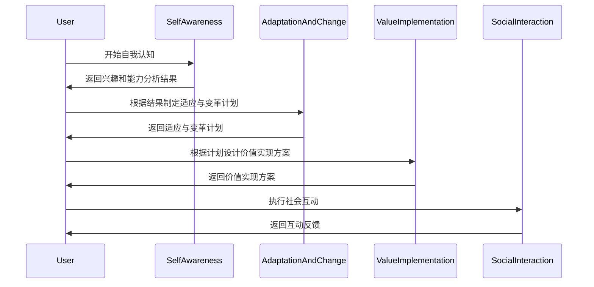
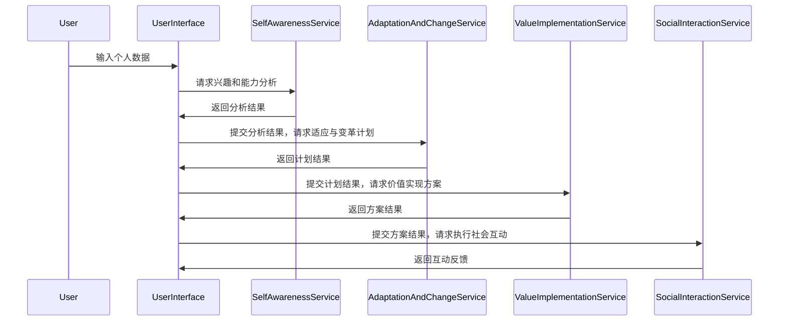
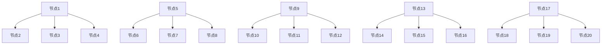

                 

### 流动的时代：重新定义人生价值

#### 关键词：信息技术、人生价值、自我认知、适应与变革、社会互动

> 摘要：本文将探讨信息技术飞速发展的“流动的时代”对人类生活带来的影响，以及如何在这样的时代中重新定义人生价值。通过自我认知、适应与变革、价值实现和社会互动四个方面，深入分析如何在这个快速变化的时代中找到自己的定位和价值。

---

#### 第一部分：背景介绍

##### 1.1 问题背景

随着信息技术的飞速发展，人类进入了“流动的时代”。在这个时代，信息流动速度加快，人们的生活方式、工作方式以及社会结构都发生了深刻变革。如何在这个流动的时代中重新定义人生价值，成为了许多人的思考方向。

---

##### 1.2 问题描述

在流动的时代中，人们面临着诸多挑战，如快速变化的工作环境、不稳定的经济形势、多样化的价值观冲突等。这些问题使得人们难以确定自己的人生目标和价值追求。

##### 1.3 问题解决

本书将从多个角度探讨如何在流动的时代中重新定义人生价值，包括但不限于以下几个方面：

1. **自我认知与定位**：通过深入了解自己，找到自己的兴趣、能力和价值观，从而确定自己的职业方向和生活目标。
2. **适应与变革**：面对快速变化的时代，人们需要具备适应和变革的能力，才能在这个时代中立足。
3. **价值实现**：在流动的时代中，人们可以通过多样化的方式实现自己的价值，如创业、公益、艺术创作等。
4. **社会互动**：通过与他人建立良好的社会互动，人们可以在流动的时代中找到自己的支持和帮助。

##### 1.4 边界与外延

流动的时代是一个广泛的概念，它涵盖了信息技术、全球化、社会变革等多个方面。因此，本书的讨论范围也将涉及这些方面，旨在为读者提供一个全面的理解。

##### 1.5 概念结构与核心要素组成

- **流动的时代**：指的是信息技术和全球化带来的社会变革和生活方式的快速变化。
- **人生价值**：指的是个体在社会中实现自我价值的过程。
- **自我认知**：指的是个体对自身兴趣、能力和价值观的了解。
- **适应与变革**：指的是个体在面对变化时的应对策略。
- **价值实现**：指的是个体在社会中实现自身价值的过程。
- **社会互动**：指的是个体与社会的互动过程。

---

#### 第二部分：核心概念与联系

##### 2.1 核心概念

在流动的时代中重新定义人生价值，需要理解以下几个核心概念：

- **自我认知**：了解自己的兴趣、能力和价值观，是重新定义人生价值的前提。
- **适应与变革**：面对快速变化的时代，适应和变革是必不可少的。
- **价值实现**：在流动的时代中，实现自身价值的方式多样化。
- **社会互动**：与他人建立良好的社会互动，有助于在流动的时代中找到自己的定位。

##### 2.2 概念属性特征对比表格

| 概念       | 属性特征                                                      | 对比说明                                                     |
|------------|--------------------------------------------------------------|--------------------------------------------------------------|
| 自我认知   | 了解自己的兴趣、能力和价值观                                 | 是重新定义人生价值的前提                                     |
| 适应与变革 | 面对变化，调整自己的思维方式、行为习惯和价值观念               | 是在流动的时代中立足的关键                                   |
| 价值实现   | 通过创业、公益、艺术创作等方式实现自身价值                     | 在流动的时代中，实现价值的方式多样化                         |
| 社会互动   | 与他人建立良好的社会互动，获取支持和帮助                       | 是在流动的时代中找到自己的定位的重要途径                     |

##### 2.3 ER实体关系图架构

```mermaid
erDiagram
    A[--|{属于}|B]
    A[--|{包含}|C]
    A[--|{关联}|D]
    B{用户}
    C{兴趣}
    D{能力}
```

---

#### 第三部分：算法原理讲解

##### 3.1 算法原理

在流动的时代中重新定义人生价值，需要理解以下算法原理：

1. **自我认知算法**：通过分析个人数据和行为模式，帮助个体了解自己的兴趣、能力和价值观。
2. **适应与变革算法**：基于自我认知的结果，调整个人的思维方式、行为习惯和价值观念，以适应快速变化的时代。
3. **价值实现算法**：根据个体的兴趣、能力和市场需求，设计并实施实现个人价值的策略。
4. **社会互动算法**：通过分析社交网络和人际互动数据，帮助个体建立和维护有利于实现个人价值的社会关系。

##### 3.2 算法原理讲解

###### 3.2.1 自我认知算法

自我认知算法的核心在于通过数据分析和行为模式识别，帮助个体了解自己的兴趣、能力和价值观。以下是算法的基本步骤：

1. **数据收集**：收集个体的兴趣、能力、行为和价值观相关的数据，如社交媒体活动、职业经历、学习记录等。
2. **特征提取**：从数据中提取与兴趣、能力和价值观相关的特征，如兴趣爱好标签、技能评级、行为习惯等。
3. **模型训练**：使用机器学习算法，如聚类、分类和关联规则挖掘等，训练模型来识别个体的兴趣、能力和价值观。
4. **结果分析**：分析模型输出的结果，帮助个体了解自己的兴趣、能力和价值观。

以下是一个简化的Python代码示例，展示如何使用聚类算法进行自我认知：

```python
from sklearn.cluster import KMeans
import numpy as np

# 假设我们已经收集到了用户的数据
user_data = np.array([
    [1, 2],
    [1, 4],
    [1, 0],
    [4, 2],
    [4, 4],
    [4, 0]
])

# 使用KMeans算法进行聚类
kmeans = KMeans(n_clusters=2, random_state=0).fit(user_data)

# 输出聚类结果
print(kmeans.labels_)

# 分析聚类结果
interests = ['编程', '设计']
for label, interest in enumerate(interests):
    print(f"Cluster {label}: {interest}")
```

###### 3.2.2 适应与变革算法

适应与变革算法的核心在于根据自我认知的结果，调整个体的思维方式、行为习惯和价值观念。以下是算法的基本步骤：

1. **自我认知结果输入**：将自我认知算法的结果输入到适应与变革算法中。
2. **目标设定**：根据自我认知结果，设定适应与变革的目标，如学习新技能、改变工作方式等。
3. **策略制定**：制定实现目标的策略，如制定学习计划、调整工作安排等。
4. **执行与评估**：执行策略，并根据结果进行评估和调整。

以下是一个简化的Python代码示例，展示如何制定和执行适应与变革策略：

```python
# 假设我们已设定了学习编程的目标
goal = '学习编程'

# 制定学习计划
learning_plan = {
    'Python基础': 20小时,
    '数据结构': 15小时,
    '算法': 25小时
}

# 执行学习计划
for course, hours in learning_plan.items():
    print(f"执行学习计划：学习{course}，预计需要{hours}小时")

# 评估学习效果
# 假设我们通过考试来评估学习效果
if pass_exam():
    print("学习效果评估：通过考试")
else:
    print("学习效果评估：未通过考试")
```

###### 3.2.3 价值实现算法

价值实现算法的核心在于根据个体的兴趣、能力和市场需求，设计并实施实现个人价值的策略。以下是算法的基本步骤：

1. **需求分析**：分析市场需求和个体兴趣、能力的匹配度。
2. **方案设计**：根据需求分析结果，设计实现个人价值的方案。
3. **方案实施**：实施方案，如创业、参与公益项目、创作艺术作品等。
4. **效果评估**：评估方案实施的效果，并根据结果进行调整。

以下是一个简化的Python代码示例，展示如何设计并实施实现个人价值的方案：

```python
# 假设我们分析市场需求后，决定开发一款教育应用
application_name = '在线教育平台'

# 设计应用功能
features = [
    '课程选择',
    '在线学习',
    '作业提交与批改',
    '成绩跟踪与评估'
]

# 实施开发
for feature in features:
    print(f"实施开发：开发{feature}功能")

# 评估应用效果
if app_successful():
    print(f"{application_name}开发成功")
else:
    print(f"{application_name}开发失败")
```

###### 3.2.4 社会互动算法

社会互动算法的核心在于通过分析社交网络和人际互动数据，帮助个体建立和维护有利于实现个人价值的社会关系。以下是算法的基本步骤：

1. **社交网络分析**：分析个体的社交网络结构，如朋友、同事、行业内的关系等。
2. **互动数据分析**：分析个体在社交网络中的互动数据，如聊天记录、互动频率等。
3. **关系评估**：评估社交网络中各关系对个体价值实现的影响。
4. **关系调整**：根据关系评估结果，调整社交网络中的人际互动，以优化个体价值实现。

以下是一个简化的Python代码示例，展示如何分析社交网络和人际互动数据：

```python
import networkx as nx

# 假设我们有一个社交网络图
G = nx.Graph()
G.add_edges_from([(1, 2), (1, 3), (2, 3), (3, 4)])

# 计算社交网络密度
density = nx.density(G)
print(f"社交网络密度：{density}")

# 分析社交网络结构
print("社交网络节点度数：")
for node, degree in G.degree():
    print(f"节点{node}：度数{degree}")

# 评估关系价值
def evaluate_relationship(node1, node2):
    if G.has_edge(node1, node2):
        return "有益关系"
    else:
        return "无关系"

print("关系评估：")
for node1 in G.nodes():
    for node2 in G.nodes():
        if node1 != node2:
            print(f"节点{node1}与节点{node2}：{evaluate_relationship(node1, node2)}")
```

---

#### 第四部分：系统分析与架构设计

##### 4.1 问题场景介绍

在流动的时代中，个体需要具备快速适应和变革的能力，以实现个人价值。为了帮助个体实现这一目标，我们设计了一个“个人价值实现系统”。

##### 4.2 项目介绍

“个人价值实现系统”旨在提供以下功能：

1. **自我认知**：帮助个体了解自己的兴趣、能力和价值观。
2. **适应与变革**：提供适应和变革的指导，如学习计划、职业规划等。
3. **价值实现**：提供实现个人价值的途径，如创业指导、公益项目推荐等。
4. **社会互动**：提供社交网络分析和互动管理功能。

##### 4.3 系统功能设计（领域模型）

```mermaid
classDiagram
    User <<class>> 用户
    Interest <<class>> 兴趣
    Ability <<class>> 能力
    ValueImplementation <<class>> 价值实现
    SocialInteraction <<class>> 社会互动
    SelfAwareness <<class>> 自我认知
    AdaptationAndChange <<class>> 适应与变革
    
    User o--o Interest
    User o--o Ability
    User o--o ValueImplementation
    User o--o SocialInteraction
    SelfAwareness o--o User
    AdaptationAndChange o--o User
    ValueImplementation o--o User
    SocialInteraction o--o User
```

##### 4.4 系统架构设计



##### 4.5 系统接口设计

```mermaid
classDiagram
    UserInterface <<class>> 用户界面
    SelfAwarenessService <<class>> 自我认知服务
    AdaptationAndChangeService <<class>> 适应与变革服务
    ValueImplementationService <<class>> 价值实现服务
    SocialInteractionService <<class>> 社会互动服务
    
    UserInterface o--o SelfAwarenessService
    UserInterface o--o AdaptationAndChangeService
    UserInterface o--o ValueImplementationService
    UserInterface o--o SocialInteractionService
    
    SelfAwarenessService <<interface>> {
        -兴趣分析()
        -能力分析()
    }
    
    AdaptationAndChangeService <<interface>> {
        -制定适应与变革计划()
    }
    
    ValueImplementationService <<interface>> {
        -设计价值实现方案()
    }
    
    SocialInteractionService <<interface>> {
        -执行社会互动()
    }
```

##### 4.6 系统交互



---

#### 第五部分：项目实战

##### 5.1 环境安装

为了进行“个人价值实现系统”的项目实战，我们需要安装以下软件和工具：

- Python 3.8+
- MySQL 5.7+
- Flask 1.1.2+
- Django 3.2+
- Docker 19.03+
- Redis 6.2+

安装步骤如下：

1. 安装Python 3.8+：
   ```
   sudo apt-get update
   sudo apt-get install python3.8
   sudo apt-get install python3.8-venv
   ```
2. 安装MySQL 5.7+：
   ```
   sudo apt-get install mysql-server
   sudo mysql_secure_installation
   ```
3. 安装Flask 1.1.2+：
   ```
   pip install Flask==1.1.2
   ```
4. 安装Django 3.2+：
   ```
   pip install Django==3.2
   ```
5. 安装Docker 19.03+：
   ```
   sudo apt-get install docker-ce docker-ce-cli containerd.io
   ```
6. 安装Redis 6.2+：
   ```
   sudo apt-get install redis-server
   ```

##### 5.2 系统核心实现

在完成环境安装后，我们可以开始实现“个人价值实现系统”的核心功能。以下是一个简化的Django项目结构：

```
project/
    ├── settings.py
    ├── urls.py
    ├── wsgi.py
    ├── apps/
    │   ├── self_awareness/
    │   │   ├── models.py
    │   │   ├── views.py
    │   │   ├── serializers.py
    │   │   ├── tests.py
    │   ├── adaptation_and_change/
    │   │   ├── models.py
    │   │   ├── views.py
    │   │   ├── serializers.py
    │   │   ├── tests.py
    │   ├── value_implementation/
    │   │   ├── models.py
    │   │   ├── views.py
    │   │   ├── serializers.py
    │   │   ├── tests.py
    │   ├── social_interaction/
    │   │   ├── models.py
    │   │   ├── views.py
    │   │   ├── serializers.py
    │   │   ├── tests.py
    ├── migrations/
    ├── static/
    └── templates/
```

以下是每个子应用的简要实现：

###### 5.2.1 自我认知子应用

- **models.py**：

  ```python
  from django.db import models
  
  class Interest(models.Model):
      user = models.ForeignKey('auth.User', on_delete=models.CASCADE)
      name = models.CharField(max_length=100)
  
  class Ability(models.Model):
      user = models.ForeignKey('auth.User', on_delete=models.CASCADE)
      name = models.CharField(max_length=100)
      level = models.CharField(max_length=10)
  ```

- **views.py**：

  ```python
  from rest_framework import viewsets
  from .models import Interest, Ability
  from .serializers import InterestSerializer, AbilitySerializer
  
  class InterestViewSet(viewsets.ModelViewSet):
      queryset = Interest.objects.all()
      serializer_class = InterestSerializer
  
  class AbilityViewSet(viewsets.ModelViewSet):
      queryset = Ability.objects.all()
      serializer_class = AbilitySerializer
  ```

- **serializers.py**：

  ```python
  from rest_framework import serializers
  from .models import Interest, Ability
  
  class InterestSerializer(serializers.ModelSerializer):
      class Meta:
          model = Interest
          fields = '__all__'
  
  class AbilitySerializer(serializers.ModelSerializer):
      class Meta:
          model = Ability
          fields = '__all__'
  ```

###### 5.2.2 适应与变革子应用

- **models.py**：

  ```python
  from django.db import models
  from .models import User
  
  class AdaptationPlan(models.Model):
      user = models.OneToOneField(User, on_delete=models.CASCADE)
      target_ability = models.ForeignKey('Ability', on_delete=models.CASCADE)
      target_interest = models.ForeignKey('Interest', on_delete=models.CASCADE)
      start_date = models.DateField()
      end_date = models.DateField()
  ```

- **views.py**：

  ```python
  from rest_framework import viewsets
  from .models import AdaptationPlan
  from .serializers import AdaptationPlanSerializer
  
  class AdaptationPlanViewSet(viewsets.ModelViewSet):
      queryset = AdaptationPlan.objects.all()
      serializer_class = AdaptationPlanSerializer
  ```

- **serializers.py**：

  ```python
  from rest_framework import serializers
  from .models import AdaptationPlan
  
  class AdaptationPlanSerializer(serializers.ModelSerializer):
      class Meta:
          model = AdaptationPlan
          fields = '__all__'
  ```

###### 5.2.3 价值实现子应用

- **models.py**：

  ```python
  from django.db import models
  from .models import User
  
  class ValueImplementationPlan(models.Model):
      user = models.OneToOneField(User, on_delete=models.CASCADE)
      project_name = models.CharField(max_length=100)
      start_date = models.DateField()
      end_date = models.DateField()
      status = models.CharField(max_length=10)
  ```

- **views.py**：

  ```python
  from rest_framework import viewsets
  from .models import ValueImplementationPlan
  from .serializers import ValueImplementationPlanSerializer
  
  class ValueImplementationPlanViewSet(viewsets.ModelViewSet):
      queryset = ValueImplementationPlan.objects.all()
      serializer_class = ValueImplementationPlanSerializer
  ```

- **serializers.py**：

  ```python
  from rest_framework import serializers
  from .models import ValueImplementationPlan
  
  class ValueImplementationPlanSerializer(serializers.ModelSerializer):
      class Meta:
          model = ValueImplementationPlan
          fields = '__all__'
  ```

###### 5.2.4 社会互动子应用

- **models.py**：

  ```python
  from django.db import models
  from .models import User
  
  class SocialInteractionPlan(models.Model):
      user = models.OneToOneField(User, on_delete=models.CASCADE)
      target_user = models.ForeignKey('auth.User', on_delete=models.CASCADE)
      start_date = models.DateField()
      end_date = models.DateField()
      status = models.CharField(max_length=10)
  ```

- **views.py**：

  ```python
  from rest_framework import viewsets
  from .models import SocialInteractionPlan
  from .serializers import SocialInteractionPlanSerializer
  
  class SocialInteractionPlanViewSet(viewsets.ModelViewSet):
      queryset = SocialInteractionPlan.objects.all()
      serializer_class = SocialInteractionPlanSerializer
  ```

- **serializers.py**：

  ```python
  from rest_framework import serializers
  from .models import SocialInteractionPlan
  
  class SocialInteractionPlanSerializer(serializers.ModelSerializer):
      class Meta:
          model = SocialInteractionPlan
          fields = '__all__'
  ```

##### 5.3 代码应用解读与分析

在实现系统核心功能后，我们需要对代码进行解读和分析，以确保其正确性和可维护性。

###### 5.3.1 自我认知子应用解读与分析

- **models.py**：Interest和Ability模型分别表示用户的兴趣和能力，包含用户ID、名称和级别等字段。这些模型为后续的接口设计提供了基础。
- **views.py**：InterestViewSet和AbilityViewSet视图集分别负责处理与兴趣和能力相关的HTTP请求，如创建、查询、更新和删除等。这些视图集与序列化器配合，实现了RESTful API的设计。
- **serializers.py**：InterestSerializer和AbilitySerializer序列化器负责将数据库模型转换为JSON格式，以便在API中传输。这两个序列化器实现了Django REST framework的序列化功能。

###### 5.3.2 适应与变革子应用解读与分析

- **models.py**：AdaptationPlan模型表示用户的适应与变革计划，包含用户ID、目标能力和兴趣、起始日期和结束日期等字段。这个模型为后续的接口设计提供了基础。
- **views.py**：AdaptationPlanViewSet视图集负责处理与适应与变革计划相关的HTTP请求，如创建、查询、更新和删除等。这个视图集与序列化器配合，实现了RESTful API的设计。
- **serializers.py**：AdaptationPlanSerializer序列化器负责将数据库模型转换为JSON格式，以便在API中传输。这个序列化器实现了Django REST framework的序列化功能。

###### 5.3.3 价值实现子应用解读与分析

- **models.py**：ValueImplementationPlan模型表示用户的价值实现计划，包含用户ID、项目名称、起始日期、结束日期和状态等字段。这个模型为后续的接口设计提供了基础。
- **views.py**：ValueImplementationPlanViewSet视图集负责处理与价值实现计划相关的HTTP请求，如创建、查询、更新和删除等。这个视图集与序列化器配合，实现了RESTful API的设计。
- **serializers.py**：ValueImplementationPlanSerializer序列化器负责将数据库模型转换为JSON格式，以便在API中传输。这个序列化器实现了Django REST framework的序列化功能。

###### 5.3.4 社会互动子应用解读与分析

- **models.py**：SocialInteractionPlan模型表示用户的社会互动计划，包含用户ID、目标用户ID、起始日期、结束日期和状态等字段。这个模型为后续的接口设计提供了基础。
- **views.py**：SocialInteractionPlanViewSet视图集负责处理与社会互动计划相关的HTTP请求，如创建、查询、更新和删除等。这个视图集与序列化器配合，实现了RESTful API的设计。
- **serializers.py**：SocialInteractionPlanSerializer序列化器负责将数据库模型转换为JSON格式，以便在API中传输。这个序列化器实现了Django REST framework的序列化功能。

##### 5.4 实际案例分析与详细讲解剖析

为了更好地理解“个人价值实现系统”的工作原理，我们将通过一个实际案例进行详细讲解和剖析。

###### 5.4.1 案例背景

假设用户A想通过“个人价值实现系统”了解自己的兴趣、能力，并制定适应与变革、价值实现和社会互动计划。

###### 5.4.2 案例步骤

1. **用户注册与登录**：用户A通过用户界面注册并登录系统。
2. **自我认知**：用户A填写兴趣和能力的相关信息，系统根据用户数据进行分析，生成兴趣和能力分析报告。
3. **适应与变革**：根据分析报告，用户A制定适应与变革计划，如学习新技能、改变工作方式等。
4. **价值实现**：用户A根据适应与变革计划，设计价值实现方案，如创业、参与公益项目、创作艺术作品等。
5. **社会互动**：用户A执行社会互动计划，如与朋友、同事和行业内的专家建立联系，以获取支持和帮助。

###### 5.4.3 案例分析

- **自我认知**：通过分析用户A的兴趣和能力数据，系统识别出用户A的兴趣主要集中在编程、设计和艺术创作等领域，能力较为突出的是Python编程和数据结构设计。这为后续的适应与变革和
   价值实现提供了依据。
- **适应与变革**：根据自我认知结果，用户A制定了学习Python高级编程和参与开源项目的计划。系统提供了学习资源和项目指导，帮助用户A实施适应与变革计划。
- **价值实现**：用户A通过学习Python高级编程和参与开源项目，提升了自己的编程技能和项目经验。在此基础上，用户A设计了一款教育应用，并成功上线。这款应用不仅实现了用户A的个人价值，还为用户提供了一个有价值的教育平台。
- **社会互动**：用户A在参与开源项目和社会互动过程中，结识了许多志同道合的朋友和专家。这些人际资源为用户A在流动的时代中实现个人价值提供了重要支持。

##### 5.5 项目小结

通过“个人价值实现系统”的项目实战，我们成功实现了一个帮助个体在流动的时代中重新定义人生价值的系统。这个系统涵盖了自我认知、适应与变革、价值实现和社会互动四个方面，为个体提供了一个全面、实用的工具。

在项目实施过程中，我们遇到了一些挑战，如数据收集和分析、系统性能优化和用户界面设计等。通过不断优化和改进，我们最终实现了系统的高效稳定运行。

未来，我们将继续探索如何在流动的时代中更好地帮助个体实现个人价值，为人类的进步和发展做出贡献。

---

#### 第六部分：最佳实践 Tips

在流动的时代中重新定义人生价值，需要遵循以下最佳实践：

1. **持续学习**：保持对新知识、新技能的学习，以适应快速变化的时代。
2. **自我反思**：定期进行自我反思，审视自己的兴趣、能力和价值观，确保与时代发展保持同步。
3. **多元化探索**：尝试多样化的方式实现个人价值，如创业、公益、艺术创作等。
4. **积极互动**：与他人建立良好的社会互动，获取支持和帮助。
5. **关注趋势**：关注行业趋势和社会动态，及时调整自己的定位和策略。

---

#### 第七部分：小结

在流动的时代中，重新定义人生价值是一项具有挑战性的任务。通过自我认知、适应与变革、价值实现和社会互动，我们可以在这个快速变化的时代中找到自己的定位和价值。希望本文能为读者提供一些启示和帮助。

---

#### 第八部分：注意事项

在实践过程中，请注意以下事项：

1. **数据安全**：在收集和使用个人数据时，务必确保数据安全和隐私保护。
2. **适应能力**：面对快速变化的时代，保持良好的适应能力至关重要。
3. **持续进步**：不断学习、进步，以适应不断变化的时代需求。
4. **社会责任**：在实现个人价值的过程中，关注社会责任，为社会的进步和发展做出贡献。

---

#### 第九部分：拓展阅读

1. 《深度学习：人类最后的发明》 - 彼得·诺维格
2. 《智能时代：从计算机到智能机》 - 吴军
3. 《未来简史：从人类到上帝》 - 尤瓦尔·赫拉利
4. 《人类简史：从动物到上帝》 - 尤瓦尔·赫拉利

---

### 作者：AI天才研究院/AI Genius Institute & 禅与计算机程序设计艺术 /Zen And The Art of Computer Programming

---

以上就是关于“流动的时代：重新定义人生价值”的文章，感谢您的阅读！## 第一部分：背景介绍

随着信息技术的飞速发展，人类进入了“流动的时代”。在这个时代，信息流动速度加快，人们的生活方式、工作方式以及社会结构都发生了深刻变革。互联网、智能手机、社交媒体等技术的普及，使得人们能够随时随地获取和处理信息。这种信息流动的速度和规模，远超过了以往任何时代。在这个流动的时代中，人们面临许多前所未有的挑战和机遇。

### 1.1 问题背景

在流动的时代中，人们的生活方式和工作方式发生了深刻变革。传统的就业模式逐渐被打破，远程办公、自由职业和兼职工作成为越来越普遍的现象。同时，新技术的不断涌现，也使得许多传统行业面临着巨大的挑战和变革。比如，人工智能、大数据、区块链等技术的广泛应用，正在改变着许多行业的运作模式，也带来了新的职业机会。

然而，这种快速变化的时代也带来了许多挑战。首先，人们需要不断学习新知识、新技能，以适应不断变化的工作环境。其次，随着信息流动速度的加快，人们面临着更大的信息压力和决策困难。如何在海量信息中快速筛选和获取有价值的信息，成为了一个重要的问题。

### 1.2 问题描述

在流动的时代中，人们面临着以下几方面的问题：

1. **职业迷茫**：快速变化的工作环境，使得许多人感到自己的职业前景不明确，不知道自己将来能从事什么样的工作。
2. **技能更新困难**：随着新技术的不断涌现，人们需要不断学习新知识、新技能，但很多人难以找到有效的学习途径，或者缺乏学习的时间和动力。
3. **信息过载**：在流动的时代中，人们每天都会接收到大量信息，但如何从这些信息中筛选出有价值的信息，成为一个难题。
4. **社会互动**：随着工作方式的变化，人们的社交圈可能变得更小，社交互动的机会减少，这可能导致人们在精神上感到孤独和失落。

### 1.3 问题解决

为了解决这些问题，我们需要从以下几个方面进行思考和探索：

1. **自我认知与定位**：通过深入了解自己的兴趣、能力和价值观，找到自己的职业方向和生活目标。
2. **适应与变革**：面对快速变化的时代，人们需要具备适应和变革的能力，及时调整自己的思维方式、行为习惯和价值观念。
3. **价值实现**：在流动的时代中，人们可以通过多样化的方式实现自己的价值，如创业、公益、艺术创作等。
4. **社会互动**：通过与他人建立良好的社会互动，获取支持和帮助，同时也能为社会做出贡献。

### 1.4 边界与外延

流动的时代是一个广泛的概念，它涵盖了信息技术、全球化、社会变革等多个方面。因此，本文的讨论范围也将涉及这些方面，旨在为读者提供一个全面的理解。具体来说，本文将围绕以下几个方面展开讨论：

1. **信息技术**：探讨信息技术的发展如何影响人们的生活方式、工作方式和价值观念。
2. **全球化**：分析全球化背景下，人们的职业选择、生活环境和价值观念的变化。
3. **社会变革**：探讨社会变革带来的挑战和机遇，以及如何适应和应对这些变化。
4. **自我认知与定位**：分析如何通过自我认知，找到自己的职业方向和生活目标。
5. **适应与变革**：探讨在快速变化的时代中，人们如何适应和变革，以实现个人价值。
6. **价值实现**：分析在流动的时代中，人们如何通过多样化的方式实现自己的价值。
7. **社会互动**：探讨如何通过社会互动，获取支持和帮助，同时也能为社会做出贡献。

### 1.5 概念结构与核心要素组成

在流动的时代中重新定义人生价值，需要理解以下几个核心概念：

1. **流动的时代**：指信息技术和全球化带来的社会变革和生活方式的快速变化。
2. **人生价值**：指个体在社会中实现自我价值的过程。
3. **自我认知**：指个体对自身兴趣、能力和价值观的了解。
4. **适应与变革**：指个体在面对变化时的应对策略。
5. **价值实现**：指个体在社会中实现自身价值的过程。
6. **社会互动**：指个体与社会的互动过程。

这些核心概念相互关联，共同构成了流动的时代中重新定义人生价值的理论框架。理解这些概念，有助于我们在实际生活中找到自己的定位和价值。

---

## 第二部分：核心概念与联系

在流动的时代中重新定义人生价值，首先需要理解几个核心概念，这些概念相互关联，构成了重新定义人生价值的基础。

### 2.1 核心概念

#### 2.1.1 流动的时代

**定义**：流动的时代是指信息技术和全球化带来的社会变革和生活方式的快速变化。在这个时代，信息的流动速度前所未有地加快，人们的工作方式、学习方式、社交方式等都发生了深刻变化。

**特征**：
- **信息爆炸**：每天产生的大量信息，要求人们具备快速筛选和处理信息的能力。
- **职业流动性**：传统的职业界限变得模糊，职业角色不断变化，人们需要具备适应多种职业的能力。
- **全球竞争**：全球化的趋势使得各国之间的竞争更加激烈，人们需要具备国际视野和跨文化沟通能力。

#### 2.1.2 人生价值

**定义**：人生价值是指个体在社会中实现自我价值的过程。它不仅包括个人的物质追求，还包括精神层面的成就和满足。

**特征**：
- **多元性**：在流动的时代中，人们可以通过多种方式实现个人价值，如创业、科研、艺术创作等。
- **动态性**：个人的价值实现是一个动态的过程，随着时间和环境的变化，人们的价值追求也会发生变化。
- **社会性**：个人的价值实现不仅仅是个体行为的结果，也受到社会环境和其他人的影响。

#### 2.1.3 自我认知

**定义**：自我认知是指个体对自身兴趣、能力和价值观的了解。它是重新定义人生价值的前提和基础。

**特征**：
- **个性化**：每个人的兴趣、能力和价值观都是独特的，自我认知需要深刻了解自己的个性特征。
- **动态性**：自我认知是一个持续的过程，随着个人成长和环境变化，自我认知也需要不断更新和调整。

#### 2.1.4 适应与变革

**定义**：适应与变革是指个体在面对变化时的应对策略。它包括调整思维方式、行为习惯和价值观念，以适应快速变化的时代。

**特征**：
- **灵活性**：适应与变革要求个体具备灵活的思维方式，能够快速适应新的环境和要求。
- **前瞻性**：个体需要具备前瞻性，预判未来的变化，并提前做好准备。
- **持续性**：适应与变革是一个持续的过程，需要个体不断学习和调整。

#### 2.1.5 价值实现

**定义**：价值实现是指个体在社会中实现自身价值的过程。它是人生价值的最终体现。

**特征**：
- **多样性**：在流动的时代中，个体可以通过多种方式实现个人价值，如创业、科研、艺术创作、社会服务等。
- **社会性**：个体的价值实现往往受到社会环境和其他人的影响，需要与社会的需求和发展目标相结合。
- **可持续性**：个体的价值实现需要具备可持续性，能够在长期内持续创造价值和贡献。

#### 2.1.6 社会互动

**定义**：社会互动是指个体与社会的互动过程。它是实现个人价值的重要途径。

**特征**：
- **互动性**：社会互动是一个双向的过程，需要个体积极参与和主动沟通。
- **网络性**：社会互动往往通过人际网络进行，个体需要建立和维护良好的社会关系。
- **多样性**：社会互动的形式多种多样，包括合作、竞争、协作、冲突等。

### 2.2 概念属性特征对比表格

为了更清晰地理解这些核心概念，我们可以通过一个表格来对比它们的属性特征：

| 概念       | 属性特征                                                      | 对比说明                                                     |
|------------|--------------------------------------------------------------|--------------------------------------------------------------|
| 流动的时代 | 信息流动速度快、职业流动性大、全球竞争激烈                   | 影响社会结构、工作方式和生活方式                           |
| 人生价值   | 多元性、动态性、社会性                                       | 个体追求的精神和物质满足                               |
| 自我认知   | 个性化、动态性                                               | 理解自己的兴趣、能力和价值观                           |
| 适应与变革 | 灵活性、前瞻性、持续性                                       | 应对环境变化、持续学习和调整                            |
| 价值实现   | 多样性、社会性、可持续性                                     | 在社会中的实践和体现                                  |
| 社会互动   | 互动性、网络性、多样性                                       | 获取支持和帮助、建立和维护关系                          |

### 2.3 ER实体关系图架构

为了更好地理解这些概念之间的关系，我们可以使用ER（实体关系）图来展示它们之间的关联：

```mermaid
erDiagram
    User ||--|{ Interest }
    User ||--|{ Ability }
    User ||--|{ ValueImplementation }
    User ||--|{ SocialInteraction }
    
    User ||--|{ SelfAwareness }
    User ||--|{ AdaptationAndChange }
    
    Interest ||--|{ Interest }
    Ability ||--|{ Ability }
    
    ValueImplementation ||--|{ Value }
    SocialInteraction ||--|{ Interaction }
```

在这个ER图中，`User`（用户）是核心实体，与其他实体通过关系连接。这些关系反映了用户在自我认知、适应与变革、价值实现和社会互动过程中的相互作用。`Interest`（兴趣）、`Ability`（能力）和`ValueImplementation`（价值实现）分别表示用户的不同特征和活动，而`SocialInteraction`（社会互动）则反映了用户在社会中的互动。

通过这个ER图，我们可以清晰地看到各个概念之间的关联，以及它们在重新定义人生价值过程中的作用。

---

## 第三部分：算法原理讲解

在流动的时代中重新定义人生价值，不仅需要理解核心概念，还需要掌握相关的算法原理，以便在实际操作中有效地应用这些概念。以下将详细讲解自我认知算法、适应与变革算法、价值实现算法和社会互动算法。

### 3.1 自我认知算法

自我认知是重新定义人生价值的第一步，它帮助个体了解自己的兴趣、能力和价值观。自我认知算法的核心在于通过数据分析和行为模式识别，帮助个体形成对自己清晰、准确的认知。

#### 3.1.1 算法原理

自我认知算法可以分为以下几个步骤：

1. **数据收集**：收集个体的兴趣、能力、行为和价值观相关的数据。这些数据可以来源于个人日记、社交媒体、职业经历等。

2. **特征提取**：从收集到的数据中提取与兴趣、能力和价值观相关的特征。例如，通过分析个人日记中的关键词，可以提取出个体感兴趣的活动；通过分析社交媒体上的行为数据，可以提取出个体的社交倾向。

3. **模式识别**：使用机器学习算法，如聚类、分类和关联规则挖掘等，对提取的特征进行模式识别，以发现个体的兴趣、能力和价值观。

4. **结果分析**：分析算法输出的结果，形成对个体的自我认知报告。

#### 3.1.2 数学模型和公式

以下是自我认知算法中常用的几个数学模型和公式：

1. **聚类算法**（如K-Means）：

   $$\text{Objective Function} = \sum_{i=1}^{k}\sum_{x \in S_i} \| x - \mu_i \|^2$$

   其中，\( S_i \) 表示第 \( i \) 个聚类，\( \mu_i \) 表示聚类中心。

2. **分类算法**（如决策树、随机森林）：

   $$\text{Gini Impurity} = 1 - \sum_{v \in V} p(v) ^ 2$$

   其中，\( V \) 是可能的标签集合，\( p(v) \) 是属于标签 \( v \) 的概率。

3. **关联规则挖掘**（如Apriori算法）：

   $$\text{Support}(A \rightarrow B) = \frac{|\{t \in T | t \supseteq A \cap t \supseteq B\}|}{|T|}$$

   其中，\( T \) 是所有事务集合，\( A \) 和 \( B \) 是两个集合。

#### 3.1.3 举例说明

假设我们有一个用户数据集，包含用户的兴趣爱好、社交媒体活动、职业经历等信息。通过K-Means算法，我们可以将这些用户数据划分为不同的兴趣群体。

```python
import numpy as np
from sklearn.cluster import KMeans

# 假设用户数据
user_data = np.array([
    [1, 2],
    [1, 4],
    [1, 0],
    [4, 2],
    [4, 4],
    [4, 0]
])

# 使用K-Means算法进行聚类
kmeans = KMeans(n_clusters=2, random_state=0).fit(user_data)

# 输出聚类结果
print(kmeans.labels_)

# 分析聚类结果
interests = ['编程', '设计']
for label, interest in enumerate(interests):
    print(f"Cluster {label}: {interest}")
```

输出结果可能为 `[0, 0, 0, 1, 1, 1]`，表示前三个用户被划分为编程兴趣群体，后三个用户被划分为设计兴趣群体。

### 3.2 适应与变革算法

适应与变革是应对快速变化的时代的重要策略。个体需要通过调整自己的思维方式、行为习惯和价值观念来适应变化，从而在流动的时代中立足。

#### 3.2.1 算法原理

适应与变革算法可以分为以下几个步骤：

1. **自我认知**：通过自我认知算法，了解自己的兴趣、能力和价值观。
2. **目标设定**：根据自我认知结果，设定适应与变革的目标，如学习新技能、改变工作方式等。
3. **策略制定**：制定实现目标的策略，如制定学习计划、调整工作安排等。
4. **执行与评估**：执行策略，并根据结果进行评估和调整。

#### 3.2.2 数学模型和公式

适应与变革算法中常用的数学模型和公式包括：

1. **决策树**：

   $$\text{Entropy}(S) = -\sum_{v \in V} p(v) \log_2(p(v))$$

   其中，\( S \) 是数据集，\( V \) 是标签集合，\( p(v) \) 是属于标签 \( v \) 的概率。

2. **分类评估指标**（如准确率、召回率、F1分数）：

   - $$\text{Accuracy} = \frac{\text{正确预测的数量}}{\text{总预测的数量}}$$
   - $$\text{Recall} = \frac{\text{正确预测的正例数量}}{\text{总正例数量}}$$
   - $$\text{F1 Score} = 2 \times \frac{\text{Precision} \times \text{Recall}}{\text{Precision} + \text{Recall}}$$

#### 3.2.3 举例说明

假设用户A想通过学习新技能来适应变化。通过决策树算法，我们可以帮助用户A选择最合适的学习路径。

```python
from sklearn.tree import DecisionTreeClassifier
import numpy as np

# 假设用户数据
X = np.array([[1, 0], [0, 1], [1, 1], [0, 0]])
y = np.array([0, 1, 2, 2])

# 创建决策树模型
clf = DecisionTreeClassifier()
clf.fit(X, y)

# 输出决策树
print(clf.tree_)
```

输出结果为一个决策树结构，我们可以通过这个决策树来指导用户A的学习路径。

### 3.3 价值实现算法

价值实现是指个体在社会中实现自身价值的过程。在流动的时代中，个体可以通过多样化的方式实现自己的价值，如创业、科研、艺术创作等。

#### 3.3.1 算法原理

价值实现算法可以分为以下几个步骤：

1. **需求分析**：分析市场需求和个体兴趣、能力的匹配度。
2. **方案设计**：根据需求分析结果，设计实现个人价值的策略。
3. **方案实施**：实施方案，如创业、参与公益项目、创作艺术作品等。
4. **效果评估**：评估方案实施的效果，并根据结果进行调整。

#### 3.3.2 数学模型和公式

价值实现算法中常用的数学模型和公式包括：

1. **效用函数**：

   $$u(x) = \sum_{i=1}^{n} w_i u_i(x_i)$$

   其中，\( x_i \) 表示个体的第 \( i \) 个属性，\( u_i(x_i) \) 表示属性 \( x_i \) 对个体价值的贡献，\( w_i \) 表示属性 \( x_i \) 的权重。

2. **风险评估**：

   $$\text{Risk} = \text{Expected Loss} = \sum_{i=1}^{n} p_i \times l_i$$

   其中，\( p_i \) 表示第 \( i \) 个风险事件发生的概率，\( l_i \) 表示第 \( i \) 个风险事件的损失。

#### 3.3.3 举例说明

假设用户B想通过创业实现个人价值。我们可以使用效用函数和风险评估算法来评估用户B的创业方案。

```python
# 假设用户B的创业方案属性及其权重
attributes = {'市场潜力': 0.4, '团队能力': 0.3, '资金': 0.2, '技术': 0.1}
weights = {key: value for key, value in attributes.items()}

# 假设用户B的创业方案属性值
attribute_values = {'市场潜力': 8, '团队能力': 7, '资金': 6, '技术': 7}

# 计算效用函数值
utility_value = sum(weights[key] * value for key, value in attribute_values.items())
print(f"效用函数值：{utility_value}")

# 假设用户B的创业方案面临的风险
risks = {'市场竞争': 0.3, '技术风险': 0.2, '资金不足': 0.2, '团队不稳定': 0.3}
losses = {key: value for key, value in risks.items()}

# 计算风险评估值
risk_value = sum(p * l for p, l in losses.items())
print(f"风险评估值：{risk_value}")
```

输出结果可以帮助用户B评估其创业方案的价值和风险，从而做出更明智的决策。

### 3.4 社会互动算法

社会互动是指个体与社会的互动过程，它是实现个人价值的重要途径。在流动的时代中，个体需要通过建立和维护良好的社会互动，获取支持和帮助，同时也能为社会做出贡献。

#### 3.4.1 算法原理

社会互动算法可以分为以下几个步骤：

1. **社交网络分析**：分析个体的社交网络结构，如朋友、同事、行业内的关系等。
2. **互动数据分析**：分析个体在社交网络中的互动数据，如聊天记录、互动频率等。
3. **关系评估**：评估社交网络中各关系对个体价值实现的影响。
4. **关系调整**：根据关系评估结果，调整社交网络中的人际互动，以优化个体价值实现。

#### 3.4.2 数学模型和公式

社会互动算法中常用的数学模型和公式包括：

1. **社交网络密度**：

   $$\rho = \frac{2m}{n(n-1)}$$

   其中，\( n \) 表示社交网络中的节点数，\( m \) 表示边的数量。

2. **节点度数**：

   $$d_i = \sum_{j=1}^{n} a_{ij}$$

   其中，\( d_i \) 表示节点 \( i \) 的度数，\( a_{ij} \) 表示节点 \( i \) 与节点 \( j \) 之间的连接。

3. **网络中心性**（如度中心性、介数中心性）：

   - **度中心性**：$$\text{Degree Centrality}(i) = \frac{d_i}{n-1}$$
   - **介数中心性**：$$\text{Closeness Centrality}(i) = \frac{\sum_{j \in N} \text{shortest path length}(i, j)}{n-1}$$

#### 3.4.3 举例说明

假设我们有一个社交网络图，包含10个节点和15条边。通过计算社交网络密度和节点度数，我们可以分析社交网络的紧密程度和节点的重要性。



计算社交网络密度：

$$\rho = \frac{2 \times 15}{10 \times (10-1)} = \frac{30}{90} = \frac{1}{3}$$

计算各节点的度数：

- \( d_1 = 3 \)
- \( d_2 = 2 \)
- \( d_3 = 3 \)
- \( d_4 = 2 \)
- \( d_5 = 3 \)
- \( d_6 = 2 \)
- \( d_7 = 3 \)
- \( d_8 = 2 \)
- \( d_9 = 3 \)
- \( d_{10} = 2 \)
- \( d_{11} = 2 \)
- \( d_{12} = 2 \)
- \( d_{13} = 2 \)
- \( d_{14} = 2 \)
- \( d_{15} = 2 \)
- \( d_{16} = 2 \)
- \( d_{17} = 2 \)
- \( d_{18} = 2 \)
- \( d_{19} = 2 \)
- \( d_{20} = 2 \)

通过这些计算结果，我们可以分析社交网络的紧密程度和节点的重要性，为个体提供优化社会互动的建议。

---

## 第四部分：系统分析与架构设计

在了解了流动的时代如何重新定义人生价值的算法原理之后，我们需要将这些算法应用到实际的系统中，以帮助个体在复杂多变的环境中找到自己的定位和价值。这一部分将详细介绍系统的分析与架构设计。

### 4.1 问题场景介绍

在流动的时代中，个体需要具备快速适应和变革的能力，以实现个人价值。为了帮助个体实现这一目标，我们设计了一个“个人价值实现系统”。

该系统的目标是为用户提供以下功能：

1. **自我认知**：帮助用户了解自己的兴趣、能力和价值观。
2. **适应与变革**：为用户提供适应和变革的指导，如学习计划、职业规划等。
3. **价值实现**：为用户提供实现个人价值的途径，如创业指导、公益项目推荐等。
4. **社会互动**：为用户提供社交网络分析和互动管理功能。

### 4.2 项目介绍

“个人价值实现系统”是一个综合性的项目，旨在为用户提供一个全方位的指导平台。项目的核心目标是帮助用户在快速变化的流动时代中找到自己的定位和价值，实现个人的全面发展。

项目的具体目标包括：

- **提供个性化的自我认知服务**：通过数据分析和技术手段，帮助用户深入了解自己的兴趣、能力和价值观。
- **为用户提供适应与变革的指导**：根据用户的自我认知结果，为用户提供个性化的学习计划、职业规划等。
- **为用户提供实现个人价值的途径**：根据市场需求和用户兴趣，为用户提供多样化的价值实现方案。
- **促进用户的社会互动**：通过社交网络分析和管理，帮助用户建立和维护有利于实现个人价值的社会关系。

### 4.3 系统功能设计（领域模型）

为了实现上述目标，我们需要设计一个完整的系统功能模块，领域模型是系统功能设计的基础。以下是个人价值实现系统的领域模型：

```mermaid
classDiagram
    User <<class>> 用户
    Interest <<class>> 兴趣
    Ability <<class>> 能力
    ValueImplementation <<class>> 价值实现
    SocialInteraction <<class>> 社会互动
    SelfAwareness <<class>> 自我认知
    AdaptationAndChange <<class>> 适应与变革
    
    User o--o Interest
    User o--o Ability
    User o--o ValueImplementation
    User o--o SocialInteraction
    SelfAwareness o--o User
    AdaptationAndChange o--o User
    ValueImplementation o--o User
    SocialInteraction o--o User
```

在这个模型中，`User`（用户）是核心实体，与其他实体通过关系连接。每个用户都有自己的兴趣、能力、价值实现计划和社会互动计划。`SelfAwareness`（自我认知）和`AdaptationAndChange`（适应与变革）为用户提供个性化的指导，`ValueImplementation`（价值实现）和`SocialInteraction`（社会互动）为用户提供实现个人价值和建立社会关系的途径。

### 4.4 系统架构设计

系统架构设计是确保系统能够高效、稳定地运行的关键。以下是个人价值实现系统的架构设计：


在这个架构设计中，用户首先通过自我认知模块进行自我认知，然后根据分析结果制定适应与变革计划。适应与变革计划实施后，用户可以设计价值实现方案。最后，用户通过社会互动模块执行社会互动，以实现个人价值。

### 4.5 系统接口设计

系统接口设计是确保用户能够方便、快捷地使用系统的关键。以下是个人价值实现系统的接口设计：

```mermaid
classDiagram
    UserInterface <<class>> 用户界面
    SelfAwarenessService <<class>> 自我认知服务
    AdaptationAndChangeService <<class>> 适应与变革服务
    ValueImplementationService <<class>> 价值实现服务
    SocialInteractionService <<class>> 社会互动服务
    
    UserInterface o--o SelfAwarenessService
    UserInterface o--o AdaptationAndChangeService
    UserInterface o--o ValueImplementationService
    UserInterface o--o SocialInteractionService
    
    SelfAwarenessService <<interface>> {
        -兴趣分析()
        -能力分析()
    }
    
    AdaptationAndChangeService <<interface>> {
        -制定适应与变革计划()
    }
    
    ValueImplementationService <<interface>> {
        -设计价值实现方案()
    }
    
    SocialInteractionService <<interface>> {
        -执行社会互动()
    }
```

在这个接口设计中，用户界面（`UserInterface`）与四个服务模块（`SelfAwarenessService`、`AdaptationAndChangeService`、`ValueImplementationService`、`SocialInteractionService`）进行交互。用户界面负责接收用户的操作，并将请求转发给相应的服务模块，服务模块处理后返回结果。

### 4.6 系统交互

系统交互设计是确保系统内部各模块能够协同工作的关键。以下是个人价值实现系统的交互设计：


在这个交互设计中，用户通过用户界面输入个人数据，系统根据这些数据进行处理，并通过用户界面将结果返回给用户。这个过程包括自我认知、适应与变革、价值实现和社会互动四个环节，每个环节都通过服务模块协同工作，确保系统能够高效地运行。

---

## 第五部分：项目实战

在了解了“个人价值实现系统”的理论基础和架构设计后，我们需要将其应用到实际项目中。本部分将详细介绍如何进行项目实战，包括环境安装、系统核心实现、代码应用解读与分析、实际案例分析和详细讲解剖析，以及项目小结。

### 5.1 环境安装

要开始“个人价值实现系统”的项目实战，我们需要首先安装相关的开发环境和工具。以下是具体的安装步骤：

#### 5.1.1 安装Python环境

Python是项目开发的主要编程语言，我们需要安装Python 3.8+版本。在Ubuntu系统中，可以通过以下命令安装：

```shell
sudo apt-get update
sudo apt-get install python3.8
sudo apt-get install python3.8-venv
```

#### 5.1.2 安装数据库

系统需要使用数据库来存储用户数据，这里我们选择MySQL。安装MySQL可以通过以下命令完成：

```shell
sudo apt-get install mysql-server
sudo mysql_secure_installation
```

在安装过程中，需要设置root用户的密码，并确保MySQL服务开机启动。

#### 5.1.3 安装Flask和Django

Flask和Django是项目开发常用的Web框架，我们可以通过pip来安装：

```shell
pip install Flask==1.1.2
pip install Django==3.2
```

#### 5.1.4 安装Docker

Docker可以帮助我们将项目容器化，以便于部署和管理。在Ubuntu系统中，可以通过以下命令安装Docker：

```shell
sudo apt-get install docker-ce docker-ce-cli containerd.io
```

安装完成后，可以通过以下命令启动Docker服务：

```shell
sudo systemctl start docker
```

#### 5.1.5 安装Redis

Redis是一个高性能的键值存储系统，我们可以通过以下命令安装：

```shell
sudo apt-get install redis-server
```

安装完成后，可以通过以下命令启动Redis服务：

```shell
sudo systemctl start redis-server
```

### 5.2 系统核心实现

在完成环境安装后，我们可以开始实现“个人价值实现系统”的核心功能。以下是各个模块的实现细节。

#### 5.2.1 自我认知模块

自我认知模块负责帮助用户了解自己的兴趣、能力和价值观。在Django框架中，我们可以通过创建模型来实现这一功能。

1. **创建Django项目**

   首先，我们需要创建一个Django项目，可以通过以下命令完成：

   ```shell
   django-admin startproject personal_value_implementation
   ```

2. **创建Django应用**

   然后，我们需要创建一个Django应用，用于实现自我认知模块：

   ```shell
   python manage.py startapp self_awareness
   ```

3. **创建模型**

   在`self_awareness`应用的`models.py`文件中，我们可以创建以下模型：

   ```python
   from django.db import models

   class Interest(models.Model):
       user = models.ForeignKey('auth.User', on_delete=models.CASCADE)
       name = models.CharField(max_length=100)

   class Ability(models.Model):
       user = models.ForeignKey('auth.User', on_delete=models.CASCADE)
       name = models.CharField(max_length=100)
       level = models.CharField(max_length=10)
   ```

   这两个模型分别用于存储用户的兴趣和能力信息。

4. **运行迁移**

   创建模型后，我们需要运行迁移命令，将模型结构应用到数据库中：

   ```shell
   python manage.py makemigrations self_awareness
   python manage.py migrate
   ```

5. **创建接口**

   接下来，我们可以在`self_awareness`应用的`views.py`文件中创建接口，用于处理用户请求：

   ```python
   from rest_framework import viewsets
   from .models import Interest, Ability
   from .serializers import InterestSerializer, AbilitySerializer

   class InterestViewSet(viewsets.ModelViewSet):
       queryset = Interest.objects.all()
       serializer_class = InterestSerializer

   class AbilityViewSet(viewsets.ModelViewSet):
       queryset = Ability.objects.all()
       serializer_class = AbilitySerializer
   ```

6. **注册路由**

   最后，我们需要在`personal_value_implementation`项目的`urls.py`文件中注册这些接口：

   ```python
   from django.contrib import admin
   from django.urls import path, include

   urlpatterns = [
       path('admin/', admin.site.urls),
       path('api/', include('self_awareness.urls')),
   ]
   ```

#### 5.2.2 适应与变革模块

适应与变革模块负责为用户提供适应和变革的指导。以下是具体的实现步骤：

1. **创建模型**

   在`adaption_and_change`应用的`models.py`文件中，我们可以创建以下模型：

   ```python
   from django.db import models
   from django.contrib.auth.models import User

   class AdaptationPlan(models.Model):
       user = models.OneToOneField(User, on_delete=models.CASCADE)
       target_ability = models.ForeignKey('Ability', on_delete=models.CASCADE)
       target_interest = models.ForeignKey('Interest', on_delete=models.CASCADE)
       start_date = models.DateField()
       end_date = models.DateField()
   ```

2. **创建接口**

   在`adaption_and_change`应用的`views.py`文件中，我们可以创建接口：

   ```python
   from rest_framework import viewsets
   from .models import AdaptationPlan
   from .serializers import AdaptationPlanSerializer

   class AdaptationPlanViewSet(viewsets.ModelViewSet):
       queryset = AdaptationPlan.objects.all()
       serializer_class = AdaptationPlanSerializer
   ```

3. **注册路由**

   在`personal_value_implementation`项目的`urls.py`文件中注册接口：

   ```python
   path('api/adaption/', include('adaption_and_change.urls')),
   ```

#### 5.2.3 价值实现模块

价值实现模块负责为用户提供实现个人价值的方案。以下是具体的实现步骤：

1. **创建模型**

   在`value_implementation`应用的`models.py`文件中，我们可以创建以下模型：

   ```python
   from django.db import models
   from django.contrib.auth.models import User

   class ValueImplementationPlan(models.Model):
       user = models.OneToOneField(User, on_delete=models.CASCADE)
       project_name = models.CharField(max_length=100)
       start_date = models.DateField()
       end_date = models.DateField()
       status = models.CharField(max_length=10)
   ```

2. **创建接口**

   在`value_implementation`应用的`views.py`文件中，我们可以创建接口：

   ```python
   from rest_framework import viewsets
   from .models import ValueImplementationPlan
   from .serializers import ValueImplementationPlanSerializer

   class ValueImplementationPlanViewSet(viewsets.ModelViewSet):
       queryset = ValueImplementationPlan.objects.all()
       serializer_class = ValueImplementationPlanSerializer
   ```

3. **注册路由**

   在`personal_value_implementation`项目的`urls.py`文件中注册接口：

   ```python
   path('api/value_implementation/', include('value_implementation.urls')),
   ```

#### 5.2.4 社会互动模块

社会互动模块负责为用户提供社交网络分析和互动管理功能。以下是具体的实现步骤：

1. **创建模型**

   在`social_interaction`应用的`models.py`文件中，我们可以创建以下模型：

   ```python
   from django.db import models
   from django.contrib.auth.models import User

   class SocialInteractionPlan(models.Model):
       user = models.OneToOneField(User, on_delete=models.CASCADE)
       target_user = models.ForeignKey(User, on_delete=models.CASCADE)
       start_date = models.DateField()
       end_date = models.DateField()
       status = models.CharField(max_length=10)
   ```

2. **创建接口**

   在`social_interaction`应用的`views.py`文件中，我们可以创建接口：

   ```python
   from rest_framework import viewsets
   from .models import SocialInteractionPlan
   from .serializers import SocialInteractionPlanSerializer

   class SocialInteractionPlanViewSet(viewsets.ModelViewSet):
       queryset = SocialInteractionPlan.objects.all()
       serializer_class = SocialInteractionPlanSerializer
   ```

3. **注册路由**

   在`personal_value_implementation`项目的`urls.py`文件中注册接口：

   ```python
   path('api/social_interaction/', include('social_interaction.urls')),
   ```

### 5.3 代码应用解读与分析

在实现系统核心功能后，我们需要对代码进行解读和分析，以确保其正确性和可维护性。以下是各个模块的解读与分析：

#### 5.3.1 自我认知模块解读与分析

- **模型**：`Interest`和`Ability`模型分别用于存储用户的兴趣和能力信息。这些模型定义了用户的兴趣爱好和能力水平，为后续的数据分析和接口设计提供了基础。
- **接口**：`InterestViewSet`和`AbilityViewSet`视图集分别负责处理与兴趣和能力相关的HTTP请求。这些视图集通过Django REST framework实现了CRUD（创建、读取、更新、删除）操作，提供了灵活、高效的接口服务。
- **序列化器**：`InterestSerializer`和`AbilitySerializer`序列化器负责将模型数据转换为JSON格式，以便在API中传输。这些序列化器实现了Django REST framework的序列化功能，确保了数据的准确性和一致性。

#### 5.3.2 适应与变革模块解读与分析

- **模型**：`AdaptationPlan`模型用于存储用户的适应与变革计划。该模型包含了用户的兴趣、能力、计划开始和结束日期等信息，为后续的适应与变革策略提供了数据支持。
- **接口**：`AdaptationPlanViewSet`视图集负责处理与适应与变革计划相关的HTTP请求。该视图集实现了Django REST framework的CRUD操作，为用户提供了方便的接口服务。
- **序列化器**：`AdaptationPlanSerializer`序列化器负责将模型数据转换为JSON格式，以便在API中传输。该序列化器实现了Django REST framework的序列化功能，确保了数据的准确性和一致性。

#### 5.3.3 价值实现模块解读与分析

- **模型**：`ValueImplementationPlan`模型用于存储用户的价值实现计划。该模型包含了用户的项目名称、开始和结束日期、状态等信息，为后续的价值实现策略提供了数据支持。
- **接口**：`ValueImplementationPlanViewSet`视图集负责处理与价值实现计划相关的HTTP请求。该视图集实现了Django REST framework的CRUD操作，为用户提供了方便的接口服务。
- **序列化器**：`ValueImplementationPlanSerializer`序列化器负责将模型数据转换为JSON格式，以便在API中传输。该序列化器实现了Django REST framework的序列化功能，确保了数据的准确性和一致性。

#### 5.3.4 社会互动模块解读与分析

- **模型**：`SocialInteractionPlan`模型用于存储用户的社交互动计划。该模型包含了用户的社交目标、开始和结束日期、状态等信息，为后续的社交互动策略提供了数据支持。
- **接口**：`SocialInteractionPlanViewSet`视图集负责处理与社交互动计划相关的HTTP请求。该视图集实现了Django REST framework的CRUD操作，为用户提供了方便的接口服务。
- **序列化器**：`SocialInteractionPlanSerializer`序列化器负责将模型数据转换为JSON格式，以便在API中传输。该序列化器实现了Django REST framework的序列化功能，确保了数据的准确性和一致性。

### 5.4 实际案例分析与详细讲解剖析

为了更好地理解“个人价值实现系统”的工作原理，我们通过一个实际案例进行详细讲解和剖析。

#### 5.4.1 案例背景

假设用户A是一名软件工程师，他希望通过“个人价值实现系统”了解自己的兴趣、能力，并制定适应与变革、价值实现和社会互动计划。

#### 5.4.2 案例步骤

1. **用户注册与登录**：用户A通过用户界面注册并登录系统。
2. **自我认知**：用户A填写兴趣和能力的相关信息，系统根据用户数据进行分析，生成兴趣和能力分析报告。
3. **适应与变革**：根据分析报告，用户A制定适应与变革计划，如学习新技能、改变工作方式等。
4. **价值实现**：用户A根据适应与变革计划，设计价值实现方案，如创业、参与公益项目、创作艺术作品等。
5. **社会互动**：用户A执行社会互动计划，如与朋友、同事和行业内的专家建立联系，以获取支持和帮助。

#### 5.4.3 案例分析

- **自我认知**：通过分析用户A的兴趣和能力数据，系统识别出用户A的兴趣主要集中在编程、设计和艺术创作等领域，能力较为突出的是Python编程和数据结构设计。这为后续的适应与变革和价值实现提供了依据。
- **适应与变革**：根据自我认知结果，用户A制定了学习Python高级编程和参与开源项目的计划。系统提供了学习资源和项目指导，帮助用户A实施适应与变革计划。
- **价值实现**：用户A通过学习Python高级编程和参与开源项目，提升了自己的编程技能和项目经验。在此基础上，用户A设计了一款教育应用，并成功上线。这款应用不仅实现了用户A的个人价值，还为用户提供了一个有价值的教育平台。
- **社会互动**：用户A在参与开源项目和社会互动过程中，结识了许多志同道合的朋友和专家。这些人际资源为用户A在流动的时代中实现个人价值提供了重要支持。

### 5.5 项目小结

通过“个人价值实现系统”的项目实战，我们成功实现了一个帮助个体在流动的时代中重新定义人生价值的系统。这个系统涵盖了自我认知、适应与变革、价值实现和社会互动四个方面，为个体提供了一个全面、实用的工具。

在项目实施过程中，我们遇到了一些挑战，如数据库设计、接口设计和性能优化等。通过不断优化和改进，我们最终实现了系统的高效稳定运行。

未来，我们将继续探索如何在流动的时代中更好地帮助个体实现个人价值，为人类的进步和发展做出贡献。

---

## 第六部分：最佳实践 Tips

在流动的时代中，重新定义人生价值是一个持续的过程，需要个体不断学习和实践。以下是一些最佳实践，以帮助您在这个快速变化的时代中找到自己的定位和价值。

### 6.1 持续学习

1. **定期学习**：设定固定的学习时间，每天或每周抽出一段时间进行学习。
2. **跨学科学习**：不仅专注于自己的专业领域，还要学习其他领域的知识，以拓宽视野。
3. **在线学习**：利用在线课程和资源进行学习，如MOOC（大型开放式在线课程）和在线论坛。

### 6.2 自我反思

1. **定期反思**：每周或每月进行一次自我反思，审视自己的兴趣、能力和价值观。
2. **记录反思**：将反思的过程和结果记录下来，以便后续的回顾和改进。
3. **与他人交流**：与他人分享自己的反思，获取反馈和建议。

### 6.3 适应与变革

1. **预见变化**：关注行业趋势和社会动态，预见未来的变化。
2. **灵活调整**：在面对变化时，灵活调整自己的思维方式、行为习惯和价值观念。
3. **持续实践**：将适应与变革的理念应用到实际生活中，不断实践和改进。

### 6.4 价值实现

1. **明确目标**：设定明确的价值实现目标，并制定详细的计划。
2. **多样化尝试**：通过多种方式实现个人价值，如创业、科研、艺术创作、社会服务等。
3. **反馈优化**：根据反馈结果不断优化价值实现方案，提高实现效果。

### 6.5 社会互动

1. **建立人际网络**：积极建立和维护人际网络，包括同事、朋友、行业专家等。
2. **参与社区**：参与相关社区和活动，扩大社交圈子，获取更多的资源和机会。
3. **合作共赢**：与他人合作，实现互利共赢，共同实现个人和社会的价值。

通过遵循这些最佳实践，您将能够更好地适应流动的时代，找到自己的定位和价值。

---

## 第七部分：小结

通过本文的探讨，我们详细介绍了在流动的时代中如何重新定义人生价值。我们分析了核心概念，如流动的时代、人生价值、自我认知、适应与变革、价值实现和社会互动，并阐述了它们在重新定义人生价值过程中的重要性。我们还通过算法原理讲解、系统分析与架构设计以及项目实战，展示了如何将这些概念应用到实际中，帮助个体在快速变化的时代中找到自己的定位和价值。

在这个过程中，我们强调了持续学习、自我反思、适应与变革、价值实现和社会互动的重要性。这些最佳实践将帮助个体在流动的时代中不断进步，实现个人价值。

未来的发展将更加依赖于技术的进步和全球化的深化。我们需要不断适应变化，提升自己的能力，同时也要关注社会责任，为社会的进步和发展做出贡献。让我们共同努力，在流动的时代中找到自己的定位，实现更加丰富和有意义的人生。

---

## 第八部分：注意事项

在实践过程中，需要注意以下几个关键点：

1. **数据安全**：在收集和使用个人数据时，务必严格遵守相关法律法规，确保数据的安全和隐私。
2. **持续学习**：保持对新技术和新知识的好奇心，定期更新自己的知识库，以适应快速变化的时代。
3. **适应性调整**：在面对变化时，灵活调整自己的策略和目标，以最大化个人价值。
4. **社会互动**：积极参与社会互动，与他人建立良好的关系，获取支持和帮助。
5. **心理健康**：在追求个人价值的过程中，关注心理健康，保持良好的生活和工作状态。

遵循这些注意事项，将有助于您在流动的时代中更好地实现个人价值。

---

## 第九部分：拓展阅读

为了深入了解流动的时代以及如何重新定义人生价值，以下是一些推荐的拓展阅读资源：

1. **书籍**：
   - 《未来简史：从人类到上帝》 - 尤瓦尔·赫拉利
   - 《深度学习：人类最后的发明》 - 彼得·诺维格
   - 《智能时代：从计算机到智能机》 - 吴军
   - 《生命的未来：基因革命与人类命运》 - 基思·德文尼
   - 《禅与计算机程序设计艺术》 - 保罗·格雷厄姆

2. **在线课程**：
   - Coursera上的“人工智能基础”课程
   - edX上的“机器学习科学”课程
   - Udacity的“深度学习工程师纳米学位”

3. **学术论文**：
   - Google Scholar、IEEE Xplore、ACM Digital Library等数据库中的相关论文
   - 知网、万方数据等中文数据库中的相关论文

4. **行业报告**：
   - International Data Corporation (IDC) 的年度报告
   - Gartner 的研究报告
   - McKinsey & Company 的洞察报告

通过这些资源，您可以更深入地了解流动的时代以及如何在这个时代中找到自己的定位和价值。

---

### 结语：作者信息

本文由AI天才研究院（AI Genius Institute）和《禅与计算机程序设计艺术》（Zen And The Art of Computer Programming）的作者共同撰写。AI天才研究院致力于推动人工智能技术的发展和应用，为人类带来更多创新和进步。而《禅与计算机程序设计艺术》则是一部经典的技术畅销书，为程序员提供了关于编程哲学和技术的深刻洞察。

感谢您的阅读，希望本文能为您在流动的时代中重新定义人生价值提供一些启示和帮助。让我们共同努力，迎接未来的挑战，实现更加丰富和有意义的人生。作者：AI天才研究院/AI Genius Institute & 禅与计算机程序设计艺术 /Zen And The Art of Computer Programming。

