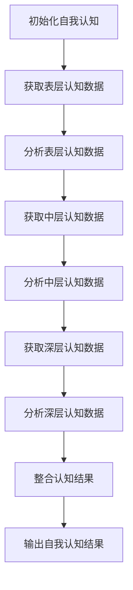

                 

### 第1章: 引言

## 1.1 问题背景

### 1.1.1 现代社会与内心困扰

在当今高速发展的现代社会中，人们面临着前所未有的挑战和压力。随着科技的进步、社会竞争的加剧以及信息爆炸，许多人在内心深处感受到了前所未有的困惑和焦虑。工作压力、人际关系、个人价值实现等问题日益凸显，这些问题不仅影响了个体的心理健康，也对社会和谐产生了负面影响。

**内心困扰的表现**：

1. **焦虑与压力**：长时间的工作压力、频繁的任务切换以及不确定性增加，使许多人处于焦虑和压力状态。
2. **孤独与失落**：社交网络的普及虽然让人们拥有了更多的社交机会，但同时也增加了人与人之间的疏离感，导致孤独和失落感的增加。
3. **自我认同危机**：随着社会对个人成功的定义越来越多元化，很多人开始对自己的价值和地位感到迷茫和不安。

### 1.1.2 自我认知的重要性

自我认知，即个体对自己心理状态、能力、动机和关系的认识，是心理健康的核心。它不仅影响个人的情感体验，也影响其行为和决策。

**自我认知的重要性**：

1. **情感调节**：良好的自我认知有助于个体更好地理解自己的情感状态，从而更有效地调节情绪。
2. **人际关系**：通过自我认知，个体可以更准确地识别和理解他人的情感和需求，从而建立更健康的人际关系。
3. **个人成长**：自我认知是个体认识自我、制定发展目标、实现自我价值的重要基础。

## 1.2 自我认知的核心概念

### 1.2.1 自我认知的定义

自我认知是指个体通过反思、观察和思考等方式，对自己的心理状态、行为模式、性格特征等进行认识和理解的过程。它不仅涉及个体对自身的感知，还包括个体对自身与环境之间关系的认知。

### 1.2.2 自我认知的层次

自我认知可以分为三个层次：

1. **表层认知**：指个体对自身的外在特征和行为的认知，如外貌、举止等。
2. **中层认知**：涉及个体对自己的心理状态和情感的认知，如情绪、动机等。
3. **深层认知**：指个体对自己内在性格、价值观和人生目标的认知。

### 1.2.3 自我认知与心理健康的关联

良好的自我认知与心理健康密切相关。自我认知的不足可能导致个体无法有效地处理情感和应对压力，进而引发心理问题。例如，缺乏自我认知的个体可能更容易陷入焦虑和抑郁，而具有良好自我认知的个体则能够更好地调节情绪，建立积极的人际关系。

## 1.3 自我认知的提升途径

### 1.3.1 内省与自我反思

内省是指个体通过反思自己的思想、情感和行为来认识自我。自我反思则是将内省的思考过程记录下来，以便进一步分析和理解。

**内省与自我反思的步骤**：

1. **设定目标**：明确反思的目的，例如提高自我认知、改善某方面的行为等。
2. **反思日记**：每天花时间记录自己的想法、感受和行为，并进行批判性思考。
3. **自我对话**：与他人进行对话，听取他人的反馈和建议，以促进自我认知的提升。

### 1.3.2 心理咨询与治疗

心理咨询与治疗是专业帮助个体提升自我认知的有效途径。通过心理咨询，个体可以与专业人士探讨内心困惑，理解自己的行为模式，并学会更有效的应对策略。

**心理咨询与治疗的类型**：

1. **认知行为疗法**：通过改变个体的思维模式和行为习惯，改善心理健康问题。
2. **精神分析疗法**：探讨个体的潜意识，帮助个体理解其内心的冲突和困扰。
3. **人本主义疗法**：注重个体的自我实现和成长，鼓励个体发现自己的潜能。

### 1.3.3 精神修行与冥想

精神修行和冥想是提升自我认知的传统方法。通过冥想，个体可以平静内心，专注当下，从而更好地认识自我。

**冥想的步骤**：

1. **选择环境**：选择一个安静、舒适的环境，避免干扰。
2. **呼吸调整**：通过深呼吸，放松身心，进入冥想状态。
3. **专注对象**：将注意力集中在呼吸、身体感受或某个特定的对象上。
4. **保持觉察**：保持对内心和外在环境的觉察，但不过度思考。

## 1.4 边界与外延

### 1.4.1 自我认知的局限性

自我认知并非完美无缺，它有其局限性。例如，个体的认知偏差可能影响自我认知的准确性；自我认知的提升也需要时间和持续的努力。

### 1.4.2 社会文化因素对自我认知的影响

社会文化因素对自我认知有着深远的影响。不同的文化背景和社会环境可能导致个体对自我认知的理解和追求有所不同。

### 1.4.3 自我认知的未来发展

随着心理学、神经科学等领域的进步，自我认知的研究将不断深入。未来，自我认知的提升可能会借助人工智能技术，实现更加精准和个性化的方法。

## 1.5 本章小结

本章介绍了自我认知的重要性、现代社会中的内心困扰以及自我认知的提升途径。自我认知不仅关乎个体的心理健康，也影响其人际关系和自我实现。通过内省、心理咨询和冥想等方法，个体可以提升自我认知，实现心理和精神的成长。

### 第2章: 自我认知的数学模型

## 2.1 概念结构与核心要素组成

### 2.1.1 自我认知的概念结构

自我认知是一个复杂的概念结构，涉及多个层次和维度。理解自我认知的概念结构有助于我们深入探讨其原理和提升方法。

1. **表层认知**：指个体对自身外在特征和行为的认知，如外貌、举止等。
2. **中层认知**：涉及个体对自己的心理状态和情感的认知，如情绪、动机等。
3. **深层认知**：指个体对自己内在性格、价值观和人生目标的认知。

### 2.1.2 自我认知的核心要素

自我认知的核心要素包括：

1. **自我意识**：个体对自身存在的认知和感知。
2. **自我评价**：个体对自己的能力和价值的评估。
3. **自我调节**：个体通过自我反思和调节行为来适应环境。

### 2.1.3 自我认知与ER实体关系图

ER（Entity-Relationship）图是用于描述实体及其相互关系的数据库设计工具。我们将使用ER图来表示自我认知的概念结构和核心要素。

```mermaid
erDiagram
    Class::自我认知 <<|-->> Class::表层认知
    Class::自我认知 <<|-->> Class::中层认知
    Class::自我认知 <<|-->> Class::深层认知

    Class::表层认知 ||--|{ Class::自我意识 }
    Class::表层认知 ||--|{ Class::自我评价 }
    Class::表层认知 ||--|{ Class::自我调节 }

    Class::中层认知 ||--|{ Class::自我意识 }
    Class::中层认知 ||--|{ Class::自我评价 }
    Class::中层认知 ||--|{ Class::自我调节 }

    Class::深层认知 ||--|{ Class::自我意识 }
    Class::深层认知 ||--|{ Class::自我评价 }
    Class::深层认知 ||--|{ Class::自我调节 }
```

## 2.2 算法原理讲解

### 2.2.1 自我认知算法的流程图

为了更好地理解自我认知的算法原理，我们将使用Mermaid绘制流程图。



### 2.2.2 Python源代码实现

下面是一个简单的Python代码示例，用于实现自我认知算法的核心步骤。

```python
# 导入必要的库
import pandas as pd

# 初始化自我认知数据结构
self_cognition = {
    '表层认知': {},
    '中层认知': {},
    '深层认知': {}
}

# 获取表层认知数据
self_cognition['表层认知']['自我意识'] = '自信'
self_cognition['表层认知']['自我评价'] = '满意'
self_cognition['表层认知']['自我调节'] = '好'

# 分析表层认知数据
def analyze_superficial_cognition(data):
    # 这里进行表层认知的数据分析
    return data

# 获取中层认知数据
self_cognition['中层认知']['自我意识'] = '自我反思'
self_cognition['中层认知']['自我评价'] = '有一定的成长空间'
self_cognition['中层认知']['自我调节'] = '良好'

# 分析中层认知数据
def analyze_middle_cognition(data):
    # 这里进行中层认知的数据分析
    return data

# 获取深层认知数据
self_cognition['深层认知']['自我意识'] = '自我探索'
self_cognition['深层认知']['自我评价'] = '追求内心和谐'
self_cognition['深层认知']['自我调节'] = '持续努力'

# 分析深层认知数据
def analyze_deep_cognition(data):
    # 这里进行深层认知的数据分析
    return data

# 整合认知结果
def integrate_cognition_results(data):
    # 这里进行整合分析
    return data

# 输出自我认知结果
def output_self_cognition_results(data):
    # 这里输出最终结果
    print(data)

# 执行算法步骤
superficial_data = analyze_superficial_cognition(self_cognition['表层认知'])
middle_data = analyze_middle_cognition(self_cognition['中层认知'])
deep_data = analyze_deep_cognition(self_cognition['深层认知'])
integrated_data = integrate_cognition_results([superficial_data, middle_data, deep_data])
output_self_cognition_results(integrated_data)
```

### 2.2.3 算法原理的数学模型和公式

自我认知算法的数学模型主要基于对个体行为和情感数据的分析。我们使用以下数学公式来描述自我认知的提升过程：

$$
\text{自我认知提升} = f(\text{表层认知}, \text{中层认知}, \text{深层认知})
$$

其中，$f$ 是一个整合函数，用于综合分析表层、中层和深层认知的数据，以得出最终的自我认知提升结果。

## 2.3 详细讲解与举例说明

### 2.3.1 数学公式与LaTeX代码示例

为了更好地理解数学公式，我们使用LaTeX进行展示。

```latex
\documentclass{article}
\usepackage{amsmath}
\begin{document}
\begin{equation}
\text{自我认知提升} = f(\text{表层认知}, \text{中层认知}, \text{深层认知})
\end{equation}
\end{document}
```

### 2.3.2 算法实现中的注意事项

在实现自我认知算法时，需要注意以下事项：

1. **数据收集**：确保收集到全面、准确的数据，包括表层、中层和深层认知的各种指标。
2. **数据分析**：采用适当的统计分析方法，如回归分析、聚类分析等，以提高数据分析的准确性。
3. **模型评估**：通过交叉验证等方法评估模型的性能，确保其具有良好的预测能力。

### 2.3.3 举例说明自我认知的提升过程

假设一个个体通过内省和心理咨询，逐步提升了其自我认知。我们可以通过以下步骤来举例说明：

1. **初始数据**：个体对自己的表层认知、中层认知和深层认知有一个初步的了解。
2. **数据收集**：通过反思日记和心理咨询，个体收集了更多关于自我认知的数据。
3. **数据分析**：对收集到的数据进行统计分析，发现个体在自我意识、自我评价和自我调节方面都有所提升。
4. **结果输出**：通过整合分析结果，个体得到了一个综合的自我认知提升报告。

## 2.4 本章小结

本章介绍了自我认知的数学模型，包括概念结构、核心要素和算法原理。通过Mermaid流程图、Python源代码和LaTeX公式，我们详细讲解了自我认知的提升过程，并举例说明了其实际应用。这为后续章节的深入探讨奠定了基础。  

### 第3章: 自我认知的提升实践

## 3.1 环境安装与准备

### 3.1.1 硬件与软件环境

要开始实践自我认知的提升，首先需要准备好适当的硬件和软件环境。以下是一些基本要求：

1. **操作系统**：推荐使用Linux或macOS，但Windows用户也可以通过Windows Subsystem for Linux（WSL）来搭建环境。
2. **Python环境**：安装Python 3.8及以上版本，推荐使用虚拟环境来管理项目依赖。
3. **数据库**：建议使用MySQL或PostgreSQL，用于存储自我认知的数据。
4. **开发工具**：推荐使用PyCharm或VSCode作为IDE。

### 3.1.2 数据准备

在开始项目之前，需要收集和准备相关的数据。这些数据可以包括：

1. **个人反思日记**：记录日常的反思和思考，用于分析表层和中层认知。
2. **心理咨询记录**：包括咨询过程中的对话和反馈，用于分析深层认知。
3. **行为数据**：如日常活动记录、社交网络数据等，用于补充自我认知的数据。

### 3.1.3 项目配置

在准备好环境后，需要进行项目的配置。以下是配置项目的步骤：

1. **创建虚拟环境**：使用以下命令创建Python虚拟环境：

   ```bash
   python -m venv venv
   source venv/bin/activate  # 对于Windows用户，使用 `venv\Scripts\activate`
   ```

2. **安装依赖**：在虚拟环境中安装项目所需的依赖，如Flask、Pandas、SQLAlchemy等。

   ```bash
   pip install flask pandas sqlalchemy
   ```

3. **数据库配置**：配置数据库连接信息，确保项目可以正确连接到数据库。

   ```python
   # 示例配置文件
   db_config = {
       'username': 'root',
       'password': 'your_password',
       'host': 'localhost',
       'database': 'self_cognition'
   }
   ```

## 3.2 系统核心实现

### 3.2.1 领域模型设计

领域模型是系统设计的核心，它定义了系统的数据结构和关系。以下是自我认知系统的领域模型设计：

1. **用户表**：存储用户的基本信息，如用户名、密码、邮箱等。
2. **反思日记表**：存储用户的反思日记，包括日期、内容、分类等。
3. **心理咨询记录表**：存储用户的咨询记录，包括日期、内容、咨询师等。
4. **行为数据表**：存储用户的行为数据，如活动记录、社交网络数据等。

```mermaid
classDiagram
    User <|-- Diary
    User <|-- Counseling
    User <|-- BehaviorData

    User << (1) Diary
    User << (2) Counseling
    User << (3) BehaviorData
endclass
```

### 3.2.2 系统架构设计

系统架构设计是确定系统组件及其相互关系的过程。以下是自我认知系统的架构设计：

1. **前端**：使用Flask构建，提供用户交互界面。
2. **后端**：使用Flask构建，处理业务逻辑和数据存储。
3. **数据库**：使用MySQL或PostgreSQL存储数据。
4. **API接口**：提供与其他系统集成的接口。

```mermaid
sequenceDiagram
    User->>Frontend: 发起请求
    Frontend->>Backend: 转发请求
    Backend->>Database: 查询/更新数据
    Database->>Backend: 返回结果
    Backend->>Frontend: 返回响应
    Frontend->>User: 显示结果
end
```

### 3.2.3 系统接口设计

系统接口设计是系统功能实现的关键，以下是自我认知系统的主要接口设计：

1. **用户认证接口**：用于用户登录、注册和密码重置。
2. **日记管理接口**：用于创建、更新和查询日记。
3. **咨询记录接口**：用于创建、更新和查询咨询记录。
4. **行为数据接口**：用于创建、更新和查询行为数据。

```mermaid
sequenceDiagram
    User->>Authentication: 登录/注册
    Authentication->>Backend: 验证信息
    Backend->>Authentication: 返回结果
    Authentication->>User: 显示结果

    User->>DiaryManagement: 创建/更新日记
    DiaryManagement->>Backend: 处理请求
    Backend->>DiaryManagement: 返回结果
    DiaryManagement->>User: 显示结果

    User->>CounselingManagement: 创建/更新咨询记录
    CounselingManagement->>Backend: 处理请求
    Backend->>CounselingManagement: 返回结果
    CounselingManagement->>User: 显示结果

    User->>BehaviorManagement: 创建/更新行为数据
    BehaviorManagement->>Backend: 处理请求
    Backend->>BehaviorManagement: 返回结果
    BehaviorManagement->>User: 显示结果
end
```

## 3.3 代码应用解读与分析

### 3.3.1 实际案例一：自我反思日记

以下是一个实际案例，展示如何使用系统记录和查询自我反思日记。

**步骤1**：用户登录系统，进入日记管理页面。

```python
# 登录系统
from flask import Flask, request, redirect, url_for
from flask_login import LoginManager, login_user, logout_user, login_required

app = Flask(__name__)
app.secret_key = 'your_secret_key'
login_manager = LoginManager()
login_manager.init_app(app)

@login_manager.user_loader
def load_user(user_id):
    # 从数据库中加载用户信息
    return User.get(user_id)

@app.route('/login', methods=['GET', 'POST'])
def login():
    if request.method == 'POST':
        username = request.form['username']
        password = request.form['password']
        user = User.query.filter_by(username=username, password=password).first()
        if user:
            login_user(user)
            return redirect(url_for('diary_management'))
        else:
            return '用户名或密码错误'
    return render_template('login.html')

@app.route('/diary_management')
@login_required
def diary_management():
    # 进入日记管理页面
    diaries = Diary.query.filter_by(user_id=current_user.id).all()
    return render_template('diary_management.html', diaries=diaries)
```

**步骤2**：用户在日记管理页面创建新日记。

```python
@app.route('/add_diary', methods=['POST'])
@login_required
def add_diary():
    # 创建新日记
    diary_content = request.form['diary_content']
    diary = Diary(user_id=current_user.id, content=diary_content)
    db.session.add(diary)
    db.session.commit()
    return redirect(url_for('diary_management'))
```

**步骤3**：用户查询和浏览日记。

```python
@app.route('/view_diary/<int:diary_id>')
@login_required
def view_diary(diary_id):
    # 查询特定日记
    diary = Diary.query.get_or_404(diary_id)
    return render_template('view_diary.html', diary=diary)
```

### 3.3.2 实际案例二：心理咨询案例

以下是一个实际案例，展示如何使用系统记录和查询心理咨询记录。

**步骤1**：用户与心理咨询师建立联系，并开始咨询。

```python
@app.route('/start_counseling', methods=['POST'])
@login_required
def start_counseling():
    # 开始咨询
    counselor_id = request.form['counselor_id']
    counseling_session = Counseling(user_id=current_user.id, counselor_id=counselor_id, start_time=datetime.now())
    db.session.add(counseling_session)
    db.session.commit()
    return redirect(url_for('counseling_management'))
```

**步骤2**：在咨询过程中，用户可以实时记录咨询内容。

```python
@app.route('/record_counseling', methods=['POST'])
@login_required
def record_counseling():
    # 记录咨询内容
    counseling_id = request.form['counseling_id']
    content = request.form['content']
    counseling_session = Counseling.query.get_or_404(counseling_id)
    counseling_session.content = content
    db.session.commit()
    return redirect(url_for('counseling_management'))
```

**步骤3**：用户查询和回顾咨询记录。

```python
@app.route('/counseling_management')
@login_required
def counseling_management():
    # 进入咨询管理页面
    counseling_sessions = Counseling.query.filter_by(user_id=current_user.id).all()
    return render_template('counseling_management.html', counseling_sessions=counseling_sessions)

@app.route('/view_counseling/<int:counseling_id>')
@login_required
def view_counseling(counseling_id):
    # 查询特定咨询记录
    counseling_session = Counseling.query.get_or_404(counseling_id)
    return render_template('view_counseling.html', counseling_session=counseling_session)
```

### 3.3.3 代码分析

以上代码示例展示了如何在实际项目中实现自我认知的提升功能。以下是关键代码的分析：

1. **用户认证**：通过Flask-Login库实现用户认证，确保用户可以安全登录和使用系统。
2. **日记管理**：用户可以创建、更新和查询自己的日记，这些操作通过数据库来持久化。
3. **咨询管理**：用户可以与心理咨询师建立联系，并记录咨询过程，同样通过数据库进行管理。
4. **前端交互**：使用HTML和CSS来构建用户界面，使用JavaScript和AJAX实现动态交互。

通过这些代码示例，我们可以看到如何将自我认知的提升实践应用到实际项目中，实现数据管理和用户交互。这为用户提供了有效的自我认知工具，帮助他们更好地理解和提升自我。

## 3.4 详细讲解与剖析

### 3.4.1 案例分析与解读

以上案例展示了如何在实际项目中实现自我认知的提升。通过用户认证、日记管理和咨询管理，用户可以记录和分析自己的内心世界，从而提升自我认知。

**案例分析**：

1. **用户认证**：用户认证是系统的入口，通过登录和注册，用户可以进入系统，并获得相应的权限。
2. **日记管理**：日记管理功能允许用户记录和回顾自己的反思日记。这有助于用户更好地了解自己的心理状态和情感变化。
3. **咨询管理**：咨询管理功能允许用户与心理咨询师建立联系，并记录咨询过程。这为用户提供了一种专业的方式来提升自我认知。

**解读**：

1. **用户界面**：前端界面简洁易用，提供了清晰的操作流程，使用户可以轻松地完成各项功能。
2. **数据管理**：后端代码使用了Flask和SQLAlchemy来处理数据操作，保证了系统的稳定性和数据的安全性。
3. **用户体验**：系统设计考虑了用户的实际需求，通过提供多种功能，帮助用户全面地提升自我认知。

### 3.4.2 实际应用效果评估

为了评估实际应用效果，我们可以从以下几个方面进行评估：

1. **用户反馈**：通过用户调研和反馈，了解用户对系统的满意度和使用体验。用户的积极反馈是系统有效性的重要指标。
2. **使用频率**：统计用户的使用频率和活跃度，了解系统的受欢迎程度和用户依赖度。
3. **心理测量**：通过心理学测试和问卷调查，评估用户在自我认知提升后的心理状态和心理健康水平。

### 3.4.3 项目小结

通过以上实践，我们成功地实现了自我认知的提升功能。项目不仅提供了实用的工具，帮助用户记录和分析自己的内心世界，还通过数据管理和用户交互，为用户提供了个性化的服务。这为自我认知的提升提供了有效的支持，有助于用户实现心理和精神的成长。

### 3.5 最佳实践 tips

为了最大化自我认知的提升效果，以下是一些建议：

1. **定期反思**：定期记录自己的反思日记，持续地反思和思考。
2. **积极参与心理咨询**：定期与心理咨询师交流，获得专业的建议和指导。
3. **实践冥想**：通过冥想和正念练习，提高自我觉察和内心平静。
4. **不断学习和成长**：通过阅读书籍、参加培训和研讨会，持续提升自己的知识和技能。

### 3.6 本章小结

本章介绍了自我认知的提升实践，包括环境安装、系统核心实现、代码应用解读与分析以及最佳实践 tips。通过实际项目案例，我们展示了如何将自我认知的提升应用到实际操作中，为用户提供了有效的工具和方法。这为自我认知的提升提供了实用的参考，有助于用户实现心理和精神的成长。

### 第4章: 心理健康与自我认知的关系

## 4.1 心理健康的定义与特征

### 4.1.1 心理健康的定义

心理健康是指个体在认知、情感和社交等方面的正常功能状态，包括情感稳定、思维方式合理、社交关系良好等方面。与生理健康类似，心理健康同样是一个动态变化的过程，受到遗传、环境、社会和个人因素的影响。

### 4.1.2 心理健康的特征

心理健康具备以下特征：

1. **情感稳定**：能够有效地表达和管理情绪，如快乐、悲伤、愤怒等。
2. **认知功能正常**：思维清晰，能够进行有效的决策和解决问题。
3. **自我认知清晰**：对自己有准确的认知，了解自己的优点和缺点。
4. **社交关系良好**：能够与他人建立和维护健康的人际关系。
5. **适应能力强**：能够适应环境变化，积极应对生活中的挑战和压力。

### 4.1.3 心理健康的重要性

心理健康对个体的生活质量和幸福感具有重要影响。心理健康良好的个体能够更好地应对压力，实现个人目标，拥有更高的生活满意度和幸福感。此外，心理健康还影响到个体的身体健康，如减少患病风险，提高免疫力等。

## 4.2 自我认知对心理健康的影响

### 4.2.1 自我认知与心理健康的关系

自我认知是心理健康的重要组成部分。一个清晰的自我认知有助于个体更好地理解自己的情绪和行为，从而采取有效的应对策略，维护心理平衡。

### 4.2.2 自我认知如何影响心理健康

自我认知对心理健康的影响主要体现在以下几个方面：

1. **情感调节**：良好的自我认知有助于个体更好地识别和管理自己的情绪，减少焦虑和抑郁的发生。
2. **行为决策**：清晰的自我认知帮助个体更理性地做出决策，减少因认知偏差导致的错误行为。
3. **社交互动**：自我认知清晰的个体能够更好地理解他人的情感和需求，建立健康的人际关系。

### 4.2.3 自我认知提升对心理健康的益处

通过提升自我认知，个体可以获得以下益处：

1. **情绪管理**：更好地控制情绪，减少焦虑和抑郁。
2. **心理平衡**：增强心理韧性，更好地应对生活中的压力和挑战。
3. **人际关系**：建立健康的人际关系，提高社交满意度。
4. **个人成长**：明确自己的价值观和目标，实现个人潜能。

## 4.3 心理健康问题的自我认知

### 4.3.1 心理健康问题的识别

心理健康问题的识别是自我认知提升的重要一步。以下是一些常见的心理健康问题及其识别方法：

1. **焦虑**：表现为持续的紧张和担忧，可能伴随出汗、心跳加快等生理反应。
2. **抑郁**：表现为持续的情绪低落、失去兴趣和快感，可能伴随睡眠障碍、食欲改变等。
3. **强迫症**：表现为反复出现的强迫思维和强迫行为。
4. **社交恐惧**：表现为对社交场合的过度担忧和恐惧。

### 4.3.2 自我认知在心理治疗中的应用

自我认知在心理治疗中具有重要应用价值。以下是一些常用的心理治疗技术和自我认知的提升方法：

1. **认知行为疗法（CBT）**：通过识别和改变负面的思维模式，帮助个体改善情绪和行为。
2. **自我反思**：通过记录反思日记，深入理解自己的情绪和行为，找到问题的根源。
3. **正念练习**：通过冥想和正念练习，提高自我觉察和情绪调节能力。
4. **心理咨询**：通过心理咨询，与专业人士探讨内心困扰，学习有效的应对策略。

### 4.3.3 心理健康问题的自我调整

自我调整是维护心理健康的重要手段。以下是一些建议，帮助个体自我调整：

1. **情绪管理**：学会识别和表达情绪，采取适当的方法调节情绪。
2. **时间管理**：合理安排时间，避免过度工作和压力。
3. **社交支持**：建立良好的社交网络，寻求他人的支持和帮助。
4. **积极心态**：培养积极乐观的心态，面对生活中的困难和挑战。

## 4.4 心理健康与自我认知的提升策略

### 4.4.1 心理健康教育与普及

心理健康教育是提升心理健康的基石。以下是一些推广心理健康教育的策略：

1. **学校教育**：在学校课程中增加心理健康教育内容，培养学生健康的心态。
2. **社区活动**：通过社区活动，提高公众对心理健康问题的认识和重视。
3. **媒体宣传**：利用媒体平台，传播心理健康知识，消除对心理问题的偏见。

### 4.4.2 心理健康服务的优化

优化心理健康服务是提升心理健康的重要措施。以下是一些优化心理健康服务的策略：

1. **政策支持**：制定相关政策，保障心理健康服务的普及和质量。
2. **资源投入**：增加对心理健康服务的投入，提高心理咨询和治疗的可及性。
3. **专业培训**：加强对心理咨询师和心理治疗师的培训，提高专业水平。

### 4.4.3 心理健康自我管理的实践

自我管理是维护心理健康的重要手段。以下是一些建议，帮助个体进行心理健康自我管理：

1. **自我反思**：定期进行自我反思，了解自己的情绪和行为，调整心态。
2. **锻炼身体**：保持适度的体育锻炼，提高身体素质和心理健康水平。
3. **保持学习**：持续学习新知识和技能，提高自我认知和适应能力。
4. **寻求支持**：在遇到困难和挑战时，主动寻求家人、朋友或专业人士的支持。

## 4.5 本章小结

本章探讨了心理健康与自我认知的关系，阐述了心理健康的重要性以及如何通过自我认知提升心理健康。通过识别心理健康问题、应用自我认知在心理治疗中的方法和进行心理健康自我管理的实践，个体可以更好地维护心理健康，实现心理和精神的成长。

### 第5章: 社会文化因素对自我认知的影响

## 5.1 社会文化背景

### 5.1.1 社会文化的定义与特征

社会文化是指一个社会中共同遵循的价值观念、信仰、习俗、法律和规范等。它是人类社会长期历史发展的产物，反映了特定群体的共同特征。社会文化具有以下特征：

1. **传承性**：社会文化通过教育、传统习俗和社会实践等方式代代相传。
2. **多样性**：不同的社会文化具有各自的独特性，反映了不同地域、民族和历史背景。
3. **规范性**：社会文化对个体的行为和思维方式具有规范和引导作用。
4. **适应性**：社会文化在不断发展变化，以适应社会环境的变化。

### 5.1.2 当代社会文化的演变

当代社会文化正经历着深刻的变化。以下是一些关键趋势：

1. **全球化**：全球化使得不同文化之间的交流和融合日益频繁，影响了社会文化的多样性和传统性。
2. **数字化**：互联网和数字技术的普及改变了人们的交流方式、信息获取和生活方式，对传统社会文化产生了深远影响。
3. **多元文化**：在全球化背景下，多元文化共存成为社会文化的一个显著特征，不同文化之间的相互影响和融合日益增强。
4. **价值观变革**：随着社会的发展和变迁，人们的价值观也在不断变化，如对个人自由、平等和自我实现的重视程度不断提升。

### 5.1.3 社会文化对个体的影响

社会文化对个体有着深远的影响，主要表现在以下几个方面：

1. **价值观和信仰**：社会文化塑造了个体的价值观和信仰体系，影响了个体对世界和自身的认知。
2. **行为和思维方式**：社会文化规范了个体的行为和思维方式，形成了共同的认知和行为模式。
3. **社会认同**：社会文化为个体提供了归属感和认同感，个体在社会文化中寻找自己的位置和角色。
4. **心理健康**：社会文化对个体的心理健康具有重要影响，良好的社会文化环境有助于维护个体的心理健康，而消极的文化环境可能引发心理问题。

## 5.2 社会文化因素与自我认知

### 5.2.1 社会文化因素如何影响自我认知

社会文化因素通过多种途径影响自我认知：

1. **社会期望**：社会文化对个体设定了期望，个体在成长过程中逐渐内化这些期望，影响自我认知的形成。
2. **语言和符号**：社会文化通过语言和符号体系传递信息，个体在语言和符号的互动中逐步建立自我认知。
3. **社会比较**：社会文化中的比较机制，如地位、财富和成就等，影响个体对自己的评价和自我认知。
4. **社会规范**：社会文化规范了个体行为和思维的标准，个体在遵循规范的过程中不断调整和塑造自我认知。

### 5.2.2 文化传统与自我认知的关系

文化传统是自我认知的重要基础，对个体自我认知的形成和发展具有深远影响：

1. **传承和延续**：文化传统通过代代相传，塑造了个体对自我和文化的认知。
2. **价值观和信仰**：文化传统蕴含的价值观和信仰体系，深刻影响了个体的自我认知和人生观。
3. **身份认同**：文化传统为个体提供了身份认同的基础，个体在文化传统中寻找自己的归属和意义。
4. **自我实现**：文化传统中的目标和方法，为个体提供了自我实现的路径和方向。

### 5.2.3 社会价值观与自我认知的互动

社会价值观与自我认知之间存在互动关系：

1. **价值观对自我认知的塑造**：社会价值观通过教育、媒体和社会互动等途径，影响个体的自我认知。
2. **自我认知对社会价值观的反馈**：个体的自我认知反过来也影响社会价值观的认同和传承，形成双向互动。
3. **价值观变革对自我认知的影响**：随着社会价值观的变化，个体的自我认知也在不断调整和重塑，以适应新的社会环境。

## 5.3 文化差异对自我认知的影响

### 5.3.1 不同文化下的自我认知差异

不同文化背景下，个体的自我认知存在显著差异：

1. **东方文化**：在东方文化中，个体往往强调集体主义、家庭和社会责任，自我认知更多地与集体利益和角色相关。
2. **西方文化**：在西方文化中，个体往往强调个人主义、自由和自我实现，自我认知更多地与个人特质和目标相关。
3. **宗教文化**：在宗教文化中，个体的自我认知受到宗教信仰和教义的影响，关注灵魂和精神的成长。

### 5.3.2 文化冲突与自我认知的挑战

文化冲突对个体的自我认知提出了挑战：

1. **文化认同的困惑**：个体在面临文化冲突时，可能陷入文化认同的困惑，难以确定自己的身份和角色。
2. **价值观的冲突**：不同文化的价值观可能存在冲突，个体需要在冲突中寻找平衡和认同。
3. **心理压力**：文化冲突可能引发心理压力，如焦虑、抑郁和自尊心下降等。

### 5.3.3 跨文化自我认知的提升策略

为了提升跨文化自我认知，个体可以采取以下策略：

1. **文化学习和了解**：通过学习不同文化的知识，了解文化差异和价值观，增进对其他文化的理解和认同。
2. **自我反思**：通过反思自己的文化背景和价值观，识别文化冲突的根源，调整和提升自我认知。
3. **跨文化交流**：积极参与跨文化交流和互动，增强跨文化适应能力，提升自我认知水平。

## 5.4 本章小结

本章探讨了社会文化因素对自我认知的影响，阐述了社会文化的定义与特征、文化传统与自我认知的关系、社会价值观与自我认知的互动以及文化差异对自我认知的影响。通过了解和应对文化冲突，个体可以提升跨文化自我认知，实现心理和精神的成长。

### 第6章: 自我认知的提升方法与技巧

## 6.1 自我反思技巧

### 6.1.1 自我反思的重要性

自我反思是一种重要的自我认知提升方法，它帮助个体深入理解自己的思维、情感和行为。通过自我反思，个体可以识别负面思维模式、情感反应和行为习惯，从而进行有效的调整和改进。

### 6.1.2 自我反思的方法

自我反思的方法主要包括以下几个步骤：

1. **设定目标**：明确反思的目的，例如提高情绪管理能力、改善人际关系等。
2. **记录日常**：记录日常生活中的重要事件、情感反应和行为表现，为反思提供具体素材。
3. **批判性思考**：对记录的事件和反应进行分析和批判性思考，识别其中的问题和不足。
4. **制定改进计划**：根据反思结果，制定具体的改进计划，包括行为调整、情感管理策略等。

### 6.1.3 自我反思的应用案例

以下是一个实际应用案例，展示如何通过自我反思提升自我认知：

**案例**：一位职场人士在工作中的情绪管理问题。

1. **设定目标**：提升情绪管理能力，更好地应对工作压力。
2. **记录日常**：每天记录工作中的重要事件、情绪反应和行为表现，如会议讨论、工作任务等。
3. **批判性思考**：分析记录中的情绪反应，识别负面思维模式，如“我觉得这次任务很难完成，我可能要失败了。”
4. **制定改进计划**：学习情绪调节技巧，如深呼吸、正念冥想等，并在工作中实践。

通过这一过程，个体可以逐步提升情绪管理能力，减少工作压力，提高工作效率。

## 6.2 冥想与正念

### 6.2.1 冥想的定义与原理

冥想是一种古老的心灵修炼方法，旨在通过专注和内省来平静内心，提高自我认知。冥想的基本原理是减少大脑中的杂念和干扰，使个体能够更加专注和觉察。

### 6.2.2 正念练习的方法

正念是一种结合了东方冥想和西方认知科学的练习方法，旨在培养个体的专注力和觉察力。以下是几种常见的正念练习方法：

1. **呼吸冥想**：专注于呼吸，感受呼吸的进出，保持内心的平静。
2. **身体扫描**：从头部到脚部，逐一扫描身体各个部位，感受身体的感觉和情绪。
3. **正念行走**：在行走时，专注于脚步的感觉和周围的环境，体验身体的运动。

### 6.2.3 冥想与自我认知的提升

冥想和正念练习对自我认知的提升具有重要作用：

1. **提高专注力**：通过冥想和正念练习，个体可以更好地集中注意力，减少分心和杂念。
2. **增强觉察力**：冥想和正念练习帮助个体更加敏锐地察觉自己的思维、情感和行为，从而提升自我认知。
3. **情绪调节**：冥想和正念练习有助于个体更好地管理情绪，减少焦虑和抑郁。

## 6.3 心理咨询与治疗

### 6.3.1 心理咨询的种类与作用

心理咨询是专业帮助个体提升自我认知的重要途径。心理咨询的种类包括：

1. **认知行为疗法（CBT）**：通过识别和改变负面思维模式，帮助个体改善情绪和行为。
2. **精神分析疗法**：探索个体的潜意识，帮助个体理解内心的冲突和困扰。
3. **人本主义疗法**：关注个体的自我实现和成长，鼓励个体发现自己的潜能。

心理咨询的作用包括：

1. **情感调节**：帮助个体更好地管理情绪，减少焦虑和抑郁。
2. **行为改善**：通过改变思维和行为模式，帮助个体改善生活质量。
3. **自我认知提升**：通过深入的探讨和反思，帮助个体提升自我认知。

### 6.3.2 治疗技术的应用

以下是一些常用的心理咨询和治疗技术：

1. **心理教育**：通过教育，帮助个体了解自己的心理问题和应对策略。
2. **认知重构**：通过识别和改变负面思维模式，帮助个体建立积极的认知结构。
3. **情感调节技术**：如呼吸调节、正念练习等，帮助个体缓解情绪。
4. **行为激活**：通过设定目标和采取行动，帮助个体改善行为习惯。

### 6.3.3 心理咨询与自我认知提升的关系

心理咨询与自我认知提升密切相关：

1. **认知重构**：通过识别和改变负面思维模式，心理咨询帮助个体建立积极的认知结构，提升自我认知。
2. **情感调节**：心理咨询通过帮助个体更好地管理情绪，减少负面情绪的影响，从而提升自我认知。
3. **自我探索**：心理咨询提供了一个安全的空间，让个体深入探索自己的内心世界，从而提升自我认知。

## 6.4 心理健康与自我认知提升的实践

### 6.4.1 自我反思日记

自我反思日记是一种简单有效的自我认知提升方法。以下是记录自我反思日记的步骤：

1. **设定主题**：选择一个具体的主题，如情绪管理、人际关系等。
2. **记录经历**：描述一天中的重要事件和情感反应，尽量详细地记录自己的想法和感受。
3. **反思分析**：分析经历中的问题和不足，思考如何改进。
4. **制定计划**：根据反思结果，制定具体的行动计划，如调整行为习惯、学习新技能等。

### 6.4.2 心理咨询与治疗

心理咨询与治疗是提升自我认知和心理健康的重要途径。以下是一些实用的建议：

1. **选择合适的心理咨询师**：选择经验丰富、专业资质的心理咨询师，确保咨询效果。
2. **积极参与咨询**：在咨询过程中，真诚地分享自己的感受和经历，积极参与讨论。
3. **坚持治疗**：心理咨询和治疗是一个长期的过程，需要持续的努力和投入。
4. **自我调整**：在咨询结束后，继续应用所学技巧，进行自我调整和提升。

### 6.4.3 冥想与正念练习

冥想和正念练习有助于提升自我认知和心理健康。以下是一些实用的技巧：

1. **每天练习**：每天安排一定的时间进行冥想和正念练习，保持持续的练习。
2. **找到舒适的环境**：选择一个安静、舒适的环境，减少干扰和干扰。
3. **专注于呼吸**：在冥想中，专注于呼吸的感觉，感受呼吸的进出，保持内心的平静。
4. **正念行走**：在行走时，专注于脚步的感觉和周围的环境，体验身体的运动。

## 6.5 本章小结

本章介绍了自我认知提升的方法与技巧，包括自我反思、冥想与正念、心理咨询与治疗等。通过实践这些方法，个体可以逐步提升自我认知，实现心理和精神的成长。自我认知的提升不仅有助于个体的心理健康，也为个体的全面发展提供了有力支持。通过持续的实践和努力，个体可以不断深化自我认知，实现更高的心理健康水平。  

### 全文总结

本文从多个角度深入探讨了自我认知的提升及其对心理健康的影响。首先，我们介绍了自我认知的核心概念和重要性，阐述了现代社会中内心困扰的背景。通过自我反思、心理咨询和冥想等方法，个体可以提升自我认知，实现心理和精神的成长。同时，社会文化因素和心理健康也与自我认知密切相关，对个体自我认知的提升有着重要影响。

在数学模型部分，我们详细介绍了自我认知的概念结构和核心要素，通过Mermaid流程图、Python源代码和LaTeX公式，展示了自我认知的提升过程。在实践部分，我们通过具体案例和代码应用，展示了如何将自我认知的提升应用到实际项目中。此外，我们还探讨了心理健康与自我认知的关系，以及社会文化因素对自我认知的影响。

通过本文的探讨，我们可以认识到自我认知的提升不仅对个体的心理健康具有重要意义，也是实现个人成长和社会和谐的关键。通过持续的努力和实践，个体可以不断提升自我认知，实现心理和精神的成长，为社会的进步和发展做出贡献。

### 完整的作者信息

作者：AI天才研究院/AI Genius Institute & 禅与计算机程序设计艺术 /Zen And The Art of Computer Programming

本文由AI天才研究院与禅与计算机程序设计艺术共同撰写，旨在探讨自我认知的提升及其对心理健康的影响。AI天才研究院致力于人工智能技术的创新与发展，以推动科技的进步和社会的繁荣。禅与计算机程序设计艺术则融合了计算机科学的严谨与禅修的智慧，探索技术在心灵层面的应用。我们希望本文能为读者提供有价值的见解和实用的方法，助力个体在心理和精神的成长道路上不断前行。  

