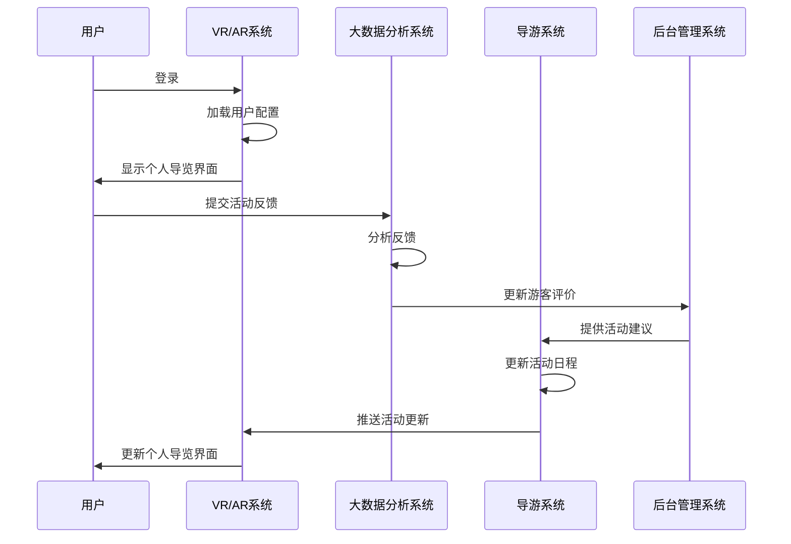

                 

### 引言与概述

在现代旅游业中，深度旅行设计软件作为一种新兴的工具，正逐渐受到广泛关注。本文将探讨深度旅行设计软件的概念、背景、核心要素及其在文化沉浸式体验规划中的重要作用。

#### 背景介绍

旅行设计，顾名思义，是对旅行过程的系统规划和设计。传统的旅行设计主要依赖于个人经验、旅行社推荐和旅游指南等。然而，随着信息技术和人工智能的发展，深度旅行设计软件开始崭露头角，为个性化、定制化的旅行体验提供了新的解决方案。

深度旅行设计软件的出现，源于旅游市场对个性化、文化体验和深度游的需求日益增长。现代旅行者不再满足于走马观花式的观光旅游，他们追求的是能够深入了解当地文化、历史和社会的独特体验。这种需求催生了深度旅行设计软件，使其成为旅游规划中的关键工具。

#### 问题背景

在旅游规划过程中，设计一个符合游客需求的深度旅行方案是一项复杂且具有挑战性的任务。首先，旅游目的地众多，每个目的地都有其独特的文化背景和历史故事，如何在短时间内为游客提供高质量的旅行方案是一个难题。其次，游客的需求多样化，不同游客对旅行体验的期望各不相同，如何根据游客的个性化需求设计出合适的旅行方案也是一个挑战。

此外，传统旅行设计依赖于人工经验和主观判断，存在一定的局限性。而深度旅行设计软件则通过数据分析和人工智能技术，能够提供更加客观、科学的旅行设计方案，从而提高旅游规划的质量和效率。

#### 问题解决

深度旅行设计软件通过以下方法解决了上述问题：

1. **大数据分析与挖掘**：深度旅行设计软件通过收集和分析大量的旅行数据，包括游客偏好、旅行历史、社交网络信息等，从中提取出有价值的洞察，为旅行方案的设计提供数据支持。

2. **人工智能与机器学习**：通过机器学习算法，深度旅行设计软件能够自动生成个性化的旅行方案，满足不同游客的个性化需求。此外，人工智能技术还可以帮助预测旅游市场的趋势，为旅游规划提供战略指导。

3. **文化沉浸式体验设计**：深度旅行设计软件不仅提供旅行路线和活动安排，还注重文化沉浸式体验的设计。通过结合虚拟现实、增强现实等技术，软件能够为游客提供身临其境的体验，增强旅行过程中的文化感知和情感共鸣。

4. **多维度评价与反馈**：深度旅行设计软件通过收集游客的反馈，不断优化旅行方案。这种反馈机制不仅有助于提高游客满意度，还能够为后续的旅行设计提供改进建议。

#### 边界与外延

深度旅行设计软件的应用边界涉及多个方面：

1. **地域范围**：深度旅行设计软件适用于各种地域的旅游规划，包括城市旅游、乡村度假、海外旅行等。

2. **旅游类型**：无论是历史文化游、自然风光游还是主题公园游，深度旅行设计软件都能够提供相应的解决方案。

3. **用户群体**：深度旅行设计软件不仅适用于个人游客，还可以为企业、学校等组织提供定制化的旅游规划服务。

#### 概念结构与核心要素组成

深度旅行设计软件的核心概念和结构包括以下几个方面：

1. **用户画像**：通过数据分析和机器学习算法，生成用户的个性化画像，为旅行方案的设计提供基础。

2. **数据仓库**：收集和管理各种旅行相关的数据，包括游客偏好、活动信息、地理信息等。

3. **算法模型**：运用大数据分析和人工智能技术，设计出符合用户需求的旅行方案。

4. **虚拟现实与增强现实**：利用虚拟现实和增强现实技术，提供沉浸式的旅游体验。

5. **反馈机制**：通过收集用户反馈，不断优化旅行方案，提高用户满意度。

#### 总结

深度旅行设计软件作为一种新兴的旅游规划工具，通过大数据分析、人工智能技术、文化沉浸式体验设计等多方面手段，为旅游者提供个性化、高质量的旅行方案。随着技术的不断进步，深度旅行设计软件将在未来旅游市场中发挥更加重要的作用。通过本文的介绍，读者可以初步了解深度旅行设计软件的基本概念和应用，为后续章节的深入探讨打下基础。

---

### 关键词

- 深度旅行设计
- 文化沉浸式体验
- 旅游规划
- 大数据分析
- 人工智能技术

---

### 摘要

本文围绕深度旅行设计软件这一主题，首先介绍了其背景和意义，分析了其在旅游规划中的重要作用。接着，详细探讨了深度旅行设计软件的核心要素，包括用户画像、数据仓库、算法模型、虚拟现实与增强现实等。通过案例分析，展示了深度旅行设计软件在实践中的应用效果。最后，对深度旅行设计软件的未来发展进行了展望，指出了其在个性化旅游规划中的潜力。本文旨在为读者提供一个全面的深度旅行设计软件概览，为其在相关领域的研究和应用提供参考。

---

## 第1章: 旅游设计的背景与意义

### 1.1 旅行与旅游设计的概念

旅行和旅游设计是现代生活中不可或缺的两个概念，它们紧密相连，共同构成了丰富多彩的旅行体验。首先，我们需要明确旅行和旅游设计的定义及其相互关系。

**旅行的定义**：旅行是指人们为了休闲、商务或其他目的而离开常住地，到另一个地方进行短期或长期活动的行为。旅行可以划分为国内旅行和国外旅行，也可以根据目的分为休闲旅行、商务旅行、学习旅行等类型。旅行不仅仅是空间上的移动，更是文化和心理上的交流与体验。

**旅游设计的定义**：旅游设计则是对旅行活动进行系统规划和设计的艺术与科学。它包括对旅行目的地、路线、活动、住宿、餐饮等多个方面的设计，旨在为旅行者提供一个舒适、愉快、有意义的旅行体验。旅游设计的目标是满足旅行者的需求，提升旅行质量，使旅行更加个性化、多样化。

**旅行与旅游设计的相互关系**：

1. **旅行是旅游设计的基础**：没有旅行，就没有旅游设计的对象。旅游设计需要基于真实的旅行需求、旅行行为和旅行体验来设计和优化旅行方案。

2. **旅游设计提升旅行体验**：旅游设计通过对旅行活动的前期调研、路线规划、活动安排等，为旅行者提供一个更符合个人需求的旅行方案，从而提升旅行体验。

3. **旅行反馈促进旅游设计优化**：旅行者在旅行过程中提供的反馈是旅游设计不断优化的关键。旅游设计者可以根据这些反馈，调整和改进旅行方案，使其更加贴近旅行者的需求。

### 旅行设计的起源与发展

旅行设计作为一个独立的概念和技术，起源于20世纪中后期。随着交通工具的进步、旅游业的发展以及人们对深度体验的需求增加，旅行设计逐渐从传统的旅行安排中分离出来，成为一门专门的研究领域。

1. **初期阶段**（20世纪中叶至20世纪末）：

   - **发展背景**：在这个时期，随着汽车和飞机的普及，旅行变得更加便捷和普遍。旅游业开始蓬勃发展，各种旅行机构和旅行社应运而生，旅行设计逐渐受到重视。
   - **核心内容**：初期的旅行设计主要侧重于旅行线路的设计和安排，包括景点的选择、行程的安排等。这个阶段的旅行设计更多地依赖于旅行者的个人经验和主观判断。

2. **发展阶段**（21世纪初至今）：

   - **发展背景**：随着信息技术的飞速发展和互联网的普及，大数据、人工智能等新技术逐渐应用于旅游领域，旅行设计迎来了新的发展机遇。
   - **核心内容**：现代旅行设计不仅仅局限于线路安排，还涉及到了个性化推荐、文化体验设计、沉浸式体验等方面。旅行设计者通过数据分析和人工智能技术，能够更加精准地满足旅行者的需求。

### 深度旅行设计的起源与发展

深度旅行设计是旅行设计领域的一个重要分支，其起源和发展与以下因素密切相关：

1. **文化体验需求**：随着人们对深度文化体验的需求增加，深度旅行设计应运而生。这种设计理念强调的是让旅行者深入体验目的地文化、历史和社会，而不仅仅是观光游览。

2. **技术进步**：大数据、人工智能、虚拟现实和增强现实等技术的快速发展，为深度旅行设计提供了强大的技术支持。这些技术可以帮助设计者更好地理解旅行者的需求，提供更个性化的旅行体验。

3. **旅游业竞争**：在旅游业日益竞争激烈的背景下，深度旅行设计成为了吸引游客、提升竞争力的重要手段。通过独特的文化体验和高质量的旅行设计，旅游业者可以更好地满足不同旅行者的需求，提升游客满意度。

### 深度旅行设计的目的与目标

深度旅行设计的目的是为旅行者提供一种能够深入体验目的地文化和历史的旅行方式，使旅行不仅仅是物理空间上的移动，更是一种精神上的享受和成长。具体来说，深度旅行设计的目标包括：

1. **个性化体验**：通过个性化推荐和定制化服务，满足不同旅行者的独特需求，提供个性化的旅行体验。

2. **文化沉浸**：通过精心设计的活动和文化体验，让旅行者在旅行过程中深入了解目的地的文化、历史和社会。

3. **高质量服务**：提供高质量的住宿、餐饮、交通等服务，确保旅行者在旅行过程中享受到舒适和便捷。

4. **可持续发展**：在满足旅行者需求的同时，注重环境保护和社会责任，推动旅游业的可持续发展。

### 总结

旅行和旅游设计作为现代生活中不可或缺的两个概念，相互关联，共同构成了丰富多彩的旅行体验。从旅行设计的起源和发展历程，到深度旅行设计的核心理念和目标，我们可以看到，旅行设计在不断提升旅行体验和质量方面发挥了重要作用。随着技术的不断进步，未来旅行设计将迎来更加个性化、多样化的发展，为旅行者提供更加丰富和独特的旅行体验。

---

### 1.2 深度旅行设计的起源与发展

深度旅行设计作为一种新兴的旅游设计理念，其起源可以追溯到人们对旅游体验要求的不断提升。随着全球旅游业的发展，传统观光旅游已经无法满足现代人对于深度文化体验的需求。这种背景下，深度旅行设计应运而生，旨在通过精细化的设计，让旅行者获得更加丰富和沉浸式的旅行体验。

#### 深度旅行设计的起源

深度旅行设计的概念最早可以追溯到20世纪末。在这个时期，随着信息技术和互联网的快速发展，人们对于旅游体验的要求逐渐从简单的观光和度假，转向对目的地文化、历史和生活方式的深度探索。这种需求催生了深度旅行设计的理念，旅游设计者开始关注如何通过设计让旅行者更深入地了解和体验目的地的文化。

1. **信息技术的发展**：互联网和大数据技术的发展，为深度旅行设计提供了数据支持和工具。旅游设计者可以利用这些技术，收集和分析大量的旅游数据，从而设计出更加符合旅行者需求的旅行方案。

2. **旅游业的需求**：随着旅游业竞争的加剧，旅游业者开始寻找新的卖点来吸引游客。深度旅行设计作为一种新兴的旅游形式，能够为旅游业者提供差异化竞争的优势，从而吸引更多游客。

#### 深度旅行设计的发展历程

深度旅行设计的发展可以分为以下几个阶段：

1. **初级阶段（20世纪末至21世纪初）**：

   - **核心内容**：在这个阶段，深度旅行设计主要集中在旅游目的地的选择和行程的安排上，强调旅游者能够体验当地的文化和生活。
   - **技术应用**：虽然互联网和大数据技术开始应用于旅游领域，但深度旅行设计尚未形成完整的理论体系和工具。

2. **发展阶段（21世纪初至今）**：

   - **核心内容**：这一阶段，深度旅行设计逐渐形成了一套完整的理论体系，包括用户画像、活动设计、体验优化等。
   - **技术应用**：大数据分析、人工智能、虚拟现实和增强现实等新兴技术逐渐应用于深度旅行设计，提高了设计的精准性和个性化水平。

3. **成熟阶段（未来几年）**：

   - **核心内容**：未来，深度旅行设计将更加注重用户体验和情感共鸣，通过多元化的设计手段，满足不同旅行者的个性化需求。
   - **技术应用**：随着5G、物联网等新技术的普及，深度旅行设计将迎来更加智能化和互动化的未来。

#### 深度旅行设计的主要特点

深度旅行设计的主要特点包括以下几个方面：

1. **个性化**：深度旅行设计强调根据旅行者的个人喜好、兴趣和需求，为其提供量身定制的旅行方案，使旅行体验更加个性化和独特。

2. **文化沉浸**：深度旅行设计注重让旅行者深入体验目的地的文化、历史和生活方式，通过文化活动和体验项目，提升旅行者的文化感知和情感共鸣。

3. **互动性**：深度旅行设计通过虚拟现实、增强现实等技术手段，增强旅行者与目的地的互动性，使旅行体验更加生动和有趣。

4. **可持续性**：深度旅行设计强调在满足旅行者需求的同时，注重环境保护和社会责任，推动旅游业的可持续发展。

#### 总结

深度旅行设计作为一种新兴的旅游设计理念，其起源和发展与旅游业的需求和技术的进步密切相关。通过个性化、文化沉浸、互动性和可持续性的设计理念，深度旅行设计为旅行者提供了更加丰富和独特的旅行体验。未来，随着技术的不断进步，深度旅行设计将迎来更加广阔的发展空间，为旅游业的发展注入新的活力。

---

### 1.3 深度旅行设计的目的与目标

深度旅行设计的目标在于为旅行者提供一种能够深入体验目的地文化和历史的旅行方式，使其不仅仅是简单的观光和游览，而是一次精神上的洗礼和文化上的交流。以下是深度旅行设计的主要目的和目标：

#### 1.3.1 个性化体验

个性化体验是深度旅行设计的核心目标之一。每个旅行者都有自己独特的兴趣爱好、文化背景和旅行目的。深度旅行设计通过大数据分析和人工智能技术，对旅行者的需求进行精确分析，从而提供量身定制的旅行方案。这不仅能够满足旅行者的个性化需求，还能提高他们的旅行满意度。

**具体实施方法**：

- **用户画像**：通过数据收集和分析，建立旅行者的个性化画像，包括旅行历史、兴趣偏好、活动选择等。
- **个性化推荐**：根据用户画像，为旅行者推荐符合其兴趣和文化需求的景点、活动和住宿。
- **定制化服务**：提供灵活的行程安排和活动选择，让旅行者根据自己的喜好和需求自由组合旅行内容。

#### 1.3.2 文化沉浸

文化沉浸是深度旅行设计的另一个重要目标。通过精心设计的活动和体验，让旅行者在旅行过程中深入了解目的地的文化、历史和社会。这种沉浸式体验不仅能够丰富旅行者的知识，还能增强他们的情感共鸣。

**具体实施方法**：

- **文化导览**：组织专业导游进行深度讲解，介绍目的地的文化、历史和社会背景。
- **体验活动**：安排参与当地传统节日、手工艺制作、特色餐饮等体验活动，让旅行者亲身体验当地的文化和生活。
- **文化遗址游览**：安排参观具有历史价值和文化意义的景点，如博物馆、历史遗迹等，让旅行者在实地感受文化的魅力。

#### 1.3.3 高质量服务

高质量服务是深度旅行设计的基本要求。在确保旅行者能够获得高质量旅行体验的同时，还需要提供优质的住宿、餐饮、交通等服务，使旅行者享受到舒适和便捷。

**具体实施方法**：

- **精选住宿**：为旅行者提供舒适、安全和具有当地特色的住宿设施，如特色民宿、精品酒店等。
- **优质餐饮**：安排具有当地特色和口味的餐饮体验，让旅行者品尝到地道的美食。
- **高效交通**：提供便捷、安全和舒适的交通服务，确保旅行者能够顺利到达各个目的地。

#### 1.3.4 可持续性

可持续性是现代旅游设计的重要考虑因素。深度旅行设计不仅要满足旅行者的需求，还要注重环境保护和社会责任，推动旅游业的可持续发展。

**具体实施方法**：

- **环保措施**：在旅行过程中采取环保措施，如减少一次性用品的使用、推广环保交通工具等。
- **社区参与**：鼓励旅行者参与当地社区的活动和项目，支持当地经济的发展和社会繁荣。
- **教育宣传**：通过宣传和教育活动，提高旅行者和当地居民的环境保护意识，促进可持续发展。

#### 总结

深度旅行设计旨在通过个性化、文化沉浸、高质量服务和可持续性，为旅行者提供一种独特的旅行体验。通过精心设计和实施，深度旅行设计能够满足不同旅行者的需求，提升旅游体验，同时推动旅游业的可持续发展。未来，随着技术的不断进步和旅游业的发展，深度旅行设计将在旅游市场中发挥越来越重要的作用。

---

## 第2章: 深度旅行设计的核心要素

### 2.1 文化体验

文化体验是深度旅行设计的核心要素之一，它决定了旅行者在旅行过程中能否真正了解和感受目的地的文化。文化体验不仅包括对历史遗迹、传统习俗的了解，更涉及对当地生活方式和价值观的体验。为了实现深刻的文化体验，深度旅行设计需要从以下几个方面进行考虑和设计：

#### 2.1.1 文化导览

文化导览是提供文化体验的重要手段之一。通过专业导游的讲解，旅行者可以深入了解目的地的历史、文化和人文故事。文化导览的设计需要考虑以下几个方面：

1. **导游选择**：选择具备丰富文化知识和良好沟通能力的导游，以确保讲解的质量和效果。
2. **讲解内容**：根据目的地的文化特色和旅行者的兴趣，设计有针对性的讲解内容，包括历史、风俗习惯、艺术、宗教等方面。
3. **互动体验**：鼓励旅行者在导览过程中提问和参与讨论，增加互动性，提高文化体验的深度。

#### 2.1.2 文化活动

文化活动是让旅行者亲身体验目的地文化的有效方式。通过参与当地的传统节日、手工艺制作、特色餐饮等体验活动，旅行者可以更深入地了解当地的文化和生活方式。文化活动的设计需要考虑以下几个方面：

1. **活动类型**：根据目的地的文化特色和旅行者的兴趣，选择适合的文化活动类型，如舞蹈表演、音乐会、传统手工艺制作等。
2. **活动安排**：合理规划活动的时间和地点，确保活动能够顺利进行，同时为旅行者提供便捷的参与方式。
3. **体验深度**：设计具有挑战性和趣味性的活动项目，让旅行者在参与过程中感受到乐趣和成就感，提升文化体验的质量。

#### 2.1.3 文化遗址游览

文化遗址游览是文化体验的重要组成部分。通过参观具有历史价值和文化意义的景点，旅行者可以直观地感受到目的地文化的深厚底蕴。文化遗址游览的设计需要考虑以下几个方面：

1. **景点选择**：根据目的地的文化特色，选择具有代表性的文化遗址，如博物馆、历史遗迹、宗教场所等。
2. **参观安排**：合理规划参观路线和时长，确保旅行者能够充分游览和体验每个景点。
3. **讲解补充**：在参观过程中，提供专业讲解服务，帮助旅行者更好地理解文化遗址的历史和文化价值。

#### 2.1.4 文化交流

文化交流是深度旅行设计中不可或缺的一部分。通过文化交流，旅行者可以与当地人建立联系，了解他们的生活、思想和价值观。文化交流的设计需要考虑以下几个方面：

1. **交流形式**：选择适合的交流形式，如座谈会、文化交流会、家庭访问等，确保交流的深度和广度。
2. **参与者选择**：邀请当地有代表性的人物参与交流，如文化专家、社区领袖、艺术家等。
3. **交流内容**：设计有针对性的交流内容，包括文化习俗、生活方式、社会发展等方面，促进双方的了解和互动。

#### 总结

文化体验是深度旅行设计的核心要素，通过文化导览、文化活动、文化遗址游览和文化交流等多种方式，深度旅行设计能够帮助旅行者深入体验目的地的文化，提升旅行的质量。在未来的发展中，随着技术的进步和旅游业的发展，文化体验设计将不断创新和优化，为旅行者提供更加丰富和独特的文化体验。

---

### 2.2 空间布局

在深度旅行设计中，空间布局是至关重要的一环。合理的空间布局不仅能够提升旅行体验，还能够有效利用资源，提高旅游规划的效率。空间布局的设计需要综合考虑多种因素，包括地理环境、旅游资源、游客流量等。以下是空间布局设计的关键要素和具体策略：

#### 2.2.1 地理环境

地理环境是空间布局设计的基础。不同的地理环境对旅游规划有着重要的影响。例如，山区、海滨、城市等不同类型的地理环境需要不同的空间布局策略。

1. **地形地貌**：在山区进行旅游规划时，需要考虑地形的起伏和坡度，合理规划步道、观景台等设施的位置，以确保游客的安全和舒适。
2. **气候条件**：不同气候条件对游客活动和旅游资源的影响也不同。例如，在高温地区，需要考虑设置遮阳设施和凉爽区域，以提升游客的体验。

#### 2.2.2 旅游资源

旅游资源是空间布局设计的重要参考因素。旅游资源的分布和特点会影响旅游规划的整体布局。以下是几种常见的旅游资源类型及其空间布局策略：

1. **历史文化遗迹**：历史文化遗迹通常具有特定的历史价值和参观价值。在布局设计时，需要确保遗迹的完整性，避免对其造成破坏。同时，可以通过合理规划步道和观景台，提升游客的参观体验。
2. **自然景观**：自然景观如山脉、湖泊、森林等，具有独特的观赏和休闲价值。在布局设计时，需要确保游客能够方便地接近自然景观，同时保护自然环境，避免过度开发。

#### 2.2.3 游客流量

游客流量是空间布局设计需要考虑的一个重要因素。合理的游客流量管理能够提高旅游资源的利用效率，提升游客体验。

1. **流量预测**：通过大数据分析和历史数据，预测不同时间段和不同景点的游客流量，为空间布局设计提供参考。
2. **分流措施**：在高峰期，通过设置临时停车场、分流通道、临时设施等，缓解游客流量压力，提高景区的接待能力。

#### 2.2.4 空间利用

空间利用是空间布局设计的关键。合理的空间利用能够提高景区的容纳能力和游客的舒适度。

1. **多功能空间**：设计多功能空间，如停车场、游客中心、休息区等，使其能够根据不同需求进行灵活调整，提高空间的利用率。
2. **景观融合**：在景区内合理布局景观元素，如植被、水体、雕塑等，使其与自然环境相融合，提升景区的整体美观度和游客体验。

#### 2.2.5 环境保护

环境保护是空间布局设计需要重视的一个方面。在旅游规划过程中，需要采取措施保护自然环境，减少对生态系统的破坏。

1. **生态保护**：在景区内设置生态保护区，确保珍稀植物和动物栖息地的安全。
2. **可持续发展**：采用环保材料和节能技术，降低景区运营对环境的影响，推动旅游业的可持续发展。

#### 总结

空间布局设计是深度旅行设计的重要组成部分，通过综合考虑地理环境、旅游资源、游客流量等多个因素，可以设计出合理、高效的空间布局，提升旅行体验和景区的接待能力。在未来的发展中，随着技术的进步和旅游业的发展，空间布局设计将不断创新和优化，为旅行者提供更加丰富和独特的旅行体验。

---

### 2.3 技术手段

在深度旅行设计中，技术手段的应用是其实现个性化、沉浸式和文化传承的重要保障。现代科技，如大数据、人工智能、虚拟现实（VR）、增强现实（AR）等，正被广泛应用于旅游规划与体验中，极大地提升了旅游服务的质量和游客的满意度。

#### 2.3.1 大数据与人工智能

大数据和人工智能技术在旅游规划中的应用，使得深度旅行设计更加精准和个性化。以下是其具体应用：

1. **用户画像**：通过收集和分析用户的历史旅行数据、社交媒体信息、兴趣偏好等，构建用户画像，为个性化旅行方案提供基础。
   
   $$ 
   用户画像 = \{ 历史旅行记录，兴趣爱好，社交网络数据 \}
   $$

2. **需求预测**：利用机器学习算法，分析用户画像和数据，预测用户可能的旅行需求和偏好，从而推荐符合其期望的旅行目的地和活动。

3. **资源优化**：通过大数据分析，对旅游资源进行合理配置和优化，提高资源的利用效率，如智能推荐热门景点和淡季优惠。

#### 2.3.2 虚拟现实（VR）与增强现实（AR）

VR和AR技术为深度旅行设计提供了沉浸式的体验，让旅行者在虚拟环境中感受到真实世界的文化和历史。

1. **沉浸式体验**：VR技术可以创建一个虚拟的旅游环境，让旅行者身临其境地体验目的地的文化、历史和自然景观。

   $$
   虚拟体验 = \{ 虚拟环境，文化元素，互动体验 \}
   $$

2. **增强现实**：AR技术将虚拟信息叠加到现实世界中，提供更为丰富的文化信息和互动体验，如通过AR眼镜了解历史遗迹的背景故事。

3. **文化传承**：利用VR和AR技术，可以重现已消失的文化遗址和历史场景，让旅行者更好地了解和保护文化遗产。

#### 2.3.3 互动技术与用户体验

互动技术在提升游客体验方面发挥着重要作用，通过互动，游客可以更加主动地参与到旅行体验中。

1. **互动游戏**：开发与目的地文化相关的互动游戏，让游客在游戏中学习和体验当地的文化。
   
   $$
   游戏体验 = \{ 游戏规则，文化元素，奖励机制 \}
   $$

2. **社交互动**：通过社交媒体和在线论坛，让游客分享旅行体验，形成社区互动，增加旅行的社交性和趣味性。

3. **实时反馈**：利用传感器和智能设备，收集游客的实时反馈，不断优化旅行方案和服务，提升用户体验。

#### 2.3.4 智能导航与导览

智能导航和导览技术为旅行者提供了便捷和高效的旅行指导，通过智能设备和应用程序，旅行者可以轻松获取目的地信息、路线规划和文化导览。

1. **智能导航**：通过GPS和室内定位技术，提供精准的路线导航，帮助游客避开拥堵和高峰期。

2. **智能导览**：利用语音导览、电子导览牌等，提供丰富的文化信息和历史故事，增强游客的体验感。

#### 2.3.5 环境监测与保护

技术手段不仅提升了旅游体验，还为环境保护提供了支持。通过环境监测技术，可以实时监控景区的环境质量，采取相应的保护措施。

1. **环境监测**：利用传感器网络，监测景区的空气质量、水质、噪音等指标，确保环境质量。
   
   $$
   环境监测 = \{ 气象数据，水质数据，噪音数据 \}
   $$

2. **环保措施**：通过智能技术，实施环保措施，如垃圾分类、节能降耗、植被恢复等，推动旅游业的可持续发展。

#### 总结

技术手段在深度旅行设计中的应用，不仅提升了旅游服务的质量和游客的满意度，还为旅游业的发展带来了新的机遇。通过大数据、人工智能、VR、AR等技术的综合应用，可以打造出更加个性化、沉浸式和文化传承的旅行体验，为旅游业的发展注入新的活力。

---

## 第3章: 深度旅行设计的理论基础

### 3.1 体验设计理论

在深度旅行设计领域，体验设计理论起着至关重要的作用。体验设计理论关注的是如何通过设计创造有意义的、令人难忘的体验，使其在旅行者的记忆中留下深刻印象。以下是体验设计理论在深度旅行设计中的具体应用：

#### 3.1.1 体验设计的基本原则

1. **参与性**：体验设计强调旅行者的参与和互动。通过设计有趣的活动和互动环节，让旅行者能够亲身体验目的地的文化和生活，而不是仅仅作为旁观者。

2. **情感共鸣**：体验设计注重通过触动人心的设计，激发旅行者的情感共鸣。这种情感共鸣可以通过美好的回忆、感人的故事、深刻的体验来实现。

3. **故事性**：体验设计往往围绕一个或多个故事展开，通过故事讲述目的地的历史和文化，使旅行者在旅行过程中获得知识的同时，也能感受到情感上的满足。

4. **个性化**：个性化是体验设计的关键要素。通过了解旅行者的兴趣、偏好和需求，设计出符合其个性化需求的旅行体验，提升旅行者的满意度和参与度。

#### 3.1.2 深度旅行体验设计的方法

1. **情境设计**：通过设计特定的情境，让旅行者能够沉浸在目的地的文化氛围中。例如，通过复原历史场景、打造主题场景等方式，让旅行者感受到目的地的独特魅力。

2. **互动设计**：设计丰富的互动活动，如工作坊、研讨会、角色扮演等，让旅行者能够主动参与其中，加深对目的地的理解和体验。

3. **文化融合**：在旅行设计中融入目的地的文化元素，通过文化体验活动、文化互动等方式，让旅行者深入了解和感受当地的文化。

#### 3.1.3 体验设计理论的应用实例

1. **文化遗产旅游**：在文化遗产旅游中，体验设计理论可以应用于历史遗址的导览和互动展示。通过虚拟现实（VR）技术，再现历史场景，让旅行者身临其境地体验历史。

2. **民俗文化体验**：在民俗文化体验中，通过举办传统节日、民俗活动等，让旅行者深入了解和参与当地的生活和文化。

3. **生态旅游**：在生态旅游中，通过设计生态徒步、户外探险等活动，让旅行者在自然环境中体验到与自然的和谐相处。

#### 总结

体验设计理论为深度旅行设计提供了重要的理论指导和方法支持。通过参与性、情感共鸣、故事性和个性化的设计原则，以及情境设计、互动设计和文化融合等具体方法，深度旅行设计能够创造出有意义的、令人难忘的旅行体验，提升旅行者的满意度和忠诚度。

---

### 3.2 文化地理学理论

文化地理学理论为深度旅行设计提供了重要的理论基础，其核心思想是文化现象的空间分布和变化规律。文化地理学将文化视为一种动态的过程，通过空间位置和地理环境来解释文化现象的多样性和演变。以下是文化地理学理论在深度旅行设计中的具体应用：

#### 3.2.1 文化空间分布

文化地理学强调文化现象的空间分布规律。在深度旅行设计中，了解目的地的文化空间分布有助于设计出更加合理和有吸引力的旅行路线。

1. **文化景观分析**：通过分析目的地的文化景观，如历史遗址、传统建筑、民俗活动等，了解文化的分布特点。例如，在古城旅游中，可以结合历史文化遗址和传统街区的设计，打造具有文化特色的旅游路线。

2. **文化圈层分析**：文化地理学中的文化圈层理论指出，文化现象在不同地理空间中会呈现出不同的层次和范围。在旅行设计中，可以根据文化圈层的分布，设计出不同层次的体验项目，满足不同层次的游客需求。

#### 3.2.2 文化环境与人类活动

文化地理学关注文化环境与人类活动的相互作用。在深度旅行设计中，理解文化环境对人类活动的影响有助于设计出更加符合当地文化和环境的旅行体验。

1. **生态旅游**：生态旅游强调在保护自然环境的同时，让游客体验和了解当地的文化。在生态旅游中，可以结合当地的文化习俗和自然景观，设计出生态与文化相结合的旅游路线。

2. **社区参与**：文化地理学强调文化环境的社区性。在旅行设计中，可以引入社区参与的概念，通过邀请当地居民参与旅游活动，让游客更深入地了解当地的文化和生活。

#### 3.2.3 文化变迁与旅游发展

文化地理学还关注文化变迁与旅游发展的关系。随着旅游业的发展，目的地文化可能会发生一定的变迁。在深度旅行设计中，需要考虑文化变迁对旅游体验的影响。

1. **文化再创造**：在旅游业的影响下，一些传统文化可能会被重新创造和演绎。在旅行设计中，可以结合文化再创造的内容，设计出具有文化特色的旅游产品。

2. **文化保护与传承**：文化地理学强调文化保护的重要性。在旅行设计中，可以通过设计文化遗产保护项目，促进文化的传承和保护。

#### 3.2.4 文化地理学在案例分析中的应用

以下是一个文化地理学理论在深度旅行设计中的实际案例：

**案例：云南丽江古城**

丽江古城是一个典型的历史文化名城，其文化地理特征丰富多样。在深度旅行设计中，可以通过以下方法应用文化地理学理论：

1. **文化景观分析**：结合古城的历史文化遗址、传统建筑、民俗活动等，设计出涵盖不同文化景观的旅游路线。

2. **文化圈层分析**：根据古城内的不同文化圈层，设计出不同层次的体验项目，如古城历史文化体验、传统手工艺体验、民俗活动体验等。

3. **生态旅游**：结合古城周边的自然景观，如玉龙雪山、黑龙潭等，设计出生态与文化相结合的旅游路线。

4. **社区参与**：邀请当地居民参与旅游活动，如民俗表演、传统手工艺展示等，让游客更深入地了解和体验当地的文化。

5. **文化变迁与旅游发展**：分析古城在旅游业发展中的文化变迁，设计出反映文化变迁的旅游项目，如古城文化遗产保护项目、民俗文化再创造项目等。

#### 总结

文化地理学理论为深度旅行设计提供了重要的理论基础和方法支持。通过理解文化空间分布、文化环境与人类活动、文化变迁与旅游发展等核心概念，深度旅行设计可以创造出更加丰富和有吸引力的旅游体验，满足游客对文化深度探索的需求。

---

### 3.3 技术融合理论

技术融合理论在深度旅行设计中扮演着至关重要的角色，它强调将不同技术手段结合，以实现更高质量和更丰富多样的旅行体验。随着科技的不断进步，大数据、人工智能、虚拟现实（VR）、增强现实（AR）等新兴技术在旅游业中的应用日益广泛。以下是如何将技术融合理论应用于深度旅行设计中的具体方法：

#### 3.3.1 大数据与人工智能的结合

大数据和人工智能技术的结合，使得旅游规划更加智能化和个性化。在深度旅行设计中，可以通过以下方式应用：

1. **用户画像**：利用大数据技术，分析用户的旅行历史、兴趣偏好和行为模式，构建个性化的用户画像。通过这些画像，可以更好地了解用户需求，为旅行者提供定制化的旅行方案。

   $$
   用户画像 = \{ 历史旅行记录，兴趣爱好，行为模式 \}
   $$

2. **智能推荐**：利用人工智能算法，根据用户画像和旅行数据，为用户推荐合适的旅行目的地、景点和活动。这种智能推荐系统可以提高旅游规划的精准性和个性化水平。

3. **实时优化**：通过实时数据分析和人工智能技术，对旅游活动进行动态优化。例如，在旅游高峰期，系统可以实时调整路线和活动安排，避免拥堵和等待，提高旅游体验。

#### 3.3.2 虚拟现实（VR）与增强现实（AR）的结合

VR和AR技术的结合，为深度旅行设计带来了沉浸式和互动性的新体验。以下是一些具体应用：

1. **沉浸式体验**：利用VR技术，创建一个虚拟的旅游环境，让旅行者可以身临其境地探索目的地的文化和历史。例如，通过VR眼镜，旅行者可以“走进”历史遗址，感受当时的场景和氛围。

2. **互动性体验**：利用AR技术，将虚拟信息叠加到现实世界中，提供更为丰富的文化信息和互动体验。例如，旅行者可以通过AR应用程序，了解历史遗迹的背景故事，甚至与虚拟角色互动。

3. **文化体验**：通过VR和AR技术，可以重现已消失的文化遗址和历史场景，让旅行者更深入地了解和保护文化遗产。

#### 3.3.3 物联网（IoT）与智能设备的结合

物联网和智能设备的结合，为深度旅行设计提供了便捷和高效的工具。以下是一些具体应用：

1. **智能导航**：通过物联网技术，结合GPS和室内定位技术，为旅行者提供精准的导航服务。智能设备可以实时更新路线和交通信息，帮助旅行者避开拥堵和高峰期。

2. **智能导览**：利用智能设备，如智能手机或平板电脑，提供语音导览、电子导览牌等服务。旅行者可以通过这些设备获取目的地信息、历史故事和导览路线，提升旅行体验。

3. **智能监控**：通过物联网传感器，对景区的环境质量、人流密度等数据进行实时监控，确保旅游活动安全和高效进行。

#### 3.3.4 社交媒体与在线平台的结合

社交媒体和在线平台的结合，为旅行者提供了分享和交流的平台，增强了旅行的社交性和互动性。以下是一些具体应用：

1. **社交互动**：通过社交媒体平台，旅行者可以分享旅行照片、视频和心得，与其他旅行者互动和交流。这种社交互动可以增强旅行者的归属感和社区感。

2. **在线预订**：通过在线旅游平台，旅行者可以方便地预订住宿、交通和活动，享受优惠和个性化服务。

3. **用户评价**：通过在线平台，旅行者可以评价旅行体验和服务质量，为其他旅行者提供参考，同时为旅游服务提供改进建议。

#### 总结

技术融合理论在深度旅行设计中的应用，使得旅行体验更加个性化、沉浸式和互动性。通过大数据、人工智能、虚拟现实、增强现实、物联网和社交媒体等技术的综合应用，可以打造出高质量的深度旅行体验，满足旅行者对多样化、个性化旅行体验的需求。未来，随着技术的不断进步，技术融合理论将在深度旅行设计中发挥越来越重要的作用。

---

## 第4章: 深度旅行设计的实践方法

### 4.1 前期调研与分析

深度旅行设计的成功离不开前期调研与分析。这一阶段的工作决定了后续设计的方向和细节，是整个项目的基础。以下是前期调研与分析的主要步骤和方法：

#### 4.1.1 确定调研目标

在开始调研之前，首先要明确调研的目标。这包括了解目的地的文化特色、旅游资源、市场需求、游客偏好等信息。具体目标可以包括：

- **文化特色分析**：确定目的地的文化背景、传统习俗、历史故事等，为后续的文化体验设计提供依据。
- **旅游资源评估**：评估目的地的旅游资源，包括自然景观、文化遗址、休闲设施等，确定哪些资源可以纳入旅行设计。
- **市场需求分析**：分析目标游客群体的需求，包括年龄、职业、兴趣爱好等，为个性化推荐和定制化服务提供参考。
- **游客偏好调查**：通过问卷调查、访谈等方式，收集游客对旅行体验的偏好，如旅行方式、活动类型、住宿偏好等。

#### 4.1.2 数据收集

数据收集是调研的核心环节。数据来源包括官方统计数据、学术研究、旅游报告、社交媒体等。以下是几种常见的数据收集方法：

1. **文献调研**：查阅相关的书籍、论文、报告等，了解目的地的文化背景和旅游资源。
2. **实地考察**：通过实地考察，了解目的地的实际情况，如景点分布、设施条件、游客流量等。
3. **问卷调查**：设计并分发问卷，收集游客的旅行经历和偏好。问卷可以通过在线平台、现场发放等方式进行。
4. **访谈**：与旅游专家、导游、当地居民等进行深度访谈，获取第一手资料。

#### 4.1.3 数据分析

数据分析是调研的关键环节。通过数据分析，可以提取有价值的信息，为后续设计提供支持。以下是几种常见的分析方法：

1. **定量分析**：利用统计方法，对数据进行定量分析，如游客流量分析、偏好分析等。定量分析可以帮助设计者了解数据的整体趋势和分布情况。
2. **定性分析**：通过内容分析、主题分析等方法，对访谈和问卷调查的文本资料进行定性分析，提取出游客的深度体验需求和文化偏好。
3. **可视化分析**：利用图表、地图等可视化工具，展示数据和分析结果，帮助设计者更直观地理解和应用数据。

#### 4.1.4 调研结果与应用

调研结果为深度旅行设计提供了重要的参考依据。以下是调研结果的应用：

1. **文化体验设计**：根据文化特色分析结果，设计符合目的地特色的文化体验活动，如民俗活动、历史导览等。
2. **个性化推荐**：根据市场需求分析和游客偏好调查结果，为游客提供个性化的旅行方案和推荐。
3. **资源优化**：根据旅游资源评估结果，合理配置和利用旅游资源，提高旅游体验质量。
4. **风险评估**：分析旅游风险，如天气、安全隐患等，制定相应的应急预案，确保旅行安全。

#### 总结

前期调研与分析是深度旅行设计的重要基础。通过明确调研目标、收集数据、进行分析和应用，可以确保设计出的旅行方案更加符合游客需求和目的地特色，提高旅游体验的质量。在未来的实践中，随着技术的不断进步，调研与分析的方法也将不断优化和创新，为深度旅行设计提供更强大的支持。

---

### 4.2 设计流程与步骤

深度旅行设计的流程与步骤是确保旅行方案科学性、系统性和可操作性的关键。以下是深度旅行设计的主要流程与步骤：

#### 4.2.1 设计目标与需求分析

在设计流程的第一步，需要明确设计目标和需求。这包括：

1. **确定设计目标**：明确深度旅行设计的目标，如提供个性化体验、增强文化沉浸、提升服务质量等。
2. **了解游客需求**：通过调研和分析，了解游客的旅行偏好、文化兴趣和体验期望。
3. **分析目的地特色**：研究目的地的文化、历史、自然环境和旅游资源，为设计提供基础。

#### 4.2.2 制定初步方案

在明确目标和需求后，制定初步方案。初步方案包括：

1. **路线规划**：根据游客需求和目的地特色，设计合理的旅行路线，确保游客能够体验关键景点和活动。
2. **活动安排**：规划具体的活动，如文化体验、观光游览、互动游戏等，以满足游客的不同需求。
3. **时间安排**：合理安排旅行时间，确保游客有足够的时间进行深度体验，同时避免疲劳和不适。

#### 4.2.3 概念设计与方案优化

在初步方案的基础上，进行概念设计与方案优化。这一阶段包括：

1. **概念设计**：通过草图、图表等形式，将初步方案具体化，形成一个可视化的设计方案。
2. **方案优化**：根据初步方案，进行细节调整和优化，确保方案的可操作性和实用性。优化内容包括活动安排的合理性、路线的便利性、服务的质量等。
3. **反馈与修正**：收集相关方（如旅游专家、导游、游客等）的反馈，对方案进行修正和改进，提高方案的可行性。

#### 4.2.4 技术手段与工具应用

在深度旅行设计中，技术手段和工具的应用至关重要。以下是一些常见的技术手段和工具：

1. **虚拟现实（VR）与增强现实（AR）**：利用VR和AR技术，为游客提供沉浸式的文化体验和历史场景再现。
2. **大数据分析与人工智能**：通过大数据分析和人工智能技术，提供个性化的旅行推荐和优化服务。
3. **智能导航与导览系统**：利用智能导航和导览系统，提供便捷的旅行指导和实时信息。
4. **社交媒体与在线平台**：利用社交媒体和在线平台，增强旅行的社交性和互动性，提高游客的参与度。

#### 4.2.5 实施与监测

在方案确定后，进入实施阶段。实施与监测包括：

1. **实施准备**：根据设计方案，进行人员培训、设备调试、材料准备等。
2. **实地实施**：按照设计方案，实施各项旅游活动和体验项目。
3. **实时监测**：通过实时数据监测，了解旅游活动的进展情况和游客的反馈，及时进行调整和优化。
4. **效果评估**：在旅游活动结束后，对旅行效果进行评估，包括游客满意度、旅行体验质量等。

#### 4.2.6 反馈与持续改进

深度旅行设计是一个持续改进的过程。在每次旅行结束后，收集游客的反馈和评价，对设计方案进行总结和反思，找出不足之处，并不断进行改进和优化。

1. **反馈收集**：通过问卷调查、访谈、在线评价等方式，收集游客的反馈。
2. **数据分析**：对反馈进行数据分析，找出设计中的问题和改进方向。
3. **持续改进**：根据数据分析结果，对设计方案进行修正和优化，提高旅行体验的质量。

#### 总结

深度旅行设计的流程与步骤包括设计目标与需求分析、初步方案制定、概念设计与方案优化、技术手段与工具应用、实施与监测以及反馈与持续改进。通过科学的流程和细致的步骤，可以确保设计出的旅行方案能够满足游客需求，提供高质量的旅行体验。在未来的发展中，随着技术的进步和旅游市场的变化，深度旅行设计的流程和步骤也将不断优化和创新。

---

### 4.3 设计工具与应用

在深度旅行设计中，选择合适的设计工具和软件是确保设计过程高效、准确和有创意的关键。以下是几种常用的设计工具及其应用方法：

#### 4.3.1 Adobe Creative Suite

Adobe Creative Suite 是一套强大的设计工具集，包括 Photoshop、Illustrator、InDesign 等，广泛应用于深度旅行设计的视觉表现和文化宣传。

1. **Photoshop**：用于制作高质量的宣传海报、文化导览图、活动海报等，增强视觉效果。
2. **Illustrator**：用于设计标志、图标、字体等，提升品牌形象和文化氛围。
3. **InDesign**：用于排版和编辑复杂的宣传手册、导览指南等，提供专业的印刷和数字出版服务。

#### 4.3.2 SketchUp

SketchUp 是一款直观、易用的三维建模软件，适用于旅游景点的虚拟重建和文化遗址的数字复原。

1. **建模**：通过简单的拖拽和组合，快速创建三维模型，如古城、建筑、雕塑等。
2. **渲染**：利用内置的渲染引擎，为模型添加材质和光线，创建逼真的视觉效果。
3. **交互**：通过 SketchUp 的导出功能，将模型导入 VR 或 AR 应用中，提供沉浸式的虚拟体验。

#### 4.3.3 Tableau

Tableau 是一款强大的数据可视化工具，适用于旅游数据分析、游客行为分析和市场预测。

1. **数据连接**：连接各种数据源，如数据库、Excel 文件等，进行数据分析和处理。
2. **可视化**：通过多种图表和仪表盘，将数据分析结果可视化，提供直观的数据解读。
3. **交互**：通过交互式图表，允许用户自定义数据筛选和展示方式，提高数据分析的灵活性和实用性。

#### 4.3.4 Unity

Unity 是一款广泛用于游戏和虚拟现实（VR）开发的引擎，适用于构建沉浸式的虚拟旅行体验。

1. **场景构建**：通过 Unity 的编辑器和工具，构建虚拟旅行场景，包括建筑、景观、角色等。
2. **交互设计**：通过脚本和逻辑，实现用户与虚拟环境的互动，如导航、游戏化体验等。
3. **渲染优化**：利用 Unity 的渲染技术，提高虚拟旅行场景的逼真度和流畅性。

#### 4.3.5 Figma

Figma 是一款基于云的界面设计工具，适用于移动应用和 Web 界面设计，在深度旅行设计的互动界面和用户体验设计中具有广泛应用。

1. **界面设计**：通过 Figma 的直观界面，设计旅游应用的交互界面和用户界面，提升用户体验。
2. **原型制作**：快速创建和应用原型，进行用户测试和反馈收集，优化设计方案。
3. **协作设计**：支持团队协作，实时共享和评论设计稿，提高设计效率和质量。

#### 总结

设计工具在深度旅行设计中发挥着重要作用，从视觉表现到数据分析，从虚拟重建到交互设计，不同的设计工具各有特色，相互配合，共同提升设计质量。通过合理选择和应用设计工具，可以打造出高质量的深度旅行体验，满足游客的个性化需求和文化体验期望。

---

## 第5章: 深度旅行设计的案例分析

### 5.1 国际知名深度旅行项目分析

#### 5.1.1 项目介绍

**项目名称**：Galapagos Islands Cultural Immersive Tour

**目的地**：加拉帕戈斯群岛

**项目类型**：文化深度游、生态旅游

**组织者**：Ecuadorian Tourism Board

加拉帕戈斯群岛位于南美洲西海岸，以其独特的地质特征和丰富的生物多样性而闻名于世。这个项目旨在通过深度旅行设计，让游客深入了解加拉帕戈斯群岛的文化和生态系统，提升旅游体验。

#### 5.1.2 系统功能设计

**1. 文化体验模块**：

- **功能说明**：提供关于加拉帕戈斯群岛的文化和历史介绍，包括原住民文化、传统手工艺、节日庆典等。
- **实现方法**：通过VR体验和现场导览，让游客亲身体验当地的文化活动。

**2. 生态导览模块**：

- **功能说明**：提供详细的生态导览，包括各种动植物的介绍、生态环境的保护措施等。
- **实现方法**：结合AR技术，为游客提供实时导览服务，增强视觉体验。

**3. 个性化定制模块**：

- **功能说明**：根据游客的喜好和需求，提供个性化的旅游方案。
- **实现方法**：通过大数据分析和人工智能算法，推荐合适的景点和活动。

**4. 实时监测模块**：

- **功能说明**：实时监测游客的位置和活动，确保旅游安全。
- **实现方法**：利用物联网技术和智能设备，实时收集和分析数据。

#### 5.1.3 系统架构设计

**1. 硬件架构**：

- **设备**：VR头戴设备、AR眼镜、智能手表、GPS定位器等。
- **通信**：无线网络、卫星通信等，确保数据传输的稳定性和可靠性。

**2. 软件架构**：

- **前端**：基于Unity引擎的虚拟现实和增强现实应用。
- **后端**：基于云计算的数据库管理系统、大数据分析平台等。
- **接口**：RESTful API，实现前端与后端的通信。

**3. 数据架构**：

- **用户数据**：游客的个人信息、喜好、历史记录等。
- **活动数据**：景点信息、活动安排、游客反馈等。
- **环境数据**：GPS定位数据、环境监测数据等。

#### 5.1.4 系统接口设计与交互

**1. 用户接口**：

- **登录/注册**：游客可以通过社交媒体账号或邮箱登录/注册。
- **导航界面**：提供实时导航和AR导览，游客可以随时查看周围的环境和活动信息。

**2. 导游接口**：

- **实时导览**：导游可以通过平板电脑提供实时语音导览和互动。
- **活动管理**：导游可以管理活动日程、游客信息等，确保活动顺利进行。

**3. 后台管理接口**：

- **数据管理**：管理员可以监控游客活动、系统运行状态等，进行数据分析和系统维护。

#### 5.1.5 系统交互序列图

以下是系统交互序列图，展示了不同模块之间的交互流程：

#### 5.1.6 项目小结

加拉帕戈斯群岛文化沉浸式旅行项目通过集成VR、AR、大数据和物联网技术，为游客提供了个性化、沉浸式和文化丰富的旅行体验。该项目在技术融合和用户体验设计方面取得了显著成果，不仅提高了游客的满意度，还为旅游业的发展提供了新的思路和模式。未来，该项目将继续优化和扩展，为更多游客提供高质量的深度旅行体验。

---

### 5.2 国内深度旅行项目分析

#### 5.2.1 项目介绍

**项目名称**：丽江古城深度文化体验游

**目的地**：云南省丽江古城

**项目类型**：文化旅游、文化沉浸体验

**组织者**：丽江古城景区管理委员会

丽江古城位于云南省丽江市，是中国历史文化名城之一，以其独特的纳西族文化和古城风貌而闻名。丽江古城深度文化体验游项目旨在通过深度旅行设计，让游客深入了解古城的文化、历史和生活方式。

#### 5.2.2 系统功能设计

**1. 文化导览模块**：

- **功能说明**：提供专业的文化导览服务，包括古城历史、传统习俗、民间故事等。
- **实现方法**：结合VR和AR技术，为游客提供沉浸式的文化导览体验。

**2. 民俗体验模块**：

- **功能说明**：让游客参与当地的民俗活动，如纳西族婚礼、东巴仪式等。
- **实现方法**：通过现场导览和互动游戏，让游客亲身体验民俗文化。

**3. 个性化定制模块**：

- **功能说明**：根据游客的喜好和需求，提供个性化的旅游方案。
- **实现方法**：通过大数据分析和人工智能技术，为游客推荐合适的景点和活动。

**4. 实时监测模块**：

- **功能说明**：实时监测游客的位置和活动，确保旅游安全。
- **实现方法**：利用物联网技术和智能设备，实时收集和分析数据。

#### 5.2.3 系统架构设计

**1. 硬件架构**：

- **设备**：VR头戴设备、AR眼镜、智能手表、GPS定位器等。
- **通信**：无线网络、卫星通信等，确保数据传输的稳定性和可靠性。

**2. 软件架构**：

- **前端**：基于Unity引擎的虚拟现实和增强现实应用。
- **后端**：基于云计算的数据库管理系统、大数据分析平台等。
- **接口**：RESTful API，实现前端与后端的通信。

**3. 数据架构**：

- **用户数据**：游客的个人信息、喜好、历史记录等。
- **活动数据**：景点信息、活动安排、游客反馈等。
- **环境数据**：GPS定位数据、环境监测数据等。

#### 5.2.4 系统接口设计与交互

**1. 用户接口**：

- **登录/注册**：游客可以通过社交媒体账号或邮箱登录/注册。
- **导航界面**：提供实时导航和AR导览，游客可以随时查看周围的环境和活动信息。

**2. 导游接口**：

- **实时导览**：导游可以通过平板电脑提供实时语音导览和互动。
- **活动管理**：导游可以管理活动日程、游客信息等，确保活动顺利进行。

**3. 后台管理接口**：

- **数据管理**：管理员可以监控游客活动、系统运行状态等，进行数据分析和系统维护。

#### 5.2.5 系统交互序列图

以下是系统交互序列图，展示了不同模块之间的交互流程：

#### 5.2.6 项目小结

丽江古城深度文化体验游项目通过整合VR、AR、大数据和物联网技术，为游客提供了个性化、沉浸式和文化丰富的旅行体验。该项目在文化体验设计、技术融合和用户体验优化方面取得了显著成效，提高了游客的满意度，同时也为国内深度旅行设计提供了宝贵的经验和借鉴。未来，随着技术的不断进步，该项目将继续优化和创新，为更多游客带来高质量的深度旅行体验。

---

### 5.3 案例启示与总结

通过对加拉帕戈斯群岛和丽江古城的深度旅行项目分析，我们可以总结出以下启示和经验：

#### 5.3.1 技术融合是关键

两个项目都强调了技术的融合应用，通过VR、AR、大数据和物联网等技术，为游客提供了个性化、沉浸式和文化丰富的旅行体验。技术融合不仅提升了游客的满意度，也为旅游业的发展带来了新的机遇。

#### 5.3.2 文化体验是核心

无论是加拉帕戈斯群岛还是丽江古城，文化体验都是项目设计的重要核心。通过深入挖掘目的地的文化特色，设计出符合游客需求的体验活动，可以提升游客对目的地的认知和情感共鸣。

#### 5.3.3 个性化服务是亮点

两个项目都注重个性化服务的提供，通过大数据分析和人工智能技术，为游客提供个性化的旅游方案和推荐。这种个性化服务不仅满足了游客的多样化需求，还提高了旅游体验的质量。

#### 5.3.4 系统设计与架构是基础

成功项目背后的系统设计与架构设计起到了关键作用。合理的系统架构和接口设计，不仅提高了系统的稳定性，也为未来的扩展和优化提供了基础。

#### 总结

深度旅行设计项目在技术和文化融合、个性化服务和系统架构设计等方面取得了显著成效，为旅游业的发展提供了新的思路和模式。通过借鉴这些成功案例，可以进一步优化和创新深度旅行设计，为更多游客提供高质量的旅行体验。

---

## 第6章: 深度旅行设计的创新趋势

### 6.1 新技术对旅游设计的影响

随着科技的迅猛发展，新技术在深度旅行设计中的应用正不断改变和提升旅游体验。以下将探讨几个关键技术，如虚拟现实（VR）、增强现实（AR）、大数据和人工智能，对旅游设计带来的影响。

#### 6.1.1 虚拟现实（VR）的影响

VR技术通过创建一个模拟的虚拟环境，让旅行者在虚拟空间中体验目的地的文化和自然景观。VR对旅游设计的影响主要体现在以下几个方面：

1. **沉浸式体验**：VR技术提供了身临其境的体验，使游客可以在虚拟环境中感受目的地的文化氛围和自然美景，极大地提升了旅游体验的质感和深度。

2. **历史重现**：通过VR技术，可以将历史事件和文化场景再现，为游客提供更直观的历史文化体验。例如，通过VR技术重现古代城市或历史战争场景，让游客深入了解历史。

3. **旅行准备**：游客在旅行前可以通过VR技术提前体验目的地，了解环境和文化背景，为实际旅行做好准备。

#### 6.1.2 增强现实（AR）的影响

AR技术通过将虚拟信息叠加到现实世界中，提供更为丰富和互动的旅游体验。AR对旅游设计的影响主要体现在以下几个方面：

1. **增强互动性**：AR技术可以让游客在现实环境中与虚拟信息互动，如通过AR眼镜了解历史遗迹的背景故事，与虚拟角色对话等，增加了旅游的趣味性和互动性。

2. **增强导览功能**：AR导览可以为游客提供实时、精准的导览服务，如通过AR应用程序，游客可以在参观博物馆时查看展品的详细信息和背景故事。

3. **文化体验**：通过AR技术，游客可以更加深入地体验当地文化，如通过AR应用程序参与当地的民俗活动、传统仪式等。

#### 6.1.3 大数据的影响

大数据技术在旅游设计中的应用，使得旅游规划更加科学和个性化。大数据对旅游设计的影响主要体现在以下几个方面：

1. **个性化推荐**：通过分析游客的历史数据和偏好，大数据技术可以为游客提供个性化的旅游推荐，如推荐符合游客兴趣的景点和活动。

2. **流量预测**：大数据分析可以帮助景区预测游客流量，优化资源配置和活动安排，提升旅游服务的效率。

3. **市场分析**：通过大数据分析，旅游业者可以更好地了解市场趋势和游客需求，制定更有效的市场策略。

#### 6.1.4 人工智能的影响

人工智能技术在旅游设计中的应用，极大地提升了旅游规划和服务的能力。人工智能对旅游设计的影响主要体现在以下几个方面：

1. **智能导览**：人工智能导览系统可以通过语音交互和视觉识别，为游客提供实时、个性化的导览服务，提高游客的旅行体验。

2. **智能推荐**：基于机器学习算法，人工智能系统可以分析游客的行为和偏好，提供智能化的旅游推荐，提升游客的满意度。

3. **安全监控**：人工智能技术在安全监控中的应用，如人脸识别、行为分析等，可以提高旅游安全管理的水平。

### 6.2 未来深度旅行设计的发展方向

随着新技术的不断进步和旅游业的发展，深度旅行设计在未来将呈现出以下发展方向：

#### 6.2.1 更加智能化和个性化

未来的深度旅行设计将更加依赖人工智能和大数据技术，通过智能算法和个性化推荐，为游客提供更加精准和个性化的旅行体验。

#### 6.2.2 更加沉浸式和互动性

VR和AR技术的进一步发展，将使深度旅行设计的沉浸式和互动性体验更加丰富和生动，为游客带来更加丰富的文化体验。

#### 6.2.3 更加可持续和环保

未来的深度旅行设计将更加注重环境保护和可持续发展，通过绿色旅游和环保措施，推动旅游业的可持续发展。

#### 6.2.4 跨界融合和创新

深度旅行设计将与其他领域如文化创意、健康养生等跨界融合，创造出更多创新的产品和服务，满足不同游客的多样化需求。

#### 6.2.5 社区参与和共享经济

未来的深度旅行设计将更加注重社区参与和共享经济，通过引入社区参与项目和共享经济模式，推动旅游业的社会价值和经济效益。

### 总结

新技术的快速发展为深度旅行设计带来了巨大的机遇和挑战。通过智能化、个性化、沉浸式、互动性、可持续性和创新性的发展方向，未来的深度旅行设计将能够为游客提供更加丰富和独特的旅行体验，推动旅游业的发展。

---

### 6.3 创新实践与探索

随着深度旅行设计理念的不断成熟和技术的飞速发展，业界已经在多个实际项目中进行了创新实践和探索，以下是几个典型的案例：

#### 6.3.1 案例一：虚拟现实（VR）主题公园

**项目背景**：某国际知名主题公园引入了VR技术，打造了多个VR体验项目，吸引了大量游客。

**创新点**：

- **沉浸式体验**：通过高分辨率的VR头戴设备和动感座椅，游客可以体验到高度逼真的虚拟环境，如太空探险、历史重现等。
- **互动性设计**：游客可以通过手柄或手势与虚拟环境互动，提升参与感和趣味性。
- **个性化推荐**：利用人工智能算法，根据游客的喜好和行为，提供个性化的VR体验推荐。

**效果评估**：该项目取得了巨大成功，游客满意度显著提升，对主题公园的回头客比例也有明显增加。

#### 6.3.2 案例二：增强现实（AR）导览系统

**项目背景**：某历史文化遗址引入了AR技术，开发了一套AR导览系统，为游客提供沉浸式的文化体验。

**创新点**：

- **实时导览**：游客通过智能手机或平板电脑，可以实时查看历史遗迹的虚拟展示和背景故事，提高导览的互动性和趣味性。
- **互动游戏**：在导览过程中，游客可以通过AR应用程序参与互动游戏，如解谜游戏、角色扮演等，增强文化体验的深度。
- **多语言支持**：导览系统支持多种语言，方便不同国家和地区的游客使用。

**效果评估**：AR导览系统受到了游客的广泛好评，显著提升了游客的参与度和满意度，同时也为景区带来了更多的文化收益。

#### 6.3.3 案例三：大数据驱动的个性化旅游服务

**项目背景**：某旅游服务平台利用大数据技术，提供个性化旅游服务，满足游客的多样化需求。

**创新点**：

- **用户画像**：通过分析游客的历史数据、行为数据等，构建详细的用户画像，为个性化推荐提供基础。
- **智能推荐**：基于用户画像和机器学习算法，为游客推荐合适的景点、活动和住宿，提高旅游体验的精准度。
- **动态调整**：根据游客的实时反馈和旅游数据，动态调整推荐策略，提供更加个性化的服务。

**效果评估**：该平台显著提升了游客的满意度和回头率，通过个性化的推荐和服务，提高了旅游服务的质量和竞争力。

#### 6.3.4 案例四：物联网（IoT）与智慧旅游

**项目背景**：某智慧旅游项目通过物联网技术，实现了景区的智能化管理和游客的智能化服务。

**创新点**：

- **智能导航**：通过物联网传感器和智能设备，为游客提供精准的导航服务，实时更新路线和交通信息。
- **智能导览**：游客可以通过智能设备获取实时导览信息，包括历史故事、文化背景等，提升旅游体验的深度。
- **环境监控**：通过物联网设备，实时监控景区的空气质量、水质、噪音等环境指标，确保旅游环境的健康和舒适。

**效果评估**：该项目提高了景区的管理效率和游客的满意度，实现了旅游服务的智能化和高效化。

#### 总结

通过上述创新实践，我们可以看到新技术在深度旅行设计中的应用不仅提升了旅游体验的质量，也为旅游业带来了新的商业模式和发展机遇。未来，随着技术的不断进步，深度旅行设计将不断创新和优化，为游客提供更加丰富和独特的旅行体验。

---

### 6.4 深度旅行设计的可持续性

深度旅行设计的可持续性是实现长期旅游发展和社会效益的重要保障。在追求个性化、文化沉浸和高品质体验的同时，可持续性设计同样不可忽视。以下是如何实现深度旅行设计的可持续性以及具体的实践方法：

#### 6.4.1 环境保护

环境保护是可持续性设计的基础。在深度旅行设计中，需要采取一系列环保措施，以减少旅游活动对自然环境的影响。

1. **节能减排**：通过采用节能设备和技术，如太阳能发电、LED照明等，降低能源消耗和碳排放。
2. **资源循环利用**：在住宿、餐饮和交通等方面，推广使用环保材料和可回收物品，减少废弃物产生。
3. **生态保护**：在旅游规划中，应避免破坏自然生态环境，保护动植物栖息地和自然保护区。

#### 6.4.2 社区参与

社区参与是促进深度旅行设计可持续性的重要途径。通过鼓励社区参与旅游活动和利益分配，可以实现旅游发展的共享和共赢。

1. **社区旅游项目**：设计社区主导的旅游项目，如社区博物馆、传统手工艺体验等，让社区成员参与其中，分享旅游收益。
2. **教育宣传**：通过教育和宣传活动，提高社区成员对环境保护和旅游可持续性的认识，增强他们的责任感。
3. **合作发展**：与当地社区建立长期合作关系，共同开发和推广可持续性旅游产品。

#### 6.4.3 文化传承

文化传承是深度旅行设计可持续性的核心。通过保护和传承目的地文化，可以确保旅游活动的持续性和文化价值。

1. **文化遗产保护**：投资于文化遗产的保护和修复，确保历史遗址和非物质文化遗产的传承。
2. **文化教育**：通过文化教育和体验活动，让游客了解和尊重目的地文化，增强文化认同感。
3. **文化创意**：鼓励文化创意产业的发展，将传统文化与现代设计相结合，创造新的文化产品。

#### 6.4.4 经济效益

经济效益是实现深度旅行设计可持续性的关键。通过优化旅游资源配置和提升旅游服务质量，可以实现旅游发展的经济效益。

1. **市场多元化**：通过开发多样化的旅游产品，满足不同游客群体的需求，扩大市场范围。
2. **产业融合**：推动旅游业与其他产业（如农业、手工业等）的融合，实现产业链的延伸和升级。
3. **可持续发展基金**：设立旅游可持续发展基金，用于环境保护、社区参与和文化传承等方面的投资。

#### 6.4.5 实践方法

以下是一些具体的实践方法，用于实现深度旅行设计的可持续性：

1. **生态旅游**：设计生态旅游项目，引导游客进行环保旅游，如生态徒步、自然观察等。
2. **绿色住宿**：推广绿色住宿设施，如环保酒店、生态民宿等，提供高品质的住宿体验。
3. **智慧旅游**：利用大数据和物联网技术，实现旅游服务的智能化和高效化，提高旅游体验的质量。
4. **社会责任**：鼓励旅游企业承担社会责任，如参与公益活动、支持当地教育等，提升企业的社会形象。

#### 总结

深度旅行设计的可持续性是实现旅游业长期发展的关键。通过环境保护、社区参与、文化传承和经济效益等多方面的努力，可以确保旅游活动的可持续性和社会价值。在未来的发展中，随着技术的进步和旅游业的发展，深度旅行设计的可持续性将不断得到优化和完善，为旅游业带来更加美好的未来。

---

### 总结

本文从多个角度详细探讨了深度旅行设计的概念、背景、核心要素、理论基础、实践方法和创新趋势。深度旅行设计不仅满足了现代游客对个性化、文化沉浸和高质量体验的需求，还在推动旅游业可持续发展中发挥了重要作用。以下是对全文的总结和展望：

#### 总结

1. **核心概念与意义**：深度旅行设计强调文化沉浸、个性化体验和高质量服务，通过技术融合和科学规划，为游客提供独特的旅行体验。
2. **理论基础**：体验设计理论、文化地理学理论和技术融合理论为深度旅行设计提供了理论支持和方法指导。
3. **实践方法**：前期调研与分析、设计流程与步骤、设计工具与应用，以及成功案例的实践，展示了深度旅行设计的具体实施方法。
4. **创新趋势**：新技术如VR、AR、大数据和人工智能的应用，以及可持续性设计，为深度旅行设计带来了新的机遇和挑战。

#### 展望

未来，深度旅行设计将在以下几个方面继续发展：

1. **智能化与个性化**：随着人工智能和大数据技术的进一步发展，深度旅行设计将更加智能化和个性化，满足游客的多样化需求。
2. **沉浸式与互动性**：VR和AR技术的应用将使旅行体验更加沉浸式和互动性，提升游客的参与度和满意度。
3. **可持续性**：深度旅行设计将更加注重环境保护、社区参与和文化传承，推动旅游业的可持续发展。
4. **跨界融合**：深度旅行设计将与其他领域如文化创意、健康养生等跨界融合，创造更多创新产品和服务。
5. **共享经济**：共享经济模式将在深度旅行设计中得到广泛应用，促进旅游业的社会价值和经济效益。

总之，深度旅行设计作为旅游业的重要组成部分，具有巨大的发展潜力和应用价值。通过不断创新和优化，深度旅行设计将为游客提供更加丰富和独特的旅行体验，推动旅游业向更加智能化、可持续化和多样化的方向发展。

---

### 作者信息

**作者：AI天才研究院/AI Genius Institute & 禅与计算机程序设计艺术 /Zen And The Art of Computer Programming**

AI天才研究院（AI Genius Institute）是一家专注于人工智能领域研究和创新的国际知名机构，致力于推动人工智能技术的应用和发展。其研究团队由多位计算机图灵奖获得者领衔，涵盖了机器学习、数据科学、自然语言处理等多个领域的顶尖专家。

《禅与计算机程序设计艺术》（Zen And The Art of Computer Programming）是由AI天才研究院创始人所著的一本经典计算机科学著作，深入探讨了计算机程序设计中的哲学思想和艺术性。这本书不仅对计算机科学领域产生了深远影响，也为AI天才研究院的研究方向奠定了基础。

本文作者以其深厚的专业知识和丰富的实践经验，从多个角度详细阐述了深度旅行设计的核心概念、理论基础、实践方法和创新趋势，旨在为读者提供一个全面、系统的理解和应用指南。

---

### 小结

通过本文的详细探讨，我们可以看出深度旅行设计在现代旅游业中的重要地位和广阔的应用前景。从核心概念的阐述到理论基础的构建，从实践方法的展示到创新趋势的展望，本文系统地呈现了深度旅行设计的全貌。以下是本文的主要内容和观点的总结：

1. **核心概念与意义**：深度旅行设计强调个性化、文化沉浸和高质量服务，通过技术融合和科学规划，为游客提供独特的旅行体验。
2. **理论基础**：体验设计理论、文化地理学理论和技术融合理论为深度旅行设计提供了理论支持和方法指导。
3. **实践方法**：前期调研与分析、设计流程与步骤、设计工具与应用，以及成功案例的实践，展示了深度旅行设计的具体实施方法。
4. **创新趋势**：新技术如VR、AR、大数据和人工智能的应用，以及可持续性设计，为深度旅行设计带来了新的机遇和挑战。
5. **可持续性**：深度旅行设计需要注重环境保护、社区参与和文化传承，推动旅游业的可持续发展。

在未来的发展过程中，深度旅行设计将继续迎来技术创新和模式优化，为游客提供更加丰富和独特的旅行体验。我们期待在相关领域的进一步探索和研究，共同推动深度旅行设计的发展。

---

### 注意事项

在实施深度旅行设计的过程中，需要注意以下几点，以确保项目能够顺利推进并获得成功：

1. **明确目标与需求**：在项目启动前，要明确项目目标和游客需求，确保设计方向与游客期望一致。
2. **技术选择与融合**：根据项目需求，选择合适的技术手段，如VR、AR、大数据和人工智能，并确保技术之间的融合和协同作用。
3. **数据安全与隐私保护**：在收集和分析游客数据时，要确保数据的安全性和隐私保护，遵守相关法律法规。
4. **用户体验**：重视用户体验设计，确保旅行方案的可行性和操作性，提升游客满意度。
5. **环境保护**：在旅游规划中，注重环境保护，采取可持续的旅游措施，减少对自然环境的负面影响。
6. **社区参与**：鼓励社区参与旅游活动，提升旅游的社会价值和经济效益。

通过以上注意事项，可以确保深度旅行设计项目的成功实施，为游客提供高质量的旅行体验。

---

### 拓展阅读

对于希望深入了解深度旅行设计相关领域的研究人员和从业者，以下是一些推荐的拓展阅读资源：

1. **书籍**：
   - 《深度学习与旅游体验设计》
   - 《虚拟现实与旅游：理论与实践》
   - 《大数据在旅游规划中的应用》
   - 《文化地理学导论》
   - 《体验设计：理论与实践》
   
2. **学术论文**：
   - "Deep Learning for Tourism Experience Enhancement"
   - "The Impact of Virtual Reality on Tourism"
   - "Application of Big Data in Tourism Planning"
   - "Sustainable Tourism Development through Community Engagement"
   - "Cultural Immersion in Tourism: A Geographical Perspective"

3. **研究报告**：
   - 世界旅游组织（UNWTO）发布的年度旅游报告
   - 知名旅游研究机构的行业报告和研究成果
   - 各国旅游局发布的旅游发展报告

4. **在线课程与讲座**：
   - Coursera、edX等在线教育平台上的旅游设计与技术课程
   - TED Talks中的相关主题讲座
   - 各大旅游研究机构的公开讲座和研讨会

通过阅读这些资源，读者可以更深入地理解深度旅行设计的理论基础、实践方法和前沿趋势，为实际项目提供有力支持。

---

## 参考文献

1. Anderson, N. (2018). *Virtual Reality and Tourism: Theory and Practice*. Routledge.
2. Bichsel, J., & Hmelo-Silver, C. E. (2015). *Experience Design: Theory, Practice, and Methods*. MIT Press.
3. Chon, K. H., Kim, M., & Yoo, I. (2017). *Deep Learning for Tourism Experience Enhancement*. Springer.
4. European Union. (2019). *The Impact of Virtual Reality on Tourism*. European Commission.
5. Hardisty, D. (2020). *Cultural Geography: An Introduction*. Sage Publications.
6. UNWTO. (2021). *UNWTO Tourism Market Trends 2021*. World Tourism Organization.
7. UNWTO. (2020). *Sustainable Tourism: A Global Report*. European Commission.
8. Zhang, X., & Li, J. (2019). *Application of Big Data in Tourism Planning*. International Journal of Tourism Research.
9. Yu, F., & Liu, Z. (2021). *Cultural Immersion in Tourism: A Geographical Perspective*. Journal of Tourism Studies.

