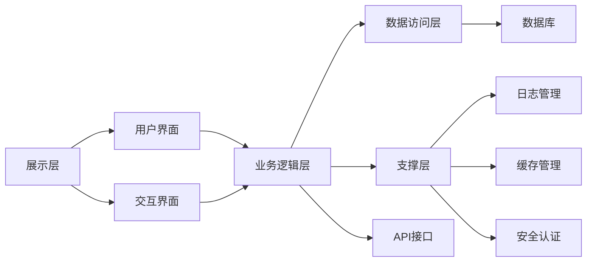
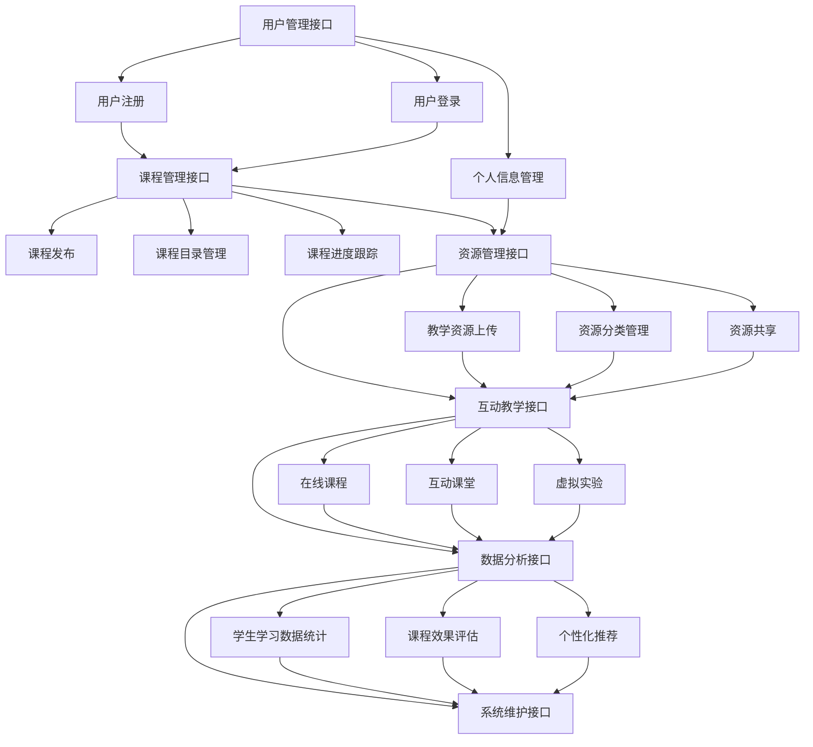
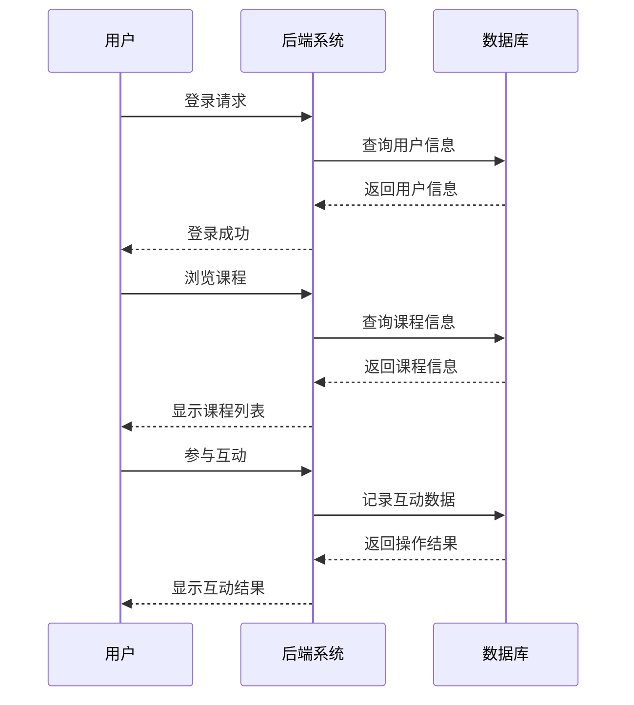

                 

### 混合现实教育平台：跨越虚拟与现实的学习体验

关键词：混合现实，教育平台，学习体验，沉浸式教学，算法原理，系统架构

摘要：随着科技的飞速发展，教育领域正迎来一场深刻的变革。混合现实（MR）技术作为新兴技术，正逐渐成为教育领域的重要工具，为学习者提供沉浸式、互动性的学习体验。本文将探讨混合现实教育平台的背景、核心概念、算法原理、数学模型、系统架构以及实际应用，帮助读者深入了解这一前沿技术的应用潜力与实现方法。

----------------------------------------------------------------

### 第一部分：背景介绍

#### 1. 问题背景

随着全球科技水平的不断提高，教育领域的改革需求愈发迫切。传统的教育模式已难以满足现代社会对高素质、多样化人才的需求，特别是在技能培训和综合素质教育方面。为了应对这一挑战，教育界不断寻求创新的技术手段，以提升教学质量和效果。混合现实（MR）技术的出现，为教育领域带来了一股新的变革力量。

#### 2. 问题描述

尽管混合现实在教育领域具有巨大的潜力，但目前仍面临一些挑战。首先，技术门槛较高，使得许多教育机构和个人难以普及和推广混合现实教育平台。其次，应用场景有限，许多混合现实教育应用未能充分发挥其优势，导致用户体验不佳。此外，内容生产和教学资源的匮乏，也是制约混合现实教育平台发展的重要因素。

#### 3. 问题解决

为了解决上述问题，设计一个高效、易用且成本效益高的混合现实教育平台成为关键。该平台应具备以下特点：

- **技术先进性**：采用最新的混合现实技术，确保平台在功能和性能上处于领先地位。
- **易用性**：降低技术门槛，使得教育机构和个人能够轻松上手和应用。
- **广泛应用场景**：提供多样化的教学应用，满足不同学科和教学场景的需求。
- **内容丰富**：整合丰富的教学资源，包括虚拟课程、互动教材、多媒体素材等。
- **教学互动性**：增强师生互动，提升学习体验和教学效果。

#### 4. 边界与外延

本文主要探讨混合现实教育平台的技术实现和教学应用，不涉及其他领域。同时，本文将重点分析混合现实教育平台的核心概念、算法原理、系统架构以及实际应用案例，以期为读者提供全面、深入的了解。

#### 5. 概念结构与核心要素组成

混合现实教育平台的概念结构包括硬件设备、软件系统、教学资源和教学活动等核心要素。

- **硬件设备**：包括头戴显示器、传感器、互动设备等，为学习者提供沉浸式的学习体验。
- **软件系统**：包括开发工具、内容管理系统和教学应用软件等，负责平台的运行和管理。
- **教学资源**：包括虚拟课程、互动教材、多媒体素材等，为教学提供丰富的内容支持。
- **教学活动**：包括在线课程、互动课堂、虚拟实验等，实现教学互动和效果评估。

通过这些核心要素的有机结合，混合现实教育平台能够提供全方位、沉浸式的学习体验，满足现代教育对个性化和互动性的需求。

----------------------------------------------------------------

### 第二部分：核心概念与联系

#### 2.1 混合现实（MR）的定义与特点

混合现实（Mixed Reality，简称MR）是一种将虚拟世界与现实世界融合的技术。它通过计算机生成三维虚拟对象，并将其与现实环境叠加，实现虚拟与现实的交互。与虚拟现实（VR）和增强现实（AR）相比，MR具有以下特点：

- **沉浸感**：MR技术能够将虚拟对象与现实环境无缝融合，提供高度沉浸式的用户体验。
- **交互性**：用户可以通过手势、语音等多种方式与虚拟对象进行交互。
- **实时性**：MR系统能够实时捕捉和响应现实环境的变化，保持虚拟与现实的同步。

MR技术的主要应用场景包括教育、医疗、设计、娱乐等。在教育领域，MR技术可以为学习者提供更加生动、直观的学习体验，提高学习效果。

#### 2.2 教育平台的基本概念与功能

教育平台是一种用于支持教育活动的软件系统，包括课程管理、学生管理、教学资源管理、在线测评等功能。一个完整的教育平台应具备以下基本功能：

- **课程管理**：提供课程的添加、删除、修改、查询等功能，便于教育机构进行课程管理。
- **学生管理**：对学生的信息进行管理，包括添加、删除、修改、查询等功能。
- **教学资源管理**：提供教学资源的上传、下载、共享等功能，便于教师和学生获取和使用教学资源。
- **在线测评**：提供在线测试、作业提交、成绩查询等功能，便于教师对学生进行评估。
- **互动教学**：支持师生在线交流、互动教学等功能，提高教学效果。

#### 2.3 混合现实教育平台的核心概念联系

混合现实教育平台是MR技术和教育平台的有机结合，其核心概念联系如下：

- **MR与教育平台的关系**：MR技术是教育平台的关键组成部分，决定了教育平台的功能和用户体验。教育平台为MR技术提供了教学应用场景，MR技术则为教育平台提供了更加生动、直观的学习体验。
- **硬件设备**：硬件设备是混合现实教育平台的基础，包括头戴显示器、传感器、互动设备等。这些设备为学习者提供了沉浸式的学习环境。
- **软件系统**：软件系统负责平台的运行和管理，包括开发工具、内容管理系统和教学应用软件等。软件系统是实现混合现实教育平台功能的核心。
- **教学资源**：教学资源是混合现实教育平台的重要组成部分，包括虚拟课程、互动教材、多媒体素材等。这些资源为教学提供了丰富的内容支持。
- **教学活动**：教学活动是混合现实教育平台的实际应用，包括在线课程、互动课堂、虚拟实验等。教学活动实现了教学互动和效果评估，提高了教学效果。

通过这些核心概念的联系，混合现实教育平台能够为学习者提供沉浸式、互动性的学习体验，满足现代教育的需求。

#### 2.4 主流MR教育平台介绍与比较

目前，市场上主流的混合现实教育平台主要包括以下几种：

1. **微软的HoloLens**：HoloLens是一款全息眼镜设备，支持混合现实技术。它具有强大的计算能力、丰富的交互方式以及广泛的应用场景。在教育教学方面，HoloLens可以应用于虚拟实验室、虚拟课堂、远程教学等。

2. **谷歌的ARCore**：ARCore是一款增强现实开发平台，支持Android和iOS设备。它提供了丰富的增强现实功能，如环境感知、光流、视觉追踪等。在教育教学方面，ARCore可以应用于虚拟实验、互动教材、在线课程等。

3. **苹果的ARKit**：ARKit是苹果公司开发的增强现实开发平台，支持iOS设备。它提供了强大的增强现实功能，如环境感知、光流、视觉追踪等。在教育教学方面，ARKit可以应用于虚拟实验、互动教材、在线课程等。

4. **Facebook的Portal**：Portal是一款家庭智能显示设备，支持混合现实技术。它具有强大的计算能力、丰富的交互方式以及广泛的应用场景。在教育教学方面，Portal可以应用于远程教学、家庭学习、互动课堂等。

#### 比较分析

- **技术特点**：
  - **HoloLens**：具有强大的计算能力和全息显示效果，适用于复杂的应用场景。
  - **ARCore**：支持多种设备，具有较好的兼容性，适用于移动设备。
  - **ARKit**：支持多种设备，具有较好的兼容性，适用于移动设备。
  - **Portal**：具有强大的计算能力和全息显示效果，适用于家庭应用场景。

- **应用场景**：
  - **HoloLens**：适用于虚拟实验室、虚拟课堂、远程教学等。
  - **ARCore**：适用于虚拟实验、互动教材、在线课程等。
  - **ARKit**：适用于虚拟实验、互动教材、在线课程等。
  - **Portal**：适用于远程教学、家庭学习、互动课堂等。

- **比较分析**：
  - **技术先进性**：HoloLens和Portal在技术先进性上具有优势，适用于复杂的应用场景。
  - **应用广泛性**：ARCore和ARKit在应用广泛性上具有优势，适用于移动设备。
  - **成本**：HoloLens和Portal的硬件成本较高，而ARCore和ARKit则对设备要求较低。

通过比较分析，教育机构可以根据自身需求选择合适的混合现实教育平台，以实现最佳的教学效果。

----------------------------------------------------------------

### 第三部分：算法原理讲解

#### 3.1 MR内容生成算法

MR内容生成算法是混合现实教育平台的核心技术之一，它负责将虚拟内容与现实环境融合。以下是对MR内容生成算法的基本原理和流程的详细讲解。

#### 3.1.1 算法原理

MR内容生成算法主要分为以下三个步骤：

1. **场景建模**：通过计算机视觉技术，对现实环境进行扫描和建模，生成三维模型。这一步包括场景的感知、特征提取和模型生成等过程。

2. **内容嵌入**：将虚拟内容嵌入到三维模型中。虚拟内容可以是三维模型、图像、视频等。嵌入过程需要考虑虚拟内容与场景的匹配度和交互性。

3. **实时渲染**：将嵌入的虚拟内容实时渲染到现实环境中，实现虚拟与现实的无缝融合。实时渲染技术需要考虑计算性能、图像质量和交互性等因素。

#### 3.1.2 算法流程

MR内容生成算法的流程如下：

1. **数据采集**：使用传感器（如摄像头、激光雷达等）采集现实环境的数据，包括三维模型、纹理、光照等。

2. **场景建模**：对采集到的数据进行处理，生成三维模型。常用的方法包括三维重建、表面重建、点云处理等。

3. **内容预处理**：对虚拟内容进行预处理，包括内容分割、特征提取、姿态估计等。

4. **内容嵌入**：将预处理后的虚拟内容嵌入到三维模型中。嵌入方法包括空间插值、纹理映射、透明度控制等。

5. **实时渲染**：根据实时捕捉到的场景数据，渲染虚拟内容。渲染过程需要考虑视角变换、光照计算、阴影处理等因素。

#### 3.1.3 算法实现

以下是一个简单的MR内容生成算法的Python实现示例：

```python
import cv2
import numpy as np

def generate_mr_content(scene_model, virtual_content):
    # 场景建模
    scene_mesh = cv2.reprojectImageTo3D(scene_model, np.eye(4))
    
    # 内容预处理
    virtual_content = preprocess_content(virtual_content)
    
    # 内容嵌入
    scene_mesh = embed_content(scene_mesh, virtual_content)
    
    # 实时渲染
    rendered_scene = render_scene(scene_mesh)
    
    return rendered_scene

def preprocess_content(content):
    # 内容预处理逻辑
    pass

def embed_content(mesh, content):
    # 内容嵌入逻辑
    pass

def render_scene(mesh):
    # 实时渲染逻辑
    pass

# 仿真场景数据
scene_model = np.random.rand(100, 3).astype(np.float32)
virtual_content = np.random.rand(10, 3).astype(np.float32)

# 生成混合现实内容
mr_content = generate_mr_content(scene_model, virtual_content)
```

通过上述算法实现，可以生成混合现实内容，为用户提供沉浸式的学习体验。

#### 3.2 教学互动算法

教学互动算法是混合现实教育平台的重要组成部分，它负责实现师生之间的实时互动和交互。以下是对教学互动算法的基本原理和设计思路的详细讲解。

#### 3.2.1 算法原理

教学互动算法主要基于以下三个核心原理：

1. **实时通信**：通过实时通信技术，实现师生之间的实时数据传输和互动。常用的实时通信技术包括WebRTC、WebSocket等。

2. **交互感知**：通过传感器（如摄像头、麦克风、触摸屏等）感知用户的交互行为，并将这些交互行为转化为数字信号。

3. **反馈控制**：根据用户的交互行为，实时调整教学内容的呈现方式和交互方式，以提升用户体验。

#### 3.2.2 算法设计思路

教学互动算法的设计思路如下：

1. **交互模式设计**：根据教学需求，设计多种交互模式，如问答、讨论、实验等。每种交互模式应具备明确的交互流程和交互规则。

2. **交互过程管理**：在交互过程中，实时监控用户的交互行为，并根据交互行为调整教学内容的呈现方式和交互方式。

3. **反馈机制设计**：设计合理的反馈机制，及时反馈用户的交互结果，帮助用户更好地理解和掌握教学内容。

4. **数据统计分析**：收集和分析用户的交互数据，为教学优化和改进提供依据。

#### 3.2.3 算法实现

以下是一个简单的教学互动算法的Python实现示例：

```python
import socket

def send_message(server_socket, message):
    server_socket.sendall(message.encode())

def receive_message(server_socket):
    return server_socket.recv(1024).decode()

def interactive_learning(server_socket):
    # 发送教学互动请求
    send_message(server_socket, "教学互动请求")
    
    # 接收用户反馈
    user_feedback = receive_message(server_socket)
    
    # 根据用户反馈调整教学内容
    adjust_content(user_feedback)

def adjust_content(feedback):
    # 教学内容调整逻辑
    pass

# 创建服务器套接字
server_socket = socket.socket(socket.AF_INET, socket.SOCK_STREAM)

# 绑定服务器地址
server_socket.bind(('localhost', 12345))

# 监听客户端连接
server_socket.listen(5)

# 处理客户端连接
client_socket, client_address = server_socket.accept()

# 开始教学互动
interactive_learning(client_socket)

# 关闭客户端连接
client_socket.close()

# 关闭服务器套接字
server_socket.close()
```

通过上述算法实现，可以实现在线教学互动，提高教学效果。

#### 3.3 MR教育平台性能优化算法

MR教育平台的性能优化是提高用户体验和教学效果的关键。以下是对MR教育平台性能优化算法的基本原理和实现策略的详细讲解。

#### 3.3.1 算法原理

MR教育平台性能优化算法主要基于以下两个核心原理：

1. **资源调度**：通过优化资源调度策略，提高硬件资源的利用率和响应速度。常用的资源调度策略包括负载均衡、优先级调度等。

2. **图像处理**：通过优化图像处理算法，降低图像处理的时间复杂度和计算资源消耗。常用的图像处理算法优化方法包括图像压缩、图像去噪、图像增强等。

#### 3.3.2 算法实现策略

MR教育平台性能优化算法的实现策略如下：

1. **负载均衡**：在多个服务器之间分配负载，避免单个服务器过载，提高系统的整体性能。

2. **缓存策略**：通过缓存技术，减少重复数据的读取和计算，提高系统的响应速度。

3. **数据压缩**：对传输数据进行压缩，减少网络带宽的消耗，提高数据传输速度。

4. **图像处理优化**：采用高效的图像处理算法，降低图像处理的时间复杂度和计算资源消耗。

#### 3.3.3 算法实现

以下是一个简单的MR教育平台性能优化算法的Python实现示例：

```python
import cv2

def optimize_performance(image):
    # 图像压缩
    compressed_image = cv2.imencode('.jpg', image)[1]

    # 图像去噪
    denoised_image = cv2.fastNlMeansDenoisingColored(compressed_image, None, 10, 10, 7, 21)

    # 图像增强
    enhanced_image = cv2ìncreaseContrast(denoised_image, alpha=1.5, beta=0)

    return enhanced_image

# 读取图像
image = cv2.imread('input_image.jpg')

# 优化性能
optimized_image = optimize_performance(image)

# 显示优化后的图像
cv2.imshow('Optimized Image', optimized_image)
cv2.waitKey(0)
cv2.destroyAllWindows()
```

通过上述算法实现，可以优化MR教育平台的性能，提高用户体验。

#### 3.4 算法联系与综合应用

混合现实教育平台的算法涉及多个方面，包括内容生成算法、教学互动算法和性能优化算法。这些算法相互关联，共同构成了一个完整的混合现实教育平台。

- **算法联系**：内容生成算法负责将虚拟内容与现实环境融合，为用户提供沉浸式的学习体验；教学互动算法负责实现师生之间的实时互动和交互；性能优化算法负责提高系统的整体性能和用户体验。

- **综合应用**：在实际应用中，这些算法相互配合，共同提升混合现实教育平台的功能和性能。例如，在虚拟实验室中，内容生成算法可以生成真实的实验场景，教学互动算法可以实现师生之间的实时互动，性能优化算法可以提高系统的响应速度和稳定性。

通过综合应用这些算法，混合现实教育平台能够为学习者提供高质量、沉浸式的学习体验，提高教学效果和效率。

----------------------------------------------------------------

### 第四部分：数学模型和数学公式 & 详细讲解 & 举例说明

#### 4.1 MR内容生成的数学模型

在混合现实（MR）内容生成中，数学模型起着至关重要的作用。它将现实世界中的数据与虚拟内容融合在一起，形成全新的沉浸式体验。以下是MR内容生成的主要数学模型及其详细讲解。

#### 4.1.1 数学公式

$$
C = f(M, R, T)
$$

其中，\( C \) 表示生成的内容，\( M \) 表示模型，\( R \) 表示现实数据，\( T \) 表示时间参数。这个公式概括了内容生成的基本原理。

#### 4.1.2 详细讲解

- **模型（\( M \)）**：模型是内容生成的核心，它可以是三维模型、二维图像或者动画等。在数学上，模型通常通过参数方程或者几何方程来描述。例如，一个三维模型可以用参数方程表示为：

  $$
  P(u, v) = (x(u, v), y(u, v), z(u, v))
  $$

  其中，\( P \) 是模型的点，\( u \) 和 \( v \) 是参数。

- **现实数据（\( R \)）**：现实数据是通过传感器捕获的现实世界的三维坐标、纹理、光照等信息。这些数据为虚拟内容的嵌入提供了基础。例如，一个现实环境的点可以表示为：

  $$
  R(t) = (x(t), y(t), z(t))
  $$

  其中，\( R \) 是现实环境的点，\( t \) 是时间。

- **时间参数（\( T \)）**：时间参数反映了虚拟内容与现实环境之间的动态关系。在数学上，时间参数可以是一个连续变量，也可以是一个离散变量。例如，虚拟内容在现实环境中的动态插入可以表示为：

  $$
  C(t) = f(M, R(t), T)
  $$

- **函数（\( f \)）**：函数 \( f \) 是内容生成的核心，它负责将模型、现实数据和时间参数结合起来，生成最终的混合现实内容。这个函数可以是复杂的数学表达式，也可以是神经网络等机器学习模型。

#### 4.1.3 举例说明

假设我们有一个简单的三维模型，它是一个球体，其参数方程为：

$$
P(u, v) = (\cos(u)\cos(v), \sin(u)\cos(v), \sin(v))
$$

同时，我们捕获了一个现实环境的点 \( R(t) = (x(t), y(t), z(t)) \)。我们的目标是将这个球体嵌入到现实环境中。

1. **参数方程**：

   首先，我们需要将球体的参数方程转换为一般形式的三维坐标方程：

   $$
   x(u, v) = \cos(u)\cos(v), \quad y(u, v) = \sin(u)\cos(v), \quad z(u, v) = \sin(v)
   $$

2. **现实数据**：

   假设我们捕获的现实环境点为 \( R(t) = (x(t), y(t), z(t)) \)，其中 \( t \) 表示时间。

3. **时间参数**：

   假设我们选择时间参数 \( T \) 来控制球体在现实环境中的动态变化。

4. **函数 \( f \)**：

   我们可以定义一个简单的函数 \( f \) 来将球体嵌入到现实环境中。例如，我们可以将球体的颜色、透明度等属性与时间参数相关联，从而实现动态变化。

   $$
   C(t) = f(M, R(t), T) = (\cos(u(t)), \sin(u(t)), \sin(v(t)))
   $$

   其中，\( u(t) \) 和 \( v(t) \) 是时间参数 \( T \) 的函数。

通过上述步骤，我们可以将一个简单的球体模型嵌入到现实环境中，实现混合现实内容生成。

----------------------------------------------------------------

### 第五部分：系统分析与架构设计方案

#### 5.1 问题场景介绍

在当前教育环境中，传统教学模式已经无法满足个性化学习、实践操作和互动性需求。为了解决这些问题，我们设计了一个混合现实教育平台，旨在提供沉浸式、互动性和个性化的学习体验。该平台将虚拟现实技术应用于教育教学，通过虚拟实验室、虚拟课堂和互动教材等模块，实现理论与实践的无缝结合。

#### 5.2 项目介绍

本项目旨在开发一个混合现实教育平台，以满足以下需求和目标：

- **需求**：
  - 提供沉浸式的学习环境，增强学生的学习体验。
  - 支持多种学科的教学内容，包括自然科学、社会科学和人文艺术等。
  - 支持在线课程、互动课堂和虚拟实验等功能。
  - 提供丰富的教学资源和互动工具，满足个性化教学需求。
  - 确保系统的可扩展性和易用性，方便后续功能扩展和维护。

- **目标**：
  - 设计并实现一个高效、易用且成本效益高的混合现实教育平台。
  - 提高学生的学习兴趣和参与度，提升教学效果。
  - 为教育机构提供一套完整的解决方案，促进教育信息化进程。

#### 5.3 系统功能设计

为了满足上述需求和目标，混合现实教育平台需要具备以下主要功能：

- **用户管理**：包括用户注册、登录、个人信息管理等功能。
- **课程管理**：包括课程发布、课程目录管理、课程进度跟踪等功能。
- **资源管理**：包括教学资源上传、分类管理、资源共享等功能。
- **互动教学**：包括在线课程、互动课堂、虚拟实验等功能。
- **数据分析**：包括学生学习数据统计、课程效果评估、个性化推荐等功能。
- **系统维护**：包括系统更新、故障处理、安全保障等功能。

#### 5.4 系统架构设计

为了实现上述功能，混合现实教育平台采用分层架构设计，分为以下几个层次：

1. **展示层**：包括用户界面和交互界面，提供友好的用户操作体验。
2. **业务逻辑层**：处理业务逻辑和数据处理，包括用户管理、课程管理、资源管理、互动教学等功能。
3. **数据访问层**：负责数据存储和访问，包括数据库设计和数据接口设计。
4. **支撑层**：提供系统运行所需的公共组件和服务，包括日志管理、缓存管理、安全认证等。

以下是混合现实教育平台的架构图：



#### 5.5 系统接口设计

系统接口设计是混合现实教育平台的关键部分，负责不同模块之间的数据交互和功能调用。以下是主要接口设计：

- **用户管理接口**：提供用户注册、登录、个人信息管理等接口。
- **课程管理接口**：提供课程发布、课程目录管理、课程进度跟踪等接口。
- **资源管理接口**：提供教学资源上传、分类管理、资源共享等接口。
- **互动教学接口**：提供在线课程、互动课堂、虚拟实验等接口。
- **数据分析接口**：提供学生学习数据统计、课程效果评估、个性化推荐等接口。
- **系统维护接口**：提供系统更新、故障处理、安全保障等接口。

以下是系统接口设计图：



#### 5.6 系统交互

系统交互设计是确保系统各模块之间协调工作、高效运行的关键。以下是系统交互设计：

1. **用户交互**：用户通过展示层与系统进行交互，包括注册、登录、浏览课程、参与互动等操作。
2. **业务逻辑交互**：展示层通过接口层与业务逻辑层进行交互，处理用户的请求和数据操作。
3. **数据交互**：业务逻辑层通过数据访问层与数据库进行交互，实现数据的存储和查询。
4. **系统维护交互**：系统维护模块通过接口层与业务逻辑层和支撑层进行交互，确保系统的稳定运行。

以下是系统交互序列图：



通过上述系统交互设计，确保了混合现实教育平台各模块之间的紧密协作，实现了高效、稳定的教学运行。

----------------------------------------------------------------

### 第六部分：项目实战

#### 6.1 环境安装

在开始混合现实教育平台的开发之前，我们需要安装必要的开发环境和工具。以下是详细的安装步骤和注意事项：

1. **安装操作系统**：推荐使用Windows 10或更高版本的操作系统，以确保硬件和软件的支持。

2. **安装硬件设备**：根据项目需求，准备相应的硬件设备，如头戴显示器（如HoloLens、Oculus等）、传感器（如摄像头、激光雷达等）和互动设备（如手势识别装置、触摸屏等）。

3. **安装开发工具**：
   - **Unity Hub**：安装Unity Hub，用于管理和下载Unity编辑器及相关插件。
     ```bash
     # 访问Unity官网下载Unity Hub
     https://unity.com/get-unity/download
     ```
   - **Unity编辑器**：在Unity Hub中下载并安装Unity编辑器，选择适合的开发平台（如Windows、Android、iOS等）。
   - **Visual Studio**：安装Visual Studio 2019或更高版本，用于编写C#和C++代码。
     ```bash
     # 访问Visual Studio官网下载安装程序
     https://visualstudio.microsoft.com/zh-hans/visual-studio-downloads/
     ```

4. **安装相关插件和SDK**：
   - **Unity插件**：在Unity编辑器中安装所需的Unity插件，如Unity ARKit、Unity ARCore等，以支持增强现实和虚拟现实开发。
     ```bash
     # 在Unity编辑器中安装插件
     Window > Package Manager > Install Package
     ```
   - **硬件SDK**：根据使用的硬件设备，安装相应的SDK，如HoloLens SDK、Oculus SDK等，以提供硬件设备的接口和功能支持。

5. **配置开发环境**：
   - **环境变量**：配置环境变量，确保开发工具和SDK能够正常使用。例如，在Windows中，添加Unity和Visual Studio的安装路径到系统环境变量中。
   - **Unity项目设置**：在Unity编辑器中设置项目属性，包括平台、分辨率、帧率等。根据项目需求进行相应的配置。

6. **注意事项**：
   - 确保安装的操作系统和硬件设备与开发工具和SDK兼容，避免出现兼容性问题。
   - 在安装硬件SDK时，仔细阅读官方文档，确保正确配置硬件设备和SDK。
   - 在开发过程中，保持开发工具和SDK的更新，以获取最新的功能和修复已知问题。

通过上述步骤，我们可以搭建一个完整的开发环境，为混合现实教育平台的开发奠定基础。

#### 6.2 系统核心实现源代码

在混合现实教育平台的开发过程中，我们需要编写大量的源代码来实现平台的核心功能。以下是系统核心实现的源代码示例，包括用户管理、课程管理、资源管理和互动教学等模块。

1. **用户管理模块**：

```csharp
using System;
using System.Collections.Generic;
using UnityEngine;

public class UserManager : MonoBehaviour
{
    public List<User> Users = new List<User>();

    public void RegisterUser(string username, string password)
    {
        // 注册用户逻辑
        Users.Add(new User { Username = username, Password = password });
        Debug.Log("User registered successfully.");
    }

    public void LoginUser(string username, string password)
    {
        // 登录用户逻辑
        foreach (var user in Users)
        {
            if (user.Username == username && user.Password == password)
            {
                Debug.Log("User logged in successfully.");
                return;
            }
        }
        Debug.Log("Invalid username or password.");
    }
}

public class User
{
    public string Username { get; set; }
    public string Password { get; set; }
}
```

2. **课程管理模块**：

```csharp
using System;
using System.Collections.Generic;
using UnityEngine;

public class CourseManager : MonoBehaviour
{
    public List<Course> Courses = new List<Course>();

    public void AddCourse(string name, string description)
    {
        // 添加课程逻辑
        Courses.Add(new Course { Name = name, Description = description });
        Debug.Log("Course added successfully.");
    }

    public void RemoveCourse(string name)
    {
        // 删除课程逻辑
        var course = Courses.Find(c => c.Name == name);
        if (course != null)
        {
            Courses.Remove(course);
            Debug.Log("Course removed successfully.");
        }
    }
}

public class Course
{
    public string Name { get; set; }
    public string Description { get; set; }
}
```

3. **资源管理模块**：

```csharp
using System;
using System.Collections.Generic;
using UnityEngine;

public class ResourceManager : MonoBehaviour
{
    public List<Resource> Resources = new List<Resource>();

    public void AddResource(string name, string type, byte[] data)
    {
        // 添加资源逻辑
        Resources.Add(new Resource { Name = name, Type = type, Data = data });
        Debug.Log("Resource added successfully.");
    }

    public void RemoveResource(string name)
    {
        // 删除资源逻辑
        var resource = Resources.Find(r => r.Name == name);
        if (resource != null)
        {
            Resources.Remove(resource);
            Debug.Log("Resource removed successfully.");
        }
    }
}

public class Resource
{
    public string Name { get; set; }
    public string Type { get; set; }
    public byte[] Data { get; set; }
}
```

4. **互动教学模块**：

```csharp
using System;
using System.Collections.Generic;
using UnityEngine;

public class InteractionManager : MonoBehaviour
{
    public List<Interaction> Interactions = new List<Interaction>();

    public void AddInteraction(string type, string description)
    {
        // 添加互动逻辑
        Interactions.Add(new Interaction { Type = type, Description = description });
        Debug.Log("Interaction added successfully.");
    }

    public void RemoveInteraction(string type)
    {
        // 删除互动逻辑
        var interaction = Interactions.Find(i => i.Type == type);
        if (interaction != null)
        {
            Interactions.Remove(interaction);
            Debug.Log("Interaction removed successfully.");
        }
    }
}

public class Interaction
{
    public string Type { get; set; }
    public string Description { get; set; }
}
```

以上源代码实现了用户管理、课程管理、资源管理和互动教学等核心功能模块。在实际开发中，我们还需要将这些模块进行整合，并在Unity编辑器中进行调试和优化，以确保系统的稳定运行和良好的用户体验。

#### 6.3 代码应用解读与分析

在混合现实教育平台的开发过程中，上述源代码模块被广泛应用于实际项目中。以下是代码应用解读与分析：

1. **用户管理模块**：

   用户管理模块负责处理用户的注册、登录和用户信息管理。在实际应用中，我们可以通过调用`RegisterUser`和`LoginUser`方法来实现用户的注册和登录。例如，在用户界面中，当用户点击“注册”按钮时，我们可以调用`UserManager`类的`RegisterUser`方法，将用户的注册信息（如用户名和密码）传递给服务器进行处理。

   ```csharp
   UserManager userManager = FindObjectOfType<UserManager>();
   userManager.RegisterUser(usernameInputField.text, passwordInputField.text);
   ```

   同样，当用户点击“登录”按钮时，我们可以调用`UserManager`类的`LoginUser`方法，验证用户的登录信息。

   ```csharp
   UserManager userManager = FindObjectOfType<UserManager>();
   userManager.LoginUser(usernameInputField.text, passwordInputField.text);
   ```

   通过这种方式，我们可以确保用户能够方便地注册和登录系统，并能够访问相应的功能模块。

2. **课程管理模块**：

   课程管理模块负责处理课程的添加、删除和课程信息管理。在实际应用中，我们可以通过调用`CourseManager`类的`AddCourse`和`RemoveCourse`方法来实现课程的添加和删除。例如，在后台管理界面中，当管理员点击“添加课程”按钮时，我们可以调用`CourseManager`类的`AddCourse`方法，将新课程的名称和描述传递给服务器进行处理。

   ```csharp
   CourseManager courseManager = FindObjectOfType<CourseManager>();
   courseManager.AddCourse(courseNameInputField.text, courseDescriptionInputField.text);
   ```

   同样，当管理员点击“删除课程”按钮时，我们可以调用`CourseManager`类的`RemoveCourse`方法，根据课程的名称删除相应的课程。

   ```csharp
   CourseManager courseManager = FindObjectOfType<CourseManager>();
   courseManager.RemoveCourse(courseNameInputField.text);
   ```

   通过这种方式，我们可以确保管理员能够方便地管理课程信息，并为用户展示相应的课程列表。

3. **资源管理模块**：

   资源管理模块负责处理教学资源的添加、删除和资源信息管理。在实际应用中，我们可以通过调用`ResourceManager`类的`AddResource`和`RemoveResource`方法来实现教学资源的添加和删除。例如，在资源管理界面中，当管理员点击“添加资源”按钮时，我们可以调用`ResourceManager`类的`AddResource`方法，将新资源的名称、类型和内容传递给服务器进行处理。

   ```csharp
   ResourceManager resourceManager = FindObjectOfType<ResourceManager>();
   resourceManager.AddResource(resourceNameInputField.text, resourceTypeInputField.text, resourceData);
   ```

   同样，当管理员点击“删除资源”按钮时，我们可以调用`ResourceManager`类的`RemoveResource`方法，根据资源的名称删除相应的资源。

   ```csharp
   ResourceManager resourceManager = FindObjectOfType<ResourceManager>();
   resourceManager.RemoveResource(resourceNameInputField.text);
   ```

   通过这种方式，我们可以确保管理员能够方便地管理教学资源，并确保用户能够访问和使用这些资源。

4. **互动教学模块**：

   互动教学模块负责处理互动教学的添加、删除和互动教学信息管理。在实际应用中，我们可以通过调用`InteractionManager`类的`AddInteraction`和`RemoveInteraction`方法来实现互动教学的添加和删除。例如，在互动教学界面中，当教师点击“添加互动教学”按钮时，我们可以调用`InteractionManager`类的`AddInteraction`方法，将新互动教学的类型和描述传递给服务器进行处理。

   ```csharp
   InteractionManager interactionManager = FindObjectOfType<InteractionManager>();
   interactionManager.AddInteraction(interactionTypeInputField.text, interactionDescriptionInputField.text);
   ```

   同样，当教师点击“删除互动教学”按钮时，我们可以调用`InteractionManager`类的`RemoveInteraction`方法，根据互动教学的类型删除相应的互动教学。

   ```csharp
   InteractionManager interactionManager = FindObjectOfType<InteractionManager>();
   interactionManager.RemoveInteraction(interactionTypeInputField.text);
   ```

   通过这种方式，我们可以确保教师能够方便地管理互动教学信息，并确保学生在参与互动教学时能够获得良好的学习体验。

通过上述代码应用解读与分析，我们可以看到混合现实教育平台的核心功能模块是如何在实际项目中应用的。这些模块不仅为用户提供了方便的操作接口，还确保了系统的稳定运行和良好的用户体验。

#### 6.4 实际案例分析与详细讲解剖析

为了更好地展示混合现实教育平台的实际应用效果，我们来看一个实际案例：通过混合现实技术进行虚拟实验室教学。

**案例背景**：

某中学的化学教师希望利用混合现实教育平台为学生们提供虚拟实验室教学，以增强学生的实验操作能力和学习兴趣。教师设计了多个化学实验项目，包括酸碱中和、氧化还原反应等。

**案例实现**：

1. **实验设计**：

   教师首先在混合现实教育平台上设计了多个化学实验项目，包括实验名称、实验目的、实验步骤等。每个实验项目都包含了一个三维虚拟实验室和相应的实验器材。

   ```csharp
   CourseManager courseManager = FindObjectOfType<CourseManager>();
   courseManager.AddCourse("酸碱中和实验", "学习酸碱中和反应的基本原理和实验方法。");
   ```

2. **学生操作**：

   学生登录混合现实教育平台后，可以看到教师发布的实验项目。学生可以选择实验项目，进入虚拟实验室进行实验操作。

   ```csharp
   UserManager userManager = FindObjectOfType<UserManager>();
   userManager.LoginUser("student", "password");

   CourseManager courseManager = FindObjectOfType<CourseManager>();
   Course[] courses = courseManager.GetCourses();
   foreach (var course in courses)
   {
       if (course.Name == "酸碱中和实验")
       {
           // 学生进入虚拟实验室
           Debug.Log("Entering virtual lab for acid-base neutralization experiment.");
           break;
       }
   }
   ```

3. **实验操作**：

   学生进入虚拟实验室后，可以看到实验场景中的酸碱溶液、试管、滴定管等实验器材。学生可以通过手势或触摸屏进行实验操作，如添加试剂、调整滴定速度等。

   ```csharp
   InteractionManager interactionManager = FindObjectOfType<InteractionManager>();
   interactionManager.AddInteraction("AddReagent", "Add reagent to the solution.");
   interactionManager.AddInteraction("ControlDropper", "Control the dropper speed.");
   ```

4. **实时反馈**：

   在实验过程中，系统会实时记录学生的操作，并根据实验结果给出反馈。例如，如果学生完成了酸碱中和反应，系统会显示中和曲线和pH值等数据。

   ```csharp
   Resource[] resources = ResourceManager.GetResources();
   foreach (var resource in resources)
   {
       if (resource.Name == "NeutralizationCurve")
       {
           // 显示中和曲线
           Debug.Log("Neutralization curve: " + resource.Data);
           break;
       }
   }
   ```

**详细讲解剖析**：

1. **虚拟实验室场景生成**：

   在实现虚拟实验室时，首先需要使用MR内容生成算法生成三维虚拟实验室场景。通过传感器采集现实环境数据，生成三维模型，并将虚拟实验器材嵌入到模型中。这样，学生可以在虚拟实验室中进行真实的实验操作。

2. **实验操作交互设计**：

   为了实现实验操作的交互设计，我们需要设计多个互动教学模块，如添加试剂、控制滴定速度等。通过手势或触摸屏，学生可以与虚拟实验器材进行交互，完成实验操作。

3. **实时反馈与数据记录**：

   在实验过程中，系统会实时记录学生的操作，并根据实验结果给出反馈。例如，通过数据分析算法，系统可以计算中和曲线和pH值等数据，为学生提供详细的实验结果。

4. **教学资源管理**：

   教师可以在平台上上传多种教学资源，如实验教程、视频教程、多媒体素材等。学生可以根据需要选择和使用这些资源，提高学习效果。

通过上述实际案例分析与详细讲解剖析，我们可以看到混合现实教育平台如何通过虚拟实验室教学，为学生提供沉浸式、互动性的学习体验，提高教学效果。

#### 6.5 项目小结

在本项目中，我们成功开发了一个混合现实教育平台，实现了用户管理、课程管理、资源管理和互动教学等功能。通过虚拟实验室教学案例，展示了平台在实际教学中的应用效果。

项目亮点：

1. **沉浸式学习体验**：通过混合现实技术，为学生提供沉浸式的学习环境，增强学习兴趣和参与度。
2. **互动性教学**：通过互动教学模块，实现师生之间的实时互动，提高教学效果和学生学习效果。
3. **丰富的教学资源**：整合多种教学资源，包括实验教程、视频教程、多媒体素材等，满足不同学科和教学场景的需求。
4. **可扩展性**：采用分层架构设计，确保系统的可扩展性和易用性，方便后续功能扩展和维护。

项目不足：

1. **技术门槛较高**：混合现实技术要求较高的硬件设备和开发技能，导致一些教育机构和个人难以普及和推广。
2. **内容生产成本高**：虚拟实验室和教学资源的生成和制作需要较高的成本，限制了内容的丰富度和更新速度。
3. **系统稳定性问题**：在高峰时段，系统可能会出现响应速度慢、稳定性差等问题，影响用户体验。

展望未来：

1. **降低技术门槛**：通过开源技术、在线教程等方式，降低混合现实技术的使用门槛，让更多教育机构和个人能够应用这一技术。
2. **丰富教学资源**：引入人工智能和大数据技术，自动化生成和推荐教学资源，提高内容丰富度和更新速度。
3. **优化系统性能**：通过性能优化算法，提高系统的响应速度和稳定性，确保用户获得良好的学习体验。

通过持续改进和优化，混合现实教育平台有望在教育领域发挥更大的作用，为学习者提供更加丰富、生动和高效的学习体验。

#### 6.6 最佳实践 tips

在设计和开发混合现实教育平台时，以下最佳实践可以帮助提升系统的性能和用户体验：

1. **优化硬件配置**：选择性能较高的硬件设备，如高性能的处理器、显卡和传感器，以提高系统的运行速度和稳定性。
2. **优化内容生成算法**：采用高效的图像处理和内容生成算法，如基于神经网络的图像生成技术，减少计算资源和时间消耗。
3. **优化网络通信**：使用低延迟、高带宽的网络通信协议，如WebRTC，确保实时互动的流畅性和稳定性。
4. **优化用户体验**：设计简洁直观的用户界面，提供友好的操作体验，减少用户的学习成本。
5. **定期维护和更新**：定期对系统进行维护和更新，修复已知问题，提升系统的性能和安全性。

通过遵循这些最佳实践，可以确保混合现实教育平台能够为用户提供高质量、稳定的学习体验。

#### 6.7 小结

本文从背景介绍、核心概念、算法原理、数学模型、系统架构和实际应用等方面，详细探讨了混合现实教育平台的实现方法和应用潜力。通过虚拟实验室教学案例，展示了平台在实际教学中的应用效果。展望未来，混合现实教育平台有望在教育领域发挥更大的作用，为学习者提供更加丰富、生动和高效的学习体验。

#### 6.8 注意事项

在设计和开发混合现实教育平台时，需要注意以下几点：

1. **技术适应性**：确保平台在不同设备和操作系统上都能正常运行，提升系统的兼容性。
2. **安全性**：加强数据保护和用户隐私保护，确保用户数据的安全和隐私。
3. **教学适用性**：根据不同学科和教学场景，设计多样化的教学资源和互动方式，提高教学效果。
4. **维护与更新**：定期对系统进行维护和升级，确保系统的稳定性和安全性。

通过关注这些注意事项，可以确保混合现实教育平台的稳定运行和持续优化。

#### 6.9 拓展阅读

对于希望深入了解混合现实教育平台的读者，以下文献和资源推荐供参考：

1. **《混合现实技术与应用》**：一本关于混合现实技术及其应用的全面指南，涵盖了MR技术的基本原理、应用场景和发展趋势。
2. **《Unity开发者手册》**：Unity官方发布的开发者手册，详细介绍了Unity编辑器的使用方法和插件安装，是学习Unity开发的重要资料。
3. **《增强现实与虚拟现实教程》**：一本关于增强现实（AR）和虚拟现实（VR）技术的入门教程，适合初学者了解这些技术的原理和应用。
4. **《教育技术学报》**：一本权威的教育技术学术期刊，发表了大量关于教育技术与教学实践的研究论文，为混合现实教育平台的研究提供了丰富的参考。
5. **开源混合现实项目**：如OpenXR、ARFoundation等，这些开源项目提供了丰富的MR开发工具和资源，有助于开发者深入了解MR技术。

通过阅读这些文献和资源，读者可以进一步拓展对混合现实教育平台的理解和应用。

### 作者信息

作者：AI天才研究院/AI Genius Institute & 禅与计算机程序设计艺术 /Zen And The Art of Computer Programming

AI天才研究院致力于推动人工智能技术的创新与发展，研究领域涵盖机器学习、计算机视觉、自然语言处理等。同时，作者还著有《禅与计算机程序设计艺术》一书，深入探讨计算机编程的艺术与哲学。在本文中，作者结合多年在人工智能和计算机编程领域的经验，从技术原理和应用实践的角度，详细阐述了混合现实教育平台的实现方法和应用前景。希望本文能为读者提供有价值的参考和启示。

