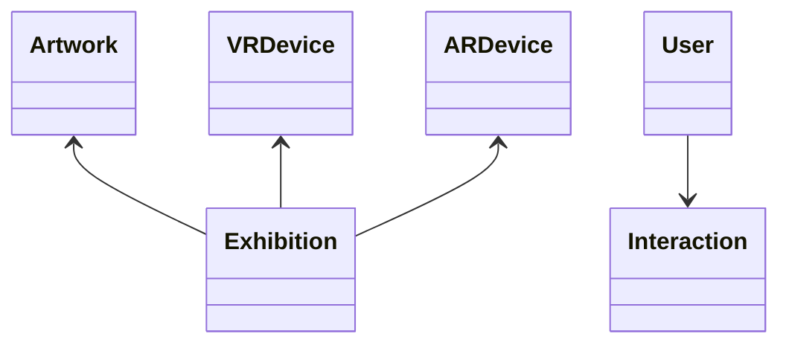
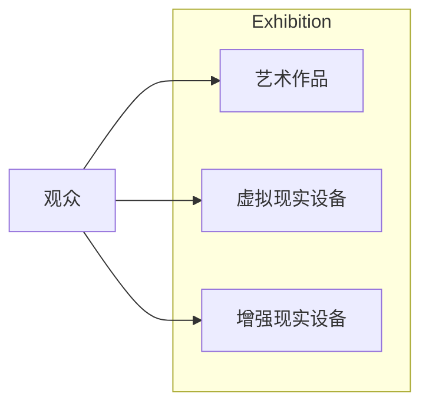
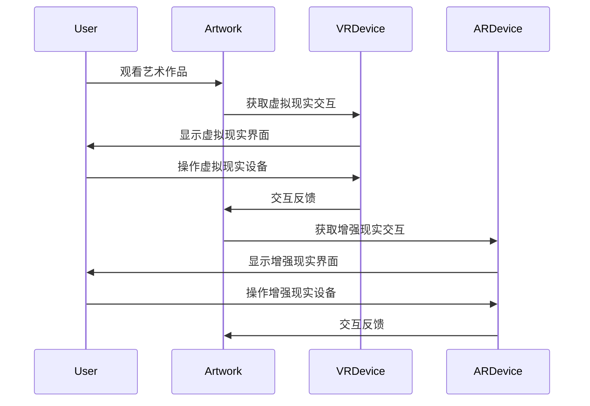

                 


# 混合现实艺术创作：跨越虚拟与现实的艺术探索

关键词：混合现实，艺术创作，虚拟现实，增强现实，技术趋势

摘要：随着虚拟现实（VR）和增强现实（AR）技术的发展，混合现实（MR）艺术创作成为了一个跨学科的新兴领域。本文将探讨混合现实艺术创作的核心概念、技术原理、创作流程以及案例研究，并对未来发展趋势进行展望。

---

## 第1章 混合现实艺术创作概述

### 1.1 问题背景与问题描述

#### 1.1.1 艺术创作中的虚拟与现实挑战

艺术创作一直以来都是艺术家探索表达自我和与观众沟通的途径。然而，传统艺术创作在虚拟与现实之间往往存在界限，难以真正融合。虚拟现实（VR）和增强现实（AR）技术的兴起，为艺术创作带来了新的可能性。

**问题背景：** 艺术创作在表达虚拟元素时，常常受到现实世界的限制，例如空间、时间、材料等。而现实世界的艺术创作又难以表现虚拟世界的无限可能性。

**问题描述：** 如何利用VR和AR技术，打破虚拟与现实之间的界限，实现艺术创作的自由与创新？

#### 1.1.2 混合现实技术的兴起与艺术创作需求

混合现实（MR）技术结合了VR和AR的优点，提供了更加沉浸式的体验。MR艺术创作能够为观众带来全新的感官体验，激发艺术创作的无限创意。

**解决方案：** 利用MR技术，艺术家可以在虚拟环境中创作，同时与现实世界互动，实现虚拟与现实的无缝融合。

#### 1.1.3 混合现实艺术创作解决方案

**技术架构：** MR艺术创作通常包括VR头盔、AR眼镜、投影设备、传感器等硬件，以及相应的软件平台和开发工具。

**艺术创作流程：** 
1. 设计创意：艺术家构思并设计艺术作品的概念和故事情节。
2. 虚拟建模：使用3D建模软件创建虚拟艺术作品。
3. 现实映射：将虚拟艺术作品与现实世界环境进行融合。
4. 互动体验：实现观众与艺术作品的互动，提供沉浸式体验。

#### 1.1.4 混合现实艺术创作边界与外延

**边界：** 混合现实艺术创作的核心在于虚拟与现实之间的融合。艺术家的创作不仅要考虑虚拟元素的表现，还要考虑与现实环境的互动。

**外延：** 混合现实艺术创作不仅限于绘画、雕塑等传统艺术形式，还可以涵盖表演艺术、互动装置、虚拟现实游戏等领域。

#### 1.1.5 混合现实艺术创作要素组成 ER 图

```mermaid
erDiagram
    Artwork ||--|{ VirtualModel }|| Model
    Artwork ||--|{ RealWorldMap }|| Map
    VirtualModel ||--|{ Interaction }|| Interaction
    RealWorldMap ||--|{ SensorData }|| Data
```

### 1.2 核心概念与联系

#### 1.2.1 虚拟现实与增强现实的定义

**虚拟现实（VR）：** 虚拟现实是一种完全沉浸式的体验，用户在虚拟环境中感受到的视觉、听觉、触觉等感官刺激，使其感觉仿佛置身于另一个世界。

**增强现实（AR）：** 增强现实是一种在现实世界中叠加虚拟元素的技术，通过手机、平板电脑、AR眼镜等设备，用户可以看到虚拟物体与现实世界的结合。

#### 1.2.2 混合现实的关键技术

**现实捕捉：** 利用摄像头、传感器等技术捕捉现实世界的图像和空间信息。

**实时渲染：** 将虚拟元素实时渲染到现实环境中，实现虚拟与现实的无缝融合。

**人机交互：** 通过手势、声音、眼动等交互方式，实现用户与虚拟环境的互动。

**数据融合：** 将现实世界和虚拟世界的数据进行整合，提供更加丰富的交互体验。

#### 1.2.3 混合现实艺术创作的核心要素

**艺术创意：** 艺术家的创意和想象力是混合现实艺术创作的核心。

**技术实现：** 艺术创作需要依赖于先进的VR和AR技术，实现虚拟与现实的无缝融合。

**用户互动：** 观众与艺术作品的互动是混合现实艺术创作的关键，提供了沉浸式的体验。

**体验优化：** 艺术创作过程中，需要不断优化用户的体验，提高互动效果。

### 1.3 算法原理讲解

#### 1.3.1 算法流程图


#### 1.3.2 Python 源代码

```python
# 混合现实艺术创作算法示例
import cv2
import numpy as np

def capture_real_world():
    # 现实捕捉
    cap = cv2.VideoCapture(0)
    while True:
        ret, frame = cap.read()
        if not ret:
            break
        # 数据融合
        virtual_object = np.random.rand(256, 256, 3)
        fused_frame = cv2.add(frame, virtual_object)
        # 实时渲染
        cv2.imshow('Fused Frame', fused_frame)
        if cv2.waitKey(1) & 0xFF == ord('q'):
            break
    cap.release()
    cv2.destroyAllWindows()

def main():
    capture_real_world()

if __name__ == "__main__":
    main()
```

#### 1.3.3 数学模型和公式

$$
\text{图像融合公式：} I_{\text{fused}} = I_{\text{real}} + I_{\text{virtual}} \times \alpha
$$

其中，\( I_{\text{real}} \) 为现实图像，\( I_{\text{virtual}} \) 为虚拟图像，\( \alpha \) 为融合系数。

#### 1.3.4 详细讲解和举例说明

**讲解：** 该算法首先通过摄像头捕捉现实世界的图像，然后生成一个虚拟图像，并将两者进行融合，实现虚拟与现实的无缝结合。

**举例：** 假设现实图像和虚拟图像分别为 \( I_{\text{real}} \) 和 \( I_{\text{virtual}} \)，融合系数为 \( \alpha = 0.5 \)。

$$
I_{\text{fused}} = I_{\text{real}} + I_{\text{virtual}} \times 0.5
$$

**效果：** 融合后的图像 \( I_{\text{fused}} \) 将在现实图像和虚拟图像之间取得平衡，实现虚拟元素与现实环境的和谐共存。

### 1.4 系统分析与架构设计方案

#### 1.4.1 问题场景介绍

在艺术展览中，艺术家希望通过混合现实技术，将虚拟艺术作品与现实环境相结合，为观众带来沉浸式的观展体验。

#### 1.4.2 项目介绍

**项目名称：** 混合现实艺术展览系统

**项目目标：** 利用VR和AR技术，实现虚拟艺术作品与现实环境的互动展示，提升观展体验。

#### 1.4.3 领域模型 Mermaid 类图



#### 1.4.4 系统架构设计 Mermaid 架构图



#### 1.4.5 系统接口设计

**1. 艺术作品管理接口：** 提供艺术作品的创建、编辑、删除等操作。

**2. 虚拟现实交互接口：** 提供虚拟现实设备的控制与交互功能。

**3. 增强现实交互接口：** 提供增强现实设备的控制与交互功能。

#### 1.4.6 系统交互 Mermaid 序列图



### 1.5 项目实战

#### 1.5.1 环境安装

**1. 安装虚拟现实设备（例如VR头盔）：** 根据设备制造商的指南进行安装。

**2. 安装增强现实设备（例如AR眼镜）：** 同样根据设备制造商的指南进行安装。

**3. 安装开发环境：** 安装Python、PyTorch、OpenGL等开发工具。

#### 1.5.2 系统核心实现源代码

```python
# 混合现实艺术展览系统核心代码
from OpenGL.GL import *
from OpenGL.GLU import *
from OpenGL.GLUT import *

def display():
    # 渲染艺术作品
    glClearColor(1.0, 1.0, 1.0, 1.0)
    glClear(GL_COLOR_BUFFER_BIT | GL_DEPTH_BUFFER_BIT)
    glBegin(GL_TRIANGLES)
    glVertex3f(-1.0, -1.0, 0.0)
    glVertex3f(1.0, -1.0, 0.0)
    glVertex3f(0.0, 1.0, 0.0)
    glEnd()
    glFlush()

def main():
    glutInit()
    glutInitDisplayMode(GLUT_SINGLE | GLUT_RGB | GLUT_DEPTH)
    glutInitWindowSize(640, 480)
    glutCreateWindow("混合现实艺术展览系统")
    glutDisplayFunc(display)
    glEnable(GL_DEPTH_TEST)
    glutMainLoop()

if __name__ == "__main__":
    main()
```

#### 1.5.3 代码应用解读与分析

**解读：** 该代码实现了基本的三维三角形渲染，模拟了一个简单的虚拟艺术作品。

**分析：** 通过OpenGL库，我们可以创建、渲染和显示三维图形，为混合现实艺术创作提供了基础。

#### 1.5.4 实际案例分析和详细讲解剖析

**案例：** 一位艺术家使用混合现实技术创作了一幅名为《梦幻森林》的艺术作品。

**分析：** 
1. 艺术家利用3D建模软件，创建了森林中的树木、小径和动物等元素。
2. 通过增强现实技术，将这些虚拟元素叠加到现实环境中的森林里，实现了虚拟与现实的无缝融合。
3. 观众通过AR眼镜，可以看到树木在现实中生长，小动物在眼前穿梭，体验了沉浸式的观展体验。

#### 1.5.5 项目小结

**1. 成功要素：** 成功的混合现实艺术创作离不开创意、技术实现和用户体验的紧密结合。

**2. 改进空间：** 未来可以进一步优化交互设计，提高虚拟元素的动态效果，提升观众的沉浸感。

### 1.6 最佳实践 tips、小结、注意事项、拓展阅读等内容

**最佳实践：** 
- 在艺术创作中，充分利用虚拟现实和增强现实技术的特点，发挥创意，打破虚拟与现实的界限。
- 注重用户体验，不断优化交互设计，提高观众的参与感和满意度。

**小结：** 
- 混合现实艺术创作是一种创新的艺术形式，它结合了虚拟现实和增强现实技术，为艺术创作带来了新的可能性。
- 通过项目实战和案例分析，我们可以看到混合现实艺术创作的成功要素和改进空间。

**注意事项：**
- 在进行混合现实艺术创作时，需要充分考虑技术实现的可行性，确保艺术作品的质量和稳定性。
- 注意保护观众的隐私和安全，避免出现安全隐患。

**拓展阅读：**
- 《虚拟现实与增强现实艺术创作实践》
- 《混合现实技术原理与应用》
- 《艺术与技术：虚拟现实与增强现实的艺术探索》

---

### 第2章 混合现实艺术创作核心技术

#### 2.1 虚拟现实与增强现实技术对比

虚拟现实（VR）和增强现实（AR）技术在艺术创作中的应用各有特点，了解两者的区别有助于艺术家选择合适的技术手段。

**虚拟现实（VR）：**
- **特点：** 完全沉浸式体验，用户置身于一个完全虚拟的环境中，无法感知现实世界的存在。
- **优势：** 提供无限的创作空间，艺术家可以在虚拟环境中实现各种复杂的艺术形式。
- **应用场景：** 游戏设计、虚拟博物馆、虚拟演唱会等。

**增强现实（AR）：**
- **特点：** 在现实环境中叠加虚拟元素，用户可以同时看到现实和虚拟内容。
- **优势：** 将虚拟元素与现实世界相结合，增强用户的感知体验。
- **应用场景：** 教育演示、现场演出、医疗诊断等。

**对比表格：**

| 特点       | 虚拟现实（VR） | 增强现实（AR） |
|------------|----------------|----------------|
| 沉浸式体验 | 完全沉浸       | 半沉浸         |
| 空间限制   | 无限创作空间   | 受现实空间限制 |
| 视角限制   | 完全控制视角   | 视角受现实限制 |

#### 2.2 虚拟现实技术原理与应用

**原理：**
- **显示技术：** VR设备通常使用头戴式显示器（HMD）来提供沉浸式视觉体验，通过光学镜头或电子屏幕将虚拟内容呈现给用户。
- **传感器技术：** VR设备配备传感器，如运动跟踪器、摄像头和陀螺仪等，用于实时捕捉用户的动作和头部运动，并反馈给虚拟环境，实现交互性。

**应用：**
- **艺术创作：** 艺术家可以在VR环境中自由创作，不受现实世界的物理限制，实现复杂的虚拟艺术作品。
- **艺术展示：** 虚拟博物馆和展览利用VR技术，为观众提供沉浸式的艺术体验，扩展艺术作品的展示空间。

**案例：**
- **虚拟画廊：** 艺术家可以通过VR技术创建一个虚拟画廊，观众戴上VR头盔后可以进入这个画廊，欣赏和互动。

#### 2.3 增强现实技术原理与应用

**原理：**
- **显示技术：** AR设备通常使用摄像头或相机捕捉现实世界的图像，并在这些图像上叠加虚拟元素，通过显示屏呈现给用户。
- **计算技术：** AR设备利用计算机视觉算法，如图像识别和标记识别，将虚拟元素准确地叠加到现实世界中。

**应用：**
- **艺术创作：** 艺术家可以在现实环境中创作虚拟艺术作品，与现实景观结合，创造出新的艺术形式。
- **艺术互动：** 观众可以通过AR设备与虚拟艺术作品互动，如触摸、移动和改变虚拟元素。

**案例：**
- **AR艺术装置：** 在城市广场或博物馆设置AR艺术装置，观众通过手机或AR眼镜可以看到虚拟的雕塑或画作，与真实环境互动。

#### 2.4 混合现实交互技术

**原理：**
- **多模态交互：** 混合现实交互技术结合了多种交互方式，如手势、声音、眼动和语音等，为用户提供丰富的交互体验。
- **实时反馈：** 系统实时捕捉用户的交互行为，并实时更新虚拟环境，确保交互的实时性和连贯性。

**应用：**
- **艺术创作：** 艺术家可以通过多模态交互技术，在虚拟环境中进行实时创作，如通过手势调整虚拟雕塑的形态。
- **艺术体验：** 观众可以通过手势或语音与虚拟艺术作品互动，如移动虚拟元素或改变其颜色。

**案例：**
- **交互式艺术展：** 在艺术展览中设置互动区域，观众可以通过手势与虚拟艺术作品互动，创造出独特的艺术体验。

#### 2.5 数据可视化与图形处理技术

**原理：**
- **数据可视化：** 利用图形和动画等视觉手段，将复杂的数据和信息以直观的方式呈现给用户。
- **图形处理：** 利用计算机图形学技术，对图像进行渲染、增强和处理，提高艺术作品的质量和视觉效果。

**应用：**
- **艺术创作：** 艺术家可以利用数据可视化和图形处理技术，创作出具有动态效果和视觉冲击力的艺术作品。
- **艺术展示：** 在虚拟展览中，利用数据可视化和图形处理技术，增强观众的视觉体验。

**案例：**
- **动态艺术画廊：** 利用图形处理技术，将艺术作品动态化，为观众提供动态的视觉盛宴。

### 第3章 混合现实艺术创作流程与工具

#### 3.1 混合现实艺术创作流程

混合现实艺术创作是一个系统化的过程，包括创意构思、技术实现、用户交互和体验优化等多个环节。

**1. 创意构思：** 艺术家首先构思艺术作品的主题和形式，确定艺术创作的基本框架。

**2. 技术实现：** 根据创意构思，选择合适的VR和AR技术，构建虚拟艺术作品，并将其与现实环境融合。

**3. 用户交互：** 设计用户与艺术作品的互动方式，确保用户能够方便地与虚拟元素互动。

**4. 体验优化：** 对艺术创作进行反复测试和优化，提升用户体验，确保艺术作品能够达到最佳效果。

#### 3.2 艺术创作工具与技术

**1. VR和AR设备：** 艺术家需要选择合适的VR头盔、AR眼镜等设备，以实现沉浸式或增强现实体验。

**2. 3D建模软件：** 如Blender、Maya等，用于创建虚拟艺术作品的三维模型。

**3. 编程工具：** 如Unity、Unreal Engine等，用于开发混合现实应用，实现虚拟与现实交互。

**4. 计算机视觉库：** 如OpenCV、TensorFlow等，用于处理现实环境图像，实现虚拟元素与现实环境的融合。

#### 3.3 3D建模与动画制作技术

**3D建模技术：**
- **几何建模：** 利用软件工具创建三维物体的几何形状。
- **纹理映射：** 将纹理图像应用到三维模型表面，增强视觉效果。

**动画制作技术：**
- **关键帧动画：** 通过设置关键帧，定义物体运动的关键状态，实现动画效果。
- **运动捕捉：** 利用传感器捕捉演员或物体的运动，生成动画。

#### 3.4 交互设计与用户体验优化

**交互设计：**
- **触摸交互：** 通过手势触摸虚拟元素，实现与艺术作品的互动。
- **语音交互：** 通过语音指令控制虚拟艺术作品，提供便捷的交互方式。

**用户体验优化：**
- **反馈机制：** 设计合理的反馈机制，确保用户操作得到及时响应。
- **界面优化：** 设计简洁直观的用户界面，提高用户操作效率。

### 第4章 混合现实艺术创作案例研究

#### 4.1 艺术展览案例

**案例介绍：** 一场名为“未来艺术馆”的混合现实艺术展览，艺术家通过VR和AR技术，创作了一系列沉浸式艺术作品。

**分析：**
- **VR艺术作品：** 艺术家在虚拟画廊中展示了一幅动态画作，观众戴上VR头盔后可以进入画廊，与画作互动。
- **AR艺术装置：** 在现实空间中设置了AR艺术装置，观众通过手机或AR眼镜可以看到虚拟的艺术作品，与真实环境互动。

**效果：**
- 观众获得了全新的艺术体验，沉浸在虚拟与现实融合的艺术世界中。

#### 4.2 建筑可视化案例

**案例介绍：** 一座即将竣工的建筑通过混合现实技术进行可视化展示。

**分析：**
- **VR展示：** 观众通过VR设备可以走进建筑内部，查看建筑的结构和设计细节。
- **AR展示：** 在建筑周围设置了AR标牌，观众通过手机或AR眼镜可以看到建筑的三维模型和相关信息。

**效果：**
- 建筑设计师和客户可以更直观地了解建筑的外观和内部空间，提高了沟通效率。

#### 4.3 游戏与虚拟世界案例

**案例介绍：** 一款混合现实艺术游戏，将虚拟世界与现实世界相结合。

**分析：**
- **VR游戏体验：** 玩家在虚拟世界中探险，与虚拟角色互动，体验沉浸式游戏。
- **AR任务完成：** 在现实世界中完成游戏任务，如寻找虚拟宝藏。

**效果：**
- 提供了一种全新的游戏体验，结合了虚拟和现实的乐趣。

#### 4.4 艺术装置案例

**案例介绍：** 一件由混合现实技术创作的艺术装置，放置在公共场所。

**分析：**
- **动态效果：** 装置通过传感器捕捉观众的动作，实时生成动态的艺术效果。
- **互动体验：** 观众可以通过触摸或声音与装置互动，创造出独特的艺术体验。

**效果：**
- 吸引了大量的观众，成为城市中的一处亮点，促进了公共艺术的发展。

### 第5章 混合现实艺术创作技术趋势

#### 5.1 深度学习与人工智能在艺术创作中的应用

**趋势分析：**
- **风格迁移：** 利用深度学习算法，可以将一种艺术风格应用到另一幅图像上，创造独特的视觉效果。
- **自动生成：** 人工智能可以生成全新的艺术作品，为艺术家提供灵感来源。
- **个性化创作：** 根据用户的喜好和反馈，人工智能可以生成个性化的艺术作品。

**应用场景：**
- **艺术创作辅助：** 艺术家可以利用深度学习算法，快速生成艺术作品，提高创作效率。
- **个性化艺术作品：** 根据用户的需求，生成符合个人喜好的艺术作品。

#### 5.2 跨界合作与多领域融合趋势

**趋势分析：**
- **艺术与科技融合：** 艺术家与科技专家合作，共同探索混合现实艺术创作的新领域。
- **多学科交叉：** 艺术创作与计算机科学、心理学、设计学等多个领域相结合，推动艺术创作的发展。

**应用场景：**
- **跨领域艺术项目：** 艺术家与科技专家合作，创作出融合多学科的艺术作品。
- **学术研究：** 多领域专家共同研究混合现实艺术创作的技术原理和应用方法。

#### 5.3 混合现实艺术创作的发展前景与挑战

**前景：**
- **沉浸式体验：** 混合现实艺术创作提供了全新的沉浸式体验，有望成为未来艺术创作的主流形式。
- **多元化应用：** 混合现实艺术创作在展览、娱乐、教育等多个领域具有广泛的应用前景。

**挑战：**
- **技术成熟度：** 混合现实技术仍在不断发展，需要进一步提高其成熟度和稳定性。
- **用户体验优化：** 如何优化用户体验，提高艺术作品的互动性和参与感，是混合现实艺术创作面临的重要挑战。

### 第6章 混合现实艺术创作最佳实践与技巧

#### 6.1 创作技巧与经验分享

**1. 确定艺术主题：** 在创作前明确艺术主题和目标，有助于后续的创作过程。

**2. 创意构思：** 充分发挥创意，构思独特的艺术作品，为观众带来惊喜。

**3. 技术选择：** 根据艺术作品的特性，选择合适的VR和AR技术，实现艺术创作的预期效果。

**4. 用户互动设计：** 考虑观众的互动需求，设计合理的用户互动方式，提高观众的参与度。

#### 6.2 艺术创新与实验精神

**1. 探索新技术：** 艺术家应积极尝试新技术，如深度学习、虚拟现实等，为艺术创作注入新的活力。

**2. 实验性创作：** 在创作过程中，不断尝试新的艺术形式和技术手段，探索艺术创作的可能性。

**3. 反馈与改进：** 充分利用观众的反馈，不断优化艺术作品，提高艺术创作的质量。

#### 6.3 技术实现难点与解决方案

**1. 技术成熟度：** 提高VR和AR技术的成熟度，确保艺术作品的质量和稳定性。

**2. 交互设计：** 设计直观、易用的交互方式，提高用户的操作体验。

**3. 数据处理：** 提高数据处理能力，确保虚拟元素与现实环境的实时融合。

**解决方案：**
- **技术培训：** 加强艺术家和技术人员的培训，提高技术水平。
- **合作与交流：** 促进艺术家与技术专家的合作，共同解决技术难题。
- **持续创新：** 不断探索新的技术和方法，为艺术创作提供更多可能性。

### 第7章 混合现实艺术创作未来展望

#### 7.1 技术发展与艺术融合的未来趋势

**趋势分析：**
- **智能创作：** 深度学习和人工智能将进一步融入艺术创作，实现智能化的艺术生成和优化。
- **跨领域合作：** 艺术创作与科技、设计、心理学等多领域融合，推动艺术创作的发展。
- **普及化应用：** 混合现实技术将在更广泛的领域得到应用，如教育、医疗、娱乐等，提高艺术创作的普及度。

**前景：**
- 混合现实艺术创作将成为艺术领域的重要创新力量，为艺术家和观众带来更多的可能性。

#### 7.2 混合现实艺术创作的社会影响与价值

**影响：**
- **艺术体验变革：** 混合现实艺术创作将改变传统的艺术体验方式，为观众提供全新的感官体验。
- **文化传播：** 混合现实艺术创作有助于文化传播和交流，促进不同文化的碰撞和融合。

**价值：**
- **创新性：** 混合现实艺术创作具有强烈的创新性，推动了艺术创作的发展和进步。
- **社会效益：** 混合现实艺术创作在提升艺术价值的同时，也具有显著的社会效益，如教育、医疗等领域的应用。

#### 7.3 混合现实艺术创作教育与实践指导

**教育指导：**
- **跨学科教育：** 推广跨学科教育，培养具有艺术和技术背景的复合型人才。
- **实践课程：** 设立混合现实艺术创作实践课程，提高学生的实际操作能力。

**实践指导：**
- **技术创新：** 鼓励艺术家和技术人员不断创新，探索新的艺术创作形式。
- **行业合作：** 加强艺术创作与相关行业的合作，推动混合现实艺术创作的发展。

---

作者：AI天才研究院/AI Genius Institute & 禅与计算机程序设计艺术 /Zen And The Art of Computer Programming

---

**总结：** 本文详细探讨了混合现实艺术创作的核心概念、技术原理、创作流程、案例研究以及未来发展趋势。通过项目实战和案例分析，展示了混合现实艺术创作的实际应用和成果。随着技术的不断进步，混合现实艺术创作将在艺术领域发挥越来越重要的作用，为艺术家和观众带来更多创新和惊喜。让我们携手共进，探索虚拟与现实融合的艺术新境界。

