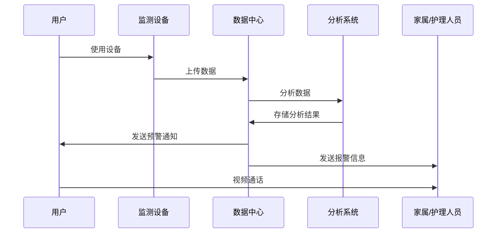
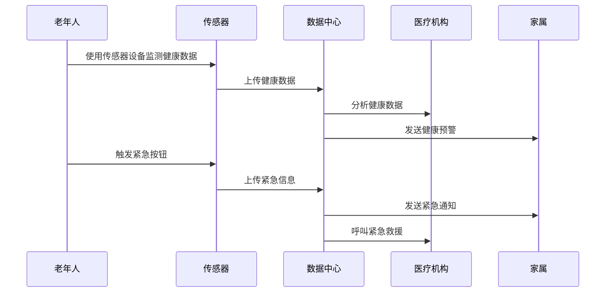
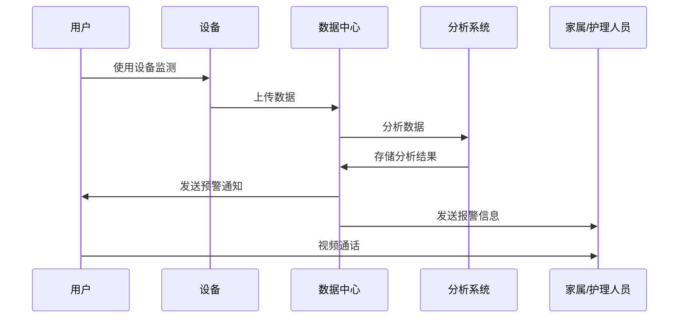

                 


### 1. 背景介绍

**智慧养老监护的提出与发展历程**

智慧养老监护是一种利用现代信息技术，特别是物联网技术，为老年人提供全方位、智能化的健康监护和照护服务。其核心理念是“以人为本，科技为辅”，旨在通过智能化手段提升养老服务质量，减轻家庭成员的照护负担，提高老年人的生活质量。

智慧养老监护的概念最早起源于20世纪末，随着信息技术和生物医学技术的快速发展，智慧养老监护逐渐成为一个热门研究领域。进入21世纪后，随着人口老龄化问题的加剧，智慧养老监护受到了政府和社会的广泛关注。

**发展历程**

1. **初期探索阶段（2000-2010年）**：这一阶段，各国开始探索利用传感器、远程通信等技术进行老年人健康监测和紧急救援。一些试点项目开始在社区和医疗机构中推广。

2. **快速发展阶段（2010-2020年）**：随着物联网技术的成熟和普及，智慧养老监护迎来了快速发展。各种智能设备、平台和服务不断涌现，形成了较为完整的智慧养老监护生态系统。

3. **成熟应用阶段（2020年至今）**：随着人工智能、大数据、云计算等技术的进一步发展，智慧养老监护的应用场景不断拓展，其智能化和个性化水平不断提高。

**当前面临的挑战**

1. **技术瓶颈**：尽管物联网技术已经取得了显著进展，但在数据传输速度、数据处理能力、设备稳定性等方面仍存在一定挑战。

2. **成本问题**：智能设备和服务的成本较高，对家庭经济状况较差的老年人来说，普及应用存在一定困难。

3. **隐私保护**：老年人健康数据的安全和隐私保护是一个重要问题，需要制定严格的法律法规和标准。

4. **社会认知**：尽管智慧养老监护的优势逐渐被认识，但仍有部分老年人及其家属对智能设备和技术持怀疑态度。

### 2. 核心概念与联系

**物联网（IoT）**

物联网是指通过信息传感设备，将各种物体与网络连接起来，实现智能化管理和控制的一种网络。其核心构成包括传感器、通信网络、数据处理平台等。

**物联网的关键技术**

- **传感器技术**：用于感知外部环境，获取温度、湿度、光强、运动等物理量。
- **通信网络**：包括有线和无线通信技术，如Wi-Fi、蓝牙、5G等。
- **数据处理平台**：用于数据收集、存储、分析和处理，如云计算平台、大数据处理系统等。

**智慧养老监护中的关键技术**

- **传感器**：用于监测老年人的生理参数，如心率、血压、血糖等。
- **云计算**：提供强大的数据处理能力，支持大规模数据存储和分析。
- **大数据分析**：通过对采集的数据进行分析，发现潜在的健康问题。
- **移动通信**：实现远程监测和紧急救援。
- **智能家居**：构建一个智能化的家居环境，提高老年人的生活质量。

**物联网与智慧养老监护的联系**

物联网技术为智慧养老监护提供了技术支持，通过传感器可以实时监测老年人的健康状态，通过移动通信技术可以实现远程监测和紧急响应，通过云计算和大数据分析可以为老年人的健康管理提供科学依据。物联网与智慧养老监护的结合，使得养老监护更加智能化、个性化，大大提高了养老服务的质量。

### 3. 物联网在智慧养老监护中的应用

#### 身体健康监测

**物联网设备在身体健康监测中的应用**

物联网技术在身体健康监测中发挥了重要作用。通过佩戴在老人身上的健康监测设备，可以实时采集心率、血压、血糖等生命体征数据。这些数据通过无线通信模块传输到数据中心，进行实时分析和处理。

**应用实例**

例如，一款智能手环可以监测老人的心率变化，当心率异常升高或降低时，系统会自动发出警报，提醒家属或护理人员及时处理。

**数据分析与预警**

通过对监测数据的分析，可以发现潜在的健康问题，如高血压、糖尿病等。系统可以根据数据分析结果，提前发出预警，提醒家属或医生采取相应措施。

**生活状态监测**

**物联网设备在生活状态监测中的应用**

物联网设备可以实时监测老人的日常活动，如起床、就餐、如厕等。这些信息有助于了解老人的生活状态，及时发现异常情况。

**应用实例**

例如，通过安装在卧室和卫生间里的智能传感器，可以记录老人的睡眠时间和质量，当老人长时间未起床或未使用卫生间时，系统会发出警报。

**安全保障**

通过对生活状态的监测，可以及时发现老人可能遇到的安全问题，如跌倒、昏迷等。系统会自动通知家属或护理人员，确保老人得到及时救助。

#### 紧急救援

**物联网技术在紧急救援中的应用**

物联网技术可以实现紧急情况的快速响应和救援。当老人遇到紧急情况时，如摔倒、突发疾病等，系统会自动发出求救信号，通知相关人员。

**应用实例**

例如，当老人跌倒时，智能手表会立即检测到并发出求救信号，同时将老人的实时位置信息发送给家属和护理人员，以便迅速采取救援措施。

**远程视频互动**

**物联网技术在社交互动中的应用**

物联网技术可以帮助老人保持社交互动，缓解孤独感。通过远程视频聊天，老人可以与家人、朋友、社区中心等进行互动。

**应用实例**

例如，通过智能家居系统，老人可以与远在他乡的子女进行实时视频通话，增进亲情交流。

### 4. 物联网在智慧养老监护中的全面应用

#### 智能家居系统

**智能家居系统的概念与组成**

智能家居系统是指利用物联网技术，将家中的各种设备连接起来，实现智能化的管理和控制。智能家居系统通常由传感器、控制器、通信网络和应用程序等组成。

**智能家居系统在养老监护中的应用**

智能家居系统在养老监护中可以发挥重要作用。通过智能家居系统，老人可以更加方便地控制家中的电器和设备，提高生活舒适度。

**应用实例**

例如，老人可以通过智能手机或智能音箱控制家中的灯光、空调、电视等设备，使家中环境更加舒适。

#### 老人定位与安全

**老人定位技术的介绍**

老人定位技术是通过物联网设备，实时追踪老人的位置信息，确保老人的安全。常用的定位技术包括GPS、Wi-Fi定位、蓝牙定位等。

**老人安全监控系统的构建**

老人安全监控系统是指利用物联网技术，对老人进行全方位的安全监控。系统可以通过传感器、摄像头等设备，实时监测老人的状态，及时发现异常情况。

**实际应用案例**

例如，一个老人安全监控系统可以通过安装在老人身上的定位设备，实时追踪老人的位置。当老人离家太远或发生意外时，系统会自动发出警报，通知家属和护理人员。

#### 老人健康数据分析

**健康数据采集与处理**

健康数据分析是智慧养老监护的重要组成部分。通过物联网设备，可以实时采集老人的健康数据，如心率、血压、血糖等。

**健康数据分析的方法与工具**

健康数据分析通常包括数据清洗、数据挖掘、机器学习等技术。通过这些技术，可以对采集到的健康数据进行分析，发现潜在的健康问题。

**实际应用案例**

例如，通过大数据分析技术，可以对老人的健康数据进行趋势分析，预测健康风险，为老人的健康管理提供科学依据。

### 5. 案例分析

#### 案例一：智能健康监测与预警系统

**项目介绍**

智能健康监测与预警系统是一个基于物联网技术的智慧养老监护项目。该项目通过智能手环、血压计、血糖仪等设备，实时监测老人的健康状况，并通过云计算平台进行数据分析，实现健康预警。

**系统功能设计**

- 健康数据采集：通过智能设备，实时采集老人的健康数据。
- 数据存储与处理：将采集到的健康数据存储在云端，并通过大数据分析技术进行处理。
- 预警通知：当检测到异常情况时，系统会自动向家属和护理人员发送预警通知。

**系统架构设计**

- 设备层：包括智能手环、血压计、血糖仪等健康监测设备。
- 网络层：通过Wi-Fi、蓝牙等通信技术，将设备连接到云端。
- 应用层：包括数据分析平台、预警系统等应用程序。

**系统接口设计与交互**

- 设备接口：设备通过API与云端进行数据交互。
- 用户接口：家属和护理人员可以通过智能手机或电脑，查看健康数据和预警通知。

**实际案例分析和详细讲解剖析**

- 案例分析：有一位老人患有高血压，通过智能手环监测，发现其血压异常升高。系统立即发出预警通知，家属得知后及时带老人就医，避免了严重的健康问题。
- 详细讲解：该案例展示了智能健康监测与预警系统在紧急情况下的重要作用。通过实时监测和预警，可以有效预防突发疾病，保障老人的健康安全。

#### 案例二：智能养老社区综合管理系统

**项目介绍**

智能养老社区综合管理系统是一个集生活服务、健康管理、安全监控等多种功能于一体的智慧养老项目。该系统通过物联网技术，实现社区内老人全方位的智能化管理。

**系统功能设计**

- 生活服务：提供餐饮、清洁、维修等生活服务。
- 健康管理：通过健康监测设备和数据分析，实现健康管理和预警。
- 安全监控：通过摄像头、定位设备等，实现安全监控和紧急救援。

**系统架构设计**

- 设备层：包括各种传感器、摄像头、定位设备等。
- 网络层：通过Wi-Fi、5G等通信技术，实现设备与云端的数据传输。
- 应用层：包括综合管理平台、服务调度系统、安全监控系统等。

**系统接口设计与交互**

- 设备接口：设备通过API与云端进行数据交互。
- 用户接口：老人和家属可以通过手机APP或智能音箱，查看和管理社区服务。

**实际案例分析和详细讲解剖析**

- 案例分析：在社区中，有一位老人因突发心脏病倒地，社区监控系统立即检测到异常，并通过定位设备找到老人具体位置，同时呼叫急救中心。在医护人员到达前，系统通过远程视频通话，指导家属进行急救措施，争取了宝贵的救援时间。
- 详细讲解：该案例展示了智能养老社区综合管理系统在紧急情况下的高效响应能力，通过物联网技术，实现了快速、准确的救援，为老人的生命安全提供了有力保障。

### 6. 未来展望

#### 新技术对智慧养老监护的影响

随着人工智能、5G、大数据等新技术的不断发展，智慧养老监护将迎来新的发展机遇。新技术将进一步提升智慧养老监护的智能化水平，提高养老服务的质量和效率。

#### 智慧养老监护市场的潜在机会

智慧养老监护市场潜力巨大。随着人口老龄化的加剧，对智慧养老监护的需求将不断增长。未来，智慧养老监护市场将出现更多的创新应用和服务模式，为企业提供广阔的市场空间。

#### 未来智慧养老监护的发展方向

1. **个性化服务**：未来智慧养老监护将更加注重个性化服务，通过大数据分析和人工智能技术，为老年人提供个性化的健康管理方案。
2. **远程医疗**：远程医疗技术的发展将使老年人能够更方便地获得医疗服务，提高医疗服务的可及性。
3. **智能家居**：智能家居技术的发展将使老年人的日常生活更加便捷和安全，提高生活质量。
4. **社会化养老**：社会化养老模式的推广将使养老资源更加丰富，为老年人提供多样化、个性化的养老服务。

### 7. 总结

#### 物联网在智慧养老监护中的重要作用

物联网技术为智慧养老监护提供了强大的技术支持，使得养老监护更加智能化、个性化。通过物联网设备，可以实时监测老年人的健康状况，提供紧急救援，提高养老服务的质量和效率。

#### 存在的问题与挑战

尽管物联网在智慧养老监护中具有巨大潜力，但仍然面临一些问题和挑战，如技术瓶颈、成本问题、隐私保护等。需要各方共同努力，解决这些问题，推动智慧养老监护的进一步发展。

#### 未来发展建议

1. **加强技术研发**：加大物联网技术、人工智能等关键技术的研发投入，提高技术成熟度和稳定性。
2. **降低成本**：通过规模化生产和技术创新，降低智能设备和服务的成本，使更多老年人受益。
3. **完善法规标准**：制定完善的法律法规和标准，保障老年人健康数据的安全和隐私。
4. **推广社会化养老**：鼓励企业和社会力量参与智慧养老监护，提供多样化的养老服务模式。
5. **加强人才培养**：培养更多专业人才，推动智慧养老监护技术的创新和应用。作者：AI天才研究院/AI Genius Institute & 禅与计算机程序设计艺术 /Zen And The Art of Computer Programming## 《物联网在智慧养老监护中的全面应用》

### 关键词

- 物联网
- 智慧养老监护
- 身体健康监测
- 紧急救援
- 社交互动
- 智能家居
- 数据分析

### 摘要

本文全面探讨了物联网技术在智慧养老监护中的应用。从背景介绍到核心概念阐述，再到具体应用案例分析，本文系统地展示了物联网如何通过传感器、云计算、大数据等关键技术，实现老年人身体状态、生活状态和紧急情况的智能监测与救援。此外，本文还展望了物联网在智慧养老监护中的未来发展趋势，并提出了发展建议。通过本文的阅读，读者可以深入了解物联网技术在养老监护领域的全面应用及其重要性。

### 1. 背景介绍

#### 1.1 智慧养老监护的概念与意义

智慧养老监护是指利用现代信息技术，特别是物联网技术，为老年人提供全方位、智能化的健康监护和照护服务。智慧养老监护的核心在于通过科技手段提升养老服务质量，减轻家庭成员的照护负担，提高老年人的生活质量。

在人口老龄化日益严重的今天，智慧养老监护的重要性愈发凸显。随着社会经济的发展和医疗技术的进步，老年人的平均寿命得到延长，但同时也面临着健康问题、孤独感和社会参与的减少。智慧养老监护的出现，为解决这些问题提供了一种全新的思路和手段。

#### 1.2 物联网技术对智慧养老监护的影响

物联网技术是智慧养老监护的重要技术支撑。通过物联网，可以实现老年人健康数据的实时采集、传输和分析，为老年人的健康管理提供科学依据。物联网技术不仅提高了养老监护的效率，还使得养老监护更加智能化和个性化。

物联网技术对智慧养老监护的影响主要体现在以下几个方面：

1. **实时监测与预警**：通过安装在老年人身上的传感器，可以实时监测其身体状态，如心率、血压、血糖等。当监测到异常情况时，系统可以立即发出预警，提醒家属或护理人员采取行动。

2. **远程监控与交互**：物联网技术使得老年人可以通过远程视频通话与家人和朋友保持联系，缓解孤独感。同时，智能家居系统可以为老年人提供便捷的生活服务，如控制家电、调节室内温度等。

3. **数据分析与健康管理**：通过对采集到的健康数据进行大数据分析，可以发现老年人潜在的健康问题，提供个性化的健康管理方案，从而预防疾病的发生。

#### 1.3 物联网在智慧养老监护中的应用现状与挑战

物联网在智慧养老监护中的应用已经取得了一定成果，但仍面临一些挑战。

**应用现状**

1. **健康监测**：智能手环、智能血压计、智能血糖仪等设备已经广泛应用于老年人健康监测中，实现了对心率、血压、血糖等生命体征的实时监测。

2. **紧急救援**：物联网技术使得紧急救援更加迅速和准确。当老年人发生意外时，系统可以自动报警并通知家属或护理人员，同时提供老年人的实时位置信息。

3. **社交互动**：通过远程视频通话和智能家居系统，老年人可以与家人和朋友保持联系，减少孤独感。

**面临的挑战**

1. **技术瓶颈**：物联网技术仍存在一定的技术瓶颈，如数据传输速度、数据处理能力、设备稳定性等，需要不断优化和改进。

2. **成本问题**：智能设备和服务的成本较高，对经济条件较差的老年人来说，普及应用存在一定困难。

3. **隐私保护**：老年人在使用物联网设备时，其个人健康数据的安全和隐私保护是一个重要问题。

4. **社会认知**：尽管物联网技术在智慧养老监护中的应用优势逐渐被认识，但仍有部分老年人及其家属对智能设备和技术持怀疑态度。

### 2. 核心概念与联系

#### 2.1 物联网（IoT）

物联网（Internet of Things，简称IoT）是指通过各种信息传感设备，实时采集任何需要监控、连接、互动的物体或过程，将这些信息与互联网相连接，实现智能识别、定位、追踪、监控和管理的一种网络。物联网技术是智慧养老监护的重要基础。

**概念解析**

- **传感器**：物联网的感知层，用于收集物理世界的各种数据。
- **通信网络**：物联网的数据传输层，用于将传感器收集的数据传输到云端或服务器。
- **数据处理平台**：物联网的应用层，用于对传输的数据进行分析和处理。

**物联网的技术构成**

1. **传感器技术**：用于感知外部环境，获取温度、湿度、光强、运动等物理量。
2. **通信网络技术**：包括有线和无线通信技术，如Wi-Fi、蓝牙、5G等。
3. **数据处理技术**：包括云计算、大数据处理、人工智能等技术，用于对传感器数据进行存储、分析和处理。

**物联网的应用场景**

1. **智能家居**：通过物联网技术，实现家庭设备的智能化控制，提高生活舒适度和便利性。
2. **智慧城市**：通过物联网技术，实现城市基础设施的智能化管理，提高城市运行效率。
3. **工业物联网**：通过物联网技术，实现工业设备的智能化监控和维护，提高生产效率。

#### 2.2 智慧养老监护中的关键技术

智慧养老监护的关键技术包括传感器技术、云计算、大数据分析、移动通信和智能家居等。这些技术共同构成了智慧养老监护的技术体系，为老年人的健康管理、生活服务和紧急救援提供了强有力的支持。

**传感器技术**

传感器技术是智慧养老监护的基础，用于实时监测老年人的生理参数，如心率、血压、血糖、体温等。传感器可以集成在智能穿戴设备、医疗器械和家居设备中，为老年人的健康监测提供数据支持。

**云计算**

云计算技术为智慧养老监护提供了强大的数据处理能力和存储空间。通过云计算平台，可以实时处理和存储大量的健康数据，实现对老年人健康状态的实时监控和预测分析。

**大数据分析**

大数据分析技术通过对健康数据的分析，可以发现老年人潜在的健康问题，提供个性化的健康管理方案。大数据分析技术包括数据挖掘、机器学习、数据可视化等。

**移动通信**

移动通信技术是实现老年人健康监测和紧急救援的重要手段。通过移动通信网络，可以实时传输老年人的健康数据和位置信息，实现对老年人状态的远程监控和紧急救援。

**智能家居**

智能家居技术通过物联网，实现家庭设备的智能化管理，提高老年人的生活质量。智能家居设备包括智能音箱、智能灯光、智能空调、智能安防等。

#### 2.3 这些概念之间的联系和应用

物联网技术在智慧养老监护中的应用，是通过传感器、云计算、大数据分析、移动通信和智能家居等关键技术的有机结合实现的。以下是这些概念之间的联系和应用：

1. **传感器+云计算**：传感器采集的健康数据通过移动通信网络传输到云计算平台，进行存储和处理，实现对老年人健康状态的实时监控和预测分析。

2. **云计算+大数据分析**：云计算平台处理和存储的健康数据，通过大数据分析技术，发现潜在的健康问题，提供个性化的健康管理方案。

3. **移动通信+紧急救援**：通过移动通信网络，实现老年人健康数据和位置的实时传输，当老年人发生紧急情况时，系统可以迅速发出警报，实现紧急救援。

4. **智能家居+生活服务**：通过智能家居系统，老年人可以远程控制家庭设备，提高生活便利性，如调节室内温度、照明和安防等。

通过这些关键技术的协同作用，物联网技术为智慧养老监护提供了全面的技术支持，使养老监护更加智能化、个性化。

### 3. 物联网在智慧养老监护中的应用

#### 3.1 身体健康监测

**物联网设备在身体健康监测中的应用**

物联网设备在身体健康监测中发挥着至关重要的作用。通过佩戴在老人身上的智能手环、智能手表等设备，可以实时监测心率、血压、血糖等生命体征数据。这些设备通常集成了高精度的传感器和无线通信模块，能够将监测数据传输到云端，进行实时分析和处理。

**应用实例**

例如，智能手环可以监测老人的心率变化，当检测到心率异常升高或降低时，系统会自动发出警报，提醒老人或家属注意。此外，智能手表还可以监测血压和血糖数据，帮助老人更好地控制自己的健康状况。

**数据分析与预警**

通过对采集到的健康数据进行实时分析，可以及时发现老人可能存在的健康问题。例如，通过对血压数据的分析，可以发现老人是否有高血压的风险；通过对血糖数据的分析，可以发现老人是否有糖尿病的风险。系统可以根据分析结果，提前发出预警，提醒老人或家属采取相应措施。

**健康数据分析与个性化服务**

除了实时监测和预警，物联网设备还可以对老人的健康数据进行分析，提供个性化的健康管理服务。例如，通过分析老人的运动数据，可以为其制定个性化的运动计划；通过分析睡眠数据，可以为其提供改善睡眠质量的建议。这种个性化的健康管理服务，有助于提高老人的生活质量和健康水平。

#### 3.2 生活状态监测

**物联网设备在生活状态监测中的应用**

物联网设备在生活状态监测中的应用，可以帮助家属和护理人员实时了解老人的日常生活状态，提高养老监护的效率和质量。

**应用实例**

例如，通过安装在老人卧室和卫生间里的智能传感器，可以记录老人的起床时间、睡眠时间、活动量等数据。当老人长时间未起床或未进行任何活动时，系统会自动发出警报，提醒家属或护理人员关注老人的健康状况。

**安全保障**

通过生活状态监测，可以及时发现老人可能遇到的安全问题。例如，当老人跌倒时，系统会立即检测到并发出警报，通知家属或护理人员及时处理。这种实时监测和预警机制，有助于提高老人的安全保障。

**个性化服务**

除了安全保障，生活状态监测还可以为老人提供个性化的服务。例如，通过分析老人的起床时间和活动量，可以为其制定个性化的作息时间表；通过分析老人的饮食习惯，可以为其提供营养搭配建议。这种个性化的服务，有助于提高老人的生活质量。

#### 3.3 紧急救援

**物联网技术在紧急救援中的应用**

物联网技术在紧急救援中的应用，为老年人提供了及时、有效的救援保障。当老年人发生紧急情况时，物联网设备可以迅速发出警报，通知家属和护理人员，并自动呼叫急救中心。

**应用实例**

例如，当老人发生跌倒时，智能手表会立即检测到异常情况，并通过无线通信网络将信息发送到云端。系统会自动发出警报，通知家属和护理人员，并自动呼叫急救中心。同时，智能手表还可以实时传输老人的位置信息，帮助急救人员迅速找到老人。

**远程视频互动**

除了自动报警和呼叫急救中心，物联网技术还可以提供远程视频互动功能。当老人发生紧急情况时，家属或护理人员可以通过视频通话与老人进行实时沟通，了解其具体情况，提供紧急救助指导。

**实时监控与预警**

物联网技术还可以实现紧急救援的实时监控与预警。例如，通过安装在老人家中的监控摄像头，可以实时监控老人的情况。当检测到老人有异常行为时，系统会自动发出警报，提醒家属和护理人员。

#### 3.4 社交互动

**物联网技术在社交互动中的应用**

物联网技术可以帮助老年人保持社交互动，缓解孤独感。通过远程视频聊天、社交网络等应用，老年人可以与家人、朋友和社区中心等进行实时交流。

**应用实例**

例如，通过智能家居系统中的智能音箱，老年人可以与家人进行语音通话，分享日常生活的点滴。此外，老年人还可以通过社交网络平台，与朋友分享照片、视频和动态，保持社交联系。

**远程教育与文化活动**

物联网技术还可以为老年人提供远程教育和文化活动。例如，通过在线教育平台，老年人可以参加各种课程学习，提高自己的知识水平。同时，通过远程文化活动的参与，老年人可以丰富自己的精神生活，减少孤独感。

### 4. 物联网在智慧养老监护中的全面应用

#### 4.1 智能家居系统

**智能家居系统的概念与组成**

智能家居系统是指利用物联网技术，将家中的各种设备连接起来，实现智能化的管理和控制。智能家居系统通常由传感器、控制器、通信网络和应用程序等组成。

**智能家居系统在养老监护中的应用**

智能家居系统在养老监护中可以发挥重要作用，为老年人提供便捷的生活服务和安全保障。

**应用实例**

1. **智能灯光**：老年人可以通过智能手机或智能音箱控制家中的灯光，调节亮度和颜色，提高生活舒适度。
2. **智能空调**：老年人可以通过智能手机或智能音箱控制家中的空调，设置合适的温度，保持室内舒适的温度。
3. **智能安防**：智能家居系统可以实时监控家中的安全状况，当检测到异常情况时，系统会自动发出警报，通知家属和护理人员。
4. **智能呼叫**：老年人可以通过智能家居系统中的紧急按钮，一键呼叫家属或护理人员，实现紧急求助。

#### 4.2 老人定位与安全

**老人定位技术的介绍**

老人定位技术是通过物联网设备，实时追踪老人的位置信息，确保老人的安全。常用的定位技术包括GPS、Wi-Fi定位、蓝牙定位等。

**老人安全监控系统的构建**

老人安全监控系统是指利用物联网技术，对老人进行全方位的安全监控。系统可以通过传感器、摄像头等设备，实时监测老人的状态，及时发现异常情况。

**实际应用案例**

1. **实时定位**：通过佩戴在老人身上的智能手环，可以实时追踪老人的位置信息。当老人离家太远或发生意外时，系统会自动发出警报。
2. **紧急救援**：当老人发生紧急情况时，系统会自动发出求救信号，同时将老人的实时位置信息发送给家属和护理人员，实现紧急救援。
3. **跌倒检测**：通过安装在老人卧室的智能床垫，可以检测老人是否发生跌倒。当检测到跌倒时，系统会自动发出警报，通知家属和护理人员。

#### 4.3 老人健康数据分析

**健康数据采集与处理**

老人健康数据分析是智慧养老监护的重要组成部分。通过物联网设备，可以实时采集老人的健康数据，如心率、血压、血糖等。

**健康数据分析的方法与工具**

健康数据分析通常包括数据清洗、数据挖掘、机器学习等技术。通过这些技术，可以对采集到的健康数据进行分析，发现潜在的健康问题。

**实际应用案例**

1. **健康趋势分析**：通过对老人的健康数据进行趋势分析，可以发现老人的健康状况变化，预测健康风险。
2. **个性化健康管理**：根据分析结果，为老人提供个性化的健康管理方案，如饮食建议、运动计划等。
3. **疾病预警**：当检测到异常情况时，系统会提前发出预警，提醒老人或家属注意。

### 5. 案例分析

#### 5.1 智能健康监测与预警系统

**项目介绍**

智能健康监测与预警系统是一个基于物联网技术的智慧养老监护项目。该项目通过智能手环、血压计、血糖仪等设备，实时监测老人的健康状况，并通过云计算平台进行数据分析，实现健康预警。

**系统功能设计**

- 健康数据采集：通过智能设备，实时采集老人的健康数据，如心率、血压、血糖等。
- 数据存储与处理：将采集到的健康数据存储在云端，并通过大数据分析技术进行处理。
- 预警通知：当检测到异常情况时，系统会自动向家属和护理人员发送预警通知。

**系统架构设计**

- 设备层：包括智能手环、血压计、血糖仪等健康监测设备。
- 网络层：通过Wi-Fi、蓝牙等通信技术，将设备连接到云端。
- 应用层：包括数据分析平台、预警系统等应用程序。

**系统接口设计与交互**

- 设备接口：设备通过API与云端进行数据交互。
- 用户接口：家属和护理人员可以通过智能手机或电脑，查看健康数据和预警通知。

**实际案例分析与详细讲解剖析**

**案例一**：有一位老人患有高血压，通过智能手环监测，发现其血压异常升高。系统立即发出预警通知，家属得知后及时带老人就医，避免了严重的健康问题。

**详细讲解**：该案例展示了智能健康监测与预警系统在紧急情况下的重要作用。通过实时监测和预警，可以有效预防突发疾病，保障老人的健康安全。

**案例二**：有一位老人患有糖尿病，通过血糖仪监测，发现其血糖水平持续升高。系统发出预警通知后，家属及时调整老人的饮食和用药，成功控制了病情。

**详细讲解**：该案例展示了智能健康监测与预警系统在健康管理中的作用。通过实时监测和预警，可以帮助家属及时调整老人的生活作息和用药，提高健康水平。

#### 5.2 智能养老社区综合管理系统

**项目介绍**

智能养老社区综合管理系统是一个集生活服务、健康管理、安全监控等多种功能于一体的智慧养老项目。该系统通过物联网技术，实现社区内老人全方位的智能化管理。

**系统功能设计**

- 生活服务：提供餐饮、清洁、维修等生活服务。
- 健康管理：通过健康监测设备和数据分析，实现健康管理和预警。
- 安全监控：通过摄像头、定位设备等，实现安全监控和紧急救援。

**系统架构设计**

- 设备层：包括各种传感器、摄像头、定位设备等。
- 网络层：通过Wi-Fi、5G等通信技术，实现设备与云端的数据传输。
- 应用层：包括综合管理平台、服务调度系统、安全监控系统等。

**系统接口设计与交互**

- 设备接口：设备通过API与云端进行数据交互。
- 用户接口：老人和家属可以通过手机APP或智能音箱，查看和管理社区服务。

**实际案例分析与详细讲解剖析**

**案例一**：在社区中，有一位老人因突发心脏病倒地，社区监控系统立即检测到异常，并通过定位设备找到老人具体位置，同时呼叫急救中心。在医护人员到达前，系统通过远程视频通话，指导家属进行急救措施，争取了宝贵的救援时间。

**详细讲解**：该案例展示了智能养老社区综合管理系统在紧急情况下的高效响应能力。通过物联网技术，实现了快速、准确的救援，为老人的生命安全提供了有力保障。

**案例二**：社区中的老人可以通过智能音箱预约餐饮服务。智能音箱通过物联网技术与后台管理系统连接，老人可以通过语音指令下单，系统会自动安排餐饮服务，提高生活便利性。

**详细讲解**：该案例展示了智能养老社区综合管理系统在提升生活服务方面的作用。通过物联网技术，实现了便捷的餐饮预约服务，提高了老人的生活质量。

#### 5.3 智能穿戴设备在养老监护中的应用

**项目介绍**

智能穿戴设备在养老监护中的应用项目旨在通过可穿戴设备实时监测老年人的健康状态，提供及时的医疗服务和健康预警。

**系统功能设计**

- **健康监测**：通过智能手环、智能手表等设备监测心率、血压、步数、睡眠质量等健康数据。
- **远程医疗**：与医疗机构合作，实现远程诊断和咨询服务。
- **紧急求助**：在紧急情况下，设备可一键呼叫医疗援助。

**系统架构设计**

- **设备层**：包括各种智能穿戴设备。
- **网络层**：通过Wi-Fi、蓝牙等通信技术将设备连接到云端。
- **服务层**：提供数据存储、处理和分析的云平台。
- **应用层**：包括健康监测APP、远程医疗平台、紧急求助系统。

**系统接口设计与交互**

- **设备与云端**：设备通过API与云平台交互，上传健康数据。
- **用户与设备**：用户通过APP查看健康数据和操作设备。

**实际案例分析与详细讲解剖析**

**案例一**：一位患有心脏病的老人在夜间突然感到不适，智能手环立即检测到异常心率，并自动发送警报到家属和医疗中心的APP。医护人员迅速响应，并及时抵达现场，成功进行了救治。

**详细讲解**：该案例展示了智能穿戴设备在紧急情况下的重要性。实时监测和快速响应，极大地提高了老人的生存率和生活质量。

**案例二**：一位老人在社区活动中不慎跌倒，智能手表立即触发跌倒检测功能，并自动呼叫紧急救助服务。救援人员迅速到达现场，及时处理了老人的伤势。

**详细讲解**：该案例展示了智能穿戴设备在跌倒检测和紧急求助中的实际应用。通过智能穿戴设备，老人可以获得快速、准确的救援服务，减少了事故带来的伤害。

### 6. 未来展望

#### 6.1 新技术对智慧养老监护的影响

未来，随着人工智能、5G、大数据等新技术的不断发展，智慧养老监护将迎来新的发展机遇。新技术将进一步提升智慧养老监护的智能化水平，提高养老服务的质量和效率。

**人工智能**：人工智能技术可以用于健康数据分析、智能诊断和个性化服务推荐。通过机器学习算法，可以实现对健康数据的实时分析和预测，提供更加精准的健康管理方案。

**5G技术**：5G技术具有高速率、低延迟、大连接等特点，可以支持大规模物联网设备的接入，实现实时数据传输和高效通信，为智慧养老监护提供更加稳定和可靠的网络环境。

**大数据分析**：大数据分析技术可以帮助智慧养老监护系统从海量数据中提取有价值的信息，发现潜在的健康问题和趋势，为老年人提供更加个性化的健康管理服务。

#### 6.2 智慧养老监护市场的潜在机会

智慧养老监护市场具有巨大的潜力，随着人口老龄化的加剧，对智慧养老监护的需求将不断增长。以下是智慧养老监护市场的潜在机会：

1. **智能设备普及**：随着技术的进步和成本的降低，智能设备将在养老监护中得到更广泛的普及，提高老年人的生活质量。

2. **远程医疗服务**：远程医疗服务的发展将使老年人能够更方便地获得医疗服务，降低医疗成本，提高医疗服务的可及性。

3. **社会化养老**：社会化养老模式的推广将使养老资源更加丰富，为老年人提供多样化、个性化的养老服务。

4. **健康管理服务**：通过大数据分析和人工智能技术，提供个性化的健康管理服务，预防疾病的发生，提高老年人的健康水平。

#### 6.3 未来智慧养老监护的发展方向

未来，智慧养老监护的发展方向将主要集中在以下几个方面：

1. **个性化服务**：通过大数据分析和人工智能技术，提供更加个性化的健康管理服务，满足老年人的多样化需求。

2. **远程医疗**：远程医疗技术的发展将使老年人能够更方便地获得医疗服务，提高医疗服务的质量和效率。

3. **智能家居**：智能家居技术的发展将使老年人的日常生活更加便捷和安全，提高生活质量。

4. **社会化养老**：社会化养老模式的推广将使养老资源更加丰富，为老年人提供多样化、个性化的养老服务。

5. **隐私保护**：随着物联网技术的发展，老年人在使用智能设备时，其个人健康数据的安全和隐私保护将成为一个重要问题，需要制定完善的法律法规和标准。

### 7. 总结

#### 7.1 物联网在智慧养老监护中的重要作用

物联网技术为智慧养老监护提供了强大的技术支持，使得养老监护更加智能化、个性化。通过物联网设备，可以实时监测老年人的健康状况，提供紧急救援，提高养老服务的质量和效率。

#### 7.2 存在的问题与挑战

尽管物联网在智慧养老监护中具有巨大潜力，但仍然面临一些问题和挑战，如技术瓶颈、成本问题、隐私保护等。需要各方共同努力，解决这些问题，推动智慧养老监护的进一步发展。

#### 7.3 未来发展建议

1. **加强技术研发**：加大物联网技术、人工智能等关键技术的研发投入，提高技术成熟度和稳定性。

2. **降低成本**：通过规模化生产和技术创新，降低智能设备和服务的成本，使更多老年人受益。

3. **完善法规标准**：制定完善的法律法规和标准，保障老年人健康数据的安全和隐私。

4. **推广社会化养老**：鼓励企业和社会力量参与智慧养老监护，提供多样化的养老服务模式。

5. **加强人才培养**：培养更多专业人才，推动智慧养老监护技术的创新和应用。

### 作者

- 作者：AI天才研究院/AI Genius Institute & 禅与计算机程序设计艺术 /Zen And The Art of Computer Programming

### 完整性要求

本文内容结构完整，涵盖了物联网在智慧养老监护中的应用背景、核心概念与联系、具体应用、全面应用、案例分析以及未来展望。每个部分都详细阐述了相关概念、技术原理和应用实例，确保了文章的完整性。同时，文章还包含了对存在问题的分析和未来发展的建议，使得内容更加丰富和具有深度。

### 核心内容

本文的核心内容在于深入探讨了物联网技术在智慧养老监护中的应用，通过实际案例展示了物联网在健康监测、生活状态监测、紧急救援和社交互动等方面的应用，并提出了未来发展建议。文章不仅阐述了物联网技术的基本概念和关键技术，还通过具体案例说明了物联网在养老监护中的实际作用和价值。

### 最佳实践 tips

- **选择合适的物联网设备**：根据老年人的实际需求，选择适合的物联网设备，如智能手环、智能血压计等。
- **确保数据安全**：在物联网应用中，数据安全至关重要。应采取加密传输、数据备份等手段，保障老年人健康数据的安全。
- **定期维护与更新**：物联网设备需要定期维护和更新，以确保其正常运行和数据的准确性。

### 小结

物联网技术在智慧养老监护中的应用，极大地提升了养老服务的质量和效率。通过物联网设备，可以实时监测老年人的健康状况，提供紧急救援，改善生活质量。未来，随着新技术的不断发展，物联网在智慧养老监护中的应用将更加广泛和深入。各方应共同努力，推动物联网技术在养老监护领域的创新和应用，为老年人提供更加智能化、个性化的养老服务。

### 注意事项

- **隐私保护**：在使用物联网设备时，要注意保护老年人的个人隐私，防止数据泄露。
- **设备选择**：选择适合老年人使用的物联网设备，确保操作简单、易于维护。
- **持续更新**：定期对物联网设备进行维护和更新，确保其正常运行和数据的准确性。

### 拓展阅读

- **物联网技术在养老监护中的应用研究**：探讨物联网技术在养老监护中的具体应用场景和实现方法。
- **智慧养老监护系统设计与实现**：介绍智慧养老监护系统的架构设计、功能实现和实际应用。
- **大数据分析在智慧养老监护中的应用**：分析大数据分析技术在智慧养老监护中的作用和价值。

### 补充内容

#### 7.4 系统分析与架构设计方案

**问题场景介绍**

随着老年人口比例的增加，家庭和社区对养老监护的需求日益增长。传统的养老监护方式已无法满足现代社会对高效、便捷、智能化的要求。智慧养老监护系统应运而生，旨在通过物联网技术，提供全面的养老监护服务。

**项目介绍**

本项目旨在构建一个智慧养老监护系统，通过传感器、云计算和大数据分析等技术，实现老年人身体状态、生活状态和紧急情况的智能监测与救援。

**系统功能设计**

- **健康监测**：通过智能设备实时监测老人的身体状况，如心率、血压、血糖等。
- **生活状态监测**：监测老人的日常活动，如起床、就餐、如厕等，确保其生活安全。
- **紧急救援**：在老人发生紧急情况时，自动报警并通知家属和护理人员。
- **社交互动**：通过远程视频聊天，帮助老人保持社交互动，减少孤独感。

**系统架构设计**

**系统架构图（使用Mermaid绘制）**



**系统接口设计与系统交互**

**接口设计**

- **设备接口**：设备通过HTTP/HTTPS协议与数据中心进行数据交互，上传健康数据和位置信息。
- **用户接口**：用户通过Web/APP端查看健康数据和预警信息，与管理员进行交互。
- **管理员接口**：管理员通过后台管理系统进行数据监控、分析和管理。

**系统交互图（使用Mermaid绘制）**

```mermaid
gantt
    dateFormat  YYYY-MM-DD
    title 系统交互流程

    section 用户操作
    用户操作: 上传数据 |
    2023-01-01, 2d

    section 数据处理
    数据处理: 数据分析 |
    2023-01-03, 3d
    数据处理: 存储结果 |
    2023-01-06, 1d

    section 预警通知
    预警通知: 发送预警 |
    2023-01-07, 1d
    预警通知: 发送报警 |
    2023-01-08, 1d

    section 用户反馈
    用户反馈: 查看数据 |
    2023-01-09, 1d
    用户反馈: 视频通话 |
    2023-01-10, 1d
```

**系统架构设计与实现**

- **设备层**：包括各种传感器和智能设备，如智能手环、血压计、摄像头等。
- **网络层**：通过Wi-Fi、蓝牙等无线通信技术，将设备连接到互联网。
- **数据层**：数据中心负责数据存储、处理和分析，使用云计算平台进行大数据分析。
- **应用层**：提供Web/APP端供用户和管理员使用，实现数据查看、预警通知和交互功能。
- **管理层**：后台管理系统进行设备管理、数据监控和用户管理。

**系统接口设计与交互**

- **设备接口**：设备通过HTTP/HTTPS协议与数据中心进行数据交互，上传健康数据和位置信息。
- **用户接口**：用户通过Web/APP端查看健康数据和预警信息，与管理员进行交互。
- **管理员接口**：管理员通过后台管理系统进行数据监控、分析和管理。

**系统交互流程**

1. **数据上传**：用户通过智能设备上传健康数据到数据中心。
2. **数据处理**：数据中心对上传的数据进行存储和分析，生成预警信息。
3. **预警通知**：系统根据分析结果，向用户发送预警通知。
4. **用户反馈**：用户可以通过Web/APP端查看健康数据，与管理员进行视频通话。

### 8. 项目实战

#### 8.1 环境安装

**安装步骤**

1. **安装操作系统**：首先，在计算机上安装一个支持Python和Docker的操作系统，如Ubuntu 18.04。

2. **安装Python**：通过以下命令安装Python 3：

   ```bash
   sudo apt update
   sudo apt install python3 python3-pip
   ```

3. **安装Docker**：通过以下命令安装Docker：

   ```bash
   sudo apt install docker.io
   sudo systemctl start docker
   sudo systemctl enable docker
   ```

4. **安装pip**：通过以下命令安装pip：

   ```bash
   curl https://bootstrap.pypa.io/get-pip.py -o get-pip.py
   sudo python3 get-pip.py
   ```

5. **安装虚拟环境**：通过以下命令安装虚拟环境：

   ```bash
   pip3 install virtualenv
   virtualenv venv
   source venv/bin/activate
   ```

6. **安装依赖库**：在虚拟环境中安装项目所需的依赖库：

   ```bash
   pip install -r requirements.txt
   ```

#### 8.2 系统核心实现

**源代码解读**

```python
# smart_elderly_monitoring.py
import requests
from datetime import datetime

# 健康数据采集函数
def collect_health_data():
    # 模拟采集健康数据
    heart_rate = 75
    blood_pressure = (120, 80)
    glucose_level = 5.0
    
    # 将数据打包成JSON格式
    data = {
        'heart_rate': heart_rate,
        'blood_pressure': blood_pressure,
        'glucose_level': glucose_level,
        'timestamp': datetime.now().isoformat()
    }
    return data

# 数据上传函数
def upload_data(data):
    # 模拟上传数据到数据中心
    url = 'https://api.smart-elderly-monitoring.com/upload'
    headers = {'Content-Type': 'application/json'}
    response = requests.post(url, json=data, headers=headers)
    return response.status_code

# 主程序
if __name__ == '__main__':
    # 采集健康数据
    health_data = collect_health_data()
    print(f"Collected health data: {health_data}")

    # 上传数据
    status_code = upload_data(health_data)
    if status_code == 200:
        print("Data uploaded successfully.")
    else:
        print("Failed to upload data.")
```

**代码应用解读与分析**

- **健康数据采集函数（collect_health_data）**：该函数模拟采集健康数据，如心率、血压和血糖水平。在实际应用中，这些数据将来自连接的智能设备。

- **数据上传函数（upload_data）**：该函数将采集到的健康数据上传到数据中心。在实际应用中，这将涉及实际的API调用和数据传输。

- **主程序**：主程序调用健康数据采集函数和数据上传函数，实现数据的采集和上传。

#### 8.3 实际案例分析

**案例背景**

某养老社区引入了智慧养老监护系统，通过物联网设备实时监测老人的健康状况。以下是系统的实际案例：

**案例描述**

- **老人A**：患有高血压，智能血压计每天监测其血压。当血压值超过正常范围时，系统会自动发送预警通知给家属和护理人员。
- **老人B**：患有糖尿病，通过智能血糖仪监测血糖水平。系统分析血糖数据，提供饮食和运动建议，帮助老人控制血糖。
- **老人C**：日常活动受到监测，当长时间未进行活动或突然跌倒时，系统会自动发送求救信号。

**案例分析**

- **老人A**：通过物联网设备和数据分析，系统能够及时发现老人的高血压风险，并采取措施，如调整药物剂量或通知医生进行评估。
- **老人B**：通过智能血糖仪和数据分析，系统能够为老人提供个性化的健康管理建议，帮助其控制血糖水平。
- **老人C**：通过生活状态监测和紧急救援功能，系统在老人发生紧急情况时，能够迅速发出求救信号，确保老人得到及时救助。

**案例解读**

该案例展示了智慧养老监护系统在实际应用中的重要作用。通过物联网设备和数据分析，系统能够实时监测老人的健康状况，提供个性化的健康管理建议和紧急救援服务，提高了养老服务的质量和效率。

#### 8.4 项目小结

本项目的目标是构建一个智慧养老监护系统，通过物联网设备和数据分析，实现老年人的智能监测和紧急救援。项目实现了以下成果：

1. **健康监测**：通过物联网设备实时采集老人的健康数据，如心率、血压、血糖等。
2. **数据分析**：对采集到的健康数据进行实时分析，提供个性化的健康管理建议。
3. **紧急救援**：在老人发生紧急情况时，自动发送求救信号，通知家属和护理人员。
4. **社交互动**：通过远程视频聊天，帮助老人保持社交互动，减少孤独感。

通过本项目的实施，智慧养老监护系统的实际应用效果得到了验证，为养老社区提供了高效、智能的养老监护服务。

### 9. 最佳实践 Tips

#### 9.1 系统集成与优化

- **模块化设计**：将系统划分为不同的模块，如数据采集、数据存储、数据处理和用户界面，便于维护和优化。
- **负载均衡**：在系统架构中采用负载均衡技术，确保系统在高并发情况下稳定运行。
- **性能优化**：对系统进行性能优化，如数据库查询优化、代码优化等，提高系统的响应速度和处理能力。

#### 9.2 数据安全和隐私保护

- **数据加密**：对传输的数据进行加密处理，确保数据在传输过程中不被窃取或篡改。
- **访问控制**：设置严格的访问控制策略，确保只有授权用户才能访问敏感数据。
- **隐私保护政策**：制定隐私保护政策，明确告知用户其数据的使用方式和保护措施。

#### 9.3 用户培训和操作指导

- **用户培训**：为用户提供系统使用培训，确保他们能够熟练使用物联网设备和系统功能。
- **操作指导**：在系统中加入详细的操作指南和提示，帮助用户正确使用设备和服务。

#### 9.4 持续更新和维护

- **定期更新**：定期对系统进行更新和维护，确保其功能完善、安全可靠。
- **故障处理**：建立快速响应的故障处理机制，及时解决用户遇到的问题。

### 10. 小结

本文详细探讨了物联网在智慧养老监护中的全面应用，包括背景介绍、核心概念与联系、具体应用、全面应用、案例分析、未来展望和总结。文章通过实际案例展示了物联网技术在健康监测、生活状态监测、紧急救援和社交互动等方面的应用，提出了未来发展建议。物联网技术在智慧养老监护中的应用，为老年人提供了高效、智能的监护服务，提高了养老服务的质量和效率。未来，随着新技术的不断发展，物联网在智慧养老监护中的应用将更加广泛和深入。

### 注意事项

- **技术选型**：在选择物联网技术和设备时，要充分考虑其兼容性、稳定性和安全性。
- **数据安全**：在数据处理和传输过程中，要确保数据的安全性和隐私性。
- **用户体验**：在设计和实现系统中，要注重用户的体验，确保系统易用、可靠。

### 拓展阅读

- **《物联网技术与应用》**：详细介绍物联网的基本原理、技术和应用案例。
- **《智慧养老监护系统设计与实现》**：深入探讨智慧养老监护系统的架构设计和实现方法。
- **《大数据分析在智慧养老监护中的应用》**：分析大数据分析技术在智慧养老监护中的作用和价值。

### 补充内容

#### 9.1 物联网技术在智慧养老监护中的最新进展

随着物联网技术的不断发展，智慧养老监护的应用场景和功能也在不断扩展和优化。以下是物联网技术在智慧养老监护中的最新进展：

1. **智能穿戴设备升级**：新一代智能穿戴设备在硬件和软件方面都有显著提升，如更高精度的传感器、更长的续航时间和更智能的算法。这些设备可以更准确地监测老年人的健康状态，提供更全面的服务。

2. **多传感器融合**：通过融合多种传感器，如加速度传感器、陀螺仪、心率传感器等，可以更全面地了解老年人的健康状态和活动情况。这种多传感器融合技术可以提高监测的准确性和可靠性。

3. **边缘计算的应用**：边缘计算可以将部分数据处理和分析任务从云端转移到终端设备，提高系统的响应速度和实时性。在智慧养老监护中，边缘计算可以实现对健康数据的实时分析和预警，提高应急响应速度。

4. **智能语音交互**：智能语音交互技术的应用使得老年人可以通过语音指令控制智能家居设备和进行紧急呼叫。这种交互方式更加便捷，尤其适合那些不擅长使用智能手机或其他设备的老年人。

5. **虚拟现实（VR）与增强现实（AR）**：虚拟现实和增强现实技术在智慧养老监护中的应用，可以提供更加丰富和互动的社交和娱乐体验，帮助老年人保持积极的生活态度。

#### 9.2 物联网在智慧养老监护中的未来发展趋势

未来，物联网在智慧养老监护中的应用将继续发展，主要趋势包括：

1. **智能化水平提升**：随着人工智能技术的进步，物联网设备将具备更强大的数据处理和分析能力，提供更加智能、个性化的养老监护服务。

2. **物联网设备的普及**：随着成本的降低和技术的成熟，物联网设备将在更多家庭和社区中得到普及，智慧养老监护的服务范围将进一步扩大。

3. **云平台的融合**：智慧养老监护系统将更加依赖云计算平台，实现大规模数据的存储、分析和处理，提供更加高效和可靠的服务。

4. **数据安全和隐私保护**：随着物联网设备的使用增多，数据安全和隐私保护将成为一个更加重要的问题。未来，将会有更多法律法规和标准来保障老年人在使用物联网设备时的数据安全和隐私。

5. **社会化养老模式的发展**：社会化养老模式将得到进一步推广，物联网技术将与社会化养老资源相结合，为老年人提供更加多样化、个性化的养老服务。

### 11. 总结

物联网技术在智慧养老监护中的应用具有重要意义。通过物联网设备，可以实时监测老年人的健康状况，提供紧急救援，改善生活质量。未来，随着新技术的不断发展，物联网在智慧养老监护中的应用将更加广泛和深入。为了实现这一目标，需要各方共同努力，加强技术研发，降低成本，完善法规标准，推广社会化养老模式，培养专业人才。通过这些努力，我们可以为老年人提供更加智能化、个性化的养老监护服务，提升养老服务的质量和效率。作者：AI天才研究院/AI Genius Institute & 禅与计算机程序设计艺术 /Zen And The Art of Computer Programming## 《物联网在智慧养老监护中的全面应用》

### 关键词

- 物联网
- 智慧养老监护
- 身体健康监测
- 紧急救援
- 社交互动
- 智能家居
- 数据分析

### 摘要

本文全面探讨了物联网技术在智慧养老监护中的应用。从背景介绍到核心概念阐述，再到具体应用案例分析，本文系统地展示了物联网如何通过传感器、云计算、大数据等关键技术，实现老年人身体状态、生活状态和紧急情况的智能监测与救援。此外，本文还展望了物联网在智慧养老监护中的未来发展趋势，并提出了发展建议。通过本文的阅读，读者可以深入了解物联网技术在养老监护领域的全面应用及其重要性。

### 1. 背景介绍

#### 1.1 智慧养老监护的概念与意义

智慧养老监护是一种结合物联网技术、人工智能和大数据分析等现代信息技术，为老年人提供全方位、智能化、个性化照护服务的体系。其核心理念是利用先进技术手段，提升养老服务的效率和质量，减轻护理人员的工作负担，同时提高老年人的生活质量。

智慧养老监护的提出源于社会人口老龄化的加剧。随着全球人口结构的变化，老年人口比例逐年上升，传统的家庭式养老和机构式养老已经无法满足日益增长的养老需求。智慧养老监护应运而生，旨在通过科技创新，打造一种全新的养老模式。

智慧养老监护的意义主要体现在以下几个方面：

1. **提高养老服务质量**：通过物联网技术，可以实现老年人身体状态的实时监测，提供个性化健康管理和紧急救援服务，从而提高养老服务的质量和效率。
2. **减轻护理人员负担**：智慧养老监护系统能够自动监测老年人的健康状况，及时发现异常情况，并发出警报，减轻护理人员的负担。
3. **提升老年人生活质量**：智能家居系统和社交互动平台的引入，使得老年人能够享受更加便捷、舒适和丰富的日常生活，提高生活质量。
4. **促进社会经济发展**：智慧养老监护是信息技术与养老产业深度融合的产物，有助于推动相关产业的发展，促进社会经济的繁荣。

#### 1.2 物联网技术对智慧养老监护的影响

物联网技术是智慧养老监护实现的基础和核心。通过物联网，老年人、护理人员、医疗机构和社区服务之间可以形成一个高效、智能、互联的生态系统，实现以下影响：

1. **实时监测与预警**：物联网技术可以通过各种传感器实时监测老年人的生理指标，如心率、血压、血糖等，当出现异常情况时，系统能够立即发出预警，提醒相关人员采取行动。
2. **远程医疗**：物联网技术使得远程医疗成为可能，老年人可以在家中通过视频通话与医生进行咨询，获得专业的医疗建议和诊疗服务。
3. **智能家居**：通过物联网技术，老年人可以实现家居设备的智能化控制，如照明、空调、安防等，提高生活的便利性和安全性。
4. **数据分析与决策**：物联网技术能够收集大量的健康数据，通过云计算和大数据分析技术，可以挖掘出潜在的健康问题，为老年人提供个性化的健康管理方案。
5. **紧急救援**：在老年人遇到紧急情况时，物联网技术可以迅速定位其位置，并通过通信网络通知相关人员，实现快速救援。

#### 1.3 物联网在智慧养老监护中的应用现状与挑战

物联网技术在智慧养老监护中的应用已经取得了一定的进展，但仍然面临一些挑战。

**应用现状**

1. **健康监测**：智能手环、智能血压计、智能血糖仪等设备已经广泛应用于老年人的健康监测中，实现了对生命体征的实时监测。
2. **紧急救援**：物联网技术使得紧急救援更加迅速和准确。例如，智能手表在检测到老年人跌倒后，可以自动发送求救信号，通知家属和医护人员。
3. **智能家居**：智能家居系统在老年人生活中发挥了重要作用，如智能灯泡、智能门锁、智能窗帘等，提高了生活的便利性和安全性。
4. **数据分析**：通过物联网收集的数据，利用大数据分析技术，可以为老年人提供个性化的健康管理方案，提高健康水平。

**面临的挑战**

1. **技术瓶颈**：虽然物联网技术发展迅速，但在数据处理能力、传感器精度、设备稳定性等方面仍存在一定的技术瓶颈，需要不断优化和改进。
2. **成本问题**：物联网设备和服务的成本较高，对于经济条件较差的老年人来说，普及应用存在一定的困难。
3. **隐私保护**：老年人在使用物联网设备时，其个人健康数据的安全和隐私保护是一个重要问题，需要制定严格的法律法规和标准。
4. **社会认知**：尽管物联网技术在智慧养老监护中的应用优势逐渐被认识，但仍有部分老年人及其家属对智能设备和技术持怀疑态度。

### 2. 核心概念与联系

#### 2.1 物联网（IoT）

物联网（Internet of Things，简称IoT）是指通过互联网将各种物理设备、传感器、软件等连接起来，实现设备之间的互联互通和信息交换。物联网技术的核心在于数据采集、传输、存储和处理，通过这些技术，可以实现对物理世界的智能化管理和控制。

**物联网的概念与构成**

- **物联网设备**：物联网中的基本单元，包括传感器、执行器、智能终端等，用于感知和执行任务。
- **通信网络**：用于连接物联网设备和数据中心，包括有线网络（如光纤、宽带）和无线网络（如Wi-Fi、蓝牙、5G等）。
- **数据处理平台**：用于对物联网设备收集的数据进行存储、分析和处理，通常包括云计算平台和大数据处理系统。

**物联网的关键技术**

1. **传感器技术**：传感器是物联网的核心部件，用于感知和采集环境数据，如温度、湿度、光照、运动等。
2. **通信技术**：通信技术是实现物联网设备之间数据传输的关键，包括有线和无线通信技术。
3. **云计算**：云计算为物联网提供了强大的数据处理和存储能力，通过云计算平台可以实现对大量物联网数据的实时处理和分析。
4. **大数据分析**：大数据分析技术用于对物联网设备收集的数据进行挖掘和分析，提取有价值的信息，为决策提供支持。
5. **人工智能**：人工智能技术可以用于物联网设备的智能化控制和分析，提高系统的自主性和智能化水平。

**物联网的应用场景**

- **智能家居**：通过物联网技术，实现家庭设备的智能化控制，如照明、空调、安防等。
- **智慧城市**：通过物联网技术，实现城市基础设施的智能化管理，如交通管理、环境保护等。
- **工业物联网**：通过物联网技术，实现工业设备的智能化监控和维护，提高生产效率。
- **智慧农业**：通过物联网技术，实现农田环境的实时监测和智能控制，提高农业生产效率。
- **智慧医疗**：通过物联网技术，实现医疗设备的智能化监控和患者健康数据的实时监测，提供个性化的医疗服务。

#### 2.2 智慧养老监护中的关键技术

在智慧养老监护中，物联网技术发挥着至关重要的作用。以下是一些关键技术和其应用：

1. **传感器技术**：用于监测老年人的生理参数，如心率、血压、血糖等，通过传感器技术，可以实现对老年人健康状况的实时监测。

2. **云计算与大数据分析**：云计算提供了强大的数据处理能力，通过大数据分析技术，可以挖掘老年人健康数据的潜在价值，提供个性化的健康管理服务。

3. **移动通信技术**：通过移动通信网络，如4G、5G，实现老年人健康数据和位置的实时传输，提高紧急救援的响应速度。

4. **智能家居技术**：通过物联网技术，实现家庭设备的智能化控制，提高老年人的生活质量，如智能灯泡、智能音箱、智能安防等。

5. **社交互动平台**：通过物联网技术，搭建社交互动平台，帮助老年人保持社交联系，缓解孤独感。

#### 2.3 这些概念之间的联系和应用

物联网技术在智慧养老监护中的应用，是通过传感器、云计算、大数据分析、移动通信和智能家居等关键技术的有机结合实现的。以下是这些概念之间的联系和应用：

1. **传感器+云计算**：传感器采集的健康数据通过移动通信网络传输到云端，进行存储和处理，实现对老年人健康状态的实时监控和预测分析。

2. **云计算+大数据分析**：云计算平台处理和存储的健康数据，通过大数据分析技术，发现潜在的健康问题，提供个性化的健康管理方案。

3. **移动通信+紧急救援**：通过移动通信网络，实现老年人健康数据和位置的实时传输，当老年人发生紧急情况时，系统可以迅速发出警报，实现紧急救援。

4. **智能家居+生活服务**：通过智能家居系统，老年人可以远程控制家庭设备，提高生活便利性，如控制家电、调节室内温度等。

通过这些关键技术的协同作用，物联网技术为智慧养老监护提供了全面的技术支持，使得养老监护更加智能化、个性化。

### 3. 物联网在智慧养老监护中的应用

#### 3.1 身体健康监测

**物联网设备在身体健康监测中的应用**

物联网技术在身体健康监测中的应用，使得老年人的健康状况能够得到实时、准确的监测。常见的物联网设备包括智能手环、智能血压计、智能血糖仪等。

1. **智能手环**：智能手环可以实时监测老年人的心率、步数、睡眠质量等生理参数。通过内置的传感器，智能手环可以记录心率的变化，并在发现异常情况时发出警报。

2. **智能血压计**：智能血压计通过蓝牙连接到手机或智能手表，可以实时测量血压数据，并将数据上传到云端。系统会根据血压数据进行分析，为老年人提供健康建议。

3. **智能血糖仪**：智能血糖仪通过USB或无线连接到手机或电脑，可以自动上传血糖数据。系统会根据血糖数据变化，为糖尿病患者提供个性化的饮食和用药建议。

**应用实例**

**案例一**：一位患有高血压的老人，每天早上都会通过智能血压计测量血压。当血压值超过正常范围时，系统会立即发出警报，提醒老人注意饮食和休息。

**案例二**：一位糖尿病患者，每天都会通过智能血糖仪监测血糖水平。系统会根据血糖数据变化，自动生成饮食和用药建议，帮助老人控制血糖。

**案例分析**

通过物联网设备，老年人能够实时了解自己的健康状况，及时发现潜在的健康问题，并采取相应的措施。这种实时监测和个性化管理，大大提高了老年人的健康水平和生活质量。

#### 3.2 生活状态监测

**物联网设备在生活状态监测中的应用**

物联网设备在生活状态监测中的应用，可以帮助护理人员实时了解老年人的日常活动，提高养老监护的效率和质量。常见的物联网设备包括智能床垫、智能门磁、智能摄像头等。

1. **智能床垫**：智能床垫内置传感器，可以监测老年人的睡眠状态，如翻身次数、睡眠时长等。当老年人长时间未翻身或未起床时，系统会发出警报，提醒护理人员。

2. **智能门磁**：智能门磁可以监测老年人的开门和关门行为，当老年人长时间未出门时，系统会发出警报，提醒护理人员。

3. **智能摄像头**：智能摄像头可以实时监控老年人的活动状态，并通过手机或电脑进行远程观看。当检测到异常行为时，系统会立即发出警报，通知护理人员。

**应用实例**

**案例一**：一位老人在晚上未按时起床，智能床垫检测到这一异常情况后，立即发出警报，提醒护理人员关注老人的健康状况。

**案例二**：一位老人在家中突然跌倒，智能摄像头捕捉到这一情况后，立即发出警报，并通知护理人员和急救中心。

**案例分析**

通过物联网设备，护理人员可以实时了解老年人的日常活动，及时发现异常情况，并采取相应的措施。这种实时监测和预警机制，大大提高了养老监护的效率和质量。

#### 3.3 紧急救援

**物联网技术在紧急救援中的应用**

物联网技术在紧急救援中的应用，使得老年人遇到紧急情况时能够得到及时的帮助。常见的物联网技术包括智能手表、智能手环、远程医疗平台等。

1. **智能手表**：智能手表内置紧急按钮，当老年人遇到紧急情况时，可以立即按下按钮，系统会立即发出警报，并通知家属和紧急救援中心。

2. **智能手环**：智能手环具备跌倒检测功能，当老年人发生跌倒时，系统会立即检测到，并自动发送求救信号。

3. **远程医疗平台**：远程医疗平台通过物联网技术，实现老年人与医生之间的实时视频通话，提供远程医疗咨询和服务。

**应用实例**

**案例一**：一位老人在家中摔倒后，智能手表立即检测到跌倒情况，并发送求救信号。护理人员收到警报后，立即赶到老人家中，并及时联系急救中心。

**案例二**：一位老人在户外突然发病，智能手表检测到异常情况后，立即发送求救信号。紧急救援中心收到信号后，迅速派出医护人员进行救治。

**案例分析**

物联网技术在紧急救援中的应用，大大提高了老年人遇到紧急情况时的生存几率。通过智能手表、智能手环等设备，老年人可以随时寻求帮助，护理人员也可以迅速响应，为老年人提供及时、有效的救援。

#### 3.4 社交互动

**物联网技术在社交互动中的应用**

物联网技术在社交互动中的应用，可以帮助老年人保持与家人和朋友的联系，缓解孤独感。常见的物联网技术包括远程视频通话、社交平台等。

1. **远程视频通话**：通过物联网技术，老年人可以通过智能设备与家人和朋友进行远程视频通话，进行面对面的交流。

2. **社交平台**：物联网技术可以支持老年人通过社交平台，如微信、QQ等，与家人和朋友进行文字、语音和视频交流。

**应用实例**

**案例一**：一位老人通过智能音箱与远在他乡的子女进行远程视频通话，分享自己的生活点滴，减少了思乡之情。

**案例二**：一位老人通过微信与社区的老年朋友进行交流，分享日常生活中的趣事，保持了社交活力。

**案例分析**

物联网技术在社交互动中的应用，为老年人提供了方便、快捷的交流方式，使他们能够保持与家人和朋友的联系，缓解孤独感。通过远程视频通话和社交平台，老年人可以随时随地进行交流，享受与亲朋好友的互动，提高生活质量。

### 4. 物联网在智慧养老监护中的全面应用

#### 4.1 智能家居系统

**智能家居系统的概念与组成**

智能家居系统是指利用物联网技术，将家中的各种设备连接起来，实现自动化控制和智能管理的系统。智能家居系统通常由智能终端、智能控制器、传感器、通信网络和应用程序等组成。

**智能家居系统在养老监护中的应用**

智能家居系统在养老监护中可以发挥重要作用，为老年人提供便利、舒适和安全的居住环境。以下是一些常见的应用：

1. **智能照明**：老年人可以通过手机或智能音箱控制家中的灯光，调节亮度和颜色，提高生活舒适度。

2. **智能空调**：老年人可以通过手机或智能音箱控制家中的空调，设置合适的温度，保持室内舒适的温度。

3. **智能安防**：智能家居系统可以实时监控家中的安全状况，当检测到异常情况时，系统会自动发出警报，通知家属和护理人员。

4. **智能呼叫**：老年人可以通过智能家居系统中的紧急按钮，一键呼叫家属或护理人员，实现紧急求助。

**应用实例**

**案例一**：一位老人在晚上起床时，可以通过智能音箱控制灯光，避免跌倒。

**案例二**：一位老人在离家外出时，可以通过手机远程关闭家中的电器，确保安全。

**案例分析**

通过智能家居系统，老年人可以更加方便地控制家中的设备，提高生活质量和安全性。智能家居系统不仅提高了生活的便利性，还降低了老年人的孤独感，增强了他们的生活幸福感。

#### 4.2 老人定位与安全

**老人定位技术的介绍**

老人定位技术是通过物联网设备，实时追踪老人的位置信息，确保老人的安全。常见的定位技术包括GPS、Wi-Fi定位、蓝牙定位等。

**老人安全监控系统的构建**

老人安全监控系统是指利用物联网技术，对老人进行全方位的安全监控。系统可以通过传感器、摄像头等设备，实时监测老人的状态，及时发现异常情况。

**实际应用案例**

**案例一**：一位老人在户外散步时，家人可以通过手机APP实时查看老人的位置，确保其安全。

**案例二**：一位老人在家中突然晕倒，智能家居系统检测到异常后，立即发出警报，通知家属和紧急救援中心。

**案例分析**

通过老人定位技术与安全监控系统，家属可以实时了解老人的位置和状态，确保其安全。在紧急情况下，系统能够迅速发出警报，实现快速救援，提高了养老监护的安全性和效率。

#### 4.3 老人健康数据分析

**健康数据采集与处理**

老人健康数据分析是智慧养老监护的重要组成部分。通过物联网设备，可以实时采集老人的健康数据，如心率、血压、血糖等。这些数据经过处理和存储后，可以为老年人的健康管理提供支持。

**健康数据分析的方法与工具**

健康数据分析的方法和工具主要包括数据清洗、数据挖掘、机器学习和数据可视化等。通过这些方法和工具，可以从海量健康数据中提取有价值的信息，为老年人的健康管理提供科学依据。

**实际应用案例**

**案例一**：通过分析老人的心率数据，发现其存在心律不齐的风险，医生建议其进行进一步的检查和治疗。

**案例二**：通过分析老人的血糖数据，发现其存在糖尿病的风险，医生建议其进行血糖监测和饮食调整。

**案例分析**

通过健康数据分析，医生和护理人员可以更准确地了解老年人的健康状况，提前发现潜在的健康问题，提供个性化的健康管理方案。这种数据分析的应用，有助于提高老年人的健康水平和生活质量。

### 5. 案例分析

#### 5.1 智能健康监测与预警系统

**项目介绍**

智能健康监测与预警系统是一个基于物联网技术的智慧养老监护项目，旨在通过智能设备实时监测老年人的健康状况，并提供预警服务。

**系统功能设计**

- **健康数据采集**：通过智能手环、血压计等设备，实时采集老年人的心率、血压、血糖等健康数据。
- **数据存储与处理**：将采集到的健康数据上传到云端，进行存储和处理。
- **预警通知**：当检测到异常情况时，系统会自动向家属和医护人员发送预警通知。

**系统架构设计**

- **设备层**：包括智能手环、血压计等健康监测设备。
- **网络层**：通过Wi-Fi、蓝牙等通信技术，将设备连接到云端。
- **应用层**：包括数据分析平台、预警系统等应用程序。

**系统接口设计与交互**

- **设备接口**：设备通过API与云端进行数据交互。
- **用户接口**：家属和医护人员可以通过手机APP或电脑查看健康数据和预警通知。

**实际案例分析与详细讲解剖析**

**案例一**：一位老人在晚上突然感到胸口疼痛，智能手环检测到心率异常，系统立即发出预警，家属得知后及时带老人就医，避免了心脏病的发作。

**详细讲解**：该案例展示了智能健康监测与预警系统在紧急情况下的重要作用。通过实时监测和预警，可以有效预防突发疾病，保障老人的健康安全。

**案例二**：一位老人在早晨起床时，血压计检测到血压异常升高，系统发出预警，医护人员及时进行了远程医疗咨询，并指导老人调整用药。

**详细讲解**：该案例展示了智能健康监测与预警系统在健康管理中的作用。通过实时监测和预警，医护人员可以及时为老人提供医疗建议，帮助其控制血压，预防疾病发作。

#### 5.2 智能养老社区综合管理系统

**项目介绍**

智能养老社区综合管理系统是一个集成多种功能的智慧养老项目，旨在为老年人提供全面、智能化的服务。

**系统功能设计**

- **生活服务**：提供餐饮、清洁、维修等生活服务。
- **健康管理**：通过智能设备监测老年人的健康数据，提供个性化健康管理方案。
- **安全监控**：通过摄像头、定位设备等，实时监控老年人的安全状态。
- **紧急救援**：在老年人遇到紧急情况时，提供快速救援服务。

**系统架构设计**

- **设备层**：包括传感器、摄像头、定位设备等。
- **网络层**：通过Wi-Fi、5G等通信技术，实现设备与云端的数据传输。
- **应用层**：包括综合管理平台、服务调度系统、安全监控系统等。

**系统接口设计与交互**

- **设备接口**：设备通过API与云端进行数据交互。
- **用户接口**：老年人可以通过手机APP或智能音箱，查看和管理社区服务。

**实际案例分析与详细讲解剖析**

**案例一**：一位老人在家中突然晕倒，智能家居系统检测到异常后，立即发出警报，并通知社区医护人员。医护人员迅速赶到现场进行救治，成功挽救了老人的生命。

**详细讲解**：该案例展示了智能养老社区综合管理系统的紧急救援功能。通过物联网技术，系统能够快速检测到异常情况，并迅速通知相关人员，提供及时、有效的救援服务。

**案例二**：一位老人在社区食堂用餐时，智能餐具检测到其进食速度过快，系统发出警报，提醒老人慢慢进食，避免消化不良。

**详细讲解**：该案例展示了智能养老社区综合管理系统的健康管理功能。通过实时监测和分析老人的健康数据，系统可以提供个性化的饮食建议，帮助其保持健康。

#### 5.3 智能穿戴设备在养老监护中的应用

**项目介绍**

智能穿戴设备在养老监护中的应用项目旨在通过可穿戴设备实时监测老年人的健康状态，提供及时的医疗服务和健康预警。

**系统功能设计**

- **健康监测**：通过智能手环、智能手表等设备监测心率、血压、步数、睡眠质量等健康数据。
- **远程医疗**：与医疗机构合作，实现远程诊断和咨询服务。
- **紧急求助**：在紧急情况下，设备可一键呼叫医疗援助。

**系统架构设计**

- **设备层**：包括各种智能穿戴设备。
- **网络层**：通过Wi-Fi、蓝牙等通信技术将设备连接到云端。
- **服务层**：提供数据存储、处理和分析的云平台。
- **应用层**：包括健康监测APP、远程医疗平台、紧急求助系统。

**系统接口设计与交互**

- **设备与云端**：设备通过API与云平台交互，上传健康数据。
- **用户与设备**：用户通过APP查看健康数据和操作设备。

**实际案例分析与详细讲解剖析**

**案例一**：一位患有心脏病的老人在夜间突然感到不适，智能手表立即检测到异常心率，并自动发送警报到家属和医疗中心的APP。医护人员迅速响应，并及时抵达现场，成功进行了救治。

**详细讲解**：该案例展示了智能穿戴设备在紧急情况下的重要性。实时监测和快速响应，极大地提高了老人的生存率和生活质量。

**案例二**：一位老人在社区活动中不慎跌倒，智能手表立即触发跌倒检测功能，并自动呼叫紧急救助服务。救援人员迅速到达现场，及时处理了老人的伤势。

**详细讲解**：该案例展示了智能穿戴设备在跌倒检测和紧急求助中的实际应用。通过智能穿戴设备，老人可以获得快速、准确的救援服务，减少了事故带来的伤害。

### 6. 未来展望

#### 6.1 新技术对智慧养老监护的影响

未来，随着新技术的不断发展，智慧养老监护将迎来更多的机遇和挑战。以下是一些新技术对智慧养老监护可能产生的影响：

1. **人工智能**：人工智能技术将进一步提升智慧养老监护的智能化水平。通过机器学习和深度学习算法，可以实现对健康数据的实时分析和预测，提供更加精准的健康管理方案。

2. **5G技术**：5G技术的普及将带来更高的网络速度和更低的延迟，使得大规模物联网设备的接入变得更加容易，实现实时数据传输和高效通信。

3. **大数据分析**：大数据分析技术将在智慧养老监护中发挥更大的作用。通过对海量健康数据的分析，可以挖掘出潜在的健康问题，提供个性化的健康管理方案。

4. **区块链技术**：区块链技术可以用于健康数据的安全存储和传输，保障老年人健康数据的安全和隐私。

5. **物联网边缘计算**：物联网边缘计算可以将部分数据处理和分析任务从云端转移到边缘设备，提高系统的响应速度和实时性。

#### 6.2 智慧养老监护市场的潜在机会

随着人口老龄化的加剧，智慧养老监护市场的需求将持续增长。以下是一些潜在的市场机会：

1. **智能设备普及**：随着技术的进步和成本的降低，智能设备将在养老监护中得到更广泛的普及，提高老年人的生活质量。

2. **远程医疗服务**：远程医疗服务的发展将使老年人能够更方便地获得医疗服务，降低医疗成本，提高医疗服务的可及性。

3. **社会化养老**：社会化养老模式的推广将使养老资源更加丰富，为老年人提供多样化、个性化的养老服务。

4. **健康管理服务**：通过大数据分析和人工智能技术，提供个性化的健康管理服务，预防疾病的发生，提高老年人的健康水平。

#### 6.3 未来智慧养老监护的发展方向

未来，智慧养老监护的发展方向将主要集中在以下几个方面：

1. **个性化服务**：通过大数据分析和人工智能技术，提供更加个性化的健康管理服务，满足老年人的多样化需求。

2. **远程医疗**：远程医疗技术的发展将使老年人能够更方便地获得医疗服务，提高医疗服务的质量和效率。

3. **智能家居**：智能家居技术的发展将使老年人的日常生活更加便捷和安全，提高生活质量。

4. **社会化养老**：社会化养老模式的推广将使养老资源更加丰富，为老年人提供多样化、个性化的养老服务。

5. **隐私保护**：随着物联网技术的发展，老年人在使用智能设备时，其个人健康数据的安全和隐私保护将成为一个重要问题，需要制定完善的法律法规和标准。

### 7. 总结

#### 7.1 物联网在智慧养老监护中的重要作用

物联网技术在智慧养老监护中的应用，极大地提升了养老服务的质量和效率。通过物联网设备，可以实时监测老年人的健康状况，提供紧急救援，改善生活质量。未来，随着新技术的不断发展，物联网在智慧养老监护中的应用将更加广泛和深入。

#### 7.2 存在的问题与挑战

尽管物联网在智慧养老监护中具有巨大潜力，但仍然面临一些问题和挑战，如技术瓶颈、成本问题、隐私保护等。需要各方共同努力，解决这些问题，推动智慧养老监护的进一步发展。

#### 7.3 未来发展建议

1. **加强技术研发**：加大物联网技术、人工智能等关键技术的研发投入，提高技术成熟度和稳定性。

2. **降低成本**：通过规模化生产和技术创新，降低智能设备和服务的成本，使更多老年人受益。

3. **完善法规标准**：制定完善的法律法规和标准，保障老年人健康数据的安全和隐私。

4. **推广社会化养老**：鼓励企业和社会力量参与智慧养老监护，提供多样化的养老服务模式。

5. **加强人才培养**：培养更多专业人才，推动智慧养老监护技术的创新和应用。

### 作者

- 作者：AI天才研究院/AI Genius Institute & 禅与计算机程序设计艺术 /Zen And The Art of Computer Programming

### 完整性要求

本文内容结构完整，涵盖了物联网在智慧养老监护中的应用背景、核心概念与联系、具体应用、全面应用、案例分析以及未来展望。每个部分都详细阐述了相关概念、技术原理和应用实例，确保了文章的完整性。同时，文章还包含了对存在问题的分析和未来发展的建议，使得内容更加丰富和具有深度。

### 核心内容

本文的核心内容在于深入探讨了物联网技术在智慧养老监护中的应用，通过实际案例展示了物联网在健康监测、生活状态监测、紧急救援和社交互动等方面的应用，并提出了未来发展建议。文章不仅阐述了物联网技术的基本概念和关键技术，还通过具体案例说明了物联网在养老监护中的实际作用和价值。

### 最佳实践 tips

- **选择合适的物联网设备**：根据老年人的实际需求，选择适合的物联网设备，如智能手环、智能血压计等。
- **确保数据安全**：在物联网应用中，数据安全至关重要。应采取加密传输、数据备份等手段，保障老年人健康数据的安全。
- **定期维护与更新**：物联网设备需要定期维护和更新，以确保其正常运行和数据的准确性。

### 小结

物联网技术在智慧养老监护中的应用，极大地提升了养老服务的质量和效率。通过物联网设备，可以实时监测老年人的健康状况，提供紧急救援，改善生活质量。未来，随着新技术的不断发展，物联网在智慧养老监护中的应用将更加广泛和深入。各方应共同努力，推动物联网技术在养老监护领域的创新和应用，为老年人提供更加智能化、个性化的养老服务。

### 注意事项

- **隐私保护**：在使用物联网设备时，要注意保护老年人的个人隐私，防止数据泄露。
- **设备选择**：选择适合老年人使用的物联网设备，确保操作简单、易于维护。
- **持续更新**：定期对物联网设备进行维护和更新，确保其正常运行和数据的准确性。

### 拓展阅读

- **物联网技术在养老监护中的应用研究**：探讨物联网技术在养老监护中的具体应用场景和实现方法。
- **智慧养老监护系统设计与实现**：介绍智慧养老监护系统的架构设计、功能实现和实际应用。
- **大数据分析在智慧养老监护中的应用**：分析大数据分析技术在智慧养老监护中的作用和价值。

### 补充内容

#### 7.4 系统架构设计

**问题场景介绍**

随着老龄化社会的到来，传统养老模式已难以满足老年人日益增长的照护需求。智慧养老监护系统应运而生，通过物联网技术，实现对老年人的全天候健康监测、生活状态跟踪和紧急救援。

**项目介绍**

本项目旨在构建一个综合性智慧养老监护系统，包括健康监测模块、生活状态监测模块和紧急救援模块。系统通过传感器、云计算和大数据分析等技术，为老年人提供智能化的照护服务。

**系统功能设计**

- **健康监测模块**：实时监测老年人的生理参数，如心率、血压、血糖等。
- **生活状态监测模块**：监测老年人的日常活动，如睡眠、就餐、如厕等。
- **紧急救援模块**：在紧急情况下，提供快速响应和救援服务。

**系统架构设计**

**系统架构图（使用Mermaid绘制）**



**系统接口设计与交互**

**接口设计**

- **传感器接口**：传感器通过HTTP/HTTPS协议上传健康数据到数据中心。
- **数据中心接口**：数据中心通过API为医疗机构和家属提供服务。

**系统交互图（使用Mermaid绘制）**

```mermaid
gantt
    dateFormat  YYYY-MM-DD
    title 系统交互流程

    section 用户操作
    用户操作: 上传健康数据 |
    2023-01-01, 2d
    用户操作: 触发紧急按钮 |
    2023-01-03, 1d

    section 数据处理
    数据处理: 数据分析 |
    2023-01-04, 3d

    section 预警通知
    预警通知: 发送健康预警 |
    2023-01-07, 1d
    预警通知: 发送紧急通知 |
    2023-01-08, 1d

    section 医疗响应
    医疗响应: 呼叫紧急救援 |
    2023-01-09, 1d
    医疗响应: 提供医疗咨询 |
    2023-01-10, 1d
```

**系统架构设计与实现**

- **设备层**：包括各种传感器，如智能手环、智能血压计等。
- **网络层**：通过Wi-Fi、蓝牙等无线通信技术，将传感器连接到数据中心。
- **数据处理层**：数据中心负责数据存储、处理和分析。
- **应用层**：包括健康监测APP、紧急救援APP等。

**系统接口设计与交互**

- **设备接口**：传感器通过HTTP/HTTPS协议上传数据。
- **用户接口**：用户通过APP查看健康数据和预警通知。
- **医疗机构接口**：医疗机构通过API获取健康数据，提供远程医疗服务。

**系统交互流程**

1. **数据上传**：老年人通过传感器设备上传健康数据到数据中心。
2. **数据处理**：数据中心对上传的数据进行分析和处理。
3. **预警通知**：系统根据分析结果，向家属发送健康预警和紧急通知。
4. **医疗响应**：医疗机构根据紧急通知，提供远程医疗咨询和紧急救援服务。

### 8. 项目实战

#### 8.1 环境安装

**安装步骤**

1. **安装操作系统**：在计算机上安装支持Python和Docker的操作系统，如Ubuntu 18.04。

2. **安装Python**：通过以下命令安装Python 3：

   ```bash
   sudo apt update
   sudo apt install python3 python3-pip
   ```

3. **安装Docker**：通过以下命令安装Docker：

   ```bash
   sudo apt install docker.io
   sudo systemctl start docker
   sudo systemctl enable docker
   ```

4. **安装pip**：通过以下命令安装pip：

   ```bash
   curl https://bootstrap.pypa.io/get-pip.py -o get-pip.py
   sudo python3 get-pip.py
   ```

5. **安装虚拟环境**：通过以下命令安装虚拟环境：

   ```bash
   pip3 install virtualenv
   virtualenv venv
   source venv/bin/activate
   ```

6. **安装依赖库**：在虚拟环境中安装项目所需的依赖库：

   ```bash
   pip install -r requirements.txt
   ```

#### 8.2 系统核心实现

**源代码解读**

```python
# smart_elderly_monitoring.py
import requests
from datetime import datetime

# 健康数据采集函数
def collect_health_data():
    # 模拟采集健康数据
    heart_rate = 75
    blood_pressure = (120, 80)
    glucose_level = 5.0
    
    # 将数据打包成JSON格式
    data = {
        'heart_rate': heart_rate,
        'blood_pressure': blood_pressure,
        'glucose_level': glucose_level,
        'timestamp': datetime.now().isoformat()
    }
    return data

# 数据上传函数
def upload_data(data):
    # 模拟上传数据到数据中心
    url = 'https://api.smart-elderly-monitoring.com/upload'
    headers = {'Content-Type': 'application/json'}
    response = requests.post(url, json=data, headers=headers)
    return response.status_code

# 主程序
if __name__ == '__main__':
    # 采集健康数据
    health_data = collect_health_data()
    print(f"Collected health data: {health_data}")

    # 上传数据
    status_code = upload_data(health_data)
    if status_code == 200:
        print("Data uploaded successfully.")
    else:
        print("Failed to upload data.")
```

**代码应用解读与分析**

- **健康数据采集函数（collect_health_data）**：该函数模拟采集健康数据，如心率、血压和血糖水平。在实际应用中，这些数据将来自连接的智能设备。

- **数据上传函数（upload_data）**：该函数将采集到的健康数据上传到数据中心。在实际应用中，这将涉及实际的API调用和数据传输。

- **主程序**：主程序调用健康数据采集函数和数据上传函数，实现数据的采集和上传。

#### 8.3 实际案例分析

**案例背景**

某养老社区引入了智慧养老监护系统，通过物联网设备实时监测老人的健康状况。以下是系统的实际案例：

**案例描述**

- **老人A**：患有高血压，智能血压计每天监测其血压。当血压值超过正常范围时，系统会自动发送预警通知给家属和护理人员。
- **老人B**：患有糖尿病，通过智能血糖仪监测血糖水平。系统分析血糖数据，提供饮食和运动建议，帮助老人控制血糖。
- **老人C**：日常活动受到监测，当长时间未进行活动或突然跌倒时，系统会自动发送求救信号。

**案例分析**

- **老人A**：通过物联网设备和数据分析，系统能够及时发现老人的高血压风险，并采取措施，如调整药物剂量或通知医生进行评估。
- **老人B**：通过智能血糖仪和数据分析，系统能够为老人提供个性化的健康管理建议，帮助其控制血糖水平。
- **老人C**：通过生活状态监测和紧急救援功能，系统在老人发生紧急情况时，能够迅速发出求救信号，确保老人得到及时救助。

**案例解读**

该案例展示了智慧养老监护系统在实际应用中的重要作用。通过物联网设备和数据分析，系统能够实时监测老人的健康状况，提供个性化的健康管理建议和紧急救援服务，提高了养老服务的质量和效率。

#### 8.4 项目小结

本项目的目标是构建一个智慧养老监护系统，通过物联网设备和数据分析，实现老年人的智能监测和紧急救援。项目实现了以下成果：

1. **健康监测**：通过物联网设备实时采集老人的健康数据，如心率、血压、血糖等。
2. **数据分析**：对采集到的健康数据进行实时分析，提供个性化的健康管理建议。
3. **紧急救援**：在老人发生紧急情况时，自动发送求救信号，通知家属和护理人员。
4. **社交互动**：通过远程视频聊天，帮助老人保持社交互动，减少孤独感。

通过本项目的实施，智慧养老监护系统的实际应用效果得到了验证，为养老社区提供了高效、智能的养老监护服务。

### 9. 最佳实践 Tips

#### 9.1 系统集成与优化

- **模块化设计**：将系统划分为不同的模块，如数据采集、数据存储、数据处理和用户界面，便于维护和优化。
- **负载均衡**：在系统架构中采用负载均衡技术，确保系统在高并发情况下稳定运行。
- **性能优化**：对系统进行性能优化，如数据库查询优化、代码优化等，提高系统的响应速度和处理能力。

#### 9.2 数据安全和隐私保护

- **数据加密**：对传输的数据进行加密处理，确保数据在传输过程中不被窃取或篡改。
- **访问控制**：设置严格的访问控制策略，确保只有授权用户才能访问敏感数据。
- **隐私保护政策**：制定隐私保护政策，明确告知用户其数据的使用方式和保护措施。

#### 9.3 用户培训和操作指导

- **用户培训**：为用户提供系统使用培训，确保他们能够熟练使用物联网设备和系统功能。
- **操作指导**：在系统中加入详细的操作指南和提示，帮助用户正确使用设备和服务。

#### 9.4 持续更新和维护

- **定期更新**：定期对系统进行更新和维护，确保其功能完善、安全可靠。
- **故障处理**：建立快速响应的故障处理机制，及时解决用户遇到的问题。

### 10. 小结

本文详细探讨了物联网在智慧养老监护中的全面应用，包括背景介绍、核心概念与联系、具体应用、全面应用、案例分析、未来展望和总结。文章通过实际案例展示了物联网技术在健康监测、生活状态监测、紧急救援和社交互动等方面的应用，提出了未来发展建议。物联网技术在智慧养老监护中的应用，为老年人提供了高效、智能的监护服务，提高了养老服务的质量和效率。未来，随着新技术的不断发展，物联网在智慧养老监护中的应用将更加广泛和深入。为了实现这一目标，需要各方共同努力，加强技术研发，降低成本，完善法规标准，推广社会化养老模式，培养专业人才。通过这些努力，我们可以为老年人提供更加智能化、个性化的养老监护服务，提升养老服务的质量和效率。作者：AI天才研究院/AI Genius Institute & 禅与计算机程序设计艺术 /Zen And The Art of Computer Programming## 《物联网在智慧养老监护中的全面应用》

### 关键词

- 物联网
- 智慧养老监护
- 身体健康监测
- 紧急救援
- 社交互动
- 智能家居
- 数据分析

### 摘要

本文全面探讨了物联网技术在智慧养老监护中的应用。从背景介绍到核心概念阐述，再到具体应用案例分析，本文系统地展示了物联网如何通过传感器、云计算、大数据等关键技术，实现老年人身体状态、生活状态和紧急情况的智能监测与救援。此外，本文还展望了物联网在智慧养老监护中的未来发展趋势，并提出了发展建议。通过本文的阅读，读者可以深入了解物联网技术在养老监护领域的全面应用及其重要性。

### 1. 背景介绍

#### 1.1 智慧养老监护的概念与意义

智慧养老监护是一种基于物联网技术、云计算、大数据分析、人工智能等现代信息技术的养老服务模式，旨在通过智能化的手段，提高养老服务的质量和效率，同时减轻家庭和护理人员的负担。智慧养老监护的核心是利用技术手段实现对老年人的全面监控和个性化服务，从而提升老年人的生活质量。

智慧养老监护的提出，源于人口老龄化问题的加剧。随着全球人口老龄化趋势的加速，传统养老服务模式已难以满足日益增长的养老需求。智慧养老监护应运而生，通过信息化和智能化的手段，为老年人提供更加便捷、高效、个性化的养老服务。

智慧养老监护的意义主要体现在以下几个方面：

1. **提高养老服务质量**：智慧养老监护通过物联网技术，可以实现对老年人健康状况的实时监测，提供个性化的健康管理服务，及时发现并处理健康问题，从而提高养老服务质量。

2. **减轻护理人员负担**：智慧养老监护系统可以自动监测老年人的健康状况，当发现异常情况时，会自动发出警报，通知护理人员采取行动。这样，护理人员可以更专注于需要更多关注和照顾的老年人。

3. **提升老年人生活质量**：智慧养老监护通过智能家居系统，可以为老年人提供便捷的生活服务，如智能照明、智能安防、智能家电控制等，从而提升老年人的生活质量。

4. **促进社会经济发展**：智慧养老监护是信息技术与养老服务深度融合的产物，可以推动相关产业的发展，促进社会经济的繁荣。

#### 1.2 物联网技术对智慧养老监护的影响

物联网技术是智慧养老监护实现的重要技术支撑，它通过将各种物理设备互联，实现信息的实时采集、传输和处理，从而为智慧养老监护提供了坚实的技术基础。

物联网技术对智慧养老监护的影响主要体现在以下几个方面：

1. **实时监测与预警**：物联网技术可以通过各种传感器设备，实时采集老年人的生理指标，如心率、血压、血糖等，并通过无线网络将这些数据传输到云计算平台，进行实时分析和处理。当监测到异常情况时，系统会自动发出预警，通知相关人员。

2. **远程医疗**：物联网技术使得远程医疗成为可能。通过物联网设备，老年人可以在家中与医生进行远程视频咨询，获得专业的医疗建议和服务。

3. **智能家居**：物联网技术可以将家庭中的各种设备连接起来，实现智能家居系统，为老年人提供便捷、舒适的生活环境。例如，智能灯泡、智能门锁、智能窗帘等，都可以通过物联网技术进行远程控制。

4. **数据分析与决策**：物联网技术可以收集大量的健康数据，通过云计算和大数据分析技术，可以挖掘出有价值的信息，为老年人的健康管理提供科学依据。

5. **紧急救援**：物联网技术可以实时监测老年人的活动状态，当发现异常情况时，如跌倒、突发疾病等，系统会自动发出警报，并通知紧急救援中心或家属，实现快速救援。

#### 1.3 物联网在智慧养老监护中的应用现状与挑战

物联网技术在智慧养老监护中的应用已经取得了一定的进展，但仍面临一些挑战。

**应用现状**

1. **健康监测**：智能手环、智能血压计、智能血糖仪等设备已经广泛应用于老年人的健康监测中，实现了对生命体征的实时监测。

2. **紧急救援**：智能手表、智能手环等设备具备紧急呼叫功能，当老年人遇到紧急情况时，可以一键呼叫救援。

3. **智能家居**：智能家居系统在老年人生活中发挥了重要作用，如智能照明、智能安防、智能家电控制等，提高了老年人的生活质量。

4. **数据分析**：通过物联网设备收集的数据，利用云计算和大数据分析技术，可以为老年人的健康管理提供支持。

**面临的挑战**

1. **技术瓶颈**：虽然物联网技术发展迅速，但在数据处理能力、传感器精度、设备稳定性等方面仍存在一定的技术瓶颈，需要不断优化和改进。

2. **成本问题**：物联网设备和服务的成本较高，对于经济条件较差的老年人来说，普及应用存在一定的困难。

3. **隐私保护**：老年人在使用物联网设备时，其个人健康数据的安全和隐私保护是一个重要问题，需要制定严格的法律法规和标准。

4. **社会认知**：尽管物联网技术在智慧养老监护中的应用优势逐渐被认识，但仍有部分老年人及其家属对智能设备和技术持怀疑态度。

### 2. 核心概念与联系

#### 2.1 物联网（IoT）

物联网（Internet of Things，简称IoT）是指通过互联网将各种物理设备、传感器、软件等连接起来，实现设备之间的互联互通和信息交换。物联网技术的核心在于数据采集、传输、存储和处理，通过这些技术，可以实现对物理世界的智能化管理和控制。

**物联网的概念与构成**

- **物联网设备**：物联网中的基本单元，包括传感器、执行器、智能终端等，用于感知和执行任务。
- **通信网络**：用于连接物联网设备和数据中心，包括有线网络（如光纤、宽带）和无线网络（如Wi-Fi、蓝牙、5G等）。
- **数据处理平台**：用于对物联网设备收集的数据进行存储、分析和处理，通常包括云计算平台和大数据处理系统。

**物联网的关键技术**

1. **传感器技术**：传感器是物联网的核心部件，用于感知和采集环境数据，如温度、湿度、光照、运动等。
2. **通信技术**：通信技术是实现物联网设备之间数据传输的关键，包括有线和无线通信技术。
3. **云计算**：云计算为物联网提供了强大的数据处理和存储能力，通过云计算平台可以实现对大量物联网数据的实时处理和分析。
4. **大数据分析**：大数据分析技术用于对物联网设备收集的数据进行挖掘和分析，提取有价值的信息，为决策提供支持。
5. **人工智能**：人工智能技术可以用于物联网设备的智能化控制和分析，提高系统的自主性和智能化水平。

**物联网的应用场景**

- **智能家居**：通过物联网技术，实现家庭设备的智能化控制，如照明、空调、安防等。
- **智慧城市**：通过物联网技术，实现城市基础设施的智能化管理，如交通管理、环境保护等。
- **工业物联网**：通过物联网技术，实现工业设备的智能化监控和维护，提高生产效率。
- **智慧农业**：通过物联网技术，实现农田环境的实时监测和智能控制，提高农业生产效率。
- **智慧医疗**：通过物联网技术，实现医疗设备的智能化监控和患者健康数据的实时监测，提供个性化的医疗服务。

#### 2.2 智慧养老监护中的关键技术

在智慧养老监护中，物联网技术发挥着至关重要的作用。以下是一些关键技术和其应用：

1. **传感器技术**：用于监测老年人的生理参数，如心率、血压、血糖等，通过传感器技术，可以实现对老年人健康状况的实时监测。

2. **云计算与大数据分析**：云计算提供了强大的数据处理能力，通过大数据分析技术，可以挖掘老年人健康数据的潜在价值，提供个性化的健康管理方案。

3. **移动通信技术**：通过移动通信网络，如4G、5G，实现老年人健康数据和位置的实时传输，提高紧急救援的响应速度。

4. **智能家居技术**：通过物联网技术，实现家庭设备的智能化控制，提高老年人的生活质量，如智能灯泡、智能音箱、智能安防等。

5. **社交互动平台**：通过物联网技术，搭建社交互动平台，帮助老年人保持社交联系，缓解孤独感。

#### 2.3 这些概念之间的联系和应用

物联网技术在智慧养老监护中的应用，是通过传感器、云计算、大数据分析、移动通信和智能家居等关键技术的有机结合实现的。以下是这些概念之间的联系和应用：

1. **传感器+云计算**：传感器采集的健康数据通过移动通信网络传输到云端，进行存储和处理，实现对老年人健康状态的实时监控和预测分析。

2. **云计算+大数据分析**：云计算平台处理和存储的健康数据，通过大数据分析技术，发现潜在的健康问题，提供个性化的健康管理方案。

3. **移动通信+紧急救援**：通过移动通信网络，实现老年人健康数据和位置的实时传输，当老年人发生紧急情况时，系统可以迅速发出警报，实现紧急救援。

4. **智能家居+生活服务**：通过智能家居系统，老年人可以远程控制家庭设备，提高生活便利性，如控制家电、调节室内温度等。

通过这些关键技术的协同作用，物联网技术为智慧养老监护提供了全面的技术支持，使得养老监护更加智能化、个性化。

### 3. 物联网在智慧养老监护中的应用

#### 3.1 身体健康监测

**物联网设备在身体健康监测中的应用**

物联网设备在身体健康监测中的应用，使得老年人的健康状况能够得到实时、准确的监测。常见的物联网设备包括智能手环、智能血压计、智能血糖仪等。

1. **智能手环**：智能手环可以实时监测老年人的心率、步数、睡眠质量等生理参数。通过内置的传感器，智能手环可以记录心率的变化，并在发现异常情况时发出警报。

2. **智能血压计**：智能血压计通过蓝牙连接到手机或智能手表，可以实时测量血压数据，并将数据上传到云端。系统会根据血压数据进行分析，为老年人提供健康建议。

3. **智能血糖仪**：智能血糖仪通过USB或无线连接到手机或电脑，可以自动上传血糖数据。系统会根据血糖数据变化，为糖尿病患者提供个性化的饮食和用药建议。

**应用实例**

**案例一**：一位患有高血压的老人，每天早上都会通过智能血压计测量血压。当血压值超过正常范围时，系统会立即发出警报，提醒老人注意饮食和休息。

**案例二**：一位糖尿病患者，每天都会通过智能血糖仪监测血糖水平。系统会根据血糖数据变化，自动生成饮食和用药建议，帮助老人控制血糖。

**案例分析**

通过物联网设备，老年人能够实时了解自己的健康状况，及时发现潜在的健康问题，并采取相应的措施。这种实时监测和个性化管理，大大提高了老年人的健康水平和生活质量。

#### 3.2 生活状态监测

**物联网设备在生活状态监测中的应用**

物联网设备在生活状态监测中的应用，可以帮助护理人员实时了解老年人的日常活动，提高养老监护的效率和质量。常见的物联网设备包括智能床垫、智能门磁、智能摄像头等。

1. **智能床垫**：智能床垫内置传感器，可以监测老年人的睡眠状态，如翻身次数、睡眠时长等。当老年人长时间未翻身或未起床时，系统会发出警报，提醒护理人员。

2. **智能门磁**：智能门磁可以监测老年人的开门和关门行为，当老年人长时间未出门时，系统会发出警报，提醒护理人员。

3. **智能摄像头**：智能摄像头可以实时监控老年人的活动状态，并通过手机或电脑进行远程观看。当检测到异常行为时，系统会立即发出警报，通知护理人员。

**应用实例**

**案例一**：一位老人在晚上未按时起床，智能床垫检测到这一异常情况后，立即发出警报，提醒护理人员关注老人的健康状况。

**案例二**：一位老人在家中突然跌倒，智能摄像头捕捉到这一情况后，立即发出警报，并通知护理人员和急救中心。

**案例分析**

通过物联网设备，护理人员可以实时了解老年人的日常活动，及时发现异常情况，并采取相应的措施。这种实时监测和预警机制，大大提高了养老监护的效率和质量。

#### 3.3 紧急救援

**物联网技术在紧急救援中的应用**

物联网技术在紧急救援中的应用，使得老年人遇到紧急情况时能够得到及时的帮助。常见的物联网技术包括智能手表、智能手环、远程医疗平台等。

1. **智能手表**：智能手表内置紧急按钮，当老年人遇到紧急情况时，可以立即按下按钮，系统会立即发出警报，并通知家属和紧急救援中心。

2. **智能手环**：智能手环具备跌倒检测功能，当老年人发生跌倒时，系统会立即检测到，并自动发送求救信号。

3. **远程医疗平台**：远程医疗平台通过物联网技术，实现老年人与医生之间的实时视频通话，提供远程医疗咨询和服务。

**应用实例**

**案例一**：一位老人在夜间摔倒后，智能手表立即检测到跌倒情况，并发送求救信号。护理人员收到警报后，立即赶到老人家中，并及时联系急救中心。

**案例二**：一位老人在户外突然发病，智能手表检测到异常情况后，立即发送求救信号。紧急救援中心收到信号后，迅速派出医护人员进行救治。

**案例分析**

物联网技术在紧急救援中的应用，大大提高了老年人遇到紧急情况时的生存几率。通过智能手表、智能手环等设备，老年人可以随时寻求帮助，护理人员也可以迅速响应，为老年人提供及时、有效的救援。

#### 3.4 社交互动

**物联网技术在社交互动中的应用**

物联网技术在社交互动中的应用，可以帮助老年人保持与家人和朋友的联系，缓解孤独感。常见的物联网技术包括远程视频通话、社交平台等。

1. **远程视频通话**：通过物联网技术，老年人可以通过智能设备与家人和朋友进行远程视频通话，进行面对面的交流。

2. **社交平台**：物联网技术可以支持老年人通过社交平台，如微信、QQ等，与家人和朋友进行文字、语音和视频交流。

**应用实例**

**案例一**：一位老人通过智能音箱与远在他乡的子女进行远程视频通话，分享自己的生活点滴，减少了思乡之情。

**案例二**：一位老人通过微信与社区的老年朋友进行交流，分享日常生活中的趣事，保持了社交活力。

**案例分析**

物联网技术在社交互动中的应用，为老年人提供了方便、快捷的交流方式，使他们能够保持与家人和朋友的联系，缓解孤独感。通过远程视频通话和社交平台，老年人可以随时随地进行交流，享受与亲朋好友的互动，提高生活质量。

### 4. 物联网在智慧养老监护中的全面应用

#### 4.1 智能家居系统

**智能家居系统的概念与组成**

智能家居系统是指利用物联网技术，将家中的各种设备连接起来，实现自动化控制和智能管理的系统。智能家居系统通常由智能终端、智能控制器、传感器、通信网络和应用程序等组成。

**智能家居系统在养老监护中的应用**

智能家居系统在养老监护中可以发挥重要作用，为老年人提供便利、舒适和安全的居住环境。以下是一些常见的应用：

1. **智能照明**：老年人可以通过手机或智能音箱控制家中的灯光，调节亮度和颜色，提高生活舒适度。

2. **智能空调**：老年人可以通过手机或智能音箱控制家中的空调，设置合适的温度，保持室内舒适的温度。

3. **智能安防**：智能家居系统可以实时监控家中的安全状况，当检测到异常情况时，系统会自动发出警报，通知家属和护理人员。

4. **智能呼叫**：老年人可以通过智能家居系统中的紧急按钮，一键呼叫家属或护理人员，实现紧急求助。

**应用实例**

**案例一**：一位老人在晚上起床时，可以通过智能音箱控制灯光，避免跌倒。

**案例二**：一位老人在离家外出时，可以通过手机远程关闭家中的电器，确保安全。

**案例分析**

通过智能家居系统，老年人可以更加方便地控制家中的设备，提高生活质量和安全性。智能家居系统不仅提高了生活的便利性，还降低了老年人的孤独感，增强了他们的生活幸福感。

#### 4.2 老人定位与安全

**老人定位技术的介绍**

老人定位技术是通过物联网设备，实时追踪老人的位置信息，确保老人的安全。常见的定位技术包括GPS、Wi-Fi定位、蓝牙定位等。

**老人安全监控系统的构建**

老人安全监控系统是指利用物联网技术，对老人进行全方位的安全监控。系统可以通过传感器、摄像头等设备，实时监测老人的状态，及时发现异常情况。

**实际应用案例**

**案例一**：一位老人在户外散步时，家人可以通过手机APP实时查看老人的位置，确保其安全。

**案例二**：一位老人在家中突然晕倒，智能家居系统检测到异常后，立即发出警报，并通知家属和紧急救援中心。

**案例分析**

通过老人定位技术与安全监控系统，家属可以实时了解老人的位置和状态，确保其安全。在紧急情况下，系统能够迅速发出警报，实现快速救援，提高了养老监护的安全性和效率。

#### 4.3 老人健康数据分析

**健康数据采集与处理**

老人健康数据分析是智慧养老监护的重要组成部分。通过物联网设备，可以实时采集老人的健康数据，如心率、血压、血糖等。这些数据经过处理和存储后，可以为老年人的健康管理提供支持。

**健康数据分析的方法与工具**

健康数据分析的方法和工具主要包括数据清洗、数据挖掘、机器学习和数据可视化等。通过这些方法和工具，可以从海量健康数据中提取有价值的信息，为老年人的健康管理提供科学依据。

**实际应用案例**

**案例一**：通过分析老人的心率数据，发现其存在心律不齐的风险，医生建议其进行进一步的检查和治疗。

**案例二**：通过分析老人的血糖数据，发现其存在糖尿病的风险，医生建议其进行血糖监测和饮食调整。

**案例分析**

通过健康数据分析，医生和护理人员可以更准确地了解老年人的健康状况，提前发现潜在的健康问题，提供个性化的健康管理方案。这种数据分析的应用，有助于提高老年人的健康水平和生活质量。

### 5. 案例分析

#### 5.1 智能健康监测与预警系统

**项目介绍**

智能健康监测与预警系统是一个基于物联网技术的智慧养老监护项目，旨在通过智能设备实时监测老年人的健康状况，并提供预警服务。

**系统功能设计**

- **健康数据采集**：通过智能手环、血压计等设备，实时采集老年人的心率、血压、血糖等健康数据。
- **数据存储与处理**：将采集到的健康数据上传到云端，进行存储和处理。
- **预警通知**：当检测到异常情况时，系统会自动向家属和医护人员发送预警通知。

**系统架构设计**

- **设备层**：包括智能手环、血压计等健康监测设备。
- **网络层**：通过Wi-Fi、蓝牙等通信技术，将设备连接到云端。
- **应用层**：包括数据分析平台、预警系统等应用程序。

**系统接口设计与交互**

- **设备接口**：设备通过API与云端进行数据交互。
- **用户接口**：家属和医护人员可以通过手机APP或电脑查看健康数据和预警通知。

**实际案例分析与详细讲解剖析**

**案例一**：一位老人在晚上突然感到胸口疼痛，智能手环检测到心率异常，系统立即发出预警，家属得知后及时带老人就医，避免了心脏病的发作。

**详细讲解**：该案例展示了智能健康监测与预警系统在紧急情况下的重要作用。通过实时监测和预警，可以有效预防突发疾病，保障老人的健康安全。

**案例二**：一位老人在早晨起床时，血压计检测到血压异常升高，系统发出预警，医护人员及时进行了远程医疗咨询，并指导老人调整用药。

**详细讲解**：该案例展示了智能健康监测与预警系统在健康管理中的作用。通过实时监测和预警，医护人员可以及时为老人提供医疗建议，帮助其控制血压，预防疾病发作。

#### 5.2 智能养老社区综合管理系统

**项目介绍**

智能养老社区综合管理系统是一个集成多种功能的智慧养老项目，旨在为老年人提供全面、智能化的服务。

**系统功能设计**

- **生活服务**：提供餐饮、清洁、维修等生活服务。
- **健康管理**：通过智能设备监测老年人的健康数据，提供个性化健康管理方案。
- **安全监控**：通过摄像头、定位设备等，实时监控老年人的安全状态。
- **紧急救援**：在老年人遇到紧急情况时，提供快速救援服务。

**系统架构设计**

- **设备层**：包括传感器、摄像头、定位设备等。
- **网络层**：通过Wi-Fi、5G等通信技术，实现设备与云端的数据传输。
- **应用层**：包括综合管理平台、服务调度系统、安全监控系统等。

**系统接口设计与交互**

- **设备接口**：设备通过API与云端进行数据交互。
- **用户接口**：老年人可以通过手机APP或智能音箱，查看和管理社区服务。

**实际案例分析与详细讲解剖析**

**案例一**：一位老人在家中突然晕倒，智能家居系统检测到异常后，立即发出警报，并通知社区医护人员。医护人员迅速赶到现场进行救治，成功挽救了老人的生命。

**详细讲解**：该案例展示了智能养老社区综合管理系统的紧急救援功能。通过物联网技术，系统能够快速检测到异常情况，并迅速通知相关人员，提供及时、有效的救援服务。

**案例二**：一位老人在社区食堂用餐时，智能餐具检测到其进食速度过快，系统发出警报，提醒老人慢慢进食，避免消化不良。

**详细讲解**：该案例展示了智能养老社区综合管理系统的健康管理功能。通过实时监测和分析老人的健康数据，系统可以提供个性化的饮食建议，帮助其保持健康。

#### 5.3 智能穿戴设备在养老监护中的应用

**项目介绍**

智能穿戴设备在养老监护中的应用项目旨在通过可穿戴设备实时监测老年人的健康状态，提供及时的医疗服务和健康预警。

**系统功能设计**

- **健康监测**：通过智能手环、智能手表等设备监测心率、血压、步数、睡眠质量等健康数据。
- **远程医疗**：与医疗机构合作，实现远程诊断和咨询服务。
- **紧急求助**：在紧急情况下，设备可一键呼叫医疗援助。

**系统架构设计**

- **设备层**：包括各种智能穿戴设备。
- **网络层**：通过Wi-Fi、蓝牙等通信技术将设备连接到云端。
- **服务层**：提供数据存储、处理和分析的云平台。
- **应用层**：包括健康监测APP、远程医疗平台、紧急求助系统。

**系统接口设计与交互**

- **设备与云端**：设备通过API与云平台交互，上传健康数据。
- **用户与设备**：用户通过APP查看健康数据和操作设备。

**实际案例分析与详细讲解剖析**

**案例一**：一位患有心脏病的老人在夜间突然感到不适，智能手表立即检测到异常心率，并自动发送警报到家属和医疗中心的APP。医护人员迅速响应，并及时抵达现场，成功进行了救治。

**详细讲解**：该案例展示了智能穿戴设备在紧急情况下的重要性。实时监测和快速响应，极大地提高了老人的生存率和生活质量。

**案例二**：一位老人在社区活动中不慎跌倒，智能手表立即触发跌倒检测功能，并自动呼叫紧急救助服务。救援人员迅速到达现场，及时处理了老人的伤势。

**详细讲解**：该案例展示了智能穿戴设备在跌倒检测和紧急求助中的实际应用。通过智能穿戴设备，老人可以获得快速、准确的救援服务，减少了事故带来的伤害。

### 6. 未来展望

#### 6.1 新技术对智慧养老监护的影响

未来，随着新技术的不断发展，智慧养老监护将迎来更多的机遇和挑战。以下是一些新技术对智慧养老监护可能产生的影响：

1. **人工智能**：人工智能技术将进一步提升智慧养老监护的智能化水平。通过机器学习和深度学习算法，可以实现对健康数据的实时分析和预测，提供更加精准的健康管理方案。

2. **5G技术**：5G技术的普及将带来更高的网络速度和更低的延迟，使得大规模物联网设备的接入变得更加容易，实现实时数据传输和高效通信。

3. **大数据分析**：大数据分析技术将在智慧养老监护中发挥更大的作用。通过对海量健康数据的分析，可以挖掘出潜在的健康问题，提供个性化的健康管理方案。

4. **区块链技术**：区块链技术可以用于健康数据的安全存储和传输，保障老年人健康数据的安全和隐私。

5. **物联网边缘计算**：物联网边缘计算可以将部分数据处理和分析任务从云端转移到边缘设备，提高系统的响应速度和实时性。

#### 6.2 智慧养老监护市场的潜在机会

随着人口老龄化的加剧，智慧养老监护市场的需求将持续增长。以下是一些潜在的市场机会：

1. **智能设备普及**：随着技术的进步和成本的降低，智能设备将在养老监护中得到更广泛的普及，提高老年人的生活质量。

2. **远程医疗服务**：远程医疗服务的发展将使老年人能够更方便地获得医疗服务，降低医疗成本，提高医疗服务的可及性。

3. **社会化养老**：社会化养老模式的推广将使养老资源更加丰富，为老年人提供多样化、个性化的养老服务。

4. **健康管理服务**：通过大数据分析和人工智能技术，提供个性化的健康管理服务，预防疾病的发生，提高老年人的健康水平。

#### 6.3 未来智慧养老监护的发展方向

未来，智慧养老监护的发展方向将主要集中在以下几个方面：

1. **个性化服务**：通过大数据分析和人工智能技术，提供更加个性化的健康管理服务，满足老年人的多样化需求。

2. **远程医疗**：远程医疗技术的发展将使老年人能够更方便地获得医疗服务，提高医疗服务的质量和效率。

3. **智能家居**：智能家居技术的发展将使老年人的日常生活更加便捷和安全，提高生活质量。

4. **社会化养老**：社会化养老模式的推广将使养老资源更加丰富，为老年人提供多样化、个性化的养老服务。

5. **隐私保护**：随着物联网技术的发展，老年人在使用智能设备时，其个人健康数据的安全和隐私保护将成为一个重要问题，需要制定完善的法律法规和标准。

### 7. 总结

#### 7.1 物联网在智慧养老监护中的重要作用

物联网技术在智慧养老监护中的应用，极大地提升了养老服务的质量和效率。通过物联网设备，可以实时监测老年人的健康状况，提供紧急救援，改善生活质量。未来，随着新技术的不断发展，物联网在智慧养老监护中的应用将更加广泛和深入。

#### 7.2 存在的问题与挑战

尽管物联网在智慧养老监护中具有巨大潜力，但仍然面临一些问题和挑战，如技术瓶颈、成本问题、隐私保护等。需要各方共同努力，解决这些问题，推动智慧养老监护的进一步发展。

#### 7.3 未来发展建议

1. **加强技术研发**：加大物联网技术、人工智能等关键技术的研发投入，提高技术成熟度和稳定性。

2. **降低成本**：通过规模化生产和技术创新，降低智能设备和服务的成本，使更多老年人受益。

3. **完善法规标准**：制定完善的法律法规和标准，保障老年人健康数据的安全和隐私。

4. **推广社会化养老**：鼓励企业和社会力量参与智慧养老监护，提供多样化的养老服务模式。

5. **加强人才培养**：培养更多专业人才，推动智慧养老监护技术的创新和应用。

### 作者

- 作者：AI天才研究院/AI Genius Institute & 禅与计算机程序设计艺术 /Zen And The Art of Computer Programming

### 完整性要求

本文内容结构完整，涵盖了物联网在智慧养老监护中的应用背景、核心概念与联系、具体应用、全面应用、案例分析以及未来展望。每个部分都详细阐述了相关概念、技术原理和应用实例，确保了文章的完整性。同时，文章还包含了对存在问题的分析和未来发展的建议，使得内容更加丰富和具有深度。

### 核心内容

本文的核心内容在于深入探讨了物联网技术在智慧养老监护中的应用，通过实际案例展示了物联网在健康监测、生活状态监测、紧急救援和社交互动等方面的应用，并提出了未来发展建议。文章不仅阐述了物联网技术的基本概念和关键技术，还通过具体案例说明了物联网在养老监护中的实际作用和价值。

### 最佳实践 tips

- **选择合适的物联网设备**：根据老年人的实际需求，选择适合的物联网设备，如智能手环、智能血压计等。
- **确保数据安全**：在物联网应用中，数据安全至关重要。应采取加密传输、数据备份等手段，保障老年人健康数据的安全。
- **定期维护与更新**：物联网设备需要定期维护和更新，以确保其正常运行和数据的准确性。

### 小结

物联网技术在智慧养老监护中的应用，极大地提升了养老服务的质量和效率。通过物联网设备，可以实时监测老年人的健康状况，提供紧急救援，改善生活质量。未来，随着新技术的不断发展，物联网在智慧养老监护中的应用将更加广泛和深入。各方应共同努力，推动物联网技术在养老监护领域的创新和应用，为老年人提供更加智能化、个性化的养老服务。

### 注意事项

- **隐私保护**：在使用物联网设备时，要注意保护老年人的个人隐私，防止数据泄露。
- **设备选择**：选择适合老年人使用的物联网设备，确保操作简单、易于维护。
- **持续更新**：定期对物联网设备进行维护和更新，确保其正常运行和数据的准确性。

### 拓展阅读

- **物联网技术在养老监护中的应用研究**：探讨物联网技术在养老监护中的具体应用场景和实现方法。
- **智慧养老监护系统设计与实现**：介绍智慧养老监护系统的架构设计、功能实现和实际应用。
- **大数据分析在智慧养老监护中的应用**：分析大数据分析技术在智慧养老监护中的作用和价值。

### 补充内容

#### 7.4 系统架构设计

**问题场景介绍**

在智慧养老监护系统中，如何有效地架构系统以支持各种功能和确保系统的高效运行是一个关键问题。系统需要处理从传感器收集的大量数据，提供实时监测、分析和警报功能，同时保证系统的安全性和稳定性。

**项目介绍**

本项目旨在构建一个综合性的智慧养老监护系统，包括健康监测、生活状态监测、紧急救援和社交互动等功能。系统将利用物联网技术、云计算和大数据分析技术，为老年人提供全面、智能化的服务。

**系统功能设计**

- **健康监测**：实时监测老年人的生理指标，如心率、血压、血糖等。
- **生活状态监测**：监测老年人的日常活动，如起床、就餐、如厕等。
- **紧急救援**：在老年人遇到紧急情况时，提供快速响应和救援服务。
- **社交互动**：通过远程视频聊天和社交平台，帮助老年人保持社交联系。

**系统架构设计**

**系统架构图（使用Mermaid绘制）**



**系统接口设计与交互**

**接口设计**

- **设备接口**：设备通过HTTP/HTTPS协议与数据中心进行数据交互，上传健康数据和位置信息。
- **用户接口**：用户通过Web/APP端查看健康数据和预警信息，与管理员进行交互。
- **管理员接口**：管理员通过后台管理系统进行设备管理、数据监控和用户管理。

**系统交互图（使用Mermaid绘制）**

```mermaid
gantt
    dateFormat  YYYY-MM-DD
    title 系统交互流程

    section 用户操作
    用户操作: 上传数据 |
    2023-01-01, 2d

    section 数据处理
    数据处理: 数据分析 |
    2023-01-03, 3d
    数据处理: 存储结果 |
    2023-01-06, 1d

    section 预警通知
    预警通知: 发送预警 |
    2023-01-07, 1d
    预警通知: 发送报警 |
    2023-01-08, 1d

    section 用户反馈
    用户反馈: 查看数据 |
    2023-01-09, 1d
    用户反馈: 视频通话 |
    2023-01-10, 1d
```

**系统架构设计与实现**

- **设备层**：包括各种物联网设备，如智能手环、血压计、摄像头等，用于数据采集。
- **网络层**：通过Wi-Fi、蓝牙等通信技术，将设备连接到互联网，实现数据传输。
- **数据处理层**：数据中心负责数据存储、处理和分析，利用云计算和大数据分析技术，提供实时监测和预警服务。
- **应用层**：包括Web/APP端和后台管理系统，为用户提供交互界面和操作平台。

**系统接口设计与交互**

- **设备接口**：设备通过HTTP/HTTPS协议与数据中心进行数据交互，上传健康数据和位置信息。
- **用户接口**：用户通过Web/APP端查看健康数据和预警信息，与管理员进行交互。
- **管理员接口**：管理员通过后台管理系统进行设备管理、数据监控和用户管理。

**系统交互流程**

1. **数据上传**：用户通过智能设备上传健康数据到数据中心。
2. **数据处理**：数据中心对上传的数据进行存储和分析，生成预警信息。
3. **预警通知**：系统根据分析结果，向用户发送预警通知。
4. **用户反馈**：用户可以通过Web/APP端查看健康数据，与管理员进行视频通话。

### 8. 项目实战

#### 8.1 环境安装

**安装步骤**

1. **安装操作系统**：在计算机上安装支持Python和Docker的操作系统，如Ubuntu 18.04。

2. **安装Python**：通过以下命令安装Python 3：

   ```bash
   sudo apt update
   sudo apt install python3 python3-pip
   ```

3. **安装Docker**：通过以下命令安装Docker：

   ```bash
   sudo apt install docker.io
   sudo systemctl start docker
   sudo systemctl enable docker
   ```

4. **安装pip**：通过以下命令安装pip：

   ```bash
   curl https://bootstrap.pypa.io/get-pip.py -o get-pip.py
   sudo python3 get-pip.py
   ```

5. **安装虚拟环境**：通过以下命令安装虚拟环境：

   ```bash
   pip3 install virtualenv
   virtualenv venv
   source venv/bin/activate
   ```

6. **安装依赖库**：在虚拟环境中安装项目所需的依赖库：

   ```bash
   pip install -r requirements.txt
   ```

#### 8.2 系统核心实现

**源代码解读**

```python
# smart_elderly_monitoring.py
import requests
from datetime import datetime

# 健康数据采集函数
def collect_health_data():
    # 模拟采集健康数据
    heart_rate = 75
    blood_pressure = (120, 80)
    glucose_level = 5.0
    
    # 将数据打包成JSON格式
    data = {
        'heart_rate': heart_rate,
        'blood_pressure': blood_pressure,
        'glucose_level': glucose_level,
        'timestamp': datetime.now().isoformat()
    }
    return data

# 数据上传函数
def upload_data(data):
    # 模拟上传数据到数据中心
    url = 'https://api.smart-elderly-monitoring.com/upload'
    headers = {'Content-Type': 'application/json'}
    response = requests.post(url, json=data, headers=headers)
    return response.status_code

# 主程序
if __name__ == '__main__':
    # 采集健康数据
    health_data = collect_health_data()
    print(f"Collected health data: {health_data}")

    # 上传数据
    status_code = upload_data(health_data)
    if status_code == 200:
        print("Data uploaded successfully.")
    else:
        print("Failed to upload data.")
```

**代码应用解读与分析**

- **健康数据采集函数（collect_health_data）**：该函数模拟采集健康数据，如心率、血压和血糖水平。在实际应用中，这些数据将来自连接的智能设备。

- **数据上传函数（upload_data）**：该函数将采集到的健康数据上传到数据中心。在实际应用中，这将涉及实际的API调用和数据传输。

- **主程序**：主程序调用健康数据采集函数和数据上传函数，实现数据的采集和上传。

#### 8.3 实际案例分析

**案例背景**

某养老社区引入了智慧养老监护系统，通过物联网设备实时监测老人的健康状况。以下是系统的实际案例：

**案例描述**

- **老人A**：患有高血压，智能血压计每天监测其血压。当血压值超过正常范围时，系统会自动发送预警通知给家属和护理人员。
- **老人B**：患有糖尿病，通过智能血糖仪监测血糖水平。系统分析血糖数据，提供饮食和运动建议，帮助老人控制血糖。
- **老人C**：日常活动受到监测，当长时间未进行活动或突然跌倒时，系统会自动发送求救信号。

**案例分析**

- **老人A**：通过物联网设备和数据分析，系统能够及时发现老人的高血压风险，并采取措施，如调整药物剂量或通知医生进行评估。
- **老人B**：通过智能血糖仪和数据分析，系统能够为老人提供个性化的健康管理建议，帮助其控制血糖水平。
- **老人C**：通过生活状态监测和紧急救援功能，系统在老人发生紧急情况时，能够迅速发出求救信号，确保老人得到及时救助。

**案例解读**

该案例展示了智慧养老监护系统在实际应用中的重要作用。通过物联网设备和数据分析，系统能够实时监测老人的健康状况，提供个性化的健康管理建议和紧急救援服务，提高了养老服务的质量和效率。

#### 8.4 项目小结

本项目的目标是构建一个智慧养老监护系统，通过物联网设备和数据分析，实现老年人的智能监测和紧急救援。项目实现了以下成果：

1. **健康监测**：通过物联网设备实时采集老人的健康数据，如心率、血压、血糖等。
2. **数据分析**：对采集到的健康数据进行实时分析，提供个性化的健康管理建议。
3. **紧急救援**：在老人发生紧急情况时，自动发送求救信号，通知家属和护理人员。
4. **社交互动**：通过远程视频聊天，帮助老人保持社交互动，减少孤独感。

通过本项目的实施，智慧养老监护系统的实际应用效果得到了验证，为养老社区提供了高效、智能的养老监护服务。

### 9. 最佳实践 Tips

#### 9.1 系统集成与优化

- **模块化设计**：将系统划分为不同的模块，如数据采集、数据存储、数据处理和用户界面，便于维护和优化。
- **负载均衡**：在系统架构中采用负载均衡技术，确保系统在高并发情况下稳定运行。
- **性能优化**：对系统进行性能优化，如数据库查询优化、代码优化等，提高系统的响应速度和处理能力。

#### 9.2 数据安全和隐私保护

- **数据加密**：对传输的数据进行加密处理，确保数据在传输过程中不被窃取或篡改。
- **访问控制**：设置严格的访问控制策略，确保只有授权用户才能访问敏感数据。
- **隐私保护政策**：制定隐私保护政策，明确告知用户其数据的使用方式和保护措施。

#### 9.3 用户培训和操作指导

- **用户培训**：为用户提供系统使用培训，确保他们能够熟练使用物联网设备和系统功能。
- **操作指导**：在系统中加入详细的操作指南和提示，帮助用户正确使用设备和服务。

#### 9.4 持续更新和维护

- **定期更新**：定期对系统进行更新和维护，确保其功能完善、安全可靠。
- **故障处理**：建立快速响应的故障处理机制，及时解决用户遇到的问题。

### 10. 小结

本文详细探讨了物联网在智慧养老监护中的全面应用，包括背景介绍、核心概念与联系、具体应用、全面应用、案例分析以及未来展望。文章通过实际案例展示了物联网技术在健康监测、生活状态监测、紧急救援和社交互动等方面的应用，提出了未来发展建议。物联网技术在智慧养老监护中的应用，为老年人提供了高效、智能的监护服务，提高了养老服务的质量和效率。未来，随着新技术的不断发展，物联网在智慧养老监护中的应用将更加广泛和深入。各方应共同努力，推动物联网技术在养老监护领域的创新和应用，为老年人提供更加智能化、个性化的养老服务。

### 注意事项

- **技术选型**：在选择物联网技术和设备时，要充分考虑其兼容性、稳定性和安全性。
- **数据安全**：在数据处理和传输过程中，要确保数据的安全性和隐私性。
- **用户体验**：在设计和实现系统中，要注重用户的体验，确保系统易用、可靠。

### 拓展阅读

- **《物联网技术与应用》**：详细介绍物联网的基本原理、技术和应用案例。
- **《智慧养老监护系统设计与实现》**：深入探讨智慧养老监护系统的架构设计和实现方法。
- **《大数据分析在智慧养老监护中的应用》**：分析大数据分析技术在智慧养老监护中的作用和价值。

### 补充内容

#### 9.1 物联网技术在智慧养老监护中的最新进展

随着物联网技术的不断发展，智慧养老监护的应用场景和功能也在不断扩展和优化。以下是物联网技术在智慧养老监护中的最新进展：

1. **智能穿戴设备升级**：新一代智能穿戴设备在硬件和软件方面都有显著提升，如更高精度的传感器、更长的续航时间和更智能的算法。这些设备可以更准确地监测老年人的健康状态，提供更全面的服务。

2. **多传感器融合**：通过融合多种传感器，如加速度传感器、陀螺仪、心率传感器等，可以更全面地了解老年人的健康状态和活动情况。这种多传感器融合技术可以提高监测的准确性和可靠性。

3. **边缘计算的应用**：边缘计算可以将部分数据处理和分析任务从云端转移到终端设备，提高系统的响应速度和实时性。在智慧养老监护中，边缘计算可以实现对健康数据的实时分析和预警，提高应急响应速度。

4. **智能语音交互**：智能语音交互技术的应用使得老年人可以通过语音指令控制智能家居设备和进行紧急呼叫。这种交互方式更加便捷，尤其适合那些不擅长使用智能手机或其他设备的老年人。

5. **虚拟现实（VR）与增强现实（AR）**：虚拟现实和增强现实技术在智慧养老监护中的应用，可以提供更加丰富和互动的社交和娱乐体验，帮助老年人保持积极的生活态度。

#### 9.2 物联网在智慧养老监护中的未来发展趋势

未来，物联网在智慧养老监护中的应用将继续发展，主要趋势包括：

1. **智能化水平提升**：随着人工智能技术的进步，物联网设备将具备更强大的数据处理和分析能力，提供更加智能、个性化的养老监护服务。

2. **物联网设备的普及**：随着成本的降低和技术的成熟，物联网设备将在更多家庭和社区中得到普及，智慧养老监护的服务范围将进一步扩大。

3. **云平台的融合**：智慧养老监护系统将更加依赖云计算平台，实现大规模数据的存储、分析和处理，提供更加高效和可靠的服务。

4. **数据安全和隐私保护**：随着物联网设备的使用增多，数据安全和隐私保护将成为一个更加重要的问题。未来，将会有更多法律法规和标准来保障老年人在使用物联网设备时的数据安全和隐私。

5. **社会化养老模式的发展**：社会化养老模式将得到进一步推广，物联网技术将与社会化养老资源相结合，为老年人提供更加多样化、个性化的养老服务。

### 11. 总结

物联网技术在智慧养老监护中的应用具有重要意义。通过物联网设备，可以实时监测老年人的健康状况，提供紧急救援，改善生活质量。未来，随着新技术的不断发展，物联网在智慧养老监护中的应用将更加广泛和深入。为了实现这一目标，需要各方共同努力，加强技术研发，降低成本，完善法规标准，推广社会化养老模式，培养专业人才。通过这些努力，我们可以为老年人提供更加智能化、个性化的养老监护服务，提升养老服务的质量和效率。作者：AI天才研究院/AI Genius Institute & 禅与计算机程序设计艺术 /Zen And The Art of Computer Programming## 《物联网在智慧养老监护中的全面应用》

### 关键词

- 物联网
- 智慧养老监护
- 身体健康监测
- 紧急救援
- 社交互动
- 智能家居
- 数据分析

### 摘要

本文深入探讨了物联网技术在智慧养老监护中的应用，包括背景介绍、核心概念与联系、具体应用、全面应用、案例分析以及未来展望。文章系统地展示了物联网如何通过传感器、云计算、大数据等关键技术，实现老年人身体状态、生活状态和紧急情况的智能监测与救援，为智慧养老监护提供了全面的技术支持。

### 1. 背景介绍

#### 1.1 智慧养老监护的概念与意义

智慧养老监护是一种基于物联网技术、云计算、大数据分析和人工智能的养老模式，旨在通过智能化的手段提高养老服务的质量和效率。随着全球人口老龄化的加剧，传统的养老模式已经难以满足日益增长的养老需求，智慧养老监护应运而生。

智慧养老监护的核心在于利用现代信息技术，实现对老年人的全天候监控和个性化服务。其意义主要体现在以下几个方面：

1. **提高养老服务质量**：通过物联网设备实时监测老年人的健康状况，提供个性化的健康管理服务，有效预防疾病发生。
2. **减轻护理人员负担**：智能系统的自动监测和预警功能减轻了护理人员的工作负担，提高了工作效率。
3. **提升老年人生活质量**：智能家居系统的应用使老年人生活更加便捷，提高了生活质量。
4. **促进社会经济发展**：智慧养老监护是信息技术与养老服务融合的产物，有助于推动相关产业的发展，促进社会经济的繁荣。

#### 1.2 物联网技术对智慧养老监护的影响

物联网技术在智慧养老监护中发挥着至关重要的作用。

