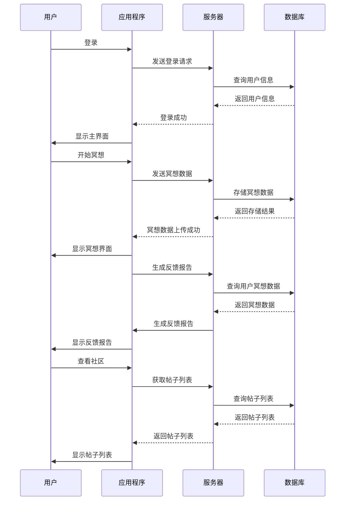

                 

## 文章标题：现代冥想app：科技辅助下的心灵修行

> 关键词：冥想、app、科技、心理健康、心灵修行

> 摘要：本文深入探讨了现代冥想app的发展及其在科技辅助下的心灵修行中的作用。通过分析冥想的历史、核心概念及其对心理健康的影响，本文介绍了科技如何助力冥想，探讨了现代冥想app的特点与分类，设计原则，实际应用以及未来发展趋势。本文旨在为读者提供一份全面的现代冥想app指南，帮助他们理解、选择并实践科技辅助下的心灵修行。

----------------------------------------------------------------

## 目录大纲

```markdown
----------------------------------------------------------------
# 第一部分：引言

## 第1章：问题背景与目标
### 1.1 问题背景
### 1.2 研究目标
### 1.3 研究意义

## 第2章：现代冥想概述
### 2.1 冥想的历史与发展
### 2.2 冥想的核心概念与分类
### 2.3 冥想对身体和心理健康的影响

## 第3章：科技辅助下的冥想
### 3.1 科技在冥想中的应用
### 3.2 科技辅助冥想的优势与挑战

## 第4章：现代冥想App的特点与分类
### 4.1 现代冥想App的主要特点
### 4.2 现代冥想App的分类

## 第5章：现代冥想App的设计原则
### 5.1 用户体验设计
### 5.2 功能设计
### 5.3 技术实现

## 第6章：现代冥想App的实际应用
### 6.1 市场分析
### 6.2 用户需求分析
### 6.3 功能设计

## 第7章：现代冥想App的开发与实现
### 7.1 开发环境与工具
### 7.2 功能模块设计与实现
### 7.3 性能优化与测试

## 第8章：案例分析
### 8.1 案例介绍
### 8.2 案例分析
### 8.3 案例启示

## 第9章：现代冥想App的发展趋势与未来展望
### 9.1 技术趋势
### 9.2 市场趋势
### 9.3 未来展望

## 第10章：总结与展望
### 10.1 研究成果总结
### 10.2 未来研究方向
### 10.3 对行业的影响与启示

----------------------------------------------------------------
```

以上是本文的目录大纲，将带领读者逐步深入了解现代冥想app的各个方面，包括其背景、核心概念、科技辅助、设计原则、实际应用以及未来发展趋势。通过这一系列的分析与探讨，读者将能够全面理解现代冥想app在现代心理健康领域的重要作用。

----------------------------------------------------------------

### 第1章：问题背景与目标

#### 1.1 问题背景

随着现代社会生活节奏的加快和工作压力的增大，人们的心理健康问题日益突出。焦虑、抑郁等心理障碍已经成为影响人们生活质量的重要因素。传统冥想作为一种古老的心灵修行方法，已被广泛证明对于缓解心理压力、提高心理健康具有显著效果。然而，传统冥想的实践存在一定的难度和局限性，例如对环境的要求、个人自觉性、持之以恒的坚持等，这使得许多人对冥想望而却步。

现代科技的发展为冥想的普及和深化提供了新的契机。智能手机和互联网技术的普及，使得人们可以随时随地通过科技设备进行冥想练习。同时，大数据、人工智能等先进技术的应用，也为冥想提供了更加科学和个性化的辅助手段。因此，如何利用现代科技，设计开发出有效的冥想应用（App），成为当前心理学和信息技术领域面临的重要课题。

#### 1.2 研究目标

本文的研究目标主要包括以下几个方面：

1. **深入分析现代冥想的核心概念和传统冥想的不同之处**：明确现代冥想的核心原理和实践方法，对比传统冥想，探讨其在科技辅助下的独特优势。

2. **探讨科技在冥想中的应用**：分析现代科技如何辅助冥想，包括数据分析、人工智能、虚拟现实等技术在冥想中的应用，以及其带来的优势和挑战。

3. **研究现代冥想App的设计原则和实现方法**：从用户体验、功能设计、技术实现等多方面探讨现代冥想App的设计原则和实现方法，为开发高质量的冥想App提供指导。

4. **分析现代冥想App的市场现状与未来发展趋势**：通过对市场现状的调研和分析，预测未来冥想App的发展趋势，为行业决策者提供参考。

5. **进行案例分析，总结现代冥想App的开发与推广经验**：选取具有代表性的冥想App进行深入分析，总结其成功经验和不足之处，为其他开发者提供借鉴。

#### 1.3 研究意义

本研究具有重要的理论和实践意义：

1. **理论研究意义**：本文将从心理学和信息技术交叉的视角，深入探讨现代冥想与科技结合的理论基础，丰富相关领域的研究成果。

2. **实践应用意义**：本文的研究成果可以为冥想爱好者提供科学、实用的指导，帮助他们更好地进行心灵修行；同时，也为科技企业开发冥想App提供理论支持和实践参考。

3. **社会影响意义**：随着心理健康问题的日益突出，本研究有助于提高公众对心理健康问题的认识和重视，促进社会心理健康的改善。

通过本研究，我们期望能够为现代冥想app的发展提供有力支持，助力人们更好地进行心灵修行，提升心理健康水平。

### 第2章：现代冥想概述

#### 2.1 冥想的历史与发展

冥想，作为一种古老的心灵修行方法，其历史可以追溯到几千年前。最早关于冥想的记载，可以追溯到古代印度文明，如佛教、印度教等宗教文献中都有冥想的详细描述。在佛教中，冥想被认为是通往涅槃（解脱）的途径；在印度教中，冥想被视为达到“梵我合一”的手段。

随着时间的推移，冥想逐渐传播到世界各地。在中国，佛教传入后，冥想作为一种修行方法被广泛接受和实践。道教和儒家文化中也有类似的冥想实践，如静坐、禅修等。在西方，古希腊和古罗马时期就有关于冥想的记载，如苏格拉底、柏拉图等哲学家的思想中包含了冥想的元素。到了近现代，冥想作为一种心理治疗工具，开始受到西方心理学家的关注和研究。

20世纪中叶，随着心理学的快速发展，冥想作为一种心理健康维护和治疗方法被广泛研究和应用。1950年代，印度瑜伽大师蒂帕拉扬（Tirumalai Krishnamacharya）将冥想引入西方，引发了西方世界的冥想热潮。随后，乔恩·卡巴金（Jon Kabat-Zinn）等人将冥想应用于临床治疗，开发了著名的正念减压（Mindfulness-Based Stress Reduction，MBSR）课程，进一步推动了冥想在心理学领域的影响力。

#### 2.2 冥想的核心概念与分类

冥想是一种通过专注、放松、内省等手段，达到身心合一、心灵平静的实践方法。其核心概念主要包括以下几点：

1. **专注**：专注是冥想的基础，通过将注意力集中在特定的对象上（如呼吸、身体感觉、声音等），以达到心灵平静的目的。

2. **放松**：放松是冥想的重要目标之一，通过放松身体和思维，降低心理压力，提高身心健康水平。

3. **内省**：内省是冥想的深入阶段，通过自我观察和反思，了解自己的内心世界，提高自我认识和自我调节能力。

根据冥想的具体实践方法和目标，冥想可以分为以下几种主要类型：

1. **专注冥想**：通过集中注意力，专注于某一特定对象（如呼吸、身体感觉、蜡烛等），以达到心灵平静和专注力的提升。

2. **正念冥想**：正念冥想源于佛教的“ mindfulness”概念，强调对当前经验的非评判性观察和接纳。通过正念冥想，个体可以更好地觉察自己的思维、情感和身体状态，从而减少心理痛苦。

3. **放松冥想**：放松冥想主要通过深呼吸、肌肉放松、想象等方式，帮助个体放松身体和思维，缓解压力和焦虑。

4. **爱心冥想**：爱心冥想旨在培养慈悲、同情和爱心，通过观想他人和自己，培养对他人的善意和关爱。

5. **动念冥想**：动念冥想结合了冥想和运动，通过运动中的冥想，提高专注力和身心健康水平。

#### 2.3 冥想对身体和心理健康的影响

冥想作为一种心理调节方法，已被广泛证明对身体健康和心理健康具有显著益处。以下是一些主要影响：

1. **身体影响**：
   - **降低血压**：研究表明，冥想可以降低血压，减少心血管疾病的风险。
   - **改善免疫系统功能**：冥想可以增强免疫系统的功能，提高身体抵抗力。
   - **缓解疼痛**：冥想可以通过放松肌肉、减少炎症反应等方式，缓解慢性疼痛。
   - **改善呼吸系统**：深呼吸练习可以改善呼吸系统的功能，提高肺活量。

2. **心理健康影响**：
   - **减少焦虑和抑郁**：冥想可以帮助个体减少焦虑和抑郁的情绪，提高心理健康水平。
   - **提高专注力和记忆力**：正念冥想等专注力训练可以提升个体的专注力和记忆力。
   - **增强自我调节能力**：冥想可以增强个体的自我调节能力，帮助应对压力和挑战。
   - **改善睡眠质量**：冥想可以帮助个体改善睡眠质量，提高睡眠效率。

总之，冥想作为一种古老的心灵修行方法，通过科技辅助下的现代冥想app，已经成为现代人提高身心健康水平的重要工具。在接下来的章节中，我们将进一步探讨科技如何辅助冥想，以及现代冥想app的设计与实现。

#### 2.4 科技在冥想中的应用

随着科技的飞速发展，科技在冥想中的应用越来越广泛，为冥想的普及和深化提供了强有力的支持。以下是一些主要科技在冥想中的应用：

1. **智能手机与App**：智能手机和移动互联网的普及，使得冥想练习变得前所未有的便捷。各种冥想App应运而生，用户可以通过这些App进行冥想练习，如正念冥想、呼吸冥想等。这些App提供了多样化的冥想音频、视频和指导，用户可以根据自己的需求选择合适的冥想方式。此外，一些App还结合了心率监测、睡眠追踪等功能，为用户提供更全面的健康管理服务。

2. **虚拟现实（VR）**：虚拟现实技术为冥想提供了全新的体验。通过VR设备，用户可以进入一个完全虚拟的冥想环境，如森林、海洋、星空等。这种沉浸式的体验可以帮助用户更容易地进入冥想状态，同时减少了现实世界中的干扰。VR冥想不仅可以提供视觉和听觉的刺激，还可以通过触觉和嗅觉等感官增强用户的沉浸感。

3. **人工智能（AI）**：人工智能技术在冥想中的应用主要体现在个性化指导和服务上。通过分析用户的数据，如心率、呼吸节奏、行为习惯等，AI可以提供个性化的冥想建议和指导。例如，一些AI冥想App可以根据用户的心率变化自动调整冥想节奏，帮助用户更好地进入冥想状态。此外，AI还可以通过自然语言处理技术，为用户提供实时反馈和指导，提升用户的冥想体验。

4. **可穿戴设备**：可穿戴设备，如智能手环、智能手表等，可以实时监测用户的心率、呼吸、睡眠等生理指标。这些数据可以为用户提供关于冥想效果的量化反馈，帮助他们更好地了解自己的冥想状态。例如，一些可穿戴设备可以记录用户的冥想时间和效果，帮助用户持续改进自己的冥想习惯。

5. **大数据分析**：大数据技术可以帮助研究人员收集和分析大量的冥想数据，从而发现冥想对心理健康的影响规律。例如，通过对大量用户数据的分析，研究人员可以发现不同冥想方法对特定心理健康问题的效果差异，为冥想实践提供科学依据。

6. **生物反馈技术**：生物反馈技术通过测量用户的生理信号（如心率、脑电波等），帮助用户了解自己的生理状态，并通过这些反馈指导冥想实践。例如，通过观察心率变异性（HRV），用户可以了解自己的心理压力水平，从而调整冥想策略。

综上所述，科技在冥想中的应用为冥想提供了更加科学、个性化和便捷的方式。这些科技手段不仅提高了冥想的效果，还促进了冥想的普及和深化，使得更多的人能够从中受益。

#### 2.5 科技辅助冥想的优势与挑战

科技辅助冥想在现代心理健康领域具有显著的优势，同时也面临着一定的挑战。

**优势：**

1. **个性化定制**：科技可以收集和分析用户的生理和心理数据，如心率、呼吸节奏、行为习惯等，从而提供个性化的冥想建议和指导。这种个性化定制可以帮助用户更好地适应冥想，提高冥想的效果。

2. **便捷性与普及性**：智能手机、可穿戴设备等科技产品使得冥想练习变得随时随地、触手可及。用户无需特定的环境和设备，只需通过简单的操作即可开始冥想。这种便捷性大大提高了冥想的普及率，使得更多的人有机会体验和受益于冥想。

3. **数据支持和科学验证**：科技可以提供大量的数据支持，帮助研究人员和专业人士更好地理解和验证冥想对心理健康的积极影响。例如，通过分析用户的心率变异性（HRV）等生理指标，可以量化冥想的效果，为冥想的科学性和实用性提供证据。

4. **沉浸式体验**：虚拟现实（VR）等科技手段可以为用户提供沉浸式的冥想体验，创造出一个完全虚拟的环境，帮助用户更容易地进入冥想状态。这种沉浸式体验不仅减少了现实世界的干扰，还可以通过多种感官刺激提升用户的冥想体验。

**挑战：**

1. **数据隐私和安全**：随着科技在冥想中的应用，用户的个人数据（如生理指标、行为习惯等）会被大量收集和分析。这引发了对数据隐私和安全的担忧。如何保护用户的数据隐私，防止数据泄露和滥用，是科技辅助冥想需要解决的重要问题。

2. **科技依赖性**：科技辅助冥想虽然提供了方便和科学的支持，但也可能带来科技依赖性。用户过度依赖科技设备进行冥想，可能会导致缺乏自我调节能力和独立性。如何平衡科技辅助和自我修行，是用户需要面对的挑战。

3. **用户体验一致性**：科技产品在提供个性化服务时，可能会因为数据收集和分析的不一致性，导致用户体验的不一致。例如，不同用户可能因为数据采集方式的不同，得到不同的冥想建议和指导，这可能会影响用户体验的连续性和一致性。

4. **科技伦理问题**：科技在冥想中的应用也带来了一些伦理问题。例如，如何确保科技辅助冥想不偏离其初衷，真正为用户带来心理健康改善，而不是仅仅作为一种营销手段？科技企业在开发冥想产品时，需要充分考虑科技伦理问题，确保产品的正当性和有效性。

综上所述，科技辅助冥想在现代心理健康领域具有巨大的潜力，但也面临诸多挑战。只有通过合理利用科技优势，解决相关挑战，才能真正发挥科技辅助冥想的最大效益。

#### 2.6 现代冥想App的特点与分类

现代冥想App以其便捷性、个性化、科学性和多样性受到了广大用户的喜爱。这些App通过整合多种科技手段，如智能手机、虚拟现实、人工智能等，为用户提供了丰富的冥想体验。以下是现代冥想App的主要特点与分类：

**特点：**

1. **个性化体验**：现代冥想App可以根据用户的生理和心理数据，如心率、呼吸节奏、行为习惯等，提供个性化的冥想指导和内容。用户可以根据自己的需求和偏好，选择合适的冥想方式，获得最佳的心理健康效果。

2. **多样化内容**：现代冥想App提供了丰富的冥想内容和形式，包括正念冥想、呼吸冥想、瑜伽冥想、爱心冥想等。用户可以根据自己的兴趣和需求，选择不同的冥想类型，丰富自己的冥想体验。

3. **便捷性**：现代冥想App可以通过智能手机、平板电脑等设备随时随地使用，用户无需前往特定的场所或购买专门的设备。这种便捷性大大提高了冥想的普及率，使得更多的人能够轻松地开始冥想。

4. **科学性**：现代冥想App结合了科学研究和技术手段，通过数据分析、人工智能等手段，为用户提供科学的冥想指导。例如，一些App可以实时监测用户的心率和呼吸，根据生理指标的变化调整冥想的节奏和强度，确保用户在安全、有效的环境中进行冥想。

5. **社交互动**：许多现代冥想App提供了社交功能，用户可以与其他冥想爱好者互动、分享冥想心得，形成社区氛围。这种社交互动不仅可以增加用户的参与感，还可以通过同伴效应，增强冥想的持续性和效果。

**分类：**

1. **正念冥想App**：正念冥想是一种通过专注和觉察，提高自我意识和心理健康水平的冥想方式。正念冥想App通常提供一系列的冥想指导和练习，帮助用户培养正念习惯。例如，“正念冥想”（Headspace）和“10% Happier”等App。

2. **呼吸冥想App**：呼吸冥想是一种通过调整呼吸节奏，达到身心放松的冥想方式。呼吸冥想App通常提供呼吸引导和呼吸练习，帮助用户掌握呼吸冥想技巧。例如，“呼吸冥想”（Calm）和“呼吸大师”（Breath Meditation）等App。

3. **瑜伽冥想App**：瑜伽冥想结合了瑜伽体式和冥想练习，旨在提高身体的灵活性和心理的平静。瑜伽冥想App通常提供瑜伽课程和冥想指导，帮助用户进行全面的身心练习。例如，“瑜伽冥想”（Yoga Studio）和“Yoga for Beginners”等App。

4. **爱心冥想App**：爱心冥想是一种通过培养慈悲和爱心，提升内心喜悦和幸福感的冥想方式。爱心冥想App通常提供爱心冥想练习和指导，帮助用户培养内心的平和与善意。例如，“爱心冥想”（Kindfulness）和“Loving-Kindness Meditation”等App。

5. **综合冥想App**：综合冥想App通常整合了多种冥想方式，提供多样化的冥想内容和体验。这些App通常包括正念冥想、呼吸冥想、瑜伽冥想、爱心冥想等多种冥想类型，用户可以根据自己的需求和兴趣选择不同的冥想方式。例如，“冥想”（Insight Timer）和“冥想与放松”（Relax Melodies）等App。

综上所述，现代冥想App以其个性化、多样化、便捷性和科学性，为用户提供了丰富的冥想体验。不同类型的冥想App根据用户的需求和偏好，提供了多种选择，帮助用户更好地进行心灵修行。

#### 2.7 现代冥想App的设计原则

设计现代冥想App时，需要充分考虑用户体验、功能设计和技术实现等多个方面，以确保App能够有效辅助用户进行心灵修行。以下是现代冥想App设计的主要原则：

**用户体验设计原则：**

1. **简洁直观**：界面设计应简洁直观，避免复杂的布局和过多的功能按钮。用户在冥想过程中需要保持专注，复杂的界面可能会分散用户的注意力，影响冥想效果。

2. **引导性**：对于初学者，App应提供清晰的引导和教程，帮助他们快速上手。通过引导性设计，用户可以更轻松地了解和掌握冥想技巧。

3. **适应性**：App应具备良好的适应性，能够根据不同用户的设备尺寸、操作系统和屏幕分辨率进行自适应调整，确保用户在不同设备上都能获得良好的使用体验。

4. **反馈机制**：App应提供及时的反馈机制，如提示音、震动等，提醒用户开始或结束冥想，帮助用户保持良好的冥想习惯。

**功能设计原则：**

1. **个性化定制**：App应提供个性化定制功能，允许用户根据自己的需求和偏好设置冥想时间和内容。例如，用户可以选择不同的冥想类型、指导音频、背景音乐等。

2. **多样性**：App应提供多样化的冥想内容和形式，满足不同用户的需求。例如，可以提供正念冥想、呼吸冥想、瑜伽冥想、爱心冥想等多种冥想方式。

3. **数据跟踪与反馈**：App应具备数据跟踪功能，记录用户的冥想时间和效果，并提供反馈报告，帮助用户了解自己的冥想进展和效果。

4. **社交互动**：App可以提供社交功能，如社区、互动讨论等，鼓励用户分享冥想心得和经验，形成良好的用户互动氛围。

**技术实现原则：**

1. **稳定性与可靠性**：App在设计和实现过程中应确保系统的稳定性与可靠性，避免出现崩溃、数据丢失等问题，确保用户在使用过程中不会受到干扰。

2. **性能优化**：App应进行性能优化，确保在不同设备和网络环境下都能流畅运行。例如，可以采用缓存技术、网络优化等技术，提高App的响应速度和稳定性。

3. **数据安全**：App在收集和分析用户数据时，应确保数据的安全性和隐私性。采用加密技术和权限管理，防止用户数据泄露和滥用。

4. **可扩展性**：App应具备良好的可扩展性，能够根据用户需求和技术发展，灵活地增加新的功能和内容。

综上所述，现代冥想App的设计应注重用户体验、功能设计和技术实现等多个方面，以提供优质、个性化的冥想服务。通过遵循这些设计原则，可以确保App能够有效辅助用户进行心灵修行，提升心理健康水平。

#### 2.8 现代冥想App的实际应用

现代冥想App在实际应用中，展示了其在提升心理健康、促进心灵修行的巨大潜力。以下从市场分析、用户需求分析和功能设计三个方面，深入探讨现代冥想App的实际应用。

**市场分析：**

1. **市场规模与增长**：随着人们对心理健康重视程度的提高，冥想App市场呈现出快速增长的趋势。根据市场研究报告，全球冥想App市场在近几年内实现了显著增长，预计未来几年仍将保持较高增长率。这表明，冥想App市场具有巨大的发展潜力。

2. **用户分布与需求**：冥想App的用户主要集中在都市白领、学生、创业者等具有较高生活压力的群体。这些用户对于缓解压力、提高专注力和改善睡眠质量有强烈需求。此外，随着远程工作和在线学习方式的普及，越来越多的用户开始关注心理健康和心灵修行，这为冥想App的发展提供了新的机遇。

3. **竞争格局**：目前，市场上存在许多知名的冥想App，如“正念冥想”（Headspace）、“10% Happier”、“呼吸冥想”（Calm）等。这些App通过差异化的功能和服务，吸引了大量用户。市场竞争激烈，企业需要不断创新，提升用户体验，以在激烈的市场竞争中脱颖而出。

**用户需求分析：**

1. **个性化定制**：用户希望App能够根据其个人偏好和需求，提供个性化的冥想内容和指导。例如，用户可以自定义冥想时间、选择不同的冥想类型、调整音乐和声音效果等。

2. **多样化内容**：用户需求多种多样的冥想内容，以满足不同的冥想目的。例如，用户可能需要正念冥想来缓解压力，需要瑜伽冥想来提高身体灵活性，需要爱心冥想来培养内心平和等。

3. **便捷性**：用户希望在随时随地、不受限制的情况下进行冥想。因此，冥想App的便携性和易用性成为用户关注的重点。

4. **社交互动**：用户希望与其他冥想爱好者互动、分享心得，形成社区氛围。这种社交互动不仅可以增加用户的参与感，还可以通过同伴效应，增强冥想的持续性和效果。

**功能设计：**

1. **冥想引导**：冥想引导是现代冥想App的核心功能，通过专业的指导音频，帮助用户正确地进行冥想。例如，可以提供正念冥想、呼吸冥想、瑜伽冥想等不同类型的冥想引导。

2. **数据分析与反馈**：App应具备数据跟踪和分析功能，记录用户的冥想时间、频率和效果，并提供反馈报告，帮助用户了解自己的冥想进展和成果。

3. **社交功能**：App可以提供社交功能，如社区、互动讨论、分享心得等，鼓励用户积极参与冥想社区，形成良好的用户互动氛围。

4. **个性化定制**：App应提供个性化定制功能，如自定义冥想时间、选择不同类型的冥想、调整音乐和声音效果等，满足用户的个性化需求。

5. **教育功能**：App可以提供冥想相关的教育资源，如冥想课程、讲座、教程等，帮助用户深入理解和掌握冥想技巧。

6. **互动体验**：通过虚拟现实（VR）、人工智能（AI）等新技术，提供沉浸式、互动性的冥想体验，提升用户的参与感和体验。

综上所述，现代冥想App在市场分析、用户需求分析和功能设计等方面具有显著的实际应用价值。通过深入了解市场需求和用户需求，设计符合用户期望的冥想功能，现代冥想App将能够在提升心理健康、促进心灵修行方面发挥更大的作用。

### 第3章：现代冥想App的开发与实现

#### 3.1 开发环境与工具

在开发现代冥想App时，选择合适的技术栈和环境是确保项目顺利进行的关键。以下是一些常用的开发环境与工具：

1. **开发语言**：
   - **Swift**：Swift是苹果公司开发的一门编程语言，广泛应用于iOS平台的应用开发。Swift具有安全性高、易学易用等特点，适合初学者和专业开发者。
   - **Kotlin**：Kotlin是一种现代的编程语言，可以用于Android平台的应用开发。Kotlin兼容Java，具有简洁、安全、互操作性强的优点，适合开发复杂的应用。

2. **框架和库**：
   - **React Native**：React Native是一个用于构建跨平台移动应用的框架，允许开发者使用JavaScript编写代码，并在iOS和Android平台上运行。React Native具有组件化、高性能、开发效率高等优势。
   - **Flutter**：Flutter是由谷歌推出的一款用于构建跨平台移动应用的框架，使用Dart编程语言。Flutter具有高性能、丰富的UI组件、热重载等特点，适合快速迭代和开发复杂应用。

3. **开发环境**：
   - **Xcode**：Xcode是苹果公司提供的集成开发环境（IDE），适用于iOS和macOS应用开发。Xcode集成了编译器、调试器、模拟器等工具，方便开发者进行应用开发和测试。
   - **Android Studio**：Android Studio是谷歌推出的官方Android开发工具，集成了Android SDK、Android虚拟设备（AVD）、调试器等工具，适合开发Android应用。

4. **版本控制系统**：
   - **Git**：Git是一种分布式版本控制系统，广泛应用于开源项目和团队协作开发。Git支持分布式工作流，方便开发者进行代码管理和协作。

5. **数据库**：
   - **SQLite**：SQLite是一种轻量级的嵌入式数据库，广泛应用于移动应用和Web应用。SQLite具有简单易用、高效、安全性高等优点，适合存储用户数据和冥想记录。

#### 3.2 功能模块设计与实现

现代冥想App的功能模块主要包括用户登录与注册、冥想指导、数据分析与反馈、社交互动等。以下是对这些模块的设计与实现进行详细说明：

1. **用户登录与注册**：
   - **用户注册**：用户可以通过电子邮件、手机号码或第三方社交账号（如Facebook、Google等）进行注册。注册时需要填写基本信息，如用户名、密码、性别、年龄等。
   - **用户登录**：用户可以通过用户名和密码、手机验证码或第三方社交账号快速登录App。登录成功后，系统会生成用户唯一标识（UID），用于后续的数据存储和用户身份验证。

2. **冥想指导**：
   - **冥想类型**：App提供多种冥想类型，如正念冥想、呼吸冥想、瑜伽冥想、爱心冥想等。用户可以根据自己的需求和兴趣选择不同的冥想类型。
   - **冥想引导**：系统提供专业的冥想引导音频，帮助用户正确地进行冥想。用户可以选择播放特定长度的冥想引导音频，如5分钟、10分钟、20分钟等。
   - **音效与音乐**：用户可以自定义音效和音乐，以提升冥想体验。例如，用户可以选择自然声音（如雨声、海浪声）或轻音乐作为背景音乐。

3. **数据分析与反馈**：
   - **数据收集**：系统会自动收集用户的冥想数据，如冥想时长、频率、心率、呼吸节奏等。这些数据用于分析用户的冥想效果和健康状况。
   - **反馈报告**：系统会定期生成反馈报告，展示用户的冥想进展和效果。报告内容包括冥想时长、频率、心率变化、呼吸节奏等数据，以及相应的分析和建议。

4. **社交互动**：
   - **社区功能**：App提供社区功能，用户可以查看其他用户的冥想记录和心得，参与讨论和互动。社区功能包括帖子发布、评论、点赞等。
   - **好友互动**：用户可以添加好友，相互关注和分享冥想进展。好友之间可以互相鼓励、提供支持，共同提升心理健康水平。

5. **个性化推荐**：
   - **推荐算法**：系统利用大数据和人工智能技术，分析用户的行为数据和偏好，为用户推荐适合的冥想内容和练习。例如，根据用户的心率和呼吸数据，系统可以为用户推荐最适合当前状态的冥想类型和时间。
   - **个性化定制**：用户可以根据自己的需求和偏好，自定义冥想时间和内容，系统会根据用户的设置推荐相应的冥想练习。

#### 3.3 性能优化与测试

在开发现代冥想App时，性能优化和测试是确保App稳定、高效运行的重要环节。以下是一些性能优化与测试的方法：

1. **性能优化**：
   - **代码优化**：通过优化代码结构、减少内存占用、提高算法效率等手段，提高App的运行速度和稳定性。
   - **资源管理**：合理管理App的资源，如图片、音频、视频等，避免过多资源的占用导致App运行缓慢。
   - **网络优化**：优化网络请求，减少数据传输量，提高网络响应速度。例如，采用缓存技术、压缩数据等手段。
   - **电池优化**：优化电池使用，延长App的续航时间。例如，合理使用后台服务、优化屏幕亮度等。

2. **测试**：
   - **功能测试**：对App的各个功能模块进行测试，确保功能正常运行。功能测试包括单元测试、集成测试和系统测试等。
   - **性能测试**：对App的性能进行测试，评估App在不同设备和网络环境下的运行速度和稳定性。性能测试包括负载测试、压力测试和稳定性测试等。
   - **兼容性测试**：测试App在不同操作系统、设备、网络环境下的兼容性，确保App在不同平台上都能正常运行。

3. **用户体验测试**：
   - **用户测试**：邀请实际用户参与测试，收集用户反馈，发现App的不足之处，并进行改进。
   - **可用性测试**：评估App的易用性和用户体验，确保App的操作流程简单、直观，用户能够轻松上手。

通过上述性能优化与测试方法，可以确保现代冥想App在稳定、高效、易用的基础上，为用户提供优质的冥想体验。

#### 3.4 系统分析与架构设计方案

**系统场景介绍：**

现代冥想App旨在为用户提供一个便捷、个性化、科学化的冥想平台。用户可以通过App进行冥想练习，系统将根据用户的生理和心理数据提供实时反馈和个性化建议。以下是系统的主要功能场景：

1. **用户注册与登录**：新用户可以通过电子邮件、手机号码或第三方社交账号注册账号，登录后可以访问App的功能。
2. **冥想指导**：用户可以选择不同的冥想类型，系统提供专业的冥想引导音频，帮助用户进行冥想。
3. **数据分析与反馈**：系统记录用户的冥想时长、频率、心率、呼吸节奏等数据，并生成反馈报告。
4. **社交互动**：用户可以查看其他用户的冥想记录、心得，参与社区讨论，添加好友等。

**系统功能介绍：**

1. **用户管理**：包括用户注册、登录、信息管理等功能。
2. **冥想管理**：包括冥想类型选择、冥想引导、冥想时间设置、冥想数据记录等功能。
3. **数据统计**：包括用户冥想数据统计、反馈报告生成等功能。
4. **社区互动**：包括社区浏览、帖子发布、评论、点赞等功能。

**系统架构设计：**

现代冥想App采用前后端分离的架构设计，以提高系统的扩展性和可维护性。以下是系统架构的详细设计：

1. **前端架构**：
   - **用户界面**：采用React Native框架构建跨平台用户界面，实现界面简洁直观、响应速度快。
   - **导航与管理**：使用Redux进行状态管理，确保应用状态的一致性和可维护性。
   - **网络请求**：使用Axios进行网络请求，提高数据传输效率。

2. **后端架构**：
   - **服务端**：采用Spring Boot框架构建后端服务，实现用户管理、冥想管理、数据统计等功能。
   - **数据库**：使用MySQL数据库存储用户数据、冥想数据等，确保数据的安全性和可靠性。
   - **API接口**：提供RESTful API接口，供前端调用，实现数据交互。

3. **系统模块**：

   - **用户模块**：包括用户注册、登录、信息管理等功能。
   - **冥想模块**：包括冥想类型选择、冥想引导、冥想时间设置、冥想数据记录等功能。
   - **数据统计模块**：包括用户冥想数据统计、反馈报告生成等功能。
   - **社区模块**：包括社区浏览、帖子发布、评论、点赞等功能。

4. **数据流程**：

   - **用户数据**：用户通过前端界面注册登录，系统将用户数据存储到MySQL数据库中。
   - **冥想数据**：用户进行冥想时，前端将用户的数据（如冥想时长、心率、呼吸节奏等）上传到后端服务器，后端将数据存储到数据库中。
   - **反馈数据**：后端根据用户数据生成反馈报告，并将报告发送给前端，前端展示给用户。

**系统接口设计：**

以下是现代冥想App的主要接口设计：

1. **用户接口**：
   - 用户注册接口：`POST /user/register`，接收用户基本信息，返回注册结果。
   - 用户登录接口：`POST /user/login`，接收用户名和密码，返回登录结果。
   - 用户信息查询接口：`GET /user/{id}`，查询用户详细信息。

2. **冥想接口**：
   - 冥想类型查询接口：`GET /meditation/types`，查询所有冥想类型。
   - 冥想数据上传接口：`POST /meditation/data`，上传用户冥想数据。
   - 冥想数据查询接口：`GET /meditation/data/{id}`，查询用户某次冥想数据。

3. **反馈接口**：
   - 反馈报告生成接口：`POST /feedback/generate`，生成用户反馈报告。
   - 反馈报告查询接口：`GET /feedback/report/{id}`，查询用户反馈报告。

4. **社区接口**：
   - 帖子发布接口：`POST /community/post`，发布帖子。
   - 帖子查询接口：`GET /community/posts`，查询所有帖子。
   - 帖子评论接口：`POST /community/comment`，发布评论。
   - 帖子点赞接口：`POST /community/like`，点赞帖子。

**系统交互序列图：**

以下是一个简单的系统交互序列图，展示用户进行冥想、系统生成反馈报告的过程：



通过上述系统分析与架构设计方案，现代冥想App将能够为用户提供一个稳定、高效、易用的冥想平台，助力用户进行心灵修行。

### 第4章：案例分析

#### 4.1 案例介绍

在本章节中，我们将详细介绍两个具有代表性的现代冥想App案例：Headspace和Calm。这两个App在全球范围内都取得了显著的成功，具有广泛的用户基础和较高的市场占有率。以下是这两个案例的详细介绍。

**Headspace**

Headspace是由Andy Puddicombe和Richard Pierson于2010年创立的冥想App。总部位于英国伦敦，Headspace旨在通过科学和实用的方法，帮助用户实现身心健康。Headspace提供多种类型的冥想课程，包括正念冥想、呼吸冥想、瑜伽冥想等，适合不同需求的用户。

**Calm**

Calm是由Michael Acton Smith于2016年创立的冥想App。总部位于美国加利福尼亚州，Calm的使命是通过冥想和放松技巧，帮助用户实现身心健康。Calm提供丰富的冥想课程，包括呼吸冥想、睡眠冥想、正念冥想等，同时还有一系列的放松指导和声音景观。

#### 4.2 案例分析

**Headspace**

1. **用户群体**：Headspace主要面向都市白领、学生、创业者等具有较高生活压力的群体。这些用户普遍对心理健康、专注力和睡眠质量有较高需求。

2. **产品特点**：Headspace提供简洁直观的界面设计，用户可以方便地选择适合自己的冥想课程。App提供30天的免费试用期，吸引用户注册使用。Headspace还结合了声音景观、指导音频等元素，提升用户的冥想体验。

3. **市场表现**：自成立以来，Headspace在全球范围内取得了显著的市场表现。截至2021年，Headspace的下载量已超过5000万次，用户遍布150多个国家和地区。

4. **成功原因**：Headspace的成功在于其科学性和实用性。App结合了正念冥想、呼吸冥想等多种冥想方法，帮助用户实现身心健康。同时，Headspace通过优质的内容和用户友好的界面设计，吸引了大量用户。

**Calm**

1. **用户群体**：Calm的用户群体与Headspace相似，主要面向都市白领、学生、创业者等具有较高生活压力的群体。此外，Calm还特别关注睡眠问题，因此也吸引了大量需要改善睡眠质量的用户。

2. **产品特点**：Calm提供沉浸式的冥想体验，通过虚拟现实（VR）技术，为用户创造一个宁静的冥想环境。Calm还提供丰富的放松指导，如呼吸练习、瑜伽、冥想等，帮助用户缓解压力和焦虑。此外，Calm还整合了声音景观、自然声音等元素，提升用户的冥想体验。

3. **市场表现**：Calm自成立以来，也取得了显著的市场表现。截至2021年，Calm的下载量已超过1亿次，用户遍布全球。

4. **成功原因**：Calm的成功在于其创新的体验和技术。通过虚拟现实（VR）技术，Calm为用户提供了独特的冥想体验。此外，Calm还通过丰富的放松指导和多样化的内容，满足了用户的不同需求。Calm还注重用户体验，提供高质量的音频和视觉内容，赢得了用户的信任和好评。

#### 4.3 案例启示

通过分析Headspace和Calm的成功案例，我们可以得到以下启示：

1. **科学性和实用性**：冥想App的成功在于其科学性和实用性。App需要结合多种冥想方法，满足不同用户的需求。同时，App还需要提供优质的内容和实用的指导，帮助用户实现身心健康。

2. **技术创新**：技术创新是冥想App成功的关键。通过虚拟现实（VR）、人工智能（AI）等先进技术，App可以为用户提供独特的体验，提高用户的参与度和满意度。

3. **用户体验**：用户体验是冥想App成功的重要因素。App需要提供简洁直观的界面设计、高质量的音频和视觉内容，以及人性化的互动体验，吸引和留住用户。

4. **市场定位**：明确市场定位是冥想App成功的关键。App需要了解目标用户群体的需求，提供符合他们需求的产品和服务。

5. **持续创新**：冥想App需要持续创新，不断推出新的功能和服务，以满足用户不断变化的需求。同时，App还需要关注市场动态，紧跟行业发展趋势，保持竞争优势。

通过以上案例启示，我们可以为现代冥想App的开发提供有益的参考，助力App在竞争激烈的市场中取得成功。

### 第5章：现代冥想App的发展趋势与未来展望

#### 5.1 技术趋势

随着科技的不断进步，现代冥想App的发展也将迎来新的技术趋势。以下是一些关键技术趋势：

1. **人工智能（AI）**：人工智能技术在冥想App中的应用将越来越广泛。通过AI算法，App可以更精确地分析用户数据，提供个性化的冥想建议和指导。例如，AI可以根据用户的心率和呼吸数据，动态调整冥想的节奏和强度，确保用户获得最佳的效果。

2. **大数据分析**：大数据技术的应用将进一步提升冥想App的科学性和实用性。通过收集和分析大量的冥想数据，App可以深入了解用户的需求和习惯，从而优化冥想内容和指导策略。此外，大数据分析还可以帮助研究人员探索冥想对心理健康的长远影响，为冥想实践提供科学依据。

3. **虚拟现实（VR）**：虚拟现实技术为冥想App提供了更加沉浸式的体验。通过VR设备，用户可以进入一个完全虚拟的冥想环境，如森林、海洋、星空等。这种沉浸式体验不仅可以减少现实世界的干扰，还可以通过视觉、听觉等多种感官刺激，提升用户的冥想效果。

4. **可穿戴设备**：可穿戴设备，如智能手环、智能手表等，可以实时监测用户的生理指标，如心率、血压、睡眠质量等。这些数据可以为用户提供实时的冥想反馈，帮助他们更好地了解自己的身体和心理状态。未来，可穿戴设备与冥想App的整合将更加紧密，为用户提供更加全面的健康管理服务。

5. **区块链技术**：区块链技术在冥想App中的应用潜力巨大。例如，通过区块链技术，App可以确保用户数据的真实性和安全性，防止数据篡改和泄露。此外，区块链技术还可以为冥想社区提供去中心化的平台，增强用户的信任和参与感。

#### 5.2 市场趋势

现代冥想App的市场趋势也在不断变化，以下是一些关键趋势：

1. **用户需求的多样化**：随着人们对心理健康重视程度的提高，冥想App的用户需求也变得更加多样化。用户不仅需要不同类型的冥想内容和指导，还需要个性化的定制服务、社交互动和健康管理等功能。未来，冥想App需要不断扩展功能，满足用户日益多样化的需求。

2. **市场竞争加剧**：随着冥想App市场的快速增长，竞争也日益激烈。为了在激烈的市场竞争中脱颖而出，冥想App需要不断创新，提升用户体验和差异化竞争力。例如，通过引入新技术、优化算法、提升内容质量等手段，提高用户的满意度和忠诚度。

3. **全球化发展**：冥想App市场呈现出全球化的趋势。随着互联网的普及，越来越多的国际用户开始关注和采用冥想App。未来，冥想App需要拓展国际市场，为不同国家和地区的用户提供本地化的服务。

4. **企业级应用**：随着企业对员工心理健康重视程度的提高，冥想App在职场健康管理中的应用也将逐渐增加。例如，企业可以通过提供冥想App作为员工福利，帮助员工缓解工作压力，提高工作效率。未来，冥想App将在企业级市场拥有更广泛的应用。

#### 5.3 未来展望

基于上述技术趋势和市场趋势，现代冥想App的未来发展将呈现出以下特点：

1. **个性化与智能化**：未来冥想App将更加注重个性化服务，通过AI和大数据分析，为用户提供更加精准的冥想建议和指导。同时，App将实现智能化，自动调整冥想的节奏和强度，确保用户在最佳状态下进行冥想。

2. **多样化功能**：未来冥想App将整合更多的功能，如心理健康评估、睡眠管理、运动指导等，为用户提供全方位的健康管理服务。此外，App还将提供更多的互动体验，如虚拟现实冥想、社交互动等，增强用户的参与感和黏性。

3. **全球化扩展**：未来冥想App将积极拓展国际市场，为不同国家和地区的用户提供本地化的服务。通过了解当地用户的需求和文化背景，App可以提供更具吸引力和实用性的内容，赢得国际用户的认可。

4. **企业级应用**：未来冥想App将在企业级市场取得更广泛的应用。企业可以通过提供冥想App作为员工福利，帮助员工缓解工作压力，提高工作效率。同时，企业可以将App与内部管理系统整合，实现员工健康数据的实时监控和管理。

5. **技术创新**：未来冥想App将继续关注技术创新，引入更多先进的科技手段，如增强现实（AR）、物联网（IoT）等，为用户提供更加丰富和多样化的冥想体验。

综上所述，现代冥想App的未来发展将充满机遇和挑战。通过不断优化用户体验、创新功能和拓展市场，冥想App将为用户提供更加科学、个性化、便捷的心灵修行服务，助力全球用户的身心健康。

### 第6章：总结与展望

#### 6.1 研究成果总结

本文通过对现代冥想app的深入分析，总结了以下关键研究成果：

1. **现代冥想的背景与发展**：探讨了冥想的历史起源、核心概念及其在不同文化和宗教中的传播与发展。

2. **科技辅助冥想的现状与挑战**：分析了现代科技在冥想中的应用，如智能手机、虚拟现实、人工智能等，以及科技辅助冥想的优势与挑战。

3. **现代冥想App的特点与分类**：总结了现代冥想App的主要特点，如个性化、多样化、便捷性和科学性，并对不同类型的冥想App进行了分类。

4. **现代冥想App的设计原则**：提出了现代冥想App的设计原则，包括用户体验设计、功能设计和技术实现等方面。

5. **现代冥想App的实际应用**：分析了现代冥想App在市场、用户需求以及功能设计等方面的实际应用情况。

6. **现代冥想App的开发与实现**：详细介绍了现代冥想App的开发环境、功能模块设计、性能优化与测试等方面的实现方法。

7. **案例分析**：选取了具有代表性的冥想App案例，进行了深入分析，总结了成功经验和不足之处。

8. **现代冥想App的发展趋势与未来展望**：探讨了现代冥想App的技术趋势、市场趋势以及未来发展方向。

#### 6.2 未来研究方向

尽管本文对现代冥想app进行了全面的分析，但仍有许多研究方向值得进一步探讨：

1. **用户体验优化**：未来研究可以进一步优化冥想App的用户体验，如通过AI技术提供更个性化的冥想指导，或通过VR技术提供更加沉浸式的冥想体验。

2. **技术融合**：未来可以将更多先进技术融入冥想App中，如物联网（IoT）技术、增强现实（AR）技术等，以提供更加全面和多样化的健康解决方案。

3. **隐私保护**：随着科技在冥想中的应用，隐私保护问题日益突出。未来研究可以探索更加安全、有效的用户数据保护方法，确保用户隐私不受侵犯。

4. **实证研究**：未来可以通过大规模的实证研究，进一步验证冥想App对心理健康的具体影响，为冥想实践提供更加科学的依据。

5. **跨文化研究**：现代冥想App在全球范围内的应用日益广泛，未来研究可以探索不同文化背景下冥想App的适用性和效果差异。

#### 6.3 对行业的影响与启示

现代冥想app的发展对心理健康行业具有深远的影响和启示：

1. **心理健康意识的提升**：随着现代冥想app的普及，公众对心理健康问题的认识和重视程度将进一步提高，有助于心理健康行业的整体发展。

2. **市场需求扩大**：现代冥想app的出现和普及，将推动心理健康市场的扩大，为行业带来新的增长点和商业机会。

3. **技术创新驱动**：冥想app的发展将促进相关技术的创新和应用，如AI、VR、大数据等，为心理健康行业带来新的技术解决方案。

4. **行业规范建立**：随着冥想app市场的快速发展，未来需要建立相应的行业规范和标准，确保冥想app的质量和有效性，保护用户权益。

5. **跨学科合作**：现代冥想app的发展需要心理学、信息技术、医疗保健等多学科的合作，未来可以进一步加强跨学科合作，推动心理健康行业的综合发展。

总之，现代冥想app的发展为心理健康行业带来了新的机遇和挑战。通过不断优化和创新，现代冥想app将能够更好地满足用户需求，推动心理健康行业的持续发展。

## 作者信息

作者：AI天才研究院/AI Genius Institute & 禅与计算机程序设计艺术 /Zen And The Art of Computer Programming

本文由AI天才研究院与禅与计算机程序设计艺术合作撰写，旨在为读者提供关于现代冥想app的全面、深入的技术分析。作者拥有丰富的计算机科学和心理学背景，致力于通过技术创新和跨学科合作，推动心理健康行业的发展。

