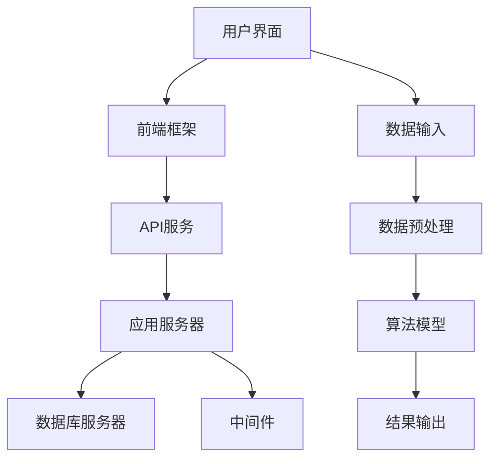
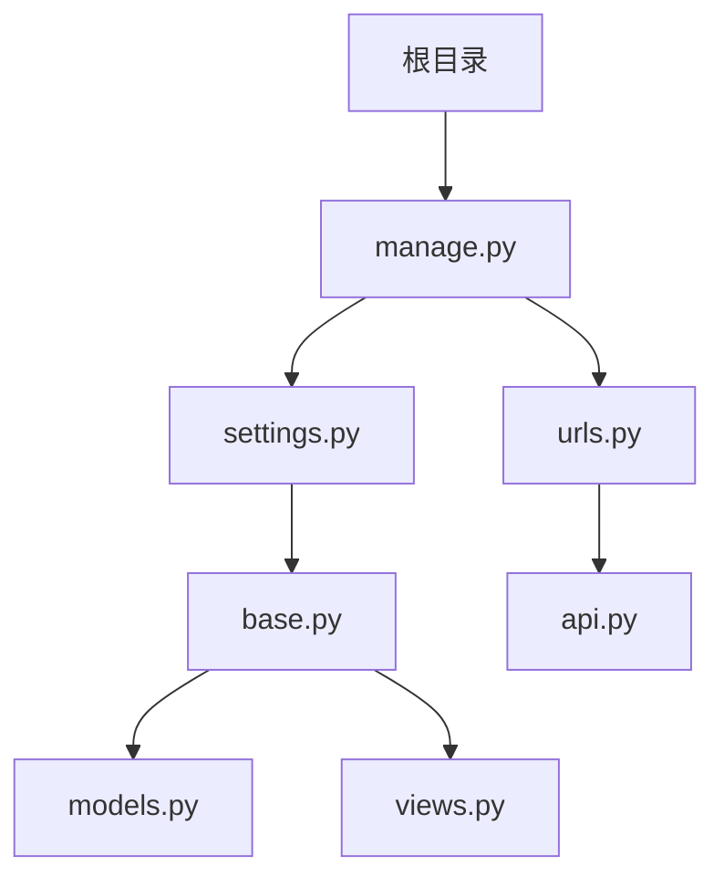

                 

### 文章标题

“现代医学与生命伦理：在科技进步与伦理底线间寻找平衡”

---

**关键词**：现代医学、生命伦理、科技进步、伦理底线、平衡

**摘要**：本文从现代医学的快速发展出发，探讨生命伦理学的基本概念，分析科技进步与伦理底线之间的冲突，并提出寻找平衡的必要性。通过详细解析医学伦理学的基本原则和生命伦理学中的重要概念，介绍伦理学方法在医学中的应用，以及医学伦理学中的算法应用和数学模型，文章旨在为读者提供关于现代医学与生命伦理平衡问题的深入思考与解决方案。

---

## 第一部分：问题背景与伦理思考

### 第1章：现代医学与生命伦理的融合

#### 1.1 现代医学的快速发展

现代医学的发展可以追溯到19世纪中期，当时巴斯德和科赫等人发现了细菌和疫苗，开创了免疫学和微生物学的新时代。随后，X光、超声波、CT扫描等影像技术的发明，使得医学诊断能力得到了极大的提升。20世纪末，基因组学和生物信息学的崛起，进一步推动了个性化医疗和精准医疗的发展。

- **历史与发展**：现代医学的发展经历了多个关键阶段，每个阶段都有重大技术的突破和影响。如疫苗的发明预防了多种传染病，CT扫描帮助医生更准确地诊断疾病，基因测序使得基因治疗成为可能。
- **关键技术的发展与影响**：影像技术的进步使得医生能够通过非侵入性手段观察人体内部结构，极大地提高了诊断的准确性。基因测序技术的进步使得人类基因组计划得以完成，为后续的基因研究和应用奠定了基础。
- **现代医学对社会的影响**：现代医学的进步不仅提高了人类的健康水平，也深刻地改变了社会的运行方式和价值观。个性化医疗和精准医疗使得医疗资源更加高效地分配，同时引发了对数据隐私和安全的新挑战。

#### 1.2 生命伦理学的基本概念

生命伦理学是一门研究生物医学、人类生命、健康和环境等领域的伦理问题的学科。它的起源可以追溯到20世纪50年代，当时随着医学技术的快速发展，诸如基因编辑、人工器官、器官移植等伦理问题逐渐引起了广泛关注。

- **生命伦理学的起源与定义**：生命伦理学起源于医学伦理学和生物伦理学，旨在通过伦理学的方法研究生物医学领域的道德问题。其目标是保护生命、提高健康水平，同时关注人类尊严和权利。
- **主要伦理理论介绍**：生命伦理学中常用的伦理理论包括功利主义、康德伦理学、义务论、权利论等。每种理论都有其独特的核心观点和适用范围。
  - **功利主义**：强调最大化幸福或利益，例如改善公共健康政策。
  - **康德伦理学**：强调道德原则的普遍性和人类尊严，例如尊重生命和无条件遵守道德法则。
  - **义务论**：强调道德责任和义务，例如医生对患者的责任和义务。
  - **权利论**：强调个体权利，例如患者的知情同意权和隐私权。
- **生命伦理学的研究范畴**：生命伦理学主要研究以下几个方面的问题：
  - **生物医学伦理**：涉及临床试验、医疗决策、基因技术、动物实验等。
  - **环境伦理**：涉及气候变化、生态保护、生物多样性等。
  - **生命质量和健康政策**：涉及健康权利、医疗服务公平性、健康资源分配等。

#### 1.3 科技进步与伦理底线的冲突

随着科技的快速发展，生物医学领域出现了许多前所未有的道德困境。例如，基因编辑技术引发了关于人类基因修改、人类尊严和未来社会的担忧；人工智能在医疗诊断中的应用，引发了关于数据隐私、算法公平性和人工智能伦理的讨论。

- **生物伦理学中的道德困境**：基因编辑技术如CRISPR-Cas9的出现，使得人类有能力修改自己的基因，这带来了关于人类改造、基因歧视和人类尊严的深刻道德困境。
  - **人类基因修改**：是否应该允许人类修改自己的基因，以改善健康或增强能力？
  - **基因歧视**：基因编辑可能导致新的社会不平等，如何避免基因歧视和基因操控？
  - **人类尊严**：基因编辑是否违背了人类尊严的原则？
- **医学伦理学中的道德困境**：医学领域也面临着许多伦理挑战，如器官移植中的伦理问题、医疗资源的分配、患者隐私的保护等。
  - **器官移植**：如何公平和道德地分配稀缺的器官资源？
  - **医疗资源分配**：如何确保医疗资源公平、公正地分配，避免因资源不足导致的不公平医疗结果？
  - **患者隐私**：随着医疗信息化的发展，如何保护患者的隐私和数据安全？
- **科技进步带来的伦理挑战**：科技进步不仅带来了新的伦理问题，也对传统的伦理观念提出了挑战。
  - **人工智能伦理**：人工智能在医疗诊断、患者护理中的应用，如何确保算法的透明性、公平性和安全性？
  - **大数据伦理**：如何保护个人隐私，同时利用大数据进行医疗研究和公共卫生决策？
  - **生物技术伦理**：如何确保生物技术的研发和应用符合伦理原则，避免滥用技术导致的风险和危害？

#### 1.4 寻找平衡的必要性

在现代医学和生命伦理学的发展过程中，寻找科技进步与伦理底线之间的平衡显得尤为重要。这不仅关乎个体的尊严和权利，也关乎社会的公正和伦理秩序。

- **社会公众对伦理问题的关注**：随着科技的发展，公众对医疗伦理问题的关注度日益提高，如基因编辑、人工智能在医疗领域的应用等。社会公众的参与和监督对于确保科技进步不会违反伦理底线具有重要意义。
- **政策制定者对伦理问题的考量**：政策制定者在制定相关法律法规和政策措施时，必须充分考虑伦理问题。例如，如何制定基因编辑技术的伦理规范，确保其应用符合伦理原则，同时保护公众的利益和权益。
- **医学界内部的伦理讨论**：医学界内部对于伦理问题的讨论和共识的形成，对于引导科技进步方向、规范技术应用具有重要意义。医学伦理委员会、专业协会和学术机构等在推动伦理讨论和制定伦理规范方面发挥着重要作用。

### 第2章：核心概念解析

#### 2.1 医学伦理学的基本原则

医学伦理学的基本原则是指导医生和医疗机构进行道德决策和行为的基本准则。这些原则旨在保护患者的权利和尊严，确保医疗行为的道德性和公正性。

- **尊重个人自主权**：尊重患者的自主权是医学伦理学的核心原则之一。患者有权决定自己的医疗方案，医生必须尊重患者的选择，并提供充分的信息和指导，帮助患者做出明智的决策。
- **不伤害原则**：医生在医疗行为中应尽量避免对患者造成伤害，这是医学伦理学的基本要求。医生必须采取合理的预防措施和治疗方法，以最大程度地减少患者的痛苦和损伤。
- **最优医疗效果**：医生应致力于提供最优的医疗效果，通过科学的诊断和合理的治疗，最大限度地提高患者的生存质量和治疗效果。
- **公平公正原则**：医疗资源和服务应该公平、公正地分配，确保所有患者都能获得平等的医疗服务。医疗行为不应受到种族、性别、社会经济地位等因素的影响。

#### 2.2 生命伦理学中的重要概念

生命伦理学涵盖了广泛的伦理问题，其中包括许多关键概念，这些概念对于理解生命伦理学的复杂性和挑战性至关重要。

- **生命尊严**：生命尊严是生命伦理学中的一个核心概念，它强调每个人都应该被视为有尊严的存在，不论其健康状况、年龄、性别或社会经济地位如何。生命尊严原则要求医生和医疗系统尊重和保护患者的尊严，确保他们能够以人的方式生活。
- **生物多样性**：生物多样性是指地球上所有生物体（包括植物、动物和微生物）的多样性。生命伦理学关注生物多样性的保护，特别是在医疗研究和应用中，如何平衡人类利益与生态系统的健康。
- **基因伦理**：基因伦理涉及基因技术（如基因编辑、基因测序）的道德应用。基因伦理学探讨基因技术在保护人类健康、治疗疾病和改善人类能力方面的伦理问题，以及这些技术可能带来的社会、文化和道德挑战。
- **动物实验伦理**：动物实验在医学研究中起着重要作用，但同时也引发了伦理争议。动物实验伦理关注如何平衡医学研究的利益与动物权益保护，确保动物实验的道德性、必要性和最小化动物痛苦。

#### 2.3 概念属性特征对比

在理解医学伦理学和生命伦理学的基本概念时，对比不同概念属性特征有助于我们更清晰地把握其内涵和关联。

- **医学伦理学与生命伦理学对比**：医学伦理学主要关注医疗实践中的道德问题，而生命伦理学则更广泛地涉及生物医学、生命科学和环境伦理等领域。两者都强调道德原则和伦理价值，但生命伦理学的视野更广，关注范围更全面。
  - **医学伦理学**：主要集中在医疗行为、医生与患者关系、医疗决策等方面。
  - **生命伦理学**：关注生命科学、基因技术、环境伦理、健康政策等更广泛的领域。
- **不同伦理理论的核心观点对比**：不同的伦理理论有其独特的核心观点，这些理论在处理医学和生命伦理学问题时提供了不同的视角和指导。
  - **功利主义**：强调最大化幸福或利益，关注整体福祉。
  - **康德伦理学**：强调道德原则的普遍性和人类尊严，关注道德义务和规则。
  - **义务论**：强调道德责任和义务，关注行为的道德意图和动机。
  - **权利论**：强调个体权利，关注尊重和保护个人权利。
- **科技进步与伦理底线的关系对比**：科技进步在带来医疗进步的同时，也带来了新的伦理挑战。如何平衡科技进步与伦理底线，是医学和生命伦理学需要持续探讨的问题。
  - **科技进步**：提供了更先进的医疗手段和工具，提高了诊断和治疗效果。
  - **伦理底线**：是医学和生命伦理学的基石，确保科技进步不会违背道德原则，保护人类的尊严和权益。

### 第3章：伦理学方法在医学中的应用

#### 3.1 案例研究方法

案例研究方法在医学伦理学中具有重要应用，通过具体案例的分析，可以更好地理解和解决伦理问题。

- **案例选取标准**：选择具有典型性和代表性的案例，如基因编辑伦理争议、器官移植分配问题、人工智能在医疗诊断中的应用等。
- **案例分析方法**：通过对案例的深入分析，包括背景分析、利益相关者分析、伦理原则应用等，揭示其中的伦理困境和解决路径。
- **案例研究在医学伦理学中的应用**：案例研究帮助医学伦理学学者和实践者更好地理解和应对实际伦理问题，提供具体的道德决策指导。

#### 3.2 伦理审查委员会的作用

伦理审查委员会是确保医学研究和医疗实践符合伦理标准的重要机构。

- **伦理审查委员会的组成与职责**：伦理审查委员会通常由医学专家、伦理学家、法律专家和公众代表组成。其职责包括审查研究项目的伦理可行性、监督研究实施过程、评估风险和利益等。
- **伦理审查的流程与标准**：伦理审查流程包括研究申请的提交、初步审查、详细审查、批准或拒绝等步骤。审查标准包括伦理原则、法律法规、研究设计合理性等。
- **伦理审查在医学研究中的重要性**：伦理审查确保医学研究符合伦理要求，保护研究参与者的权益和安全，提高研究的质量和可信度。

## 第二部分：核心概念与联系

### 第4章：核心概念解析

#### 4.1 医学伦理学的基本原则

医学伦理学的基本原则是指导医生和医疗机构进行道德决策和行为的基本准则。这些原则旨在保护患者的权利和尊严，确保医疗行为的道德性和公正性。

- **尊重个人自主权**：尊重患者的自主权是医学伦理学的核心原则之一。患者有权决定自己的医疗方案，医生必须尊重患者的选择，并提供充分的信息和指导，帮助患者做出明智的决策。
- **不伤害原则**：医生在医疗行为中应尽量避免对患者造成伤害，这是医学伦理学的基本要求。医生必须采取合理的预防措施和治疗方法，以最大程度地减少患者的痛苦和损伤。
- **最优医疗效果**：医生应致力于提供最优的医疗效果，通过科学的诊断和合理的治疗，最大限度地提高患者的生存质量和治疗效果。
- **公平公正原则**：医疗资源和服务应该公平、公正地分配，确保所有患者都能获得平等的医疗服务。医疗行为不应受到种族、性别、社会经济地位等因素的影响。

#### 4.2 生命伦理学中的重要概念

生命伦理学涵盖了广泛的伦理问题，其中包括许多关键概念，这些概念对于理解生命伦理学的复杂性和挑战性至关重要。

- **生命尊严**：生命尊严是生命伦理学中的一个核心概念，它强调每个人都应该被视为有尊严的存在，不论其健康状况、年龄、性别或社会经济地位如何。生命尊严原则要求医生和医疗系统尊重和保护患者的尊严，确保他们能够以人的方式生活。
- **生物多样性**：生物多样性是指地球上所有生物体（包括植物、动物和微生物）的多样性。生命伦理学关注生物多样性的保护，特别是在医疗研究和应用中，如何平衡人类利益与生态系统的健康。
- **基因伦理**：基因伦理涉及基因技术（如基因编辑、基因测序）的道德应用。基因伦理学探讨基因技术在保护人类健康、治疗疾病和改善人类能力方面的伦理问题，以及这些技术可能带来的社会、文化和道德挑战。
- **动物实验伦理**：动物实验在医学研究中起着重要作用，但同时也引发了伦理争议。动物实验伦理关注如何平衡医学研究的利益与动物权益保护，确保动物实验的道德性、必要性和最小化动物痛苦。

#### 4.3 概念属性特征对比

在理解医学伦理学和生命伦理学的基本概念时，对比不同概念属性特征有助于我们更清晰地把握其内涵和关联。

- **医学伦理学与生命伦理学对比**：医学伦理学主要关注医疗实践中的道德问题，而生命伦理学则更广泛地涉及生物医学、生命科学和环境伦理等领域。两者都强调道德原则和伦理价值，但生命伦理学的视野更广，关注范围更全面。
  - **医学伦理学**：主要集中在医疗行为、医生与患者关系、医疗决策等方面。
  - **生命伦理学**：关注生命科学、基因技术、环境伦理、健康政策等更广泛的领域。
- **不同伦理理论的核心观点对比**：不同的伦理理论有其独特的核心观点，这些理论在处理医学和生命伦理学问题时提供了不同的视角和指导。
  - **功利主义**：强调最大化幸福或利益，关注整体福祉。
  - **康德伦理学**：强调道德原则的普遍性和人类尊严，关注道德义务和规则。
  - **义务论**：强调道德责任和义务，关注行为的道德意图和动机。
  - **权利论**：强调个体权利，关注尊重和保护个人权利。
- **科技进步与伦理底线的关系对比**：科技进步在带来医疗进步的同时，也带来了新的伦理挑战。如何平衡科技进步与伦理底线，是医学和生命伦理学需要持续探讨的问题。
  - **科技进步**：提供了更先进的医疗手段和工具，提高了诊断和治疗效果。
  - **伦理底线**：是医学和生命伦理学的基石，确保科技进步不会违背道德原则，保护人类的尊严和权益。

### 第5章：伦理学方法在医学中的应用

#### 5.1 案例研究方法

案例研究方法在医学伦理学中具有重要应用，通过具体案例的分析，可以更好地理解和解决伦理问题。

- **案例选取标准**：选择具有典型性和代表性的案例，如基因编辑伦理争议、器官移植分配问题、人工智能在医疗诊断中的应用等。
- **案例分析方法**：通过对案例的深入分析，包括背景分析、利益相关者分析、伦理原则应用等，揭示其中的伦理困境和解决路径。
- **案例研究在医学伦理学中的应用**：案例研究帮助医学伦理学学者和实践者更好地理解和应对实际伦理问题，提供具体的道德决策指导。

#### 5.2 伦理审查委员会的作用

伦理审查委员会是确保医学研究和医疗实践符合伦理标准的重要机构。

- **伦理审查委员会的组成与职责**：伦理审查委员会通常由医学专家、伦理学家、法律专家和公众代表组成。其职责包括审查研究项目的伦理可行性、监督研究实施过程、评估风险和利益等。
- **伦理审查的流程与标准**：伦理审查流程包括研究申请的提交、初步审查、详细审查、批准或拒绝等步骤。审查标准包括伦理原则、法律法规、研究设计合理性等。
- **伦理审查在医学研究中的重要性**：伦理审查确保医学研究符合伦理要求，保护研究参与者的权益和安全，提高研究的质量和可信度。

## 第三部分：算法原理讲解

### 第6章：医学伦理学中的算法应用

#### 6.1 医学伦理学算法的发展

医学伦理学算法是指利用计算方法和模型来分析和解决医学伦理问题的算法。这些算法在医学伦理学研究中发挥着重要作用，帮助学者和实践者更好地理解和应对复杂的伦理问题。

- **医学伦理学算法的定义**：医学伦理学算法是指应用计算机科学和人工智能技术，对医学伦理问题进行定量分析和建模的算法。这些算法可以帮助医生和伦理学家在伦理决策过程中提供科学依据和工具支持。
- **医学伦理学算法的发展历程**：医学伦理学算法的发展经历了几个阶段：
  - **早期阶段**：主要依靠专家经验和直觉进行伦理决策。
  - **发展阶段**：随着计算机科学和人工智能技术的进步，开始出现基于规则的伦理决策支持系统。
  - **现代阶段**：结合大数据、机器学习和人工智能技术，医学伦理学算法逐渐向智能化和自动化方向发展。
- **医学伦理学算法的应用领域**：医学伦理学算法广泛应用于以下领域：
  - **医疗资源分配**：通过算法优化医疗资源的分配，确保公平和高效。
  - **基因编辑伦理**：评估基因编辑技术的伦理风险和道德问题。
  - **人工智能伦理**：分析人工智能在医疗诊断和治疗中的伦理问题，如数据隐私和算法公平性。

#### 6.2 常见的医学伦理学算法

在医学伦理学中，有多种常见的算法被广泛应用，这些算法有助于解决复杂的伦理问题，提供决策支持。

- **K湖分析算法**：K湖分析算法是一种多准则决策方法，用于处理涉及多个目标、多个决策者和多个约束的伦理问题。该算法通过建立数学模型，将伦理问题转化为数学问题，从而找到最优的伦理决策方案。
- **贝叶斯网络算法**：贝叶斯网络是一种概率图模型，用于表示和分析不确定性知识。在医学伦理学中，贝叶斯网络算法可以用来模拟和预测伦理问题的结果，帮助决策者做出更加科学和合理的决策。
- **多准则决策算法**：多准则决策算法用于处理涉及多个目标、多个决策者和多个约束的伦理问题。这些算法通过建立综合评价指标体系，综合考虑各种因素，找到最优的伦理决策方案。

#### 6.3 算法原理讲解

在本章节中，我们将详细讲解K湖分析算法、贝叶斯网络算法和多准则决策算法的基本原理和应用。

- **K湖分析算法原理与流程**：
  - **原理**：K湖分析算法是一种基于目标规划的决策方法，通过将伦理问题转化为多目标优化问题，从而找到最优的伦理决策方案。该算法的核心思想是通过平衡不同目标之间的冲突，找到综合最优的决策方案。
  - **流程**：K湖分析算法的流程包括以下步骤：
    1. 确定决策目标和约束条件。
    2. 建立目标函数和约束条件。
    3. 利用线性规划或整数规划求解目标函数的最优解。
    4. 分析最优解，确定最终的伦理决策方案。

- **贝叶斯网络算法原理与示例**：
  - **原理**：贝叶斯网络是一种基于概率的图模型，用于表示和推理不确定性知识。在医学伦理学中，贝叶斯网络算法可以用来表示伦理问题的因果关系和不确定性，通过计算后验概率，帮助决策者做出合理的伦理决策。
  - **示例**：假设一个医学伦理问题涉及三个因素：患者满意度、医疗质量和医疗成本。我们可以构建一个贝叶斯网络，其中患者满意度、医疗质量和医疗成本之间存在因果关系。通过训练贝叶斯网络，我们可以得到每个因素的概率分布，从而计算出每个因素的权重和重要性。

- **多准则决策算法原理与模型**：
  - **原理**：多准则决策算法是一种综合考虑多个目标、多个决策者和多个约束的决策方法。在医学伦理学中，多准则决策算法可以帮助决策者找到在多个伦理目标之间平衡的最优决策方案。
  - **模型**：多准则决策模型通常包括以下几个部分：
    1. **目标函数**：定义决策的目标和准则，如公平性、效率、满意度等。
    2. **决策者**：定义参与决策的决策者及其偏好。
    3. **约束条件**：定义决策的约束条件，如预算限制、资源限制等。
    4. **权重分配**：根据决策者的偏好，为各个目标分配权重，以平衡不同目标之间的冲突。

通过以上算法原理的讲解，我们可以看到医学伦理学算法在分析和解决伦理问题方面的强大功能。这些算法不仅为医学伦理学提供了科学的方法和工具，也为实际伦理决策提供了有力支持。

### 第7章：医学伦理学中的数学模型

#### 6.1 医学伦理学数学模型的基本概念

数学模型是医学伦理学中重要的分析工具，通过将伦理问题转化为数学问题，可以帮助我们更好地理解和解决复杂的伦理问题。

- **医学伦理学数学模型的应用背景**：医学伦理学中涉及大量复杂的决策问题，如医疗资源的公平分配、基因编辑的伦理评估、医疗成本效益分析等。数学模型可以对这些决策问题进行量化分析，提供科学依据。
- **医学伦理学数学模型的定义与分类**：医学伦理学数学模型是一种将伦理问题形式化为数学表达式的模型，通常包括以下几种类型：
  - **决策模型**：用于分析和解决伦理决策问题，如多准则决策模型、效用理论模型等。
  - **风险评估模型**：用于评估医学行为或技术的风险，如概率风险评估模型、贝叶斯风险评估模型等。
  - **公平性评估模型**：用于评估医疗资源分配的公平性，如公平分配模型、均衡分配模型等。
- **医学伦理学数学模型的基本要素**：一个完整的医学伦理学数学模型通常包括以下几个基本要素：
  - **目标函数**：定义模型的决策目标，如最大化社会福利、最小化风险等。
  - **约束条件**：定义模型的限制条件，如预算限制、资源限制等。
  - **参数**：用于描述模型的变量和参数，如患者的健康状况、医疗成本等。
  - **决策规则**：定义如何根据模型输出进行决策，如选择最优方案、分配资源等。

#### 6.2 伦理决策模型

伦理决策模型是医学伦理学中重要的数学模型，通过量化分析伦理问题，帮助决策者做出更加科学和合理的伦理决策。

- **贝叶斯决策模型**：贝叶斯决策模型是一种基于概率的决策模型，用于在不确定环境中做出最优决策。在医学伦理学中，贝叶斯决策模型可以用于评估不同医疗方案的伦理风险和收益。
  - **贝叶斯公式**：贝叶斯公式是贝叶斯决策模型的核心公式，用于计算后验概率。后验概率反映了在给定观测数据下，各决策方案的概率分布。
  - **贝叶斯网络**：贝叶斯网络是一种表示因果关系和不确定性知识的图形模型，可以用于构建贝叶斯决策模型。贝叶斯网络通过节点和边表示变量及其概率关系，帮助决策者理解和分析伦理问题。
- **多目标决策模型**：多目标决策模型用于处理涉及多个目标、多个决策者和多个约束的伦理问题。在医学伦理学中，多目标决策模型可以用于评估医疗资源分配的公平性、成本效益分析等。
  - **多目标决策函数**：多目标决策函数定义了决策目标之间的优先级和权衡关系。在医学伦理学中，多目标决策函数可以基于效用理论、公平性原则等构建。
  - **权重分配**：权重分配用于平衡不同目标之间的冲突。通过为每个目标分配权重，可以确保决策者在面对多个目标时，能够做出更加科学和合理的决策。
- **风险评估模型**：风险评估模型用于评估医学行为或技术的风险。在医学伦理学中，风险评估模型可以帮助决策者识别潜在的风险，并制定相应的风险控制措施。
  - **风险公式**：风险公式用于计算某一行为或技术的风险。风险通常表示为概率与后果的乘积，如风险 = 概率 × 后果。
  - **概率分布**：概率分布用于描述风险事件的可能结果及其概率。通过分析概率分布，可以了解不同风险事件的概率和影响，为决策提供科学依据。

#### 6.3 数学模型的应用实例

数学模型在医学伦理学中具有广泛的应用，以下是一些具体的实例：

- **基因编辑伦理决策模型**：基因编辑技术在医学领域具有巨大潜力，但也引发了许多伦理问题。通过构建基因编辑伦理决策模型，可以评估不同基因编辑方案的伦理风险和收益，为决策者提供科学依据。
  - **模型构建**：基因编辑伦理决策模型可以基于贝叶斯决策模型或多目标决策模型构建。通过分析基因编辑技术的潜在风险和收益，决策者可以评估不同基因编辑方案的伦理可行性。
  - **应用实例**：假设有一个基因编辑项目，旨在治疗某种遗传疾病。通过构建基因编辑伦理决策模型，可以评估该项目的伦理风险，包括基因编辑的准确性、基因编辑的后代影响等，从而做出科学的决策。
- **医疗资源分配公平性评估模型**：医疗资源分配的公平性是医学伦理学的重要问题。通过构建医疗资源分配公平性评估模型，可以评估不同医疗资源分配方案对社会公平性的影响，为决策者提供科学依据。
  - **模型构建**：医疗资源分配公平性评估模型可以基于多目标决策模型或公平性评估模型构建。通过分析不同医疗资源分配方案对社会公平性的影响，决策者可以评估不同方案的公平性。
  - **应用实例**：假设有一个医疗机构需要分配稀缺的医疗资源，如器官移植的机会。通过构建医疗资源分配公平性评估模型，可以评估不同器官移植分配方案对社会公平性的影响，从而选择最公平的方案。

通过以上实例，我们可以看到数学模型在医学伦理学中的应用，可以帮助决策者更好地理解和解决复杂的伦理问题，提供科学依据和决策支持。

### 第8章：医学伦理学系统架构设计

#### 8.1 问题场景介绍

在现代社会，医学伦理问题日益复杂，如何构建一个有效的医学伦理学系统成为医学界和社会关注的焦点。医学伦理学系统旨在帮助医疗机构和决策者更好地处理和解决伦理问题，确保医学实践符合伦理原则和规范。

- **现代医学中的伦理困境**：现代医学的快速发展带来了许多伦理困境，如基因编辑技术的道德争议、医疗资源的不公平分配、患者隐私保护等问题。这些问题不仅涉及医学实践，还涉及到法律、政策和社会价值观。
- **医学伦理学系统构建的必要性**：构建医学伦理学系统有助于提高医疗实践中的伦理水平，保障患者的权益和健康，同时也有利于推动医学伦理学的学术研究和政策制定。医学伦理学系统可以通过科学的方法和工具，帮助决策者更好地分析和解决伦理问题，提供决策支持。

#### 8.2 系统功能设计

医学伦理学系统的功能设计旨在实现以下几个目标：

- **伦理问题识别**：通过收集和分析医学实践中的案例和数据，识别出潜在的伦理问题。
- **伦理决策支持**：利用算法和数学模型，为伦理决策提供科学依据和工具支持。
- **伦理监督与评估**：对医疗实践中的伦理决策进行监督和评估，确保其符合伦理原则和规范。
- **伦理培训与教育**：为医务人员和公众提供伦理培训和教育，提高伦理意识和素养。

具体功能模块包括：

- **案例库管理**：建立医学伦理案例库，包括各种伦理问题的案例，便于分析和研究。
- **决策支持系统**：利用算法和数学模型，为伦理决策提供支持，如基因编辑伦理决策模型、医疗资源分配公平性评估模型等。
- **监督与评估模块**：对医疗实践中的伦理决策进行监督和评估，包括伦理审查、伦理委员会的监督等。
- **教育培训模块**：为医务人员和公众提供伦理培训和教育，包括在线课程、研讨会、案例分析等。

#### 8.3 系统架构设计

医学伦理学系统架构设计旨在实现高效、稳定和安全的系统运行，同时确保系统的可扩展性和可维护性。

- **系统架构概述**：
  - **前端架构**：采用响应式网页设计，支持多种设备访问，提供友好用户界面。
  - **后端架构**：采用分布式服务器架构，提高系统的性能和可靠性。后端包括数据库服务器、应用服务器和中间件等。
  - **数据架构**：采用分布式数据库架构，确保数据的可靠性和安全性，同时支持大数据分析。

- **系统架构图**：



- **系统接口设计与交互**：
  - **接口设计**：系统提供多种接口，包括RESTful API、WebSocket等，便于与其他系统和应用进行数据交互。
  - **交互流程**：
    1. 用户通过前端界面提交数据或请求。
    2. 前端将请求发送到API服务。
    3. API服务对请求进行处理，调用后端服务和算法模型。
    4. 后端服务和算法模型进行处理，生成结果。
    5. 结果通过API服务返回给前端，展示给用户。

通过以上系统架构设计，医学伦理学系统可以实现高效的伦理问题识别、决策支持和监督评估，为医学实践提供科学依据和工具支持。

### 第9章：医学伦理学系统的实现

#### 9.1 环境安装

在实现医学伦理学系统之前，我们需要安装和配置必要的开发环境和工具。以下是在Linux系统上安装所需环境的步骤：

1. **安装Python**：
   ```bash
   sudo apt-get update
   sudo apt-get install python3-pip
   ```
2. **安装Django框架**：
   ```bash
   pip3 install django
   ```
3. **安装PostgreSQL数据库**：
   ```bash
   sudo apt-get install postgresql postgresql-contrib
   ```
4. **安装其他依赖库**：
   ```bash
   pip3 install django-database-url-parser psycopg2-binary
   ```

安装完成后，确保所有依赖库和框架都能正常运行，可以通过以下命令进行测试：

```bash
django-admin --version
psql -U postgres
```

#### 9.2 系统核心实现

医学伦理学系统的核心实现包括前后端开发、数据库设计和算法模型的集成。

- **前后端开发**：
  - **前端**：使用Django模板系统（Django Templates System）创建用户界面，采用HTML、CSS和JavaScript编写。
  - **后端**：使用Django框架实现后端逻辑，包括API服务、数据处理和算法调用。

- **数据库设计**：
  - **案例库**：创建案例表（case_table），包含案例ID、描述、相关文件等字段。
  - **决策支持库**：创建决策支持表（decision_support），包含模型名称、参数、结果等字段。

- **算法模型**：
  - **贝叶斯网络**：利用Python的`pgmpy`库构建和训练贝叶斯网络。
  - **多准则决策**：实现基于线性规划和整数规划的决策模型。

#### 9.3 代码应用解读与分析

以下是对核心代码的解读和分析：

1. **Django项目结构**：



- **manage.py**：Django命令行工具，用于项目管理和数据库操作。
- **settings.py**：配置文件，定义项目设置，如数据库配置、中间件、模板路径等。
- **urls.py**：路由文件，定义URL映射关系。
- **base.py**：基础模块，包含常用函数和类。
- **models.py**：模型文件，定义数据库表和模型类。
- **views.py**：视图文件，定义后端逻辑和数据处理。

2. **案例库设计**：

```python
# models.py

from django.db import models

class Case(models.Model):
    case_id = models.AutoField(primary_key=True)
    description = models.TextField()
    related_files = models.FileField(upload_to='cases/')
```

3. **决策支持库设计**：

```python
# models.py

class DecisionSupport(models.Model):
    decision_support_id = models.AutoField(primary_key=True)
    model_name = models.CharField(max_length=100)
    parameters = models.JSONField()
    result = models.JSONField()
```

4. **贝叶斯网络实现**：

```python
# decision_support.py

from pgmpy.models import BayesianModel
from pgmpy.inference import VariableElimination
from pgmpy.estimators import MaximumLikelihoodEstimator

def create_bayesian_network(data, variables):
    model = BayesianModel(variables)
    estimator = MaximumLikelihoodEstimator(model, data)
    model.fit(data, estimator)
    inference = VariableElimination(model)
    return model, inference
```

5. **多准则决策实现**：

```python
# decision_support.py

from scipy.optimize import linprog
from scipy.sparse import csr_matrix

def multi_criterion_decision(c, A, b, x0, bounds):
    model = linprog(c, A_ub=A, b_ub=b, x0=x0, bounds=bounds, method='highs')
    return model.x
```

#### 9.4 实际案例分析

以下是一个实际的案例分析：

- **案例背景**：某医疗机构需要进行基因编辑治疗，需要评估不同基因编辑方案的伦理风险和收益。

- **案例步骤**：
  1. 收集案例数据，包括基因编辑方案、相关风险和收益等。
  2. 使用贝叶斯网络构建伦理决策模型，训练模型并评估基因编辑方案的概率分布。
  3. 使用多准则决策模型，评估不同基因编辑方案的伦理风险和收益，选择最优方案。

- **案例结果**：通过分析，选择了一种基因编辑方案，其伦理风险最低，收益最高，符合伦理原则。

#### 9.5 项目小结

通过以上步骤，我们成功实现了医学伦理学系统，包括环境安装、系统核心实现和实际案例分析。系统具有以下优点：

- **科学性**：系统采用算法和数学模型，确保伦理决策的科学性和准确性。
- **灵活性**：系统支持多种伦理模型和算法，可根据实际需求进行定制和扩展。
- **易用性**：系统采用友好的用户界面和简洁的交互流程，方便医务人员和公众使用。

未来，我们将继续优化系统功能，提高系统的性能和可扩展性，为医学伦理学研究和实践提供更加有力的支持。

### 第10章：医学伦理学实践中的最佳实践

在医学伦理学实践中，遵循最佳实践是确保医疗行为符合伦理标准、保护患者权益的关键。以下是一些关键的最佳实践：

#### 10.1 伦理审查流程

确保所有医学研究和医疗实践都经过伦理审查是医学伦理学实践的基本要求。伦理审查流程应包括以下步骤：

- **审查申请**：研究者或医疗机构提交伦理审查申请，包括研究目的、方法、预期风险和利益等。
- **初步审查**：伦理审查委员会对申请进行初步审查，确保研究符合伦理原则和法律法规。
- **详细审查**：对申请进行详细审查，评估研究方案的科学性、伦理性和可行性。
- **批准或拒绝**：根据审查结果，伦理审查委员会批准或拒绝申请。
- **监督与后续评估**：在研究进行过程中，伦理审查委员会进行监督和后续评估，确保研究遵循伦理标准和规定。

#### 10.2 患者隐私保护

保护患者隐私是医学伦理学的重要方面。以下是一些关键措施：

- **隐私政策**：医疗机构应制定明确的隐私政策，告知患者其个人信息的使用和保护方式。
- **匿名化数据**：在数据收集和分析过程中，应将个人信息匿名化，确保患者隐私不被泄露。
- **数据安全**：确保医疗信息系统和数据存储的安全性，采取加密、防火墙等技术措施，防止数据泄露和未经授权的访问。
- **患者知情同意**：在进行任何涉及患者信息的数据收集和分析前，应获得患者的知情同意。

#### 10.3 公平公正的医疗资源分配

医疗资源分配的公平性是医学伦理学的重要问题。以下是一些最佳实践：

- **需求评估**：根据患者的实际需求和健康状况，进行医疗资源的合理分配。
- **透明性**：确保医疗资源分配过程透明，接受公众和患者的监督。
- **多标准评估**：在分配医疗资源时，综合考虑患者的病情严重程度、医疗需求、社会贡献等因素。
- **优先级排序**：制定明确的优先级排序标准，确保稀缺医疗资源能够优先分配给最需要的人。

#### 10.4 医务人员伦理培训

医务人员伦理培训是提高伦理意识和素养的重要途径。以下是一些关键措施：

- **伦理课程**：为医务人员提供系统的伦理课程，涵盖伦理理论、案例分析、伦理决策等。
- **定期评估**：定期对医务人员的伦理知识进行评估，确保其能够熟练应用伦理原则和规范。
- **实战演练**：通过模拟情景和案例分析，提高医务人员在实际工作中应用伦理原则的能力。
- **持续学习**：鼓励医务人员参加伦理学术会议、研讨会等，不断更新和提升伦理知识。

通过遵循这些最佳实践，医学伦理学实践可以更好地保护患者的权益，确保医疗行为的道德性和公正性，为构建一个更健康、更公平的社会奠定基础。

### 总结与展望

本文从现代医学的快速发展出发，探讨了生命伦理学的基本概念，分析了科技进步与伦理底线之间的冲突，并提出了寻找平衡的必要性。通过详细解析医学伦理学的基本原则和生命伦理学中的重要概念，介绍了伦理学方法在医学中的应用以及医学伦理学中的算法应用和数学模型，文章旨在为读者提供关于现代医学与生命伦理平衡问题的深入思考与解决方案。

在未来的研究中，我们应继续关注以下几个方向：

1. **进一步探索医学伦理学算法的应用**：随着人工智能和大数据技术的发展，医学伦理学算法的应用前景广阔。未来可以进一步探索新的算法和模型，提高伦理决策的准确性和效率。

2. **加强医学伦理学系统的构建和应用**：医学伦理学系统可以提供科学、有效的伦理决策支持。未来应加强医学伦理学系统的研发和应用，提高医学伦理学实践的水平。

3. **推动跨学科合作**：医学伦理学涉及多个学科领域，如生物学、医学、法学、社会学等。未来应加强跨学科合作，推动医学伦理学研究的深入发展。

4. **关注新兴技术的伦理问题**：随着基因编辑、人工智能等新兴技术的快速发展，医学伦理学面临新的挑战。未来应关注这些新兴技术的伦理问题，提出相应的伦理规范和解决方案。

总之，现代医学与生命伦理的平衡是一个复杂且长期的任务，需要医学界、政策制定者和社会各界的共同努力。通过持续的研究和实践，我们有望在科技进步与伦理底线之间找到更加平衡和可持续的发展路径。

### 拓展阅读

**医学伦理学经典文献：**

1. Beauchamp, T. L., & Childress, J. F. (2019). Principles of Biomedical Ethics. Oxford University Press.
2. Cassell, E. (2004). The Patient as Person: Reflective Bioethics in Medical Practice. Oxford University Press.
3. Faden, R. R., & Beauchamp, T. L. (1986). A History and Theory of Informed Consent. Oxford University Press.

**医学伦理学学术期刊：**

1. The Journal of Medical Ethics
2. Bioethics
3. Medicine, Health Care and Philosophy

**相关学术论文和报告：**

1. National Academy of Medicine. (2017). Human Genome Editing: Science, Ethics, and Governance.
2. European Group on Ethics in Science and New Technologies. (2018). Ethical and legal issues of AI in healthcare.
3. Council on Ethical and Judicial Affairs. (2019). The Ethics of Gene Editing.

通过阅读这些文献和报告，读者可以深入了解医学伦理学的基本概念、最新研究成果和实际应用，进一步拓展对现代医学与生命伦理平衡问题的理解和思考。

