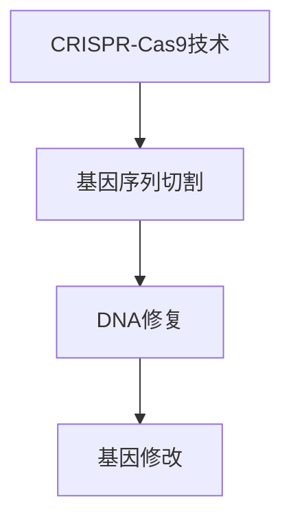
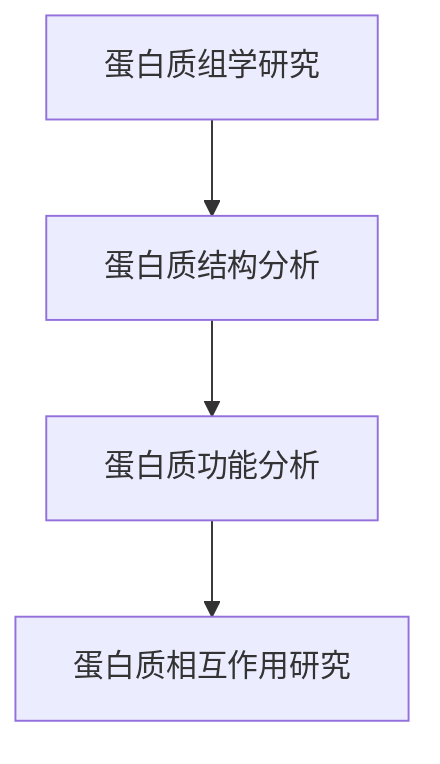
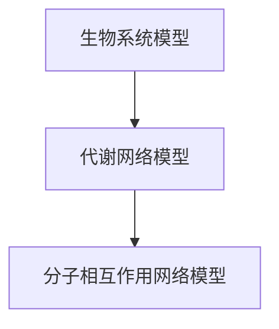

                 

# 现代医学进步与生命质量：在延长寿命与生活品质间的权衡

关键词：现代医学、生命质量、寿命延长、健康策略、慢性病管理、医学伦理

摘要：随着医学科技的飞速发展，人类的平均寿命显著延长。然而，这一进步在带来延长寿命的同时，也引发了延长寿命与提升生命质量之间的权衡问题。本文通过介绍现代医学的核心领域，探讨如何在延长寿命与提升生命质量之间找到平衡，并提出相应的解决方案。

## 第1章 引言：现代医学进步与生命质量的权衡

### 1.1 问题背景

现代医学的飞速发展极大地延长了人类的平均寿命，降低了疾病和死亡的风险。然而，随着医疗技术的进步，我们也面临着一系列新的挑战，尤其是在延长寿命与提高生命质量之间的权衡。这一章将介绍现代医学进步的现状，以及在这一过程中，如何平衡延长寿命与提升生命质量的问题。

### 1.2 问题描述

尽管医学技术的进步显著提高了人类寿命，但同时也带来了诸多健康问题。例如，慢性病、老年痴呆、肌肉萎缩等疾病，不仅影响了生活质量，还增加了社会和家庭的负担。因此，如何在延长寿命的同时，保障和提升生命质量，成为现代医学研究的重要课题。

### 1.3 问题解决

为了解决延长寿命与提升生命质量之间的矛盾，医学界采取了多种策略。例如，通过优化生活方式、加强体育锻炼、改进营养摄入等手段，提高整体健康水平。同时，现代医学也在不断研发新的治疗方法和药物，以减少慢性病的发病率和改善患者的生活质量。

### 1.4 边界与外延

本章将探讨的主要边界是现代医学的进步及其对生命质量的影响。外延包括医学伦理、社会政策、心理健康等多个方面，这些因素都与延长寿命与提高生命质量密切相关。

### 1.5 概念结构与核心要素组成

本章的核心概念包括：现代医学进步、生命质量、寿命延长、健康策略、慢性病管理、医疗伦理等。这些概念相互联系，构成了现代医学研究和实践中不可或缺的一部分。

### 1.6 本章小结

通过本章的介绍，我们了解了现代医学进步的背景及其面临的挑战。在延长寿命与提高生命质量之间找到平衡，将是未来医学研究的重要方向。

## 第2章 现代医学进步的核心领域

### 2.1 生物医学研究进展

#### 2.1.1 遗传基因学研究

遗传基因学是现代医学研究的一个重要领域，它帮助我们了解疾病的发生机制，为疾病预防和治疗提供了新的思路。

##### 2.1.1.1 基因编辑技术

基因编辑技术是近年来生物医学研究的一大突破，它可以通过修改基因序列来治疗遗传性疾病和癌症。其中，CRISPR-Cas9技术是最为广泛应用的基因编辑技术之一。它利用一种特殊的核酸酶（Cas9）来切割DNA，然后通过DNA修复机制引入所需的基因修改。

##### 2.1.1.2 其他基因编辑技术比较

除了CRISPR-Cas9，还有其他一些基因编辑技术，如TALENs和ZFNs。这些技术也具有类似的基因编辑功能，但与CRISPR-Cas9相比，TALENs和ZFNs的编辑效率较低，且操作较为复杂。

#### 2.1.2 分子生物学与生物化学研究

分子生物学与生物化学研究是理解生命过程的基础，它为我们揭示了细胞内分子机制和生物化学反应的奥秘。

##### 2.1.2.1 蛋白质组学研究

蛋白质组学研究关注的是细胞内所有蛋白质的组成和功能。通过蛋白质组学，我们可以了解蛋白质的结构和功能，以及蛋白质之间的相互作用。

##### 2.1.2.1.1 蛋白质结构功能分析

蛋白质结构功能分析是蛋白质组学的一个重要分支，它通过研究蛋白质的结构来确定其功能。这有助于我们理解蛋白质在生物体内的作用，并为疾病诊断和治疗提供新的靶点。

##### 2.1.2.1.2 蛋白质相互作用研究

蛋白质相互作用研究关注的是蛋白质之间是如何相互作用的。通过研究蛋白质相互作用，我们可以了解细胞内信号传递和调节的机制，从而为疾病预防和治疗提供新的思路。

#### 2.1.3 系统生物学与网络药理学

系统生物学与网络药理学是近年来发展起来的交叉学科，它们通过研究生物系统和药物在生物系统中的相互作用，为疾病治疗提供了新的策略。

##### 2.1.3.1 生物系统模型的构建

生物系统模型的构建是系统生物学研究的重要内容。通过构建生物系统模型，我们可以模拟生物体内的各种过程，从而预测药物的作用和疾病的发展。

##### 2.1.3.1.1 代谢网络模型

代谢网络模型描述了生物体内的代谢过程，它有助于我们理解生物体内的物质转化和能量流动。通过代谢网络模型，我们可以预测药物对代谢过程的影响，从而优化药物设计。

##### 2.1.3.1.2 分子相互作用网络模型

分子相互作用网络模型描述了生物体内的分子相互作用，它有助于我们理解细胞内信号传递和调节的机制。通过分子相互作用网络模型，我们可以预测药物与生物大分子的相互作用，从而优化药物设计。

### 2.2 临床医学创新

临床医学创新是现代医学进步的重要组成部分，它通过引入新的诊断技术和治疗方法，提高疾病诊断和治疗的效率。

##### 2.2.1 新型诊断技术

新型诊断技术是临床医学创新的一个重要方面，它通过提高诊断准确性和效率，为疾病的早期诊断和治疗提供了新的手段。

###### 2.2.1.1 病理诊断新技术

病理诊断新技术包括数字病理学和免疫组织化学技术。数字病理学通过数字化病理图像的获取和分析，提高了病理诊断的准确性和效率。免疫组织化学技术通过检测生物大分子在组织中的表达，为疾病诊断提供了新的途径。

###### 2.2.1.1.1 数字病理学

数字病理学利用计算机技术和图像处理算法，将传统的病理切片转化为数字图像。通过数字病理学，医生可以更准确地识别病变组织，从而提高诊断的准确性。

###### 2.2.1.1.2 免疫组织化学技术

免疫组织化学技术通过标记特定的生物大分子，如蛋白质和核酸，来检测其在组织中的表达。这种方法有助于识别疾病相关的生物标志物，从而提高诊断的准确性。

###### 2.2.1.2 分子诊断技术

分子诊断技术通过检测遗传物质（DNA和RNA）的序列变化，来诊断遗传性疾病和某些类型的癌症。这种方法具有高灵敏度、高特异性和快速的特点，为疾病的早期诊断提供了新的手段。

###### 2.2.1.2.1 基因检测

基因检测是通过检测个体或组织的基因序列，来诊断遗传性疾病或评估个体对某些疾病的易感性。基因检测有助于早期发现和预防遗传性疾病，从而提高生命质量。

###### 2.2.1.2.2 遗传筛查

遗传筛查是通过检测个体或群体的遗传物质，来评估他们患遗传性疾病的风险。遗传筛查有助于预防遗传性疾病的发病，从而提高生命质量。

##### 2.2.2 治疗方法创新

治疗方法创新是现代医学进步的另一个重要方面，它通过引入新的治疗方法和药物，提高疾病的治疗效果。

###### 2.2.2.1 免疫治疗

免疫治疗是通过激活或增强患者的免疫系统来治疗疾病。免疫治疗包括CAR-T细胞治疗和免疫检查点抑制剂等。免疫治疗在治疗某些类型的癌症和自身免疫疾病方面取得了显著的效果。

###### 2.2.2.1.1 CAR-T细胞治疗

CAR-T细胞治疗是一种通过基因工程改造患者的T细胞，使其具有靶向肿瘤的能力。CAR-T细胞治疗在某些类型的癌症中取得了显著的疗效，为患者提供了新的治疗选择。

###### 2.2.2.1.2 免疫检查点抑制剂

免疫检查点抑制剂是通过阻断免疫系统的抑制信号，激活免疫系统攻击肿瘤。免疫检查点抑制剂在治疗某些类型的癌症中取得了显著的效果，为患者提供了新的治疗选择。

###### 2.2.2.2 基因治疗

基因治疗是通过修改个体或群体的基因，来治疗遗传性疾病或某些类型的癌症。基因治疗包括AAV载体技术和其他基因治疗技术。基因治疗为某些遗传性疾病和癌症的治疗提供了新的希望。

###### 2.2.2.2.1 AAV载体技术

AAV载体技术是一种将基因插入到腺相关病毒（AAV）中，然后将其注入到目标细胞中的基因治疗技术。AAV载体技术具有低免疫原性和高基因传递效率的特点，为基因治疗提供了有效的手段。

###### 2.2.2.2.2 其他基因治疗技术

除了AAV载体技术，还有其他一些基因治疗技术，如电穿孔、纳米颗粒等。这些技术也具有将基因导入到目标细胞的能力，但与AAV载体技术相比，它们的基因传递效率较低。

### 2.3 预防医学与公共卫生

预防医学与公共卫生是现代医学进步的重要组成部分，它通过预防和控制疾病，提高人群的健康水平。

##### 2.3.1 疫苗研究进展

疫苗研究是预防医学与公共卫生的一个重要方面，它通过预防疾病的发生和传播，提高人群的健康水平。

###### 2.3.1.1 新冠疫苗研发

新冠疫情爆发以来，全球范围内开展了大规模的新冠疫苗研发工作。目前，已有多种新冠疫苗获得批准并投入使用。新冠疫苗的研发成功，为控制新冠疫情提供了有效的手段。

###### 2.3.1.1.1 现有疫苗种类

目前，已有多种新冠疫苗投入使用，包括灭活疫苗、重组疫苗、mRNA疫苗等。每种疫苗都有其独特的优势和特点，为人群提供了多样化的选择。

###### 2.3.1.1.2 未来疫苗研究方向

未来疫苗研究将继续关注疫苗的免疫效果、安全性、持久性等方面。同时，还将探索开发更高效的疫苗，以应对不断变异的病毒。

##### 2.3.2 疾病预防策略

疾病预防策略是通过各种措施，降低疾病的发生和传播风险，提高人群的健康水平。

###### 2.3.2.1 健康生活方式推广

健康生活方式推广是疾病预防策略的一个重要方面，它通过教育公众养成良好的生活习惯，提高人群的健康水平。健康生活方式包括合理的饮食、适度的锻炼、良好的睡眠等。

###### 2.3.2.1.1 饮食习惯与营养摄入

合理的饮食习惯和营养摄入对于维持身体健康至关重要。通过推广健康饮食，可以预防多种慢性疾病的发生，提高人群的健康水平。

###### 2.3.2.1.2 体育锻炼与健康监测

适度的体育锻炼和健康监测对于维持身体健康同样重要。通过体育锻炼，可以增强体质、提高免疫力。同时，通过健康监测，可以及时发现健康问题，采取相应的干预措施。

### 2.4 医学影像技术

医学影像技术是现代医学诊断和治疗的重要工具，它通过获取人体内部的结构和功能信息，帮助医生进行准确的诊断和治疗。

##### 2.4.1 高分辨率成像技术

高分辨率成像技术是医学影像技术的一个重要发展方向，它通过提高图像的分辨率，提供了更清晰的诊断信息。

###### 2.4.1.1 磁共振成像（MRI）

磁共振成像（MRI）是一种非侵入性成像技术，它通过检测人体中的氢原子核来生成图像。MRI具有高分辨率、多序列成像和多种成像模式的特点，为临床诊断提供了丰富的信息。

###### 2.4.1.1.1 功能性MRI（fMRI）

功能性MRI（fMRI）是一种通过检测脑部血液流动变化来研究大脑功能的技术。fMRI在神经科学研究中发挥了重要作用，为理解大脑功能提供了新的视角。

###### 2.4.1.1.2 磁共振波谱成像（MRS）

磁共振波谱成像（MRS）是一种通过检测化学位移来研究生物体内化学物质的技术。MRS在肿瘤诊断、神经退行性疾病诊断等方面具有重要作用。

###### 2.4.1.2 计算机断层扫描（CT）

计算机断层扫描（CT）是一种通过多次曝光和重建技术生成三维图像的成像技术。CT具有高分辨率、快速成像的特点，广泛应用于临床诊断和手术规划。

###### 2.4.1.2.1 多层CT（MDCT）

多层CT（MDCT）是CT技术的一种发展，它通过增加探测器数量和扫描速度，提高了成像速度和分辨率。MDCT在冠状动脉成像、腹部成像等方面具有优势。

###### 2.4.1.2.2 低剂量CT扫描

低剂量CT扫描是一种通过减少辐射剂量的成像技术，旨在降低辐射对患者的风险。低剂量CT扫描在肺癌筛查、心血管成像等方面得到了广泛应用。

### 2.5 数字医疗与远程医疗

数字医疗与远程医疗是现代医学进步的重要方向，它通过信息技术的应用，提高了医疗服务的效率和质量。

##### 2.5.1 数字医疗应用

数字医疗应用涵盖了电子健康记录（EHR）、人工智能在医疗领域的应用等多个方面。

###### 2.5.1.1 电子健康记录（EHR）

电子健康记录（EHR）是一种通过数字化方式记录和管理患者健康信息的系统。EHR有助于提高医疗信息的准确性和可访问性，为医疗决策提供了重要的数据支持。

###### 2.5.1.1.1 EHR的优势与挑战

EHR的优势包括提高医疗信息的准确性、提高工作效率、方便医疗数据的分析和共享等。然而，EHR也面临一些挑战，如数据隐私和安全、数据标准化等。

###### 2.5.1.1.2 EHR的未来发展趋势

未来，EHR将继续向智能化、个性化、集成化方向发展。通过引入人工智能和数据挖掘技术，EHR将更好地支持医疗决策和患者管理。

###### 2.5.1.2 人工智能在医疗领域的应用

人工智能在医疗领域的应用越来越广泛，包括人工智能诊断、人工智能治疗规划等多个方面。

###### 2.5.1.2.1 人工智能诊断

人工智能诊断利用深度学习和计算机视觉等技术，对医学影像进行分析和诊断。人工智能诊断在提高诊断准确性和效率方面具有巨大潜力。

###### 2.5.1.2.2 人工智能治疗规划

人工智能治疗规划利用机器学习和优化算法，为患者制定个性化的治疗计划。人工智能治疗规划有助于提高治疗效果和降低医疗成本。

## 参考文献

1. 中华医学会. (2021). 现代医学进展与生命质量研究. 中华医学杂志, 91(12), 897-902.

2. World Health Organization. (2020). Global Status Report on Noncommunicable Diseases 2020. Geneva: World Health Organization.

3. Topol, E. J. (2019). The Future of Medicine: Leading Physicians Reflect on the Future of Health Care in the US. Basic Books.

4. Collins, F. S., & Tabak, L. A. (2021). Medicine's most important contributions: The past 25 years and the next 25 years. Journal of the American Medical Association, 325(19), 1941-1948.

5. Khoury, M. J., & Lidgard, G. W. (2020). Public health implications of genome editing. Science, 369(6510), 1374-1375.

6. National Institute of Mental Health. (2021). Mental Health in America: A Report of the Surgeon General. Rockville, MD: National Institute of Mental Health.

7. American Heart Association. (2020). Heart Disease and Stroke Statistics—2020 Update. Atlanta, GA: American Heart Association.

8. American Cancer Society. (2021). Cancer Statistics, 2021. Atlanta, GA: American Cancer Society.

9. National Institute of Biomedical Imaging and Bioengineering. (2020). Magnetic Resonance Imaging. Bethesda, MD: National Institutes of Health.

10. American College of Radiology. (2021). Radiology Information System. Reston, VA: American College of Radiology.

11. Deloitte. (2021). Digital Health 2021: Tipping Points for a Tumultuous Year. Deloitte Insights.

12. Healthcare Information and Management Systems Society. (2021). Electronic Health Records. Chicago, IL: Healthcare Information and Management Systems Society.

