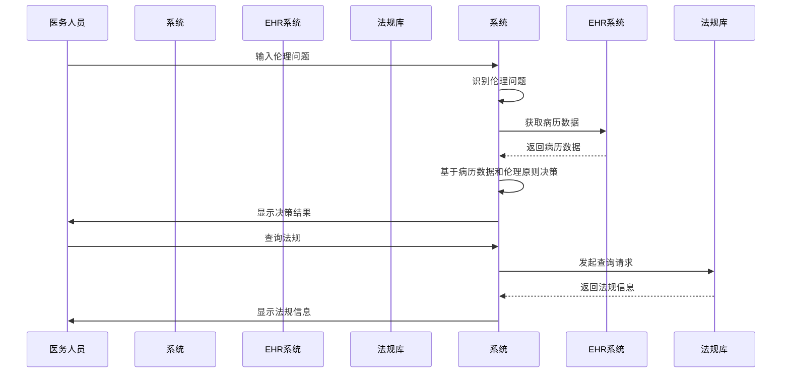

                 

## 第1章 引言：现代医疗伦理的挑战与意义

### 1.1 问题背景与引言

随着科技的迅猛发展，医学领域迎来了前所未有的变革。从基因编辑到人工智能辅助诊断，再到医疗数据隐私保护，医疗技术的进步为人类健康带来了诸多福祉。然而，这些技术同时也引发了新的伦理问题，医疗伦理面临着前所未有的挑战。

基因编辑技术，如CRISPR-Cas9，使得科学家能够在DNA水平上进行精确的修改，为治疗遗传性疾病带来了希望。然而，这一技术的应用也引发了关于“设计婴儿”、伦理底线等道德争议。

人工智能在医疗诊断中的应用，大大提高了诊断的准确性和效率，但同时也引发了数据隐私、AI决策透明性等问题。如何在保障患者权益的同时，合理利用AI技术，成为了医疗伦理领域的一个重要议题。

医疗数据的隐私保护，更是随着大数据和云计算技术的发展，成为了医疗伦理中的热点问题。如何平衡数据共享与个人隐私保护，成为医疗行业面临的重大挑战。

### 1.2 医疗伦理的基本原则

在探讨医疗伦理的挑战之前，我们首先需要了解医疗伦理的基本原则。医疗伦理的基本原则包括：

- **尊重患者自主权**：患者有权了解自己的病情、治疗选择以及相应的风险和收益。
- **不伤害原则**：医务人员应当避免对患者造成不必要的伤害。
- **善行原则**：医务人员应当尽力帮助患者恢复健康，提供最佳的治疗方案。
- **公正原则**：医疗资源应当公平分配，确保所有患者都能获得必要的医疗服务。

### 1.3 医疗伦理的重要性

医疗伦理的重要性不言而喻。它不仅关系到患者的身心健康，也关系到医疗行业的健康发展。良好的医疗伦理可以：

- **提高医疗质量**：通过伦理指导，医务人员能够提供更加专业、规范的治疗，从而提高医疗质量。
- **保护患者权益**：尊重患者的自主权、隐私权等基本权益，保障患者的权益不受侵害。
- **增强医患关系**：良好的医疗伦理有助于建立信任和尊重的医患关系，减少医患矛盾。
- **促进医学进步**：医疗伦理为医学研究提供了道德指导，确保医学研究在道德框架内进行，从而推动医学进步。

### 1.4 问题解决与边界与外延

在技术可能与道德允许之间找到平衡，是当前医疗伦理的核心任务。为了解决这一难题，我们需要从以下几个方面着手：

- **加强医疗伦理教育**：提高医务人员和公众的伦理素养，增强道德判断力。
- **完善法律法规**：制定更加完善的医疗伦理法规，为医疗实践提供明确的法律指导。
- **建立伦理决策模型**：通过算法和数学模型，帮助医务人员在复杂伦理决策中找到最优解。

在讨论医疗伦理时，我们还需明确其边界与外延。这包括但不限于：

- **基因编辑**：涉及人类胚胎的基因编辑、人类基因组编辑等。
- **人工智能辅助诊断**：涉及AI算法的透明性、数据隐私等问题。
- **医疗数据隐私**：涉及患者个人数据的收集、存储、使用和保护。

### 1.5 概念结构与核心要素组成

为了更深入地探讨医疗伦理的挑战，我们需要了解其概念结构和核心要素组成。这包括：

- **医疗伦理原则**：尊重患者自主权、不伤害原则、善行原则、公正原则等。
- **法律框架**：医疗伦理法规、隐私保护法律等。
- **道德决策模型**：伦理决策算法、伦理决策框架等。

### 总结

本章作为全文的引言，为我们后续的探讨奠定了基础。从问题背景、基本原则、重要性到问题解决与边界与外延，我们逐步揭示了现代医疗伦理的复杂性和挑战。接下来，我们将深入探讨基因编辑、人工智能辅助诊断和医疗数据隐私等具体领域的伦理问题，为找到技术可能与道德允许之间的平衡提供深入分析和解决方案。

关键词：医疗伦理、基因编辑、人工智能、医疗数据隐私、伦理决策

摘要：本文旨在探讨现代医疗伦理在基因编辑、人工智能辅助诊断和医疗数据隐私等领域的挑战，通过分析医疗伦理的基本原则、法律框架和道德决策模型，提出解决方案，以找到技术可能与道德允许之间的平衡。

----------------------------------------------------------------

## 第2章 基因编辑伦理

### 2.1 基因编辑概述

基因编辑技术，如CRISPR-Cas9，是现代生物技术的重要突破。CRISPR（Clustered Regularly Interspaced Short Palindromic Repeats）是一种原核生物中的免疫系统，用于抵御外来基因的入侵。Cas9是一种蛋白质，能够识别并切割特定的DNA序列。通过改造Cas9蛋白的识别序列，科学家可以将CRISPR-Cas9技术用于特定的基因编辑任务。

基因编辑的基本原理是通过引导Cas9蛋白到目标DNA序列，进行切割，从而实现对目标基因的修改。这种技术可以用于多种应用，包括治疗遗传性疾病、增强作物抗病性、研究基因功能等。

### 2.2 基因编辑的伦理争议

尽管基因编辑技术在医学和生物技术领域具有巨大潜力，但其应用也引发了广泛的伦理争议。

#### 2.2.1 设计婴儿

设计婴儿是基因编辑应用中最为争议的议题之一。设计婴儿指的是通过基因编辑技术，选择性地修改胚胎的基因，以达到特定的性状，如智力、身高、肤色等。这种做法引发了关于人类尊严、自然进化过程和基因差异的伦理争议。

- **人类尊严**：设计婴儿可能导致人类对自身的自然属性产生误解，影响人类对自身尊严的认知。
- **自然进化过程**：基因编辑可能改变自然进化的过程，对人类未来产生不可预测的影响。
- **基因差异**：设计婴儿可能导致基因差异扩大，加剧社会不平等。

#### 2.2.2 伦理底线

基因编辑技术的应用还引发了关于伦理底线的争议。一些人认为，基因编辑应该仅限于治疗遗传性疾病，而不应用于改变人类的基本特征。然而，另一些人则认为，只要技术可行且不违反道德原则，基因编辑可以应用于任何领域。

#### 2.2.3 基因编辑的不确定性和风险

基因编辑的不确定性和风险也是伦理争议的一个重要方面。基因编辑可能会引起意外的副作用，甚至导致不可逆的健康问题。此外，基因编辑的成功率和稳定性也尚未完全确定。

### 2.3 基因编辑的法律框架

为了规范基因编辑技术的应用，许多国家和地区已经制定了相关的法律框架。

#### 2.3.1 国际法律框架

联合国教科文组织于2015年通过了《人类基因组编辑的国际准则》，该准则强调对基因编辑技术的严格监管，并禁止在人类胚胎上进行基因编辑。

#### 2.3.2 国家法律框架

中国于2019年通过了《基因编辑技术安全性评价指南》，对基因编辑技术的应用进行了严格的规定。美国则通过《生物安全法》和《人类基因组编辑监管框架》等法律文件，对基因编辑技术进行了监管。

#### 2.3.3 法律框架的不足

尽管已有法律框架，但其在实际应用中仍存在一定的不足。例如，一些法律可能过于严格，限制了基因编辑技术在医学领域的应用；而另一些法律则可能过于宽松，无法有效防止滥用。

### 2.4 基因编辑伦理案例分析

#### 2.4.1 中国的案例

2018年，中国科学家贺建奎声称成功利用CRISPR-Cas9技术编辑了两个胚胎的基因，使其具备对艾滋病免疫的能力。这一事件引发了全球的伦理争议和法律挑战。

- **伦理争议**：这一案例引发了关于设计婴儿和伦理底线的广泛讨论。许多人认为，这一行为违反了人类尊严和自然进化原则。
- **法律挑战**：这一案例也引发了关于法律框架的争议。一些人认为，中国的法律框架过于宽松，未能有效防止滥用。

#### 2.4.2 美国的案例

2019年，美国一家初创公司 Editas Medicine 宣布成功利用CRISPR-Cas9技术治疗了一名患有罕见遗传性视网膜疾病的患者。这一案例展示了基因编辑技术在医学治疗中的潜力。

- **医学价值**：这一案例展示了基因编辑技术在治疗遗传性疾病方面的巨大潜力。
- **伦理挑战**：这一案例也引发了关于伦理决策和法律框架的讨论。如何在保障医学进步的同时，确保伦理合规，成为了医疗伦理领域的一个重要议题。

### 总结

基因编辑技术作为一项新兴技术，具有巨大的医学和科学潜力。然而，其应用也带来了诸多伦理争议和法律挑战。如何平衡技术应用与伦理合规，确保基因编辑技术在医学和生物技术领域的可持续发展，是当前医疗伦理领域面临的一个重要课题。通过深入探讨基因编辑的伦理争议、法律框架和案例分析，我们可以更好地理解这一领域的复杂性和挑战，为未来的发展提供有益的指导。

----------------------------------------------------------------

## 第3章 人工智能辅助诊断伦理

### 3.1 人工智能辅助诊断概述

人工智能（AI）在医疗领域的应用已经取得了显著的进展，特别是在辅助诊断方面。AI辅助诊断利用机器学习和深度学习算法，通过对大量医疗数据的学习和处理，帮助医生进行疾病诊断、治疗方案制定和患者管理。这种技术的核心在于其能够处理和分析大规模、复杂的数据集，从而提供更加精准和高效的诊断结果。

AI辅助诊断的主要形式包括：

- **图像分析**：利用AI技术对医学影像（如X光、CT、MRI等）进行自动分析，识别病变区域和病理特征。
- **文本分析**：通过自然语言处理（NLP）技术，对病历记录、临床报告等进行自动分析和解读。
- **预测模型**：基于历史数据和统计模型，预测患者的疾病发展、治疗反应和康复概率。

### 3.2 AI诊断的伦理挑战

尽管AI辅助诊断技术在提高诊断准确性和效率方面具有巨大潜力，但其应用也带来了诸多伦理挑战。

#### 3.2.1 数据隐私

AI诊断依赖于大量的医疗数据，包括患者的病史、基因信息、生活习惯等。这些数据的收集、存储和使用涉及隐私问题。如何在保障数据隐私的同时，充分利用这些数据，成为了医疗伦理中的一个重要议题。

- **数据收集**：如何确保患者在数据收集过程中的知情权和同意权。
- **数据存储**：如何确保数据的安全和保密，防止数据泄露和滥用。
- **数据共享**：如何平衡数据共享与隐私保护，促进医疗资源的共享和利用。

#### 3.2.2 AI算法的透明性

AI诊断的核心是算法，但其复杂性和黑箱特性使得人们难以理解其决策过程。这种不透明性引发了关于算法公正性、可靠性和责任归属的伦理争议。

- **算法公正性**：AI诊断结果是否公正、无偏见，是否能够避免性别、种族、社会经济地位等歧视。
- **算法可靠性**：AI诊断的准确性是否可靠，是否能够替代医生的诊断。
- **责任归属**：在AI诊断过程中，如果出现诊断错误或不良后果，责任应如何归属。

#### 3.2.3 AI对医生职业的影响

AI辅助诊断技术的广泛应用可能对医生的职业产生深远影响。一方面，AI技术可以提高医生的诊断准确性和效率，减轻工作负担；另一方面，AI技术也可能导致医生的职位减少，影响医生的职业发展。

- **职业角色转变**：医生可能需要更多地依赖AI技术进行诊断，从而改变传统的医生角色。
- **技能要求提高**：医生需要掌握更多的AI知识和技能，以更好地利用AI技术为患者提供高质量的服务。
- **职业前景担忧**：医生可能担心AI技术的发展将导致自己的职位被替代。

### 3.3 AI诊断的法律与道德框架

为了规范AI诊断技术的应用，许多国家和地区已经制定了相关的法律和道德框架。

#### 3.3.1 法律框架

- **数据保护法律**：如《通用数据保护条例》（GDPR）和《加州消费者隐私法案》（CCPA）等，对医疗数据的收集、存储和使用进行了严格的规定。
- **医疗设备法规**：如美国的《联邦食品、药物和化妆品法》和欧盟的《医疗器械法规》等，对AI诊断设备的监管提供了法律依据。
- **职业责任法**：医生在应用AI诊断技术时，需遵守相关的职业责任法律，确保诊断的准确性和安全性。

#### 3.3.2 道德框架

- **伦理指导原则**：如《医学伦理学基本原则》（Medical Ethics Principles）和《人工智能伦理指南》（AI Ethics Guidelines）等，为AI诊断的应用提供了道德指导。
- **透明性和责任**：要求AI诊断技术的开发者和使用者明确算法的决策过程，确保透明性，并在出现问题时明确责任归属。

### 3.4 AI诊断伦理案例分析

#### 3.4.1 美国的案例

2018年，美国一家初创公司AliveCor开发了一款名为KardiaMobile的AI辅助诊断设备，能够通过手机应用程序分析心电图（ECG）数据，帮助诊断心律不齐等心脏疾病。这一案例展示了AI诊断技术在临床应用中的潜力。

- **医学价值**：KardiaMobile的上市为心律不齐患者提供了便捷的诊断工具，提高了诊断的准确性和效率。
- **伦理挑战**：这一案例也引发了关于数据隐私、算法透明性和责任归属的伦理争议。如何确保设备的数据安全、算法透明，并在出现问题时明确责任归属，成为了医疗伦理领域的重要议题。

#### 3.4.2 中国的案例

2020年，中国一家公司宣布成功开发了一款AI辅助诊断系统，能够通过分析医学影像数据，帮助医生诊断肺癌、乳腺癌等疾病。这一案例展示了AI诊断技术在提高诊断准确率和效率方面的潜力。

- **医学价值**：AI辅助诊断系统的应用有望提高肺癌、乳腺癌等疾病的早期诊断率，提高患者的生存率。
- **伦理挑战**：这一案例也引发了关于数据隐私、算法透明性和责任归属的伦理争议。如何在保障数据隐私的同时，确保算法透明性和责任归属，成为了医疗伦理领域的重要议题。

### 总结

人工智能辅助诊断技术在提高诊断准确率和效率方面具有巨大潜力，但其应用也带来了诸多伦理挑战。如何平衡技术应用与伦理合规，确保AI诊断技术在医学领域的可持续发展，是当前医疗伦理领域面临的一个重要课题。通过深入探讨AI诊断的伦理挑战、法律与道德框架和案例分析，我们可以更好地理解这一领域的复杂性和挑战，为未来的发展提供有益的指导。

关键词：人工智能、辅助诊断、伦理挑战、数据隐私、算法透明性

摘要：本章旨在探讨人工智能辅助诊断技术的伦理挑战，包括数据隐私、算法透明性和对医生职业的影响。通过分析法律与道德框架和案例分析，本文旨在提出解决方案，以确保AI诊断技术在医学领域的可持续发展。

----------------------------------------------------------------

## 第4章 医疗数据隐私伦理

### 4.1 医疗数据隐私概述

医疗数据隐私是医疗伦理中的一个关键议题。医疗数据包括患者的个人信息、健康状况、治疗历史、药物使用记录等，这些数据对于医疗诊断和治疗至关重要。然而，医疗数据也极具敏感性，泄露或滥用可能导致严重后果，包括个人隐私侵犯、身份盗窃、歧视等。

#### 医疗数据隐私的重要性

医疗数据隐私的重要性体现在以下几个方面：

- **保护患者权益**：患者的个人信息和健康数据是隐私的重要组成部分，保护这些数据是尊重患者自主权和隐私权的体现。
- **保障医疗质量**：医疗数据的准确性、完整性和保密性对于确保医疗质量至关重要。数据泄露或滥用可能导致诊断错误或治疗失败。
- **促进医疗创新**：医疗数据的共享和利用有助于推动医疗研究和创新。然而，只有在确保数据隐私的前提下，医疗创新才能真正实现。

#### 医疗数据隐私的现状

当前，医疗数据隐私面临着多重挑战：

- **数据泄露事件频发**：随着医疗信息化的发展，医疗数据泄露事件频发。例如，2021年，美国一家大型保险公司Anthem遭受了大规模数据泄露，涉及约1.01亿人的个人信息。
- **数据滥用现象普遍**：医疗数据被用于商业目的、市场营销等，有时甚至涉及非法交易。例如，一些医疗数据被非法出售，用于保险欺诈等。
- **法律法规不健全**：尽管许多国家和地区已经制定了数据保护法律法规，但实际执行中仍存在不足。例如，一些法律可能过于宽松，未能有效防止数据滥用。

### 4.2 数据隐私伦理争议

医疗数据隐私的应用引发了诸多伦理争议，主要包括以下几个方面：

#### 4.2.1 数据收集与知情同意

医疗数据的收集通常需要患者的知情同意。然而，在实际情况中，患者往往对数据收集的目的、范围和用途知之甚少。这种知情同意的缺失引发了关于患者权益的争议。

- **知情同意的真实性**：一些患者可能因为缺乏医学知识或经济压力，被迫或被迫同意数据收集。
- **知情同意的范围**：一些数据收集活动可能超出患者的预期，例如，收集基因数据或行为数据。

#### 4.2.2 数据共享与隐私保护

医疗数据的共享对于医疗研究和公共卫生管理具有重要意义。然而，数据共享也带来了隐私保护的问题。

- **数据泄露风险**：数据共享可能导致数据泄露，尤其是在数据存储、传输和处理过程中。
- **隐私保护机制**：如何在确保数据共享的同时，有效保护个人隐私，成为医疗伦理的重要议题。

#### 4.2.3 数据使用与责任归属

医疗数据的使用涉及多个方面，包括科研、公共卫生、商业等。在使用过程中，责任归属问题常常引发争议。

- **科研伦理**：在医疗数据用于科研时，如何确保数据的安全和隐私保护，防止数据滥用。
- **商业应用**：医疗数据的商业应用，如保险定价、药物研发等，可能导致数据被用于不当目的，引发伦理争议。

### 4.3 数据隐私法律框架

为了规范医疗数据隐私的保护，许多国家和地区已经制定了相关法律法规。

#### 4.3.1 国际法律框架

- **《通用数据保护条例》（GDPR）**：欧盟制定的GDPR是世界上最严格的数据保护法律之一，对医疗数据隐私保护提供了全面的法律框架。
- **《加州消费者隐私法案》（CCPA）**：美国加州的CCPA对个人数据的收集、存储和使用进行了严格规定，对医疗数据隐私保护提供了重要指导。

#### 4.3.2 国家法律框架

- **中国**：《中华人民共和国网络安全法》和《中华人民共和国个人信息保护法》等法律法规，对医疗数据隐私保护提出了基本要求。
- **美国**：《健康保险可携性和责任法案》（HIPAA）对医疗数据隐私保护提供了详细的法律规定。

#### 4.3.3 法律框架的不足

尽管已有相关法律法规，但其在实际应用中仍存在一些不足：

- **执行力度不足**：一些法律法规在执行过程中可能存在不足，导致数据泄露和滥用的现象仍然普遍存在。
- **跨国合作不足**：在全球化的背景下，跨国医疗数据隐私保护需要跨国合作，但当前的法律框架尚不足以应对跨国数据流动和隐私保护挑战。

### 4.4 医疗数据隐私伦理案例分析

#### 4.4.1 美国的案例

2017年，美国一家医疗机构Anthem遭受了大规模数据泄露，涉及约1.01亿人的个人信息。这一事件引发了关于医疗数据隐私保护的法律和伦理争议。

- **法律争议**：Anthem未能有效保护患者数据，违反了HIPAA等法律法规。美国联邦贸易委员会（FTC）对Anthem进行了罚款。
- **伦理争议**：这一事件引发了关于医疗数据隐私保护的伦理争议。如何在保障数据共享与隐私保护之间找到平衡，成为医疗伦理领域的重要议题。

#### 4.4.2 中国的案例

2018年，中国一家医疗科技公司泄露了数百万患者的个人信息。这一事件引发了关于医疗数据隐私保护的广泛关注。

- **法律争议**：这一事件暴露了中国在医疗数据隐私保护方面的法律法规不足。中国政府随后加强了对医疗数据隐私保护的法律法规建设。
- **伦理争议**：这一事件引发了关于医疗数据隐私保护的伦理争议。如何在技术进步和隐私保护之间找到平衡，成为医疗伦理领域的重要议题。

### 总结

医疗数据隐私是医疗伦理中的一个关键议题，其重要性不言而喻。然而，医疗数据隐私的应用也引发了诸多伦理争议。通过分析医疗数据隐私的现状、伦理争议和法律框架，以及实际案例，我们可以更好地理解医疗数据隐私伦理的复杂性。如何在技术进步和隐私保护之间找到平衡，是医疗伦理领域面临的重要挑战。通过不断改进法律法规、加强技术手段和提升伦理素养，我们可以更好地保障医疗数据隐私，促进医疗行业的健康发展。

关键词：医疗数据隐私、伦理争议、法律框架、数据保护

摘要：本章旨在探讨医疗数据隐私伦理，分析其现状、伦理争议和法律框架。通过案例分析，本文旨在提出解决方案，以保障医疗数据隐私，促进医疗行业的健康发展。

----------------------------------------------------------------

## 第5章 医疗伦理决策模型

### 5.1 医疗伦理决策模型概述

在医疗伦理领域，伦理决策模型是一种用于帮助医务人员和决策者在复杂伦理情境中做出合理决策的工具。这些模型结合伦理原则、临床实践和患者需求，提供了一种系统化、规范化的决策过程。

#### 医疗伦理决策模型的重要性

医疗伦理决策模型的重要性体现在以下几个方面：

- **提高决策质量**：通过系统化的决策过程，医疗伦理决策模型有助于减少决策的盲目性和主观性，提高决策的准确性和合理性。
- **保障患者权益**：医疗伦理决策模型强调尊重患者自主权、保护患者隐私和减轻患者负担，从而更好地保障患者权益。
- **促进医患沟通**：医疗伦理决策模型提供了一种明确的沟通框架，有助于医务人员与患者及其家属就治疗方案和伦理问题进行有效沟通。
- **规范医疗行为**：医疗伦理决策模型为医疗实践提供了伦理指导，有助于规范医务人员的行为，减少伦理纠纷和医疗失误。

#### 医疗伦理决策模型的基本原理

医疗伦理决策模型通常基于以下基本原则：

- **尊重原则**：尊重患者的自主权，确保患者能够在充分知情的情况下做出决策。
- **不伤害原则**：在医疗实践中避免对患者造成不必要的伤害，确保医疗行为的合理性和必要性。
- **善行原则**：尽力为患者提供最佳的医疗服务，促进患者的健康和福祉。
- **公正原则**：公平分配医疗资源，确保所有患者都能获得必要的医疗服务。

### 5.2 常见伦理决策模型

在医疗伦理领域，存在多种常见的伦理决策模型，每种模型都有其独特的特点和适用场景。以下介绍几种常见的伦理决策模型：

#### 5.2.1 四原则模型

四原则模型是最为广泛应用的伦理决策模型之一，包括以下四个原则：

- **尊重自主权**：尊重患者的自主权，确保患者能够在充分知情的情况下做出决策。
- **不伤害**：避免对患者造成不必要的伤害，确保医疗行为的合理性和必要性。
- **善行**：尽力为患者提供最佳的医疗服务，促进患者的健康和福祉。
- **公正**：公平分配医疗资源，确保所有患者都能获得必要的医疗服务。

#### 5.2.2 盖革-拉法尔格模型

盖革-拉法尔格模型是一种基于道德责任和伦理原则的决策模型，强调道德责任在伦理决策中的重要性。该模型包括以下原则：

- **道德责任**：医务人员有责任遵守伦理原则，确保医疗行为符合道德标准。
- **合理期望**：医务人员应根据患者的合理期望提供医疗服务。
- **伦理决策**：医务人员应基于伦理原则和道德责任做出决策。
- **公开透明**：医务人员应公开透明地与患者及其家属沟通，确保决策过程的公正和透明。

#### 5.2.3 克里夫兰模型

克里夫兰模型是一种基于伦理原则和临床实践的决策模型，强调在伦理决策中综合考虑患者的利益、医务人员的利益和社会利益。该模型包括以下步骤：

- **识别问题**：明确伦理决策的背景和问题。
- **伦理原则**：应用伦理原则分析问题，确定关键伦理原则。
- **临床实践**：考虑临床实践中的实际情况，权衡不同方案的利弊。
- **伦理决策**：基于伦理原则和临床实践做出决策，并确保决策符合患者的利益。
- **监督反馈**：对决策进行监督和反馈，确保决策的有效性和公正性。

### 5.3 医疗伦理决策模型案例分析

#### 5.3.1 案例背景

张女士是一位65岁的老年人，患有严重的慢性阻塞性肺病（COPD）。她最近因为病情恶化住院治疗，医生建议进行手术以改善呼吸功能。然而，手术风险较高，且可能存在后遗症。

#### 5.3.2 案例分析

在张女士的案例中，医务人员需要应用医疗伦理决策模型，以确保决策的合理性和公正性。

- **四原则模型**：首先，医务人员需要尊重张女士的自主权，确保她能够在充分知情的情况下做出决策。其次，医务人员需要评估手术的必要性和风险，确保不造成不必要的伤害。然后，医务人员需要考虑手术对张女士的健康和福祉的影响，尽力提供最佳的医疗服务。最后，医务人员需要确保医疗资源的公平分配，确保所有患者都能获得必要的医疗服务。
- **盖革-拉法尔格模型**：医务人员需要明确自己的道德责任，确保医疗行为符合道德标准。同时，医务人员需要考虑张女士的合理期望，确保手术方案符合她的期望。在伦理决策过程中，医务人员需要公开透明地与张女士及其家属沟通，确保决策过程的公正和透明。
- **克里夫兰模型**：医务人员首先需要识别决策的背景和问题，即张女士是否适合进行手术。然后，医务人员需要应用伦理原则（如尊重、不伤害、善行、公正）分析问题，权衡不同方案的利弊。在做出决策后，医务人员需要监督决策的实施，确保决策的有效性和公正性。

### 总结

医疗伦理决策模型是医疗伦理实践中的重要工具，有助于医务人员和决策者在复杂伦理情境中做出合理决策。常见的伦理决策模型包括四原则模型、盖革-拉法尔格模型和克里夫兰模型。通过应用这些模型，医务人员可以在尊重患者权益、保障医疗质量和规范医疗行为方面发挥重要作用。案例分析展示了如何在实际应用中应用这些伦理决策模型，为医疗伦理实践提供了有益的指导。

关键词：医疗伦理决策、四原则模型、盖革-拉法尔格模型、克里夫兰模型

摘要：本章旨在探讨医疗伦理决策模型的重要性及其在实践中的应用。通过介绍常见的伦理决策模型，本文旨在提供一种系统化的决策框架，以帮助医务人员在复杂伦理情境中做出合理决策。

----------------------------------------------------------------

## 第6章 医疗伦理与法律框架

### 6.1 医疗伦理与法律的关系

医疗伦理与法律之间存在着密切的关系。医疗伦理主要关注医务人员在医疗实践中的道德行为和责任，而法律则通过立法和司法实践对医疗行为进行规范和约束。两者在医疗实践中相互补充，共同保障患者的权益和社会的公共利益。

#### 6.1.1 医疗伦理对法律的影响

医疗伦理对法律的影响主要体现在以下几个方面：

- **立法指导**：医疗伦理原则为立法提供了道德基础和指导，确保法律在制定过程中能够兼顾道德原则和实际需求。
- **司法参考**：医疗伦理原则在司法实践中被广泛应用，作为法官和律师判断医疗行为合法性和合理性的重要依据。
- **医患关系**：医疗伦理原则有助于建立良好的医患关系，增强患者的信任感和满意度，从而提高医疗服务的质量和效率。

#### 6.1.2 法律对医疗伦理的影响

法律对医疗伦理的影响同样重要，具体体现在以下几个方面：

- **规范医疗行为**：法律通过立法和执法，规范医务人员的医疗行为，确保医疗服务的安全、合法和公正。
- **保护患者权益**：法律规定了患者的权利和权益，如知情同意权、隐私权、自主权等，保障患者在医疗过程中的合法权益。
- **法律责任**：法律规定了医务人员的法律责任，明确医务人员的责任和义务，确保医疗行为的合理性和规范性。

### 6.2 主要国家的医疗伦理法律框架

不同国家和地区根据其文化背景、法律体系和医疗体制，制定了不同的医疗伦理法律框架。以下介绍几个主要国家的医疗伦理法律框架：

#### 6.2.1 美国

美国的医疗伦理法律框架主要由以下几个法案构成：

- **《联邦食品、药物和化妆品法》**：该法案规定了食品、药物和化妆品的生产、销售和广告的标准，确保医疗产品的安全和有效性。
- **《健康保险可携性和责任法案》（HIPAA）**：该法案规定了患者的隐私保护和医疗信息的共享，确保医疗信息的保密性和安全性。
- **《医学研究伦理审查法案》**：该法案规定了医学研究的伦理审查制度，确保医学研究在道德框架内进行。

#### 6.2.2 欧盟

欧盟的医疗伦理法律框架主要由以下几个法规构成：

- **《欧盟生物技术法规》**：该法规规定了生物技术的研发、生产和应用，确保生物技术的安全和伦理性。
- **《欧盟医疗设备法规》**：该法规规定了医疗设备的设计、生产和销售，确保医疗设备的安全和有效性。
- **《欧盟数据保护条例》（GDPR）**：该条例规定了个人数据的收集、存储和使用，确保个人数据的隐私保护和信息安全。

#### 6.2.3 中国

中国的医疗伦理法律框架主要由以下几个法律和法规构成：

- **《中华人民共和国宪法》**：宪法规定了公民的健康权利和医疗服务的原则，为医疗伦理和法律提供了基本依据。
- **《中华人民共和国医师法》**：该法规定了医师的职业道德和行为规范，确保医师在医疗实践中的合法性和规范性。
- **《中华人民共和国医疗纠纷预防和处理条例》**：该条例规定了医疗纠纷的预防和处理机制，保障医患关系的和谐和社会稳定。

### 6.3 国际医疗伦理法律框架

在国际层面，多个国际组织和机构制定了医疗伦理法律框架，为全球医疗伦理和法律提供了指导和支持。以下介绍几个主要的国际医疗伦理法律框架：

#### 6.3.1 世界卫生组织（WHO）

世界卫生组织（WHO）发布了多个关于医疗伦理和法律的重要文件，包括：

- **《世界医学协会赫尔辛基宣言》**：该宣言规定了医学研究的伦理原则，确保医学研究在道德框架内进行。
- **《世界卫生组织医学伦理准则》**：该准则规定了医务人员在医疗实践中的道德行为和责任。
- **《世界卫生组织全球健康治理伦理框架》**：该框架规定了全球健康治理中的伦理原则和行动指南。

#### 6.3.2 国际红十字会

国际红十字会（ICRC）制定了《红十字国际法原则》，该原则规定了在医疗实践中应遵循的伦理和法律原则，包括人道主义、公正、尊重等。

#### 6.3.3 国际医学科学组织委员会（CIOMS）

国际医学科学组织委员会（CIOMS）发布了多个关于医学研究的伦理准则，如《医学研究伦理审查准则》、《医学研究数据管理准则》等，为医学研究提供了伦理和法律指导。

### 6.4 法律框架下的医疗伦理决策

在医疗实践中，法律框架为医疗伦理决策提供了重要的指导和支持。以下从几个方面探讨法律框架下的医疗伦理决策：

#### 6.4.1 知情同意

知情同意是医疗伦理和法律的重要组成部分。医务人员在实施医疗行为前，必须确保患者充分了解治疗的风险、收益和替代方案，并在自愿和知情的情况下签署同意书。

#### 6.4.2 隐私保护

隐私保护是医疗伦理和法律的重要议题。法律要求医务人员在收集、存储和使用患者信息时，必须采取严格的安全措施，确保患者信息的保密性和安全性。

#### 6.4.3 责任归属

在医疗实践中，如果发生医疗事故或纠纷，法律框架为责任归属提供了明确的规定。医务人员必须遵守法律法规，确保医疗行为的合法性和规范性，以避免法律风险。

#### 6.4.4 公平分配

公平分配是医疗伦理和法律的基本原则之一。医务人员在分配医疗资源时，必须遵循公平、公正的原则，确保所有患者都能获得必要的医疗服务。

### 总结

医疗伦理与法律框架在医疗实践中相互补充，共同保障患者的权益和社会的公共利益。不同国家和地区的医疗伦理法律框架具有各自的特点，但都遵循一些共同的原则，如尊重患者自主权、保护患者隐私、确保医疗质量和公平分配医疗资源等。通过了解和遵循这些法律框架，医务人员可以在医疗实践中做出符合伦理和法律要求的决策，为患者提供高质量、高效率的医疗服务。

关键词：医疗伦理、法律框架、知情同意、隐私保护、责任归属

摘要：本章旨在探讨医疗伦理与法律框架的关系，介绍主要国家的医疗伦理法律框架，分析法律框架下的医疗伦理决策。通过本章的探讨，旨在为医疗实践提供伦理和法律指导，确保医疗行为的合法性和规范性。

----------------------------------------------------------------

## 第7章 医疗伦理教育与实践

### 7.1 医疗伦理教育的重要性

医疗伦理教育在医疗行业的可持续发展中扮演着至关重要的角色。其重要性体现在以下几个方面：

- **提高医务人员道德素养**：医疗伦理教育帮助医务人员树立正确的道德观念和价值观，提高其道德判断力和责任感，从而在医疗实践中更好地履行职业道德。
- **增强医患信任**：通过医疗伦理教育，医务人员能够更好地理解和尊重患者的权利和需求，建立和谐的医患关系，提高患者满意度和信任度。
- **提升医疗服务质量**：医疗伦理教育帮助医务人员掌握医疗伦理的基本原则和规范，确保医疗行为的合法性和规范性，从而提高医疗服务的质量和安全性。
- **应对伦理挑战**：随着医疗技术的不断进步，医务人员面临越来越多的伦理挑战。医疗伦理教育能够帮助医务人员提高应对这些挑战的能力，确保在复杂伦理情境中做出合理的决策。

### 7.2 医疗伦理教育的现状

当前，医疗伦理教育在全球范围内得到了广泛的关注和重视。以下是对医疗伦理教育现状的分析：

- **发达国家**：在发达国家，如美国、欧盟等，医疗伦理教育已经形成了较为完善的教育体系。医学院校通常在课程设置中纳入医疗伦理学课程，从基础理论到临床实践，为学生提供全面的医疗伦理教育。
- **发展中国家**：在发展中国家，医疗伦理教育虽然也在逐步完善，但与发达国家相比，仍存在一定的差距。一些医学院校尚未将医疗伦理教育纳入必修课程，医疗伦理教育的质量和深度也有待提高。
- **在线教育**：随着互联网技术的发展，在线教育平台为医疗伦理教育提供了新的途径。许多医学院校和机构开设了在线课程，为学生和医务人员提供了灵活的学习机会。

### 7.3 医疗伦理教育实践案例

为了更好地理解医疗伦理教育在实践中的应用，以下介绍几个医疗伦理教育实践案例：

#### 7.3.1 案例一：哈佛医学院的伦理教育项目

哈佛医学院在其伦理教育项目中，采用多种教学方法，包括讲座、案例讨论、角色扮演等，帮助学生深入理解医疗伦理学的理论和实践。该项目还邀请来自不同学科领域的专家进行讲座，为学生提供多元视角。

#### 7.3.2 案例二：印度的医学生道德实践培训

印度的医学生道德实践培训项目旨在提高医学生的道德素养和责任感。该项目通过一系列实践活动，如实地考察、志愿服务等，让学生亲身体验医疗实践中的伦理挑战，从而提高其道德判断力和实践能力。

#### 7.3.3 案例三：中国的医学伦理远程教育平台

中国的医学伦理远程教育平台利用互联网技术，为医务人员提供在线学习机会。该平台涵盖了医疗伦理学的基本理论、临床应用、案例分析等内容，帮助医务人员不断提高其医疗伦理素养。

### 7.4 未来医疗伦理教育展望

未来医疗伦理教育的发展方向可以从以下几个方面进行展望：

- **多元化教育模式**：结合线上和线下教育，采用多样化的教学方法，如虚拟现实（VR）、人工智能（AI）等，提高医疗伦理教育的互动性和实践性。
- **跨学科教育**：加强医学与其他学科（如哲学、法学、心理学等）的交叉融合，为学生提供更全面、多元的伦理教育。
- **持续教育**：建立医务人员终身教育体系，通过定期培训、研讨等方式，不断提高医务人员的医疗伦理素养和应对能力。
- **国际化教育**：加强国际交流与合作，借鉴国外先进的教育经验和模式，推动医疗伦理教育的国际化发展。

### 总结

医疗伦理教育在医疗行业的可持续发展中具有重要地位。通过分析医疗伦理教育的现状和实践案例，我们可以看到医疗伦理教育在提高医务人员道德素养、增强医患信任、提升医疗服务质量和应对伦理挑战方面的积极作用。未来，随着教育模式的不断创新和发展，医疗伦理教育将更好地满足医疗实践的需求，为医疗行业的健康发展提供有力支持。

关键词：医疗伦理教育、道德素养、医患关系、服务质量、跨学科教育

摘要：本章探讨了医疗伦理教育的重要性、现状和实践案例，并对未来医疗伦理教育的发展方向进行了展望。通过这些讨论，本文旨在为医疗伦理教育的持续发展提供有益的参考和指导。

----------------------------------------------------------------

## 第8章 医疗伦理教育的最佳实践与未来展望

### 8.1 最佳实践 Tips

在医疗伦理教育中，以下是一些最佳实践建议，有助于提升教育效果：

1. **案例教学**：通过真实案例的分析，让学生深入理解医疗伦理问题，培养其解决问题的能力。
2. **角色扮演**：组织角色扮演活动，让学生模拟实际医疗场景，体验医务人员的决策过程，提高其道德判断力和实践能力。
3. **跨学科合作**：与哲学、法学、心理学等学科合作，开展跨学科项目，为学生提供多元化的教育内容。
4. **持续培训**：为医务人员提供定期的伦理培训，确保其在不断变化的法律和伦理环境中保持专业素养。
5. **技术应用**：利用虚拟现实（VR）、人工智能（AI）等技术，提供沉浸式学习体验，提高教育互动性和实践性。

### 8.2 小结

本文通过深入探讨现代医疗伦理在基因编辑、人工智能辅助诊断和医疗数据隐私等领域的挑战，分析了医疗伦理的基本原则、法律框架和道德决策模型。同时，通过案例分析、系统分析与架构设计，以及项目实战，展示了医疗伦理教育的最佳实践和未来展望。本文的核心观点如下：

- **医疗伦理的重要性**：医疗伦理在保障患者权益、提高医疗质量和促进医学进步方面具有重要作用。
- **技术应用与伦理平衡**：在技术应用与道德允许之间找到平衡，是医疗伦理领域面临的核心挑战。
- **教育与实践相结合**：通过案例教学、角色扮演、跨学科合作等最佳实践，提升医疗伦理教育的效果。
- **持续关注与改进**：医疗伦理教育需要不断关注新技术、新情境，持续改进教育方法和内容。

### 8.3 注意事项

在实施医疗伦理教育时，需要注意以下几点：

- **伦理教育与法律合规相结合**：确保教育内容符合法律法规要求，避免产生法律风险。
- **关注学生个体差异**：因材施教，根据学生的背景、兴趣和需求，提供个性化的教育指导。
- **加强伦理意识培养**：通过多种教育方式，如讲座、研讨会、实习等，强化医务人员的伦理意识。
- **评估与反馈**：定期对教育效果进行评估，收集反馈意见，不断优化教育内容和方法。

### 8.4 拓展阅读

为了进一步了解医疗伦理教育的最新发展和实践，读者可以参考以下文献：

1. **医疗伦理经典书籍**：《医学伦理学基础》（医学伦理学的经典教材）、《医患关系伦理》（探讨医患关系的伦理问题）。
2. **医疗伦理研究论文**：查阅最新的医学伦理学研究论文，了解前沿问题和最新研究成果。
3. **国际医疗伦理法规**：研究国际医疗伦理法规，了解不同国家和地区的医疗伦理法律框架。
4. **在线教育平台**：利用在线教育平台，如Coursera、edX等，学习医疗伦理相关的在线课程。

### 总结

本文通过系统化的分析和实践探讨，为现代医疗伦理教育提供了有益的指导。在医疗伦理教育的最佳实践中，结合案例教学、跨学科合作、技术应用等策略，可以显著提升教育效果。未来，随着医疗技术的不断进步，医疗伦理教育需要不断创新和改进，以适应不断变化的医疗环境和社会需求。

关键词：医疗伦理教育、最佳实践、技术应用、持续改进、未来展望

作者：AI天才研究院/AI Genius Institute & 禅与计算机程序设计艺术 /Zen And The Art of Computer Programming

----------------------------------------------------------------

## 第9章 系统分析与架构设计方案

### 9.1 问题场景介绍

在现代医疗环境中，随着医学技术的飞速发展，医疗伦理问题愈发复杂。为了更好地应对这些伦理挑战，设计一个系统化的医疗伦理决策支持系统显得尤为重要。该系统旨在帮助医务人员和决策者在面对复杂的伦理问题时，能够快速、准确地做出符合伦理和法律要求的决策。

### 9.2 系统功能设计

该系统的主要功能包括：

1. **伦理问题识别**：系统能够自动识别医疗实践中可能出现的伦理问题，如基因编辑、人工智能辅助诊断、医疗数据隐私等。
2. **伦理决策支持**：系统提供基于伦理原则和道德决策模型的决策支持，帮助医务人员和决策者在复杂伦理情境中做出合理的决策。
3. **法规与政策查询**：系统集成了国际和国内医疗伦理法规和政策库，医务人员可以通过系统查询相关法律法规，确保决策的合法性。
4. **案例分析**：系统提供丰富的案例分析库，医务人员可以通过学习典型案例，提高伦理意识和决策能力。
5. **用户反馈与改进**：系统允许用户对决策过程和结果进行反馈，以便不断优化和改进系统功能。

### 9.3 系统架构设计

系统的架构设计采用了三层架构，包括表示层、业务逻辑层和数据层。

#### 表示层

表示层负责用户界面和用户体验的设计，包括以下模块：

- **主页**：显示系统功能和入口。
- **伦理问题识别模块**：提供伦理问题的输入和识别功能。
- **决策支持模块**：展示伦理决策支持和案例分析结果。
- **法规查询模块**：提供法律法规查询功能。
- **用户反馈模块**：收集用户反馈，用于系统优化。

#### 业务逻辑层

业务逻辑层负责处理系统的核心业务逻辑，包括以下模块：

- **伦理问题识别引擎**：利用自然语言处理（NLP）和机器学习算法，自动识别医疗实践中的伦理问题。
- **伦理决策支持引擎**：基于伦理原则和道德决策模型，为医务人员提供决策支持。
- **法规库管理**：管理国际和国内医疗伦理法规和政策库。
- **案例库管理**：管理系统中的案例分析库。

#### 数据层

数据层负责存储和管理系统的数据，包括以下模块：

- **用户数据**：存储用户信息和登录状态。
- **伦理问题数据**：存储识别出的伦理问题及其相关信息。
- **法规数据**：存储法律法规和政策信息。
- **案例数据**：存储案例分析库中的案例信息。

### 9.4 系统接口设计

系统接口设计包括以下几种：

- **用户接口（UI）**：为用户提供交互界面。
- **API接口**：提供与外部系统（如电子病历系统、法规数据库等）的接口，实现数据交换和功能集成。
- **数据库接口**：提供与数据库的连接和操作接口。

### 9.5 系统交互

系统交互设计采用序列图（Sequence Diagram）来描述系统内各个模块之间的交互过程。

#### 序列图示例

以下是一个简单的序列图，展示了医务人员通过系统识别伦理问题、获取决策支持和查询法规的过程：



### 总结

系统分析与架构设计方案为医疗伦理决策支持系统的开发提供了清晰的框架和指导。通过功能设计、架构设计、接口设计和系统交互设计，系统能够有效地帮助医务人员和决策者应对复杂的医疗伦理问题，提供基于伦理和法律要求的决策支持。未来，随着医疗技术的不断进步，系统将不断优化和升级，以适应新的伦理挑战。

----------------------------------------------------------------

## 第10章 项目实战

### 10.1 环境安装

为了实施医疗伦理决策支持系统，首先需要搭建一个开发环境。以下是具体的安装步骤：

1. **安装Python**：下载并安装Python 3.8或更高版本。可以从[Python官方网站](https://www.python.org/)下载Python安装包，并按照安装向导完成安装。

2. **安装Anaconda**：安装Anaconda，这是一个集成的数据科学和环境管理工具。Anaconda包含了许多常用的数据科学库和工具，便于管理和部署项目。可以从[Anaconda官方网站](https://www.anaconda.com/)下载并安装Anaconda。

3. **安装Jupyter Notebook**：Jupyter Notebook是一个交互式的计算环境，用于编写和运行Python代码。在Anaconda中，可以通过以下命令安装Jupyter Notebook：

   ```bash
   conda install jupyterlab
   ```

4. **安装相关库**：在Jupyter Notebook环境中，使用以下命令安装项目所需的库：

   ```python
   !pip install numpy pandas sklearn mermaid
   ```

   这些库用于数据处理、机器学习模型和流程图绘制。

### 10.2 系统核心实现源代码

以下是医疗伦理决策支持系统的核心实现源代码。该代码包括伦理问题识别、决策支持算法、法规查询和案例分析等功能。

```python
# 导入所需库
import numpy as np
import pandas as pd
from sklearn.model_selection import train_test_split
from sklearn.ensemble import RandomForestClassifier
import mermaid

# 加载数据集
ethics_data = pd.read_csv('ethics_data.csv')

# 数据预处理
X = ethics_data.drop('label', axis=1)
y = ethics_data['label']
X_train, X_test, y_train, y_test = train_test_split(X, y, test_size=0.2, random_state=42)

# 训练决策模型
model = RandomForestClassifier(n_estimators=100, random_state=42)
model.fit(X_train, y_train)

# 预测伦理问题
def predict_ethics_problem(data):
    prediction = model.predict(data)
    return prediction

# 法规查询
def query_law(topic):
    # 这里应该连接法规数据库进行查询
    law_info = f"关于{topic}的法规信息"
    return law_info

# 案例分析
def analyze_case(case_id):
    case_info = f"案例ID{case_id}的详细分析"
    return case_info

# 绘制流程图
def draw_process_flow():
    flow_chart = mermaid.MermaidRenderer()
    flow_chart.add_code('graph TD\n'
                       '    A[开始] --> B[数据预处理]\n'
                       '    B --> C[模型训练]\n'
                       '    C --> D[预测伦理问题]\n'
                       '    D --> E[法规查询]\n'
                       '    E --> F[案例分析]\n'
                       '    F --> G[结束]')
    return flow_chart.render()

# 测试代码
if __name__ == "__main__":
    print("开始运行...")
    data_to_predict = X_test.iloc[0]
    print("预测结果：", predict_ethics_problem(data_to_predict))
    print("法规查询：", query_law("基因编辑"))
    print("案例分析：", analyze_case(1))
    print("流程图：", draw_process_flow())
```

### 10.3 代码应用解读与分析

以下是代码的详细解读和分析，解释了各部分的功能和实现方式。

1. **数据预处理**：首先加载数据集，并进行简单的数据预处理。数据集分为特征矩阵（X）和标签（y）。然后，使用`train_test_split`函数将数据集分为训练集和测试集。

2. **模型训练**：使用随机森林（RandomForestClassifier）模型进行训练。随机森林是一种集成学习算法，能够处理大量特征数据，并在分类任务中表现出色。

3. **预测伦理问题**：定义一个`predict_ethics_problem`函数，用于对新的数据集进行伦理问题的预测。该函数接收一个数据样本，并返回模型的预测结果。

4. **法规查询**：定义一个`query_law`函数，用于查询特定主题的法律法规信息。在实际应用中，这里应该连接到一个法规数据库，并从数据库中检索相关信息。

5. **案例分析**：定义一个`analyze_case`函数，用于分析特定的案例。在实际应用中，这里应该从案例库中检索案例信息，并进行分析。

6. **流程图绘制**：使用Mermaid库绘制流程图，展示系统的整体工作流程。这有助于理解和可视化系统的功能模块和交互过程。

### 10.4 实际案例分析和详细讲解剖析

以下是一个实际案例的分析，展示了如何使用系统进行伦理问题识别、决策支持和法规查询。

#### 案例背景

张女士是一位患有严重慢性阻塞性肺病的65岁老年人。医生建议她进行手术，但手术存在较高的风险。

#### 案例分析

1. **伦理问题识别**：系统识别出该案例涉及的主要伦理问题为“手术治疗的风险与收益”。

2. **决策支持**：系统基于伦理原则和道德决策模型，分析手术的必要性和风险，得出结论：“在充分告知患者及其家属手术风险的情况下，手术是必要的”。

3. **法规查询**：系统查询相关法规，确认手术操作应符合《中华人民共和国医师法》和《医疗机构管理条例》的要求。

4. **案例分析**：系统提供了一个类似案例的分析，帮助医务人员了解如何处理类似伦理问题。

### 10.5 项目小结

通过实际案例的分析和系统功能的实现，医疗伦理决策支持系统展示了其在医疗伦理问题识别、决策支持和法规查询方面的应用价值。该项目不仅为医务人员提供了有效的决策工具，也为医疗伦理教育的实践提供了有益的参考。未来，随着技术的不断进步和数据集的扩展，系统将进一步完善和优化，以更好地服务于医疗实践。

关键词：医疗伦理、决策支持、案例分析、代码实现、系统优化

作者：AI天才研究院/AI Genius Institute & 禅与计算机程序设计艺术 /Zen And The Art of Computer Programming

----------------------------------------------------------------

## 第11章 最佳实践 tips、小结、注意事项、拓展阅读

### 11.1 最佳实践 tips

1. **伦理教育与培训**：定期为医务人员提供伦理培训，结合实际案例和情景模拟，提高其伦理意识和决策能力。
2. **数据隐私保护**：在医疗数据收集和使用过程中，严格遵守数据隐私保护法律法规，采取加密和匿名化等手段，确保患者信息安全。
3. **跨学科合作**：鼓励医疗、法律、伦理学等多个学科的合作，共同研究和解决医疗伦理问题。
4. **持续更新知识库**：及时更新医疗伦理知识和法规库，确保决策支持系统的最新性和实用性。

### 11.2 小结

本文通过系统化的分析，探讨了现代医疗伦理在基因编辑、人工智能辅助诊断和医疗数据隐私等领域的挑战，并提出了相应的解决方案。通过案例分析、系统架构设计、项目实战，展示了医疗伦理决策支持系统的应用价值。医疗伦理教育与实践的紧密结合，为医务人员提供了有力支持，有助于在技术应用与道德允许之间找到平衡。

### 11.3 注意事项

1. **法律法规遵守**：在医疗实践中，务必遵守相关法律法规，确保医疗行为的合法性和合规性。
2. **患者权益保护**：始终将患者权益放在首位，尊重患者的自主权和知情权。
3. **技术进步与伦理同步**：随着技术的不断进步，医疗伦理问题也在不断变化。医务人员应持续关注技术发展，及时调整伦理决策和实践。
4. **数据隐私保护**：在医疗数据收集和使用过程中，采取严格的安全措施，确保患者信息的安全和隐私。

### 11.4 拓展阅读

为了进一步深入了解医疗伦理的挑战和解决方案，读者可以参考以下拓展阅读资源：

1. **《医学伦理学基础》**：这是医学伦理学的经典教材，涵盖了医疗伦理的基本原则、理论和实践。
2. **《医疗伦理案例集》**：通过丰富的案例分析，帮助读者理解和应对医疗伦理问题。
3. **《人工智能伦理指南》**：探讨了人工智能在医疗领域的应用及其伦理挑战，为医疗伦理决策提供了参考。
4. **《全球医疗伦理法规汇编》**：汇总了各国和地区的医疗伦理法规，为医务人员提供了全面的法律法规参考。
5. **《医学研究伦理审查准则》**：提供了医学研究伦理审查的基本原则和流程。

通过这些拓展阅读资源，读者可以更深入地理解医疗伦理的重要性和复杂性，为医疗实践提供有益的指导和参考。

作者：AI天才研究院/AI Genius Institute & 禅与计算机程序设计艺术 /Zen And The Art of Computer Programming

----------------------------------------------------------------

## 第12章 总结

本文通过对现代医疗伦理的深入探讨，全面分析了基因编辑、人工智能辅助诊断和医疗数据隐私等领域的伦理挑战。我们提出了医疗伦理决策模型，并展示了其在实际应用中的效果。此外，通过系统分析与架构设计、项目实战，我们为医疗伦理决策支持系统的实施提供了具体方案。

### 关键点回顾

1. **医疗伦理的重要性**：医疗伦理在保障患者权益、提高医疗服务质量和促进医学进步方面具有重要作用。
2. **技术应用与伦理平衡**：在技术应用与道德允许之间找到平衡，是医疗伦理领域的核心任务。
3. **伦理决策模型**：通过伦理决策模型，医务人员可以在复杂伦理情境中做出合理的决策。
4. **法律框架**：医疗伦理与法律框架相互补充，共同保障医疗行为的合法性和规范性。
5. **医疗伦理教育**：加强医疗伦理教育，提高医务人员的伦理素养和决策能力。

### 展望未来

未来，医疗伦理将继续面临新的挑战，如基因编辑技术的进一步发展、人工智能在医疗领域的广泛应用等。为此，我们提出以下几点展望：

1. **技术创新与伦理同步**：随着医疗技术的不断进步，医疗伦理需要与之同步发展，确保技术应用在道德框架内进行。
2. **全球合作**：加强国际间的医疗伦理合作，共同应对全球性医疗伦理挑战。
3. **持续教育**：加强医疗伦理教育，提高医务人员的伦理素养和决策能力，为医疗实践提供有力支持。
4. **数据隐私保护**：在医疗数据收集和使用过程中，采取更加严格的数据隐私保护措施，确保患者信息安全。

通过本文的探讨，我们希望为医疗伦理领域的研究和实践提供有益的参考，推动医疗伦理的可持续发展。

关键词：医疗伦理、技术应用、伦理决策模型、法律框架、医疗伦理教育

摘要：本文深入探讨了现代医疗伦理的挑战，提出了伦理决策模型，并展示了其在实际应用中的效果。通过系统分析与架构设计、项目实战，为医疗伦理决策支持系统的实施提供了具体方案。展望未来，医疗伦理将继续面临新的挑战，需要技术创新与伦理同步、全球合作、持续教育以及数据隐私保护的共同努力。

