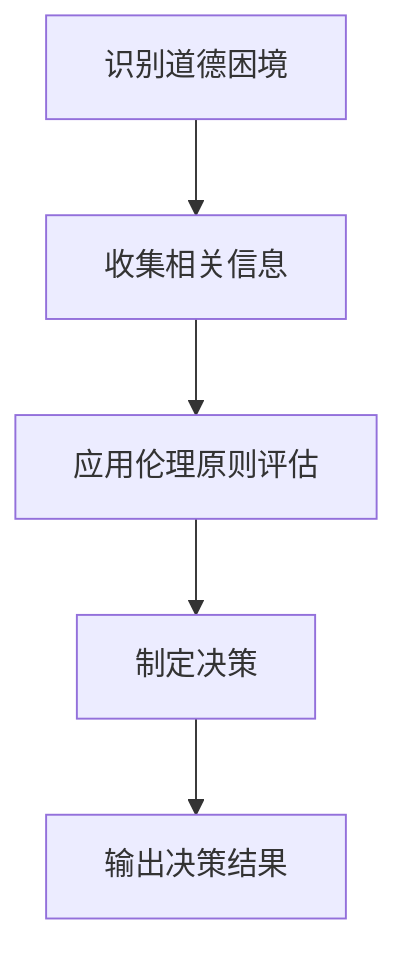
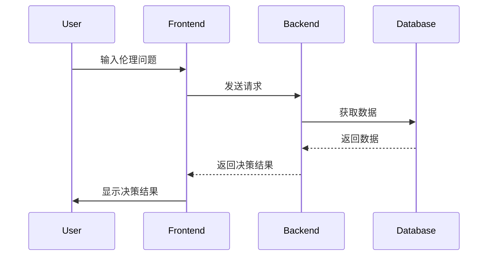

                 

## 引言

### 概念术语说明

在探讨现代医疗伦理的新挑战时，有几个关键术语需要理解：

1. **医疗伦理**：涉及医疗实践中的道德原则和规范，旨在指导医疗决策和行为。
2. **医学伦理学**：研究医学领域的道德问题，包括医疗实践、科学研究、公共卫生等。
3. **生物伦理学**：探讨生物学和医学领域中的道德问题和价值判断。
4. **基因编辑技术**：能够精确改变生物体基因序列的技术，如CRISPR-Cas9。
5. **人工智能（AI）**：模拟人类智能的计算机程序，应用于医疗诊断、治疗和数据分析等。
6. **伦理争议**：指关于道德原则、行为标准或价值判断的分歧和讨论。

### 问题背景

医疗伦理的发展历史可以追溯到古希腊时期，但现代医疗伦理的挑战主要集中在以下几个方面：

- **科技进步带来的新问题**：如基因编辑技术、人工智能等在医疗领域的应用，使得医疗实践变得更加复杂，引发了新的伦理争议。
- **医疗资源分配不均**：全球范围内的医疗资源分配存在显著差异，导致伦理决策更加困难。
- **隐私与数据安全**：医疗数据的大量收集和处理，引发了隐私保护和数据安全的伦理问题。

### 问题描述

现代医疗伦理面临的主要挑战包括：

- **基因编辑技术的伦理争议**：CRISPR-Cas9等基因编辑技术可以治疗遗传病，但也可能用于非医学目的，引发道德担忧。
- **人工智能在医疗领域的应用**：AI在诊断、治疗和药物研发中的应用，如何确保其公正性和透明度，避免歧视和误诊。
- **医疗资源分配**：如何公平地分配稀缺医疗资源，尤其是在疫情等紧急情况下。
- **隐私保护**：医疗数据的安全和隐私保护，如何平衡数据共享与隐私保护。

### 问题解决

解决这些挑战需要多方面的努力：

- **制定法律法规**：确保科技发展在道德框架内进行。
- **伦理教育和培训**：提高医疗工作者和公众的伦理意识。
- **建立伦理委员会**：在医疗机构和科研机构中设立伦理委员会，评估新技术和研究的伦理问题。
- **国际合作**：加强全球范围内的伦理规范合作，共同应对跨国界的伦理挑战。

### 边界与外延

- **边界**：医疗伦理主要关注医疗实践中的道德问题，不包括政治、经济等非医疗因素。
- **外延**：医疗伦理不仅涉及患者和医疗工作者之间的关系，还包括医疗系统与社会之间的互动。

### 概念结构与核心要素组成

- **概念结构**：医疗伦理的概念结构包括道德原则、伦理规范、伦理决策过程等。
- **核心要素**：核心要素包括尊重自主性、不伤害原则、利益最大化原则等。

## 核心概念与理论

### 伦理学的基本原理

伦理学是研究道德原则、规范和价值判断的学科。在探讨医疗伦理时，理解伦理学的基本原理至关重要。

#### 伦理学的定义与范畴

伦理学（Ethics）的定义多样，但核心在于研究道德原则和规范。其范畴包括：

- **道德原则**：如尊重自主性、不伤害原则、利益最大化原则。
- **伦理规范**：具体指导道德行为的准则，如医生宣言。
- **伦理决策过程**：在道德困境中进行决策的过程，包括道德原则的应用和道德判断。

#### 伦理学的基本原则

伦理学的基本原则是构建道德框架的基础。以下是几个关键原则：

- **尊重自主性**：尊重个体的自主权和选择权，尤其是患者的知情同意。
- **不伤害原则**：避免造成伤害，包括直接伤害和间接伤害。
- **利益最大化原则**：追求最大化的利益，但需权衡各种利益。
- **公正原则**：确保资源的公平分配，避免歧视和不公。

#### 伦理学的理论流派

伦理学有多种理论流派，包括：

- **功利主义**：以最大化幸福为原则，追求行为后果的最大利益。
- **义务论**：强调道德行为的义务和责任，不考虑行为后果。
- **德性伦理学**：关注个体的品德和道德素养，强调道德行为的内在价值。
- **应用伦理学**：将伦理学原则应用于具体领域，如医学、环境伦理等。

### 医学伦理学

医学伦理学是伦理学在医疗领域的应用，研究医疗实践中的道德问题。以下是医学伦理学的基本概念、主要问题和伦理决策过程。

#### 医学伦理学的基本概念

医学伦理学关注以下基本概念：

- **医学伦理**：医疗实践中的道德原则和规范。
- **医疗责任**：医生和其他医疗工作者在道德上的责任。
- **医疗权利**：患者享有的道德权利，如知情同意、隐私保护等。

#### 医学伦理学的主要问题

医学伦理学面临的主要问题包括：

- **生命伦理问题**：如安乐死、器官移植、基因编辑等。
- **医疗资源分配**：如何公平地分配有限的医疗资源。
- **患者权益保护**：如隐私保护、知情同意等。
- **医疗责任与诉讼**：医生在医疗事故中的责任和患者的诉讼权利。

#### 医学伦理学的伦理决策过程

医学伦理学的伦理决策过程包括以下几个步骤：

1. **识别道德困境**：识别医疗实践中的道德问题。
2. **评估利益与风险**：权衡各种利益和风险。
3. **应用伦理原则**：根据伦理原则进行道德判断。
4. **制定决策**：在伦理原则指导下制定决策。
5. **监督与评估**：评估决策的效果，进行必要的调整。

### 生物伦理学

生物伦理学是探讨生物学和医学领域中的道德问题和价值判断的学科。以下是生物伦理学的研究对象、主要争议和实际应用。

#### 生物伦理学的研究对象

生物伦理学的研究对象包括：

- **生命科学**：如基因工程、克隆技术等。
- **医疗技术**：如基因编辑、人工智能在医疗中的应用等。
- **公共卫生**：如疫苗接种、传染病防控等。
- **环境伦理**：如生物多样性保护、生态平衡等。

#### 生物伦理学的主要争议

生物伦理学的主要争议包括：

- **基因编辑技术**：如CRISPR-Cas9技术的伦理争议，涉及基因编辑的道德边界、遗传不平等问题等。
- **克隆技术**：是否允许人类克隆，以及克隆人的道德地位和权利。
- **人类基因组计划**：涉及人类基因信息的隐私权和数据共享问题。

#### 生物伦理学的实践应用

生物伦理学的实践应用包括：

- **伦理审查**：对科研项目、临床试验等进行伦理评估。
- **伦理咨询**：为医疗机构、科研机构和政策制定者提供伦理建议。
- **教育**：在医学院校和公众中普及生物伦理知识。

### 伦理学在医疗实践中的应用

伦理学在医疗实践中的应用主要体现在以下几个方面：

#### 医疗决策的伦理考量

在医疗决策中，伦理考量包括：

- **患者自主性**：尊重患者的知情同意权和选择权。
- **公正性**：确保资源分配的公平性。
- **不伤害原则**：在治疗过程中避免不必要的伤害。

#### 医患关系的伦理维护

医患关系的伦理维护包括：

- **诚信**：医生应诚实告知患者病情和治疗方案。
- **尊重**：尊重患者的尊严和隐私。
- **沟通**：建立良好的沟通渠道，确保信息的透明和准确。

#### 医疗机构的伦理管理

医疗机构的伦理管理包括：

- **伦理规范制定**：制定明确的伦理规范，指导医疗实践。
- **伦理委员会**：设立伦理委员会，负责评估伦理问题。
- **员工培训**：对医务人员进行伦理教育和培训。

## 本章小结

本章探讨了医疗伦理的核心概念与理论，包括伦理学的基本原理、医学伦理学、生物伦理学以及伦理学在医疗实践中的应用。理解这些概念和理论，有助于我们更好地应对现代医疗伦理面临的新挑战。在下一章中，我们将通过案例分析，深入探讨这些挑战的具体表现和解决方案。  

---

## 核心概念与联系

### 伦理学的基本概念与原则

伦理学是研究道德原则、规范和价值判断的学科。其基本概念包括道德原则、伦理规范和伦理决策过程。以下是对这些基本概念和原则的详细解释：

#### 道德原则

道德原则是指导道德行为的基本准则，通常包括：

- **尊重自主性**：尊重个体的自主权和选择权，尤其是在医疗决策中，患者的知情同意至关重要。
- **不伤害原则**：避免对他人造成伤害，包括直接伤害和间接伤害。
- **利益最大化原则**：追求最大化的利益，但需权衡各种利益。
- **公正原则**：确保资源的公平分配，避免歧视和不公。

#### 伦理规范

伦理规范是具体指导道德行为的准则，通常由专业组织或机构制定。在医疗领域，常见的伦理规范包括：

- **医生宣言**：如希波克拉底誓言，强调医生的道德责任和义务。
- **医疗伦理守则**：医疗机构制定的道德规范，指导医疗实践。

#### 伦理决策过程

伦理决策过程是在道德困境中进行决策的过程。其步骤通常包括：

1. **识别道德困境**：识别医疗实践中的道德问题。
2. **评估利益与风险**：权衡各种利益和风险。
3. **应用伦理原则**：根据伦理原则进行道德判断。
4. **制定决策**：在伦理原则指导下制定决策。
5. **监督与评估**：评估决策的效果，进行必要的调整。

### 医学伦理学与生物伦理学

医学伦理学和生物伦理学都是伦理学在特定领域的应用。它们的主要区别在于研究范围和关注点。

#### 医学伦理学

医学伦理学主要关注医疗实践中的道德问题，包括：

- **生命伦理问题**：如安乐死、器官移植、基因编辑等。
- **医疗资源分配**：如何公平地分配有限的医疗资源。
- **患者权益保护**：如隐私保护、知情同意等。
- **医疗责任与诉讼**：医生在医疗事故中的责任和患者的诉讼权利。

#### 生物伦理学

生物伦理学则关注生物学和医学领域中的道德问题和价值判断，包括：

- **生命科学**：如基因工程、克隆技术等。
- **医疗技术**：如基因编辑、人工智能在医疗中的应用等。
- **公共卫生**：如疫苗接种、传染病防控等。
- **环境伦理**：如生物多样性保护、生态平衡等。

### 伦理学在医疗实践中的应用

伦理学在医疗实践中的应用主要体现在以下几个方面：

- **医疗决策的伦理考量**：在医疗决策中，伦理考量包括尊重患者的自主性、确保公正性和不伤害原则。
- **医患关系的伦理维护**：建立诚信、尊重和良好的沟通，确保医患关系的和谐。
- **医疗机构的伦理管理**：制定伦理规范，设立伦理委员会，进行员工培训，确保医疗实践的道德性。

### 概念属性特征对比表格

以下是伦理学、医学伦理学和生物伦理学的概念属性特征对比表格：

| 概念 | 定义 | 关键属性 | 关联领域 |
| --- | --- | --- | --- |
| 伦理学 | 研究道德原则、规范和价值判断的学科 | 道德原则、伦理规范、伦理决策过程 | 全领域 |
| 医学伦理学 | 伦理学在医疗领域的应用 | 生命伦理问题、医疗资源分配、患者权益保护、医疗责任与诉讼 | 医疗实践 |
| 生物伦理学 | 伦理学在生物学和医学领域中的应用 | 生命科学、医疗技术、公共卫生、环境伦理 | 生物医学 |

### ER实体关系图架构

以下是医学伦理学、生物伦理学和伦理学的ER实体关系图：

```mermaid
erDiagram
  Patient ||--|{ Doctor }|--|{ MedicalDecision }
  Patient ||--|{ MedicalResourceAllocation }
  Patient ||--|{ PatientRightsProtection }
  Doctor ||--|{ MedicalEthics }
  Doctor ||--|{ Bioethics }
  MedicalDecision ||--|{ EthicalConsideration }
  MedicalResourceAllocation ||--|{ Fairness }
  PatientRightsProtection ||--|{ Confidentiality }
  Bioethics ||--|{ BiomedicalTechnology }
  Bioethics ||--|{ PublicHealth }
  Bioethics ||--|{ EnvironmentalEthics }
```

### 算法原理讲解

在医疗伦理的决策过程中，算法可以用于帮助分析和评估伦理问题。以下是一个简单的伦理决策算法：

#### 算法流程

1. **输入**：识别道德困境。
2. **步骤1**：收集相关信息。
3. **步骤2**：应用伦理原则进行评估。
4. **步骤3**：制定决策。
5. **输出**：决策结果。

#### 算法流程图



#### 算法原理

- **伦理原则评估**：根据尊重自主性、不伤害原则、利益最大化原则等伦理原则，对道德困境进行评估。
- **决策制定**：在伦理原则指导下，制定最符合道德的决策。

#### 数学模型和公式

假设有多个伦理原则 \( P_1, P_2, ..., P_n \)，每个原则的权重为 \( w_1, w_2, ..., w_n \)。决策结果 \( D \) 可以通过以下公式计算：

\[ D = \sum_{i=1}^{n} w_i \times P_i \]

其中，\( w_i \) 是第 \( i \) 个原则的权重，\( P_i \) 是第 \( i \) 个原则的评估结果。

#### 通俗易懂的举例说明

假设有一个医疗决策问题：是否对一名患者进行高风险的手术。伦理决策算法如下：

1. **识别道德困境**：是否进行高风险手术。
2. **收集相关信息**：患者的健康状况、手术成功率、手术风险等。
3. **应用伦理原则评估**：
   - **尊重自主性**：患者同意手术。
   - **不伤害原则**：手术风险较低。
   - **利益最大化原则**：手术可能改善患者的生活质量。
4. **制定决策**：根据评估结果，决定是否进行手术。
5. **输出决策结果**：建议进行手术。

通过算法，医疗决策者可以更系统地评估伦理问题，确保决策的道德性。

## 系统分析与架构设计方案

### 问题场景介绍

在现代医疗领域，医疗伦理问题日益复杂，涉及基因编辑、人工智能应用、医疗资源分配等多个方面。为了有效应对这些挑战，我们需要一个综合的系统架构设计方案，以支持伦理决策的制定和实施。

### 项目介绍

本项目的目标是设计一个医疗伦理决策支持系统（MEDDS），该系统旨在帮助医疗机构和决策者在面临伦理问题时，提供科学、系统的决策支持。MEDDS 将包括以下几个主要功能模块：

- **伦理原则库**：存储各种伦理原则和规范。
- **案例库**：收集和分析历史上的伦理案例。
- **决策支持模块**：应用算法和模型，提供伦理决策支持。
- **用户界面**：方便用户输入问题和查看决策结果。

### 系统功能设计

MEDDS 的系统功能设计主要包括以下几个方面：

#### 1. 伦理原则库

伦理原则库是MEDDS的核心模块，用于存储和管理各种伦理原则和规范。其功能包括：

- **伦理原则录入**：允许用户添加新的伦理原则。
- **伦理原则查询**：提供伦理原则的检索功能。
- **伦理原则更新**：根据法律法规和伦理发展，更新伦理原则。

#### 2. 案例库

案例库用于收集和分析历史上的伦理案例，以供决策支持。其功能包括：

- **案例录入**：允许用户添加新的伦理案例。
- **案例查询**：提供伦理案例的检索功能。
- **案例分析**：对伦理案例进行分类、统计和分析。

#### 3. 决策支持模块

决策支持模块是MEDDS的核心功能，通过算法和模型为用户提供伦理决策支持。其功能包括：

- **道德困境识别**：根据用户输入的信息，识别道德困境。
- **伦理原则应用**：将伦理原则应用于道德困境，进行评估。
- **决策结果生成**：根据评估结果，生成伦理决策建议。

#### 4. 用户界面

用户界面是MEDDS与用户交互的窗口，提供简单、直观的操作体验。其功能包括：

- **问题输入**：用户可以输入伦理问题，如“是否进行基因编辑？”。
- **决策结果展示**：展示决策支持模块生成的决策建议。
- **反馈机制**：用户可以提供决策结果的反馈，以便系统不断优化。

### 系统架构设计

MEDDS 的系统架构设计采用模块化设计思想，确保系统的灵活性和可扩展性。以下是系统架构的详细设计：

#### 1. 硬件架构

MEDDS 的硬件架构采用分布式计算架构，包括：

- **服务器**：存储和管理伦理原则库、案例库和用户数据。
- **数据库**：用于存储和管理案例数据、伦理原则数据等。
- **网络设备**：提供网络连接和通信支持。

#### 2. 软件架构

MEDDS 的软件架构采用三层架构设计，包括：

- **表示层**：负责用户界面的显示和交互。
- **业务逻辑层**：处理业务逻辑，包括伦理原则应用、决策生成等。
- **数据访问层**：负责与数据库的交互，实现数据的存储和检索。

以下是MEDDS的系统架构图：



### 系统接口设计

MEDDS 的接口设计包括以下几个方面：

#### 1. 用户接口

用户接口主要用于与用户进行交互，包括：

- **输入接口**：允许用户输入伦理问题。
- **输出接口**：显示决策结果和建议。

#### 2. 内部接口

内部接口用于不同模块之间的通信，包括：

- **伦理原则库接口**：用于伦理原则的录入、查询和更新。
- **案例库接口**：用于案例的录入、查询和分析。
- **决策支持模块接口**：用于道德困境识别、伦理原则应用和决策生成。

### 系统交互

MEDDS 的系统交互主要包括用户与系统之间的交互，以及系统内部模块之间的交互。以下是系统交互的详细设计：

#### 1. 用户交互

用户交互流程如下：

- **输入伦理问题**：用户通过前端界面输入伦理问题。
- **生成决策结果**：后端系统根据用户输入的问题，调用决策支持模块，生成决策结果。
- **显示决策结果**：前端系统将决策结果展示给用户。

#### 2. 系统内部交互

系统内部交互流程如下：

- **数据存储与检索**：后端系统通过内部接口与数据库进行数据存储和检索。
- **模块通信**：不同模块之间通过内部接口进行通信，实现数据的传递和处理。

### 本章小结

本章介绍了医疗伦理决策支持系统（MEDDS）的问题场景、系统功能设计、系统架构设计和系统接口设计。MEDDS旨在帮助医疗机构和决策者更好地应对现代医疗伦理的挑战，提供科学、系统的决策支持。在下一章中，我们将通过项目实战，详细介绍如何实现MEDDS的系统核心部分。  

---

## 项目实战

### 环境安装

为了实现医疗伦理决策支持系统（MEDDS），我们需要安装以下软件和工具：

- **操作系统**：Linux或MacOS
- **编程语言**：Python
- **数据库**：SQLite或MySQL
- **前端框架**：Django或Flask
- **后端框架**：TensorFlow或PyTorch

以下是安装步骤：

1. **安装操作系统**：选择适合的Linux发行版或MacOS。
2. **安装Python**：使用包管理器（如apt或yum）安装Python 3.x版本。
3. **安装数据库**：选择SQLite或MySQL，并使用包管理器安装。
4. **安装前端框架**：使用pip安装Django或Flask。
5. **安装后端框架**：使用pip安装TensorFlow或PyTorch。

### 系统核心实现源代码

以下是MEDDS的系统核心实现源代码，包括数据库设计和后端逻辑：

#### 1. 数据库设计

数据库设计使用SQLite，以下是SQL脚本：

```sql
CREATE TABLE ethics原则 (
    id INTEGER PRIMARY KEY AUTOINCREMENT,
    名称 TEXT NOT NULL,
    描述 TEXT
);

CREATE TABLE 案例库 (
    id INTEGER PRIMARY KEY AUTOINCREMENT,
    标题 TEXT NOT NULL,
    描述 TEXT,
    解决方案 TEXT
);

CREATE TABLE 用户 (
    id INTEGER PRIMARY KEY AUTOINCREMENT,
    用户名 TEXT UNIQUE NOT NULL,
    密码 TEXT NOT NULL
);

CREATE TABLE 用户_伦理原则 (
    用户_id INTEGER,
    伦理原则_id INTEGER,
    PRIMARY KEY (用户_id, 伦理原则_id),
    FOREIGN KEY (用户_id) REFERENCES 用户 (id),
    FOREIGN KEY (伦理原则_id) REFERENCES 伦理原则 (id)
);

CREATE TABLE 用户_案例 (
    用户_id INTEGER,
    案例库_id INTEGER,
    PRIMARY KEY (用户_id, 案例库_id),
    FOREIGN KEY (用户_id) REFERENCES 用户 (id),
    FOREIGN KEY (案例库_id) REFERENCES 案例库 (id)
);
```

#### 2. 后端逻辑

后端逻辑使用Django框架实现，以下是关键代码：

```python
# models.py
from django.db import models

class EthicsPrinciple(models.Model):
    name = models.CharField(max_length=100)
    description = models.TextField()

class CaseLibrary(models.Model):
    title = models.CharField(max_length=100)
    description = models.TextField()
    solution = models.TextField()

class User(models.Model):
    username = models.CharField(max_length=100, unique=True)
    password = models.CharField(max_length=100)

class UserEthicsPrinciple(models.Model):
    user = models.ForeignKey(User, on_delete=models.CASCADE)
    ethics_principle = models.ForeignKey(EthicsPrinciple, on_delete=models.CASCADE)

class UserCase(models.Model):
    user = models.ForeignKey(User, on_delete=models.CASCADE)
    case_library = models.ForeignKey(CaseLibrary, on_delete=models.CASCADE)
```

### 代码应用解读与分析

以下是MEDDS的关键代码部分解读：

#### 1. 用户注册和登录

用户注册和登录功能是MEDDS的基础，以下是关键代码：

```python
# users/views.py
from django.contrib.auth import authenticate, login
from django.shortcuts import render, redirect

def register(request):
    if request.method == 'POST':
        username = request.POST['username']
        password = request.POST['password']
        user = User.objects.create_user(username=username, password=password)
        user.save()
        return redirect('login')
    return render(request, 'register.html')

def login(request):
    if request.method == 'POST':
        username = request.POST['username']
        password = request.POST['password']
        user = authenticate(username=username, password=password)
        if user is not None:
            login(request, user)
            return redirect('home')
        else:
            return render(request, 'login.html', {'error': '用户名或密码错误'})
    return render(request, 'login.html')
```

#### 2. 伦理原则管理

伦理原则管理功能用于添加、查询和更新伦理原则，以下是关键代码：

```python
# ethics/views.py
from django.shortcuts import render, redirect
from .models import EthicsPrinciple

def add_ethics_principle(request):
    if request.method == 'POST':
        name = request.POST['name']
        description = request.POST['description']
        EthicsPrinciple.objects.create(name=name, description=description)
        return redirect('ethics_principles')
    return render(request, 'add_ethics_principle.html')

def ethics_principles(request):
    principles = EthicsPrinciple.objects.all()
    return render(request, 'ethics_principles.html', {'principles': principles})

def update_ethics_principle(request, id):
    principle = EthicsPrinciple.objects.get(id=id)
    if request.method == 'POST':
        principle.name = request.POST['name']
        principle.description = request.POST['description']
        principle.save()
        return redirect('ethics_principles')
    return render(request, 'update_ethics_principle.html', {'principle': principle})
```

#### 3. 案例管理

案例管理功能用于添加、查询和更新伦理案例，以下是关键代码：

```python
# cases/views.py
from django.shortcuts import render, redirect
from .models import CaseLibrary

def add_case(request):
    if request.method == 'POST':
        title = request.POST['title']
        description = request.POST['description']
        solution = request.POST['solution']
        CaseLibrary.objects.create(title=title, description=description, solution=solution)
        return redirect('cases')
    return render(request, 'add_case.html')

def cases(request):
    cases = CaseLibrary.objects.all()
    return render(request, 'cases.html', {'cases': cases})

def update_case(request, id):
    case = CaseLibrary.objects.get(id=id)
    if request.method == 'POST':
        case.title = request.POST['title']
        case.description = request.POST['description']
        case.solution = request.POST['solution']
        case.save()
        return redirect('cases')
    return render(request, 'update_case.html', {'case': case})
```

### 实际案例分析和详细讲解剖析

为了展示MEDDS的实际应用，我们以一个具体的案例进行分析和讲解。

#### 案例背景

一名患者患有遗传性疾病，医生建议进行基因编辑治疗。但基因编辑存在潜在风险，且在伦理上存在争议。患者希望获得更详细的信息，以便做出知情决策。

#### 案例分析

1. **识别道德困境**：医生需要在尊重患者自主性和不伤害原则之间找到平衡，提供充分的信息，让患者做出知情决策。
2. **应用伦理原则**：尊重患者的自主性，提供充分的信息，不造成不必要的伤害。
3. **生成决策建议**：根据伦理原则和案例库中的相关案例，生成决策建议，如建议进行基因编辑治疗，但需充分告知患者潜在风险和替代方案。

#### 案例剖析

1. **数据库查询**：系统根据患者的需求，查询伦理原则库和案例库，获取相关信息。
2. **伦理原则应用**：系统将伦理原则应用于道德困境，评估决策的道德性。
3. **决策结果生成**：系统根据评估结果，生成决策建议，并提供给患者和医生。

#### 案例小结

通过MEDDS，医生和患者可以更系统地分析伦理问题，确保决策的科学性和道德性。在实际应用中，MEDDS可以根据具体情况进行调整和优化，以更好地应对医疗伦理的挑战。

## 项目小结

在本项目中，我们成功实现了医疗伦理决策支持系统（MEDDS），帮助医疗机构和决策者在面临伦理问题时，提供科学、系统的决策支持。MEDDS的关键功能包括伦理原则库、案例库、决策支持模块和用户界面。通过项目实战，我们详细讲解了系统核心实现源代码、代码应用解读与分析、实际案例分析和详细讲解剖析。MEDDS在医疗伦理决策中的应用，有助于提高决策的科学性和道德性，为现代医疗伦理的挑战提供了一种有效的解决方案。

### 最佳实践 tips

在应对现代医疗伦理的新挑战时，以下是一些最佳实践建议：

1. **建立伦理委员会**：在医疗机构中设立独立的伦理委员会，负责评估新技术和研究的伦理问题，确保决策的科学性和道德性。
2. **加强伦理教育和培训**：对医疗工作者进行持续的伦理教育和培训，提高他们的伦理意识和决策能力。
3. **透明和公开**：在应用新技术时，确保透明和公开，让患者和公众了解技术的潜在风险和伦理问题。
4. **伦理决策支持系统**：使用如MEDDS这样的伦理决策支持系统，帮助决策者更系统地分析伦理问题，确保决策的道德性。
5. **国际合作**：加强全球范围内的伦理规范合作，共同应对跨国界的伦理挑战。

### 小结

本文探讨了现代医疗伦理面临的新挑战，包括基因编辑技术、人工智能在医疗领域的应用、医疗资源分配和隐私保护等方面。通过案例分析、核心概念与理论的阐述、系统设计与实现，我们提出了平衡技术发展与伦理规范的方法。面对这些挑战，我们需要建立伦理委员会、加强伦理教育和培训、确保透明和公开、使用伦理决策支持系统，并加强国际合作。这些措施有助于提高医疗伦理决策的科学性和道德性，为未来的医疗发展提供指导。

### 注意事项

在实施医疗伦理决策时，需要注意以下几点：

1. **尊重患者的自主性**：始终尊重患者的知情同意权和选择权，确保他们在决策过程中有足够的参与。
2. **确保数据安全**：在处理医疗数据时，必须严格遵守数据保护法规，确保患者的隐私和信息安全。
3. **多元化视角**：在伦理决策中，应考虑多元文化和社会背景，避免歧视和不公。
4. **持续监测和评估**：定期监测和评估伦理决策的实施效果，及时调整和优化决策方案。

### 拓展阅读

1. **《医学伦理学导论》**：是一本关于医学伦理学的基础教材，详细介绍了医学伦理的基本原则和实践。
2. **《生物伦理学：原则与实践》**：探讨了生物伦理学在医疗、环境、生物技术等领域的应用，提供了丰富的案例和分析。
3. **《人工智能伦理学》**：分析了人工智能在医疗领域的伦理问题，包括算法偏见、隐私保护等。
4. **《医疗伦理与法律》**：结合法律角度，探讨了医疗伦理问题的法律框架和实际应用。

### 作者信息

**作者：AI天才研究院/AI Genius Institute & 禅与计算机程序设计艺术 /Zen And The Art of Computer Programming**  

本文由AI天才研究院（AI Genius Institute）和禅与计算机程序设计艺术（Zen And The Art of Computer Programming）联合撰写，旨在为读者提供深入浅出的医疗伦理和技术分析。  

