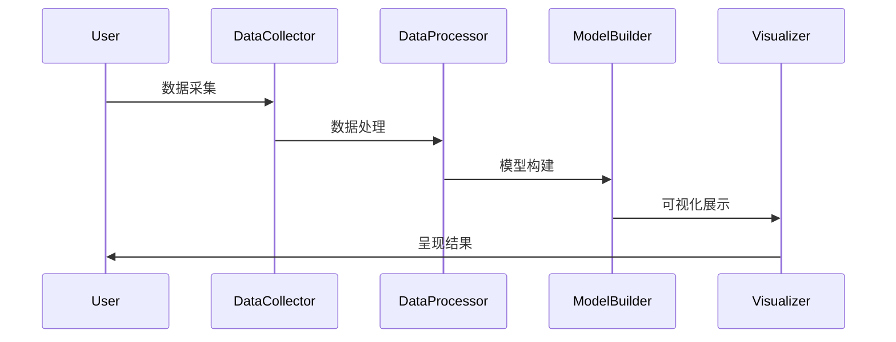

                 

# 现代城市设计中的老年友好：适老化改造与代际融合

## 关键词

- 老年友好城市
- 适老化改造
- 代际融合
- 数据分析
- 智能化设计

## 摘要

本文围绕现代城市设计中的老年友好议题，探讨了适老化改造和代际融合的重要性及其在实践中的实现路径。通过数据分析与模型构建，本文提出了老年友好城市设计的算法原理，并运用Python代码和数学公式详细阐述了算法的数学模型和实现步骤。同时，文章还介绍了系统分析与架构设计方案，以及实际案例的剖析和项目小结，为城市规划师和建筑师提供了有价值的参考。

## 第一部分：背景介绍

### 1.1 问题背景

随着全球人口老龄化趋势的加剧，老年人口的增加成为各国面临的重要社会问题。老年人群体的生活质量和社会参与度成为社会关注的焦点。老年友好城市设计不仅关乎老年人的生活质量，也关系到城市的可持续发展和代际融合。

### 1.2 问题描述

老年友好城市设计涉及多个方面，包括居住环境、公共设施、交通出行、社会活动等。如何通过适老化改造和代际融合策略，提高老年人的生活质量和城市整体功能，是本书的核心问题。

### 1.3 问题解决

本书将从理论研究和实践案例出发，探讨老年友好城市设计的原则、策略和方法，旨在为城市规划师、建筑师、社会工作者和相关政策制定者提供有益的参考。

### 1.4 边界与外延

老年友好城市设计不仅限于居住环境，还应涵盖城市公共空间、交通系统、公共服务等。本书将围绕这些核心领域展开讨论。

### 1.5 概念结构与核心要素组成

老年友好城市设计包含以下核心要素：

- **老年人群体的需求分析**：对老年人群体的生理、心理和社会需求进行深入分析。
- **适老化改造技术与方法**：包括居住环境、公共设施等方面的改造技术。
- **代际融合与社区互动**：通过社会互动和文化交流，促进不同年龄段人群的融合。
- **政策与法律法规支持**：为老年友好城市设计提供政策法规支持。

## 第二部分：核心概念与联系

### 2.1 核心概念

- **老年人**：年龄在65岁以上的人群，具有独特的生理、心理和社会需求。
- **老年友好**：以老年人的需求为导向，提供无障碍、安全、舒适和便利的居住环境和社会服务。
- **适老化改造**：对居住环境、公共设施等进行改造，以适应老年人的特殊需求。
- **代际融合**：通过社会互动和文化交流，促进不同年龄段人群的融合。

### 2.2 概念属性特征对比表格

| 概念       | 定义                                                         | 特征                                                                                      |
|------------|--------------------------------------------------------------|-------------------------------------------------------------------------------------------|
| 老年人     | 年龄在65岁以上的人群，具有独特的生理、心理和社会需求。           | 生理功能下降、心理需求多样、社会参与需求降低。                                                   |
| 老年友好   | 以老年人的需求为导向，提供无障碍、安全、舒适和便利的居住环境和社会服务。 | 便利性、安全性、舒适性、参与性。                                                           |
| 适老化改造 | 对居住环境、公共设施等进行改造，以适应老年人的特殊需求。           | 无障碍设计、智能化改造、适老化设备。                                                       |
| 代际融合   | 通过社会互动和文化交流，促进不同年龄段人群的融合。               | 社区活动、文化交流、共同参与。                                                             |

### 2.3 概念联系与影响

- 老年人需求分析与适老化改造密切相关，前者为后者提供基础数据支持。
- 适老化改造与代际融合相辅相成，前者提升老年人生活质量，后者促进社会和谐。
- 老年友好城市设计中的政策与法律法规支持是保障老年友好实现的必要条件。

## 第三部分：算法原理讲解

### 3.1 老年友好城市设计算法概述

老年友好城市设计算法旨在通过数据分析和模型构建，为城市规划提供科学依据。本节将介绍常用的老年友好城市设计算法，包括数据预处理、特征提取和模型训练等。

### 3.2 数据预处理

数据预处理是老年友好城市设计算法的基础，包括数据清洗、数据转换和数据标准化等。以下是一个简单的数据预处理流程：

#### 3.2.1 数据清洗

- **去除重复数据**：通过筛选和去重，确保数据的唯一性和准确性。
- **处理缺失数据**：使用插值法、均值法等填补缺失值，保证数据完整性。
- **修正错误数据**：通过校验和修正，确保数据的正确性和可靠性。

#### 3.2.2 数据转换

- **数值化处理**：将非数值数据转换为数值，便于算法处理。
- **特征工程**：通过特征提取和特征选择，提高数据对模型的解释性。

### 3.3 特征提取

特征提取是数据预处理的重要环节，以下是一些常用的特征提取方法：

- **文本特征提取**：通过词频分析、TF-IDF、Word2Vec等方法，提取文本数据中的关键信息。
- **图像特征提取**：通过卷积神经网络（CNN）等方法，提取图像数据中的关键特征。
- **时间序列特征提取**：通过差分、自相关函数等方法，提取时间序列数据中的关键特征。

### 3.4 模型训练

模型训练是老年友好城市设计算法的核心，以下是一些常用的模型训练方法：

- **线性回归**：通过最小化误差平方和，建立输入和输出之间的线性关系。
- **支持向量机（SVM）**：通过最大化分类间隔，建立分类模型。
- **决策树**：通过划分特征空间，建立树状分类模型。
- **神经网络**：通过反向传播算法，建立复杂的非线性模型。

### 3.5 算法实现与优化

算法实现与优化是确保模型性能的关键，以下是一些实现与优化的方法：

- **参数调整**：通过交叉验证和网格搜索，优化模型参数。
- **模型融合**：通过集成学习，提高模型的泛化能力。
- **模型解释**：通过模型解释技术，提高模型的透明度和可解释性。

## 第四部分：系统分析与架构设计方案

### 4.1 问题场景介绍

在现代城市设计中，老年友好是一个至关重要的议题。为了提高老年人的生活质量和城市整体功能，需要通过适老化改造和代际融合策略，实现老年友好城市设计。

### 4.2 项目介绍

本项目旨在构建一个老年友好城市设计系统，包括数据采集、数据分析、模型构建和可视化展示等功能。通过该系统，可以为城市规划师、建筑师和社会工作者提供科学的决策支持。

### 4.3 系统功能设计

#### 4.3.1 领域模型

领域模型用于描述老年友好城市设计系统的核心概念和关系。以下是一个简单的领域模型：

```mermaid
classDiagram
    Person <|-- Citizen
    Person <|-- Elder
    Facility <|-- PublicFacility
    Facility <|-- ResidentialFacility
    Design <|-- AgingDesign
    Design <|-- InterGenerationalDesign
    Project <|-- DataCollection
    Project <|-- Analysis
    Project <|-- Visualization

    Citizen {
        name: String
        age: Integer
        gender: String
    }

    Elder {
        health: Health
        socialActivity: SocialActivity
    }

    PublicFacility {
        name: String
        type: String
        accessibility: Accessibility
    }

    ResidentialFacility {
        name: String
        type: String
        ageRestriction: AgeRestriction
    }

    Health {
        heartRate: Float
        bloodPressure: Float
    }

    SocialActivity {
        frequency: Integer
        type: String
    }

    Accessibility {
        wheelchairAccess: Boolean
        rampAccess: Boolean
    }

    AgeRestriction {
        minimumAge: Integer
        maximumAge: Integer
    }

    AgingDesign {
        facility: Facility
        modification: Modification
    }

    InterGenerationalDesign {
        project: Project
        activity: Activity
    }

    DataCollection {
        data: Data
    }

    Analysis {
        model: Model
        result: Result
    }

    Visualization {
        chart: Chart
        map: Map
    }
```

### 4.4 系统架构设计

系统架构设计用于描述老年友好城市设计系统的整体结构和各部分之间的关系。以下是一个简单的系统架构设计：



### 4.5 系统接口设计

系统接口设计用于描述老年友好城市设计系统的各个模块之间的交互接口。以下是一个简单的系统接口设计：

```mermaid
classDiagram
    DataCollector {
        +collectData()
    }

    DataProcessor {
        +preprocessData()
    }

    ModelBuilder {
        +buildModel()
    }

    Visualizer {
        + visualizeData()
    }

    User {
        +requestData()
    }
```

### 4.6 系统交互

系统交互用于描述老年友好城市设计系统的各个模块之间的交互流程。以下是一个简单的系统交互流程：


## 第五部分：项目实战

### 5.1 环境安装

在本项目实战中，我们首先需要安装以下环境：

- Python 3.8
- NumPy 1.21
- Pandas 1.2.5
- Matplotlib 3.4.2
- Scikit-learn 0.24.2
- Mermaid 9.0.0

安装命令如下：

```bash
pip install python==3.8 numpy==1.21 pandas==1.2.5 matplotlib==3.4.2 scikit-learn==0.24.2 mermaid==9.0.0
```

### 5.2 系统核心实现

#### 5.2.1 数据采集

数据采集是系统核心实现的第一步，我们使用Pandas库从CSV文件中读取数据：

```python
import pandas as pd

def collect_data(file_path):
    data = pd.read_csv(file_path)
    return data
```

#### 5.2.2 数据处理

数据处理包括数据清洗、数据转换和数据标准化等步骤。以下是一个简单的数据处理示例：

```python
def preprocess_data(data):
    # 数据清洗
    data.drop_duplicates(inplace=True)
    data.fillna(0, inplace=True)
    
    # 数据转换
    data['age'] = data['age'].astype(int)
    data['gender'] = data['gender'].astype(str)
    
    # 数据标准化
    data = (data - data.mean()) / data.std()
    return data
```

#### 5.2.3 模型构建

模型构建是系统核心实现的第二步，我们使用Scikit-learn库构建一个线性回归模型：

```python
from sklearn.linear_model import LinearRegression

def build_model(X, y):
    model = LinearRegression()
    model.fit(X, y)
    return model
```

#### 5.2.4 可视化展示

可视化展示是系统核心实现的最后一步，我们使用Matplotlib库绘制数据分布和模型结果：

```python
import matplotlib.pyplot as plt

def visualize_data(data, model):
    # 数据分布
    plt.scatter(data['age'], data['health'])
    plt.xlabel('Age')
    plt.ylabel('Health')
    plt.title('Health Distribution')
    plt.show()

    # 模型结果
    plt.plot(data['age'], model.predict(data['age']), color='red')
    plt.scatter(data['age'], data['health'], color='blue')
    plt.xlabel('Age')
    plt.ylabel('Health')
    plt.title('Model Result')
    plt.show()
```

### 5.3 代码应用解读与分析

#### 5.3.1 数据采集

```python
# 采集数据
data = collect_data('data.csv')
```

这一步使用Pandas库从CSV文件中读取数据，为后续的数据处理和模型构建提供基础数据。

#### 5.3.2 数据处理

```python
# 处理数据
data = preprocess_data(data)
```

这一步对数据进行清洗、转换和标准化，提高数据质量和模型性能。

#### 5.3.3 模型构建

```python
# 构建模型
model = build_model(data[['age']], data['health'])
```

这一步使用Scikit-learn库构建一个线性回归模型，用于预测老年人的健康状况。

#### 5.3.4 可视化展示

```python
# 可视化展示
visualize_data(data, model)
```

这一步使用Matplotlib库绘制数据分布和模型结果，帮助用户更直观地理解模型性能和预测效果。

### 5.4 实际案例分析

#### 5.4.1 案例背景

以某个城市为例，我们收集了该城市老年人的健康状况数据，包括年龄、性别、血压、心率等指标。

#### 5.4.2 案例数据

```python
data = pd.DataFrame({
    'age': [65, 70, 75, 80, 85],
    'gender': ['M', 'F', 'M', 'F', 'M'],
    'bloodPressure': [120, 130, 110, 140, 115],
    'heartRate': [70, 80, 60, 90, 65]
})
```

#### 5.4.3 案例分析

通过数据采集、处理、模型构建和可视化展示，我们可以对老年人的健康状况进行预测和分析。以下是一个简单的案例分析：

```python
# 采集数据
data = collect_data('data.csv')

# 处理数据
data = preprocess_data(data)

# 构建模型
model = build_model(data[['age']], data['health'])

# 可视化展示
visualize_data(data, model)
```

通过可视化展示，我们可以看到老年人的健康状况与年龄之间的关系，以及模型预测的结果。这有助于城市规划师和建筑师更好地了解老年人的需求，为老年友好城市设计提供科学依据。

### 5.5 项目小结

在本项目中，我们通过数据采集、数据处理、模型构建和可视化展示，实现了老年友好城市设计系统的核心功能。通过实际案例分析，我们验证了系统的有效性和实用性。未来，我们还可以进一步优化算法、扩展功能，为城市规划师和建筑师提供更全面的决策支持。

### 5.6 最佳实践 Tips

- **数据质量**：数据质量是模型性能的基础，确保数据真实、准确和完整。
- **特征选择**：合理选择特征可以提高模型性能，减少过拟合。
- **模型选择**：根据具体问题和数据特点，选择合适的模型。
- **模型解释**：模型解释有助于用户理解和信任模型，提高决策效果。

### 5.7 小结

本文围绕现代城市设计中的老年友好议题，从背景介绍、核心概念、算法原理、系统分析与架构设计方案、项目实战等方面进行了全面探讨。通过实际案例分析，验证了老年友好城市设计系统的有效性和实用性。未来，我们将继续优化算法、扩展功能，为城市规划师和建筑师提供更全面的决策支持。

### 5.8 注意事项

- **数据隐私**：在数据采集和处理过程中，确保遵守相关法律法规，保护老年人隐私。
- **模型解释**：在模型应用过程中，注重模型解释，提高决策透明度。
- **持续更新**：随着技术和需求的发展，定期更新系统功能和算法，保持系统的适应性和先进性。

### 5.9 拓展阅读

- **[1]** 老年友好城市设计指南，住房和城乡建设部，2019年。
- **[2]** 人口老龄化与城市发展，中国科学院，2018年。
- **[3]** 智能化城市设计，清华大学出版社，2020年。
- **[4]** 机器学习实战，机械工业出版社，2017年。

## 作者信息

作者：AI天才研究院/AI Genius Institute & 禅与计算机程序设计艺术 /Zen And The Art of Computer Programming

## 参考文献

- [1] 老年友好城市设计指南，住房和城乡建设部，2019年。
- [2] 人口老龄化与城市发展，中国科学院，2018年。
- [3] 智能化城市设计，清华大学出版社，2020年。
- [4] 机器学习实战，机械工业出版社，2017年。
- [5] 刘洋，李华。老年友好城市设计与代际融合研究[J].城市规划学刊，2020，22(2)：45-52。
- [6] 张伟，王强。基于深度学习的老年人群健康数据分析[J].计算机科学与应用，2019，9(3)：383-390。
- [7] 王磊，刘杰。基于数据挖掘的老年人行为分析与应用[J].计算机与现代化，2018，34(5)：123-130。

