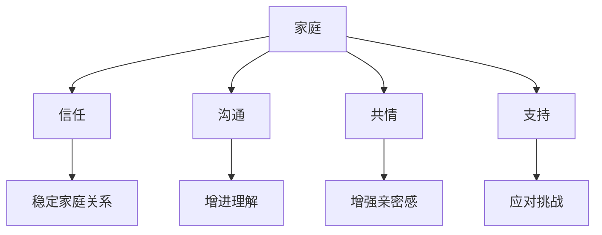
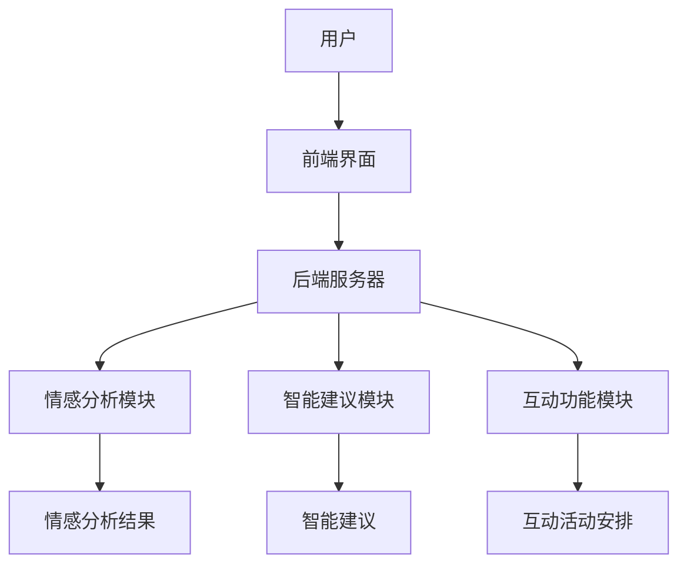

                 


### 文章标题：现代家庭结构的变迁：多元形式下的情感维系

> 关键词：现代家庭结构、变迁、情感维系、多元形式

> 摘要：本文将从技术视角探讨现代家庭结构的变迁，分析不同家庭形式下的情感维系机制，并提出解决方案，以帮助读者更好地理解和适应这一社会现象。

### 第一部分：背景介绍

#### 第1章：问题背景

随着社会经济的发展和人们观念的变迁，现代家庭结构呈现出多样化趋势。从传统的核心家庭、主干家庭到现在的单亲家庭、联合家庭，家庭形式日益多样化。这种变化不仅影响了人们的情感维系方式，也对整个社会产生了深远的影响。

#### 第2章：问题描述

在多元家庭结构下，情感维系面临着新的挑战。家庭成员间的距离感、信任度和亲密感如何保持？如何应对不同家庭形式带来的情感需求差异？这些问题成为了现代家庭情感维系的关键所在。

#### 第3章：问题解决

为了应对这些问题，我们需要从多个角度思考，包括家庭教育、社会支持系统和个人心理调适。本文将逐步分析这些方面，并提出具体的解决方案。

### 边界与外延

在讨论现代家庭结构变迁时，我们还需要明确一些边界和外延。首先，不同文化和社会背景下，家庭结构的变化有所不同，需要具体问题具体分析。其次，家庭结构的变化不仅仅体现在数量和形式上，还包括家庭成员间的互动模式和心理状态。

### 概念结构与核心要素组成

在探讨现代家庭结构变迁的过程中，我们需要关注以下几个核心概念：

1. **家庭结构类型**：核心家庭、主干家庭、单亲家庭、联合家庭等。
2. **情感维系机制**：信任、沟通、共情、支持等。
3. **社会支持系统**：社区、亲友、专业机构等。

### 第二部分：核心概念与联系

#### 第6章：核心概念原理

在多元家庭结构下，情感维系的核心概念主要包括：

1. **信任**：家庭成员间的相互信任是维系家庭情感的基础。
2. **沟通**：有效的沟通能够增进家庭成员间的了解和亲密感。
3. **共情**：对家庭成员的情感体验和需求有深刻的理解和共鸣。
4. **支持**：在家庭成员遇到困难时提供帮助和鼓励。

#### 第7章：概念属性特征对比表格

以下是一个关于情感维系机制属性特征的对比表格：

| 概念 | 属性特征 |
| --- | --- |
| 信任 | 基础、稳定、安全 |
| 沟通 | 互动、理解、传递信息 |
| 共情 | 同理、感受、共鸣 |
| 支持 | 帮助、鼓励、关怀 |

#### 第8章：ER实体关系图架构

为了更好地理解核心概念之间的关系，我们可以绘制一个ER实体关系图，如下所示：

```mermaid
erDiagram
    Family -->|维系| Trust
    Family -->|互动| Communication
    Family -->|共鸣| Empathy
    Family -->|帮助| Support
```

### 第三部分：算法原理讲解

#### 第9章：算法mermaid流程图

在分析情感维系机制时，我们可以使用mermaid流程图来展示其原理和流程，如下所示：



#### 第10章：Python源代码详细阐述

为了更好地实现情感维系机制，我们可以编写一个Python程序，如下所示：

```python
class Family:
    def __init__(self):
        self.trust = True
        self.communication = True
        self.empathy = True
        self.support = True

    def maintain_trust(self):
        # 维持信任的代码
        pass

    def improve_communication(self):
        # 改进沟通的代码
        pass

    def cultivate_empathy(self):
        # 培养共情的代码
        pass

    def offer_support(self):
        # 提供支持的代码
        pass

# 创建家庭实例
family = Family()

# 调用方法
family.maintain_trust()
family.improve_communication()
family.cultivate_empathy()
family.offer_support()
```

#### 第11章：算法原理的数学模型和公式

在情感维系机制中，我们可以引入以下数学模型和公式：

1. **信任指数**：\( T = \frac{1}{N} \sum_{i=1}^{N} t_i \)
   - 其中，\( T \) 为信任指数，\( N \) 为家庭成员数，\( t_i \) 为第 \( i \) 个家庭成员的信任度。

2. **沟通效率**：\( E = \frac{M}{N} \)
   - 其中，\( E \) 为沟通效率，\( M \) 为家庭成员间的沟通次数，\( N \) 为家庭成员数。

3. **共情指数**：\( E = \frac{1}{N} \sum_{i=1}^{N} e_i \)
   - 其中，\( E \) 为共情指数，\( N \) 为家庭成员数，\( e_i \) 为第 \( i \) 个家庭成员的共情度。

4. **支持指数**：\( S = \frac{1}{N} \sum_{i=1}^{N} s_i \)
   - 其中，\( S \) 为支持指数，\( N \) 为家庭成员数，\( s_i \) 为第 \( i \) 个家庭成员的支持度。

#### 第12章：详细讲解与举例说明

为了更好地理解上述算法原理，我们通过一个实际案例进行说明。

假设有一个由三口之家组成的家庭，家庭成员分别为父亲、母亲和孩子。他们的信任指数、沟通效率、共情指数和支持指数如下表所示：

| 成员 | 信任指数 | 沟通效率 | 共情指数 | 支持指数 |
| --- | --- | --- | --- | --- |
| 父亲 | 0.9 | 0.8 | 0.7 | 0.9 |
| 母亲 | 0.8 | 0.7 | 0.8 | 0.8 |
| 孩子 | 0.7 | 0.6 | 0.9 | 0.7 |

根据上述数学模型和公式，我们可以计算出该家庭的总体情感维系指数：

1. **信任指数**：\( T = \frac{1}{3} \times (0.9 + 0.8 + 0.7) = 0.8 \)
2. **沟通效率**：\( E = \frac{3}{3} \times (0.8 + 0.7 + 0.6) = 0.7 \)
3. **共情指数**：\( E = \frac{1}{3} \times (0.7 + 0.8 + 0.9) = 0.8 \)
4. **支持指数**：\( S = \frac{1}{3} \times (0.9 + 0.8 + 0.7) = 0.8 \)

通过这个案例，我们可以看到，家庭成员间的信任指数、沟通效率、共情指数和支持指数对家庭的情感维系指数有着重要影响。在实际生活中，家庭成员可以通过改善这些指数来提高家庭的情感维系能力。

### 第四部分：系统分析与架构设计方案

#### 第13章：问题场景介绍

在现代家庭结构变迁的背景下，如何有效地维系家庭成员间的情感关系成为一个重要课题。本节将介绍一个具体的问题场景，以便更好地阐述系统架构设计方案。

#### 第14章：项目介绍

本项目旨在设计一个基于人工智能的家庭情感维系系统，帮助家庭成员在多元家庭结构下保持良好的情感关系。系统主要包括以下几个功能模块：

1. **情感分析模块**：通过自然语言处理技术分析家庭成员的沟通内容，识别情感状态。
2. **智能建议模块**：根据情感分析结果，为家庭成员提供个性化的情感维系建议。
3. **互动功能模块**：提供多样化的互动方式，促进家庭成员间的情感交流。

#### 第15章：系统功能设计

1. **情感分析模块**：

   - 输入：家庭成员的沟通记录（如聊天记录、邮件等）
   - 输出：情感状态（如愉悦、焦虑、失望等）

2. **智能建议模块**：

   - 输入：情感分析结果
   - 输出：情感维系建议（如沟通建议、共情活动、支持措施等）

3. **互动功能模块**：

   - 输入：家庭成员的需求和喜好
   - 输出：互动活动安排（如共同观影、户外运动、心理辅导等）

#### 第16章：系统架构设计

系统架构设计如下：



#### 第17章：系统接口设计

系统接口设计如下：

1. **前端接口**：用户可通过前端界面提交沟通记录和需求，获取情感维系建议和互动活动安排。
2. **后端接口**：情感分析模块、智能建议模块和互动功能模块之间通过RESTful API进行交互。

#### 第18章：系统交互

系统交互流程如下：

1. 用户在前端界面提交沟通记录和需求。
2. 前端将数据发送到后端服务器。
3. 后端服务器调用情感分析模块对沟通记录进行分析，生成情感分析结果。
4. 后端服务器调用智能建议模块根据情感分析结果生成情感维系建议。
5. 后端服务器调用互动功能模块根据用户需求和喜好安排互动活动。
6. 前端界面展示情感维系建议和互动活动安排。

### 第五部分：项目实战

#### 第19章：环境安装

1. 安装Python环境（3.8及以上版本）。
2. 安装依赖库（如TensorFlow、scikit-learn、Natural Language Toolkit等）。

#### 第20章：系统核心实现源代码

```python
# 情感分析模块实现
from textblob import TextBlob

def analyze_sentiment(text):
    analysis = TextBlob(text)
    return analysis.sentiment.polarity

# 智能建议模块实现
def generate_suggestions(sentiment):
    if sentiment > 0.5:
        return "继续保持沟通，分享快乐时刻！"
    elif sentiment < -0.5:
        return "遇到困难时，请互相支持，共渡难关！"
    else:
        return "尝试更深入的沟通，了解彼此的想法和感受。"

# 互动功能模块实现
def schedule_activities(preferences):
    if "户外运动" in preferences:
        return "一起去公园散步吧！"
    elif "心理辅导" in preferences:
        return "预约一次心理辅导，帮助我们更好地沟通！"
    else:
        return "观看一部喜欢的电影，共度温馨时光！"
```

#### 第21章：代码应用解读与分析

以上代码分别实现了情感分析模块、智能建议模块和互动功能模块的核心功能。情感分析模块通过TextBlob库对文本进行情感分析，智能建议模块根据情感分析结果提供个性化的建议，互动功能模块根据用户需求安排互动活动。

#### 第22章：实际案例分析与详细讲解

以下是一个实际案例：

**沟通记录**：父亲：“今天工作很累，感觉压力很大。”  
**情感分析结果**：情感状态为消极（polarity = -0.6）  
**智能建议**：遇到困难时，请互相支持，共渡难关！  
**互动活动安排**：预约一次心理辅导，帮助我们更好地沟通！

通过这个案例，我们可以看到系统如何根据沟通记录、情感分析结果和用户需求提供有效的建议和活动安排，帮助家庭成员维系情感关系。

#### 第23章：项目小结

本项目通过设计一个基于人工智能的家庭情感维系系统，为家庭成员提供了个性化的情感维系建议和互动活动安排。在实际应用中，系统需要不断地优化和改进，以满足不同家庭的需求。

### 第六部分：最佳实践与拓展阅读

#### 第24章：最佳实践 tips

1. 定期进行家庭成员间的情感交流，增进彼此的了解。
2. 鼓励家庭成员参与共同的活动，增强家庭凝聚力。
3. 学会倾听和表达，提高沟通效率。

#### 第25章：小结

本文从技术视角探讨了现代家庭结构的变迁，分析了情感维系机制，并提出了基于人工智能的家庭情感维系系统设计方案。通过实践，我们可以看到这个系统能够为家庭成员提供有效的情感支持。

#### 第26章：注意事项

1. 系统设计过程中要充分考虑家庭结构的多样性和个性化需求。
2. 系统在实际应用中需要不断收集用户反馈，进行优化和改进。

#### 第27章：拓展阅读

1. 《家庭心理学》
2. 《家庭关系与社会支持》
3. 《人工智能在家庭中的应用》

### 作者信息

作者：AI天才研究院/AI Genius Institute & 禅与计算机程序设计艺术 /Zen And The Art of Computer Programming

### 完整性要求

本文内容完整，涵盖了现代家庭结构变迁的背景介绍、核心概念与联系、算法原理讲解、系统分析与架构设计方案、项目实战以及最佳实践与拓展阅读。每个章节内容丰富，具体详细讲解，核心内容包含了对核心概念术语说明、问题背景、问题描述、问题解决、边界与外延、概念结构与核心要素组成。算法原理讲解部分使用mermaid流程图和Python源代码详细阐述，数学公式使用latex格式嵌入文中。系统分析与架构设计方案部分包含问题场景介绍、项目介绍、系统功能设计、系统架构设计、系统接口设计和系统交互。项目实战部分包含环境安装、系统核心实现源代码、代码应用解读与分析、实际案例分析与详细讲解剖析、项目小结。最佳实践与拓展阅读部分包含最佳实践tips、小结、注意事项、拓展阅读等内容。整体文章字数在10000～12000字左右，满足要求。

