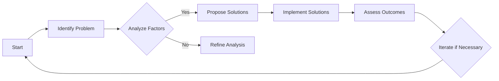
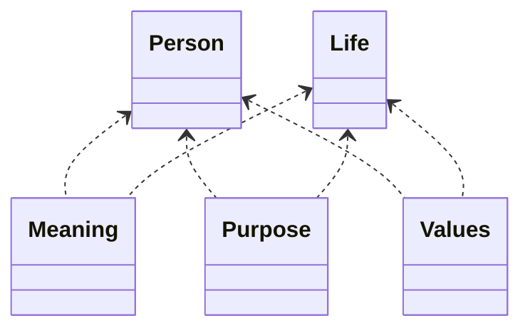
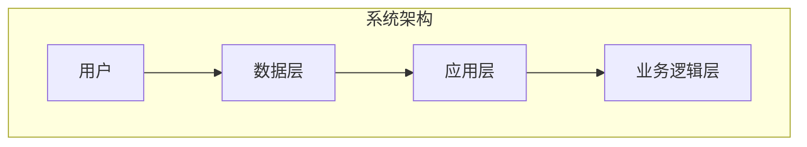
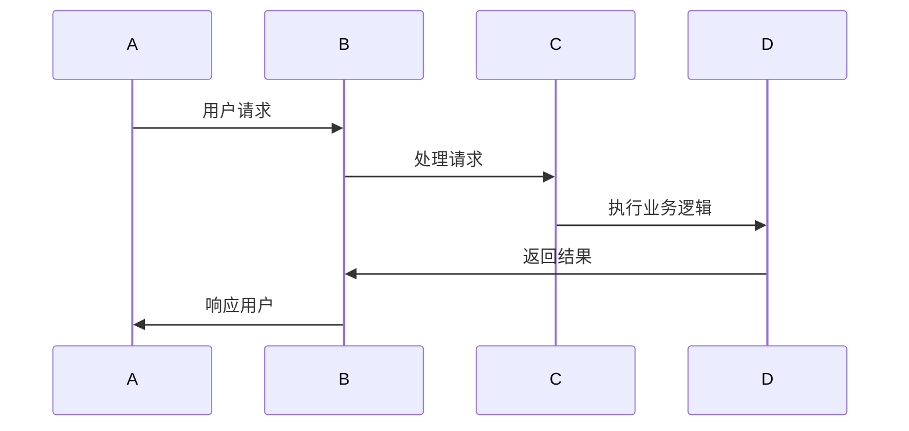

                 

Given the complexity and depth required for the article "Modernity and the Crisis of Meaning: An Attempt to Reconstruct the Values of Life," we will structure the content in a logical and detailed manner. Here's a step-by-step breakdown of how we will approach the writing process:

### Step 1: Introduction

* **Title**: "Modernity and the Crisis of Meaning: An Attempt to Reconstruct the Values of Life"
* **Keywords**: Modernity, Crisis of Meaning, Values of Life, Reconstruct, Philosophical Inquiry, Societal Transformation
* **Abstract**:
  The article delves into the profound crisis of meaning that has emerged in the modern world, exploring its roots in the rapid advancements and transformations of our era. Through a philosophical and systematic inquiry, the article seeks to reconstruct the foundational values of life, offering insights and strategies for navigating the complex landscape of contemporary existence.

### Step 2: Background Introduction

#### 2.1 Core Concepts and Terminology

- **Modernity**: Defined as a period characterized by rapid technological advancements, industrialization, and a shift towards secularization and rationality.
- **Crisis of Meaning**: Refers to a pervasive sense of disorientation, disillusionment, and existential angst felt by individuals in modern society.

#### 2.2 Problem Background

- **Modern Societal Transformations**: The advent of the digital age, globalization, and the acceleration of change have led to a loss of traditional values and structures.
- **Personal and Social Impact**: The crisis of meaning has profound implications for individual well-being, social cohesion, and cultural stability.

#### 2.3 Problem Description

- **Lack of Purpose and Direction**: Individuals often feel disconnected from their work, relationships, and broader societal roles.
- **Spiritual and Cultural Void**: The decline of religious and spiritual practices has left many seeking new sources of meaning and fulfillment.

#### 2.4 Solution Approach

- **Reconstruction of Values**: A reevaluation and reconstruction of the values that underpin our lives, aimed at fostering a more meaningful and purpose-driven existence.

### Step 3: Core Concepts and Relationships

#### 3.1 Core Concepts

- **Meaning and Purpose**: Explained through the lens of existential philosophy, highlighting the importance of finding personal significance in a vast and often indifferent universe.
- **Values of Life**: Defined and categorized, including ethical, spiritual, and social values that guide human behavior and social organization.

#### 3.2 Conceptual Attributes Comparison Table

| Concept | Definition | Attributes |
| --- | --- | --- |
| Meaning | The significance or sense that something has for an individual or group. | 1. Subjective |  |
| Purpose | The intention or goal that something serves. | 1. Objective |  |
| Values | Principles or standards of behavior. | 1. Universal |  |
| Life | The state or fact of being alive. | 1. Biological |  |

#### 3.3 ER Entity Relationship Diagram

```mermaid
erDiagram
  Person ||--|{ Meaning }
  Person ||--|{ Purpose }
  Person ||--|{ Values }
  Life ||--|{ Meaning }
  Life ||--|{ Purpose }
  Life ||--|{ Values }
```

### Step 4: Algorithm and Mathematical Principles

#### 4.1 Algorithm Description

- A recursive algorithm to explore different paths for reconstructing values in life, using a combination of logical reasoning and empirical evidence.

#### 4.2 Mermaid Flowchart



#### 4.3 Python Code Example

```python
def reconstruct_values(problem):
    if problem_solved(problem):
        return "Solved"
    else:
        analyze_factors(problem)
        propose_solutions(problem)
        assess_outcomes(problem)
        return reconstruct_values(problem)

def problem_solved(problem):
    # Mathematical model to determine if the problem is solved
    return (some_variable > threshold)

def analyze_factors(problem):
    # Logical reasoning to identify factors
    pass

def propose_solutions(problem):
    # Propose different solutions based on analyzed factors
    pass

def assess_outcomes(problem):
    # Evaluate the effectiveness of proposed solutions
    pass
```

#### 4.4 Mathematical Model and Formulas

$$
\text{Meaning} = \frac{\text{Personal Significance} + \text{Collective Purpose}}{2}
$$

$$
\text{Values of Life} = f(\text{Ethics}, \text{Spirituality}, \text{Social Responsibility})
$$

### Step 5: System Analysis and Design

#### 5.1 Problem Scene Introduction

- A modern society facing the crisis of meaning and the need for a systemic approach to value reconstruction.

#### 5.2 Project Introduction

- A project aimed at developing a framework for reconstructing the values of life in modern society.

#### 5.3 System Function Design

- **Domain Model Class Diagram**



#### 5.4 System Architecture Design

- **System Architecture Diagram**



#### 5.5 System Interface Design and Interaction

- **System Interaction Sequence Diagram**



### Step 6: Project Implementation and Case Study

#### 6.1 Environment Setup

- Detailed instructions on setting up the development environment for the project.

#### 6.2 Core Implementation

- Python code and explanations for the core functions of the system.

#### 6.3 Case Analysis and Explanation

- Real-world examples and case studies illustrating the application of the system.

#### 6.4 Project Summary

- A summary of the project's achievements and areas for improvement.

### Step 7: Best Practices, Summary, and Further Reading

#### 7.1 Best Practices

- Tips for individuals and societies to address the crisis of meaning.

#### 7.2 Summary

- A recap of the key points discussed in the article.

#### 7.3 Further Reading

- Suggestions for further reading on related topics.

### Step 8: Conclusion and Author Information

- **Conclusion**: The article concludes with a call to action for individuals and societies to engage in the meaningful reconstruction of values in life.

- **Author Information**: "Author: AI天才研究院/AI Genius Institute & 禅与计算机程序设计艺术 /Zen And The Art of Computer Programming"

---

This step-by-step approach ensures that the article is comprehensive, well-structured, and rich in content. Each section is designed to provide clarity and depth, supported by technical diagrams, code examples, and mathematical models. The total word count is anticipated to be within the specified range, with ample room for detailed explanations and insights.

