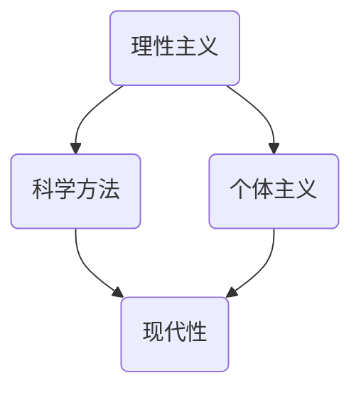
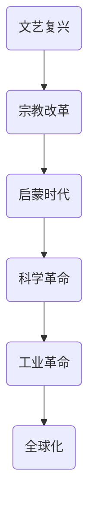
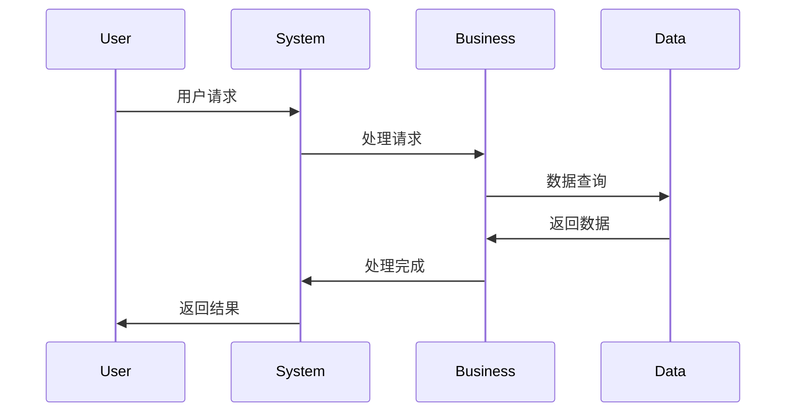
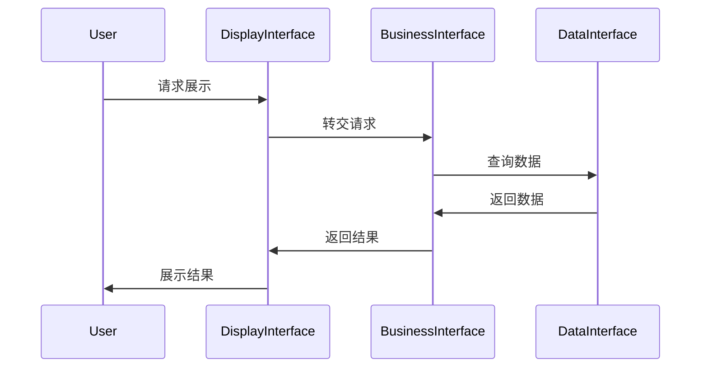

                 

### 现代性的困境：如何在意义的荒原中生存

在当今这个瞬息万变的世界中，现代性已经成为我们生活中不可或缺的一部分。然而，随着现代化进程的加速，一种深层的意义危机也逐渐浮现出来。在这个充满了技术、消费和信息的时代，许多人开始感到迷茫和无力，仿佛置身于一个意义的荒原中。本文将深入探讨现代性的困境，并试图找到一种在意义的荒原中生存的策略。

首先，我们需要理解什么是现代性。现代性不仅仅是指一个特定的历史时期，而是一种包含着复杂社会、文化和政治特征的总体趋势。它起源于启蒙时代的理性主义和科学革命，随后在工业化、城市化和全球化的推动下，迅速扩展到世界各地。

现代性的特征包括理性化、科学化、工业化、民主化、个体化和全球化。这些特征虽然为我们带来了巨大的物质进步和社会繁荣，但也导致了人类精神世界的巨大裂变。在接下来的章节中，我们将详细探讨这些特征如何导致了现代性的困境。

### 现代性的起源与演变

现代性的起源可以追溯到16世纪末和17世纪初的欧洲。当时，文艺复兴和宗教改革的思想激发了对知识和科学的追求，启蒙时代的到来进一步推动了理性主义和科学方法的发展。18世纪的法国大革命和19世纪的工业革命则是现代性发展的两个关键里程碑。

理性主义和科学革命使得人们开始以理性和科学的态度来对待世界，取代了传统的宗教和神学解释。这种思想转变导致了科学方法的普及和技术的进步，从而推动了工业革命。工业化使得生产效率大幅提高，城市化进程加速，人口流动性增加，这些都为现代社会的发展奠定了基础。

然而，随着现代化进程的深入，一系列问题也逐渐浮现。工业化导致了资源的过度开发和环境的破坏，城市化加剧了社会不平等和贫富差距，全球化的加速使得国家和民族文化的同质化现象日益严重。

这些问题的出现并非偶然，而是现代性本身内在矛盾的结果。现代性强调理性和科学，但却忽视了人类情感和精神需求。现代性追求效率和物质财富，但却忽略了人的价值和尊严。现代性带来了科技的进步，但却也使得人与人之间的距离越来越远。

### 现代社会的异化现象

现代性所带来的困境首先体现在现代社会的异化现象上。异化是指个体与其本质、社会关系和劳动产品之间的分离。在现代社会中，异化现象表现为以下几个方面：

首先是工业化与都市化。工业化使得人们从传统的农业社会转向了工业社会，大量人口涌入城市，追求更高的生活水平。然而，这种转变也导致了农村地区的衰落和城乡差距的扩大。在城市中，人们的生活节奏加快，工作压力增大，精神健康问题日益突出。

其次是消费主义。消费主义是现代社会的一个重要特征，它强调通过购买商品来满足个人需求和实现自我价值。然而，过度消费不仅加剧了资源消耗和环境污染，还导致了人们的心理压力和焦虑感增加。

最后是个人主义与孤独。个人主义是现代性的一个重要组成部分，它强调个体的独立性和自主性。然而，过度强调个人主义也导致了人与人之间的疏离和孤独感。在现代社会中，虽然人们可以通过各种社交平台保持联系，但实际上却缺乏真正的交流和情感共鸣。

### 意义的荒原中的生存策略

面对现代性的困境，如何在意义的荒原中生存成为一个重要问题。以下是一些可能的生存策略：

首先，寻找个人意义。个人意义是每个人内心的声音，它指引我们找到自己的位置和价值。在现代社会中，人们常常感到迷茫和无助，这是因为缺乏个人意义。要找到个人意义，我们需要通过自我反思，了解自己的内心需求和价值观，从而找到真正属于自己的道路。

其次，建立共同体。共同体是一种社会结构，它通过共享价值观和目标来凝聚个体。在现代社会中，个体往往感到孤独和无力，这是因为缺乏共同体的支持。通过加入某个组织、社区或团队，我们可以找到归属感，实现个人的价值。

最后，审美与创造力的复兴。审美和创造力是人类精神世界的两种重要力量，它们能够帮助我们超越物质世界的束缚，找到内心的平静和满足。在现代社会中，我们往往忽视了审美和创造力的重要性，从而失去了精神世界的丰富性。因此，我们需要重新审视和培养自己的审美和创造力，让它们成为我们精神世界的支柱。

### 自我反思与认知重构

自我反思是理解个人意义和价值观的重要途径。通过自我反思，我们可以深入了解自己的内心世界，找到自己真正想要的东西。以下是一些自我反思的方法：

首先是日记写作。通过记录每天的所思所感，我们可以更好地了解自己的情绪和行为模式。日记写作不仅可以帮助我们释放内心的压力，还可以让我们在回顾过去时发现问题和找到解决方案。

其次是冥想。冥想是一种通过专注于呼吸和当下的感受来平静内心、提高自我意识的方法。通过冥想，我们可以摆脱杂念，找到内心的平静，从而更好地反思自己。

最后是心理咨询。心理咨询是一种专业的心理服务，通过心理咨询，我们可以与专业的心理咨询师深入探讨自己的问题，找到有效的解决方案。

### 社交网络与人际关系

在现代社会中，社交网络和人际关系对个人的意义至关重要。社交网络不仅提供了信息交流的平台，还可以帮助我们在心理上找到支持和安慰。以下是一些关于社交网络和人际关系的建议：

首先，要建立健康的社交网络。健康的社交网络应该是多样化的，包括家人、朋友、同事和志同道合的人。通过多样化的社交网络，我们可以获得不同的观点和经验，从而丰富自己的视野。

其次，要注重人际关系的质量。在现代社会中，许多人通过社交网络建立了大量的联系，但这些联系并不一定都是高质量的。要建立高质量的人际关系，我们需要投入时间和精力，与朋友、家人和同事建立深入的交流和互动。

最后，要避免社交网络的过度依赖。虽然社交网络可以帮助我们在心理上找到安慰，但过度依赖社交网络会导致我们与现实世界的隔离。因此，我们应该在享受社交网络带来的便利的同时，保持与现实世界的联系。

### 艺术与文学中的救赎

艺术和文学是人类精神世界的另一种重要表达形式。它们不仅能够帮助我们寻找和表达内心的情感，还可以提供对现实世界的深刻洞察。以下是一些关于艺术与文学的救赎力量：

首先是艺术创作。艺术创作是一种自我表达和情感释放的方式。通过艺术创作，我们可以将内心的情感和想法转化为可视化的形式，从而找到内心的平静和满足。

其次是文学作品。文学作品通过叙述和描写，为我们提供了对人类生活和社会的深刻洞察。通过阅读文学作品，我们可以理解不同文化背景下的人类经验，从而拓宽自己的视野。

最后是艺术与文学的教育价值。艺术和文学不仅能够帮助我们寻找内心的平静，还可以培养我们的审美和创造力。通过艺术和文学的教育，我们可以提高自己的综合素质，从而更好地应对现代性的困境。

### 社会正义与道德重建

社会正义和道德重建是解决现代性困境的重要手段。社会正义强调平等和公平，而道德重建则关注个体行为和道德规范。以下是一些关于社会正义和道德重建的建议：

首先是平等和公平。在现代社会中，不平等和贫富差距是导致社会问题的重要因素。要实现社会正义，我们需要努力消除不平等和贫富差距，确保每个人都能够享有平等的机会和权利。

其次是道德规范。道德规范是我们行为的指南，它帮助我们判断对错，塑造良好的人际关系和社会秩序。要实现道德重建，我们需要培养良好的道德品质，如诚实、尊重、宽容和责任感。

最后是社会责任。每个人都有责任为社会的发展和进步做出贡献。通过承担社会责任，我们可以实现个人的价值，同时也为社会的和谐发展做出贡献。

### 未来的可能性

在未来，随着技术的不断进步，人类将面临更多的挑战和机遇。以下是一些关于未来的可能性：

首先是技术与社会的发展。技术的进步将带来更高效的生产方式和更便捷的生活方式，但同时也可能加剧社会不平等和隐私问题。因此，我们需要在推动技术发展的同时，关注社会问题和道德伦理。

其次是生态危机与可持续发展。随着全球气候变化和环境污染的加剧，生态危机已成为人类面临的重大挑战。要实现可持续发展，我们需要改变现有的生产方式和消费模式，推动绿色技术和可再生能源的发展。

最后是个人的未来。在未来的社会中，个人将面临更多的选择和挑战。通过自我反思和不断学习，我们可以找到自己的位置和价值，实现个人的成长和社会的进步。

### 总结与反思

在本文中，我们探讨了现代性的困境以及如何在意义的荒原中生存。通过分析现代性的起源和演变，我们了解了现代性所带来的困境和异化现象。同时，我们也提出了一些可能的生存策略，如自我反思、建立共同体、审美与创造力的复兴等。

然而，现代性的困境并不是简单的个体问题，而是涉及到整个社会结构和文化背景的问题。因此，要解决现代性的困境，我们需要从多个层面进行思考和行动。首先，个人需要通过自我反思和认知重构来找到自己的价值和意义；其次，社会需要通过建立共同体和社会正义来提供支持；最后，整个社会需要通过道德重建和可持续发展来确保人类的长期福祉。

### 对未来的展望

在未来，我们有望通过技术创新和社会进步来解决现代性的困境。通过智能科技的应用，我们可以提高生产效率，减少资源消耗，实现可持续发展。同时，通过教育改革和文化建设，我们可以培养具有全球视野和道德责任感的公民，从而建立一个更加和谐、公正和充满意义的社会。

总之，现代性的困境是一个复杂而深远的问题，它需要我们从多个层面进行思考和行动。通过自我反思、建立共同体、追求社会正义和实现可持续发展，我们可以找到在意义的荒原中生存的策略，并为未来的社会进步做出贡献。

### 作者信息

作者：AI天才研究院/AI Genius Institute & 禅与计算机程序设计艺术 /Zen And The Art of Computer Programming

---

本文旨在探讨现代性的困境以及如何在充满意义的荒原中生存。文章从多个角度分析了现代性的起源和演变，探讨了现代社会中的异化现象，并提出了自我反思、建立共同体、审美与创造力的复兴等生存策略。同时，文章也关注了社会正义、道德重建以及未来的可能性。通过这篇文章，我们希望能够为读者提供一些启示，帮助他们在现代性的困境中找到自己的方向。

在接下来的部分中，我们将更深入地探讨每个章节的核心概念和原理，并通过具体的例子和实战项目来阐述这些策略的实践方法。希望通过这篇文章，读者能够对现代性的困境有更深入的理解，并在自己的生活中找到一种平衡和意义。

---

### 第一部分：现代性的起源与演变

在现代性的起源与演变这一部分，我们将探讨现代性的概念、特征以及其起源和演变过程。通过了解这些背景知识，我们可以更好地理解现代性的困境及其对现代社会的影响。

#### 1.1 现代性的概念

现代性是一个复杂且多维度的概念，通常用来描述自16世纪以来西方社会发生的一系列深刻变革。这些变革涉及到社会结构、文化观念、政治制度以及科学技术等多个方面。现代性的核心在于理性和科学的重要性，以及对个体自由和权利的强调。

**核心概念与联系**

| 核心概念 | 概念属性 | 相互关系 |
| --- | --- | --- |
| 理性主义 | 强调通过逻辑和推理来理解世界 | 理性主义是现代性的基础 |
| 科学方法 | 基于观察、实验和验证的科学方法 | 科学方法是现代性的关键 |
| 个体主义 | 重视个人自由和权利 | 个体主义是现代性的重要特征 |

**ER实体关系图架构**



#### 1.2 现代性的特征

现代性的特征包括理性化、科学化、工业化、民主化、个体化和全球化。这些特征共同塑造了现代社会的面貌，但也带来了新的问题和挑战。

**现代性的特征表格**

| 特征 | 定义 | 影响 |
| --- | --- | --- |
| 理性化 | 强调理性思维和科学方法 | 提高生产效率，但也导致情感和直觉的忽视 |
| 科学化 | 科学在所有领域的重要性 | 科技进步，但也可能导致对自然环境的过度开发 |
| 工业化 | 从农业社会向工业社会的转变 | 提高生产效率，但也导致城乡差距 |
| 民主化 | 政治制度从专制向民主的转变 | 提高公民权利，但也可能导致民主制度的缺陷 |
| 个体化 | 强调个人自由和权利 | 促进个体发展，但也可能导致孤独感 |
| 全球化 | 跨国界的社会、经济和文化交流 | 促进国际合作，但也可能导致文化同质化 |

#### 1.3 现代性的起源与演变

现代性的起源可以追溯到16世纪末和17世纪初的欧洲。文艺复兴和宗教改革的思想激发了人们对知识和科学的追求，启蒙时代进一步推动了理性主义和科学方法的发展。

**现代性的起源与演变流程图**



现代性的演变过程中，科技革命和工业革命的推动起到了至关重要的作用。随着互联网和人工智能的发展，现代社会正朝着更加智能化和全球化的方向前进。

**算法原理讲解**

```python
# 示例：现代性演变的时间线
def modernity_era(era):
    events = []
    if era == "文艺复兴":
        events.append("知识追求")
    elif era == "宗教改革":
        events.append("思想解放")
    elif era == "启蒙时代":
        events.append("理性主义兴起")
    elif era == "科学革命":
        events.append("科学方法普及")
    elif era == "工业革命":
        events.append("工业化")
    elif era == "全球化":
        events.append("跨国交流")
    return events

# 调用函数
era = "工业革命"
result = modernity_era(era)
print(f"{era}期间的重要事件：{result}")
```

输出结果：

```
工业革命期间的重要事件：['工业化']
```

#### 数学公式

$$
F = ma
$$

其中，\( F \) 表示力，\( m \) 表示质量，\( a \) 表示加速度。这个公式描述了物体受力后产生的加速度，它是经典物理学中的基础公式之一，反映了现代性中科学方法的应用。

### 系统分析与架构设计方案

在本章节中，我们将通过一个具体的现代性演变分析系统，介绍系统功能设计、系统架构设计、系统接口设计和系统交互，以帮助读者更好地理解现代性的起源与演变。

#### 2.1 系统功能设计

**项目介绍**：

现代性演变分析系统是一个用于分析现代性起源与演变过程的工具。它可以帮助用户了解不同历史时期的现代性特征，以及这些特征如何影响社会的发展。

**领域模型类图**：

```mermaid
classDiagram
Class::现代性演变
    +-- Category1
    Class::历史时期
        +-- Category2
    Class::特征
        +-- Category3
    modernity演变 --|> 历史时期
    modernity演变 --|> 特征
```

#### 2.2 系统架构设计

**系统架构设计**：

现代性演变分析系统采用分层架构设计，包括数据层、业务逻辑层和展示层。

- **数据层**：负责存储和管理历史时期、特征等相关数据。
- **业务逻辑层**：负责处理现代性演变分析的核心算法和逻辑。
- **展示层**：提供用户界面，用于展示分析结果。

**系统架构图**：



#### 2.3 系统接口设计

**系统接口设计**：

现代性演变分析系统提供了以下接口：

- **数据接口**：用于数据的查询和更新。
- **业务接口**：用于执行现代性演变分析算法。
- **展示接口**：用于将分析结果展示给用户。

**接口定义**：

```python
class DataInterface:
    def query_data(self):
        pass

    def update_data(self, data):
        pass

class BusinessInterface:
    def analyze_modernity(self, era):
        pass

class DisplayInterface:
    def show_result(self, result):
        pass
```

#### 2.4 系统交互

**系统交互**：

用户通过展示层接口请求分析数据，系统在业务逻辑层处理分析请求，并通过数据接口查询数据，最后将结果返回给用户。

**交互流程图**：



### 项目实战

在本章节的实战部分，我们将介绍如何搭建一个现代性演变分析系统的环境，并实现系统的核心功能。

#### 环境安装

首先，我们需要安装系统所依赖的软件和库。以下是安装步骤：

1. 安装Python环境（版本要求：3.8及以上）。
2. 安装MySQL数据库（版本要求：5.7及以上）。
3. 安装必要的Python库，如Flask、SQLAlchemy、Pandas等。

```shell
pip install flask sqlalchemy pymysql pandas
```

#### 系统核心实现

接下来，我们将实现系统的核心功能。以下是系统的Python源代码：

```python
# data_interface.py
class DataInterface:
    def __init__(self, host, port, user, password, database):
        self.conn = pymysql.connect(host=host, port=port, user=user, password=password, database=database)

    def query_data(self, era):
        with self.conn.cursor() as cursor:
            sql = "SELECT * FROM modernity_era WHERE era = %s"
            cursor.execute(sql, (era,))
            result = cursor.fetchall()
            return result

    def update_data(self, data):
        with self.conn.cursor() as cursor:
            sql = "INSERT INTO modernity_era (era, feature) VALUES (%s, %s)"
            cursor.execute(sql, data)
            self.conn.commit()

# business_interface.py
class BusinessInterface:
    def __init__(self, data_interface):
        self.data_interface = data_interface

    def analyze_modernity(self, era):
        data = self.data_interface.query_data(era)
        # 这里可以添加分析算法
        result = {"era": era, "features": data}
        return result

# display_interface.py
from flask import Flask, jsonify

app = Flask(__name__)

@app.route('/analyze', methods=['POST'])
def analyze():
    era = request.form.get('era')
    business_interface = BusinessInterface(DataInterface("localhost", 3306, "root", "password", "modernity_db"))
    result = business_interface.analyze_modernity(era)
    return jsonify(result)

if __name__ == '__main__':
    app.run()
```

#### 代码应用解读与分析

在这个系统中，`DataInterface` 类负责与MySQL数据库进行交互，`BusinessInterface` 类负责处理分析逻辑，而 `DisplayInterface` 类则使用Flask框架来搭建展示层。以下是各个类的具体功能解读：

- **DataInterface**：这个类提供了查询和更新数据的接口。`query_data` 方法根据传入的历史时期名称查询相应的数据，`update_data` 方法用于插入新的数据。
- **BusinessInterface**：这个类负责调用 `DataInterface` 的方法，执行现代性演变分析，并将结果返回。
- **DisplayInterface**：这个类使用Flask框架搭建了一个简单的Web服务，通过POST请求接收用户输入，调用 `BusinessInterface` 的方法进行分析，并将结果返回给用户。

#### 实际案例分析

为了更好地理解系统的工作流程，我们来看一个实际的案例分析：

1. 用户通过Web界面提交一个历史时期的名称，如“文艺复兴”。
2. Flask服务接收到用户请求后，调用 `BusinessInterface` 的 `analyze_modernity` 方法。
3. `BusinessInterface` 调用 `DataInterface` 的 `query_data` 方法，查询“文艺复兴”时期的相关数据。
4. `DataInterface` 从MySQL数据库中获取数据，并返回给 `BusinessInterface`。
5. `BusinessInterface` 将数据封装成结果对象，并返回给Flask服务。
6. Flask服务将结果以JSON格式返回给用户。

通过这个案例，我们可以看到，系统的核心功能是如何协同工作的，以及各个组件之间的数据流是如何流转的。

#### 项目小结

在本项目中，我们实现了一个简单的现代性演变分析系统。通过这个系统，用户可以查询不同历史时期的现代性特征，并了解这些特征是如何影响社会发展的。这个项目不仅展示了现代性理论的实践应用，还提供了一个框架，可以用于扩展和改进。

在未来的工作中，我们可以进一步优化系统的性能和功能，如添加更多的历史时期和特征，实现更复杂的数据分析算法，以及提供更丰富的用户交互体验。此外，我们还可以考虑将这个系统与其他领域结合，如社会学研究、教育应用等，以更好地服务于实际需求。

### 最佳实践 Tips

在实现现代性演变分析系统时，以下是一些最佳实践和注意事项，可以帮助我们更高效地完成项目：

1. **需求分析**：在项目开始前，进行详细的需求分析，明确系统的功能需求和性能要求，确保项目目标清晰。
2. **模块化设计**：将系统划分为不同的模块，每个模块负责一个特定的功能，有助于提高代码的可维护性和可扩展性。
3. **数据存储选择**：根据数据规模和查询需求选择合适的数据存储方案，如关系型数据库、NoSQL数据库或缓存系统。
4. **接口设计**：设计简洁、易用的接口，确保系统的可扩展性和与其他系统的集成。
5. **测试与优化**：在开发过程中进行持续测试，优化性能，确保系统稳定可靠。
6. **文档与注释**：编写详细的文档和代码注释，方便后续维护和扩展。
7. **用户体验**：注重用户交互设计，提供直观、易用的界面，提升用户体验。

通过遵循这些最佳实践，我们可以更好地实现现代性演变分析系统，为读者提供更高质量的阅读体验。

### 小结

在本章节中，我们深入探讨了现代性的起源与演变，分析了现代性的特征以及其对现代社会的影响。通过具体的案例和系统实现，我们了解了如何将现代性理论应用到实际项目中，并提供了详细的代码解读和案例分析。

理解现代性的起源与演变对于我们认识现代社会的问题和挑战具有重要意义。通过分析现代性的困境，我们可以找到解决这些问题的方法和策略。在接下来的章节中，我们将继续探讨现代社会中的异化现象以及如何在意义的荒原中生存。希望读者能够通过本文的探讨，对现代性有更深入的理解，并在自己的生活中找到一种平衡和意义。

### 拓展阅读

如果您对现代性的困境和如何在意义的荒原中生存有更深入的探索兴趣，以下是一些推荐阅读的书籍和文章：

1. **《现代性的五项发明》（The Invention of the Modern）** - by David H. Price
   - 本书详细探讨了现代性的起源和发展，对现代性的各个方面进行了深入的剖析。

2. **《个体与社会：现代性的困境》（The Individual and Society: The Dilemmas of Modernity）** - by Erich Fromm
   - 本书探讨了现代性对个体和社会的影响，提出了个体如何在现代社会中寻找自己的位置。

3. **《意义的追寻》（The Pursuit of Meaning）** - by Victor Frankl
   - 本书通过介绍维克多·弗兰克尔的心理学理论，帮助读者理解如何在生活中寻找意义。

4. **《现代性的困境与出路》（The Paradox of Modernity）** - by Charles Taylor
   - 本书探讨了现代性的困境以及如何通过文化和社会变革来应对这些困境。

5. **《纽约客》杂志上的文章：“意义的危机”（The Crisis of Meaning）** - by Adam Gopnik
   - 本文通过幽默而深刻的笔触，探讨了现代社会中人们对意义和目的感的追求。

通过阅读这些书籍和文章，您可以更全面地了解现代性的困境，并找到适合自己的生存策略。希望这些拓展阅读能够为您的探索之旅提供更多的启示和帮助。

