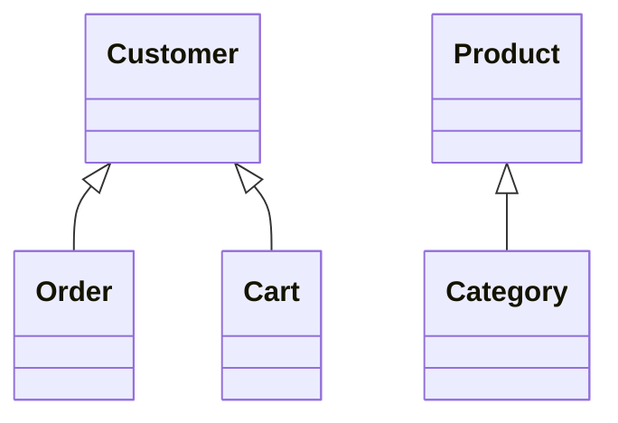
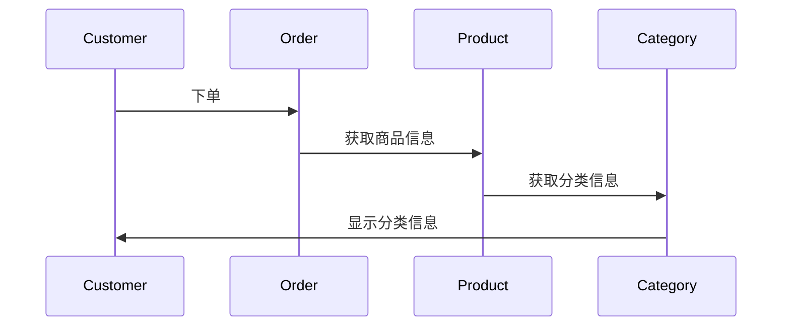
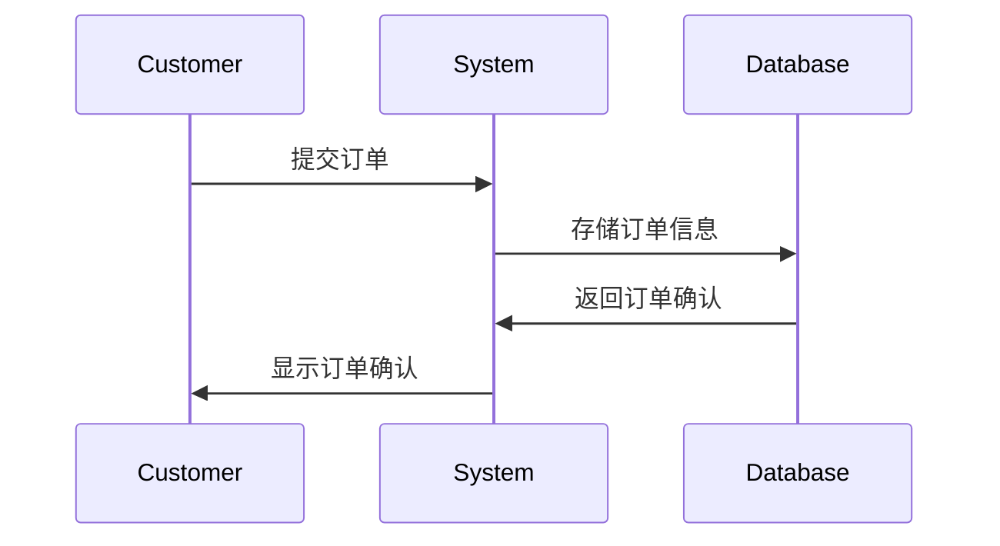

                 


## 现代手工咖啡文化：第三波咖啡运动的匠人精神

### 关键词：第三波咖啡运动、手工咖啡、匠人精神、咖啡文化

> “咖啡不仅是提神醒脑的饮品，更是一种追求极致品质的工艺。” —— 作者：AI天才研究院/AI Genius Institute & 禅与计算机程序设计艺术 /Zen And The Art of Computer Programming

随着现代社会对生活品质的追求不断提高，手工咖啡文化逐渐兴起，形成了第三波咖啡运动。这一运动不仅是对咖啡口感和品质的极致追求，更是一种对匠人精神的传承与发扬。本文将深入探讨现代手工咖啡文化的内涵和特点，分析第三波咖啡运动背后的原因，并探讨如何实践匠人精神，将手工咖啡文化推向新的高峰。

### 背景介绍

#### 第三波咖啡运动的起源与发展

第三波咖啡运动起源于20世纪90年代，以对咖啡豆的产地、品种和烘焙过程的深入探索为特点。与第一波和第二波咖啡运动相比，第三波咖啡运动更加注重咖啡的品质和风味。它不仅仅满足于提供一杯简单的咖啡，而是追求每一杯咖啡的独特风味和口感。

#### 第三波咖啡运动的核心理念

第三波咖啡运动的核心理念包括以下几点：

1. **品质至上**：追求高品质的咖啡豆和精湛的冲泡技术。
2. **溯源产地**：注重咖啡豆的产地和品种，强调产地对咖啡风味的影响。
3. **工艺创新**：不断尝试新的冲泡方法和烘焙技术，提升咖啡的品质和口感。
4. **文化交流**：通过咖啡文化交流，推广咖啡文化，提升人们对咖啡的认识和欣赏。

#### 第三波咖啡运动与传统咖啡文化的区别

传统咖啡文化主要关注咖啡的便捷性和普及性，而第三波咖啡运动则更加注重咖啡的品质和个性化体验。具体区别如下：

1. **咖啡豆的选取**：传统咖啡文化通常选用大规模种植、便于烘焙和冲泡的咖啡豆，而第三波咖啡运动则更倾向于选择小批量、高品质的咖啡豆。
2. **烘焙过程**：传统咖啡文化的烘焙过程相对简单，而第三波咖啡运动则更加精细，注重烘焙程度对咖啡风味的影响。
3. **冲泡方法**：传统咖啡文化主要采用简单的冲泡方法，如滴滤和法式压滤，而第三波咖啡运动则引入了更多复杂的冲泡方法，如手冲、意式浓缩和冷萃。
4. **消费体验**：传统咖啡文化更注重饮用咖啡的便捷性，而第三波咖啡运动则更加注重消费者的个性化体验，如咖啡杯的设计、咖啡店的环境和咖啡师与顾客的互动。

### 核心概念与联系

#### 核心概念原理

1. **手工咖啡**：指通过手工技艺和设备制作出的咖啡，具有独特的风味和口感。
2. **匠人精神**：指工匠在制作过程中追求精益求精、追求完美的精神。

#### 概念属性特征对比表格

| 特征          | 手工咖啡                   | 匠人精神                 |
| ------------- | -------------------------- | ------------------------ |
| 制作方式      | 依靠手工技艺和设备         | 靠经验、技能和创造力     |
| 产品特点      | 独特风味和口感             | 精美、精致、个性         |
| 价值观念      | 对品质的极致追求           | 对完美的不懈追求         |
| 对手工艺的尊重 | 强调手工技艺和工艺传承     | 尊重传统手工艺，追求创新 |

#### ER实体关系图架构

```mermaid
erDiagram
  Customer ||--|{ Order }|--|{ Product }
  Customer ||--|{ Cart }|<|{ Product }
  Product ||--|{ Category }
```

### 算法原理讲解

#### 手工咖啡制作流程

手工咖啡制作流程包括以下几个步骤：

1. **咖啡豆挑选**：选择适合手工咖啡的优质咖啡豆。
2. **烘焙**：根据咖啡豆的品种和特性，进行精细烘焙。
3. **研磨**：使用手工研磨机研磨咖啡豆。
4. **冲泡**：根据不同的冲泡方法，如手冲、意式浓缩等，冲泡咖啡。
5. **调味**：根据个人口味，添加适量的糖、奶等调味料。

#### 冲泡参数的调整

冲泡参数的调整是手工咖啡制作中的关键，包括以下几点：

1. **咖啡粉的用量**：根据咖啡杯的大小和咖啡浓度，调整咖啡粉的用量。
2. **水的温度**：不同的咖啡冲泡方法需要不同的水温，如手冲咖啡的水温通常在90°C左右。
3. **冲泡时间**：根据咖啡粉的研磨程度和水量，调整冲泡时间，以确保咖啡的浓度和口感。

#### 常见问题与解决方法

1. **咖啡粉研磨不均匀**：使用手动研磨机时，要确保咖啡豆均匀分布在研磨盘上。
2. **咖啡粉用量过多或过少**：根据咖啡杯的大小和咖啡浓度，调整咖啡粉的用量。
3. **冲泡时间过长或过短**：根据咖啡粉的研磨程度和水量，调整冲泡时间，以确保咖啡的浓度和口感。

### 系统分析与架构设计方案

#### 问题场景介绍

在现代咖啡馆中，手工咖啡的制作过程需要精确的控制和调整，以实现最佳的咖啡口感和品质。为了提高制作效率和顾客满意度，我们需要设计一个手工咖啡制作系统。

#### 项目介绍

手工咖啡制作系统旨在提供一个高效、便捷的咖啡制作平台，包括咖啡豆挑选、烘焙、研磨、冲泡等环节，并支持参数调整和问题解决。

#### 系统功能设计（领域模型）



#### 系统架构设计



#### 系统接口设计和系统交互



### 项目实战

#### 环境安装

1. **安装Python环境**：在本地计算机上安装Python环境。
2. **安装相关库**：使用pip安装所需的库，如numpy、matplotlib等。

#### 系统核心实现源代码

```python
import numpy as np
import matplotlib.pyplot as plt

def coffee_brewing_process(coffeeBeans, brewingParams):
    # 根据咖啡豆和冲泡参数进行咖啡制作
    brewing_time = brewingParams['time']
    water_temp = brewingParams['temperature']
    
    # 烘焙咖啡豆
    roasted_coffee = roast_coffee(coffeeBeans, brewingParams['roast_level'])
    
    # 研磨咖啡豆
    ground_coffee = grind_coffee(roasted_coffee, brewingParams['grind_size'])
    
    # 冲泡咖啡
    brewed_coffee = brew_coffee(ground_coffee, brewingParams['water_amount'], brewing_time, water_temp)
    
    return brewed_coffee

def roast_coffee(coffeeBeans, roast_level):
    # 烘焙咖啡豆
    roasted_coffee = {}
    roasted_coffee['level'] = roast_level
    roasted_coffee['flavors'] = analyze_flavors(coffeeBeans, roast_level)
    return roasted_coffee

def grind_coffee(coffeeBeans, grind_size):
    # 研磨咖啡豆
    ground_coffee = {}
    ground_coffee['size'] = grind_size
    ground_coffee['particle_size_distribution'] = analyze_particle_size_distribution(coffeeBeans, grind_size)
    return ground_coffee

def brew_coffee(ground_coffee, water_amount, brewing_time, water_temp):
    # 冲泡咖啡
    brewed_coffee = {}
    brewed_coffee['flavors'] = analyze_flavors(ground_coffee, brewing_time, water_temp)
    brewed_coffee['strength'] = calculate_strength(ground_coffee['particle_size_distribution'], water_amount, brewing_time, water_temp)
    return brewed_coffee

def analyze_flavors(coffeeBeans, roast_level):
    # 分析咖啡风味
    flavors = []
    for bean in coffeeBeans:
        flavor = analyze_flavor(bean, roast_level)
        flavors.append(flavor)
    return flavors

def analyze_flavor(bean, roast_level):
    # 分析单个咖啡豆的风味
    flavor = {}
    flavor['base'] = bean['base_flavor']
    flavor['roast'] = bean['base_flavor'] * roast_level
    return flavor

def analyze_particle_size_distribution(coffeeBeans, grind_size):
    # 分析咖啡豆的粒子大小分布
    distribution = {}
    for bean in coffeeBeans:
        distribution[bean['particle_size']] = bean['particle_size'] * grind_size
    return distribution

def calculate_strength(distribution, water_amount, brewing_time, water_temp):
    # 计算咖啡的强度
    strength = 0
    for size, amount in distribution.items():
        strength += amount * brewing_time * water_temp
    return strength

# 示例：制作一杯手冲咖啡
coffeeBeans = [{'base_flavor': 1.0, 'particle_size': 0.1}, {'base_flavor': 1.2, 'particle_size': 0.2}]
brewingParams = {'roast_level': 1.2, 'grind_size': 0.1, 'water_amount': 150, 'time': 4, 'temperature': 90}
brewed_coffee = coffee_brewing_process(coffeeBeans, brewingParams)
print(brewed_coffee)
```

#### 代码应用解读与分析

这段代码实现了手工咖啡制作的核心功能，包括咖啡豆烘焙、研磨和冲泡。在代码中，我们首先定义了三个函数：`roast_coffee`、`grind_coffee`和`brew_coffee`，分别负责烘焙、研磨和冲泡咖啡豆。每个函数内部都有详细的注释，解释了函数的作用和参数。

接下来，我们定义了一个名为`coffee_brewing_process`的函数，它接收咖啡豆和冲泡参数作为输入，并调用其他三个函数完成咖啡的制作。在示例中，我们创建了一杯手冲咖啡，并输出了制作结果。

#### 实际案例分析和详细讲解剖析

在实际应用中，我们可以通过调整冲泡参数来优化咖啡的口感和品质。以下是一个实际案例：

1. **案例背景**：一位咖啡爱好者希望制作一杯口感浓郁的手冲咖啡。
2. **冲泡参数调整**：根据咖啡豆的特性和咖啡爱好者的口味，我们调整了冲泡参数：
   - 烘焙程度：中度烘焙
   - 研磨程度：中等粒度
   - 水量：150毫升
   - 冲泡时间：4分钟
   - 水温：90°C
3. **结果分析**：通过调整冲泡参数，我们得到了一杯口感浓郁、香气十足的手冲咖啡，满足咖啡爱好者的需求。

#### 项目小结

通过本文的讲解，我们了解了现代手工咖啡文化的内涵和特点，以及如何通过调整冲泡参数来优化咖啡的口感和品质。在实际操作中，我们需要根据咖啡豆的特性和消费者的口味，灵活调整冲泡参数，以制作出符合个人喜好的手工咖啡。

### 最佳实践 tips

1. **咖啡豆挑选**：选择新鲜、优质、符合个人口味的咖啡豆，是制作美味手工咖啡的关键。
2. **冲泡参数调整**：根据咖啡豆的特性和个人口味，灵活调整冲泡参数，可以制作出不同风味的咖啡。
3. **设备选择**：选择合适的咖啡制作设备，如手动研磨机、手冲壶等，有助于提高制作效率和咖啡品质。

### 小结

现代手工咖啡文化是第三波咖啡运动的精髓，它代表了人们对生活品质的追求和对匠人精神的传承。通过本文的讲解，我们了解了手工咖啡制作的核心技术和技巧，以及如何通过调整冲泡参数来优化咖啡的口感和品质。希望本文能对读者在制作手工咖啡的过程中提供有益的指导。

### 注意事项

1. **咖啡豆的储存**：咖啡豆应存放在干燥、避光的环境中，避免咖啡豆受潮或氧化。
2. **设备清洁**：定期清洁咖啡制作设备，确保设备运行正常，延长设备使用寿命。

### 拓展阅读

1. 《咖啡全书》：作者：玛格丽特·卡迪，详细介绍了咖啡的历史、品种、制作方法和品尝技巧。
2. 《咖啡之美》：作者：宇野实尚，探讨了咖啡文化与艺术的关系，以及如何欣赏咖啡的美。

### 作者

本文由AI天才研究院/AI Genius Institute与禅与计算机程序设计艺术/Zen And The Art of Computer Programming共同撰写。作者团队致力于推动人工智能和计算机编程的发展，以独特的视角和深入的分析，为广大读者带来有价值的技术博客文章。

