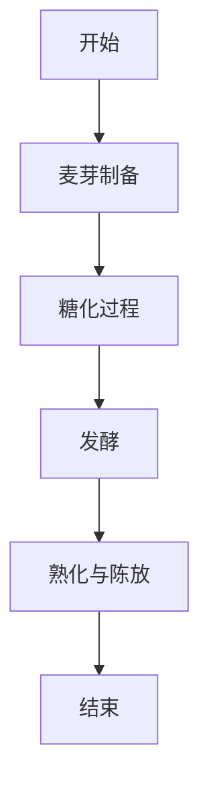

                 

### 文章标题

# 现代手工啤酒酿造：家庭酿酒的艺术与科学

### 关键词

- 手工啤酒酿造
- 家庭酿酒
- 酿造艺术
- 酿造科学
- 酿造过程

### 摘要

本文将带领读者深入探讨现代手工啤酒酿造的艺术与科学。通过系统的分析和详细的步骤讲解，我们将了解家庭酿酒的整个过程，从历史背景到现代技术的发展，从所需设备与原料的准备到酿造过程的每一个细节。无论是初学者还是有一定经验的手工酿酒爱好者，本文都将提供宝贵的知识和实用技巧，帮助您在家庭酿造过程中取得成功。

### 目录

1. **引言**
   - 1.1 手工啤酒酿造的历史背景
   - 1.2 现代手工啤酒酿造的发展
   - 1.3 家庭酿酒的兴趣与挑战

2. **酿造设备与原料**
   - 2.1 常用酿造设备
   - 2.2 酿造原料详解
   - 2.3 原料处理与准备

3. **酿造过程**
   - 3.1 麦芽的制备
   - 3.2 糖化过程
   - 3.3 发酵
   - 3.4 熟化与陈放

4. **酿造技巧与质量控制**
   - 4.1 酿造技巧概述
   - 4.2 酵母与发酵控制
   - 4.3 酿造问题与解决
   - 4.4 质量控制标准

5. **风味调整与特殊工艺**
   - 5.1 风味调整方法
   - 5.2 特殊酿造工艺
   - 5.3 创意酿造实践

6. **酿造社区与资源**
   - 6.1 加入酿造社区
   - 6.2 在线资源与论坛
   - 6.3 酿造竞赛与活动

7. **结论与展望**
   - 7.1 家庭酿酒的价值
   - 7.2 酿造的未来发展趋势

### 附录

- 附录A：酿造流程图与图表
- 附录B：常用数据与公式
- 附录C：推荐阅读书目与资源

### 引言

#### 1.1 手工啤酒酿造的历史背景

啤酒，作为一种古老的饮品，其历史可以追溯到数千年前的古代文明。早在公元前3000年，古巴比伦人就开始酿造啤酒，这可能是最早的啤酒酿造记录。随着时间的推移，啤酒酿造技术不断发展和演变，特别是在欧洲中世纪时期，啤酒成为人们日常生活中不可或缺的一部分。

手工啤酒酿造的历史可以追溯到古代，当时人们使用简单的工具和方法，如石磨和泥罐，来制作啤酒。直到工业革命时期，啤酒酿造才开始工业化生产，大量使用机械设备和工业化流程。然而，随着人们对品质和个性化的追求，手工啤酒酿造重新获得了关注。

#### 1.2 现代手工啤酒酿造的发展

现代手工啤酒酿造的兴起主要源于20世纪末。随着人们对食品和饮料品质的重视，以及对工业化产品的质疑，越来越多的人开始回归传统，追求手工制作的纯粹和独特。同时，现代科技的发展也为手工啤酒酿造提供了新的工具和材料，使得这项传统工艺得以复兴。

近年来，手工啤酒酿造在全球范围内迅速发展，不仅在欧洲和北美地区，而且在亚洲和其他地区也受到了广泛的欢迎。各种手工啤酒节和竞赛的举办，进一步推动了手工啤酒酿造的普及和发展。

#### 1.3 家庭酿酒的兴趣与挑战

家庭酿酒近年来成为了许多人的爱好和兴趣。在家中酿造啤酒不仅能够满足自己对高品质啤酒的追求，还能够带来极大的成就感和乐趣。然而，家庭酿酒也存在一些挑战。

首先，酿造设备与原料的采购和准备可能需要一定的预算和时间。其次，酿造过程中需要严格的控制温度、湿度等条件，这对新手来说可能是一个难点。此外，酿造失败的风险也存在，需要耐心和不断的尝试。

尽管存在这些挑战，家庭酿酒的魅力仍然不可抗拒。通过本文，我们将详细探讨家庭酿酒的各个步骤和技巧，帮助读者克服困难，成功酿造出美味的啤酒。

### 酿造设备与原料

#### 2.1 常用酿造设备

在家庭酿造啤酒的过程中，合适的设备是确保酿造成功的关键。以下是一些常见的酿造设备及其作用：

1. **麦芽粉碎机**：用于将麦芽粉碎成细粉末，以便更好地提取糖分。
2. **煮酒锅**：用于将麦芽粉和水混合煮沸，进行糖化过程。
3. **发酵桶**：用于进行啤酒的发酵过程，通常是一个带有盖子和空气阀的封闭容器。
4. **冷凝器**：用于冷却发酵液，使其达到适宜的发酵温度。
5. **酵母**：是发酵过程中的关键角色，将糖转化为酒精和二氧化碳。
6. **啤酒瓶**：用于装填和储存酿造完成的啤酒。

#### 2.2 酿造原料详解

酿造啤酒的主要原料包括麦芽、啤酒花、水和酵母。以下是对这些原料的详细描述：

1. **麦芽**：麦芽是啤酒的主要糖源，通过浸泡和发芽过程制成。不同种类的麦芽会产生不同的酒体和风味。
2. **啤酒花**：啤酒花不仅赋予啤酒独特的香味和苦味，还具有一定的防腐作用。啤酒花的选择对啤酒的风味有重要影响。
3. **水**：水是啤酒的主要成分，水质对啤酒的风味和品质有很大影响。通常需要使用软水或经过过滤的水。
4. **酵母**：酵母是啤酒发酵过程中的关键，将糖转化为酒精和二氧化碳。不同种类的酵母会产生不同的风味。

#### 2.3 原料处理与准备

在酿造啤酒之前，需要对原料进行适当的处理和准备：

1. **麦芽**：将麦芽浸泡在水中，使其发芽并产生糖分。发芽后的麦芽需要干燥和粉碎，以便进行糖化过程。
2. **啤酒花**：新鲜啤酒花应在采摘后尽快使用。如果使用干燥啤酒花，需要先将其充分浸泡并晾干。
3. **水**：在使用前，需要检查水质，并进行必要的过滤或软化处理。
4. **酵母**：酵母通常在发酵前进行活化，以确保其活性。将酵母放入温水（约35°C）中，并加入一些糖分，让其重新激活。

通过合理的设备选择和原料准备，可以为家庭酿造啤酒打下坚实的基础。接下来，我们将进入酿造过程的详细介绍。

### 酿造过程

#### 3.1 麦芽的制备

麦芽是酿造啤酒的核心原料，其制备过程对啤酒的质量至关重要。以下是麦芽制备的详细步骤：

1. **浸泡**：首先，将麦芽浸泡在冷水中，通常浸泡时间为12-18小时，以使麦芽充分吸水。
2. **发芽**：将浸泡后的麦芽放入发芽箱或发芽篮中，保持适当的温度（约18-24°C）和湿度（85-95%）。发芽时间通常为3-5天，期间需要定期翻动麦芽，以确保均匀发芽。
3. **干燥**：发芽后的麦芽需要干燥，以防止霉变。可以使用风扇或加热设备进行干燥，干燥时间通常为12-24小时，直到麦芽的水分含量降至约4-6%。
4. **粉碎**：干燥后的麦芽通过麦芽粉碎机进行粉碎，使其成为细粉末，以便在糖化过程中更好地提取糖分。

#### 3.2 糖化过程

糖化是酿造啤酒的关键步骤，它将麦芽中的淀粉转化为可发酵的糖。以下是糖化过程的详细步骤：

1. **煮麦芽粉**：将粉碎后的麦芽粉与水混合，放入煮酒锅中，加热至65-70°C，保持20-30分钟。这个过程中，淀粉酶会作用，将淀粉分解成糖。
2. **煮出糖**：继续加热至78-80°C，保持10-15分钟，以确保所有淀粉都被分解成糖。此时，糖化液应呈透明或淡黄色。
3. **过滤**：将煮好的糖化液通过过滤器或布袋进行过滤，去除残留的麦芽固体，得到糖化液。

#### 3.3 发酵

发酵是将糖转化为酒精和二氧化碳的过程，需要使用酵母。以下是发酵的详细步骤：

1. **冷却**：将糖化液冷却至酵母适宜的温度（通常为18-24°C），以准备发酵。
2. **添加酵母**：将活化的酵母添加到发酵桶中，通常加入量为糖化液体积的1-2%。
3. **密封发酵桶**：将发酵桶密封，并确保空气阀处于开放状态，以允许二氧化碳的排放。
4. **发酵过程**：发酵通常需要7-14天，期间温度和pH值需要定期监测和调整，以确保发酵过程的顺利进行。

#### 3.4 熟化与陈放

发酵完成后，啤酒需要熟化与陈放，以使其口感和风味更加柔和。以下是熟化与陈放的详细步骤：

1. **煮沸**：将发酵好的啤酒煮沸5-10分钟，以杀灭剩余的酵母和其他微生物。
2. **冷却**：将煮沸后的啤酒迅速冷却至低温（约0-4°C），以减缓熟化过程。
3. **陈放**：将冷却后的啤酒装入清洁的容器中，并在低温下陈放数周至数月。陈放期间，啤酒的风味和口感会逐渐成熟。

通过以上步骤，我们可以完成家庭酿造啤酒的整个过程。接下来，我们将探讨酿造技巧和质量控制，以进一步提高啤酒的品质。

### 酿造技巧与质量控制

#### 4.1 酿造技巧概述

酿造啤酒不仅需要遵循一定的步骤和流程，还需要掌握一系列技巧，以确保最终产品的质量和风味。以下是一些关键酿造技巧：

1. **温度控制**：温度是酿造过程中的关键因素，不同的步骤需要不同的温度。例如，糖化过程需要在65-70°C进行，发酵过程需要在18-24°C进行。通过精确的温度控制，可以确保酿造过程的顺利进行。
2. **时间控制**：时间也是酿造过程中的重要参数。每个步骤都有最佳的时间范围，过早或过晚都会影响啤酒的质量。例如，糖化时间通常为20-30分钟，发酵时间通常为7-14天。
3. **清洁与消毒**：清洁和消毒是酿造过程中必不可少的步骤，以防止细菌和微生物的污染。所有酿造设备和容器在使用前都应彻底清洗和消毒，以保持酿造环境的卫生。
4. **酵母管理**：酵母是发酵过程的核心，其质量和活性对啤酒的质量有重要影响。在使用酵母前，应确保其活性，可以通过活化试验进行验证。

#### 4.2 酵母与发酵控制

发酵是酿造啤酒的关键步骤，酵母的质量和发酵过程的管理对最终产品的风味和品质至关重要。以下是一些关于酵母和发酵控制的技巧：

1. **酵母选择**：选择适合自己酿造风格的酵母，不同种类的酵母会产生不同的风味。例如，拉格酵母适合酿造清爽的拉格啤酒，而艾尔酵母适合酿造浓郁的艾尔啤酒。
2. **酵母活化**：在发酵前，应将酵母进行活化，以恢复其活性。通常，将酵母放入温水（35°C）中，并加入一些糖分，让其在水中悬浮。
3. **发酵过程管理**：在发酵过程中，需要定期监测温度、pH值和气泡产生情况。如果温度过高或过低，可能需要调整冷却或加热设备。此外，如果pH值过高或过低，可能需要添加酸或碱进行调整。
4. **避免污染**：发酵过程中应避免污染，特别是在使用开放容器时。可以通过密封发酵桶和使用无菌工具来减少污染风险。

#### 4.3 酿造问题与解决

在家庭酿造啤酒的过程中，可能会遇到各种问题。以下是一些常见的问题及其解决方法：

1. **发酵失败**：发酵失败可能是由于酵母活性不足、温度不当或污染引起的。解决方法包括使用活化的酵母、调整发酵温度和使用消毒剂进行消毒。
2. **啤酒浑浊**：啤酒浑浊可能是由于酵母残留、酒花或沉淀物引起的。可以通过二次发酵和过滤来改善啤酒的透明度。
3. **酸味过重**：酸味过重可能是由于酵母发酵过度或使用酸性水质引起的。可以通过调整发酵温度和水质来减轻酸味。

#### 4.4 质量控制标准

为了确保啤酒的质量，家庭酿造过程中应遵循一系列质量控制标准。以下是一些关键的质量控制标准：

1. **糖度**：糖度是衡量啤酒含糖量的重要指标，通常用比重计进行测量。发酵完成后，啤酒的糖度应在1-3%之间。
2. **酒精度**：酒精度是衡量啤酒酒精含量的指标，通常用比重计或酒精度计进行测量。啤酒的酒精度应根据酿造风格进行调整。
3. **透明度**：透明度是衡量啤酒清澈程度的指标，可以通过视觉检查进行评估。高质量的啤酒应具有清晰的透明度。
4. **口感**：口感是衡量啤酒风味和质量的重要指标，包括甜度、苦味、口感厚度等。通过品酒评估可以了解啤酒的口感。

通过掌握以上酿造技巧和质量控制标准，家庭酿造者可以进一步提高啤酒的品质，酿造出美味的啤酒。

### 风味调整与特殊工艺

#### 5.1 风味调整方法

在家庭酿造啤酒的过程中，风味调整是至关重要的，它直接影响到啤酒的最终口感和魅力。以下是一些常用的风味调整方法：

1. **苦味调整**：苦味主要来源于啤酒花，通过调整啤酒花的种类、用量和添加时间，可以有效地控制啤酒的苦味。例如，使用苦味较轻的啤酒花在早期添加，可以增加啤酒的果香和苦味平衡。

2. **甜味调整**：甜味主要来自麦芽，通过控制糖化温度和时间，可以调整啤酒的甜味。发酵结束后，若啤酒过于甜腻，可以通过冷藏使啤酒中的残余糖分结晶，从而减少甜味。

3. **香气调整**：啤酒的香气主要来自麦芽和啤酒花。通过选择不同种类的麦芽和啤酒花，以及调整添加时间，可以丰富啤酒的香气。例如，使用香麦芽和晚加啤酒花可以增加啤酒的香气。

4. **口感调整**：口感包括啤酒的厚度、清爽度和余味。通过调整麦芽的比例和酵母的种类，可以改善啤酒的口感。例如，使用高比例的酒花和特定的酵母，可以酿造出清爽的啤酒。

#### 5.2 特殊酿造工艺

特殊酿造工艺可以使啤酒呈现出独特的风味和风格。以下是一些常见的特殊酿造工艺：

1. **低温酿造**：低温酿造是指在较低的温度下进行糖化和发酵，这可以使啤酒的口感更加清爽和细腻。通常，糖化温度控制在55-60°C，发酵温度控制在10-15°C。

2. **野生发酵**：野生发酵是指使用自然环境中的野生酵母进行发酵，这种方法可以赋予啤酒独特的风味和香气。野生发酵通常在开放的容器中进行，需要严格控制卫生条件。

3. **混酿**：混酿是将不同风格或不同批次的啤酒混合，以创造出新的风味和口感。例如，可以将一部分啤酒进行陈放，然后再与新鲜啤酒混合，以增加啤酒的复杂性。

4. **酸啤酒酿造**：酸啤酒是通过特殊发酵过程，使啤酒中含有一定量的乳酸或醋酸，从而呈现出酸味。常用的方法包括使用乳酸菌或醋酸菌进行二次发酵。

#### 5.3 创意酿造实践

创意酿造是家庭酿造者展示个性和才华的舞台。以下是一些建议，帮助您进行创意酿造：

1. **实验性酿造**：不断尝试新的配方和酿造方法，例如使用不同种类的麦芽、啤酒花或酵母，探索新的风味组合。

2. **定制风味**：根据个人口味和偏好，定制自己的啤酒风味。例如，可以尝试加入水果、香料或其他食材，创造出独特的风味。

3. **酿造记录**：记录每次酿造的配方、步骤和结果，以便总结经验，不断提高酿造技巧。

通过风味调整和特殊酿造工艺，家庭酿造者可以创造出独一无二的啤酒，享受酿造过程中的乐趣和成就感。

### 酿造社区与资源

#### 6.1 加入酿造社区

加入酿造社区是提升自己酿造技能、结识志同道合的朋友和分享酿造经验的重要途径。以下是一些常见的酿造社区和论坛：

1. **HomebrewTalk**：这是一个全球性的酿造论坛，涵盖了从新手到专家的各种话题，包括设备推荐、酿造技巧和风味调整等。
2. **The Ale Smith**：这是一个以分享酿造经验和技巧为主的论坛，特别适合新手入门。
3. **Homebrewers Association**：这是美国酿造者协会的官方网站，提供丰富的酿造资源和活动信息，同时也有机会参加各种酿造比赛和活动。

#### 6.2 在线资源与论坛

除了社区论坛，互联网上还有大量的在线资源，可以帮助您学习酿造知识和技巧。以下是一些有用的在线资源：

1. **BeerSmith**：这是一个功能强大的酿造软件，提供了详细的酿造计算器和酿造记录功能，有助于新手掌握酿造过程。
2. **Homebrewing.com**：这是一个提供酿造教程、食谱和设备的在线平台，适合各种层次的酿造者。
3. **The Brew Site**：这是一个提供各种酿造教程、视频和食谱的网站，内容丰富，适合新手学习。

#### 6.3 酿造竞赛与活动

参加酿造竞赛和活动是检验自己酿造技能的好机会，同时也可以与其他酿造者交流和学习。以下是一些著名的酿造竞赛和活动：

1. **美国酿造者协会年度大奖赛**：这是全球最具影响力的酿造竞赛之一，吸引了来自世界各地的酿造者参赛。
2. **国际酿造者竞赛**：这是一个国际性的酿造竞赛，涵盖各种酿造风格和类别，适合不同层次的酿造者。
3. **地区酿造比赛**：各地区都会定期举办酿造比赛，为新人和专家提供一个展示自己酿造技能的平台。

通过参与酿造社区和活动，不仅可以提升自己的酿造技能，还可以结识更多的酿造爱好者，共同分享酿造的乐趣。

### 结论与展望

#### 7.1 家庭酿酒的价值

家庭酿酒不仅是一种艺术和科学的结合，更是一种生活态度的体现。它不仅能够带来美味的自酿啤酒，还能提升个人的动手能力和创造力。在忙碌的日常生活中，家庭酿酒提供了一种放松和享受的方式，让我们在酿造的过程中找到乐趣和成就感。

家庭酿酒的价值还体现在健康和生活质量的提升上。自制啤酒通常不含添加剂，更加天然健康。此外，通过家庭酿酒，我们可以更加了解和掌握食品制作的原理，提高生活品质。

#### 7.2 酿造的未来发展趋势

随着人们对食品和饮料品质的重视，手工酿造将继续受到欢迎。未来，家庭酿酒可能会更加注重个性化和定制化，酿造者可以尝试更多的创意配方和酿造方法。同时，现代科技的发展也将进一步推动家庭酿酒的发展，例如自动化酿造设备、智能酿造软件和在线酿造社区等。

此外，酿造竞赛和活动的普及也将促进家庭酿酒的交流和发展。通过这些平台，酿造者可以展示自己的作品，获得专业评委的反馈，不断提高酿造技能。

总的来说，家庭酿酒不仅是一种爱好，更是一种生活方式。它不仅能够带来美味的啤酒，还能提升我们的生活质量和幸福感。随着技术的进步和社会的进步，家庭酿酒将在未来发挥更大的作用。

### 附录

#### 附录A：酿造流程图与图表

以下是一个简单的酿造流程图，展示了家庭酿造啤酒的主要步骤和关键环节：

#### 附录B：常用数据与公式

以下是家庭酿造啤酒过程中常用的数据与公式：

1. **麦芽的糖分含量**：一般麦芽的糖分含量约为50-60%。
2. **啤酒花苦味单位（IBU）**：计算公式为 \( IBU = \frac{{\text{啤酒花重量}} \times (\text{α酸含量}) \times (\text{沸腾时间}/60)}{{\text{啤酒总量}}} \)。
3. **酒精含量（ABV）**：计算公式为 \( ABV = \frac{{\text{酒精质量}}}{{\text{啤酒总质量}}} \times 100\% \)。

#### 附录C：推荐阅读书目与资源

为了帮助读者进一步了解家庭酿酒的知识和技巧，以下是一些建议的阅读书目和资源：

1. **《家庭酿酒入门与实践》**：作者：约翰·史密斯
   - 内容简介：这是一本适合新手入门的家庭酿酒指南，涵盖了从设备选择到酿造技巧的各个方面。

2. **《手工啤酒酿造艺术》**：作者：迈克尔·琼斯
   - 内容简介：本书详细介绍了手工啤酒酿造的历史、技术和风味调整方法，适合有一定酿造经验的朋友。

3. **《啤酒酿造完全手册》**：作者：彼得·汤普森
   - 内容简介：这是一本全面而详尽的酿造手册，包含了从基础知识到高级技巧的丰富内容。

4. **在线资源**：如Homebrewers Association、BeerSmith和The Brew Site等，提供丰富的酿造教程、视频和食谱。

通过阅读这些书籍和资源，读者可以进一步提升自己的酿造技能，创造出更多美味独特的啤酒。

