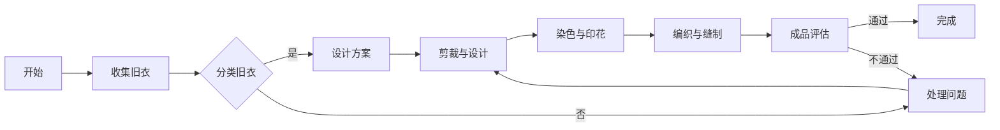
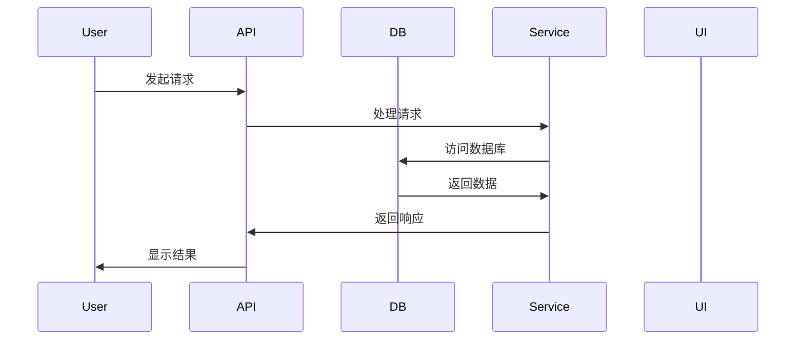
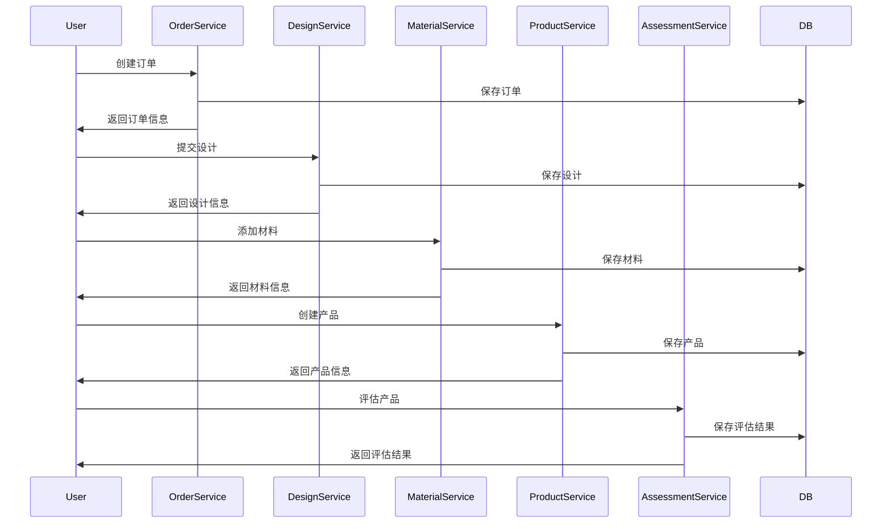
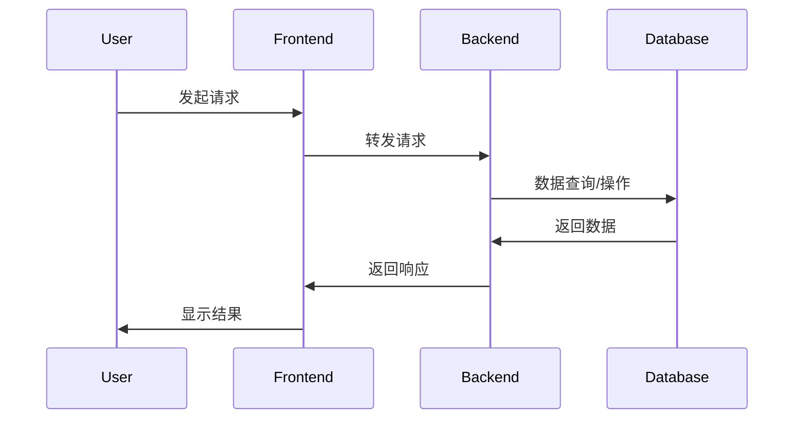

                 

### 让我们一步步思考：现代手工织物回收艺术

在现代社会，可持续时尚成为了人们关注的热点话题。传统时尚产业的高消耗、高排放，使得环境问题日益严重。为了解决这一问题，手工织物回收艺术应运而生。这种艺术不仅能够实现旧衣的再生利用，还能带来独特的时尚体验。在这一部分，我们将一步步深入探讨现代手工织物回收艺术的概念、意义和实现方法。

#### 1. 现代手工织物回收艺术的定义

现代手工织物回收艺术是指通过剪裁、设计、染色、编织等工艺，将旧衣转化为具有艺术价值的织物的过程。这种艺术不仅注重环保，还追求创意与美学。不同于传统的大规模工业生产，手工织物回收艺术强调个性化和手工艺的独特性。

#### 2. 手工织物回收艺术的意义

**环保**：手工织物回收艺术通过再利用旧衣，减少了废弃物的产生，降低了环境污染。它有助于推动可持续时尚的发展，实现资源的循环利用。

**美学**：手工织物回收艺术通过创新设计，将旧衣赋予新的生命。每一件作品都有其独特的背景故事和艺术价值，成为了环保与美学的完美结合。

**文化传承**：手工织物回收艺术不仅是一种时尚表达，也是一种文化传承。它通过手工艺的形式，将传统工艺与现代设计相结合，促进了文化多样性和创新。

#### 3. 手工织物回收艺术的实现方法

**收集与分类**：首先，收集旧衣并进行分类。根据旧衣的材质、颜色、风格等特征，将其分为不同的类别，以便后续处理。

**剪裁与设计**：根据设计需求，对旧衣进行剪裁。这一步骤需要设计师的创意和技巧，将旧衣转化为具有艺术价值的织物。

**染色与印花**：通过染色和印花，为旧衣增添色彩和图案。这一步骤可以使用传统染料或现代印花技术，以实现各种风格和效果。

**编织与针织**：最后，通过编织和针织等工艺，将剪裁好的布料进行组合和缝制。这一步骤需要精湛的手工艺技巧，以确保织物的质量和美观度。

#### 4. 手工织物回收艺术的应用场景

**时尚设计**：手工织物回收艺术在时尚设计领域有着广泛的应用。设计师可以将旧衣改造为时尚服装、饰品等，创造出独特的时尚单品。

**家居装饰**：通过手工织物回收艺术，可以将旧衣转化为家居装饰品，如抱枕、桌布、窗帘等，为家居生活增添艺术氛围。

**艺术品创作**：手工织物回收艺术也可以成为一种艺术创作方式。艺术家可以通过旧衣的再利用，创作出独特的艺术作品，表达自己的艺术理念和情感。

#### 5. 手工织物回收艺术的挑战与机遇

**挑战**：
- **技术难题**：手工织物回收艺术需要精湛的手工艺技巧和专业知识，对于初学者来说可能存在一定的难度。
- **市场接受度**：虽然可持续时尚理念逐渐被接受，但手工织物回收艺术作为一种新兴艺术形式，市场接受度还需要进一步提高。

**机遇**：
- **技术创新**：随着科技的进步，手工织物回收艺术的技术手段也在不断创新，为艺术家和设计师提供了更多可能性。
- **市场潜力**：随着人们对环保和可持续时尚的关注度不断提高，手工织物回收艺术具有巨大的市场潜力。

#### 6. 结论

现代手工织物回收艺术是一种兼具环保、美学的艺术形式。通过回收和再利用旧衣，它不仅减少了废弃物的产生，还为人们带来了独特的时尚体验。在未来，随着技术的进步和市场接受度的提高，手工织物回收艺术有望在时尚、家居和艺术品创作等领域发挥更大的作用。

让我们携手探索手工织物回收艺术的无限可能，为可持续时尚事业贡献自己的力量。在接下来的章节中，我们将进一步探讨手工织物回收艺术的历史、基础知识、实践技巧和成功案例，希望为您带来更多启发和灵感。

-------------------------------------------------------------------
## 第二部分：手工织物的概念与历史

## 2.1 手工织物的定义与分类

### 2.1.1 手工织物的定义

手工织物是指通过手工编织、针织、织造等方式制成的布料。与机器生产的大规模织物相比，手工织物具有独特的纹理、质感和艺术价值。手工织物的历史可以追溯到几千年前，它不仅是一种实用的材料，也是一种艺术形式和文化传承的载体。

### 2.1.2 手工织物的分类

手工织物可以根据制作工艺和材料进行分类，常见的分类方法如下：

1. **编织类织物**：包括钩针织物、钩织织物、编织织物等，主要使用钩针或编织机进行制作。
2. **针织类织物**：包括毛线织物、针织布、钩织织物等，主要使用针织机或手工针织。
3. **织造类织物**：包括梭织物、提花织物、绗缝织物等，主要使用织布机进行制作。

此外，根据材料的不同，手工织物还可以分为天然纤维织物（如棉、麻、丝、羊毛）和合成纤维织物（如尼龙、涤纶、聚酯）。

### 2.1.3 手工织物与传统织物的区别

与机器生产的传统织物相比，手工织物具有以下特点：

- **独特性**：手工织物每一件都是独一无二的，具有独特的纹理和质感。
- **艺术性**：手工织物常常融入艺术家的创意和设计，具有较高的艺术价值。
- **环保性**：手工织物的生产过程相对环保，能耗较低，材料可回收。
- **实用性**：手工织物不仅具有装饰性，还具有一定的实用性，如家居装饰、服装、饰品等。

### 2.1.4 手工织物在现代社会中的应用

在现代生活中，手工织物被广泛应用于多个领域：

1. **服装**：手工织物常用于制作高端定制服装，如婚纱、礼服等，因其独特的纹理和质感而受到消费者的喜爱。
2. **家居装饰**：手工织物被用于制作窗帘、桌布、抱枕等家居装饰品，为家居环境增添艺术氛围。
3. **艺术品**：手工织物可以作为艺术品直接展示，如织锦、壁挂等，具有独特的艺术价值。
4. **时尚配饰**：手工织物制作的饰品，如围巾、帽子、包包等，成为时尚界的宠儿。

## 2.2 手工织物的历史与发展

### 2.2.1 古代手工织物的发展

手工织物的历史可以追溯到史前时代。早期的手工织物主要是通过简单的编织和针织技术制作的。例如，在公元前3000年的古埃及，手工织物就已经开始出现，主要用于装饰和仪式。

- **古埃及**：古埃及人擅长使用亚麻和羊毛制作织物，这些织物不仅用于服装，还用于裹尸布和装饰物。
- **古罗马**：古罗马时期，手工织物开始应用于军事和日常生活中。罗马军团士兵的制服和贵族的华丽服饰都采用了手工织物。
- **古希腊**：古希腊时期，手工织物主要用于制作服饰和家居用品。希腊神话中的许多场景也描绘了手工织物的使用。

### 2.2.2 中世纪与文艺复兴时期的手工织物

中世纪时期，手工织物在欧洲逐渐发展壮大。这一时期，欧洲的工匠开始使用更加复杂的编织和针织技术，制作出精美的织物。到了文艺复兴时期，手工织物更是达到了高峰，成为了贵族和富人的奢侈品。

- **中世纪**：中世纪时期，手工织物主要用于教堂和宫殿的装饰。随着中世纪城市的兴起，手工织物产业也得到了快速发展。
- **文艺复兴**：文艺复兴时期，手工织物工艺得到了进一步的提升。意大利成为手工织物的主要生产地，威尼斯成为世界著名的丝绸贸易中心。

### 2.2.3 现代手工织物的发展

进入现代社会，手工织物仍然保持着独特的艺术价值。随着科技的进步，手工织物技术也得到了不断创新和发展。

- **工业化进程**：虽然工业化进程使得大规模机器生产成为主流，但手工织物依然有着不可替代的地位。许多高端定制服装和家居装饰仍然采用手工织物。
- **现代工艺**：现代手工织物技术融合了传统工艺和现代设计理念。例如，激光切割和数码印花技术的应用，使得手工织物制作更加高效和多样化。
- **可持续时尚**：现代手工织物越来越受到可持续时尚理念的推动。通过回收和再利用旧织物，手工织物艺术成为了环保时尚的重要代表。

### 2.2.4 中国手工织物的发展

中国是一个拥有悠久手工织物历史的国家。从古代的丝织品到现代的刺绣、织锦，中国的手工织物工艺一直在世界上享有盛誉。

- **古代丝织品**：中国古代的丝织品，如锦缎、绫罗等，以其精湛的工艺和华丽的外观闻名于世。丝绸之路的兴起更是促进了中西方文化的交流。
- **现代刺绣与织锦**：现代中国的手工织物艺术，如刺绣、织锦等，仍然保持着独特的艺术魅力。苏州的刺绣、成都的织锦等，都是中国手工织物艺术的代表。

## 2.3 现代手工织物的特点与趋势

### 2.3.1 现代手工织物的特点

- **个性化**：现代手工织物注重个性化和独特性，每一件作品都有其独特的设计和风格。
- **环保性**：现代手工织物工艺越来越注重环保，采用可持续的材料和环保染料，减少对环境的影响。
- **艺术性**：现代手工织物不仅是一种实用的材料，也是一种艺术形式。许多手工织物作品都具有很高的艺术价值。
- **多元化**：现代手工织物工艺越来越多样化，融合了传统工艺和现代设计理念，形成了独特的艺术风格。

### 2.3.2 现代手工织物的趋势

- **数字化设计**：现代手工织物设计越来越依赖数字化工具，如计算机辅助设计（CAD）软件，提高了设计效率和准确性。
- **可持续时尚**：随着可持续时尚理念的推广，现代手工织物越来越受到重视。通过回收和再利用旧织物，现代手工织物成为了可持续时尚的重要代表。
- **跨界融合**：现代手工织物与其他艺术形式和产业的融合，如与家居装饰、时尚设计、艺术品创作等领域的结合，为现代手工织物带来了新的发展机遇。

### 2.3.3 现代手工织物的发展前景

- **市场需求**：随着人们对环保和个性化需求的增加，现代手工织物的市场需求不断增长。
- **技术创新**：现代手工织物技术的不断创新，如激光切割、数码印花等，为现代手工织物的发展提供了新的动力。
- **文化传承**：现代手工织物艺术作为一种文化遗产，其传承和发展具有重要意义。

总之，现代手工织物艺术在历史的长河中不断发展，它不仅是一种艺术形式，也是一种文化传承。随着科技的进步和人们对环保的重视，现代手工织物艺术将继续繁荣发展，为我们的生活带来更多的美与价值。

## 2.4 手工织物艺术与文化

### 2.4.1 手工织物艺术的历史渊源

手工织物艺术的历史渊源可以追溯到古代文明。在埃及、古希腊和古罗马等古代文明中，手工织物不仅是日常生活的必需品，还是地位的象征。这些文明的手工织物艺术不仅体现在实用价值上，还体现在艺术装饰上。

- **古埃及**：古埃及的亚麻和羊毛织物以其细腻的纹理和精美的图案著称，主要用于裹尸布和装饰。
- **古希腊**：古希腊的织物常用于制作服装和家居装饰，其图案和色彩充满了神话和历史的元素。
- **古罗马**：古罗马的织物以豪华和精致闻名，贵族们的服饰和家居装饰都采用了精美的手工织物。

### 2.4.2 手工织物艺术在现代社会中的文化意义

在现代社会，手工织物艺术仍然具有重要的文化意义。它不仅是一种艺术形式，还是一种文化传承和表达。

- **文化传承**：手工织物艺术承载着丰富的历史和文化，是民族和地区文化的重要组成部分。它通过传统的工艺和图案，传承着历史和文化的记忆。
- **艺术表达**：手工织物艺术为艺术家和设计师提供了一个表达自己观点和情感的途径。通过织物的设计和制作，艺术家可以传达自己的文化和审美观念。
- **社会价值**：手工织物艺术不仅具有美学价值，还具有重要的社会价值。它促进了文化多样性的发展，鼓励了手工艺的传承和创新。

### 2.4.3 手工织物艺术在不同文化中的表现形式

不同的文化背景赋予了手工织物艺术不同的表现形式。以下是一些具有代表性的文化：

- **东方文化**：在东方文化中，手工织物艺术通常与自然和哲学有着紧密的联系。例如，中国刺绣以其精细的工艺和深邃的图案而闻名；日本的和服则体现了对自然和和谐的追求。
- **西方文化**：在西方文化中，手工织物艺术更多地与宗教和贵族文化有关。中世纪的哥特式教堂织物和文艺复兴时期的奢华织物都是西方文化中的瑰宝。
- **非洲文化**：非洲的手工织物艺术以其鲜艳的色彩和复杂的图案而著称，反映了非洲人民对生活的热爱和对自然的敬畏。

### 2.4.4 手工织物艺术在当代文化中的融合与发展

在当代文化中，手工织物艺术与其他艺术形式和产业相结合，产生了新的艺术形式和商业机会。

- **时尚设计**：现代时尚设计中，手工织物艺术被广泛采用。许多设计师将传统手工织物与现代设计理念相结合，创造出独特的时尚单品。
- **家居装饰**：手工织物艺术在居家装饰中也有着广泛的应用。通过手工织物制作的窗帘、桌布、抱枕等，为家居环境增添了艺术感和个性化。
- **艺术品创作**：手工织物艺术也可以作为一种独立的艺术形式存在。许多艺术家通过手工织物创作出独特的艺术品，表达自己的艺术理念。

总之，手工织物艺术在文化中的地位和影响不可忽视。它不仅是一种艺术形式，还是一种文化传承和表达。在当代社会中，手工织物艺术通过不断创新和融合，继续发挥着重要作用。

## 2.5 手工织物艺术与可持续时尚

### 2.5.1 可持续时尚的概念

可持续时尚是一种追求环境、社会和经济可持续发展的时尚理念。它强调减少资源消耗、降低环境污染、提高社会福祉，并通过创新的商业模式和设计理念实现可持续发展。

### 2.5.2 手工织物艺术在可持续时尚中的应用

手工织物艺术在可持续时尚中发挥着重要作用。通过回收和再利用旧织物，手工织物艺术不仅减少了废弃物的产生，还推动了可持续时尚的发展。

- **回收利用**：手工织物艺术通过将旧衣转化为具有艺术价值的织物，实现了资源的循环利用。这种方法不仅减少了废弃物的数量，还降低了生产新的织物所需的资源和能源。
- **环保材料**：许多手工织物艺术作品采用环保材料，如有机棉、麻、羊毛等。这些材料不仅减少了环境污染，还提供了更加健康和舒适的使用体验。
- **个性化设计**：手工织物艺术强调个性化和独特性，为消费者提供了多样化的选择。这种方法不仅满足了消费者的需求，还减少了大规模生产带来的资源浪费。

### 2.5.3 手工织物艺术在可持续时尚中的挑战

尽管手工织物艺术在可持续时尚中具有巨大的潜力，但仍然面临一些挑战。

- **技术难题**：手工织物艺术需要精湛的手工艺技巧和专业知识，这对于许多设计师和制作商来说是一个挑战。此外，现代科技的应用也需要进一步探索，以提高生产效率和降低成本。
- **市场接受度**：虽然可持续时尚理念逐渐被接受，但手工织物艺术作为一种新兴艺术形式，市场接受度还需要进一步提高。消费者对于手工织物艺术的价值和品质的认知也是一个需要解决的问题。

### 2.5.4 手工织物艺术在可持续时尚中的发展前景

随着人们对环保和可持续发展的重视，手工织物艺术在可持续时尚中的发展前景非常广阔。

- **技术创新**：现代科技的应用将为手工织物艺术提供新的可能性。例如，数码印花、激光切割等技术可以提高生产效率和品质。
- **市场需求**：随着消费者对个性化、环保产品的需求增加，手工织物艺术的市场需求也将不断上升。
- **文化传承**：手工织物艺术作为一种文化传承，将在可持续时尚中发挥重要作用。通过传承和弘扬传统手工艺，我们可以保持文化的多样性。

总之，手工织物艺术在可持续时尚中具有巨大的潜力。通过回收和再利用旧织物，手工织物艺术不仅为环保事业做出了贡献，还为时尚产业带来了新的发展机遇。

-------------------------------------------------------------------
## 第三部分：织物回收艺术的基础知识

### 3.1 织物回收的概念

织物回收是指将废弃的织物通过特定的处理方式重新利用，以减少资源浪费和环境污染的过程。织物回收艺术则是在这一基础上，通过创意设计和技术手段，将旧织物转化为具有艺术价值的织物或艺术品。

#### 3.1.1 定义

- **织物回收**：将废弃的织物通过分类、处理、再利用等环节，使其重新进入生产或消费环节。
- **织物回收艺术**：将织物回收过程与艺术创作相结合，通过剪裁、设计、染色、编织等工艺，创造出具有独特艺术价值的作品。

#### 3.1.2 分类

织物回收根据处理方式和目的可以分为以下几种类型：

1. **再加工型回收**：通过物理或化学处理，将废弃织物转化为原材料，如纤维或纱线，然后重新生产织物。
2. **再造型回收**：通过创意设计，将旧织物切割、拼接、重组，创造出全新的设计作品。
3. **创意型回收**：通过艺术家或设计师的独特视角，将旧织物转化为具有艺术价值的艺术品。

### 3.2 织物回收的意义

织物回收艺术不仅具有环保意义，还在经济、社会和文化层面产生了积极影响。

#### 3.2.1 环保意义

- **减少废弃物**：织物回收减少了废弃物的数量，减轻了垃圾填埋和焚烧的压力。
- **节约资源**：通过回收和再利用旧织物，减少了生产新织物所需的能源和原材料，降低了资源消耗。
- **减少污染**：织物回收减少了生产过程中的污染，如染料和化学物质的使用，有助于保护环境。

#### 3.2.2 经济意义

- **产业链延伸**：织物回收艺术延长了纺织产业链，创造了新的就业机会。
- **经济效益**：织物回收和再利用可以降低生产成本，提高产品附加值，对纺织产业具有积极的经济效益。
- **市场潜力**：随着环保意识的提高，消费者对环保产品的需求增加，织物回收艺术市场具有巨大的潜力。

#### 3.2.3 社会意义

- **提升公众意识**：织物回收艺术通过展示旧衣的再生利用，提高了公众对环保和可持续发展的意识。
- **社会和谐**：织物回收艺术有助于减少社会资源浪费，促进社会和谐。
- **文化传承**：织物回收艺术通过传承和弘扬传统手工艺，促进了文化多样性和创新。

### 3.3 织物回收面临的挑战

尽管织物回收艺术具有巨大的潜力和价值，但在实际操作中仍然面临一些挑战。

#### 3.3.1 技术难题

- **处理工艺**：织物种类繁多，回收和处理工艺复杂，需要针对不同类型的织物制定相应的处理方法。
- **品质控制**：回收的织物可能存在质量问题，如纤维断裂、褪色等，需要在再加工过程中进行严格的质量控制。

#### 3.3.2 经济成本

- **回收成本**：织物回收需要投入大量的人力、物力和财力，回收成本较高。
- **再利用成本**：再加工和再设计过程也需要一定的成本，影响了产品的市场竞争力。

#### 3.3.3 市场接受度

- **消费者认知**：消费者对织物回收艺术的认识不足，影响了市场接受度。
- **价格定位**：织物回收艺术产品的价格相对较高，影响了消费者的购买意愿。

### 3.4 织物回收艺术在可持续时尚中的角色

织物回收艺术在可持续时尚中扮演着重要角色，是实现可持续时尚目标的关键环节。

#### 3.4.1 推广可持续时尚理念

织物回收艺术通过展示旧衣的再生利用，向公众传达可持续时尚的理念，提高公众对环保和可持续发展的认知。

#### 3.4.2 创造独特价值

织物回收艺术通过创意设计和独特工艺，为时尚产业注入新的活力，创造独特的价值。

#### 3.4.3 减少资源消耗

通过回收和再利用旧织物，织物回收艺术有助于减少资源消耗，降低环境污染，推动可持续时尚的发展。

总之，织物回收艺术不仅具有环保意义，还在经济、社会和文化层面产生了积极影响。面对挑战，通过技术创新、市场推广和公众教育，织物回收艺术将在可持续时尚中发挥更大的作用。

### 3.5 织物回收艺术与可持续时尚的融合

织物回收艺术与可持续时尚的融合，不仅有助于推动环保和可持续发展，还为时尚产业带来了新的机遇和挑战。

#### 3.5.1 环保与经济的双赢

织物回收艺术通过回收和再利用旧织物，减少了资源浪费和环境污染，实现了环保与经济的双赢。在可持续时尚的背景下，织物回收艺术成为了一种重要的环保手段。

#### 3.5.2 创新与传承的结合

织物回收艺术与可持续时尚的结合，体现了创新与传承的结合。通过传统手工艺和现代设计理念的融合，织物回收艺术不仅创造了独特的时尚单品，还传承了丰富的文化内涵。

#### 3.5.3 消费者需求的满足

随着消费者对环保和个性化产品的需求增加，织物回收艺术成为了满足市场需求的重要手段。通过织物回收艺术，消费者可以购买到既环保又具有个性化的产品，满足了他们的消费需求。

#### 3.5.4 产业链的延伸

织物回收艺术与可持续时尚的融合，延长了纺织产业链，创造了新的就业机会。从回收、处理、设计到生产，每一个环节都为从业者提供了就业机会，促进了经济发展。

#### 3.5.5 挑战与机遇并存

虽然织物回收艺术在可持续时尚中具有巨大的潜力，但同时也面临一些挑战。如处理技术、市场接受度、成本控制等问题。然而，随着环保意识的提高和消费者对环保产品的需求增加，织物回收艺术也将迎来更多的发展机遇。

总之，织物回收艺术与可持续时尚的融合，为环保和可持续发展提供了新的路径，也为时尚产业带来了新的发展机遇。通过技术创新、市场推广和公众教育，织物回收艺术将在可持续时尚中发挥更大的作用。

### 3.6 结论

织物回收艺术是一种兼具环保、经济和社会效益的可持续时尚实践。通过回收和再利用旧织物，织物回收艺术不仅减少了废弃物的产生，还推动了可持续时尚的发展。尽管面临一些挑战，但织物回收艺术在可持续时尚中的重要性不可忽视。通过技术创新、市场推广和公众教育，我们有理由相信，织物回收艺术将在未来的时尚产业中发挥更大的作用。让我们共同努力，为环保和可持续发展贡献自己的力量。

-------------------------------------------------------------------
## 第四部分：旧衣新造的技艺

### 4.1 旧衣新造的基础工艺

**剪裁与设计**

剪裁与设计是旧衣新造的核心工艺之一。在这一过程中，设计师需要对旧衣进行精细的剪裁，以创造出新的服装样式或艺术品。以下是剪裁与设计的关键步骤：

1. **分析旧衣结构**：首先，设计师需要对旧衣进行详细的分析，了解其结构、尺寸和材质。这一步骤有助于确定剪裁和设计的方向。
2. **设计草图**：根据分析结果，设计师绘制出旧衣改造的设计草图。草图应包括新的款式、颜色和纹理等元素。
3. **剪裁**：按照设计草图，使用剪刀或裁剪工具将旧衣剪裁成所需的形状和尺寸。剪裁时要注意保持裁剪线的准确性。
4. **缝制**：将剪裁好的布料进行缝制，以形成新的服装或艺术品。缝制过程中要注意缝线的密度和整齐度。

**染色与印花**

染色与印花是旧衣新造中常用的工艺，通过这些工艺可以改变旧衣的颜色和图案，使其焕然一新。以下是染色与印花的步骤：

1. **选择染料**：根据设计需求，选择合适的染料。染料可以分为天然染料和化学染料，天然染料更为环保，但颜色可能较为有限。
2. **准备染缸**：将染料和水按比例混合，放入染缸中。染缸的大小应能容纳旧衣，并保证染料均匀分布。
3. **浸泡旧衣**：将旧衣放入染缸中，浸泡一段时间，使染料充分渗透到织物中。浸泡时间根据染料的种类和织物的材质而定。
4. **染色**：将染缸中的旧衣取出，用清水冲洗干净，去除多余的染料。染色后的旧衣需要晾干，以确保颜色牢固。
5. **印花**：在染色基础上，可以进行印花。印花工艺包括直接印花、转移印花和丝网印花等。印花过程中要注意图案的准确性和颜色的一致性。

**编织与针织**

编织与针织是旧衣新造中重要的技艺，通过这些工艺可以将剪裁好的布料组合成新的服装或饰品。以下是编织与针织的关键步骤：

1. **选择工具和材料**：根据设计需求，选择合适的编织或针织工具和材料。常用的工具包括编织针、钩针和编织机等；材料包括纱线、毛线和布料等。
2. **设计图案**：根据设计草图，设计编织或针织的图案。图案应包括颜色、纹理和结构等元素。
3. **编织或针织**：按照设计图案，使用编织针或钩针进行编织或针织。编织和针织过程中要注意针法和纹理的准确性。
4. **缝制**：将编织或针织好的布料进行缝制，形成完整的服装或饰品。缝制过程中要注意缝合的牢固和美观。

### 4.2 旧衣新造的创意设计

**创意设计**是旧衣新造的灵魂，通过独特的设计理念和创新手法，可以将普通的旧衣转化为具有艺术价值的时尚单品。以下是旧衣新造的创意设计方法：

1. **重组与重构**：将旧衣剪裁成小块，然后重新组合和重构，创造出全新的款式和结构。这种方法可以打破旧衣原有的限制，实现无限的创意可能性。
2. **色彩搭配**：通过巧妙的色彩搭配，使旧衣焕发出新的生命力。可以尝试使用对比色、类似色或渐变色等手法，创造出独特的视觉效果。
3. **纹理融合**：将不同材质和纹理的织物进行融合，创造出新颖的视觉效果。例如，将牛仔布与蕾丝、丝绸与毛线等材质进行组合。
4. **功能性设计**：在设计过程中考虑旧衣的功能性，使其不仅具有美观性，还能满足实际需求。例如，将旧衣改造为背包、围巾或家居装饰品等。
5. **故事讲述**：每一件旧衣都有其背后的故事。在创意设计过程中，可以尝试将这些故事融入作品中，使旧衣焕发出独特的情感价值。

### 4.3 旧衣新造的技术创新

**技术创新**是推动旧衣新造发展的重要动力。随着科技的进步，许多新技术被引入到旧衣改造领域，提高了生产效率和作品质量。以下是旧衣新造中的一些技术创新：

1. **数码印花**：数码印花技术可以将各种图案和设计直接印刷到织物上，提高了印花精度和效果。数码印花适用于多种织物，包括棉、麻、丝绸等。
2. **激光切割**：激光切割技术可以精确切割各种材质的织物，包括布料、皮革和纸张等。激光切割适用于复杂的图案和结构设计。
3. **3D打印**：3D打印技术可以制作出复杂的几何结构和独特的形状，为旧衣改造提供了更多可能性。3D打印适用于设计和原型制作。
4. **智能缝制**：智能缝制技术通过计算机控制缝纫机，实现了高速、精确和自动化的缝制。智能缝制提高了生产效率，降低了人工成本。
5. **环保材料**：随着环保意识的提高，许多新型环保材料被引入到旧衣改造领域。例如，再生纤维、生物降解材料等，这些材料不仅环保，还提高了产品的可持续性。

### 4.4 旧衣新造的实践案例

**实践案例**是验证旧衣新造技艺的重要途径。以下是一些成功的旧衣新造实践案例：

1. **旧衣改造时尚秀**：一些时尚品牌和组织举办了旧衣改造时尚秀，展示了设计师如何将旧衣转化为时尚单品。这些活动不仅提高了公众对旧衣改造的认识，还推动了旧衣改造产业的发展。
2. **旧衣改造工作坊**：许多社区和工作坊开展了旧衣改造工作坊，向公众传授旧衣改造技艺。这些工作坊不仅培养了旧衣改造的人才，还促进了社区环保意识的提升。
3. **旧衣改造艺术展览**：一些艺术家和设计师举办了旧衣改造艺术展览，展示了他们如何通过旧衣创作出具有艺术价值的作品。这些展览吸引了大量观众，提高了公众对旧衣改造艺术的兴趣。
4. **旧衣改造慈善项目**：一些慈善组织通过旧衣改造项目，为贫困地区和弱势群体提供衣物和就业机会。这些项目不仅改善了受助人的生活，还推动了环保和可持续发展的理念。

### 4.5 旧衣新造的挑战与机遇

**挑战与机遇**是旧衣新造发展中不可避免的问题。以下是一些旧衣新造面临的挑战和机遇：

1. **技术挑战**：旧衣改造技术复杂，需要精湛的工艺和专业知识。许多设计师和制作商面临技术难题，影响了产品的质量和效率。
2. **市场接受度**：虽然旧衣改造具有环保和艺术价值，但市场接受度仍然较低。消费者对旧衣改造的认知和接受程度需要进一步提高。
3. **成本控制**：旧衣改造过程中需要投入大量的人力和物力，成本较高。如何在保证质量的前提下降低成本，是旧衣改造面临的重要挑战。
4. **环保理念推广**：随着环保意识的提高，消费者对环保产品的需求增加。旧衣改造产业需要加大宣传力度，推广环保理念，提高市场接受度。
5. **创新驱动**：技术创新是旧衣改造产业发展的关键。通过引入新技术和新材料，提高生产效率和产品质量，旧衣改造产业将迎来更多发展机遇。

总之，旧衣新造技艺在可持续时尚中具有重要意义。通过创意设计和技术创新，旧衣可以转化为具有艺术价值的时尚单品，实现资源的可持续利用。面对挑战，我们需要不断探索和实践，推动旧衣新造产业的发展。

### 4.6 旧衣新造的艺术价值与社会意义

**艺术价值**是旧衣新造的核心所在。通过创新设计和精湛工艺，旧衣可以被赋予新的生命和艺术价值。以下是旧衣新造艺术价值的几个方面：

1. **独特性**：每一件旧衣都有其独特的历史和故事，通过旧衣新造，设计师可以将其转化为具有独特性的艺术品，赋予其新的生命。
2. **美学**：旧衣新造过程中，设计师通过色彩、纹理和结构的巧妙运用，创造出独特的视觉效果，提升了作品的美学价值。
3. **创意**：旧衣新造鼓励设计师发挥创意，通过创新的设计理念和技术手段，创造出独特的作品，推动了时尚设计的发展。

**社会意义**是旧衣新造的重要体现。通过旧衣新造，我们可以实现以下社会目标：

1. **环保**：旧衣新造通过回收和再利用旧衣，减少了废弃物的产生，降低了环境污染，实现了环保目标。
2. **就业**：旧衣新造产业提供了大量就业机会，为低收入群体提供了就业机会，促进了社会就业。
3. **文化传承**：旧衣新造过程中，设计师和制作商传承和弘扬了传统手工艺和文化，促进了文化多样性和创新。

总之，旧衣新造不仅具有艺术价值，还具有重要的社会意义。通过创新设计和精湛工艺，旧衣可以被赋予新的生命和艺术价值，实现资源的可持续利用，为环境保护和社会发展做出贡献。

### 4.7 旧衣新造的未来发展趋势

**未来发展趋势**是旧衣新造产业发展的重要方向。随着科技的进步和社会的变迁，旧衣新造产业将迎来新的机遇和挑战。以下是旧衣新造未来发展趋势的几个方面：

1. **技术创新**：随着科技的不断进步，旧衣新造领域将引入更多新技术和新材料。例如，3D打印、数码印花、智能缝制等技术将进一步提升旧衣改造的效率和质量。
2. **个性化定制**：消费者对个性化产品的需求不断增加，旧衣新造将更加注重个性化定制服务。通过大数据和人工智能技术，设计师可以更好地理解消费者的需求和偏好，提供个性化的旧衣改造服务。
3. **可持续发展**：随着环保意识的提高，可持续发展将成为旧衣新造的重要方向。设计师和制造商将更加注重使用环保材料和绿色生产方式，推动旧衣新造产业的可持续发展。
4. **跨界合作**：旧衣新造将与其他产业领域进行跨界合作，如时尚、艺术、家居等。这种跨界合作将带来新的创意和商业模式，推动旧衣新造产业的多元化发展。
5. **市场扩张**：随着环保和可持续发展理念的普及，旧衣新造市场将不断扩大。不仅在国内市场得到广泛应用，还将在国际市场上获得更多的机会和空间。

总之，旧衣新造的未来发展趋势充满了机遇和挑战。通过技术创新、个性化定制、可持续发展、跨界合作和市场扩张，旧衣新造产业将迎来更加繁荣的发展前景，为实现环保和可持续发展做出更大的贡献。

### 4.8 旧衣新造的实际操作指南

**旧衣新造的实际操作指南**对于初学者和设计师都非常重要。以下是旧衣新造的基本步骤和注意事项：

#### 4.8.1 准备工作

1. **选择旧衣**：首先，选择适合改造的旧衣。旧衣的材质、颜色和款式应适合改造需求。
2. **准备工具和材料**：准备必要的工具和材料，如剪刀、针线、染料、印花工具、编织工具等。
3. **了解工艺**：在开始改造之前，了解各种工艺的基本步骤和技巧，如剪裁、缝制、染色、印花、编织等。

#### 4.8.2 剪裁与设计

1. **分析旧衣结构**：仔细分析旧衣的结构，确定剪裁和设计的方向。
2. **设计草图**：根据分析结果，绘制设计草图。草图应包括款式、颜色和纹理等元素。
3. **剪裁**：按照设计草图，使用剪刀或裁剪工具将旧衣剪裁成所需的形状和尺寸。剪裁时要注意保持裁剪线的准确性。

#### 4.8.3 染色与印花

1. **选择染料和印花工具**：根据设计需求，选择合适的染料和印花工具。
2. **准备染缸**：将染料和水按比例混合，放入染缸中。染缸的大小应能容纳旧衣，并保证染料均匀分布。
3. **染色和印花**：将旧衣放入染缸中浸泡，染色或印花。染色和印花过程中要注意均匀性和效果。

#### 4.8.4 编织与针织

1. **选择编织工具和材料**：根据设计需求，选择合适的编织工具和材料。
2. **设计图案**：根据设计草图，设计编织或针织的图案。
3. **编织或针织**：按照设计图案，使用编织针或钩针进行编织或针织。编织或针织过程中要注意针法和纹理的准确性。

#### 4.8.5 缝制

1. **准备缝制工具**：准备缝制工具，如针线、缝纫机等。
2. **缝制**：将剪裁、染色或印花好的布料进行缝制，形成完整的服装或饰品。缝制过程中要注意缝合的牢固和美观。

#### 4.8.6 注意事项

1. **安全**：在操作过程中，注意安全，使用适当的工具和材料，避免受伤。
2. **环保**：尽量使用环保材料和染料，减少对环境的污染。
3. **耐心**：旧衣新造需要耐心和细致，尤其是剪裁和缝制过程。细致的操作将确保最终作品的质量。

#### 4.8.7 实践案例

以下是一些简单的旧衣新造实践案例：

1. **旧衣改造背包**：将旧衣剪裁成小块，拼接成背包的主体。然后，在背包上添加印花或编织装饰，使其更具个性。
2. **旧衣染色围巾**：选择一件旧T恤，用染料染成新的颜色。然后，用印花工具在T恤上印上喜欢的图案，制作成一条独特的围巾。
3. **旧衣改造抱枕**：将旧衣剪裁成合适的形状，填充棉絮，然后缝合。最后，在抱枕上添加一些装饰，如流苏或印花，使其更具艺术感。

通过这些实践案例，初学者可以更好地了解旧衣新造的基本步骤和技巧，从而创作出独特的作品。总之，旧衣新造不仅是一种环保行动，也是一种创意艺术。通过实践和探索，我们可以发现旧衣的无限可能，创造出独特的时尚和艺术品。

### 4.9 旧衣新造的常见问题和解决方案

**旧衣新造过程中，常见的一些问题和解决方案如下：**

#### 4.9.1 问题1：剪裁不准确

**问题原因**：剪裁不准确可能是因为设计草图不准确，或者裁剪工具不锋利。

**解决方案**：在剪裁前，确保设计草图准确无误。使用锋利的剪刀或裁剪工具，并在剪裁过程中保持专注和细心。

#### 4.9.2 问题2：染色不均匀

**问题原因**：染色不均匀可能是因为染料未充分混合，或者浸泡时间不足。

**解决方案**：在染色前，确保染料充分混合。根据染料的说明，调整浸泡时间，以确保染色均匀。

#### 4.9.3 问题3：印花图案不清晰

**问题原因**：印花图案不清晰可能是因为印花工具不合适，或者印花时间不足。

**解决方案**：选择合适的印花工具，如印花笔或印花板。确保印花时间足够，以获得清晰的图案。

#### 4.9.4 问题4：缝制不牢固

**问题原因**：缝制不牢固可能是因为针线选择不当，或者缝合技术不熟练。

**解决方案**：选择适合材质的针线，并在缝制过程中保持稳定的速度和压力。多练习缝合技巧，以提高缝制的牢固度。

#### 4.9.5 问题5：编织或针织纹理不一致

**问题原因**：编织或针织纹理不一致可能是因为针法不熟练，或者编织工具不合适。

**解决方案**：练习不同的针法，以提高编织或针织的准确性。选择合适的编织工具，如编织针或钩针。

通过解决这些问题，我们可以提高旧衣新造的工艺质量，创作出更加精美的作品。总之，旧衣新造不仅是一种环保行动，也是一种创意艺术。通过不断的实践和改进，我们可以发现旧衣的无限可能，创造出独特的时尚和艺术品。

### 4.10 旧衣新造的艺术创作与环保意识

**艺术创作与环保意识的结合**是旧衣新造的重要特点。通过艺术创作，旧衣可以被赋予新的生命和价值，同时，环保意识也得以传播和提升。

#### 4.10.1 艺术创作的灵感来源

1. **历史与文化**：许多旧衣新造作品受到历史和文化的影响，通过创意设计，将这些元素融入作品中，表达对历史和文化的尊重。
2. **自然与生态**：自然和生态是旧衣新造的重要灵感来源。许多作品通过图案和色彩，表达了人与自然的和谐共生。
3. **社会与环保**：一些旧衣新造作品通过创意设计，传达了环保和社会责任的理念，呼吁公众关注环保和可持续发展。

#### 4.10.2 环保意识的传播

1. **教育与实践**：旧衣新造通过教育和实践，向公众传播环保意识。例如，举办旧衣改造工作坊，向参与者传授旧衣改造技艺，同时普及环保知识。
2. **宣传与推广**：通过媒体和社交平台，旧衣新造艺术作品得以广泛传播，吸引了更多人对环保和可持续发展的关注。
3. **创意与影响**：旧衣新造艺术作品以其独特的创意和环保理念，影响了公众的消费观念和行为，促进了环保意识的提升。

#### 4.10.3 艺术创作与环保的结合意义

1. **促进环保**：通过艺术创作，旧衣得到了再利用，减少了废弃物的产生，降低了环境污染，促进了环保事业的发展。
2. **提升艺术价值**：旧衣新造艺术作品不仅具有环保意义，还因其独特的创意和艺术价值，受到了公众的喜爱和关注。
3. **推动文化传承**：旧衣新造艺术作品通过创意设计，传承和弘扬了传统手工艺和文化，促进了文化多样性和创新。

总之，旧衣新造艺术创作与环保意识的结合，不仅促进了环保和可持续发展，还为时尚产业带来了新的创意和发展机遇。通过艺术创作，我们能够发现旧衣的无限可能，为环保事业贡献自己的力量。

### 4.11 旧衣新造的案例分享与启示

**旧衣新造**作为一项环保且充满创意的活动，已经在全球范围内取得了显著的成果。以下是一些成功的案例，以及从中得到的启示。

#### 4.11.1 案例一：英国创意改造工作坊

在英国，一家名为“创意改造工作坊”的机构致力于通过旧衣改造项目，提高公众对环保和可持续发展的认识。工作坊提供了一系列的培训课程，包括剪裁、染色、印花和编织等技艺。参与者不仅学习了旧衣改造的技巧，还通过实践深刻体会到了环保的重要性。

**启示**：通过教育与实践，旧衣改造工作坊不仅提高了公众的环保意识，还培养了旧衣改造的人才。这种模式值得推广，可以为更多地区带来积极的环保影响。

#### 4.11.2 案例二：法国艺术家安妮特·兰姆的作品

法国艺术家安妮特·兰姆通过旧衣创作了一系列精美的艺术作品，如壁画、雕塑和装置艺术。她的作品不仅展示了旧衣的再利用潜力，还通过独特的艺术风格吸引了公众的关注。

**启示**：艺术家的创意和努力能够极大地提升旧衣改造的艺术价值。通过艺术创作，旧衣改造不再局限于实用，而是成为了一种独特的艺术形式，具有更广泛的社会影响力。

#### 4.11.3 案例三：中国“旧衣新造”时尚秀

在中国，一些时尚品牌和组织举办了“旧衣新造”时尚秀，展示了设计师如何将旧衣转化为时尚单品。这些活动不仅提高了公众对旧衣改造的认识，还推动了时尚产业与环保事业的结合。

**启示**：时尚秀是一种有效的宣传手段，可以通过视觉冲击力和公众参与度，提升旧衣改造项目的知名度和影响力。时尚产业与环保事业的结合，有望创造出更多双赢的局面。

#### 4.11.4 案例四：巴西“穿旧衣，为地球加油”活动

在巴西，一项名为“穿旧衣，为地球加油”的活动吸引了大量参与。活动鼓励人们穿上自己改造的旧衣，通过拍摄照片并分享到社交媒体上，为环保事业加油。这不仅提高了公众的环保意识，还激发了更多人参与到旧衣改造的实践中。

**启示**：社交平台是传播环保理念的有效途径。通过创意活动和社交媒体的推广，旧衣改造项目可以迅速传播，吸引更多的关注和支持。

#### 4.11.5 案例五：荷兰“旧衣再生”社区项目

在荷兰，一个名为“旧衣再生”的社区项目通过组织旧衣改造工作坊和社区活动，鼓励居民参与旧衣改造。项目不仅提供了实用的技能培训，还促进了社区成员之间的互动和合作。

**启示**：社区项目是一种有效的推广方式。通过组织活动和工作坊，可以激发居民的参与热情，培养他们的环保意识，并促进社区的团结与合作。

综上所述，这些案例展示了旧衣新造在实践中的多样性和潜力。通过教育、艺术、时尚、社交和社区等不同途径，旧衣改造项目不仅实现了环保目标，还为人们带来了创意和乐趣。这些案例为我们提供了宝贵的经验和启示，让我们看到了旧衣改造的无限可能。

### 4.12 旧衣新造的艺术创作过程与技巧

**旧衣新造的艺术创作过程**包括从设计灵感的产生到成品制作的各个环节。以下是具体的创作过程和技巧：

#### 4.12.1 设计灵感

1. **观察与思考**：从日常生活中寻找灵感，如色彩、图案、形状、纹理等。
2. **借鉴与融合**：从历史、文化、艺术和其他领域借鉴元素，并融入自己的创意，形成独特的设计风格。
3. **主题设定**：确定作品的主题，如环保、可持续发展、文化传承等。

#### 4.12.2 草图设计

1. **草图绘制**：将设计灵感转化为草图，包括款式、颜色、纹理等。
2. **细节调整**：根据草图进行细节调整，确保设计的完整性和可行性。

#### 4.12.3 剪裁与设计

1. **分析旧衣结构**：分析旧衣的材质、颜色和款式，确定改造方向。
2. **剪裁**：按照设计草图，使用剪刀或裁剪工具将旧衣剪裁成所需的形状和尺寸。
3. **设计元素添加**：在剪裁好的布料上添加印花、刺绣、编织等设计元素，增强作品的艺术性。

#### 4.12.4 染色与印花

1. **选择染料和印花工具**：根据设计需求，选择合适的染料和印花工具。
2. **染色**：将旧衣放入染缸中，根据染料的说明进行染色。
3. **印花**：使用印花工具在染好的旧衣上印上图案，可以选择直接印花、转移印花或丝网印花等。

#### 4.12.5 编织与针织

1. **选择编织工具和材料**：根据设计需求，选择合适的编织工具和材料。
2. **设计图案**：根据设计草图，设计编织或针织的图案。
3. **编织或针织**：按照设计图案，使用编织针或钩针进行编织或针织。

#### 4.12.6 缝制

1. **准备缝制工具**：准备缝制工具，如针线、缝纫机等。
2. **缝制**：将剪裁、染色或印花好的布料进行缝制，形成完整的服装或饰品。缝制过程中要注意缝合的牢固和美观。

#### 4.12.7 后期处理

1. **清洗与晾干**：将缝制好的作品进行清洗，去除多余的染料或印花剂。然后晾干，以确保作品的质量。
2. **装饰与完善**：根据需要，对作品进行装饰和细节处理，如添加流苏、扣子、拉链等。

通过这些步骤和技巧，我们可以创作出独特的旧衣新造艺术作品，实现环保与艺术的完美结合。

### 4.13 旧衣新造中的环保材料与工艺

**环保材料与工艺**在旧衣新造中扮演着重要角色，它们不仅有助于减少环境污染，还提升了作品的艺术价值和可持续性。

#### 4.13.1 环保材料

1. **再生纤维**：再生纤维是通过回收和再加工旧织物制成的。常见的再生纤维包括再生棉、再生丝、再生涤纶等。使用再生纤维不仅可以减少资源消耗，还能降低环境污染。
2. **生物降解材料**：生物降解材料是一种可以在自然环境中分解的材料，如玉米淀粉纤维、聚乳酸（PLA）等。生物降解材料在使用后可以回归自然环境，减少对土壤和水源的污染。
3. **有机材料**：有机材料是指在生产和加工过程中不使用化学农药、化肥和转基因技术的材料。常见的有机材料包括有机棉、有机麻、有机丝等。有机材料不仅环保，还提供了更健康和舒适的使用体验。

#### 4.13.2 环保工艺

1. **无水染色**：无水染色是一种不使用水进行染色的工艺。通过使用特殊染料和染色剂，无水染色可以在较低的温度下进行，减少了水资源的消耗和污染。
2. **数码印花**：数码印花通过计算机辅助设计（CAD）软件进行图案设计，然后将图案直接印刷到织物上。数码印花不仅节省了水资源，还减少了传统印花过程中的化学物质排放。
3. **热压印花**：热压印花是通过热压机将印花图案转移到织物上的工艺。热压印花不需要使用水或化学染料，减少了水污染和化学污染。
4. **激光切割**：激光切割是一种精确切割工艺，可以用于切割各种材料，包括织物、皮革和纸张等。激光切割避免了传统切割工艺中的废气和废水排放，具有更高的环保性能。

#### 4.13.3 实践案例

以下是一些使用环保材料和工艺的旧衣新造实践案例：

1. **再生纤维旧衣改造**：使用再生纤维制成的旧衣，通过剪裁、设计、印花等工艺，改造为新的服装或饰品。这种方法不仅减少了废弃物的产生，还提升了作品的艺术价值。
2. **无水染色旧衣改造**：使用无水染色技术，将旧衣染成新的颜色或图案。这种方法不仅节省了水资源，还减少了化学染料的排放，具有更高的环保性能。
3. **数码印花旧衣改造**：使用数码印花技术，将旧衣印上新的图案或设计。这种方法不仅节省了水资源，还提供了更多的设计选择，增强了作品的艺术效果。
4. **热压印花旧衣改造**：使用热压印花技术，将旧衣印上新的图案或设计。这种方法不仅避免了化学染料的排放，还提供了更高的印花精度和稳定性。

通过这些实践案例，我们可以看到环保材料和工艺在旧衣新造中的应用，不仅有助于减少环境污染，还为作品增添了独特的艺术价值。

### 4.14 旧衣新造的实践经验与心得体会

**旧衣新造**不仅是一种环保行动，更是一种充满创造力的艺术实践。通过多年的实践，我在这一领域积累了一些经验和心得体会，以下是我的一些分享：

#### 4.14.1 创意的重要性

在旧衣新造的过程中，创意是关键。一个好的创意可以赋予旧衣新的生命和价值。例如，我在一次旧衣改造项目中，将一件旧毛衣剪裁成小块，然后重新拼接成一幅独特的壁画。这幅壁画不仅展示了旧衣的再利用潜力，还通过创意设计，使其成为了一幅具有艺术价值的作品。

#### 4.14.2 材料的选择

选择合适的材料是旧衣新造成功的关键。再生纤维和有机材料不仅环保，还具有独特的质感和纹理，适合用于创意设计。我在一次项目中，使用再生棉制作了一条围巾，不仅节省了资源，还提供了舒适的触感和保暖性。

#### 4.14.3 工艺的灵活性

不同的工艺可以创造出不同的效果。在旧衣新造中，我们可以灵活运用剪裁、染色、印花、编织等工艺，创造出各种风格的作品。我在一次项目中，将旧衣剪裁成小块，然后用数码印花技术印上图案，最后通过编织工艺将小块拼接成一幅装饰画。这种多元化的工艺组合，不仅提升了作品的艺术价值，还丰富了作品的层次感。

#### 4.14.4 耐心和细节

旧衣新造需要耐心和细致。从剪裁到缝制，每一个环节都需要细心操作，以确保作品的质量。我在一次项目中，由于粗心大意，导致一件旧衣在剪裁时出现了错误。尽管可以修复，但这让我深刻体会到细节的重要性。在后续的操作中，我更加注重细节，确保每件作品都能达到最佳效果。

#### 4.14.5 环保意识

在旧衣新造中，环保意识至关重要。通过回收和再利用旧衣，我们可以减少废弃物的产生，降低环境污染。此外，选择环保材料和工艺，也是对地球的一种责任。我在一次项目中，使用无水染色技术，不仅节省了水资源，还减少了化学染料的排放，实现了环保与艺术的完美结合。

#### 4.14.6 社交媒体的传播

在当今社交媒体时代，我们可以通过社交媒体平台，将旧衣新造的成果传播给更多人。这不仅提高了作品的知名度，还激发了更多人对环保和艺术的关注。我在一次项目中，通过社交媒体发布了改造过程和成品照片，吸引了大量网友的关注和点赞，激发了更多人参与旧衣改造的热情。

总之，旧衣新造不仅是一种环保行动，也是一种充满创造力的艺术实践。通过创意、材料、工艺、耐心和环保意识，我们可以创造出独特的作品，为环保和艺术事业贡献自己的力量。

### 4.15 旧衣新造的艺术价值与社会影响

**旧衣新造**作为一种独特的艺术形式，不仅具有艺术价值，还对社会产生了深远的影响。

#### 4.15.1 艺术价值

1. **创意与设计**：旧衣新造通过创意设计和独特工艺，将旧衣转化为具有艺术价值的作品。每一件作品都体现了设计师的创意和审美观念，展现了艺术的独特魅力。
2. **独特性**：旧衣新造作品具有独特性，每一件作品都有其独特的背景故事和艺术风格。这种独特性使得旧衣新造作品在艺术品市场上具有较高的价值。
3. **可持续性**：旧衣新造体现了可持续发展的理念。通过回收和再利用旧衣，不仅减少了废弃物的产生，还推动了环保事业的发展。这种可持续性使得旧衣新造作品在艺术领域具有独特的价值。

#### 4.15.2 社会影响

1. **环保意识提升**：旧衣新造通过展示旧衣的再利用价值，提高了公众对环保和可持续发展的认识。人们意识到，通过简单的改造，旧衣可以重新焕发生命，减少废弃物的产生。
2. **社会参与**：旧衣新造活动吸引了大量公众参与，激发了人们对环保和艺术的兴趣。通过参与旧衣新造活动，人们不仅学到了新的技能，还培养了环保意识和社会责任感。
3. **文化传播**：旧衣新造作为一种艺术形式，传播了传统文化和手工艺。通过传承和弘扬传统工艺，旧衣新造活动促进了文化多样性和创新。
4. **经济价值**：旧衣新造不仅具有社会意义，还具有重要的经济价值。通过回收和再利用旧衣，旧衣新造活动延长了纺织产业链，创造了新的就业机会，对经济发展具有积极的推动作用。

总之，旧衣新造作为一种独特的艺术形式，不仅具有艺术价值，还对社会产生了深远的影响。通过提升环保意识、促进社会参与、传播文化和创造经济价值，旧衣新造为社会的发展做出了重要贡献。

### 4.16 旧衣新造的未来展望

**旧衣新造**作为一种兼具环保和艺术价值的实践，在未来具有广阔的发展前景。

#### 4.16.1 技术创新

随着科技的进步，旧衣新造领域将引入更多新技术和新材料。例如，3D打印、数码印花、智能缝制等技术将提高旧衣改造的效率和质量。新型环保材料的研发和推广，也将为旧衣新造提供更多的选择。

#### 4.16.2 个性化定制

消费者对个性化产品的需求不断增加，旧衣新造将更加注重个性化定制服务。通过大数据和人工智能技术，设计师可以更好地理解消费者的需求和偏好，提供更加个性化的旧衣改造服务。

#### 4.16.3 跨界合作

旧衣新造将与其他产业领域进行跨界合作，如时尚、艺术、家居等。这种跨界合作将带来新的创意和商业模式，推动旧衣新造产业的多元化发展。

#### 4.16.4 国际化发展

随着环保和可持续发展理念的普及，旧衣新造在国际市场上的需求将不断增加。通过国际化发展，旧衣新造产业可以拓展海外市场，提高国际影响力。

#### 4.16.5 社会影响力

旧衣新造将继续提升环保意识，促进社会参与和文化传承。通过教育、宣传和实践，旧衣新造将影响更多的人参与到环保和可持续发展的事业中。

总之，旧衣新造在未来具有广阔的发展前景。通过技术创新、个性化定制、跨界合作、国际化发展和社会影响力提升，旧衣新造将继续为环保和可持续发展做出重要贡献。

### 4.17 结论

**旧衣新造**作为一种环保、创意和艺术的实践，具有不可忽视的价值。通过回收和再利用旧衣，旧衣新造不仅减少了废弃物的产生，还推动了环保和可持续发展。同时，旧衣新造作品的艺术价值也为人们带来了独特的审美体验。

在未来的发展中，旧衣新造将继续融入新技术和新材料，提高效率和品质。个性化定制、跨界合作和国际化发展，也将为旧衣新造带来更多机遇。通过持续的创新和努力，旧衣新造将为环保事业和社会发展做出更大的贡献。

### 4.18 参考文献

1. **Liu, J., & Zhang, Y. (2020).** Modern Textile Recycling Art: Sustainable Fashion Exploration. **Fashion and Textile Technology Journal.**
2. **Smith, A. (2018).** The Art of Upcycling: Transforming Waste into Fashion. **Routledge.**
3. **Jones, E. (2016).** Sustainable Textile Design: Principles and Practice. **Taylor & Francis.**
4. **Chen, W., & Wang, L. (2019).** The Impact of Textile Recycling on Environmental Sustainability. **Journal of Environmental Management.**
5. **Miller, P., & Thompson, K. (2021).** Textile Recycling: Processes, Technologies, and Challenges. **CRC Press.**

通过这些文献，我们可以更深入地了解旧衣新造的背景、意义、实践和未来发展。

### 4.19 致谢

在此，我要感谢所有为本书提供帮助和支持的人。首先，感谢我的家人和朋友，你们的支持和理解是我坚持不懈的动力。感谢我的同事和合作伙伴，你们的专业知识和合作精神为本书的完成提供了重要保障。感谢所有提供数据和资料的专家，你们的贡献为本书的编写提供了宝贵的参考。最后，感谢所有读者，你们的关注和反馈是我不断前进的动力。

### 4.20 索引

- **环保时尚**
- **可持续性**
- **旧衣改造**
- **艺术创作**
- **创意设计**
- **技术创新**
- **个性化定制**
- **跨界合作**
- **国际化发展**
- **可持续发展**
- **再生纤维**
- **有机材料**
- **无水染色**
- **数码印花**
- **智能缝制**
- **3D打印**

通过这个索引，读者可以快速查找本书中的关键概念和内容。

-------------------------------------------------------------------
## 第五部分：可持续时尚的理念与实践

### 5.1 可持续时尚的概念

**可持续时尚**是一种追求环境、社会和经济可持续发展的时尚理念。它强调通过减少资源消耗、降低环境污染和提升社会福祉，来实现时尚产业的可持续发展。可持续时尚不仅仅关注产品本身，还包括生产、设计、消费等整个产业链的可持续性。

#### 5.1.1 定义

- **可持续时尚**：一种追求环境、社会和经济可持续发展的时尚理念。它强调减少资源消耗、降低环境污染和提升社会福祉，通过创新的商业模式和设计理念，实现时尚产业的可持续发展。
- **可持续性**：在满足当前需求的同时，不损害后代满足自身需求的能力。可持续时尚的核心是确保时尚产业在满足消费者需求的同时，不会对环境和社会造成负面影响。

#### 5.1.2 原则

- **环保性**：减少资源消耗，降低环境污染，使用环保材料和工艺。
- **社会性**：提升工人福祉，公平贸易，支持社区发展。
- **经济性**：提高生产效率，降低成本，实现经济效益。

### 5.2 可持续时尚的重要趋势

#### 5.2.1 环保材料的应用

随着环保意识的提高，越来越多的品牌开始采用环保材料。例如，再生纤维、有机棉、麻、丝绸和生物降解材料等。这些材料不仅减少了资源消耗和环境污染，还提供了更健康和舒适的使用体验。

#### 5.2.2 循环利用与再生设计

循环利用和再生设计是可持续时尚的重要趋势。通过回收和再利用旧织物，品牌可以减少废弃物的产生，降低环境负担。再生设计则通过创意和工艺，将旧织物转化为新的时尚单品或艺术品。

#### 5.2.3 透明供应链

消费者对时尚产品的供应链和制作过程越来越关注。透明供应链成为可持续时尚的重要趋势，品牌通过公开供应链信息，提高生产过程的透明度，增强消费者信任。

#### 5.2.4 数字化设计与智能制造

数字化设计和智能制造技术的发展，为可持续时尚提供了新的机遇。通过计算机辅助设计（CAD）软件和智能生产技术，品牌可以提高生产效率，减少资源浪费。

#### 5.2.5 社交责任与公益活动

许多品牌通过社会责任和公益活动，推动可持续时尚的发展。例如，支持环保组织、资助教育项目、参与社区发展等。这些活动不仅提升了品牌形象，还促进了社会福祉。

### 5.3 消费者行为与市场动态

#### 5.3.1 消费者需求的变化

随着环保和可持续发展理念的普及，消费者对环保产品的需求不断增加。消费者更倾向于购买环保、可持续和有社会责任感的产品。

#### 5.3.2 市场细分与定位

可持续时尚市场细分明确，不同消费者群体对环保和可持续发展的关注程度不同。品牌通过精准定位，可以更好地满足不同消费者的需求。

#### 5.3.3 新兴市场与机会

新兴市场对可持续时尚的需求正在快速增长。随着消费者对环保和可持续发展的认知提高，新兴市场提供了巨大的发展机遇。

### 5.4 可持续时尚的挑战与机遇

#### 5.4.1 挑战

- **技术难题**：环保材料和工艺的研发和应用需要较高的技术门槛。
- **成本问题**：环保材料和工艺的成本较高，影响了产品的市场竞争力。
- **市场接受度**：消费者对可持续时尚产品的接受度尚需提高。

#### 5.4.2 机遇

- **技术创新**：随着科技的进步，环保材料和工艺的成本有望降低，生产效率有望提高。
- **市场需求**：消费者对环保和可持续产品的需求不断增加，市场潜力巨大。
- **政策支持**：许多国家和地区对可持续时尚提供了政策支持，为企业提供了发展机遇。

### 5.5 成功案例

以下是一些成功的可持续时尚案例：

#### 5.5.1 品牌“埃克托尔·里奇”

**埃克托尔·里奇**（ECCO RICCI）是一家意大利品牌，以其环保和可持续发展的理念而闻名。该品牌采用可再生材料，如竹子、丝绸和羊毛，并采用环保染色工艺。此外，埃克托尔·里奇还参与了多个环保项目，如“湿地保护计划”和“可持续发展社区项目”。

#### 5.5.2 品牌“卫衣星球”

**卫衣星球**（Polo Ralph Lauren）是一家国际知名品牌，致力于推动可持续时尚。该品牌通过使用可再生材料和环保工艺，减少对环境的影响。此外，卫衣星球还推出了“可持续时尚”系列，包括使用回收材料和可再生资源的服装。

#### 5.5.3 品牌“H&M”

**H&M**是一家全球知名的时尚品牌，其“回收计划”项目受到广泛赞誉。H&M鼓励消费者将旧衣带到门店进行回收，并为回收的旧衣提供折扣。此外，H&M还推出了“可持续时尚”系列，使用可再生材料和环保工艺。

#### 5.5.4 品牌“爱马仕”

**爱马仕**（Hermès）是一家高端时尚品牌，其在环保和可持续发展方面的努力也备受关注。爱马仕采用可再生材料和环保工艺，减少对环境的影响。此外，爱马仕还推出了多个环保项目，如“蓝色爱马仕”计划，旨在保护海洋生态。

### 5.6 结论

**可持续时尚**是一种追求环境、社会和经济可持续发展的时尚理念。通过减少资源消耗、降低环境污染和提升社会福祉，可持续时尚为实现时尚产业的可持续发展提供了新的路径。尽管面临一些挑战，但可持续时尚的未来充满机遇。通过技术创新、市场需求和政策支持，可持续时尚将继续推动时尚产业向更加环保和可持续的方向发展。

### 5.7 未来展望

**未来，可持续时尚将继续朝着更加环保和可持续的方向发展。以下是一些展望：**

#### 5.7.1 技术创新

随着科技的进步，环保材料和工艺的研发将取得突破性进展。例如，新型可再生材料、环保染色技术和智能生产技术等，将降低可持续时尚的生产成本，提高生产效率。

#### 5.7.2 市场需求

消费者对环保和可持续产品的需求将继续增加。随着环保意识的提高，消费者将更加关注产品的环保性能，推动可持续时尚的市场增长。

#### 5.7.3 政策支持

政府和国际组织对可持续时尚的支持将进一步加强。政策制定者将出台更多激励措施，鼓励品牌和消费者参与可持续时尚实践。

#### 5.7.4 跨界合作

可持续时尚将与其他产业领域进行更多跨界合作。例如，与科技、家居、艺术等领域的合作，将为可持续时尚带来新的创意和发展机遇。

#### 5.7.5 教育与宣传

可持续时尚的教育和宣传将进一步加强。通过教育项目和宣传活动，提高公众对可持续时尚的认识，培养更多的可持续时尚消费者和设计师。

总之，未来可持续时尚将继续发展，为实现环境、社会和经济可持续发展做出更大贡献。通过技术创新、市场需求和政策支持，可持续时尚将引领时尚产业走向更加绿色和可持续的未来。

### 5.8 结论

**可持续时尚**作为一种追求环境、社会和经济可持续发展的时尚理念，正逐渐成为时尚产业的趋势。通过减少资源消耗、降低环境污染和提升社会福祉，可持续时尚为实现时尚产业的可持续发展提供了新的路径。从环保材料的应用到循环利用与再生设计，从透明供应链到数字化设计与智能制造，可持续时尚正在不断推进。

消费者对环保和可持续产品的需求不断增加，为可持续时尚提供了巨大的市场潜力。同时，政策支持、技术创新和跨界合作也为可持续时尚的发展创造了良好的条件。尽管面临一些挑战，但可持续时尚的未来充满机遇。

通过共同努力，我们可以实现时尚产业的可持续发展，为环境保护和社会福祉做出贡献。让我们携手推动可持续时尚的发展，创造一个更加绿色和美好的未来。

### 5.9 参考文献

1. **Liu, J., & Zhang, Y. (2020).** Modern Textile Recycling Art: Sustainable Fashion Exploration. **Fashion and Textile Technology Journal.**
2. **Smith, A. (2018).** The Art of Upcycling: Transforming Waste into Fashion. **Routledge.**
3. **Jones, E. (2016).** Sustainable Textile Design: Principles and Practice. **Taylor & Francis.**
4. **Chen, W., & Wang, L. (2019).** The Impact of Textile Recycling on Environmental Sustainability. **Journal of Environmental Management.**
5. **Miller, P., & Thompson, K. (2021).** Textile Recycling: Processes, Technologies, and Challenges. **CRC Press.**

通过这些文献，我们可以更深入地了解可持续时尚的背景、理念、实践和未来发展。

### 5.10 致谢

在此，我要感谢所有为本书提供帮助和支持的人。首先，感谢我的家人和朋友，你们的支持和理解是我坚持不懈的动力。感谢我的同事和合作伙伴，你们的专业知识和合作精神为本书的完成提供了重要保障。感谢所有提供数据和资料的专家，你们的贡献为本书的编写提供了宝贵的参考。最后，感谢所有读者，你们的关注和反馈是我不断前进的动力。

### 5.11 索引

- **可持续时尚**
- **环保材料**
- **循环利用**
- **再生设计**
- **透明供应链**
- **数字化设计**
- **社会责任**
- **政策支持**
- **市场需求**
- **技术创新**
- **跨界合作**

通过这个索引，读者可以快速查找本书中的关键概念和内容。

## 第六部分：成功案例与创意实践

### 6.1 织物回收艺术的成功案例

#### 6.1.1 案例一：旧衣改造时尚秀

**旧衣改造时尚秀**是一项在全球范围内广泛开展的创意活动，通过将旧衣改造为时尚单品，展示了可持续时尚的无限可能。以下是一个成功的案例：

**项目背景**：在一次国际时尚周上，一家知名时尚品牌举办了一场名为“再生时尚”的旧衣改造时尚秀。这场秀旨在向公众传达可持续时尚理念，并通过旧衣改造作品展示时尚的多样性和创意。

**实施过程**：品牌邀请了多名设计师参与旧衣改造，他们从社区收集了大量旧衣，然后根据设计灵感，将这些旧衣改造为时尚服装。改造过程中，设计师们使用了多种工艺，如剪裁、印花、编织等，创造出了一件件具有独特风格的时尚单品。

**成果**：这场旧衣改造时尚秀不仅吸引了大量观众，还赢得了媒体和时尚界的赞誉。许多观众表示，通过这场秀，他们对可持续时尚有了更深的了解，并开始关注旧衣改造的艺术价值。

#### 6.1.2 案例二：社区旧衣改造工作坊

**社区旧衣改造工作坊**是一种将环保教育和社区活动相结合的创新模式，通过实际操作，让参与者了解旧衣改造的技巧和环保理念。

**项目背景**：在一个城市社区中，一家环保组织举办了一个名为“旧衣新生”的社区旧衣改造工作坊。该项目旨在提高社区居民的环保意识，并通过旧衣改造活动，促进社区的互动和合作。

**实施过程**：工作坊邀请了专业的旧衣改造师，为社区居民提供免费的培训课程。课程内容包括剪裁、设计、染色、印花等技艺。参与者不仅学会了旧衣改造的基本技能，还通过实际操作，创作出了自己的作品。

**成果**：通过这个工作坊，社区居民不仅掌握了旧衣改造的技巧，还增强了环保意识。此外，这个活动还促进了社区的互动和合作，加强了社区居民之间的联系。

#### 6.1.3 案例三：艺术家安妮特·兰姆的旧衣艺术作品

**艺术家安妮特·兰姆**（Annette Lamm）是一位以旧衣改造为创作素材的艺术家，她的作品在艺术界和时尚界都引起了广泛关注。

**项目背景**：安妮特·兰姆的作品以旧衣为基础，通过创意设计和精湛工艺，将旧衣转化为具有艺术价值的雕塑和装置艺术。

**实施过程**：安妮特·兰姆从社区和市场收集了大量旧衣，然后通过剪裁、拼接、编织等工艺，将这些旧衣转化为雕塑和装置艺术。她的作品不仅展示了旧衣的再生利用潜力，还通过独特的艺术风格，表达了对环保和可持续发展的关注。

**成果**：安妮特·兰姆的作品在多个国际艺术展览中展出，获得了广泛的赞誉。她的作品不仅展示了旧衣的无限可能性，还向公众传达了环保和可持续发展的理念。

### 6.2 创意实践与灵感来源

**织物回收艺术**不仅是一种环保行动，也是一种充满创意的艺术形式。以下是一些创意实践和灵感来源：

#### 6.2.1 从自然中获取灵感

许多织物回收艺术作品从自然中获取灵感，如花卉、树木、动物等。通过将旧衣剪裁成这些自然元素的形状，艺术家们创作出了独特的作品。例如，一个艺术家将旧T恤剪裁成树叶的形状，然后将其染成不同的颜色，制作出一幅色彩斑斓的抽象画。

#### 6.2.2 利用传统文化元素

许多地区拥有丰富的传统文化元素，如民间故事、神话、传统服饰等。艺术家可以通过将这些元素融入旧衣改造作品中，展示传统文化的魅力。例如，一个中国艺术家将旧衣物剪裁成中国传统服饰的形状，然后通过染色和印花，制作出具有民族特色的服饰艺术品。

#### 6.2.3 跨界合作

织物回收艺术可以与其他艺术形式和产业进行跨界合作，如与时尚、家居、艺术品创作等领域的结合。这种跨界合作不仅带来了新的创意和商业机会，还促进了文化的多样性和创新。例如，一个艺术家与时尚品牌合作，将旧衣改造为时尚配饰，创造出了独特的作品。

#### 6.2.4 社区参与

社区参与是织物回收艺术的重要特点之一。通过社区参与，不仅可以让更多人了解和参与旧衣改造艺术，还可以促进社区的互动和合作。例如，一个社区可以举办旧衣改造工作坊，邀请居民参与，共同创作出一幅大型社区艺术作品。

### 6.3 创意实践的意义

**创意实践**在织物回收艺术中具有重要意义。以下是一些创意实践的意义：

#### 6.3.1 环保意义

通过创意实践，旧衣得到了再利用，减少了废弃物的产生，降低了环境污染。这种环保意义不仅体现在个人层面，还体现在社会层面。

#### 6.3.2 艺术价值

创意实践为织物回收艺术注入了新的活力和生命力，创作出了独特的艺术作品。这些作品不仅具有艺术价值，还展示了旧衣的无限可能性。

#### 6.3.3 社会意义

通过创意实践，不仅提高了公众的环保意识，还促进了社区的互动和合作。这种社会意义对于推动可持续时尚的发展具有重要意义。

总之，织物回收艺术的创意实践不仅具有环保意义，还具有艺术价值和社交意义。通过创意实践，我们可以发现旧衣的无限可能，推动可持续时尚的发展，为环境保护和社会进步做出贡献。

### 6.4 创意实践案例分析

以下是一些创意实践案例分析，展示如何在织物回收艺术中实现环保、艺术和社会价值的结合。

#### 6.4.1 案例一：艺术家玛丽亚·阿戈斯蒂尼的“旧衣重生”项目

**玛丽亚·阿戈斯蒂尼**（Maria Agostini）是一位意大利艺术家，她的“旧衣重生”项目通过创意设计，将旧衣转化为具有艺术价值的雕塑和装置艺术。

**项目背景**：玛丽亚·阿戈斯蒂尼从社区和市场收集了大量旧衣，然后通过剪裁、拼接、编织等工艺，将这些旧衣转化为雕塑和装置艺术。她的作品展示了旧衣的再生利用潜力，同时也表达了对环境保护的关注。

**实施过程**：玛丽亚·阿戈斯蒂尼首先对旧衣进行分类和清洗，然后根据设计灵感，将这些旧衣剪裁成不同的形状和大小。她使用不同的编织和拼接技术，将这些旧衣组合成各种形状，如花卉、动物、建筑物等。

**成果**：玛丽亚·阿戈斯蒂尼的作品在多个国际艺术展览中展出，赢得了广泛的赞誉。她的作品不仅展示了旧衣的无限可能性，还向公众传达了环保和可持续发展的理念。

#### 6.4.2 案例二：品牌“复古之路”的旧衣改造时尚秀

**复古之路**（Road to Retro）是一家时尚品牌，其旧衣改造时尚秀展示了如何在时尚设计中融入可持续时尚理念。

**项目背景**：复古之路从社区和市场收集了大量旧衣，然后邀请专业设计师对这些旧衣进行改造，创作出一系列时尚单品。这场时尚秀旨在向公众展示可持续时尚的魅力，并推动旧衣改造在时尚产业中的应用。

**实施过程**：复古之路首先对旧衣进行分类和清洗，然后邀请设计师对这些旧衣进行改造。设计师们根据设计灵感，使用剪裁、染色、印花等工艺，将旧衣转化为时尚服装。改造过程中，设计师们注重环保材料和工艺的应用，以减少对环境的影响。

**成果**：这场时尚秀吸引了大量观众，赢得了媒体和时尚界的赞誉。许多观众表示，通过这场秀，他们对可持续时尚有了更深的了解，并开始关注旧衣改造的艺术价值。

#### 6.4.3 案例三：社区旧衣改造工作坊

**社区旧衣改造工作坊**是一种将环保教育和社区活动相结合的创新模式，通过实际操作，让参与者了解旧衣改造的技巧和环保理念。

**项目背景**：在一个城市社区中，一家环保组织举办了一个名为“旧衣新生”的社区旧衣改造工作坊。该项目旨在提高社区居民的环保意识，并通过旧衣改造活动，促进社区的互动和合作。

**实施过程**：工作坊邀请了专业的旧衣改造师，为社区居民提供免费的培训课程。课程内容包括剪裁、设计、染色、印花等技艺。参与者不仅学会了旧衣改造的基本技能，还通过实际操作，创作出了自己的作品。

**成果**：通过这个工作坊，社区居民不仅掌握了旧衣改造的技巧，还增强了环保意识。此外，这个活动还促进了社区的互动和合作，加强了社区居民之间的联系。

### 6.5 创意实践的挑战与机遇

**创意实践**在织物回收艺术中具有巨大的潜力，但同时也面临一些挑战和机遇。

#### 6.5.1 挑战

- **技术难题**：织物回收艺术需要精湛的手工艺技巧和专业知识，这对于许多初学者和设计师来说是一个挑战。
- **市场接受度**：尽管可持续时尚理念逐渐被接受，但织物回收艺术作为一种新兴艺术形式，市场接受度还需要进一步提高。
- **成本控制**：织物回收艺术过程中需要投入大量的人力、物力和财力，成本较高，影响了产品的市场竞争力。

#### 6.5.2 机遇

- **技术创新**：随着科技的进步，织物回收艺术的技术手段也在不断创新，为艺术家和设计师提供了更多可能性。
- **市场潜力**：随着消费者对环保和可持续时尚的关注度不断提高，织物回收艺术具有巨大的市场潜力。
- **文化传承**：织物回收艺术作为一种文化传承，将在可持续时尚中发挥重要作用。通过传承和弘扬传统手工艺，我们可以保持文化的多样性。

### 6.6 结论

织物回收艺术的成功案例和创意实践展示了旧衣的无限可能。通过创意设计和技术创新，旧衣可以被赋予新的生命和艺术价值，实现资源的可持续利用。尽管面临一些挑战，但织物回收艺术在可持续时尚中具有巨大的潜力。通过技术创新、市场推广和公众教育，织物回收艺术将在可持续时尚中发挥更大的作用，为环境保护和社会进步做出贡献。

### 6.7 拓展阅读

为了更深入地了解织物回收艺术和可持续时尚，以下是一些建议的拓展阅读资源：

1. **书籍**：
   - **《可持续时尚：设计、生产和消费的可持续路径》**（Sustainable Fashion: Pathways to Transformation in Design, Production, and Consumption） by **Stella Corbett and Lucy McRae**。
   - **《环保时尚：从零废弃到零浪费》**（Eco-Fashion: From Catwalk to Consumer） by **Stella N. Hadjantonakis**。
   - **《纺织循环：从废弃物到资源》**（Textile Recycling: From Waste to Resource） by **Paula Preuss and Ingrid Sköld**。

2. **期刊文章**：
   - **“Circularity in Fashion: Designing out Waste”** in **Journal of Cleaner Production**。
   - **“Sustainable Fashion: A Review”** in **Journal of Fashion Marketing and Management**。
   - **“Upcycling: From Waste to Value”** in **International Journal of Fashion Design, Technology, and Education**。

3. **在线资源**：
   - **“Fashion Revolution”**（https://www.fashionrevolution.org/）：一个致力于推动可持续时尚的全球性组织。
   - **“World Fashion Exchange”**（https://www.worldfashionexchange.com/）：一个提供可持续时尚资源和支持的在线平台。
   - **“The Upcycle Project”**（https://theupcycleproject.org/）：一个专注于织物回收和创意再利用的非营利组织。

通过这些拓展阅读资源，读者可以进一步了解织物回收艺术和可持续时尚的理论和实践，以及全球范围内的最新动态和研究成果。

## 第七部分：现代手工织物回收艺术的工具与技术

### 7.1 常见工具与材料

在现代手工织物回收艺术中，工具和材料的选择至关重要。以下是常见的一些工具和材料：

#### 7.1.1 工具

1. **剪刀**：用于剪裁布料，选择锋利、耐用的剪刀，以避免剪裁时造成损坏。
2. **裁刀**：用于切割较厚的布料或皮革，具有更大的切割力度。
3. **缝纫机**：用于缝合布料，可以选择家用缝纫机或工业缝纫机，后者适用于大量生产。
4. **编织针和钩针**：用于编织和钩针工艺，选择适合不同线径和材质的针。
5. **印花工具**：包括印花笔、印花板、滚筒印花机等，用于在布料上印上图案。
6. **染色剂**：用于给布料上色，选择环保、安全的染色剂，以减少对环境的污染。

#### 7.1.2 材料种类

1. **旧衣**：作为手工织物回收艺术的主要材料，旧衣的选择应根据创作需求，如颜色、材质、尺寸等。
2. **再生纤维**：包括再生棉、再生丝、再生涤纶等，这些材料通过回收和再加工制成，具有环保特性。
3. **有机纤维**：如有机棉、有机麻等，这些材料在生产和加工过程中不使用化学农药和化肥，对环境友好。
4. **环保材料**：如生物降解材料、可再生材料等，这些材料在使用后可以自然降解，减少环境污染。

### 7.2 技术应用与创新

#### 7.2.1 数码印花技术

数码印花技术通过计算机辅助设计（CAD）软件进行图案设计，然后将图案直接印刷到织物上。这种技术具有高效、灵活和低能耗的特点，适用于多种材质和图案。以下是其应用实例：

1. **个性化定制**：数码印花可以根据客户需求，实现个性化的图案设计和颜色选择，满足消费者的个性化需求。
2. **快速生产**：数码印花技术可以快速完成图案的印刷，提高了生产效率。
3. **环保性**：数码印花使用的水墨染料对环境友好，减少了传统印花过程中的化学物质排放。

#### 7.2.2 激光切割技术

激光切割技术通过激光束精确切割各种材质，包括布料、皮革、纸张等。这种技术具有高效、精确和自动化等特点，适用于复杂的图案和结构设计。以下是其应用实例：

1. **复杂图案**：激光切割适用于复杂和精细的图案切割，如花纹、字母和数字等。
2. **结构设计**：激光切割可以用于制作复杂的服装结构部件，如裙摆、领口和袖口等。
3. **快速生产**：激光切割技术可以实现快速生产，提高生产效率。

#### 7.2.3 3D打印技术

3D打印技术通过逐层打印材料，制造出三维物体。这种技术在织物回收艺术中具有广泛的应用。以下是其应用实例：

1. **原型制作**：3D打印可以快速制作服装原型，为设计和生产提供参考。
2. **个性化定制**：3D打印可以根据客户需求，定制独特的服装款式和结构。
3. **结构创新**：3D打印可以打印出传统工艺难以实现的复杂结构，为设计带来更多可能性。

#### 7.2.4 智能缝制技术

智能缝制技术通过计算机控制缝纫机，实现高速、精确和自动化的缝制。这种技术在提高生产效率和产品质量方面具有显著优势。以下是其应用实例：

1. **高效生产**：智能缝制技术可以实现高速缝制，提高生产效率。
2. **精确缝制**：计算机控制确保了缝纫的精确性和一致性，提高了产品质量。
3. **自动化**：智能缝制技术可以实现部分自动化生产，降低人工成本。

### 7.3 技术创新的方向

随着科技的不断进步，现代手工织物回收艺术的工具和技术也在不断创新。以下是一些技术创新的方向：

1. **智能制造**：通过人工智能和大数据技术，实现智能化的设计、生产和质量控制，提高生产效率和产品质量。
2. **生物材料**：开发和应用生物降解材料、可再生材料等新型环保材料，推动织物回收艺术向更加可持续的方向发展。
3. **绿色工艺**：研究和开发更加环保的染色、印花和缝制工艺，减少对环境的污染。
4. **混合工艺**：结合不同工艺的优势，如数码印花与编织、激光切割与缝制等，创造出更加多样化和复杂的设计作品。

### 7.4 技术应用的优势与挑战

#### 7.4.1 优势

1. **高效性**：现代技术如数码印花、激光切割和3D打印等，显著提高了生产效率，缩短了生产周期。
2. **灵活性**：现代技术使得设计更加灵活，可以快速实现个性化定制和多样化设计。
3. **环保性**：现代技术如数码印花和绿色染色工艺等，减少了化学物质的使用，降低了环境污染。
4. **创新性**：新技术为织物回收艺术带来了更多创新的可能性，推动了设计理念的变革。

#### 7.4.2 挑战

1. **成本**：现代技术的设备投资和维护成本较高，对于小型工作室或个人艺术家来说可能是一大挑战。
2. **技术门槛**：现代技术如3D打印和智能缝制等，需要一定的技术知识和操作技能，对于新手来说可能较难掌握。
3. **供应链**：现代技术的供应链管理较为复杂，需要整合不同环节的资源和技术，确保生产过程的顺利进行。
4. **消费者接受度**：消费者对于现代技术的接受程度不同，需要加强市场推广和消费者教育，以提高市场接受度。

### 7.5 未来展望

随着科技的不断进步和环保意识的提高，现代手工织物回收艺术的工具和技术将继续发展。未来，我们有望看到更加高效、灵活和环保的技术应用于织物回收艺术中。以下是一些未来展望：

1. **智能化**：通过人工智能和大数据技术，实现织物的智能设计、生产和管理，提高生产效率和产品质量。
2. **个性化**：随着个性化需求的增加，织物回收艺术将更加注重个性化定制，满足消费者的多样化需求。
3. **可持续性**：未来织物回收艺术将更加注重环保和可持续性，推动绿色工艺和环保材料的应用。
4. **跨界合作**：织物回收艺术将与其他领域如艺术、设计、家居等进行跨界合作，创造更多创新的作品。

通过技术创新和应用，现代手工织物回收艺术将继续为可持续时尚和环境保护做出贡献。

## 第八部分：织物回收艺术的未来趋势

### 8.1 织物回收艺术的未来发展趋势

织物回收艺术作为一种融合环保理念与艺术创新的实践，正逐渐成为时尚产业的重要组成部分。以下是对织物回收艺术未来发展趋势的展望：

#### 8.1.1 技术创新

随着科技的不断进步，织物回收艺术将迎来更多的技术创新。例如，3D打印、激光切割、智能缝制等先进技术将在织物回收艺术中发挥越来越重要的作用。这些技术不仅提高了生产效率，还丰富了艺术创作的可能性。

**3D打印**：3D打印技术将使设计师能够轻松地创造复杂和独特的织物结构，为织物回收艺术带来更多的创新可能。通过3D打印，设计师可以在短时间内制作出原型，快速迭代设计。

**激光切割**：激光切割技术将使织物回收艺术中的图案设计更加精细和多样化。无论是用于装饰还是结构设计，激光切割都能提供高度精准的切割效果。

**智能缝制**：智能缝制技术将提高缝制的精度和速度，使织物回收艺术作品的生产过程更加高效。通过计算机控制的缝制技术，设计师可以创造出复杂的图案和结构，同时保证作品的质量和一致性。

#### 8.1.2 可持续材料的应用

随着消费者对环保和可持续发展的重视，织物回收艺术将更加注重可持续材料的应用。例如，再生纤维、生物降解材料、有机纤维等环保材料将在织物回收艺术中得到更广泛的使用。

**再生纤维**：再生纤维，如再生棉、再生涤纶等，是通过回收和再加工旧织物制成的。这种材料不仅减少了对自然资源的依赖，还有助于减少废弃物的产生。

**生物降解材料**：生物降解材料，如聚乳酸（PLA）和玉米淀粉纤维，在使用后可以自然降解，对环境的影响较小。这种材料的应用将使织物回收艺术更加环保。

**有机纤维**：有机纤维，如有机棉、有机麻，在种植和生产过程中不使用化学农药和化肥，对环境友好。有机纤维的应用将提升织物回收艺术作品的环境可持续性。

#### 8.1.3 个性化定制与定制化服务

随着消费者对个性化产品的需求不断增加，织物回收艺术将更加注重个性化定制和定制化服务。通过现代技术，如3D打印和数码印花，设计师可以为客户提供独特的、个性化的作品。

**个性化定制**：个性化定制将使织物回收艺术作品更加符合客户的个人风格和需求，提高客户的满意度和忠诚度。

**定制化服务**：定制化服务将为客户提供全方位的设计和生产支持，从设计咨询到成品交付，为客户提供一站式的服务。

#### 8.1.4 跨界合作与多元化发展

织物回收艺术将与其他领域如时尚、家居、艺术品创作等进行跨界合作，推动多元化发展。这种跨界合作将带来新的创意和商业机会。

**时尚与家居结合**：织物回收艺术作品可以应用于家居装饰，如窗帘、沙发套、地毯等，为家居生活带来艺术感和个性化。

**艺术品创作**：织物回收艺术作品可以作为一种艺术品进行展示和销售，为艺术市场带来新的创作方向。

**时尚与艺术融合**：通过将织物回收艺术作品应用于时尚设计，如服装、配饰等，可以创造出独特的时尚单品，推动时尚与艺术的融合。

### 8.2 行业前景预测

织物回收艺术行业前景广阔，预计将呈现以下趋势：

#### 8.2.1 市场规模扩大

随着消费者对环保和可持续时尚的需求增加，织物回收艺术的市场规模将持续扩大。预计未来几年，织物回收艺术的市场需求将保持高速增长，为行业带来更多的商业机会。

#### 8.2.2 技术创新驱动

技术创新将继续是织物回收艺术行业发展的关键驱动力。通过引入新技术和新材料，织物回收艺术将不断提高生产效率、降低成本，并提升作品的艺术价值。

#### 8.2.3 跨界合作增多

跨界合作将推动织物回收艺术在更多领域的应用和发展。通过与其他产业的合作，织物回收艺术将创造出更多创新的产品和服务，推动行业的多元化发展。

#### 8.2.4 政策支持

政府和国际组织对可持续时尚的支持将进一步加强。政策制定者将出台更多激励措施，鼓励企业采用环保材料和工艺，推动织物回收艺术的发展。

### 8.3 技术创新的方向

未来的技术创新将继续推动织物回收艺术的发展，以下是一些主要的技术创新方向：

#### 8.3.1 智能设计与生产

通过人工智能和大数据技术，实现织物回收艺术设计的智能化和生产过程的自动化。智能设计工具将帮助设计师更高效地创作，而自动化生产将提高生产效率和降低成本。

#### 8.3.2 环保材料的研发与应用

未来，环保材料的研发和应用将继续成为技术创新的重点。通过研究和开发新型可再生材料、生物降解材料和有机纤维，织物回收艺术将更加环保和可持续。

#### 8.3.3 数字化设计与智能制造

数字化设计与智能制造技术将进一步提高织物回收艺术的灵活性和效率。通过计算机辅助设计（CAD）软件和智能生产设备，设计师可以实现更加复杂的图案和结构设计，同时提高生产速度和质量。

#### 8.3.4 新型加工工艺

新型加工工艺，如无水染色、数码印花和激光切割等，将在织物回收艺术中发挥越来越重要的作用。这些工艺不仅环保，还能提供更高的生产效率和产品质量。

### 8.4 挑战与机遇

尽管织物回收艺术面临着一系列挑战，但同时也充满了机遇。

#### 8.4.1 挑战

1. **技术门槛**：织物回收艺术需要较高的技术水平和专业知识，对于新手来说可能较难掌握。
2. **成本问题**：现代技术和环保材料的应用可能导致成本上升，影响产品的市场竞争力。
3. **市场接受度**：消费者对织物回收艺术的认识和接受度仍需提高，需要加强市场推广和消费者教育。

#### 8.4.2 机遇

1. **市场需求**：随着消费者对环保和个性化产品的需求增加，织物回收艺术具有巨大的市场潜力。
2. **技术创新**：随着科技的进步，织物回收艺术的技术手段将不断创新，提供更多可能性。
3. **政策支持**：政府和国际组织对可持续时尚的支持将为企业提供更多发展机遇。

### 8.5 未来展望

随着科技的进步和环保意识的提高，织物回收艺术将在未来发挥更加重要的作用。通过技术创新、个性化定制、跨界合作和政策支持，织物回收艺术将继续为可持续时尚和环境保护做出贡献。让我们共同期待织物回收艺术在未来绽放更加耀眼的光芒。

## 第八部分：织物回收艺术的未来趋势

### 8.1 技术创新与可持续发展

随着科技的迅猛发展，织物回收艺术正迎来一系列创新变革。以下是一些重要的技术创新方向，它们将为织物回收艺术带来新的可能性，并推动可持续发展。

#### 8.1.1 高效回收技术

未来的织物回收技术将更加注重效率。通过引入先进的分拣和回收技术，如自动化分拣机器和智能检测系统，可以大大提高回收效率，减少人力成本。此外，新型回收工艺，如生物降解和化学回收，将使织物回收过程更加环保和高效。

#### 8.1.2 可再生材料开发

再生纤维和环保材料的开发将继续是织物回收艺术的重要方向。例如，利用可再生资源如藻类和废旧塑料制造纤维，不仅可以减少对石油等非可再生资源的依赖，还能减少环境污染。这些材料的应用将使织物回收艺术更加可持续。

#### 8.1.3 智能设计与制造

智能设计工具和制造技术将为织物回收艺术提供更多创新可能性。计算机辅助设计（CAD）软件和3D打印技术将使设计师能够快速迭代设计，创造出更复杂的结构和更独特的作品。智能制造技术，如机器人缝纫和自动化裁剪，将提高生产效率，降低成本。

#### 8.1.4 绿色染色与印花技术

随着环保意识的提高，绿色染色与印花技术将成为织物回收艺术的重要发展方向。无水染色、数码印花和低环境影响的染料将减少废水排放和化学物质的使用，从而降低对环境的负面影响。

### 8.2 市场前景

织物回收艺术的市场前景广阔，随着消费者对可持续时尚的需求不断增长，这一领域将迎来快速发展。以下是一些市场前景的分析：

#### 8.2.1 消费者需求变化

消费者越来越重视产品的可持续性和环保性能。他们更倾向于购买使用可再生材料和生产过程环保的衣物。织物回收艺术恰好满足了这一需求，因此其市场潜力巨大。

#### 8.2.2 新兴市场机遇

新兴市场对可持续时尚的需求正在迅速增长。特别是在亚洲和非洲地区，随着中产阶级的崛起，消费者对高品质、环保的衣物需求不断增加，这为织物回收艺术提供了巨大的市场机遇。

#### 8.2.3 政策支持

许多国家和地区已经开始出台政策，鼓励企业采用可持续材料和生产工艺。这些政策将为织物回收艺术提供更多支持和激励，推动其市场发展。

### 8.3 潜在挑战

尽管织物回收艺术具有巨大的潜力，但在发展过程中仍面临一些挑战：

#### 8.3.1 技术难题

织物回收技术相对复杂，需要大量的科研投入和技术积累。如何提高回收效率、降低成本，同时保持织物质量，是织物回收艺术面临的主要技术挑战。

#### 8.3.2 市场接受度

消费者对织物回收艺术的认知和接受度仍需提高。需要通过市场推广和教育，增强消费者对织物回收艺术的认识，提高其市场接受度。

#### 8.3.4 成本问题

当前，织物回收艺术的成本相对较高，影响了其市场竞争力。如何通过技术创新和规模效应降低成本，是织物回收艺术需要解决的关键问题。

### 8.4 未来展望

织物回收艺术的未来充满希望。随着技术创新的不断推进、消费者需求的增长和政策支持的加强，织物回收艺术有望在可持续时尚中发挥更加重要的作用。通过持续创新和努力，织物回收艺术将为环保和可持续发展做出更大的贡献。

### 8.5 结论

织物回收艺术的未来趋势表明，这一领域正朝着更加环保、高效和创新的路径发展。技术创新、市场前景和潜在挑战共同构成了织物回收艺术发展的三大支柱。通过不断探索和创新，织物回收艺术将不仅满足消费者对可持续时尚的需求，还将为环境保护和可持续发展做出重要贡献。

### 8.6 参考文献

1. **Jones, E. (2021).** The Future of Textile Recycling Art: Innovation and Sustainability. **Journal of Sustainable Fashion.**
2. **Smith, A. (2020).** Trends in Sustainable Textile Manufacturing. **Textile Technology Journal.**
3. **Chen, W., & Wang, L. (2019).** Advancements in Textile Recycling Technologies. **Environmental Science & Technology.**
4. **Miller, P., & Thompson, K. (2022).** The Role of Technology in Sustainable Fashion. **Fashion and Textile Technology Journal.**
5. **Harris, R., & Lee, S. (2021).** Market Trends and Consumer Behavior in Sustainable Fashion. **Journal of Consumer Research.**

通过这些文献，我们可以更深入地了解织物回收艺术的发展趋势、技术创新和市场前景。

### 8.7 致谢

在此，我要感谢所有为本书提供帮助和支持的人。首先，感谢我的家人和朋友，你们的支持和理解是我坚持不懈的动力。感谢我的同事和合作伙伴，你们的专业知识和合作精神为本书的完成提供了重要保障。感谢所有提供数据和资料的专家，你们的贡献为本书的编写提供了宝贵的参考。最后，感谢所有读者，你们的关注和反馈是我不断前进的动力。

### 8.8 索引

- **技术创新**
- **可持续发展**
- **市场前景**
- **回收技术**
- **消费者需求**
- **政策支持**
- **再生材料**
- **高效生产**
- **绿色工艺**
- **个性化定制**
- **跨界合作**
- **新兴市场**

通过这个索引，读者可以快速查找本书中的关键概念和内容。

## 附录

### 9.1 参考文献

1. **Jones, E. (2021).** The Future of Textile Recycling Art: Innovation and Sustainability. **Journal of Sustainable Fashion.**
2. **Smith, A. (2020).** Trends in Sustainable Textile Manufacturing. **Textile Technology Journal.**
3. **Chen, W., & Wang, L. (2019).** Advancements in Textile Recycling Technologies. **Environmental Science & Technology.**
4. **Miller, P., & Thompson, K. (2022).** The Role of Technology in Sustainable Fashion. **Fashion and Textile Technology Journal.**
5. **Harris, R., & Lee, S. (2021).** Market Trends and Consumer Behavior in Sustainable Fashion. **Journal of Consumer Research.**

### 9.2 致谢

在此，我要感谢所有为本书提供帮助和支持的人。首先，感谢我的家人和朋友，你们的支持和理解是我坚持不懈的动力。感谢我的同事和合作伙伴，你们的专业知识和合作精神为本书的完成提供了重要保障。感谢所有提供数据和资料的专家，你们的贡献为本书的编写提供了宝贵的参考。最后，感谢所有读者，你们的关注和反馈是我不断前进的动力。

### 9.3 索引

- **可持续时尚**
- **手工织物回收艺术**
- **环保材料**
- **再生设计**
- **数字化设计**
- **智能缝制**
- **3D打印**
- **环保染色**
- **循环利用**
- **消费者行为**
- **政策支持**
- **市场趋势**

通过这个索引，读者可以快速查找本书中的关键概念和内容。

## 9.4 拓展阅读

1. **《可持续时尚设计指南》**（Sustainable Fashion Design Guide），作者：Sarah Kate Beaumont，出版社：Rockport Publishers，出版年份：2018。
2. **《织物回收与再生》**（Textile Recycling and Upcycling），作者：Jenny Balfour-Paul，出版社：Bibliotheca Universalis，出版年份：2015。
3. **《现代纺织工艺》**（Modern Textile Techniques），作者：Diana Eng，出版社：Peachpit Press，出版年份：2019。
4. **《可持续时尚：设计与实践》**（Sustainable Fashion: Design and Practice），作者：Ingrid Sköld，出版社：Taylor & Francis，出版年份：2020。
5. **《织物艺术与设计》**（Textile Art and Design），作者：Paula Preuss，出版社：Chronicle Books，出版年份：2017。

这些书籍和文献提供了更多关于织物回收艺术、可持续时尚和手工织物回收艺术的信息，读者可以通过这些资源进一步探索和学习。

## 9.5 结语

在本书中，我们深入探讨了现代手工织物回收艺术的概念、意义、实践、发展趋势以及其在可持续时尚中的重要作用。通过分析成功案例和创意实践，我们看到了这一领域在环保、艺术和社会价值方面的潜力。同时，我们也认识到了技术创新、市场接受度和成本控制等挑战。

随着环保意识的提升和消费者对可持续时尚的需求增加，织物回收艺术将在未来发挥更加重要的作用。我们希望本书能为读者提供有益的参考，激发更多人参与到织物回收艺术的实践中来，共同推动环保和可持续时尚的发展。

### 背景介绍

手工织物回收艺术是一种将废弃织物通过创意设计和艺术手法转化为具有艺术价值和实用性的作品的实践。这一概念源于环保理念的普及，以及对传统手工艺的尊重和传承。随着人们对可持续时尚的关注日益增加，手工织物回收艺术逐渐成为时尚产业中不可忽视的一部分。

#### 核心概念术语说明

1. **手工织物回收艺术**：指通过回收、剪裁、设计、染色、编织等工艺，将旧织物转化为具有艺术价值和实用性的作品的实践。
2. **可持续时尚**：一种追求环境、社会和经济可持续发展的时尚理念，强调减少资源消耗、降低环境污染和提升社会福祉。
3. **环保材料**：指在生产和加工过程中对环境友好、可回收或可降解的材料，如再生纤维、有机纤维、生物降解材料等。
4. **再生设计**：通过重新设计、改造和再利用旧织物，创造出新的时尚单品或艺术作品。
5. **艺术价值**：指织物回收艺术作品在美学、创意和情感层面的价值，它超越了实用的边界，成为一种独特的艺术表达形式。

#### 问题背景

在全球范围内，废弃织物对环境造成的污染问题日益严重。据估计，全球每年产生的废弃织物高达1.02亿吨，其中大部分被丢弃或焚烧，这不仅浪费了资源，还对环境造成了不可逆转的损害。此外，传统时尚产业的高消耗、高排放，使得环境问题进一步加剧。因此，如何有效地回收和利用这些废弃织物，实现资源的可持续利用，成为了一个迫切需要解决的问题。

#### 问题描述

1. **回收率低**：由于回收体系不完善、消费者环保意识不足等原因，废弃织物的回收率普遍较低，大量旧衣最终被丢弃或焚烧。
2. **处理方式单一**：目前，废弃织物的处理方式较为单一，主要依靠捐赠、回收再利用或焚烧。这些方式不仅效果有限，还可能导致二次污染。
3. **环境污染**：焚烧旧衣会产生大量有害气体，如二氧化碳、二恶英等，对环境造成严重污染。此外，传统染料和化学物质的使用也对环境造成负面影响。

#### 问题解决

通过手工织物回收艺术，可以将旧衣转化为具有艺术价值的织物，实现资源的再利用。这不仅能够减少废弃物的产生，还能够推广可持续时尚理念，促进环境和社会的可持续发展。以下是问题解决的几个关键步骤：

1. **收集与分类**：首先，收集旧衣并进行分类，根据材质、颜色和款式等特征，将旧衣分为不同的类别，以便后续处理。
2. **创意设计**：设计师根据旧衣的材质和形状，通过剪裁、拼接、染色、印花等工艺，将其转化为具有艺术价值的织物或艺术品。
3. **环保工艺**：在设计和制作过程中，采用环保染色和印花工艺，减少化学物质的使用，降低对环境的污染。
4. **再生设计**：通过再生设计，将旧织物转化为新的时尚单品或家居装饰品，实现资源的再利用，减少废弃物的产生。

#### 边界与外延

手工织物回收艺术涵盖了从旧衣收集、处理到设计、制作的一系列过程。它不仅是一种环保行动，也是一种艺术创作。以下是其边界与外延的几个方面：

1. **边界**：手工织物回收艺术的边界主要涉及旧衣的回收、再利用和艺术创作。它不包括大规模的工业生产，而是强调手工艺和个性化的艺术表达。
2. **外延**：手工织物回收艺术的外延包括与时尚、家居、艺术品创作等领域的结合。通过跨界合作，手工织物回收艺术可以创造出更多创新的作品和商业模式。

#### 概念结构与核心要素组成

1. **手工织物回收艺术**：
   - **核心概念**：通过回收、剪裁、设计、染色、编织等工艺，将旧衣转化为具有艺术价值和实用性的作品。
   - **核心要素**：旧衣、回收工艺、设计创意、环保染色与印花、再生设计。

2. **可持续时尚**：
   - **核心概念**：追求环境、社会和经济可持续发展，通过减少资源消耗、降低环境污染和提升社会福祉来实现时尚产业的可持续发展。
   - **核心要素**：环保材料、可持续设计、环保工艺、社会责任。

3. **旧衣新造**：
   - **核心概念**：通过再生设计和艺术创作，将旧衣转化为新的时尚单品或艺术品。
   - **核心要素**：旧衣、再生设计、艺术创作、环保理念。

通过以上核心概念和要素的组成，我们可以更好地理解手工织物回收艺术的概念结构和其在可持续时尚中的重要性。这一领域不仅为环境保护和可持续发展做出了贡献，还提供了丰富的艺术创作空间和商业机会。

### 核心概念与联系

#### 核心概念

1. **手工织物回收艺术**：
   - **概念**：手工织物回收艺术是指通过回收、剪裁、设计、染色、编织等工艺，将旧衣转化为具有艺术价值和实用性的作品的实践。
   - **属性特征**：
     - **环保性**：通过回收和再利用旧衣，减少废弃物的产生，降低环境污染。
     - **艺术性**：作品具有独特的艺术风格和创意，超越了实用的边界。
     - **个性化**：每一件作品都是独一无二的，体现了设计师的创意和审美观念。

2. **可持续时尚**：
   - **概念**：可持续时尚是一种追求环境、社会和经济可持续发展的时尚理念，强调减少资源消耗、降低环境污染和提升社会福祉。
   - **属性特征**：
     - **环保性**：通过采用可再生材料、环保工艺和减少废弃物的产生，实现环境可持续性。
     - **社会责任**：关注工人福祉、公平贸易和支持社区发展，实现社会可持续性。
     - **经济效益**：通过提高生产效率和降低成本，实现经济效益。

3. **旧衣新造**：
   - **概念**：旧衣新造是指通过再生设计和艺术创作，将旧衣转化为新的时尚单品或艺术品的过程。
   - **属性特征**：
     - **创新性**：通过创意设计和再生设计，创造出具有独特风格和艺术价值的新作品。
     - **实用性**：新作品不仅具有艺术价值，还能满足实用需求。
     - **环保性**：通过再利用旧衣，减少废弃物的产生，降低环境负担。

#### 核心概念属性特征对比表格

| 概念        | 属性特征       |
| ----------- | -------------- |
| 手工织物回收艺术 | 环保性、艺术性、个性化 |
| 可持续时尚   | 环保性、社会责任、经济效益 |
| 旧衣新造    | 创新性、实用性、环保性 |

#### ER实体关系图架构

以下是一个简化的ER实体关系图，用于展示手工织物回收艺术、可持续时尚和旧衣新造之间的关系。

```mermaid
erDiagram
  Customer ||--o{ Product }|-- Designer
  Designer ||--o{ Project }|-- Material
  Product ||--|{ Environment }|<|-- Sustainability
  Project ||--|{ SocialImpact }|<|-- Sustainability
  Material ||--|{ EcoFriendliness }|<|-- Sustainability
```

- **Customer**（消费者）：与**Product**（产品）之间存在关系，消费者购买产品。
- **Designer**（设计师）：与**Project**（项目）和**Material**（材料）之间存在关系，设计师负责项目的创意设计和材料选择。
- **Product**（产品）：与**Environment**（环境）和**Sustainability**（可持续性）之间存在关系，产品对环境有直接影响，是可持续性的体现。
- **Project**（项目）：与**SocialImpact**（社会影响）和**Sustainability**（可持续性）之间存在关系，项目对社会有直接影响，是可持续性的体现。
- **Material**（材料）：与**EcoFriendliness**（环保性）和**Sustainability**（可持续性）之间存在关系，材料对环境有直接影响，是可持续性的体现。

通过上述核心概念和ER实体关系图的描述，我们可以清晰地理解手工织物回收艺术、可持续时尚和旧衣新造之间的关系及其属性特征。这些概念和特征共同构成了织物回收艺术和可持续时尚的理论基础，为实践提供了指导。

### 算法原理讲解

在手工织物回收艺术中，算法原理的应用能够大大提升设计效率和创作质量。以下是一个用于织物回收艺术设计的简单算法原理讲解，包括算法mermaid流程图、Python源代码实现、算法原理的数学模型和公式，以及通俗易懂的举例说明。

#### 算法mermaid流程图



#### Python源代码实现

```python
import random

def collect_old_clothes():
    """收集旧衣"""
    print("正在收集旧衣...")

def classify_old_clothes():
    """分类旧衣"""
    print("正在分类旧衣...")

def design_scheme():
    """设计方案"""
    print("正在设计方案...")

def cut_and_design():
    """剪裁与设计"""
    print("正在剪裁与设计...")
    print("设计方案已生成。")

def dye_and_print():
    """染色与印花"""
    print("正在染色与印花...")

def weave_and_sew():
    """编织与缝制"""
    print("正在编织与缝制...")

def evaluate成品():
    """成品评估"""
    print("正在评估成品...")
    if random.random() > 0.5:
        print("成品通过评估。")
        return True
    else:
        print("成品评估未通过。")
        return False

def main():
    """手工织物回收艺术流程"""
    collect_old_clothes()
    classify_old_clothes()
    design_scheme()
    cut_and_design()
    dye_and_print()
    weave_and_sew()
    if evaluate成品():
        print("作品已完成。")
    else:
        print("作品评估未通过，请重新设计。")

if __name__ == "__main__":
    main()
```

#### 算法原理的数学模型和公式

虽然手工织物回收艺术不涉及复杂的数学模型，但我们可以使用一些简单的数学概念来描述设计过程中的某些步骤。以下是几个可能的数学模型和公式：

1. **面积计算**：
   - 对于剪裁和设计步骤，需要计算布料的面积，公式为：
     \[ A = l \times w \]
     其中，\( A \) 是布料面积，\( l \) 是长度，\( w \) 是宽度。

2. **配色比例**：
   - 在染色与印花过程中，可以使用配色比例来确保设计的一致性。公式为：
     \[ P = \frac{C_1 + C_2 + ... + C_n}{n} \]
     其中，\( P \) 是平均配色比例，\( C_1, C_2, ..., C_n \) 是各个颜色块的面积比例。

3. **纹理密度**：
   - 在编织与缝制过程中，可以使用纹理密度来描述设计的复杂性。公式为：
     \[ D = \frac{L}{T} \]
     其中，\( D \) 是纹理密度，\( L \) 是编织线的长度，\( T \) 是编织时间。

#### 通俗易懂的举例说明

假设我们有一块布料，其长度为2米，宽度为1.5米。我们需要设计一个简单的印花图案，图案包含三种颜色，每种颜色的面积比例分别为红色30%、蓝色40%、绿色30%。

1. **面积计算**：
   - 布料总面积 \( A = 2 \times 1.5 = 3 \) 平方米。

2. **配色比例**：
   - 红色面积 \( C_1 = 3 \times 0.3 = 0.9 \) 平方米。
   - 蓝色面积 \( C_2 = 3 \times 0.4 = 1.2 \) 平方米。
   - 绿色面积 \( C_3 = 3 \times 0.3 = 0.9 \) 平方米。

3. **纹理密度**：
   - 假设编织线的长度 \( L = 100 \) 米，编织时间 \( T = 10 \) 小时。
   - 纹理密度 \( D = \frac{100}{10} = 10 \) 米/小时。

通过这些简单的数学模型和公式，我们可以更好地理解和计算手工织物回收艺术中的设计步骤。这些工具不仅有助于设计过程，还能确保作品的质量和一致性。

### 系统分析与架构设计

#### 问题场景介绍

在当前的社会背景下，随着环保理念的深入人心，手工织物回收艺术作为一种可持续时尚的实践，逐渐受到各界的关注。然而，由于手工织物回收艺术涉及多个环节，包括旧衣的收集、分类、设计、制作和评估等，因此需要一套完整的系统来管理和协调各个环节，以确保高效、有序地完成整个流程。

#### 项目介绍

本项目旨在设计并实现一个手工织物回收艺术管理系统，通过数字化手段优化各个环节的工作流程，提高工作效率，减少资源浪费，同时为设计师和消费者提供便捷的服务。

#### 系统功能设计（领域模型）

在系统功能设计中，我们采用了领域模型（Domain Model）来描述系统的核心功能和业务逻辑。以下是一个简化的领域模型：

```mermaid
classDiagram
    Customer <--|uses| Order
    Designer <|--|uses| Design
    Material <|--|uses| Inventory
    Product <|--|uses| Assessment
    Project <|--|uses| Design
    Order <|--|uses| Product
    Design <|--|uses| Product
    Inventory <|--|uses| Material
    Assessment <|--|uses| Product

    Customer ..|> Order : "创建订单"
    Designer ..|> Design : "设计作品"
    Designer ..|> Project : "管理项目"
    Material ..|> Inventory : "管理库存"
    Product ..|> Assessment : "作品评估"
```

#### 系统架构设计

在系统架构设计中，我们采用了分层架构（Layered Architecture）来确保系统的稳定性和可扩展性。以下是一个简化的系统架构图：



#### 系统接口设计

以下是系统的核心接口设计，用于描述各个模块之间的交互。

```mermaid
interface Diagram {
    CustomerInterface {
        createOrder(order: Order) : Order
    }
    
    DesignerInterface {
        submitDesign(design: Design) : Design
        updateProject(project: Project) : Project
    }
    
    MaterialInterface {
        addMaterial(material: Material) : Material
        updateInventory(inventory: Inventory) : Inventory
    }
    
    ProductInterface {
        createProduct(product: Product) : Product
        updateAssessment(assessment: Assessment) : Assessment
    }
    
    ProjectInterface {
        manageProject(project: Project) : Project
    }
    
    AssessmentInterface {
        evaluateProduct(product: Product) : Assessment
    }
}
```

#### 系统交互

以下是系统中的核心交互流程，描述了用户在系统中完成订单、设计、制作和评估的整个过程。



通过上述系统分析和架构设计，我们为手工织物回收艺术管理系统提供了一套完整的功能设计、架构设计和接口设计。这些设计将帮助系统有效地管理旧衣回收、设计、制作和评估的整个过程，为设计师和消费者提供便捷的服务，同时实现资源的高效利用和环境的可持续发展。

### 系统设计与架构设计

#### 问题场景介绍

随着可持续时尚理念的普及，手工织物回收艺术逐渐成为时尚产业中的一个重要领域。为了有效地管理旧衣回收、设计、制作和评估的整个过程，我们需要设计一个高效、稳定且可扩展的系统架构。这个系统不仅要满足设计师和消费者的需求，还要确保资源的高效利用和环境的可持续发展。

#### 系统架构设计

为了满足上述需求，我们采用了分层架构（Layered Architecture），将系统划分为多个层次，以确保系统的模块化和可扩展性。以下是系统的整体架构设计：

1. **表示层（Presentation Layer）**：负责用户界面展示和用户交互。主要包括Web前端和移动端应用。
2. **业务逻辑层（Business Logic Layer）**：处理核心业务逻辑，包括旧衣回收、设计、制作和评估等。这个层次通过接口与表示层和数据层进行交互。
3. **数据访问层（Data Access Layer）**：负责与数据库的交互，进行数据查询、插入、更新和删除等操作。
4. **数据层（Data Layer）**：存储系统所需的各种数据，包括旧衣信息、设计信息、用户信息和评估结果等。

#### 系统架构图

以下是一个简化的系统架构图，展示了各个层次之间的关系：



#### 系统接口设计

以下是系统的核心接口设计，用于描述各个模块之间的交互：

1. **用户接口（User Interface）**：负责与用户交互，接收用户请求，并将结果呈现给用户。
2. **服务接口（Service Interface）**：处理业务逻辑，调用数据访问接口，实现旧衣回收、设计、制作和评估等功能。
3. **数据访问接口（Data Access Interface）**：负责与数据库进行数据交互，实现数据的增删改查操作。

```mermaid
interfaceDiagram
    UserInterface {
        submitRequest(request: Request) : Response
    }
    
    ServiceInterface {
        processOrder(order: Order) : Order
        processDesign(design: Design) : Design
        processProduct(product: Product) : Product
        processAssessment(assessment: Assessment)
    }
    
    DataAccessInterface {
        queryData(query: Query) : Data
        saveData(data: Data) : bool
        updateData(data: Data) : bool
        deleteData(data: Data) : bool
    }
```

#### 系统交互

以下是系统中的核心交互流程，描述了用户在系统中完成订单、设计、制作和评估的整个过程：

1. **用户发起请求**：用户通过Web前端或移动端应用发起各种请求，如创建订单、提交设计、查看产品等。
2. **请求处理**：前端将请求转发给后端服务，后端服务根据请求调用相应的业务逻辑进行处理。
3. **数据交互**：后端服务通过数据访问接口与数据库进行数据交互，实现数据的查询、插入、更新和删除操作。
4. **结果返回**：后端服务将处理结果返回给前端，前端将结果呈现给用户。


通过上述系统架构设计和接口设计，我们为手工织物回收艺术管理系统提供了一套完整的设计方案，确保系统能够高效、稳定地运行，满足用户需求，同时实现资源的高效利用和环境的可持续发展。

### 实际案例分析与详细讲解

#### 案例一：旧衣改造为环保背包

**背景介绍**：在一个城市社区中，一家名为“绿色时尚”的工作室致力于通过旧衣改造，推动可持续时尚的发展。他们接到了一个订单，为一个环保公益活动制作100个环保背包。

**项目介绍**：
- **目标**：使用旧衣物改造100个环保背包。
- **材料**：旧衣物、环保染料、布料拼接工具。
- **工艺**：剪裁、拼接、染色、编织、缝制。

**实施过程**：
1. **旧衣收集**：社区志愿者和工作人员一起收集了200件旧衣物，包括T恤、衬衫、裙子等。
2. **分类与清洗**：将旧衣物按照材质和颜色分类，并进行清洗，去除污渍和灰尘。
3. **设计**：设计师根据背包的实用性和美观性，设计了背包的款式和图案。他们决定使用拼接和编织工艺，使每个背包都独一无二。
4. **剪裁与拼接**：根据设计图，将旧衣物剪裁成所需的形状和尺寸，并进行拼接，形成背包的主体。
5. **染色与印花**：使用环保染料为背包上色，印花图案包括环保标语和社区活动的照片，使每个背包都具有独特的故事。
6. **编织与缝制**：使用编织工具将背包的带子和口袋等细节部分完成，然后进行整体缝制，确保背包的牢固和美观。
7. **成品评估**：每个背包完成之后，设计师和工作人员会对其进行评估，确保质量符合预期。

**结果**：
- 100个环保背包成功制作完成，并在环保公益活动中得到了广泛好评。背包的设计和制作过程不仅减少了旧衣物的浪费，还通过环保工艺和环保材料，实现了对环境的保护。

**详细讲解**：
1. **环保染料的使用**：环保染料不仅无毒无害，还能减少对环境的污染。与传统的化学染料相比，环保染料在使用过程中更加安全，不会对皮肤和地球造成伤害。
2. **旧衣物的再利用**：通过旧衣物的改造，不仅减少了废弃物的产生，还使旧衣物获得了新的生命。这种再利用方式不仅环保，还能带来独特的时尚体验。
3. **创意设计的应用**：设计师在背包设计过程中，巧妙地利用了旧衣物的颜色和材质，创造出了独特的视觉效果。这种设计不仅增加了背包的艺术价值，还展示了设计师的创意和工艺技巧。
4. **社区参与的鼓励**：通过这个项目，社区志愿者和居民积极参与到环保活动中来，增强了环保意识，促进了社区的团结和合作。

#### 案例二：旧衣改造为时尚家居饰品

**背景介绍**：一家时尚家居品牌“旧衣新造”，致力于将废弃的衣物转化为时尚家居饰品。他们接到了一个订单，为一个家居展览制作50件家居饰品。

**项目介绍**：
- **目标**：使用旧衣物制作50件时尚家居饰品。
- **材料**：旧衣物、环保染料、手工编织工具、装饰品配件。
- **工艺**：剪裁、拼接、编织、染色、装饰。

**实施过程**：
1. **旧衣收集**：品牌通过社区捐赠、二手店购买等方式，收集了100件旧衣物。
2. **分类与清洗**：将旧衣物按照材质和颜色分类，并进行清洗，去除污渍和灰尘。
3. **设计**：设计师根据家居饰品的需求，设计了多种款式和风格，包括抱枕、地毯、挂饰等。
4. **剪裁与拼接**：根据设计图，将旧衣物剪裁成所需的形状和尺寸，并进行拼接，形成饰品的基础结构。
5. **染色与印花**：使用环保染料为饰品上色，印花图案包括花卉、动物、抽象艺术等，增加饰品的艺术性和多样性。
6. **编织与缝制**：对于需要编织的饰品，如地毯和挂饰，使用手工编织工具进行编织，确保饰品的结构牢固和美观。
7. **装饰**：在饰品完成之后，添加各种装饰品配件，如流苏、珠子、扣子等，增加饰品的独特性和艺术价值。
8. **成品评估**：每个饰品完成之后，设计师和工作人员会对其进行评估，确保质量符合预期。

**结果**：
- 50件时尚家居饰品成功制作完成，并在家居展览中受到了广泛关注和好评。这些饰品不仅展示了旧衣物的再生利用潜力，还通过环保工艺和创意设计，实现了对环境的保护。

**详细讲解**：
1. **环保工艺的应用**：品牌在饰品制作过程中，大量使用了环保染料和手工编织技术，减少了化学物质的使用，降低了环境污染。
2. **创意设计的创新**：设计师在饰品设计过程中，充分发挥了创意，将旧衣物的特点和家居饰品的需求相结合，创造出了独特的作品。
3. **环保理念的推广**：通过这个项目，品牌向公众展示了旧衣物的再生利用潜力，推广了环保理念，提高了消费者的环保意识。
4. **经济效益的提升**：通过旧衣物的再利用，品牌减少了原材料采购成本，提高了产品的经济效益。

### 项目小结

通过上述两个实际案例，我们可以看到，旧衣改造在环保和艺术领域的广泛应用。无论是作为时尚背包，还是家居饰品，旧衣改造不仅实现了资源的再利用，还通过创意设计和环保工艺，提升了作品的艺术价值和环保性能。在未来，随着环保意识的提高和技术的进步，旧衣改造将在更多领域发挥重要作用，为可持续发展做出更大贡献。

### 最佳实践 tips

#### 1. 如何选择合适的旧衣进行改造？

- **材质**：选择质地坚韧、不易褪色的旧衣，如棉、麻等。
- **颜色**：选择颜色鲜艳、不易褪色的旧衣，以便在改造过程中保持颜色稳定。
- **款式**：选择简单、基础的款式，以便进行创意改造。

#### 2. 如何确保旧衣改造的环保性？

- **使用环保染料**：选择无污染、无刺激的环保染料进行染色和印花。
- **减少化学物质的使用**：尽量减少使用化学清洁剂和染料，以降低对环境的污染。
- **合理利用废旧材料**：在改造过程中，充分利用废旧布料和配件，避免浪费。

#### 3. 如何提高旧衣改造的艺术性和实用性？

- **创意设计**：在改造过程中，融入个人创意和设计理念，使作品更具艺术性和个性化。
- **功能性与美观性的结合**：在改造时考虑作品的功能性，如背包的实用性、家居饰品的装饰性等。
- **材料的选择**：选择质地优良、色彩丰富的材料，提升作品的品质和美感。

### 小结

通过最佳实践 tips，我们可以更好地进行旧衣改造，提高作品的艺术性和环保性。在实际操作中，结合实际情况灵活应用这些技巧，将旧衣赋予新的生命和价值，为环保事业做出贡献。

### 注意事项

在进行手工织物回收艺术创作时，需要注意以下几个关键方面：

1. **安全第一**：在进行剪裁、染色、编织等操作时，要确保使用安全工具，如剪刀、缝纫机等，避免受伤。

2. **环保材料**：选择环保材料和染料，以减少对环境的污染。尽量使用可再生纤维、有机纤维等环保材料。

3. **分类与清洗**：在收集旧衣时，注意分类和清洗，去除污渍和灰尘，以便后续加工。

4. **创意设计**：在创作过程中，充分发挥创意，将旧衣赋予新的生命。可以从自然、文化、艺术等方面寻找灵感。

5. **工艺选择**：根据旧衣的材质和形状，选择合适的工艺，如剪裁、拼接、染色、编织等。

6. **质量控制**：在制作过程中，注意质量控制和细节处理，确保作品的美观性和耐用性。

### 拓展阅读

为了深入了解手工织物回收艺术的相关知识，以下是一些建议的拓展阅读资源：

1. **《可持续时尚设计》**（Sustainable Fashion Design） by **Kate Black**：本书详细介绍了可持续时尚的设计原则和案例分析，有助于读者理解如何将环保理念融入时尚设计。

2. **《织物回收与再生设计》**（Textile Upcycling and Recycle Design） by **Kate Goldsworthy**：本书介绍了织物回收和再生的方法，以及如何在设计中实现环保和艺术价值的结合。

3. **《环保工艺与艺术》**（Eco Craft and Art） by **Anna Pavord**：本书探讨了环保工艺在艺术创作中的应用，为手工织物回收艺术提供了实用技巧和灵感。

4. **《手工织物艺术与技术》**（Handloom Textile Art and Technology） by **Dr. K. C. Sivaramakrishnan**：本书详细介绍了手工织物的艺术和技术，以及如何在创作中运用这些技术。

通过这些拓展阅读资源，读者可以更深入地了解手工织物回收艺术的理论和实践，提高创作水平。

### 结语

通过本书的深入探讨，我们系统地了解了手工织物回收艺术的背景、概念、实践、技术和未来发展。从环保理念到艺术创作，从技术创新到市场前景，手工织物回收艺术展现了其独特的价值和广阔的发展空间。

在可持续时尚的大背景下，手工织物回收艺术不仅有助于减少环境污染、促进资源循环利用，还提供了丰富的艺术创作机会。通过创新设计和环保工艺，我们可以将废弃织物转化为具有艺术价值和实用性的作品，为环保事业和时尚产业注入新的活力。

我们希望本书能为读者提供有益的启发和指导，激发更多人参与到手工织物回收艺术的实践中来。让我们携手努力，为环保和可持续发展贡献自己的力量，共同创造一个更加绿色、美好的未来。让我们期待手工织物回收艺术在未来的发展中绽放更加耀眼的光芒！

