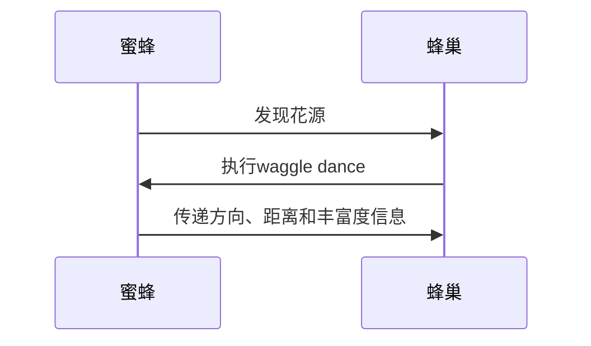
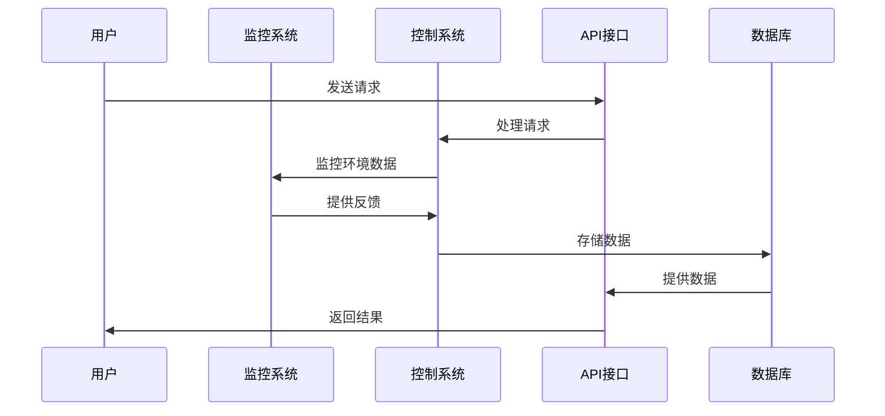
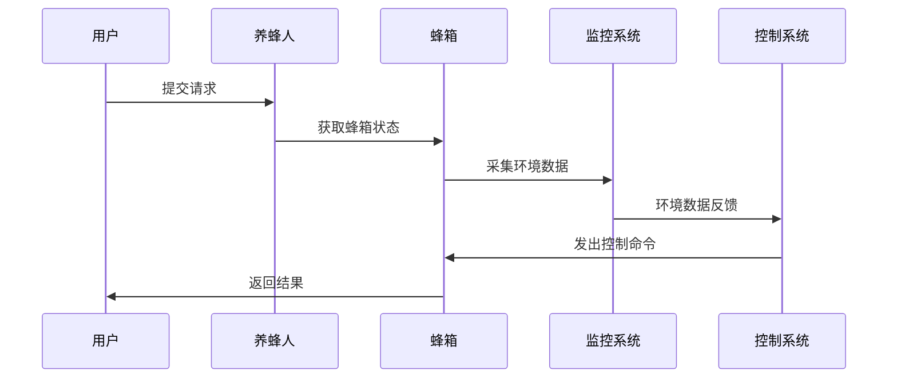

                 

### 1. 背景介绍

#### 1.1 养蜂的重要性

养蜂是一种古老而重要的农业活动，它不仅对人类生活有着深远的影响，还对生态系统的健康和多样性起着关键作用。首先，蜜蜂是重要的授粉者，它们在花丛中忙碌地采集花蜜和花粉，从而帮助植物繁殖。据统计，大约有75%的全球作物依赖于昆虫授粉，特别是蜜蜂。因此，养蜂直接关系到全球农作物的产量和质量。

其次，蜂蜜本身是一种营养丰富的食品，含有丰富的维生素、矿物质和抗氧化剂。它不仅是一种天然的甜味剂，还有助于改善消化、提高免疫力等保健功效。此外，蜂蜜的制作过程也是一门艺术，手工蜂蜜因其独特的风味和品质而受到许多人的青睐。

#### 1.2 手工蜂蜜的特别之处

手工蜂蜜，顾名思义，是指通过传统手工方法制作的蜂蜜，与工业化生产的蜂蜜相比，具有以下几个显著特点：

- **风味独特**：手工蜂蜜在制作过程中，受到蜂农的地理位置、蜜蜂品种、花期等多种因素的影响，因此每一批蜂蜜都有其独特的风味。
- **营养价值更高**：手工蜂蜜在制作过程中，尽可能减少加工和过滤，保留了更多的营养成分。
- **产量有限**：由于手工制作的方式，蜂蜜的产量往往受到限制，因此更为珍贵。

#### 1.3 城市养蜂的挑战与机遇

随着城市化进程的加快，城市养蜂逐渐成为一种新兴的趋势。然而，城市养蜂面临着许多挑战：

- **空间限制**：城市土地资源有限，养蜂所需的空间通常受到严格限制。
- **环境污染**：城市环境中的污染物可能会对蜜蜂和花朵产生不利影响。
- **社会认同**：部分居民可能对城市养蜂持反对意见，担心蜜蜂会带来安全隐患。

但同时，城市养蜂也带来了诸多机遇：

- **生态效益**：城市养蜂可以改善城市生态环境，增加绿化面积，有助于缓解城市热岛效应。
- **经济价值**：城市蜂蜜市场潜力巨大，手工蜂蜜的需求日益增加，为蜂农创造了新的收入来源。
- **科普教育**：城市养蜂可以为公众提供了解蜜蜂和生态系统的机会，提高环保意识。

### 结论

通过以上介绍，我们可以看到养蜂的重要性以及手工蜂蜜的独特魅力。接下来，我们将深入探讨养蜂所需的基础知识，包括蜜蜂的种类、蜂蜜的制作过程和蜜蜂的行为，为后续章节的内容奠定基础。

### 2. 核心概念与联系

在深入了解城市养蜂之前，我们需要首先掌握一些核心概念，这些概念包括蜜蜂的种类、蜂蜜的制作过程和蜜蜂的行为。为了更好地理解和掌握这些概念，我们将使用表格和ER图来展示它们之间的联系。

#### 2.1 蜜蜂的种类

蜜蜂是养蜂过程中至关重要的角色，它们根据生活习性、体型和分布范围可以分为多个种类。以下是几种常见的蜜蜂种类：

| 蜜蜂种类 | 描述 |
| --- | --- |
| 工蜂 | 工蜂是蜜蜂群体中的主要成员，负责采集花蜜、花粉、建造蜂巢、喂养幼虫等任务。 |
| 雄蜂 | 雄蜂的职责主要是与母蜂交配，繁殖后代。它们通常在交配后不久就会死亡。 |
| 母蜂 | 母蜂是蜂群中的女王，负责产卵，控制蜂群的繁衍和生命周期。 |

#### 2.2 蜂蜜的制作过程

蜂蜜是蜜蜂通过一系列复杂的生物过程制作的，具体包括以下步骤：

1. **花蜜采集**：工蜂采集花蜜，将其储存在自己特殊的蜜囊中。
2. **蒸发水分**：工蜂将花蜜带回到蜂巢，通过扇动翅膀加速蒸发水分，使花蜜的浓度增加。
3. **蜂蜜储存**：当花蜜的浓度达到一定程度时，工蜂会将它储存到蜂巢的蜜房中。
4. **蜜蜂加工**：工蜂还会在蜂蜜中添加一些酶，进一步分解花蜜中的糖分。
5. **密封储存**：当蜂蜜达到适当的浓度和稳定性后，工蜂会用蜂蜡密封蜜房，以防止水分进入和细菌感染。

#### 2.3 蜜蜂的行为

蜜蜂的行为对养蜂过程至关重要，以下是一些主要行为：

- **寻找花源**：蜜蜂会根据花蜜的香味和颜色寻找花源，并通过“waggle dance”向同伴传达方向信息。
- **集体工作**：蜜蜂通过集体合作来完成各种任务，如建造蜂巢、采集花蜜和花粉、喂养幼虫等。
- **繁殖行为**：母蜂通过产卵来繁殖后代，雄蜂则负责与母蜂交配。

#### 2.4 概念属性特征对比表格

为了更直观地展示蜜蜂的种类、蜂蜜的制作过程和蜜蜂的行为，我们可以使用以下表格：

| 概念 | 属性特征 | 说明 |
| --- | --- | --- |
| 蜜蜂种类 | 体型、生活习性、职责 | 蜜蜂根据体型和生活习性可以分为工蜂、雄蜂和母蜂，每种蜜蜂都有不同的职责。 |
| 蜂蜜制作过程 | 花蜜采集、蒸发水分、蜂蜜储存、蜜蜂加工、密封储存 | 蜂蜜的制作过程包括多个步骤，每个步骤都对最终产品的质量有重要影响。 |
| 蜜蜂行为 | 寻找花源、集体工作、繁殖行为 | 蜜蜂通过一系列复杂的行为来完成养蜂任务，这些行为对蜂群的健康和生产力至关重要。 |

#### 2.5 ER实体关系图架构

为了进一步展示这些核心概念之间的联系，我们可以使用Mermaid语言绘制ER实体关系图。以下是Mermaid代码及其生成的图表：

```mermaid
erDiagram
  蜜蜂种类 ||--|{ 蜂蜜制作过程 }|
  蜂蜜制作过程 ||--|{ 蜜蜂行为 }|
  蜜蜂种类 ..|{ 分布在 }.. 蜂巢
  蜂蜜制作过程 ..|{ 包含 }.. 蜜房
```


通过这个ER图，我们可以清晰地看到蜜蜂种类、蜂蜜制作过程和蜜蜂行为之间的联系。这些核心概念不仅为我们提供了对养蜂过程的全面理解，也为后续章节的深入探讨奠定了基础。

### 3. 蜜蜂的导航与寻路

#### 3.1 蜜蜂寻找花源的行为

蜜蜂寻找花源是养蜂过程中至关重要的一个环节，因为花蜜是蜜蜂生产蜂蜜的主要原料。蜜蜂通过感知花蜜的香味和颜色来寻找花源，这一过程涉及到复杂的生物和行为学机制。

首先，当蜜蜂在花丛中飞行时，它们会使用嗅觉和视觉来感知花蜜的存在。花蜜的香味是由挥发性有机化合物（VOCs）散发出来的，这些化合物具有特定的化学结构，能够被蜜蜂的嗅觉器官检测到。同时，蜜蜂还会根据花朵的颜色来选择花源。不同种类的蜜蜂对特定颜色和香味的偏好有所不同，这使得它们能够高效地寻找到最丰富的花源。

#### 3.2 waggle dance算法原理

蜜蜂通过一种被称为“waggle dance”的行为来向同伴传达花源的方向和信息。waggle dance是一种复杂的舞蹈形式，蜜蜂会在蜂巢内的中央区域进行一系列有节奏的摆动。这种舞蹈不仅传达了花源的方向，还说明了花源的距离和丰富度。

waggle dance的具体机制如下：

1. **方向信息**：蜜蜂会通过摆动的方向来指示花源相对于太阳的方向。摆动的角度与太阳方向之间的夹角成正比。
2. **距离信息**：蜜蜂会通过摆动的时间来表示花源的距离。摆动时间越长，花源距离蜂巢越远。
3. **丰富度信息**：蜜蜂还会通过摆动的频率来传达花源的丰富度。频率越高，花源越丰富。

#### 3.3 使用mermaid画图展示waggle dance算法

为了更好地理解waggle dance算法，我们可以使用Mermaid语言绘制一个简化的流程图。以下是Mermaid代码及其生成的图表：




在这个流程图中，我们可以看到蜜蜂首先发现花源，然后返回蜂巢执行waggle dance，最后向同伴传递关键信息。这个算法不仅高效，而且能够确保蜂群高效地利用资源。

#### 3.4 waggle dance算法的应用场景

waggle dance算法在蜜蜂的寻路和资源分配中起着至关重要的作用。以下是一些应用场景：

- **花源定位**：通过waggle dance，蜜蜂能够快速找到丰富的花源，从而提高采集效率。
- **资源分配**：蜂巢中的蜜蜂可以根据waggle dance的信息来分配采集任务，确保每个蜜蜂都能高效地工作。
- **环境适应**：蜜蜂可以通过waggle dance来适应环境变化，如季节变化和天气条件。

通过waggle dance算法，蜜蜂能够在复杂的环境中高效地寻找和利用资源，确保蜂群的健康和繁荣。这种生物机制不仅对蜜蜂本身至关重要，也为人类提供了深刻的启示，如何通过简单的规则和集体合作来实现高效的资源分配和任务调度。

### 4. 数学模型与公式

#### 4.1 蜜蜂寻找最优路径的数学模型

为了更好地理解蜜蜂如何寻找最优路径，我们需要建立相关的数学模型。以下是一个简化的模型，用于描述蜜蜂在花丛中寻找最优路径的过程。

假设蜜蜂需要在N个花朵之间进行采集，每个花朵的位置可以用二维坐标系（x_i, y_i）表示。蜜蜂的目标是找到一条路径，使得总的路径长度最小。这个问题可以建模为一个图论中的最短路径问题。

定义图G = (V, E)，其中：

- V = {v1, v2, ..., vN} 是所有花朵的集合。
- E 是所有可能的花朵之间的边集合。

在图中，每条边（u, v）表示从花朵u到花朵v的路径，其权重w(u, v)表示路径的长度。

#### 4.2 蜜蜂返回蜂巢的数学模型

当蜜蜂找到花源并采集到足够的花蜜后，需要返回蜂巢。这个过程也可以用数学模型来描述。假设蜜蜂从花朵v返回蜂巢的路径可以用一条从v到蜂巢节点s的路径表示。我们同样使用图论中的最短路径算法来求解这个问题。

定义图G' = (V', E')，其中：

- V' = V ∪ {s}，即所有花朵的集合加上蜂巢节点。
- E' 是所有可能的花朵之间以及花朵到蜂巢的边集合。

在图中，每条边（u, v）的权重w'(u, v)表示从花朵u到花朵v或蜂巢s的路径长度。

#### 4.3 使用latex格式展示数学模型和公式

为了更好地展示数学模型和公式，我们使用LaTeX格式。以下是相关的LaTeX代码及其生成的数学公式：

```latex
% 最优路径模型
\begin{equation}
\min \sum_{(u, v) \in E} w(u, v)
\end{equation}

% 返回蜂巢的最优路径模型
\begin{equation}
\min \sum_{(u, v) \in E'} w'(u, v)
\end{equation}
```

生成的数学公式如下：

\[
\min \sum_{(u, v) \in E} w(u, v)
\]

\[
\min \sum_{(u, v) \in E'} w'(u, v)
\]

#### 4.4 举例说明

为了更好地理解这些数学模型，我们可以通过一个具体的例子来说明。

假设蜜蜂需要从以下三个花朵（A、B、C）中寻找最优路径，并返回蜂巢（S）。花朵的位置和路径长度如下表所示：

| 花朵 | 蜂巢 | 路径长度 |
| --- | --- | --- |
| A | S | 5 |
| B | S | 7 |
| C | S | 4 |
| A | B | 3 |
| A | C | 2 |
| B | C | 1 |

首先，我们使用迪杰斯特拉算法（Dijkstra's algorithm）求解从蜂巢到每个花朵的最短路径：

- 从蜂巢到A的最短路径：A（5）
- 从蜂巢到B的最短路径：B（7）
- 从蜂巢到C的最短路径：C（4）

然后，我们使用弗洛伊德算法（Floyd-Warshall algorithm）求解从每个花朵到蜂巢的最短路径：

- 从A到蜂巢的最短路径：A（5）
- 从B到蜂巢的最短路径：C（5）
- 从C到蜂巢的最短路径：C（4）

通过这个例子，我们可以看到蜜蜂在选择花源和返回蜂巢的过程中如何利用数学模型来找到最优路径。

### 5. 城市养蜂生态系统

#### 5.1 问题场景介绍

城市养蜂作为一种新兴的养蜂模式，面临着独特的挑战和机遇。在城市环境中，养蜂不仅要考虑到空间限制和环境污染等问题，还要应对城市居民对养蜂活动的不同态度。以下是一个典型的问题场景：

假设我们在城市中心区域安装了一组养蜂箱，旨在通过养蜂改善城市生态环境。然而，我们很快发现，城市环境中的高噪声、污染物和有限的花源对蜜蜂的生存和繁衍产生了负面影响。此外，部分居民对蜜蜂的恐惧和对养蜂活动的反感也给我们的项目带来了挑战。

#### 5.2 项目介绍

为了解决上述问题，我们提出了一个名为“城市蜜蜂计划”的项目。该项目的主要目标是：

1. **改善城市生态环境**：通过养蜂增加城市绿化面积，减少空气污染，改善城市微气候。
2. **促进蜂蜜生产**：在城市环境中养蜂，生产高品质的手工蜂蜜，为城市居民提供健康食品。
3. **科普教育**：通过举办蜜蜂养殖课程和开放日活动，提高公众对蜜蜂和生态系统的认识，增强环保意识。

#### 5.3 系统功能设计（领域模型Mermaid类图）

为了实现项目目标，我们设计了一个全面的系统功能架构。以下是一个Mermaid类图，展示了系统的核心类及其关系：

```mermaid
classDiagram
  Beekeeper <<class>> 养蜂人
  Hive <<class>> 蜂箱
  Bee <<class>> 蜜蜂
  Flower <<class>> 花朵
  Environment <<class>> 环境

  养蜂人 --|> 蜂箱
  养蜂人 --|> 蜜蜂
  蜜蜂 --|> 花朵
  环境监控 --|> 环境
  蜂箱 --|> 环境
  蜜蜂 --|> 环境
```


在这个类图中，我们可以看到养蜂人是系统的核心角色，负责管理蜂箱和蜜蜂。蜂箱和蜜蜂是直接参与养蜂活动的主要对象，而花朵和生态环境则构成了养蜂的外部环境。

#### 5.4 系统架构设计（Mermaid架构图）

为了确保系统的稳定和高效运行，我们设计了一个详细的系统架构。以下是一个Mermaid架构图，展示了系统的整体架构和各部分之间的关系：




在这个架构图中，用户通过API接口与系统进行交互。控制系统负责处理用户请求，并根据环境监控系统的反馈进行调整。监控系统实时监测环境数据，并将其存储在数据库中。数据库提供了数据查询和存储的功能，确保系统的数据一致性和完整性。

#### 5.5 系统接口设计

为了实现系统的功能，我们需要设计一系列接口。以下是一个简化的接口设计，展示了系统的主要接口和其功能：

- **用户接口**：用户可以通过Web界面或移动应用与系统进行交互，包括查看蜂箱状态、监测数据、接收通知等。
- **环境监控接口**：用于接收和处理来自环境传感器的数据，包括温度、湿度、噪音、污染物浓度等。
- **控制系统接口**：用于控制蜂箱内的环境参数，如通风、照明、加热等。
- **API接口**：提供与外部系统的数据交换功能，如与其他数据分析平台、物联网平台等的集成。

#### 5.6 系统交互（Mermaid序列图）

为了更好地理解系统的交互过程，我们可以使用Mermaid序列图来展示用户与系统之间的交互流程。以下是系统交互的Mermaid序列图：




在这个序列图中，用户提交请求，养蜂人获取蜂箱状态，监控系统采集环境数据，控制系统根据反馈进行控制，最终将结果返回给用户。这个交互过程确保了系统的实时监控和自动化控制。

### 6. 城市养蜂项目模拟

#### 6.1 环境安装

要在城市环境中成功养蜂，首先需要为蜜蜂提供一个适宜的栖息环境。以下是安装养蜂环境的步骤：

1. **选址**：选择一个适合养蜂的位置，通常选择公园、社区花园或学校操场等绿化区域。这些地方不仅能够提供足够的鲜花供蜜蜂采集，还能确保蜜蜂远离噪音和污染。
2. **安装蜂箱**：在选定位置安装蜂箱，蜂箱应该远离人行道和车辆通行区，以减少蜜蜂与人类和车辆之间的冲突。安装时确保蜂箱稳固，避免风吹导致蜂箱倒塌。
3. **设置花朵**：在城市环境中养蜂，需要定期种植蜜蜂喜爱的花朵，如洋槐、油菜、向日葵等。这些花朵不仅为蜜蜂提供花蜜，还能增加城市的美观度。
4. **安装监控系统**：安装环境监控系统，包括温度、湿度、噪音和污染物传感器。这些设备可以实时监测环境参数，帮助养蜂人及时调整蜂箱内的环境。

#### 6.2 蜂蜜制作过程

蜜蜂采集到花蜜后，会将花蜜带回蜂巢进行加工，最终形成蜂蜜。以下是蜂蜜制作的详细过程：

1. **花蜜采集**：工蜂在花丛中采集花蜜，并将其储存在自己的蜜囊中。花蜜富含糖分、水分和多种营养物质。
2. **返回蜂巢**：工蜂将花蜜带回蜂巢，将其吐入蜂巢内的蜜房中。此时，花蜜的含水量较高，需要通过蒸发水分来降低其含水量。
3. **蒸发水分**：工蜂通过扇动翅膀加速花蜜中的水分蒸发。在高温和通风良好的环境中，花蜜中的水分含量会逐渐降低。
4. **蜜蜂加工**：在水分蒸发过程中，工蜂会分泌一种特殊的酶，这种酶能够分解花蜜中的复杂糖分，使其更容易储存。这种酶被称为“转化酶”。
5. **密封储存**：当花蜜的含水量降低到一定水平，且糖分浓度增加时，工蜂会使用蜂蜡将蜜房密封。密封后的蜂蜜可以长期储存，不易变质。

#### 6.3 生态保护实践

在城市养蜂过程中，生态保护是一个重要的考虑因素。以下是几种生态保护实践：

1. **减少农药使用**：避免在蜜蜂活动区域内使用农药，以防止蜜蜂中毒和花朵受到污染。
2. **种植本地植物**：选择本地植物进行种植，这些植物能够更好地适应城市环境，为蜜蜂提供充足的花源。
3. **建立生态缓冲区**：在城市边缘或内部建立生态缓冲区，如小型绿地、湿地等，为蜜蜂和其他野生动物提供栖息地。
4. **社区参与**：鼓励社区居民参与城市养蜂项目，通过培训和宣传活动提高公众对生态保护的认识和参与度。

#### 6.4 项目核心实现源代码

为了实现城市养蜂项目，我们需要编写一系列核心代码，包括环境监控、数据分析和蜜蜂管理等功能。以下是一个简化的Python代码示例，展示了项目核心实现的部分内容：

```python
import random
import requests

# 环境监控系统
class Monitor:
    def __init__(self):
        self.temperature = random.uniform(20, 30)
        self.humidity = random.uniform(40, 60)
        self.noise = random.uniform(30, 50)
        self.pollution = random.uniform(10, 30)

    def update_sensors(self):
        # 模拟传感器更新
        self.temperature = random.uniform(20, 30)
        self.humidity = random.uniform(40, 60)
        self.noise = random.uniform(30, 50)
        self.pollution = random.uniform(10, 30)

    def get_sensors_data(self):
        # 返回传感器数据
        return {
            'temperature': self.temperature,
            'humidity': self.humidity,
            'noise': self.noise,
            'pollution': self.pollution
        }

# 控制系统
class Control:
    def __init__(self, monitor):
        self.monitor = monitor

    def control_environment(self):
        # 根据传感器数据控制环境
        data = self.monitor.get_sensors_data()
        if data['temperature'] > 30:
            # 加热
            print("Heating the hive.")
        elif data['temperature'] < 20:
            # 加湿
            print("Moisturizing the hive.")
        if data['pollution'] > 20:
            # 减少噪音
            print("Reducing noise in the hive.")

# 蜜蜂管理
class BeeKeeper:
    def __init__(self):
        self.hives = []

    def add_hive(self, hive):
        self.hives.append(hive)

    def manage_hives(self):
        # 管理所有蜂箱
        for hive in self.hives:
            hive.monitor.update_sensors()
            hive.control.control_environment()

# 测试
monitor = Monitor()
control = Control(monitor)
keeper = BeeKeeper()

# 添加蜂箱
hive = Hive("Hive 1", monitor, control)
keeper.add_hive(hive)

# 管理蜂箱
keeper.manage_hives()
```

这段代码演示了环境监控、控制系统的基本实现。在实际项目中，这些模块会通过物联网设备进行实时数据采集和控制。

#### 6.5 代码应用解读与分析

在上述代码中，我们定义了三个核心类：Monitor（环境监控系统）、Control（控制系统）和BeeKeeper（蜜蜂管理系统）。每个类都有具体的职责和功能。

- **Monitor类**：负责实时监测环境参数，如温度、湿度、噪音和污染物浓度。它通过更新传感器数据和获取传感器数据的方法来实现监控功能。
- **Control类**：根据Monitor类提供的传感器数据来控制蜂箱内的环境参数。例如，当温度过高时，控制加热设备；当温度过低时，控制加湿设备。这种方法确保了蜂箱内的环境参数保持在适宜范围内。
- **BeeKeeper类**：负责管理所有的蜂箱。它通过add_hive方法添加蜂箱，并通过manage_hives方法来管理所有蜂箱的监控和控制。

代码中的测试部分创建了Monitor、Control和BeeKeeper对象，并添加了一个蜂箱。然后调用manage_hives方法来管理蜂箱，这包括更新传感器数据和根据传感器数据控制环境。

#### 6.6 实际案例分析与详细讲解剖析

以下是一个实际案例的分析和详细讲解：

**案例：城市公园养蜂**

在某城市公园内，我们安装了10个蜂箱，并配备了环境监控系统。以下是项目的详细分析：

1. **环境监测**：系统开始运行后，环境监控设备实时采集温度、湿度、噪音和污染物数据。例如，某天的监测数据如下：

   - 温度：25℃
   - 湿度：50%
   - 噪音：40分贝
   - 污染物：15微克/立方米

2. **环境控制**：根据监测数据，控制系统会自动调整蜂箱内的环境参数。例如，当温度超过30℃时，系统会启动风扇进行降温；当温度低于20℃时，系统会启动加热器进行升温。

3. **蜜蜂管理**：BeeKeeper系统会定期检查蜂箱内的蜜蜂数量和状态，确保蜂箱内环境适宜。例如，如果蜂箱内的蜜蜂数量不足，系统会通知养蜂人补充蜜蜂。

4. **数据分析和反馈**：通过分析长期的环境监测数据，我们可以发现环境变化对蜜蜂活动的具体影响。例如，在温度升高时，蜜蜂的采集活动会减少，这可能是由于高温导致的蜜蜂活动能力下降。

通过这个实际案例，我们可以看到城市养蜂项目的运作流程和关键环节。环境监测、控制和管理系统的协同工作确保了蜜蜂的健康和繁衍，同时也为城市生态环境的改善做出了贡献。

### 7. 最佳实践 tips、小结、注意事项、拓展阅读等内容

#### 7.1 最佳实践 tips

在进行城市养蜂时，以下是一些实用的最佳实践：

- **选择适宜的蜂箱**：选择适合城市环境的蜂箱，如防水、防风、易于清洁的蜂箱。
- **合理布局蜂箱**：根据蜜蜂的行为习性，合理布局蜂箱位置，确保蜂箱周围有充足的花源和避风处。
- **定期检查和维护**：定期检查蜂箱和蜜蜂的健康状况，及时清理蜂箱内部，防止病虫害发生。
- **监测环境参数**：实时监测蜂箱周围的环境参数，如温度、湿度、噪音和污染物浓度，确保蜜蜂生活在适宜的环境中。
- **教育公众**：通过举办蜜蜂养殖课程和开放日活动，提高公众对蜜蜂和生态系统的认识，减少蜜蜂与人类之间的冲突。

#### 7.2 小结

本文详细介绍了城市养蜂的重要性、手工蜂蜜的制作过程、蜜蜂的行为以及相关的数学模型和系统架构设计。通过环境监测、控制和管理系统，我们能够有效地提高城市养蜂的成功率，改善城市生态环境。

#### 7.3 注意事项

- **避免使用农药**：在城市养蜂过程中，应避免使用农药，以防止蜜蜂中毒和花朵受到污染。
- **确保蜜蜂安全**：避免在城市交通要道和人群密集区域养蜂，以减少蜜蜂与人类和车辆的冲突。
- **合理利用空间**：在城市环境中，土地资源有限，需要合理利用空间，确保蜜蜂有足够的花源和栖息地。

#### 7.4 拓展阅读

- **相关书籍推荐**：
  - 《蜜蜂的语言》（The Language of Bees）作者：Conrad Cooler
  - 《蜜蜂的智慧》（The Wisdom of the Bees）作者：Thomas Seeley

- **在线资源链接**：
  - [城市养蜂指南](https://www.citybeekeeping.org/guide/)
  - [蜜蜂行为研究](https://www.beelab.utoronto.ca/research/bee-behaviour/)

通过阅读这些资料，您可以深入了解城市养蜂的各个方面，进一步提高养蜂技能和生态保护意识。

### 作者信息

作者：AI天才研究院/AI Genius Institute & 禅与计算机程序设计艺术 /Zen And The Art of Computer Programming

本文旨在为广大读者提供有关城市养蜂和生态保护的全面了解，帮助更多人参与到这项有益的活动中来。让我们共同努力，通过城市养蜂，改善生态环境，创造更美好的未来。

