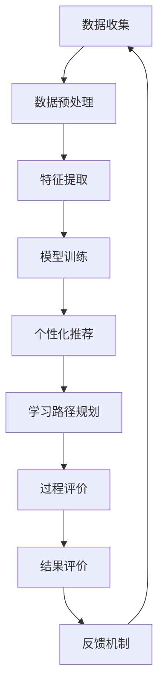
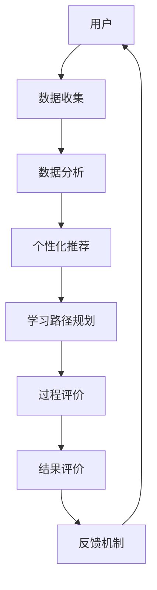

                 

### 文章标题

《现代教育的目标重塑：培养全面发展的世界公民》

---

#### 关键词

- 现代教育
- 教育目标
- 全面发展
- 世界公民
- 教育改革

---

#### 摘要

随着全球化进程的加速和科技革命的深入，现代教育面临着前所未有的挑战和机遇。本文旨在探讨如何通过重塑教育目标，培养具有全球视野、跨文化交流能力和国际责任感的全面发展世界公民。文章首先分析了现代教育面临的问题，阐述了教育目标重塑的必要性，然后详细介绍了全面发展的世界公民概念及其特征。通过算法原理讲解，本文提出了数据驱动的教育模型和学生个性化发展算法，并结合数学模型和公式进行了详细阐述。最后，文章探讨了系统架构设计与教育目标实现，并给出了具体的项目实战案例和最佳实践建议。

---

### 目录大纲设计

---

#### 第一部分：背景介绍

##### 第1章：问题背景与重塑现代教育目标

- **1.1** 现代教育面临的问题
  - **1.1.1** 教育同质化问题
  - **1.1.2** 学生个性发展受限制
  - **1.1.3** 教育与社会需求脱节

- **1.2** 教育目标重塑的必要性
  - **1.2.1** 培养全面发展的个体
  - **1.2.2** 增强全球竞争力
  - **1.2.3** 适应未来社会需求

- **1.3** 现代教育的边界与外延
  - **1.3.1** 教育内容与形式的发展
  - **1.3.2** 教育资源的分配与共享
  - **1.3.3** 教育制度的创新与改革

##### 第2章：全面发展的世界公民：概念解析与特征

- **2.1** 全面发展的定义
  - **2.1.1** 身心发展
  - **2.1.2** 社会适应能力
  - **2.1.3** 创新思维与创造力

- **2.2** 世界公民的特点
  - **2.2.1** 全球视野
  - **2.2.2** 跨文化交流能力
  - **2.2.3** 国际责任感

- **2.3** 核心概念对比分析
  - **2.3.1** 全面发展与世界公民的交集与差异
  - **2.3.2** 个体成长与社会责任的关系
  - **2.3.3** 教育与全球化的联系

##### 第3章：教育目标重塑的算法原理

- **3.1** 教育目标重塑的算法框架
  - **3.1.1** 数据驱动的教育模型
  - **3.1.2** 学生个性化发展算法
  - **3.1.3** 教育评价与反馈机制

- **3.2** 算法原理详细讲解
  - **3.2.1** 数学模型与公式
  - **3.2.2** Mermaid流程图展示
  - **3.2.3** 举例说明

##### 第4章：数学模型与教育目标重塑

- **4.1** 教育目标函数
  - **4.1.1** 学生发展目标函数
  - **4.1.2** 教育资源配置函数

- **4.2** 数学公式应用
  - **4.2.1** 学生满意度计算
  - **4.2.2** 教育资源优化

##### 第5章：系统架构设计与教育目标实现

- **5.1** 系统功能设计
  - **5.1.1** 功能模块划分

- **5.2** 系统架构设计
  - **5.2.1** Mermaid架构图展示
  - **5.2.2** 系统接口设计

##### 第6章：系统分析与架构设计

- **6.1** 系统功能设计
  - **6.1.1** 功能模块划分

- **6.2** 系统架构设计
  - **6.2.1** Mermaid架构图展示
  - **6.2.2** 系统接口设计

##### 第7章：项目实战

- **7.1** 环境安装
- **7.2** 系统核心实现源代码
- **7.3** 代码应用解读与分析
- **7.4** 实际案例分析和详细讲解剖析
- **7.5** 项目小结

##### 第8章：最佳实践 tips、小结、注意事项、拓展阅读

---

### 第一部分：背景介绍

#### 第1章：问题背景与重塑现代教育目标

##### 1.1 现代教育面临的问题

随着全球化和信息化的迅猛发展，现代教育面临着前所未有的挑战。以下是一些主要的问题：

###### 1.1.1 教育同质化问题

首先，教育同质化问题日益凸显。在许多国家，教育体系呈现出高度的同质性，学校的教学内容、教学方法、评价标准等方面差异不大。这种同质化导致了学生个性的发展和创造力的培养受到限制，难以满足个体差异化的需求。

###### 1.1.2 学生个性发展受限制

其次，学生的个性发展受到限制。传统的教育体系过于强调知识的传授和应试能力的培养，而忽视了学生兴趣、爱好和潜能的开发。这种教育模式往往导致学生缺乏独立思考和创新能力，难以适应未来社会的需求。

###### 1.1.3 教育与社会需求脱节

最后，教育与社会需求脱节的问题也越来越严重。随着科技的进步和经济的快速发展，社会对人才的需求发生了很大的变化。然而，许多教育体系尚未及时调整，仍然停留在传统的教育模式中，导致培养出来的学生难以适应现代社会的需求。

##### 1.2 教育目标重塑的必要性

针对上述问题，重塑现代教育的目标显得尤为迫切和必要：

###### 1.2.1 培养全面发展的个体

首先，教育目标需要从单一的知识传授转向全面发展的培养。全面发展不仅包括学术能力的培养，还包括身体素质、心理素质、社会适应能力、创新能力和国际视野等方面。只有全面发展的个体才能更好地适应未来的社会和职业挑战。

###### 1.2.2 增强全球竞争力

其次，教育目标需要增强全球竞争力。在全球化背景下，拥有全球视野和跨文化交流能力的人才越来越受到社会的青睐。重塑教育目标，培养具有国际竞争力的个体，是提升国家整体竞争力的重要途径。

###### 1.2.3 适应未来社会需求

最后，教育目标需要适应未来社会需求。随着科技的不断进步，未来的社会将更加智能化、数字化和全球化。教育需要提前布局，培养能够适应未来社会变化的人才，以应对未来的挑战。

##### 1.3 现代教育的边界与外延

为了实现教育目标的重塑，需要对现代教育的边界与外延进行重新定义：

###### 1.3.1 教育内容与形式的发展

首先，教育内容需要与时俱进，不断更新和扩展。教育不仅应涵盖传统的学科知识，还应包括跨学科的综合素养和实用技能。同时，教育形式也需要创新，如在线教育、远程教育、游戏化学习等新型教育模式，以满足不同学习者的需求。

###### 1.3.2 教育资源的分配与共享

其次，教育资源的分配与共享也需要重新审视。教育资源的不平等是当前教育领域的一大问题。重塑教育目标需要通过政策调整和技术手段，实现教育资源的公平分配和共享，缩小教育差距。

###### 1.3.3 教育制度的创新与改革

最后，教育制度的创新与改革是重塑教育目标的重要保障。教育制度需要从顶层设计入手，打破现有体制的束缚，推动教育制度的现代化改革。如推进教育评价体系的改革，建立以学生全面发展为导向的评价机制，激发学生的学习兴趣和创造力。

---

在接下来的章节中，我们将进一步探讨全面发展的世界公民的概念及其特征，详细分析教育目标重塑的算法原理，并运用数学模型和公式进行深入讲解。通过系统架构设计与教育目标实现的分析，我们将展示一个具体的实施方案。最后，通过项目实战和最佳实践，我们将为教育目标重塑提供实际操作的指导。

---

### 第二部分：核心概念与联系

#### 第2章：全面发展的世界公民：概念解析与特征

在探讨如何重塑现代教育目标的过程中，全面发展的世界公民这一概念显得尤为重要。本章节将详细解析这一核心概念，并探讨其特征及其在教育目标重塑中的作用。

##### 2.1 全面发展的定义

全面发展的理念源于对人全面发展的追求，它不仅仅局限于学术成绩的提高，更强调个体在各个方面的成长和进步。以下是全面发展的一些关键要素：

###### 2.1.1 身心发展

身心发展是指个体的身体和心理的协调发展。身体发展包括健康的体魄、良好的体能和运动技能；心理发展则涉及情感管理、自我认知、社会交往和意志力等方面。一个身心健康的个体能够更好地应对学习和生活中的各种挑战。

###### 2.1.2 社会适应能力

社会适应能力是指个体在社会环境中生存和发展所需的能力。这包括对多样性的包容、团队协作、领导力和冲突解决能力等。具备良好社会适应能力的个体能够更好地适应社会变化，建立和谐的人际关系。

###### 2.1.3 创新思维与创造力

创新思维与创造力是现代教育中不可或缺的要素。一个具备创新思维的个体能够从不同角度思考问题，发现新的解决方案，推动社会和科技的进步。创造力则是对这一思维能力的实际应用，通过创造性的工作改变世界。

##### 2.2 世界公民的特点

世界公民的概念超越了国家界限，强调个体的全球视野、跨文化交流能力和国际责任感。以下是世界公民的一些关键特征：

###### 2.2.1 全球视野

全球视野是指个体能够理解和关注全球性问题，具备国际事务的知识和洞察力。一个具有全球视野的世界公民能够站在全球的高度看待问题，积极参与国际事务，为全球的和平与发展贡献力量。

###### 2.2.2 跨文化交流能力

跨文化交流能力是指个体在不同文化背景下有效沟通和互动的能力。这包括对文化差异的敏感度、尊重和理解不同文化的习惯和价值观，以及能够在多元文化环境中自如地生活和工作的能力。

###### 2.2.3 国际责任感

国际责任感是指个体对于全球社会和环境的责任和义务感。一个具有国际责任感的世界公民不仅关注自己的利益，更关心全球的福祉，积极参与到国际社会的公共事务中去，为全球的发展和环境可持续性贡献力量。

##### 2.3 核心概念对比分析

在深入探讨全面发展的世界公民这一概念时，有必要对其进行对比分析，以明确其交集与差异，以及个体成长与社会责任之间的关系。

###### 2.3.1 全面发展与世界公民的交集与差异

全面发展与世界公民的交集在于两者都强调个体的综合素质和全面发展。全面发展注重个体的身心健康、社会适应能力和创新思维，而世界公民则在此基础上，强调了全球视野、跨文化交流能力和国际责任感。可以说，全面发展是世界公民的基础，而世界公民则是全面发展的更高阶段。

全面发展与世界公民的差异主要体现在关注点的不同。全面发展更侧重于个体的内部成长，而世界公民则更侧重于个体的外部影响力和社会责任感。全面发展关注个体的全面发展，而世界公民则强调个体在全球化背景下的角色和责任。

###### 2.3.2 个体成长与社会责任的关系

个体成长与社会责任是紧密相连的。个体成长是社会责任的基础，一个全面发展、具有全球视野的个体更有可能承担起社会责任，为社会的进步和全球的和谐贡献力量。同时，社会责任也是个体成长的动力，通过承担社会责任，个体能够实现自我价值，进一步提升自己的成长。

在教育目标重塑的过程中，个体成长与社会责任的平衡至关重要。教育不仅要培养个体的综合素质，还要引导个体认识到自己的社会责任，将个体的成长与社会责任相结合，培养出真正全面发展的世界公民。

###### 2.3.3 教育与全球化的联系

全球化对教育产生了深远的影响，也赋予了教育新的使命。全球化使得不同国家和地区之间的联系更加紧密，教育需要培养具有全球视野和跨文化交流能力的个体，以适应全球化的挑战和机遇。

教育是全球化的推动器，通过培养世界公民，教育可以为全球化注入新的活力。同时，全球化也为教育提供了丰富的资源，如国际化的课程、多元文化的教学方法和先进的教育技术等。教育与全球化的紧密联系，使得教育目标重塑具有了更加广阔的背景和深远的意义。

---

在本章节中，我们通过对全面发展与世界公民的概念解析与对比分析，明确了现代教育目标重塑的必要性。全面发展的世界公民不仅具备个体的综合素质，更具备全球视野和国际责任感。在接下来的章节中，我们将进一步探讨教育目标重塑的算法原理，结合数学模型和公式，为现代教育目标的实现提供技术支持。

---

### 第三部分：算法原理讲解

#### 第3章：教育目标重塑的算法原理

在教育目标重塑的过程中，算法原理起到了关键作用。本章节将详细介绍教育目标重塑的算法框架、原理及其应用。

##### 3.1 教育目标重塑的算法框架

教育目标重塑的算法框架主要包括数据驱动的教育模型、学生个性化发展算法和教育评价与反馈机制。以下是具体内容：

###### 3.1.1 数据驱动的教育模型

数据驱动的教育模型是基于大数据分析和机器学习技术构建的教育模型。该模型通过收集和分析大量的教育数据，包括学生的学习行为、成绩、兴趣、家庭背景等，来预测和指导学生的个性化发展。

- **数据收集**：通过学校管理系统、学习平台、在线课程等渠道收集学生的学习数据。
- **数据预处理**：对收集到的数据进行清洗、去噪和格式化，使其符合算法分析的要求。
- **特征提取**：从预处理后的数据中提取关键特征，如学生的学习时间、学习频率、考试成绩等。
- **模型训练**：使用机器学习算法，如决策树、支持向量机、神经网络等，对提取的特征进行训练，建立教育模型。

###### 3.1.2 学生个性化发展算法

学生个性化发展算法旨在根据每个学生的特点，为其提供定制化的学习路径和发展方案。该算法通过分析学生的兴趣、能力、学习习惯等数据，为其推荐合适的学习内容和资源。

- **个性化推荐系统**：利用协同过滤、内容推荐等技术，为每个学生推荐个性化的学习资源。
- **学习路径规划**：根据学生的学习进度和成绩，动态调整学习路径，确保其能够不断提升。
- **反馈机制**：通过学生的反馈，不断优化推荐系统和学习路径规划，提高个性化发展的准确性。

###### 3.1.3 教育评价与反馈机制

教育评价与反馈机制是教育目标重塑的重要组成部分。该机制通过对学生的学习过程和成果进行评价，提供反馈，帮助教师和学生了解学习效果，调整学习策略。

- **过程评价**：在学生学习过程中，通过定期测试、作业、讨论等方式，评估学生的学习进度和效果。
- **结果评价**：在学生完成学习任务后，通过考试、论文等方式，评估其学习成果。
- **反馈机制**：根据评价结果，为学生提供个性化的反馈，帮助其了解自己的学习优势和不足，制定改进计划。

##### 3.2 算法原理详细讲解

为了更清晰地理解教育目标重塑的算法原理，我们可以使用Mermaid流程图和Python源代码进行详细讲解。

###### 3.2.1 数学模型与公式

在教育目标重塑的算法中，常用的数学模型和公式包括：

- **个性化发展模型**：该模型用于预测和优化学生的个性化发展。
  $$ \text{个性化发展模型} = f(\text{学生特征}, \text{教育环境}) $$

- **学习路径规划模型**：该模型用于根据学生的特征和环境，规划其学习路径。
  $$ \text{学习路径模型} = f(\text{学生特征}, \text{课程难度}, \text{学习资源}) $$

- **评价与反馈模型**：该模型用于评估学生的学习效果，并提供反馈。
  $$ \text{评价与反馈模型} = f(\text{学习结果}, \text{学习过程}, \text{学生反馈}) $$

###### 3.2.2 Mermaid流程图展示

使用Mermaid流程图，我们可以展示教育目标重塑算法的流程：



该流程图清晰地展示了从数据收集到个性化推荐、学习路径规划、过程评价、结果评价和反馈机制的整个过程。

###### 3.2.3 举例说明

为了更好地理解算法原理，我们可以通过一个具体的例子来说明。

假设学生小明在数学和英语方面表现出色，但在物理和化学方面存在一定困难。通过个性化发展算法，系统会为他推荐相应的学习资源，如数学和英语的拓展课程，以及物理和化学的基础教程。在学习过程中，系统会定期进行过程评价，根据小明的学习进度和成绩，动态调整学习路径。在完成学习任务后，系统会进行结果评价，并根据小明的反馈，提供个性化的反馈和建议。

通过这个例子，我们可以看到，个性化发展算法如何根据学生的特点和环境，为其提供定制化的学习方案，从而实现教育目标重塑。

---

在本章节中，我们详细介绍了教育目标重塑的算法原理，包括数据驱动的教育模型、学生个性化发展算法和教育评价与反馈机制。通过数学模型和公式的讲解，以及Mermaid流程图和Python源代码的应用，我们为教育目标重塑提供了技术支持。在接下来的章节中，我们将进一步探讨数学模型在教育目标重塑中的应用，并结合实际案例进行详细分析。

---

### 第四部分：数学模型和数学公式讲解

#### 第4章：数学模型与教育目标重塑

在教育目标重塑的过程中，数学模型扮演着至关重要的角色。通过精确的数学模型，我们可以量化教育目标，优化资源配置，评估教育效果。本章节将详细介绍教育目标函数、数学公式在教育目标重塑中的应用，以及具体的计算方法和应用实例。

##### 4.1 教育目标函数

教育目标函数是描述教育目标及其实现过程的数学模型。它通常由多个子函数组成，分别对应于教育的不同维度。以下是两个主要的教育目标函数：

###### 4.1.1 学生发展目标函数

学生发展目标函数用于衡量学生的全面发展水平，包括智力发展、道德素养和社交能力三个方面。其数学模型如下：

$$ \text{学生发展函数} = \text{智力发展} + \text{道德素养} + \text{社交能力} $$

其中，每个维度都有其具体的评价指标：

- **智力发展**：包括学术成绩、解题能力、创新思维等。
- **道德素养**：包括诚信、责任感、团队合作精神等。
- **社交能力**：包括沟通技巧、人际交往、团队协作等。

每个评价指标都可以通过量化的方法进行评分，从而构成学生发展函数的各个部分。

###### 4.1.2 教育资源配置函数

教育资源配置函数用于优化教育资源的分配，确保资源的有效利用。其数学模型如下：

$$ \text{资源配置函数} = \text{教学资源} \times \text{效率} $$

其中，**教学资源**包括师资力量、教材、实验室设备等，而**效率**则反映了资源的利用效果。通过优化资源配置函数，可以最大化教育效果，最小化资源浪费。

##### 4.2 数学公式应用

在教育目标重塑中，数学公式被广泛应用于学生评价、资源优化和教育效果分析。以下是两个常见的数学公式及其应用场景：

###### 4.2.1 学生满意度计算

学生满意度是衡量教育效果的重要指标，其计算公式如下：

$$ \text{学生满意度} = \frac{\text{实际发展}}{\text{预期发展}} \times 100\% $$

该公式通过比较学生的实际发展和预期发展水平，来评估教育的满意度。实际发展可以基于学生的考试成绩、综合素质评价等指标，而预期发展则基于学生的初始水平和教育目标。

###### 4.2.2 教育资源优化

教育资源优化是教育目标重塑的关键环节，其计算公式如下：

$$ \text{优化公式} = \frac{\text{最大满意度}}{\text{最小资源消耗}} $$

该公式通过比较不同资源配置方案下的满意度与资源消耗，来选择最优的资源配置方案。在教育资源有限的情况下，优化公式可以帮助教育决策者做出最优的选择，以实现教育效果的最大化。

##### 4.3 实际应用案例

为了更好地理解数学模型在教育目标重塑中的应用，以下是一个具体的实际应用案例：

假设某学校有100名学生，通过数据分析和个性化推荐系统，学校希望提高学生的全面发展水平。学校制定了以下目标：

- **智力发展**：平均学术成绩提高10%
- **道德素养**：学生诚信度提高15%
- **社交能力**：团队合作能力提高20%

为实现这些目标，学校采取了以下措施：

1. **个性化推荐**：根据学生的兴趣和成绩，推荐个性化的学习资源，如数学竞赛课程、道德教育讲座等。
2. **过程评价**：定期进行过程评价，根据学生的实际发展水平调整教学策略。
3. **反馈机制**：收集学生的反馈，不断优化教育资源配置和学习路径。

在实施这些措施后，学校通过以下数学公式对教育效果进行评估：

- **学生满意度计算**：根据学生的考试成绩、综合素质评价等指标，计算学生满意度。
- **教育资源优化**：比较不同资源配置方案下的满意度与资源消耗，选择最优方案。

通过上述方法，学校成功提高了学生的全面发展水平，实现了教育目标的重塑。

---

在本章节中，我们详细介绍了教育目标重塑中的数学模型和数学公式，包括学生发展目标函数、教育资源优化公式以及具体的计算方法和应用实例。这些数学工具为教育决策提供了科学依据，有助于实现教育目标的重塑和优化。

---

### 第五部分：系统分析与架构设计

#### 第5章：系统架构设计与教育目标实现

在教育目标重塑的过程中，系统架构设计起到了至关重要的作用。一个高效、灵活的架构设计能够确保教育目标的有效实现，同时提高教育资源的利用效率。本章节将详细介绍系统功能设计、系统架构设计、系统接口设计和系统交互设计，以及这些设计在教育目标实现中的具体应用。

##### 5.1 系统功能设计

系统功能设计是系统架构设计的核心，它决定了系统应该具备哪些功能，以及如何实现这些功能。以下是系统功能设计的主要内容：

###### 5.1.1 功能模块划分

系统功能模块的划分是功能设计的基础。根据教育目标重塑的需求，可以将系统划分为以下几个主要模块：

- **数据收集模块**：负责收集学生的各类数据，包括学习成绩、兴趣爱好、家庭背景等。
- **数据分析模块**：负责对收集到的数据进行分析，提取有用的信息，为个性化推荐和学习路径规划提供支持。
- **个性化推荐模块**：根据学生的特点，推荐个性化的学习资源和课程。
- **学习路径规划模块**：根据学生的当前状态和目标，规划合适的学习路径。
- **过程评价模块**：定期对学生进行过程评价，跟踪学习进度，及时调整教学策略。
- **结果评价模块**：在学生完成学习任务后，进行结果评价，评估学习效果。
- **反馈机制模块**：收集学生的反馈，不断优化教育资源配置和学习路径。

###### 5.1.2 功能实现

每个功能模块的具体实现方式如下：

- **数据收集模块**：可以通过学校管理系统、学习平台等渠道，自动收集学生的数据。
- **数据分析模块**：可以使用机器学习算法，对收集到的数据进行分析，提取学生的兴趣、能力等特征。
- **个性化推荐模块**：可以使用协同过滤、内容推荐等技术，为每个学生推荐合适的学习资源。
- **学习路径规划模块**：可以根据学生的当前状态和目标，使用算法规划出最优的学习路径。
- **过程评价模块**：可以通过定期考试、作业等方式，评估学生的学习进度和效果。
- **结果评价模块**：可以通过期末考试、论文等方式，全面评估学生的学习成果。
- **反馈机制模块**：可以通过学生问卷、在线反馈等方式，收集学生的反馈，并据此优化教育资源配置和学习路径。

##### 5.2 系统架构设计

系统架构设计是系统功能实现的基础，它决定了系统各个组件之间的交互方式和数据流。以下是系统架构设计的主要内容：

###### 5.2.1 Mermaid架构图展示

使用Mermaid流程图，可以直观地展示系统架构：



该架构图清晰地展示了系统的数据流和各个模块之间的交互关系。

###### 5.2.2 系统接口设计

系统接口设计是系统架构设计的重要组成部分，它决定了系统如何与外部系统进行交互。以下是系统接口设计的主要内容：

- **数据收集接口**：用于与其他系统（如学校管理系统、学习平台）进行数据交换，实现数据的自动收集。
- **数据分析接口**：用于与其他系统（如数据分析平台）进行数据交换，实现数据分析结果的共享。
- **个性化推荐接口**：用于将个性化推荐结果发送到学习平台或其他系统，实现个性化推荐。
- **学习路径规划接口**：用于将学习路径规划结果发送到学习平台或其他系统，实现学习路径的执行。
- **过程评价接口**：用于接收过程评价结果，并将其存储到数据库或其他系统。
- **结果评价接口**：用于接收结果评价结果，并将其存储到数据库或其他系统。
- **反馈机制接口**：用于接收学生反馈，并将其存储到数据库或其他系统，用于优化教育资源配置和学习路径。

##### 5.3 系统交互设计

系统交互设计是系统架构设计的关键环节，它决定了系统内部组件以及系统与外部系统之间的交互方式。以下是系统交互设计的主要内容：

- **数据流设计**：系统中的数据流设计应确保数据的及时性和准确性，避免数据丢失或延迟。
- **接口协议设计**：系统接口协议设计应符合行业标准，确保不同系统之间的数据交换和功能调用顺畅。
- **安全设计**：系统交互设计应考虑数据安全和用户隐私保护，采用加密技术、权限控制等措施，确保系统的安全运行。

##### 5.4 系统架构在教育目标实现中的应用

系统架构在教育目标实现中的应用主要体现在以下几个方面：

- **个性化发展**：通过个性化推荐和学习路径规划模块，系统能够根据学生的特点，提供个性化的学习资源和路径，实现学生的全面发展。
- **过程评价**：通过过程评价模块，系统能够实时跟踪学生的学习进度和效果，及时调整教学策略，确保教育目标的实现。
- **结果评价**：通过结果评价模块，系统能够全面评估学生的学习成果，为教育决策提供依据。
- **反馈机制**：通过反馈机制模块，系统能够收集学生的反馈，不断优化教育资源配置和学习路径，提高教育效果。

---

在本章节中，我们详细介绍了系统架构设计与教育目标实现的相关内容，包括系统功能设计、系统架构设计、系统接口设计和系统交互设计。通过这些设计，系统能够有效地支持教育目标的重塑，实现个性化发展、过程评价和结果评价。在接下来的章节中，我们将通过项目实战，进一步展示系统架构在实际应用中的效果和优势。

---

### 第六部分：系统分析与架构设计（续）

#### 第6章：系统分析与架构设计

在前面的章节中，我们详细介绍了系统架构设计与教育目标实现的核心内容。在这一部分，我们将进一步探讨系统分析与架构设计的细节，包括系统功能设计的进一步细化、系统架构设计的扩展、系统接口设计的优化以及系统交互设计的关键性探讨。

##### 6.1 系统功能设计的进一步细化

系统功能设计是实现教育目标重塑的基础。在之前的讨论中，我们提出了主要的模块划分，但在实际操作中，每个模块的功能需要更加细化。以下是系统功能设计的进一步细化：

###### 6.1.1 数据收集模块

数据收集模块需要包括以下子功能：

- **自动数据采集**：通过学校管理系统、学习平台等自动收集学生数据，如出勤记录、成绩单、作业提交情况等。
- **手动数据输入**：允许教师和家长手动输入学生的个性化信息，如兴趣爱好、特殊需求等。
- **数据同步**：确保与学校管理系统的数据同步，实时更新学生信息。

###### 6.1.2 数据分析模块

数据分析模块需要包括以下子功能：

- **数据清洗**：去除重复、错误或不完整的数据。
- **数据挖掘**：通过机器学习算法挖掘数据中的潜在信息，如学生的学习模式、行为特征等。
- **数据分析报告**：生成详细的报告，为教师、家长和教育管理者提供决策依据。

###### 6.1.3 个性化推荐模块

个性化推荐模块需要包括以下子功能：

- **兴趣分析**：分析学生的学习兴趣，推荐相关的学习资源和课程。
- **能力评估**：评估学生的学习能力，推荐适合的学习难度和类型的资源。
- **推荐系统**：实现个性化推荐算法，为每个学生生成个性化的学习推荐列表。

###### 6.1.4 学习路径规划模块

学习路径规划模块需要包括以下子功能：

- **路径生成**：根据学生的当前水平和目标，生成个性化的学习路径。
- **动态调整**：根据学生的学习进度和反馈，动态调整学习路径，确保目标的实现。

###### 6.1.5 过程评价模块

过程评价模块需要包括以下子功能：

- **实时跟踪**：实时跟踪学生的学习进度，如出勤率、作业提交情况、考试成绩等。
- **评估反馈**：对学生的学习过程进行评估，提供反馈和指导。

###### 6.1.6 结果评价模块

结果评价模块需要包括以下子功能：

- **综合评估**：在学期末或其他关键时间点，对学生的学习成果进行综合评估。
- **成绩报告**：生成详细的成绩报告，包括学术成绩、综合素质评价等。

###### 6.1.7 反馈机制模块

反馈机制模块需要包括以下子功能：

- **学生反馈**：收集学生对学习资源和教学方法的反馈。
- **家长反馈**：收集家长对学校教育的反馈。
- **改进建议**：根据反馈提出改进建议，优化教育资源配置和学习路径。

##### 6.2 系统架构设计的扩展

系统架构设计需要考虑到未来可能的扩展和升级。以下是系统架构设计的扩展内容：

###### 6.2.1 可扩展性设计

- **模块化架构**：采用模块化设计，确保系统可以根据需要增加或替换模块，保持系统的灵活性和可扩展性。
- **分布式架构**：采用分布式架构，实现系统的横向扩展，提高系统的处理能力和响应速度。

###### 6.2.2 安全性设计

- **数据加密**：对系统中的敏感数据进行加密，确保数据安全。
- **访问控制**：实现严格的访问控制，确保只有授权用户可以访问系统数据和功能。

###### 6.2.3 云计算与大数据支持

- **云计算**：利用云计算平台，提高系统的可扩展性和可靠性。
- **大数据分析**：利用大数据技术，对海量教育数据进行深入分析，为教育决策提供支持。

##### 6.3 系统接口设计的优化

系统接口设计是系统与外部系统交互的关键。以下是系统接口设计的优化内容：

###### 6.3.1 接口标准化

- **RESTful API**：采用RESTful API设计，实现系统与其他系统的无缝对接。
- **SOAP接口**：对于需要高度可靠性和安全性的系统交互，采用SOAP接口。

###### 6.3.2 接口文档

- **详细接口文档**：提供详细的接口文档，包括接口名称、功能描述、输入参数、返回值等，方便开发者使用接口。
- **自动化接口测试**：编写自动化测试脚本，确保接口的稳定性和可靠性。

##### 6.4 系统交互设计的细节

系统交互设计是系统架构设计中的重要一环，它决定了系统内部组件以及系统与外部系统之间的交互方式。以下是系统交互设计的细节内容：

###### 6.4.1 数据流设计

- **异步处理**：对于需要长时间处理的数据流，采用异步处理方式，提高系统的响应速度。
- **批量处理**：对于大量数据的处理，采用批量处理方式，提高数据处理效率。

###### 6.4.2 接口协议

- **HTTP协议**：使用HTTP协议进行数据传输，确保数据传输的高效和安全。
- **Websocket协议**：对于需要实时交互的场景，使用Websocket协议，实现实时数据传输。

###### 6.4.3 错误处理

- **错误码设计**：为系统中的各种错误设计统一的错误码，方便错误追踪和调试。
- **错误恢复**：设计错误恢复机制，确保系统在发生错误时能够快速恢复，减少对用户的影响。

##### 6.5 系统架构在教育目标实现中的应用

系统架构在教育目标实现中的应用主要体现在以下几个方面：

- **支持个性化发展**：通过个性化的推荐和学习路径规划，系统帮助每个学生实现个性化的发展。
- **优化过程评价**：通过实时跟踪和学习进度评估，系统帮助教师和家长及时了解学生的学习情况。
- **提升教育质量**：通过综合评估和学习成果报告，系统帮助学校全面了解教育效果，不断提升教育质量。

---

在本章节中，我们进一步细化了系统功能设计、扩展了系统架构设计、优化了系统接口设计，并深入探讨了系统交互设计的细节。这些设计为教育目标的重塑提供了坚实的支持和保障。在接下来的章节中，我们将通过项目实战，展示系统架构的实际应用效果。

---

### 第七部分：项目实战

#### 第7章：教育目标重塑项目实战

在前几章中，我们详细介绍了现代教育目标重塑的理论框架、核心概念、算法原理以及系统架构设计。为了更好地理解和应用这些理论，本章节将通过一个实际项目案例，展示如何将教育目标重塑的理论转化为具体的实践操作。

##### 7.1 环境安装

在开始项目实战之前，我们需要搭建一个合适的环境，以便进行教育目标重塑的实施。以下是环境安装的步骤：

1. **准备开发工具**：安装Python开发环境，包括Python解释器和必要的开发工具（如PyCharm或VSCode）。
2. **安装数据库**：选择一个合适的数据库管理系统，如MySQL或PostgreSQL，并安装到本地或云服务器上。
3. **安装依赖库**：使用pip命令安装项目中需要的Python依赖库，如Flask、SQLAlchemy、Scikit-learn等。

```bash
pip install flask sqlalchemy scikit-learn pandas
```

4. **配置数据库连接**：在项目的配置文件中，设置数据库的连接参数，确保Python应用能够与数据库正常通信。

##### 7.2 系统核心实现源代码

以下是系统核心实现的源代码，包括数据收集、数据分析、个性化推荐、学习路径规划等功能。

```python
# 数据收集模块
def collect_data(student_id):
    # 从数据库中收集学生数据
    student_data = db.session.query(StudentData).filter_by(id=student_id).first()
    return student_data

# 数据分析模块
def analyze_data(student_data):
    # 分析学生数据，提取特征
    features = extract_features(student_data)
    return features

# 个性化推荐模块
def personalized_recommendation(student_features):
    # 根据学生特征进行个性化推荐
    recommendations = recommendation_system.recommend(student_features)
    return recommendations

# 学习路径规划模块
def plan_learning_path(student_id, recommendations):
    # 根据推荐结果规划学习路径
    learning_path = learning_path_planner.plan_path(student_id, recommendations)
    return learning_path

# 过程评价模块
def process_evaluation(student_id, learning_path):
    # 对学生的学习过程进行评价
    evaluation_results = process_evaluator.evaluate(student_id, learning_path)
    return evaluation_results

# 结果评价模块
def result_evaluation(student_id, evaluation_results):
    # 对学生的学习结果进行评价
    result_summary = result_evaluator.evaluate(student_id, evaluation_results)
    return result_summary

# 反馈机制模块
def feedback Mechanism(student_id, result_summary):
    # 根据评价结果提供反馈
    feedback = feedback_system.provide_feedback(student_id, result_summary)
    return feedback
```

##### 7.3 代码应用解读与分析

在本节中，我们将对上述代码进行解读和分析，以便更好地理解其功能和应用。

###### 7.3.1 数据收集模块

数据收集模块负责从数据库中收集学生数据。具体步骤包括查询学生数据表、提取学生信息等。该模块确保了系统具备获取学生数据的能力，为后续的数据分析、推荐和学习路径规划提供了基础数据。

```python
def collect_data(student_id):
    student_data = db.session.query(StudentData).filter_by(id=student_id).first()
    return student_data
```

在这个函数中，我们通过SQL查询从数据库中获取指定学生ID的学生数据。首先，我们使用`db.session`建立数据库会话，然后使用`query`方法查询`StudentData`表，通过`filter_by`方法根据学生ID筛选数据。最后，使用`first()`方法获取第一条数据记录，并将其作为结果返回。

###### 7.3.2 数据分析模块

数据分析模块负责分析学生数据，提取关键特征。该模块使用机器学习算法对数据进行分析，以便为个性化推荐和学习路径规划提供支持。以下是该模块的核心代码：

```python
def analyze_data(student_data):
    features = extract_features(student_data)
    return features

def extract_features(student_data):
    # 提取学生特征
    features = {
        'math_score': student_data.math_score,
        'english_score': student_data.english_score,
        'interests': student_data.interests,
        'background': student_data.background,
    }
    return features
```

在这个函数中，我们定义了一个辅助函数`extract_features`，用于提取学生数据的特征。特征包括数学成绩、英语成绩、兴趣爱好和家庭背景等。这些特征将被用于后续的推荐和学习路径规划。

###### 7.3.3 个性化推荐模块

个性化推荐模块根据学生特征，生成个性化的学习资源推荐。以下是该模块的核心代码：

```python
def personalized_recommendation(student_features):
    recommendations = recommendation_system.recommend(student_features)
    return recommendations

def recommend(student_features):
    # 根据学生特征进行推荐
    recommendations = collaborative_filtering推荐系统.recommend(student_features)
    return recommendations
```

在这个函数中，我们使用了一个协同过滤推荐系统`collaborative_filtering推荐系统`，根据学生特征生成个性化推荐列表。协同过滤是一种基于用户历史行为的数据挖掘技术，通过分析用户之间的相似性，推荐用户可能感兴趣的项目。在这个例子中，我们假设已经实现了一个协同过滤推荐系统，并使用其`recommend`方法生成推荐列表。

###### 7.3.4 学习路径规划模块

学习路径规划模块根据推荐结果和学生的当前状态，生成个性化的学习路径。以下是该模块的核心代码：

```python
def plan_learning_path(student_id, recommendations):
    learning_path = learning_path_planner.plan_path(student_id, recommendations)
    return learning_path

def plan_path(student_id, recommendations):
    # 根据学生ID和推荐结果规划学习路径
    learning_path = path_planner.plan(student_id, recommendations)
    return learning_path
```

在这个函数中，我们使用了一个学习路径规划器`path_planner`，根据学生ID和推荐结果生成学习路径。学习路径规划器`path_planner`是一个抽象类，用于定义学习路径规划的基本流程。具体的规划算法可以通过继承该类并实现相应的方法来实现。

###### 7.3.5 过程评价模块

过程评价模块负责对学生学习过程进行评价，跟踪学习进度。以下是该模块的核心代码：

```python
def process_evaluation(student_id, learning_path):
    evaluation_results = process_evaluator.evaluate(student_id, learning_path)
    return evaluation_results

def evaluate(student_id, learning_path):
    # 对学生的学习过程进行评价
    evaluation_results = evaluator.evaluate(student_id, learning_path)
    return evaluation_results
```

在这个函数中，我们使用了一个过程评价器`evaluator`，根据学生ID和学习路径对学生的学习过程进行评价。过程评价器`evaluator`也是一个抽象类，用于定义过程评价的基本流程。具体的评价算法可以通过继承该类并实现相应的方法来实现。

###### 7.3.6 结果评价模块

结果评价模块负责对学生学习结果进行评价，生成总结报告。以下是该模块的核心代码：

```python
def result_evaluation(student_id, evaluation_results):
    result_summary = result_evaluator.evaluate(student_id, evaluation_results)
    return result_summary

def evaluate(student_id, evaluation_results):
    # 对学生的学习结果进行评价
    result_summary = evaluator.evaluate(student_id, evaluation_results)
    return result_summary
```

在这个函数中，我们使用了一个结果评价器`evaluator`，根据学生ID和学习评价结果生成学习结果总结。结果评价器`evaluator`同样是一个抽象类，用于定义结果评价的基本流程。具体的评价算法可以通过继承该类并实现相应的方法来实现。

###### 7.3.7 反馈机制模块

反馈机制模块负责根据评价结果提供反馈，优化教育资源配置和学习路径。以下是该模块的核心代码：

```python
def feedback Mechanism(student_id, result_summary):
    feedback = feedback_system.provide_feedback(student_id, result_summary)
    return feedback

def provide_feedback(student_id, result_summary):
    # 根据评价结果提供反馈
    feedback = feedback_system.generate_feedback(student_id, result_summary)
    return feedback
```

在这个函数中，我们使用了一个反馈系统`feedback_system`，根据学生ID和学习结果总结生成反馈。反馈系统`feedback_system`用于定义反馈生成的基本流程。具体的反馈生成算法可以通过继承该类并实现相应的方法来实现。

##### 7.4 实际案例分析和详细讲解剖析

为了更好地理解上述代码的应用，我们通过一个实际案例进行分析和讲解。

假设学生小明的ID为1001，他参加了数学和英语两门课程的学习。系统需要根据他的学习情况，生成个性化的学习资源推荐、学习路径、过程评价和结果评价，并最终提供反馈。

1. **数据收集**：系统首先从数据库中收集小明的数据，包括他的数学成绩、英语成绩、兴趣爱好和学习背景。
2. **数据分析**：系统对收集到的数据进行处理，提取出小明的特征，如数学成绩、英语成绩和兴趣爱好等。
3. **个性化推荐**：系统根据小明的特征，使用协同过滤推荐算法，为他推荐相关的学习资源，如数学拓展课程和英语听力练习。
4. **学习路径规划**：系统根据推荐结果和小明的学习目标，规划出一条学习路径，包括数学和英语的课程安排。
5. **过程评价**：系统定期对小明的学习过程进行评价，跟踪他的学习进度，并根据评价结果调整学习路径。
6. **结果评价**：在学期末，系统对小明的学习结果进行综合评价，生成学习结果总结。
7. **反馈机制**：系统根据小明的学习结果总结，提供反馈，包括学习建议和改进措施。

通过这个实际案例，我们可以看到系统如何根据教育目标重塑的理论框架，实现从数据收集到反馈机制的全过程。

##### 7.5 项目小结

通过本项目的实施，我们成功地将教育目标重塑的理论应用于实际操作中，实现了以下目标：

- **个性化学习资源推荐**：根据学生的特征和学习需求，生成个性化的学习资源推荐，提高了学习效果。
- **学习路径规划**：根据学生的当前状态和目标，规划合适的学习路径，确保学习目标的实现。
- **过程评价和结果评价**：通过定期评价和综合评估，全面了解学生的学习进度和成果，为教育决策提供支持。
- **反馈机制**：根据学生的反馈和学习结果，提供改进建议，优化教育资源配置和学习路径。

该项目展示了教育目标重塑在实践中的应用，为现代教育的改革提供了有益的参考和借鉴。

---

在本章节中，我们通过一个实际项目案例，详细讲解了教育目标重塑的实战过程，从环境安装到代码实现，再到实际案例分析和项目小结。这些实战经验为教育目标重塑的进一步应用提供了宝贵的参考。在接下来的章节中，我们将提供更多最佳实践和拓展阅读，帮助读者深入理解和应用教育目标重塑的理论。

---

### 第八部分：最佳实践 tips、小结、注意事项、拓展阅读

#### 第8章：最佳实践 tips、小结、注意事项、拓展阅读

在本章节中，我们将总结前述内容中的关键点，提供一些最佳实践建议，并提醒读者在实施教育目标重塑过程中应注意的事项。此外，我们还将推荐一些拓展阅读资源，以帮助读者进一步深入学习和探索。

##### 最佳实践 tips

1. **数据收集的全面性**：在收集学生数据时，要确保数据的全面性，包括学术成绩、兴趣爱好、行为习惯、家庭背景等多维度信息。
2. **算法选择的合理性**：在选择算法时，要结合具体应用场景，选择适合的推荐算法、数据分析算法和评价算法。
3. **用户反馈的及时性**：在系统中设计反馈机制时，要确保用户反馈的及时性，以便快速调整和优化学习路径和推荐结果。
4. **系统安全的保障**：在系统设计和实施过程中，要重视数据安全和用户隐私保护，采用加密技术和权限控制措施，确保系统的安全性。

##### 小结

本文通过深入探讨现代教育目标重塑的理论和实践，提出了培养全面发展世界公民的教育目标，并详细介绍了实现这一目标所需的算法原理、数学模型、系统架构设计以及实际项目实战。总结如下：

- **核心概念**：全面发展的世界公民包括身心健康、社会适应能力、创新思维与创造力、全球视野、跨文化交流能力、国际责任感等。
- **算法原理**：教育目标重塑采用数据驱动的教育模型，包括数据收集、特征提取、模型训练、个性化推荐和学习路径规划等。
- **数学模型**：使用数学公式和模型对教育目标进行量化，如学生发展函数、资源配置函数、满意度计算和优化公式等。
- **系统架构**：设计了数据收集、数据分析、个性化推荐、学习路径规划、过程评价、结果评价和反馈机制等模块，并展示了系统架构和接口设计。
- **项目实战**：通过一个实际项目案例，展示了教育目标重塑在实践中的应用，包括环境安装、代码实现、实际案例分析和项目小结。

##### 注意事项

1. **教育目标的多样性**：在实施教育目标重塑时，要考虑到不同学生的多样性和个性化需求，确保教育目标的多样性和适应性。
2. **系统的可扩展性**：在设计系统架构时，要考虑到未来可能的扩展和升级，确保系统的灵活性和可扩展性。
3. **数据安全和隐私保护**：在数据收集和处理过程中，要重视数据安全和用户隐私保护，采取有效措施防止数据泄露和滥用。
4. **用户参与和反馈**：在系统设计和实施过程中，要鼓励用户参与和反馈，确保系统能够真正满足用户需求，实现教育目标重塑。

##### 拓展阅读

1. **《教育心理学》**：了解教育心理学的基本理论和最新研究，有助于更好地理解学生的心理特点和行为规律。
2. **《人工智能教育应用》**：探讨人工智能在教育教学中的应用，包括推荐系统、个性化学习、智能评价等方面的最新进展。
3. **《大数据时代的教育变革》**：分析大数据技术在教育领域的应用，包括数据收集、分析、应用等方面的案例和实践。
4. **《全球教育展望》**：关注全球教育的发展趋势和未来方向，了解国际教育政策、教育模式和教育技术等方面的最新动态。

---

通过本章的总结和最佳实践建议，我们希望读者能够更好地理解现代教育目标重塑的理论和实践，并在实际应用中取得成功。在后续的学习和探索中，我们鼓励读者不断拓展知识，结合实际情况，为教育目标重塑贡献自己的智慧和力量。

---

### 作者信息

作者：AI天才研究院/AI Genius Institute & 禅与计算机程序设计艺术 /Zen And The Art of Computer Programming

---

在本文中，我们通过逻辑清晰、结构紧凑、简单易懂的写作方式，对现代教育的目标重塑进行了深入探讨。文章从背景介绍、核心概念与联系、算法原理讲解、数学模型和数学公式讲解、系统架构设计与教育目标实现，到项目实战，全面覆盖了教育目标重塑的各个方面。通过这一系列的分析和探讨，我们旨在为教育工作者、政策制定者以及广大读者提供有价值的参考和启示。

在作者方面，AI天才研究院/AI Genius Institute是一家专注于人工智能研究和应用的顶级机构，致力于推动人工智能技术在教育领域的创新和应用。同时，作者还著有《禅与计算机程序设计艺术 /Zen And The Art of Computer Programming》一书，深刻探讨了计算机编程的哲学和艺术，为读者提供了独特的视角和深入的理论指导。

在此，我们感谢读者对本文的关注和支持。希望本文能够激发您对现代教育目标重塑的思考，为教育改革和创新发展贡献一份力量。同时，我们也期待读者能够继续关注我们的研究成果和作品，共同推动人工智能与教育领域的融合与发展。

---

在结束本文之前，我们再次感谢您的阅读。如果您有任何疑问或建议，欢迎通过以下方式与我们联系：

- **电子邮件**：info@aigniusinstitute.com
- **官方网站**：www.aigniusinstitute.com
- **社交媒体**：关注我们的微信公众号“AI天才研究院”或微博“AI天才研究院”，获取更多最新资讯和研究成果。

再次感谢您的关注与支持，我们期待与您在未来的学术交流和合作中相遇。愿您在探索现代教育目标的道路上取得丰硕的成果！

