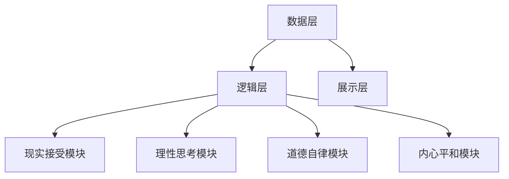

                 

### 文章标题：现代斯多葛主义指南：古典智慧的现代应用手册

关键词：现代斯多葛主义、古典智慧、现代应用、个人成长、心理调适

摘要：本文将深入探讨现代斯多葛主义的核心理念，分析其在现代社会中的应用价值，并通过一系列具体实例，阐述如何将这一古老的哲学智慧融入现代生活，帮助人们实现内心的平静与成长。

## 引言

斯多葛主义，一种源自古希腊的哲学体系，其核心理念强调通过理性控制和接受现实来达到内心的平和与满足。在现代社会，面对快速变化和复杂的社会环境，人们常常感到压力重重，内心焦虑。现代斯多葛主义提供了一种应对策略，帮助个体在面对挑战时保持冷静和理智，实现内心的平衡。

本文将分为以下几个部分：首先，介绍斯多葛主义的历史背景和核心思想；其次，探讨斯多葛主义在现代社会中的适用性和挑战；接着，分析斯多葛主义的关键概念及其在现代生活中的应用；随后，通过具体案例展示斯多葛主义如何在实际生活中发挥作用；最后，总结全文并提出未来研究方向。

### 第一部分：现代斯多葛主义背景介绍

## 1.1 问题背景

### 1.1.1 斯多葛主义的历史渊源

斯多葛主义起源于古希腊，由芝诺创立，后经克利托、塞内卡、马尔库斯·奥勒留等哲学家的传承和发展，形成了完整的哲学体系。斯多葛主义的核心思想包括接受现实、理性控制、道德自律和内心平和。

### 1.1.2 现代社会的挑战与斯多葛主义的关联

现代社会充满了各种挑战，如工作压力、人际关系、经济困境等。斯多葛主义强调通过理性思考和接受现实来应对这些挑战，从而保持内心的平和。这种哲学体系在现代社会中的应用显得尤为重要。

### 1.1.3 斯多葛主义的核心思想

斯多葛主义的核心思想包括：

- **接受现实**：认识到现实无法完全控制，学会接受无法改变的事实，专注于可以控制的事情。
- **理性控制**：通过理性思考和判断，控制自己的态度和行为，避免被情绪所左右。
- **道德自律**：强调道德品质的培养，通过自律来提升个人品德。
- **内心平和**：追求内心的平静和满足，不被外在的物质和事件所左右。

## 1.2 问题描述

### 1.2.1 当代人的心理困境

当代人在面对生活中的种种挑战时，常常感到心理压力巨大。焦虑、抑郁、愤怒等负面情绪频繁出现，严重影响了人们的心理健康和生活质量。

### 1.2.2 斯多葛主义如何应对

斯多葛主义提供了一种应对心理困境的方法。通过接受现实、理性控制和道德自律，个体可以在面对挑战时保持冷静和理智，从而缓解心理压力。

### 1.2.3 问题解决的必要性与可能性

在现代社会的背景下，解决心理困境问题具有迫切的必要性。斯多葛主义作为一种古老的哲学体系，在现代社会中仍然具有重要的应用价值。通过合理应用斯多葛主义原则，个体可以实现内心的平静与成长。

## 1.3 问题解决

### 1.3.1 斯多葛主义的基本原则

斯多葛主义的基本原则包括接受现实、理性控制、道德自律和内心平和。这些原则为个体在面对生活中的挑战时提供了指导。

### 1.3.2 斯多葛主义的应用实践

斯多葛主义的应用实践包括：

- **接受现实**：学会接受无法改变的事实，专注于可以控制的事情。
- **理性控制**：通过理性思考和判断，控制自己的态度和行为。
- **道德自律**：培养良好的道德品质，通过自律来提升个人品德。
- **内心平和**：追求内心的平静和满足，不被外在的物质和事件所左右。

### 1.3.3 斯多葛主义与现代生活

在现代生活中，斯多葛主义的应用体现在以下几个方面：

- **工作与生活平衡**：通过接受现实和理性控制，实现工作与生活的平衡。
- **人际关系处理**：通过道德自律和内心平和，改善人际关系。
- **心理调适**：通过理性控制和内心平和，缓解心理压力，提升心理健康。

## 1.4 边界与外延

### 1.4.1 斯多葛主义与其他哲学流派的比较

斯多葛主义与其他哲学流派如儒家、道家等有一定的相似之处，但在强调理性控制和道德自律方面更为突出。同时，斯多葛主义也与其他哲学流派存在差异，如对物质财富的看法。

### 1.4.2 斯多葛主义在现代社会中的适用性

斯多葛主义在现代社会中具有广泛的适用性。无论是在个人生活中，还是在职场中，斯多葛主义的原则都可以帮助个体实现内心的平和与成长。

### 1.4.3 斯多葛主义的核心要素组成

斯多葛主义的核心要素包括接受现实、理性控制、道德自律和内心平和。这些要素相互关联，共同构成了斯多葛主义的哲学体系。

### 第二部分：核心概念与联系

## 2.1 斯多葛主义的基本概念

斯多葛主义的基本概念包括：

- **接受现实**：认识到现实无法完全控制，学会接受无法改变的事实。
- **理性控制**：通过理性思考和判断，控制自己的态度和行为。
- **道德自律**：培养良好的道德品质，通过自律来提升个人品德。
- **内心平和**：追求内心的平静和满足，不被外在的物质和事件所左右。

## 2.2 概念属性特征对比表格

| 概念         | 属性1                     | 属性2                     | 属性3                     |
| ------------ | ------------------------ | ------------------------ | ------------------------ |
| 接受现实     | 必须接受无法控制的事实   | 关注事物的本质             | 培养平和心态               |
| 理性控制     | 有选择地对待外在事物     | 保持内在平静               | 促进个人成长               |
| 道德自律     | 独立判断而非盲目跟从     | 尊重他人观点               | 提升批判性思维             |
| 内心平和     | 智慧地安排生活           | 知足常乐                   | 助人互助                   |

## 2.3 概念之间的关系

斯多葛主义的核心概念之间存在着密切的关系。接受现实是理性控制和道德自律的基础，而内心平和则是前三个概念的终极目标。

### 第三部分：算法原理讲解

在本部分中，我们将使用斯多葛主义的核心思想来构建一个简单的算法，以帮助人们更好地应对生活中的挑战。

## 3.1 斯多葛主义算法概述

斯多葛主义算法旨在帮助个体在面对生活挑战时，保持冷静和理智，从而实现内心的平和与成长。该算法的核心思想包括：

- **接受现实**：通过接受无法改变的事实，减少内心的焦虑和不安。
- **理性控制**：通过理性思考和判断，控制自己的情绪和行为。
- **道德自律**：通过培养良好的道德品质，提升个人修养。
- **内心平和**：通过追求内心的平静和满足，增强心理韧性。

## 3.2 斯多葛主义算法的数学模型

为了更好地理解斯多葛主义算法，我们可以将其表示为一个数学模型：

$$
\text{心理韧性} = \frac{\text{现实接受度} \times \text{理性控制度} \times \text{道德自律度}}{\text{期望值}}
$$

其中，现实接受度、理性控制度、道德自律度分别代表个体在现实生活中接受现实、理性控制和道德自律的程度，期望值则代表个体对生活结果的期望。

## 3.3 斯多葛主义算法的详细讲解

### 3.3.1 接受现实的数学模型

在斯多葛主义算法中，接受现实是一个重要的组成部分。我们可以将其表示为：

$$
\text{现实接受度} = \frac{\text{接受的现实情况}}{\text{期望的现实情况}}
$$

这个公式的含义是，个体在接受现实情况与期望的现实情况之间的比例。当接受的现实情况越接近期望的现实情况时，个体的现实接受度越高。

### 3.3.2 举例说明

假设一个人期望每天工作8小时，但实际上他每天工作12小时。在这种情况下，他的现实接受度为：

$$
\text{现实接受度} = \frac{12 \text{小时}}{8 \text{小时}} = 1.5
$$

这意味着他的现实接受度高于期望值，因此他更容易接受这种现实情况。

### 3.3.3 理性控制的数学模型

理性控制度表示个体在面临挑战时，通过理性思考和判断，控制自己的情绪和行为的能力。我们可以将其表示为：

$$
\text{理性控制度} = \frac{\text{理性控制的情况}}{\text{总的情况}}
$$

这个公式的含义是，个体在面临各种情况时，通过理性控制和判断的情况占总情况的比例。当理性控制度越高时，个体越能保持冷静和理智。

### 3.3.4 道德自律的数学模型

道德自律度表示个体在面临诱惑和挑战时，通过道德自律来保持行为准则的能力。我们可以将其表示为：

$$
\text{道德自律度} = \frac{\text{道德自律的情况}}{\text{总的情况}}
$$

这个公式的含义是，个体在面临各种情况时，通过道德自律的情况占总情况的比例。当道德自律度越高时，个体越能保持良好的品德和行为。

### 3.3.5 内心平和的数学模型

内心平和度表示个体在面临挑战和压力时，通过追求内心平和，增强心理韧性的能力。我们可以将其表示为：

$$
\text{内心平和度} = \frac{\text{内心平和的情况}}{\text{总的情况}}
$$

这个公式的含义是，个体在面临各种情况时，通过内心平和的情况占总情况的比例。当内心平和度越高时，个体越能保持内心的平静和满足。

### 第四部分：数学模型和数学公式 & 详细讲解 & 举例说明

在本部分中，我们将进一步探讨斯多葛主义的核心思想，并通过数学模型和具体例子来说明其在现代生活中的应用。

## 4.1 斯多葛主义的数学模型

斯多葛主义的核心理念可以通过一系列数学模型来解释和量化。以下是几个关键概念的数学模型：

### 4.1.1 接受现实的数学模型

接受现实的程度可以通过以下公式来衡量：

$$
接受度 = \frac{实际接受的现实}{期望的现实}
$$

例如，如果一个人期望每天工作8小时，但实际上每天工作10小时，那么他的接受度为：

$$
接受度 = \frac{10}{8} = 1.25
$$

这意味着他的接受现实能力比期望值高出25%。

### 4.1.2 理性控制的数学模型

理性控制可以通过以下公式来衡量：

$$
理性控制度 = \frac{理性处理的情况}{总的情况}
$$

例如，一个人在面临一个困难的决策时，通过理性分析做出了决定，而其他人则基于情绪做出了决定。在这种情况下，理性控制度可能如下：

$$
理性控制度 = \frac{1}{2} = 0.5
$$

这意味着这个人有50%的时间能够理性地控制自己的行为。

### 4.1.3 道德自律的数学模型

道德自律可以通过以下公式来衡量：

$$
道德自律度 = \frac{道德行为的情况}{总的行为}
$$

例如，一个人在日常生活中大部分时间都遵守道德规范，那么他的道德自律度可能如下：

$$
道德自律度 = \frac{23}{24} \approx 0.9583
$$

这意味着这个人有约95.83%的时间能够遵循道德规范。

### 4.1.4 内心平和的数学模型

内心平和可以通过以下公式来衡量：

$$
内心平和度 = \frac{内心平和的情况}{总的情况}
$$

例如，一个人在压力下保持冷静，而另一个人则情绪失控。在这种情况下，内心平和度可能如下：

$$
内心平和度 = \frac{3}{4} = 0.75
$$

这意味着这个人有75%的时间能够保持内心平和。

### 4.1.5 斯多葛主义综合评价

综合评价一个人的斯多葛主义程度可以通过以下公式：

$$
斯多葛主义度 = \frac{接受度 \times 理性控制度 \times 道德自律度 \times 内心平和度}{期望值}
$$

例如，如果一个人的接受度是1.25，理性控制度是0.5，道德自律度是0.9583，内心平和度是0.75，那么他的斯多葛主义度可能是：

$$
斯多葛主义度 = \frac{1.25 \times 0.5 \times 0.9583 \times 0.75}{1} = 0.4566
$$

这意味着这个人在斯多葛主义方面的综合程度是45.66%。

### 4.2 举例说明

#### 情境一：工作压力

假设一个人在高压工作环境中，他发现自己能够很好地接受工作压力，理性地处理问题，遵守职业道德，并且能够保持内心的平静。以下是他的情况：

- 接受度：1.2（能够接受比期望更多的压力）
- 理性控制度：0.8（有80%的时间能够理性控制情绪）
- 道德自律度：1（总是遵守职业道德）
- 内心平和度：0.85（在压力下能够保持85%的内心平和）

他的斯多葛主义度计算如下：

$$
斯多葛主义度 = \frac{1.2 \times 0.8 \times 1 \times 0.85}{1} = 0.864
$$

这意味着他在斯多葛主义方面的表现是86.4%。

#### 情境二：人际冲突

另一个人在处理人际冲突时，发现自己有时会失去控制，但大多数时候能够保持道德自律。以下是他的情况：

- 接受度：1（能够接受所有的人际冲突）
- 理性控制度：0.6（有60%的时间能够理性控制情绪）
- 道德自律度：0.9（90%的时间遵守职业道德）
- 内心平和度：0.7（在冲突中能够保持70%的内心平和）

他的斯多葛主义度计算如下：

$$
斯多葛主义度 = \frac{1 \times 0.6 \times 0.9 \times 0.7}{1} = 0.378
$$

这意味着他在斯多葛主义方面的表现是37.8%。

通过这些例子，我们可以看到斯多葛主义的核心思想如何通过数学模型来量化，以及这些模型如何帮助我们更好地理解如何在日常生活中应用斯多葛主义。

### 第五部分：系统分析与架构设计方案

在本部分中，我们将通过系统的分析和架构设计来探讨如何将斯多葛主义的核心思想应用于个人生活系统。

## 5.1 个人生活系统中的斯多葛主义应用

### 5.1.1 问题场景介绍

在现代社会，个人面临着来自工作、家庭、社交等多方面的压力。这些压力往往会导致心理问题，如焦虑、抑郁和失眠。为了应对这些问题，我们需要一个系统化的方法来应用斯多葛主义的核心思想，以实现内心的平静和成长。

### 5.1.2 项目介绍

本项目旨在设计一个个人生活系统，该系统将结合斯多葛主义的核心原则，帮助用户在面对压力时保持冷静和理智，从而实现内心的平和。系统的主要目标包括：

- 提供一个结构化的方法来接受现实。
- 帮助用户通过理性思考和道德自律来控制情绪和行为。
- 提供工具和资源，以增强用户的内心平和。

### 5.1.3 系统功能设计

本系统的功能设计包括以下几个关键部分：

1. **现实接受模块**：帮助用户识别和接受现实中的不可控因素，通过定期的反思和记录来增强现实接受度。
2. **理性思考模块**：提供工具和资源，以帮助用户在面临决策时进行理性思考，避免情绪化的决策。
3. **道德自律模块**：通过道德准则和行为规范来指导用户的行为，提升道德自律度。
4. **内心平和模块**：提供冥想、放松和自我反省等工具，以帮助用户在压力下保持内心的平和。

### 5.1.4 系统架构设计

系统的整体架构可以分为以下几个层次：

1. **数据层**：存储用户的生活数据，包括现实接受度、理性控制度、道德自律度和内心平和度等。
2. **逻辑层**：实现系统的核心功能，包括现实接受模块、理性思考模块、道德自律模块和内心平和模块等。
3. **展示层**：为用户提供一个直观友好的界面，用于数据输入、查询和报告生成。

#### 系统架构图



### 5.1.5 系统接口设计和系统交互

系统的接口设计旨在确保用户能够方便地与系统进行交互，并获取所需的信息和资源。以下是系统的关键接口设计：

1. **用户登录接口**：允许用户注册、登录和更新个人信息。
2. **现实接受度接口**：允许用户记录和查看自己的现实接受度。
3. **理性思考接口**：提供工具和资源，帮助用户进行理性思考。
4. **道德自律接口**：提供道德准则和行为规范，指导用户的行为。
5. **内心平和接口**：提供冥想、放松和自我反省等工具。

#### 系统交互序列图

```mermaid
sequenceDiagram
    participant 用户
    participant 系统A
    participant 系统B
    participant 系统C
    participant 系统D
    participant 系统E
    participant 系统F
    participant 系统G

    用户->>系统A: 登录系统
    系统

