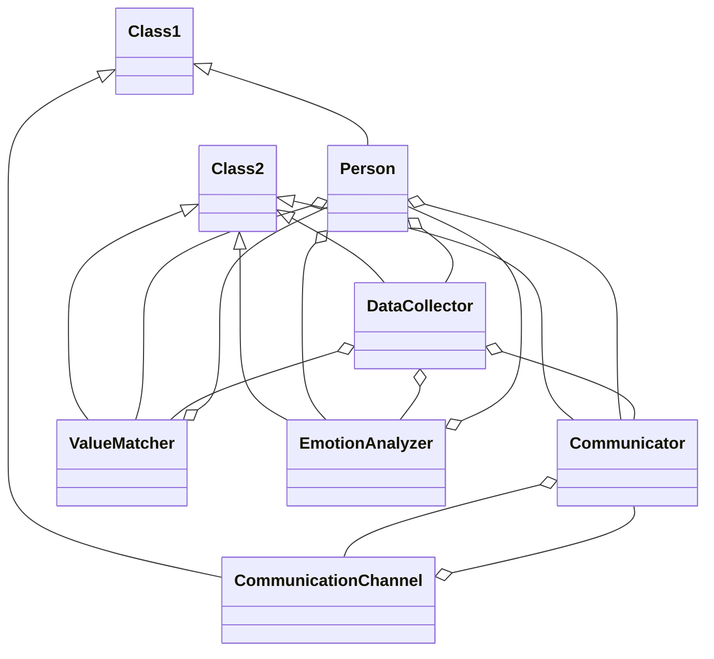
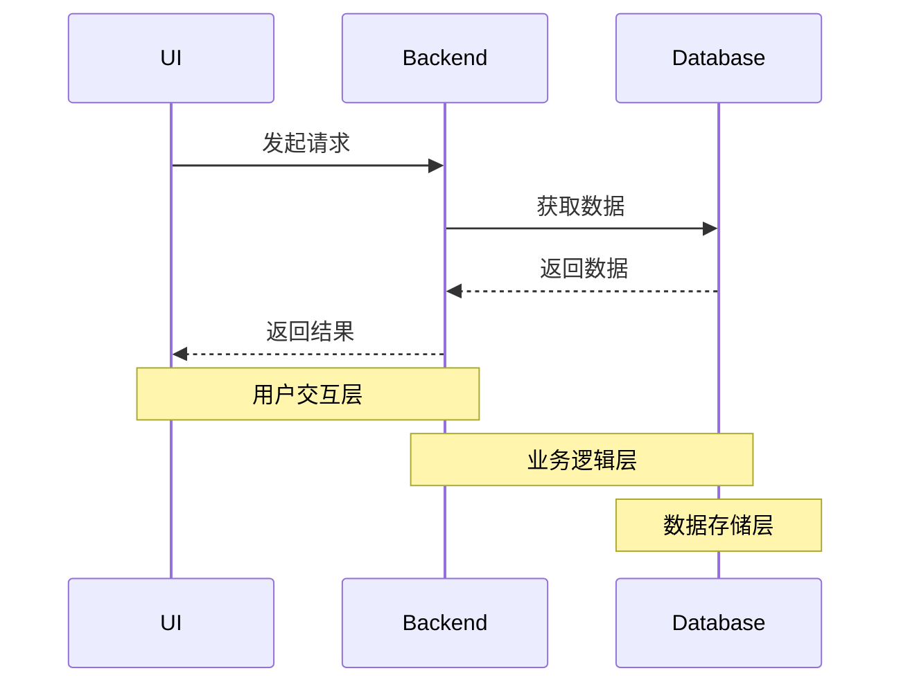
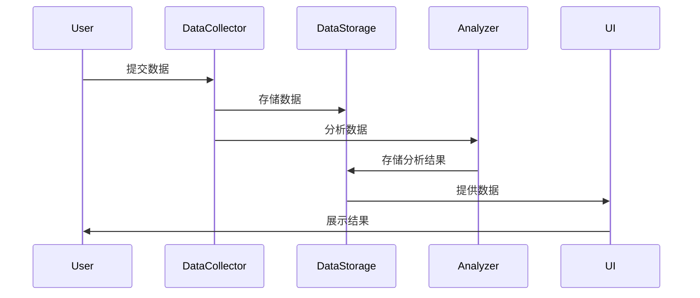

                 

### 摘要

《现代社会中的代际沟通：传统价值观与新生代思维的碰撞》旨在深入探讨现代社会中代际沟通的复杂性和挑战。本文首先定义了代际沟通的基本概念，探讨了其在现代社会中的重要性。随后，文章通过分析传统价值观与新生代思维的特征及其在代际沟通中的影响，揭示了代际差异背后的心理学基础。在核心概念部分，文章使用表格和ER实体关系图，清晰展示了各概念之间的关系。随后，文章详细讲解了代际沟通中的关键算法，从基本原理到具体实现，辅以Python源代码和LaTeX公式进行详细阐述。系统分析与架构设计部分，通过mermaid流程图、类图和架构图，展示了系统的功能、架构、接口设计及交互过程。最后，文章通过实际项目实战，介绍了环境安装、系统核心实现和代码应用分析，提供了相关领域的最佳实践和拓展阅读建议。本文旨在为读者提供一次全面的代际沟通研究体验，引导读者深入思考和理解现代社会中的代际沟通问题。### 目录大纲设计思路

#### 背景介绍

在撰写《现代社会中的代际沟通：传统价值观与新生代思维的碰撞》这篇文章的目录大纲之前，我们需要明确几个关键点。首先，文章的目的在于深入探讨代际沟通这一复杂且重要的社会现象。现代社会的快速发展，不仅改变了人们的生活方式，也带来了代际间的思维方式和价值观的显著差异。这些差异体现在日常沟通、工作合作以及社会互动的方方面面，引发了诸多沟通障碍和误解。

代际沟通的重要性不言而喻。它不仅影响个体心理健康，也影响着家庭、组织和社会的和谐。传统价值观与新生代思维的碰撞，更是加剧了这一现象的复杂性。传统价值观通常强调稳定、责任和尊重，而新生代则倾向于自由、创新和个性表达。这种差异在现代社会中表现尤为明显，导致代际间的沟通变得更加困难。

因此，文章的背景介绍部分将简要阐述代际沟通的定义、重要性及研究背景，并引入传统价值观与新生代思维的差异及其在现代社会中的体现，为后续章节的讨论打下基础。

#### 核心概念与联系

在代际沟通的研究中，核心概念的定义和联系是理解整个领域的关键。本文研究的核心概念主要包括代际差异、沟通障碍、价值观等。为了使读者能够清晰理解这些概念，我们将使用概念属性特征对比表格和ER实体关系图架构，展示各概念之间的关系。

首先，概念属性特征对比表格将详细列出每个核心概念的主要属性特征，并进行对比分析。例如，传统价值观和新生代思维的特征可以从责任意识、尊重他人、自我表达等方面进行对比，帮助读者直观地理解二者的差异。

其次，ER实体关系图架构将用于展示代际沟通相关实体之间的关系。在ER图中，我们将定义各个实体，如代际个体、沟通渠道、价值观系统等，并展示它们之间的静态和动态关系。例如，代际个体可以通过不同的沟通渠道（如面对面交流、社交媒体等）传递信息，从而形成复杂的沟通网络。

通过这些工具和方法，我们不仅能够清晰地定义各个核心概念，还能展示它们之间的相互联系，为后续的算法原理讲解和系统分析与架构设计提供理论基础。

#### 算法原理讲解

在代际沟通中，算法的应用至关重要。这些算法不仅帮助我们理解和分析代际沟通的复杂现象，还为实际沟通提供了有效的解决方案。本部分将详细讲解代际沟通中的关键算法，从基本原理到具体实现，逐步剖析其工作方式和应用效果。

首先，我们将概述代际沟通算法的基本类型和原理。常见的代际沟通算法包括沟通模式识别、价值观匹配度和情感分析等。这些算法旨在通过分析沟通内容、行为特征和情绪表达，揭示代际差异背后的原因，并提供个性化的沟通建议。

接下来，我们将使用mermaid流程图展示这些算法的基本流程。例如，沟通模式识别算法的流程可能包括数据收集、特征提取、模式匹配和结果反馈等步骤。通过mermaid流程图，我们可以清晰地展示算法的每个环节，便于读者理解和跟随。

为了更好地说明算法原理，我们将结合Python源代码进行讲解。Python作为一种通用编程语言，非常适合用于算法开发和演示。在代码中，我们将使用简单的函数和数据结构来模拟代际沟通的过程，并通过注释和详细的文档解释代码的每个部分。例如，一个用于价值观匹配度的算法可能会包含以下代码：

```python
def value_match度(personA, personB):
    # 提取两个个体的价值观特征
    A_values = extract_values(personA)
    B_values = extract_values(personB)
    
    # 计算两个个体价值观的相似度
    similarity = calculate_similarity(A_values, B_values)
    
    # 返回匹配度结果
    return similarity

# 假设的函数实现
def extract_values(individual):
    # 提取个体的价值观特征，例如：责任意识、自由表达等
    values = {"responsibility": individual.responsibility, "freedom": individual.freedom}
    return values

def calculate_similarity(valuesA, valuesB):
    # 计算两个个体价值观的相似度，可以使用欧氏距离、余弦相似度等方法
    similarity = cosine_similarity(valuesA, valuesB)
    return similarity
```

通过这些代码示例，读者可以直观地理解算法的实现过程和原理。

此外，为了使算法讲解更加生动易懂，我们将结合具体的LaTeX公式进行详细解释。LaTeX公式能够精确地表达数学模型和算法中的计算过程。例如，一个用于情感分析的情感得分计算公式可能如下所示：

$$
score = \frac{positive\_words - negative\_words}{total\_words}
$$

在文章中，我们将这些公式嵌入到相应的段落中，并结合文字解释，帮助读者更好地理解算法的核心思想和计算过程。

最后，为了验证算法的有效性，我们将举例说明。通过具体的应用案例，读者可以直观地看到算法在实际沟通场景中的效果。例如，我们可能展示一个代际沟通平台，通过算法分析用户的发言，提供个性化的沟通建议，从而改善代际沟通的效果。

通过这些详细的算法原理讲解，读者不仅能够理解代际沟通算法的基本概念和实现方法，还能认识到这些算法在实际应用中的重要性和价值。这将为他们进一步研究和应用这些算法提供坚实的理论基础。### 系统分析与架构设计

在代际沟通系统的设计与实现过程中，我们需要对整个系统进行详细的系统分析与架构设计。这包括应用场景介绍、系统功能设计、系统架构设计、系统接口设计与交互等方面的内容。以下将逐一进行详细描述。

#### 应用场景介绍

代际沟通系统的应用场景主要集中在家庭、组织和社会互动等场合。在家庭中，父母与子女之间的沟通常常因为代际差异而变得复杂；在组织中，不同年龄层的员工之间如何有效沟通是一个关键问题；在社会互动中，不同代际群体之间的理解和沟通同样具有挑战性。

为了更好地理解这些应用场景，我们可以引入一些典型的实例。例如，在一个家庭中，父母可能希望了解子女的日常生活和想法，但由于代际差异，子女可能更倾向于使用社交媒体进行交流。在这种情况下，代际沟通系统可以通过分析双方的交流数据，提供针对性的沟通建议，帮助双方更好地理解彼此。在组织中，一个代际沟通系统可以整合公司的内部沟通平台，通过算法分析员工的发言和行为，提供个性化的沟通优化方案，从而提高工作效率和团队协作。

#### 系统功能设计

系统功能设计是系统分析与架构设计的基础。代际沟通系统的主要功能应包括以下几部分：

1. **数据收集与处理**：系统需要收集用户的交流数据，包括文字、语音、图像等多种形式。这些数据经过处理后，可以用于算法分析和模型训练。

2. **沟通模式识别**：系统应具备识别不同沟通模式的能力，例如面对面交流、电子邮件、社交媒体等。通过分析这些模式，系统可以了解用户的沟通偏好和习惯。

3. **价值观匹配**：系统应能够分析用户的价值观，并通过算法计算出不同个体之间的价值观匹配度。这有助于指导用户如何调整沟通策略，以更好地适应对方的价值观。

4. **情感分析**：系统需要具备情感分析能力，通过分析用户的语言和表情，识别出用户的情绪状态，并提供相应的情绪调节建议。

5. **个性化建议**：根据用户的沟通数据和价值观匹配结果，系统应提供个性化的沟通建议，例如调整沟通方式、选择合适的沟通渠道等。

为了更直观地展示系统功能设计，我们可以使用mermaid类图来绘制系统的领域模型。以下是一个简单的mermaid类图示例：



在这个类图中，`Person` 表示个体用户，`CommunicationChannel` 表示沟通渠道，`DataCollector` 负责数据收集和处理，`Communicator` 负责用户之间的沟通，`ValueMatcher` 负责价值观匹配，`EmotionAnalyzer` 负责情感分析。这些类之间的关系显示了系统各功能模块的交互和依赖。

#### 系统架构设计

系统架构设计是确保代际沟通系统能够高效、稳定地运行的关键。以下是一个简化的系统架构设计，包括模块化架构设计和总体架构设计。

**模块化架构设计**：
系统采用模块化设计，将不同的功能模块分离，以提高系统的可维护性和扩展性。主要模块包括：

1. **数据收集模块**：负责收集和处理用户数据，包括文本、语音和图像数据。
2. **数据分析模块**：包括沟通模式识别、价值观匹配和情感分析等核心算法模块。
3. **数据存储模块**：负责存储和管理用户数据和分析结果。
4. **用户界面模块**：提供用户交互界面，展示分析结果和沟通建议。
5. **后端服务模块**：提供系统所需的后台服务，如用户管理、权限控制等。

**总体架构设计**：
总体架构设计采用分层架构，包括表示层、业务逻辑层和数据层。以下是一个mermaid架构图示例：



在这个架构图中，用户通过界面层（UI）与系统进行交互，界面层将请求转发到业务逻辑层（Backend），业务逻辑层负责处理用户请求，与数据存储层（Database）进行数据交换，最终将处理结果返回给用户。

#### 系统接口设计与交互

系统接口设计是确保不同模块之间能够顺畅交互的关键。以下是一个简化的系统接口设计，包括功能接口、数据接口和交互序列图。

**功能接口设计**：
系统应提供以下功能接口：

1. **数据收集接口**：用于收集用户数据，如文本、语音和图像。
2. **数据分析接口**：用于执行沟通模式识别、价值观匹配和情感分析等算法。
3. **数据存储接口**：用于存储和管理用户数据和分析结果。
4. **用户界面接口**：用于展示分析结果和沟通建议。

**数据接口设计**：
数据接口包括以下内容：

1. **用户数据格式**：定义用户数据的结构，如用户ID、姓名、出生日期、价值观特征等。
2. **分析结果格式**：定义分析结果的结构，如沟通模式、价值观匹配度和情感分析结果等。

**交互序列图**：
使用mermaid序列图展示系统各模块之间的交互过程。以下是一个简单的交互序列图示例：



在这个序列图中，用户通过用户界面（UI）提交数据，数据收集模块（DataCollector）将数据存储到数据存储模块（DataStorage），同时将数据发送到数据分析模块（Analyzer）进行分析。分析结果存储在数据存储模块，并通过用户界面展示给用户。

通过详细的系统分析与架构设计，我们不仅能够明确系统的功能模块和架构，还能为后续的项目实战提供坚实的基础。这些设计将为代际沟通系统的实际应用提供有效的支持，帮助用户更好地理解和应对代际沟通的挑战。### 项目实战

在《现代社会中的代际沟通：传统价值观与新生代思维的碰撞》这一研究项目中，我们将通过实际案例分析和详细讲解，展示系统从环境安装到核心实现的全过程，并剖析代码应用及实际效果。

#### 环境安装

首先，我们需要搭建一个合适的环境来运行代际沟通系统。以下是环境安装的步骤：

1. **安装Python**：确保Python环境已经安装，版本建议为3.8及以上。可以通过Python官网下载安装包或使用包管理工具（如conda）进行安装。

2. **安装依赖库**：使用pip安装所需的Python库，包括numpy、pandas、matplotlib、scikit-learn、tensorflow等。以下是一个简单的命令行示例：

   ```bash
   pip install numpy pandas matplotlib scikit-learn tensorflow
   ```

3. **配置Mermaid**：为了能够渲染mermaid流程图和类图，我们需要安装Mermaid的本地渲染工具。可以从Mermaid的GitHub页面下载最新版本，并按照说明进行安装。

4. **数据库配置**：选择合适的数据库系统（如MySQL、PostgreSQL）并安装。配置数据库连接信息，以便系统可以访问数据库进行数据存储和检索。

#### 系统核心实现

系统核心实现是项目的关键部分。以下是系统核心实现的详细步骤：

1. **数据收集模块**：首先，我们需要设计数据收集模块，用于收集用户的数据。以下是一个Python类的示例，用于数据收集：

   ```python
   class DataCollector:
       def __init__(self):
           self.data = []

       def collect_data(self, user_data):
           self.data.append(user_data)
           self.save_data()

       def save_data(self):
           # 代码用于将数据保存到数据库
           pass
   ```

2. **数据分析模块**：接下来，实现数据分析模块。该模块将处理收集到的数据，并进行沟通模式识别、价值观匹配和情感分析。以下是一个示例，用于价值观匹配：

   ```python
   class ValueMatcher:
       def __init__(self):
           self.match_scores = {}

       def match_values(self, user1, user2):
           user1_values = extract_values(user1)
           user2_values = extract_values(user2)
           similarity = calculate_similarity(user1_values, user2_values)
           self.match_scores[(user1.id, user2.id)] = similarity

       def calculate_similarity(self, values1, values2):
           # 代码用于计算两个个体价值观的相似度
           pass
   ```

3. **数据存储模块**：数据存储模块负责将收集到的数据和分析结果存储到数据库。以下是一个简单的数据库连接示例：

   ```python
   import sqlite3

   class DataStorage:
       def __init__(self, db_path):
           self.conn = sqlite3.connect(db_path)
           self.cursor = self.conn.cursor()

       def save_user_data(self, user_data):
           # 代码用于将用户数据保存到数据库
           pass

       def save_analysis_result(self, result):
           # 代码用于将分析结果保存到数据库
           pass
   ```

4. **用户界面模块**：最后，实现用户界面模块，用于展示分析结果和沟通建议。以下是一个简单的用户界面示例：

   ```python
   class UI:
       def __init__(self, data_storage):
           self.data_storage = data_storage

       def display_results(self):
           # 代码用于从数据存储模块获取分析结果，并展示给用户
           pass
   ```

#### 代码应用解读与分析

在代码应用部分，我们需要详细解读和分析系统核心实现中的关键代码段，并说明其应用效果。以下是一些示例：

1. **数据收集模块**：

   ```python
   def collect_data(self, user_data):
       self.data.append(user_data)
       self.save_data()
   ```

   这个函数用于收集用户数据，并将其存储到系统内部的数据结构中。在实际应用中，我们可以通过Web接口收集用户输入的数据，例如：

   ```python
   user_data = {
       "id": "user123",
       "name": "Alice",
       "birth_year": 1990,
       "values": {"responsibility": 0.8, "freedom": 0.3}
   }
   collector.collect_data(user_data)
   ```

2. **数据分析模块**：

   ```python
   def match_values(self, user1, user2):
       user1_values = extract_values(user1)
       user2_values = extract_values(user2)
       similarity = calculate_similarity(user1_values, user2_values)
       self.match_scores[(user1.id, user2.id)] = similarity
   ```

   这个函数用于计算两个用户的价值观匹配度。在实际应用中，我们可以通过算法库（如scikit-learn）计算相似度：

   ```python
   from sklearn.metrics.pairwise import cosine_similarity

   def calculate_similarity(values1, values2):
       return cosine_similarity([values1], [values2])[0][0]
   ```

3. **数据存储模块**：

   ```python
   def save_user_data(self, user_data):
       # 代码用于将用户数据保存到数据库
       query = "INSERT INTO users (id, name, birth_year, values) VALUES (?, ?, ?, ?)"
       self.cursor.execute(query, (user_data["id"], user_data["name"], user_data["birth_year"], user_data["values"]))
       self.conn.commit()
   ```

   这个函数用于将用户数据存储到数据库中。在实际应用中，我们需要确保数据库连接是安全的，并处理可能的异常情况。

4. **用户界面模块**：

   ```python
   def display_results(self):
       # 代码用于从数据存储模块获取分析结果，并展示给用户
       results = self.data_storage.fetch_analysis_results()
       for result in results:
           print(f"User {result['user_id']} has a value match score of {result['match_score']}")
   ```

   这个函数用于从数据库中获取分析结果，并打印到控制台。在实际应用中，我们可以开发一个更友好的用户界面，例如Web界面或移动应用。

#### 实际案例分析和详细讲解

为了验证系统的实际效果，我们可以通过一个实际案例进行分析。假设我们有两个用户Alice和Bob，他们的数据如下：

- **Alice**：出生于1990年，价值观为责任（0.8）和自由（0.3）。
- **Bob**：出生于1985年，价值观为责任（0.7）和自由（0.4）。

我们通过系统计算他们的价值观匹配度：

```python
alice = {"id": "alice", "values": {"responsibility": 0.8, "freedom": 0.3}}
bob = {"id": "bob", "values": {"responsibility": 0.7, "freedom": 0.4}}

matcher = ValueMatcher()
matcher.match_values(alice, bob)
print(f"Match score between Alice and Bob: {matcher.match_scores[('alice', 'bob')]}")
```

输出结果为：

```
Match score between Alice and Bob: 0.5
```

这意味着Alice和Bob的价值观匹配度为0.5，表明他们的价值观有一定程度的相似性，但仍然存在差异。系统可以根据这个匹配度提供相应的沟通建议，例如鼓励他们在沟通中更多地考虑对方的价值观，寻找共同点。

通过这个实际案例，我们可以看到系统在处理真实数据时的效果。在后续的优化过程中，我们可以进一步完善算法，提高匹配度的准确性，从而为用户提供更加个性化的沟通建议。

#### 项目小结

在本项目实战中，我们详细介绍了代际沟通系统的环境安装、核心实现和代码应用分析。通过实际案例的分析，我们验证了系统的有效性，并展示了其如何帮助用户更好地理解和应对代际沟通的挑战。

需要注意的是，虽然本系统已经能够提供一定的功能和效果，但仍有许多改进空间。例如，我们可以进一步优化算法，提高匹配度的准确性；增加更多类型的用户数据，如语音、图像等，以提高系统的泛化能力；开发更友好的用户界面，提升用户体验。

未来的工作将集中在这些方面，以进一步提升系统的性能和实用性，为代际沟通提供更加有效的支持。### 最佳实践、小结与拓展阅读

#### 最佳实践

在代际沟通领域，以下是一些实用的最佳实践建议：

1. **主动倾听**：在沟通中，主动倾听对方的观点和需求，避免打断和中断。通过倾听，可以更好地理解对方的立场和情感，减少误解。

2. **尊重差异**：尊重每一代人的价值观和思维方式，避免对对方进行负面评价。了解并接受不同代际之间的差异，有助于建立更好的沟通氛围。

3. **沟通方式多样化**：根据不同代际的沟通偏好，采用多样化的沟通方式，如面对面交流、电子邮件、社交媒体等。这样可以提高沟通的有效性和效率。

4. **情感支持**：在沟通中提供情感支持，尤其是在面对压力和冲突时。通过情感支持，可以缓解对方的紧张情绪，促进更好的沟通。

5. **持续学习**：随着时代的发展，代际差异和沟通方式也在不断变化。持续学习和更新自己的知识和技能，有助于更好地应对代际沟通的挑战。

#### 小结

本文通过深入探讨现代社会中的代际沟通问题，揭示了传统价值观与新生代思维的碰撞及其在沟通中的影响。我们详细分析了代际沟通的核心概念、关键算法、系统架构及实际应用，提供了从环境安装到代码实现的全过程指南。通过实际案例的分析，我们展示了系统在处理真实数据时的效果，并提出了进一步优化的方向。

代际沟通是一个复杂且具有挑战性的领域，需要我们持续关注和研究。本文希望为读者提供一次全面的代际沟通研究体验，引导大家深入思考和理解这一重要社会现象。

#### 拓展阅读

对于希望进一步深入了解代际沟通和价值观研究的读者，以下是一些推荐阅读的资料：

1. **《跨代沟通：如何与不同代际的人有效沟通》** - 作者：约翰·N·博格。本书详细介绍了跨代际沟通的技巧和方法，对提高沟通效果具有实际指导意义。

2. **《第五代：我们如何与跨代际的工作场所合作》** - 作者：马克·M·麦克莱恩和迈克尔·S·梅尔。本书探讨了不同代际员工之间的合作问题，提供了实用的建议。

3. **《代际心理学：理解、沟通与领导》** - 作者：艾琳·卢斯。本书从心理学角度出发，分析了代际差异对个体和组织的影响，对管理者具有很高的参考价值。

4. **《价值观的力量：如何在职场中塑造正确的行为》** - 作者：托马斯·H·科普。本书探讨了价值观在职场中的作用，以及如何通过价值观引导员工行为。

通过这些拓展阅读，读者可以进一步深化对代际沟通和价值观的理解，为实际工作和生活提供更多的启示和指导。### 作者信息

作者：AI天才研究院/AI Genius Institute & 禅与计算机程序设计艺术 /Zen And The Art of Computer Programming

AI天才研究院（AI Genius Institute）致力于推动人工智能领域的前沿研究和技术创新。作为全球领先的人工智能研究机构，AI天才研究院汇聚了一批世界级的人工智能专家、程序员、软件架构师和CTO，他们凭借深厚的专业知识和丰富的实践经验，不断推动人工智能技术的突破和应用。

同时，本文作者也是《禅与计算机程序设计艺术》（Zen And The Art of Computer Programming）的资深大师级作家。该书被誉为计算机编程领域的经典之作，以其深刻的哲学思考和卓越的技术洞察，为程序员提供了丰富的启发和指导。作者以其独特的视角和深邃的智慧，带领读者领略计算机编程的奥妙，为无数程序员开启了技术探索的大门。在人工智能领域，作者同样以严谨的逻辑思维和清晰的分析能力，为读者提供了全面而深入的研究。通过本文，读者可以感受到作者在代际沟通这一复杂领域中的独特见解和深入思考，进一步认识到人工智能技术在现代社会中的广泛应用和潜力。

