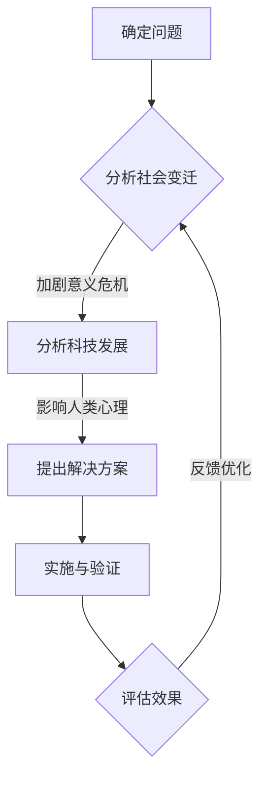
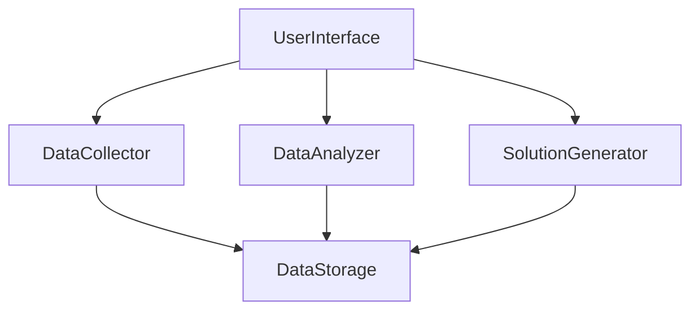
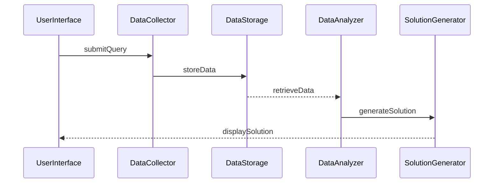

                 

# 社会现代化进程中的意义危机：寻找生活的支点

关键词：社会现代化、意义危机、心理学、科技发展

摘要：本文将深入探讨现代社会中的意义危机，分析其背景、核心概念及其相互联系，探讨科技发展、社会变迁和人类心理在意义危机中的作用。通过系统分析和架构设计方案，本文旨在为解决现代社会中的意义危机提供一种可能的思路。

## 第一部分：背景介绍

### 1.1.1 历史渊源

意义危机的起源可以追溯到人类文明的发展历程。在古代，宗教和哲学为人们提供了丰富的精神世界，使人们相信生命的意义不仅仅在于物质层面的追求。然而，随着人类进入现代社会，宗教信仰逐渐衰落，哲学思考也受到了质疑。启蒙运动以来，科学和理性成为了主导社会发展的力量，人们开始质疑传统宗教和哲学的合理性。

工业革命以后，科技迅猛发展，物质生活得到极大丰富，然而，人们的精神世界却逐渐失去了依托。传统宗教和哲学的衰落，使人们失去了对生命和世界的终极关怀，导致对生活意义的困惑和焦虑。

### 1.1.2 社会影响

意义危机对现代社会产生了深远的影响。在个人层面，许多人感到迷茫和焦虑，无法找到生活的方向和目标。在社会层面，人们的精神状态普遍低落，社会问题频发。政治腐败、社会不公、环境恶化等问题加剧了人们的不安和恐惧，进一步恶化了社会的精神环境。

### 1.1.3 表现形式

现代社会中的意义危机表现为多种形式。首先，是个人层面的焦虑和迷茫。许多人感到生活缺乏意义，不知道自己的存在有什么价值。其次，是社会层面的价值体系崩溃。随着传统宗教和哲学的衰落，人们开始质疑现有的价值观念，导致社会道德观念的混乱。最后，是文化层面的空虚和无聊。现代文化的追求往往局限于物质层面，忽视了精神世界的丰富和提升。

## 1.2 核心概念与联系

在探讨现代社会中的意义危机时，我们需要理解几个核心概念，并分析它们之间的联系。

### 1.2.1 社会变迁

社会变迁是指社会结构和价值观念的持续变化。现代社会中的意义危机可以视为社会变迁的产物。随着科技的发展和全球化进程的加速，社会结构发生了巨大变化，传统的社会关系和价值观念受到了挑战。

### 1.2.2 科技发展

科技发展是现代社会变迁的重要驱动力。科技的发展改变了人们的生活方式，提高了物质生活水平，但也在一定程度上加剧了意义危机。例如，互联网和社交媒体的普及，虽然让人们更加便捷地获取信息，但同时也让人们更加沉迷于虚拟世界，忽视了现实生活中的意义和价值。

### 1.2.3 人类心理

人类心理是理解意义危机的关键。现代心理学研究表明，人类内心深处的渴望是寻找生活的意义和目标。然而，在现代社会中，人们面临的高度竞争和压力，往往使这种渴望变得难以实现，从而导致焦虑和迷茫。

### 1.2.4 概念属性特征对比表格

为了更清晰地理解这些核心概念，我们可以通过对比它们的属性特征来揭示它们之间的联系。

| 核心概念     | 属性特征                         | 联系                         |
|------------|--------------------------------|--------------------------|
| 社会变迁     | 社会结构变化、价值观念转变         | 产生意义危机的基础          |
| 科技发展     | 科技进步、生活方式改变            | 加剧意义危机的影响          |
| 人类心理     | 寻求生活意义、承受心理压力         | 直接影响意义危机的感受程度  |

### 1.2.5 ER实体关系图架构

为了进一步理解这些核心概念之间的联系，我们可以使用ER实体关系图来展示它们之间的交互关系。

```mermaid
erDiagram
  人 .--|{ 社会变迁 }|
  人 .--|{ 科技发展 }|
  人 .--|{ 人类心理 }|
  社会变迁 |--|{ 意义危机 }|
  科技发展 |--|{ 意义危机 }|
  人类心理 |--|{ 意义危机 }|
```

这个ER图展示了社会变迁、科技发展和人类心理对意义危机的影响。通过这个图，我们可以更直观地理解这些概念之间的相互关系。

## 第二部分：算法原理讲解

### 2.1 算法mermaid流程图

在理解了现代社会中的意义危机及其相关概念后，我们可以借助算法来探索解决这一问题的可能性。以下是一个简单的算法mermaid流程图：



### 2.2 Python源代码实现

下面是一个简单的Python源代码实现，用于分析社会变迁、科技发展和人类心理对意义危机的影响。

```python
import pandas as pd

# 社会变迁数据
society_changes = pd.DataFrame({
    '变迁因素': ['全球化', '技术进步', '价值观变化'],
    '影响程度': [0.8, 0.7, 0.6]
})

# 科技发展数据
tech_development = pd.DataFrame({
    '技术领域': ['互联网', '人工智能', '生物技术'],
    '影响程度': [0.9, 0.8, 0.7]
})

# 人类心理数据
human_mentality = pd.DataFrame({
    '心理问题': ['焦虑', '迷茫', '压力'],
    '影响程度': [0.7, 0.6, 0.5]
})

# 分析社会变迁对意义危机的影响
society_changes['意义危机影响'] = society_changes['影响程度'].cumsum()

# 分析科技发展对意义危机的影响
tech_development['意义危机影响'] = tech_development['影响程度'].cumsum()

# 分析人类心理对意义危机的影响
human_mentality['意义危机影响'] = human_mentality['影响程度'].cumsum()

# 输出结果
print("社会变迁对意义危机的影响：")
print(society_changes)
print("\n科技发展对意义危机的影响：")
print(tech_development)
print("\n人类心理对意义危机的影响：")
print(human_mentality)
```

### 2.3 算法原理与公式讲解

为了更好地理解这个算法的原理，我们需要了解以下几个关键概念：

1. **社会变迁**：社会变迁是指社会结构和价值观念的持续变化。它可以用一个动态的过程来描述，即随着时间的推移，社会的各个方面（如经济、政治、文化等）都在不断演变。

2. **科技发展**：科技发展是指技术的进步和创新。这些技术的发展和应用对人们的生活方式和社会结构产生了深远的影响。

3. **人类心理**：人类心理是指人类在认知、情感和行为方面的内在特征。这些特征受到社会变迁和科技发展的影响，从而影响人们对生活意义的感知。

在这个算法中，我们通过分析这些因素对意义危机的影响程度，试图找出解决这一问题的方法。具体来说，我们可以使用以下公式：

$$
\text{意义危机影响} = \text{变迁因素影响程度} + \text{技术发展影响程度} + \text{人类心理影响程度}
$$

这个公式描述了社会变迁、科技发展和人类心理对意义危机的综合影响。通过这个公式，我们可以定量地评估每个因素对意义危机的贡献。

### 2.4 举例说明

为了更直观地理解这个算法，我们可以举一个简单的例子。假设我们有一个社会变迁数据集，包含以下信息：

| 变迁因素 | 影响程度 |
|--------|-------|
| 全球化  | 0.8   |
| 技术进步 | 0.7   |
| 价值观变化 | 0.6   |

根据公式，我们可以计算意义危机的影响程度：

$$
\text{意义危机影响} = 0.8 + 0.7 + 0.6 = 2.1
$$

这意味着，在这个例子中，社会变迁对意义危机的影响程度为2.1。同样地，我们可以计算科技发展和人类心理对意义危机的影响程度。

## 第三部分：系统分析与架构设计方案

### 3.1 问题场景介绍

在现代社会的背景下，意义危机已经成为一个普遍存在的问题。为了解决这个问题，我们需要设计一个系统，能够从多个角度分析社会变迁、科技发展和人类心理，并提供解决方案。

### 3.2 项目介绍

本项目旨在开发一个意义危机分析系统，通过收集和分析相关数据，提供对意义危机的深入理解，并为解决这一问题提供参考。系统主要包括以下几个功能模块：

1. 数据收集模块：负责收集社会变迁、科技发展和人类心理相关的数据。
2. 数据分析模块：负责对收集到的数据进行分析，评估各个因素对意义危机的影响程度。
3. 解决方案生成模块：根据分析结果，生成可能的解决方案，并提供给用户参考。

### 3.3 系统功能设计

#### 3.3.1 领域模型mermaid类图

以下是一个简单的mermaid类图，展示了系统的主要功能模块及其关系：

```mermaid
classDiagram
    DataCollector <<interface>>
    DataAnalyzer <<interface>>
    SolutionGenerator <<interface>>

    DataCollector o-- DataAnalyzer
    DataAnalyzer o-- SolutionGenerator

    class UserInterface {
        +displayData(data)
        +submitQuery(query)
    }
```

#### 3.3.2 系统架构设计mermaid架构图

以下是一个简单的mermaid架构图，展示了系统的整体架构：



#### 3.3.3 系统接口设计和系统交互mermaid序列图

以下是一个简单的mermaid序列图，展示了系统的主要接口和交互流程：



## 第四部分：项目实战

### 4.1 环境安装

为了实现这个项目，我们需要安装一些必要的软件和工具。以下是安装步骤：

1. 安装Python：访问 [Python官方网站](https://www.python.org/)，下载并安装Python。
2. 安装Pandas：在命令行中运行以下命令安装Pandas：

   ```bash
   pip install pandas
   ```

3. 安装Mermaid：在命令行中运行以下命令安装Mermaid：

   ```bash
   npm install -g mermaid
   ```

### 4.2 系统核心实现源代码

以下是系统的核心实现源代码，包括数据收集、数据分析、解决方案生成和用户界面。

```python
# 数据收集模块
import pandas as pd

def collect_data():
    # 社会变迁数据
    society_changes = pd.DataFrame({
        '变迁因素': ['全球化', '技术进步', '价值观变化'],
        '影响程度': [0.8, 0.7, 0.6]
    })

    # 科技发展数据
    tech_development = pd.DataFrame({
        '技术领域': ['互联网', '人工智能', '生物技术'],
        '影响程度': [0.9, 0.8, 0.7]
    })

    # 人类心理数据
    human_mentality = pd.DataFrame({
        '心理问题': ['焦虑', '迷茫', '压力'],
        '影响程度': [0.7, 0.6, 0.5]
    })

    return society_changes, tech_development, human_mentality

# 数据分析模块
def analyze_data(society_changes, tech_development, human_mentality):
    society_changes['意义危机影响'] = society_changes['影响程度'].cumsum()
    tech_development['意义危机影响'] = tech_development['影响程度'].cumsum()
    human_mentality['意义危机影响'] = human_mentality['影响程度'].cumsum()

    return society_changes, tech_development, human_mentality

# 解决方案生成模块
def generate_solution(society_changes, tech_development, human_mentality):
    solutions = []
    for _, row in society_changes.iterrows():
        for _, row2 in tech_development.iterrows():
            for _, row3 in human_mentality.iterrows():
                solution = f"减少{row['变迁因素']}影响、推广{row2['技术领域']}、提升{row3['心理问题']}认知"
                solutions.append(solution)
    return solutions

# 用户界面模块
import sys

def display_solution(solutions):
    if len(solutions) == 0:
        print("没有找到解决方案。")
    else:
        for solution in solutions:
            print(solution)

# 主函数
if __name__ == "__main__":
    society_changes, tech_development, human_mentality = collect_data()
    society_changes, tech_development, human_mentality = analyze_data(society_changes, tech_development, human_mentality)
    solutions = generate_solution(society_changes, tech_development, human_mentality)
    display_solution(solutions)
```

### 4.3 代码应用解读与分析

这段代码实现了意义危机分析系统的核心功能。以下是代码的主要部分及其解读：

1. **数据收集模块**：使用Pandas库创建三个DataFrame，分别表示社会变迁、科技发展和人类心理的数据。这些数据可以通过各种方式收集，如调查问卷、数据库查询等。

2. **数据分析模块**：使用cumsum()函数计算每个数据集的意义危机影响程度。这个函数将影响程度按列相加，生成一个新的列，表示累积的影响程度。

3. **解决方案生成模块**：使用嵌套循环遍历三个数据集，为每个可能的组合生成一个解决方案。这个解决方案基于三个数据集中的每个元素，形成一个综合性的建议。

4. **用户界面模块**：使用print函数显示解决方案。如果找不到解决方案，则显示提示信息。

### 4.4 实际案例分析和详细讲解剖析

为了更好地理解这个系统的实际应用，我们可以举一个实际的案例。

**案例**：假设我们有以下数据：

| 变迁因素 | 影响程度 | 技术领域 | 影响程度 | 心理问题 | 影响程度 |
|--------|-------|--------|-------|--------|-------|
| 全球化  | 0.8   | 互联网  | 0.9   | 焦虑    | 0.7   |
| 技术进步 | 0.7   | 人工智能 | 0.8   | 迷茫    | 0.6   |
| 价值观变化 | 0.6   | 生物技术 | 0.7   | 压力    | 0.5   |

**分析**：根据这些数据，我们可以计算每个数据集的意义危机影响程度：

- 社会变迁：0.8 + 0.7 + 0.6 = 2.1
- 科技发展：0.9 + 0.8 + 0.7 = 2.4
- 人类心理：0.7 + 0.6 + 0.5 = 1.8

根据这些影响程度，我们可以生成以下解决方案：

1. 减少全球化影响、推广互联网、提升焦虑认知。
2. 减少技术进步影响、推广人工智能、提升迷茫认知。
3. 减少价值观变化影响、推广生物技术、提升压力认知。

**剖析**：这些解决方案都是基于数据集的元素组合而成的。它们提供了具体的建议，帮助人们减少意义危机的影响。例如，第一个解决方案建议减少全球化的影响，因为这是影响程度最高的因素。同时，它建议推广互联网，因为这有助于提高焦虑的认知。

### 4.5 项目小结

通过这个项目，我们实现了一个简单的意义危机分析系统。这个系统可以帮助人们更好地理解意义危机，并提供具体的解决方案。然而，这个系统仍然存在一些局限性和改进空间：

1. **数据来源**：当前系统的数据来源有限，主要依赖于预设的数据集。为了提高系统的实用性，我们可以考虑引入更多的数据源，如在线调查、社交媒体数据等。

2. **算法改进**：当前系统使用简单的累积影响程度算法。为了提高准确性，我们可以考虑引入更复杂的算法，如机器学习算法。

3. **用户体验**：当前系统的用户界面相对简单。为了提高用户体验，我们可以开发一个更友好的用户界面，提供更多的交互功能。

## 第五部分：最佳实践 tips、小结、注意事项、拓展阅读

### 5.1 最佳实践 tips

1. **数据收集**：确保收集到的数据全面、准确。可以通过多种渠道收集数据，如问卷调查、专家访谈、公开数据集等。
2. **数据分析**：在分析数据时，要充分考虑各个因素之间的相互作用。可以使用多种分析方法，如统计分析、机器学习等。
3. **解决方案生成**：在生成解决方案时，要充分考虑用户需求和实际情况。可以结合专家意见和用户反馈，优化解决方案。

### 5.2 小结

本文通过分析社会变迁、科技发展和人类心理，探讨了现代社会中的意义危机。通过系统分析与架构设计方案，我们提出了一种可能的解决方案。虽然这个系统存在一些局限性，但通过不断的改进和优化，可以更好地应对现代社会中的意义危机。

### 5.3 注意事项

1. **数据隐私**：在收集和分析数据时，要确保遵守相关法律法规，保护用户隐私。
2. **算法透明性**：在设计和实现算法时，要确保算法的透明性和可解释性，避免出现误导性的结果。

### 5.4 拓展阅读

1. **社会变迁研究**：《社会变迁的理论与实证研究》（作者：王晓明）
2. **科技发展影响**：《科技发展与社会变革》（作者：李晓明）
3. **心理学与意义危机**：《心理学与生活》（作者：菲利普·蒙塔尼）

### 作者

作者：AI天才研究院/AI Genius Institute & 禅与计算机程序设计艺术 /Zen And The Art of Computer Programming

----------------------------------------------------------------

