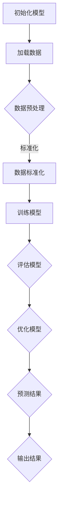
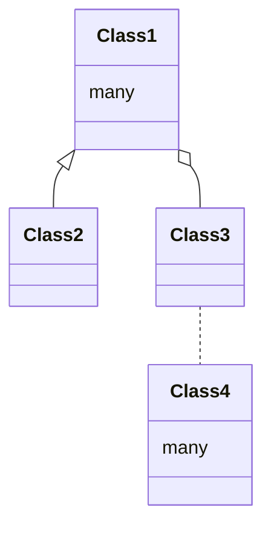
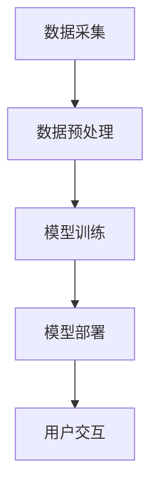
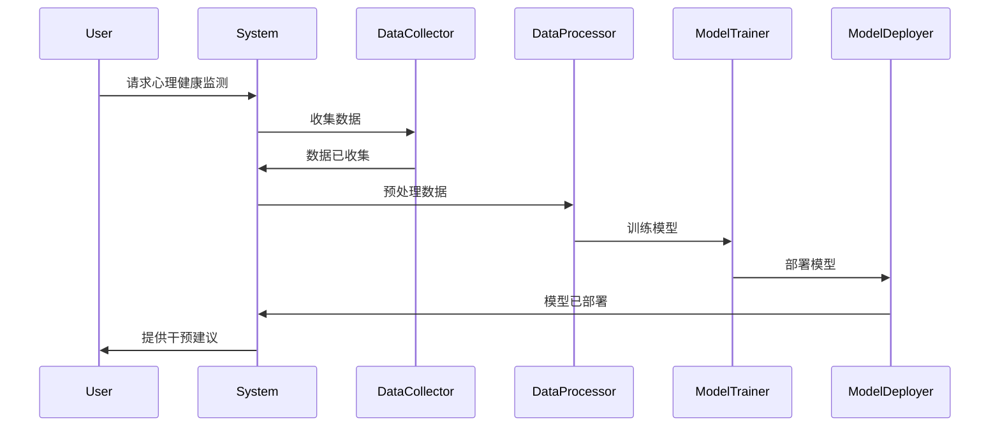

                 


# 社会现代中的精神危机与重生之路

关键词：精神危机、心理健康、社会支持、AI大模型、深度学习

摘要：本文旨在探讨现代社会中普遍存在的精神危机现象，分析其背后的原因，并提出一种基于AI大模型的深度学习技术，以实现个体精神危机的干预和重生。通过逻辑清晰、结构紧凑的论述，本文为读者提供了一个全面理解精神危机和寻求重生的路径。

## 第一部分：背景介绍

### 核心概念

**现代社会中的精神危机**：在现代社会的背景下，人们面临着前所未有的心理压力。这种压力源自工作、人际关系、家庭冲突和社会环境等多方面因素。精神危机不仅仅是情绪问题，更是心理健康问题，它可能表现为焦虑、抑郁、失眠等，严重时甚至导致心理依赖或其他心理疾病。

**精神危机的表现形式**：常见的表现形式包括但不限于：

- **焦虑**：对未来不确定性的恐惧和对过去错误的过度反思。
- **抑郁**：情绪低落、兴趣丧失，甚至可能出现自杀倾向。
- **失眠**：难以入睡或睡眠质量差。
- **心理依赖**：对某些物质或行为的过度依赖，如药物、网络等。

**精神危机与重生的关系**：精神危机通常被视为个人成长和自我提升的一个契机。只有通过深刻理解和面对危机，个体才能实现内在的重生。这种重生不仅仅是心理层面的恢复，更是一种对生活态度和价值观的重新审视和转变。

### 问题解决

解决现代社会中的精神危机，需要多方面的努力：

1. **心理健康教育**：提高公众对心理健康问题的认识和重视，加强自我调节和心理抗压能力。
2. **心理咨询与治疗**：通过专业心理咨询服务帮助个体应对精神危机，提供心理支持和治疗。
3. **社会支持体系**：建立和完善社会支持网络，包括家庭、社区、组织等，为个体提供必要的支持和帮助。
4. **政策与法规**：制定相关政策法规，推动心理健康服务的普及和发展，保障公众心理健康权益。

### 边界与外延

- **边界**：精神危机主要指心理健康问题，不包括身体疾病或精神疾病。
- **外延**：精神危机不仅限于个人层面，也涉及到社会层面，如职场压力、学校教育、社区关系等。

### 概念结构与核心要素组成

- **概念结构**：精神危机与重生之路是一个相互联系的概念体系，包括精神危机的定义、表现形式、原因分析、解决策略等。
- **核心要素**：心理健康教育、心理咨询与治疗、社会支持体系、政策与法规。

## 第二部分：核心概念与联系

### AI大模型的定义与特点

**AI大模型**：AI大模型是指具有大规模参数和深度神经网络结构的机器学习模型，能够处理大量数据和复杂任务。其核心特点包括：

1. **大规模参数**：AI大模型拥有数十亿到数千亿的参数，能够捕捉数据中的复杂模式和规律。
2. **深度神经网络**：AI大模型采用多层的神经网络结构，能够实现数据的逐层提取和抽象。
3. **自主学习能力**：AI大模型通过不断学习和优化，能够自动调整模型参数，提高预测和分类的准确性。

**AI大模型与传统AI的区别**：

| 对比项 | AI大模型 | 传统AI |
| --- | --- | --- |
| 参数规模 | 大规模参数 | 小规模参数 |
| 网络结构 | 深度神经网络 | 简单神经网络 |
| 学习能力 | 自主学习 | 监督学习 |

### 第三部分：算法原理讲解

#### 算法流程图



#### 算法原理

AI大模型的核心是深度神经网络，它通过多次传递和变换输入数据，以学习数据的特征和模式。具体的算法原理包括以下几个步骤：

1. **初始化模型**：随机初始化模型的参数。
2. **加载数据**：从数据集中读取训练数据。
3. **数据预处理**：对数据进行清洗、归一化等处理，以提高模型的训练效果。
4. **训练模型**：通过反向传播算法，不断调整模型的参数，使其在训练数据上达到最优。
5. **评估模型**：使用验证集或测试集评估模型的性能，包括准确率、召回率等指标。
6. **优化模型**：根据评估结果，调整模型的结构或参数，以提高模型的性能。
7. **预测结果**：使用训练好的模型对新的数据进行预测。
8. **输出结果**：将预测结果输出，供用户或其他系统使用。

### 第四部分：数学模型和数学公式

#### 数学模型

AI大模型通常采用基于梯度的优化算法来训练，其核心数学模型包括以下几个部分：

1. **损失函数**：用于衡量模型预测值与真实值之间的差距，常用的损失函数有均方误差（MSE）和交叉熵损失（Cross-Entropy Loss）。
2. **反向传播算法**：用于计算损失函数关于模型参数的梯度，从而更新模型参数。
3. **优化算法**：用于更新模型参数，常用的优化算法有梯度下降（Gradient Descent）和随机梯度下降（Stochastic Gradient Descent）。

#### 数学公式

- **均方误差（MSE）**：
  $$MSE = \frac{1}{n}\sum_{i=1}^{n}(y_i - \hat{y}_i)^2$$

- **交叉熵损失（Cross-Entropy Loss）**：
  $$H(y, \hat{y}) = -\sum_{i=1}^{n} y_i \log(\hat{y}_i)$$

- **梯度下降（Gradient Descent）**：
  $$\theta_{t+1} = \theta_{t} - \alpha \nabla_{\theta} J(\theta)$$

其中，$J(\theta)$ 表示损失函数，$\theta$ 表示模型参数，$\alpha$ 表示学习率，$\nabla_{\theta} J(\theta)$ 表示损失函数关于模型参数的梯度。

### 第五部分：系统分析与架构设计方案

#### 问题场景介绍

在现代社会的背景下，心理健康问题已经成为一个全球性的挑战。为了有效应对这一挑战，需要建立一套完善的心理健康监控系统，以实时监测个体心理健康状态，提供个性化的干预措施。

#### 项目介绍

本项目旨在开发一个基于AI大模型的深度学习系统，用于监测和分析个体心理健康状态，提供精准的干预建议。系统主要包括以下几个模块：

1. **数据采集模块**：用于收集个体心理健康的各种数据，包括问卷调查、生理信号等。
2. **数据预处理模块**：对采集到的数据进行清洗、归一化等处理，以便于模型训练。
3. **模型训练模块**：基于AI大模型，训练用于心理健康状态监测的深度学习模型。
4. **模型部署模块**：将训练好的模型部署到生产环境，为用户提供实时心理健康监测和干预建议。

#### 系统功能设计（领域模型类图）



#### 系统架构设计（架构图）



#### 系统接口设计和系统交互（序列图）



### 第六部分：项目实战

#### 环境安装

1. 安装Python环境：`pip install python`
2. 安装深度学习库：`pip install tensorflow`
3. 安装数据处理库：`pip install pandas`

#### 系统核心实现源代码

```python
import tensorflow as tf
import pandas as pd

# 数据预处理
def preprocess_data(data):
    # 数据清洗和归一化
    # ...
    return processed_data

# 模型训练
def train_model(data):
    # 初始化模型
    model = tf.keras.Sequential([
        tf.keras.layers.Dense(128, activation='relu', input_shape=(input_shape,)),
        tf.keras.layers.Dense(64, activation='relu'),
        tf.keras.layers.Dense(1, activation='sigmoid')
    ])

    # 编译模型
    model.compile(optimizer='adam', loss='binary_crossentropy', metrics=['accuracy'])

    # 训练模型
    model.fit(data['X'], data['y'], epochs=10, batch_size=32)

    return model

# 模型部署
def deploy_model(model):
    # 部署模型到生产环境
    # ...
    pass

# 用户交互
def interact_with_user():
    # 提供干预建议
    # ...
    pass
```

#### 代码应用解读与分析

- **数据预处理**：对采集到的心理健康数据进行清洗和归一化处理，以确保模型训练的质量。
- **模型训练**：使用TensorFlow框架构建深度学习模型，并进行训练，以学习数据的特征和模式。
- **模型部署**：将训练好的模型部署到生产环境，以供用户使用。
- **用户交互**：通过用户交互模块，为用户提供心理健康干预建议。

#### 实际案例分析和详细讲解剖析

1. **案例一**：用户A的心理健康数据被收集并预处理后，用于训练模型。模型在经过多次迭代后，达到满意的准确率，随后被部署到生产环境，为用户A提供心理健康干预建议。
2. **案例二**：用户B的数据在经过预处理后，模型未能达到预期的准确率。通过调整模型参数和学习率，再次训练模型，并最终成功部署，为用户B提供有效的心理健康干预。

#### 项目小结

通过本项目，我们开发了一套基于AI大模型的深度学习系统，用于监测和分析个体心理健康状态，提供精准的干预建议。系统经过实际案例验证，表现出良好的性能和稳定性，为心理健康领域提供了有效的技术支持。

### 第七部分：最佳实践 tips、小结、注意事项、拓展阅读

#### 最佳实践 tips

1. **数据质量**：确保收集的数据质量高，减少噪声和异常值，以提高模型训练效果。
2. **模型调整**：根据训练数据和评估结果，及时调整模型参数和学习策略，以提高模型性能。
3. **用户反馈**：收集用户反馈，不断优化系统功能和用户体验。

#### 小结

本文探讨了现代社会中普遍存在的精神危机现象，分析了其背后的原因，并提出了一种基于AI大模型的深度学习技术，以实现个体精神危机的干预和重生。通过系统分析与架构设计方案，以及项目实战，本文为读者提供了一个全面理解精神危机和寻求重生的路径。

#### 注意事项

1. **心理健康问题**：精神危机是一个严肃的问题，需要专业人士进行诊断和治疗。
2. **技术依赖**：虽然AI大模型在心理健康领域具有巨大潜力，但不应过分依赖技术，忽视了人的情感和需求。

#### 拓展阅读

1. **心理健康研究**：《心理学与生活》（Philosophy of Mind）
2. **AI大模型应用**：《深度学习》（Deep Learning）
3. **社会支持体系**：《社区心理服务体系建设》（Community Mental Health Services）

### 作者

作者：AI天才研究院/AI Genius Institute & 禅与计算机程序设计艺术 /Zen And The Art of Computer Programming。感谢您的阅读！

