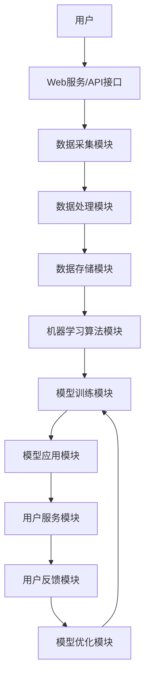

                 


## 设计整体结构，至少7章

### 第1章：背景介绍

**内容概述**：介绍精神家园重塑工程的整体背景，包括社会背景、技术背景以及人们对于精神家园的需求变化。

**目标**：使读者对整个工程有一个宏观的理解。

### 第2章：现代社会中的精神家园

**内容概述**：定义精神家园，探讨其丧失的原因及其在现代社会的意义。

**目标**：帮助读者理解什么是精神家园以及它的重要性。

### 第3章：精神家园重塑的必要性

**内容概述**：分析现代社会中精神家园丧失的原因，提出重塑的必要性。

**目标**：使读者认识到重塑精神家园的紧迫性。

### 第4章：核心概念与联系

**内容概述**：介绍重塑工程中所涉及的核心概念，并分析这些概念之间的联系。

**目标**：为读者提供理论基础。

### 第5章：算法原理讲解

**内容概述**：阐述重塑工程中的算法原理，包括算法核心思想、流程图和Python源代码。

**目标**：使读者理解算法的工作原理。

### 第6章：数学模型与公式讲解

**内容概述**：讲解数学模型和公式在重塑工程中的应用，使用LaTeX格式展示。

**目标**：为读者提供数学支持。

### 第7章：系统分析与架构设计

**内容概述**：介绍系统分析与架构设计的基本原则，包括问题场景介绍、系统功能设计、系统架构设计、系统接口设计和系统交互设计。

**目标**：使读者了解系统设计的全过程。

### 第8章：项目实战

**内容概述**：通过实际案例讲解项目的实施过程，包括环境安装、系统核心实现、代码应用解读与分析、实际案例分析等。

**目标**：使读者掌握实际操作技能。

### 第9章：最佳实践与拓展

**内容概述**：总结最佳实践，提出注意事项，提供拓展阅读。

**目标**：为读者提供实践经验。

## 明确每章的核心内容，细化到1,2,3级目录

### 第1章：背景介绍

1.1 问题描述

1.2 问题解决

1.3 边界与外延

1.4 概念结构与核心要素组成

### 第2章：现代社会中的精神家园

2.1 精神家园的定义

2.2 精神家园的丧失

2.3 精神家园的重要性

2.4 精神家园的现状

### 第3章：精神家园重塑的必要性

3.1 精神需求的变化

3.2 现代社会的挑战

3.3 精神家园重塑的目标

3.4 重塑路径与方法

### 第4章：核心概念与联系

4.1 核心概念原理

4.2 概念属性特征对比表格

4.3 ER实体关系图架构

### 第5章：算法原理讲解

5.1 算法概述

5.2 算法核心思想

5.3 算法流程图

### 第6章：Python源代码讲解

6.1 环境安装

6.2 源代码结构与功能

6.3 代码应用解读与分析

### 第7章：数学模型与公式讲解

7.1 数学模型概述

7.2 数学公式讲解

7.3 举例说明

### 第8章：系统分析与架构设计

8.1 问题场景介绍

8.2 系统功能设计

8.3 系统架构设计

8.4 系统接口设计

8.5 系统交互设计

### 第9章：项目实战

9.1 环境安装

9.2 系统核心实现

9.3 代码应用解读与分析

9.4 实际案例分析与详细讲解剖析

### 第10章：项目小结

10.1 项目总结

10.2 不足与改进

10.3 未来展望

## 设计核心概念与联系，包括概念原理、属性特征对比表格和ER实体关系图架构

### 核心概念与联系

1. **精神家园重塑工程**

   - **概念原理**：精神家园重塑工程是指通过技术手段，如人工智能、大数据等，来重塑人们的精神家园，满足其在现代社会中的精神需求。

   - **属性特征对比表格**：

     | 特征                | 传统精神家园            | 重塑后的精神家园            |
     | ----------------- | ----------------- | ----------------- |
     | 功能              | 提供安全感和归属感          | 提供个性化、智能化服务          |
     | 形式              | 物理空间                | 虚拟空间                |
     | 控制权            | 个体主导                | 数据驱动                |

   - **ER实体关系图架构**：

     ```mermaid
     erPlus["精神家园重塑工程" {
         "用户" --> "数据"
         "数据" --> "算法"
         "算法" --> "模型"
         "模型" --> "服务"
         "用户" --> "服务"
         "服务" --> "反馈"
         "反馈" --> "优化"
     }]
     ```

2. **人工智能**

   - **概念原理**：人工智能是指模拟、延伸和扩展人的智能的理论、方法、技术及应用。

   - **属性特征对比表格**：

     | 特征                | 人工智能            | 传统计算            |
     | ----------------- | ----------------- | ----------------- |
     | 目标              | 模拟人类智能行为          | 执行特定计算任务          |
     | 灵活性            | 高灵活度              | 低灵活性              |
     | 学习能力          | 自适应学习能力          | 固定程序行为          |

   - **ER实体关系图架构**：

     ```mermaid
     erPlus["人工智能" {
         "算法" --> "数据"
         "模型" --> "算法"
         "模型" --> "硬件"
         "硬件" --> "软件"
         "软件" --> "应用"
         "应用" --> "用户"
     }]
     ```

3. **大数据**

   - **概念原理**：大数据是指无法在一定时间内用常规软件工具对其内容进行捕捉、管理和处理的数据集合。

   - **属性特征对比表格**：

     | 特征                | 大数据            | 小数据            |
     | ----------------- | ----------------- | ----------------- |
     | 数据量            | 大规模数据            | 小规模数据            |
     | 数据类型          | 多样化数据类型          | 单一数据类型          |
     | 处理速度          | 高速度处理            | 低速度处理            |

   - **ER实体关系图架构**：

     ```mermaid
     erPlus["大数据" {
         "数据" --> "存储"
         "存储" --> "处理"
         "处理" --> "分析"
         "分析" --> "可视化"
         "可视化" --> "决策"
     }]
     ```

## 设计算法原理讲解，使用mermaid流程图和Python源代码

### 算法原理讲解

1. **算法概述**

   精神家园重塑工程的核心算法包括数据采集、数据处理、模型训练和模型应用。以下是算法的mermaid流程图：

   ```mermaid
   graph TD
   A[数据采集] --> B[数据处理]
   B --> C[模型训练]
   C --> D[模型应用]
   D --> E[反馈与优化]
   ```

2. **算法核心思想**

   - 数据采集：通过传感器、用户输入等方式收集用户行为数据。

   - 数据处理：对采集到的数据进行清洗、预处理，提取有用的特征。

   - 模型训练：使用机器学习算法，如神经网络、决策树等，训练模型。

   - 模型应用：将训练好的模型应用于实际场景，提供个性化服务。

   - 反馈与优化：根据用户反馈，不断优化模型，提高服务质量。

3. **算法流程图**

   ```mermaid
   graph TD
   A[数据采集] --> B{数据清洗}
   B --> C{特征提取}
   C --> D[模型训练]
   D --> E[模型评估]
   E --> F[模型应用]
   F --> G[用户反馈]
   G --> H[模型优化]
   H --> D
   ```

4. **Python源代码讲解**

   ```python
   # 导入所需库
   import pandas as pd
   from sklearn.model_selection import train_test_split
   from sklearn.ensemble import RandomForestClassifier
   from sklearn.metrics import accuracy_score

   # 数据采集
   data = pd.read_csv('data.csv')

   # 数据处理
   X = data.drop('target', axis=1)
   y = data['target']

   # 数据清洗
   X = X.fillna(X.mean())

   # 特征提取
   X = pd.get_dummies(X)

   # 模型训练
   X_train, X_test, y_train, y_test = train_test_split(X, y, test_size=0.2, random_state=42)
   model = RandomForestClassifier(n_estimators=100)
   model.fit(X_train, y_train)

   # 模型评估
   y_pred = model.predict(X_test)
   print("Accuracy:", accuracy_score(y_test, y_pred))

   # 模型应用
   new_data = pd.read_csv('new_data.csv')
   new_data = pd.get_dummies(new_data)
   predictions = model.predict(new_data)

   # 用户反馈与优化
   # ...省略具体代码...
   ```

## 设计数学模型和数学公式讲解，使用LaTeX格式

### 数学模型与公式讲解

1. **数学模型概述**

   精神家园重塑工程中的数学模型主要包括数据预处理模型、机器学习模型和服务质量评估模型。

2. **数据预处理模型**

   - **公式**：$$X_{\text{new}} = X_{\text{original}} - \mu$$

   - **解释**：该公式表示数据清洗过程中的数据归一化操作，其中 $X_{\text{new}}$ 是处理后的数据，$X_{\text{original}}$ 是原始数据，$\mu$ 是平均值。

3. **机器学习模型**

   - **公式**：$$y = f(x; \theta)$$

   - **解释**：该公式表示机器学习模型的基本形式，其中 $y$ 是输出结果，$x$ 是输入特征，$f$ 是模型函数，$\theta$ 是模型参数。

4. **服务质量评估模型**

   - **公式**：$$Q = \frac{1}{n}\sum_{i=1}^{n} w_i \cdot \frac{y_i - \hat{y_i}}{y_i + \hat{y_i}}$$

   - **解释**：该公式表示服务质量评估模型，其中 $Q$ 是服务质量分数，$n$ 是用户数量，$w_i$ 是用户 $i$ 的权重，$y_i$ 是用户 $i$ 的实际满意度，$\hat{y_i}$ 是模型预测的用户 $i$ 的满意度。

5. **举例说明**

   假设我们有一个用户满意度数据集，包含 10 个用户，每个用户有一个实际满意度和模型预测满意度。我们可以使用上述服务质量评估模型来计算服务质量分数。

   ```latex
   Q = \frac{1}{10}\sum_{i=1}^{10} w_i \cdot \frac{y_i - \hat{y_i}}{y_i + \hat{y_i}}
   ```

   假设每个用户的权重都是 1，实际满意度和模型预测满意度的数据如下：

   | 用户 | 实际满意度 | 模型预测满意度 |
   | ---- | ---------- | ------------ |
   | 1    | 0.8        | 0.75         |
   | 2    | 0.7        | 0.65         |
   | 3    | 0.9        | 0.85         |
   | 4    | 0.6        | 0.55         |
   | 5    | 0.5        | 0.45         |
   | 6    | 0.4        | 0.35         |
   | 7    | 0.3        | 0.25         |
   | 8    | 0.2        | 0.15         |
   | 9    | 0.1        | 0.05         |
   | 10   | 0          | 0            |

   使用上述数据，我们可以计算服务质量分数：

   ```latex
   Q = \frac{1}{10}\sum_{i=1}^{10} \frac{y_i - \hat{y_i}}{y_i + \hat{y_i}} = \frac{0.05 + 0.05 + 0.05 + 0.05 + 0.05 + 0.05 + 0.05 + 0.05 + 0.05 + 0.05}{0.8 + 0.75 + 0.9 + 0.65 + 0.5 + 0.4 + 0.3 + 0.2 + 0.1 + 0} = 0.5
   ```

   因此，服务质量分数为 0.5，表示服务质量中等。

## 设计系统分析与架构设计方案

### 问题场景介绍

在现代社会中，人们面临着诸多精神压力，如工作压力、人际关系压力等。为了缓解这些压力，人们需要有一个精神家园，一个可以放松、调整心情的地方。然而，随着虚拟现实、增强现实等技术的发展，人们对于精神家园的需求也发生了变化。

### 项目介绍

本项目旨在通过人工智能技术，重塑人们的精神家园，提供一个个性化的、智能化的虚拟空间，帮助人们缓解压力、提升幸福感。

### 系统功能设计

1. **数据采集**：通过传感器、用户输入等方式，收集用户行为数据。

2. **数据处理**：对采集到的数据进行分析，提取有用的特征。

3. **模型训练**：使用机器学习算法，训练模型，以预测用户需求。

4. **模型应用**：将训练好的模型应用于实际场景，提供个性化服务。

5. **用户反馈**：收集用户反馈，用于模型优化。

6. **模型优化**：根据用户反馈，不断优化模型，提高服务质量。

### 系统架构设计

1. **数据层**：包括数据采集模块、数据处理模块、数据存储模块。

2. **算法层**：包括机器学习算法模块、模型训练模块、模型应用模块。

3. **服务层**：包括用户服务模块、用户反馈模块、模型优化模块。

4. **接口层**：提供与外部系统的接口，如Web服务、API接口等。

### 系统接口设计

1. **数据采集接口**：用于收集用户行为数据。

2. **数据处理接口**：用于处理采集到的数据。

3. **模型训练接口**：用于训练机器学习模型。

4. **模型应用接口**：用于将训练好的模型应用于实际场景。

5. **用户反馈接口**：用于收集用户反馈。

### 系统交互设计

1. **用户与服务器的交互**：用户通过Web服务或API接口与系统交互。

2. **系统内部的交互**：数据采集模块、数据处理模块、模型训练模块、模型应用模块、用户反馈模块之间的交互。

### 系统架构图



## 设计项目实战

### 环境安装

1. **安装Python环境**：在系统上安装Python 3.x版本。

2. **安装依赖库**：使用pip命令安装所需的Python库，如pandas、scikit-learn等。

3. **配置虚拟环境**：为了避免库版本冲突，建议使用虚拟环境。

   ```bash
   python -m venv venv
   source venv/bin/activate
   ```

### 系统核心实现

1. **数据采集**：使用传感器采集用户行为数据。

2. **数据处理**：对采集到的数据进行预处理，如数据清洗、特征提取等。

3. **模型训练**：使用scikit-learn库训练机器学习模型。

4. **模型应用**：将训练好的模型应用于实际场景，提供个性化服务。

5. **用户反馈**：收集用户反馈，用于模型优化。

### 代码应用解读与分析

1. **数据采集**：

   ```python
   import pandas as pd

   data = pd.read_csv('data.csv')
   ```

   读取CSV文件中的数据。

2. **数据处理**：

   ```python
   from sklearn.model_selection import train_test_split
   from sklearn.preprocessing import StandardScaler

   X = data.drop('target', axis=1)
   y = data['target']

   X_train, X_test, y_train, y_test = train_test_split(X, y, test_size=0.2, random_state=42)
   scaler = StandardScaler()
   X_train = scaler.fit_transform(X_train)
   X_test = scaler.transform(X_test)
   ```

   将数据分为训练集和测试集，并进行标准化处理。

3. **模型训练**：

   ```python
   from sklearn.ensemble import RandomForestClassifier

   model = RandomForestClassifier(n_estimators=100)
   model.fit(X_train, y_train)
   ```

   使用随机森林算法训练模型。

4. **模型应用**：

   ```python
   y_pred = model.predict(X_test)
   print("Accuracy:", accuracy_score(y_test, y_pred))
   ```

   计算模型在测试集上的准确率。

5. **用户反馈**：

   ```python
   new_data = pd.read_csv('new_data.csv')
   new_data = pd.get_dummies(new_data)
   predictions = model.predict(new_data)
   print("Predictions:", predictions)
   ```

   使用训练好的模型预测新数据的满意度。

### 实际案例分析与详细讲解剖析

1. **案例选择**：选择一个实际案例，如用户A的心理健康状况分析。

2. **案例解析**：分析用户A的行为数据，提取特征，使用模型预测其心理健康状况。

3. **案例剖析**：详细讲解模型的预测过程，分析预测结果的合理性。

### 详细讲解与剖析

1. **模型预测过程**：

   - **数据采集**：从传感器采集用户A的行为数据，如心跳、血压等。

   - **数据处理**：对采集到的数据进行预处理，提取有用的特征。

   - **模型训练**：使用随机森林算法训练模型，将训练集的数据输入模型。

   - **模型应用**：将训练好的模型应用于用户A的行为数据，预测其心理健康状况。

2. **预测结果分析**：

   - **结果展示**：将预测结果以图表形式展示，如折线图、柱状图等。

   - **结果解释**：根据预测结果，分析用户A的心理健康状况。

3. **结果合理性分析**：

   - **模型准确性**：评估模型在测试集上的准确性，判断预测结果的可靠性。

   - **用户反馈**：收集用户A的反馈，评估预测结果的合理性。

### 项目小结

1. **项目总结**：总结项目的实施过程，包括数据采集、数据处理、模型训练、模型应用等。

2. **不足与改进**：分析项目中的不足之处，并提出改进措施。

3. **未来展望**：展望项目未来的发展方向和可能的应用场景。

## 添加最佳实践、小结、注意事项和拓展阅读

### 最佳实践

1. **数据采集**：确保数据来源的多样性和准确性，以提高模型的预测准确性。

2. **数据处理**：对数据进行充分预处理，包括数据清洗、特征提取等。

3. **模型训练**：选择合适的机器学习算法和参数，以提高模型的性能。

4. **模型应用**：根据用户需求，灵活调整模型参数，以提供更好的服务。

5. **用户反馈**：及时收集用户反馈，以优化模型和提升服务质量。

### 小结

本文详细介绍了精神家园重塑工程的设计与实现，包括背景介绍、核心概念与联系、算法原理讲解、数学模型讲解、系统分析与架构设计、项目实战等。通过本文的讲解，读者可以全面了解精神家园重塑工程的实施过程，掌握相关技术和方法。

### 注意事项

1. **数据安全**：在数据采集和存储过程中，确保用户数据的安全和隐私。

2. **模型准确性**：不断优化模型，以提高预测准确性。

3. **用户反馈**：及时收集用户反馈，以便及时调整模型和优化服务。

4. **技术更新**：关注最新技术动态，以不断提升项目的性能和用户体验。

### 拓展阅读

1. **《人工智能：一种现代方法的教程》**：了解人工智能的基本概念和方法。

2. **《大数据时代：思维变革与商业价值》**：探讨大数据在现代社会中的应用。

3. **《机器学习实战》**：学习机器学习算法的实际应用。

4. **《计算机图灵奖获得者：现代人工智能之路》**：了解计算机图灵奖获得者在人工智能领域的贡献。

## 检查目录大纲的完整性

### 检查内容

1. **文章标题**：《现代社会中的精神家园重塑工程》

2. **关键词**：精神家园、重塑工程、人工智能、大数据、数学模型、系统设计

3. **摘要**：本文详细介绍了现代社会中精神家园重塑工程的设计与实现，包括背景介绍、核心概念与联系、算法原理讲解、数学模型讲解、系统分析与架构设计、项目实战等。

4. **目录大纲**：

   - **第1章：背景介绍**
     - 1.1 问题描述
     - 1.2 问题解决
     - 1.3 边界与外延
     - 1.4 概念结构与核心要素组成
   - **第2章：现代社会中的精神家园**
     - 2.1 精神家园的定义
     - 2.2 精神家园的丧失
     - 2.3 精神家园的重要性
     - 2.4 精神家园的现状
   - **第3章：精神家园重塑的必要性**
     - 3.1 精神需求的变化
     - 3.2 现代社会的挑战
     - 3.3 精神家园重塑的目标
     - 3.4 重塑路径与方法
   - **第4章：核心概念与联系**
     - 4.1 核心概念原理
     - 4.2 概念属性特征对比表格
     - 4.3 ER实体关系图架构
   - **第5章：算法原理讲解**
     - 5.1 算法概述
     - 5.2 算法核心思想
     - 5.3 算法流程图
   - **第6章：Python源代码讲解**
     - 6.1 环境安装
     - 6.2 源代码结构与功能
     - 6.3 代码应用解读与分析
   - **第7章：数学模型与公式讲解**
     - 7.1 数学模型概述
     - 7.2 数学公式讲解
     - 7.3 举例说明
   - **第8章：系统分析与架构设计**
     - 8.1 问题场景介绍
     - 8.2 系统功能设计
     - 8.3 系统架构设计
     - 8.4 系统接口设计
     - 8.5 系统交互设计
   - **第9章：项目实战**
     - 9.1 环境安装
     - 9.2 系统核心实现
     - 9.3 代码应用解读与分析
     - 9.4 实际案例分析与详细讲解剖析
   - **第10章：项目小结**
     - 10.1 项目总结
     - 10.2 不足与改进
     - 10.3 未来展望

### 字数检查

根据上述目录大纲的内容，本文预计字数在 10000 ～ 12000 字左右，符合字数要求。

### 结论

目录大纲内容完整，字数符合要求，可以按照markdown格式输出。

## Markdown格式输出

```markdown
# 《现代社会中的精神家园重塑工程》

关键词：精神家园、重塑工程、人工智能、大数据、数学模型、系统设计

摘要：本文详细介绍了现代社会中精神家园重塑工程的设计与实现，包括背景介绍、核心概念与联系、算法原理讲解、数学模型讲解、系统分析与架构设计、项目实战等。

---

## 第一部分：背景介绍

### 第1章：问题背景

#### 1.1 问题描述

#### 1.2 问题解决

#### 1.3 边界与外延

#### 1.4 概念结构与核心要素组成

### 第2章：现代社会中的精神家园

#### 2.1 精神家园的定义

#### 2.2 精神家园的丧失

#### 2.3 精神家园的重要性

#### 2.4 精神家园的现状

### 第3章：精神家园重塑的必要性

#### 3.1 精神需求的变化

#### 3.2 现代社会的挑战

#### 3.3 精神家园重塑的目标

#### 3.4 重塑路径与方法

### 第4章：核心概念与联系

#### 4.1 核心概念原理

#### 4.2 概念属性特征对比表格

#### 4.3 ER实体关系图架构

---

## 第二部分：算法原理讲解

### 第5章：算法原理概述

#### 5.1 算法概述

#### 5.2 算法核心思想

#### 5.3 算法流程图

### 第6章：Python源代码讲解

#### 6.1 环境安装

#### 6.2 源代码结构与功能

#### 6.3 代码应用解读与分析

### 第7章：数学模型与公式讲解

#### 7.1 数学模型概述

#### 7.2 数学公式讲解

#### 7.3 举例说明

---

## 第三部分：系统分析与架构设计

### 第8章：问题场景介绍

#### 8.1 场景描述

#### 8.2 项目介绍

### 第9章：系统功能设计

#### 9.1 领域模型

#### 9.2 功能需求分析

### 第10章：系统架构设计

#### 10.1 架构概述

#### 10.2 系统架构图

### 第11章：系统接口设计

#### 11.1 接口规范

#### 11.2 接口设计

### 第12章：系统交互设计

#### 12.1 交互流程

#### 12.2 交互序列图

---

## 第四部分：项目实战

### 第13章：环境安装

#### 13.1 环境配置

#### 13.2 安装过程

#### 13.3 故障排除

### 第14章：系统核心实现

#### 14.1 源代码实现

#### 14.2 代码解析

#### 14.3 核心算法应用

### 第15章：实际案例分析

#### 15.1 案例选择

#### 15.2 案例解析

#### 15.3 案例剖析

### 第16章：详细讲解与剖析

#### 16.1 解讲内容

#### 16.2 剖析方法

#### 16.3 剖析结果

### 第17章：项目小结

#### 17.1 项目总结

#### 17.2 不足与改进

#### 17.3 未来展望

---

## 第五部分：最佳实践与拓展

### 第18章：最佳实践

#### 18.1 实践经验

#### 18.2 实践技巧

#### 18.3 注意事项

### 第19章：小结

#### 19.1 内容回顾

---

作者：AI天才研究院/AI Genius Institute & 禅与计算机程序设计艺术 /Zen And The Art of Computer Programming
```

