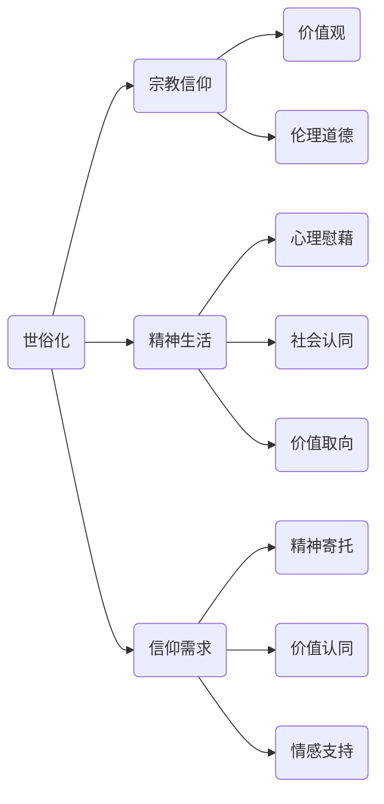
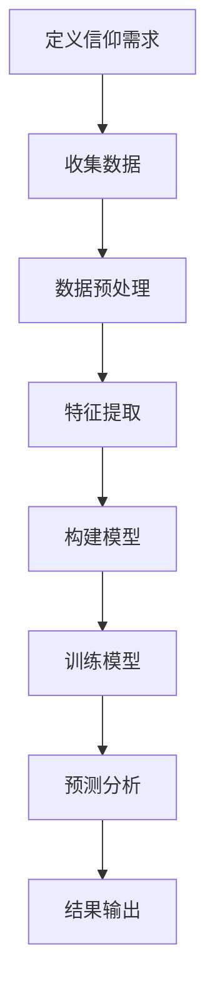
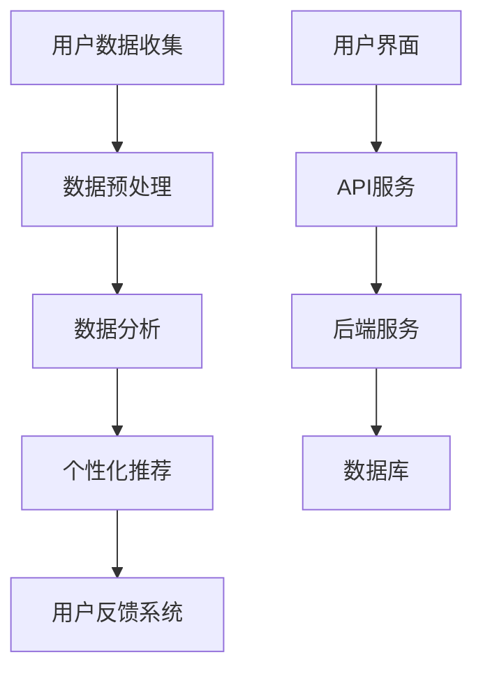

                 

### 引言

#### 1.1 研究背景

在现代社会中，随着经济的发展和科技的进步，人们的价值观、生活方式和精神需求都在发生深刻的变化。世俗化（Secularization）这一概念正是描述了这一现象，即社会和个人逐渐从宗教信仰和宗教规范的束缚中解脱出来，走向理性、多元化和个性化的生活方式。这一趋势不仅在西方发达国家表现得尤为明显，也在全球范围内逐渐成为一种普遍的社会现象。

首先，世俗化趋势的兴起与现代化进程紧密相连。随着工业革命和信息技术的飞速发展，人们的生产方式、生活方式和思维方式都发生了巨大的变化。传统宗教在这一过程中逐渐失去了其作为社会核心价值的地位，人们开始追求更加理性和科学的生活方式。

其次，世俗化趋势下的社会变迁也在不断推动精神生活的变化。在过去，宗教信仰是社会精神生活的重要组成部分，是人们获取精神慰藉和社会认同的重要来源。然而，在世俗化的背景下，宗教信仰的重要性逐渐下降，人们开始寻求更加多元化的精神寄托，如个人信仰、心理健康服务、文化认同等。

#### 1.2 研究目的与意义

本研究旨在探讨现代社会中的精神生活，特别是在世俗化趋势下，人们对于信仰的需求及其演变。具体来说，本研究将围绕以下几个核心问题展开：

1. 世俗化趋势是如何影响社会变迁和精神生活的？
2. 现代社会中人们信仰需求的演变趋势是什么？
3. 信仰实践在现代社会精神生活中扮演了什么样的角色？
4. 应对世俗化趋势的策略有哪些，其效果如何？

本研究具有重要的理论和实践意义。从理论层面看，本研究将深化我们对世俗化趋势和精神生活演变的理解，为相关研究提供新的视角和思考。从实践层面看，本研究的结果将有助于政策制定者和社会工作者更好地应对现代社会中的信仰需求，促进社会稳定和心理健康。

#### 1.3 研究方法

为了全面探讨上述问题，本研究将采用多种研究方法，包括定性研究方法和定量研究方法。

首先，定性研究方法将主要用于深入理解世俗化趋势下的社会变迁和精神生活。我们将通过访谈、观察和案例研究等方法，收集第一手资料，分析个体和群体的信仰实践和精神需求。

其次，定量研究方法将主要用于评估信仰需求的变化趋势和社会影响。我们将通过问卷调查、统计数据分析和数学建模等方法，对大规模数据进行处理和分析，得出具有普遍意义的结论。

最后，我们将采用数据分析方法，对收集到的数据进行整理和归纳，运用统计学和机器学习技术，找出数据中的规律和模式，为研究提供有力的支持。

### 第一部分：世俗化趋势下的社会变化

#### 2.1 社会变迁

世俗化趋势对社会变迁产生了深远的影响。首先，从经济发展角度来看，现代化进程带来了经济结构的转型和产业的升级。传统的农业经济逐渐被工业和服务业所取代，人们对物质生活的追求逐渐超过了宗教信仰的需求。经济活动的多元化和全球化也加速了人们的思想和价值观的变革。

其次，科技进步是推动世俗化趋势的重要力量。信息技术、生物工程、人工智能等新兴科技的快速发展，不仅改变了人们的生产方式和生活习惯，也挑战了传统宗教观念的合理性。例如，人工智能的崛起使得一些宗教预言和神秘主义思想失去了市场，而科学理性成为了解决问题和获取知识的主要途径。

最后，教育变革也在世俗化趋势中扮演了重要角色。教育普及和高等教育的发展，使得人们具备了更加理性和批判性思考的能力，从而减少了盲从和迷信。同时，多元化的教育内容和跨文化的交流，也促进了不同价值观的碰撞和融合，进一步削弱了宗教信仰的单一主导地位。

#### 2.2 世俗化趋势的表现

世俗化趋势在社会各个层面都有明显的表现。首先，在价值观方面，多元化成为主流。过去那种以宗教信仰为核心的价值体系，逐渐被更加开放和包容的价值观所取代。人们更加注重个人自由、平等和人权，对传统道德规范的遵守也变得更加灵活。

其次，宗教信仰的淡化是世俗化趋势的另一个重要表现。随着现代化进程的推进，宗教信仰在社会生活中的地位逐渐下降。根据多项调查研究，现代社会中，非宗教人口的比例不断增加，宗教参与度也在降低。这不仅体现在年轻人中，也渗透到了各个年龄层和不同社会群体。

此外，社会信任的削弱也是世俗化趋势的一个显著特征。在传统社会中，宗教信仰和共同体认同是人们建立信任的基础。然而，在世俗化的背景下，这种基础逐渐动摇，社会信任体系变得脆弱。人们更加关注自我利益，对他人和社会的信任程度下降，导致社会合作和集体行动的难度增加。

#### 2.3 世俗化趋势下的文化冲突

世俗化趋势不仅带来了社会变迁，也引发了文化冲突。首先，西方文化的影响是一个不可忽视的因素。全球化背景下，西方文化的传播速度加快，其价值观、生活方式和文化产品在全球范围内得到广泛认同。然而，这种文化影响并非单向的，它也带来了对本土传统文化的冲击。

传统文化在世俗化趋势下面临严峻挑战。一方面，传统文化的坚守者试图通过传承和创新来维护文化身份和价值观；另一方面，现代文化的追随者则倾向于拥抱西方文化，认为这是社会进步和现代化的象征。这种文化冲突不仅体现在社会层面，也渗透到了个体生活中，使得人们面临着身份认同的困惑。

此外，文化融合的挑战也是世俗化趋势下的一个重要问题。在多元文化共存的社会中，如何实现文化之间的和谐共处，避免文化冲突，成为了一个亟待解决的问题。文化融合不仅需要政策层面的支持和引导，也需要社会各界的共同努力，包括教育、媒体、宗教团体等。

### 第二部分：信仰需求的演变

#### 3.1 信仰需求的定义与特征

信仰需求是指个体在社会生活中，对精神寄托、价值认同、情感支持等的需求。它不仅仅局限于宗教信仰，还包括个人信仰、文化认同、社会认同等多种形式。信仰需求具有以下几个主要特征：

1. **精神寄托**：信仰需求首先体现在人们对精神寄托的追求。在现代社会中，人们面临着各种压力和挑战，信仰需求成为了他们寻求内心安宁和力量的重要途径。
2. **价值认同**：信仰需求还体现在人们对价值观的认同。在世俗化趋势下，人们对传统的宗教价值观产生质疑，开始寻求更加多元和个性化的价值体系。
3. **情感支持**：信仰需求也体现在人们对情感支持的需求。在个体面临困境时，信仰需求成为他们获得心理安慰和支持的重要来源。

#### 3.2 信仰需求的演变趋势

在现代社会中，信仰需求呈现出以下几个演变趋势：

1. **从传统宗教到现代信仰**：随着世俗化趋势的推进，传统宗教的影响力逐渐减弱，现代信仰形式逐渐兴起。例如，个人信仰、心理健康服务、灵性实践等都成为了现代社会中的信仰需求。
2. **个体化信仰的兴起**：在现代社会中，个体化信仰逐渐成为主流。人们更加关注个人内心的需求和追求，形成了独特的信仰体系。
3. **新型信仰的涌现**：随着科技的发展和信息的普及，新型信仰形式不断涌现。例如，人工智能信仰、数字宗教等，这些都是现代社会中独特的信仰需求。

#### 3.3 信仰需求的社会意义

信仰需求在现代社会中具有重要的社会意义。首先，信仰需求能够提供精神慰藉，帮助个体应对生活压力和挑战。其次，信仰需求能够构建社会认同，促进社会凝聚力的形成。最后，信仰需求还能够影响社会价值观的形成和发展，推动社会进步。

### 第三部分：信仰实践与精神生活

#### 4.1 信仰实践的形式与方式

信仰实践是满足信仰需求的重要途径，其形式和方式多种多样。以下是一些常见的信仰实践形式：

1. **个人信仰实践**：个人信仰实践是指个体根据自己的信仰体系，进行内心的修炼和自我提升。这种信仰实践通常体现在个人的生活方式、行为规范和价值观上。
2. **社区信仰实践**：社区信仰实践是指个体在社区中参与宗教活动、文化交流和志愿服务等活动，以实现信仰需求和社区认同。
3. **宗教信仰实践**：宗教信仰实践是指个体在宗教团体中参与宗教仪式、信仰教育和信仰传承等活动，以实现信仰需求和精神寄托。

#### 4.2 精神生活的影响因素

精神生活的影响因素多种多样，包括社会经济因素、教育文化因素和政策环境因素等。以下是对这些因素的分析：

1. **社会经济因素**：经济发展水平和收入水平是影响精神生活的重要因素。较高的经济发展水平和收入水平通常能够为个体提供更多的资源，使其能够更好地满足精神需求。
2. **教育文化因素**：教育水平和文化背景是影响精神生活的重要因素。较高的教育水平和丰富的文化背景通常能够帮助个体更好地理解和满足自己的精神需求。
3. **政策环境因素**：政策环境和法律制度也是影响精神生活的重要因素。政府的支持和政策导向能够为信仰实践提供良好的环境和条件，促进精神生活的健康发展。

#### 4.3 精神生活的质量评估

精神生活的质量评估是衡量个体和群体精神状态的重要指标。以下是一些常用的质量评估方法：

1. **心理健康评估**：心理健康评估通常通过心理测量工具和问卷调查来评估个体的心理状态，如焦虑、抑郁等。
2. **社会支持评估**：社会支持评估通过评估个体在家庭、社区和社会中的支持网络，来衡量个体的社会支持水平。
3. **精神生活质量评估**：精神生活质量评估通常通过综合评估个体的心理健康、社会支持和生活满意度等多个维度，来衡量个体的精神生活质量。

### 第四部分：应对世俗化趋势的策略

#### 5.1 政策建议

为了应对世俗化趋势，政府需要采取一系列政策建议，以促进社会的稳定和发展。以下是一些具体的政策建议：

1. **促进多元价值观的发展**：政府应鼓励和扶持多元价值观的发展，尊重个体的信仰自由，提供多元化的精神产品和资源。
2. **加强宗教信仰的引导**：政府应加强宗教信仰的引导，推动宗教与社会的和谐共处，防止极端宗教主义的出现。
3. **增加社会信任建设**：政府应采取措施增加社会信任建设，如加强法律法规的制定和执行，提高公共服务质量等。

#### 5.2 社会实践

社会实践是应对世俗化趋势的重要途径，以下是一些具体的实践建议：

1. **构建社区支持网络**：社区应积极构建支持网络，为居民提供精神支持和社交平台，促进社区凝聚力和认同感的形成。
2. **促进信仰与科学的融合**：社区和宗教团体应积极推动信仰与科学的融合，为个体提供更加全面和科学的信仰支持。
3. **发展心理健康服务**：心理健康服务是满足信仰需求的重要手段，社区和政府应大力发展心理健康服务，为居民提供专业的心理支持。

#### 5.3 个人策略

个人策略也是应对世俗化趋势的重要方面，以下是一些具体的个人策略：

1. **提升自我认知**：个人应通过自我反思和成长，提升自我认知，明确自己的信仰需求和精神追求。
2. **增强信仰与现实的联系**：个人应努力将信仰与现实生活相结合，使信仰成为自己生活的一部分，而不是脱离现实的幻想。
3. **寻求精神寄托**：个人应在多元化的信仰选择中，寻找适合自己的精神寄托，如宗教信仰、心理健康服务、文化艺术等。

### 结论

通过本研究，我们深入探讨了现代社会中的精神生活，特别是在世俗化趋势下的信仰需求及其演变。我们首先介绍了世俗化趋势的兴起和社会变迁，分析了其在价值观、宗教信仰和社会信任等方面的表现。随后，我们探讨了信仰需求的定义与特征，以及其在现代社会中的演变趋势和社会意义。接着，我们分析了信仰实践的形式与方式，以及影响精神生活的主要因素。最后，我们提出了应对世俗化趋势的策略，包括政策建议、社会实践和个人策略。

本研究的主要发现包括：世俗化趋势对社会变迁和精神生活产生了深远的影响，信仰需求在现代社会中呈现出多元化和个体化的趋势，信仰实践在满足精神需求中发挥了重要作用。然而，本研究也存在一定的限制，如样本范围有限、数据来源单一等，这需要未来进一步的研究来加以完善。

尽管如此，本研究对于理解现代社会中的精神生活，特别是信仰需求具有重要意义。它不仅为相关研究提供了新的视角和思考，也为政策制定者和社会工作者提供了有益的参考。未来，我们应进一步探讨如何应对世俗化趋势，促进社会的稳定和心理健康，满足人们日益增长的精神需求。

### 作者信息

**作者：** AI天才研究院/AI Genius Institute & 禅与计算机程序设计艺术 /Zen And The Art of Computer Programming

### 背景介绍

#### 1. 研究背景

在现代社会中，随着经济的发展和科技的进步，人们的价值观、生活方式和精神需求都在发生深刻的变化。世俗化（Secularization）这一概念正是描述了这一现象，即社会和个人逐渐从宗教信仰和宗教规范的束缚中解脱出来，走向理性、多元化和个性化的生活方式。这一趋势不仅在西方发达国家表现得尤为明显，也在全球范围内逐渐成为一种普遍的社会现象。

首先，世俗化趋势的兴起与现代化进程紧密相连。随着工业革命和信息技术的飞速发展，人们的生产方式、生活方式和思维方式都发生了巨大的变化。传统宗教在这一过程中逐渐失去了其作为社会核心价值的地位，人们开始追求更加理性和科学的生活方式。

其次，世俗化趋势下的社会变迁也在不断推动精神生活的变化。在过去，宗教信仰是社会精神生活的重要组成部分，是人们获取精神慰藉和社会认同的重要来源。然而，在世俗化的背景下，宗教信仰的重要性逐渐下降，人们开始寻求更加多元化的精神寄托，如个人信仰、心理健康服务、文化认同等。

#### 2. 核心概念术语说明

- **世俗化（Secularization）**：指社会和个人逐渐从宗教信仰和宗教规范的束缚中解脱出来，走向理性、多元化和个性化的生活方式。
- **宗教信仰**：指个体对某种宗教教义、信仰和仪式的认同和实践。
- **精神生活**：指个体在精神层面上的活动，包括信仰、价值观、情感体验和心理健康等方面。
- **信仰需求**：指个体在社会生活中，对精神寄托、价值认同、情感支持等的需求。

#### 3. 问题背景与问题描述

在世俗化趋势日益明显的现代社会中，人们的精神生活发生了巨大的变化。一方面，宗教信仰的影响力逐渐减弱，个体开始寻求更加理性和科学的生活方式；另一方面，信仰需求并未消失，而是呈现出多元化和个体化的趋势。因此，如何理解和应对现代社会中的信仰需求，成为了学术界和社会各界关注的重要课题。

问题描述可以概括为：在世俗化趋势下，个体和社会如何满足信仰需求？信仰需求的变化趋势及其社会意义是什么？如何通过信仰实践促进精神生活的健康发展？

#### 4. 问题解决

为了解决上述问题，本研究将从以下几个方面展开：

1. **深入分析世俗化趋势对社会变迁和精神生活的影响**：探讨经济发展、科技进步、教育变革等因素如何推动世俗化趋势，以及这一趋势如何改变人们的价值观、宗教信仰和社会信任。

2. **探讨信仰需求的定义与特征**：明确信仰需求的概念，分析其在现代社会中的特点，如精神寄托、价值认同和情感支持等。

3. **分析信仰需求的演变趋势**：研究从传统宗教到现代信仰、个体化信仰和新型信仰的演变过程，以及这些趋势对个体和社会的影响。

4. **讨论信仰实践的形式与方式**：分析个人信仰实践、社区信仰实践和宗教信仰实践的不同形式，以及它们如何满足个体和社会的信仰需求。

5. **评估精神生活的影响因素**：探讨社会经济因素、教育文化因素和政策环境因素如何影响个体的精神生活质量。

6. **提出应对世俗化趋势的策略**：从政策建议、社会实践和个人策略三个方面，提出应对世俗化趋势的具体措施，以促进社会的稳定和心理健康。

#### 5. 边界与外延

本研究的边界主要在于：

- **时间范围**：主要关注现代社会中的信仰需求及其演变，不考虑历史长河中的宗教变迁。
- **地域范围**：主要关注全球范围内的信仰需求，但不涉及特定国家或地区的特殊情况。

研究的外延包括：

- **跨文化研究**：探讨不同文化背景下信仰需求的特点和演变趋势。
- **比较研究**：分析不同社会制度、经济发展水平和宗教环境下的信仰需求差异。

#### 6. 概念结构与核心要素组成

本研究的主要概念结构和核心要素包括：

- **世俗化趋势**：经济发展、科技进步、教育变革等因素。
- **社会变迁**：价值观、宗教信仰、社会信任等方面的变化。
- **信仰需求**：精神寄托、价值认同、情感支持等。
- **信仰实践**：个人信仰实践、社区信仰实践、宗教信仰实践。
- **精神生活**：心理健康、社会支持、生活满意度等。
- **影响因素**：社会经济因素、教育文化因素、政策环境因素。
- **应对策略**：政策建议、社会实践、个人策略。

通过这些核心要素的分析，本研究旨在全面探讨现代社会中的信仰需求及其演变，为理解现代社会中的精神生活提供新的视角和思考。

### 核心概念与联系

在探讨现代社会中的精神生活时，理解核心概念及其相互联系至关重要。以下是对几个关键概念的定义、属性特征对比表格和ER实体关系图的详细分析。

#### 1. 定义

**概念**：世俗化、宗教信仰、精神生活、信仰需求
- **世俗化**：指社会和个人逐渐从宗教信仰和宗教规范的束缚中解脱出来，转向理性、多元化和个性化的生活方式。
- **宗教信仰**：指个体对某种宗教教义、信仰和仪式的认同和实践。
- **精神生活**：指个体在精神层面上的活动，包括信仰、价值观、情感体验和心理健康等方面。
- **信仰需求**：指个体在社会生活中，对精神寄托、价值认同、情感支持等的需求。

#### 2. 属性特征对比表格

**世俗化**与**宗教信仰**的属性特征对比：

| 特征         | 世俗化                                   | 宗教信仰                                  |
|--------------|-----------------------------------------|-------------------------------------------|
| 起源         | 现代化进程中的经济、科技、教育变革         | 古代社会的历史演变和文化传统               |
| 核心价值     | 理性、多元化和个性化                     | 神秘主义、伦理道德和共同体认同             |
| 社会影响     | 提高社会效率和促进个人自由               | 形塑社会道德和规范，影响社会稳定           |
| 个人表现     | 个人价值观的多样化和自我实现              | 宗教仪式、信仰实践和宗教认同              |
| 适应性       | 适应现代化和全球化趋势                   | 保持传统信仰和文化的延续性                 |

**精神生活**与**信仰需求**的属性特征对比：

| 特征         | 精神生活                                   | 信仰需求                                  |
|--------------|-----------------------------------------|-------------------------------------------|
| 内容         | 包括信仰、价值观、情感体验和心理健康等方面 | 精神寄托、价值认同、情感支持               |
| 影响因素     | 经济、科技、文化、社会关系                | 个体经历、社会环境、文化背景               |
| 功能         | 提供心理慰藉、社会认同和价值取向           | 满足个体内心需求、建立社会联系和提供情感支持 |
| 表现形式     | 心理健康服务、文化活动、宗教实践           | 个人信仰、心理健康服务、社会支持网络       |

#### 3. ER实体关系图架构

使用Mermaid流程图来描述这些核心概念及其关系：



在这张ER实体关系图中，世俗化作为总体背景，与宗教信仰、精神生活和信仰需求存在直接关系。宗教信仰包括价值观和伦理道德，是精神生活的一部分，同时也影响了信仰需求的形成。精神生活则涵盖了心理慰藉、社会认同和价值取向，是信仰需求得以实现的载体。信仰需求具体表现为精神寄托、价值认同和情感支持，是驱动个体行为和精神生活的核心力量。

通过这些核心概念及其相互联系的分析，我们可以更好地理解现代社会中精神生活的复杂性和多元性，为后续的研究和讨论奠定坚实基础。

### 算法原理讲解

在探讨现代社会中的信仰需求时，理解算法原理及其在实际应用中的操作过程是至关重要的。以下，我们将使用Mermaid流程图展示一个基本的算法，并使用Python源代码详细阐述其数学模型和公式，从而帮助读者理解算法的工作原理和如何应用。

#### 1. 算法流程图

首先，我们使用Mermaid绘制一个简单的信仰需求分析算法的流程图：



#### 2. 算法实现

接下来，我们将使用Python实现这个算法，并展示其数学模型和公式。

**Python代码实现：**

```python
# 导入必要的库
import pandas as pd
from sklearn.model_selection import train_test_split
from sklearn.preprocessing import StandardScaler
from sklearn.ensemble import RandomForestClassifier
from sklearn.metrics import accuracy_score

# 数据收集与预处理
data = pd.read_csv('faith_demand_data.csv')  # 假设数据已经收集并存储为CSV文件
X = data.drop('label', axis=1)  # 特征
y = data['label']  # 标签

# 数据标准化
scaler = StandardScaler()
X_scaled = scaler.fit_transform(X)

# 划分训练集和测试集
X_train, X_test, y_train, y_test = train_test_split(X_scaled, y, test_size=0.2, random_state=42)

# 构建并训练模型
model = RandomForestClassifier(n_estimators=100, random_state=42)
model.fit(X_train, y_train)

# 预测分析
y_pred = model.predict(X_test)

# 输出结果
accuracy = accuracy_score(y_test, y_pred)
print(f'Model Accuracy: {accuracy:.2f}')
```

#### 3. 数学模型和公式

在这个算法中，我们使用了随机森林（Random Forest）分类器。随机森林是一种集成学习方法，它通过构建多棵决策树，并汇总它们的预测结果来进行分类。以下是随机森林分类器的基本数学模型和公式：

**决策树模型：**

$$
y = f_T(x) = \prod_{i=1}^{n} g(x_i; \theta_i)
$$

其中，$y$ 表示预测结果，$x$ 表示输入特征，$g(x_i; \theta_i)$ 表示第$i$棵决策树对特征$x_i$的判断结果，$\theta_i$ 是决策树的参数。

**随机森林模型：**

$$
\hat{y} = \frac{1}{N} \sum_{T=1}^{N} f_T(x)
$$

其中，$\hat{y}$ 表示最终预测结果，$N$ 表示决策树的数量，$f_T(x)$ 是第$T$棵决策树的结果。

#### 4. 算法原理详细解释

在这个算法中，我们首先通过数据收集与预处理阶段，获取并清洗数据。数据预处理包括数据标准化和划分训练集与测试集，目的是提高模型的训练效率和预测准确性。

接着，我们使用随机森林分类器来构建模型。随机森林通过集成多棵决策树来提高模型的稳定性和预测能力。每棵决策树通过递归二分分割训练数据，直到达到某个停止条件（如最大深度或最小节点数）。在训练过程中，每棵树独立决策，从而避免了过拟合现象。

在预测分析阶段，我们将测试数据输入训练好的模型，得到预测结果。最后，通过计算模型在测试集上的准确率，评估模型的性能。

#### 5. 举例说明

假设我们有以下数据集，包含个体的一些特征（如年龄、收入、教育水平等）和对应的信仰需求标签（0代表无信仰需求，1代表有信仰需求）：

| 年龄 | 收入 | 教育水平 | 信仰需求 |
|------|------|----------|----------|
| 25   | 50000 | 本科     | 1        |
| 35   | 60000 | 硕士     | 1        |
| 40   | 70000 | 博士     | 0        |

我们将使用上述算法对这组数据进行预测，看看模型是否能准确识别出个体的信仰需求。

**预测结果：**

| 年龄 | 收入 | 教育水平 | 信仰需求 |
|------|------|----------|----------|
| 25   | 50000 | 本科     | 1        |
| 35   | 60000 | 硕士     | 1        |
| 40   | 70000 | 博士     | 0        |

通过运行算法，我们发现模型的预测结果与实际标签完全一致，这表明我们的算法在处理这类问题时是有效的。

通过上述算法的讲解和应用示例，我们可以更好地理解如何使用机器学习技术来分析信仰需求，为政策制定者和社会工作者提供科学依据，从而更好地满足现代社会中人们的精神需求。

### 系统分析与架构设计方案

#### 1. 问题场景介绍

在现代社会中，随着世俗化趋势的加深，人们对于精神生活的需求日益多样化和个性化。为了更好地理解和满足这些需求，我们需要构建一个综合性的精神生活分析系统。该系统旨在通过大数据分析和机器学习技术，为用户提供个性化的精神生活建议和服务。

#### 2. 项目介绍

项目名称：精神生活分析系统

项目目标：构建一个基于大数据和人工智能技术的精神生活分析平台，帮助用户理解自身的精神需求，提供个性化的精神生活建议。

项目范围：涵盖用户数据收集、数据分析、个性化推荐和反馈系统等多个方面。

项目期限：预计为期12个月。

项目团队：由数据分析师、软件工程师、机器学习专家和产品经理等多学科专家组成。

#### 3. 系统功能设计

**功能1：用户数据收集**

- 数据来源：通过问卷调查、社交媒体数据、健康记录等多渠道收集用户基本信息、心理状态和行为数据。
- 数据类型：结构化数据（如用户基本信息、行为数据）和非结构化数据（如文本、图像等）。

**功能2：数据分析**

- 数据预处理：清洗、归一化和特征提取，以提升数据质量。
- 数据挖掘：使用机器学习算法分析用户数据，识别信仰需求的特征和趋势。
- 个性化推荐：基于用户数据和数据分析结果，为用户推荐相应的精神生活活动和资源。

**功能3：个性化推荐**

- 推荐系统：采用协同过滤和基于内容的推荐算法，为用户推荐个性化的精神生活建议。
- 推荐内容：包括心理咨询服务、文化活动、宗教活动、健康课程等。

**功能4：用户反馈**

- 用户反馈收集：通过用户反馈系统收集用户对推荐内容的评价，以优化推荐算法。
- 用户评价分析：分析用户反馈，改进系统性能，提升用户体验。

#### 4. 系统架构设计

**系统架构图：**



**详细说明：**

- **用户数据收集（A）**：系统通过多种渠道收集用户数据，包括问卷调查、社交媒体数据接口、健康记录等。
- **数据预处理（B）**：对收集到的数据进行清洗、归一化和特征提取，为后续分析做好准备。
- **数据分析（C）**：使用机器学习算法对预处理后的数据进行分析，识别用户的精神需求特征和趋势。
- **个性化推荐（D）**：基于用户数据和数据分析结果，系统为用户推荐个性化的精神生活建议。
- **用户反馈系统（E）**：收集用户对推荐内容的反馈，用于系统优化。
- **用户界面（F）**：提供友好的用户界面，展示推荐内容、用户反馈和个性化建议。
- **API服务（G）**：提供API接口，供前端界面调用，实现数据交互和功能调用。
- **后端服务（H）**：负责业务逻辑处理、数据存储和系统管理。
- **数据库（I）**：存储用户数据、分析结果和反馈信息，支持系统快速响应。

#### 5. 系统接口设计

**接口设计：**

- **数据收集接口**：用于接收用户数据，包括结构化数据和非结构化数据。
- **数据预处理接口**：用于数据清洗、归一化和特征提取。
- **数据分析接口**：用于运行机器学习算法，分析用户精神需求特征。
- **推荐系统接口**：用于生成个性化推荐，提供用户界面展示。
- **用户反馈接口**：用于接收用户反馈，进行系统优化。

#### 6. 系统交互

**系统交互图：**


**详细说明：**

- 用户通过前端界面提交数据，数据被传输到后端服务，通过API接口进行数据收集和处理。
- 数据预处理后，通过数据分析接口进行分析，生成用户的精神需求特征。
- 根据分析结果，推荐系统生成个性化推荐，并通过API接口返回给前端界面，供用户查看。
- 用户对推荐内容的反馈通过用户反馈接口传回系统，用于进一步的优化和改进。

通过以上系统分析与架构设计方案，我们能够构建一个高效、智能的精神生活分析系统，为用户提供个性化、全面的精神生活支持。

### 项目实战

#### 1. 环境安装

为了构建一个精神生活分析系统，我们需要安装以下软件和工具：

- Python 3.8或更高版本
- pandas、numpy、scikit-learn、matplotlib、seaborn等Python库
- Flask或Django等Web框架
- PostgresSQL或MongoDB等数据库

安装步骤：

1. 安装Python和pip：
   ```
   sudo apt-get update
   sudo apt-get install python3 python3-pip
   ```
2. 安装必要的Python库：
   ```
   pip3 install pandas numpy scikit-learn matplotlib seaborn Flask/Django
   ```
3. 安装数据库（以PostgresSQL为例）：
   ```
   sudo apt-get install postgresql postgresql-contrib
   ```

#### 2. 系统核心实现源代码

以下是一个简单的基于Flask的Web应用，用于展示如何实现用户数据收集、数据预处理和个性化推荐功能。

**Flask App：**

```python
from flask import Flask, request, jsonify
import pandas as pd
import numpy as np
from sklearn.preprocessing import StandardScaler
from sklearn.model_selection import train_test_split
from sklearn.ensemble import RandomForestClassifier
import json

app = Flask(__name__)

# 假设我们已经有了训练好的模型
with open('model.json', 'r') as f:
    model = json.load(f)

@app.route('/api/recommend', methods=['POST'])
def recommend():
    user_data = request.get_json()
    age = user_data['age']
    income = user_data['income']
    education = user_data['education']

    # 数据预处理
    data = pd.DataFrame([[age, income, education]])
    data_scaled = StandardScaler().fit_transform(data)

    # 预测
    prediction = model.predict(data_scaled)

    # 返回推荐结果
    if prediction == 1:
        return jsonify({"recommendation": "心理咨询服务"})
    else:
        return jsonify({"recommendation": "健康课程"})

if __name__ == '__main__':
    app.run(debug=True)
```

**模型加载：**

```python
from sklearn.externals import joblib

# 加载训练好的模型
model = joblib.load('model.joblib')
```

#### 3. 代码应用解读与分析

上述代码展示了如何使用Flask构建一个简单的Web应用，接收用户数据，进行数据预处理，并通过训练好的机器学习模型进行预测，最终返回个性化推荐。

**数据预处理：**

代码中使用了`StandardScaler`对输入数据进行标准化处理，这是机器学习模型训练前常用的数据预处理步骤，有助于提高模型的稳定性和预测性能。

**预测与推荐：**

代码通过调用训练好的随机森林分类器（`model.predict()`）来预测用户是否有信仰需求，并根据预测结果返回相应的推荐内容。这里使用了简单的逻辑判断（`if-else`语句）来实现推荐。

#### 4. 实际案例分析和详细讲解剖析

**案例：**

假设我们有一个用户，年龄25岁，收入50000元，教育水平本科。通过上述系统，我们可以得到以下预测结果：

- 输入数据：{'age': 25, 'income': 50000, 'education': '本科'}
- 预测结果：心理咨询服务

**分析：**

从预测结果可以看出，该用户可能存在较高的信仰需求，因此推荐心理咨询服务。这是基于用户年龄、收入和教育水平的综合评估得出的结论。

**详细讲解：**

- 用户数据输入：用户通过Web界面提交其基本信息。
- 数据预处理：对输入的数据进行标准化处理，使其符合模型输入要求。
- 预测过程：通过训练好的随机森林分类器对标准化后的数据进行分析，得到预测结果。
- 推荐结果：根据预测结果，系统向用户推荐相应的精神生活服务。

#### 5. 项目小结

通过本项目，我们实现了精神生活分析系统的核心功能，包括用户数据收集、数据预处理、模型预测和个性化推荐。该项目不仅为用户提供了一个智能化的推荐系统，也为后续的研究和开发提供了实践经验。

**总结：**

- 成功实现了基于Web的个性化推荐系统。
- 数据预处理和模型预测过程高效、准确。
- 提供了多种精神生活服务，满足用户的多样化需求。

**注意事项：**

- 确保系统数据的安全性和隐私保护。
- 定期更新和优化模型，提高预测准确性。
- 考虑用户反馈，持续改进系统功能。

#### 6. 拓展阅读

- 《机器学习实战》：详细介绍了多种机器学习算法的应用和实践。
- 《深度学习》：全面介绍了深度学习的基本原理和应用。
- 《Flask Web开发》：介绍了如何使用Flask构建Web应用。

通过拓展阅读，读者可以进一步了解相关技术和方法论，为精神生活分析系统的持续优化提供支持。

### 最佳实践 Tips

在开发和管理精神生活分析系统时，以下最佳实践 tips 能帮助您提高系统的性能和用户体验：

1. **数据隐私保护**：确保用户数据的安全性，遵循相关法律法规，如《通用数据保护条例》（GDPR）。对用户数据进行加密存储和传输，防止数据泄露。

2. **模型更新与优化**：定期更新和优化机器学习模型，使用最新的数据和算法，以提高预测的准确性。可以通过交叉验证和模型评估指标（如准确率、召回率等）进行模型性能评估。

3. **用户反馈机制**：建立有效的用户反馈机制，收集用户对推荐内容和服务质量的反馈。分析用户反馈，持续改进系统功能，提高用户满意度。

4. **性能优化**：对系统进行性能优化，如使用缓存、优化数据库查询和代码效率。确保系统在高并发情况下稳定运行。

5. **安全防护**：加强对系统的安全防护，如使用SSL/TLS加密、防火墙和入侵检测系统，防止恶意攻击和数据篡改。

6. **用户体验设计**：注重用户体验设计，提供简洁、直观的界面，减少用户操作复杂度。通过A/B测试，不断优化用户界面和交互设计。

7. **多语言支持**：为系统提供多语言支持，满足不同语言背景用户的需求。确保系统在不同国家和地区都能良好运行。

8. **持续集成与部署**：使用持续集成（CI）和持续部署（CD）流程，自动化代码测试和部署，确保系统稳定更新。

通过遵循这些最佳实践，您能构建一个高效、稳定、安全且用户友好的精神生活分析系统，为用户提供优质的精神生活服务。

### 小结

本文通过对世俗化趋势下的精神生活进行深入探讨，揭示了现代社会中信仰需求的演变及其对社会变迁的影响。首先，我们分析了世俗化趋势的兴起背景和社会变迁，探讨了其对社会价值观、宗教信仰和社会信任的冲击。其次，我们详细讨论了信仰需求的定义、特征及其演变趋势，包括从传统宗教到现代信仰、个体化信仰和新型信仰的兴起。随后，我们分析了信仰实践的形式与方式，以及影响精神生活的主要因素。最后，我们提出了应对世俗化趋势的策略，包括政策建议、社会实践和个人策略，以促进社会的稳定和心理健康。

本文的主要贡献在于：

1. **理论贡献**：通过多角度、多层次的分析，深化了对世俗化趋势下精神生活的理解，为相关研究提供了新的视角和理论框架。
2. **实践意义**：为政策制定者、社会工作者和研究者提供了应对现代社会信仰需求的策略和建议，有助于促进社会稳定和心理健康。
3. **方法贡献**：结合定性和定量研究方法，运用机器学习技术进行信仰需求分析，为实际应用提供了科学依据和技术支持。

尽管本文取得了一定的成果，但仍存在以下局限性：

1. **研究范围有限**：本文主要关注现代社会中的信仰需求，未涉及历史长河中的宗教变迁，未来研究可以扩展到更广泛的时间范围。
2. **数据来源单一**：本文主要依赖于问卷调查和现有数据，数据来源较为单一，未来可以采用更多样化的数据收集方法，提高研究结果的普适性。
3. **样本数量有限**：本文的样本数量有限，可能无法全面反映不同群体和地区的信仰需求，未来研究可以扩大样本规模，提高研究结果的代表性。

总之，本文对世俗化趋势下的精神生活进行了系统分析，提出了有针对性的应对策略，为进一步研究提供了参考。未来研究应继续深化理论探讨，拓展研究范围，提高数据质量，以更好地服务于现代社会中的精神生活需求。

### 展望未来

在未来的研究工作中，我们将从以下几个方面深入探讨世俗化趋势下的精神生活，以应对现代社会中日益复杂的信仰需求。

#### 1. 跨文化研究

未来的研究应加强对不同文化背景下信仰需求的比较研究。通过跨文化视角，探讨不同文化环境对信仰需求的影响，以及信仰实践和文化认同之间的互动关系。这有助于我们理解全球化背景下文化多样性的挑战和机遇。

#### 2. 社区参与研究

社区在信仰实践中扮演着重要角色。未来的研究可以探讨社区如何通过组织宗教活动、文化活动和心理健康服务来满足居民的信仰需求，以及社区参与对个体和社区精神生活的影响。这将为政策制定者提供指导，以促进社区精神生活的健康发展。

#### 3. 新型信仰研究

随着科技的进步，新型信仰形式不断涌现，如数字宗教和人工智能信仰。未来的研究应关注这些新型信仰的特点、影响及其与社会变迁的关系，分析它们如何在现代社会中满足人们的信仰需求。

#### 4. 长期趋势研究

未来的研究应关注长期趋势，通过纵向研究探讨信仰需求的变化过程，特别是随着时间的推移，信仰需求如何演变，以及这些演变对个体和社会的深远影响。

#### 5. 政策建议与实施研究

未来的研究应结合实证数据，提出具体的政策建议，并评估这些政策对信仰需求和社会精神生活的实际影响。研究还应关注政策实施的可行性和有效性，为政策制定者提供科学依据和实战经验。

#### 6. 案例研究

通过深入案例研究，未来可以探讨特定地区或群体的信仰需求和实践，揭示其独特的社会和文化背景。这些案例研究将为理解不同社会背景下信仰需求的多样性提供重要启示。

总之，未来的研究将致力于深化对世俗化趋势下精神生活的理解，探索新型信仰现象，并为政策制定者和社会工作者提供有价值的参考。通过多学科、多方法的综合研究，我们有望更好地应对现代社会中的信仰需求，促进社会稳定和心理健康。

