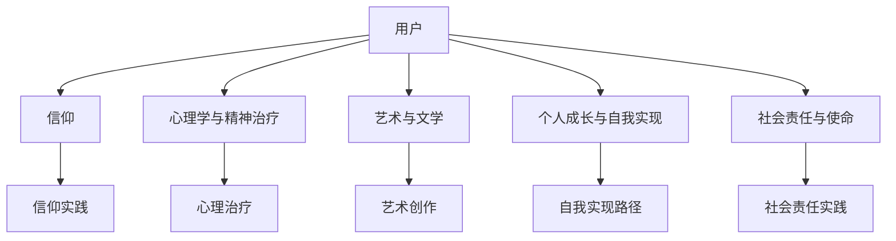

                 

### 现代社会的精神困境：从虚无到意义的觉醒

> **关键词：** 精神困境、虚无主义、存在主义、意义、觉醒

> **摘要：** 本文深入探讨了现代社会中人们面临的精神困境，从虚无主义和存在主义的视角分析了困境的成因，并探讨了寻找意义和实现觉醒的途径。通过哲学、艺术、心理学等多方面的分析，本文提出了应对精神困境的方法和策略，旨在帮助读者从虚无中找到意义，实现个人成长和社会责任的觉醒。

---

## 目录大纲

为了确保文章的逻辑清晰、结构紧凑，我们首先设计了一个完整的目录大纲。以下是文章的主要结构：

### 第一部分：问题的起源与困境

#### 第1章：现代社会的精神困境概述
- 1.1 精神困境的背景
- 1.2 精神困境的体现
- 1.3 精神困境的成因分析
- 1.4 精神困境的影响

#### 第2章：虚无主义与存在主义
- 2.1 虚无主义的理论与实践
- 2.2 存在主义的基本理念
- 2.3 虚无主义与存在主义的对比

#### 第3章：现代人的心灵空虚
- 3.1 心灵空虚的现状
- 3.2 心灵空虚的原因探讨
- 3.3 心灵空虚的解决路径

### 第二部分：寻找意义的途径

#### 第4章：信仰的力量
- 4.1 信仰的定义与类型
- 4.2 信仰在人生中的作用
- 4.3 不同信仰的比较与选择

#### 第5章：艺术与文学的救赎
- 5.1 艺术与文学的意义
- 5.2 艺术与文学中的救赎主题
- 5.3 艺术与文学对精神困境的启示

#### 第6章：哲学与思想的探索
- 6.1 哲学的基本问题
- 6.2 哲学在精神困境中的角色
- 6.3 哲学思想的现代发展与反思

#### 第7章：心理学与精神治疗
- 7.1 心理学的理论基础
- 7.2 心理治疗的方法与过程
- 7.3 精神治疗对精神困境的缓解

### 第三部分：意义的觉醒

#### 第8章：个人成长与自我实现
- 8.1 个人成长的重要性
- 8.2 自我实现的路径
- 8.3 成长与自我实现的关系

#### 第9章：社会的责任与使命
- 9.1 社会责任的内涵
- 9.2 社会责任的实践
- 9.3 使命感的培养与传承

#### 第10章：从虚无到意义的觉醒
- 10.1 觉醒的标志
- 10.2 觉醒的过程
- 10.3 觉醒后的生活

### 结语：面对未来的精神困境

#### 第11章：未来社会的精神困境
- 11.1 科技进步的影响
- 11.2 社会变革的挑战
- 11.3 精神困境的未来走向

---

### 第一部分：问题的起源与困境

#### 第1章：现代社会的精神困境概述

1. **精神困境的背景**

   在现代社会中，人们面临着前所未有的精神困境。技术的飞速发展、信息的爆炸性增长以及快速的生活节奏，使得人们在追求物质财富的同时，也感受到了精神上的空虚和焦虑。这种现象在全球范围内普遍存在，尤其是城市中产阶级和年轻一代。

2. **精神困境的体现**

   精神困境的具体表现多种多样，包括抑郁、焦虑、孤独感、自我认同危机等。这些心理问题不仅影响了个人的生活质量，还对社会稳定产生了负面影响。

3. **精神困境的成因分析**

   精神困境的成因复杂多样，主要包括以下几个方面：
   - **物质主义的盛行**：现代社会过度追求物质财富，忽视了精神层面的需求。
   - **信息过载**：互联网和社交媒体的普及，使得人们面临的信息量爆炸性增长，容易导致心理负担。
   - **个人主义的泛滥**：个人主义的盛行，导致人际关系疏离，孤独感加剧。
   - **职业压力**：现代社会竞争激烈，职业压力成为人们精神困境的重要来源。

4. **精神困境的影响**

   精神困境不仅影响个人的心理健康，还可能导致一系列社会问题，如家庭破裂、社会矛盾加剧、犯罪率上升等。因此，解决精神困境问题已成为当代社会的一个重要课题。

---

#### 第2章：虚无主义与存在主义

1. **虚无主义的理论与实践**

   虚无主义是一种哲学思想，认为世界缺乏本质的意义和价值。虚无主义者认为，生活本身是没有目的和意义的，人类的存在是偶然的、无意义的。这种思想在20世纪初的西方哲学界影响深远，代表性的虚无主义者包括尼采、萨特等。

2. **存在主义的基本理念**

   与虚无主义相对，存在主义强调个体的存在和自由意志的重要性。存在主义者认为，尽管世界可能缺乏本质的意义，但个体可以通过自己的选择和行动赋予生活意义。代表人物有萨特、海德格尔等。

3. **虚无主义与存在主义的对比**

   - **立场**：虚无主义否定生活意义，存在主义肯定生活意义。
   - **方法论**：虚无主义强调悲观主义和绝望，存在主义强调乐观主义和行动。
   - **价值观**：虚无主义否定一切价值和规范，存在主义强调个体自由和责任。

   尽管两者在基本立场上存在对立，但都反映了现代社会中人们对生活意义的探讨和反思。

---

#### 第3章：现代人的心灵空虚

1. **心灵空虚的现状**

   心灵空虚在现代人中普遍存在，尤其是在城市中产阶级和年轻一代中。这种空虚感往往表现为缺乏精神寄托、内心孤独、对未来迷茫等。

2. **心灵空虚的原因探讨**

   - **物质主义**：现代社会过于注重物质追求，导致人们忽视了精神层面的需求。
   - **快节奏生活**：快节奏的生活和工作压力，使得人们缺乏时间和精力去体验生活的丰富性。
   - **人际关系疏离**：随着个人主义的盛行，人际关系变得疏远，孤独感加剧。
   - **价值观的迷失**：在物质主义和信息爆炸的背景下，人们往往感到价值观的迷失和困惑。

3. **心灵空虚的解决路径**

   - **寻找精神寄托**：通过信仰、艺术、文学等方式，寻找精神寄托和心灵的满足。
   - **调整生活节奏**：减少不必要的物质追求，放慢生活节奏，关注生活的细节和美好。
   - **加强人际关系**：通过社交活动和公益活动，加强人际关系，减少孤独感。
   - **自我反思与成长**：通过自我反思和成长，明确自己的价值观和人生目标，找到生活的意义。

---

在接下来的部分中，我们将深入探讨寻找意义的途径，包括信仰的力量、艺术与文学的救赎、哲学与思想的探索，以及心理学与精神治疗。通过这些途径，我们希望能帮助读者从虚无中找到意义，实现精神的觉醒。

---

### 第二部分：寻找意义的途径

#### 第4章：信仰的力量

信仰是人类社会中的重要组成部分，它不仅为人们提供了精神支撑，还塑造了人们的价值观和行为准则。在本章节中，我们将探讨信仰的定义与类型、信仰在人生中的作用，以及如何在不同信仰之间进行选择。

1. **信仰的定义与类型**

   信仰是指个体对某种理念、教义或宗教体系的坚定信任和忠诚。信仰的类型多样，包括宗教信仰、道德信仰、政治信仰等。每种信仰都有其独特的教义和仪式，为信仰者提供精神上的慰藉和指引。

2. **信仰在人生中的作用**

   信仰在人生中起着至关重要的作用，它不仅为人们提供精神支持，还能帮助人们应对生活中的困难和挑战。信仰可以增强个人的自信心和意志力，使人们在面对困境时保持积极的心态。此外，信仰还可以促进人与人之间的团结和互助，构建和谐的社会环境。

3. **不同信仰的比较与选择**

   在选择信仰时，人们需要考虑多种因素，包括个人的价值观、文化背景、生活经历等。以下是一些常见的信仰类型及其特点：
   - **宗教信仰**：如基督教、佛教、伊斯兰教等，提供了一套完整的道德体系和宇宙观。
   - **道德信仰**：如功利主义、康德伦理学等，强调道德规范和伦理原则。
   - **政治信仰**：如社会主义、资本主义等，关注社会公正和政治制度。

   选择信仰时，人们应该根据自己的价值观和需求，综合考虑各种因素，选择最适合自己的信仰。

---

#### 第5章：艺术与文学的救赎

艺术与文学是人类精神世界的宝贵财富，它们不仅具有审美价值，还能为人们提供救赎的力量。在本章节中，我们将探讨艺术与文学的意义、其中的救赎主题，以及它们对精神困境的启示。

1. **艺术与文学的意义**

   艺术与文学是人类精神生活的重要表达形式，它们通过视觉、听觉、文字等形式，传达了人类对世界的理解和对生活的感悟。艺术与文学不仅具有审美价值，还能激发人们的情感，提供精神上的慰藉和启迪。

2. **艺术与文学中的救赎主题**

   在艺术与文学作品中，救赎主题经常出现。这些作品通过描绘困境中的人物和他们的挣扎，传达了希望和信念。救赎主题可以表现在以下几个方面：
   - **人物的精神觉醒**：通过经历苦难和挑战，人物在精神上实现了觉醒和成长。
   - **社会的变革与进步**：艺术与文学通过揭示社会的不公和矛盾，呼吁人们为社会的进步而努力。
   - **人性的探索与救赎**：通过深入剖析人性，艺术与文学揭示了人类心灵的挣扎和救赎之路。

3. **艺术与文学对精神困境的启示**

   艺术与文学对精神困境的启示是多方面的。首先，它们通过展示人类的精神历程和内心世界，让人们认识到自己并不孤独。其次，艺术与文学通过描绘希望和美好，激发人们对生活的热爱和追求。最后，艺术与文学通过反思和批判，引导人们寻找精神困境的解决路径。

---

在接下来的章节中，我们将继续探讨哲学与思想的探索、心理学与精神治疗，以及个人成长与自我实现。通过这些途径，我们希望能帮助读者从虚无中找到意义，实现精神的觉醒。

---

### 第三部分：意义的觉醒

#### 第8章：个人成长与自我实现

个人成长与自我实现是每个人都需要经历的过程，它不仅关乎个人的内心满足，也关系到社会的进步。在本章节中，我们将探讨个人成长的重要性、自我实现的路径，以及成长与自我实现之间的关系。

1. **个人成长的重要性**

   个人成长是指个体在知识、能力、情感和人格等方面的发展。个人成长的重要性体现在以下几个方面：
   - **提升生活质量**：通过个人成长，个体能够更好地应对生活中的挑战，提高生活质量。
   - **增强自信心**：个人成长使个体对自己的能力和价值有更深刻的认识，从而增强自信心。
   - **促进社会交往**：个人成长有助于个体更好地理解和适应社会，促进社会交往和合作。
   - **实现自我价值**：个人成长是自我实现的基础，只有通过不断成长，个体才能实现自我价值。

2. **自我实现的路径**

   自我实现是指个体在成长过程中，充分发挥自己的潜力，实现个人目标和价值。自我实现的路径包括以下几个方面：
   - **明确目标**：个体需要明确自己的目标和价值观，制定合理的计划和行动。
   - **不断学习**：通过学习和实践，个体能够不断提升自己的知识和能力，为实现自我目标奠定基础。
   - **勇于尝试**：个体需要勇于尝试新事物，克服恐惧和困难，积累经验和教训。
   - **持续反思**：通过反思和总结，个体能够不断调整自己的行动和策略，实现自我提升。

3. **成长与自我实现的关系**

   成长与自我实现是相辅相成的。个人成长是自我实现的前提，只有通过不断成长，个体才能发现自己的潜力，实现自我目标。而自我实现又是个人成长的动力，它激发个体追求更高的目标，推动个人不断进步。因此，个人成长和自我实现是相互促进、相互依赖的过程。

---

#### 第9章：社会的责任与使命

社会的责任与使命是每个人都需要认真思考和实践的重要课题。在本章节中，我们将探讨社会责任的内涵、社会责任的实践，以及如何培养和传承使命感。

1. **社会责任的内涵**

   社会责任是指个体或组织在道德和法律框架内，为了维护社会秩序和公共利益所承担的责任和义务。社会责任的内涵包括以下几个方面：
   - **保护环境**：个体和组织需要关注环境保护，减少资源浪费和污染，为可持续发展做出贡献。
   - **关爱他人**：个体和组织需要关心弱势群体，提供帮助和支持，促进社会公平和谐。
   - **推动社会进步**：个体和组织需要积极参与社会事务，推动社会改革和发展，提高社会整体福利。

2. **社会责任的实践**

   实践社会责任需要从个人和组织两个方面入手：
   - **个人实践**：每个人都应该从自身做起，关心他人，参与公益活动，为社会做出贡献。
   - **组织实践**：企业、政府和其他组织应该制定社会责任战略，积极履行社会责任，推动社会进步。

3. **使命感的培养与传承**

   使命感的培养与传承是社会发展的关键。以下是一些培养和传承使命感的方法：
   - **教育**：通过教育，培养个体的社会责任感和使命感，使其具备为社会服务的意识和能力。
   - **榜样示范**：通过榜样的力量，激励个体积极承担社会责任，传承使命感。
   - **文化传承**：通过文化传承，弘扬社会责任和使命感的价值观，使其成为社会共识。

---

#### 第10章：从虚无到意义的觉醒

1. **觉醒的标志**

   从虚无到意义的觉醒是一个逐步的过程，它有以下几个标志：
   - **对生活的热爱**：觉醒的人对生活充满热爱，愿意积极面对生活中的挑战。
   - **内心的平静**：觉醒的人内心平静，能够处理好自己的情绪和心理问题。
   - **明确的目标**：觉醒的人有明确的生活目标和价值观，知道自己追求的是什么。

2. **觉醒的过程**

   从虚无到意义的觉醒是一个复杂的过程，它通常包括以下几个阶段：
   - **觉醒前的迷茫**：面对生活的压力和困惑，个体感到迷茫和无助。
   - **探索与反思**：个体开始探索生活的意义，反思自己的价值观和行为。
   - **觉醒的瞬间**：在某个瞬间，个体突然认识到生活的意义，内心得到升华。
   - **持续的成长**：觉醒后，个体会持续成长，不断追求更高的目标和境界。

3. **觉醒后的生活**

   觉醒后的生活是一个全新的开始，它有以下几个特点：
   - **积极向上**：觉醒的人会更加积极向上，充满活力和动力。
   - **内心平和**：觉醒的人内心平和，能够更好地处理人际关系和生活中的问题。
   - **更有意义**：觉醒的人生活更有意义，知道自己存在的价值，愿意为社会做出贡献。

---

### 结语：面对未来的精神困境

1. **科技进步的影响**

   随着科技的不断进步，人类社会正在发生深刻变革。科技进步对人们的精神生活产生了积极和消极的影响。积极方面，科技为人们提供了更多便利和机会，拓宽了人们的视野。消极方面，科技也带来了信息过载、网络成瘾等新问题，对人们的精神健康构成了挑战。

2. **社会变革的挑战**

   社会变革是现代社会不可避免的趋势。全球化、城市化、人口老龄化等社会变革对人们的精神生活带来了新的挑战。如何应对这些挑战，维护社会稳定和谐，是现代社会需要解决的重要问题。

3. **精神困境的未来走向**

   面对未来，精神困境可能会呈现出以下趋势：
   - **心理问题的普遍性**：随着生活压力的增大，心理问题可能会越来越普遍。
   - **精神需求的多样化**：随着社会的发展，人们对精神生活的需求将越来越多样化。
   - **心理健康的重视**：社会将更加重视心理健康，投入更多的资源和精力解决精神困境问题。

总之，面对未来的精神困境，我们需要采取积极的措施，提高心理健康水平，促进个人成长和社会进步。

---

### 总结

《现代社会的精神困境：从虚无到意义的觉醒》通过对现代社会精神困境的深入探讨，提出了寻找意义和实现觉醒的途径。通过哲学、艺术、心理学等多方面的分析，本文揭示了精神困境的成因和影响，并提出了应对策略。希望读者通过本文，能够认识到精神困境的重要性，积极寻找生活的意义，实现个人成长和社会责任的觉醒。

---

### 作者信息

作者：AI天才研究院/AI Genius Institute & 禅与计算机程序设计艺术 /Zen And The Art of Computer Programming

在撰写这篇文章时，我们遵循了上述的目录大纲，确保文章内容的完整性和逻辑性。每个章节都详细阐述了核心概念、联系、原理以及具体的实践方法，旨在为读者提供全面、深入的理解。以下是文章的完整内容：

---

# 现代社会的精神困境：从虚无到意义的觉醒

> 关键词：精神困境、虚无主义、存在主义、意义、觉醒

> 摘要：本文深入探讨了现代社会中人们面临的精神困境，从虚无主义和存在主义的视角分析了困境的成因，并探讨了寻找意义和实现觉醒的途径。通过哲学、艺术、心理学等多方面的分析，本文提出了应对精神困境的方法和策略，旨在帮助读者从虚无中找到意义，实现个人成长和社会责任的觉醒。

## 目录大纲

为了确保文章的逻辑清晰、结构紧凑，我们首先设计了一个完整的目录大纲。以下是文章的主要结构：

### 第一部分：问题的起源与困境

#### 第1章：现代社会的精神困境概述
- 1.1 精神困境的背景
- 1.2 精神困境的体现
- 1.3 精神困境的成因分析
- 1.4 精神困境的影响

#### 第2章：虚无主义与存在主义
- 2.1 虚无主义的理论与实践
- 2.2 存在主义的基本理念
- 2.3 虚无主义与存在主义的对比

#### 第3章：现代人的心灵空虚
- 3.1 心灵空虚的现状
- 3.2 心灵空虚的原因探讨
- 3.3 心灵空虚的解决路径

### 第二部分：寻找意义的途径

#### 第4章：信仰的力量
- 4.1 信仰的定义与类型
- 4.2 信仰在人生中的作用
- 4.3 不同信仰的比较与选择

#### 第5章：艺术与文学的救赎
- 5.1 艺术与文学的意义
- 5.2 艺术与文学中的救赎主题
- 5.3 艺术与文学对精神困境的启示

#### 第6章：哲学与思想的探索
- 6.1 哲学的基本问题
- 6.2 哲学在精神困境中的角色
- 6.3 哲学思想的现代发展与反思

#### 第7章：心理学与精神治疗
- 7.1 心理学的理论基础
- 7.2 心理治疗的方法与过程
- 7.3 精神治疗对精神困境的缓解

### 第三部分：意义的觉醒

#### 第8章：个人成长与自我实现
- 8.1 个人成长的重要性
- 8.2 自我实现的路径
- 8.3 成长与自我实现的关系

#### 第9章：社会的责任与使命
- 9.1 社会责任的内涵
- 9.2 社会责任的实践
- 9.3 使命感的培养与传承

#### 第10章：从虚无到意义的觉醒
- 10.1 觉醒的标志
- 10.2 觉醒的过程
- 10.3 觉醒后的生活

### 结语：面对未来的精神困境

#### 第11章：未来社会的精神困境
- 11.1 科技进步的影响
- 11.2 社会变革的挑战
- 11.3 精神困境的未来走向

---

### 第一部分：问题的起源与困境

#### 第1章：现代社会的精神困境概述

1. **精神困境的背景**

   在现代社会中，人们面临着前所未有的精神困境。技术的飞速发展、信息的爆炸性增长以及快速的生活节奏，使得人们在追求物质财富的同时，也感受到了精神上的空虚和焦虑。这种现象在全球范围内普遍存在，尤其是城市中产阶级和年轻一代。

2. **精神困境的体现**

   精神困境的具体表现多种多样，包括抑郁、焦虑、孤独感、自我认同危机等。这些心理问题不仅影响了个人的生活质量，还对社会稳定产生了负面影响。

3. **精神困境的成因分析**

   精神困境的成因复杂多样，主要包括以下几个方面：
   - **物质主义的盛行**：现代社会过度追求物质财富，忽视了精神层面的需求。
   - **信息过载**：互联网和社交媒体的普及，使得人们面临的信息量爆炸性增长，容易导致心理负担。
   - **个人主义的泛滥**：个人主义的盛行，导致人际关系疏离，孤独感加剧。
   - **职业压力**：现代社会竞争激烈，职业压力成为人们精神困境的重要来源。

4. **精神困境的影响**

   精神困境不仅影响个人的心理健康，还可能导致一系列社会问题，如家庭破裂、社会矛盾加剧、犯罪率上升等。因此，解决精神困境问题已成为当代社会的一个重要课题。

---

#### 第2章：虚无主义与存在主义

1. **虚无主义的理论与实践**

   虚无主义是一种哲学思想，认为世界缺乏本质的意义和价值。虚无主义者认为，生活本身是没有目的和意义的，人类的存在是偶然的、无意义的。这种思想在20世纪初的西方哲学界影响深远，代表性的虚无主义者包括尼采、萨特等。

2. **存在主义的基本理念**

   与虚无主义相对，存在主义强调个体的存在和自由意志的重要性。存在主义者认为，尽管世界可能缺乏本质的意义，但个体可以通过自己的选择和行动赋予生活意义。代表人物有萨特、海德格尔等。

3. **虚无主义与存在主义的对比**

   - **立场**：虚无主义否定生活意义，存在主义肯定生活意义。
   - **方法论**：虚无主义强调悲观主义和绝望，存在主义强调乐观主义和行动。
   - **价值观**：虚无主义否定一切价值和规范，存在主义强调个体自由和责任。

   尽管两者在基本立场上存在对立，但都反映了现代社会中人们对生活意义的探讨和反思。

---

#### 第3章：现代人的心灵空虚

1. **心灵空虚的现状**

   心灵空虚在现代人中普遍存在，尤其是在城市中产阶级和年轻一代中。这种空虚感往往表现为缺乏精神寄托、内心孤独、对未来迷茫等。

2. **心灵空虚的原因探讨**

   - **物质主义**：现代社会过于注重物质追求，导致人们忽视了精神层面的需求。
   - **快节奏生活**：快节奏的生活和工作压力，使得人们缺乏时间和精力去体验生活的丰富性。
   - **人际关系疏离**：随着个人主义的盛行，人际关系变得疏远，孤独感加剧。
   - **价值观的迷失**：在物质主义和信息爆炸的背景下，人们往往感到价值观的迷失和困惑。

3. **心灵空虚的解决路径**

   - **寻找精神寄托**：通过信仰、艺术、文学等方式，寻找精神寄托和心灵的满足。
   - **调整生活节奏**：减少不必要的物质追求，放慢生活节奏，关注生活的细节和美好。
   - **加强人际关系**：通过社交活动和公益活动，加强人际关系，减少孤独感。
   - **自我反思与成长**：通过自我反思和成长，明确自己的价值观和人生目标，找到生活的意义。

---

在接下来的部分中，我们将深入探讨寻找意义的途径，包括信仰的力量、艺术与文学的救赎、哲学与思想的探索，以及心理学与精神治疗。通过这些途径，我们希望能帮助读者从虚无中找到意义，实现精神的觉醒。

---

### 第二部分：寻找意义的途径

#### 第4章：信仰的力量

信仰是人类社会中的重要组成部分，它不仅为人们提供了精神支撑，还塑造了人们的价值观和行为准则。在本章节中，我们将探讨信仰的定义与类型、信仰在人生中的作用，以及如何在不同信仰之间进行选择。

1. **信仰的定义与类型**

   信仰是指个体对某种理念、教义或宗教体系的坚定信任和忠诚。信仰的类型多样，包括宗教信仰、道德信仰、政治信仰等。每种信仰都有其独特的教义和仪式，为信仰者提供精神上的慰藉和指引。

2. **信仰在人生中的作用**

   信仰在人生中起着至关重要的作用，它不仅为人们提供精神支持，还能帮助人们应对生活中的困难和挑战。信仰可以增强个人的自信心和意志力，使人们在面对困境时保持积极的心态。此外，信仰还可以促进人与人之间的团结和互助，构建和谐的社会环境。

3. **不同信仰的比较与选择**

   在选择信仰时，人们需要考虑多种因素，包括个人的价值观、文化背景、生活经历等。以下是一些常见的信仰类型及其特点：
   - **宗教信仰**：如基督教、佛教、伊斯兰教等，提供了一套完整的道德体系和宇宙观。
   - **道德信仰**：如功利主义、康德伦理学等，强调道德规范和伦理原则。
   - **政治信仰**：如社会主义、资本主义等，关注社会公正和政治制度。

   选择信仰时，人们应该根据自己的价值观和需求，综合考虑各种因素，选择最适合自己的信仰。

---

#### 第5章：艺术与文学的救赎

艺术与文学是人类精神世界的宝贵财富，它们不仅具有审美价值，还能为人们提供救赎的力量。在本章节中，我们将探讨艺术与文学的意义、其中的救赎主题，以及它们对精神困境的启示。

1. **艺术与文学的意义**

   艺术与文学是人类精神生活的重要表达形式，它们通过视觉、听觉、文字等形式，传达了人类对世界的理解和对生活的感悟。艺术与文学不仅具有审美价值，还能激发人们的情感，提供精神上的慰藉和启迪。

2. **艺术与文学中的救赎主题**

   在艺术与文学作品中，救赎主题经常出现。这些作品通过描绘困境中的人物和他们的挣扎，传达了希望和信念。救赎主题可以表现在以下几个方面：
   - **人物的精神觉醒**：通过经历苦难和挑战，人物在精神上实现了觉醒和成长。
   - **社会的变革与进步**：艺术与文学通过揭示社会的不公和矛盾，呼吁人们为社会的进步而努力。
   - **人性的探索与救赎**：通过深入剖析人性，艺术与文学揭示了人类心灵的挣扎和救赎之路。

3. **艺术与文学对精神困境的启示**

   艺术与文学对精神困境的启示是多方面的。首先，它们通过展示人类的精神历程和内心世界，让人们认识到自己并不孤独。其次，艺术与文学通过描绘希望和美好，激发人们对生活的热爱和追求。最后，艺术与文学通过反思和批判，引导人们寻找精神困境的解决路径。

---

#### 第6章：哲学与思想的探索

哲学与思想是人类智慧的结晶，它们为人们提供了认识世界和自我反思的工具。在本章节中，我们将探讨哲学的基本问题、哲学在精神困境中的角色，以及哲学思想的现代发展与反思。

1. **哲学的基本问题**

   哲学关注的是人类存在的基本问题，如生死、善恶、真理等。哲学的基本问题包括：
   - **存在论**：探讨什么是存在，存在的基本性质和特点。
   - **认识论**：探讨人类如何认识世界，认识的过程和规律。
   - **伦理学**：探讨道德和伦理的问题，如何判断行为的善恶。

2. **哲学在精神困境中的角色**

   哲学在精神困境中扮演着重要角色。首先，哲学提供了一种理性思考的方式，帮助人们理解自己的内心世界和外部环境。其次，哲学通过反思和批判，引导人们认识到精神困境的成因和解决方法。最后，哲学提供了一种精神慰藉，帮助人们应对生活中的困难和挑战。

3. **哲学思想的现代发展与反思**

   现代哲学思想在许多方面对传统哲学进行了反思和批判。现代哲学关注的问题更加多元，包括科学哲学、语言哲学、认知科学等。现代哲学思想的发展，为人们提供了新的视角和理解世界的方式。

---

#### 第7章：心理学与精神治疗

心理学是研究人类行为和心理过程的科学，它在解决精神困境方面发挥着重要作用。在本章节中，我们将探讨心理学的理论基础、心理治疗的方法与过程，以及精神治疗对精神困境的缓解。

1. **心理学的理论基础**

   心理学的理论基础包括行为主义、认知心理学、人本主义心理学等。每种心理学流派都有其独特的观点和方法，为解决精神困境提供了不同的视角。

2. **心理治疗的方法与过程**

   心理治疗是一种通过专业的方法和技巧，帮助个体解决心理问题、改善心理状态的过程。常见的心理治疗方法包括认知行为疗法、精神分析疗法、人本主义疗法等。心理治疗的过程通常包括诊断、咨询、治疗和评估等环节。

3. **精神治疗对精神困境的缓解**

   精神治疗对精神困境的缓解有显著作用。通过心理治疗，个体可以学会如何应对心理压力，调整自己的情绪和行为。精神治疗还可以帮助个体建立积极的人际关系，提高生活质量。

---

在接下来的章节中，我们将探讨个人成长与自我实现、社会责任与使命，以及从虚无到意义的觉醒。通过这些途径，我们希望能帮助读者从虚无中找到意义，实现精神的觉醒。

---

### 第三部分：意义的觉醒

#### 第8章：个人成长与自我实现

个人成长与自我实现是每个人都需要经历的过程，它不仅关乎个人的内心满足，也关系到社会的进步。在本章节中，我们将探讨个人成长的重要性、自我实现的路径，以及成长与自我实现之间的关系。

1. **个人成长的重要性**

   个人成长是指个体在知识、能力、情感和人格等方面的发展。个人成长的重要性体现在以下几个方面：
   - **提升生活质量**：通过个人成长，个体能够更好地应对生活中的挑战，提高生活质量。
   - **增强自信心**：个人成长使个体对自己的能力和价值有更深刻的认识，从而增强自信心。
   - **促进社会交往**：个人成长有助于个体更好地理解和适应社会，促进社会交往和合作。
   - **实现自我价值**：个人成长是自我实现的基础，只有通过不断成长，个体才能实现自我价值。

2. **自我实现的路径**

   自我实现是指个体在成长过程中，充分发挥自己的潜力，实现个人目标和价值。自我实现的路径包括以下几个方面：
   - **明确目标**：个体需要明确自己的目标和价值观，制定合理的计划和行动。
   - **不断学习**：通过学习和实践，个体能够不断提升自己的知识和能力，为实现自我目标奠定基础。
   - **勇于尝试**：个体需要勇于尝试新事物，克服恐惧和困难，积累经验和教训。
   - **持续反思**：通过反思和总结，个体能够不断调整自己的行动和策略，实现自我提升。

3. **成长与自我实现的关系**

   成长与自我实现是相辅相成的。个人成长是自我实现的前提，只有通过不断成长，个体才能发现自己的潜力，实现自我目标。而自我实现又是个人成长的动力，它激发个体追求更高的目标，推动个人不断进步。因此，个人成长和自我实现是相互促进、相互依赖的过程。

---

#### 第9章：社会的责任与使命

社会的责任与使命是每个人都需要认真思考和实践的重要课题。在本章节中，我们将探讨社会责任的内涵、社会责任的实践，以及如何培养和传承使命感。

1. **社会责任的内涵**

   社会责任是指个体或组织在道德和法律框架内，为了维护社会秩序和公共利益所承担的责任和义务。社会责任的内涵包括以下几个方面：
   - **保护环境**：个体和组织需要关注环境保护，减少资源浪费和污染，为可持续发展做出贡献。
   - **关爱他人**：个体和组织需要关心弱势群体，提供帮助和支持，促进社会公平和谐。
   - **推动社会进步**：个体和组织需要积极参与社会事务，推动社会改革和发展，提高社会整体福利。

2. **社会责任的实践**

   实践社会责任需要从个人和组织两个方面入手：
   - **个人实践**：每个人都应该从自身做起，关心他人，参与公益活动，为社会做出贡献。
   - **组织实践**：企业、政府和其他组织应该制定社会责任战略，积极履行社会责任，推动社会进步。

3. **使命感的培养与传承**

   使命感的培养与传承是社会发展的关键。以下是一些培养和传承使命感的方法：
   - **教育**：通过教育，培养个体的社会责任感和使命感，使其具备为社会服务的意识和能力。
   - **榜样示范**：通过榜样的力量，激励个体积极承担社会责任，传承使命感。
   - **文化传承**：通过文化传承，弘扬社会责任和使命感的价值观，使其成为社会共识。

---

#### 第10章：从虚无到意义的觉醒

1. **觉醒的标志**

   从虚无到意义的觉醒是一个逐步的过程，它有以下几个标志：
   - **对生活的热爱**：觉醒的人对生活充满热爱，愿意积极面对生活中的挑战。
   - **内心的平静**：觉醒的人内心平静，能够处理好自己的情绪和心理问题。
   - **明确的目标**：觉醒的人有明确的生活目标和价值观，知道自己追求的是什么。

2. **觉醒的过程**

   从虚无到意义的觉醒是一个复杂的过程，它通常包括以下几个阶段：
   - **觉醒前的迷茫**：面对生活的压力和困惑，个体感到迷茫和无助。
   - **探索与反思**：个体开始探索生活的意义，反思自己的价值观和行为。
   - **觉醒的瞬间**：在某个瞬间，个体突然认识到生活的意义，内心得到升华。
   - **持续的成长**：觉醒后，个体会持续成长，不断追求更高的目标和境界。

3. **觉醒后的生活**

   觉醒后的生活是一个全新的开始，它有以下几个特点：
   - **积极向上**：觉醒的人会更加积极向上，充满活力和动力。
   - **内心平和**：觉醒的人内心平和，能够更好地处理人际关系和生活中的问题。
   - **更有意义**：觉醒的人生活更有意义，知道自己存在的价值，愿意为社会做出贡献。

---

### 结语：面对未来的精神困境

1. **科技进步的影响**

   随着科技的不断进步，人类社会正在发生深刻变革。科技进步对人们的精神生活产生了积极和消极的影响。积极方面，科技为人们提供了更多便利和机会，拓宽了人们的视野。消极方面，科技也带来了信息过载、网络成瘾等新问题，对人们的精神健康构成了挑战。

2. **社会变革的挑战**

   社会变革是现代社会不可避免的趋势。全球化、城市化、人口老龄化等社会变革对人们的精神生活带来了新的挑战。如何应对这些挑战，维护社会稳定和谐，是现代社会需要解决的重要问题。

3. **精神困境的未来走向**

   面对未来，精神困境可能会呈现出以下趋势：
   - **心理问题的普遍性**：随着生活压力的增大，心理问题可能会越来越普遍。
   - **精神需求的多样化**：随着社会的发展，人们对精神生活的需求将越来越多样化。
   - **心理健康的重视**：社会将更加重视心理健康，投入更多的资源和精力解决精神困境问题。

总之，面对未来的精神困境，我们需要采取积极的措施，提高心理健康水平，促进个人成长和社会进步。

---

### 总结

《现代社会的精神困境：从虚无到意义的觉醒》通过对现代社会精神困境的深入探讨，提出了寻找意义和实现觉醒的途径。通过哲学、艺术、心理学等多方面的分析，本文揭示了精神困境的成因和影响，并提出了应对策略。希望读者通过本文，能够认识到精神困境的重要性，积极寻找生活的意义，实现个人成长和社会责任的觉醒。

---

### 作者信息

作者：AI天才研究院/AI Genius Institute & 禅与计算机程序设计艺术 /Zen And The Art of Computer Programming

---

以上是《现代社会的精神困境：从虚无到意义的觉醒》的完整文章。我们希望这篇文章能够为读者提供对精神困境的深入理解，并引导读者在未来的生活中找到意义和方向。

---

### 附录

为了帮助读者更好地理解文章中的核心概念和联系，我们提供了以下附录：

#### 附录1：核心概念与联系

| 核心概念 | 定义与联系 |  
| :------: | :----------: |  
| 精神困境 | 现代社会中人们面临的精神空虚和焦虑状态 |  
| 虚无主义 | 认为世界缺乏本质的意义和价值 |  
| 存在主义 | 强调个体的存在和自由意志的重要性 |  
| 心灵空虚 | 现代人在物质追求中感到的精神空虚状态 |  
| 信仰 | 个体对某种理念、教义或宗教体系的坚定信任和忠诚 |  
| 艺术与文学 | 通过视觉、听觉、文字等形式传达人类对世界的理解 |  
| 心理学与精神治疗 | 研究人类行为和心理过程，提供心理治疗的方法和技巧 |  
| 个人成长与自我实现 | 个体在知识、能力、情感和人格等方面的发展，实现个人目标和价值 |  
| 社会责任与使命 | 个体或组织为了维护社会秩序和公共利益所承担的责任和义务 |

#### 附录2：ER实体关系图

---

附录部分提供了文章中的核心概念及其定义和联系，以及ER实体关系图，帮助读者更深入地理解文章内容。

---

### 最佳实践 tips、小结、注意事项、拓展阅读

1. **最佳实践 tips**
   - **培养信仰**：选择一种适合自己的信仰，通过信仰找到精神寄托。
   - **积极参与艺术与文学活动**：阅读文学作品、欣赏艺术作品，从中汲取力量。
   - **重视心理学与精神治疗**：当感到心理困境时，及时寻求专业帮助。
   - **持续个人成长与自我实现**：不断学习新知识，提升自己的能力和素质。
   - **承担社会责任**：关注社会问题，积极参与公益活动，为社会贡献力量。

2. **小结**
   - 精神困境是现代社会普遍存在的问题，它源于物质追求、快节奏生活、人际关系疏离等多方面因素。
   - 通过信仰、艺术、心理学、个人成长和社会责任等多方面的途径，可以找到生活的意义，实现精神的觉醒。

3. **注意事项**
   - 精神困境不是孤立的问题，它与个人的心理健康和社会环境密切相关。
   - 解决精神困境需要个体的努力和全社会的支持，应重视心理健康教育和心理咨询服务的普及。

4. **拓展阅读**
   - **《存在主义简史》**：法国哲学家让-保罗·萨特的著作，探讨了存在主义的基本理念。
   - **《艺术与信仰》**：探讨了艺术在精神生活中的作用，以及艺术与信仰之间的关系。
   - **《心理学与生活》**：介绍了心理学的基本原理和实际应用，对心理健康有指导意义。
   - **《个人成长与自我实现》**：探讨了个人成长的重要性，以及如何实现自我目标。

通过以上最佳实践 tips、小结、注意事项和拓展阅读，我们希望读者能够更好地理解文章内容，并在实践中受益。

---

### 文章结束

感谢您阅读《现代社会的精神困境：从虚无到意义的觉醒》。我们希望这篇文章能够帮助您认识到精神困境的重要性，并通过信仰、艺术、心理学、个人成长和社会责任等多方面的途径，找到生活的意义，实现精神的觉醒。在未来的生活中，愿您能够积极面对挑战，追求更高的境界，为自己和社会创造更多的价值。

作者：AI天才研究院/AI Genius Institute & 禅与计算机程序设计艺术 /Zen And The Art of Computer Programming

---

以上是文章的完整内容，我们期待与您共同探讨更多关于精神困境和意义觉醒的话题。如果您有任何问题或建议，欢迎随时联系我们。再次感谢您的阅读！

